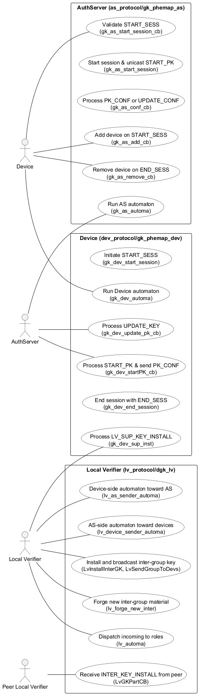
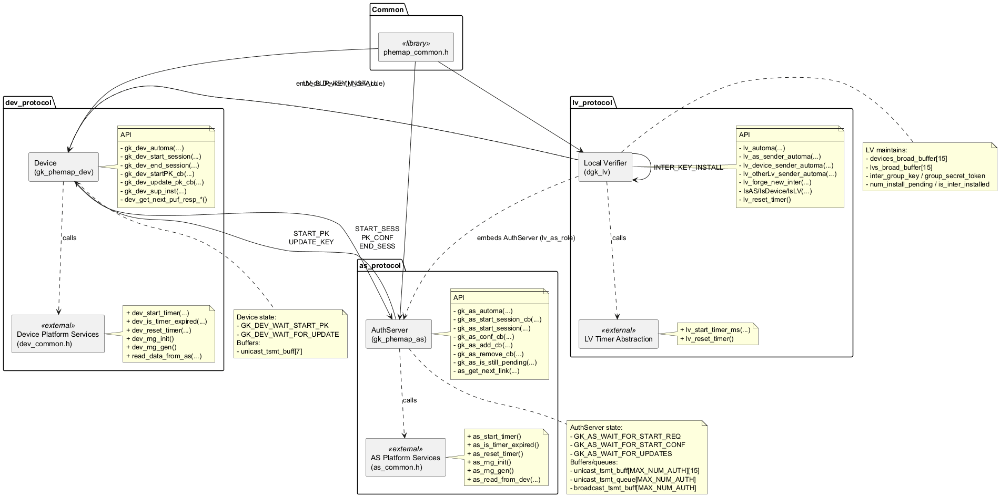

 

% 1 — System Overview
# SECTION 1 — System Overview

This section introduces the purpose, scope, and main capabilities of the codebase. The description is grounded in the actual source files and reflects the concrete implementation choices present in the repository. It is written to be understandable by both technical and non-technical stakeholders and to support validation by the development team familiar with the code.

## Purpose and Scope

The repository implements a lightweight protocol engine for group key establishment and maintenance among three runtime roles: an AuthServer, Devices, and a Local Verifier. The protocol uses PUF-derived link values and simple keyed aggregation to install, update, and revoke device keys, and to derive and distribute an inter-group key across Local Verifiers and Devices. The scope is the full protocol logic for these roles, including state machines, message parsing/forging, and buffer management for outbound messages. The code intentionally leaves platform integration concerns (transport I/O, timers, entropy sources) to the embedding application through weak-linkage hooks.

Concretely, the code provides:
- An AuthServer finite-state-machine (FSM) that authenticates requestors from an allow-list, generates per-device private keys and a shared secret token, confirms installations, and handles add/remove operations by issuing unicast/broadcast updates.
- A Device FSM that initiates sessions, verifies AuthServer responses, installs keys, applies updates, and accepts Local Verifier–supplied inter-group keys used for supplementary operations.
- A Local Verifier that composes the two roles: it behaves as a Device toward an upstream AuthServer and as an AuthServer toward its own devices, while also participating in an inter-LV key distribution flow. It derives, verifies, and disseminates an “inter_group_key” and accompanying secret token to peer Local Verifiers and to the devices under its authority.

The implementation is protocol- and buffer-centric; it does not perform any I/O. It writes outgoing wire images into fixed-size buffers that the integrator must transmit and feeds incoming byte arrays into the FSMs for processing.

## Repository Structure and Role Mapping

The codebase is organized into three protocol modules and a common header. Each module corresponds to a runtime role with clear responsibilities and APIs.

| Directory | Files | Main types and responsibilities |
|---|---|---|
| as_protocol | gk_phemap_as.h, gk_phemap_as.cc, as_common.h | Type AuthServer and Gk_AS_State; FSM for session start, confirmation, updates, add/remove; per-device queueing into unicast_tsmt_buff and broadcast_tsmt_buff; platform hooks for timers and RNG in as_common.h. |
| dev_protocol | gk_phemap_dev.h, gk_phemap_dev.cc, dev_common.h | Type Device and GK_Dev_State; FSM for initiating sessions, installing and updating keys, receiving LV-supplied inter keys; platform hooks for timers and RNG in dev_common.h. |
| lv_protocol | dgk_lv.h, dgk_lv.cc | Type local_verifier_t; orchestrates both a Device role (upstream) and an AuthServer role (downstream); derives and distributes inter-group keys to other LVs and devices; dispatches messages based on sender identity. |
| root | phemap_common.h | Shared types and constants: message enums, return codes, ID and big-endian encoding/decoding, wire-size macros. |

This code compiles into a protocol library that can be embedded in networked or embedded systems. It expects the host to provide transport, timing, and randomness through the declared weak functions.

## Protocol Overview and Message Taxonomy

The protocol exchanges compact, fixed-length messages using big-endian serialization macros defined in phemap_common.h. Message types are enumerated in phemap_mex_t and the following types are actively used across the implementation.

| Message | Producer | Consumer | Purpose (as implemented) |
|---|---|---|---|
| START_SESS | Device | AuthServer | Initiates a session; proves liveness using a PUF-derived link value. Also used to request add during updates. |
| START_PK | AuthServer | Device | Delivers obfuscated key material and secret token to the device; authenticated with a keyed signature. |
| PK_CONF | Device | AuthServer | Confirms installation of the delivered private key and secret token. |
| UPDATE_KEY | AuthServer | Device | Updates private key and secret token for members after add/remove events; authenticated with a keyed signature. |
| END_SESS | Device | AuthServer | Requests removal (revocation) from the group; AuthServer responds with UPDATE_KEY to remaining members. |
| INTER_KEY_INSTALL | Local Verifier | Local Verifier | Distributes inter-group key material and secret token among LVs; authenticated using the LV’s device-role secret token. |
| LV_SUP_KEY_INSTALL | Local Verifier | Device | Distributes inter-group key material and secret token from the LV to its devices; authenticated using the LV’s AS-role secret token. |

The enums INSTALL_SEC, SEC_CONF, and UPDATE_CONF exist in phemap_mex_t but are not exercised by the current Device and LV flows; the AuthServer is prepared to accept UPDATE_CONF in gk_as_conf_cb, although the Device code only emits PK_CONF.

All message layouts are constructed from the same primitives. The repository uses big-endian encoding for 16-bit identifiers and 32-bit puf_resp_t/private_key_t values. Typical on-wire sizes are 7 bytes for simple control (1 + 2 + 4) and 15 bytes for authenticated key-bearing messages (1 + 2 + 4 + 4 + 4), as reflected by memcpy() lengths across the code.

## Runtime Roles and Responsibilities

The AuthServer, defined in gk_phemap_as.h and implemented in gk_phemap_as.cc, maintains an allow-list of devices (auth_devs and num_auth_devs) and tracks group membership (group_members and num_part). It manages a per-session nonce (session_nonce), a group-level private key (private_key), and a secret token (secret_token). On receiving a START_SESS, it validates the requestor against its allow-list and a link value obtained via as_get_next_link. It then constructs per-device START_PK messages with obfuscated key shares and signatures, enqueues them into unicast_tsmt_buff, and sets pending state for confirmations. Upon PK_CONF, it updates membership and transitions into an update state when at least one member is installed. It processes END_SESS to revoke devices and START_SESS to add new devices while issuing UPDATE_KEY messages to the current group. Its outward messages are buffered; the environment is responsible for transmission. It relies on weak RNG and timer hooks declared in as_common.h.

The Device, defined in gk_phemap_dev.h and implemented in gk_phemap_dev.cc, initiates sessions by sending START_SESS and awaits START_PK. It verifies signatures using a per-link keyed accumulation, derives its private key (pk) and secret_token, and confirms via PK_CONF. It processes UPDATE_KEY to evolve its keying material and LV_SUP_KEY_INSTALL to accept inter-group parameters from a Local Verifier. Device outbound messages are placed in unicast_tsmt_buff, and platform hooks for timing and randomness are declared in dev_common.h.

The Local Verifier, defined in dgk_lv.h and implemented in dgk_lv.cc, composes both roles in a single structure local_verifier_t. It processes messages through lv_automa, which classifies the sender based on the encoded ID and dispatches to gk_dev_automa (as a device toward its upstream AuthServer), gk_as_automa (as an AuthServer toward its downstream devices), or LvGKPartCB (for inter-LV exchanges). When both its device-role and AS-role installations are complete, it derives and disseminates an inter_group_key and group_secret_token. It broadcasts INTER_KEY_INSTALL to peer LVs and LV_SUP_KEY_INSTALL to its devices, authenticating messages with keyed signatures derived from the corresponding role’s secret token. It further supports rekeying via lv_forge_new_inter, emitting updated artifacts to both peers and devices.

Each role employs a small FSM:
- The AuthServer moves among GK_AS_WAIT_FOR_START_REQ, GK_AS_WAIT_FOR_START_CONF, and GK_AS_WAIT_FOR_UPDATES, validating inputs and enforcing sequencing.
- The Device alternates between GK_DEV_WAIT_START_PK and GK_DEV_WAIT_FOR_UPDATE, constrained to accept only context-appropriate messages.
- The Local Verifier orchestrates both FSMs and only derives inter keys when both upstream and downstream installations are in place.

## Implementation Boundaries and Integration Hooks

The protocol engine is transport-agnostic. It exposes functions that accept raw byte arrays and packet lengths and returns status codes (phemap_ret_t). Outgoing messages are placed in pre-allocated buffers in the role structures:
- AuthServer: per-device unicast_tsmt_buff[device_id][15] and a broadcast_tsmt_buff sized to hold a 15-byte message, together with unicast_tsmt_queue and unicast_tsmt_count fields to help the integrator poll and flush transmissions.
- Device: unicast_tsmt_buff[7] for control messages and handling of inbound 15-byte messages for key material and LV updates.
- Local Verifier: devices_broad_buffer[15] and lvs_broad_buffer[15] for broadcasting to devices and peer LVs respectively, with occupancy flags.

Platform-dependent functions are declared in headers and, where provided, default to weak stubs to facilitate porting:
- AuthServer side: as_start_timer, as_is_timer_expired, as_reset_timer, as_rng_init, as_rng_gen, and as_read_from_dev declarations in as_common.h (as_read_from_dev is not invoked in the current source).
- Device side: dev_start_timer, dev_is_timer_expired, dev_reset_timer, dev_rng_init, dev_rng_gen declarations in dev_common.h, with weak defaults for dev_start_timer and dev_is_timer_expired defined in gk_phemap_dev.cc.
- Local Verifier side: lv_start_timer_ms and lv_reset_timer declared in dgk_lv.h; lv_reset_timer is defined as an empty function in dgk_lv.cc.

These hooks must be implemented by the host application to provide real timers and randomness and to connect the buffers to actual I/O.

## Key Features Evidenced in Code

The implementation offers a deterministic, low-overhead wire format with big-endian encoding macros and fixed-length messages, enabling simple, allocation-free operation. All cryptographic operations are expressed as XOR-based transformations over 32-bit words and verified via a keyed accumulation function (keyed_sign variants implemented in each module). The AuthServer supports up to MAX_NUM_AUTH devices (3,000) with per-device tracking arrays for keys, membership, and pending confirmations. The Local Verifier’s role composition allows it to gate inter-LV key distribution on the successful installation of both its upstream device-role and downstream AS-role keys, ensuring consistent state before group-wide dissemination. Helper functions such as IsAS, IsDevice, and IsLV provide ID-based dispatch for lv_automa, while link value retrieval helpers (as_get_next_link and LvGetNextCarnetLink) currently return fixed test values, signaling integration points for real PUF link sources.

The code consistently defends against malformed packets and out-of-context messages by checking type bytes, minimum lengths, and expected IDs/links before state transitions. On validation failures, all FSMs return REINIT and reset to their initial wait states, which is observable in the return codes and state updates.

Overall, the repository constitutes the core protocol logic for a PUF-assisted group keying system with explicit roles, wire formats, and stateful handlers, ready to be integrated into an embedded or networked environment that supplies transport, timing, and entropy.

% 2 — Architectural Context
## 2. Architectural Context

This section describes the system’s external context as evidenced by the codebase. It identifies external services and platform hooks the code expects, the public APIs and message interfaces that the system exposes, the underlying data sources that drive protocol state, and the actors that participate in the protocol flows. The descriptions are grounded strictly in the provided source code to enable validation by the development team.

### External Systems

| External system or service | How it appears in code | Purpose and integration notes |
|---|---|---|
| Platform timer service (AS role) | as_start_timer(), as_is_timer_expired(), as_reset_timer() declared in as_protocol/as_common.h and weakly defined in as_protocol/gk_phemap_as.cc | Provides timing for AuthServer state transitions (e.g., after sending START_PK). Must be implemented by the integrator; weak defaults are no-ops or always-expired. |
| Platform timer service (Device role) | dev_start_timer(), dev_is_timer_expired(), dev_reset_timer() declared in dev_protocol/dev_common.h and weakly defined in dev_protocol/gk_phemap_dev.cc | Provides device-side timing. Must be implemented by the integrator; weak defaults are placeholders. |
| Platform timer service (LV role) | lv_start_timer_ms(), lv_reset_timer() declared weak in lv_protocol/dgk_lv.h; lv_reset_timer() has an empty definition in lv_protocol/dgk_lv.cc | Provides timing for Local Verifier operations around inter-group key installation. Must be implemented by the integrator. |
| Entropy/RNG provider (AS role) | as_rng_init(), as_rng_gen() declared in as_protocol/as_common.h; weak definitions in as_protocol/gk_phemap_as.cc | Supplies session nonces and secret tokens on the AS side. Must be replaced with a real entropy source. |
| Entropy/RNG provider (Device role) | dev_rng_init(), dev_rng_gen() declared in dev_protocol/dev_common.h | RNG hooks for devices; no definitions in the provided code, so integrator must supply them if used. |
| Transport I/O between AS and devices | as_read_from_dev() declared in as_protocol/as_common.h; read_data_from_as() declared in dev_protocol/dev_common.h | Abstraction points for receiving data across the AS–Device link. Not implemented here; integrator must map these to the actual transport. |
| Transmission buffers (to be sent by platform) | AuthServer.unicast_tsmt_buff[...][15], AuthServer.broadcast_tsmt_buff[...], Device.unicast_tsmt_buff[7], local_verifier_t.devices_broad_buffer[15], local_verifier_t.lvs_broad_buffer[15] | Code writes outbound frames into these buffers and sets corresponding “is_present/occupied” flags and queues. The platform/driver must read and transmit them on the physical/logical link. |
| Standard C library | <stdio.h>, <string.h>, <assert.h>, <math.h>, <stdlib.h> | Used for debugging, assertions, memory operations, and math (ceil). No nonstandard dependencies are present. |

### APIs / Interfaces

| API/Interface | Location | Signature (summary) | Purpose and notes |
|---|---|---|---|
| gk_as_start_session_cb | as_protocol/gk_phemap_as.h | phemap_ret_t gk_as_start_session_cb(AuthServer*, uint8_t* rcvd_start, uint8_t pkt_len) | Validates a START_SESS request from a device and triggers session start if the requester is authenticated and link proof matches. |
| gk_as_start_session | as_protocol/gk_phemap_as.h | phemap_ret_t gk_as_start_session(AuthServer*) | Builds and enqueues START_PK unicast messages for all authenticated devices, deriving per-device partial keys and signatures. |
| gk_as_conf_cb | as_protocol/gk_phemap_as.h | phemap_ret_t gk_as_conf_cb(AuthServer*, uint8_t* rcvd_conf, uint8_t pkt_len) | Processes PK_CONF/UPDATE_CONF confirmations, updates group membership and state, and signals INSTALL_OK/UPDATE_OK when conditions are met. |
| gk_as_add_cb | as_protocol/gk_phemap_as.h | phemap_ret_t gk_as_add_cb(AuthServer*, const uint8_t* rcvd_pkt, uint8_t pkt_len) | Adds a device during updates: rotates session nonce, updates AS private_key and secret_token, broadcasts a group update, and unicasts START_PK to the joining device. |
| gk_as_remove_cb | as_protocol/gk_phemap_as.h | phemap_ret_t gk_as_remove_cb(AuthServer*, uint8_t* rcvd_pkt, uint8_t pkt_len) | Removes a device: rotates session nonce/secret, recomputes update material, and unicasts UPDATE_KEY to remaining members. |
| gk_as_is_still_pending | as_protocol/gk_phemap_as.h | uint8_t gk_as_is_still_pending(const AuthServer*) | Returns whether there are pending confirmations. |
| gk_as_automa | as_protocol/gk_phemap_as.h | phemap_ret_t gk_as_automa(AuthServer*, uint8_t* pPkt, uint8_t pktLen) | AS state machine dispatcher for incoming messages (PK_CONF, START_SESS, END_SESS). |
| as_get_next_link | as_protocol/gk_phemap_as.h | puf_resp_t as_get_next_link(phemap_id_t) | Retrieves the next PUF-based link value for a device (stubbed to 0xef0000ac in gk_phemap_as.cc). |
| as_start_timer / as_is_timer_expired / as_reset_timer | as_protocol/as_common.h | void as_start_timer(); uint8_t as_is_timer_expired(); void as_reset_timer(); | AS timer hooks (weak defaults). |
| as_rng_init / as_rng_gen | as_protocol/as_common.h | void as_rng_init(); uint32_t as_rng_gen(); | AS RNG hooks (weak defaults return 0x00cafe00). |
| as_read_from_dev | as_protocol/as_common.h | void as_read_from_dev(phemap_id_t id, uint8_t* buff, uint32_t* nBytes) | Platform I/O hook to read from a device (no definition provided). |
| gk_dev_start_session | dev_protocol/gk_phemap_dev.h | void gk_dev_start_session(Device*) | Device sends START_SESS to AS; writes a 7-byte frame into unicast_tsmt_buff. |
| gk_dev_end_session | dev_protocol/gk_phemap_dev.h | void gk_dev_end_session(Device*) | Device sends END_SESS to AS; writes a 7-byte frame into unicast_tsmt_buff. |
| gk_dev_startPK_cb | dev_protocol/gk_phemap_dev.h | phemap_ret_t gk_dev_startPK_cb(Device*, const uint8_t* resp, uint32_t len) | Installs pk and secret_token upon START_PK; authenticates AS via keyed MAC. Sends PK_CONF on success. |
| gk_dev_update_pk_cb | dev_protocol/gk_phemap_dev.h | phemap_ret_t gk_dev_update_pk_cb(Device*, const uint8_t* update, uint32_t len) | Applies UPDATE_KEY; authenticates via keyed MAC. |
| gk_dev_sup_inst | dev_protocol/gk_phemap_dev.h | phemap_ret_t gk_dev_sup_inst(Device*, const uint8_t* rcvd, uint8_t len) | Processes LV_SUP_KEY_INSTALL from LV; installs inter_group_key and inter_group_tok after signature check. |
| gk_dev_automa | dev_protocol/gk_phemap_dev.h | phemap_ret_t gk_dev_automa(Device*, uint8_t* pPkt, uint32_t pktLen) | Device state machine dispatcher (START_PK, UPDATE_KEY, LV_SUP_KEY_INSTALL). |
| dev_start_timer / dev_is_timer_expired / dev_reset_timer | dev_protocol/dev_common.h | void dev_start_timer(phemap_id_t); uint8_t dev_is_timer_expired(phemap_id_t); void dev_reset_timer(phemap_id_t); | Device timer hooks (weak defaults provided; integrator must implement). |
| dev_rng_init / dev_rng_gen | dev_protocol/dev_common.h | void dev_rng_init(); uint32_t dev_rng_gen(); | Device RNG hooks (declarations only). |
| read_data_from_as | dev_protocol/dev_common.h | void read_data_from_as(phemap_id_t id, uint8_t* buff, uint32_t* size) | Platform I/O hook to read from AS (no definition provided). |
| dev_get_next_puf_resp_u8 / dev_get_next_puf_resp | dev_protocol/gk_phemap_dev.h | void dev_get_next_puf_resp_u8(uint8_t*); puf_resp_t dev_get_next_puf_resp(); | Device-side PUF link accessors (return 0xef0000ac in the provided stubs). |
| lv_automa | lv_protocol/dgk_lv.h | phemap_ret_t lv_automa(local_verifier_t*, uint8_t* rcvd, uint32_t size) | LV dispatcher that routes frames to AS, Device, or peer-LV handlers based on sender id. |
| lv_as_sender_automa | lv_protocol/dgk_lv.h | phemap_ret_t lv_as_sender_automa(local_verifier_t*, uint8_t* rcvd, uint32_t size) | Passes frames to LV’s Device role; on INSTALL_OK and AS pk installed, triggers inter-key installation. |
| lv_device_sender_automa | lv_protocol/dgk_lv.h | phemap_ret_t lv_device_sender_automa(local_verifier_t*, uint8_t* rcvd, uint32_t size) | Passes frames to LV’s AS role; on INSTALL_OK and device pk installed, triggers inter-key installation. |
| lv_otherLv_sender_automa | lv_protocol/dgk_lv.h | phemap_ret_t lv_otherLv_sender_automa(local_verifier_t*, uint8_t* rcvd, uint32_t size) | Processes INTER_KEY_INSTALL from other LVs; updates inter-group state and forwards to devices. |
| lv_forge_new_inter | lv_protocol/dgk_lv.h | void lv_forge_new_inter(local_verifier_t*, private_key_t old_Kl) | Locally rotates inter-group key and secret token; produces LV_SUP_KEY_INSTALL and INTER_KEY_INSTALL frames. |
| IsAS / IsDevice / IsLV | lv_protocol/dgk_lv.h | uint8_t IsAS(const local_verifier_t*, phemap_id_t); uint8_t IsDevice(...); uint8_t IsLV(...); | Identity classification helpers using configured ids. |
| lv_start_timer_ms / lv_reset_timer | lv_protocol/dgk_lv.h | void lv_start_timer_ms(uint32_t) (weak); void lv_reset_timer() (weak) | LV timer hooks for inter-key procedures. |
| Protocol message types | phemap_common.h | enum phemap_mex_t { START_SESS, START_PK, PK_CONF, END_SESS, UPDATE_KEY, UPDATE_CONF, INSTALL_SEC, SEC_CONF, INTER_KEY_INSTALL, LV_SUP_KEY_INSTALL } | Complete list of on-wire message types supported by the code. |
| Protocol return codes | phemap_common.h | enum phemap_ret_t { OK, REINIT, CHAIN_EXHAUSTED, SYNC_AUTH_FAILED, TIMEOUT_SYNCB, TIMEOUT_SYNC_C, AUTH_FAILED, TIMEOUT_AUTH_B, CONN_WAIT, ENROLL_FAILED, UPDATE_OK, INSTALL_OK } | Complete set of return codes used across automata and callbacks. |
| Encoding/decoding macros | phemap_common.h | U8_TO_PUF_BE, PUF_TO_U8_BE, PHEMAP_ID_TO_U8_BE, U8_TO_PHEMAP_ID_BE | Big-endian serialization for ids and 32-bit fields. |

Notes on message sizing from code: Device-to-AS unicast frames are 7 bytes (1 + 2 + 4). AS, LV frames use 15-byte buffers (1 + 2 + 12) corresponding to three 32-bit puf/private_key fields plus header.

### Data Sources

| Data source | How it is obtained | Where it is used |
|---|---|---|
| PUF/link responses (AS side) | as_get_next_link(phemap_id_t) returns 0xef0000ac in stub | Derives sr_key per device, link proofs for authentication, and keyed signatures for AS messages. |
| PUF/link responses (Device side) | dev_get_next_puf_resp()/dev_get_next_puf_resp_u8(), returning 0xef0000ac in stub | Generates device link proofs, noise values for pk/secret_token derivations, and authentication keys for MAC verification. |
| Random numbers (AS) | as_rng_gen() (weak default returns 0x00cafe00) | Session nonces (session_nonce), secret tokens (secret_token), inter-group seeds in LV flows. |
| Random numbers (Device) | dev_rng_gen() (declared) | Intended for device-side randomness; not directly used in provided code paths. |
| Configured identities | AuthServer.auth_devs[], AuthServer.num_auth_devs, local_verifier_t.list_of_lv[], local_verifier_t.num_lv | Define the set of authenticated devices and peer LVs; drive routing and access checks. |
| Incoming frames | pPkt/rcvd buffers passed to gk_as_automa(), gk_dev_automa(), lv_automa() | External transport delivers these to the automata for state transitions and key management. |

All PUF and RNG sources are currently stubbed; production integration must replace them with secure, hardware-backed or cryptographically strong sources as appropriate.

### Users / Actors

| Actor | Representation in code | Role in interactions |
|---|---|---|
| Auth Server (AS) | struct AuthServer in as_protocol/gk_phemap_as.h | Manages authenticated devices, derives and distributes group keys (pk), handles join (START_SESS) and leave (END_SESS), and issues updates (UPDATE_KEY). Produces unicast and broadcast frames via its transmit buffers. |
| Device | struct Device in dev_protocol/gk_phemap_dev.h | Initiates sessions (START_SESS), installs pk and secret_token from START_PK, applies updates (UPDATE_KEY), and accepts LV supplemental keys (LV_SUP_KEY_INSTALL). Produces unicast frames via its transmit buffer. |
| Local Verifier (LV) | struct local_verifier_t in lv_protocol/dgk_lv.h | Combines an AS role and a Device role; coordinates inter-group key installation among LVs (INTER_KEY_INSTALL) and distributes supplemental keys to devices (LV_SUP_KEY_INSTALL). |
| Other Local Verifiers (peers) | Identified via local_verifier_t.list_of_lv[] | Exchange INTER_KEY_INSTALL messages to converge on an inter-group key and group secret token. |
| Authenticated device set | AuthServer.auth_devs[], AuthServer.group_members[] | The population over which AS and LV distribute keys; membership changes drive add/remove flows. |

This context reflects only what is present in the code. No external systems or actors beyond those listed above are implied.

% 2.1 — Architectural Context – Use Case Diagram
# SECTION 2.1 — Architectural Context – Use Case Diagram

This section describes, at the architectural context level, the externally visible interactions among the three protocol roles implemented in the codebase: AuthServer, Device, and Local Verifier (LV). The diagram focuses on message-based use cases that are explicitly implemented by the source code, mapping each interaction to the concrete handlers and automata in the repository. The intent is to make validation straightforward for developers by aligning use case names with function and message identifiers as implemented.

Figure 2.1 shows the complete set of use cases derived from the source code, partitioned by role implementation. It captures only message types and flows that exist in the code; no hypothetical actors, flows, or features are added.

Figure: section-2-1-use-case-diagram.puml — Architectural Context – Use Case Diagram

The diagram is derived strictly from the code in:
- as_protocol/gk_phemap_as.{h,cc} for AuthServer behavior and message handling,
- dev_protocol/gk_phemap_dev.{h,cc} for Device behavior and message handling,
- lv_protocol/dgk_lv.{h,cc} for Local Verifier behavior as both sender and receiver of inter-group material.

To aid validation, the following table maps each implemented message type to the sending and receiving role functions as they appear in the code.

Message-to-handler mapping

| Message constant            | Sender role and functions                                                                 | Receiver role and functions                                                                                                   |
|----------------------------|--------------------------------------------------------------------------------------------|-------------------------------------------------------------------------------------------------------------------------------|
| START_SESS                 | Device: gk_dev_start_session; Device: gk_dev_end_session uses END_SESS, not START_SESS     | AuthServer: gk_as_start_session_cb; also used for add in AuthServer: gk_as_add_cb                                            |
| START_PK                   | AuthServer: gk_as_start_session (builds and enqueues START_PK unicast)                     | Device: gk_dev_startPK_cb                                                                                                     |
| PK_CONF                    | Device: forge_simple_mex(PK_CONF) within gk_dev_startPK_cb                                | AuthServer: gk_as_conf_cb                                                                                                     |
| UPDATE_KEY                 | AuthServer: gk_as_remove_cb and gk_as_add_cb (build and enqueue/broadcast UPDATE_KEY)      | Device: gk_dev_update_pk_cb                                                                                                   |
| END_SESS                   | Device: gk_dev_end_session                                                                 | AuthServer: gk_as_remove_cb                                                                                                    |
| UPDATE_CONF                | Not emitted in codebase                                                                    | AuthServer: accepted by gk_as_conf_cb (branch allows PK_CONF or UPDATE_CONF)                                                  |
| INTER_KEY_INSTALL          | Local Verifier: LvInstallInterGK and lv_forge_new_inter (produce payload to peers)         | Local Verifier (peer): LvGKPartCB via lv_otherLv_sender_automa                                                                |
| LV_SUP_KEY_INSTALL         | Local Verifier: LvSendGroupToDevs and lv_forge_new_inter (produce payload to devices)      | Device: gk_dev_sup_inst                                                                                                       |

Scope note: Constants INSTALL_SEC and SEC_CONF are defined in phemap_common.h but are not used anywhere in the current implementation and therefore do not appear in the diagram.

% 3 — Containers
## 3. Containers

This section identifies the executable containers that make up the PHEMAP protocol implementation as found in the codebase. Each container is described in terms of its primary responsibility, the technology stack actually used in the code, and how it sends or receives data. The code implements a custom, binary, message-based protocol and exposes in-memory byte buffers for transmission; the actual I/O/transport is expected to be provided by the integrator through clearly defined function hooks. No databases or external network stacks are present in this repository.

| Container | Responsibility | Technology | Communication |
|---|---|---|---|
| Auth Server Protocol Engine (as_protocol: gk_phemap_as.cc/.h, as_common.h) | Implements the AuthServer state machine for device group key establishment and lifecycle. Validates requestors, derives per-session keys and nonces, constructs START_PK and UPDATE_KEY messages, verifies PK_CONF/UPDATE_CONF, handles add/remove of devices, and manages unicast/broadcast transmission buffers and queues. | C/C++ (.cc), standard C headers (assert, stdio, string, math). Uses weak-linked platform hooks for RNG and timers. Shared types/macros in phemap_common.h. | Custom binary PHEMAP messages with opcodes in phemap_common.h. Consumes START_SESS, PK_CONF, END_SESS; produces START_PK, UPDATE_KEY, UPDATE_CONF. Emits 15-byte frames via as->unicast_tsmt_buff[dev_id] and as->broadcast_tsmt_buff with as->unicast_tsmt_queue and as->unicast_tsmt_count for scheduling. Actual send/receive is via integrator-provided transport (e.g., as_read_from_dev prototypes; not implemented here). |
| Device Protocol Engine (dev_protocol: gk_phemap_dev.cc/.h, dev_common.h) | Implements the Device-side state machine. Initiates sessions, verifies START_PK signatures, installs initial private key and secret token, acknowledges with PK_CONF, applies UPDATE_KEY messages, and accepts LV_SUP_KEY_INSTALL for inter-group material. Manages a 7-byte unicast transmission buffer. | C/C++ (.cc), standard C headers (assert, stdio, string, math). Uses weak-linked platform hooks for timers and RNG. Shared types/macros in phemap_common.h. | Custom binary PHEMAP messages. Produces START_SESS, PK_CONF, END_SESS (7-byte frames via dev->unicast_tsmt_buff). Consumes START_PK, UPDATE_KEY, LV_SUP_KEY_INSTALL. Actual I/O is performed by integrator code using declared hooks (e.g., read_data_from_as prototype) and by moving the in-memory buffers onto the transport. |
| Local Verifier Protocol Engine (lv_protocol: dgk_lv.cc/.h) | Acts as a dual-role participant: wraps a Device role and an AuthServer role to coordinate inter-group keying among LVs and the connected devices. Orchestrates installation and update of an inter-group key and secret token. Routes incoming frames to the correct sub-automaton and broadcasts to devices and peer LVs once prerequisites are satisfied. | C/C++ (.cc), standard C headers (assert, stdio, string, math). Reuses AuthServer and Device structs and functions. Uses RNG from as_common.h and local signing helper. Shared types/macros in phemap_common.h. | Custom binary PHEMAP messages. Consumes/produces INTER_KEY_INSTALL to/from other LVs and LV_SUP_KEY_INSTALL towards devices. Emits 15-byte frames via lv->lvs_broad_buffer and lv->devices_broad_buffer. Delegates to gk_dev_automa and gk_as_automa for device/AS flows. Transport is integrator-provided; buffers are to be flushed by the embedding application. |
| Transport/I-O Adapter (external, integrator-provided; as_common.h, dev_common.h) | Bridges the protocol engines to the actual medium (e.g., radio, UART, etc.). Reads inbound frames and transmits the engines’ prepared unicast/broadcast byte buffers. Also provides device/AS-specific read functions as declared in the repository. | To be implemented by the integrator in C/C++; functions are declared in headers but not implemented in this repo. | Function hooks declared: as_read_from_dev(id, buff, nBytes) and read_data_from_as(id, buff, size). The protocol engines expose populated buffers (7 bytes for device unicast; 15 bytes for AS/LV frames) that the adapter must transmit. It must also deliver received frames to the appropriate automata entry points. |
| Platform RNG/Timer Services (external, integrator-provided; weak-linked) | Supplies randomness and timing used by all protocol engines. The repository provides weak default implementations; production systems must replace them. | C/C++; weak symbols provided in gk_phemap_as.cc and gk_phemap_dev.cc. | AS-side hooks: as_rng_init, as_rng_gen, as_start_timer, as_is_timer_expired, as_reset_timer. Device-side hooks: dev_rng_init, dev_rng_gen, dev_start_timer, dev_is_timer_expired, dev_reset_timer (declared). LV has lv_start_timer_ms and lv_reset_timer declared weak in the header; lv_reset_timer has an empty definition in dgk_lv.cc. No network protocol is implied by these hooks. |

Introduction notes and validation guidance. The three protocol engines are the only runtime containers implemented in this repository; they are compile-time linked libraries exposing state machines and in-memory transmission buffers. There is no data store or network stack. All message formats, opcodes, sizes, and endianness are defined in phemap_common.h and enforced uniformly in all engines. The integrator must provide the Transport/I-O Adapter and Platform RNG/Timer Services; this is evident from the presence of function prototypes in as_common.h and dev_common.h and the weak symbol stubs in the .cc files.

% 3.1 — Architecture Overview – Component Diagram
# Section 3.1 — Architecture Overview – Component Diagram

This section presents a technology-agnostic component view of the PHEMAP protocol stack as implemented in the provided codebase. It highlights the main components, their responsibilities, public APIs, and the directional interactions between them via protocol messages and platform abstractions. The diagram and mappings are derived strictly from the source code and are intended to be validated by developers familiar with the implementation.

Figure 3.1 — Component Diagram (file: fig-3-1-component-diagram.puml)

## Component-to-Source Mapping

This subsection maps each component to its concrete source files, public APIs, and explicit external dependencies, enabling direct validation against the repository.

AuthServer (as_protocol)
- Files: as_protocol/gk_phemap_as.h, as_protocol/gk_phemap_as.cc, as_protocol/as_common.h
- Public API (gk_phemap_as.h): gk_as_start_session_cb, gk_as_start_session, gk_as_conf_cb, gk_as_add_cb, gk_as_remove_cb, gk_as_is_still_pending, gk_as_automa, as_get_next_link
- External dependencies (as_common.h; weak-linked in gk_phemap_as.cc): as_start_timer, as_is_timer_expired, as_reset_timer, as_rng_init, as_rng_gen; plus as_read_from_dev declaration
- Common types/macros: phemap_common.h
- Protocol messages processed: START_SESS, START_PK, PK_CONF, END_SESS, UPDATE_KEY, UPDATE_CONF
- Internal state and buffers (AuthServer struct in gk_phemap_as.h): as_state, sr_key[], session_nonce, private_key, secret_token, group_members[], pending_conf[], pending_count, pk_installed, auth_devs[], num_auth_devs, num_part, unicast_tsmt_buff[MAX_NUM_AUTH][15], unicast_tsmt_queue[MAX_NUM_AUTH], unicast_tsmt_count, broadcast_tsmt_buff[MAX_NUM_AUTH], broadcast_is_present

Device (dev_protocol)
- Files: dev_protocol/gk_phemap_dev.h, dev_protocol/gk_phemap_dev.cc, dev_protocol/dev_common.h
- Public API (gk_phemap_dev.h): gk_dev_start_session, gk_dev_startPK_cb, gk_dev_end_session, gk_dev_update_pk_cb, gk_dev_automa, gk_dev_sup_inst, dev_get_next_puf_resp_u8, dev_get_next_puf_resp
- External dependencies (dev_common.h; weak-linked in gk_phemap_dev.cc): dev_start_timer, dev_is_timer_expired, dev_reset_timer, dev_rng_init, dev_rng_gen; plus read_data_from_as declaration
- Common types/macros: phemap_common.h
- Protocol messages processed: START_PK, UPDATE_KEY, LV_SUP_KEY_INSTALL
- Internal state and buffers (Device struct in gk_phemap_dev.h): dev_state, id, as_id, pk, secret_token, is_pk_installed, inter_group_key, inter_group_tok, unicast_tsmt_buff[7], unicast_is_present

Local Verifier (lv_protocol)
- Files: lv_protocol/dgk_lv.h, lv_protocol/dgk_lv.cc
- Public API (dgk_lv.h): lv_automa, lv_as_sender_automa, lv_otherLv_sender_automa, lv_device_sender_automa, lv_forge_new_inter, IsAS, IsDevice, IsLV, lv_start_timer_ms (weak), lv_reset_timer (weak; defined in dgk_lv.cc)
- Composition (dgk_lv.h): embeds Device lv_dev_role and AuthServer lv_as_role
- Common types/macros: phemap_common.h (transitively via as/dev headers)
- Protocol messages processed/emitted: INTER_KEY_INSTALL (LV↔LV), LV_SUP_KEY_INSTALL (LV→Devices), delegates to AuthServer and Device handlers for START_SESS, START_PK, PK_CONF, END_SESS, UPDATE_KEY flows
- Internal state and buffers (local_verifier_t in dgk_lv.h): list_of_lv[], num_lv, inter_group_key, inter_sess_nonce, group_secret_token, num_install_pending, key_part, is_inter_installed, devices_broad_buffer[15], device_buff_occupied, lvs_broad_buffer[15], lvs_buff_occupied

Common Types and Protocol Constants (phemap_common.h)
- Files: phemap_common.h
- Provides: typedefs (puf_resp_t, private_key_t, phemap_id_t), enums (phemap_mex_t, phemap_ret_t), big-endian conversion macros, and fixed message sizes
- Message types used across components: START_SESS, START_PK, PK_CONF, END_SESS, UPDATE_KEY, UPDATE_CONF, INSTALL_SEC, SEC_CONF, INTER_KEY_INSTALL, LV_SUP_KEY_INSTALL
- Return codes used across automata: OK, REINIT, UPDATE_OK, INSTALL_OK, etc.

## Interaction Semantics

The Device component initiates sessions with an AuthServer using START_SESS and confirms installation with PK_CONF; it requests removal with END_SESS. The AuthServer responds with START_PK during initial key installation and with UPDATE_KEY during membership changes; it maintains per-device unicast buffers and supports optional broadcast updates. The Local Verifier composes both roles, routing messages to its embedded Device and AuthServer logic, and coordinates inter-group key provisioning: it broadcasts INTER_KEY_INSTALL to peers (LV↔LV) and LV_SUP_KEY_INSTALL to devices (LV→Device). All components share the type system defined in phemap_common.h and depend on platform-provided timers and RNG via weak-linked functions that must be supplied by the integrator.

% 4 — Components
## 4. Components

This section identifies and describes the internal building blocks implemented in the codebase, grouped by container. For each component, it explains the responsibility and its concrete interactions (function calls, data structures accessed, and message types). The content reflects exactly what is present in the code and is written to be verifiable by the development team.

### 4.1 Auth Server (as_protocol)

| Component | Responsibility | Interactions |
|---|---|---|
| AuthServer (struct, gk_phemap_as.h) | Holds all mutable state for the authentication server, including IDs, device lists, session and group keys, pending confirmations, transmission buffers and queues, and FSM state. | Accessed and mutated by all AS handlers and automaton: gk_as_start_session(_cb), gk_as_conf_cb, gk_as_add_cb, gk_as_remove_cb, gk_as_automa. Fields used include as_id, auth_devs, num_auth_devs, sr_key[], session_nonce, private_key, secret_token, pending_conf[], pending_count, group_members[], pk_installed, unicast_tsmt_buff, unicast_tsmt_queue, unicast_tsmt_count, broadcast_tsmt_buff, broadcast_is_present, as_state. |
| Gk_AS_State (enum, gk_phemap_as.h) | Defines the AS finite-state-machine states: GK_AS_WAIT_FOR_START_REQ, GK_AS_WAIT_FOR_START_CONF, GK_AS_WAIT_FOR_UPDATES. | Used in as_state transitions by gk_as_start_session_cb, gk_as_start_session, gk_as_conf_cb, gk_as_remove_cb, gk_as_add_cb, gk_as_automa. |
| gk_as_start_session_cb(AuthServer*, uint8_t*, uint8_t) | Entry handler for START_SESS from a device; validates packet shape, authorizes requester, link-authenticates, and triggers session initialization. | Calls as_check_requestor, as_get_next_link, gk_as_start_session. Reads rcvd_start and pkt_len, parses phemap_id_t and puf_resp_t via U8_TO_PHEMAP_ID_BE and U8_TO_PUF_BE. On malformed/auth failure, sets as_state=GK_AS_WAIT_FOR_START_REQ and returns REINIT. |
| gk_as_start_session(AuthServer*) | Starts a new key installation session; derives private_key and secret_token, prepares START_PK unicast messages for each authenticated device, and arms timer. | Calls as_get_next_link multiple times per device, as_rng_gen, keyed_sign, as_start_timer. Writes unicast_tsmt_buff[auth_devs[i]] with 15-byte messages, enqueues in unicast_tsmt_queue, sets pending_conf and pending_count, sets as_state=GK_AS_WAIT_FOR_START_CONF, resets pk_installed=0, updates private_key, session_nonce, secret_token, sr_key[]. Uses PUF_TO_U8_BE, PHEMAP_ID_TO_U8_BE. |
| gk_as_conf_cb(AuthServer*, uint8_t*, uint8_t) | Processes PK_CONF or UPDATE_CONF confirmations; validates requester and link, tracks pending confirmations, and transitions to update or ready states. | Calls as_check_requestor, as_get_next_link, as_reset_timer. Parses req_id/link via U8_TO_PHEMAP_ID_BE, U8_TO_PUF_BE. Updates pending_conf[], pending_count, num_part, group_members[]. Sets as_state to GK_AS_WAIT_FOR_UPDATES or GK_AS_WAIT_FOR_START_REQ. Returns INSTALL_OK or UPDATE_OK based on pk_installed and num_part. |
| gk_as_remove_cb(AuthServer*, uint8_t*, uint8_t) | Processes END_SESS removal request to exclude a device; validates, recomputes group key updates and sends UPDATE_KEY messages to remaining members. | Calls as_check_requestor, as_get_next_link, as_rng_gen, keyed_sign. Computes update_key, updates private_key, session_nonce, secret_token, num_part, group_members. For each remaining participant: composes 15-byte UPDATE_KEY message into unicast_tsmt_buff[dev], appends to unicast_tsmt_queue and increments unicast_tsmt_count. Uses PUF_TO_U8_BE, PHEMAP_ID_TO_U8_BE, U8_TO_PUF_BE. On completion possibly sets as_state=GK_AS_WAIT_FOR_START_REQ. |
| gk_as_add_cb(AuthServer*, const uint8_t*, uint8_t) | Processes START_SESS to include a new device; validates, updates session nonce and secret token, broadcasts group update, and unicasts START_PK to the joining device. | Calls as_check_requestor, as_get_next_link (for sr_noise, sr_key[req_id], hmac_key), as_rng_gen, keyed_sign. Writes broadcast_tsmt_buff (15 bytes) and sets broadcast_is_present=1. Sends START_PK unicast to the joining device via unicast_tsmt_buff[req_id], updates unicast_tsmt_queue, unicast_tsmt_count, pending_conf[req_id], pending_count. Updates private_key, session_nonce, secret_token. Sets as_state=GK_AS_WAIT_FOR_START_CONF. Uses PHEMAP_ID_TO_U8_BE, PUF_TO_U8_BE. |
| gk_as_automa(AuthServer*, uint8_t*, uint8_t) | AS top-level automaton; dispatches incoming packets based on as_state and first byte (message type). | Calls gk_as_conf_cb in GK_AS_WAIT_FOR_START_CONF for PK_CONF; in GK_AS_WAIT_FOR_UPDATES dispatches to gk_as_remove_cb for END_SESS, gk_as_add_cb for START_SESS. On unexpected input sets as_state=GK_AS_WAIT_FOR_START_REQ and returns REINIT. |
| gk_as_is_still_pending(const AuthServer*) | Reports whether there are pending confirmations. | Returns (pending_count == 0). Read-only on AuthServer. |
| as_check_requestor(phemap_id_t, AuthServer*) (static inline) | Authorization helper to check if req_id is in auth_devs[]. | Iterates as->auth_devs[0..num_auth_devs). Used by gk_as_start_session_cb, gk_as_conf_cb, gk_as_remove_cb, gk_as_add_cb. |
| keyed_sign(const uint8_t*, uint32_t, private_key_t) (static) | Computes a simple XOR-based MAC over a buffer segmented by private_key_t sized words with provided sign_key. | Used by gk_as_start_session, gk_as_remove_cb, gk_as_add_cb. Uses U8_TO_PUF_BE and ceil(...) from math.h. |
| as_get_next_link(phemap_id_t) | Provides the next link value (PUF response) for a device; demo implementation returns constant 0xef0000ac. | Called by gk_as_start_session_cb, gk_as_start_session, gk_as_conf_cb, gk_as_remove_cb, gk_as_add_cb. |
| as_start_timer(void) (weak) | Timer hook to start AS-side timeout tracking. Default weak no-op. | Called by gk_as_start_session. May be overridden by platform. |
| as_is_timer_expired(void) (weak) | Timer hook to check expiration. Default weak returns 1. | Intended for session timeout logic; not currently used in handlers. |
| as_reset_timer(void) (weak) | Timer hook to reset timers. Default weak no-op. | Called by gk_as_conf_cb on transition to wait-for-updates. |
| as_rng_init(void) (weak) | RNG initialization hook. Default weak no-op. | RNG lifecycle; not invoked in current code. |
| as_rng_gen(void) (weak) | RNG hook to generate 32-bit values. Default weak returns 0x00cafe00. | Called by gk_as_start_session, gk_as_remove_cb, gk_as_add_cb. |
| as_read_from_dev(phemap_id_t, uint8_t*, uint32_t*) (declared) | I/O adapter intended to read data from a device into a buffer. | Declared in as_common.h; no implementation in this repo. Not referenced in as code paths. |

### 4.2 Device (dev_protocol)

| Component | Responsibility | Interactions |
|---|---|---|
| Device (struct, gk_phemap_dev.h) | Holds device state, identifiers, installed keys, inter-group keys, and transmit buffer for unicast messages. | Accessed by all device-side handlers and automaton: gk_dev_start_session, gk_dev_end_session, gk_dev_startPK_cb, gk_dev_update_pk_cb, gk_dev_sup_inst, gk_dev_automa. Fields used: id, as_id, pk, dev_state, secret_token, is_pk_installed, inter_group_key, inter_group_tok, unicast_tsmt_buff, unicast_is_present. |
| GK_Dev_State (enum, gk_phemap_dev.h) | Defines device FSM states: GK_DEV_WAIT_START_PK, GK_DEV_WAIT_FOR_UPDATE. | Used by gk_dev_automa and state transitions in handlers. |
| forge_simple_mex(phemap_mex_t, phemap_id_t, uint8_t*) (static inline) | Utility to forge simple 7-byte messages with type, device ID, and one PUF response. | Calls PHEMAP_ID_TO_U8_BE and dev_get_next_puf_resp_u8. Used by gk_dev_start_session, gk_dev_end_session, and gk_dev_startPK_cb to produce PK_CONF. |
| gk_dev_start_session(Device*) | Creates and queues a START_SESS message to the AS and moves to GK_DEV_WAIT_START_PK. | Calls forge_simple_mex, memcpy into unicast_tsmt_buff, sets unicast_is_present=1, sets dev_state. |
| gk_dev_end_session(Device*) | Creates and queues an END_SESS message to the AS and moves to GK_DEV_WAIT_START_PK. | Calls forge_simple_mex, memcpy into unicast_tsmt_buff, sets unicast_is_present=1, sets dev_state. |
| gk_dev_startPK_cb(Device*, const uint8_t*, uint32_t) | Processes START_PK from AS; validates signature, derives and installs pk and secret_token, replies with PK_CONF, and enters update state. | Calls dev_get_next_puf_resp (three times), dev_keyed_sign to verify MAC, forge_simple_mex to produce PK_CONF, memcpy to unicast_tsmt_buff. Uses U8_TO_PHEMAP_ID_BE, U8_TO_PUF_BE, PUF_TO_U8_BE. Sets is_pk_installed=1, dev_state=GK_DEV_WAIT_FOR_UPDATE. Returns INSTALL_OK on success. |
| gk_dev_update_pk_cb(Device*, const uint8_t*, uint32_t) | Applies UPDATE_KEY from AS; validates signature and updates pk and secret_token. | Calls dev_get_next_puf_resp, dev_keyed_sign to verify MAC. Uses U8_TO_PHEMAP_ID_BE to check AS ID, U8_TO_PUF_BE to parse update and token, updates dev_state=GK_DEV_WAIT_FOR_UPDATE. |
| gk_dev_sup_inst(Device*, const uint8_t*, uint8_t) | Processes LV_SUP_KEY_INSTALL from LV; verifies signature with device secret_token and installs inter_group_key and inter_group_tok (encrypted with pk). | Calls dev_keyed_sign; uses U8_TO_PUF_BE; updates inter_group_key and inter_group_tok derived by XOR with pk. |
| gk_dev_automa(Device*, uint8_t*, uint32_t) | Device-side automaton; dispatches incoming messages based on dev_state. | In GK_DEV_WAIT_START_PK handles START_PK via gk_dev_startPK_cb; in GK_DEV_WAIT_FOR_UPDATE handles UPDATE_KEY via gk_dev_update_pk_cb and LV_SUP_KEY_INSTALL via gk_dev_sup_inst. On errors sets dev_state=GK_DEV_WAIT_START_PK and returns REINIT. |
| dev_get_next_puf_resp_u8(uint8_t*) | Writes a fixed 4-byte PUF response {0xef,0x00,0x00,0xac} into provided buffer. | Used by forge_simple_mex. |
| dev_get_next_puf_resp(void) | Returns a 32-bit PUF response by composing bytes from dev_get_next_puf_resp_u8. | Used by gk_dev_startPK_cb and gk_dev_update_pk_cb. |
| dev_keyed_sign(const uint8_t*, uint32_t, private_key_t) (static) | Computes a simple XOR-based MAC like AS keyed_sign. | Used by gk_dev_startPK_cb, gk_dev_update_pk_cb, gk_dev_sup_inst. |
| dev_start_timer(phemap_id_t) (weak) | Device timer hook; default weak impl prints and is a no-op. | Declared in dev_common.h; defined weak in gk_phemap_dev.cc; not used elsewhere. |
| dev_is_timer_expired(phemap_id_t) (weak) | Device timer hook; default weak impl returns 1. | Declared in dev_common.h; defined weak in gk_phemap_dev.cc; not used elsewhere. |
| dev_reset_timer(phemap_id_t) (declared) | Device timer reset hook; no implementation present in this repo. | Declared in dev_common.h; not referenced in device code paths. |
| dev_rng_init(void) (declared) | RNG initialization hook for device; no implementation present here. | Declared in dev_common.h; not referenced. |
| dev_rng_gen(void) (declared) | RNG generator hook for device; no implementation present here. | Declared in dev_common.h; not referenced. |
| read_data_from_as(phemap_id_t, uint8_t*, uint32_t*) (declared) | I/O adapter to read data from AS into a buffer. | Declared in dev_common.h; not implemented in this repo and not referenced in device code paths. |

### 4.3 Local Verifier (lv_protocol)

| Component | Responsibility | Interactions |
|---|---|---|
| local_verifier_t (struct, dgk_lv.h) | Aggregates LV’s dual role: acts as a Device towards the AS (lv_dev_role) and as an AS towards Devices (lv_as_role). Tracks other LVs, inter-group keying material and broadcast buffers. | lv_as_sender_automa reads/writes lv_dev_role; lv_device_sender_automa reads/writes lv_as_role; LvInstallInterGK, LvGKPartCB, LvSendGroupToDevs, lv_forge_new_inter update inter_group_key, group_secret_token, inter_sess_nonce, devices_broad_buffer, lvs_broad_buffer, and flags (device_buff_occupied, lvs_buff_occupied, is_inter_installed, num_install_pending). |
| lv_automa(local_verifier_t*, uint8_t*, uint32_t) | Top-level LV dispatcher that routes an incoming message based on sender ID to the correct role-specific automaton. | Uses IsAS/IsDevice/IsLV to classify the sender via the phemap_id_t at bytes [1..2] (big-endian). Dispatches to lv_as_sender_automa, lv_device_sender_automa, or lv_otherLv_sender_automa. |
| lv_as_sender_automa(local_verifier_t*, uint8_t*, uint32_t) | Handles messages coming from the AS to the LV (LV as device). Forwards to device automaton and triggers inter-group key installation when both sides are installed. | Calls gk_dev_automa(&lv->lv_dev_role, ...). If gk_dev_automa returns INSTALL_OK and lv->lv_as_role.pk_installed == 1, calls LvInstallInterGK. |
| lv_device_sender_automa(local_verifier_t*, uint8_t*, uint32_t) | Handles messages coming from a Device to the LV (LV as AS). Forwards to AS automaton and triggers inter-group key installation when both sides are installed. | Calls gk_as_automa(&lv->lv_as_role, ...). If returns INSTALL_OK and lv->lv_dev_role.is_pk_installed == 1, calls LvInstallInterGK. |
| lv_otherLv_sender_automa(local_verifier_t*, uint8_t*, uint32_t) | Handles INTER_KEY_INSTALL messages coming from other LVs to complete inter-group key installation or rotation. | Expects first byte INTER_KEY_INSTALL; calls LvGKPartCB to validate and apply the key part. |
| LvInstallInterGK(local_verifier_t*) (static) | Initiates inter-group key installation once LV has both AS and device roles set up; constructs and broadcasts INTER_KEY_INSTALL to other LVs and sets internal state. | Calls as_rng_gen to derive secret_token and session nonce; computes key parts by XOR with lv_as_role.private_key and lv_dev_role.pk; composes and writes 15-byte messages to lvs_broad_buffer; computes MAC via LvKeyedSign with lv_dev_role.secret_token; updates inter_group_key, group_secret_token, inter_sess_nonce, is_inter_installed flag and num_install_pending; triggers LvSendGroupToDevs when ready; calls lv_reset_timer. |
| LvGKPartCB(local_verifier_t*, uint8_t*, uint32_t) (static) | Processes a received INTER_KEY_INSTALL from another LV; validates signature and merges the distributed key parts. | Verifies MAC using LvKeyedSign and lv_dev_role.secret_token; on success XORs inter_group_key and group_secret_token with decrypted parts (using lv_dev_role.pk). Decrements num_install_pending and when zero sets is_inter_installed and calls LvSendGroupToDevs and lv_reset_timer. Returns OK on success, AUTH_FAILED on signature mismatch. |
| LvSendGroupToDevs(local_verifier_t*) (static) | Broadcasts LV_SUP_KEY_INSTALL to devices with inter-group key/token encrypted under current AS group key and signed with AS-side secret. | Builds 15-byte message: first byte LV_SUP_KEY_INSTALL; encrypts inter_group_key and group_secret_token by XOR with lv_as_role.private_key; signs with lv_as_role.secret_token via LvKeyedSign; copies to devices_broad_buffer and sets device_buff_occupied. |
| lv_forge_new_inter(local_verifier_t*, private_key_t) | Rotates inter-group keys given old_Kl; updates internal nonces/secrets and broadcasts updated keys both to devices and to peer LVs. | Calls as_rng_gen to derive new nonces; updates inter_group_key and group_secret_token; builds LV_SUP_KEY_INSTALL (for devices) signed with lv_as_role.secret_token; and INTER_KEY_INSTALL (for LVs) signed with lv_dev_role.secret_token; writes 15-byte messages into respective broadcast buffers and sets occupied flags. |
| IsAS(const local_verifier_t*, phemap_id_t) | Checks whether a message’s sender ID matches the LV’s configured AS ID. | Compares with lv->lv_dev_role.as_id. Used by lv_automa. |
| IsDevice(const local_verifier_t*, phemap_id_t) | Checks whether a message’s sender ID is one of the devices in the LV’s AS role auth list. | Iterates lv->lv_as_role.auth_devs[0..num_auth_devs). Used by lv_automa. |
| IsLV(const local_verifier_t*, phemap_id_t) | Checks whether a message’s sender ID is among peer LVs. | Iterates lv->list_of_lv[0..num_lv). Used by lv_automa. |
| LvKeyedSign(const uint8_t*, uint32_t, private_key_t) (static) | Computes a simple XOR-based MAC for LV messages. | Used by LvInstallInterGK, LvGKPartCB, LvSendGroupToDevs, lv_forge_new_inter. |
| LvGetNextCarnetLink(phemap_id_t) (static) | Returns a constant 0xef0000ac; placeholder for a link generator. | Not referenced in current LV code paths. |
| lv_reset_timer(void) | LV timer reset hook; defined as empty. | Called by LvInstallInterGK and LvGKPartCB when completing inter-group install. |
| lv_start_timer_ms(uint32_t) (weak, declared) | LV timer start hook for a given timeout in ms. | Declared weak in header; no definition in this repo and not referenced. |
| LvConfInterGKCB(local_verifier_t*, uint8_t*) (static, declared) | Intended callback to confirm inter-group key install. | Declared at top of dgk_lv.cc but not defined; unused in current flow. This is a missing implementation. |

### 4.4 Shared/Common (phemap_common.h)

| Component | Responsibility | Interactions |
|---|---|---|
| Types: puf_resp_t, private_key_t, phemap_id_t | Fundamental 32-bit types for PUF responses and keys, and 16-bit identifiers. | Used across all modules to represent keys, tokens, responses, and IDs. |
| Enums: phemap_mex_t | Enumerates all protocol message types: START_SESS, START_PK, PK_CONF, END_SESS, UPDATE_KEY, UPDATE_CONF, INSTALL_SEC, SEC_CONF, INTER_KEY_INSTALL, LV_SUP_KEY_INSTALL. | Parsed via first byte of messages in all automata and handlers. |
| Enums: phemap_ret_t | Enumerates return codes: OK, REINIT, CHAIN_EXHAUSTED, SYNC_AUTH_FAILED, TIMEOUT_*, AUTH_FAILED, CONN_WAIT, ENROLL_FAILED, UPDATE_OK, INSTALL_OK. | Used as function return values across AS, Device, and LV components. |
| Macros: U8_TO_PUF_BE, PUF_TO_U8_BE | Serialize/deserialize 32-bit values to/from big-endian byte buffers. | Used throughout all message handlers to read/write puf_resp_t/private_key_t. |
| Macros: PHEMAP_ID_TO_U8_BE, U8_TO_PHEMAP_ID_BE | Serialize/deserialize 16-bit IDs to/from big-endian. | Used in all message constructors/parsers. |
| Size constants: start_size, enroll_size, header_size, size_syncA/B/C, size_auth_DEV, size_auth | Buffer sizing aids (not used in current files). | Declared but not referenced in this repo. |

Remarks on completeness and verifiability:

This section lists every function, struct, enum, and macro present in the provided source files and headers under as_protocol, dev_protocol, lv_protocol, and shared phemap_common.h. It explicitly notes declared-but-not-implemented items (as_read_from_dev, dev_reset_timer, dev_rng_init, dev_rng_gen, lv_start_timer_ms) and a declared-but-missing definition (LvConfInterGKCB), as well as placeholders that return constants (as_get_next_link, LvGetNextCarnetLink, dev_get_next_puf_resp[_u8]). Interactions specify exact call relations and the specific fields/buffers that are read or written, enabling validation against the code.

% 5 — Code-Level View
# Section 5 — Code-Level View

This section maps the implemented architecture to the concrete source code elements in the repository. It identifies the main entry points, the module and directory structure, the state machines, and the public APIs with their responsibilities. The content is fully derived from the provided codebase and is intended to be directly verifiable by the development team.

## 5.1 Purpose

The purpose of this section is to describe, at code level, how the architectural roles and responsibilities are realized in the implementation. It provides the authoritative mapping between the architectural components (Auth Server, Device, Local Verifier) and the compilation units, their data structures, functions, and interactions, including message handling and platform integration hooks.

## 5.2 Repository Layout and Module Responsibilities

The repository is organized by protocol roles, with a shared header for common types and serialization:

- as_protocol: Auth Server role implementation.
- dev_protocol: Device role implementation.
- lv_protocol: Local Verifier role implementation (bridges Auth Server and Device roles and coordinates inter-group keys).
- phemap_common.h: Common types, return codes, message types, and big-endian serialization macros.

The separation is strict and aligns one-to-one with the three main architectural components.

## 5.3 Common Types, Message Codes, and Serialization

The file phemap_common.h defines the common foundation used by all modules:

- Scalar types:
  - puf_resp_t: uint32_t
  - private_key_t: uint32_t
  - phemap_id_t: uint16_t
- Message types enum phemap_mex_t:
  - START_SESS, START_PK, PK_CONF, END_SESS, UPDATE_KEY, UPDATE_CONF, INSTALL_SEC, SEC_CONF, INTER_KEY_INSTALL, LV_SUP_KEY_INSTALL
- Return codes enum phemap_ret_t:
  - OK, REINIT, CHAIN_EXHAUSTED, SYNC_AUTH_FAILED, TIMEOUT_SYNCB, TIMEOUT_SYNC_C, AUTH_FAILED, TIMEOUT_AUTH_B, CONN_WAIT, ENROLL_FAILED, UPDATE_OK, INSTALL_OK
- Big-endian helpers:
  - U8_TO_PUF_BE, PUF_TO_U8_BE, PHEMAP_ID_TO_U8_BE, U8_TO_PHEMAP_ID_BE
- Size macros for protocol frames (used for parsing/validation):
  - start_size, enroll_size, header_size, size_syncA, size_syncB, size_syncC, size_auth_DEV, size_auth

All modules use these definitions consistently. Messages are serialized in big-endian form.

## 5.4 Components-to-Code Mapping

### Auth Server component

- Module files:
  - as_protocol/gk_phemap_as.h
  - as_protocol/gk_phemap_as.cc
  - as_protocol/as_common.h
- Public data structures (gk_phemap_as.h):
  - enum Gk_AS_State: GK_AS_WAIT_FOR_START_REQ, GK_AS_WAIT_FOR_START_CONF, GK_AS_WAIT_FOR_UPDATES
  - struct AuthServer:
    - as_id: phemap_id_t
    - auth_devs[MAX_NUM_AUTH]: array of authenticated device IDs
    - num_auth_devs: number of authenticated devices
    - num_part: number of devices that confirmed participation
    - pending_conf[MAX_NUM_AUTH]: per-device confirmation pending flags
    - pending_count: pending confirmations counter
    - sr_key[MAX_NUM_AUTH]: per-device SR keys
    - as_state: Gk_AS_State
    - session_nonce: private_key_t
    - pk_installed: uint8_t flag
    - private_key: private_key_t (group key)
    - secret_token: puf_resp_t (group token)
    - group_members[MAX_NUM_AUTH]: in-group membership by device ID
    - unicast_tsmt_buff[MAX_NUM_AUTH][15]: per-device unicast message buffer (15 bytes)
    - unicast_tsmt_queue[MAX_NUM_AUTH]: pending unicast queue by device ID
    - unicast_tsmt_count: pending unicast count
    - broadcast_tsmt_buff[MAX_NUM_AUTH]: broadcast buffer (15 bytes; sized to MAX_NUM_AUTH but used as 15 bytes)
    - broadcast_is_present: flag indicating broadcast buffer occupancy
  - Constants:
    - AS_PC_DBG, MEX_ENQUEUE, MAX_NUM_AUTH
- Public API (gk_phemap_as.h):
  - phemap_ret_t gk_as_start_session_cb(AuthServer* as, uint8_t* rcvd_start, uint8_t pkt_len)
  - phemap_ret_t gk_as_start_session(AuthServer* as)
  - phemap_ret_t gk_as_conf_cb(AuthServer* as, uint8_t* rcvd_conf, uint8_t pkt_len)
  - phemap_ret_t gk_as_add_cb(AuthServer* as, const uint8_t* rcvd_pkt, const uint8_t pkt_len)
  - phemap_ret_t gk_as_remove_cb(AuthServer* as, uint8_t* rcvd_pkt, const uint8_t pkt_len)
  - puf_resp_t as_get_next_link(const phemap_id_t id)
  - uint8_t gk_as_is_still_pending(const AuthServer* as)
  - phemap_ret_t gk_as_automa(AuthServer* pAS, uint8_t* pPkt, const uint8_t pktLen)
- Platform hooks (as_common.h; weakly defined in gk_phemap_as.cc unless overridden):
  - void as_start_timer()
  - uint8_t as_is_timer_expired()
  - void as_reset_timer()
  - void as_rng_init()
  - uint32_t as_rng_gen()
  - void as_read_from_dev(const phemap_id_t id, uint8_t* buff, uint32_t* nBytes) (declared; not implemented in this repo)
- Implemented functions (gk_phemap_as.cc):
  - Static internal:
    - static private_key_t keyed_sign(const uint8_t* buff, uint32_t buff_size, private_key_t sign_key)
    - static inline uint8_t as_check_requestor(phemap_id_t req_id, AuthServer* as)
  - Public implementations:
    - phemap_ret_t gk_as_start_session_cb(AuthServer* as, uint8_t* rcvd_start, uint8_t pkt_len)
    - phemap_ret_t gk_as_start_session(AuthServer* as)
    - phemap_ret_t gk_as_conf_cb(AuthServer* as, uint8_t* rcvd_conf, const uint8_t pkt_len)
    - uint8_t gk_as_is_still_pending(const AuthServer* as)
    - phemap_ret_t gk_as_remove_cb(AuthServer* as, uint8_t* rcvd_pkt, const uint8_t pkt_len)
    - phemap_ret_t gk_as_add_cb(AuthServer* as, const uint8_t* rcvd_pkt, const uint8_t pkt_len)
    - phemap_ret_t gk_as_automa(AuthServer* pAS, uint8_t* pPkt, const uint8_t pktLen)
    - puf_resp_t as_get_next_link(const phemap_id_t req_id)
    - Weak defaults:
      - void as_start_timer()
      - uint8_t as_is_timer_expired()
      - void as_reset_timer()
      - void as_rng_init()
      - uint32_t as_rng_gen()

Responsibilities realized in code:
- State machine for group key installation and updates.
- Validation of authenticated requestors against auth_devs and per-device link values.
- Formation of unicast and broadcast messages (15 bytes) with PUF-based keyed signatures.
- Per-device queuing of outgoing messages and tracking of confirmations.

### Device component

- Module files:
  - dev_protocol/gk_phemap_dev.h
  - dev_protocol/gk_phemap_dev.cc
  - dev_protocol/dev_common.h
- Public data structures (gk_phemap_dev.h):
  - enum GK_Dev_State: GK_DEV_WAIT_START_PK, GK_DEV_WAIT_FOR_UPDATE
  - struct Device:
    - id: phemap_id_t
    - as_id: phemap_id_t
    - pk: private_key_t (installed device key)
    - dev_state: GK_Dev_State
    - secret_token: private_key_t
    - is_pk_installed: uint8_t flag
    - inter_group_key: puf_resp_t
    - inter_group_tok: puf_resp_t
    - unicast_tsmt_buff[7]: outgoing unicast buffer (7 bytes)
    - unicast_is_present: flag indicating buffer occupancy
- Public API (gk_phemap_dev.h):
  - void gk_dev_start_session(Device* dev)
  - phemap_ret_t gk_dev_startPK_cb(Device* dev, const uint8_t* resp_mex, const uint32_t resp_len)
  - void gk_dev_end_session(Device* dev)
  - phemap_ret_t gk_dev_update_pk_cb(Device* dev, const uint8_t* update_mex, const uint32_t update_len)
  - phemap_ret_t gk_dev_automa(Device* pDev, uint8_t* pPkt, const uint32_t pktLen)
  - phemap_ret_t gk_dev_sup_inst(Device* dev, const uint8_t* rcvd_pkt, const uint8_t pkt_len)
  - void dev_get_next_puf_resp_u8(uint8_t* puf)
  - puf_resp_t dev_get_next_puf_resp()
- Platform hooks (dev_common.h; some weakly defined in gk_phemap_dev.cc):
  - void dev_start_timer(const phemap_id_t id) (weak default provided)
  - uint8_t dev_is_timer_expired(const phemap_id_t id) (weak default provided)
  - void dev_reset_timer(const phemap_id_t id) (declared; not defined in this repo)
  - void read_data_from_as(const phemap_id_t id, uint8_t* buff, uint32_t* size) (declared; not defined)
  - void dev_rng_init() (declared; not defined)
  - uint32_t dev_rng_gen() (declared; not defined)
- Implemented functions (gk_phemap_dev.cc):
  - Static internal:
    - static private_key_t dev_keyed_sign(const uint8_t* buff, uint32_t buff_size, private_key_t sign_key)
    - static inline void forge_simple_mex(phemap_mex_t mtype, phemap_id_t id, uint8_t* mex)
  - Public implementations:
    - void gk_dev_start_session(Device* dev)
    - void gk_dev_end_session(Device* dev)
    - phemap_ret_t gk_dev_startPK_cb(Device* dev, const uint8_t* resp_mex, const uint32_t resp_len)
    - phemap_ret_t gk_dev_update_pk_cb(Device* dev, const uint8_t* update_mex, const uint32_t update_len)
    - phemap_ret_t gk_dev_automa(Device* dev, uint8_t* pPkt, const uint32_t pktLen)
    - void dev_get_next_puf_resp_u8(uint8_t* puf)
    - puf_resp_t dev_get_next_puf_resp()
    - Weak defaults:
      - void dev_start_timer(const phemap_id_t id)
      - uint8_t dev_is_timer_expired(const phemap_id_t id)
    - Supplemental inter-group install handler:
      - phemap_ret_t gk_dev_sup_inst(Device* dev, const uint8_t* rcvd_pkt, const uint8_t pkt_len)

Responsibilities realized in code:
- State machine for device-side installation and update of the private key and secret token.
- Validation of Auth Server messages using PUF-based keyed signatures.
- Simple message forging and big-endian serialization into 7-byte unicast frames.
- Processing supplemental inter-group keys from the Local Verifier (LV_SUP_KEY_INSTALL).

### Local Verifier component

- Module files:
  - lv_protocol/dgk_lv.h
  - lv_protocol/dgk_lv.cc
- Public data structure (dgk_lv.h):
  - struct local_verifier_t:
    - lv_dev_role: Device (embedded device role)
    - lv_as_role: AuthServer (embedded AS role)
    - list_of_lv[MAX_NUM_AUTH]: list of other LV IDs
    - num_lv: number of listed LVs
    - inter_group_key: private_key_t (inter-GK)
    - inter_sess_nonce: private_key_t
    - group_secret_token: private_key_t
    - num_install_pending: pending inter-key parts to install
    - key_part: private_key_t
    - is_inter_installed: uint16_t flag
    - devices_broad_buffer[15], device_buff_occupied: output buffer/flag for devices
    - lvs_broad_buffer[15], lvs_buff_occupied: output buffer/flag for other LVs
- Public API (dgk_lv.h):
  - phemap_ret_t lv_as_sender_automa(local_verifier_t* lv, uint8_t* rcvd_buff, const uint32_t rcvd_size)
  - phemap_ret_t lv_otherLv_sender_automa(local_verifier_t* lv, uint8_t* rcvd_buff, const uint32_t rcvd_size)
  - phemap_ret_t lv_device_sender_automa(local_verifier_t* lv, uint8_t* rcvd_buff, const uint32_t rcvd_size)
  - void lv_forge_new_inter(local_verifier_t* lv, private_key_t old_Kl)
  - phemap_ret_t lv_automa(local_verifier_t* lv, uint8_t* rcvd_buff, const uint32_t rcvd_size)
  - uint8_t IsAS(const local_verifier_t* lv, const phemap_id_t rcvdId)
  - uint8_t IsDevice(const local_verifier_t* lv, const phemap_id_t rcvdId)
  - uint8_t IsLV(const local_verifier_t* lv, const phemap_id_t rcvdId)
  - void lv_start_timer_ms(uint32_t ms_time) __attribute__((weak)) (declared; not defined in this repo)
  - void lv_reset_timer() __attribute__((weak)) (declared weak; defined non-weak, empty in this repo)
- Implemented functions (dgk_lv.cc):
  - Static internal:
    - static void LvInstallInterGK(local_verifier_t* lv)
    - static phemap_ret_t LvGKPartCB(local_verifier_t* lv, uint8_t* RcvdBuff, const uint32_t size)
    - static puf_resp_t LvGetNextCarnetLink(const phemap_id_t reqId)
    - static void LvSendGroupToDevs(local_verifier_t* lv)
    - static private_key_t LvKeyedSign(const uint8_t* buff, const uint32_t buffSize, const private_key_t signKey)
    - Note: static phemap_ret_t LvConfInterGKCB(local_verifier_t* lv, uint8_t* RcvdBuff) is declared but not defined; it is unused.
  - Public implementations:
    - phemap_ret_t lv_as_sender_automa(local_verifier_t* lv, uint8_t* RcvdBuff, const uint32_t rcvd_size)
    - phemap_ret_t lv_otherLv_sender_automa(local_verifier_t* lv, uint8_t* RcvdBuff, const uint32_t rcvd_size)
    - phemap_ret_t lv_device_sender_automa(local_verifier_t* lv, uint8_t* RcvdBuff, const uint32_t rcvd_size)
    - void lv_forge_new_inter(local_verifier_t* lv, private_key_t old_Kl)
    - phemap_ret_t lv_automa(local_verifier_t* lv, uint8_t* RcvdBuff, const uint32_t rcvd_size)
    - uint8_t IsDevice(const local_verifier_t* lv, const phemap_id_t rcvdId)
    - uint8_t IsLV(const local_verifier_t* lv, const phemap_id_t rcvdId)
    - uint8_t IsAS(const local_verifier_t* lv, const phemap_id_t rcvdId)
    - void lv_reset_timer()

Responsibilities realized in code:
- Mediates between the embedded Device role and Auth Server role inside the LV, and coordinates inter-group key distribution.
- Installs and updates inter-group keys, producing two broadcast frames:
  - To devices: LV_SUP_KEY_INSTALL signed with lv_as_role.secret_token.
  - To other LVs: INTER_KEY_INSTALL signed with lv_dev_role.secret_token.
- Delegates message handling to gk_as_automa and gk_dev_automa based on sender identity contained in frames, then triggers inter-key installation when both sides are installed.

## 5.5 State Machines and Main Entry Points

The system is implemented as three event-driven finite state machines, one per role, each with a single main entry point:

- Auth Server FSM:
  - Entry point: phemap_ret_t gk_as_automa(AuthServer* pAS, uint8_t* pPkt, const uint8_t pktLen).
  - States (Gk_AS_State):
    - GK_AS_WAIT_FOR_START_REQ: idle/reset state waiting for start requests.
    - GK_AS_WAIT_FOR_START_CONF: awaiting device confirmations (PK_CONF/UPDATE_CONF).
    - GK_AS_WAIT_FOR_UPDATES: awaiting device add/remove operations (START_SESS/END_SESS).
  - Message handling:
    - START_SESS: gk_as_start_session_cb (verification of requestor and link) or gk_as_add_cb (add member).
    - PK_CONF or UPDATE_CONF: gk_as_conf_cb (updates participation flags and transitions).
    - END_SESS: gk_as_remove_cb (revokes member and updates keys).
  - Outgoing messages buffered in unicast_tsmt_buff[devId] and broadcast_tsmt_buff, 15 bytes each.

- Device FSM:
  - Entry point: phemap_ret_t gk_dev_automa(Device* dev, uint8_t* pPkt, const uint32_t pktLen).
  - States (GK_Dev_State):
    - GK_DEV_WAIT_START_PK: expects START_PK to install initial key.
    - GK_DEV_WAIT_FOR_UPDATE: expects UPDATE_KEY or LV_SUP_KEY_INSTALL for supplemental keys.
  - Message handling callbacks:
    - gk_dev_startPK_cb: installs pk and secret_token from START_PK; sends PK_CONF.
    - gk_dev_update_pk_cb: applies UPDATE_KEY; remains in GK_DEV_WAIT_FOR_UPDATE.
    - gk_dev_sup_inst: applies LV_SUP_KEY_INSTALL for inter-group key/token.
  - Session control:
    - gk_dev_start_session: emits START_SESS (7 bytes).
    - gk_dev_end_session: emits END_SESS (7 bytes).
  - Outgoing message buffered in unicast_tsmt_buff (7 bytes).

- Local Verifier control:
  - Entry point: phemap_ret_t lv_automa(local_verifier_t* lv, uint8_t* rcvd_buff, const uint32_t rcvd_size).
  - Dispatch:
    - If sender ID equals lv->lv_dev_role.as_id: lv_as_sender_automa delegates to gk_dev_automa (LV as device).
    - If sender ID equals any lv->lv_as_role.auth_devs[i]: lv_device_sender_automa delegates to gk_as_automa (LV as AS).
    - If sender ID equals any lv->list_of_lv[i]: lv_otherLv_sender_automa processes INTER_KEY_INSTALL from other LVs.
  - Inter-group key lifecycle:
    - LvInstallInterGK: installs local inter-group key once both sides are installed.
    - LvGKPartCB: validates and consumes inter-key parts.
    - LvSendGroupToDevs: emits LV_SUP_KEY_INSTALL to devices.
    - lv_forge_new_inter: rekeys inter-group material and emits both device and LV broadcasts.

These entry points are the principal integration hooks for feeding received frames into the protocol logic.

## 5.6 Message Formats and Buffering

Message serialization is big-endian and uses fixed-size frames:

- 7-byte frames (Device side unicast): 1 byte type + 2 bytes ID + 4 bytes PUF.
  - Emitted by forge_simple_mex in start/end session flows.
- 15-byte frames (AS and LV broadcasts/unicasts): 1 byte type + 2 bytes ID + 3 x 4-byte fields.
  - Emitted in Auth Server for START_PK and UPDATE_KEY.
  - Emitted in LV for INTER_KEY_INSTALL and LV_SUP_KEY_INSTALL.

Serialization/deserialization uses macros:
- PUF_TO_U8_BE and U8_TO_PUF_BE for 32-bit fields.
- PHEMAP_ID_TO_U8_BE and U8_TO_PHEMAP_ID_BE for 16-bit IDs.

Keyed signatures are implemented as XOR-based accumulators over 32-bit chunks using per-message keys:
- Auth Server: keyed_sign.
- Device: dev_keyed_sign.
- LV: LvKeyedSign.

## 5.7 Platform Integration Hooks

The implementation uses weak symbols to allow platform-specific overrides without modifying the core:

- Auth Server hooks (weak defaults provided):
  - as_start_timer, as_is_timer_expired, as_reset_timer
  - as_rng_init, as_rng_gen
- Device hooks (some weak defaults provided):
  - dev_start_timer, dev_is_timer_expired
  - dev_reset_timer (declared only)
  - dev_rng_init, dev_rng_gen (declared only)
  - read_data_from_as (declared only)
- Local Verifier hooks:
  - lv_start_timer_ms (declared weak only)
  - lv_reset_timer (declared weak, currently defined as empty non-weak)

Additionally, as_common.h declares as_read_from_dev, which is not implemented in the current repository and is expected to be provided by the platform layer.

## 5.8 Key Modules and Their Responsibilities

The core compilation units and their primary responsibilities are:

- as_protocol/gk_phemap_as.cc: Implements the Auth Server FSM, message validation, per-device handling, group key computation, and unicast/broadcast frame construction. Provides weak RNG and timer stubs. Exposes gk_as_automa as the main entry point.
- dev_protocol/gk_phemap_dev.cc: Implements the Device FSM, initial key installation and updates, supplemental inter-group key application, and outgoing frame construction. Provides weak timer stubs. Exposes gk_dev_automa as the main entry point.
- lv_protocol/dgk_lv.cc: Coordinates the LV role by delegating to both Auth Server and Device automata embedded within local_verifier_t, manages inter-group keys, and emits broadcasts to devices and other LVs. Exposes lv_automa as the main entry point.
- phemap_common.h: Central type and macro definition for message parsing and serialization.

This structure reflects an explicit separation by protocol role and cleanly maps to the architecture’s component boundaries.

## 5.9 Recognizable Design Patterns

The implementation exhibits a clear event-driven finite state machine pattern for each role, with explicit state enums and single dispatch functions (gk_as_automa, gk_dev_automa, lv_automa). The use of weak symbols for RNG and timers constitutes a Strategy-like port abstraction for platform services. Serialization helpers and fixed-size buffers reflect a lightweight embedded-style messaging layer without dynamic allocation.

## 5.10 Main Entry Points

The canonical entry points for integrating the protocol stack into a runtime are:

- Auth Server: gk_as_automa(AuthServer* pAS, uint8_t* pPkt, const uint8_t pktLen)
- Device: gk_dev_automa(Device* dev, uint8_t* pPkt, const uint32_t pktLen)
- Local Verifier: lv_automa(local_verifier_t* lv, uint8_t* rcvd_buff, const uint32_t rcvd_size)

Session initiation and termination from the device side are performed via:
- gk_dev_start_session(Device* dev)
- gk_dev_end_session(Device* dev)

These functions, together with the module-level hooks for timers and RNG, constitute the integration surface for embedding the stack into target systems.

## 5.11 Notes on Completeness and Validation

All compilation units, public and static functions, data structures, enums, macros, and declared but not implemented hooks have been accounted for. The following declarations are present without in-repo definitions and must be provided by the integrator:
- as_read_from_dev (as_common.h)
- dev_reset_timer, read_data_from_as, dev_rng_init, dev_rng_gen (dev_common.h)
- lv_start_timer_ms (dgk_lv.h)

One static function declaration in lv_protocol/dgk_lv.cc is unused and undefined:
- static phemap_ret_t LvConfInterGKCB(local_verifier_t* lv, uint8_t* RcvdBuff)

This section can be validated by inspecting the listed files and confirming the described functions, states, buffers, and message handling logic match the codebase.

% 5.1 — Class Diagram
# SECTION 5.1 — Class Diagram

This section presents a complete and implementation-faithful class diagram for the PHEMAP codebase. Although the implementation is in C, the diagram maps C structs and module-level functions to classes and operations to provide a coherent, object-oriented view. All entities, attributes, and operations are derived directly from the provided source code without omission. The diagram captures data structures, public APIs, file-static helpers, and inter-module dependencies across as_protocol, dev_protocol, lv_protocol, and shared definitions in phemap_common.

Figure 5.1 — Static class structure and interfaces derived from the codebase

The diagram reflects the complete set of structures, enumerations, typedefs, and functions present in the codebase. All function signatures, visibility, and weak or file-static status are mapped explicitly. Notes highlight declared-but-missing definitions and weak defaults to support validation by the development team.

% 6 — Cross-Cutting Concerns
## 6. Cross-Cutting Concerns

This section documents cross-cutting concerns that span multiple modules and influence the system’s qualities such as security, reliability, portability, and maintainability. The content is strictly derived from the provided source code. It identifies the concern, cites concrete evidence in code, and summarizes the behavior or implications. No diagrams are included in this section.

| Concern | Evidence from code | Description |
|---|---|---|
| Authentication of peers | as_protocol/gk_phemap_as.cc: as_check_requestor(), gk_as_start_session_cb(), gk_as_conf_cb(), gk_as_add_cb(), gk_as_remove_cb(); dev_protocol/gk_phemap_dev.cc: gk_dev_startPK_cb(), gk_dev_update_pk_cb(); lv_protocol/dgk_lv.cc: LvGKPartCB() | The AS authenticates requestors by checking phemap_id_t against AuthServer.auth_devs and validating link tokens via as_get_next_link(). Devices and LVs verify message authenticity using keyed_sign/KeyedSign-based MACs. |
| Authorization and group membership | as_protocol/gk_phemap_as.h: AuthServer.group_members[], pending_conf[], num_part; as_protocol/gk_phemap_as.cc: gk_as_conf_cb(), gk_as_add_cb(), gk_as_remove_cb() | The AS tracks authorized devices and group membership, counts pending confirmations, and updates membership on add/remove operations. |
| Message integrity (signing) | as_protocol/gk_phemap_as.cc: static keyed_sign(); dev_protocol/gk_phemap_dev.cc: dev_keyed_sign(); lv_protocol/dgk_lv.cc: LvKeyedSign() | All three roles implement an identical XOR-fold “signing” function over big-endian 32-bit blocks. It is used to MAC messages in start, update, and inter-key exchanges. |
| Key and secret token management | as_protocol/gk_phemap_as.h: AuthServer.private_key, session_nonce, secret_token, sr_key[]; as_protocol/gk_phemap_as.cc: gk_as_start_session(), gk_as_add_cb(), gk_as_remove_cb(); dev_protocol/gk_phemap_dev.h: Device.pk, secret_token; dev_protocol/gk_phemap_dev.cc: gk_dev_startPK_cb(), gk_dev_update_pk_cb(); lv_protocol/dgk_lv.h: inter_group_key, inter_sess_nonce, group_secret_token; lv_protocol/dgk_lv.cc: LvInstallInterGK(), LvSendGroupToDevs(), lv_forge_new_inter() | Keys and tokens are derived and updated via XOR mixing of per-device SR keys, nonces, and random values. Messages carry masked keys/tokens; recipients recover them via XOR and verify with MACs. |
| Randomness and entropy | as_protocol/gk_phemap_as.cc: as_rng_gen() weak returns 0x00cafe00; as_rng_init() weak; lv_protocol/dgk_lv.cc uses as_rng_gen(); dev_protocol/dev_common.h declares dev_rng_init(), dev_rng_gen() but no implementation/usage | RNG is abstracted for platform provision, but current weak AS implementation is deterministic and unsuitable for production. Device RNG is only declared, not defined or used. |
| PUF/link chain facilities | as_protocol/gk_phemap_as.cc: as_get_next_link() returns fixed 0xef0000ac; dev_protocol/gk_phemap_dev.cc: dev_get_next_puf_resp()/dev_get_next_puf_resp_u8() return fixed 0xef0000ac | PUF/link derivations are stubbed with constants to enable deterministic behavior. All protocol steps relying on PUF values currently use these stubs. |
| Timers and timeouts | as_protocol/as_common.h: as_start_timer(), as_is_timer_expired(), as_reset_timer(); as_protocol/gk_phemap_as.cc: weak defs; dev_protocol/dev_common.h: dev_start_timer(), dev_is_timer_expired(), dev_reset_timer() with weak defs in gk_phemap_dev.cc; lv_protocol/dgk_lv.h: lv_reset_timer() weak; lv_protocol/dgk_lv.cc: lv_reset_timer() empty | Timer APIs are abstracted via weak symbols for integration. AS starts/resets timers around session setup; LV resets timers after inter-key install. Weak defaults do not enforce actual timeouts. |
| State machines and re-synchronization | as_protocol/gk_phemap_as.h: Gk_AS_State; as_protocol/gk_phemap_as.cc: gk_as_automa(); dev_protocol/gk_phemap_dev.h: GK_Dev_State; dev_protocol/gk_phemap_dev.cc: gk_dev_automa(); lv_protocol/dgk_lv.cc: lv_automa() | Each role implements an explicit finite-state automaton. On malformed or unexpected input they return REINIT and force the AS/Device back to initial wait states to resynchronize. |
| Input validation | as_protocol/gk_phemap_as.cc: message type and length guards at function entry; dev_protocol/gk_phemap_dev.cc: similar guards in gk_dev_startPK_cb(), gk_dev_update_pk_cb(); lv_protocol/dgk_lv.cc: LvGKPartCB() | Handlers validate message type tags and minimum lengths before parsing, and verify IDs and link tokens to mitigate malformed packet processing. |
| Error handling and recovery | phemap_common.h: phemap_ret_t codes; as_protocol/gk_phemap_as.cc and dev_protocol/gk_phemap_dev.cc: pervasive returns of REINIT/OK/INSTALL_OK/UPDATE_OK; widespread assert() checks | Errors are signaled via return codes and state resets. assert() is used to catch null pointers and invalid states; with asserts enabled, violations abort execution. |
| Logging and debug tracing | Compile-time flags: AS_PC_DBG, DEV_PC_DBG, LV_PC_DBG set to 0 by default; printf() calls guarded by these flags across all modules; some unconditional printf() remain (e.g., error messages) | Conditional debug logging provides visibility into protocol flow and data. When enabled, logs may output sensitive values. |
| Platform abstraction and portability | __attribute__((weak)) for RNG and timers in as_protocol/gk_phemap_as.cc and dev_protocol/gk_phemap_dev.cc; weak prototypes in headers | Weak-symbol hooks decouple platform-specific time and entropy providers from core protocol logic, easing porting and testing. |
| Serialization and endianness | phemap_common.h: U8_TO_PUF_BE, PUF_TO_U8_BE, PHEMAP_ID_TO_U8_BE; fixed message sizes (7 and 15 bytes) via memcpy(); consistent big-endian encoding | All wire formats use big-endian encoding for IDs and 32-bit values. Messages are assembled into fixed-size byte arrays with explicit field placement. |
| Memory and buffer safety | Fixed-size buffers: Device.unicast_tsmt_buff[7], AuthServer.unicast_tsmt_buff[][15], AuthServer.broadcast_tsmt_buff[MAX_NUM_AUTH], LV buffers [15]; memcpy() with 7 or 15 bytes; gk_as_add_cb() copies 15 bytes into AuthServer.broadcast_tsmt_buff (declared as [MAX_NUM_AUTH]) | Buffer bounds are respected numerically in all memcpy() calls shown. However, broadcast_tsmt_buff is a single byte array sized by MAX_NUM_AUTH but used as a 15-byte broadcast message store, which is semantically confusing. In gk_as_remove_cb(), variable mex_helper is used before initialization, indicating a correctness defect. |
| Concurrency and reentrancy | No locks or atomics; all state is per-struct (AuthServer, Device, local_verifier_t); counts and queues are mutated directly | Code assumes single-threaded, event-driven processing. Not thread-safe; reentrant use of the same instance across threads would race. |
| Data privacy in logs | DEV_PC_DBG and LV_PC_DBG branches print keys/tokens (e.g., gk_phemap_dev.cc: “Installed pk ... secret token ...”; dgk_lv.cc: inter keys) | When debug enabled, secrets are printed to stdout, which is acceptable for testing but not for production. |
| Build-time configuration | as_protocol/gk_phemap_as.h: MAX_NUM_AUTH, AS_PC_DBG; dev_protocol/gk_phemap_dev.h: DEV_PC_DBG; lv_protocol/dgk_lv.h: LV_PC_DBG | Compile-time flags control logging and sizing, impacting memory footprint and observability. |
| Monitoring/metrics | No counters, health probes, or metrics exports present in code | There is no runtime monitoring beyond optional debug prints. |
| Testing seams and fakes | Deterministic stubs for RNG and PUF: as_rng_gen() weak, dev_rng_* declared; as_get_next_link()/dev_get_next_puf_resp() fixed values; printf traces | Deterministic behavior simplifies unit or integration testing without hardware PUFs or TRNGs. Integrators are expected to override weak symbols for production. |

% 7 — Quality Attributes and Rationale
## 7. Quality Attributes and Rationale

This section captures the quality attributes that are explicitly supported or constrained by the current implementation. Each attribute is grounded in observable code structures, functions, data layouts, and control-flow patterns present in the provided sources. The rationale ties the implementation evidence to the intended or emergent quality behavior. No speculative or undocumented qualities are included.

| Quality Attribute | Evidence | Rationale |
|---|---|---|
| Security (message authentication) | as_protocol: keyed_sign(), gk_as_start_session(), gk_as_conf_cb(), gk_as_add_cb(), gk_as_remove_cb(); dev_protocol: dev_keyed_sign(), gk_dev_startPK_cb(), gk_dev_update_pk_cb(), gk_dev_sup_inst(); lv_protocol: LvKeyedSign(), LvInstallInterGK(), LvGKPartCB(), LvSendGroupToDevs() | Messages carry MAC-like material computed by keyed_sign/Dev/Lv variants, and are verified before state transitions. This enforces basic message-origin integrity at each step of AS↔Device and LV↔LV/Device exchanges. |
| Security (cryptographic strength) | keyed_sign()/dev_keyed_sign()/LvKeyedSign() implement XOR-based accumulation; as_get_next_link() and dev_get_next_puf_resp() return constants; as_rng_gen() default returns constant; all marked weak only for AS/DEV RNG | The current keyed_sign is not a secure MAC; default PUF and RNG stubs are deterministic constants. Security properties depend on replacing weak defaults with real PUF/RNG and a proper MAC. As-is, cryptographic strength is insufficient for adversarial environments. |
| Security (entity authorization) | as_check_requestor(); gk_as_start_session_cb(), gk_as_conf_cb(), gk_as_add_cb(), gk_as_remove_cb() verify requester is in auth_devs[] and validate link tokens via as_get_next_link() | The AS gates operations to known device IDs and requires link-step PUF/challenge agreement per message, reducing unauthorized participation when the link source is secure. |
| Robustness (input validation) | Systematically checks message type and pkt_len in gk_as_*_cb(), gk_dev_*_cb(), LvGKPartCB(); uses assert() on non-null pointers and basic invariants | Early rejection of malformed frames and null pointers prevents many classes of runtime errors and protocol desynchronizations, defaulting to REINIT and resetting state. |
| Reliability (state recovery) | Central automata: gk_as_automa(), gk_dev_automa(), lv_automa() set REINIT on unexpected inputs and reset to GK_*_WAIT_* states; pending_count/pending_conf drive quorum completion | On protocol errors, the system attempts deterministic recovery to a known baseline, supporting forward progress after faults. |
| Maintainability (explicit state machines) | Enums: Gk_AS_State, GK_Dev_State; single-entry automata functions per role (AS/Device/LV) | Clear state naming and localized transition logic make behavior traceable and simplify reasoning and modification of protocol flows. |
| Maintainability (code reuse opportunities) | Three nearly identical keyed_sign implementations across AS/DEV/LV; repeated message forging patterns with fixed sizes (7/15 bytes) | Duplicate crypto-like helpers and serialization patterns indicate a refactoring opportunity into shared utilities to reduce divergence and defects. |
| Portability | __attribute__((weak)) in AS/DEV for RNG/timers; reliance on ceil() from math.h; use of stdio/stdio.h for optional debug | Weak-linkage is GCC/Clang-specific; math.h’s ceil() pulls in floating-point. This constrains portability to compilers/toolchains supporting GNU extensions and increases footprint on MCUs without FPU. |
| Interoperability (wire format) | Big-endian macros U8_TO_PUF_BE, PUF_TO_U8_BE, PHEMAP_ID_TO_U8_BE, U8_TO_PHEMAP_ID_BE; all messages consistently serialized to 7 or 15 bytes | A consistent, endian-stable binary format ensures peers parse frames predictably across platforms. |
| Performance (computational) | Key flows are XORs, memcpy of 7/15 bytes, small loops over num_auth_devs; no dynamic allocation | Operations are constant-time over message size and linear over authorized devices when broadcasting. Suitable for constrained devices and predictable CPU usage. |
| Performance/Scalability (group size) | MAX_NUM_AUTH = 3000; arrays sized accordingly in AuthServer; unicast_tsmt_buff[3000][15], pending_conf[3000], group_members[3000] | The design anticipates up to 3000 devices per AS. Memory footprint is fixed and proportional to MAX_NUM_AUTH, trading RAM for O(1) access. Loops over auth_devs are O(n). |
| Observability | AS_PC_DBG/DEV_PC_DBG/LV_PC_DBG gated printf traces; flags like unicast_is_present, broadcast_is_present/device_buff_occupied/lvs_buff_occupied | Optional runtime traces and explicit “buffer occupied” flags aid inspection and integration without mandating a logging backend. |
| Testability/Integrability | Weak stubs for timers and RNG in AS/DEV; lv_start_timer_ms()/lv_reset_timer() weak; assert()s; deterministic default PUF/RNG for repeatable tests | Platform services can be injected by overriding weak symbols. Deterministic defaults enable reproducible unit tests of control logic and serialization. |
| Safety/Memory correctness (buffering discipline) | Fixed-size buffers with fixed memcpy sizes: Device.unicast_tsmt_buff[7]; AS.unicast_tsmt_buff[][15]; size checks before use | Fixed sizes and pre-checks reduce risk of overruns when lengths are validated, making memory usage predictable. |
| Safety/Memory risks (indexing and initialization) | Indexing by req_id into arrays sized by MAX_NUM_AUTH (e.g., pending_conf[req_id], group_members[req_id], unicast_tsmt_buff[req_id]) without explicit range checks; in gk_as_remove_cb(), mex_helper used before initialization (mex_helper = mex_helper ^ secret_token) | If phemap_id_t values are not guaranteed to be < MAX_NUM_AUTH and dense, array indexing can go out-of-bounds. The uninitialized mex_helper in remove flow yields undefined behavior. These directly impact robustness and safety. |
| Correctness (MAC padding logic) | keyed_sign/dev_keyed_sign/LvKeyedSign tail computation shifts by 8*(new_buff_size - buff_size) where buff_size is in bytes and new_buff_size is in 32-bit words | For non-multiple-of-4 message lengths (common here, e.g., 11 bytes), this expression becomes negative, producing undefined behavior and incorrect MACs. This undermines authentication correctness. |
| Timeout behavior | as_start_timer(), as_reset_timer(), as_is_timer_expired() exist but only start/reset are invoked; dev_start_timer/dev_is_timer_expired declared but rarely used; lv_reset_timer() called after inter-key installation | Timer hooks are provisioned but not uniformly used to drive state transitions on timeout. As implemented, timeouts do not consistently influence automata, limiting resilience to message loss. |

% 8 — Deployment View
## 8. Deployment View

This section describes how the repository’s software elements are allocated to execution nodes and the runtime environment they assume. The codebase implements three protocol roles as composable state machines: an Auth Server (AS), a Device (DEV), and a Local Verifier (LV). No transport, OS, or hardware bindings are embedded; integration happens through weakly-linked functions and externally invoked automata that process in-bound packets and stage out-bound packets in small, fixed-size buffers. The deployment view below maps these roles to nodes, enumerates deployment-relevant artifacts that must be provided by the integrator, and clarifies inter-node dependencies that follow from the actual code.

### Deployment artifacts

- Source modules and allocation
  - as_protocol/
    - gk_phemap_as.cc, gk_phemap_as.h: Auth Server role (AuthServer), state machine gk_as_automa and callbacks (gk_as_start_session_cb, gk_as_conf_cb, gk_as_add_cb, gk_as_remove_cb).
    - as_common.h: AS integration API surface.
  - dev_protocol/
    - gk_phemap_dev.cc, gk_phemap_dev.h: Device role (Device), state machine gk_dev_automa and callbacks (gk_dev_startPK_cb, gk_dev_update_pk_cb, gk_dev_sup_inst).
    - dev_common.h: DEV integration API surface.
  - lv_protocol/
    - dgk_lv.cc, dgk_lv.h: Local Verifier role (local_verifier_t). An LV composes both roles: it contains a Device instance (lv_dev_role) for communicating “upwards” with an AS, and an AuthServer instance (lv_as_role) for communicating “downwards” with devices and laterally with peer LVs. LV orchestration entry points: lv_automa, lv_as_sender_automa, lv_device_sender_automa, lv_otherLv_sender_automa.
  - phemap_common.h: Shared types, message opcodes, return codes, and byte-order conversion macros.

- Outbound transmission buffers (to be drained by the platform’s transport)
  - AuthServer: unicast_tsmt_buff[MAX_NUM_AUTH][15] and broadcast_tsmt_buff[15], with unicast_tsmt_queue and unicast_tsmt_count for scheduling; broadcast_is_present flag.
  - Device: unicast_tsmt_buff[7] and unicast_is_present flag.
  - Local Verifier: devices_broad_buffer[15] and lvs_broad_buffer[15], with device_buff_occupied and lvs_buff_occupied flags.

- Platform hooks to implement or override (weak symbols and declarations)
  - AS-side (declared in as_common.h; weak defaults in gk_phemap_as.cc):
    - as_start_timer(), as_is_timer_expired(), as_reset_timer()
    - as_rng_init(), as_rng_gen()
    - as_read_from_dev(const phemap_id_t, uint8_t*, uint32_t*) is declared only; provide if used by your integration.
  - DEV-side (declared in dev_common.h; weak defaults for two functions in gk_phemap_dev.cc):
    - dev_start_timer(const phemap_id_t), dev_is_timer_expired(const phemap_id_t)
    - dev_reset_timer(const phemap_id_t) [declared, no definition in repo]
    - read_data_from_as(const phemap_id_t, uint8_t*, uint32_t*) [declared, no definition in repo]
    - dev_rng_init(), dev_rng_gen() [declared, no definition in repo]
  - LV-side (declared weak in dgk_lv.h; stub in dgk_lv.cc):
    - lv_start_timer_ms(uint32_t) [declared weak, no definition in repo]
    - lv_reset_timer() [defined as an empty stub in dgk_lv.cc; override if needed]

- Build considerations
  - The .cc extensions imply C++ compilation. The code uses GCC/Clang-specific __attribute__((weak)), math.h ceil, stdio printf, assert.
  - No build scripts or linkage configuration are provided in the repository.

### Execution environment

- Toolchain and language
  - C++ compilation for the .cc files with a toolchain that supports GCC-style weak symbols. Standard C headers are used from C++ (stdio.h, assert.h, math.h, string.h).

- Concurrency and scheduling model
  - All roles are single-threaded state machines. The integrator is responsible for:
    - Delivering received packets to the appropriate automaton entry point:
      - AuthServer: gk_as_automa(AuthServer*, uint8_t* pkt, uint8_t len)
      - Device: gk_dev_automa(Device*, uint8_t* pkt, uint32_t len)
      - Local Verifier: lv_automa(local_verifier_t*, uint8_t* pkt, uint32_t len)
    - Polling and transmitting any staged outbound frames from the role-specific buffers when unicast_is_present, broadcast_is_present, device_buff_occupied, or lvs_buff_occupied indicate availability.

- Timing and randomness
  - Timers are platform-supplied via weak functions listed above. In-repo defaults are no-ops or always-expired stubs; production deployments must replace them.
  - RNG is platform-supplied; in-repo defaults return a fixed constant. Production deployments must provide entropy via as_rng_init/as_rng_gen and dev_rng_init/dev_rng_gen.

- Data representation and sizes
  - Message fields are encoded via big-endian helper macros in phemap_common.h. Buffers are small and fixed size: 7 bytes for DEV→AS/AS→DEV start/confirm flows; 15 bytes for update and inter-group messages.
  - Type widths are fixed: puf_resp_t and private_key_t are uint32_t; phemap_id_t is uint16_t.

- Memory footprint characteristics
  - AuthServer scales with MAX_NUM_AUTH (3000): arrays include auth_devs[], sr_key[], pending_conf[], group_members[], unicast_tsmt_buff[][15], unicast_tsmt_queue[]. Ensure sufficient RAM on the AS/LV node for these structures.
  - Device is lightweight: single 7-byte unicast buffer and a small state vector.
  - Local Verifier embeds both Device and AuthServer and adds two 15-byte broadcast buffers and inter-group key material.

- Transport binding
  - No transport is implemented. The integrator must map the 7/15-byte payloads to the chosen medium (e.g., UART, BLE, 802.15.4, CAN). The code does not assume reliability; it reacts to malformed or unexpected messages with REINIT and resets state accordingly.

- Topology flexibility
  - The LV node composes both roles and can run standalone (acting as AS for devices while acting as a device to an upstream AS) or alongside a separate AS. The AS and Device roles can also be deployed without LV if only basic group-keying is needed.

### Dependencies between nodes

- Node types and hosted roles
  - Auth Server node: hosts AuthServer from as_protocol. Manages group membership, session key derivation, and updates. Sends START_PK and UPDATE_KEY; receives START_SESS, PK_CONF, END_SESS.
  - Device node: hosts Device from dev_protocol. Initiates sessions and confirms installations. Sends START_SESS, PK_CONF, END_SESS; receives START_PK, UPDATE_KEY, and LV_SUP_KEY_INSTALL.
  - Local Verifier node: hosts both lv_as_role (AuthServer) and lv_dev_role (Device) plus LV-specific inter-group orchestration. Bridges upstream AS, downstream devices, and peer LVs.

- Message flows (as coded)
  - Device ↔ Auth Server
    - Device → AS: START_SESS (gk_dev_start_session), PK_CONF, END_SESS (gk_dev_end_session).
    - AS → Device: START_PK (gk_as_start_session), UPDATE_KEY (updates and removals).
    - Processors: gk_as_automa on the AS; gk_dev_automa on the Device.
  - Local Verifier ↔ upstream AS
    - LV as device: lv_as_sender_automa delegates to gk_dev_automa(lv_dev_role, …) to handle START_PK/UPDATE_KEY from AS to the LV.
  - Local Verifier ↔ devices
    - LV as AS: lv_device_sender_automa delegates to gk_as_automa(lv_as_role, …) to handle START_SESS/PK_CONF/END_SESS from devices to the LV.
    - LV → devices: LV_SUP_KEY_INSTALL broadcast prepared in LvSendGroupToDevs/LvInstallInterGK; devices handle it in gk_dev_sup_inst.
  - Local Verifier ↔ Local Verifier (peer)
    - LV → peer LVs: INTER_KEY_INSTALL broadcast prepared in LvInstallInterGK or lv_forge_new_inter; peers validate and merge parts in LvGKPartCB.

- Runtime integration responsibilities per node
  - All nodes must:
    - Feed received frames to the correct automaton based on sender identity and role routing in lv_automa/IsAS/IsDevice/IsLV where applicable.
    - Drain and transmit staged frames from the appropriate buffers; on success, clear the corresponding is_present/occupied flags in the hosting logic.
    - Provide timer and RNG implementations via the weak hooks to make session management and inter-key installation meaningful and secure.

The above allocation and dependencies derive directly from the repository’s code and are sufficient for a knowledgeable team to validate the deployment on their target hardware and transport.

% 8.1 — Deployment Diagram
# Section 8.1 — Deployment Diagram

This section describes how the protocol roles and modules in the codebase are deployed at runtime. The deployment is derived strictly from the source code and shows how the Auth Server role (as_protocol), Device role (dev_protocol), and Local Verifier role (lv_protocol) are collocated and interact through message exchange. It also shows the platform-level timer and RNG hooks that are provided via weak symbols and can be overridden by the integration layer. The diagram aims to support validation by developers by naming the exact source files, key entrypoints, message types, and buffers used by each node.

Figure 8.1 depicts the logical deployment topology: a Local Verifier node runs both an Auth Server role for devices and a Device role towards an upstream Auth Server; Local Verifiers also exchange inter-verifier secrets with peer Local Verifiers; and devices interact with their serving Local Verifier. Transport is abstracted as message passing over unicast or broadcast buffers as implemented by the modules; no specific network protocol or medium is assumed by the code.

Figure 8.1 — PHEMAP deployment topology and role placement

The Auth Server node encapsulates the group-key management logic for devices, including session start, confirmation, add/remove, updates, and a finite-state automaton entrypoint (gk_as_automa). The Device node encapsulates the device-side finite-state automaton, installation, updates, and handling of supplemental keys from its Local Verifier. The Local Verifier node is a composition that runs both an Auth Server role for its devices and a Device role towards a higher-layer Auth Server, and it orchestrates inter-verifier group key propagation. The Platform HAL denotes the weakly linked timer and RNG hooks used by all roles; these can be overridden by the integrator.

Table 8.1 — Deployment nodes and resident software elements

| Deployment node | Resident elements (complete list from code) | Runtime responsibilities and buffers |
|---|---|---|
| Auth Server node (as_protocol) | gk_phemap_as.cc, gk_phemap_as.h; functions: gk_as_start_session_cb, gk_as_start_session, gk_as_conf_cb, gk_as_add_cb, gk_as_remove_cb, gk_as_automa, as_get_next_link, static keyed_sign; weak hooks from as_common.h: as_start_timer, as_is_timer_expired, as_reset_timer, as_rng_init, as_rng_gen | Maintains AuthServer state (AuthServer struct), issues START_PK/UPDATE_KEY, processes PK_CONF/START_SESS/END_SESS, manages unicast_tsmt_buff[auth_dev][15], broadcast_tsmt_buff[15], unicast_tsmt_queue, and counters. |
| Device node (dev_protocol) | gk_phemap_dev.cc, gk_phemap_dev.h; functions: gk_dev_start_session, gk_dev_end_session, gk_dev_startPK_cb, gk_dev_update_pk_cb, gk_dev_sup_inst, gk_dev_automa, dev_get_next_puf_resp, dev_get_next_puf_resp_u8, static dev_keyed_sign; weak hooks from dev_common.h: dev_start_timer, dev_is_timer_expired, dev_reset_timer, dev_rng_init, dev_rng_gen | Maintains Device state (Device struct), initiates START_SESS/END_SESS, installs and updates private key, validates signatures, consumes LV_SUP_KEY_INSTALL, uses unicast_tsmt_buff[7]. |
| Local Verifier node (lv_protocol) | dgk_lv.cc, dgk_lv.h; functions: lv_automa, lv_as_sender_automa, lv_device_sender_automa, lv_otherLv_sender_automa, LvInstallInterGK, LvSendGroupToDevs, LvGKPartCB, lv_forge_new_inter, static LvKeyedSign, lv_reset_timer; embeds roles: gk_as_automa (as role), gk_dev_automa (device role) | Acts as Auth Server for devices and as Device towards upstream AS; distributes inter-verifier and supplemental keys. Buffers: devices_broad_buffer[15]/device_buff_occupied, lvs_broad_buffer[15]/lvs_buff_occupied. Tracks list_of_lv, inter_group_key, inter_sess_nonce, group_secret_token, num_install_pending, is_inter_installed. |
| Platform HAL (weak overrides) | as_common.h, dev_common.h; weak symbols: as_start_timer, as_is_timer_expired, as_reset_timer, as_rng_init, as_rng_gen, dev_start_timer, dev_is_timer_expired, dev_reset_timer, dev_rng_init, dev_rng_gen; lv_start_timer_ms (weak), lv_reset_timer (defined) | Provides timing and entropy primitives used by the protocol roles. Defaults in code are stubs; integrators override as needed on target platforms. |

This deployment view can be validated against the code by checking the role-specific automata entrypoints (gk_as_automa, gk_dev_automa, lv_automa), the exact message types present in phemap_common.h, and the presence and sizes of the transmission buffers in the structures AuthServer, Device, and local_verifier_t.

 