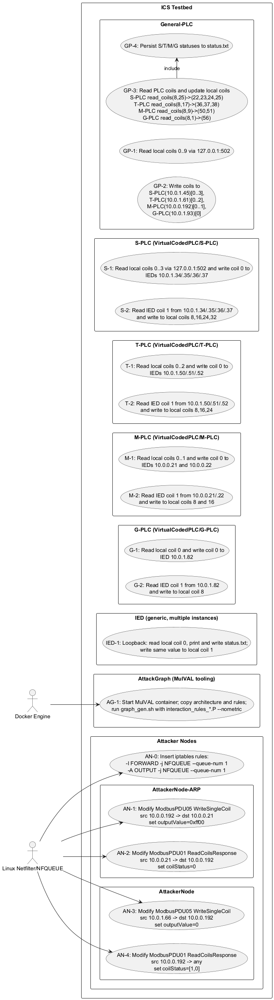
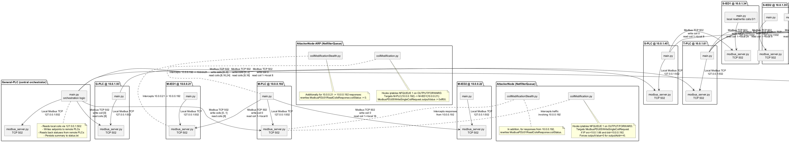
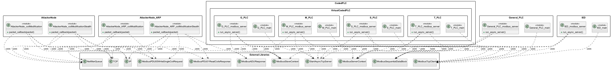
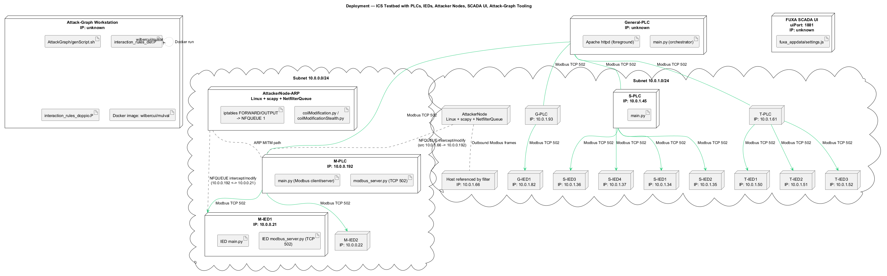

 

% 1 — System Overview
# SECTION 1 — System Overview

This section introduces the system’s purpose, scope, and principal features as they are implemented in the repository. It summarizes what the codebase does, how the major subsystems interact, and which operational behaviors can be validated directly from the source files.

## Purpose and Main Functionalities

The repository implements an industrial-control testbed centered on Modbus/TCP communications and security analysis. It models a multi-level control environment with:

- A central General PLC that distributes setpoints to site PLCs and aggregates status.
- Multiple site PLCs (S-PLC, T-PLC, M-PLC, G-PLC), each controlling one or more IEDs.
- IEDs that mirror incoming coil commands to a status coil, enabling simple closed-loop feedback.
- Active attacker nodes that perform in-line tampering and stealthy response manipulation against Modbus/TCP traffic using NFQUEUE and Scapy.
- Attack graph generation rules and automation using MulVAL to reason about feasible attack paths in the modelled network.
- A lightweight SCADA configuration (FUXA) intended to provide a UI endpoint within the lab environment.

All PLCs and IEDs use pymodbus. Each PLC hosts a local Modbus/TCP server (port 502) and runs a client loop that exchanges coil values with peers over the network. The attacker nodes alter Modbus requests and/or responses on specified flows to demonstrate both naive tampering and stealth techniques. The attack graph assets express interaction and threat rules (Prolog) and provide a Docker-based generation script.

## High-Level Scope

The codebase constitutes a full simulation environment for an ICS network, including control logic, field devices, an HMI/SCADA configuration stub, adversary tooling, and formalized interaction rules for attack graph generation. It does not include infrastructure provisioning beyond basic scripts and assumes network reachability for the IP addresses hard-coded in the components. The scope covers:

- Control-plane logic for distributing commands and collecting feedback via Modbus coils.
- Device-level behavior for IEDs acting as simple echo/status endpoints.
- Security tooling to intercept and modify Modbus/TCP traffic in transit.
- Formal attack modeling assets and a script to produce attack graphs using Dockerized MulVAL.
- Minimal HMI configuration (FUXA) parameters for a UI service.

## Key Features Observable from the Codebase

The implemented behaviors and interfaces can be verified directly from the code:

- Consistent Modbus/TCP usage on port 502 across all PLCs and IEDs, with servers created via StartAsyncTcpServer and a shared ModbusSequentialDataBlock of 100 elements for coils and registers.
- Deterministic coil usage conventions:
  - PLCs read local coils and write remote IEDs’ coil 0 with command values.
  - IEDs read local coil 0 and immediately mirror the value into local coil 1 to represent status/feedback.
  - PLCs read remote coil 1 from each IED and map those values into local coil offsets (e.g., 8, 16, 24, 32) for aggregation.
- A General PLC acting as a top-layer orchestrator:
  - Writes to site PLCs’ local coil ranges to propagate commands.
  - Reads site PLCs’ aggregated status coil ranges and mirrors them into its own local coils (e.g., 22–25, 36–38, 50–51, 56).
  - Persists a consolidated device-status snapshot to a text file.
- Attacker nodes performing packet interception and manipulation via netfilterqueue and Scapy’s Modbus layers:
  - Forced coil writes (e.g., coercing write-single-coil requests to specific values).
  - Stealthy manipulation of read-coils responses to conceal tampering.
  - Traffic selection based on specific source/destination IP pairs matching the PLC/IED endpoints in the testbed.
- Attack graph rules in Prolog encoding host/service relationships, network reachability, ARP poisoning conditions, spoofing/segment-forging, and visibility/tampering effects aligned with plaintext, unauthenticated Modbus/TCP flows.
- A Docker-driven script to execute MulVAL graph generation using supplied architecture facts and interaction rules.
- A minimal FUXA SCADA settings file configuring service port, logging, and persistence folders.

## Subsystems and Roles

The following table enumerates the repository subsystems and their implemented responsibilities, entry points, protocols, and addressing as evidenced by the code.

| Subsystem | Path | Purpose | Main Entry Points | Protocol/Port | Key IPs Observed in Code |
|---|---|---|---|---|---|
| General PLC | General-PLC/code | Top-layer controller that distributes commands to site PLCs and aggregates their feedback; writes a consolidated status file | run_script.sh launches modbus_server.py and main.py; main.py loops performing read/write cycles | Modbus/TCP on 502 | Site PLCs: 10.0.1.45 (S-PLC), 10.0.1.61 (T-PLC), 10.0.0.192 (M-PLC), 10.0.1.93 (G-PLC); local server at 127.0.0.1 |
| S-PLC | CodedPLC/VirtualCodedPLC/S-PLC/code | Site PLC controlling 4 IEDs; aggregates their status into local coils | run_script.sh; modbus_server.py; main.py | Modbus/TCP on 502 | IEDs: 10.0.1.34, .35, .36, .37; local server at 127.0.0.1 |
| T-PLC | CodedPLC/VirtualCodedPLC/T-PLC/code | Site PLC controlling 3 IEDs; aggregates their status into local coils | run_script.sh; modbus_server.py; main.py | Modbus/TCP on 502 | IEDs: 10.0.1.50, .51, .52; local server at 127.0.0.1 |
| M-PLC | CodedPLC/VirtualCodedPLC/M-PLC/code | Site PLC controlling 2 IEDs; aggregates their status into local coils | run_script.sh; modbus_server.py; main.py | Modbus/TCP on 502 | IEDs: 10.0.0.21, .22; exposed PLC IP: 10.0.0.192; local server at 127.0.0.1 |
| G-PLC | CodedPLC/VirtualCodedPLC/G-PLC/code | Site PLC controlling 1 IED; aggregates its status into local coils | run_script.sh; modbus_server.py; main.py | Modbus/TCP on 502 | IED: 10.0.1.82; exposed PLC IP: 10.0.1.93; local server at 127.0.0.1 |
| IED | IED/code | Device behavior: read coil 0, log value, echo to coil 1 to provide feedback | run_script.sh; modbus_server.py; main.py | Modbus/TCP on 502 | Each IED uses 127.0.0.1 within its own runtime context |
| AttackerNode (M-PLC focus) | AttackerNode/code | Intercepts traffic and forces Modbus write-single-coil values; optional stealth by altering read-coils responses | coilModification.py; coilModificationStealth.py | NFQUEUE + Scapy Modbus over TCP | Targets flows 10.0.1.66 → 10.0.0.192 and responses from 10.0.0.192 |
| AttackerNode-ARP (M-IED1 focus) | AttackerNode-ARP/code | Intercepts M-PLC ↔ M-IED1 traffic, forces coil writes and hides via response manipulation | coilModification.py; coilModificationStealth.py | NFQUEUE + Scapy Modbus over TCP | Targets flows 10.0.0.192 ↔ 10.0.0.21 |
| Attack Graph | AttackGraph | Prolog interaction rules and script to generate attack graphs with MulVAL | interaction_rules_def.P; interaction_rules_doppio.P; genScript.sh | Dockerized MulVAL execution | Docker image wilbercui/mulval; inputs mounted via -v |
| SCADA config | FUXA-SCADA-System/fuxa_appdata | Minimal configuration for a FUXA SCADA UI service | settings.js | HTTP UI on 1881 (per config) | Not network-interactive in code |
| Setup script | setup.sh | Enables NIC promiscuous mode and allows X display access (dev/lab convenience) | setup.sh | OS-level tooling | Interface name: wlp0s20f3 |

The overall dataflow, as implemented, is hierarchical. The General PLC reads 10 local coils and disseminates subsets to the site PLCs, which in turn propagate per-IED commands to their IED endpoints. Feedback is bubbled back up: each IED mirrors its received command into coil 1; site PLCs read these status coils and map them into their local coil ranges; the General PLC polls those ranges and updates its own coil map and a status.txt file. Attacker nodes intervene on specific IP pairs to coerce coil values and optionally falsify read responses to maintain the appearance of normal operation. Attack graph rules capture preconditions such as plaintext, unauthenticated protocols and L2 visibility, modeling how ARP poisoning and segment forging can enable tampering and loss of visibility on feedback flows.

% 2 — Architectural Context
## 2. Architectural Context

This section outlines the external systems, protocols, libraries, and actors that are explicitly referenced by the code and configuration. It focuses on what the software interacts with at its boundaries: operating system services, network protocols, runtime platforms, and human operators running the provided tooling. The intent is to provide a clear context for integration, deployment, and validation against the actual implementation.

### External Systems

- Linux Netfilter/Iptables and NFQUEUE kernel facility used for packet interception and modification (AttackerNode scripts install FORWARD/OUTPUT rules to queue 1).
- Docker Engine and the MulVAL container image wilbercui/mulval used to generate attack graphs (AttackGraph/genScript.sh).
- Apache HTTP Server started alongside the General-PLC processes (/usr/sbin/apache2ctl -DFOREGROUND in General-PLC/code/run_script.sh).
- FUXA SCADA runtime (Node.js application), configured to expose a UI on TCP port 1881 (FUXA-SCADA-System/fuxa_appdata/settings.js).

### APIs / Interfaces

- Modbus/TCP on port 502 via pymodbus:
  - Each PLC and IED exposes a Modbus server bound to all interfaces on port 502 (modbus_server.py with StartAsyncTcpServer).
  - General-PLC acts as a Modbus client to:
    - S-PLC at 10.0.1.45: writes coils 0–3; reads coils starting at 8 and consumes bits at offsets 0, 8, 16, 24 (mapped to S-IED1..4).
    - T-PLC at 10.0.1.61: writes coils 0–2; reads coils starting at 8 and consumes bits at offsets 0, 8, 16 (mapped to T-IED1..3).
    - M-PLC at 10.0.0.192: writes coils 0–1; reads coils starting at 8 and consumes bits at offsets 0, 8 (mapped to M-IED1..2).
    - G-PLC at 10.0.1.93: writes coil 0; reads coils starting at 8 and consumes bit at offset 0 (mapped to G-IED1).
  - PLC-to-IED Modbus/TCP client interactions:
    - M-PLC to 10.0.0.21 and 10.0.0.22: write coil 0; read coil 1; mirror feedback into M-PLC local coils 8 and 16.
    - S-PLC to 10.0.1.34, 10.0.1.35, 10.0.1.36, 10.0.1.37: write coil 0; read coil 1; mirror feedback into S-PLC local coils 8, 16, 24, 32 respectively.
    - T-PLC to 10.0.1.50, 10.0.1.51, 10.0.1.52: write coil 0; read coil 1; mirror feedback into T-PLC local coils 8, 16, 24 respectively.
    - G-PLC to 10.0.1.82: write coil 0; read coil 1; mirror feedback into G-PLC local coil 8.
  - IED internal Modbus loopback: each IED reads its local coil 0 and writes that value into coil 1 (self-contained feedback).
- Packet manipulation via scapy and scapy.contrib.modbus:
  - AttackerNode/code/coilModification.py: intercepts traffic from 10.0.1.66 to 10.0.0.192; if PDU is ModbusPDU05WriteSingleCoilRequest with outputAddr == 0, forces outputValue to 0.
  - AttackerNode/code/coilModificationStealth.py: same write tampering; additionally, for ModbusPDU01ReadCoilsResponse sourced from 10.0.0.192, rewrites coilStatus to [1, 0].
  - AttackerNode-ARP/code/coilModification.py: intercepts 10.0.0.192 → 10.0.0.21 Modbus write single coil and forces outputValue to 0xff00.
  - AttackerNode-ARP/code/coilModificationStealth.py: same write tampering; additionally, for ModbusPDU01ReadCoilsResponse from 10.0.0.21 to 10.0.0.192, rewrites coilStatus to 0.
- Attack graph generation interface:
  - AttackGraph/genScript.sh CLI options: -a/--architecture, -r/--rules, -o/--output; runs Docker container and invokes graph_gen.sh inside the MulVAL image.
- FUXA SCADA HTTP interface:
  - UI exposed on TCP port 1881; logging, DB, and DAQ settings defined in settings.js.

### Data Sources

- Local status files:
  - General-PLC/code/main.py writes status.txt summarizing boolean states for S-IED1..4, T-IED1..3, M-IED1..2, G-IED1.
  - IED/code/main.py writes status.txt with the last coil read value.
- NFQUEUE packet stream:
  - Queue number 1 is used to receive and reinject intercepted packets for all AttackerNode variants.
- Configuration inputs:
  - FUXA settings (port, logging, DB directories) in fuxa_appdata/settings.js.
- No database access is performed by application code beyond the FUXA configuration directory reference.

### Users / Actors

- Attacker operator executing the packet interception/modification tools (AttackerNode and AttackerNode-ARP).
- Security analyst or engineer running AttackGraph/genScript.sh to produce attack graphs using the MulVAL Docker container.
- SCADA operator accessing the FUXA UI on port 1881 as implied by settings.js.

% 2.1 — Architectural Context – Use Case Diagram
## Section 2.1 — Architectural Context – Use Case Diagram

This section presents the architectural context of the industrial control testbed contained in the repository as a PlantUML Use Case diagram. The diagram is derived strictly from the source code. It shows the system-of-interest (the ICS testbed with General-PLC, VirtualCodedPLC S-PLC/T-PLC/M-PLC/G-PLC, IEDs, attack tooling, and attack-graph tooling) and its external actors. External actors identified in code are the Docker Engine (invoked by the AttackGraph script) and the Linux Netfilter/NFQUEUE subsystem (interfaced by the attacker node scripts through iptables and NetfilterQueue). All Modbus operations, IP addresses, ports, and file outputs are taken from the Python sources and shell scripts.

Figure 2.1 — Architectural Context – Use Case Diagram

% 3 — Containers
## 3. Containers

This section identifies all runtime applications and services present in the codebase and describes their responsibilities, primary technologies, and communication mechanisms. The descriptions are derived strictly from the provided source code and scripts, and are intended to be verifiable by developers familiar with this repository.

| Container | Responsibility | Technology | Communication |
|---|---|---|---|
| General-PLC | Aggregates commands and status across all PLCs and IEDs. Exposes a Modbus/TCP server and runs control logic that writes coils to and reads coils from S-PLC (10.0.1.45), T-PLC (10.0.1.61), M-PLC (10.0.0.192), and G-PLC (10.0.1.93). Persists a consolidated status map to status.txt. Starts Apache HTTPD in foreground. (Files: General-PLC/code/modbus_server.py, main.py, run_script.sh) | Python 3, pymodbus (async TCP server), Apache2 (launched by run_script.sh) | Modbus/TCP server on 0.0.0.0:502; Modbus/TCP client to remote PLCs; local filesystem I/O; HTTP server (Apache) running in same container |
| M-PLC | Exposes a Modbus/TCP server and runs control logic to propagate two local coils to two IEDs and mirror their feedback: writes coil 0 to 10.0.0.21 and coil 1 to 10.0.0.22; reads each IED’s coil 1 and writes values to local coils at addresses 8 and 16. (Files: CodedPLC/VirtualCodedPLC/M-PLC/code/modbus_server.py, main.py, run_script.sh) | Python 3, pymodbus | Modbus/TCP server on 0.0.0.0:502; Modbus/TCP client to 10.0.0.21 and 10.0.0.22 |
| S-PLC | Exposes a Modbus/TCP server and runs control logic for four IEDs: writes four local coils to 10.0.1.34, .35, .36, .37; reads each IED’s coil 1 and writes values to local coils at addresses 8, 16, 24, 32. (Files: CodedPLC/VirtualCodedPLC/S-PLC/code/modbus_server.py, main.py, run_script.sh) | Python 3, pymodbus | Modbus/TCP server on 0.0.0.0:502; Modbus/TCP client to 10.0.1.34, 10.0.1.35, 10.0.1.36, 10.0.1.37 |
| T-PLC | Exposes a Modbus/TCP server and runs control logic for three IEDs: writes three local coils to 10.0.1.50, .51, .52; reads each IED’s coil 1 and writes values to local coils at addresses 8, 16, 24. (Files: CodedPLC/VirtualCodedPLC/T-PLC/code/modbus_server.py, main.py, run_script.sh) | Python 3, pymodbus | Modbus/TCP server on 0.0.0.0:502; Modbus/TCP client to 10.0.1.50, 10.0.1.51, 10.0.1.52 |
| G-PLC | Exposes a Modbus/TCP server and runs control logic for one IED: writes a local coil to 10.0.1.82; reads that IED’s coil 1 and writes value to local coil at address 8. (Files: CodedPLC/VirtualCodedPLC/G-PLC/code/modbus_server.py, main.py, run_script.sh) | Python 3, pymodbus | Modbus/TCP server on 0.0.0.0:502; Modbus/TCP client to 10.0.1.82 |
| IED Service (multiple instances) | Each IED exposes a Modbus/TCP server and runs a local loop that reads coil 0, logs the value to status.txt, and writes it back to coil 1 on the same server. This service is designed to be instantiated per IED referenced by PLCs (e.g., 10.0.0.21, .22; 10.0.1.34–.37; 10.0.1.50–.52; 10.0.1.82). (Files: IED/code/modbus_server.py, main.py, run_script.sh) | Python 3, pymodbus | Modbus/TCP server on 0.0.0.0:502; local Modbus/TCP client to 127.0.0.1:502; local filesystem I/O |
| AttackerNode — coilModification | Inline packet manipulation of Modbus/TCP traffic using NFQUEUE and Scapy. Targets TCP packets from 10.0.1.66 to 10.0.0.192; if PDU is Write Single Coil (FC5) for address 0, forces outputValue to 0 and recalculates checksums. Installs iptables rules and processes queue 1. (File: AttackerNode/code/coilModification.py) | Python 3, scapy, scapy.contrib.modbus, netfilterqueue, iptables | Linux NFQUEUE hook on FORWARD/OUTPUT; raw IP/TCP packet rewrite affecting Modbus/TCP payload |
| AttackerNode — coilModificationStealth | As above, plus stealth response tampering: for Read Coils (FC1) responses sourced from 10.0.0.192, sets coilStatus (e.g., to [1, 0]) to mask effects. Recomputes checksums and reinjects. (File: AttackerNode/code/coilModificationStealth.py) | Python 3, scapy, scapy.contrib.modbus, netfilterqueue, iptables | Linux NFQUEUE hook on FORWARD/OUTPUT; raw IP/TCP packet rewrite for Modbus/TCP requests and responses |
| AttackerNode-ARP — coilModification | Inline manipulation for traffic from 10.0.0.192 to 10.0.0.21; if PDU is Write Single Coil (FC5), forces outputValue to 0xff00, with checksum fixes, logging before/after. (File: AttackerNode-ARP/code/coilModification.py) | Python 3, scapy, scapy.contrib.modbus, netfilterqueue, iptables | Linux NFQUEUE hook on FORWARD/OUTPUT; raw IP/TCP packet rewrite affecting Modbus/TCP |
| AttackerNode-ARP — coilModificationStealth | Combined request and response tampering: sets Write Single Coil outputValue to 0xff00; for Read Coils responses from 10.0.0.21 to 10.0.0.192, forces coilStatus to 0 to hide state. (File: AttackerNode-ARP/code/coilModificationStealth.py) | Python 3, scapy, scapy.contrib.modbus, netfilterqueue, iptables | Linux NFQUEUE hook on FORWARD/OUTPUT; raw IP/TCP packet rewrite for Modbus/TCP requests and responses |
| AttackGraph Tooling (MulVAL) | Generates attack graphs using MulVAL inside a Docker container. The script binds an output directory, copies an architecture file and an interaction rules file, runs graph_gen.sh with --nometric, and stops the container. (Files: AttackGraph/genScript.sh, interaction_rules_def.P, interaction_rules_doppio.P) | Bash, Docker (wilbercui/mulval image), MulVAL Prolog rules | Docker volume mount and exec; file I/O inside container; no network service exposed |
| FUXA SCADA System | SCADA UI/service configuration indicating a Node.js application running on port 1881 with DAQ enabled, log and DB directories specified. (File: FUXA-SCADA-System/fuxa_appdata/settings.js) | Node.js (FUXA) | HTTP on port 1881; file-based storage under _db and logs under _logs |

% 3.1 — Architecture Overview – Component Diagram
# Section 3.1 — Architecture Overview – Component Diagram

This section presents the component-level structure and runtime interactions of the Modbus-based ICS testbed derived strictly from the provided codebase. It identifies every software component, its responsibilities, and the Modbus TCP interactions observed in code, including the optional attack manipulation nodes and the offline attack-graph tooling. The diagram is intended to be a faithful reflection of the implementation so that domain experts can validate the actual behavior and data flows.

Figure 3.1.1 — Component Diagram (code-derived)

The diagram shows every implemented component and interaction observable from the code. Each PLC and IED contains both a Modbus TCP server and a local control loop that reads from and writes to its local server. Remote connections are strictly those implemented in the Python clients using pymodbus, over port 502. The two attacker nodes are separate host processes that hook Linux iptables to NetfilterQueue 1 and rewrite specific Modbus PDUs on flows explicitly filtered by source and destination IPs. The attack-graph tooling is offline and operates through Docker without any runtime coupling to the ICS components. The SCADA settings are present but are not wired to PLCs in code.

Validation approach

To validate this diagram against the code, review the following in the repository: the exact IPs and coil indices used in each main.py for General-PLC and each VirtualCodedPLC to confirm every remote edge; the presence of a Modbus server per PLC/IED via modbus_server.py on port 502; the attacker scripts’ NFQUEUE bindings, IP filters, and Modbus PDU mutations; the AttackGraph genScript.sh Docker workflow and the two rule files; and the FUXA settings file along with the lack of any code referencing it from PLCs or IEDs.

% 4 — Components
## 4. Components

This section identifies the internal components implemented within each container of the repository. For each component, it outlines the responsibility and its concrete interactions, including function calls, imports, inter-process communications, external services, and network endpoints. The content is derived exclusively from the provided source code to enable validation by the development team.

### 4.1 AttackerNode

This container provides active network manipulation modules for Modbus/TCP traffic using Linux NFQUEUE and Scapy.

| Component | Responsibility | Interactions |
|---|---|---|
| AttackerNode/code/coilModification.py | Intercepts and modifies Modbus write-single-coil requests in-flight. Specifically, for TCP/IP traffic where IP.src == 10.0.1.66 and IP.dst == 10.0.0.192, if the PDU is ModbusPDU05WriteSingleCoilRequest with outputAddr == 0, it forces outputValue to 0 and recalculates checksums. It installs iptables rules to divert packets to NFQUEUE and processes them via a callback bound to queue 1. | Imports scapy.all, scapy.contrib.modbus, NetfilterQueue; uses IP/TCP layer parsing and Modbus PDUs; manipulates Linux iptables (FORWARD, OUTPUT) to NFQUEUE 1; binds NetfilterQueue().bind(1, packet_callback); network flow observed: 10.0.1.66 → 10.0.0.192; system calls via os.system to manage iptables; uses packet.set_payload and packet.accept in callback. |
| AttackerNode/code/coilModificationStealth.py | Performs the same write-single-coil tampering as above and additionally for responses: when detecting ModbusPDU01ReadCoilsResponse within a ModbusADUResponse from IP.src == 10.0.0.192, it modifies coilStatus to [1, 0], recalculates checksums, and forwards the packet. Uses the same NFQUEUE setup and cleanup. | Imports scapy.all, scapy.contrib.modbus, NetfilterQueue; uses ModbusPDU05WriteSingleCoilRequest and ModbusPDU01ReadCoilsResponse; prints packet fields via .show(); modifies response payload coilStatus; iptables FORWARD/OUTPUT → NFQUEUE 1; network flows: 10.0.1.66 ↔ 10.0.0.192; uses os.system for iptables and NetfilterQueue().bind(1, packet_callback). |

### 4.2 AttackerNode-ARP

This container provides similar manipulation focused on a different network path and values, including a stealth response modifier.

| Component | Responsibility | Interactions |
|---|---|---|
| AttackerNode-ARP/code/coilModification.py | Intercepts Modbus write-single-coil requests from IP.src == 10.0.0.192 to IP.dst == 10.0.0.21 and forces outputValue to 0xff00 for ModbusPDU05WriteSingleCoilRequest messages. Installs NFQUEUE rules and processes packets through queue 1. | Imports scapy.all, scapy.contrib.modbus, NetfilterQueue; uses IP/TCP parsing; modifies Modbus write PDU; iptables FORWARD/OUTPUT → NFQUEUE 1; prints packet fields via .show(); network flow: 10.0.0.192 → 10.0.0.21; uses os.system to manage iptables and NetfilterQueue().bind. |
| AttackerNode-ARP/code/coilModificationStealth.py | Performs write-single-coil tampering as above and additionally modifies Modbus read-coils responses: for ModbusPDU01ReadCoilsResponse in a ModbusADUResponse where IP.src == 10.0.0.21 and IP.dst == 10.0.0.192, sets coilStatus to 0. Handles checksum removal and payload re-injection. | Imports scapy.all, scapy.contrib.modbus, NetfilterQueue; uses ModbusPDU05WriteSingleCoilRequest and ModbusPDU01ReadCoilsResponse; prints packet via .show(); iptables FORWARD/OUTPUT → NFQUEUE 1; network flows: 10.0.0.192 ↔ 10.0.0.21; uses os.system and NetfilterQueue().bind(1, packet_callback). |

### 4.3 AttackGraph

This container contains a driver script and two MulVAL rule sets to generate attack graphs.

| Component | Responsibility | Interactions |
|---|---|---|
| AttackGraph/genScript.sh | Orchestrates a Dockerized MulVAL run to generate an attack graph without metrics. Accepts architecture and rules files, creates an output directory, runs container wilbercui/mulval, copies inputs, invokes graph_gen.sh "$architecture" -v -p -r "$rules" --nometric, then stops the container. | Uses bash, docker run/cp/exec/stop; mounts "$(pwd)/$output" to /input; copies provided architecture and rules into the container; depends on image wilbercui/mulval and the script graph_gen.sh inside it. |
| AttackGraph/interaction_rules_def.P | Prolog rulebase defining primitives, derived predicates, and interaction rules (e.g., canForgeSegment, arpPoisoning, netAccess, logInService) with CVSS access complexity meta. Implements ARP poisoning likelihood, Modbus-related plaintext/unauthenticated flow properties, privilege escalation, and service access reasoning. | Consumed by MulVAL in genScript.sh; standard Prolog-Tabled (:- table …) constructs; no runtime interaction with other repository components. |
| AttackGraph/interaction_rules_doppio.P | Alternative Prolog rulebase with similar primitives and derived predicates, emphasizing canForgeSegment, canTamper, canSpoof, lossVisibility, and network visibility through ARP poisoning and gateway presence. | Consumed by MulVAL via genScript.sh; uses primitive(cvss/1) and variations of rules; no direct runtime links to other components. |

### 4.4 CodedPLC/VirtualCodedPLC — G-PLC

Implements a Modbus TCP PLC with an embedded server and a control loop integrating with a remote IED.

| Component | Responsibility | Interactions |
|---|---|---|
| CodedPLC/VirtualCodedPLC/G-PLC/code/modbus_server.py | Initializes a Modbus server context with a sequential data block of 100 registers mapped to DI/CO/HR/IR, and starts an asynchronous TCP server on port 502. | Imports pymodbus.datastore and server.StartAsyncTcpServer; exposes Modbus on 0.0.0.0:502; provides context used by local client in main.py. |
| CodedPLC/VirtualCodedPLC/G-PLC/code/main.py | Periodically connects to the local Modbus server (127.0.0.1:502), reads coil 0, writes its value to a remote IED at 10.0.1.82 coil 0, then reads remote coil 1 and mirrors it into local coil 8. | Uses pymodbus.client.ModbusTcpClient; network to 127.0.0.1:502 and 10.0.1.82:502; read_coils, write_coil; exception handling with simple prints; 1-second cycle with time.sleep. |
| CodedPLC/VirtualCodedPLC/G-PLC/code/run_script.sh | Launches the Modbus server and the control loop concurrently, keeping the server in the foreground. | Shell job control; runs python3 modbus_server.py and python3 main.py; uses fg %1. |

### 4.5 CodedPLC/VirtualCodedPLC — M-PLC

Implements a Modbus TCP PLC controlling two IEDs.

| Component | Responsibility | Interactions |
|---|---|---|
| CodedPLC/VirtualCodedPLC/M-PLC/code/modbus_server.py | Same server pattern as G-PLC, exposing the local Modbus context on port 502. | Imports pymodbus datastore/server; listens on 0.0.0.0:502. |
| CodedPLC/VirtualCodedPLC/M-PLC/code/main.py | Reads two local coils (0–1), writes them to remote IEDs at 10.0.0.21 and 10.0.0.22 (coil 0 on each), then reads coil 1 from each IED and mirrors them to local coils 8 and 16 respectively. | Uses pymodbus.client; network to 127.0.0.1:502, 10.0.0.21:502, 10.0.0.22:502; read_coils, write_coil; sleeps between operations. |
| CodedPLC/VirtualCodedPLC/M-PLC/code/run_script.sh | Starts server and control loop; keeps server in foreground. | Shell orchestration of the two Python processes. |

### 4.6 CodedPLC/VirtualCodedPLC — S-PLC

Implements a Modbus TCP PLC controlling four IEDs.

| Component | Responsibility | Interactions |
|---|---|---|
| CodedPLC/VirtualCodedPLC/S-PLC/code/modbus_server.py | Same server pattern, providing the local Modbus context on port 502. | pymodbus datastore/server; listens on 0.0.0.0:502. |
| CodedPLC/VirtualCodedPLC/S-PLC/code/main.py | Reads four local coils (0–3), writes them to IEDs at 10.0.1.34, 10.0.1.35, 10.0.1.36, 10.0.1.37 (coil 0 on each), then reads coil 1 from each IED and mirrors them to local coils 8, 16, 24, and 32 respectively. | Uses ModbusTcpClient; network to 127.0.0.1:502 and the four IED IPs on 502; read/write coils; periodic cycle with time.sleep. |
| CodedPLC/VirtualCodedPLC/S-PLC/code/run_script.sh | Starts server and control loop; keeps server in foreground. | Shell orchestration (python3 modbus_server.py, python3 main.py, fg). |

### 4.7 CodedPLC/VirtualCodedPLC — T-PLC

Implements a Modbus TCP PLC controlling three IEDs.

| Component | Responsibility | Interactions |
|---|---|---|
| CodedPLC/VirtualCodedPLC/T-PLC/code/modbus_server.py | Same server pattern as other PLCs on port 502. | pymodbus datastore/server; listens on 0.0.0.0:502. |
| CodedPLC/VirtualCodedPLC/T-PLC/code/main.py | Reads three local coils (0–2), writes them to IEDs at 10.0.1.50, 10.0.1.51, 10.0.1.52 (coil 0 on each), then reads coil 1 from each IED and mirrors them to local coils 8, 16, and 24 respectively. | Uses ModbusTcpClient; network to 127.0.0.1:502 and the three IED IPs on 502; read/write coils; periodic timing with sleep. |
| CodedPLC/VirtualCodedPLC/T-PLC/code/run_script.sh | Starts server and control loop; keeps server in foreground. | Shell orchestration. |

### 4.8 General-PLC

Aggregates and coordinates state across all PLCs and produces a status report.

| Component | Responsibility | Interactions |
|---|---|---|
| General-PLC/code/modbus_server.py | Provides the local Modbus server context for the General-PLC on port 502. | pymodbus datastore/server; listens on 0.0.0.0:502. |
| General-PLC/code/main.py | Central coordinator that reads 10 local coils (0–9), propagates them to subordinate PLCs, and aggregates feedback from them. It writes coils 0–3 to S-PLC (10.0.1.45), 0–2 to T-PLC (10.0.1.61), 0–1 to M-PLC (10.0.0.192), and 0 to G-PLC (10.0.1.93). It then reads from S-PLC coils starting at 8 (size 25) to update local coils 22, 23, 24, 25; from T-PLC coils starting at 8 (size 17) to update local coils 36, 37, 38; from M-PLC coils starting at 8 (size 9) to update local coils 50, 51; and from G-PLC coils starting at 8 (size 1) to update local coil 56. It also writes a status.txt file with a boolean map of all IEDs’ states. | Uses pymodbus.client.ModbusTcpClient; network to 127.0.0.1:502 and remote PLCs 10.0.1.45, 10.0.1.61, 10.0.0.192, 10.0.1.93 on port 502; read_coils, write_coil; file I/O (status.txt); simple exception handling with prints; time-based loop. |
| General-PLC/code/run_script.sh | Starts the Modbus server and the coordinator, launches Apache HTTP server in the foreground, and then foregrounds the Modbus server job. | Runs python3 modbus_server.py and python3 main.py; starts /usr/sbin/apache2ctl -DFOREGROUND; uses shell job control fg %1. |

### 4.9 IED

Implements an Intelligent Electronic Device with a local Modbus server and a simple echo/monitor loop.

| Component | Responsibility | Interactions |
|---|---|---|
| IED/code/modbus_server.py | Provides the IED Modbus server context on port 502 with shared data blocks across DI/CO/HR/IR. | pymodbus datastore/server; listens on 0.0.0.0:502. |
| IED/code/main.py | Reads local coil 0, logs it to stdout and writes the value to a status.txt file, then mirrors coil 0 into coil 1. Repeats every 0.5 seconds, reopening a client connection for each operation. | Uses pymodbus.client.ModbusTcpClient; network to 127.0.0.1:502; file I/O (status.txt); read_coils and write_coil; time.sleep(0.5). |
| IED/code/run_script.sh | Starts the Modbus server and the main loop; keeps the server in the foreground. | Shell orchestration (python3 modbus_server.py, python3 main.py, fg). |

### 4.10 FUXA-SCADA-System

Contains configuration for the FUXA SCADA application instance.

| Component | Responsibility | Interactions |
|---|---|---|
| FUXA-SCADA-System/fuxa_appdata/settings.js | Exposes SCADA app configuration: version, language, ports, logging, DB directory, DAQ settings, and broadcast policy. | Node.js module.exports; reads process.env.PORT; no direct interactions referenced by other code in this repository. |

### 4.11 Root-level Setup

System utility script for environment setup.

| Component | Responsibility | Interactions |
|---|---|---|
| setup.sh | Enables promiscuous mode on interface wlp0s20f3 and allows X11 access via xhost +. Intended to facilitate packet capture/injection and GUI forwarding in the host environment. | Uses ip link set … promisc on; uses xhost +; requires appropriate privileges (root for ip). |

% 5 — Code-Level View
# Section 5 — Code-Level View

This section maps the implemented architectural elements to concrete source code artifacts. It identifies the executable entry points, enumerates the key modules and directories, and highlights implementation patterns that are explicitly recognizable from the source. The intent is to enable developers and integrators to validate runtime behavior and responsibilities against the codebase.

## 5.1 Repository Structure and Module Responsibilities

The following table lists every source file in the repository, its role, and primary dependencies as they are used in code. The mapping is exhaustive and reflects the current implementation.

| Path | File | Role and Behavior | Primary Dependencies |
|------|------|-------------------|----------------------|
| AttackerNode/code | coilModification.py | NFQUEUE packet interceptor that rewrites Modbus Write Single Coil requests in transit from 10.0.1.66 to 10.0.0.192. It sets outputValue to 0 when outputAddr == 0, deletes IP/TCP checksums to force recompute, and re-injects the packet. Installs iptables rules for queue 1 and runs an event loop. Note: uses os.system but does not import os. | scapy.all, scapy.contrib.modbus, netfilterqueue.NetfilterQueue, iptables/NFQUEUE, time, argparse |
| AttackerNode/code | coilModificationStealth.py | As above, and additionally masks visibility by intercepting Modbus Read Coils responses sourced from 10.0.0.192, setting coilStatus to [1, 0]. Recomputes checksums and re-injects. Installs iptables rules and runs. Note: uses os.system but does not import os. | scapy.all, scapy.contrib.modbus, netfilterqueue.NetfilterQueue, iptables/NFQUEUE, time, argparse |
| AttackerNode-ARP/code | coilModification.py | NFQUEUE interceptor for traffic from 10.0.0.192 to 10.0.0.21. On Write Single Coil requests, sets outputValue to 0xff00. Displays packet before/after modification, recalculates checksums, re-injects. Installs iptables rules and runs. Note: uses os.system but does not import os. | scapy.all, scapy.contrib.modbus, netfilterqueue.NetfilterQueue, iptables/NFQUEUE, time, argparse |
| AttackerNode-ARP/code | coilModificationStealth.py | As above, and additionally intercepts Read Coils responses from 10.0.0.21 to 10.0.0.192, sets coilStatus to 0 to hide changes. Recomputes checksums, re-injects; installs iptables rules and runs. Note: uses os.system but does not import os. | scapy.all, scapy.contrib.modbus, netfilterqueue.NetfilterQueue, iptables/NFQUEUE, time, argparse |
| AttackGraph | genScript.sh | Helper script to generate MulVAL attack graphs in Docker. Copies an “architecture” and “rules” file into a container and invokes graph_gen.sh. Note: the argument parsing loop is syntactically incomplete (while [ $). | bash, docker |
| AttackGraph | interaction_rules_def.P | MulVAL Prolog rule set defining primitives, derived predicates, and interaction rules (e.g., arpPoisoning, canForgeSegment, lossVisibility). Includes custom ICS/flow predicates. | MulVAL/Prolog |
| AttackGraph | interaction_rules_doppio.P | Alternative MulVAL rule set with similar but not identical predicates and rules (e.g., canSpoof, netVisibility, arpPoisoning). | MulVAL/Prolog |
| CodedPLC/VirtualCodedPLC/G-PLC/code | main.py | PLC runtime loop. Periodically reads local coil 0 and mirrors it to G-IED at 10.0.1.82 coil 0; reads back coil 1 from G-IED and writes to local coil 8. | pymodbus.client.ModbusTcpClient, time |
| CodedPLC/VirtualCodedPLC/G-PLC/code | modbus_server.py | Asynchronous Modbus TCP server exposing a data store with 100 entries for DI/CO/HR/IR at unit-id single mode on port 502. | pymodbus.server.StartAsyncTcpServer, pymodbus.datastore, asyncio, logging |
| CodedPLC/VirtualCodedPLC/G-PLC/code | run_script.sh | Starts modbus_server.py and main.py concurrently; foregrounds the server. | bash, python3 |
| CodedPLC/VirtualCodedPLC/M-PLC/code | main.py | PLC runtime loop. Reads local coils 0–1 and writes to M-IEDs 10.0.0.21 and 10.0.0.22 coil 0. Reads back coil 1 from each IED and writes to local coils 8 and 16 respectively. | pymodbus.client.ModbusTcpClient, time |
| CodedPLC/VirtualCodedPLC/M-PLC/code | modbus_server.py | Asynchronous Modbus TCP server (identical structure to G-PLC). | pymodbus.server.StartAsyncTcpServer, pymodbus.datastore, asyncio, logging |
| CodedPLC/VirtualCodedPLC/M-PLC/code | run_script.sh | Starts modbus_server.py and main.py concurrently; foregrounds the server. | bash, python3 |
| CodedPLC/VirtualCodedPLC/S-PLC/code | main.py | PLC runtime loop. Reads local coils 0–3 and writes to S-IEDs 10.0.1.34–.37 coil 0. Reads back coil 1 from each IED and writes to local coils 8, 16, 24, and 32 respectively. | pymodbus.client.ModbusTcpClient, time |
| CodedPLC/VirtualCodedPLC/S-PLC/code | modbus_server.py | Asynchronous Modbus TCP server (identical structure to G-PLC). | pymodbus.server.StartAsyncTcpServer, pymodbus.datastore, asyncio, logging |
| CodedPLC/VirtualCodedPLC/S-PLC/code | run_script.sh | Starts modbus_server.py and main.py concurrently; foregrounds the server. | bash, python3 |
| CodedPLC/VirtualCodedPLC/T-PLC/code | main.py | PLC runtime loop. Reads local coils 0–2 and writes to T-IEDs 10.0.1.50–.52 coil 0. Reads back coil 1 from each IED and writes to local coils 8, 16, and 24 respectively. | pymodbus.client.ModbusTcpClient, time |
| CodedPLC/VirtualCodedPLC/T-PLC/code | modbus_server.py | Asynchronous Modbus TCP server (identical structure to G-PLC). | pymodbus.server.StartAsyncTcpServer, pymodbus.datastore, asyncio, logging |
| CodedPLC/VirtualCodedPLC/T-PLC/code | run_script.sh | Starts modbus_server.py and main.py concurrently; foregrounds the server. | bash, python3 |
| FUXA-SCADA-System/fuxa_appdata | settings.js | Configuration for the FUXA SCADA application (port, logging, DAQ settings). Not executed within this repo; consumed by FUXA. | Node.js module export |
| General-PLC/code | main.py | Central coordinator loop. Reads local coils 0–9 and fans out to sub-PLCs: S-PLC (10.0.1.45) coils 0–3, T-PLC (10.0.1.61) coils 0–2, M-PLC (10.0.0.192) coils 0–1, G-PLC (10.0.1.93) coil 0. Then retrieves each sub-PLC’s feedback coils and writes them into local coils starting at 22, 36, 50, and 56; also persists a consolidated status.txt. | pymodbus.client.ModbusTcpClient, time |
| General-PLC/code | modbus_server.py | Asynchronous Modbus TCP server (identical structure to other PLC servers). | pymodbus.server.StartAsyncTcpServer, pymodbus.datastore, asyncio, logging |
| General-PLC/code | run_script.sh | Starts modbus_server.py and main.py; also launches Apache in foreground. | bash, python3, apache2ctl |
| IED/code | main.py | IED behavior. Polls local coil 0, logs the value to status.txt, then mirrors that value to local coil 1. | pymodbus.client.ModbusTcpClient, time, file I/O |
| IED/code | modbus_server.py | Asynchronous Modbus TCP server (identical structure to other PLC servers). | pymodbus.server.StartAsyncTcpServer, pymodbus.datastore, asyncio, logging |
| IED/code | run_script.sh | Starts modbus_server.py and main.py concurrently; foregrounds the server. | bash, python3 |
| Root | setup.sh | Host setup helper enabling promiscuous mode on interface wlp0s20f3 and allowing X11 clients. | ip link, xhost |

## 5.2 Executable Entry Points and Runtime Orchestration

The system is composed of long-running processes implemented as Python modules invoked directly or orchestrated via shell scripts. The following table identifies all entry points and how they run.

| Entry File | Invocation Mode | Long-Running Behavior | Notes |
|------------|------------------|------------------------|-------|
| AttackerNode/code/coilModification.py | python3 coilModification.py | Attaches to NFQUEUE 1, intercepts and modifies Modbus TCP packets matching hard-coded IPs, then runs nfqueue.run() until interrupted. | Adds iptables rules for FORWARD and OUTPUT; missing import os will cause a runtime error on os.system calls. |
| AttackerNode/code/coilModificationStealth.py | python3 coilModificationStealth.py | As above, with additional response-masking on Modbus Read Coils. | Same missing import os. |
| AttackerNode-ARP/code/coilModification.py | python3 coilModification.py | As above for different IP tuple; modifies Write Single Coil value to 0xff00. | Same missing import os. |
| AttackerNode-ARP/code/coilModificationStealth.py | python3 coilModificationStealth.py | As above, also masks Read Coils responses to show 0. | Same missing import os. |
| CodedPLC/VirtualCodedPLC/*-PLC/code/run_script.sh | bash run_script.sh | Starts the Modbus server and the corresponding PLC main loop in the background, then foregrounds the server to keep the container/process alive. | Uses job control (fg %1). |
| CodedPLC/VirtualCodedPLC/*-PLC/code/modbus_server.py | python3 modbus_server.py | Starts an asynchronous Modbus TCP server on port 502 with a single slave context. | Can run standalone; typically launched by run_script.sh. |
| CodedPLC/VirtualCodedPLC/*-PLC/code/main.py | python3 main.py | Infinite loop polling local coils and interacting with remote IEDs; sleeps between cycles. | Requires the local Modbus server to be reachable at 127.0.0.1:502. |
| General-PLC/code/run_script.sh | bash run_script.sh | Starts the Modbus server and main loop; also launches Apache in foreground. | Apache config is external to this repository. |
| General-PLC/code/modbus_server.py | python3 modbus_server.py | Asynchronous Modbus TCP server on port 502. | Usually run by run_script.sh. |
| General-PLC/code/main.py | python3 main.py | Infinite loop that fans out control to sub-PLCs and aggregates feedback; writes status.txt. | Depends on connectivity to four sub-PLCs. |
| IED/code/run_script.sh | bash run_script.sh | Starts the Modbus server and IED main loop, foregrounds server. | Job control. |
| IED/code/modbus_server.py | python3 modbus_server.py | Asynchronous Modbus TCP server on port 502. | Usually run by run_script.sh. |
| IED/code/main.py | python3 main.py | Infinite loop reading a coil, logging, and mirroring to coil 1. | Writes status.txt locally. |
| AttackGraph/genScript.sh | bash genScript.sh -a <arch> -r <rules> -o <outdir> | Runs a Docker container to generate an attack graph using MulVAL. | The argument parsing loop is syntactically broken; requires fix before use. |
| setup.sh | bash setup.sh | Sets NIC to promiscuous mode and relaxes X11 access. | Host-level preparatory script. |

## 5.3 Component-to-Code Mapping

The implemented components map to code as follows, summarizing responsibilities and interactions grounded in the actual implementations.

General PLC (data concentrator). The General-PLC component is implemented in General-PLC/code. modbus_server.py provides the local Modbus endpoint; main.py orchestrates outbound writes to S-PLC (10.0.1.45), T-PLC (10.0.1.61), M-PLC (10.0.0.192), and G-PLC (10.0.1.93) based on local coils 0–9. It then polls feedback from each sub-PLC (coils starting at address 8 on each) and writes aggregated statuses into its own coil space at addresses 22–25, 36–38, 50–51, and 56. It also persists a human-readable status.txt.

Virtual coded PLCs (sub-PLCs). The S-PLC, T-PLC, M-PLC, and G-PLC are implemented under CodedPLC/VirtualCodedPLC/*-PLC/code. Each provides a Modbus TCP server and a polling loop that mirrors selected local coils to its IEDs’ coil 0 and reads back IED coil 1 into designated local coil offsets. IP addressing and coil mapping are hard-coded per PLC.

IEDs (field devices). The IED component is implemented under IED/code. modbus_server.py exposes a Modbus server; main.py reads local coil 0, logs it to status.txt, and mirrors the value into coil 1. This behavior creates the feedback channel consumed by the PLCs.

Attacker nodes (in-path Modbus manipulators). The AttackerNode and AttackerNode-ARP components represent in-line packet manipulation services using Linux iptables NFQUEUE and Scapy to modify Modbus application data units. The scripts operate on precise IP tuples and function codes, forcing specific coil states on write requests and optionally falsifying coil states in read responses. They delete checksums to trigger kernel recomputation before re-queueing packets.

Attack graph tooling. The AttackGraph directory contains MulVAL rule sets (interaction_rules_def.P and interaction_rules_doppio.P) with ICS-centric predicates (e.g., controlFlow, feedbackFlow, protocol(Flow, plaintext/unauthenticated)) and a Docker-based script to generate graphs. This complements the runtime system with formalized security reasoning artifacts.

FUXA SCADA configuration. FUXA-SCADA-System/fuxa_appdata/settings.js defines SCADA runtime settings (port, logging, DB, DAQ flags). There is no SCADA application code here; this configuration is intended to be consumed by a separate FUXA runtime.

## 5.4 Code-Level Communication and Coil Mapping

The code implements a consistent control/feedback schema using Modbus coils. Local PLC coil ranges drive remote IED coil 0; feedback is obtained from IED coil 1 and placed into PLC-local coil offsets. The General PLC mirrors this schema with its sub-PLCs and aggregates their feedback.

| Controller | Local Control Read | IED Targets (coil 0) | Feedback Read (IED coil 1) | Local Feedback Write Offsets |
|------------|--------------------|-----------------------|-----------------------------|-------------------------------|
| G-PLC | read_coils(0, 1) | 10.0.1.82 | read_coils(1, 1) from IED | write_coil(8, …) |
| M-PLC | read_coils(0, 2) | 10.0.0.21, 10.0.0.22 | read_coils(1, 1) from each | write_coil(8, …), write_coil(16, …) |
| S-PLC | read_coils(0, 4) | 10.0.1.34–10.0.1.37 | read_coils(1, 1) from each | write_coil(8, …), 16, 24, 32 |
| T-PLC | read_coils(0, 3) | 10.0.1.50–10.0.1.52 | read_coils(1, 1) from each | write_coil(8, …), 16, 24 |
| General-PLC (to sub-PLCs) | read_coils(0, 10) | S-PLC coils 0–3; T-PLC 0–2; M-PLC 0–1; G-PLC 0 | read_coils from sub-PLCs (8-based ranges) | write_coil(22, 23, 24, 25); 36, 37, 38; 50, 51; 56 |

The attacker nodes deliberately target this schema by forcing write requests (function 0x05) to set coil 0 and by falsifying read coil responses (function 0x01) so that higher layers observe expected or benign values.

## 5.5 Recognizable Patterns and Conventions

The codebase exhibits a clear polling-and-proxy pattern. Each PLC instance runs a local Modbus TCP server and a concurrent client loop that translates local coil state into remote IED actuation and collects feedback into reserved local coil offsets. The General PLC extends this pattern to act as a data concentrator over sub-PLCs. No MVC or layered frameworks are used; modules are small, single-purpose scripts coordinating synchronous Modbus client calls with an asynchronous server in each process. Attacker nodes implement an in-path manipulation pattern using Linux NFQUEUE and Scapy to operate at the application layer while remaining transparent to endpoints, including checksum management for packet integrity.

## 5.6 External Libraries and Platform Assumptions

The runtime relies on Python 3 (invoked via python3 in scripts), Pymodbus for Modbus TCP clients and servers, asyncio for asynchronous servers, Scapy and netfilterqueue for packet interception and manipulation, Docker for MulVAL execution, and Apache for the General-PLC container’s auxiliary service. The NFQUEUE-based attackers depend on iptables rules and Linux kernel NFQUEUE support. The FUXA settings file presumes a Node.js-based SCADA runtime external to this repository.

## 5.7 Notable Implementation Details for Validation

Several aspects are directly visible in code and should be validated during deployment and testing. The attacker scripts reference os.system without importing os; this will raise a NameError unless corrected. The AttackGraph/genScript.sh argument parsing loop is syntactically incomplete and requires fixing before use. All PLC and IED loops assume the local Modbus server is bound on 127.0.0.1:502; run_script.sh ensures servers start before clients by backgrounding them, but there is still a race mitigated only by a fixed time.sleep(5). The General PLC’s run_script.sh also starts Apache in the foreground; the Modbus server is then foregrounded with fg, so process supervision should account for both. Finally, persistent files status.txt are written by General-PLC and IED components in their working directories, which may require writable volumes in containerized deployments.

% 5.1 — Class Diagram
# Section 5.1 — Class Diagram

This section presents a precise class-level view derived directly from the source code. As the repository primarily contains executable scripts with procedural logic and no user-defined classes, the diagram models each Python module as a class (stereotype “module”) and shows its dependencies on external classes actually used at runtime. This provides a verifiable, implementation-faithful overview of how the code leverages Scapy, NetfilterQueue, and Pymodbus types across the attacker nodes, PLCs, and IEDs.

Figure 5.1 — Class Diagram (filename: section-5-1-class-diagram.puml)

The diagram can be validated by inspecting the imports and usage in each module:
- All four attacker modules import scapy layers IP, TCP, selected Modbus PDUs, and NetfilterQueue, and implement the packet_callback function bound to NFQUEUE.
- All Modbus server modules construct ModbusSequentialDataBlock, ModbusSlaveContext, and ModbusServerContext, and expose run_async_server which starts StartAsyncTcpServer.
- All PLC and IED main scripts instantiate and use ModbusTcpClient for read/write coil operations.

% 6 — Cross-Cutting Concerns
## 6. Cross-Cutting Concerns

This section identifies and explains cross-cutting concerns that affect the entire system, as evidenced directly in the repository’s source code. It focuses on security (authentication, authorization, encryption), logging, configuration management, error handling, testing, and monitoring. Each entry cites concrete code locations to enable verification by the development team and to ensure that the documentation accurately reflects the implemented behavior.

| Concern | Evidence from code | Description |
|---|---|---|
| Security — Authentication | All Modbus clients and servers operate without credentials or session establishment beyond Modbus/TCP: General-PLC/code/main.py (ModbusTcpClient(..., 502)), IED/code/main.py, CodedPLC/VirtualCodedPLC/*-PLC/code/main.py, modbus servers in CodedPLC/VirtualCodedPLC/*-PLC/code/modbus_server.py, General-PLC/code/modbus_server.py, IED/code/modbus_server.py. | There is no application-layer authentication for any Modbus/TCP interactions. Servers accept requests on port 502 without client identity checks; clients connect to peers with only IP/port. |
| Security — Authorization | Modbus servers created with StartAsyncTcpServer and a permissive ModbusServerContext with shared SequentialDataBlock, e.g., CodedPLC/VirtualCodedPLC/M-PLC/code/modbus_server.py; same pattern across G-PLC, S-PLC, T-PLC, General-PLC, IED. | No role-based access control or function-code filtering is implemented. Any connected client can read/write configured coils/registers subject only to Modbus function semantics. |
| Security — Encryption | All Modbus connections use plain ModbusTcpClient to port 502 (no TLS): General-PLC/code/main.py; IED/code/main.py; CodedPLC/VirtualCodedPLC/*-PLC/code/main.py. AttackGraph rules explicitly model plaintext flows (e.g., AttackGraph/interaction_rules_def.P: protocol(Flow, plaintext)). | Traffic is unencrypted and unauthenticated, enabling on-path tampering and observation. No TLS or secure tunneling is used. |
| Security — Network exposure and privileges | Servers bind on (“”, 502) in all modbus_server.py files, e.g., CodedPLC/VirtualCodedPLC/S-PLC/code/modbus_server.py; General-PLC/code/modbus_server.py; IED/code/modbus_server.py. setup.sh enables promiscuous mode and disables X access control: ip link set ... promisc on; xhost +. | Binding to port 502 on all interfaces typically requires elevated privileges; exposure on all interfaces increases attack surface. Promiscuous mode and xhost + reduce host security posture, facilitating packet capture and potential GUI session misuse. |
| Security — Packet interception and tampering | AttackerNode/code/coilModification.py and coilModificationStealth.py use iptables NFQUEUE and netfilterqueue + scapy.contrib.modbus to rewrite ModbusPDU05WriteSingleCoilRequest and ModbusPDU01ReadCoilsResponse; similarly in AttackerNode-ARP/code/*.py. | The attacker nodes implement active, inline packet modification pipelines, demonstrating that traffic integrity can be subverted and that forged responses can conceal the tampering (stealth variants). |
| Security — ARP/MITM exposure (modeled) | AttackGraph/interaction_rules_def.P and interaction_rules_doppio.P include predicates and rules for arpPoisoning/2, l2Discovery/2, inSubnet/2, protocol(Flow, plaintext), and canForgeSegment/1; attackerLocated/1 and hacl/4 model reachability. | The security analysis model includes Layer-2 ARP poisoning as a threat enabling traffic manipulation on plaintext flows. Although ARP spoofing is not implemented in the Python nodes, the model and network configuration (promiscuous mode) acknowledge this attack path. |
| Logging and tracing | Predominantly print statements across runtime loops and attacker scripts: e.g., CodedPLC/VirtualCodedPLC/*-PLC/code/main.py (“Run”), IED/code/main.py (“Read: ...”), AttackerNode*/code/*.py (“Waiting for Modbus packets...”). Modbus servers import logging but do not configure or emit logs (e.g., _logger = logging.getLogger() unused). FUXA-SCADA-System/fuxa_appdata/settings.js sets logApiLevel: 'tiny' and logDir: '_logs' for FUXA only. | Logging is ad-hoc, console-based, and non-structured for Python services. There is no centralized logging, no log levels, and no persistence beyond console. Only FUXA has a minimal log configuration, separate from the Python stack. |
| Configuration management | Extensive hard-coded IPs, ports, coil indices throughout Python clients: General-PLC/code/main.py (e.g., “10.0.1.45”, “10.0.1.61”, “10.0.0.192”, “10.0.1.93”), CodedPLC/VirtualCodedPLC/*-PLC/code/main.py (IED IPs), IED/code/main.py. Modbus port fixed to 502 everywhere. AttackerNode scripts hard-code queue-num 1 and IP tuples in filters. FUXA-SCADA-System/fuxa_appdata/settings.js uses environment variable for uiPort only. | Configuration is primarily static and embedded in code, limiting portability and deploy-time customization. Only the FUXA UI port is configurable via environment variables; the control network topology and addressing are not. |
| Error handling and resilience | Broad try/except without specifying exception types and minimal handling: e.g., CodedPLC/VirtualCodedPLC/*-PLC/code/main.py around remote writes/reads; General-PLC/code/main.py sets status and prints on failure; IED/code/main.py does not guard status file writes; attacker scripts catch KeyboardInterrupt to remove iptables rules. | Errors are swallowed or logged via prints without retries/backoff policies or differentiation of failure modes. Cleanup of NFQUEUE iptables rules is implemented in finally blocks, but service loops generally continue without structured recovery. |
| Testing | No test files, frameworks, or CI configuration are present in the repository; no references to unittest/pytest or similar. | There is no automated testing coverage at unit, integration, or system levels in the codebase. |
| Monitoring and operational visibility | status.txt is written by IED/code/main.py and General-PLC/code/main.py, capturing last-read coil values and aggregated IED statuses, respectively. No metrics, health endpoints, or tracing present. FUXA settings enable DAQ (daqEnabled: true) but no Python integration is shown. | Runtime monitoring is limited to local text files and console output. There is no unified telemetry, alerting, or health checking for services. |

% 7 — Quality Attributes and Rationale
## 7. Quality Attributes and Rationale

This section summarizes the observable quality attributes of the system strictly derived from the provided source code. It explains how the implementation supports or constrains each attribute, referencing concrete code elements that a reviewer can verify.

| Quality Attribute | Evidence | Rationale |
|---|---|---|
| Testability (local closed-loop simulation) | Each module runs a local Modbus server and a client loop: modbus_server.py starts StartAsyncTcpServer on port 502 and main.py connects to 127.0.0.1 (e.g., IED/code/main.py, all PLC main.py files). run_script.sh in every module launches both processes together. | The system can be exercised without external devices, enabling deterministic, repeatable tests of read/write coil logic in isolation. |
| Basic Observability (status artifacts and console) | IED writes status.txt with last coil read; General-PLC writes status.txt aggregating downstream statuses; frequent print statements across programs; attacker scripts call .show() on Modbus PDUs. | Minimal but useful runtime visibility exists for operators and experimenters to inspect current state and tampering effects without specialized tooling. |
| Fault Tolerance (graceful degradation) | Broad try/except blocks around every remote Modbus interaction in all PLC main.py files with “connessione … fallita, riprovare” messages; loops continue with sleep. | Transient network or endpoint failures do not crash controllers; processing continues and connections are retried on the next cycle. |
| Security Analysis Support (threat modeling) | AttackGraph folder includes Prolog rule sets (interaction_rules_def.P, interaction_rules_doppio.P) modeling arpPoisoning, canForgeSegment, lossVisibility; genScript.sh runs MulVAL in Docker to generate graphs. | A formal, automatable threat-analysis workflow is embedded, allowing analysts to derive attack paths consistent with the lab topology and protocol properties. |
| Security Exposure (unencrypted, unauthenticated Modbus/TCP) | All servers bind to (“”, 502) via StartAsyncTcpServer with no TLS/auth; attacker nodes use scapy.contrib.modbus to alter ModbusPDU05WriteSingleCoilRequest and ModbusPDU01ReadCoilsResponse; NFQUEUE hooks via iptables to intercept/modify traffic. | The implementation intentionally demonstrates plaintext and unauthenticated Modbus/TCP and the feasibility of on-path tampering and response spoofing. |
| Clean Teardown and Operational Safety (attack tools) | Attacker scripts remove NFQUEUE iptables rules in finally blocks and unbind NetfilterQueue on KeyboardInterrupt. | The environment is automatically restored on exit, reducing persistent system impact from experiments. |
| Modularity and Separation of Concerns | Each “device” is a directory with its own server and control logic; run_script.sh starts server and logic as separate processes; General-PLC orchestrates sub-PLCs; IEDs are independent. | Clear deployment boundaries mirror physical ICS roles, easing isolated runs and targeted experiments per subsystem. |
| Performance Characteristics (bounded, periodic polling) | Single-threaded synchronous ModbusTcpClient usage; new client objects created per iteration; fixed time.sleep(1) pacing; sequential read/write operations; small coil ranges per cycle. | The design favors simplicity and determinism over throughput; it is adequate for lab timing but not optimized for low-latency or high-rate control loops. |
| Scalability Constraints | Hard-coded IPs and coil addresses across all controllers (e.g., “10.0.0.192”, “10.0.1.45”, “10.0.1.61”, “10.0.1.93”); fixed coil mapping and offsets; no concurrency over remote endpoints. | Scaling to more endpoints or changing topology requires code edits and redeployments; sequential polling limits aggregate throughput as endpoints grow. |
| Maintainability (simplicity with duplication) | Nearly identical modbus_server.py exists in all modules; controller loops share patterns but are copy-pasted with literal IPs and offsets; broad except masks error causes. | The code is easy to read and replicate, but duplication and hard-coded configuration increase change effort and risk of drift; broad exception handling can hide actionable failures. |
| Portability and Platform Assumptions | Attacker nodes depend on iptables and netfilterqueue; setup.sh sets a specific interface (wlp0s20f3) to promiscuous mode and runs xhost +; MulVAL generation relies on Docker. | The environment presumes Linux with root privileges and specific network capabilities; portability to other OSes or restricted environments is limited. |
| Integration/Operability (SCADA UI readiness) | FUXA-SCADA-System/fuxa_appdata/settings.js sets uiPort 1881 and daqEnabled: true; no direct bindings in other code. | A SCADA UI can be hosted alongside, but integration is manual; the repository provides baseline settings rather than tightly-coupled UI logic. |

% 8 — Deployment View
## 8. Deployment View

This section explains how the software elements in the repository are allocated to runtime infrastructure, with focus on processes, ports, IP addressing, and runtime prerequisites that are evident from the code and scripts. It also enumerates the inter-node network dependencies required for correct operation, so the deployment can be validated in environments that mirror the intended lab topology.

### Deployment artifacts

- General-PLC
  - Entry script: General-PLC/code/run_script.sh (starts modbus_server.py, main.py, and /usr/sbin/apache2ctl -DFOREGROUND).
  - Services: Modbus TCP server binding 0.0.0.0:502; Modbus client to downstream PLCs; Apache HTTPD (must exist in the runtime image).
  - Code: General-PLC/code/modbus_server.py; General-PLC/code/main.py.

- Virtual Coded PLCs
  - S-PLC
    - Entry script: CodedPLC/VirtualCodedPLC/S-PLC/code/run_script.sh (starts modbus_server.py and main.py).
    - Services: Modbus TCP server binding 0.0.0.0:502; Modbus client to four IEDs.
    - Code: CodedPLC/VirtualCodedPLC/S-PLC/code/modbus_server.py; .../main.py.
  - T-PLC
    - Entry script: CodedPLC/VirtualCodedPLC/T-PLC/code/run_script.sh (starts modbus_server.py and main.py).
    - Services: Modbus TCP server binding 0.0.0.0:502; Modbus client to three IEDs.
    - Code: CodedPLC/VirtualCodedPLC/T-PLC/code/modbus_server.py; .../main.py.
  - M-PLC
    - Entry script: CodedPLC/VirtualCodedPLC/M-PLC/code/run_script.sh (starts modbus_server.py and main.py).
    - Services: Modbus TCP server binding 0.0.0.0:502; Modbus client to two IEDs.
    - Code: CodedPLC/VirtualCodedPLC/M-PLC/code/modbus_server.py; .../main.py.
  - G-PLC
    - Entry script: CodedPLC/VirtualCodedPLC/G-PLC/code/run_script.sh (starts modbus_server.py and main.py).
    - Services: Modbus TCP server binding 0.0.0.0:502; Modbus client to one IED.
    - Code: CodedPLC/VirtualCodedPLC/G-PLC/code/modbus_server.py; .../main.py.

- IED
  - Entry script: IED/code/run_script.sh (starts modbus_server.py and main.py).
  - Services: Modbus TCP server binding 0.0.0.0:502; Modbus client to its own local server (127.0.0.1:502) to mirror coil 0 to coil 1 and write status.txt.
  - Code: IED/code/modbus_server.py; IED/code/main.py.

- Attacker nodes (packet manipulation)
  - L3-path attacker: AttackerNode/code/coilModification.py; AttackerNode/code/coilModificationStealth.py.
    - Installs iptables rules to hook FORWARD and OUTPUT chains into NFQUEUE 1 and uses netfilterqueue with scapy to modify Modbus TCP traffic on the host.
  - ARP-path attacker: AttackerNode-ARP/code/coilModification.py; AttackerNode-ARP/code/coilModificationStealth.py.
    - Same NFQUEUE-based hooking; crafted for flows within 10.0.0.0/24 between M-PLC and an IED.

- Attack graph tooling
  - Script: AttackGraph/genScript.sh (runs a Docker container to execute MulVAL’s graph_gen.sh).
  - Rule bases: AttackGraph/interaction_rules_def.P; AttackGraph/interaction_rules_doppio.P.

- SCADA configuration
  - FUXA settings: FUXA-SCADA-System/fuxa_appdata/settings.js (defines Node.js UI port and app directories). No start script is included in this repo.

- Host preparation
  - setup.sh: enables promiscuous mode on interface wlp0s20f3 and runs xhost + (display access). No other host configuration is altered here.

### Execution environment

- Operating system and privileges
  - Linux is assumed for all components, evidenced by bash scripts, iptables usage, and /usr/sbin/apache2ctl.
  - All Modbus servers bind TCP port 502 on 0.0.0.0, which is a privileged port (<1024). Processes must run as root or with CAP_NET_BIND_SERVICE.
  - Attacker scripts require root, working iptables/nfnetlink_queue kernel modules, and the netfilterqueue Python binding.

- Language runtimes and libraries
  - Python 3 required across PLCs and IEDs; dependencies include pymodbus (server and client), asyncio, and logging.
  - Attacker nodes additionally require scapy, scapy.contrib.modbus, netfilterqueue, and iptables.
  - Attack graph tooling requires Docker Engine and pulls the image wilbercui/mulval.

- Process model and ports
  - Each PLC/IED node runs two Python processes per run_script.sh: one Modbus TCP server (async) on 0.0.0.0:502 and one control loop client process connecting to 127.0.0.1:502 and remote endpoints.
  - General-PLC additionally attempts to start Apache HTTPD in foreground; the base runtime must provide /usr/sbin/apache2ctl and a valid httpd installation.
  - FUXA SCADA configuration sets uiPort to process.env.PORT or 1881; this repository does not launch the FUXA service.

- Networking and addressing
  - Static IPs are assumed for node placement and routing:
    - General-PLC connects downstream to S-PLC 10.0.1.45, T-PLC 10.0.1.61, M-PLC 10.0.0.192, G-PLC 10.0.1.93 (all Modbus TCP on port 502).
    - S-PLC connects to IEDs 10.0.1.34, 10.0.1.35, 10.0.1.36, 10.0.1.37 (port 502).
    - T-PLC connects to IEDs 10.0.1.50, 10.0.1.51, 10.0.1.52 (port 502).
    - M-PLC connects to IEDs 10.0.0.21, 10.0.0.22 (port 502).
    - G-PLC connects to IED 10.0.1.82 (port 502).
  - Each PLC and IED also relies on its own loopback access (127.0.0.1:502) for internal coordination of coils.

- Startup sequencing and readiness
  - All main control loops include an initial sleep of 5 seconds to allow their local Modbus server to start before client operations begin.
  - Servers must be reachable before clients attempt to connect; otherwise the code logs connection failures and retries on the next loop iteration.

- Filesystem side effects
  - General-PLC writes a consolidated status file at General-PLC/code/status.txt.
  - IED writes its local read status to IED/code/status.txt.
  - AttackGraph/genScript.sh creates an output directory and mounts it as a Docker volume to persist generated graphs.

### Dependencies between nodes

- General-PLC external dependencies
  - Requires Modbus TCP connectivity to:
    - S-PLC at 10.0.1.45:502 to write coils [0..3] and read back status bits from coils starting at 8.
    - T-PLC at 10.0.1.61:502 to write coils [0..2] and read back status bits from coils starting at 8.
    - M-PLC at 10.0.0.192:502 to write coils [0..1] and read back status bits from coils starting at 8.
    - G-PLC at 10.0.1.93:502 to write coil [0] and read back status bit at coil 8.
  - Internally depends on its own Modbus server at 127.0.0.1:502 to store outbound commands and inbound statuses.

- S-PLC external dependencies
  - Modbus TCP client connections to:
    - IED 10.0.1.34:502 (write coil 0 from local coil 0; read coil 1 into local coil 8).
    - IED 10.0.1.35:502 (write coil 0 from local coil 1; read coil 1 into local coil 16).
    - IED 10.0.1.36:502 (write coil 0 from local coil 2; read coil 1 into local coil 24).
    - IED 10.0.1.37:502 (write coil 0 from local coil 3; read coil 1 into local coil 32).

- T-PLC external dependencies
  - Modbus TCP client connections to:
    - IED 10.0.1.50:502 (write coil 0 from local coil 0; read coil 1 into local coil 8).
    - IED 10.0.1.51:502 (write coil 0 from local coil 1; read coil 1 into local coil 16).
    - IED 10.0.1.52:502 (write coil 0 from local coil 2; read coil 1 into local coil 24).

- M-PLC external dependencies
  - Modbus TCP client connections to:
    - IED 10.0.0.21:502 (write coil 0 from local coil 0; read coil 1 into local coil 8).
    - IED 10.0.0.22:502 (write coil 0 from local coil 1; read coil 1 into local coil 16).

- G-PLC external dependencies
  - Modbus TCP client connection to:
    - IED 10.0.1.82:502 (write coil 0 from local coil 0; read coil 1 into local coil 8).

- IED local dependency
  - Each IED instance depends on its own Modbus TCP server at 0.0.0.0:502 for local read/write of coils via 127.0.0.1:502.

- AttackerNode dependencies and interception points
  - AttackerNode/code/coilModification.py and coilModificationStealth.py:
    - Intercept and possibly modify packets in NFQUEUE 1 for flows matching:
      - Source 10.0.1.66 to destination 10.0.0.192 (M-PLC) when layer contains ModbusPDU05WriteSingleCoilRequest; may force outputValue=0.
      - Responses from source 10.0.0.192 containing ModbusPDU01ReadCoilsResponse; may alter coilStatus before forwarding.
    - Depend on the host being on-path for FORWARD or generating OUTPUT to those destinations; iptables rules modify FORWARD and OUTPUT chains globally.
  - AttackerNode-ARP/code/coilModification.py and coilModificationStealth.py:
    - Intercept and modify packets between source 10.0.0.192 (M-PLC) and destination 10.0.0.21 (IED) for Modbus write single coil requests and read coils responses.
    - Same NFQUEUE and iptables chain dependencies as above.

- Attack graph tooling dependencies
  - Docker must be available; genScript.sh:
    - Creates a container named mulval from image wilbercui/mulval.
    - Copies a provided architecture file and the selected rules file (interaction_rules_def.P or interaction_rules_doppio.P) into /input inside the container.
    - Executes graph_gen.sh with flags -v -p -r <rules> --nometric, then stops the container.
    - The output directory is bind-mounted; it must not pre-exist.

- SCADA configuration dependency
  - FUXA-SCADA-System/fuxa_appdata/settings.js prepares configuration (port 1881 by default) for an external FUXA SCADA service. No service is launched by this repository; any SCADA deployment must mount or read this config and expose the configured port.

This deployment view is strictly derived from the repository’s scripts and code. It can be validated by ensuring each node is provisioned with the listed runtime, has the specified IP addressing, exposes Modbus TCP on port 502, and can reach its peers as described.

% 8.1 — Deployment Diagram
# Section 8.1 — Deployment Diagram

This section presents the runtime deployment of all executable elements present in the repository, based strictly on the codebase. It shows the physical/logical nodes, their network locations (when explicitly coded), and the inter-node protocols and ports in use. All Modbus interactions are TCP over port 502, as implemented by the modbus_server.py servers across PLC and IED processes. The attacker nodes are Linux hosts using iptables and NetfilterQueue to intercept and modify Modbus frames on specific flows. An attack-graph generator host exists for offline analysis using Docker. Where an IP address is not present in the source, it is marked as unknown to avoid speculation.

Figure 8.1-1 — System Deployment View

Table 8.1-1 — Deployable nodes and services derived from source

| Node | IP address | Role | Processes/Artifacts and ports |
|------|------------|------|-------------------------------|
| General-PLC | unknown | Orchestrator PLC and web server | modbus_server.py (TCP 502); main.py (writes to S-PLC, T-PLC, M-PLC, G-PLC and reads back status); Apache httpd (foreground) |
| S-PLC | 10.0.1.45 | Sector PLC | modbus_server.py (TCP 502); main.py (writes to S-IED1..4; reads coil 1 from each into local coils 8,16,24,32) |
| T-PLC | 10.0.1.61 | Sector PLC | modbus_server.py (TCP 502); main.py (writes to T-IED1..3; reads coil 1 into local coils 8,16,24) |
| G-PLC | 10.0.1.93 | Sector PLC | modbus_server.py (TCP 502); main.py (writes to G-IED1; reads coil 1 into local coil 8) |
| M-PLC | 10.0.0.192 | Sector PLC | modbus_server.py (TCP 502); main.py (writes to M-IED1, M-IED2; reads coil 1 into local coils 8,16) |
| S-IED1 | 10.0.1.34 | IED | IED modbus_server.py (TCP 502); IED main.py (local read/write) |
| S-IED2 | 10.0.1.35 | IED | IED modbus_server.py (TCP 502); IED main.py (local read/write) |
| S-IED3 | 10.0.1.36 | IED | IED modbus_server.py (TCP 502); IED main.py (local read/write) |
| S-IED4 | 10.0.1.37 | IED | IED modbus_server.py (TCP 502); IED main.py (local read/write) |
| T-IED1 | 10.0.1.50 | IED | IED modbus_server.py (TCP 502); IED main.py (local read/write) |
| T-IED2 | 10.0.1.51 | IED | IED modbus_server.py (TCP 502); IED main.py (local read/write) |
| T-IED3 | 10.0.1.52 | IED | IED modbus_server.py (TCP 502); IED main.py (local read/write) |
| G-IED1 | 10.0.1.82 | IED | IED modbus_server.py (TCP 502); IED main.py (local read/write) |
| M-IED1 | 10.0.0.21 | IED | IED modbus_server.py (TCP 502); IED main.py (local read/write) |
| M-IED2 | 10.0.0.22 | IED | IED modbus_server.py (TCP 502); IED main.py (local read/write) |
| AttackerNode-ARP | unknown (on 10.0.0.0/24 path) | MITM packet mangling on L3/L4 | coilModification.py / coilModificationStealth.py; iptables FORWARD/OUTPUT -> NFQUEUE 1; scapy; edits ModbusPDU05WriteSingleCoilRequest and ModbusPDU01ReadCoilsResponse on 10.0.0.192 <-> 10.0.0.21 |
| AttackerNode | unknown (routes across subnets) | Packet mangling on L3/L4 | coilModification.py / coilModificationStealth.py; iptables FORWARD/OUTPUT -> NFQUEUE 1; scapy; edits Modbus writes 10.0.1.66 -> 10.0.0.192; fakes read coils responses from 10.0.0.192 |
| Host referenced by filter | 10.0.1.66 | Source of Modbus frames referenced by attacker filter | Not implemented in repo; appears only as IP filter in attacker scripts |
| FUXA SCADA UI | unknown | SCADA UI service | FUXA settings.js with uiPort 1881; no startup script present in this repo |
| Attack-Graph Workstation | unknown | Offline security analysis | genScript.sh; interaction_rules_def.P; interaction_rules_doppio.P; runs Docker image wilbercui/mulval |

Notes for validation:
- Every IP address in the diagram/table appears explicitly in the Python client code or attacker filters.
- All servers listen on TCP/502 as configured by StartAsyncTcpServer in modbus_server.py.
- General-PLC’s run_script.sh confirms Apache httpd is present and started in the same runtime environment.
- Attacker nodes use iptables rules to bind NetfilterQueue queue 1 and modify Modbus requests/responses exactly as shown in their code.

 