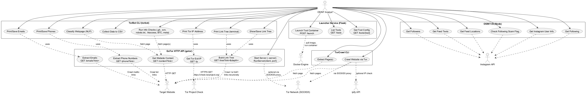
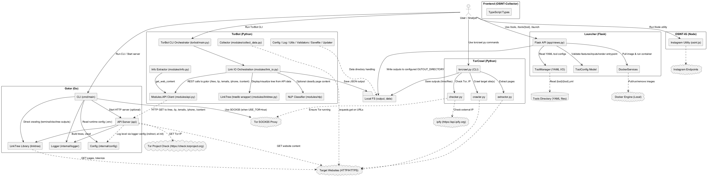
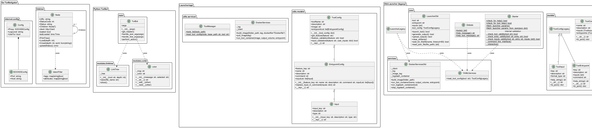

 

% 1 — System Overview
# SECTION 1 — System Overview

This repository aggregates several tools and services aimed at Open Source Intelligence (OSINT) collection and analysis, with emphasis on dark web crawling via Tor. It comprises a Go-based microservice for link crawling and content extraction over HTTP (with optional Tor routing), a Python CLI client and modules for data processing and presentation, an alternative Python Tor crawler, a Flask-based launcher service that orchestrates containerized tools via Docker, type definitions for a frontend, and a Node.js Instagram OSINT helper. The code reveals loosely coupled subsystems that can be used independently or combined in pipelines, with clear integration between the Go “gotor” service and the Python “torbot” client.

## Purpose and Main Functionalities

The overall purpose is to provide capabilities to discover, retrieve, classify, and persist information from websites (including Tor hidden services) and to orchestrate OSINT tools in containers. From the codebase, the core functionalities are:

- Website link-tree discovery and crawling with depth control, email and phone extraction, website content retrieval, and local Tor IP identification, exposed via an HTTP API. These are implemented in Go and can route traffic through a SOCKS5 proxy (Tor) based on configuration.
- Python client modules and CLI that consume the Go API to print link trees, dump JSON, extract emails/phones, and optionally classify page content using a scikit-learn text pipeline. Additional utilities collect datasets, parse metadata, and run various checks (robots.txt, .git/.svn exposure, bitcoin address patterns).
- A separate Python Tor crawler capable of canonicalizing links, applying simple exclusions, crawling with delay and depth limits, and extracting pages to disk or terminal, optionally routing via Tor.
- A Flask “Launcher” microservice that reads YAML tool configurations, validates required inputs, pulls images from registries, and runs tools in Docker containers with configurable entrypoints, exposing REST endpoints to list tools, get tool schema, and launch runs. Comprehensive tests validate tool configuration parsing and Docker interactions.
- Frontend TypeScript type definitions that model tool metadata, runs, and OSINT results, intended to support a UI integrating with the Launcher.
- Node.js helper functions to query Instagram endpoints for user info, following/followers, feed text/locations, and basic scam flags, printing results to console.

## High-Level Scope

The repository contains multiple subsystems. The scope, inferred strictly from the implementation, is a multi-repo-style monolith that groups:

- A Go microservice (“gotor”) providing crawl and content APIs, optionally through Tor, plus a CLI mode to output to terminal, Excel, or as a text tree.
- A Python package (“torbot”) that acts as a client and provides higher-level OSINT utilities and NLP-based page classification.
- A separate Python script (“TorCrawl”) to crawl/extract via Tor using socks5.
- A Flask Launcher service and tests to run containerized tools via Docker, using YAML-based tool definitions.
- Frontend types for a React/Vite application (“OSINT-Collector”) to model tools, capabilities, and OSINT result structures.
- A Node.js Instagram OSINT script (“OSINT-IG”).

These subsystems are structurally independent but can be integrated in workflows: e.g., gotor provides crawl data; torbot consumes it for display/enrichment; the Launcher runs other OSINT tools (e.g., snscrape) and persists results for downstream consumption by a frontend.

## Key Features Evident in the Codebase

- Gotor HTTP API (Go):
  - Endpoints: GET /ip, /emails?link=, /phone?link=, /tree?link=&depth=, /content?link=.
  - Link crawling with depth using an HTML tokenizer, streaming and filtering tokens to discover anchors; Node status acquisition via HTTP status codes; concurrency with goroutines and WaitGroups.
  - Email extraction via mailto: links with syntax and MX validation; phone extraction via tel: links.
  - Configuration via .env (SOCKS5_HOST, SOCKS5_PORT, DEBUG, USE_TOR) and a structured logger (zap).
  - Optional Tor routing by creating an HTTP client with a socks5 proxy.

- TorBot client and modules (Python):
  - HTTP client to gotor (base URL from env HOST/PORT) returning JSON nodes, emails, phones, and content.
  - CLI with command-line options to print tree, visualize/save via treelib, classify pages using scikit-learn (CountVectorizer+TF-IDF+SGDClassifier), and gather site data to CSV with metadata using BeautifulSoup.
  - “Info” checks for robots.txt, .git, .svn, .htaccess, bitcoin regex, and meta tags; simple validators; colored terminal output; JSON export utilities.

- TorCrawl (Python):
  - SOCKS5 setup for Tor, URL canonicalization, rudimentary link filtering, configurable depth/pause, and extraction to files or terminal; simple logging and progress messages.

- Launcher (Flask + Docker SDK):
  - REST endpoints:
    - GET /tools: list available tool folders under a configured directory.
    - GET /tools/<tool>: return the tool’s YAML configuration.
    - POST /launch: validate a feature_key and inputs against YAML; pull image; substitute inputs into entrypoint; run the container with an output bind mount; always remove the image after execution.
  - ToolConfig domain model with strong validation of features and input keys; deterministic input substitution into commands.
  - Tests covering DockerService behaviors (build/pull/run/remove), ToolManager parsing and path handling, endpoint responses and error handling.

- Frontend OSINT-Collector (TypeScript types):
  - Data models for tools, capabilities, launches, input requirements, and detailed OSINT result structures for Instagram, Telegram, and generic search results, aligning with the Launcher’s contract.

- OSINT-IG (Node.js):
  - Console scripts to query Instagram’s web APIs to print user profile info, following/followers lists, feed captions and locations, and basic scam annotations for followed users.

## Subsystems at a Glance

| Subsystem | Language | Entry Points | Purpose | Key External Deps |
|---|---|---|---|---|
| TorBot/gotor | Go | cmd/main/main.go; api.RunServer | HTTP API for link-tree discovery, email/phone extraction, content fetch, Tor IP reporting; optional Tor routing | gorilla/mux, x/net/html, zap, excelize, mgutz/ansi |
| TorBot/torbot | Python | torbot/main.py; run.py | CLI and modules consuming gotor; tree visualization, JSON exports, NLP classification, data collection, info checks | requests, BeautifulSoup, treelib, sklearn, numpy, progress |
| TorCrawl | Python | torcrawl.py | Independent Tor crawler/extractor script with depth/pause | socks, BeautifulSoup |
| Launcher | Python (Flask) | app/__init__.py; app/views.py | Tool orchestration via Docker; YAML-configured tools; REST APIs to list tools, read config, and launch runs | Flask, docker, PyYAML |
| Frontend/OSINT-Collector | TypeScript | vite config; types only | Type definitions for tools, runs, and OSINT results for a React app | Vite, React (plugin) |
| OSINT-IG | Node.js | osint.js | Instagram OSINT helpers (console output) | node-fetch |

This section summarizes the system’s intent and scope strictly from the code. Subsequent sections will elaborate on stakeholders and concerns, architecture views, interfaces, and quality attributes, grounded in the implementation.

% 2 — Architectural Context
## 2. Architectural Context

This section describes the software system’s surroundings as directly evidenced by the codebase: external systems and services it depends on, public APIs and user-facing interfaces it exposes, data sources it consumes or produces, and the identifiable actors interacting with it. The goal is to help readers understand what the system talks to, what it offers to other components, and what runtime/configuration assumptions are encoded in the implementation.

### External Systems

- Tor network via SOCKS5 proxy
  - Go service (gotor) optionally routes HTTP traffic through a SOCKS5 proxy constructed from env (.env: SOCKS5_HOST, SOCKS5_PORT) with default semantics typical of Tor (9050). See Dark Web OSINT tools/TorBot/gotor/cmd/main/main.go:newTorClient.
  - TorCrawl Python CLI configures a SOCKS5 proxy (localhost:9050) using the socks module. See Dark Web OSINT tools/TorCrawl/torcrawl.py:connecttor.
- Arbitrary internet and Tor/onion websites
  - Crawled and fetched by both the Go linktree module (via net/http) and Python modules (requests + BeautifulSoup). User-provided targets drive these calls.
- Tor Project “check” service
  - GET https://check.torproject.org/ to extract and display the Tor exit IP. See Dark Web OSINT tools/TorBot/gotor/api/handlers.go:getTorIP.
- DNS infrastructure
  - MX lookups used for email validation. See Dark Web OSINT tools/TorBot/gotor/api/handlers.go:isEmailValid (net.LookupMX).
- Public IP API (TorCrawl)
  - GET https://api.ipify.org/?format=json to report current public IP. See Dark Web OSINT tools/TorCrawl/modules/checker.py:checkip.
- Instagram web APIs (OSINT-IG)
  - Multiple endpoints under https://i.instagram.com and https://www.instagram.com for user profile, followers/following, and feed. See OSINT-IG/osint.js.
- Docker Engine and Docker Registry
  - Launcher uses docker.from_env to pull images and run tools in containers; pulls images by tag and mounts an output volume. See Laucher/app/utils/services/docker_service.py; Laucher/app/views.py.
- Local filesystem
  - Configuration (YAML tool definitions), runtime artifacts (output files), and training data for NLP. See Laucher/app/configuration.py; TorBot Python modules (TORBOT_DATA_DIR); torbot/modules/nlp.
- Logstash and external HTTP ingest (Old-Launcher only)
  - Old-Launcher can run a logstash container (docker.elastic.co/logstash/logstash:8.12.0) and POST processed results to http://host.docker.internal:8080. See Old-Launcher/launcher/src/services/docker_services.py and Old-Launcher/launcher/src/launcher.py.

### APIs / Interfaces

- gotor HTTP API (Go)
  - Base: local server started by Dark Web OSINT tools/TorBot/gotor/cmd/main/main.go when run with -server flag (default port 8081 in code).
  - Endpoints implemented in Dark Web OSINT tools/TorBot/gotor/api/handlers.go:
    - GET /ip → plain text Tor IP (extracted from https://check.torproject.org/); 500 on failure.
    - GET /emails?link={url} → JSON array of validated emails discovered via link crawling (depth=1).
    - GET /phone?link={url} → JSON array of phone numbers discovered via link crawling (tel:).
    - GET /tree?link={url}&depth={int} → JSON link tree (root and children with status fields).
    - GET /content?link={url} → JSON-encoded string of raw response body from the target URL.
- TorBot Python to gotor bridge (client-side module)
  - Base URL derived from env HOST and PORT (torbot/modules/config.py); module torbot/modules/api.py provides:
    - get_node(link, depth), get_ip(), get_emails(link), get_phone(link), get_web_content(link) which call the corresponding gotor endpoints.
- TorBot Python CLI (end-user executable)
  - Entry points: Dark Web OSINT tools/TorBot/run.py and torbot/__main__.py invoke torbot/main.py.
  - Arguments parsed in torbot/main.py:get_args include URL (-u), depth, output modes (tree/visualize/download/json), NLP classification flags, email/phone collection, and data gathering.
- TorCrawl Python CLI
  - Dark Web OSINT tools/TorCrawl/torcrawl.py exposes a command-line interface with flags for crawling/extracting, depth, pause, logging, TOR usage, input/output files, and output folder.
- Launcher HTTP API (Flask)
  - Implemented in Laucher/app/views.py:
    - GET / → health text.
    - GET /tools → JSON array of available tool folders under TOOLS_DIRECTORY.
    - GET /tools/{tool} → JSON of the YAML configuration for the specified tool; 404 if missing; 500 if YAML invalid.
    - POST /launch → JSON body { tool, feature_key, inputs }, validates feature and inputs, pulls image, computes entrypoint by template substitution, and runs container (volume: OUTOUT_DIRECTORY:/output). Returns JSON with status, tool, feature_key, and resolved entrypoint; error responses on failures.
- OSINT-IG Node module (programmatic)
  - OSINT-IG/osint.js exposes functions for programmatic use:
    - userInfo(username), userFollowing(username, count, max_id), userFollowers(username, count), userFeedText(username, count), userFeedLocations(username, count), areMyFollowingScam(username, count, max_id). Each calls Instagram web endpoints using node-fetch with mobile UA and cookies.
- Frontend type contracts
  - Frontend/OSINT-Collector provides TypeScript interfaces for tool metadata and results (e.g., Tool, RequiredToolInputs, various result models). These types reflect payloads expected from a backend like the Launcher but do not include runtime API calls in this codebase.

### Data Sources

- Environment variables
  - Go gotor (.env loaded via godotenv): SOCKS5_HOST, SOCKS5_PORT, DEBUG, USE_TOR. See Dark Web OSINT tools/TorBot/gotor/internal/config/config.go.
  - TorBot Python (dotenv): HOST, PORT, TORBOT_DATA_DIR, LOG_LEVEL. See torbot/modules/config.py. The module ensures TORBOT_DATA_DIR exists.
- YAML tool definitions (Launcher)
  - Files located under {cwd}/tools/{tool}/{tool}.yml as per Laucher/app/utils/services/tool_manager.py and Laucher/app/configuration.py (TOOLS_DIRECTORY). These define image, inputs, and entrypoints used to construct container commands.
- NLP training corpus (TorBot Python)
  - torbot/modules/nlp/training_data (directory of category subfolders with text files). If missing, torbot/modules/nlp/gather_data.py generates it from website_classification.csv in the same directory. Loaded with sklearn.datasets.load_files.
- Runtime outputs
  - TorBot saveJson writes JSON files into TORBOT_DATA_DIR; collect_data writes CSV files (torbot_{timestamp}.csv) into the same directory; LinkTree.save writes tree text files to TORBOT_DATA_DIR via join_local_path.
  - Launcher runs containers with volume mapping {OUTOUT_DIRECTORY}:/output (config OUTOUT_DIRECTORY = {cwd}/output), so containerized tools write artifacts into the host output folder.
- DNS MX records
  - Queried during server-side email validation in gotor (net.LookupMX).
- External web content
  - HTML pages, robots.txt, and related resources fetched from user-provided targets, default ‘https://thehiddenwiki.org’ in collect_data, and from Instagram/Tor Project/ipify endpoints listed above.

### Users / Actors

- CLI operator
  - Runs TorBot (torbot/main.py via run.py or module entry point) and TorCrawl (torcrawl.py), providing URLs, depth, and options via command-line arguments.
- TorBot Python modules (as HTTP client to gotor)
  - The torbot/modules/api.py module acts as an internal client to the gotor HTTP API, driving crawling, content retrieval, email and phone extraction, and tree construction for downstream features (printing, saving, NLP classification).
- HTTP clients of the Launcher API
  - Any client capable of issuing HTTP requests to the Flask app. The included Frontend/OSINT-Collector defines the data types expected by such clients; tests under Laucher/tests exercise the endpoints programmatically.
- Docker daemon
  - Executes tool containers and manages images upon request from the Launcher service.
- Local Tor daemon
  - Provides the SOCKS5 proxy used by gotor (if USE_TOR=true) and by TorCrawl to route traffic through Tor.

% 2.1 — Architectural Context – Use Case Diagram
# Section 2.1 — Architectural Context – Use Case Diagram

This section presents the system’s external interaction context using a consolidated Use Case diagram derived exclusively from the repository’s implementation. It captures how an OSINT analyst operates the available executables and services, which external systems are involved, and which high-level capabilities are provided by each sub-system. The diagram groups use cases within concrete system boundaries implemented in the codebase: GoTor HTTP API (Go), TorBot CLI (Python), Launcher Service (Flask), TorCrawl CLI (Python), and OSINT-IG (Node.js). External actors include Docker Engine, Tor Network (SOCKS5), various target websites, Tor Project’s check service, the ipify API, and the Instagram API.

Figure 2.1 — Use Case Diagram (filename: section-2-1-use-case-diagram.puml)

% 3 — Containers
## 3. Containers

This section identifies every executable application and service detectable in the codebase, describing their runtime responsibility, core technologies, and how they communicate with other parts of the system or external services. It covers all subprojects present in the repository, including Go-based services, Python CLIs and APIs, the Flask “Launcher”, legacy components, Node-based utilities, and the frontend. External dependencies (e.g., Tor SOCKS5 proxy, Docker Engine, and ephemeral tool containers) are included where they are explicitly used by the code.

| Container | Responsibility | Technology | Communication |
|---|---|---|---|
| gotor HTTP API server | Exposes OSINT endpoints: /ip (Tor IP), /emails (mailto), /phone (tel links), /tree (link graph), /content (raw HTML). Builds and returns link trees and performs limited crawling/tokenization. | Go, net/http, gorilla/mux, x/net/html, zap logger; optional SOCKS5 via http.Transport Proxy. | HTTP/JSON on port 8081; outbound HTTP(S) to target sites; optional SOCKS5 proxy to Tor. |
| TorBot CLI and modules | CLI workflows to print Tor IP, traverse link trees, export JSON, classify pages (NLP), and collect data. Acts as an HTTP client of gotor. | Python 3, requests, BeautifulSoup, treelib, scikit-learn (SGDClassifier), numpy. | HTTP to gotor at http://HOST:PORT (from environment); direct HTTP(S) to websites in data collection; local file I/O for exports and training data. |
| Launcher API | Lists tools, returns tool configuration, and launches tool containers by pulling images and executing templated entrypoints. Manages output volume lifecycle per run. | Python 3, Flask, PyYAML, Docker SDK for Python. | HTTP/JSON (Flask default port 5000); Docker Engine API via local socket; local filesystem volumes (OUTOUT_DIRECTORY) for tool outputs. |
| Old-Launcher API (legacy) | Legacy orchestrator to build/run tool images, start a Logstash container to post-process outputs, and upload results to an external endpoint. Exposes /tools, /tools/<tool>, /launch. | Python 3, Flask, CORS, Docker SDK for Python, PyYAML. | HTTP/JSON on port 5000; Docker Engine API; HTTP to http://host.docker.internal:8080/logstash/{tool}; volumes (output_data, tools_conf). |
| TorCrawl CLI | Standalone crawler/extractor for regular or .onion sites, with optional Tor routing. Generates link lists and page snapshots, with optional logging. | Python 3, urllib, BeautifulSoup, socks, argparse. | Outbound HTTP(S); optional SOCKS5 routing via local Tor at 127.0.0.1:9050; local file I/O for links and extracts. |
| OSINT-IG utilities | Node utilities to query Instagram endpoints for user profile, followers/following, posts text and locations, and scam flags. | Node.js, node-fetch. | HTTPS to Instagram private/web APIs; console output. |
| OSINT-Collector frontend (dev) | Frontend scaffolding and types for the OSINT UI, built with Vite and React. | Vite, React, TypeScript. | HTTP dev server when run (Vite); consumes backend APIs as configured by the application (not defined in this repo). |
| Tor SOCKS5 proxy (external dependency) | Provides network anonymity/routing used by crawlers and the Go service when enabled. | Tor daemon (SOCKS5). | SOCKS5 at configured host/port (defaults commonly 127.0.0.1:9050); consumed by gotor and TorCrawl. |
| Docker Engine (external dependency) | Builds/pulls and runs tool containers; manages images and volumes. | Docker Engine API. | Local Docker socket (docker.from_env); used by Launcher and Old-Launcher. |
| Logstash container (ephemeral, legacy) | Post-processes tool outputs using provided .conf pipelines. | docker.elastic.co/logstash/logstash:8.12.0. | TCP 5044/9600 (as configured); volumes output_data:/output and tools_conf:/tools_conf; launched by Old-Launcher. |
| Tool containers (ephemeral, launched by Launcher) | Executes specific tools (e.g., snscrape) with parameterized entrypoints; writes outputs to mounted /output. | Varies per pulled image/tag specified by tool YAML. | Writes to mounted volume /output; network access as required by the tool; lifecycle managed by Launcher (pull/run/remove). |

% 3.1 — Architecture Overview – Component Diagram
# SECTION 3.1 — Architecture Overview – Component Diagram

This section presents a complete and faithful overview of the repository’s software architecture at component level. It focuses on how the subsystems collaborate, the direction of their dependencies, and the external systems they interact with. The diagram and the accompanying mapping tables are derived strictly from the codebase and can be validated by developers familiar with the implementation. The architecture spans multiple, largely independent tools and services: a Go-based crawler and HTTP API (gotor), a Python CLI and modules (TorBot), a Python Tor crawling utility (TorCrawl), a Flask-based launcher (Launcher), a TypeScript-only frontend types package, and a Node-based Instagram utility (OSINT-IG).

## Figure 3.1 — Component Diagram (PlantUML)

## Component-to-Code Mapping (Complete)

The following tables map every source file in the repository to its logical component. This ensures traceability from the diagram to the implementation and allows validation against the codebase.

### Gotor (Go)

| Logical component | Language | Files |
| --- | --- | --- |
| CLI (cmd/main) | Go | Dark Web OSINT tools/TorBot/gotor/cmd/main/main.go |
| API Server (api) | Go | Dark Web OSINT tools/TorBot/gotor/api/handlers.go; Dark Web OSINT tools/TorBot/gotor/api/handlers_test.go |
| LinkTree Library (linktree) | Go | Dark Web OSINT tools/TorBot/gotor/linktree/linktree.go; Dark Web OSINT tools/TorBot/gotor/linktree/linktree_test.go |
| Logger (internal/logger) | Go | Dark Web OSINT tools/TorBot/gotor/internal/logger/logger.go |
| Config (internal/config) | Go | Dark Web OSINT tools/TorBot/gotor/internal/config/config.go |

### TorBot (Python)

| Logical component | Language | Files |
| --- | --- | --- |
| TorBot CLI Orchestrator | Python | Dark Web OSINT tools/TorBot/torbot/main.py; Dark Web OSINT tools/TorBot/torbot/__main__.py; Dark Web OSINT tools/TorBot/run.py; Dark Web OSINT tools/TorBot/torbot/__init__.py; Dark Web OSINT tools/TorBot/torbot/version.py |
| Modules.API Client | Python | Dark Web OSINT tools/TorBot/torbot/modules/api.py |
| Link IO Orchestration | Python | Dark Web OSINT tools/TorBot/torbot/modules/link_io.py |
| LinkTree (treelib wrapper) | Python | Dark Web OSINT tools/TorBot/torbot/modules/linktree.py |
| NLP Classifier | Python | Dark Web OSINT tools/TorBot/torbot/modules/nlp/main.py; Dark Web OSINT tools/TorBot/torbot/modules/nlp/gather_data.py |
| Info Extractor | Python | Dark Web OSINT tools/TorBot/torbot/modules/info.py |
| Collector | Python | Dark Web OSINT tools/TorBot/torbot/modules/collect_data.py |
| Utilities and Support | Python | Dark Web OSINT tools/TorBot/torbot/modules/config.py; Dark Web OSINT tools/TorBot/torbot/modules/log.py; Dark Web OSINT tools/TorBot/torbot/modules/utils.py; Dark Web OSINT tools/TorBot/torbot/modules/validators.py; Dark Web OSINT tools/TorBot/torbot/modules/savefile.py; Dark Web OSINT tools/TorBot/torbot/modules/updater.py; Dark Web OSINT tools/TorBot/torbot/modules/color.py |
| Tests | Python | Dark Web OSINT tools/TorBot/torbot/modules/tests/test_pagereader.py; Dark Web OSINT tools/TorBot/torbot/modules/tests/test_savetofile.py |

### Launcher (Flask)

| Logical component | Language | Files |
| --- | --- | --- |
| Flask API | Python | Laucher/app/__init__.py; Laucher/app/views.py; Laucher/app/configuration.py |
| ToolManager (YAML I/O) | Python | Laucher/app/utils/services/tool_manager.py |
| ToolConfig Model | Python | Laucher/app/utils/models/tool_config.py |
| DockerServices | Python | Laucher/app/utils/services/docker_service.py |
| Tests | Python | Laucher/tests/conftest.py; Laucher/tests/test_docker_service.py; Laucher/tests/test_status_response.py; Laucher/tests/test_tool_manager.py; Laucher/tests/test_tool_model.py |

### TorCrawl (Python)

| Logical component | Language | Files |
| --- | --- | --- |
| torcrawl.py (CLI) | Python | Dark Web OSINT tools/TorCrawl/torcrawl.py |
| crawler | Python | Dark Web OSINT tools/TorCrawl/modules/crawler.py |
| extractor | Python | Dark Web OSINT tools/TorCrawl/modules/extractor.py |
| checker | Python | Dark Web OSINT tools/TorCrawl/modules/checker.py |

### Frontend (OSINT-Collector)

| Logical component | Language | Files |
| --- | --- | --- |
| TypeScript Types | TypeScript | Frontend/OSINT-Collector/src/types.ts; Frontend/OSINT-Collector/src/types/results.ts; Frontend/OSINT-Collector/src/vite-env.d.ts; Frontend/OSINT-Collector/vite.config.ts |

### OSINT-IG (Node)

| Logical component | Language | Files |
| --- | --- | --- |
| Instagram Utility | JavaScript (Node) | OSINT-IG/osint.js; OSINT-IG/test.js |

### Old-Launcher (Legacy, not wired to current Flask launcher)

| Logical component | Language | Files |
| --- | --- | --- |
| Legacy Server | Python | Old-Launcher/launcher/main.py |
| Legacy Models | Python | Old-Launcher/launcher/src/models/tool_config.py; Old-Launcher/launcher/src/models/tool_entrypoint.py; Old-Launcher/launcher/src/models/tool_input.py |
| Legacy Services | Python | Old-Launcher/launcher/src/services/docker_services.py; Old-Launcher/launcher/src/services/yaml_services.py |
| Legacy CLI & Utilities | Python | Old-Launcher/launcher/src/launcher.py; Old-Launcher/launcher/src/starter.py; Old-Launcher/launcher/src/globals.py |

## Narrative and Validation Notes

The Gotor subsystem implements a Go HTTP API server exposing five GET endpoints: /ip (getTorIP via torproject.org), /emails (mailto: link extraction via LinkTree.Crawl), /phone (tel: link extraction), /tree (HTML tokenization and recursive link graph construction), and /content (raw page content). The API relies on the linktree package, which tokenizes HTML streams using golang.org/x/net/html and performs concurrent crawl using sync.WaitGroup. The CLI can either run the HTTP server or perform local crawling with outputs to terminal, xlsx (excelize), or a printed tree; it optionally routes HTTP through a SOCKS5 Tor proxy configured via .env and the internal config package.

The TorBot subsystem is a Python CLI that orchestrates operations through link_io. It invokes the gotor API via modules/api.py to retrieve trees, IPs, emails, phones, and page content. It can classify content via the NLP module using scikit-learn and BeautifulSoup, extract metadata and various indicators with the info module, gather datasets via collect_data, and persist results to a configured data directory. Configuration (host, port, log level, data directory) is read from environment variables.

The Launcher subsystem is a standalone Flask application that lists available tools from a TOOLS_DIRECTORY, reads YAML tool definitions, validates features and inputs through a ToolConfig model, pulls container images and runs tools with DockerServices, writing outputs into OUTOUT_DIRECTORY and cleaning images after execution. The tests assert behavior for valid/invalid tool configs and Docker error handling.

TorCrawl is an independent CLI utility for crawling and extraction over Tor. It can establish a SOCKS5 proxy through PySocks, verify Tor readiness and external IP through process checks and ipify, crawl links with BeautifulSoup, and extract content to files.

The Frontend package contains type definitions for client models; it is isolated in this repository snapshot. OSINT-IG is a Node utility hitting Instagram endpoints and printing structured outputs; it is not integrated with other components here.

This component diagram and mapping ensure complete coverage of the repository. All inter-component relationships shown are directly supported by the code, and no relationships are inferred beyond the observed implementation.

% 4 — Components
## 4. Components

This section identifies and describes the internal components within each deployable container of the repository. For each component, it specifies its responsibilities and its key collaborations, including function calls, imports, and external dependencies. The goal is to enable developers and integrators to validate component boundaries, responsibilities, and interaction points against the implementation.

### 4.1 Container: TorBot — Go service (“gotor”)

| Component | Responsibility | Interactions |
|---|---|---|
| Package api (handlers.go) | Exposes the HTTP API for link crawling and OSINT utilities. Defines handlers: GetIP, GetEmails, GetPhoneNumbers, GetTreeNode, GetWebsiteContent. Manages HTTP server lifecycle via RunServer with Gorilla Mux. | Calls linktree.NewNode, Node.Load, Node.Crawl; uses internal/logger for logging; uses net/http for server and client requests; validates emails with regexp and net.LookupMX; parses HTML with golang.org/x/net/html; uses encoding/json for responses; consumes optional override http.Client (TOR-enabled) from cmd/main. |
| Function RunServer(overrideClient, port) | Initializes Gorilla Mux router and starts HTTP server on the given port. Supports injecting a custom http.Client (e.g., SOCKS5/TOR) into package-level client. | http.ListenAndServe; routes to GetIP, GetEmails, GetPhoneNumbers, GetTreeNode, GetWebsiteContent; uses internal/logger. |
| Handler GetTreeNode | Builds a link tree from the requested root URL at specified depth and returns it as JSON. Validates depth and link query params. | linktree.NewNode(client, link); node.Load(depth); json.NewEncoder.Encode(node); internal/logger. |
| Handler GetEmails | Extracts mailto: links one hop from the root and returns validated emails list as JSON. | getEmails(link); json.NewEncoder.Encode; internal/logger. |
| Helper getEmails | Crawls outgoing links (depth 1) and collects “mailto:” href values; validates each email with isEmailValid. | Node.Crawl; isEmailValid; strings.Split; internal DNS MX lookup via net.LookupMX. |
| Handler GetPhoneNumbers | Extracts tel: links one hop from the root and returns a list as JSON. | getPhoneNumbers(link); json.NewEncoder.Encode; internal/logger. |
| Helper getPhoneNumbers | Crawls outgoing links (depth 1) and collects “tel:” href values. | Node.Crawl; strings.Split. |
| Handler GetWebsiteContent | Returns raw content for the provided URL; propagates non-OK as 500. | getWebsiteContent(link); json.NewEncoder.Encode; internal/logger. |
| Helper getWebsiteContent | Performs HTTP GET and returns response body as string. | client.Get; ioutil.ReadAll. |
| Handler GetIP | Retrieves the TOR exit IP as seen by check.torproject.org and writes it as text. | getTorIP(); internal/logger. |
| Helper getTorIP | HTML token streaming of https://check.torproject.org/ to extract the value inside a <strong> tag (exit IP). | client.Get; golang.org/x/net/html.Tokenizer. |
| emailRegex, isEmailValid | RFC-like regex validation and MX DNS lookup to verify email domains. | regexp, strings.Split, net.LookupMX. |
| Package linktree (linktree.go) | Fetches pages, parses HTML tokens, and builds a directed tree of URLs. Provides crawling primitives. | Uses internal/logger; html tokenization via golang.org/x/net/html; concurrency via sync.WaitGroup; URL validation via net/url; HTTP via net/http. |
| Type Node | Represents a page node with URL, status code/text, children, and metadata (timestamps). Methods: PrintTree, updateStatus, Load, Crawl. | node.client.Get; Node.Children; status management; recurses to children; collaborates with streamTokens/filterTokens/buildTree/crawl. |
| Function NewNode(client, URL) | Factory that instantiates Node and initializes HTTP status synchronously. | node.updateStatus; sets 500/Internal Server Error on failure. |
| Function streamTokens | Concurrently streams html.Token instances for StartTagToken from a page to a buffered channel. | client.Get; html.Tokenizer; logs via internal/logger. |
| Function filterTokens | Filters tokens for specified tags/attributes and streams matching values (e.g., anchor hrefs). | Selects tokens based on tokenFilter.tags/attributes; pipelines into channel of strings. |
| Type tokenFilter | Tag/attribute filters used by filterTokens. | Used by Load and Crawl. |
| Function buildTree | Recursively constructs child Nodes from filtered link stream; limits recursion by depth; deduplicates parent vs child. | NewNode; streamTokens; filterTokens; appends Node.Children; sync.WaitGroup. |
| Method Node.Load(depth) | Orchestrates streaming and filtering of tokens, then builds tree concurrently to requested depth. Marks node loaded and timestamps. | streamTokens; filterTokens; buildTree; sync.WaitGroup. |
| Function crawl | Recursive work scheduler that applies a function to each discovered link, then continues to requested depth. | streamTokens; filterTokens; sync.WaitGroup; provided doWork(link) callback. |
| Method Node.Crawl(depth, work) | Entry point for functional crawling of links; schedules via crawl(). | streamTokens; filterTokens; crawl. |
| Package internal/config (config.go) | Loads environment-based configuration and exposes it globally (proxy host/port, log level, UseTor flag). | godotenv.Load; os.Getenv; strings.ToLower; zap logger for warnings. |
| Type Config, SOCKS5Config | Holds application settings used by cmd and logger. | Returned via GetConfig. |
| Function GetConfig | Global accessor for loaded Config. | Used by internal/logger and cmd/main. |
| Package internal/logger (logger.go) | Thin wrapper around Uber Zap logger with sugared helpers. Handles log level and timestamp encoding. | zap.NewProductionConfig; zapcore.ISO8601TimeEncoder; functions: Debug, Info, Warn, Error, Fatal. |
| Module cmd/main (main.go) | CLI entrypoint. Configures optional SOCKS5 proxy client, runs server mode or CLI modes to print status to terminal, Excel, or tree. | newTorClient; api.RunServer; linktree.NewNode; Node.Crawl/Load/PrintTree; excelize for XLSX; flags; internal/config; internal/logger; net/url parsing. |
| Function newTorClient | Creates an http.Client with SOCKS5 proxy Transport. | url.Parse; http.ProxyURL; http.Transport. |
| Functions writeTerminal/writeExcel/writeTree | Emit outputs based on chosen mode; writeExcel builds a workbook with link/status rows; writeTerminal colors OK/ERR via mgutz/ansi; writeTree prints recursive tree. | linktree.Node.Crawl/Load; excelize; ansi; logger; url.Parse for file naming. |
| Tests: api/handlers_test.go | Validates getTorIP, getEmails, getPhoneNumbers, linktree tree building via httpmock; tests getWebsiteContent. | Uses github.com/jarcoal/httpmock; github.com/stretchr/testify/assert; http.DefaultClient; linktree.NewNode.Load. |
| Tests: linktree/linktree_test.go | Validates NewNode initialization and updates, URL validation, Load and Crawl behavior. | httpmock; assert; http.DefaultClient. |

### 4.2 Container: TorBot — Python CLI and library (“torbot”)

| Component | Responsibility | Interactions |
|---|---|---|
| modules/api.py | Python client for the Go gotor service. Performs HTTP requests to retrieve link trees, IP, emails, phones, and raw content. | requests; constructs base_url from modules.config.host/port; logs via modules.log.debug. Functions: get_node, get_ip, get_emails, get_phone, get_web_content. |
| modules/linktree.py | High-level tree representation built from API. Wraps treelib.Tree to persist/show trees and save to local path. | get_node from modules.api; treelib.Tree and exceptions; utils.join_local_path; modules.log.debug. Functions: formatNode, build_tree_recursive; class LinkTree with save() and show(). |
| modules/link_io.py | CLI-facing utilities: print TOR IP, print/cascade link trees, JSON printing, classify pages, and print emails/phones. | api.get_* functions; color.color for colored output; nlp.main.classify; pprint; Links to LinkTree in type annotations but uses API JSON. |
| modules/nlp/main.py | Page content classifier using scikit-learn pipeline (CountVectorizer+Tfidf+SGDClassifier). Handles training data loading and creation on demand. | BeautifulSoup for text extraction; scikit-learn Pipeline, datasets.load_files; train_test_split; numpy; calls modules/nlp/gather_data.write_data if training_data missing. Function: classify(data). |
| modules/nlp/gather_data.py | Prepares training dataset from website_classification.csv into training_data/<category>/<id>.txt. | csv; pathlib.Path; os.chdir to module dir. Function: write_data(). |
| modules/collect_data.py | Gathers links from a page, fetches each, extracts title/meta/body; writes CSV via SafeDictWriter; shows progress bar. | requests; BeautifulSoup; threadsafe.safe_csv.SafeDictWriter; validators via modules.validators; join_local_path; progress.bar.Bar; uuid; datetime. Functions: parse_links, parse_meta_tags, get_links, collect_data. |
| modules/info.py | Executes content-focused probes (robots.txt, dot directories, bitcoin addresses) and prints descriptions and headers; writes datasets to files. | Uses get_web_content(HTTP) from modules.api; BeautifulSoup; termcolor.cprint; regex for intel and bitcoin; urlsplit; sets for caching results; writer() persists results. Functions: execute_all, display_headers, get_robots_txt, get_intel, get_dot_git, get_bitcoin_address, get_dot_svn, get_dot_htaccess, display_webpage_description, writer. |
| modules/config.py | Loads configuration from environment: HOST, PORT, TORBOT_DATA_DIR, LOG_LEVEL. Ensures data directory exists and maps LOG_LEVEL to logging level. | dotenv.load_dotenv; os.path; logging constants; get_log_level(). |
| modules/log.py | Simple wrapper around Python logging configured by modules.config.get_log_level. | logging.basicConfig; functions: info, fatal, debug. |
| modules/utils.py | File utilities for finding files and joining local data paths. Ensures data directory exists. | os; modules.config.data_directory. Functions: find_file, join_local_path. |
| modules/color.py | ANSI color helper for strings; encapsulates message/color with operator overloads. | ANSI escape sequences; class color with __str__/__add__/__radd__. |
| modules/validators.py | Thin wrappers over validators library for emails and URLs. | validators.email, validators.url. |
| modules/savefile.py | Handles JSON serialization of results into timestamped files under local data directory. | json; time; join_local_path. Function: saveJson(datatype, data). |
| modules/updater.py | Ensures Git repository exists and pulls latest on master/dev branches for TorBoT. | subprocess.run with git commands; handles CalledProcessError. |
| torbot/main.py | CLI composition root. Parses arguments, prints header, routes to features (tree, JSON, emails, phones, info, classify, gather). | argparse; modules.link_io; modules.linktree.LinkTree; modules.color.color; modules.updater; modules.savefile; modules.info.execute_all; modules.collect_data; modules.nlp.main; version.__version__. Class: TorBot with perform_action() and helpers; get_args(). |
| torbot/__main__.py, run.py | Entrypoints delegating to torbot.main. | Imports and executes TorBot with parsed args; handles KeyboardInterrupt. |
| tests/modules/test_pagereader.py | Tests LinkIO.read behavior (via requests_mock) by simulating HTML pages; asserts content reading. | requests_mock; yattag.Doc; pytest. |
| tests/modules/test_savetofile.py | Tests saveJson by comparing saved output to expected JSON. | json; os; modules.savefile.saveJson; pytest. |

### 4.3 Container: TorCrawl — Python crawler (standalone script)

| Component | Responsibility | Interactions |
|---|---|---|
| modules/checker.py | URL canonicalization, domain extraction, output folder management, TOR process check, and external IP check. | subprocess.check_output (ps); regex; sys.exit on missing TOR; urllib.request.urlopen; json.load; os. Functions: urlcanon, extract_domain, folder, checktor, checkip. |
| modules/crawler.py | Core crawler that visits pages to specified depth, extracts links from <a> and <area>, filters and canonicalizes links, handles delays, and logs HTTP codes. | urllib.request; BeautifulSoup; re; sys.stdout for progress; time.sleep; writes external links, telephones, mails to files. Functions: excludes, canonical, crawler. |
| modules/extractor.py | Fetches and outputs page content to terminal or files, or processes lists of URLs from file for batch saving. | urllib.request; os; sys; error handling; writes files. Functions: cinex, intermex, outex, termex, extractor. |
| torcrawl.py | CLI entrypoint orchestrating TOR connectivity, argument parsing, crawling/extracting, and saving outputs. | socks, socket for TOR; argparse; checker.checktor/connecttor/checkip; calls crawler and extractor; filesystem writes for links.txt. |

### 4.4 Container: Launcher — Flask API for tool orchestration

| Component | Responsibility | Interactions |
|---|---|---|
| app/__init__.py | Flask app factory and blueprint registration. | Flask; registers views_bp from app.views. |
| app/configuration.py | Environment-specific configuration classes (DevelopmentConfig, TestingConfig) including tools and output directories. | os.getcwd; used via Flask app.config. |
| app/views.py | REST endpoints: GET /tools, GET /tools/<tool>, POST /launch, GET /. Validates inputs, reads tool YAML, validates feature/inputs, pulls Docker image, runs tool container, and returns status. | ToolManager.read_tool_config; ToolConfig; DockerServices.pull_image/run_tool_container; Flask request/current_app; yaml error handling; JSON responses. |
| app/utils/models/tool_config.py | Domain model for tool configuration. Classes: Input, EntrypointConfig, ToolConfig. Handles command template substitution, feature and input validation, and lookup. | yaml-loaded dicts from ToolManager; replaces ${KEY} placeholders; typing.List/Path. |
| app/utils/services/tool_manager.py | Discovers tools folder contents and reads YAML configurations safely with error propagation. | pathlib.Path; yaml.safe_load; raises FileNotFoundError/YAMLError for views to handle. |
| app/utils/services/docker_service.py | Docker client wrapper to build/pull images and run ephemeral containers mounting an output volume; cleans up images. | docker.from_env; images.build/pull/remove; containers.run; logging. |
| tests/conftest.py | Pytest fixtures for app and test client. | Flask app factory. |
| tests/test_status_response.py | Integration tests for endpoint status codes, tools list, tool details, error cases, and launch flow happy path. | client.get/post; yaml.safe_load; Path; asserts JSON responses. |
| tests/test_tool_manager.py | Tests ToolManager tools_list and read_tool_config behavior, including error scenarios. | yaml; pathlib; pytest. |
| tests/test_tool_model.py | Tests Input/EntrypointConfig/ToolConfig behaviors: repr, substitution, validations, exceptions. | pytest; yaml; Path; app.configuration.TestingConfig. |

### 4.5 Container: Frontend — OSINT-Collector (Vite/React TypeScript types)

| Component | Responsibility | Interactions |
|---|---|---|
| src/types.ts | Shared type models for platform, capabilities, tools, runs, and Google-like search responses used by the frontend. | Type-only; no runtime dependencies beyond TS type system. |
| src/types/results.ts | Domain-specific result types for blackbird, snscrape, Instagram, Telegram entities and messages; includes moderation categories. | Type-only; no runtime dependencies. |
| vite.config.ts | Vite bundler configuration for React plugin. | @vitejs/plugin-react. |
| src/vite-env.d.ts | TypeScript env typings (empty in repo). | Type-only. |

### 4.6 Container: OSINT-IG — Node.js Instagram utilities

| Component | Responsibility | Interactions |
|---|---|---|
| osint.js | Exposes functions to query Instagram endpoints using node-fetch: userInfo, userFollowing, userFollowers, userFeedText, userFeedLocations, areMyFollowingScam. Performs chained requests and prints results to console. | Dynamic import of node-fetch; uses hardcoded cookies and mobile UA headers; multiple Instagram endpoints; processes JSON responses; console.log outputs. |
| test.js | Simple harness that invokes userFollowing("nasa", 25, 0). | Requires ./osint and calls exported function. |

### 4.7 Cross-cutting interactions and notes

| Component | Responsibility | Interactions |
|---|---|---|
| TorBot Python ↔ Gotor Go | The Python modules/api.py is a client for the Go HTTP service. It assumes HOST/PORT from environment via modules/config.py and calls /tree, /ip, /emails, /phone, /content endpoints implemented by gotor/api. | HTTP over localhost (or configured host). JSON contract for Node matches linktree.Node struct fields (url, status_code, status, children). |
| SOCKS5/TOR usage | Gotor’s cmd/main can wrap the http.Client with a SOCKS5 proxy for TOR via newTorClient and forwards that to the API server (RunServer). All downstream HTTP within api and linktree use this injected client. | net/http.Transport ProxyURL; affects api.getTorIP, getWebsiteContent, linktree status and crawling. |
| Persistence | Python modules save JSON and CSV in TORBOT_DATA_DIR. Launcher writes outputs through Docker volume /output. | modules/savefile, modules/collect_data, Flask current_app.config OUTOUT_DIRECTORY (note: typo preserved). |

This component inventory reflects the actual implementation and dependencies present in the codebase and can be validated against the source files listed in the repository.

% 5 — Code-Level View
# SECTION 5 — Code-Level View

This section maps the implemented architecture to concrete source code artifacts. It identifies the executable entry points, the key packages, modules, and directories, and highlights recognizable design and coding patterns. The content is derived solely from the provided source code to enable validation by developers familiar with this repository.

## 5.1 Purpose

The purpose of this code-level view is to provide a traceable link between architectural building blocks and the actual implementation. It enables maintainers to understand where responsibilities reside in the codebase, how different sub-systems interact, and how to run, test, or extend each part safely.

## 5.2 Source Tree to Components Map

The repository contains multiple sub-systems that can run independently or cooperate:

| Component | Directory | Role | Interactions |
|---|---|---|---|
| TorBot Go service (“gotor”) | Dark Web OSINT tools/TorBot/gotor | HTTP server exposing crawl, link-tree, email/phone extraction, and Tor IP endpoints; also a CLI that can crawl and export Excel or print trees | Python TorBot client modules call its HTTP API; can run with or without Tor proxy |
| TorBot Python client/CLI | Dark Web OSINT tools/TorBot/torbot and Dark Web OSINT tools/TorBot/run.py | CLI and utilities to call the Go service, format results, classify content (NLP), and perform auxiliary OSINT checks | Consumes the Go service via HTTP; persists outputs to local data directory; uses Sklearn for classification |
| TorCrawl (legacy/standalone) | Dark Web OSINT tools/TorCrawl | Standalone TOR-enabled crawler/extractor for web pages | Independent script; not integrated with gotor |
| Launcher (new Flask-based) | Laucher/app | REST service to list tools, validate tool configs, and run Dockerized tools with parameter substitution | Uses Python Docker SDK; designed to be called by external frontends |
| Old-Launcher (legacy) | Old-Launcher/launcher | Legacy Flask server and CLI tool to build/run Dockerized tools and push results through Logstash | Superseded by the new Launcher; still runnable |
| Frontend type definitions | Frontend/OSINT-Collector | TypeScript type models for a React/Vite UI | Types only; no runtime entrypoint here |
| Instagram OSINT helpers | OSINT-IG | Node.js helper functions to call Instagram endpoints | Library-style module with a small test script |

## 5.3 Executable Entry Points and Invocation

| Entry Point | Language | Location | Function/Main | Behavior |
|---|---|---|---|---|
| gotor CLI / server | Go | Dark Web OSINT tools/TorBot/gotor/cmd/main/main.go | func main() | Parses flags; optionally creates SOCKS5 Tor client; runs HTTP server on port 8081 when -server is true; otherwise crawls and outputs to terminal/excel/tree |
| gotor HTTP server handlers | Go | Dark Web OSINT tools/TorBot/gotor/api/handlers.go | RunServer(overrideClient, port) | Configures Gorilla Mux routes: GET /ip, /emails, /phone, /tree, /content |
| TorBot Python CLI | Python | Dark Web OSINT tools/TorBot/run.py and Dark Web OSINT tools/TorBot/torbot/__main__.py | main.get_args(), TorBot.perform_action() | Parses arguments and executes crawl/print/save/classify/info actions; invokes gotor via modules/api.py |
| TorCrawl CLI | Python | Dark Web OSINT tools/TorCrawl/torcrawl.py | main() | Argparse-based tool; optionally configures TOR; crawls/extracts pages; writes lists/files |
| New Launcher API (Flask) | Python | Laucher/app/__init__.py and Laucher/app/views.py | create_app(), blueprint routes | Flask app with endpoints: GET /tools, GET /tools/<tool>, POST /launch |
| Old-Launcher API (Flask) | Python | Old-Launcher/launcher/main.py | Flask routes in __main__ | Legacy server with /tools, /tools/<tool>, /launch; integrates Docker and Logstash |
| OSINT-IG script | Node.js | OSINT-IG/test.js | require("./osint"); calls userFollowing() | Demonstrates calling the exported functions from osint.js |

Environment and configuration influences:
- gotor reads .env through internal/config/config.go (USE_TOR, SOCKS5_HOST, SOCKS5_PORT, DEBUG).
- TorBot Python client reads HOST, PORT, TORBOT_DATA_DIR, LOG_LEVEL via modules/config.py (.env support).
- Launcher reads TOOLS_DIRECTORY and OUTOUT_DIRECTORY from app/configuration.py (per environment class).

## 5.4 Modules and Files by Subsystem

### 5.4.1 TorBot Go service (“gotor”)

This service implements crawling, link-tree construction, content retrieval, and Tor IP detection. It is both a CLI and a server.

| Path | Responsibility | Notes and Dependencies |
|---|---|---|
| Dark Web OSINT tools/TorBot/gotor/cmd/main/main.go | Program entry point | Flags: -l, -d, -h, -p, -o, -server; builds SOCKS5 Tor client if configured; invokes api.RunServer or performs crawl; Output modes: terminal, excel (xlsx), tree; Uses excelize/v2, mgutz/ansi |
| Dark Web OSINT tools/TorBot/gotor/api/handlers.go | HTTP API and helpers | Endpoints: /ip (getTorIP via html tokenizer), /emails (mailto: collection with MX validation), /phone (tel:), /tree (builds linktree.Node with Load), /content; Uses Gorilla Mux; global http.Client override via RunServer() |
| Dark Web OSINT tools/TorBot/gotor/api/handlers_test.go | Unit tests for handlers | Tests getTorIP, getEmails, getPhoneNumbers, tree loading, content retrieval via httpmock |
| Dark Web OSINT tools/TorBot/gotor/linktree/linktree.go | Core crawling and tree-building | Node struct (URL, StatusCode, Status, Children); NewNode(), updateStatus(); streamTokens() and filterTokens() pipeline over HTML tokens; Load(depth) builds tree concurrently; Crawl(depth, work) executes a function over links; Uses golang.org/x/net/html, sync.WaitGroup, channels; logger |
| Dark Web OSINT tools/TorBot/gotor/linktree/linktree_test.go | Unit tests for linktree | Tests NewNode, isValidURL, Load, Crawl with httpmock |
| Dark Web OSINT tools/TorBot/gotor/internal/config/config.go | Configuration loader | Loads .env (godotenv); sets Proxy Host/Port; LogLevel (debug/info) and UseTor |
| Dark Web OSINT tools/TorBot/gotor/internal/logger/logger.go | Logging facade | Wraps zap; ISO8601 time encoder; Debug/Info/Warn/Error/Fatal adapters |

Inter-module dependencies within gotor:
- cmd/main uses internal/config and api, linktree, logger.
- api uses linktree and internal/logger and Gorilla Mux.
- linktree uses internal/logger.

### 5.4.2 TorBot Python client/CLI and modules

The Python portion provides a CLI and client helpers that call the Go HTTP service.

| Path | Responsibility | Notes and Dependencies |
|---|---|---|
| Dark Web OSINT tools/TorBot/run.py | CLI runner | Mirrors torbot/__main__.py; calls main.get_args() and TorBot.perform_action() |
| Dark Web OSINT tools/TorBot/torbot/__main__.py | Package runner | Same flow as run.py |
| Dark Web OSINT tools/TorBot/torbot/main.py | CLI orchestration class | TorBot class: argument parsing, banner, orchestrates actions: print Tor IP, print tree/json/emails/phones, classify, info, gather; Integrates NLP classify and modules.info; Uses LinkTree for visualization |
| Dark Web OSINT tools/TorBot/torbot/modules/api.py | HTTP client to gotor | Reads HOST/PORT from modules/config.py; functions get_node, get_ip, get_emails, get_phone, get_web_content using requests |
| Dark Web OSINT tools/TorBot/torbot/modules/linktree.py | Client-side tree builder | Builds a treelib.Tree from the JSON node returned by gotor /tree endpoint; save() to file; show() |
| Dark Web OSINT tools/TorBot/torbot/modules/link_io.py | Printing and cascading utilities | print_tor_ip_address(); print_tree()/print_json(); print_emails()/print_phones(); cascade traversal; optional page classification |
| Dark Web OSINT tools/TorBot/torbot/modules/info.py | Targeted OSINT checks | Heuristics: robots.txt, .git/.svn/.htaccess, bitcoin address patterns, meta tags; fetches content via modules/api.get_web_content; writes categorized outputs |
| Dark Web OSINT tools/TorBot/torbot/modules/collect_data.py | Data collection to CSV | Fetches links from a page and writes structured CSV with SafeDictWriter; parses meta tags; default_url thehiddenwiki |
| Dark Web OSINT tools/TorBot/torbot/modules/nlp/main.py | NLP classification | BeautifulSoup to strip HTML, then scikit-learn Pipeline (CountVectorizer + Tfidf + SGDClassifier); loads training_data (generated by gather_data.py) |
| Dark Web OSINT tools/TorBot/torbot/modules/nlp/gather_data.py | Training data preparation | Reads website_classification.csv; writes text files into training_data/<category> |
| Dark Web OSINT tools/TorBot/torbot/modules/config.py | Config for Python modules | Loads .env; exports port, host, TORBOT_DATA_DIR, LOG_LEVEL; creates data dir if missing |
| Dark Web OSINT tools/TorBot/torbot/modules/log.py | Logging wrapper | Python logging configured using LOG_LEVEL from config |
| Dark Web OSINT tools/TorBot/torbot/modules/color.py | Terminal colors helper | color class with ANSI color mappings |
| Dark Web OSINT tools/TorBot/torbot/modules/savefile.py | JSON saving | saveJson(datatype, data) to TORBOT_DATA_DIR |
| Dark Web OSINT tools/TorBot/torbot/modules/utils.py | Filesystem helpers | find_file(name, path), join_local_path(file_name) ensuring data dir exists |
| Dark Web OSINT tools/TorBot/torbot/modules/validators.py | Input validation | Uses validators library to validate email/URL |
| Dark Web OSINT tools/TorBot/torbot/modules/tests/test_pagereader.py | Unit test | Tests LinkIO.read via requests_mock and yattag; note: LinkIO.read is referenced but not present in current modules; likely historical test |
| Dark Web OSINT tools/TorBot/torbot/modules/tests/test_savetofile.py | Unit test | Verifies saveJson output against expected JSON |
| Dark Web OSINT tools/TorBot/torbot/version.py | Version string | __version__ = '2.1.0' |
| Dark Web OSINT tools/TorBot/torbot/__init__.py | Re-exports | Exposes selected modules/classes |

Notable internal call graph:
- torbot/main.py uses modules/link_io.py, modules/linktree.py, modules/info.py, modules/savefile.py, modules/nlp.
- modules/link_io.py calls modules/api.py (which calls the Go server).
- modules/config.py ensures output directory exists and logging levels are set.

### 5.4.3 TorCrawl (standalone legacy crawler)

| Path | Responsibility | Notes and Dependencies |
|---|---|---|
| Dark Web OSINT tools/TorCrawl/torcrawl.py | Main CLI | Argparse-based; calls checker, crawler, extractor; optional TOR via socks; prints status and writes results |
| Dark Web OSINT tools/TorCrawl/modules/checker.py | Utilities | URL canonicalization, domain extraction, folder creation, checks for tor process, retrieves external IP via ipify |
| Dark Web OSINT tools/TorCrawl/modules/crawler.py | HTML traversal | Uses BeautifulSoup to find a/area links; excludes external/anchors/mailto/tel/files; simple breadth/depth iteration with delay |
| Dark Web OSINT tools/TorCrawl/modules/extractor.py | Page fetching | Writes content to files; terminal printing; handles lists of URLs |

This tool does not interact with gotor and operates independently.

### 5.4.4 Launcher (new Flask-based orchestration)

| Path | Responsibility | Notes and Dependencies |
|---|---|---|
| Laucher/app/__init__.py | App factory | create_app(config_class) sets config and registers blueprint; runnable if __main__ |
| Laucher/app/views.py | REST endpoints | Blueprint routes: GET /tools (lists tool folders), GET /tools/<tool> (returns YAML config), POST /launch (validates, pulls Docker image, computes entrypoint with input substitution, runs container; always removes image after run); returns JSON status |
| Laucher/app/configuration.py | App configuration | DevelopmentConfig/TestingConfig define TOOLS_DIRECTORY and OUTOUT_DIRECTORY (note: property spelled OUTOUT) |
| Laucher/app/utils/models/tool_config.py | Tool model | Input, EntrypointConfig, ToolConfig; loads YAML dict into typed structures; input substitution in commands; validation helpers |
| Laucher/app/utils/services/tool_manager.py | Tool discovery and YAML reading | tools_list(dir), read_tool_config(base_path, tool) with YAML error handling |
| Laucher/app/utils/services/docker_service.py | Docker client wrapper | build_image(path, tag, dockerfile) with logging; pull_image(tag) raising on API error; run_tool_container(image, output_volume, entrypoint) cleans up image; uses docker.from_env() |

Tests (runnable with pytest) validate the API and services:
- Laucher/tests/conftest.py initialises the Flask app with TestingConfig.
- Laucher/tests/test_status_response.py covers routes, error conditions, and a full happy path with expected entrypoint computation.
- Laucher/tests/test_docker_service.py covers DockerServices behavior and error logging/cleanup.
- Laucher/tests/test_tool_manager.py covers tool discovery and YAML parsing behaviors.
- Laucher/tests/test_tool_model.py covers model behavior, input substitution, and validation.

### 5.4.5 Old-Launcher (legacy)

| Path | Responsibility | Notes and Dependencies |
|---|---|---|
| Old-Launcher/launcher/main.py | Legacy Flask server | Routes for /tools, /tools/<tool>, /launch; orchestrates building/running tools and uploading outputs; copies Logstash .conf files at startup |
| Old-Launcher/launcher/src/launcher.py | Launch + pipeline | Builds image, runs container, waits for output, uploads via HTTP to host; cleans artifacts |
| Old-Launcher/launcher/src/starter.py | CLI parameters | Validator of tool, entrypoint, and inputs; can be interactive |
| Old-Launcher/launcher/src/services/docker_services.py | Docker wrapper | Build and run container by folder; run logstash container; cleanup |
| Old-Launcher/launcher/src/services/yaml_services.py | YAML parser | Reads ./tools/<tool>/<tool>.yml into ToolConfig |
| Old-Launcher/launcher/src/models/tool_config.py | Tool config model | Represents tool, inputs, and entrypoints |
| Old-Launcher/launcher/src/models/tool_entrypoint.py | Entrypoint model | Holds key, description, inputs, command |
| Old-Launcher/launcher/src/models/tool_input.py | Input model | Holds key, description, type |
| Old-Launcher/launcher/src/globals.py | Helpers | List tools, build help messages |

This subsystem is functionally similar to the new Launcher but includes Logstash integration and a different configuration/discovery mechanism.

### 5.4.6 Frontend type definitions (React/Vite)

| Path | Responsibility | Notes |
|---|---|---|
| Frontend/OSINT-Collector/vite.config.ts | Vite config | Plugins: @vitejs/plugin-react |
| Frontend/OSINT-Collector/src/types.ts | Shared app types | Platform/Capability/Launch types, server responses, forms |
| Frontend/OSINT-Collector/src/types/results.ts | Result models | Typed shapes for Blackbird, snscrape, Instagram, Telegram domain objects |
| Frontend/OSINT-Collector/src/vite-env.d.ts | Vite env typings | Placeholder file |

No executable frontend application is included here—these are types for a separate UI codebase.

### 5.4.7 Instagram OSINT (Node.js helpers)

| Path | Responsibility | Notes |
|---|---|---|
| OSINT-IG/osint.js | Exported functions | userInfo, userFollowing, userFollowers, userFeedText, userFeedLocations, areMyFollowingScam; call Instagram endpoints with hard-coded headers/cookies; print results |
| OSINT-IG/test.js | Example usage | Calls userFollowing("nasa", 25, 0) |

This module is a helper library/script and is not integrated with the other systems.

## 5.5 Recognizable Architectural and Design Patterns

The following patterns and styles are evident from the implementation:

- Layered and modular separation in gotor (Go):
  - internal/config and internal/logger isolate configuration and logging concerns.
  - api package exposes HTTP handlers independent of crawling implementation.
  - linktree package encapsulates crawling and token processing.

- Pipeline/concurrency pattern in gotor/linktree:
  - streamTokens() and filterTokens() implement a producer–filter pipeline using channels.
  - buildTree() and crawl() use goroutines and WaitGroups to parallelize processing.
  - Node forms a composite-like structure (parent with children) with traversal methods (Load and Crawl).

- Client–Server separation between Python TorBot and Go gotor:
  - Python client modules (modules/api.py) consume gotor endpoints; higher-level features (printing, classification) remain on the Python side.

- Flask blueprint and service-oriented structure in Launcher:
  - views.py defines REST endpoints; services layer (docker_service.py) and models (tool_config.py) are cleanly separated.
  - Validation flows are encapsulated in ToolConfig and ToolManager.

- Legacy vs. new approach in tool launching:
  - Old-Launcher integrates Logstash and builds images from local Dockerfiles.
  - New Launcher pulls prebuilt images and cleans up images post-run.

- CLI tools across sub-systems follow a well-structured argparse/flag approach:
  - Go flags in main.go; Python argparse in torcrawl.py and torbot/main.py.

No MVC frameworks are used beyond standard Flask patterns. No ORMs or database layers are present.

## 5.6 Test Coverage Mapping

The repository includes unit tests targeted at key behaviors:

- Go (gotor):
  - api/handlers_test.go: validates Tor IP extraction, email/phone collection, tree building, and website content retrieval.
  - linktree/linktree_test.go: validates Node initialization, URL validation, Load/Crawl behaviors.

- Python (TorBot modules):
  - modules/tests/test_savetofile.py: verifies JSON persistence through saveJson.
  - modules/tests/test_pagereader.py: exercises LinkIO.read via requests_mock; note that LinkIO.read is not present in current modules (historical artifact).

- Python (Launcher):
  - tests/test_status_response.py: exercises /, /tools, /tools/<tool>, and /launch with error and success paths, including input validation and Docker pull failure.
  - tests/test_docker_service.py: covers Docker build/pull/run behaviors and error handling.
  - tests/test_tool_manager.py: validates tools discovery and YAML parsing behaviors.
  - tests/test_tool_model.py: validates configuration parsing, input replacement, and validation logic.

This mapping confirms the intent and validates behavior against the actual code paths for each subsystem.

% 5.1 — Class Diagram
# SECTION 5.1 — Class Diagram

This section presents a precise class/struct-level view derived from the actual source code, focusing on the concrete runtime types implemented across the core subsystems. It covers:
- Go TorBot/gotor (structs, methods, relationships).
- Python TorBot modules (LinkTree, TorBot, color).
- Python Launcher (models and services).
- Legacy Old-Launcher (models, services, orchestration).

This scope reflects the executable types present in the codebase. Files and modules that only expose free functions or type aliases (for example, many API functions, tests, or Node/TypeScript function-only modules) are intentionally excluded from the class diagram to avoid inventing fictitious classes. The relationships and members listed can be validated directly against the source files cited below.

## Included Types to File Mapping

| Subsystem | File | Type(s) |
|-----------|------|---------|
| Go TorBot/gotor | Dark Web OSINT tools/TorBot/gotor/linktree/linktree.go | Node, tokenFilter |
| Go TorBot/gotor | Dark Web OSINT tools/TorBot/gotor/internal/config/config.go | SOCKS5Config, Config |
| Python TorBot | Dark Web OSINT tools/TorBot/torbot/modules/linktree.py | LinkTree |
| Python TorBot | Dark Web OSINT tools/TorBot/torbot/main.py | TorBot |
| Python TorBot | Dark Web OSINT tools/TorBot/torbot/modules/color.py | color |
| Python Launcher | Laucher/app/utils/models/tool_config.py | Input, EntrypointConfig, ToolConfig |
| Python Launcher | Laucher/app/utils/services/docker_service.py | DockerServices |
| Python Launcher | Laucher/app/utils/services/tool_manager.py | ToolManager |
| Old-Launcher (legacy) | Old-Launcher/launcher/src/models/*.py | ToolInput, ToolEntrypoint, ToolConfig (legacy) |
| Old-Launcher (legacy) | Old-Launcher/launcher/src/services/*.py | DockerServices (legacy), YAMLServices |
| Old-Launcher (legacy) | Old-Launcher/launcher/src/*.py | Globals, Starter, Launcher |

## Class Diagram (PlantUML)

## Notes for Validators

- Go linktree.Node fields and methods match Dark Web OSINT tools/TorBot/gotor/linktree/linktree.go exactly, including recursive Children association and private state (client, loaded, lastLoaded).
- Go internal.config types match Dark Web OSINT tools/TorBot/gotor/internal/config/config.go and are shown as composition (Config owns SOCKS5Config).
- Python Launcher models precisely reflect Laucher/app/utils/models/tool_config.py, including EntrypointConfig.replace_input_in_command and ToolConfig validation methods.
- Python Launcher services precisely reflect Laucher/app/utils/services/docker_service.py and tool_manager.py public methods.
- TorBot classes reflect TorBot/torbot/modules/linktree.py (LinkTree) and TorBot/torbot/main.py (TorBot), with TorBot dependencies on LinkTree and color.
- Legacy Old-Launcher types match Old-Launcher/launcher/src/*.py, with explicit relationships between the orchestration classes and services.

This diagram intentionally excludes modules that only define free functions or constants, to avoid inventing non-existent classes, and to keep the diagram strictly aligned to the code’s concrete types.

% 6 — Cross-Cutting Concerns
## 6. Cross-Cutting Concerns

This section describes architectural aspects that span multiple components and languages across the repository. It summarizes how the system handles configuration, logging, error handling, security, validation, concurrency, resource management, testing, and observability. All entries reference concrete evidence from the codebase to enable validation by the development team.

| Concern | Evidence from code | Description |
|---|---|---|
| Logging (Go) | Dark Web OSINT tools/TorBot/gotor/internal/logger/logger.go; used in gotor/api/handlers.go, gotor/linktree/linktree.go, gotor/cmd/main/main.go | Centralized logging via Uber Zap (production config, ISO8601 timestamps). Log level read from env (DEBUG => debug, else info). Used consistently for Info/Warn/Error; Fatal causes process exit. |
| Logging (Python modules) | torbot/modules/log.py; torbot/modules/config.py; widespread use in modules (api.py, collect_data.py, savefile.py) | Python stdlib logging with basicConfig; level derived from LOG_LEVEL env via modules/config.py. Messages printed to stdout. |
| Logging (Flask Launcher) | Laucher/app/utils/services/docker_service.py and app/views.py | Uses logging in service layer for Docker operations (info, error, exception). Errors from Docker operations are logged and, in some cases, propagated to HTTP responses. |
| Logging (Node) | OSINT-IG/osint.js | Console logging of API results and errors. No structured logging. |
| Configuration management (Go) | gotor/internal/config/config.go | Loads .env via godotenv. Supports SOCKS5 host/port, DEBUG, USE_TOR. Provides GetConfig accessor. No schema validation or defaults beyond booleans and log level. |
| Configuration management (Python modules) | torbot/modules/config.py | Loads .env; reads HOST, PORT, TORBOT_DATA_DIR, LOG_LEVEL. Creates TORBOT_DATA_DIR if missing. Risk: if TORBOT_DATA_DIR is unset (None), os.path.exists(data_directory) and os.mkdir(data_directory) will raise. |
| Configuration management (Flask Launcher) | Laucher/app/configuration.py; Laucher/app/__init__.py | Flask config classes define TOOLS_DIRECTORY and OUTOUT_DIRECTORY (typo consistent across app). No environment-based override; used by views.py to locate tools and outputs. |
| Error handling (Go HTTP API) | gotor/api/handlers.go | Handlers log errors and return appropriate HTTP codes in many cases. Issues: in GetTreeNode() error paths write body before WriteHeader; GetWebsiteContent() logs and returns 500 but may log full content; getTorIP() does not close response body on success. |
| Error handling (Go link crawling) | gotor/linktree/linktree.go | updateStatus() warns and returns on HTTP errors; status defaults to 500/“Internal Server Error” when update fails. Concurrency errors not handled (see “Concurrency” row). |
| Error handling (Python Flask API) | Laucher/app/views.py | Returns 404/500 JSON errors for missing/invalid tool configs and invalid feature_key/inputs; Docker pull failures become 500. |
| Error handling (Python modules) | torbot/modules/info.py; torbot/modules/link_io.py; torbot/modules/collect_data.py | Mix of broad exception handling and selective catching (e.g., ConnectionError, HTTPError). Many places print errors or log debug without propagating; network errors during data collection are caught and logged. |
| Security: authentication/authorization | gotor/api/handlers.go (RunServer); Laucher/app/views.py | No authentication or authorization on any HTTP endpoints (Go or Flask). All routes are publicly accessible. |
| Security: transport/TLS | gotor/api/handlers.go uses http.ListenAndServe; Laucher/app/__init__.py default Flask dev server; torbot/modules/api.py base_url uses http:// | No TLS termination or HTTPS configuration in-process. Clients and servers communicate over plain HTTP unless deployed behind a TLS terminator. |
| Security: SSRF exposure | gotor/api/handlers.go GetWebsiteContent/GetTreeNode/GetEmails/GetPhoneNumbers; gotor/linktree.* fetch arbitrary URLs | Server endpoints accept user-provided URLs and fetch remote content without allow-listing or egress restrictions. This enables SSRF if exposed to untrusted clients. |
| Security: hardcoded secrets/cookies (Node) | OSINT-IG/osint.js | Instagram API requests include hardcoded session cookies and identifiers in headers. This is sensitive information embedded in source, and will also be printed in logs if responses include sensitive data. |
| Security: path traversal risk (Flask) | Laucher/app/utils/services/tool_manager.py read_tool_config(tools_base_path, tool) | The tool path is composed from user-supplied “tool” segment and concatenated into a filesystem path using Path; there is no explicit normalization or containment check. A crafted “tool” (e.g., with “..”) could attempt to escape the tools directory. |
| Input validation (Go API) | gotor/api/handlers.go GetTreeNode validates depth int and link non-empty; emails validated via isEmailValid(); linktree.isValidURL only used inside crawling | Depth parsed with strconv.Atoi, link presence checked. Email validation uses regex and MX lookup but has a logic bug (if len(e) < 3 && len(e) > 254) that can never be true; intended upper/lower bounds not enforced. Phone numbers extracted from tel: URIs without normalization/validation. |
| Input validation (Python modules) | torbot/modules/validators.py; torbot/modules/collect_data.py | Uses validators.url and validators.email library for basic checks in Python-side parsing. Not applied to Flask launcher inputs beyond required-key checks. |
| Concurrency model and safety (Go) | gotor/linktree/linktree.go buildTree(), Crawl(), WaitGroup | Crawling builds trees concurrently using goroutines. Parent.Children is appended to from multiple goroutines without synchronization, leading to potential data races. WaitGroup coordinates lifecycle, but no mutex protects shared slices. |
| Resource lifecycle and timeouts (Go) | gotor/linktree/updateStatus(), streamTokens(); gotor/api/getTorIP(); gotor/cmd/main/newTorClient() | Several HTTP responses are not closed (e.g., updateStatus(), streamTokens(), getTorIP on success), risking FD leaks. No HTTP client timeouts are configured (DefaultClient or custom Transport without timeouts), risking hangs on slow/unresponsive sites. |
| Resource lifecycle and timeouts (Python) | torbot/modules/collect_data.py, api.py, info.py | requests.get() is used without timeouts in most places, risking indefinite waits. One exception is Old-Launcher upload (timeout=120). |
| PII/content logging | gotor/api/GetWebsiteContent logs “content”; torbot/modules/link_io.py prints classifications and URLs | Full page content may be logged at info level, potentially storing sensitive data. Consider scrubbing or lowering log level. |
| Monitoring/metrics | Entire repository | No metrics, health endpoints, tracing, or structured monitoring integrations are present. |
| Test strategy (Go) | gotor/api/handlers_test.go; gotor/linktree/linktree_test.go | Unit tests mock HTTP with httpmock. Note: isEmailValid() performs real MX DNS lookups during tests (external dependency), which can introduce flakiness. |
| Test strategy (Python) | Laucher/tests/*; torbot/modules/tests/* | Flask API has comprehensive tests for routing, error handling, Docker service behavior, and tool model; modules have unit tests for IO and save-to-file behavior. |
| External network dependencies | torbot/modules/api.py; torbot/modules/collect_data.py; gotor/cmd/main/newTorClient() | Outbound HTTP/S and optional SOCKS5 via Tor proxy are core behaviors. Tor integration is configurable (USE_TOR). No circuit management or retry/backoff policies in code. |
| Data persistence | torbot/modules/savefile.py; torbot/modules/utils.py | Results saved to JSON under TORBOT_DATA_DIR. Directory creation happens at runtime; missing or invalid env may cause runtime errors (see configuration row). |
| CORS | Old-Launcher/launcher/main.py uses CORS; Laucher (new) has none | Legacy server enabled CORS; the current Flask app does not set CORS, which limits browser access by default but may affect integrations. |

% 7 — Quality Attributes and Rationale
## 7. Quality Attributes and Rationale

This section summarizes the key quality attributes the system exhibits, strictly derived from source code structure, patterns, and tests. For each attribute, we provide concrete evidence in the codebase and the rationale for how the implementation supports (or undermines) the attribute. This section has no diagrams.

| Quality Attribute | Evidence | Rationale |
| --- | --- | --- |
| Performance (I/O streaming) | golang linktree.streamTokens uses html.Tokenizer to stream tokens from resp.Body; filterTokens narrows to anchor hrefs; api.getWebsiteContent returns raw string; Node.Load builds children based on filtered stream | Streaming reduces memory pressure compared to building a full DOM for link discovery, which is efficient for large pages. Token filtering to only a/href limits unnecessary processing. Direct page content retrieval is a simple pass-through when raw content is needed. |
| Performance (concurrency) | linktree.buildTree spins a goroutine per discovered link and recurses by depth; linktree.crawl likewise spawns goroutines; buffered channels used (100 for tokens, 10 for filtered) | Intended to parallelize crawling and tree building for faster traversal. However, lack of bounds on goroutine creation may cause bursts under high fan-out pages. Buffered channels give some back-pressure but do not strictly limit concurrency. |
| Performance (resource handling) | streamTokens and api.getTorIP do not close resp.Body; api.getWebsiteContent reads entire body with ioutil.ReadAll | Not closing response bodies risks exhausting HTTP connections and file descriptors under load. Reading entire bodies is acceptable for small pages but scales poorly for large content; streaming/limits would be safer. |
| Scalability (depth control) | Depth query param validated in api.GetTreeNode; Node.Load(depth), Node.Crawl(depth) gate recursion | Depth limiting provides a coarse control to keep work bounded, important for dark-web link graphs. |
| Scalability (link duplication and cycles) | buildTree prevents only parent→self duplication (if parent.URL != link); no dedup across siblings; no visited set | Absence of global de-duplication can inflate work multiplicatively on pages linking to the same targets, increasing CPU, memory, and network usage as depth grows. |
| Reliability (error handling) | api.RunServer logs and fatal-exits on ListenAndServe error; updateStatus warns on GET failure and sets HTTP 500 status/state; api endpoints log and return HTTP 500 on marshal or upstream errors | The code attempts to fail fast on critical server start issues and degrades node status to 500 for unreachable links. This gives predictable behavior to clients. |
| Reliability (HTTP semantics) | api.GetTreeNode writes body then sets StatusBadRequest; similar sequence in early error path; linktree.buildTree concurrently appends to parent.Children | Writing body before status leads to implicit 200 OK instead of 400 (Go’s http.Server writes headers on first Write), causing incorrect responses. Concurrent appends to the same slice without synchronization introduce data races and potential slice corruption under contention. |
| Reliability (sync usage) | crawl adds to WaitGroup after launching goroutine | WaitGroup should be incremented before goroutine start; current order risks Done count exceeding Add during races, potentially panicking in edge cases. |
| Security (network isolation via Tor) | cmd/main.newTorClient sets SOCKS5 proxy; config.UseTor defaults true unless USE_TOR env false | Provides a code path to route all HTTP through Tor when enabled, supporting safer OSINT collection across dark web resources. |
| Security (input validation) | api.GetTreeNode validates depth integer and non-empty link; linktree.isValidURL checks http/https scheme; api.getEmails uses regex and DNS MX lookup | Minimal validation avoids empty input and non-URL schemes. Email validation attempts format and MX lookup, but has a length check bug (len(e) < 3 && len(e) > 254) that can never be true; MX lookup also makes a live DNS call on untrusted input. |
| Security (SSRF risk) | api endpoints fetch arbitrary URLs provided by the client (linktree.NewNode(client, link) triggers GET on updateStatus); no allow/block lists | The server will perform outbound HTTP(S) requests to user-supplied URLs, enabling SSRF against internal networks if deployed in trusted environments. No restrictions or timeouts are set on http.Client. |
| Security (3rd-party interaction) | OSINT-IG/osint.js contains hard-coded Instagram cookies/session identifiers; Laucher runs arbitrary images and entrypoints | Committing credentials is a security risk and non-portable. The launcher’s DockerServices pulls and runs images provided by configs without sandboxing or resource constraints, increasing attack surface. |
| Maintainability (modular structure) | Clear package boundaries: gotor/api, gotor/linktree, internal/config, internal/logger; Python modules under torbot/modules; Laucher separates models/services/views; Old-Launcher archived | Separation of concerns and coherent module layout support change isolation. The newer Laucher improves error handling and test coverage compared to Old-Launcher, indicating evolution toward maintainability. |
| Maintainability (config/logging) | internal/config loads .env; internal/logger wraps zap; modules/log.py uses Python logging with level from env | Centralized configuration and logging wrappers reduce duplication. Zap structured logging promotes consistent observability. |
| Testability (unit tests) | Go: api/handlers_test.go, linktree/linktree_test.go using httpmock and http.DefaultClient injection; Python: modules/tests using requests_mock; Laucher/tests covering DockerServices, ToolManager, API responses, models | Dependency injection of http.Client in Go and use of httpmock/requests_mock enable deterministic tests. Laucher has comprehensive tests for error scenarios and happy paths, verifying behavior at API, service, and model levels. |
| Observability (structured logs) | logger.Info/Debug/Warn/Error wrap zap.Sugar; api logs request parameters and outcomes; Laucher uses logging and checks caplog in tests | Consistent, structured logs aid diagnosis. Tests assert logs in error scenarios, ensuring messages are actionable. Minor issue: logger.Fatal ignores keysAndValues, losing context on fatal paths. |
| Usability (CLI and HTTP APIs) | cmd/main.go exposes CLI flags for root, depth, output; torbot/main.py uses argparse with clear help; Flask endpoints for tools discovery and launch; outputs to terminal/xlsx/tree | Multiple interaction modes—CLI, HTTP API, and various outputs—serve both operators and integrators. Excel export via excelize supports analysts. |
| Portability/Deployability | Pure Go server with optional Tor proxy; Python components run with standard packages; DockerServices integrates container execution | Minimal OS dependencies (beyond Tor and Docker) make deployment flexible. Laucher’s use of docker.from_env assumes Docker presence and privileges. |

Introduction to key risks and improvement rationale:
- Concurrency-safety and correctness: The concurrent append to Node.Children, the WaitGroup Add order, and unbounded goroutine spawning can produce races and resource spikes under high fan-out. Introducing a concurrency limiter (worker pool) and protecting shared slices (e.g., per-parent mutex or channel-serialized append) would improve reliability without sacrificing performance.
- HTTP lifecycle and resource management: Closing all response bodies in streamTokens and getTorIP, and adding client-side timeouts (and transport limits) will prevent connection leaks and hung requests. Writing HTTP status before body in API handlers ensures correct client semantics.
- Input validation and SSRF control: Consider allow-listing schemes/hosts or isolating the crawler in a network-restricted sandbox when running the HTTP server. Fix the email validation length predicate and consider removing live MX lookups from server paths to avoid blocking external dependencies during tests and operations.
- Security hygiene: Remove hard-coded cookies/tokens from OSINT-IG, and parameterize at runtime. In Laucher, consider running containers with resource limits, read-only filesystems, and without host privileges; validate tool configs to prevent unsafe entrypoints.

% 8 — Deployment View
## 8. Deployment View

This section explains how the repository’s software elements are allocated to runtime infrastructure. It derives ports, processes, external dependencies, and runtime constraints strictly from the code. It focuses on the concrete executables, scripts, and services present in the repository and how they interact at runtime.

### Deployment artifacts

- Dark Web OSINT tools/TorBot/gotor (Go)
  - Executable: built from cmd/main/main.go. Supports interactive CLI and HTTP server modes.
  - HTTP server mode: api.RunServer(client, 8081) started when the -server flag is true (main.go). Exposes:
    - GET /ip, /emails, /phone, /tree, /content (handlers in api/handlers.go).
  - Internal packages: internal/config (env-based configuration via .env), internal/logger (zap logger), linktree (HTML tokenizer-based crawler).
  - Tests: api/handlers_test.go, linktree/linktree_test.go.

- Dark Web OSINT tools/TorBot/torbot (Python package and CLI)
  - CLI entry points: torbot/__main__.py and run.py which import torbot.main.
  - Client of the Go HTTP server: modules/api.py constructs base_url from env HOST and PORT and calls the gotor server endpoints (/tree, /ip, /emails, /phone, /content).
  - Presentation/IO layer: modules/link_io.py prints results and orchestrates calls; modules/linktree.py builds a local treelib view using results from the Go API.
  - Data collection and analysis utilities: modules/collect_data.py (scrapes links and writes CSV), modules/info.py (page heuristics), modules/nlp (basic text classification with scikit-learn), modules/savefile.py (writes JSON), modules/validators.py, modules/utils.py (data directory management), modules/log.py (logging).
  - Configuration: modules/config.py reads HOST, PORT, TORBOT_DATA_DIR, LOG_LEVEL; ensures data_directory exists.

- Laucher (Flask service that orchestrates Docker tools)
  - WSGI app factory: app/__init__.py (create_app) plus app.run() when executed directly.
  - HTTP endpoints: app/views.py
    - GET /tools, GET /tools/<tool>: read YAML tool configuration from TOOLS_DIRECTORY (ToolManager).
    - POST /launch: pulls a Docker image, expands a templated entrypoint with inputs, runs a container with a volume mounted to OUTOUT_DIRECTORY:/output (DockerServices).
    - GET /: plain liveness/status string.
  - Models and services: app/utils/models/tool_config.py (tool config model), app/utils/services/tool_manager.py, app/utils/services/docker_service.py (docker.from_env client).
  - Configuration: app/configuration.py includes DevelopmentConfig and TestingConfig with TOOLS_DIRECTORY and OUTOUT_DIRECTORY paths.

- Old-Launcher (legacy Flask launcher)
  - Legacy Flask API: launcher/main.py exposes /tools, /tools/<tool>, /launch. Uses local Docker build-and-run flow with supporting services in src/.
  - Docker orchestration: src/services/docker_services.py (build image from local tools folder and run containers), src/services/yaml_services.py (reads YAML tool configs).
  - Command-line utilities: src/starter.py, src/launcher.py; YAML-driven tool definitions under ./tools (not in this repo tree).
  - Logstash integration: optional transient container (src/services/docker_services.py.run_logstash_container).

- Dark Web OSINT tools/TorCrawl (Python CLI)
  - torcrawl.py script with modules/checker.py, modules/crawler.py, modules/extractor.py.
  - Optional TOR integration via socks (connecttor) and a check for running tor process (checktor).

- Frontend/OSINT-Collector (Vite + React scaffolding)
  - Build config: vite.config.ts; TypeScript interface definitions in src/types.ts and src/types/results.ts.
  - No server runtime; this is a front-end build artifact scaffold.

- OSINT-IG (Node.js scripts)
  - osint.js exports functions that call Instagram web APIs using node-fetch; test.js demonstrates usage.
  - Not deployed as a service; runs as on-demand Node.js scripts.

### Execution environment

- Go “gotor” HTTP server
  - Process: a single Go process started from cmd/main/main.go with -server flag.
  - Network: binds to TCP port 8081 (main.go) without TLS.
  - Outbound HTTP: makes HTTP(S) requests to target URLs, and to https://check.torproject.org/ (handlers.go:getTorIP), and performs DNS MX lookups (isEmailValid via net.LookupMX).
  - Optional TOR SOCKS5 proxy: when config.UseTor is true (internal/config/config.go), newTorClient builds an http.Client with Proxy set to socks5://$SOCKS5_HOST:$SOCKS5_PORT. env loaded from .env via godotenv.
  - Logging: zap production config with ISO8601 time (internal/logger/logger.go).

- Python “torbot” client and CLI
  - Process: Python 3 runtime invoking torbot.main; entry via run.py or torbot/__main__.py.
  - Network: acts as HTTP client to the Go server at http://$HOST:$PORT (modules/api.py). HOST and PORT must be provided via environment (modules/config.py). No defaults in code.
  - File system: writes to a user-defined TORBOT_DATA_DIR; ensures the directory exists (modules/config.py). savefile writes JSON in that directory; collect_data writes CSV there.
  - Optional ML dependencies: scikit-learn, numpy, BeautifulSoup; training data under modules/nlp/training_data created on-demand (gather_data.py).

- Laucher Flask service (current launcher)
  - Process: Python 3 Flask app; create_app returns app; when run directly in app/__init__.py it starts a development server (default Flask port 5000). In production, it should be mounted under a WSGI server (not coded here).
  - Configuration: TOOLS_DIRECTORY and OUTOUT_DIRECTORY are absolute paths set in app/configuration.py based on current working directory.
  - Docker integration: docker.from_env talks to the host Docker daemon (DockerServices). Containers are run with:
    - image: pulled by tag (DockerServices.pull_image).
    - entrypoint: string after variable replacement (EntrypointConfig.replace_input_in_command).
    - volumes: [f"{OUTOUT_DIRECTORY}:/output"] — host directory mapped into container /output.
    - auto_remove=True; image forcibly removed after run.
  - File system: reads YAML configs under TOOLS_DIRECTORY; writes tool outputs to OUTOUT_DIRECTORY via the container volume mapping.

- Old-Launcher Flask service (legacy)
  - Process: Python 3 Flask app in launcher/main.py, listening on 0.0.0.0:5000 (explicit in code).
  - Docker integration: builds images from local tools folder and runs containers (src/services/docker_services.py). Also can run a logstash container with mapped volumes and published ports 5044 and 9600.
  - File system: copies *.conf from ./tools to /tools_conf on start (main.py), handles output files under /app/output.

- TorCrawl CLI
  - Process: Python 3 script; optional TOR socks proxy initialized at 127.0.0.1:9050 (torcrawl.py.connecttor).
  - File system: writes output such as links.txt and downloaded pages under a chosen outpath (modules/crawler.py, modules/extractor.py).

- Frontend/OSINT-Collector
  - Build-time only: Vite config for React; no runtime server defined in this repository.

- OSINT-IG Node scripts
  - Process: Node.js runtime for osint.js functions; test.js demonstrates invocation.
  - Network: direct calls to Instagram endpoints using node-fetch; prints results to console.

### Dependencies between nodes

- torbot (Python) → gotor (Go HTTP server)
  - torbot/modules/api.py composes base_url from env HOST and PORT to call:
    - GET /tree?link=X&depth=Y for crawling.
    - GET /ip for TOR exit IP report (proxied by gotor calling check.torproject.org).
    - GET /emails?link=X, GET /phone?link=X, GET /content?link=X.
  - torbot/modules/link_io.py prints results, builds trees from the JSON returned by gotor, and optionally classifies pages using modules/nlp.

- gotor (Go) → Internet and system services
  - Outbound HTTP(S) to arbitrary links scraped from HTML and to https://check.torproject.org/ (handlers.go:getTorIP).
  - DNS MX lookups for email validation (net.LookupMX).
  - Optional TOR network routing when UseTor is enabled and SOCKS5 proxy is configured via .env (internal/config/config.go and cmd/main/main.go).

- Laucher (Flask) → Docker daemon and filesystem
  - Uses docker.from_env to communicate with the host Docker Engine (typically via /var/run/docker.sock).
  - Pulls images from remote registries (DockerServices.pull_image) and runs ephemeral containers with volume mount OUTOUT_DIRECTORY:/output.
  - Reads YAML configurations from TOOLS_DIRECTORY (ToolManager.read_tool_config) to define features and inputs for tools.
  - No direct coupling to torbot or gotor in code; it is a separate deployment unit.

- Old-Launcher (legacy) → Docker daemon, filesystem, Logstash (optional)
  - Builds tool images locally from ./tools, runs containers, and optionally starts a Logstash container publishing ports 5044 and 9600 with mounted volumes (src/services/docker_services.py).

- TorCrawl (CLI) → TOR process and filesystem
  - Validates tor is running (modules/checker.py: ps -e scan), sets a socks proxy (127.0.0.1:9050), crawls and writes outputs to disk.

- OSINT-IG (Node) → Instagram web APIs
  - Stand-alone Node scripts calling Instagram endpoints; no code-mediated integration with other repository services.

This deployment view can be validated by checking the ports and endpoints in the referenced files, the environment variable usage, and the Docker client interactions in the Launcher services.

% 8.1 — Deployment Diagram
# Section 8.1 — Deployment Diagram

This section describes the concrete deployment topology of the Dark Web OSINT toolkit as implemented in the repository. It identifies each deployable runtime (processes/services, scripts) and external dependencies, and shows their communication paths, configuration, and key runtime behaviors derived strictly from the source code. The diagram covers the Go HTTP server (gotor), the Python TorBot CLI modules, the Flask-based Launcher APIs, the TorCrawl CLI, and the standalone Node.js Instagram scripts. It also documents optional Tor SOCKS5 proxying, Docker Engine interactions, and external web endpoints effectively used by the code.

Figure 8-1 — Deployment Diagram (file: fig-8-1-deployment.puml)

The diagram shows the complete set of deployable processes and their runtime dependencies as implemented:

- GoTor HTTP server (gotor) offers five GET endpoints and, when configured (USE_TOR=true), proxies outbound HTTP(S) through a SOCKS5 proxy defined via SOCKS5_HOST and SOCKS5_PORT. It fetches websites for link discovery and check.torproject.org to parse the Tor exit IP.
- Python TorBot CLI modules call the GoTor server using HOST and PORT environment variables, can perform local NLP classification with training_data, and store outputs under TORBOT_DATA_DIR.
- TorCrawl is an independent CLI that optionally enforces TOR routing via a local SOCKS5 proxy (127.0.0.1:9050) and crawls/extracts pages without interacting with GoTor or the Launcher APIs.
- The Launcher Flask API pulls images from a Docker registry and runs ephemeral containers with a bind mount of OUTOUT_DIRECTORY to /output. The Old-Launcher runs on port 5000, can build images locally, launch Logstash, and post results to host.docker.internal:8080.
- The OSINT-IG Node.js scripts directly call Instagram web endpoints and are not coupled to other components.

This deployment description and diagram are strictly derived from the provided code, including ports, endpoints, environment variables, and external integrations.

 