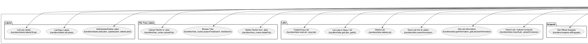
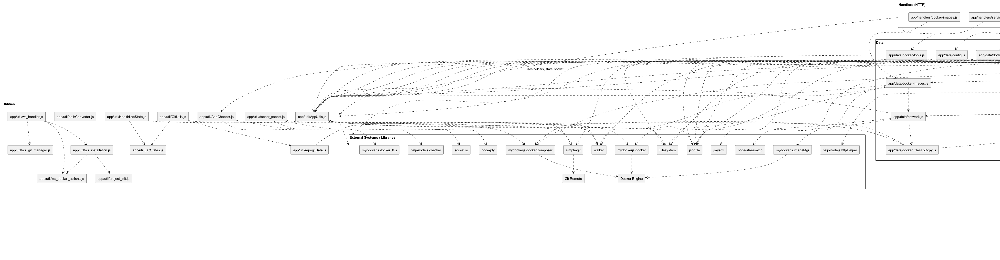
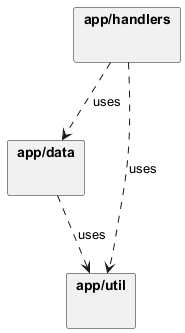
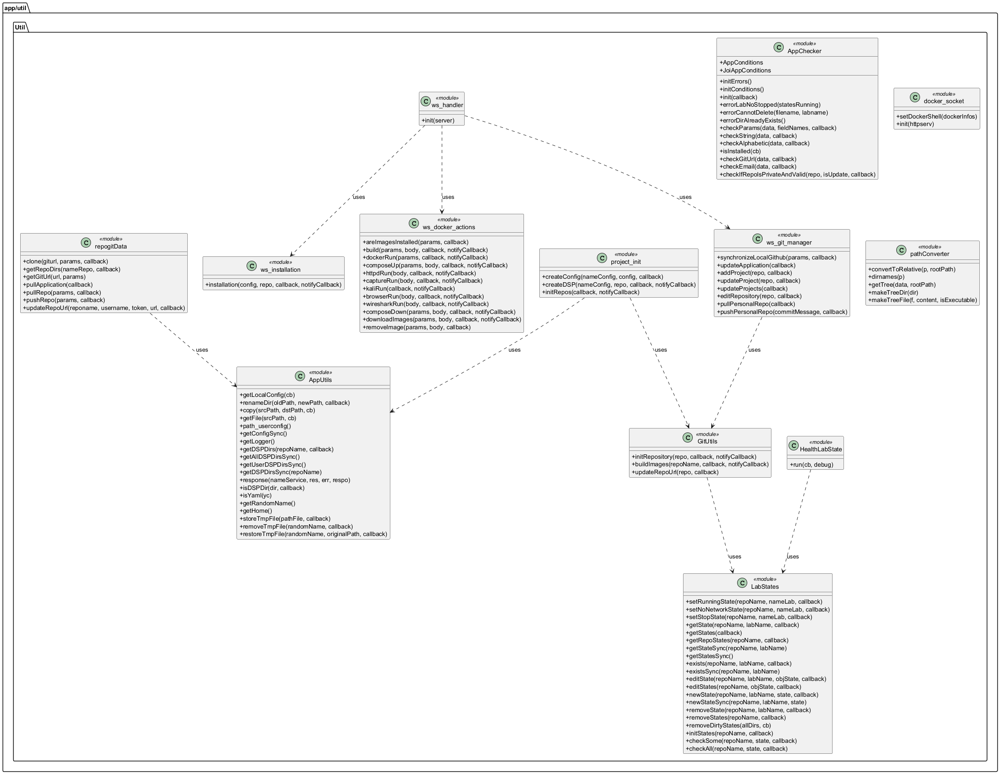
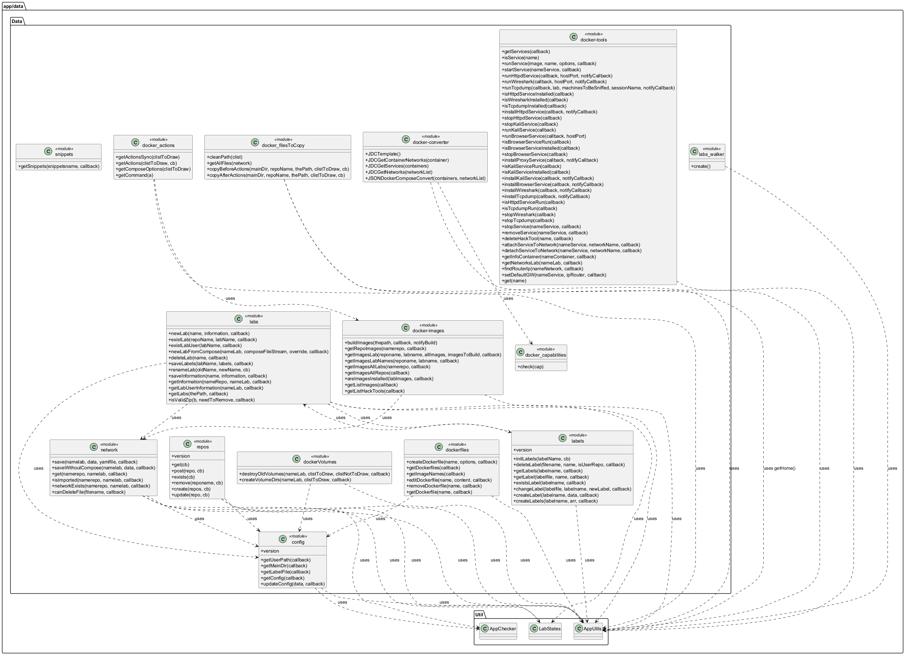
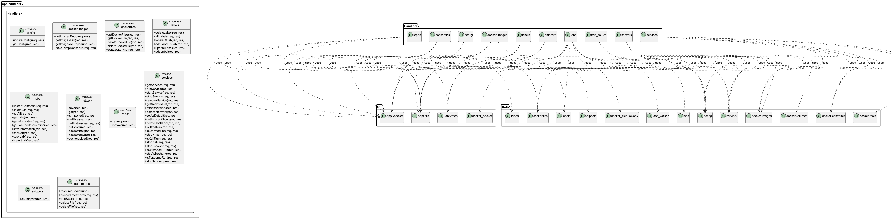
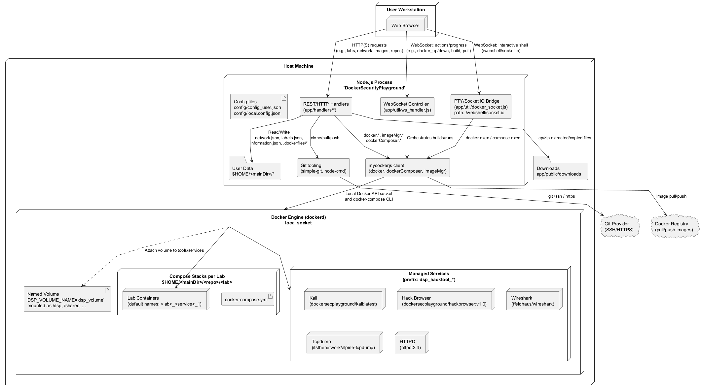

 

% 1 — System Overview
# SECTION 1 — System Overview

This section introduces the software system as evidenced by the repository. It describes the system’s purpose, scope, and key features based strictly on the implementation. The intent is to provide a concise yet complete understanding for both technical and non-technical stakeholders, enabling validation against the codebase.

The codebase implements the backend services for managing “labs” composed of Docker containers and networks for the Docker Security Playground (DSP). It orchestrates Docker images and docker-compose services, manages per-user and per-repository content, provides execution of post-deployment actions inside containers, exposes a web shell, integrates with Git for repository synchronization, and maintains operational state for each lab. The system is designed to run on a host with Docker, Docker Compose, and Git installed, persisting data under the user’s home directory.

## Purpose

The primary purpose of the system is to provide lifecycle management and orchestration of security training “labs” built from Docker images and networks. It allows users and curated repositories to define, import, configure, run, and tear down labs described by a custom network model that is converted to docker-compose files at runtime. The system also offers operational tooling such as managed hack tools (e.g., Kali, Wireshark, Browser, tcpdump), file management for lab assets, web-based shells into running containers, and Git-based synchronization of lab repositories.

## Scope

The repository contains the server-side application logic (Node.js) responsible for:

- Configuration management, environment readiness checks, and initial system setup.
- REST-like handlers (HTTP) for CRUD-style operations on labs, labels, dockerfiles, images, network descriptions, services, repositories, and file trees.
- WebSocket orchestration for long-running Docker and Git operations with progress streaming.
- Docker and docker-compose orchestration through the mydockerjs library, including image management, service lifecycle (up/down), and container exec.
- State management for labs across repositories.
- Git clone/pull/push flows for user and external repositories, including private auth support.

A frontend/UI and the HTTP server bootstrap are out of scope of this repository segment; however, the backend exposes the handlers and WebSocket endpoints to be wired by the host application.

## Key Features

Configuration and Installation
The system maintains a user configuration file (config/config_user.json) and validates environment readiness (Docker CLI, Docker Compose, Git). It provisions the user workspace under $HOME/<mainDir>/<name> with initial artifacts (.dsp, .data, .dockerfiles, labels.json, snippets.json), creates lab state storage (lab_states.json), and seeds repository metadata (repos.json). Installation can optionally bootstrap and synchronize the user repository via Git, with support for SSH keys or HTTP basic token auth.

Lab Management
Labs are directories (marked by a .dsp file) containing:
- information.json and optional README.md (authored and managed by handlers),
- labels.json (lab-local labels),
- network.json and docker-compose.yml (the lab’s network and services description).

The system supports:
- Creating labs from scratch or importing from docker-compose YAML or a ZIP containing docker-compose.
- Copying labs, renaming labs (with state checks), deleting labs (with state checks).
- Persisting and retrieving lab metadata and labels.

Network Modeling and Compose Generation
A custom network model (containers, networks, dependencies, ports, envs, volumes, labels) is converted to a docker-compose v2 object (app/data/docker-converter.js). Capabilities (cap_add) are inferred from image labels when valid (validated against a curated capability list). The generated docker-compose YAML is stored under each lab. The system can suppress revealing static IPs depending on visibility flags where present.

Image and Dockerfile Management
- Discovery of local Docker images with label-derived metadata (icons, actions, exposed ports).
- Building images from a per-user .dockerfiles workspace (including “create from existing Dockerfile”, “create from Git repo” or new Dockerfile, file tree editing, and tagged build/push).
- Enumerating images required by a lab, determining which are present or require building, and checking installation status.
- Central logic for default image actions (exec, ctf) and per-image actions derived from labels.

Lab Orchestration and Actions
- Compose Up: Validates image prerequisites, generates docker-compose YAML, creates required volume directories, brings up the lab, copies pre-action files into target containers, executes configured container actions (with optional detached/background mode), copies post-action files, and updates lab state to RUNNING.
- Compose Down: Ensures service detach from lab networks (for managed services), tears down the lab, cleans download artifacts, and updates state to STOPPED.
- File transfer from containers and optional zipping of directories for download.
- Safe deletion checks for lab data files referenced in network.json.

Managed Hack Tools and One-Line Tools
- Managed services: Kali, Browser (VNC-based hack browser), Wireshark, tcpdump, and Httpd are supported with helper functions for install (pull), run, stop, and status queries. Services are named under the dsp_hacktool_* prefix and can attach/detach to lab networks with default gateway configuration via ip route.
- One-line tools: Ad-hoc container runs for images declared in config/hack_tools.json with default options, mounted shared volume, and configurable network attachments.

Web Shell Access
- Provides interactive shell access into containers via:
  - docker-compose exec when invoked within a lab context, or
  - docker exec for standalone containers.
- Automatically selects /bin/bash if available, falling back to /bin/sh.
- Uses Socket.IO and node-pty to proxy terminal I/O over websockets.

Repositories and Git Integration
- Manages external repositories list (repos.json) with add/update/remove operations, including support for private repositories via SSH keys or HTTP credentials.
- Clones repositories into $HOME/<mainDir>/<repo>, initializes lab states, and supports pull/push operations for both curated and the user’s personal repository.
- Supports re-pointing the user repository remote URL and reinitializing workspace safely.

State Management and Health Checks
- Persists per-lab state (RUNNING, STOPPED, NO_NETWORK) in lab_states.json and enforces state preconditions for destructive or mutating operations.
- Health checker detects labs on disk missing from state and inserts a best-effort state by probing compose runtime, also pruning stale states not present on disk.

Validation, Safety, and Logging
- Extensive parameter validation (presence, format, allowed characters), URL validation, email checks, repo auth validations, and path validation.
- Defensive measures against path traversal during ZIP extraction.
- Escaping of shell arguments for docker exec actions.
- Rotating logging via bunyan-request-logger with configurable behavior (local.config.json).

## Runtime Characteristics

The system is a Node.js backend using:
- mydockerjs for Docker CLI/Docker Compose orchestration (docker, dockerComposer, imageMgr).
- simple-git for Git operations.
- WebSocket (ws) and Socket.IO (for web shell) for asynchronous operation control and streaming output.
- help-nodejs for HTTP response helpers and validation.
- Persistent storage under the OS user’s home directory for configuration, lab content, state management, repositories, and per-user workspaces.

## Notable Data and Directory Conventions

- $HOME/<mainDir>/lab_states.json: global lab state store.
- $HOME/<mainDir>/<repo or user>/<lab>/.dsp: lab marker.
- $HOME/<mainDir>/<repo or user>/<lab>/{network.json,docker-compose.yml,information.json,labels.json}.
- $HOME/<mainDir>/<user>/.dockerfiles: per-user Dockerfile workspaces (editable via API).
- $HOME/<mainDir>/<repo>/.docker-images: optional per-repo image definitions (images_to_build.json and update scripts, where present).
- $HOME/<mainDir>/<repo or user>/.data: shared lab files to be copied into containers before/after actions.
- public/downloads/<repo>_<lab>: downloads area for copied files from containers.

## External Dependencies and Preconditions

- Docker CLI, Docker Compose, and Git must be installed and accessible. These are verified at startup (AppChecker.checkDSPRequires) and during installation flows.
- The environment must allow Docker operations (local Docker daemon running).
- Certain features depend on files present outside this repository (e.g., config/local.config.json, config/hack_tools.json), which are read at runtime.

## Interfaces

- HTTP handlers under app/handlers/* implement endpoints for configuration, labs, network, images, dockerfiles, labels, services, repos, snippets, and file tree operations. Responses are standardized via httpHelper.
- WebSocket orchestration (app/util/ws_handler.js) supports long-running operations (installation, docker up/down, image build/pull/push, Git sync and updates) with progress streaming.
- Socket.IO server (app/util/docker_socket.js) exposes a webshell at path /webshell/socket.io.

## Constraints and Assumptions

- The system assumes a Unix-like environment for certain operations (e.g., shell commands around update.sh), with Windows support where explicitly handled (see GitUtils.buildImages).
- Image capabilities are restricted to a curated list; invalid cap labels are ignored with warnings.
- Names used in configuration and creation flows are restricted to safe character sets (alphabetic, underscore, dash, digits, and dot where allowed) to prevent path/command injection.

## Summary

Grounded in the code, this backend provides a complete orchestration layer for Docker-based training labs: it models and materializes networks into compose files, manages images and actions, integrates hack tools, offers web shells, and synchronizes with Git repositories. It maintains state across operations and enforces validation and safety checks, persisting all artifacts under a defined home directory structure.

% 2 — Architectural Context
## 2. Architectural Context

This section explains the system’s operational environment as evidenced by the source code. It identifies the external systems and libraries the application integrates with, the runtime interfaces it exposes (HTTP and WebSocket), the persistent data sources the application reads and writes, and the actors that interact with it via these interfaces. The content is limited to what is verifiable in the codebase.

### External Systems

- Docker Engine (via mydockerjs.docker and dockerode)
- Docker Compose CLI (invoked via mydockerjs.dockerComposer)
- Docker Registry (pull/push of images; e.g., Docker Hub)
- Git providers (via simple-git; supports HTTPS with tokens and SSH via GIT_SSH_COMMAND)
- Local filesystem and OS services (homedir, tmp directories, file I/O, chmod/exec flags)
- WebSocket infrastructure:
  - WebSocket server (ws) for control/long-running operations
  - Socket.IO server (socket.io) for interactive container shells at path /webshell/socket.io
- Compression/archiving utilities (zip-dir, node-stream-zip, unzipper)
- System command execution (node-cmd; docker/docker-compose indirectly)
- Logger (bunyan-request-logger)

### APIs / Interfaces

- HTTP handlers (no route strings in repository; functions listed by capability):
  - Configuration: getConfig, updateConfig
  - Docker images: getImagesRepo, getImagesAllRepos, getImagesLab (with optional checkInstallation), areImagesInstalled
  - Dockerfiles: getDockerFiles, getDockerFile, createDockerFile, editDockerFile, deleteDockerFile
  - Labels: labelsOfLab, allLabels, addLabel, updateLabel, deleteLabel, addLabelToLab
  - Labs: getAll, getLabs, newLab, copyLab, importLab, uploadCompose, deleteLab, getInformation, getLabUserInformation, saveInformation
  - Network: save, get, getUser, isImported, getListImages, dockercopy, dockerupload, dockershell, dirExists
  - Repositories: get, remove
  - Services and hack tools: getServices, runService, startService, stopService, removeService, getNetworkList, attachNetwork, detachNetwork, setAsDefault, getListHackTools, deleteHackTool, isKaliRun, stopKali, isBrowserRun, stopBrowser, isHttpdRun, stopHttpd, isWiresharkRun, stopWireshark, isTcpdumpRun, stopTcpdump, getListImages (images)
  - File tree and uploads: projectTreeSearch, treeSearch, uploadFile, deleteFile
  - Snippets: allSnippets
- WebSocket actions (ws_handler):
  - installation
  - docker_run
  - docker_up
  - wireshark_run
  - wireshark_stop
  - kali_run
  - browser_run
  - capture_run
  - httpd_run
  - docker_build
  - docker_down
  - remove_image
  - download_images
  - synchronize_github
  - update_project
  - update_projects
  - add_project
  - edit_repository
  - update_application
  - pull_personal_repo
  - push_personal_repo
- Interactive shell interface (socket.io, docker_socket):
  - Socket namespace/path: /webshell/socket.io
  - Events: output, input, resize, exit, disconnect
  - Modes: docker exec or docker-compose exec, auto-selects /bin/bash or /bin/sh per container

### Data Sources

- Application configuration and constants:
  - config/local.config.json (global settings, default repos, tool images, labels)
  - config/config_user.json (user/runtime configuration: name, mainDir, dockerRepo, githubURL, sshKeyPath, username, email)
  - config/hack_tools.json (hack tools catalogue)
  - config/snippets.json (official snippets)
- State and repository metadata under $HOME/<mainDir>:
  - lab_states.json (global lab states)
  - version.json (version metadata)
  - repos.json (registered remote repositories)
  - shared/ (shared folder)
- User repository structure under $HOME/<mainDir>/<repo>:
  - .dsp (marker)
  - .data/ (user-uploaded artifacts referenced by labs)
  - .dockerfiles/ (Dockerfile projects; edited via API; file tree is materialized on disk)
  - labels.json (repository-level labels)
  - snippets.json (user snippets)
  - Per-lab directories ($HOME/<mainDir>/<repo>/<lab>):
    - .dsp (marker)
    - information.json and optional README.md
    - labels.json (lab-specific labels)
    - network.json (DSP network model)
    - docker-compose.yml (compose file; may be hidden from UI if marked not visible)
- Build and images metadata inside repositories:
  - .docker-images/
    - update.sh or update.bat (build pipeline script)
    - image_list.json (images metadata for per-repo builds)
- Temporary and operational paths:
  - OS temp dir (for ZIP validation/import and safe-rename during operations)
  - public/downloads/<repo>_<lab> (exported files copied from containers)
  - hacktool_volume (mounted host folder for one-line hack tools)
- Docker metadata (via mydockerjs/imageMgr and labels):
  - Image labels used to derive icons, actions, ports and capabilities
  - Image presence and installation checks are resolved against local Docker

### Users / Actors

- Web client (browser) invoking HTTP endpoints and WebSocket actions for managing labs, repositories, images, and services.
- Docker daemon acting as an external runtime executing containers, images, networks, and compose stacks.
- Git server (e.g., GitHub or compatible) hosting repositories for cloning, pulling, and pushing user and shared labs.
- Docker registry (e.g., Docker Hub) used to pull base/tool images and push optionally tagged images.

% 2.1 — Architectural Context – Use Case Diagram
# SECTION 2.1 — Architectural Context – Use Case Diagram

This section presents the use case view of the backend as implemented in the provided codebase. It identifies external actors and interactions strictly derived from the HTTP handlers, WebSocket commands, and utility modules. The primary human actor is the end user operating through a web client; secondary technical actors are the Docker Engine/Compose (via mydockerjs and docker-compose) and a Git remote (via simple-git and custom repo utilities). The diagram aggregates concrete operations reflected by handlers and WebSocket action managers into coherent use cases, preserving traceability through explicit references to implemented functions.

Figure 2.1 highlights how a user configures the system, manages repositories and labs, edits and builds Dockerfiles, manages images, orchestrates lab networks with docker-compose, opens container shells, transfers files, operates managed hacking tools and services, handles labels and snippets, and manipulates the data file tree. Interactions with Docker and Git are shown as secondary actors connected only to the use cases that invoke them in the code.

Figure: fig-2-1-usecase-dsp-backend.puml — Architectural Context: Use Cases

% 3 — Containers
## 3. Containers

This section enumerates the runtime containers and external execution environments used by the system at the C4 “Container” level. It focuses on what runs, why it runs, and how containers communicate. The implementation is a single Node.js backend service that orchestrates Docker, Docker Compose, Git, and the local filesystem. It also provisions and manages several on-demand Dockerized tools and user-defined lab stacks generated from lab definitions. All details below are directly derived from the codebase.

| Container | Responsibility | Technology | Communication |
|---|---|---|---|
| DSP Backend Service | Single-process backend that exposes REST endpoints and WebSocket endpoints for managing configuration, repositories, labs, labels, Docker images and Dockerfiles, network topologies, and managed tools; generates docker-compose.yml from lab models; orchestrates docker-compose up/down; executes per-container actions; hosts an interactive web shell (terminal) into containers. | Node.js; help-nodejs httpHelper; socket.io; ws; node-pty; bunyan-request-logger; mydockerjs (docker, dockerComposer, imageMgr); simple-git; node-cmd; fs/jsonfile/yaml; unzipper/zip-dir/rimraf/walker | HTTP for REST; WebSocket and Socket.IO (web shell at path /webshell/socket.io); local filesystem I/O; Docker API via dockerode (through mydockerjs) and CLI; docker-compose CLI; Git over SSH or HTTPS |
| Web Browser Client (External) | User interface consuming the REST and WebSocket APIs, including the interactive web shell. | Any modern web browser (UI not part of this repo) | HTTP to DSP Backend; WebSocket/Socket.IO to DSP Backend (/webshell/socket.io) |
| Docker Engine and Docker Compose (External) | Container runtime used to execute lab stacks and managed tool containers; performs docker-compose up/down; exec/cp operations; attaches/detaches services to user networks. | Docker daemon; docker CLI; docker-compose; dockerode via mydockerjs | Local Docker API (dockerode), shell commands (docker, docker-compose), container networking/volumes |
| Git Server (External) | Hosts repositories cloned/updated by the system for labs and images. | Git over SSH/HTTPS (e.g., GitHub); simple-git; optional SSH key or HTTPS credentials | Git protocol via SSH (GIT_SSH_COMMAND) or HTTPS (username/token) |
| Host Filesystem (External Persistence) | Persists all application data under the user’s home directory: config, lab directories, lab_states.json, repos.json, labels.json, snippets.json, .dockerfiles, .data, generated docker-compose.yml, downloads, and logs. | Local filesystem; fs/jsonfile; path utilities | POSIX file I/O; directory and file management |
| Managed Tool: Kali Service | Runs an ephemeral Kali-based hacking environment with shared volume. | Docker image dockersecplayground/kali:latest; cap_add NET_ADMIN; volume dsp_volume:/dsp | Docker runtime; attaches to user networks; shared volume I/O |
| Managed Tool: Hack Browser Service | Runs a browser-in-container for interactive use, exposing a GUI port to the host. | Docker image dockersecplayground/hackbrowser:v1.0; exposes port 5800; cap_add NET_ADMIN; shmSize 2g; volume dsp_volume:/dsp | HTTP via published host port 5800; Docker runtime; shared volume I/O |
| Managed Tool: Wireshark Service | Runs Wireshark in host network mode for packet analysis, storing captures in shared volume. | Docker image ffeldhaus/wireshark; networkHost: true; cap_add NET_ADMIN; env XPRA_PW; volume /home/wireshark mapped to dsp_volume | Docker runtime (host network); shared volume I/O |
| Managed Tool: Tcpdump Service | Spawns per-target tcpdump containers capturing traffic from specific containers’ network namespaces; outputs pcap files into shared volume. | Docker image itsthenetwork/alpine-tcpdump; net=container:<lab>_<service>_1; rm; detached; cmd “-i any -s 65535 -w …” | Docker runtime (container network namespace); shared volume I/O |
| Managed Tool: HTTPD Service | Serves files from the shared DSP volume for easy access/sharing. | Docker image httpd:2.4; exposes container port 80 to a configurable host port; volume dsp_volume:/usr/local/apache2/htdocs/ | HTTP via published host port; Docker runtime; shared volume I/O |
| User Lab Compose Stack (per Lab) | For each lab, generates and runs a full docker-compose stack from network.json: services, networks, ports, env vars, volumes, capabilities, privileged flags; performs file copy before/after actions; executes per-service actions via docker-compose exec. | docker-converter (JSON → docker-compose.yml); mydockerjs dockerComposer; mydockerjs imageMgr; image labels (caps_add, actions, privileged); file copy via docker-compose cp | Docker Compose CLI (up/down/exec/cp); container networking; local filesystem for volumes and .data assets |

% 3.1 — Architecture Overview – Component Diagram
# Section 3.1 — Architecture Overview – Component Diagram

This section presents a component-level view of the Node.js back-end. The system is organized into three internal layers—Handlers, Data, and Utilities—and integrates with external libraries and systems such as Docker (via mydockerjs), Git (via simple-git), the local filesystem, and WebSocket/Socket.IO. The diagram enumerates all source modules from the repository and highlights the principal dependencies between components and layers. It is intended to give both developers and integrators a traceable, code-accurate overview that can be validated against the implementation.

Figure 3-1 — Component Diagram

Notes for validation:
- The diagram lists every module found under app/handlers, app/data, and app/util exactly as present in the codebase.
- Key intra-layer and cross-layer dependencies are drawn from explicit require/import usage in the source files, focusing on the primary call paths used at runtime (e.g., handlers to their data modules, utilities to external libraries, data modules to mydockerjs/simple-git/jsonfile).
- External systems and libraries are represented only when directly referenced by code (e.g., mydockerjs, simple-git, jsonfile, socket.io, node-pty, walker, js-yaml, node-stream-zip, filesystem).

% 4 — Components
## 4. Components

This section enumerates all internal modules of the application and describes their responsibilities and collaborations. Components are grouped by their physical location in the codebase, reflecting the implementation layers: data access and orchestration (app/data), HTTP route handlers (app/handlers), and platform/utilities (app/util). Interactions list the key local modules and external libraries each component imports or calls, allowing validation against the source code.

### 4.1 Data Layer Components (app/data)

| Component | Responsibility | Interactions |
|---|---|---|
| app/data/config.js | Reads and writes the user configuration (config_user.json), derives main, user, and label file paths, and validates updates via AppChecker. | jsonfile, async, path, ../util/AppUtils, ../util/AppChecker (AppConditions), ../../config/local.config.json |
| app/data/docker_actions.js | Normalizes and enriches per-container actions from selected images, generates docker-compose exec commands (including special cases like ctf and exec), and returns compose options (e.g., scale). | ./docker-images.js, underscore, ../util/AppUtils (logger) |
| app/data/docker_capabilities.js | Validates Linux capabilities against a supported list used when converting labels to compose capabilities. | underscore |
| app/data/docker_filesToCopy.js | Resolves and copies files declared under containers’ filesToCopy into running services (before/after actions) using docker-compose cp; exposes helpers to clean and collect file lists. | underscore, mydockerjs.dockerComposer, path, async, ../util/AppUtils |
| app/data/docker-converter.js | Converts the internal network and container model into a docker-compose JSON object (services and networks), mapping networks, ports, env vars, volumes, dependencies, caps_add, and privileged. | underscore, dot-object, ../util/AppUtils, path, ./docker_capabilities.js |
| app/data/docker-images.js | Manages images: builds from repository metadata, enumerates and decorates local images with labels/actions/icons, computes lab image usage, checks installation, and aggregates image lists across labs/repos. | mydockerjs.imageMgr, mydockerjs.docker, ../data/dockerfiles.js, dot-object, underscore, path, jsonfile, async, walker, ./config.js, path-exists, ./network.js, ../util/AppUtils (logger), app-root-path |
| app/data/docker-tools.js | Provides lifecycle and networking for managed hack-tool services (Kali, Browser, Wireshark, Tcpdump, Httpd): run/stop/remove, attach/detach networks, default gateway handling, service discovery, and status checks. | mydockerjs.docker, mydockerjs.imageMgr, underscore, ../util/AppUtils (logger), async, ../../config/hack_tools.json |
| app/data/dockerfiles.js | Manages user Dockerfiles workspace (.dockerfiles): create (new, from another Dockerfile, or from Git), list, read as a tree model, edit (with permissions), delete, and derive image names. | path, ../util/AppUtils, ../util/pathConverter.js, ./config.js, async, fs, executable, simple-git, fs-extra, ../util/AppChecker (JoiConditions), rimraf, recursive-readdir |
| app/data/dockerVolumes.js | Creates required host volume directories for a lab and cleans up stale volumes under the lab folder based on network definitions. | async, ../util/AppUtils (logger), path, path-exists, fs, rimraf, ./config.js, Walker, underscore |
| app/data/labels.js | CRUD for labels at repo or lab scope; ensures existence; batch insert/update; cascades updates and deletions to all labs within a repo; supports atomic changes with temp file backup/restore. | async, ./labs.js, jsonfile, underscore, path, ../util/AppUtils (logger) |
| app/data/labs_walker.js | Walks the DSP root to assemble a hierarchical view of repos and labs, collecting per-repo and per-lab metadata (labels, version, information, derived state), exposing an evented walker. | walker, ../util/AppUtils, path, stampit, events, async, ../util/LabStates, jsonfile, ../../package.json, underscore |
| app/data/labs.js | Manages lab lifecycle: create, rename, delete; import from docker-compose or zip (with validation and safe extraction); save information and labels; query information and README; existence checks. | jsonfile, async, os, path, fs, path-exists, js-yaml, file-type, node-stream-zip, ./labels.js, ./network.js, ./config.js, rimraf, unzipper, underscore, ../util/AppUtils (logger, path ops), ../util/LabStates, ../../config/local.config.json |
| app/data/network.js | Persists and retrieves lab network.json and docker-compose.yml; determines imported status; cleans file paths in clistToDraw; validates deletions against file references; updates LabStates on save. | jsonfile, ./config.js, path, async, path-exists, ./docker_filesToCopy, ../util/AppChecker, ../util/LabStates, fs, ../util/AppUtils (logger) |
| app/data/repos.js | Manages repos.json under mainDir: list, create, add, update, and remove repositories; deletes repo directory on removal and updates repos.json. | ../data/config.js, async, fs, path, jsonfile, ncp, path-exists, ../util/AppUtils (logger), ../util/LabStates, rimraf, underscore, ../../config/local.config.json |
| app/data/snippets.js | Loads snippet definitions from a provided snippets JSON file path. | async, jsonfile |

### 4.2 HTTP Handler Components (app/handlers)

| Component | Responsibility | Interactions |
|---|---|---|
| app/handlers/config.js | Exposes HTTP endpoints to get and update runtime configuration; validates inputs, enforces LabStates invariants, renames directories, and persists new config. | ../data/config.js, ../util/AppChecker (AppConditions, JoiAppConditions), async, path, help-nodejs.httpHelper, ../util/AppUtils (logger, response), ../util/LabStates |
| app/handlers/docker-images.js | HTTP endpoints to retrieve images used by a lab or across repos and to check installation status; delegates to docker-files and docker-images data modules. | jsonfile, async, path, fs, path-exists, rimraf, underscore, ../util/AppUtils (logger), ../util/LabStates, help-nodejs.httpHelper, ../util/AppChecker, ../data/network.js, ../../config/local.config.json, ../data/docker-images.js, ../data/dockerfiles.js |
| app/handlers/dockerfiles.js | HTTP endpoints for Dockerfile CRUD and content retrieval; returns tree structures for editing. | async, ../util/AppUtils (logger), help-nodejs.httpHelper, ../util/AppChecker, ../data/dockerfiles.js |
| app/handlers/labels.js | HTTP endpoints for listing, adding, updating, and deleting labels at repo and lab level; resolves label file paths from config. | ../data/labels.js, ../data/config.js, help-nodejs.httpHelper, async, path, ../util/AppUtils (logger, response), ../util/AppChecker, ../../config/local.config.json |
| app/handlers/labs.js | HTTP endpoints for listing labs, creating, copying, importing, deleting, and saving information/labels; validates inputs and enforces LabStates. | ../data/labs.js, ../data/labels.js, ../data/config.js, ../data/network.js, ../data/labs_walker, async, fs, help-nodejs.httpHelper, path, jsonfile, ../util/AppChecker (AppConditions), ncp, ../data/docker_filesToCopy.js, path-exists, ../util/AppUtils (logger, response), connect-multiparty, ../util/LabStates, util, underscore, ../../config/local.config.json |
| app/handlers/network.js | HTTP endpoints to save/get user and repo network definitions, test import status, list images, copy/upload files from/into containers, and open shells (compose or container); generates compose from model via converter. | ../data/network.js, app-root-path, async, ../data/dockerVolumes.js, ../data/dockerfiles.js, ../data/config.js, path, help-nodejs.httpHelper, ../util/LabStates, ../util/AppUtils (logger), path-exists, ../util/docker_socket, ../data/docker-images.js, zip-dir, rimraf, fs, ../util/AppChecker, ../data/docker-converter.js, mydockerjs.dockerComposer, mydockerjs.docker, underscore |
| app/handlers/repos.js | HTTP endpoints to list and delete repositories; wraps repos data API and standardizes responses. | ../util/AppUtils (logger, response), async, ../data/repos.js, help-nodejs.httpHelper, ../util/AppChecker |
| app/handlers/services.js | HTTP endpoints to manage managed hack-tool services: run/start/stop/remove, attach/detach networks, set default GW, status checks, and list supported tools; persists compose on save. | ../data/network.js, app-root-path, async, ../data/dockerVolumes.js, ../data/config.js, path, help-nodejs.httpHelper, ../util/LabStates, ../util/AppUtils (logger, response), path-exists, ../util/docker_socket, ../data/docker-images.js, zip-dir, rimraf, fs, ../util/AppChecker, ../data/docker-converter.js, mydockerjs.dockerComposer, underscore, ../data/docker-tools.js |
| app/handlers/snippets.js | HTTP endpoints to fetch official and user snippets (per repo). | ../data/snippets.js, path, help-nodejs.httpHelper, ../util/AppChecker, ../data/config.js, ../util/AppUtils, ../../config/local.config.json |
| app/handlers/tree_routes.js | Serves a file tree for user .data; supports upload (file/dir) into user .data and deletion with validation against network references. | fs, ../data/config.js, copy-dir, path-exists, cp-file, path, help-nodejs.httpHelper, rimraf, async, ../util/AppChecker, ../util/AppUtils (logger, getHome), ../data/network.js |

### 4.3 Utility and Platform Components (app/util)

| Component | Responsibility | Interactions |
|---|---|---|
| app/util/AppChecker.js | Centralized validation, initialization checks (docker, docker-compose, git), custom error types, input validators (labname, filetype, url, email), Git URL validations, and state preconditions helpers. | errors, help-nodejs.checker (Checker, JoiChecker), ../util/AppUtils (logger), mydockerjs.dockerUtils, jsonfile, path, fs, is-valid-path, command-exists, async, ../data/config.js, ../../config/local.config.json, ../data/repos.js, underscore |
| app/util/AppUtils.js | System utilities: logging, filesystem helpers (copy, rename, read), YAML detection, DSP repo discovery, standard HTTP response, temp file helpers, and home/config path accessors. | app-root-path, path, os, randomstring, jsonfile, path-exists, js-yaml, walker, bunyan-request-logger, homedir, errors, fs, help-nodejs.httpHelper, ncp, ../../config/local.config.json |
| app/util/docker_socket.js | Socket.IO-based interactive container shells; chooses bash/sh based on container contents; supports docker-compose and plain docker exec; resizes TTY and relays I/O. | socket.io, node-pty, path, ../util/AppUtils (logger), mydockerjs.docker, mydockerjs.dockerComposer |
| app/util/GitUtils.js | Git orchestration: clone repositories (with private auth), initialize repository states, build images via repo scripts, and update remotes for auth changes. | app-root-path, path, jsonfile, fs, os, async, ../util/AppUtils (logger), node-cmd, underscore, ./repogitData.js, ./LabStates.js, ../data/docker-images.js, mydockerjs.imageMgr |
| app/util/HealthLabState.js | Health checker that reconciles lab_states.json with actual docker-compose runtime, inserting missing states and cleaning stale entries. | mydockerjs.dockerComposer, fs, path, ./LabStates.js, async, ../util/AppUtils (logger), underscore |
| app/util/LabStates.js | Persistent lab state store (RUNNING/STOPPED/NO_NETWORK): CRUD operations, batch edits, state checks (all/some), initialization from disk, and cleanup of dirty states. | async, path, ../data/config.js, jsonfile, underscore, ../util/AppUtils |
| app/util/pathConverter.js | Transforms a flat list of files into a jstree-compatible hierarchical model (dirs and files), including relative path conversion and metadata. | path, underscore |
| app/util/project_init.js | Initial installation utilities: create config file, create DSP structure (mainDir, user repo, labels/snippets, shared), clone user repo if configured, and initialize official repos. | fs, app-root-path, jsonfile, path, ../util/AppUtils (logger), ./GitUtils.js, async, ../../config/local.config.json, rimraf |
| app/util/repogitData.js | Low-level Git operations via simple-git: clone with HTTP basic or SSH key, detect repo directories, get/update remote URLs, and pull/push repositories. | walker, path-exists, path, ../data/config.js, simple-git, help-nodejs.strings, ../util/AppUtils, underscore, app-root-path, errors, async |
| app/util/ws_docker_actions.js | WebSocket-exposed orchestration: compose up/down, run one-line tools, build/tag/push images from .dockerfiles, pull/remove images, and start auxiliary services; updates LabStates and manages copies/actions. | ../data/network.js, app-root-path, ../data/config.js, ../data/docker-images.js, ../data/docker_actions.js, ../data/docker_filesToCopy.js, ../data/docker-tools.js, mydockerjs.dockerComposer, mydockerjs.docker, underscore, mydockerjs.imageMgr, path, async, ./AppChecker, ./LabStates, ../util/AppUtils (logger), fs, rimraf |
| app/util/ws_git_manager.js | WebSocket-exposed Git management: synchronize local user repo to a new URL with auth, add/update projects, bulk update, pull/push personal repo, and enforce lab state constraints during updates. | path, ./repogitData.js, ../data/config.js, ../data/repos.js, ../../config/local.config.json, async, fs, rimraf, ./AppChecker (JoiAppConditions), ../util/AppUtils (logger), ./GitUtils.js, ./LabStates.js, randomstring |
| app/util/ws_handler.js | WebSocket server entrypoint; routes actions to installation, docker actions, and Git managers; streams progress messages and returns standardized responses; can trigger application restart after update. | app-root-path, ws, ./ws_installation.js, ./ws_docker_actions.js, ./ws_git_manager.js, ../util/AppUtils (logger), node-cmd |
| app/util/ws_installation.js | Installation workflow over WebSocket: validates initial config, persists config, creates DSP directories, pulls base image, seeds repos.json, and clones official repos; emits progress via callback. | ../util/AppChecker (AppConditions, Joi), ./project_init.js, async, ../util/AppUtils (logger), path, ../../config/local.config.json, ../data/repos.js, ./ws_docker_actions.js, fs |

% 5 — Code-Level View
# Section 5 — Code-Level View

This section describes the concrete mapping between architectural elements and the actual source code. It identifies the main entry points, the structure of modules and directories, the exported APIs per module, and recognisable architectural patterns that emerge from the implementation. The goal is to enable developers and integrators to validate the implementation against the intended architecture and to navigate, extend, or refactor the codebase safely.

The codebase is a Node.js service that orchestrates Docker-based labs (compose networks, images, files, volumes, and supporting “hack tool” services), exposes HTTP endpoints (handlers) and WebSocket operations (ws_handler) to a client, and persists user-specific configuration and lab state in the filesystem.

## 5.1 Code Organization and Architectural Mapping

The implementation follows a layered, service-oriented structure:

- Handlers (HTTP controllers) in app/handlers invoke data-layer modules and utilities to implement endpoints.
- WebSocket orchestration in app/util/ws_handler handles push-style operations (installation, compose up/down, run tools, git ops), delegating to services in app/util/ws_* and app/data/*.
- Data layer modules in app/data encapsulate functional domains: networks, labs, labels, dockerfiles, images, volumes, services (hack tools), and repositories.
- Utilities in app/util provide cross-cutting concerns: validation (AppChecker), logging and file utilities (AppUtils), lab states (LabStates), health checks (HealthLabState), Git interactions (repogitData, GitUtils), socket implementations (docker_socket), and installation flows (ws_installation).
- External Docker integrations are uniformly mediated through mydockerjs (docker, imageMgr, dockerComposer, dockerUtils).

This corresponds to a layered/hexagonal structure with clear separation of concerns: Handlers (controllers) -> Data/Service modules (application logic) -> Infrastructure (mydockerjs, filesystem, Git, logger).

## 5.2 Main Entry Points and Startup Hooks

The repository does not include the HTTP server bootstrap (e.g., an Express server.js). From the available code, the following are the operational entry points that the host application must call or wire:

- app/util/ws_handler.js
  - Export: init(server)
  - Purpose: attaches the WebSocket server to the existing HTTP server and dispatches actions to installation, Docker, and Git managers. Switch-based action routing enumerates the full supported action set (see 5.5).
  - Expected Caller: the HTTP server setup code.

- app/util/docker_socket.js
  - Exports: setDockerShell(dockerInfos), init(httpserv)
  - Purpose: attaches a socket.io namespace at path /webshell/socket.io for interactive shells inside containers or docker-compose services. setDockerShell must be called prior to init to provide context.

- app/util/AppChecker.js
  - Exports: init(callback), initErrors(), initConditions()
  - Purpose: one-time application preflight (validates docker/docker-compose/git availability, ensures filesystem layout exists, validates repos.json presence).

- app/util/HealthLabState.js
  - Export: run(cb, debug)
  - Purpose: background reconciliation of lab_states.json against actual docker-compose runtime to bootstrap missing lab state entries and clean dirty ones.

- app/util/ws_installation.js
  - Export: installation(config, repo, callback, notifyCallback)
  - Purpose: full first-run installation flow invoked via WebSocket action "installation". Creates config_user.json, initializes directories, clones initial repos, and installs a base image.

## 5.3 Directory-Level Structure and Responsibilities

### app/data — Domain Services and Persistence

This directory contains cohesive modules that implement domain logic and persistence for labs, networks, labels, dockerfiles, images, volumes, repositories, and service tools.

| File | Responsibilities | Key Exports | Key Dependencies |
|------|------------------|-------------|------------------|
| app/data/config.js | Read/write user configuration; compute user-specific filesystem paths. | getConfig, updateConfig, getMainDir, getUserPath, getLabelFile, version | jsonfile, async, path, AppUtils, AppChecker.AppConditions, config/local.config.json |
| app/data/docker_actions.js | Compute actions to execute after compose up; merge container-specific actions with image-provided actions; build exec commands; compute compose CLI options (scaling). | getActions, getActionsSync, getComposeOptions, getCommand | docker-images.getListImages, underscore, AppUtils logger |
| app/data/docker_capabilities.js | Validate Linux capability strings declared via image labels; whitelist-based check. | check(cap) | underscore |
| app/data/docker_filesToCopy.js | Resolve and copy user-provided files into containers before/after actions. | cleanPath, getAllFiles, copyBeforeActions, copyAfterActions | mydockerjs.dockerComposer.cp, path, async, AppUtils logger |
| app/data/docker-converter.js | Convert internal network/container description into a docker-compose JSON model; compute networks, ports, envs, volumes, caps_add, privileged. | JDCTemplate, JDCGetContainerNetworks, JDCGetServices, JDCGetNetworks, JSONDockerComposeConvert | underscore, dot-object, AppUtils logger, path, docker_capabilities |
| app/data/docker-images.js | Inventory of docker images; mapping labels to metadata and actions; build images; list images per lab/repo; installation checks. | buildImages, getRepoImages, getImagesLab, getImagesLabNames, getImagesAllLabs, getImagesAllRepos, areImagesInstalled, getListImages, getListHackTools | mydockerjs.imageMgr/docker, dot-object, underscore, path, jsonfile, async, walker, path-exists, network.js, AppUtils logger |
| app/data/docker-tools.js | Manage long-running “hack tool” services and utilities (browser, Kali, Wireshark, tcpdump, httpd); network attach/detach; default route configuration; image install checks and pulls. | getServices, isService, runService, startService, stopService, removeService, runWireshark, runHttpdService, runTcpdump, runKaliService, runBrowserService, attachServiceToNetwork, detachServiceToNetwork, findRouterIp, setDefaultGW, getNetworksLab, getFreeAddress, isXYZInstalled/Run, installXYZ, stopXYZ, deleteHackTool, get (by label) | mydockerjs.docker/dockerComposer/imageMgr, async, underscore, AppUtils logger |
| app/data/dockerfiles.js | User dockerfiles management: create (new/import from dockerfile/git), edit (atomic with temp dir), list, remove, derive build image names. | createDockerfile, getDockerfiles, getImageNames, editDockerfile, removeDockerfile, getDockerfile | path, fs, fs-extra, simple-git, recursive-readdir, executable, rimraf, async, pathConverter, AppChecker |
| app/data/dockerVolumes.js | Prepare and clean lab-specific host volume directories under user path. | createVolumeDirs, destroyOldVolumes | async, path, path-exists, fs, rimraf, walker, underscore, AppUtils logger |
| app/data/labels.js | CRUD labels for repo and labs; propagate changes to all labs; data validation; atomic update with temp backup/restore. | initLabels, getLabels, getLabel, createLabel, createLabels, changeLabel, deleteLabel, existsLabel, version | async, jsonfile, underscore, path, labs.js, AppUtils logger |
| app/data/labs_walker.js | Recursive filesystem walk to build a listing of repos and labs with labels, version, information, and lab states; event-driven with stampit and EventEmitter. | create() -> DSPWalk | Walker, AppUtils, path, stampit, events, async, LabStates, jsonfile, package.json, underscore |
| app/data/labs.js | CRUD labs; import from docker-compose file or zip; save information and labels; rename, copy, delete labs; validate archives; ensure lab state transitions. | newLab, existLab, existLabUser, newLabFromCompose, deleteLab, saveLabels, renameLab, saveInformation, getInformation, getLabUserInformation, getLabs, isValidZip | jsonfile, async, os, path, fs, path-exists, js-yaml, file-type, node-stream-zip, unzipper, underscore, AppUtils, LabStates, labels.js, network.js, config/local.config.json |
| app/data/network.js | Persist and retrieve network.json and docker-compose.yml per lab; determine import status; validate file deletion against lab references. | save, saveWithoutCompose, get, isImported, networkExists, canDeleteFile | jsonfile, path, fs, async, path-exists, docker_filesToCopy, AppChecker, LabStates, AppUtils |
| app/data/repos.js | Manage repos.json: list/create/update/delete repository records; delete repo directory. | get, create, post, update, remove, exists, version | async, fs, path, jsonfile, ncp, path-exists, AppUtils logger, LabStates, rimraf, underscore |
| app/data/snippets.js | Read snippets JSON file from path. | getSnippets | async, jsonfile |

### app/handlers — HTTP Controllers

Each handler encapsulates request validation, calls into data/service modules, and serialises responses via help-nodejs.httpHelper or AppUtils.response.

| File | Responsibilities | Key Exports | Uses |
|------|------------------|-------------|------|
| app/handlers/config.js | Expose GET/PUT config; validate and enforce no labs running on rename; rename directories accordingly. | getConfig, updateConfig | data/config, AppChecker, LabStates, AppUtils |
| app/handlers/docker-images.js | List images for repo/lab/all repos; check installation; placeholder for saveTempDockerfile. | getImagesRepo, getImagesLab, getImagesAllRepos, saveTempDockerfile | data/docker-images, data/dockerfiles, data/network, Checker, httpHelper |
| app/handlers/dockerfiles.js | CRUD for user dockerfiles; fetch file tree model; edit files atomically. | getDockerFiles, createDockerFile, editDockerFile, getDockerFile, deleteDockerFile | data/dockerfiles, Checker, httpHelper |
| app/handlers/labels.js | List, add, update, delete labels at repo and lab levels. | labelsOfLab, allLabels, deleteLabel, addLabelToLab, updateLabel, addLabel | data/labels, data/config, AppUtils, Checker |
| app/handlers/labs.js | List all (walk), list labs per repo, get or save lab information (with rename), create/copy/delete/import labs; upload compose stream. | getAll, getLabs, getInformation, getLabUserInformation, saveInformation, newLab, copyLab, deleteLab, importLab, uploadCompose | data/labs, data/labels, data/config, data/network, data/docker_filesToCopy, AppUtils, LabStates, Checker |
| app/handlers/network.js | Save and retrieve network description and compose (user and repo), list images for canvas, container file copy/upload, spawn web shells (attach docker_socket), directory existence check. | save, get, isImported, getUser, getListImages, dockercopy, dockerupload, dockershell, dirExists | data/network, data/dockerVolumes, data/dockerfiles, data/config, docker_socket, data/docker-images, docker-converter, mydockerjs, Checker, AppUtils |
| app/handlers/repos.js | List and delete repositories. | get, remove | data/repos, AppUtils, Checker |
| app/handlers/services.js | Manage hack tool services over HTTP: list, run/start/stop/remove, attach/detach networks, set default route, list hack tools, delete oneline run, and list images. | getServices, runService, startService, stopService, removeService, getNetworkList, attachNetwork, detachNetwork, setAsDefault, getListHackTools, deleteHackTool, isHttpdRun, isBrowserRun, stopHttpd, isKaliRun, stopKali, stopBrowser, isWiresharkRun, stopWireshark, isTcpdumpRun, stopTcpdump | data/docker-tools, data/network, data/config, docker_socket, data/docker-images, mydockerjs, Checker, AppUtils |
| app/handlers/snippets.js | Return official snippets (config/snippets.json) or user snippets (repo snippets.json). | allSnippets | data/snippets, data/config, AppUtils, Checker |
| app/handlers/tree_routes.js | Browse/copy/delete files under user .data; jstree-compatible node model; safeguards against deleting in-use files. | projectTreeSearch, treeSearch, uploadFile, deleteFile, resourceSearch | data/config, copy-dir/cp-file, path-exists, AppUtils, data/network, Checker |

### app/util — Cross-Cutting Utilities

| File | Responsibilities | Key Exports | Uses |
|------|------------------|-------------|------|
| app/util/AppChecker.js | Centralised validation, error registry, environment checks, config/repo bootstrap; simple schema + Joi-based validations. | init, initErrors, initConditions, AppConditions, JoiAppConditions, multiple check* helpers, error* factories | help-nodejs.checker, mydockerjs.dockerUtils, command-exists, is-valid-path, jsonfile, path, fs, data/config, data/repos, AppUtils |
| app/util/AppUtils.js | Logger, filesystem helpers (copy, renameDir, read file), config path helpers, YAML check, DSP directory enumerations, consistent HTTP responses, temp file utils, random name, homedir. | getLogger, path_userconfig, getConfigSync, getHome, getDSPDirsSync, getAllDSPDirsSync, getUserDSPDirsSync, getDSPDirs, response, isDSPDir, isYaml, getRandomName, renameDir, copy, getFile, getLocalConfig, storeTmpFile, removeTmpFile, restoreTmpFile | bunyan-request-logger, app-root-path, path, fs, os, yaml, walker, errors, httpHelper |
| app/util/docker_socket.js | Interactive shell bridge over socket.io; spawns docker/docker-compose exec pty with automatic shell detection (bash/sh); forwards IO/resizes. | setDockerShell, init | socket.io, node-pty, mydockerjs.docker/dockerComposer, AppUtils logger |
| app/util/GitUtils.js | High-level Git flows: clone repo, init repo, build images via repository scripts, update repo URL (for private auth). | initRepository, buildImages, updateRepoUrl | node-cmd, simple-git (via repogitData), AppUtils logger, LabStates, data/docker-images, mydockerjs.imageMgr |
| app/util/HealthLabState.js | One-shot reconciliation of lab states; derives RUNNING/STOPPED by inspecting compose; cleans stale states. | run | mydockerjs.dockerComposer, LabStates, AppUtils, fs/path |
| app/util/LabStates.js | CRUD for lab_states.json; repo- and lab-scoped state queries and bulk edits; consistency cleanup. | setRunningState, setNoNetworkState, setStopState, getState, getStates, getRepoStates, getStateSync, getStatesSync, exists, existsSync, editState, editStates, newState, newStateSync, removeState, removeStates, removeDirtyStates, initStates, checkSome, checkAll | jsonfile, path, data/config, underscore, AppUtils |
| app/util/pathConverter.js | Transform a list of files with content into a jstree-like tree model with directory nodes and file nodes; render metadata. | convertToRelative, dirnames, getTree, makeTreeDir, makeTreeFile | path, underscore |
| app/util/project_init.js | First-run setup: write config_user.json, create directories, init lab state/version/shared, clone initial repos or create local structure. | createConfig, createDSP, initRepos | fs, app-root-path, jsonfile, path, AppUtils, GitUtils, async, rimraf |
| app/util/repogitData.js | Low-level Git operations: clone, pull/push repos, list repos in a directory, update remotes; supports HTTP basic and SSH key. | clone, getRepoDirs, getGitUrl, pullApplication, pullRepo, pushRepo, updateRepoUrl | simple-git, help-nodejs.strings, path-exists, Walker, path, data/config, AppUtils |
| app/util/ws_docker_actions.js | WebSocket side-effect services: compose up/down; build/tag/push images from dockerfiles; pull/remove images; “one line” tool runs; start services; ancillary operations. | areImagesInstalled, build, dockerRun, composeUp, composeDown, downloadImages, removeImage, httpdRun, captureRun, kaliRun, browserRun, wiresharkRun | mydockerjs.*, data/docker-images, data/network, data/docker_filesToCopy, data/docker-tools, AppUtils, LabStates, Checker, fs/rimraf/path |
| app/util/ws_git_manager.js | WebSocket Git operations: synchronize local repo with GitHub, add/update projects, update application, pull/push personal repo. | synchronizeLocalGithub, addProject, updateProject, updateProjects, updateApplication, editRepository, pullPersonalRepo, pushPersonalRepo | repogitData, data/config, data/repos, AppUtils, GitUtils, LabStates, Checker |
| app/util/ws_handler.js | WebSocket server and router; maps action strings to the corresponding async workflows and streams progress messages. | init | ws, ws_installation, ws_docker_actions, ws_git_manager, AppUtils |

Other project-level file:
- .eslintrc.js: ESLint configuration (Airbnb base with relaxed rules).

## 5.4 Recognisable Architectural/Design Patterns

The implementation exhibits the following patterns:

- Layered MVC-like structure at the server: HTTP Handlers (controllers) delegate to Data/Service modules (application logic), which depend on Utilities and Infrastructure (mydockerjs, filesystem, Git). This separation is consistent across functional domains (labs, labels, network, images, dockerfiles, services, repos).
- Event-driven and asynchronous workflow using async.waterfall/each and Node-style callbacks throughout. WebSocket action routing uses a command-dispatch pattern.
- DTO-style JSON models are used for persistence (network.json, lab_states.json, labels.json) and for transfer over HTTP/WebSocket.
- Validation pattern via central AppChecker, combining rule-based checks, Joi schemas, and app-specific Errors.
- File operations are done atomically where mutation could corrupt state (e.g., dockerfiles edit uses temp directory swap).
- Background reconciliation (HealthLabState.run) implements eventual consistency for lab state metadata.

No ORM or database is used; persistence relies on JSON files under a user-scoped directory hierarchy in the OS home folder.

## 5.5 WebSocket Actions Mapping

The complete action set (as implemented in app/util/ws_handler.js) and their downstream workflows:

| Action | Invoked Function | Downstream Modules/Effects |
|--------|-------------------|----------------------------|
| installation | ws_installation.installation | project_init.createConfig/createDSP, project_init.initRepos, docker image pull, repos.json creation |
| docker_run | ws_docker_actions.dockerRun | Pull image if needed; run “one line” container with volumes/networks |
| docker_up | ws_docker_actions.composeUp | Validate images; docker-compose up; copy files; compute and exec actions; set RUNNING state |
| docker_down | ws_docker_actions.composeDown | Detach services from networks; docker-compose down; set STOPPED state |
| docker_build | ws_docker_actions.build | Build/tag/push image from a user dockerfile |
| remove_image | ws_docker_actions.removeImage | Remove image via imageMgr |
| download_images | ws_docker_actions.downloadImages | Pull image via imageMgr |
| wireshark_run | ws_docker_actions.wiresharkRun | Install if needed; run Wireshark service |
| wireshark_stop | not implemented in ws_docker_actions (ws_handler references dockerActions.wiresharkStop; no such export) | Note: mismatch exists; stopWireshark is exposed via services HTTP handler, and via docker-tools.stopWireshark |
| kali_run | ws_docker_actions.kaliRun | Install if needed; run Kali service |
| browser_run | ws_docker_actions.browserRun | Install if needed; run browser service |
| capture_run | ws_docker_actions.captureRun | Install if needed; run tcpdump containers attached to lab services |
| httpd_run | ws_docker_actions.httpdRun | Install if needed; run httpd service with mapped DSP volume |
| synchronize_github | ws_git_manager.synchronizeLocalGithub | Recreate user repo from GitHub; update config |
| update_project | ws_git_manager.updateProject | Pull a single repo after all labs are STOPPED; reinit lab states |
| update_projects | ws_git_manager.updateProjects | Pull all repos after STOPPED checks; reinit states |
| add_project | ws_git_manager.addProject | Clone repo and register in repos.json |
| edit_repository | ws_git_manager.editRepository | Update repo URL and repos.json entry |
| update_application | ws_git_manager.updateApplication | git pull application and restart server via shell script |
| pull_personal_repo | ws_git_manager.pullPersonalRepo | Pull user’s personal repo |
| push_personal_repo | ws_git_manager.pushPersonalRepo | Push user’s personal repo with configured identity |

Note: Web shell operations are exposed via HTTP handlers (network.dockershell*) and implemented with app/util/docker_socket.js (socket.io), not via a ws_handler action.

## 5.6 Typical Execution Flows (Code-Level)

Compose Up (via WebSocket “docker_up”):
1. ws_handler.manageDockerUp → ws_docker_actions.composeUp.
2. Validate params; load config; resolve namerepo default; ensure all required images installed (docker-images.getImagesLabNames + imageMgr.areImagesInstalled).
3. Create download directory for the lab; read network via data/network.get; compute docker-compose options (scale) via data/docker_actions.getComposeOptions.
4. dockerComposer.up(thePath).
5. Copy pre-action files into containers via docker_filesToCopy.copyBeforeActions.
6. Compute actions list by merging network container actions with image actions (docker_actions.getActions uses docker-images.getListImages). For each action: derive shell command (getCommand) and dockerComposer.exec(service, /bin/sh -c "...") optionally detached.
7. Copy post-action files via docker_filesToCopy.copyAfterActions.
8. Update LabStates to RUNNING.

Compose Down (via WebSocket “docker_down”):
1. ws_handler.manageDockerDown → ws_docker_actions.composeDown.
2. List lab networks and detach hack tool services from user networks (docker-tools.detachServiceToNetwork).
3. dockerComposer.down(thePath); delete per-lab download dir; set LabStates to STOPPED.

Interactive Shell:
1. HTTP handler network.dockershell* validates, computes dockerInfos (either compose-path based or direct container).
2. docker_socket.setDockerShell(dockerInfos), then client connects to socket.io /webshell/socket.io.
3. docker_socket.initShellCommand detects bash/sh; docker/docker-compose exec via node-pty; streams data over socket.io.

## 5.7 External Dependencies and Integration Points

- mydockerjs (docker, imageMgr, dockerComposer, dockerUtils): primary integration with Docker Engine and Docker Compose for lifecycle, CP operations, exec, network connect/disconnect, image management.
- simple-git: Git operations (clone, pull, push, remote changes).
- help-nodejs: httpHelper (standardised HTTP responses), checker (validation), strings (URL manipulations for Git).
- bunyan-request-logger: logging.
- walker: filesystem traversal.
- jsonfile/js-yaml: JSON/YAML persistence.
- node-pty, socket.io: interactive shell streaming.
- zip-dir, node-stream-zip, unzipper: archive handling.
- Other utility libs: underscore, async, path-exists, rimraf, executable, recursive-readdir, homedir, command-exists, joi (via help-nodejs.joi).

All Docker interactions are behind mydockerjs to avoid direct Docker API coupling. Git interactions are abstracted by repogitData/GitUtils to manage authentication modalities (SSH key or HTTP basic token).

## 5.8 Notes and Implementation Anomalies (for Validation)

These observations reflect the current implementation and should be validated by the team:

- handlers/services.js and ws_handler “wireshark_stop”: ws_handler references dockerActions.wiresharkStop but ws_docker_actions does not export it. Stopping Wireshark exists in handlers/services (stopWireshark → docker-tools.stopWireshark).
- app/util/pathConverter.js: fix2Slash implementation appears truncated; this may affect dockerfiles tree rendering.
- app/util/repogitData.js: getGitUrl string operations look incomplete/truncated; verify runtime behaviour for credential injection.
- app/data/labs.js: extractZip uses fs.createWriteSream (typo). Also function extractZip is declared but not used; newLabFromCompose uses unzipper directly.
- Some handlers rely on req.busboy; ensure the middleware is installed at application level.
- handlers/docker-images.getImagesRepo returns only [reponame] and wraps it as images; likely a placeholder.
- Error handling style varies (mix of cb(err) and try/catch in async flows). Consider standardising around promises/async-await in future refactors.

These do not change the architecture but are relevant for code-level validation and maintenance planning.

## 5.9 Summary Mapping: Domain → Module(s)

For quick reference, the following mapping ties domain concerns to concrete modules:

- Configuration and Paths: app/data/config.js, app/util/AppUtils.js, app/util/AppChecker.js
- Lab Lifecycle and Metadata: app/data/labs.js, app/data/labs_walker.js, app/util/LabStates.js, app/util/HealthLabState.js
- Network and Compose Generation: app/data/network.js, app/data/docker-converter.js, app/data/docker_actions.js
- File Copy and Volumes: app/data/docker_filesToCopy.js, app/data/dockerVolumes.js
- Images and Dockerfiles: app/data/docker-images.js, app/data/dockerfiles.js
- Services/Hack Tools: app/data/docker-tools.js
- Repositories (Git): app/data/repos.js, app/util/repogitData.js, app/util/GitUtils.js
- WebSocket Orchestration: app/util/ws_handler.js, app/util/ws_installation.js, app/util/ws_docker_actions.js, app/util/ws_git_manager.js
- Interactive Shell: app/util/docker_socket.js
- Labels and Snippets: app/data/labels.js, app/data/snippets.js
- HTTP Interface: app/handlers/*.js

This code-level view reflects the actual implementation and supports validation by scanning the exported APIs and dependencies listed above.

% 5.1 — Class Diagram
# SECTION 5.1 — Class Diagram

This section provides a code-accurate structural view of the Node.js codebase. Because the implementation is modular (CommonJS modules exporting functions), modules are represented as classes with the stereotype module and their exported functions are modeled as public operations. The diagrams are organized as follows: a package-level overview showing the major dependency directions among layers, followed by detailed class diagrams for the util, data, and handler layers. All modules and their public exports are included, reflecting the current implementation.

Figure: 5.1.a — Package Overview (Layers and Dependencies)

Figure: 5.1.b — Util Modules (Public API per module)

Figure: 5.1.c — Data Modules (Public API per module)

Figure: 5.1.d — Handler Modules (Public API per module)

Validation Notes

This class view was derived strictly from the source code. Each module is represented with the full set of exported functions observed in the files under app/util, app/data, and app/handlers. The package-level dependencies match the require/import relationships in the code. The diagrams can be validated by inspecting each module’s module.exports or exports assignments and the corresponding require statements at the top of each file.

% 6 — Cross-Cutting Concerns
## 6. Cross-Cutting Concerns

This section consolidates the cross-cutting concerns that systematically affect multiple parts of the codebase. It focuses on aspects that are implemented consistently across modules, such as configuration management, validation, error handling, logging, security safeguards, operational state, and health checking. Each concern is grounded in concrete source code references to ensure traceability and enable validation by the development team.

| Concern | Evidence from code | Description |
|---|---|---|
| Logging | app/util/AppUtils.getLogger(); bunyan-request-logger configuration writing to logs/dsp.log (rotating-file streams); pervasive use of log.info/debug/warn/error in handlers, data, and util modules (e.g., app/handlers/network.js, app/data/docker-images.js) | Centralized logging with Bunyan-compatible request logger; dual configuration paths based on local.config.json enableLogin flag; file rotation and console streams; used across all layers (HTTP handlers, WebSocket flows, data managers, Docker orchestration) for operational visibility. |
| Configuration management | app/data/config.js (getConfig, updateConfig, getUserPath, getMainDir); app/util/AppUtils.path_userconfig(); app/util/project_init.createConfig/createDSP; config/local.config.json; config/config_user.json | User- and environment-level configuration is stored and read from config_user.json (per-user) and local.config.json (app defaults). Update operations atomically rename directories and rewrite config, and propagate repo/name changes to LabStates. |
| Error handling and unified responses | app/util/AppChecker.initErrors/initConditions; custom errors via errors package; app/util/AppUtils.response and help-nodejs httpHelper.response; extensive async.waterfall propagation | Consistent error taxonomy (e.g., NoValidFilename, LabRepoNoStopped, invalidGitUrl). HTTP handlers and WebSocket flows centralize response formatting and error propagation. |
| Parameter and input validation | app/util/AppChecker (checkParams, checkString, checkAlphabetic, checkEmail, checkGitUrl); AppConditions and JoiAppConditions; handlers call Checker/AppConditions before each operation (e.g., app/handlers/labs.js, network.js, services.js) | Comprehensive validation of request parameters, string forms, filenames, Git URLs, and emails. Prevents malformed inputs from reaching business logic. |
| Security: filesystem path traversal prevention | app/data/labs.js extractZip(): path.resolve + ../ guard, refusing malicious zip entries; tree_routes.deleteFile() consults network.canDeleteFile to avoid deleting in-use artifacts; AppUtils.isDSPDir enforces .dsp marker | Zip extraction defends against zip-slip by rejecting crafted paths; deletion operations check cross-lab references to files under .data. |
| Security: command/argument sanitization | app/data/docker_actions.getArg() escapes shell-sensitive chars; docker_socket.initShellCommand() probes available shells and executes fixed docker/docker-compose invocations; handlers gate shell/copy by isShellEnabled (e.g., network.dockershellcompose/dockercopy) | Prevents injection in action arguments passed to shells; shells are invoked with constrained command templates; sensitive operations (shell, copy) are conditionally permitted per container configuration. |
| Security: capability whitelisting and privileged mode handling | app/data/docker-converter.JDCgetCapabilities() parses image labels → cap_add only from docker_capabilities.js whitelist; service.privileged set only when image labels.privileged present | Compose generation restricts Linux capabilities to a vetted set; privileged runs are explicit via image labels, aiding least-privilege defaults. |
| Security: secrets handling for private Git repos | app/util/ws_git_manager and app/util/repogitData.clone(): SSH key or username/token paths; AppChecker.checkIfRepoIsPrivateAndValid(); repos.post stores only isPrivate/sshKeyPath (no tokens); repogitData.clone injects creds at runtime | Private repository authentication supports SSH keys or transient HTTP credentials; tokens are not persisted in repos.json and are only embedded into clone/pull URLs at execution time. |
| Authentication/Authorization (web/API) | Absence of auth middleware or token/session checks in HTTP handlers under app/handlers/* and in WebSocket server app/util/ws_handler.js; endpoints directly process requests | No in-repo implementation of API authentication/authorization. All handlers and the WebSocket control channel accept requests without explicit access control. |
| Operational state management | app/util/LabStates.js with lab_states.json; state transitions from multiple modules: ws_docker_actions.composeUp/composeDown, app/data/network.save*, app/data/labs.newLab; HealthLabState.run() auto-hydrates missing states | Centralized lab state table tracks RUNNING/STOPPED/NO_NETWORK; operations update state consistently; health checker fills and cleans state for drift. |
| Health checking and drift correction | app/util/HealthLabState.run(): scans all DSP labs, verifies docker-compose running via mydockerjs.dockerComposer.isRunning, initializes or cleans states | Periodic health function reconciles lab runtime with persisted state and removes orphaned entries, improving operational reliability. |
| Observability via streaming progress | app/util/ws_handler.js sendProgressMessage(); notifyCallback pattern throughout Docker/Git operations (ws_docker_actions.build/composeUp/downloadImages, Git clone/pull) | Long-running operations stream progress to clients over WebSocket, improving UX and operational insight during builds, pulls, and compose actions. |
| Linting and code quality | .eslintrc.js (Airbnb base, tailored rules) | Enforced coding conventions and static checks across the codebase; helps maintain consistency and reduce common mistakes. |
| Docker safety defaults and options | app/data/docker-tools.js and docker-converter: cap_add NET_ADMIN where needed; KALI/HTTPD/Browser/Wireshark/TCPDump services orchestrated with explicit volumes, ports, host network flags; network attach/detach helpers guard default/user networks; dynamic IP allocation | Encapsulated helper APIs consistently apply Docker run/compose options and handle networking semantics, reducing misuse and drift across modules. |
| File upload/download safeguards | app/handlers/network.dockerupload() validates hostPath exists and is a file before cp; network.dockercopy() zips directories and removes staging; tree_routes.uploadFile() copies files/dirs into user .data | Basic checks on upload/copy paths and post-processing for directories; complements delete protection via canDeleteFile. |
| YAML/compose validation | AppUtils.isYaml(); network.isImported(); docker-converter.JSONDockerComposeConvert() building validated compose structures | Compose content is built/validated programmatically and optionally hidden from UI when isComposeVisible is false, preventing malformed configurations from being saved. |
| Testing (automated) | No test files or frameworks present in repo | No evidence of unit/integration tests; quality gates rely on linting and runtime checks. |

% 7 — Quality Attributes and Rationale
## 7. Quality Attributes and Rationale

This section summarizes the primary quality attributes supported by the implementation and explains the rationale strictly derived from the source code. Each entry cites specific modules and functions as evidence to allow validation by the development team.

| Quality Attribute | Evidence | Rationale |
| --- | --- | --- |
| Security: input validation and sanitization | util/AppChecker.js (checkParams, checkString, checkAlphabetic, checkGitUrl, checkEmail, initConditions with custom validators); handlers/* extensively invoking Checker.*; data/config.updateConfig waterfalled checks | All external inputs are validated before use. Custom predicates and Joi-based URL rules reduce malformed or malicious inputs reaching core logic. Config updates and handler flows reject invalid names, paths, URLs, and emails. |
| Security: shell argument escaping | data/docker_actions.getArg | Commands passed to containers are built by escaping special characters before constructing /bin/sh -c invocations, lowering risk of command injection when composing exec strings from user-provided arguments. |
| Security: capability whitelisting | data/docker_capabilities.js; data/docker-converter.JDCgetCapabilities | Labels-derived Linux capabilities are filtered against a curated allowlist before being added to docker-compose cap_add, preventing arbitrary or unexpected privilege escalation through labels. |
| Security: restricted interactive operations | handlers/network.dockershell(…)/dockershellcompose/dockershellcontainer; handlers/services.dockershell/dockercopy; data/network.get followed by isShellEnabled checks | Shell access and file copy features are explicitly gated by per-container isShellEnabled flags in the saved network model, preventing unintended shell/file access to containers. |
| Security: path traversal mitigation on ZIP import | data/labs.extractZip (use of path.resolve and path.relative checks rejecting “..” components) | When importing labs from ZIP streams, entries with malicious relative paths are ignored to mitigate directory traversal. |
| Security: safe file deletion | data/network.canDeleteFile; handlers/tree_routes.deleteFile | Files under .data cannot be deleted if referenced by any lab’s filesToCopy, protecting lab integrity and preventing broken environments from accidental deletions. |
| Security: repo authentication handling | util/AppChecker.checkIfRepoIsPrivateAndValid; util/repogitData.clone (username/token injection or SSH key via GIT_SSH_COMMAND) | Private repository access paths are validated and executed using token-based HTTPS or SSH key configuration, avoiding interactive prompts and enforcing explicit auth flows only when valid. |
| Reliability: explicit state management | util/LabStates.*; util/HealthLabState.run; handlers/config.updateConfig prevents changes if any lab RUNNING | Labs and repositories maintain a persisted state machine (RUNNING/STOPPED/NO_NETWORK). Operations that could corrupt state, such as renaming main directories, are gated on STOPPED states. HealthLabState reconciles missing entries by probing docker-compose runtime. |
| Reliability: transactional updates and rollback | data/labs.newLabFromCompose (backup/restore on error); data/labels.changeLabel (storeTmpFile/restoreTmpFile); util/ws_docker_actions.composeUp (docker-compose down on error and cleanup); util/ws_git_manager.synchronizeLocalGithub (temporary rename and revert on error) | Risky operations create temp backups and restore on failure, ensuring the system returns to a consistent state on partial errors. docker-compose up failures trigger immediate cleanup/down to avoid half-initialized environments. |
| Maintainability: modular layering | app/data/*, app/handlers/*, app/util/* clear separation; external integrations through mydockerjs and help-nodejs | The codebase separates transport/HTTP concerns (handlers), domain/data operations (data), and cross-cutting utilities (util). Docker and Git operations are isolated behind utility modules, improving change isolation and readability. |
| Observability: structured logging | util/AppUtils.getLogger (bunyan-request-logger with rotating files); pervasive log.* usage across modules | Centralized, rotating, multi-stream logging is used consistently, enabling traceability of key operations (e.g., compose flows, file operations, Git/Docker actions) and supporting operational diagnostics. |
| Recoverability: graceful compose lifecycle | util/ws_docker_actions.composeUp/composeDown; data/docker_filesToCopy before/after phases; util/LabStates state transitions | Compose up/down sequences are orchestrated with ordered phases, error propagation, and state transitions. On errors, resources and temp outputs are cleaned, and lab state is reverted to STOPPED. |
| Performance: streaming and incremental processing | util/ws_handler sendProgressMessage; util/GitUtils.buildImages streams process output; async.eachSeries for ordered I/O; util/docker_socket interactive PTY | Long-running tasks (builds, pulls, compose) stream progress over WebSockets. Sequential file and action execution ensures deterministic behavior while avoiding blocking the event loop with large batch operations. |
| Portability | util/GitUtils.buildImages (Windows vs POSIX script selection); pervasive path.join/path.normalize; homedir-based roots | OS-specific concerns are handled in utilities (e.g., update.sh vs update.bat). Path handling is cross-platform-safe, and user directories are derived from homedir, improving portability. |
| Scalability/Extensibility: pluggable tools | data/docker-tools.js with service_prefix/oneline_prefix; config/hack_tools.json; handlers/services expose attach/detach | New “hack tools” and managed services are defined via config and naming conventions, with APIs to run, attach to networks, and stop services without changing core compose logic. |
| Compatibility: compose generation | data/docker-converter.* (JDCTemplate, JDCGetServices, ports, networks, volumes, depends_on); mydockerjs.dockerComposer.generate | Network topology and services are deterministically converted to a Compose v2 model from the internal network.json, ensuring consistent and reproducible environments across hosts. |
| Safety for networking operations | data/docker-tools._generateSubnet/_getFreeAddress/getFreeAddress; findRouterIp; attachServiceToNetwork | Network attachments compute free IPs based on current allocations and subnets, and default gateways are set via discovered router IP or subnet defaults, reducing misconfiguration and collisions. |
| Configurability | data/config.getConfig/updateConfig; handlers/config.updateConfig renames directories; util/project_init.createDSP respecting githubURL/sshKeyPath | User-level configuration changes are persisted, validated, and applied to the on-disk structure (including directory renames), supporting both local-only and Git-backed workflows. |
| Usability: consistent API responses | help-nodejs.httpHelper; util/AppUtils.response; util/ws_handler sendResponse/sendProgressMessage | HTTP and WebSocket layers standardize success/error/progress messages, simplifying client-side handling and improving user feedback for long operations. |
| Testability: pure/conversion utilities | data/docker-converter.* exports side-effect-free converters; util/pathConverter.* builds deterministic in-memory trees | Core conversions (compose generation, path tree modeling) are implemented as pure functions, facilitating unit testing and deterministic verification without requiring Docker side effects. |

% 8 — Deployment View
## 8. Deployment View

This section explains how the software is allocated to its execution infrastructure, as evidenced by the codebase. It covers the concrete artifacts created at deploy/run time, the characteristics of the host environment required by the implementation, and the runtime dependencies among infrastructure nodes and external services. The system is deployed as a single Node.js process on a host that must provide Docker Engine and Docker Compose; the application orchestrates per-lab Docker Compose projects under the user’s home directory and exposes HTTP and WebSocket endpoints to clients.

### Deployment artifacts

- Application runtime and configuration
  - Node.js application files located under the application root (appRoot).
  - Configuration files:
    - config/local.config.json (shipped with the app; read-only at runtime).
    - config/config_user.json (created during installation; exact path computed by AppUtils.path_userconfig()).
  - Logging:
    - logs/dsp.log (created by bunyan-request-logger; rotating-file sinks configured in AppUtils.getLogger()).

- Workspace (under the user’s home)
  - Root directory: ${HOME}/${mainDir} where mainDir is read from config_user.json (AppUtils.getHome() + config.mainDir).
  - Shared/global files at ${HOME}/${mainDir}:
    - lab_states.json (global lab state table).
    - version.json (initialized by project_init.createDSP()).
    - shared/ directory (created on installation).
    - repos.json (repositories registry managed by app/data/repos.js).
  - User repository at ${HOME}/${mainDir}/${config.name} (created or cloned during installation):
    - .dsp marker file.
    - .data/ (user-uploaded files and directories used across labs; managed by tree_routes handlers).
    - .dockerfiles/ (user-defined Dockerfiles; managed by app/data/dockerfiles.js; each entry is a directory containing a Dockerfile and related files).
    - labels.json (user-wide labels; managed by app/data/labels.js).
    - snippets.json (user-wide snippets; used by handlers/snippets.js).

- Per-lab artifacts (for each lab directory ${HOME}/${mainDir}/${repo}/${lab})
  - .dsp marker file (presence indicates a DSP lab).
  - information.json and optional README.md (managed by app/data/labs.js).
  - labels.json (per-lab labels).
  - network.json (canonical DSP network description).
  - docker-compose.yml (generated by docker-converter.js and saved by handlers/network.js).
  - During runtime “copy out” operations, exported files are staged under application working directory: public/downloads/${repo}_${lab}/ (zipped if a directory).

- Docker artifacts managed by the application
  - Docker Compose projects:
    - Compose version set to "2" in docker-converter.js.
    - Services and networks generated from network.json (images, ports, volumes, environment, depends_on, links, cap_add, privileged).
  - Named volume and bind-mounts for utilities:
    - Named volume dsp_volume mounted to tool containers at /dsp or other tool-specific paths (docker-tools.js).
    - Host directory hacktool_volume (at application root) mounted at /shared for one-line hack tools (ws_docker_actions.js).
  - Managed utility containers (service_prefix dsp_hacktool):
    - dockersecplayground/kali:latest (Kali service).
    - dockersecplayground/hackbrowser:v1.0 (browser service).
    - httpd:2.4 (HTTPD service).
    - ffeldhaus/wireshark (Wireshark service; networkHost=true).
    - itsthenetwork/alpine-tcpdump (tcpdump service).
  - Image build inputs in repository clones:
    - Each repository may contain .docker-images/ with image_list.json and optional update.sh / update.bat; used to build images (app/data/docker-images.js, util/GitUtils.js).

### Execution environment

- Process layout
  - Single Node.js process hosts HTTP endpoints (handlers/*) and WebSocket servers:
    - Binary WebSocket at default path for management operations (util/ws_handler.js).
    - Socket.IO server at path /webshell/socket.io for interactive container shells (util/docker_socket.js).
  - The process uses pty to spawn docker and docker-compose CLI for interactive shells.

- Mandatory host prerequisites (validated by AppChecker.checkDSPRequires)
  - Docker CLI installed and Docker Engine running.
  - Docker Compose CLI installed.
  - Git client installed.
  - The Node.js process user must have permission to access the Docker daemon (e.g., via local docker socket).

- Filesystem and permissions
  - Read/write access to:
    - Application root (to write logs/dsp.log and use hacktool_volume).
    - ${HOME}/${mainDir} to create global files, per-repo directories, per-lab directories, and to write docker-compose.yml/network.json.
    - public/downloads for staging exported files from containers.
  - Platform specifics:
    - On Windows (os.platform === 'win32'), image build can use update.bat; on POSIX, update.sh (util/GitUtils.js).

- Networking
  - Outbound internet access to:
    - Container registries (Docker Hub or configured registries) for image pulls and pushes.
    - Git servers over HTTPS or SSH for cloning/pulling/pushing repositories (simple-git with optional GIT_SSH_COMMAND or HTTP basic token).
  - Local Docker networking:
    - Per-lab user networks created by Compose; utility services can be attached/detached dynamically.
    - For non-default networks, the app computes and assigns free IPv4 addresses during network attach (docker-tools.js).

### Dependencies between nodes

- Application host ↔ Docker Engine (local)
  - Invocations via:
    - docker and docker-compose CLI (for exec, cp, up/down, attach, run).
    - dockerode through mydockerjs (ps, network list/get, connect/disconnect to networks, image operations).
  - Purpose:
    - Build, pull, tag, push images; run/stop/remove containers; create/tear down Compose stacks; execute in-container commands; manage networks and volumes.

- Application host ↔ Git servers (remote)
  - Protocols:
    - HTTPS with optional username/token embedded in URL.
    - SSH using configured sshKeyPath (GIT_SSH_COMMAND with StrictHostKeyChecking=no).
  - Purpose:
    - Clone repositories into ${HOME}/${mainDir}/${repo}, pull updates, push user repo changes.

- Application host ↔ Container registries (remote)
  - Pull images for labs and managed services (e.g., dockersecplayground/*, httpd:2.4, ffeldhaus/wireshark, itsthenetwork/alpine-tcpdump).
  - Optional push for user-built images when requested.

- Application host ↔ Web clients (remote)
  - HTTP/JSON APIs (handlers/*) for configuration, labs, network, images, services, repositories, and file-tree operations.
  - WebSockets for:
    - Orchestration workflows (util/ws_handler.js).
    - Interactive shells into containers (util/docker_socket.js at /webshell/socket.io).

- Application host ↔ Local filesystem (host)
  - Persistent state and artifacts persisted under ${HOME}/${mainDir} and application directories (logs, public/downloads, hacktool_volume).
  - Compose project directories per lab contain docker-compose.yml and network.json, which are the authoritative artifacts used for deployment.

% 8.1 — Deployment Diagram
# Section 8.1 — Deployment Diagram

This section describes the concrete runtime deployment of the application as implemented in the repository. The system is a single-host Node.js application that orchestrates Docker Engine and docker-compose to build, run, and manage networked “labs” and auxiliary “hack tools” containers, while exposing REST endpoints and WebSocket interfaces to a web browser. All paths, processes, networks, and integrations shown below are derived from the source code (notably app/util, app/data, and app/handlers).

Figure 8.1 summarizes the deployment topology, execution nodes, and principal communication paths, including: the Node.js backend process, the local Docker Engine and docker-compose CLI, the user’s filesystem under $HOME/<mainDir>, named Docker volume usage (dsp_volume), dynamic lab containers and managed service containers, the web browser client, and integrations with Git and Docker registries.

Figure 8.1 — Deployment Diagram (PlantUML; file: section-8-1-deployment.puml)

## Deployment Nodes and Responsibilities

The following nodes are instantiated at runtime and interact as shown in the diagram:

- Web Browser: Invokes REST APIs and WebSocket operations implemented under app/handlers/* and app/util/ws_handler.js; opens interactive shells via Socket.IO path /webshell/socket.io (app/util/docker_socket.js).

- Node.js Process “DockerSecurityPlayground”: The backend application. It:
  - Orchestrates Docker Engine and docker-compose through mydockerjs (docker, dockerComposer, imageMgr) in app/data/* and app/util/*.
  - Manages lab state in $HOME/<mainDir>/lab_states.json (app/util/LabStates.js), lab repositories and metadata (network.json, docker-compose.yml, labels.json, information.json) per lab directory (app/data/*).
  - Builds images from $HOME/<mainDir>/<user>/.dockerfiles via docker build/tag/push (app/data/dockerfiles.js, app/util/ws_docker_actions.js).
  - Provides file copy/upload/download functions into/from containers and download artifacts under app/public/downloads (handlers/network.js and services.js).
  - Hosts a PTY-backed WebSocket terminal that bridges to docker exec or docker-compose exec, selecting /bin/bash or /bin/sh dynamically (app/util/docker_socket.js).
  - Integrates with Git providers via simple-git to clone/pull/push both user and external repositories (app/util/GitUtils.js, app/util/repogitData.js).

- Docker Engine (local): Runs lab containers launched via docker-compose from each lab’s $HOME/<mainDir>/<repo>/<lab>/docker-compose.yml and dynamic “managed services” containers:
  - Managed services are created with name prefixes dsp_hacktool_* and dsp_oneline_* (app/data/docker-tools.js and app/util/ws_docker_actions.js).
  - Named volume dsp_volume is mounted into these services at paths such as /dsp and /shared.

- Filesystem:
  - User Data: $HOME/<mainDir>/* holds lab repositories, .data for shared assets, .dockerfiles for image sources, per-lab network.json and docker-compose.yml files, lab_states.json tracking states, and labels/snippets metadata.
  - Downloads: app/public/downloads/* hosts exported/copied container files (optionally zipped) for user download.

- External Services:
  - Git Provider: Accessed via SSH (with optional key) or HTTPS with credentials, depending on configuration; used during initialization and subsequent sync (app/util/project_init.js, app/util/ws_git_manager.js).
  - Docker Registry: Used by imageMgr to pull required images and optionally push user-built images; no registry URL hardcoded beyond image names in code (e.g., dockersecplayground/*).

 