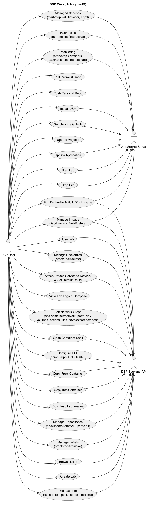
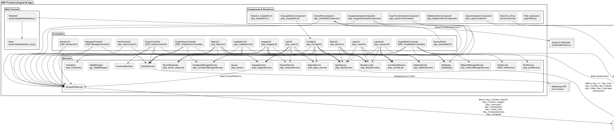
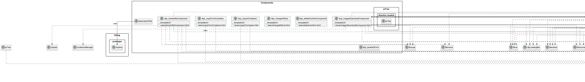
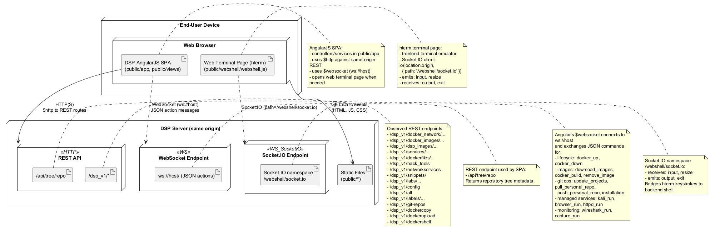

 

% 1 — System Overview
# SECTION 1 — System Overview

This repository contains the full client-side application of Docker Security Playground (DSP), implemented as a single-page web application (SPA) based on AngularJS 1.x. It provides the user interface, orchestration logic, and terminal front-end for building, configuring, running, monitoring, and managing “labs” (containerized network scenarios) and related assets (Docker images, Dockerfiles, Git repositories, and managed tools). The front-end communicates with a DSP backend through REST endpoints, a plain WebSocket channel, and a dedicated Socket.IO stream for interactive shell sessions.

The scope of this repository is the front-end only. Server-side APIs, orchestration engines (e.g., Docker/Compose), and persistence are expected to be provided by the DSP backend and are not included here. All features, flows, and user interactions described below are derived strictly from the client code and the HTTP/WebSocket contracts it relies upon.

The system’s primary purpose is to enable users to:
- Create, edit, and use “labs” composed of containers and virtual networks (including a topology editor and YAML/Compose export).
- Manage required container images: discover, build, download, delete, and verify installation status across labs.
- Author and edit Dockerfiles (with a tree editor, code snippets, and integrated build/push pipeline).
- Manage personal and external Git repositories used as lab sources.
- Configure personal DSP settings and synchronize local/remote repositories.
- Operate and monitor running labs, including opening web terminals into containers, copying files in/out, and managing network services and tools (e.g., Kali, HTTPD, browser).
- Perform packet capture and live monitoring via Wireshark and TCPDump.

High-level functionality is organized as follows, based on Angular modules, controllers, services, and components found in the codebase.

Purpose and scope
- Front-end SPA: A cohesive AngularJS application that renders all main views (labs, lab editor, images, repositories, labels, configuration, monitoring, and installation) and manages client-side state. Core navigation is driven by route parameters and controllers under public/app/controllers.
- Backend integration: The UI invokes REST endpoints under /dsp_v1/* and /api/* (e.g., for labs, Docker images, Dockerfiles, repositories, snippet catalogs, and repo file trees) and uses a raw WebSocket (ws://<host>) for operational commands (build/run/stop/update/pull/push) and streaming logs. A dedicated Socket.IO channel (/webshell/socket.io) is used for interactive terminals.
- Terminal front-end: A fully-embedded hterm-based terminal (public/webshell) connects via Socket.IO to the server-side PTY, handling keystrokes, resize, and output.

Key features derived from the implementation
- Labs management (listing, filtering, creating, cloning, importing, editing, using)
  - Views/controllers: labs.html (dsp_LabsCtrl), lab.html (dsp_LabCtrl), edit_network.html (DSP_GraphEditorController), graph_action_controller.js, graph_editor_controller.js.
  - Use mode supports starting/stopping labs (SocketService actions docker_up/docker_down), viewing logs (ANSI parsing), inspecting compose YAML, and accessing running containers (web terminals, copy in/out).
  - Edit mode provides a topology editor (MXGraph), container/network forms (networks, ports, volumes, actions, env vars), optional import of compose YAML, and compose export.
  - Lab metadata (description/goal/solution/readme) is editable and persisted via AjaxService to /dsp_v1/labs/*.
- Docker image management
  - Views/controllers: images.html (dsp_ImagesCtrl), imagesDownloadComponent.html (dsp_imagesDownloadComponent).
  - Lists installed images and lab-specific required images (download/build flags), with operations:
    - Pull/download images (SocketService action download_images; progress parsed from streaming JSON).
    - Build images (SocketService action docker_build) with streaming logs.
    - Delete images (SocketService action remove_image).
    - Recheck lab image installation status via dockerImagesService.areImagesInstalled.
- Dockerfile authoring and builds
  - Component: dsp_dockerfileComponent (UI tree with directories/files, selection, jstree directive, ui-ace editor).
  - REST: dockerAPIService.getDockerfile/editDockerfile/getDockerFiles/createDockerFile, and getSnippets for code snippets.
  - Build/push: triggers builds via SocketService action docker_build, with needToPush/tag controls and streaming feedback.
  - Snippet insertion, category switching, undo snippet changes; marking scripts executable; adding/removing files; drag-n-drop upload; auto-augment Dockerfile with COPY lines.
- Container file copy and shell access
  - Components: dsp_copyInContainer (POST /dsp_v1/dockerupload), dsp_copyFromContainer (POST /dsp_v1/dockercopy, returns downloadable path), and action buttons in lab and services views.
  - Webshell: public/webshell/webshell.js implements an hterm client that connects to /webshell/socket.io and streams PTY IO. The shell session is opened by POST /dsp_v1/dockershell and then the client navigates to docker_socket.html.
- Configuration and repositories
  - View/controller: configuration.html (dsp_ConfigCtrl) offers:
    - Personal config: name, mainDir, dockerRepo, gitEmail.
    - Repo synchronization: change Github URL (modal dsp_changeGithub), pull/push personal repo via WebSocket actions pull_personal_repo/push_personal_repo.
    - App updates: update_application, update_projects via SocketService.
    - Repo file tree: /api/tree/repo for uploading/deleting files.
  - Repositories view/controller: repositories.html (dsp_RepoCtrl) to add/edit/update/remove Git repositories via WebSocket actions add_project, update_project, edit_repository and REST AjaxService.getProjects/removeProject.
- Managed tools and services
  - Managed services (kali, httpd, browser): managed-tools.html (DSP_ManagedToolsCtrl) uses SocketService actions kali_run/httpd_run/browser_run and dockerAPIService status/endpoints to start/stop and surface logs/URLs (e.g., httpd and browser ports).
  - Hack tools: services.html and hacktools.html (dsp_HackToolsCtrl, DSP_DockerToolsCtrl) to run one-line or interactive containers with selected images, ports, env, and networks; stream command output via SocketService docker_run; manage running services via dockerAPIService.getServices/start/stop/delete and network attach/detach/default routing.
- Monitoring
  - monitoring.html (DSP_MonitorCtrl) to control Wireshark (start/stop, status checks) and TCPDump captures (start/stop), stream logs via SocketService actions wireshark_run/capture_run, and generate service URLs (HTTPS link).
- Labels and breadcrumbs
  - Labels management: labels.html (dsp_LabelsCtrl) to add/edit/remove labels synchronized to user lab metadata via AjaxService labels endpoints.
  - Breadcrumbs: breadcrumb service dynamically builds context-aware navigation.

Core technical characteristics
- Frameworks and UI components
  - AngularJS 1.x (controllers/services/components), UI Bootstrap, Angular modules for WebSocket (ngWebSocket), notifications (angular-ui-notification), file/ACE editors (ui-ace), and jstree directive integration.
  - hterm (terminal) embedded in webshell for PTY sessions, using Socket.IO.
  - MXGraph (views reference assets) powers the topology editor; inspectors and forms for container/network properties are dynamically built in views and controllers.
- Client–server interaction model
  - REST endpoints under /dsp_v1/* (labs, images, services, dockerfiles, hacks tools, network services, snippets) and under /api/* (repo file trees).
  - Plain WebSocket to ws://<host> (SocketService) sends JSON action messages and receives streaming JSON status/progress; used pervasively for long-lived operations (builds, image pulls, lab up/down, app/repo updates).
  - Socket.IO endpoint /webshell/socket.io for interactive terminal IO and window resize.
- Modularity and state management
  - Services encapsulate backend contracts and local caches (AjaxService, dockerAPIService, dockerImagesService, WalkerService).
  - ContainerManagerService and NetworkManagerService maintain in-memory models of containers and networks used by the editor and actions.
  - RegexService validates names, URLs, network subnets, and docker wrapper argument rules.

Notable views and flows
- Installation (installation.html): one-time configuration with SocketService action installation; persists user name, project dir, docker repo, git email, and remote repo (with optional private credentials).
- Labs “use” mode: start/stop lab (docker-compose up/down via WebSocket), view YAML, open terminal per container, copy files in/out, monitor network services, and access managed tools and integrations (Kali/browser/httpd).
- Labs “edit” mode: design topology, modify container/network properties, add volumes/ports/files/actions/env vars, save to generate YAML, optionally import/export docker-compose.

Out of scope for this repository
- Backend implementations of the DSP REST/WebSocket/Socket.IO APIs (only the contracts are consumed here).
- Actual Docker/Compose orchestration, PTY handling, image registry interactions, and repository operations (these are server responsibilities).

This section reflects the high-level behavior, capabilities, and boundaries of the DSP front-end as implemented in the provided codebase.

% 2 — Architectural Context
## 2. Architectural Context

This section describes the externally visible environment of the front-end application as evidenced by the codebase. It lists the external systems and services the application interacts with, the REST and real-time interfaces it consumes, the data sources it accesses, and the users interacting with the system. Only elements explicitly referenced in the code are included.

### External Systems

- DSP backend over HTTP(S)
  - Exposes the REST API namespace /dsp_v1 used throughout services and controllers.
  - Exposes ancillary REST APIs under /api (e.g., /api/tree/repo).
- DSP backend WebSocket endpoint
  - ws://<host> used by SocketService to send action-based commands.
- DSP backend Socket.IO endpoint for web shell
  - io(location.origin, { path: '/webshell/socket.io' }) used by the web terminal.
- Browser environment and client libraries (consumed locally)
  - AngularJS 1.x, Angular UI Bootstrap, Angular WebSocket, Prism, mxGraph, hterm (all served as static assets; not remote services).

### APIs / Interfaces

- REST — configuration and metadata (via /dsp_v1)
  - GET /dsp_v1/config, POST /dsp_v1/config
  - GET /dsp_v1/all
  - GET /dsp_v1/labels/{user}, POST /dsp_v1/labels/{user}, PUT /dsp_v1/labels/{user}, DELETE /dsp_v1/labels/{user}/{name}
  - GET /dsp_v1/git-repos, POST /dsp_v1/git-repos, DELETE /dsp_v1/git-repos/{repo}
  - GET /dsp_v1/labs/{repo}/{lab}, GET /dsp_v1/userlab/{lab}
  - POST /dsp_v1/labs/{labName}, PUT /dsp_v1/labs/{toEditName}, DELETE /dsp_v1/labs/{nameToDelete}
  - POST /dsp_v1/labs/{labName}?wantToCopy=1 (copy lab)
  - POST /dsp_v1/all/ (import lab)
  - GET /dsp_v1/docker_network/{repo}/{lab}?isEditing={0|1}
  - GET /dsp_v1/docker_network/{lab}?isEditing={0|1}
  - GET /dsp_v1/docker_network/is-imported/{repo}/{lab}
- REST — images (via /dsp_v1)
  - GET /dsp_v1/docker_images?completeDescription={true|false}
  - GET /dsp_v1/dsp_images/ (all repo images)
  - GET /dsp_v1/dsp_images/{repo}/{lab}
  - GET /dsp_v1/dsp_images/{repo}/{lab}?checkInstallation=true
  - POST /dsp_v1/dockerfiles/{imageName} (create), GET /dsp_v1/dockerfiles/{imageName}, PUT /dsp_v1/dockerfiles/{imageName}, DELETE /dsp_v1/dockerfiles/{imageName}
  - GET /dsp_v1/dockerfiles (list)
  - GET /dsp_v1/snippets/ (Dockerfile snippets)
- REST — running services and networks (via /dsp_v1)
  - GET /dsp_v1/services/ (list)
  - GET /dsp_v1/services/{serviceName} (isRun), GET /dsp_v1/services/wireshark, DELETE /dsp_v1/services/wireshark
  - POST /dsp_v1/services/{containerName} (run service)
  - PUT /dsp_v1/services/stop/{containerName}, PUT /dsp_v1/services/start/{containerName}
  - DELETE /dsp_v1/services/{containerName}
  - POST /dsp_v1/services/defaultnetwork/{containerName} (body: { networkname })
  - POST /dsp_v1/networkservices (attach network), DELETE /dsp_v1/networkservices?networkname=...&servicename=... (detach network)
  - GET /dsp_v1/hack_tools (list tools), DELETE /dsp_v1/hack_tools/{containerName}
- REST — web shell and file copy (via /dsp_v1)
  - POST /dsp_v1/dockershell (open terminal; body includes repo, lab, dockername, dockercompose, size)
  - POST /dsp_v1/dockercopy (copy from container; returns a public/ path)
  - POST /dsp_v1/dockerupload (copy into container)
- REST — repository tree (via /api)
  - GET /api/tree/repo?id={...}, POST /api/tree/repo (body: { file }), DELETE /api/tree/repo?id={...}
- WebSocket — action bus (ws://<host>)
  - Client sends JSON messages with fields:
    - action: one of
      - installation, update_application, update_projects
      - docker_up, docker_down, docker_run
      - download_images, remove_image, docker_build
      - synchronize_github, pull_personal_repo, push_personal_repo
      - kali_run, httpd_run, browser_run
      - wireshark_run, capture_run
      - add_project, update_project, edit_repository
    - params/body: action-specific payload (e.g., lab identifiers, image names/tags, container config).
  - Server responses consumed by controllers:
    - status: success | error | progress, message/code, and action-specific data.
- Socket.IO — web shell (path: /webshell/socket.io)
  - Emits: 'input' (keystrokes), 'resize' ({ col, row }).
  - Listens: 'output' (VT output text), 'exit' (redirect), 'disconnect'.

### Data Sources

- Repository file tree served by backend
  - /api/tree/repo for listing, uploading, and deleting files used in labs and compose uploads.
- Dockerfile snippets catalogue
  - /dsp_v1/snippets/ returns snippet categories and code used by the Dockerfile editor.
- Docker images metadata
  - /dsp_v1/docker_images, /dsp_v1/dsp_images provide image lists and install status.
- Lab, repo, and label metadata
  - /dsp_v1/labs, /dsp_v1/all, /dsp_v1/git-repos, /dsp_v1/labels endpoints.
- Web terminal state (client side)
  - hterm uses lib.Storage.Local() for terminal preferences within the browser (local storage).

### Users / Actors

- Interactive Web User
  - Operates the AngularJS UI in a web browser to manage labs, images, repositories, configurations, and to interact with running containers (copy files, open shell).
- DSP Backend (as an integration actor)
  - Receives REST and WebSocket/Socket.IO calls from the front-end; performs Docker operations, repository management, and terminal session brokering on behalf of the user.

% 2.1 — Architectural Context – Use Case Diagram
## Section 2.1 — Architectural Context – Use Case Diagram

This section presents the system’s main user interactions as evidenced by the AngularJS codebase. The diagram reflects the concrete features implemented by controllers, services, directives, and components, and shows how the single primary actor (DSP User) uses the DSP Web UI to perform operations. Secondary actors represent the backend integration points actually consumed by the frontend: the HTTP-based DSP Backend API (via $http) and the WebSocket Server (via SocketService and webshell Socket.IO).

Figure 02-01 — DSP Web UI Use Cases (derived from code)

% 3 — Containers
## 3. Containers

This section identifies the runtime containers that the delivered codebase interacts with at execution time. The public/ tree is a complete client-side application (AngularJS SPA) that communicates with server-side endpoints and real-time gateways to manage labs, Docker services, and web terminals. Based on the concrete URLs, protocols, and client libraries referenced in the code, the system at runtime consists of the following containers.

| Container | Responsibility | Technology | Communication |
|---|---|---|---|
| DSP Web Client (SPA) | User-facing single-page application for lab design, execution, images management, repositories, labels, configuration, and interactive terminals. Implements all UI flows and calls backend APIs. | AngularJS 1.x, ui-bootstrap, angular-websocket, socket.io-client, hterm (in-browser terminal), Ace editor (ui-ace), jsTree, Bootstrap | - HTTP(S) to REST endpoints under /dsp_v1/* and /api/tree/repo via $http - WebSocket (ws://host) via angular-websocket (e.g., actions docker_up, docker_down, download_images, remove_image, synchronize_github, update_projects, etc.) - Socket.IO to /webshell/socket.io for the web shell - Static asset delivery (HTML/CSS/JS) over HTTP(S) |
| DSP Backend API and Real‑time Gateway (server-side, not in this repo) | Hosts REST endpoints consumed by the SPA for labs, images, services, dockerfiles, labels, repositories, configuration, snippets, tree browsing; provides real-time command channel and web shell bridging. | Exposes HTTP REST and real-time endpoints; provides WebSocket gateway and Socket.IO namespace /webshell/socket.io (server-side framework not included in this codebase) | - HTTP(S) REST: /dsp_v1/docker_network/*, /dsp_v1/docker_images/*, /dsp_v1/services/*, /dsp_v1/dockerfiles/*, /dsp_v1/hack_tools, /dsp_v1/networkservices, /dsp_v1/snippets/*, /dsp_v1/labs/*, /dsp_v1/git-repos, /dsp_v1/config, /dsp_v1/all, /api/tree/repo, /dsp_v1/dockercopy, /dsp_v1/dockerupload, /dsp_v1/dockershell - WebSocket (ws://host) for control actions (JSON messages) managed by SocketService - Socket.IO (path /webshell/socket.io) for terminal I/O |
| Docker Engine (external) | Container build, image pull/remove, run/stop services, network attach/detach, compose up/down for labs. | Docker daemon (CLI/HTTP API; inferred from docker_* actions and endpoints) | - Backend to Docker via Docker CLI/Engine API (invoked by REST/WS actions such as docker_up, docker_down, docker_build, download_images, remove_image, attach/detach network) |
| Remote Git Provider (external) | Hosting of user and project repositories; synchronize/pull/push projects and personal repo. | Git over HTTPS/SSH (provider agnostic; supports username/token or sshKeyPath) | - Backend to Git over HTTPS (username/token) or SSH (sshKeyPath), driven by SPA actions add_project, update_project, pull_personal_repo, push_personal_repo, edit_repository |

Notes for validation:
- All listed REST paths and real-time actions are taken directly from the services and controllers in public/app (e.g., dockerAPIService, AjaxService, SocketService, webshell.js).
- The Socket.IO endpoint is explicitly referenced by the web shell client (public/webshell/webshell.js) at location.origin with path /webshell/socket.io.
- No database container is referenced anywhere in the client codebase; none is listed here.

% 3.1 — Architecture Overview – Component Diagram
## SECTION 3.1 — Architecture Overview – Component Diagram

This section presents a complete component-level overview of the AngularJS-based DSP frontend present in the codebase. It enumerates all Angular controllers, services, components, directives, and supporting web terminal integration, and shows their main interactions and dependencies. The diagram focuses on the real implementation as seen in the source code, including all HTTP and WebSocket interactions with the backend API endpoints and the Socket.IO webshell channel.

Figure 3.1-1 — DSP Frontend Component Diagram

Notes and rationale:
- All AngularJS controllers found under public/app/controllers are included as components, reflecting their real names and responsibilities.
- All AngularJS services under public/app/services are fully listed; each service’s outbound HTTP/WebSocket interactions are shown.
- All AngularJS components and directives under public/app/components are included, with their template URLs and bindings inferred from the code.
- External dependencies include the DSP Backend API (REST over /dsp_v1/* and /api/tree/repo), the application WebSocket endpoint used by SocketService (ws://<host>), and the Socket.IO channel used by the web terminal (Webshell) at /webshell/socket.io.
- Webshell integrates hterm (public/webshell/hterm_all.js) and communicates over Socket.IO to the backend as implemented in public/webshell/webshell.js.

Figure validation:
- DockerAPIService endpoints and methods exactly match those declared in public/app/services/docker_service.js.
- AjaxService endpoints and methods exactly match those declared in public/app/services/ajax_service.js.
- SocketService uses $websocket('ws://' + location.host) as in public/app/services/socket_service.js.
- Components’ REST calls (e.g., /dsp_v1/dockercopy, /dsp_v1/dockerupload) are taken directly from their controllers in public/app/components.
- jsTree.directive uses $http for fetching tree data (treeSrc, treeAjax) per public/app/components/jsTree.directive.js.
- Webshell uses io(location.origin, {path: '/webshell/socket.io'}) per public/webshell/webshell.js.

End of Section 3.1.

% 4 — Components
## 4. Components

This section identifies the internal components implemented in the client-side codebase, including AngularJS components, controllers, services, and directives, as well as the WebShell terminal client. For each component, it states the primary responsibility and enumerates its collaborations and external interactions such as Angular service dependencies, HTTP endpoints, WebSocket actions, and notable third-party libraries used. This mapping is derived directly from the source files under public/app and public/webshell. Third‑party vendored libraries (for example hterm_all.js) are treated as external dependencies.

| Component | Responsibility | Interactions |
|---|---|---|
| appFilters.basenameFilter | AngularJS filter that returns the basename of a path by stripping folders. | [] |
| dsp_changeGithub (component, template views/changeGithub.html) | Modal to confirm changing the GitHub remote for the user repo. | ["$uibModal consumer (configCtrl.openEditGithub)", "bindings: resolve/close/dismiss"] |
| dsp_copyFromContainer (component, template views/copyFromContainer.html) | Modal to initiate a file copy from a Docker container, trigger backend archive creation and provide download link. | ["$http POST /dsp_v1/dockercopy", "Notification", "window.open for download", "bindings: resolve/close/dismiss"] |
| dsp_copyInContainer (component, template views/copyInContainer.html) | Modal to upload a file from host to a Docker container. | ["$http POST /dsp_v1/dockerupload", "Notification", "bindings: resolve/close/dismiss"] |
| dsp_deleteConfirmComponent (component, template views/deleteConfirm.html) | Generic confirmation modal used for deletions. | ["$uibModal consumer in controllers (e.g., imagesCtrl, labelsCtrl)", "bindings: resolve/close/dismiss"] |
| dsp_dockerfileComponent (component, template views/dockerfileComponent.html) | Full Dockerfile editor with file tree (jsTree), snippet insertion, save and build via WebSocket. | ["$http (dockerAPIService.*)", "dockerAPIService.getDockerfile", "dockerAPIService.getSnippets", "dockerAPIService.editDockerfile", "SocketService.manage action 'docker_build'", "safeApplyService", "$location", "Notification", "Upload (drag&drop)", "jsTree directive", "underscore/lodash", "FileReader API"] |
| dsp_imagesDownloadComponent (component, template views/imagesDownloadComponent.html) | Lists lab images, triggers download of missing images with progress via WebSocket. | ["dockerImagesService.getByLab", "SocketService.manage action 'download_images'", "CurrentLabService", "Notification"] |
| dsp_isolatedForm (directive) | Attribute directive to isolate nested Angular forms so child validity doesn’t influence parent. | ["Angular form controllers"] |
| jsTree.directive (directive module jsTree.directive, directive 'jsTree') | Angular directive wrapper for jQuery jsTree with data sources, plugins, and event bindings. | ["$http", "jQuery .jstree()", "attributes: treeData/treeSrc/treeModel/treePlugins/treeEvents/treeTypes/treeDnd"] |
| dsp_ConfigCtrl (controller) | Configuration screen: loads/updates DSP config; pulls/pushes user repo; updates projects; repo UI; file tree management (data repo). | ["AjaxService (config, update, labels)", "CurrentLabService.resetLab", "SocketService.manage actions: 'synchronize_github','update_application','update_projects','pull_personal_repo','push_personal_repo'", "$http GET/POST/DELETE /api/tree/repo", "Notification", "$uibModal (changeGithubComponent)", "$location", "Constants.RUNNING_CODE_ERROR", "FetchFileFactory (external)"] |
| DSP_DockerToolsCtrl (controller) | One‑line and interactive hack tool runner; managed services list; network attach/detach; ports and env management. | ["dockerAPIService (initServices, runService, stopService, attachNetwork, detachNetwork, serviceDefaultNetwork)", "dockerImagesService.get", "incrementNumber", "SocketService.manage action 'docker_run'", "SafeApply", "Notification"] |
| dsp_dockerfileCtrl (controller) | Binds dockerfile route param to scope for editor component. | ["$routeParams", "dsp_dockerfileComponent consumer"] |
| DSP_GraphActionController (controller) | “Use Lab”: start/stop compose, copy to/from container modals, web shell launch, fetch lab/network info, graph handlers. | ["SocketService.manage actions: 'docker_up','docker_down'", "$http POST /dsp_v1/dockershell", "$http GET /dsp_v1/labs/:repo/:lab", "dockerAPIService.getNetworkList", "dockerAPIService.getDockerImages", "dockerAPIService.useLab", "containerManager", "$uibModal (copyFromContainerComponent, copyInContainerComponent)", "$sce", "CleanerService.parse", "cfpLoadingBar", "Notification", "GraphHandler (external)", "Prism (external)"] |
| DSP_GraphEditorController (controller) | “Edit Lab”: canvas/graph editor, container/network modeling, compose view, image mgmt (download/build), save/load lab. | ["dockerAPIService.getDockerImages", "dockerAPIService.loadLab/saveLab/loadGeneralLab", "NetworkManagerService", "containerManager", "RegexService", "portService", "safeApplyService", "SocketService.manage action 'download_images'", "Notification", "Prism", "YAML parser", "MX__ APIs (mxGraph script)"] |
| dsp_HackToolsCtrl (controller) | Hack tools page: lists images and tools, switches between interactive/one‑line. | ["dockerAPIService.getListHackTools", "dockerImagesService.get"] |
| dsp_ImagesCtrl (controller) | Image manager: lists DSP images by lab and installed images; build/download/remove images; Dockerfile CRUD. | ["dockerAPIService.getDockerImages/getDSPImages/getDockerFiles/createDockerFile/deleteDockerFile", "SocketService.manage actions: 'download_images','remove_image','docker_build'", "$uibModal('modalComponent') for confirm", "Notification", "$location", "$anchorScroll"] |
| dsp_InstallationCtrl (controller) | Installation wizard: collects config and repo info, kicks off installation via WebSocket, shows progress. | ["SocketService.manage action 'installation'", "Notification", "RegexService", "SafeApply"] |
| dsp_LabCtrl (controller) | Lab details page: description/goal/solution editing; compose canvas preview; run/stop; copy in/out; navigation. | ["AjaxService.getLabInfo/isReadOnlyLab/init/editLab/deleteLab/importLab", "WalkerService", "CurrentLabService", "dockerAPIService.loadGeneralLab/getListHackTools", "dockerImagesService.areImagesInstalled/get", "SocketService.manage actions: 'docker_up','docker_down'", "$uibModal (copyFromContainerComponent, copyInContainerComponent)", "$http POST /dsp_v1/dockershell", "$sce", "cfpLoadingBar", "CleanerService", "Notification", "Prism"] |
| dsp_LabelsCtrl (controller) | Labels CRUD and assignment across labs; UI for edit/remove/add with confirmation. | ["AjaxService (labels CRUD + projectLabels updates)", "WalkerService.update/remove label refs", "$uibModal('modalComponent')", "Notification", "SafeApply"] |
| dsp_LabsCtrl (controller) | Labs listing, filtering by name/labels/repos, quick navigation to running labs. | ["AjaxService.init (repos, labels, config)", "WalkerService.repos", "CurrentLabService.resetLab", "BreadCrumbs"] |
| dsp_MainCtrl (controller) | Main navigation/header: loads repos/version, breadcrumbs, active route highlighting. | ["AjaxService.init", "WalkerService.repos/version", "BreadCrumbs"] |
| DSP_ManagedToolsCtrl (controller) | Managed services (kali/httpd/browser) start/stop, status refresh, logs. | ["dockerAPIService.updateManagedServices/stopKali/stopBrowser/stopHackTool", "SocketService.manage actions: 'kali_run','browser_run','httpd_run'", "Notification"] |
| DSP_MonitorCtrl (controller) | Monitoring: Wireshark and TCPDump session control via sockets, target selection, logs. | ["dockerAPIService.loadGeneralLab/isWiresharkRun/isTcpdumpRun/stopWireshark/stopCapture", "SocketService.manage actions: 'wireshark_run','capture_run'", "Notification", "$routeParams"] |
| dsp_RepoCtrl (controller) | Git repositories manager: add/update/edit/remove repos; update all; modal confirm on delete. | ["AjaxService.getProjects/removeProject", "SocketService.manage actions: 'add_project','update_project','edit_repository','update_projects'", "$uibModal('modalComponent')", "Notification", "$location", "$anchorScroll", "RegexService.urlRegex"] |
| dsp_AjaxService (service) | Centralized REST client and client‑side cache for config, repos, labels, and labs; bootstraps WalkerService. | ["$http /dsp_v1/config,/dsp_v1/all,/dsp_v1/labels/:repo,/dsp_v1/labs/...,/dsp_v1/git-repos", "WalkerService.init/update", "Notification on errors"] |
| dsp_BreadCrumbs (service) | Breadcrumbs model and helper for building breadcrumb arrays per route. | ["Used by mainCtrl and pages"] |
| dsp_cleanerService (service) | Interpolates {{hostname}} and {{url}} placeholders based on $location. | ["$location"] |
| dsp_Constants (service) | Provides shared constant RUNNING_CODE_ERROR (1005). | [] |
| dsp_ContainerManagerService (service) | Client‑side container graph model: current container, to‑draw and not‑to‑draw lists, network associations, environment/volumes/ports, YAML parsing helpers. | ["Used by DSP_GraphEditorController and DSP_GraphActionController"] |
| dsp_currentLab (service) | Holds currently selected lab (name, repo) and flags (noImages). | ["Used throughout controllers"] |
| DockerAPIService (service) | API wrapper for Docker/labs: load/save labs, running services, networks, docker images, DSP images, hack tools, dockerfiles, snippets, network attach/detach; manages managed services state. | ["$http endpoints: /dsp_v1/docker_network/...,/dsp_v1/docker_images,/dsp_v1/dsp_images,/dsp_v1/services,/dsp_v1/dockerfiles,/dsp_v1/hack_tools,/dsp_v1/networkservices,/dsp_v1/snippets", "Maintains kali/httpd/browser isRun flags", "Used by many controllers/components"] |
| dsp_imagesService (service) | Caches installed images and lab images; delegates to DockerAPIService; exposes accessor APIs. | ["dockerAPIService.getDockerImages/getLabImages/areImagesInstalled"] |
| IncrementNumber (service) | Generates unique incremented names per base label (e.g., image label instances). | ["Used by DSP_DockerToolsCtrl"] |
| DSP_infoService (service) | UI info/state messages via gp_StateManager for graph editing guidance. | ["gp_StateManager"] |
| dsp_networkManagerService (service) | Network definitions store: add/remove networks, IP pool management, subnet helpers, parse YAML networks. | ["Used by DSP_GraphEditorController"] |
| dsp_portService (service) | Manages port pools (min/max/notAllowed, free/used bookkeeping). | ["Used by DSP_GraphEditorController"] |
| dsp_Queue (service) | PubSub wrapper for label events (NEW_LABEL). | ["PubSub global", "Used where label changes need broadcasting"] |
| dsp_regex_service (service) | Common regexes and validation helpers (names, URL, subnet), and Docker image argument rule translation to approve.js‑style validators. | ["Used by controllers validating inputs"] |
| dsp_server_response (service) | Normalizes $http promise handling with Notification on success/error. | ["Notification"] |
| SafeApply (service) | Safely triggers $scope.$apply around operations if needed. | ["Used throughout controllers/components"] |
| SocketService (service) | WebSocket wrapper (angular-websocket) sending a JSON message and registering a message handler; provides close(). | ["ws://{host} default path", "Used by many controllers/components"] |
| gp_StateManager (class) | Simple state manager with named message/type states. | ["Used by DSP_infoService"] |
| dsp_WalkerService (service) | In‑memory model of repos/labs; mutators for labs and labels; version info. | ["Used by AjaxService and controllers"] |
| Webshell (class, public/webshell/webshell.js) | Terminal client running hterm in browser connected to server via socket.io for interactive shell. | ["socket.io namespace '/webshell/socket.io'", "hterm.Terminal", "socket events: 'input','resize','output','exit','disconnect'"] |
| hterm library (external, public/webshell/hterm_all.js) | Vendored terminal emulator stack (libdot + hterm): terminal, keyboard, screen, scroll port, preferences, VT sequences, OSC, colors, clipboard. | ["Consumed by Webshell only", "No direct Angular dependencies"] |

Notes:
- Where controllers open modals by component name (for example, 'changeGithubComponent', 'copyFromContainerComponent', 'modalComponent'), the corresponding component implementations reside in public/app/components (variables dsp_changeGithub, dsp_copyFromContainer, dsp_deleteConfirmComponent), and are wired during Angular module bootstrap (outside of the provided files).
- External libraries referenced from controllers/components (GraphHandler, Prism, YAML, mxGraph) are dynamically loaded or assumed to be available via the page and are treated as external interactions here.

% 5 — Code-Level View
# SECTION 5 — Code‑Level View

This section maps the implemented architecture to concrete source files and symbols. It identifies the main entry points that bootstrap the client applications, enumerates every AngularJS controller, component, directive, and service in the codebase, and explains their responsibilities and dependencies. It also summarizes external libraries used, the relevant REST/WebSocket endpoints consumed, and recognizable design patterns. The goal is to allow developers to validate the architecture against the actual code and to quickly locate code implementing a specific capability.

## 5.1 Main Entry Points (Bootstrap and Runtime Surfaces)

This repository exposes two concrete, fully wired entry points. Other Angular controllers/services/components provided in the source are meant for the main application but the corresponding index/bootstrap page is not included in the repository snapshot.

1) Installation application (AngularJS)
- Location: public/installation.html
- Angular module: myApp
- Module configuration:
  - ngAnimate, ngSanitize, ngWebSocket, ui.bootstrap, ui-notification
  - NotificationProvider defaults
  - $locationProvider.html5Mode(true)
- Services registered into myApp:
  - ServerResponse → dsp_server_response (public/app/services/response_server_service.js)
  - SafeApply → SafeApply (public/app/services/safe_apply_service.js)
  - RegexService → dsp_regex_service (public/app/services/regex_service.js)
  - SocketService → SocketService (public/app/services/socket_service.js)
- Controller: installationCtrl → dsp_InstallationCtrl (public/app/controllers/installationCtrl.js)
- Purpose: One-off first‑run configuration UI (user name, repo path, docker repo, git email, remote repo auth). Talks to server via SocketService(action: 'installation') and via AjaxService endpoints under /dsp_v1/.

2) Web shell (hterm + socket.io)
- Location: public/webshell/webshell.js
- Libraries: hterm/libdot bundle (public/webshell/hterm_all.js), socket.io client
- Runtime:
  - Connects to socket.io at io(location.origin, { path: '/webshell/socket.io' })
  - Initializes hterm.Terminal, enables Ctrl-C copy and Ctrl-V paste
  - Bridges terminal keystrokes to socket ('input') and terminal resize to socket ('resize')
  - Receives 'output' to write to terminal; 'exit' to redirect; logs on 'disconnect'
- Purpose: Interactive terminal in browser bound to a server-side pty.

Note on main DSP Angular app
- The repository contains controllers, components, directives, and services for the full DSP UI (network editor, lab details, images, repositories, labels, etc.), along with their HTML views under public/views/.
- The bootstrap page that wires these (typically index.html with angular.module initialization and route configuration) is not present in this snapshot. Code-level details for these artifacts are documented below for completeness.

## 5.2 Source Code Organization (Key Directories)

| Path | Purpose |
|---|---|
| public/app/components | AngularJS components and small UI directives used across DSP (modals, Dockerfile editor, image downloads, jsTree adapter). |
| public/app/controllers | AngularJS controllers for screens/pages: labs, lab use/edit/graph, images, repositories, labels, configuration, monitor, hacking tools, managed tools, etc. |
| public/app/services | AngularJS services/factories/utilities for API calls, state handling and utilities (DockerAPIService, AjaxService, SocketService, images handler, container/network managers, regex rules, etc.). |
| public/views | Angular HTML templates used by controllers/components (graph editor panel, compose view, pages for labs, images, repositories, config, labels, modals). |
| public/webshell | Web terminal runtime (hterm bundle and thin glue code webshell.js). |
| public | Standalone pages: installation.html and userobject.html (mxGraph demo). |
| .eslintrc.js | ESLint configuration (Airbnb base with tuned rules). |

## 5.3 AngularJS Components, Directives and Controllers

The following tables enumerate all Angular-facing artifacts defined in this repository snapshot, with their file origin, dependencies, and responsibilities. The names shown are the symbols implemented in code; the DOM/component tag names used in views are indicated where visible.

### 5.3.1 Components (reusable UI blocks)

| Symbol (file) | Notes and bindings | Used by | Responsibilities |
|---|---|---|---|
| dsp_changeGithub (public/app/components/dsp_changeGithub.js) | A modal component; bindings: resolve, close, dismiss. | configCtrl.openEditGithub() opens component: 'changeGithubComponent' (name mapping/registration not in this snapshot). | Confirmation dialog to proceed with GitHub repo change. On init, reads lab from resolve. Exposes ok/cancel. |
| dsp_copyFromContainer (public/app/components/dsp_copyFromContainer.js) | Modal; bindings: resolve, close, dismiss. | Used by controllers (graph_action_controller, labCtrl) opening component 'copyFromContainerComponent'. | Copies files out of a container. Builds request body from lab data (repo, lab, dockername, compose flag), POST /dsp_v1/dockercopy, then exposes returned downloadable path. |
| dsp_copyInContainer (public/app/components/dsp_copyInContainer.js) | Modal; bindings: resolve, close, dismiss. | Used by controllers opening 'copyInContainerComponent'. | Uploads file from hostPath into containerPath via POST /dsp_v1/dockerupload. |
| dsp_deleteConfirmComponent (public/app/components/dsp_deleteConfirm.js) | Modal; bindings: resolve, close, dismiss. | Multiple controllers open a confirmation modal named 'modalComponent'. Name mapping not in snapshot; this is the confirm dialog implementation. | Basic confirm dialog to proceed with deletion (labs, repos, images). |
| dsp_dockerfileComponent (public/app/components/dsp_dockerfileComponent.js) | tag used in views as <dockerfile-component dockerfile="dockerfile">; binding: dockerfile ('='). | Views/dockerfile.html; controllers navigate here from graph editor and images. Uses services: SocketService (websocket build), dockerAPIService, Notification, Upload, etc. | Full Dockerfile editor and build pipeline: loads tree model of Dockerfile content, supports uploads, directory/file model, selection/edit/save executable flag, code snippets injection (getSnippets), save & build (SocketService 'docker_build', with push option and tag). Handles build logs/progress and navigation to images. Manages jsTree via helper directive. |
| dsp_imagesDownloadComponent (public/app/components/dsp_imagesDownloadComponent.js) | Likely used as <images-component> in lab.html. Binding: download '='. | Lab 'use' page to bulk download required images. | Lists images for current lab, provides per-image and all-images download logic via SocketService 'download_images'. Tracks progress bars and extraction status, updates installed status via dockerImagesService.areImagesInstalled. |

### 5.3.2 Directives

| Symbol (file) | Module | Purpose |
|---|---|---|
| dsp_isolatedForm (public/app/components/isolatedForm.directive.js) | (assumed registered in main app) | Converts a nested form into an isolated child, preventing parent form $dirty/$valid interference; overrides validity/dirty propagation (classic AngularJS trick). |
| jsTree (public/app/components/jsTree.directive.js) | angular.module('jsTree.directive', []) | Angular wrapper for jsTree: supports data from HTML/JSON/scope/ajax, plugin configuration (state, search, checkbox, contextmenu, types, dnd), event mapping via attribute tree-events, live re-init on data changes. |

### 5.3.3 Controllers

| Symbol (file) | Dependencies (DI) | Key responsibilities |
|---|---|---|
| dsp_ConfigCtrl (public/app/controllers/configCtrl.js) | $scope, SafeApply, RegexService, BreadCrumbs, SocketService, $uibModal, Constants, ServerResponse, Notification, $http, CurrentLabService, $location, AjaxService, FetchFileFactory | Configuration page logic: load/update config (/dsp_v1/config), change git repo via websocket 'synchronize_github', app update/restart via websocket 'update_application', manage images/repos navigation, manage repo pull/push, render repo tree (/api/tree/repo) and file upload/delete. |
| DSP_DockerToolsCtrl (public/app/controllers/docker_tools_controller.js) | $scope, $location, Notification, SafeApply, SocketService, incrementNumber, dockerAPIService, dockerImagesService | Run “hack tools” and managed services: define currentContainer, one-line and interactive modes; start/stop/delete services via dockerAPIService (REST) or web socket ('docker_run'); manage optional ports, environments, network attach/detach and default route; track terminals/logs per running tool. |
| dsp_dockerfileCtrl (public/app/controllers/dockerfileCtrl.js) | $scope, SafeApply, $routeParams, BreadCrumbs, SocketService, $uibModal, Constants, ServerResponse, Notification, $http, CurrentLabService, $location, AjaxService, FetchFileFactory | Tiny controller to inject dockerfile name from route into view (<dockerfile-component>). |
| DSP_GraphActionController (public/app/controllers/graph_action_controller.js) | $scope, $sce, SocketService, CleanerService, $uibModal, $log, $http, $location, $window, cfpLoadingBar, dockerAPIService, containerManager, Notification | Lab “action” page while a lab is running: start/stop lab via websocket ('docker_up','docker_down'), load lab info (/dsp_v1/labs/<repo>/<lab>), track and display logs (with AnsiUp), manage web shell and copy in/out modals, display networks via dockerAPIService.getNetworkList, build compose YAML and graph via GraphHandler (global). |
| DSP_GraphEditorController (public/app/controllers/graph_editor_controller.js) | $scope, $routeParams, AjaxService, $uibModal, RegexService, $log, $http, $location, $window, NetworkManagerService, SocketService, portService, dockerAPIService, containerManager, infoService, safeApplyService, Notification, dependsFilter | Full-featured network graph editor: load or create lab, manage networks (creation, edit, delete, IP allocation), containers (add/edit/copy, images, ports, volumes, env, actions, depends/links, files to copy), YAML import/export and compose preview, run/restart lab (websocket), image pulling/building via SocketService, tie-in to mxGraph (MX__ functions). |
| dsp_HackToolsCtrl (public/app/controllers/hacktoolsCtrl.js) | $scope, ServerResponse, $log, SocketService, dockerImagesService, dockerAPIService, $routeParams, $sce, SafeApply, $document, $uibModal, $location, $http, cfpLoadingBar, CurrentLabService, CleanerService, BreadCrumbs, AjaxService, $sce, WalkerService, Notification | Hack tools listing page: fetch list of hack tools (dockerAPIService.getListHackTools), present interactive vs one-line images. |
| dsp_ImagesCtrl (public/app/controllers/imagesCtrl.js) | $scope, $log, SafeApply, WalkerService, RegexService, BreadCrumbs, SocketService, $uibModal, Constants, ServerResponse, Notification, $http, CurrentLabService, $location, $anchorScroll, $timeout, AjaxService, dockerAPIService, FetchFileFactory | Images management: load all Docker images and DSP images (/dsp_v1/docker_images, /dsp_v1/dsp_images), per-lab images with state; delete images (websocket 'remove_image'), download (websocket 'download_images'), build (websocket 'docker_build'); manage Dockerfile set (list/create/edit/delete via /dsp_v1/dockerfiles). |
| dsp_InstallationCtrl (public/app/controllers/installationCtrl.js) | ServerResponse, SocketService, SafeApply, RegexService, $http, $scope, $window, Notification | Installation wizard UI: set config fields, initiate installation via websocket action 'installation', show progress messages, display errors, on success redirect to /index.html. |
| dsp_LabCtrl (public/app/controllers/labCtrl.js) | $scope, $window, ServerResponse, $log, SocketService, dockerImagesService, dockerAPIService, $routeParams, $sce, SafeApply, $document, $uibModal, $location, $http, cfpLoadingBar, CurrentLabService, CleanerService, BreadCrumbs, AjaxService, $sce, containerManager, WalkerService, Notification | “Use lab” page: loads lab metadata and graph canvas, start/stop lab via websocket, display goals/solution with edit if user repo, show managed services, hack tools, web shell and copy modals, network list, image check & prompt for downloads. |
| dsp_LabelsCtrl (public/app/controllers/labelsCtrl.js) | $scope, $route, Notification, WalkerService, SafeApply, $uibModal, $http, BreadCrumbs, CurrentLabService, AjaxService, $location, $anchorScroll | Labels management: list/add/edit/delete labels via AjaxService; update walker state across labs. |
| dsp_LabsCtrl (public/app/controllers/labsCtrl.js) | $scope, AjaxService, CurrentLabService, BreadCrumbs, WalkerService, $location | Labs listing page: load repos and labs, filter by labels/repos, navigate to lab use page. |
| dsp_MainCtrl (public/app/controllers/mainCtrl.js) | $scope, $location, BreadCrumbs, AjaxService, CurrentLabService, WalkerService | Top-level navbar and sidebar: load repos and version via WalkerService; breadcrumbs and active route class helpers. |
| DSP_ManagedToolsCtrl (public/app/controllers/managed_tools_controller.js) | $scope, $location, Notification, SafeApply, SocketService, incrementNumber, dockerAPIService, dockerImagesService | Managed services (Kali, httpd, browser): start/stop via websocket or REST, expose URLs, show logs, update states. |
| DSP_MonitorCtrl (public/app/controllers/monitor_controller.js) | $scope, $routeParams, $location, Notification, SafeApply, SocketService, incrementNumber, dockerAPIService, dockerImagesService | Monitoring page: manage Wireshark (websocket 'wireshark_run' / REST status/stop), tcpdump captures ('capture_run'/'stop'), choose machines to sniff, show logs and state. |
| dsp_RepoCtrl (public/app/controllers/repoCtrl.js) | $scope, $log, SafeApply, WalkerService, RegexService, BreadCrumbs, SocketService, $uibModal, Constants, ServerResponse, Notification, $http, CurrentLabService, $location, AjaxService, dockerAPIService, FetchFileFactory, $anchorScroll | Repositories management page: list repos, add/edit/update/push/delete via websocket and REST; supports private repo credentials and SSH key path, update all. |

### 5.3.4 Services and Utilities

| Symbol (file) | Dependencies (DI) | Core responsibilities and endpoints |
|---|---|---|
| dsp_AjaxService (public/app/services/ajax_service.js) | $http, $q, $log, WalkerService, Notification, $location | Client-side model for config, repos, labels, labs; bootstrap method init() loading /dsp_v1/config and /dsp_v1/all then WalkerService.init; exposes CRUD for labels (/dsp_v1/labels/:user), labs (/dsp_v1/labs), git repos (/dsp_v1/git-repos), and helpers (copyLab, importLab, isReadOnlyLab). |
| dsp_BreadCrumbs (public/app/services/breadcrumbs_services.js) | — | Simple in-memory breadcrumb provider with named routes. |
| dsp_cleanerService (public/app/services/cleaner_service.js) | $location | Replaces {{hostname}} and {{url}} placeholders in lab goal/solution texts. |
| dsp_Constants (public/app/services/constants_service.js) | — | RUNNING_CODE_ERROR: 1005. |
| dsp_ContainerManagerService (public/app/services/container_manager_service.js) | — | Client model for containers under construction: currentContainer, lists to draw/not to draw; add/edit/remove, network attach/detach bookkeeping, copy files, environments; parse compose YAML (partial). |
| dsp_currentLab (public/app/services/current_lab.js) | — | Tracks current lab {repoName, name} and flag noImages. |
| DockerAPIService (public/app/services/docker_service.js) | $log, $http, containerManager, Notification | REST client for server-side DSP APIs: docker_network (lab load/use/save), docker_images (list/images), dsp_images (lab images), services (managed services status/start/stop/default network), dockerfiles (CRUD, edit, snippets), hack_tools (delete), networkservices (attach/detach), plus websocket-driven actions integrate with SocketService at controller level. |
| dsp_imagesService (public/app/services/images_service.js) | dockerAPIService, Notification | Cache & access layers over DockerAPIService for images and lab images; helpers to register/unregister download callbacks. |
| IncrementNumber (public/app/services/increment_number_service.js) | — | Utility to generate incrementing names per base label (e.g., 'kali', 'kali_1', ...). |
| DSP_infoService (public/app/services/info_service.js) | — | Simple state machine for graph editor guidance (need create network/container/select container). Uses gp_StateManager. |
| dsp_networkManagerService (public/app/services/network_manager_service.js) | — | Manages conceptual networks for graph editor: list, existence checks, subnet scanning, IP allocation/freeing, parse YAML networks. |
| dsp_portService (public/app/services/port_service.js) | — | Maintains pool of free/used/not allowed ports under constraints; supports use/free operations. |
| dsp_Queue (public/app/services/queue_service.js) | — | PubSub wrapper for label-related events using global PubSub. |
| dsp_regex_service (public/app/services/regex_service.js) | — | Regex rules and validators used across UI (names, URLs, subnet, patterns for docker image action args). |
| dsp_server_response (public/app/services/response_server_service.js) | Notification | Promise helpers to show success/error notifications. |
| SafeApply (public/app/services/safe_apply_service.js) | — | $scope-safe apply helper. |
| SocketService (public/app/services/socket_service.js) | $websocket | Thin wrapper to open a WS connection to ws://<host>, send JSON, and register onMessage handler; designed for one-shot request/stream interactions. |
| gp_StateManager (public/app/services/statemanager.js) | — | Small class to represent named UI states with messages and types (INFO/WARNING/ERROR). |
| dsp_WalkerService (public/app/services/walker_service.js) | $log | Client-side cache for repos/labs/version; helper methods to mutate labs and labels inside the user repo view model. |

### 5.3.5 Views/Templates

The repository contains the complete HTML templates for the features above. Key pages include:
- images.html, labs.html, lab.html, edit_network.html, edit_lab.html, repositories.html, labels.html, configuration.html, hacktools.html, monitoring.html; modal templates under views/*Confirm.html, copyIn/FromContainer.html, dockerfileComponent.html, dockerfile.html, imagesDownloadComponent.html, dockerfile.html. These templates reference the controllers/components exactly as listed and include supporting widget markup (Ace editor via ui-ace, Prism code highlight, YAML import using YAML.parse, md-progress-linear, uib-tabset, etc.).

## 5.4 External Libraries and Integration Points

External libraries (client-side):
- AngularJS 1.x (+ ngAnimate, ngSanitize, ngWebSocket), Angular UI Bootstrap (uib- components), angular-ui-notification, ui-ace (Ace), Prism highlighter, marked (Markdown in lab page), YAML parser, AnsiUp (ANSI to HTML), lodash/underscore (assumed '_' is present globally), jsTree, jQuery, mxGraph (graph editor), hterm/libdot (terminal), socket.io client.
- CSS/JS assets referenced by views are assumed under public/assets/* (not in this listing).

Server APIs (HTTP and WebSocket):
- REST base: /dsp_v1/
  - /docker_network (GET/POST operations: load lab, save lab, use lab state; network services list under /networkservices)
  - /docker_images (list all docker images; download/build via websocket actions)
  - /dsp_images (list per-repo/lab image requirements)
  - /services (managed runtime containers; start/stop/default network)
  - /dockerfiles (list/create/import from Git/dockerfile/edit/delete; getDockerfile returns tree model; getSnippets returns code snippets)
  - /hack_tools (list available tools; delete one)
  - /labels/:user (labels CRUD)
  - /labs (lab CRUD, info, import/copy, compose visibility)
  - /config (DSP configuration load/update)
  - /git-repos (project repo list/delete)
- REST outside /dsp_v1/:
  - /api/tree/repo (GET/POST/DELETE file listing and upload in data repo)
  - /dsp_v1/dockershell (POST to open a container shell session; used by controllers)
  - /dsp_v1/dockercopy (POST copy files from container)
  - /dsp_v1/dockerupload (POST copy files into container)
- WebSocket (SocketService to ws://<host>):
  - Actions observed in controllers: installation, synchronize_github, update_application, update_projects, push_personal_repo, pull_personal_repo, docker_up/down, docker_run, docker_build (also used by dockerfileComponent), download_images, remove_image, kali_run, httpd_run, browser_run, wireshark_run, capture_run.
- socket.io (webshell): /webshell/socket.io for interactive terminal streaming.

## 5.5 File‑Level Mapping (Complete List)

This table maps each application source file to its top-level symbol(s) and a brief note. It is exhaustive for public/app and public/webshell, and enumerates all view templates.

| File | Symbols/Exports | Summary |
|---|---|---|
| public/app/components/appFilters.js | basenameFilter() | Returns basename of path-like string. Registration not shown; intended as Angular filter. |
| public/app/components/dsp_changeGithub.js | var dsp_changeGithub = { ... } | Modal component model for changing GitHub repo. |
| public/app/components/dsp_copyFromContainer.js | var dsp_copyFromContainer = { ... } | Modal component model for copying files from a container; POST /dsp_v1/dockercopy; opens downloaded path in new tab. |
| public/app/components/dsp_copyInContainer.js | var dsp_copyInContainer = { ... } | Modal component model for copying files into a container; POST /dsp_v1/dockerupload. |
| public/app/components/dsp_deleteConfirm.js | var dsp_deleteConfirmComponent = { ... } | Delete confirmation modal model. |
| public/app/components/dsp_dockerfileComponent.js | var dsp_dockerfileComponent = { ... } | Dockerfile editor component; tree model handling; snippet insertion; build and push via SocketService; Ace editor integration; jsTree selection callback. |
| public/app/components/dsp_imagesDownloadComponent.js | var dsp_imagesDownloadComponent = { ... } | Lab images download/build list + progress; SocketService streaming; state propagation to CurrentLabService. |
| public/app/components/isolatedForm.directive.js | function dsp_isolatedForm() | Angular directive to isolate nested forms. |
| public/app/components/jsTree.directive.js | angular.module('jsTree.directive', []).directive('jsTree', ...) | Angular wrapper for jsTree with plugins, AJAX/scoped data, and event mapping. |
| public/app/controllers/configCtrl.js | var dsp_ConfigCtrl = function(...) { ... } | Configuration screen controller. |
| public/app/controllers/docker_tools_controller.js | var DSP_DockerToolsCtrl = function(...) { ... } | Hacking tools runner controller. |
| public/app/controllers/dockerfileCtrl.js | var dsp_dockerfileCtrl = function(...) { ... } | Provides dockerfile name to component. |
| public/app/controllers/graph_action_controller.js | var DSP_GraphActionController = function(...) { ... } | Lab live control page controller. |
| public/app/controllers/graph_editor_controller.js | DSP_GraphEditorController : function DSP_GraphEditorController(...) { ... } | Graph editor controller (note the colon in source; registration not shown here). |
| public/app/controllers/hacktoolsCtrl.js | var dsp_HackToolsCtrl = function(...) { ... } | Hack tools listing controller. |
| public/app/controllers/imagesCtrl.js | var dsp_ImagesCtrl = function(...) { ... } | Images management controller. |
| public/app/controllers/installationCtrl.js | var dsp_InstallationCtrl = function(...) { ... } | Installation wizard controller. |
| public/app/controllers/labCtrl.js | var dsp_LabCtrl = function(...) { ... } | Lab “use” controller. |
| public/app/controllers/labelsCtrl.js | var dsp_LabelsCtrl = function(...) { ... } | Labels management controller. |
| public/app/controllers/labsCtrl.js | var dsp_LabsCtrl = function(...) { ... } | Labs list controller. |
| public/app/controllers/mainCtrl.js | var dsp_MainCtrl = function(...) { ... } | Main navbar/sidebar controller. |
| public/app/controllers/managed_tools_controller.js | var DSP_ManagedToolsCtrl = function(...) { ... } | Managed services controller. |
| public/app/controllers/monitor_controller.js | var DSP_MonitorCtrl = function(...) { ... } | Monitoring controller (Wireshark/tcpdump). |
| public/app/controllers/repoCtrl.js | var dsp_RepoCtrl = function(...) { ... } | Repositories management controller. |
| public/app/services/ajax_service.js | var dsp_AjaxService = function(...) { ... } | DSP Ajax/REST client service and bootstrap aggregator. |
| public/app/services/breadcrumbs_services.js | function dsp_BreadCrumbs() | Breadcrumbs service. |
| public/app/services/cleaner_service.js | function dsp_cleanerService($location) | Template placeholder cleaner. |
| public/app/services/constants_service.js | function dsp_Constants() | Constants holder. |
| public/app/services/container_manager_service.js | function dsp_ContainerManagerService() | Client model for containers and network membership. |
| public/app/services/current_lab.js | function dsp_currentLab() | Current lab state holder. |
| public/app/services/docker_service.js | DockerAPIService : function DockerAPIService(...) { ... } | Large REST client for DSP server APIs related to networks, images, services, dockerfiles, hack tools. |
| public/app/services/images_service.js | function dsp_imagesService(dockerAPIService, Notification) | Images domain cache/service. |
| public/app/services/increment_number_service.js | IncrementNumber : function IncrementNumber() { ... } | Increment naming helper. |
| public/app/services/info_service.js | DSP_infoService : function DSP_infoService() | UI info state service. |
| public/app/services/network_manager_service.js | function dsp_networkManagerService() | Network model and IP allocation. |
| public/app/services/port_service.js | function dsp_portService() | Ports pool model. |
| public/app/services/queue_service.js | function dsp_Queue() | PubSub wrapper for label events. |
| public/app/services/regex_service.js | var dsp_regex_service = function() { ... } | Regex validators and rule interpreter. |
| public/app/services/response_server_service.js | var dsp_server_response = function(Notification) | Promise success/error notifier. |
| public/app/services/safe_apply_service.js | var SafeApply = function SafeApply() | Safe $apply helper. |
| public/app/services/socket_service.js | function SocketService($websocket) | WebSocket manager for server actions (ws://<host>). |
| public/app/services/statemanager.js | class gp_StateManager { ... } | Generic state manager class. |
| public/app/services/walker_service.js | var dsp_WalkerService = function($log) | Repos/labs client cache with mutation helpers. |
| public/webshell/hterm_all.js | libdot/hterm bundle | Terminal emulator (hterm) concatenated bundle and resources. |
| public/webshell/webshell.js | Webshell (class), socket handlers | Web terminal client; bridges terminal and socket.io. |
| public/views/*.html | All Angular templates | All UI fragments and pages referenced by controllers/components. |
| public/installation.html | Standalone Angular app | Installation wizard UI bootstrap. |
| public/userobject.html | mxGraph demo | Sample page demonstrating mxGraph manipulation. |
| .eslintrc.js | ESLint config | JS lint rules for development. |

## 5.6 Client–Server Interaction Inventory

The client-side services/controllers use the following HTTP endpoints and WebSocket actions:

- HTTP (via $http):
  - /dsp_v1/config (GET/POST)
  - /dsp_v1/all (GET)
  - /dsp_v1/labels/:user (GET/POST/PUT/DELETE)
  - /dsp_v1/labs (POST/PUT/DELETE/CUSTOM like copy/import)
  - /dsp_v1/labs/:repo/:lab (GET)
  - /dsp_v1/docker_network (GET/POST; with flavors for repo/lab paths)
  - /dsp_v1/networkservices (POST/DELETE; attach/detach)
  - /dsp_v1/services (GET; plus start/stop/defaultnetwork endpoints)
  - /dsp_v1/docker_images (GET)
  - /dsp_v1/dsp_images (GET)
  - /dsp_v1/dockerfiles (GET/POST/PUT/DELETE; and /:name)
  - /dsp_v1/snippets (GET)
  - /dsp_v1/hack_tools (GET/DELETE)
  - /dsp_v1/git-repos (GET/POST/DELETE)
  - /dsp_v1/dockershell (POST)
  - /dsp_v1/dockercopy (POST)
  - /dsp_v1/dockerupload (POST)
  - /api/tree/repo (GET/POST/DELETE)
- WebSocket (ws://<host>, SocketService.manage(JSON.stringify({ action, ... })):
  - installation
  - synchronize_github
  - update_application
  - update_projects
  - push_personal_repo
  - pull_personal_repo
  - docker_up
  - docker_down
  - docker_run
  - docker_build
  - download_images
  - remove_image
  - kali_run
  - httpd_run
  - browser_run
  - wireshark_run
  - capture_run
- socket.io (path /webshell/socket.io):
  - input (keystrokes)
  - resize (terminal size)
  - output (server stream)
  - exit (redirect)
  - disconnect (log)

## 5.7 Recognizable Patterns

The implementation reflects a classic AngularJS 1.x, componentized MVC pattern with services for state and IO:
- Model–View–Controller & MVVM: Controllers orchestrate view state and call services; templates (views) bind via scope to controllers; components encapsulate complex areas (Dockerfile editor, images downloader).
- Thin REST client services abstract server endpoints; SocketService provides bidirectional event streaming for long-running or streaming operations (docker build, image pulls, lab start/stop).
- Modularization via independent directives (jsTree) and utilities (SafeApply, RegexService, port/network/container managers).
- Web terminals use the hterm emulator, layered separately from the Angular app.

## 5.8 Cross‑Cutting Concerns and Utilities

- SafeApply ensures digest-safe UI updates inside async callbacks (sockets, readers).
- RegexService centralizes validation patterns used across forms (names, URLs, subnet masks) and turns image action “rules” into validators.
- port_service and network_manager_service provide predictable resource allocation (ports/IPs) to avoid collisions in compose generation.
- WalkerService maintains a consistent client-side repo/lab tree for navigation and updates (used by nav/sidebar and pages).

## 5.9 Notes on Registration/Bootstrapping

Several controllers/components/services are defined as global functions/variables (e.g., var dsp_ConfigCtrl = function...) without inline module registration in their files. In the full application (not included here), these are registered into the Angular module (e.g., angular.module('myApp').controller(...), .service(...), .component(...)). Evidence:
- Views reference these controllers and components by name.
- installation.html shows the pattern used to register functions into a module at bootstrap time.
- Component names in code vs in views (e.g., dsp_dockerfileComponent vs <dockerfile-component>) require explicit component registration under the kebab-case tag; those registrations are expected in the main app bootstrap.

This separation matches typical AngularJS structuring where implementation lives in individual files and a central module file wires them into the Angular application.

## 5.10 Build and Lint

- Linting is configured by .eslintrc.js extending Airbnb base and relaxing several stylistic rules to accommodate existing AngularJS code style and globals used by testing/build tools.

## 5.11 Validation Guidance

To validate this code-level mapping against the codebase:
- Open each file listed and confirm the exported symbol(s) and their DI lists match this section.
- For each controller, locate its view template in public/views matching its page (e.g., labelsCtrl → labels.html) and confirm scope bindings/actions referenced.
- For each REST call and WebSocket action, grep occurrences of the endpoint/action string to confirm usage paths and error handling (Notification patterns).
- Run installation.html standalone to verify myApp bootstrap and SocketService wiring.
- Test webshell.html page (not included) would host webshell.js; alternatively, serve a minimal HTML with a div#terminal and include hterm_all.js + webshell.js to confirm terminal startup and socket.io connectivity.

This code-level view is derived directly and completely from the provided source files; no fictitious elements are introduced.

% 5.1 — Class Diagram
# SECTION 5.1 — Class Diagram

This section provides a complete, implementation-accurate class-level view of the client-side application, covering AngularJS controllers, services, components, directives, and filters defined under public/app. It models constructor dependencies (Angular injection) as directed dependencies and groups artifacts by type. External third-party libraries vendored under public/webshell/hterm_all.js are excluded to keep the diagram focused on the application architecture. The Webshell integration class is included.

Figure 5.1.1 — Application Class Diagram

Notes for reviewers:
- The diagram enumerates all AngularJS artifacts defined in public/app, grouped by type. Every controller, service, component, directive, and the single filter found in the codebase is included.
- Directed dependencies represent Angular injection in constructors/controllers. For readability, common cross-cutting dependencies are also summarized at the package level (gray arrows) in addition to the explicit class-level relations.
- Third-party terminal classes from the vendored hterm library (public/webshell/hterm_all.js) are excluded from the diagram; only the local Webshell integration class is shown.

% 6 — Cross-Cutting Concerns
## 6. Cross-Cutting Concerns

This section identifies and consolidates cross-cutting aspects observed directly in the codebase. It highlights how security, configuration, logging, error handling, transport, monitoring, file I/O, validation, and other transversal concerns are currently implemented (or not) across controllers, services, components, and views. The goal is to provide an implementation-true view that can be validated by developers familiar with the repository.

| Concern | Evidence from code | Description |
|---|---|---|
| Authentication and authorization | No authentication flows, guards, or token handling observed across services and controllers. WebSocket connections use io(location.origin, …) in public/webshell/webshell.js and $websocket('ws://' + location.host) in public/app/services/socket_service.js. All REST calls are anonymous (e.g., AjaxService to /dsp_v1/*). | No explicit client-side authentication or authorization is implemented in this codebase. All API and websocket interactions appear to rely on server-side session or infrastructure-level controls (not visible here). |
| Transport security (HTTP/HTTPS) | SocketService uses ws:// (public/app/services/socket_service.js). Docker tools build UI constructs http:// URLs (public/app/controllers/docker_tools_controller.js). Monitor controller sets protocol = "https" (public/app/controllers/monitor_controller.js) but the URL concat is incomplete. | Mixed or default-scheme usage with predominance of unsecured protocols on the client side. WebSocket default is unsecured (ws://). Some controllers use http:// explicitly; one uses https placeholder. No HSTS or TLS enforcement at the client code level. |
| Input validation and sanitization | RegexService defines patterns (nameRegex, nameContainerRegex, urlRegex, subnetPattern, Docker rule parsing) in public/app/services/regex_service.js. Views apply ng-pattern and required validators (e.g., public/views/configuration.html, installation.html). Ports range checks in controllers (e.g., addOptionalPort in docker_tools_controller.js and graph_editor_controller.js). Network duplicate/subnet checks (graph_editor_controller.js). | Validation is consistently applied before sending data: form-level Angular patterns, explicit range checks for ports, and rule-based validation for image action arguments. Subnet and duplicate network detection implemented. No HTML sanitization utilities observed beyond Angular’s standard bindings. |
| Error handling and user notification | Consistent use of Notification service across controllers (e.g., docker_tools_controller.js, imagesCtrl.js, configCtrl.js). Centralized ServerResponse helper (public/app/services/response_server_service.js). SafeApply service to resolve digest phase issues (public/app/services/safe_apply_service.js). WebSocket handlers switch on data.status with 'success'/'error' branches (multiple controllers). | Errors and user feedback are surfaced via angular-ui-notification with standardized patterns. Promise rejections and socket events map to success/error flows. SafeApply encapsulates scope updates to avoid $digest conflicts. No retry/backoff utilities present. |
| Logging and diagnostics | Widespread console.log for developer diagnostics (e.g., most controllers), accumulation of operation logs in scope fields such as notify, log, managedServicesLogs, and image/log panels (e.g., dockerfile component build logs, images download logs). | Developer-oriented console logging plus user-facing in-UI logs (build, downloads, managed services). There is no centralized logging framework or correlation IDs; logs are ad-hoc per feature. |
| Configuration management | AjaxService loads and caches config (/dsp_v1/config) and repository metadata (/dsp_v1/all), exposes updateConfig (public/app/services/ajax_service.js). Installation flow (public/installation.html, public/app/controllers/installationCtrl.js) sets initial config. Configuration view persists edits (public/views/configuration.html, configCtrl.js). | Client-side config is fetched at startup, cached in AjaxService, and updated through explicit POSTs. Installation and configuration UIs drive initial and subsequent configuration states. |
| Real-time communication (WebSocket) | SocketService ($websocket) manage(jsonToSend, handler) in public/app/services/socket_service.js; used for commands (e.g., docker_up/down, downloads, synchronize_github) in multiple controllers. Webshell uses socket.io (public/webshell/webshell.js) to stream terminal I/O. | Two real-time channels exist: a generic WS for command/response patterns and socket.io for interactive shell. Message envelopes consistently use {action, params/body} and expect status updates. No reconnection/backoff logic at client side. |
| Monitoring and operations | Wireshark/tcpdump control via MonitorCtrl (public/app/controllers/monitor_controller.js) using SocketService actions (wireshark_run, capture_run, stop). Managed tools page aggregates service logs and reports isRun states (public/app/controllers/managed_tools_controller.js with dockerAPIService.isRun/*). | Built-in monitoring controls and UI to start/stop captures and services and to stream logs. Operational status is polled or updated via WebSocket messages and REST calls. |
| File upload/download and repository tree | Copy in/out of containers (public/app/components/dsp_copyInContainer.js, dsp_copyFromContainer.js) POST /dsp_v1/dockerupload and /dsp_v1/dockercopy; client initiates window.open for downloads. Repo tree browsing with jsTree directive and /api/tree/repo (configCtrl.js, jsTree.directive.js). YAML upload via FileReader (graph_editor_controller.js uploadCompose). | The UI supports host<->container file transfers, repository file tree navigation, and local YAML import. Uploads are plain POSTs; downloads are direct browser navigations. No client-side content scanning; basic path selection inputs. |
| Form isolation and nested validation | isolatedForm directive (public/app/components/isolatedForm.directive.js) rewires form validity to isolate nested forms from parent state. | Cross-cutting directive prevents nested forms from polluting parent form validity, improving UX for modular components. |
| Build, image, and task progress reporting | Docker image pulls/builds relay progress via SocketService (public/app/controllers/imagesCtrl.js, dsp_imagesDownloadComponent.js) aggregating per-layer progress and statuses. Dockerfile component streams build logs via SocketService (public/app/components/dsp_dockerfileComponent.js). | Long-running operations expose continuous progress and final statuses in UI, with consistent 'success'/'error' semantics. |
| Internationalization (i18n) | No i18n libraries or translation assets referenced. All strings are hardcoded in English across templates and controllers. | i18n is not implemented. |
| Testing | No unit, integration, or e2e test artifacts found. No Karma/Jasmine/Mocha configuration present. | Automated testing is absent in this codebase snapshot. |
| Linting and code style | .eslintrc.js (Airbnb base with tailored rules) at repo root controls lint behavior. | Lint rules enforce consistent coding style and relax rules where AngularJS patterns diverge (e.g., no-console disabled, underscore dangle, etc.). |
| Constants and error codes | Constants service exposes RUNNING_CODE_ERROR = 1005 (public/app/services/constants_service.js) and is used in repository update flows (repoCtrl.js, configCtrl.js). | Magic numbers are centralized, improving readability and maintenance of error handling branches. |
| Clipboard and terminal (webshell) | hterm-based terminal in public/webshell/hterm_all.js with preferences (cursor, fonts, selection copy, paste) and socket.io bridge (public/webshell/webshell.js). | Cross-cutting terminal settings (copy/paste, font, colors) are configured client-side; bi-directional streaming connects to backend shell. |

Remarks and gaps:
- Authentication/authorization controls are not visible; they are likely implemented on the server and/or via deployment infrastructure.
- Transport security is not enforced at the client; using ws:// and http:// suggests reliance on deployment reverse proxies for TLS termination.
- No observable retry/backoff strategies for WebSocket or HTTP; network resilience is minimal on the client.
- Testing coverage is not present in this snapshot; adding automated tests for services and controllers is advisable.

% 7 — Quality Attributes and Rationale
## 7. Quality Attributes and Rationale

This section summarizes the key quality attributes observable from the front-end codebase (AngularJS application) and terminal client (hterm) and explains how code-level structures, patterns, and implementation choices support (or risk) each attribute. All evidence cites concrete modules, functions, or patterns present in the repository to allow validation by the development team.

| Quality Attribute | Evidence | Rationale |
| --- | --- | --- |
| Performance (long-running operations) | Streaming via WebSocket in services and controllers: SocketService.manage(...) in public/app/services/socket_service.js; incremental UI updates in imagesCtrl.js (download/build handlers) and dsp_imagesDownloadComponent.js | Long-running Docker actions (build, pull, run) stream logs and progress to the UI without blocking HTTP, reducing latency and memory overhead and improving perceived responsiveness. |
| Performance (UI stability) | safeApplyService.exec(...) used in multiple controllers/components (e.g., dsp_dockerfileComponent.js, graph_editor_controller.js) | Guarding $scope updates prevents $digest collisions and “$apply already in progress” errors, stabilizing UI updates during high-frequency events (sockets, file readers). |
| Scalability (functional decomposition) | API access centralized in DockerAPIService (public/app/services/docker_service.js) with specialized services (images_service.js, network_manager_service.js, container_manager_service.js) | Separation of concerns and single-responsibility services limit controller bloat and enable scaling features without cross-cutting changes throughout controllers. |
| Reliability/Resilience | Defensive notify/error branches on XHR/WebSocket flows (e.g., imagesCtrl.js, docker_tools_controller.js, graph_action_controller.js) with Notification feedback; state resets (CurrentLabService.resetLab()) | Consistent error handling and feedback reduce silent failures; state-reset helpers reduce “stuck” UI states across routes. |
| Maintainability (modular AngularJS) | Clear split between controllers, services, components, and directives; reusable directives (jsTree.directive.js, isolatedForm.directive.js) and components (dsp_* components) | The code follows AngularJS DI and modular patterns, easing change impact and improving readability and reuse (e.g., jsTree encapsulates third-party tree widget wiring and events in one place). |
| Maintainability (known defect pattern) | Typo/logic bug in dsp_dockerfileComponent.js: `if ($scope.selectedElement.id == "./Dockerfile"); { ... }` (note trailing semicolon) | This causes the block to execute unconditionally, creating subtle state issues. Highlighting such defects improves maintainability through targeted fixes and reviews. |
| Security (XSS risk) | Extensive use of $sce.trustAsHtml and ng-bind-html after only string substitution (CleanerService.parse) in labCtrl.js and graph_action_controller.js | Content is trusted without sanitization beyond variable replacement, creating an XSS injection surface if backend data is not strictly sanitized. |
| Security (transport) | Webshell and SocketService use ws:// (public/webshell/webshell.js, public/app/services/socket_service.js) | On HTTPS deployments this downgrades confidentiality and can be blocked by browsers (mixed content). Moving to wss:// mitigates man-in-the-middle and mixed-content issues. |
| Testability | AngularJS DI across controllers/services (e.g., dockerAPIService, Notification, $http) | DI-friendly code facilitates unit testing with mocks/stubs; however, the repo contains no test harness or specs, indicating potential gaps in automated test coverage. |
| Observability | Console logging throughout (e.g., docker_tools_controller.js, imagesCtrl.js, labCtrl.js), and live progress logs via UI (Ace panels) | Developers and users can observe actions and progress in real time; centralized logging/hooks could further improve traceability. |
| Usability (feedback & progress) | Notification usage and progress indicators (md-progress-linear in views/images*.html; streamed logs in UI Ace editors) | Immediate feedback (success/error toasts, progress bars, and live logs) guides users through long operations (pull/build/run), improving UX. |
| Portability | Browser-based front-end (AngularJS), terminal via hterm_all.js with libdot; standard $http endpoints | The client is framework-standard with no platform-specific dependencies; the embedded terminal runs in-browser, easing cross-OS support. |

Notes and actionable hardening items for the team:
- Migrate WebSocket endpoints to wss:// when served over HTTPS (socket_service.js and webshell.js) to avoid mixed-content blocks and to secure streams.
- Review all uses of $sce.trustAsHtml and ng-bind-html; sanitize backend content or introduce a client-side sanitizer before trusting it.
- Fix the dangling-semicolon bug in dsp_dockerfileComponent.js to restore intended selection behavior for the Dockerfile node.
- Consider adding reconnection/backoff in SocketService and a unified WebSocket lifecycle (a new ws is created per manage call and never closed), to prevent resource leaks on high usage.
- Introduce basic unit tests (services are DI-friendly) to improve confidence in refactors, especially around DockerAPIService and controllers with complex flows (graph editors and image manager).

% 8 — Deployment View
## 8. Deployment View

This section explains how the client-side application in this repository is deployed and how it interacts at runtime with the backend services it depends on. The repository contains only the browser-delivered frontend assets (AngularJS application, views, and the web terminal client). All server-side APIs and any containerization/orchestration are external to this repository but are clearly referenced by the client code and therefore documented here to support validation.

### Deployment artifacts

- Static web application (served from the public/ directory):
  - Entry HTML pages present in this repo:
    - public/installation.html (standalone installation UI)
    - public/userobject.html (mxGraph demo page)
  - AngularJS 1.x application assets:
    - Controllers in public/app/controllers/
    - Services in public/app/services/
    - Components and directives in public/app/components/
    - View templates in public/views/ (consumed by the Angular controllers)
  - Web terminal (xterm-like) frontend:
    - public/webshell/hterm_all.js (bundled hterm/libdot)
    - public/webshell/webshell.js (Socket.IO client that runs a terminal in the browser)
  - Linting config: .eslintrc.js
- Static asset expectations (must be served by the web server at runtime; paths are referenced throughout the HTML and views):
  - assets/js/… (Angular, mxGraph, Prism, etc.)
  - assets/css/… (Bootstrap and app CSS)
  - assets/img/… (logos/icons)
- No Dockerfiles, Helm charts, or container descriptors are present in this repository; image build and orchestration are handled by backend endpoints the UI calls.

### Execution environment

- Browser client:
  - Runs as a single-origin web application delivered from the public/ directory.
  - Requires a modern browser with WebSocket and Socket.IO support (hterm terminal is bundled).
  - AngularJS 1.x; uses Angular modules: ngAnimate, ngSanitize, ngWebSocket, ui.bootstrap, ui-notification.
- HTTP server (not in this repo) must:
  - Serve the static frontend (public/), including all assets under assets/.
  - Expose REST endpoints under the same origin used by the client (see “Dependencies between nodes”).
- WebSocket endpoints (not in this repo) must:
  - Expose a raw WebSocket at ws://{host} for JSON “action” messages (SocketService in public/app/services/socket_service.js).
  - Expose a Socket.IO endpoint at {origin}/webshell/socket.io for the browser shell (public/webshell/webshell.js).
- Scheme and TLS:
  - The SocketService uses ws:// + location.host (plain WS). When deploying behind HTTPS, the codebase would need to be adapted to wss:// to avoid mixed-content issues.
  - The Socket.IO webshell uses location.origin and respects HTTP/HTTPS.
- Host-port assumptions surfaced by the UI (backed by the server/lab runtime):
  - Managed services panel links to http://{host}:8081 (httpd service) and http://{host}:5800 (browser service). These ports must be published by the backend environment when those services are started.
- Single origin:
  - All REST and WebSocket endpoints are referenced with relative paths; the frontend assumes same-origin access to the backend.

### Dependencies between nodes

- Browser client → Backend (HTTP/REST; all relative to the same origin):
  - General configuration and metadata:
    - GET /dsp_v1/config; POST /dsp_v1/config
    - GET /dsp_v1/all
  - Labels:
    - GET /dsp_v1/labels/{user}; POST /dsp_v1/labels/{user}; PUT /dsp_v1/labels/{user}; DELETE /dsp_v1/labels/{user}/{name}
  - Repositories (Git projects):
    - GET /dsp_v1/git-repos; POST /dsp_v1/git-repos; DELETE /dsp_v1/git-repos/{name}
  - Labs:
    - POST /dsp_v1/labs/{labName}[?wantToCopy=1]; PUT /dsp_v1/labs/{labName}; DELETE /dsp_v1/labs/{labName}
    - GET /dsp_v1/labs/{repo}/{lab}
    - GET /dsp_v1/docker_network/{repo}/{lab}[?isEditing=…]; GET /dsp_v1/docker_network/{lab}[?isEditing=…]
    - GET /dsp_v1/docker_network/is-imported/{repo}/{lab}
    - GET /dsp_v1/networkservices/{repo}/{lab}
  - Images and Dockerfiles:
    - GET /dsp_v1/docker_images[?completeDescription=true]
    - GET /dsp_v1/dsp_images; GET /dsp_v1/dsp_images/{repo}/{lab}[?checkInstallation=true]
    - GET /dsp_v1/dockerfiles; GET /dsp_v1/dockerfiles/{name}; POST /dsp_v1/dockerfiles/{name}; PUT /dsp_v1/dockerfiles/{name}; DELETE /dsp_v1/dockerfiles/{name}
    - GET /dsp_v1/hack_tools
  - Running services management:
    - GET /dsp_v1/services/; GET /dsp_v1/services/{serviceName}
    - PUT /dsp_v1/services/start/{containerName}; PUT /dsp_v1/services/stop/{containerName}
    - DELETE /dsp_v1/services/{serviceName}
    - POST /dsp_v1/services/defaultnetwork/{containerName}
  - File tree and upload:
    - GET /api/tree/repo[?id=1]; POST /api/tree/repo; DELETE /api/tree/repo?id={…}
    - POST /dsp_v1/dockershell
    - POST /dsp_v1/dockercopy; POST /dsp_v1/dockerupload
  - Import/export:
    - POST /dsp_v1/all/ (lab import)
- Browser client → Backend (raw WebSocket at ws://{host}; messages are JSON with an “action” field; examples from controllers):
  - Lifecycle and synchronization:
    - installation
    - synchronize_github; update_application; update_projects
    - pull_personal_repo; push_personal_repo
  - Lab control and feedback:
    - docker_up; docker_down
    - download_images; remove_image; docker_build
  - Hack tools and managed services:
    - docker_run
    - kali_run; browser_run; httpd_run
    - wireshark_run; capture_run
- Browser client → Backend (Socket.IO at {origin}/webshell/socket.io) for the interactive terminal:
  - Emitted by client: input (string), resize ({col,row})
  - Received by client: output (string), exit (redirectPath)
- Browser client → Static assets:
  - Loads third-party scripts and CSS via relative paths under assets/ (must be hosted by the same static server).
  - Bundled hterm/libdot is served from public/webshell/hterm_all.js.

These allocations reflect the real implementation visible in the codebase: the frontend is a static AngularJS application that communicates exclusively with same-origin HTTP endpoints, an action-based raw WebSocket, and a Socket.IO namespace for the web shell. The deployment must therefore co-locate a static file server and an API/WebSocket server at the same origin, expose the documented paths, and ensure WebSocket/Socke.IO availability at the indicated locations.

% 8.1 — Deployment Diagram
# SECTION 8.1 — Deployment Diagram

This section describes the runtime deployment view of the delivered web application, strictly derived from the provided frontend sources. The system is a single‑page AngularJS application served as static assets under the same origin as its backend. The frontend consumes REST endpoints and two distinct real‑time channels: a generic WebSocket used by the Angular app for operational commands, and a Socket.IO endpoint dedicated to interactive shell sessions (web terminal). The diagram identifies the browser‑side artifacts, the server‑side endpoints these artifacts bind to, and the transport protocols observed in the code.

 