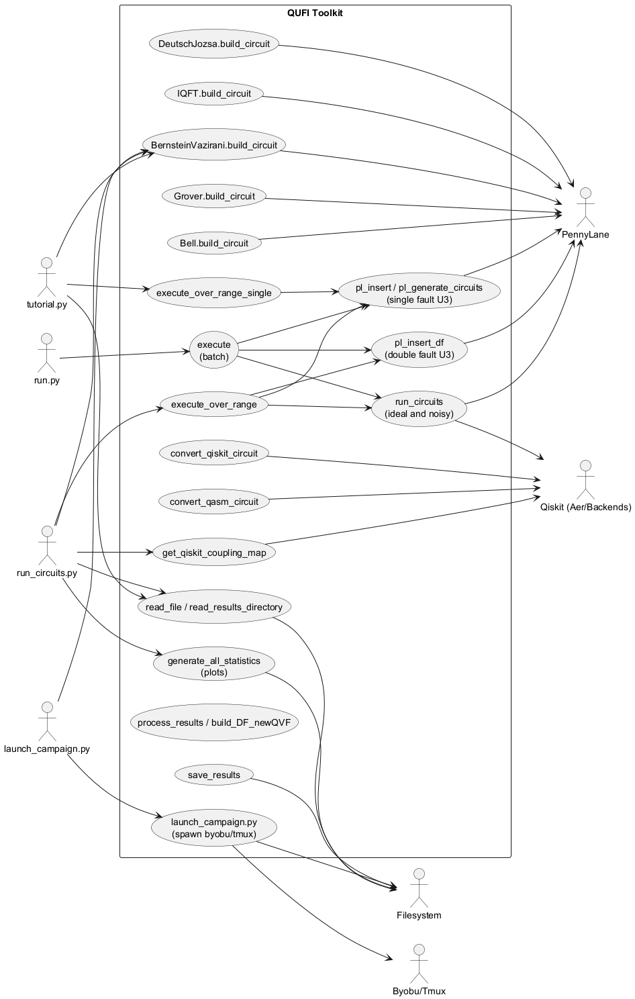
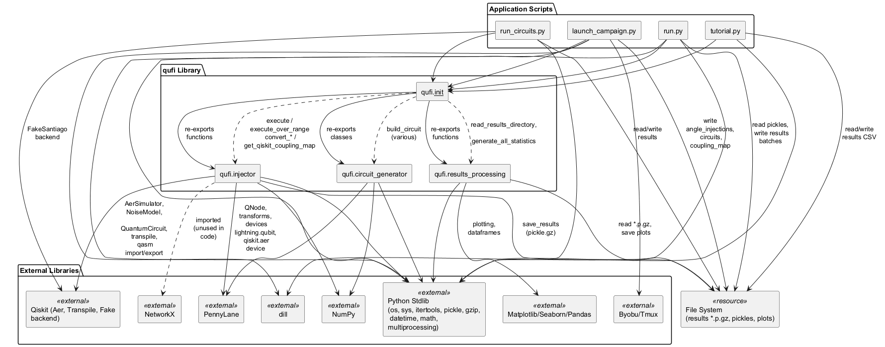
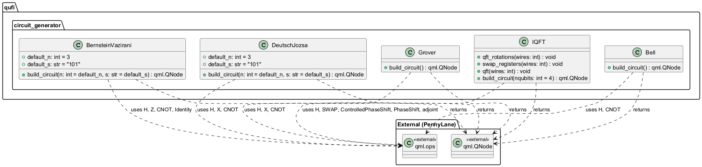
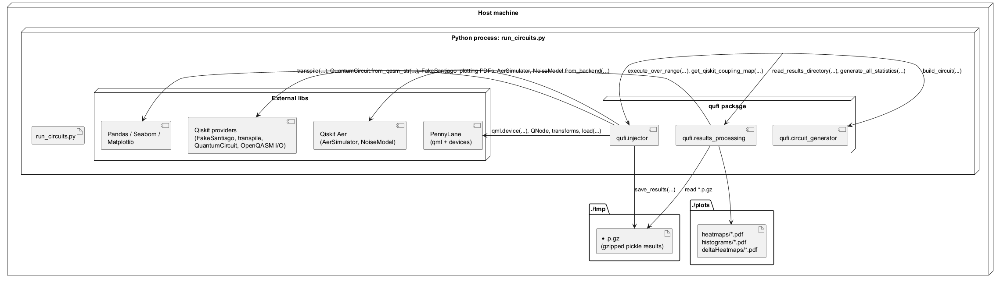
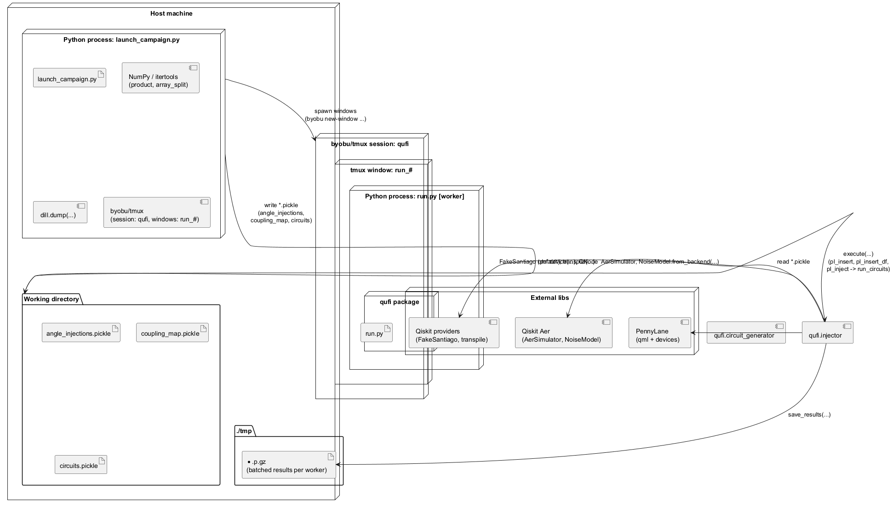

 

% 1 — System Overview
# SECTION 1 — System Overview

This repository implements a quantum fault injection and analysis toolkit built around PennyLane and Qiskit. It provides: i) parametric injection of single- and double-fault quantum gates into circuits; ii) execution on ideal and noise-model-based simulators; iii) conversion utilities between Qiskit/OpenQASM and PennyLane; and iv) post-processing that computes the Quantum Vulnerability Factor (QVF) via Michelson contrast and generates publication-ready visualizations. The codebase includes small, canonical quantum circuits (Bernstein–Vazirani, Deutsch–Jozsa, Grover, IQFT, Bell) for demonstration and benchmarking, plus scripts to run campaigns at scale.

## Purpose and Scope

The primary purpose is to support systematic, reproducible studies of quantum circuit resilience by injecting controlled gate-level faults and measuring the impact on output distributions. The scope spans the full workflow:

- Circuit generation or ingestion (PennyLane, Qiskit, or OpenQASM).
- Fault injection with configurable parameters and topology-aware neighbor selection for double faults.
- Execution on ideal (PennyLane lightning.qubit) and noisy (Qiskit Aer with backend-derived noise) simulators.
- Results capture, aggregation, metric computation (QVF), and plotting (heatmaps and histograms).
- Orchestration at scale, including batch execution across CPU cores and multi-window sessions via tmux/byobu.

This repository documents and exercises the complete system with runnable examples and campaign scripts.

## Key Features (from the codebase)

The implementation exposes the following concrete capabilities:

- Built-in circuit generators: Bernstein–Vazirani, Deutsch–Jozsa, Grover, IQFT (with adjoint), and Bell states, producing ready-to-execute PennyLane QNodes.
- Fault injection transforms: insertion of a parametric U3 gate (id "FAULT") at precise tape positions and, optionally, a second fault on hardware-topology neighbors derived from a coupling map.
- Multi-backend execution:
  - Ideal simulation via PennyLane lightning.qubit.
  - Noisy simulation via Qiskit Aer (aer_simulator) with NoiseModel.from_backend, e.g., FakeSantiago.
- Cross-framework conversion:
  - Qiskit circuit to PennyLane (qml.load).
  - OpenQASM to Qiskit to PennyLane.
- Campaign execution:
  - Grid sweeps over theta/phi for single and double faults, with batching and persistence of results as gzipped pickles.
  - A distributed execution pattern using tmux/byobu windows for parallel processing across CPU cores.
- Results processing and analysis:
  - Conversion of raw outputs to counts (shots fixed at 1024) and computation of QVF using Michelson contrast between the gold bitstring and the next-most-likely outcome.
  - Aggregations by circuit and qubit, including single- vs double-fault comparisons.
  - Automated visualization: heatmaps, delta heatmaps, and histograms saved as PDF.

## Repository Structure and Responsibilities

The repository consists of the following modules and scripts; each entry reflects actual content and responsibilities observed in the source:

| Path | Responsibility |
|------|----------------|
| qufi/__init__.py | Re-exports the public API: all injector and results-processing functions; circuit generator classes (BernsteinVazirani, DeutschJozsa, Grover, IQFT, Bell). |
| qufi/circuit_generator.py | Defines circuit generators returning PennyLane QNodes: BernsteinVazirani.build_circuit, DeutschJozsa.build_circuit, Grover.build_circuit, IQFT.build_circuit (with qft rotations and swaps), Bell.build_circuit. |
| qufi/injector.py | Core injection and execution engine: logging; probability-to-count conversion; coupling map extraction via Qiskit transpile; single/double-fault insertion via qml.qfunc_transform; execution on ideal and noisy backends; conversion utilities (Qiskit/OpenQASM to PennyLane); parameter sweep executors; persistence to .p.gz. |
| qufi/results_processing.py | Post-processing: QVF (Michelson contrast) computation for single/double faults; result reading and aggregation; multiprocessing for IO; heatmaps and histograms via matplotlib/seaborn with LaTeX text rendering; end-to-end statistics generation. |
| launch_campaign.py | Prepares a comprehensive grid of angle injections for double-fault campaigns; serializes angles, circuits, and coupling map with dill; spawns tmux/byobu windows to run workers (run.py) across CPU cores. |
| run_circuits.py | Minimal end-to-end example: builds BV circuit, derives coupling map from a FakeSantiago backend, runs a small range, reads results, and generates all plots. |
| run.py | Worker entrypoint for campaign batches; loads pickled angles/coupling map/circuits and executes the assigned batch via injector.execute. |
| tutorial.py | Tutorial example for single-fault sweeps on BV circuit without noise; writes per-combination CSV results from read_file. |

## Built-in Circuit Generators

The following circuit builders are provided and validated by qml.qnode execution within each builder:

| Class | Method | Description | Wires | Return |
|-------|--------|-------------|-------|--------|
| BernsteinVazirani | build_circuit(n=3, s='101') | Implements BV with n data qubits and one ancilla. Hadamards, oracle via X/CNOTs based on s, final Hadamards; measures probabilities on data qubits. | n+1 | qml.probs over range(n) |
| DeutschJozsa | build_circuit(n=3, s='101') | DJ algorithm with n data qubits and one ancilla in |-⟩; oracle synthesized from s using X and CNOT; measures probabilities on data qubits. | n+1 | qml.probs over range(n) |
| Grover | build_circuit() | Two-qubit Grover-style sequence with Hadamards, X, CNOT, etc.; returns probabilities on both qubits. | 2 | qml.probs over range(2) |
| IQFT | build_circuit(nqubits=4) | Prepares a phase-encoded uniform superposition, applies adjoint(QFT) built from ControlledPhaseShift + SWAP register reordering; returns probabilities on all qubits. | nqubits | qml.probs over range(nqubits) |
| Bell | build_circuit() | Generates a Bell state via H and CNOT; returns probabilities on the second qubit. | 2 | qml.probs over wire 1 |

Supporting IQFT helpers present in the code: IQFT.qft_rotations, IQFT.swap_registers, IQFT.qft.

## Public API Surface (as exposed by qufi)

The package re-exports all of the following (complete listing) for direct import:

- Circuit generators:
  - BernsteinVazirani.build_circuit
  - DeutschJozsa.build_circuit
  - Grover.build_circuit
  - IQFT.build_circuit, IQFT.qft_rotations, IQFT.swap_registers, IQFT.qft
  - Bell.build_circuit

- Injection and execution (from qufi.injector):
  - log
  - probs_to_counts
  - get_qiskit_coupling_map
  - run_circuits
  - convert_qiskit_circuit
  - convert_qasm_circuit
  - pl_insert_gate (qml.qfunc_transform)
  - pl_insert_df_gate (qml.qfunc_transform)
  - pl_generate_circuits
  - pl_insert
  - pl_insert_df
  - pl_inject
  - execute_over_range
  - execute_over_range_single
  - execute
  - save_results

- Results processing and plotting (from qufi.results_processing):
  - compute_QVF_michelson_contrast_single_injection
  - compute_QVF_michelson_contrast_double_injection
  - QVF_michelson_contrast
  - build_DF_newQVF
  - filter_single_fi
  - read_file
  - read_results_directory
  - get_circuits_angles
  - compute_QVF_entry
  - get_processed_table
  - process_results
  - compute_merged_histogram
  - compute_circuit_heatmaps
  - compute_circuit_delta_heatmaps
  - compute_qubit_histograms
  - compute_qubit_heatmaps
  - generate_all_statistics

## Execution Flows Demonstrated by the Scripts

The repository includes runnable flows illustrating real usage:

- tutorial.py executes single-fault sweeps on a BV circuit without noise, persists results via injector.save_results, and writes per-angle CSVs using results_processing.read_file.
- run_circuits.py constructs a BV circuit, derives a realistic coupling map from a Qiskit FakeSantiago backend, runs a small sweep with execute_over_range, reads the generated .p.gz results with read_results_directory, and produces heatmaps/histograms via generate_all_statistics.
- launch_campaign.py prepares a dense grid of angle combinations for double-fault studies, serializes inputs with dill, and spawns multiple tmux/byobu windows that invoke run.py workers across available CPU cores.
- run.py loads the campaign artifacts and runs the specific batch with injector.execute.

## Notable Behaviors and Constraints in the Implementation

The code defines a fixed shot count of 1024 in multiple places and derives integer counts from probabilities using ceiling. When persisting, heavy objects (base_circuit and generated_circuits) are removed to ensure pickle compatibility and a compact footprint. Double-fault neighbor selection uses a coupling map whose topology is a set of sorted physical-qubit pairs; only neighbors satisfying the stored ordering will be considered, reflecting the exact implementation. File logging is disabled by default and console logging is enabled. Results folders are effectively forced to ./tmp/ by the current executors, matching the examples and plot pipelines.

% 2 — Architectural Context
## 2. Architectural Context

This section frames the system’s environment as evidenced by the codebase. It identifies external systems and libraries the software integrates with, the public APIs exposed for interaction, the data sources and artifacts it reads and writes, and the visible actors as represented by scripts or configuration. The aim is to ensure stakeholders understand what the system depends on and how it is intended to be used from the outside.

### External Systems

- PennyLane core and plugins:
  - PennyLane (qml): circuit definition, execution, transforms (@qml.qnode, @qml.qfunc_transform, qml.device, qml.load, qml.adjoint).
  - lightning.qubit device: high-performance simulator backend for exact-state simulation.
  - qiskit.aer device: PennyLane plugin used to execute circuits with Qiskit Aer backends and noise models.

- Qiskit ecosystem:
  - qiskit.circuit.QuantumCircuit: for converting between PennyLane circuits and Qiskit circuits (from OpenQASM and to be loaded into PennyLane).
  - Qiskit Aer:
    - AerSimulator, NoiseModel: to simulate realistic device noise.
  - Backends:
    - FakeSantiago (qiskit.test.mock and qiskit.providers.fake_provider): used as target backend for topology and noise.
  - Transpiler:
    - transpile: to map logical circuits to backend coupling maps and derive layouts.
  - OpenQASM:
    - Conversion via qnode.tape.to_openqasm() and back via QuantumCircuit.from_qasm_str().

- Scientific Python stack:
  - NumPy: numerical operations and angle grids.
  - pandas: tabular processing of results.
  - matplotlib, seaborn: plotting and report generation; LaTeX rendering enabled via rcParams['text.usetex']=True.
  - networkx: imported but unused in current code paths.

- Python runtime and OS:
  - multiprocessing (Pool, ThreadPool, cpu_count): parallel processing of result aggregation and computations.
  - dill: persistence for campaign configuration (angles, circuits, coupling map).
  - pickle + gzip: persistence for execution results.
  - os/system: orchestration via shell commands; external processes launched (byobu/tmux, htop).
  - filesystem: uses ./tmp/ for result artifacts; optional ./qufi.log when file logging is enabled.

- External command-line tools (invoked by scripts):
  - byobu/tmux: session and window orchestration for concurrent runs.
  - htop: launched in a session window for monitoring.

- TeX toolchain (system dependency):
  - LaTeX (via matplotlib usetex=True) for plot text rendering.

### APIs / Interfaces

- Circuit generators (exported via qufi.__init__):
  - qufi.circuit_generator.BernsteinVazirani.build_circuit(n=3, s='101') → qml.QNode.
  - qufi.circuit_generator.DeutschJozsa.build_circuit(n=3, s='101') → qml.QNode.
  - qufi.circuit_generator.Grover.build_circuit() → qml.QNode.
  - qufi.circuit_generator.IQFT.build_circuit(nqubits=4) → qml.QNode.
  - qufi.circuit_generator.Bell.build_circuit() → qml.QNode.

- Injection and execution (exported via qufi.__init__):
  - qufi.injector.get_qiskit_coupling_map(qnode, device_backend) → coupling_map dict with topology and layouts.
  - qufi.injector.execute_over_range(circuits, angles, coupling_map=None, noise=True, results_folder="./tmp/") → list of saved filenames.
  - qufi.injector.execute_over_range_single(circuits, angles, coupling_map=None, noise=True, results_folder="./tmp/") → list of saved filenames.
  - qufi.injector.execute(circuits, angles, coupling_map=None, results_folder="./tmp/") → list of saved filenames.
  - qufi.injector.pl_insert(qnode, name, theta=0, phi=0, lam=0) → dict with generated single-fault circuits and metadata.
  - qufi.injector.pl_insert_df(result_dict, name, theta1, phi1, coupling_map) → dict with generated double-fault circuits and metadata.
  - qufi.injector.pl_inject(result_dict, noise=True) → mutates dict with outputs (gold/injected, with/without noise).
  - qufi.injector.convert_qiskit_circuit((qiskit.QuantumCircuit, name)) → qml.QNode.
  - qufi.injector.convert_qasm_circuit((openqasm_str, name)) → qml.QNode.
  - qufi.injector.save_results(results_list, filename) → persists gzipped pickle.

- Results processing and analytics (exported via qufi.__init__):
  - qufi.results_processing.read_file(filename, single=False) → pandas.DataFrame.
  - qufi.results_processing.read_results_directory(dir) → pandas.DataFrame (parallel read).
  - qufi.results_processing.process_results(results_df) → pandas.DataFrame with QVF aggregates.
  - qufi.results_processing.generate_all_statistics(results_df, savepath="./plots") → writes plots (histograms, heatmaps).
  - Additional public helpers used by analytics:
    - compute_QVF_michelson_contrast_single_injection, compute_QVF_michelson_contrast_double_injection, QVF_michelson_contrast, build_DF_newQVF, filter_single_fi, get_circuits_angles, compute_merged_histogram, compute_circuit_heatmaps, compute_circuit_delta_heatmaps, compute_qubit_histograms, compute_qubit_heatmaps.

- Script-level entry points (usage examples and orchestration):
  - run_circuits.py: builds a circuit, derives coupling map from FakeSantiago, executes ranges, aggregates results, and generates plots.
  - launch_campaign.py: prepares comprehensive angle combinations and coupling map, serializes inputs, and spawns multiple tmux/byobu windows to run batches.
  - run.py: loads serialized batches and executes them based on argv[1] (batch index).
  - tutorial.py: minimal example using execute_over_range_single, reads results, and exports CSVs.

### Data Sources

- Input circuit formats:
  - PennyLane qml.QNode instances.
  - Qiskit QuantumCircuit instances.
  - OpenQASM strings starting with "OPENQASM" (converted through Qiskit to qml.QNode).

- Runtime configuration artifacts (serialized with dill):
  - angle_injections.pickle: list of angle tuples (theta0, phi0, theta1, phi1) for campaigns.
  - circuits.pickle: list of (circuit, name) tuples.
  - coupling_map.pickle: backend-derived or provided coupling map dict (topology, logical2physical, physical2logical).

- Execution results (serialized with pickle+gzip):
  - ./tmp/*.p.gz: lists of dictionaries per angle/circuit containing:
    - parameters (theta0, phi0, theta1, phi1), injection metadata (wires, ops, indexes, second_wires), and outputs (gold/injections, noisy and noiseless when enabled).

- Derived analytics:
  - CSV exports from tutorial.py for selected runs (example_result_(theta, phi).csv).
  - Plots written under:
    - ./plots/histograms/
    - ./plots/heatmaps/
    - ./plots/deltaHeatmaps/

- Optional logs:
  - ./qufi.log when file logging is enabled (file_logging=True); console logging otherwise.

### Users / Actors

- No explicit domain user roles are defined in the code. Interaction is via:
  - Command-line operator providing a batch index to run.py (argv[1]).
  - Script-driven orchestration through launch_campaign.py and run_circuits.py, which invoke byobu/tmux and manage batches.
  - Library consumers within Python using the exported API from qufi (e.g., tutorial.py).

% 2.1 — Architectural Context – Use Case Diagram
## Section 2.1 — Architectural Context – Use Case Diagram

This section provides a complete use case view of the QUFI toolkit as implemented in the provided codebase. It identifies all externally visible behaviors and their interactions with external actors strictly derived from the repository: the QUFI library (qufi package), the accompanying driver scripts (run_circuits.py, launch_campaign.py, run.py, tutorial.py), and external systems (PennyLane, Qiskit backends, filesystem, and terminal multiplexers). The diagram enumerates every use case that is directly backed by concrete functions, classes, and scripts in the source code, without introducing any elements not present in the implementation.

Figure: 2.1 — Architectural Context Use Case Diagram (file: figure-2-1-use-case.puml)

% 3 — Containers
## 3. Containers

This section identifies the runtime containers that constitute the system during execution, covering command-line entrypoints, internal engines, and external systems used in-process. For each container, responsibilities, core technologies, and communication mechanisms are derived strictly from the codebase. This view supports validation by walking through the repository’s modules, their roles, and how data and control flow among them.

| Container | Responsibility | Technology | Communication |
|---|---|---|---|
| tutorial.py (CLI) | Runs a minimal single-fault campaign on Bernstein–Vazirani, saves compressed results, converts them to CSV. | Python 3; qufi.execute_over_range_single; PennyLane; NumPy; itertools. | File I/O to ./tmp/*.p.gz and CSV files; stdout. |
| run_circuits.py (CLI) | End-to-end single-run pipeline: builds circuit, derives coupling map, executes injections with noise, reads results, generates plots. | Python 3; qufi.execute_over_range, qufi.get_qiskit_coupling_map, qufi.read_results_directory, qufi.generate_all_statistics; PennyLane; Qiskit FakeSantiago (qiskit.providers.fake_provider). | File I/O to ./tmp/*.p.gz and ./plots/*.pdf; stdout. |
| launch_campaign.py (CLI orchestrator) | Prepares large-scale angle combinations, persists inputs, and orchestrates parallel workers via tmux/byobu sessions. | Python 3; dill; NumPy; itertools; multiprocessing.cpu_count; OS shell (byobu/tmux). | File I/O to angle_injections.pickle, coupling_map.pickle, circuits.pickle; OS shell commands; stdout. |
| run.py (CLI worker) | Loads campaign inputs, selects its batch by index, runs execute over its subset, persists results. | Python 3; qufi.execute; dill; NumPy; multiprocessing.cpu_count. | File I/O to ./tmp/*.p.gz; stdout; stdin (waits at end via input()). |
| qufi.circuit_generator (library) | Builds PennyLane QNodes for algorithms: BernsteinVazirani, DeutschJozsa, Grover, IQFT, Bell. Encapsulates device selection and measurement. | Python; PennyLane qml; lightning.qubit device; NumPy; math. | In-process API calls; returns callable QNodes; no external I/O. |
| qufi.injector (library) | Fault injection engine: converts circuits (Qiskit/OpenQASM→PennyLane), injects single/double faults via qfunc_transform, executes with/without noise, aggregates counts, saves results. | Python; PennyLane qml (qfunc_transform, devices); Qiskit (QuantumCircuit, AerSimulator, NoiseModel, transpile); OpenQASM; NumPy; gzip/pickle; datetime. | In-process API calls; OpenQASM strings; File I/O to ./tmp/*.p.gz; stdout logging (optional file logging to ./qufi.log). |
| qufi.results_processing (library) | Loads compressed results, computes QVF metrics/tables, and renders histograms/heatmaps/delta heatmaps; parallelized reading and computation. | Python; pandas; matplotlib; seaborn; multiprocessing (Pool, ThreadPool). | File I/O from ./tmp/*.p.gz; writes ./plots/*.pdf; optional CSV export; stdout. |
| PennyLane lightning.qubit device (in-process engine) | Deterministic statevector simulator used for gold and injected circuit evaluation. | PennyLane lightning.qubit backend (invoked via qml.device). | In-process function calls from QNodes; no IPC. |
| Qiskit AerSimulator with NoiseModel (in-process engine) | Noisy simulator used via PennyLane’s qiskit.aer device for evaluating noise-affected outputs. | Qiskit Aer; NoiseModel.from_backend; PennyLane qml.device('qiskit.aer', backend='aer_simulator'). | In-process API calls; no IPC. |
| Qiskit Transpiler + FakeSantiago backend (in-process service) | Derives device-aware coupling map and logical→physical mappings to inform double-fault neighbor selection. | Qiskit transpile; AerSimulator.from_backend; FakeSantiago (qiskit.test.mock or qiskit.providers.fake_provider). | In-process API calls; OpenQASM conversion via qnode.tape.to_openqasm(). |
| Local filesystem (data store) | Persists all intermediate and final artifacts: compressed results, plots, CSVs, logs. | POSIX-like filesystem. | File reads/writes in ./tmp, ./plots, ./; gzip-pickled Python objects, PDFs, CSVs, optional log file. |
| tmux/byobu (OS process manager) | Spawns and supervises multiple worker shells/windows for parallel campaign execution; keeps sessions open on completion. | tmux/byobu (invoked via os.system). | Shell commands; no network I/O. |

Introduction notes for validation:
- All entrypoints (tutorial.py, run_circuits.py, launch_campaign.py, run.py) exist at repository root and are the only executable scripts orchestrating the library.
- All circuit construction occurs in qufi/circuit_generator.py using PennyLane QNodes and the lightning.qubit device; all noise-enabled execution is routed through qufi/injector.py.
- Conversion and mapping rely on OpenQASM strings, Qiskit QuantumCircuit, AerSimulator, NoiseModel, and FakeSantiago, exactly as implemented in qufi/injector.py.
- Persistent artifacts are created exclusively via save_results and plotting routines under ./tmp and ./plots, as reflected in qufi/injector.py and qufi/results_processing.py.
- Parallelism is achieved via tmux/byobu (multi-window processes) and Python multiprocessing/threading pools for result processing; no networked services are used.

% 3.1 — Architecture Overview – Component Diagram
# Section 3.1 — Architecture Overview – Component Diagram

This section provides a concise overview of the system’s main components and their interactions, derived strictly from the provided source code. It focuses on the modular structure of the qufi library, the orchestration scripts, and the integration points with external frameworks (PennyLane, Qiskit) and analytics libraries (Matplotlib, Seaborn, Pandas). The objective is to present a faithful component view that supports validation by the development team and aligns with C4/arc42 viewpoints at the component level.

Figure 3.1 captures the concrete modules and their dependencies, including file-system persistence for results and plots, and system tooling used for campaign execution.

## Figure 3.1 — Component Diagram (PlantUML)

## Component Responsibilities and Interfaces

| Component | Responsibilities | Key provided capabilities (as used) | External dependencies |
|---|---|---|---|
| qufi.__init__ | Public facade aggregating library API | Re-exports: circuit generators (BernsteinVazirani, DeutschJozsa, Grover, IQFT, Bell); injector functions (execute, execute_over_range, execute_over_range_single, pl_insert, pl_insert_df, get_qiskit_coupling_map, convert_*); results processing (read_results_directory, read_file, generate_all_statistics) | — |
| qufi.circuit_generator | Defines quantum circuits as PennyLane QNodes | Build circuits: BernsteinVazirani.build_circuit, DeutschJozsa.build_circuit, Grover.build_circuit, IQFT.build_circuit, Bell.build_circuit | PennyLane, NumPy, math |
| qufi.injector | Fault injection, circuit transformation, execution, persistence | Insertion transforms (pl_insert_gate, pl_insert_df_gate), generators (pl_generate_circuits), injectors (pl_insert, pl_insert_df, pl_inject), runners (run_circuits), converters (convert_qiskit_circuit, convert_qasm_circuit), coupling map extraction (get_qiskit_coupling_map), batch executors (execute_over_range, execute_over_range_single, execute), persistence (save_results) | PennyLane, Qiskit (Aer, transpile, QuantumCircuit, Fake backends), NumPy, stdlib (pickle, gzip, os), Aer noise via qml device, NetworkX import (unused) |
| qufi.results_processing | Metrics, aggregation, and plotting of results | QVF computation, DataFrame assembly (build_DF_newQVF, process_results), directory reading (read_results_directory), plotting heatmaps and histograms, report generation (generate_all_statistics) | Matplotlib, Seaborn, Pandas, multiprocessing, stdlib, filesystem |
| launch_campaign.py | Campaign orchestration across CPU cores and tmux/byobu | Generates angle combinations, prepares coupling map and circuits, serializes with dill, spawns workers via byobu/tmux | dill, byobu/tmux via os.system, CPU topology, filesystem |
| run.py | Worker entrypoint for a batch index | Loads serialized batches, calls qufi.injector.execute, persists results | dill, filesystem |
| run_circuits.py | Single-run workflow with automatic coupling map and statistics | Builds circuit, derives coupling map via Qiskit backend, executes over range, reads results, generates all statistics | Qiskit FakeSantiago, qufi library, filesystem |
| tutorial.py | Minimal walk-through | Executes a small grid without noise, reads and exports CSVs per angle pair | qufi library, filesystem |

This component view matches the repository layout and the runtime interactions observable in the code. It shows how orchestration scripts rely on the qufi facade while the qufi submodules integrate with PennyLane and Qiskit to build, transform, and execute quantum circuits, and how results are persisted and later processed into metrics and plots.

% 4 — Components
## 4. Components

This section enumerates the internal building blocks of the system as implemented in the repository. It focuses on modules, classes, and functions that realize core responsibilities such as quantum circuit generation, fault injection and campaign execution, and results processing and visualization. For each component, we describe its primary responsibility and how it collaborates with other components or external libraries. The content is derived strictly from the source code and is intended to support validation by developers familiar with this codebase.

| Component | Responsibility | Interactions |
|---|---|---|
| qufi.__init__ (API facade) | Exposes the package public API by re-exporting injection utilities, circuit generator classes, and results processing functions. | Imports: qufi.injector.*, qufi.circuit_generator.{BernsteinVazirani, DeutschJozsa, Grover, IQFT, Bell}, qufi.results_processing.* |
| qufi.circuit_generator.BernsteinVazirani.build_circuit | Constructs and returns a PennyLane QNode implementing the Bernstein–Vazirani algorithm for n input bits and secret string s; prepares, queries the oracle via CNOTs, applies Hadamards, returns probabilities over input wires. | Uses: pennylane.qnode, pennylane.device("lightning.qubit"), qml.{Hadamard, PauliZ, Identity, CNOT, probs}; Python slicing/reversal of s |
| qufi.circuit_generator.DeutschJozsa.build_circuit | Builds a PennyLane QNode implementing the Deutsch–Jozsa algorithm; applies H on input, prepares |-⟩ on ancilla, encodes oracle via X around controlled operations, returns probabilities. | Uses: pennylane.qnode, qml.{Hadamard, PauliX, CNOT, probs}, pennylane.device("lightning.qubit") |
| qufi.circuit_generator.Grover.build_circuit | Builds a 2-qubit PennyLane QNode containing a hard-coded sequence of gates resembling Grover’s diffusion and oracle steps; returns probabilities. | Uses: pennylane.qnode, qml.{Hadamard, CNOT, PauliX, probs}, pennylane.device("lightning.qubit") |
| qufi.circuit_generator.IQFT.qft_rotations | Recursively applies Hadamard and controlled phase rotations to implement the rotation stage of QFT over the given number of wires. | Uses: qml.{Hadamard, ControlledPhaseShift}; recursion into IQFT.qft_rotations |
| qufi.circuit_generator.IQFT.swap_registers | Swaps qubits to reverse register order after rotations, finalizing QFT. | Uses: qml.SWAP |
| qufi.circuit_generator.IQFT.qft | Composes the QFT by invoking qft_rotations followed by swap_registers. | Calls: IQFT.qft_rotations, IQFT.swap_registers |
| qufi.circuit_generator.IQFT.build_circuit | Builds a PennyLane QNode that applies parameterized phases then the adjoint of QFT (IQFT); returns probabilities. | Uses: math, numpy.pi, qml.{Hadamard, PhaseShift, adjoint, probs}, pennylane.device("lightning.qubit"); Calls: IQFT.qft |
| qufi.circuit_generator.Bell.build_circuit | Builds a 2-qubit Bell-state PennyLane QNode and returns the probability on a target wire. | Uses: qml.{Hadamard, CNOT, probs}, pennylane.device("lightning.qubit") |
| qufi.injector.log | Writes log messages to console and/or file depending on configuration flags. | Uses: file I/O, print; Globals: file_logging, console_logging, logging_filename |
| qufi.injector.probs_to_counts | Converts a probability vector into bitstring counts (approximate) using fixed shots=1024 and ceiling; filters zero-count outcomes. | Uses: itertools.product, math.ceil |
| qufi.injector.get_qiskit_coupling_map | Derives device coupling and layout mapping by exporting a PennyLane QNode to OpenQASM, importing to Qiskit, transpiling on a backend simulator; returns topology and logical/physical qubit maps. | Uses: qnode.tape.to_openqasm, qiskit.circuit.QuantumCircuit.from_qasm_str, qiskit.providers.aer.AerSimulator.from_backend, qiskit.transpile; Reads: backend.configuration().to_dict()['coupling_map'] |
| qufi.injector.run_circuits | Executes baseline and injected circuits on noiseless (lightning.qubit) and optionally noisy (qiskit.aer) backends, converting output probabilities to counts; aggregates results. | Uses: qml.device, qml.QNode, probs_to_counts, qiskit.providers.aer.NoiseModel.from_backend; Returns: dict with gold and injections (and noise variants if enabled) |
| qufi.injector.convert_qiskit_circuit | Converts a Qiskit circuit to a PennyLane QNode by removing final measurements, loading via qml.load, and wrapping in a device to return probabilities on measured wires. | Uses: qiskit QuantumCircuit API, qml.load, qml.qnode, qml.probs |
| qufi.injector.convert_qasm_circuit | Converts an OpenQASM string (with classical mapping tuple) to a PennyLane QNode by routing through Qiskit then convert_qiskit_circuit. | Uses: qiskit.circuit.QuantumCircuit.from_qasm_str; Calls: convert_qiskit_circuit |
| qufi.injector.pl_insert_gate | qfunc_transform that replays a tape and inserts a U3 gate (tagged id="FAULT") at a specific global operation index and wire. | Uses: qml.qfunc_transform, qml.apply, qml.U3 |
| qufi.injector.pl_insert_df_gate | qfunc_transform that injects a second U3 (id="FAULT") on a target wire after the first fault’s index or at end if not encountered; preserves measurement order. | Uses: qml.qfunc_transform, qml.apply, qml.U3 |
| qufi.injector.pl_generate_circuits | Generates single-fault QNodes by iterating each operation and wire of a base QNode, applying pl_insert_gate, materializing QNodes on lightning.qubit; logs and returns circuits with metadata. | Uses: pl_insert_gate, qml.device, qml.QNode, log; Iterates: base_circuit.tape.operations |
| qufi.injector.pl_insert | Packages base circuit metadata and invokes pl_generate_circuits to produce per-location single-fault circuits; enriches with PennyLane version. | Uses: qml.version, pl_generate_circuits |
| qufi.injector.pl_insert_df | For each single-fault circuit, identifies the injected FAULT gate and generates double-fault circuits on neighboring qubits using the supplied coupling map; realizes second fault with pl_insert_df_gate. | Uses: deepcopy, pl_insert_df_gate, qml.device, qml.QNode, log; Data: coupling_map.{topology, logical2physical, physical2logical}; Tape inspection of gate.id and parameters |
| qufi.injector.pl_inject | Executes the run of gold versus generated circuits and injects outputs into the circuit structure in-place. | Calls: run_circuits |
| qufi.injector.execute_over_range | Orchestrates sweeping over theta0/phi0 (and optionally bounded theta1/phi1) angle grids for one or multiple circuits; converts circuits (QNode, Qiskit, or OpenQASM), performs single and optional double fault injection, executes with optional noise, and persists result files. | Uses: numpy, itertools.product, deepcopy, convert_qiskit_circuit, convert_qasm_circuit, pl_insert, pl_insert_df, pl_inject, save_results, log |
| qufi.injector.execute_over_range_single | Similar to execute_over_range but for single-fault sweeps only; writes one file per (theta0, phi0) pair with rounded names. | Uses: pl_insert, pl_inject, save_results, log |
| qufi.injector.execute | Batch execution for a precomputed angle list; splits into chunks (<=500) to bound per-file size; for each combination performs injection (single or double), executes, and saves batch files. | Uses: numpy.array_split, pl_insert, pl_insert_df, pl_inject, save_results, log |
| qufi.injector.save_results | Normalizes circuit dictionaries for pickling by removing non-serializable entries, ensures destination directory, and writes gzip-pickled results. | Uses: pickle, gzip, os.path.isdir, os.path.dirname, os.mkdir, log |
| qufi.results_processing.compute_QVF_michelson_contrast_single_injection | Aggregates QVF metrics over results for a given circuit and (phi, theta), computing overall circuit QVF and per-qubit QVF means. | Uses: pandas filtering/mean; Data columns: circuit_name, first_phi, first_theta, QVF, first_qubit_injected |
| qufi.results_processing.compute_QVF_michelson_contrast_double_injection | As above for double-injection results filtered by (phi0, theta0, phi1, theta1). | Uses: pandas filtering/mean; Data columns: second_* |
| qufi.results_processing.QVF_michelson_contrast | Computes Michelson-like contrast between gold and next-most-probable bitstring counts and maps it to [0,1]; also returns the next bitstring. | Pure function over dicts; no I/O |
| qufi.results_processing.build_DF_newQVF | Transforms one execution result dict into a row-wise DataFrame of QVF and count percentages for each injected circuit; supports noisy or noiseless inputs and single vs double schema. | Uses: QVF_michelson_contrast, pandas.DataFrame; Reads fields: output_gold_noise/output_injections_noise or output_gold/output_injections; Metadata from injection dict |
| qufi.results_processing.filter_single_fi | Filters a results DataFrame to single-fault injections (second_theta==0 and second_phi==0). | Uses: pandas boolean masking |
| qufi.results_processing.read_file | Loads a gzip-pickled results file and converts its entries to a normalized DataFrame via build_DF_newQVF; concatenates. | Uses: pickle, gzip, pandas.concat |
| qufi.results_processing.read_results_directory | Reads all files under a directory in parallel using a process Pool, returning a concatenated DataFrame. | Uses: os.scandir, multiprocessing.Pool, pandas.concat |
| qufi.results_processing.get_circuits_angles | Extracts distinct, sorted lists of circuits and angle values from a results DataFrame. | Uses: pandas column ops, set/sort |
| qufi.results_processing.compute_QVF_entry | Computes a single QVF aggregation entry (dict) for a (circuit, phi, theta) triple. | Calls: compute_QVF_michelson_contrast_single_injection |
| qufi.results_processing.get_processed_table | Builds a processed QVF table by mapping compute_QVF_entry over all combinations of circuits and angles using a thread pool. | Uses: itertools.product, multiprocessing.pool.ThreadPool |
| qufi.results_processing.process_results | Converts the processed table to a DataFrame and orders columns. | Uses: pandas.DataFrame |
| qufi.results_processing.compute_merged_histogram | Produces and saves overlaid QVF distributions (single vs double) as PDFs; prints mean and std to stdout. | Uses: seaborn.distplot, matplotlib, os.makedirs; DataFrame pivot on first_phi/first_theta |
| qufi.results_processing.compute_circuit_heatmaps | Renders and saves QVF heatmaps over (phi, theta) for single and double injections with TeX-style tick labels. | Uses: seaborn.heatmap, matplotlib, colors.TwoSlopeNorm, os.makedirs |
| qufi.results_processing.compute_circuit_delta_heatmaps | Renders and saves a heatmap of ΔQVF (double − single) with guide lines and annotations. | Uses: seaborn.heatmap, matplotlib annotations, os.makedirs |
| qufi.results_processing.compute_qubit_histograms | For circuit-level and per-qubit QVF columns, renders and saves histograms with mean and stddev embedded in filenames. | Uses: seaborn.distplot, matplotlib, pandas ops |
| qufi.results_processing.compute_qubit_heatmaps | Renders and saves per-qubit QVF heatmaps for single and double injections. | Uses: seaborn.heatmap, matplotlib |
| qufi.results_processing.generate_all_statistics | End-to-end statistics pipeline: builds processed single and double DataFrames, and generates histograms, heatmaps, and delta heatmaps under the specified save path. | Calls: process_results, filter_single_fi, compute_merged_histogram, compute_circuit_heatmaps, compute_circuit_delta_heatmaps, compute_qubit_histograms, compute_qubit_heatmaps |
| launch_campaign.py (script) | Precomputes exhaustive angle combinations for single and bounded double faults, prepares a sample circuit and a coupling map, serializes inputs to pickle files, and launches parallel workers via byobu/tmux to run batches using run.py. | Uses: numpy.{pi, arange, array_split}, itertools.product, multiprocessing.cpu_count, dill.dump, os.system, qufi.circuit_generator.BernsteinVazirani.build_circuit; Writes: angle_injections.pickle, coupling_map.pickle, circuits.pickle; Spawns: run.py |
| run_circuits.py (script) | Example pipeline: builds a BV circuit, derives a device-specific coupling map, runs a minimal execute_over_range sweep, reads all results under ./tmp/, and generates all plots. | Uses: qiskit.providers.fake_provider.FakeSantiago, qufi.{execute_over_range, BernsteinVazirani, get_qiskit_coupling_map, read_results_directory, generate_all_statistics} |
| run.py (script) | Batch worker: loads pickled angle injections, coupling map, and circuits; selects the batch corresponding to argv[1] among CPU splits; runs qufi.execute and prints results count; blocks for input at end. | Uses: sys.argv, dill.load, numpy.array_split, multiprocessing.cpu_count, qufi.execute |
| tutorial.py (script) | Minimal tutorial: executes single-fault sweeps for a BV circuit at two angle values without noise, reads back result files, converts to CSV per angle combination. | Uses: numpy, itertools.product, qufi.{execute_over_range_single, BernsteinVazirani, read_file}; Writes: CSV files per angle pair |

% 5 — Code-Level View
# Section 5 — Code-Level View

This section describes how the implemented architecture maps to concrete source files, classes, and functions. It identifies entry points, module responsibilities, and inter-module dependencies to support validation by developers. The view is derived entirely from the provided codebase and reflects the actual implementation.

## 5.1 Purpose

The purpose of this code-level view is to make explicit the relationship between the conceptual architecture and the concrete code artifacts. It explains where responsibilities reside, how data and control flow across functions and modules, and what the execution entry points are. It also highlights patterns emerging from the structure, enabling reviewers to validate completeness and correctness against the source code.

## 5.2 Repository Layout and Roles

The repository comprises a Python package, qufi, and four top-level orchestration/tutorial scripts. The package itself is split into three cohesive modules:

- qufi.circuit_generator: circuit construction library for specific quantum algorithms (PennyLane QNodes).
- qufi.injector: fault injection, circuit transformation, execution, orchestration, and persistence.
- qufi.results_processing: post-processing, metric computation (QVF), and plotting utilities.

Top-level scripts integrate and drive the package for different use cases:

- launch_campaign.py: prepares a full parameter sweep and spawns parallel workers (tmux/byobu) to execute batches.
- run.py: worker process to execute a batch defined by launch_campaign.py.
- run_circuits.py: single-process run with realistic noise (Qiskit FakeSantiago), followed by analysis and plots.
- tutorial.py: minimal, noise-free walkthrough with CSV export of results.

The package initializer qufi/__init__.py re-exports selected symbols for direct import convenience, composing the public API surface.

## 5.3 Main Entry Points

- launch_campaign.py: Generates the exhaustive list of 4-tuples (theta0, phi0, theta1, phi1), serializes campaign inputs (angle_injections.pickle, coupling_map.pickle, circuits.pickle), and spawns parallel tmux/byobu windows running run.py with a distinct batch index. Intended for large, parallel campaigns.
- run.py: Receives a batch index via argv[1], loads precomputed pickles, selects the batch with numpy.array_split over cpu_count, and calls qufi.execute(circuits, batch, coupling_map=coupling_map). Persists results and waits for input() at the end of the selected batch.
- run_circuits.py: Demonstrates a full pipeline: circuit construction, realistic backend mapping (get_qiskit_coupling_map with FakeSantiago), parameter sweep with qufi.execute_over_range, results aggregation via qufi.read_results_directory, and automated statistics/plots via qufi.generate_all_statistics.
- tutorial.py: Minimal example using qufi.execute_over_range_single with a small angle grid and noise=False; converts each saved pickle into CSV with qufi.read_file(single=True).

These scripts, along with the qufi package API, constitute all executable entry points in the repository.

## 5.4 Public API and Module Mapping

### 5.4.1 Package Exports (qufi/__init__.py)

The module re-exports the following, forming the user-facing API:

- From qufi.circuit_generator: BernsteinVazirani, DeutschJozsa, Grover, IQFT, Bell.
- From qufi.injector: all public symbols (see 5.4.3).
- From qufi.results_processing: all public symbols (see 5.4.4).

This enables from qufi import ... in scripts.

### 5.4.2 Circuit Library (qufi/circuit_generator.py)

This module provides parametrized circuit builders that return PennyLane QNodes. Each builder constructs a device, defines a @qml.qnode(dev) circuit closure, briefly executes it (to materialize the tape), and returns the callable QNode.

Table: Classes and functions

- BernsteinVazirani.build_circuit(n=3, s='101'): Builds an (n+1)-wire lightning.qubit device and a BV algorithm circuit. Applies Hadamards, constructs an oracle based on secret string s (reversed), applies final Hadamards, and returns qml.probs over the first n wires. Returns a QNode. Uses qml.CNOT to encode s; the (n)th wire is the ancilla.
- DeutschJozsa.build_circuit(n=3, s='101'): Builds an (n+1)-wire lightning.qubit device and a DJ circuit. Prepares |-> on ancilla, constructs an oracle from s via Xs and CNOTs, and returns qml.probs over the first n wires. Returns a QNode.
- Grover.build_circuit(): Builds a 2-qubit lightning.qubit device and creates a simple Grover-like sequence of H, X, CNOT gates; returns qml.probs over wires [0,1]. Returns a QNode.
- IQFT.qft_rotations(wires): Recursively applies Hadamard and controlled phase shifts implementing QFT rotations for wires qubits.
- IQFT.swap_registers(wires): Swaps qubits to reverse register order post-rotations.
- IQFT.qft(wires): Composes qft_rotations and swap_registers.
- IQFT.build_circuit(nqubits=4): Builds a lightning.qubit device; initializes phases based on a binary pattern number; applies Hadamards and PhaseShift, then applies adjoint(IQFT.qft)(nqubits). Returns qml.probs over all nqubits. Returns a QNode.
- Bell.build_circuit(): Builds a 2-qubit lightning.qubit device; prepares a Bell state via H and CNOT; returns qml.probs for wire 1. Returns a QNode.

External dependencies: numpy.pi, math, pennylane as qml.

### 5.4.3 Injection, Execution, Orchestration, Persistence (qufi/injector.py)

This is the core engine for transforming circuits, injecting faults, executing them (with/without noise), and persisting results. It also hosts conversion utilities between Qiskit and PennyLane.

Globals

- file_logging: bool (default False), logging_filename: "./qufi.log", console_logging: bool (default True).

Utilities

- log(content): Logs to console and/or file based on globals.
- probs_to_counts(probs, nwires): Converts a probability vector to counts dict over all 2^nwires bitstrings using fixed shots=1024 and ceil. Omits zero-count outcomes.

Qiskit/PennyLane interop and backend mapping

- get_qiskit_coupling_map(qnode, device_backend): Converts a QNode’s tape to OpenQASM, then to a Qiskit QuantumCircuit. Transpiles for AerSimulator.from_backend(device_backend) and returns:
  - topology: set of undirected edges (tuples) from the backend’s coupling_map.
  - logical2physical: mapping of logical (PennyLane) qubit indices to physical backend indices using the transpiler layout’s initial_layout.
  - physical2logical: inverse mapping for qubits.
- convert_qiskit_circuit(qiskit_circuit): Accepts a tuple (QuantumCircuit, nameOrMeta). Computes measure_list from existing measure ops, removes final measurements, loads the circuit into PennyLane via qml.load(format='qiskit'), and returns a QNode that evaluates qml.probs over measure_list.
- convert_qasm_circuit(qasm_circuit): Accepts a tuple (qasm_str, nameOrMeta). Builds a Qiskit QuantumCircuit via from_qasm_str and delegates to convert_qiskit_circuit.

PennyLane transformations (injection primitives)

- pl_insert_gate(tape, index, wire, theta=0, phi=0, lam=0) [@qml.qfunc_transform]: Inserts a U3 gate with id="FAULT" immediately after the gate at the given index, targeting the specified wire. Applies all original operations and measurements; at the insertion index applies original gate then U3.
- pl_insert_df_gate(tape, index, wire, second_theta=0, second_phi=0, lam=0) [@qml.qfunc_transform]: Inserts a second U3 fault on the first gate after index that acts on the given wire; if not found, appends before measurements.

Single-fault circuit generation and packaging

- pl_generate_circuits(base_circuit, name, theta=0, phi=0, lam=0): Iterates base_circuit.tape.operations and their wires; for every (op, wire), produces a transformed circuit via pl_insert_gate. Wraps each into a QNode (lightning.qubit, shots=1024), pre-evaluates to materialize tape, and returns:
  - mycircuits: list of generated QNodes,
  - op_info: corresponding operation names,
  - inj_info: injected wire indices,
  - index_info: indices of operations where the fault was inserted.
- pl_insert(circuit, name, theta=0, phi=0, lam=0): Builds a result struct (dict) with keys:
  - name, base_circuit, theta0, phi0, theta1, phi1, lambda, pennylane_version,
  - generated_circuits, wires, ops, second_wires (initially same as wires), indexes.
  Returns the struct.

Double-fault expansion, execution, and update

- pl_insert_df(r, name, theta1, phi1, coupling_map): For each single-fault QNode in r['generated_circuits'], locates the FAULT gate, maps each logical qubit to physical via coupling_map['logical2physical'], enumerates physical neighbors via coupling_map['topology'], maps back to logical via coupling_map['physical2logical'], and inserts a second FAULT on each valid neighboring logical wire via pl_insert_df_gate. Wraps into QNodes (lightning.qubit, shots=1024), pre-evaluates, updates r['generated_circuits'] to the double-fault list, and appends to r['second_wires'] and r['wires'] (to align with pairings). Also sets r['theta1'] and r['phi1'] on r.
- run_circuits(base_circuit, generated_circuits, device_backend=FakeSantiago(), noise=True): Executes gold (base) and injected circuits. For noise=False:
  - Uses qml.device('lightning.qubit') for both gold and injected circuits; converts prob vectors to counts via probs_to_counts.
  - Returns {'output_gold': counts, 'output_injections': [counts,...]}.
  For noise=True:
  - Additionally evaluates on qml.device('qiskit.aer', backend='aer_simulator', noise_model=NoiseModel.from_backend(device_backend)) for gold and injected circuits.
  - Returns the above plus 'output_gold_noise', 'output_injections_noise', and 'noise_target'.
- pl_inject(circuitStruct, noise=True): Calls run_circuits with circuitStruct['base_circuit'] and circuitStruct['generated_circuits'], updating circuitStruct in-place with the returned outputs.

Batch execution and persistence

- execute_over_range(circuits, angles=..., coupling_map=None, noise=True, results_folder="./tmp/"): For each circuit tuple (circuitOrQiskitOrQASM, name):
  - Normalizes to a QNode (via convert_qiskit_circuit / convert_qasm_circuit if needed).
  - Iterates the product of angles['theta0'] × angles['phi0'].
  - Builds single-fault struct via pl_insert. If coupling_map is provided, iterates theta1/phi1 from 0 up to the current theta0/phi0 (inclusive) stepping by pi/12, generating double faults via pl_insert_df and injecting via pl_inject for each pair, aggregating temporary results into tmp_results and saving once per theta0/phi0 pair. If coupling_map is None, injects the single-fault set and saves immediately.
  - Uses save_results, naming files as f"{results_folder}{name}_{theta0}_{phi0}_0.0_0.0.p.gz" (double-fault batch packs many double-faults per single-fault outer pair).
  - Returns list of saved filenames.
- execute_over_range_single(circuits, angles=..., coupling_map=None, noise=True, results_folder="./tmp/"): Like execute_over_range but only single-fault injection, saving a file per theta0/phi0 as f"{results_folder}{name}_{round(theta0,3)}_{round(phi0,3)}.p.gz".
- execute(circuits, angles, coupling_map=None, results_folder="./tmp/"): For precomputed angle tuples in a potentially large list:
  - Splits angles into batches of up to 500 (numpy.array_split).
  - For each batch: iterates angles_combination tuples; builds single-fault struct via pl_insert and, if coupling_map is provided, expands to double faults via pl_insert_df. Calls pl_inject (noise defaults to True here).
  - Saves the batch with a filename derived from the last processed angles_combination and returns all saved filenames.
- save_results(results, filename='./results.p.gz'): Prepares results for pickling by deleting 'base_circuit' and 'generated_circuits' keys from each dict; ensures directory exists; dumps with pickle over gzip. Logs the path.

External dependencies: numpy, qiskit (providers, transpile, AerSimulator, NoiseModel, QuantumCircuit), pennylane (qml, qfunc_transform, qml.load), dill is not used here, networkx is imported but unused, sys, os, itertools, math, datetime, gzip, pickle.

Notes:
- Shots are fixed to 1024 in probs_to_counts, convert_qiskit_circuit, and QNode wrappers created in injection workflows.
- run_circuits uses qiskit.test.mock.FakeSantiago (older import path), whereas run_circuits.py uses qiskit.providers.fake_provider.FakeSantiago (newer path).

### 5.4.4 Results Processing and Visualization (qufi/results_processing.py)

This module loads saved results (gzip-pickled lists of dicts produced by injector.save_results), computes QVF metrics, aggregates results into pandas.DataFrames, and produces plots via seaborn/matplotlib.

Global rcParams

- figure.autolayout=True, font types set for PDF/PS, and rcParams['text.usetex']=True (requires a LaTeX installation at runtime to render text).

Metric computation

- QVF_michelson_contrast(gold_bitstring, answer, shots): Computes Michelson contrast based QVF given the gold answer and an injected circuit answer; returns (1 - (qvf+1)/2, next_bitstring).
- compute_QVF_michelson_contrast_single_injection(df, circuit_name, phi, theta): Aggregates QVF (mean) for a circuit and angle pair; also provides per-qubit QVF metrics.
- compute_QVF_michelson_contrast_double_injection(df, circuit_name, phi_0, theta_0, phi_1, theta_1): Same as above for double-injection parameters.

Result shaping

- build_DF_newQVF(data, single=False): Converts a single persisted result struct (from injector) into a pandas DataFrame with columns for gold_bitstring, counts, next_bitstring, QVF, injected qubits, thetas/phis, and circuit_name. Handles both noise and noise-free payloads (tries 'output_gold_noise'/'output_injections_noise' first; falls back to 'output_gold'/'output_injections'). Uses shots=1024.
- filter_single_fi(results): Filters a combined DataFrame to only single-fault entries where second_phi==0 and second_theta==0.
- read_file(filename, single=False): Loads a gzip pickle containing a list of result dicts; concatenates build_DF_newQVF(d, single) over all entries.
- read_results_directory(dir): Parallel-loads all files under dir using multiprocessing.Pool and read_file; concatenates into a single DataFrame.

Aggregation and analysis

- get_circuits_angles(results): Returns sorted lists of circuits, thetas, and phis from a results DataFrame.
- compute_QVF_entry((circuit, phi, theta, results)): Helper to compute a dict with QVF aggregates for a specific circuit and angle pair.
- get_processed_table(results): Builds a list of aggregate dicts via ThreadPool over the Cartesian product of circuits × phis × thetas.
- process_results(results): Wraps get_processed_table and returns a DataFrame with sorted columns.

Plotting

- compute_merged_histogram(circs, savepath="./plots/histograms/"): Given [single, double] processed DataFrames, pivots to 2D grids, prints mean/std of all QVF values, and plots combined distributions. Saves PDF under savepath.
- compute_circuit_heatmaps(circs, savepath="./plots/heatmaps/"): Plots heatmaps for single and double QVF grids (phi vs theta) with a diverging palette; saves PDFs distinguished as single_heatmap and double_heatmap.
- compute_circuit_delta_heatmaps(circs, savepath="./plots/deltaHeatmaps/"): Computes ΔQVF (double - single) heatmap; adds annotated guidelines; saves PDF.
- compute_qubit_histograms(circs, savepath="./plots/histograms/"): For each circuit and for circuit-level and per-qubit QVF columns, flattens values and plots distributions; saves PDF files with mean/std annotated in filenames.
- compute_qubit_heatmaps(circs, savepath="./plots/heatmaps/"): Heatmaps at circuit-level and per-qubit for both single and double injections; saves PDFs.
- generate_all_statistics(results, savepath="./plots"): High-level driver: builds [single, double] processed DataFrames and calls all plotting utilities to populate histograms, heatmaps, deltaHeatmaps.

External dependencies: pickle, gzip, os, re, itertools, matplotlib (rcParams, colors), seaborn, pandas, multiprocessing (Pool, cpu_count, ThreadPool), os.scandir.

### 5.4.5 Top-Level Scripts

- launch_campaign.py:
  - Defines a dense angles grid: theta0, phi0 in [0, π] and [0, 2π] at π/12 steps; for each pair, defines theta1, phi1 in [0, theta0] and [0, phi0] at π/12 steps.
  - Builds circuits list with a single entry: (BernsteinVazirani.build_circuit(3,'101'), 'Bernstein-Vazirani_4').
  - Defines a static coupling_map with:
    - topology: {(0,1), (1,2), (2,3), (3,4)},
    - logical2physical: {0:3, 1:4, 3:2, 2:0},
    - physical2logical: {3:0, 4:1, 2:3, 0:2}.
  - Dumps angle_injections.pickle, coupling_map.pickle, circuits.pickle via dill.dump.
  - Spawns a byobu session and tmux windows per CPU core, each running python3 run.py {index}.
- run.py:
  - Loads angle_injections, coupling_map, circuits via dill.load.
  - Splits angle_injections across cpu_count; for the selected group (argv[1]), calls qufi.execute(circuits, batch, coupling_map=coupling_map).
  - Prints batch size and number of result files; blocks on input().
- run_circuits.py:
  - Builds BV circuit as above.
  - angles is a degenerate dict with zeros.
  - device_backend = FakeSantiago() (from qiskit.providers.fake_provider).
  - coupling_map = qufi.get_qiskit_coupling_map(circuits[0][0], device_backend).
  - results_names = qufi.execute_over_range(circuits, angles, coupling_map=coupling_map, results_folder="./tmp/").
  - results = qufi.read_results_directory("./tmp/").
  - qufi.generate_all_statistics(results).
- tutorial.py:
  - Builds BV circuit and a small angle grid: theta0, phi0 in {0, π/4}.
  - results_names = qufi.execute_over_range_single(..., noise=False).
  - Reads each saved file via qufi.read_file(single=True) and writes CSVs named by the angle pairs.

## 5.5 Data and Control Flow (End-to-End)

A typical pipeline proceeds as follows:

1) Circuit construction: A QNode is created via a builder in qufi.circuit_generator (e.g., BernsteinVazirani.build_circuit). The returned object is a PennyLane QNode with its device already bound (lightning.qubit).

2) Backend mapping (optional): A Qiskit device backend (e.g., FakeSantiago) is used to derive a coupling map via qufi.get_qiskit_coupling_map. This maps logical qubits to physical indices and enumerates hardware edges for neighbor selection in double-fault injection.

3) Fault injection and generation:
- Single faults: qufi.pl_insert wraps the base QNode into a result struct and generates a set of single-fault QNodes via qufi.pl_generate_circuits using pl_insert_gate.
- Double faults: For each single-fault QNode, qufi.pl_insert_df augments it with an additional fault on each neighbor wire (per coupling map) via pl_insert_df_gate, producing expanded QNodes.

4) Execution:
- qufi.pl_inject delegates to qufi.run_circuits, which evaluates gold and injected QNodes.
- For noise=True, both noise-free (lightning.qubit) and noisy (qiskit.aer with NoiseModel.from_backend) executions are performed; else only noise-free.

5) Persistence:
- qufi.save_results removes non-pickleable entries (base_circuit, generated_circuits) and writes gzip-compressed pickles; filenames embed angle parameters.

6) Analysis:
- qufi.results_processing.read_results_directory loads persisted results into a DataFrame.
- qufi.results_processing.process_results computes QVF aggregates.
- Plotting utilities generate PDFs for distributions, heatmaps, and deltas via seaborn/matplotlib.

This flow is orchestrated end-to-end by run_circuits.py. The parallel campaign is orchestrated by launch_campaign.py and run.py.

## 5.6 Architectural Organization and Patterns

The code exhibits a clear pipeline orientation with modular separation:

- Circuit construction layer: qufi.circuit_generator encapsulates algorithm-specific circuit building as pure functions returning QNodes.
- Transformation/injection layer: qufi.injector provides explicit transformation primitives (@qml.qfunc_transform) and builders to generate parameterized sets of circuits with injected faults.
- Execution layer: qufi.injector.run_circuits and wrappers execute the generated circuits on ideal and noisy backends.
- Persistence and analysis layer: qufi.injector.save_results persists normalized results; qufi.results_processing reads, aggregates, and visualizes.
- Orchestration layer: top-level scripts produce parameter grids, distribute work, and drive the pipeline.

While no formal framework is enforced, the modules align with a layered, pipeline-style architecture: build → transform → execute → persist → analyze. The separation of concerns is explicit in module boundaries and function naming.

## 5.7 Notable Conventions and Structures

- Shots: Fixed at 1024 across conversion, generation, and post-processing.
- Result struct (produced by qufi.pl_insert / qufi.pl_insert_df and updated by qufi.pl_inject):
  - Keys include name, theta0, phi0, theta1, phi1, wires, second_wires, ops, indexes, and outputs (output_gold, output_injections, and optionally output_gold_noise, output_injections_noise, noise_target).
- Coupling map: A dict with keys 'topology' (set of undirected edges), 'logical2physical', and 'physical2logical'.
- File naming:
  - Single or outer loop: "{circuit_name}_{theta0}_{phi0}_0.0_0.0.p.gz" (execute_over_range).
  - Single (tutorial): "{circuit_name}_{round(theta0,3)}_{round(phi0,3)}.p.gz" (execute_over_range_single).
  - Batch (execute): Name derived from the last angles_combination of each batch.
- Logging: qufi.injector.log controls console/file logging via global flags.
- External backends:
  - PennyLane 'lightning.qubit' used extensively for fast statevector simulation.
  - Qiskit Aer simulator with noise via qml.device('qiskit.aer', backend='aer_simulator', noise_model=...) for noisy runs.
  - Backend mock: FakeSantiago (note the two different import paths across files).

## 5.8 Validation Pointers

- All functions and classes listed above are present in the codebase under the specified modules and filenames. No additional components are implied or assumed.
- Entry points can be validated by running tutorial.py (single-threaded, no LaTeX-dependent plotting) and run_circuits.py (requires Qiskit and LaTeX if plots are generated).
- The result dict schema is observable in injector.pl_insert, injector.pl_insert_df (keys added), injector.pl_inject (keys updated), and consumed by results_processing.build_DF_newQVF.
- The coupling map content and usage are visible in injector.get_qiskit_coupling_map and injector.pl_insert_df.
- The fixed shots value (1024) is consistently enforced in probs_to_counts, convert_qiskit_circuit, and QNode wrappers within injector.

This code-level view fully enumerates all code artifacts, their responsibilities, and their interactions, enabling rigorous cross-checking against the repository.

% 5.1 — Class Diagram
# SECTION 5.1 — Class Diagram

This section documents, without omission or invention, the complete set of classes implemented in the repository. The codebase defines five circuit-construction classes under qufi.circuit_generator, each acting as a factory that returns a PennyLane QNode configured for a specific quantum algorithm. No other user-defined classes exist in the repository. The diagram shows these classes, their operations, and their direct dependency on PennyLane’s QNode and quantum operations used inside the circuit bodies.

Figure 5.1-1 — Class Diagram: Circuit Generators

## Validation Summary

The table below lists every user-defined class found in the repository, their module location, attributes, and public operations exactly as implemented, enabling straightforward validation against the code.

| Class              | Module                   | Attributes                                   | Public Methods (signatures; return)                                                                                 |
|--------------------|--------------------------|----------------------------------------------|----------------------------------------------------------------------------------------------------------------------|
| BernsteinVazirani  | qufi.circuit_generator   | default_n: int = 3; default_s: str = "101"   | build_circuit(n: int = default_n, s: str = default_s) -> qml.QNode                                                  |
| DeutschJozsa       | qufi.circuit_generator   | default_n: int = 3; default_s: str = "101"   | build_circuit(n: int = default_n, s: str = default_s) -> qml.QNode                                                  |
| Grover             | qufi.circuit_generator   | —                                            | build_circuit() -> qml.QNode                                                                                         |
| IQFT               | qufi.circuit_generator   | —                                            | qft_rotations(wires: int) -> None; swap_registers(wires: int) -> None; qft(wires: int) -> None; build_circuit(nqubits: int = 4) -> qml.QNode |
| Bell               | qufi.circuit_generator   | —                                            | build_circuit() -> qml.QNode                                                                                         |

Notes:
- All build_circuit methods create a PennyLane device via qml.device inside the method, define a @qml.qnode(dev)-decorated callable, execute it once for warm-up, and return the callable QNode object.
- The only user-defined classes are those enumerated above; modules qufi.injector and qufi.results_processing contain functions only and therefore are not represented as classes.

% 6 — Cross-Cutting Concerns
## 6. Cross-Cutting Concerns

This section identifies and explains cross-cutting concerns observed directly in the repository code. It focuses on concerns that affect multiple modules or the runtime environment, such as logging, configuration, error handling, serialization, concurrency, monitoring, and security. Each concern is backed by concrete references to code so that the development team can validate the statements against the implementation.

| Concern | Evidence from code | Description |
|---|---|---|
| Logging | qufi/injector.py: log(), file_logging, console_logging, logging_filename; pervasive log(...) calls in execute_over_range, execute_over_range_single, execute, run_circuits; print(...) in results_processing.compute_merged_histogram and scripts | A simple custom logger writes to console (default) and optionally to a file (qufi.log). There is no log level, structured logging, or rotation. Timing and progress messages are emitted during batch execution. Some modules also use print directly, resulting in mixed logging styles. |
| Configuration management | Hard-coded defaults: shots=1024 in multiple functions (probs_to_counts, convert_qiskit_circuit, pl_generate_circuits, pl_insert_df); devices "lightning.qubit" and "qiskit.aer"; default results_folder arguments overwritten to "./tmp/"; rcParams in results_processing set at import time; angles defaults in injector.execute_over_range/_single; run.py consumes argv[1] as index | Configuration is mostly embedded in code via constants and default arguments. The results folder is force-set to "./tmp/". Device selection and shot counts are hard-coded in several places. A single CLI parameter (index) is read without validation. There is no central configuration file or environment-based configuration. |
| Error handling | injector.execute_over_range/_single/execute: type dispatch for circuit, else log(...) and exit(); results_processing.build_DF_newQVF: try/except selects noise vs noiseless outputs; save_results ensures directory exists; minimal exception coverage elsewhere | Error handling is ad hoc. Unsupported circuit types cause an immediate process exit. A broad try/except in results processing selects an alternate code path rather than explicitly checking keys. File and plotting operations generally assume success; failures propagate. |
| Serialization and persistence | injector.save_results uses pickle + gzip; deletes base_circuit and generated_circuits before dumping; results_processing.read_file loads pickle + gzip; launch_campaign dumps angle_injections, coupling_map, circuits via dill; run.py loads with dill | Results are persisted as gzip-compressed Python pickles (.p.gz). For campaign orchestration, dill serializes Python objects. Pickle/dill are unsafe for untrusted inputs. Data layout across files is implicit, relying on code to interpret dict keys. |
| Concurrency and parallel execution | results_processing.read_results_directory uses multiprocessing.Pool(cpu_count()); results_processing.get_processed_table uses ThreadPool(cpu_count()); launch_campaign uses byobu/tmux to spawn multiple shells; run.py partitions work with numpy.array_split over cpu_count | Parallelism is achieved via processes and threads, and by launching multiple terminal sessions. There is no cross-process synchronization beyond unique output filenames derived from angle parameters. Pools are properly closed and joined. Logging from concurrent workers goes to stdout/stderr without coordination. |
| Device/backend abstraction and coupling map | injector.get_qiskit_coupling_map builds logical/physical maps via Qiskit transpile on a given backend; injector.run_circuits optionally runs noisy simulations using qiskit.aer NoiseModel.from_backend; run_circuits.py uses FakeSantiago | The system supports backend-aware layout and noise via Qiskit, while circuits are authored and executed as PennyLane QNodes. Logical-to-physical qubit mapping is extracted from a real or fake backend and used to constrain double-fault injections. |
| Monitoring and runtime observability | injector.execute_over_range/_single/execute log start/end timestamps and elapsed time; no metrics or health endpoints | Monitoring consists solely of timestamped log lines. There is no metrics emission, tracing, or integration with monitoring systems. Progress visibility is log-based. |
| Reproducibility and randomness | shots=1024 everywhere; no explicit seeding for simulators or libraries; noise models derived from device backend; plotting uses randomized backends only indirectly | Runs are not seeded, so stochastic simulators may yield non-reproducible results across executions. Shot count is fixed, but randomness and noise models are not controlled via a seed. |
| Security | Extensive use of pickle and dill for load/save (results_processing.read_file, injector.save_results, launch_campaign, run.py); gzip is compression only; no authentication/authorization; no encryption; shell control via byobu/tmux | There is no authentication or authorization logic. Pickle/dill deserialization is unsafe with untrusted inputs. Files are saved to local disk without encryption. Shell orchestration uses system calls to byobu/tmux and assumes a trusted environment. |
| Plotting and reporting dependencies | results_processing sets rcParams at import time (text.usetex=True); uses matplotlib/seaborn/pandas; writes PDF files; ensures directories exist via os.makedirs | Generating plots requires a LaTeX installation due to text.usetex=True. Output is written under ./plots/*, and directories are created on demand. Plot functions close figures to release resources. |
| Resource management | results_processing: Pool/ThreadPool closed and joined; matplotlib figures closed; gzip/pickle used with context managers; injector.save_results ensures directory exists | Resource handling is mostly correct, avoiding common leaks. However, large concatenations (pd.concat across many files) and high concurrency may increase memory pressure. |
| Portability and environment | launch_campaign uses byobu and tmux; shell commands via os.system; FakeSantiago/qiskit.aer dependencies; Matplotlib with LaTeX; file paths relative | Orchestration assumes a Linux-like environment with byobu/tmux installed. Plotting assumes TeX availability. Relative paths and shell commands reduce portability across platforms. |
| Data model and file layout conventions | Results filenames composed from circuit name and angle tuples in injector.execute_over_range/_single/execute; single vs double injection encoded in filename patterns; read_results_directory scans directory indiscriminately | File naming conventions encode angles and injection modes. There is no manifest; consumers enumerate files by scanning directories. Consistency of naming is essential to avoid collisions and to support post-processing. |
| Backward compatibility of results | injector.pl_insert stores qml.version() in output; results_processing.build_DF_newQVF tolerates presence/absence of noise-specific keys | The stored PennyLane version enables basic traceability across runs. Results processing is defensive about key presence to accommodate both noisy and noiseless outputs. |

% 7 — Quality Attributes and Rationale
## 7. Quality Attributes and Rationale

This section summarizes the quality attributes that are explicitly supported by the implementation. Each attribute is backed by concrete evidence in the codebase and a brief rationale linking the observed structure or patterns to the intended quality outcome. Where relevant, limitations inherent in the current implementation are noted so that stakeholders can validate and prioritize improvements.

| Quality Attribute | Evidence | Rationale |
|---|---|---|
| Performance efficiency | qufi/circuit_generator.py uses fast simulators (qml.device("lightning.qubit")); qufi/injector.py batches large angle sets in execute via numpy.array_split and chunk size ceil(len(angles)/500); qufi/results_processing.py parallelizes I/O and computation with multiprocessing.Pool and ThreadPool; qufi/injector.py:get_qiskit_coupling_map transpiles with optimization_level=3 | The use of PennyLane’s statevector backend and batched execution reduces per-experiment overhead. Chunking prevents excessive memory pressure during massive parameter sweeps. Parallel parsing/aggregation accelerates post-processing. Transpiler optimization minimizes mapped circuit cost before extracting coupling/layout information. |
| Scalability (throughput) | launch_campaign.py distributes work across CPU cores by spawning byobu/tmux windows; run.py selects a batch by CPU index; execute and execute_over_range[(_single)] perform per-batch persistence; results_processing.read_results_directory aggregates results in parallel | Horizontal scaling across CPU cores is implemented both at execution (multiple OS-level windows) and processing (process/thread pools). Persisting batches to separate files enables coarse-grained scaling and recovery. |
| Interoperability (tooling) | qufi/injector.py: convert_qiskit_circuit (qml.load(..., format='qiskit')), convert_qasm_circuit (qasm→Qiskit→PennyLane); get_qiskit_coupling_map derives layouts from Qiskit transpile; run_circuits uses Qiskit Aer noise models via qml.device('qiskit.aer') | The injection pipeline accepts native PennyLane QNodes, Qiskit circuits, and raw OpenQASM strings. Noise modeling is integrated via Qiskit Aer while computation remains in PennyLane, enabling cross-ecosystem experiments without reauthoring circuits. |
| Modularity and maintainability | Clear separation across modules: circuit construction (qufi/circuit_generator.py), injection/execution (qufi/injector.py), analysis/visualization (qufi/results_processing.py), orchestration (run.py, run_circuits.py, launch_campaign.py, tutorial.py); transforms encapsulated via @qml.qfunc_transform (pl_insert_gate, pl_insert_df_gate) | Concerns are separated and reusable. Injection logic is declarative and composable through PennyLane’s qfunc transforms, localizing fault insertion semantics and simplifying evolution of injection strategies. |
| Extensibility | Circuit classes (BernsteinVazirani, DeutschJozsa, Grover, IQFT, Bell) expose build_circuit; execute* functions accept circuits as (object, name) pairs and support multiple input formats; pl_insert/pl_insert_df are parameterized by angles; device selection is pluggable | New circuit families can be added by exposing a build_circuit method. The injection pipeline is independent of circuit specifics and can be extended to new backends and metrics with minimal changes. |
| Testability (deterministic paths) | run_circuits uses a “gold” device qml.device('lightning.qubit') and qml.probs to produce exact probabilities; logging clearly explains each injection and generated circuit; pl_insert tags injected gates with id="FAULT" | Deterministic, analytical probabilities in the ideal path ease regression checks. Explicit FAULT gate tagging allows reliable introspection to locate and reason about injected faults during tests. |
| Reproducibility (limitations noted) | No RNG seeding for noisy execution (qml.device('qiskit.aer', shots=1024)); probabilities to counts use ceil(shots*p) | Ideal runs are reproducible; noisy runs are not explicitly seeded, so results can vary across runs. Count rounding by ceil can inflate totals beyond the configured shots, introducing small discrepancies across repeated analyses. |
| Observability and operability | qufi/injector.py provides log() with timestamps and milestones; execute/execute_over_range log batch and iteration progress; results saved incrementally via save_results; run and launch_campaign print batch diagnostics | Operators can monitor long-running campaigns, correlate batches to output files, and recover from partial runs based on file presence. Simple console logging is on by default; file logging is available via flags. |
| Robustness and reliability | save_results removes non-pickleable keys before persistence; directory creation is ensured; convert_qiskit_circuit removes measurements before qml.load; deepcopy used to avoid “reference bugs” (commented in execute_over_range) | Defensive handling prevents serialization errors and state sharing issues. Conversion steps align circuit structure with PennyLane’s loader expectations, reducing runtime failures. |
| Accuracy and metric definition | results_processing.QVF_michelson_contrast implements Michelson contrast on gold vs. next-most-probable bitstring and maps to [0,1] with perfect=0; FAULT insertion uses qml.U3(theta,phi,delta) at exact index/wire; pl_insert_df respects device coupling via get_qiskit_coupling_map | The metric is explicitly defined and consistently computed. Fault placement is precise and repeatable, with second faults constrained by physical coupling to simulate realistic correlated errors. |
| Portability (limitations) | Visualization sets rcParams['text.usetex']=True; orchestration depends on byobu/tmux; device backends assume Qiskit Aer availability | The toolchain assumes LaTeX for plotting and Linux-specific terminal multiplexers for campaign orchestration. These choices may limit portability to certain environments without additional setup. |
| Security (limitations) | results_processing.read_results_directory unpickles arbitrary files from a directory; run.py and others load pickled artifacts; no validation of file origin | Unpickling arbitrary files is unsafe if directories are not trusted. This is acceptable in controlled research environments but requires explicit trust boundaries or alternative serialization for hardened deployments. |
| Usability | tutorial.py demonstrates minimal execution and CSV export; run_circuits.py shows end-to-end flow; launch_campaign.py automates batch preparation and distribution | Example scripts accelerate onboarding and provide canonical workflows for single and double fault studies, including plotting and statistics generation. |

% 8 — Deployment View
## 8. Deployment View

This section explains how the software elements of the repository execute on physical resources, how results are persisted, and how the orchestration scripts allocate work across local processes. The implementation exclusively targets a single host machine; there is no distributed or cloud deployment path in the code. Quantum execution is simulated locally using PennyLane backends and Qiskit Aer; results are written to the local filesystem and post-processed on the same host.

### Deployment artifacts

- Entry points and orchestration
  - launch_campaign.py: Generates angle_injections.pickle, coupling_map.pickle, circuits.pickle and spawns multiple worker windows using byobu/tmux to run run.py concurrently across CPU cores.
  - run.py: Worker entry point. Loads the pickled work units and executes execute(...) for its assigned batch. Writes compressed results under ./tmp/. Blocks at the end with input() to keep the byobu/tmux window open.
  - run_circuits.py: Self-contained demo pipeline. Builds a Bernstein–Vazirani circuit, derives a coupling map from a FakeSantiago backend, runs execute_over_range(...), aggregates results from ./tmp/, and generates plots under ./plots/.
  - tutorial.py: Minimal single-injection example. Runs execute_over_range_single(...), reads back result files, and writes CSVs for each angle combination.

- Library modules
  - qufi/circuit_generator.py: Circuit factories returning compiled PennyLane QNodes for Bernstein–Vazirani, Deutsch–Jozsa, Grover, IQFT, and Bell circuits (lightning.qubit device).
  - qufi/injector.py: Core injection and execution pipeline. Generates single and double “fault” variants via PennyLane qfunc transforms, maps to Qiskit for topology-aware double faults, executes circuits on lightning.qubit and qiskit.aer devices, and persists results as gzip-compressed pickle files under ./tmp/.
  - qufi/results_processing.py: Loads result files, computes QVF metrics, and generates heatmaps and histograms under ./plots/ (requires a LaTeX installation because rcParams['text.usetex']=True).

- Output locations and files
  - Results: ./tmp/*.p.gz (gzip-compressed pickle files containing per-injection results; base_circuit and generated_circuits removed before serialization).
  - Plots: ./plots/heatmaps/*.pdf, ./plots/deltaHeatmaps/*.pdf, ./plots/histograms/*.pdf.
  - CSVs (tutorial): example_result_(theta, phi).csv in repository root.
  - Orchestration inputs: angle_injections.pickle, coupling_map.pickle, circuits.pickle in repository root.
  - Optional log file: ./qufi.log (disabled by default; console logging is enabled).

- Noteworthy defaults and hard-coded paths
  - Results folder parameters passed into execute_over_range(...), execute_over_range_single(...), and execute(...) are internally overridden to "./tmp/".
  - Fixed simulation shots = 1024 in injector.probs_to_counts and device creation.

### Execution environment

- Host characteristics
  - Single machine deployment; concurrency via Python multiprocessing and byobu/tmux window-level parallelism.
  - CPU-bound execution; no GPU backends are used in the code.

- Runtime dependencies (as used in code)
  - Python with: numpy, pennylane, qiskit, qiskit-aer, matplotlib, pandas, seaborn, dill, networkx (imported), gzip/pickle, multiprocessing.
  - Terminal tools: byobu/tmux (used by launch_campaign.py to create concurrent sessions) and htop (opened in a dedicated window for monitoring).
  - Plotting requires a LaTeX installation (rcParams['text.usetex'] = True); without LaTeX, plot generation will fail.
  - Qiskit fake backend: FakeSantiago. Note that the code imports it from two locations:
    - qufi/injector.py: from qiskit.test.mock import FakeSantiago
    - run_circuits.py: from qiskit.providers.fake_provider import FakeSantiago
    Ensure the installed Qiskit version provides one of these import paths or adjust imports accordingly.

- Quantum simulation backends
  - PennyLane lightning.qubit: Deterministic statevector simulator for “gold” and injected runs.
  - PennyLane qiskit.aer: Noise-enabled simulator used when noise=True; backed by Qiskit Aer with NoiseModel.from_backend(FakeSantiago()).
  - Qiskit transpiler/AerSimulator: Used to derive coupling maps and layouts from FakeSantiago for topology-aware double-fault injection (no remote IBMQ access).

- Filesystem and permissions
  - The process must be able to create and write to ./tmp/ and ./plots/ subdirectories and write pickles/CSVs in the repository root.
  - Console logging is on by default; file logging is off unless toggled in qufi/injector.py.

### Dependencies between nodes

- Logical nodes on a single host
  - Orchestrator (launch_campaign.py)
    - Produces angle_injections.pickle, coupling_map.pickle, circuits.pickle.
    - Spawns N = cpu_count() byobu/tmux windows, each running run.py with a distinct batch index.
  - Workers (run.py per window)
    - Each worker loads the same three pickles and processes only its allocated batch from angle_injections via numpy.array_split.
    - Calls qufi.injector.execute(...), which builds injection variants, executes them on local PennyLane devices (with or without Aer noise), and writes results to ./tmp/*.p.gz.
  - Standalone pipeline (run_circuits.py)
    - Independently builds a circuit, derives a coupling map, calls execute_over_range(...), then qufi.results_processing.read_results_directory("./tmp/") and generate_all_statistics(...). No interaction with the orchestrator/worker flow is required.
  - Tutorial pipeline (tutorial.py)
    - Independently runs execute_over_range_single(...), then converts individual result files to CSVs.

- Data flow and coupling
  - Orchestrator-to-Workers: angle_injections.pickle (list of angle tuples), coupling_map.pickle (topology, logical↔physical mappings), circuits.pickle (list of (QNode, name) pairs).
  - Workers-to-Filesystem: Gzip-pickled result batches saved under ./tmp/ with filenames encoding angle parameters; base_circuit and generated_circuits are removed from the serialized objects to keep files compact.
  - Aggregation and Visualization: results_processing reads all files from ./tmp/, computes QVF metrics, and writes plots under ./plots/. LaTeX is required at this stage.
  - No network or inter-process messaging is used; all coordination happens via the local filesystem and byobu/tmux session management.

% 8.1 — Deployment Diagram
# Section 8.1 — Deployment Diagram

This section describes how the QUFI tooling (quantum fault injection and analysis) is deployed and executed on a single host, directly reflecting the repository’s runtime topology and the concrete interactions among processes, libraries, and filesystem artifacts. The deployment view is based solely on the source code provided and covers both execution modes present in the codebase: (a) single-host batch execution via run_circuits.py, and (b) a parallel campaign orchestrated by launch_campaign.py and run.py using byobu/tmux. The diagrams show processes, key third-party libraries (PennyLane, Qiskit Aer, FakeSantiago), and the data flows to and from the filesystem (temporary result files and generated plots).

## 8.1.1 Deployment Context Summary

The table below summarizes the deployed nodes, processes, libraries, and data artifacts that are directly evidenced in the code.

| Element | Type | Source Evidence | Purpose |
|---|---|---|---|
| Host machine | Node | All files | Single machine executing Python processes; no remote or cloud components are used. |
| Python process: run_circuits.py | Process | run_circuits.py | Orchestrates a single-host, small run: builds circuits, injects faults, executes simulations, reads results, and generates plots. |
| Python process: launch_campaign.py | Process | launch_campaign.py | Prepares angle injections and coupling map; creates pickles; spawns parallel workers with byobu/tmux. |
| Python processes: run.py (N workers) | Process | run.py | Load precomputed pickles and execute large-scale injections via execute(...), writing batched results. |
| qufi.circuit_generator | Library/module | qufi/circuit_generator.py | Defines circuit builders (BernsteinVazirani, DeutschJozsa, Grover, IQFT, Bell). |
| qufi.injector | Library/module | qufi/injector.py | Fault injection pipeline (single and double fault), conversion, execution, saving results. |
| qufi.results_processing | Library/module | qufi/results_processing.py | Reads saved results, computes QVF metrics, and generates plots (PDF). |
| PennyLane (qml) | External library | Imports in multiple files | Device provisioning (lightning.qubit, qiskit.aer), QNode execution, qfunc transforms, QASM loading. |
| Qiskit Aer / providers | External library | qufi/injector.py, run_circuits.py | AerSimulator, NoiseModel, transpile, FakeSantiago backend, QASM import/export. |
| Matplotlib, Seaborn, Pandas | External library | qufi/results_processing.py | Plotting heatmaps and histograms, dataframe processing. |
| Multiprocessing / ThreadPool | Runtime feature | qufi/results_processing.py, run.py | Parallel file reading and parallel campaign execution. |
| byobu/tmux | System tool | launch_campaign.py | Creates a session with multiple windows for parallel workers. |
| Filesystem: ./tmp/ | Folder | qufi/injector.save_results, usage across repo | Stores gzipped pickle result batches (*.p.gz). |
| Filesystem: ./plots/ | Folder | qufi/results_processing.py | Stores generated PDFs (heatmaps, histograms, delta heatmaps). |
| angle_injections.pickle, coupling_map.pickle, circuits.pickle | Files | launch_campaign.py, run.py | Campaign metadata exchanged between orchestrator and workers. |

## 8.1.2 Deployment — Single-host batch execution (run_circuits.py)

Figure 8.1-a shows the single-host execution driven by run_circuits.py. It builds a Bernstein–Vazirani circuit, derives a coupling map from a FakeSantiago backend, runs fault injections over a small angle set, saves results to ./tmp/, and then reads and processes them into plots under ./plots/.

Figure: Fig-8.1a-Deployment-Single-Host.puml

## 8.1.3 Deployment — Parallel campaign (launch_campaign.py + run.py with byobu/tmux)

Figure 8.1-b shows the large-scale parallel campaign. launch_campaign.py computes the angle grid and coupling map, serializes metadata via dill into local pickles, and spawns multiple run.py workers in a byobu/tmux session. Each worker loads the pickles, executes execute(...), which internally performs single or double fault injections with noise enabled by default, saving batched results to ./tmp/. Plot generation is not performed by run.py; analysis is a separate step.

Figure: Fig-8.1b-Deployment-Campaign.puml

## 8.1.4 Validation Notes

The diagrams map one-to-one to the concrete code paths and artifacts:

- Circuit creation is performed by qufi.circuit_generator.*.build_circuit, as invoked in run_circuits.py, tutorial.py, and launch_campaign.py.
- Fault injection and execution are handled by qufi.injector: pl_insert, pl_insert_df, pl_inject, run_circuits, save_results, convert_* utilities, and get_qiskit_coupling_map. Noise injection uses NoiseModel.from_backend(FakeSantiago) and qiskit.aer devices when noise=True.
- Result processing and plotting are implemented in qufi.results_processing.*, producing PDFs into ./plots/ and reading gzipped pickles from ./tmp/.
- Parallel campaign orchestration uses dill to serialize angle_injections, coupling_map, and circuits; then byobu/tmux to spawn multiple run.py workers, each executing execute(...) over its batch.

No external services, remote clusters, or GPUs are involved; all execution occurs in local Python processes with local filesystem persistence, exactly as expressed in the source code.

 