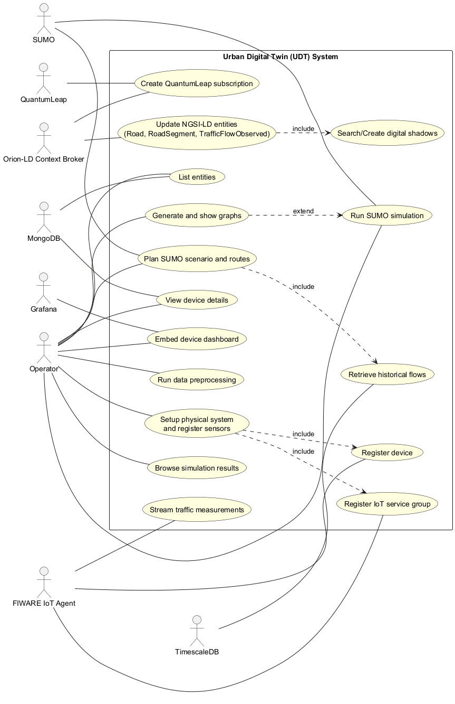
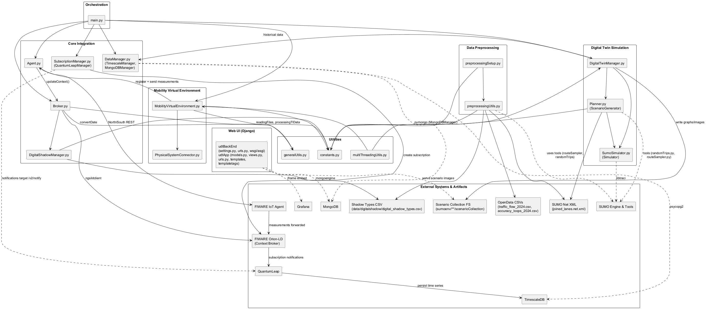
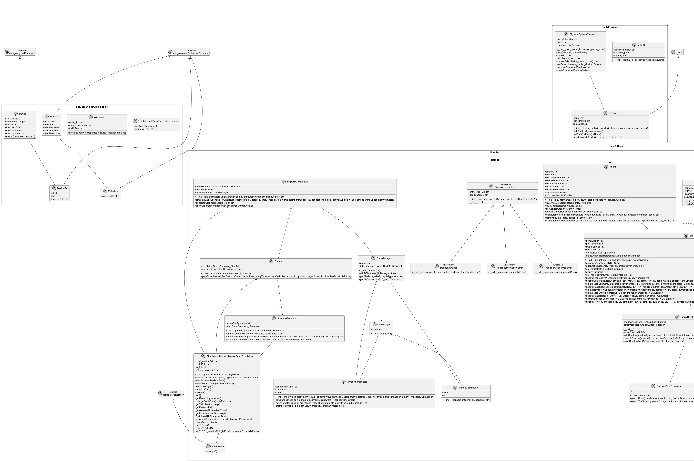
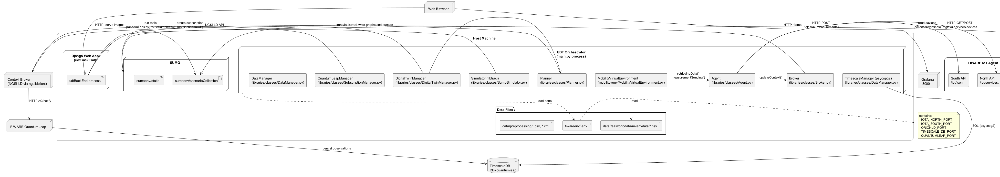

 

% 1 — System Overview
# SECTION 1 — System Overview

This section introduces the Urban Digital Twin (UDT) software system as implemented in the provided repository. It summarizes the purpose, scope, and key features strictly derived from the codebase, allowing stakeholders to understand what the system does, what subsystems it includes, and how they fit together.

Required artefacts (JSON):
{}

## Purpose and Main Functionalities

The system implements an end-to-end Urban Digital Twin for road traffic. Its core purpose is to acquire real traffic flow data from loop sensors, register and manage these data as NGSI-LD entities in a FIWARE context broker, persist time-series in a time-series database, and run microscopic traffic simulations in SUMO using scenarios derived from the observed data. A Django-based web backend supports browsing entities and visualizing simulation outputs and dashboards.

From the code, the principal functionalities are:

1. Data preprocessing for Digital Shadow generation and simulation inputs. The repository provides utilities to clean, filter, and enrich open traffic datasets, map road names and geolocations to SUMO edges, and produce artifacts needed by both the Digital Shadow Manager and SUMO scenario generation.

2. Device and measurement lifecycle with FIWARE IoT Agent and Orion-LD. The Agent component registers service groups and devices, sends telemetry (trafficFlow, location, timeslot, dateObserved, laneDirection) to the IoT Agent southbound, and triggers context updates on Orion-LD.

3. Context entity creation and updates using smart data models. The Broker creates and updates NGSI-LD entities of types Road, RoadSegment, and TrafficFlowObserved, with proper relationships (HAS_PART, IS_CONTAINED_IN, OBSERVED_BY) and attributes (trafficFlow, DateTime, timeslot). It relies on a Digital Shadow to resolve the correct road, segment, and edgeId for each measurement.

4. Digital Shadow management. The DigitalShadowManager loads a curated CSV (generated by preprocessing) that links traffic loop sensors, geolocation, and directions to SUMO edges and road metadata. It creates and caches Shadows at runtime to support consistent mapping during context updates.

5. Physical system emulation and data injection. The MobilityVirtualEnvironment loads real-world traffic flow datasets, instantiates roads and loop sensors, registers devices and measurements via the Agent, and replays timeslot-based flows into the platform.

6. Subscriptions to time-series backend (QuantumLeap). The QuantumLeapManager creates Orion-LD subscriptions for trafficFlow updates on Device, RoadSegment, and TrafficFlowObserved, pointing notifications to QuantumLeap’s /v2/notify endpoint.

7. Scenario planning and SUMO simulation. The DigitalTwinManager, Planner, and Simulator transform historical data (queried from TimescaleDB via TimescaleManager) into SUMO inputs: edge-based demand files and route files generated with SUMO tools (randomTrips.py, routeSampler.py), then execute simulations and render plots via SUMO visualization scripts.

8. Web backend for monitoring and simulation artifact browsing. The udtBackEnd Django app connects to MongoDB (MongoEngine) to list NGSI-LD entities (as persisted by Orion) and display details. It embeds Grafana dashboards via iframes and provides a gallery to browse simulation results and graphs generated by SUMO runs.

The main entry point (main.py) wires these pieces together: it loads container port configuration, instantiates Agent and Broker, configures subscriptions, initializes the physical system and data flow, connects to TimescaleDB, and runs a sample simulation and graph generation cycle.

## High-Level Scope

The repository constitutes a full system, covering data ingestion, context management, time-series subscriptions, simulation, and user-facing visualization:

- Data acquisition and mapping: preprocessing utilities and Digital Shadow data management.
- IoT and context layer: IoT Agent integration, Orion-LD entity lifecycle, and QuantumLeap subscriptions.
- Time-series and analytics: QuantumLeap persistence into TimescaleDB and subsequent historical queries.
- Simulation: SUMO scenario generation, execution, and visualization tied to observed traffic flow.
- Web interface: Django app for entity browsing, monitoring (via Grafana), and simulation result browsing.

External systems are assumed to be running locally based on the code: Orion-LD (ngsildclient), IoT Agent (north/south ports), QuantumLeap, TimescaleDB (psycopg2), MongoDB (mongoengine), SUMO/libtraci, and Grafana.

## Key Features Observable from the Codebase

The following table summarizes the principal modules and their responsibilities as implemented:

| Module/Path | Responsibility | Notable Interactions |
|---|---|---|
| data/preprocessing/preprocessingSetup.py | Orchestrates preprocessing pipeline over open traffic datasets. | Calls preprocessingUtils steps; writes CSV/XML artifacts for shadows and SUMO. |
| libraries/classes/Agent.py | Registers service groups and devices with FIWARE IoT Agent; sends telemetry; triggers context updates. | HTTP to IoT Agent north/south; uses Broker for Orion-LD updates. |
| libraries/classes/Broker.py | Manages Orion-LD entities (Road, RoadSegment, TrafficFlowObserved) and relationships; updates trafficFlow per timeslot. | ngsildclient to Orion-LD; relies on DigitalShadowManager; uses smart data model context/URIs. |
| libraries/classes/DigitalShadowManager.py | Loads road/loop mapping CSV; creates and caches Shadow objects for roads and traffic loops; persists to CSV. | Uses SHADOW_TYPE_FILE_PATH; supports Broker mapping operations at runtime. |
| libraries/classes/DataManager.py | Aggregates DB managers; TimescaleManager queries historical trafficFlow; MongoDBManager wraps Mongo client. | TimescaleDB via psycopg2; Mongo via pymongo; used by DigitalTwinManager. |
| libraries/classes/Planner.py | Builds SUMO edge data XML from historical data; generates routes with SUMO tools; configures simulator and runs. | SUMO tools (randomTrips.py, routeSampler.py); Simulator; constants paths. |
| libraries/classes/SumoSimulator.py | Controls SUMO/libtraci execution; steps simulation; gathers summaries; reacts to subscriptions (placeholder). | libtraci; traci.constants; environment variables for paths. |
| libraries/classes/SubscriptionManager.py | Creates Orion-LD subscriptions to QuantumLeap for trafficFlow attribute across types. | ngsildclient subscriptions.create; QuantumLeap /v2/notify endpoint. |
| libraries/utils/preprocessingUtils.py | Full suite for CSV filtering, accuracy filtering, road-to-edge mapping (sumolib), shadow CSV generation, and SUMO edgedata XML creation. | sumolib, pandas, XML generation; writes detectors.add.xml and edge data XML. |
| mobilityvenv/MobilityVirtualEnvironment.py | Builds a “physical system” view of roads and loop sensors; registers devices; replays traffic flows per timeslot. | Uses Agent for registration/sending; reads real_traffic_flow.csv; PhysicalSystemConnector. |
| mobilityvenv/PhysicalSystemConnector.py | Device and Sensor abstractions with callback-based data sending; road-level connector. | Invokes Agent.retrievingData callback; persists registered devices to CSV. |
| udtBackEnd (Django) | Web UI: entity list/detail from MongoDB; Grafana iframe embed; simulation folder and images browsing. | MongoEngine to DB ‘orion-openiot’; filesystem access to scenarioCollection; Grafana via iframe. |
| main.py | Orchestrates system startup: env loading, Agent/Broker/QL setup, physical data replay, DB wiring, simulation, and graphs. | All major subsystems end-to-end on localhost. |

Together, these components implement a coherent flow: preprocess data to enable precise mapping, register and ingest sensor measurements, maintain an NGSI-LD digital representation, subscribe and persist time-series, and finally plan and execute simulations to analyze mobility scenarios. The Django backend and Grafana provide user-facing access to entities and simulation outputs.

% 2 — Architectural Context
## 2. Architectural Context

This section positions the system within its operational environment, enumerating the external systems, APIs/interfaces, and data sources explicitly referenced by the codebase. It also identifies the actors that interact with or within the system. All items below are derived directly from the provided source code and configuration paths; no speculative elements are included.

### External Systems

- FIWARE Orion-LD Context Broker
  - Accessed via ngsildclient.Client using hostname and port from environment (ORIONLD_PORT).
  - Container alias “orion” is used in IoT Agent service registration payloads.
- FIWARE IoT Agent (North and South bindings)
  - Northbound API used for service group and device registration (port from IOTA_NORTH_PORT).
  - Southbound HTTP ingestion endpoint used for measurements (port from IOTA_SOUTH_PORT).
- FIWARE QuantumLeap
  - Target for NGSI-LD subscriptions (notification URL http://{containerName}:{quantumleapPort}/v2/notify).
  - Container name used: fiware-quantumleap.
- TimescaleDB (PostgreSQL)
  - Queried directly via psycopg2 under database “quantumleap” (host, port from TIMESCALE_DB_PORT; schema “mtopeniot”).
- MongoDB
  - MongoEngine connection to database “orion-openiot” (localhost:27017) for UI entity listing (collection “entities”).
- SUMO (Simulation of Urban MObility)
  - SUMO engine executed via libtraci and external tools (randomTrips.py, routeSampler.py, visualization/plotXMLAttributes.py).
  - SUMO network and additional files consumed from sumoenv/static.
- Grafana
  - Embedded dashboards via iframe (http://localhost:3000), parameterized by entity/edge IDs.
- File system
  - Used as an interface for CSV and XML artifacts (inputs, preprocessed datasets, SUMO edge/additional files, scenario outputs).

### APIs / Interfaces

- IoT Agent Northbound HTTP API (Agent.py)
  - GET http://{host}:{IOTA_NORTH_PORT}/iot/services (check service group, retrieve API key).
  - POST http://{host}:{IOTA_NORTH_PORT}/iot/services (service group registration; cbroker set to http://orion:{ORIONLD_PORT}).
  - GET http://{host}:{IOTA_NORTH_PORT}/iot/devices/{device_id} (device existence).
  - POST http://{host}:{IOTA_NORTH_PORT}/iot/devices (device registration; attributes: trafficFlow, location, laneDirection, timeSlot, dateObserved).
  - Required headers: fiware-service, fiware-servicepath; Content-Type where applicable.
- IoT Agent Southbound HTTP ingestion (Agent.py)
  - POST http://{host}:{IOTA_SOUTH_PORT}/iot/json?k={device_key}&i={device_id}
  - Payload includes trafficFlow, location GeoJSON Point, timeSlot, laneDirection, dateObserved.
  - On success triggers Context Broker update via Broker.updateContext.
- Orion-LD via ngsildclient (Broker.py, SubscriptionManager.py)
  - Entity lifecycle: create/update/get/query_generator on types:
    - Road (https://smartdatamodels.org/dataModel.Transportation/Road)
    - RoadSegment (https://smartdatamodels.org/dataModel.Transportation/RoadSegment)
    - TrafficFlowObserved (https://smartdatamodels.org/dataModel.Transportation/TrafficFlowObserved)
  - Attribute relations (Rel.*), temporal props (tprop DateTime), and property updates (trafficFlow, timeslot).
  - Subscriptions: built with SubscriptionBuilder; target QuantumLeap /v2/notify; watched attribute “trafficFlow”.
- QuantumLeap subscription endpoint
  - Notification URL format: http://fiware-quantumleap:{QUANTUMLEAP_PORT}/v2/notify.
- TimescaleDB SQL (DataManager.TimescaleManager)
  - Queries on schema “mtopeniot”:
    - etdevice (Device time series)
    - ethttps://smartdatamodels.org/datamodel.transportation/roadsegm (RoadSegment series)
    - ethttps://smartdatamodels.org/datamodel.transportation/trafficf (TrafficFlowObserved series)
  - Parameters: timeslot, date, and timecolumn (e.g., “timeslot”, “datetime”).
- SUMO/TraCI (SumoSimulator, Planner, DigitalTwinManager)
  - libtraci control loop (start/resume/step/end), subscriptions to induction loops, TLS programs manipulation.
  - SUMO tools:
    - randomTrips.py
    - routeSampler.py
    - visualization/plotXMLAttributes.py
  - Scenario generation with XML edge data, routes, and outputs (fcd.xml, summary.xml, tripinfos.xml).
- Django Web UI (udtBackEnd)
  - Root redirect to /udtApp/index.
  - Exposed routes:
    - /udtApp/index
    - /udtApp/monitor (Grafana iframe)
    - /udtApp/entityList and /udtApp/entityList/<entity_id> (MongoDB-backed listing/details)
    - /udtApp/simulation (filters by date/time/type; enumerates scenario folders)
    - /udtApp/simulation/<folder>/ (serves scenario images)
  - Static file serving for /scenarioCollection/ mapped to sumoenv/joined/scenarioCollection when DEBUG=True.
- Environment configuration (generalUtils.loadEnvVar, constants.py)
  - File: fiwareenv/.env
  - Ports/vars consumed: IOTA_NORTH_PORT, IOTA_SOUTH_PORT, ORIONLD_PORT, TIMESCALE_DB_PORT, QUANTUMLEAP_PORT.
- File-based interfaces (preprocessingUtils.py, DigitalShadowManager.py)
  - CSV and XML artifacts read/written for preprocessing, shadow data, SUMO edge/additional files, and scenario outputs.

### Data Sources

- Open data CSVs
  - data/realworlddata/opendata/traffic_flow_2024.csv (TRAFFIC_FLOW_OPENDATA_FILE_PATH)
  - data/realworlddata/opendata/accuracy_loops_2024.csv (ACCURACY_TRAFFIC_LOOP_OPENDATA_FILE_PATH)
- Preprocessed and generated datasets (CSV/XML)
  - data/preprocessing/accurate_traffic_flow.csv (TRAFFIC_FLOW_ACCURATE_FILE_PATH)
  - data/preprocessing/processed_traffic_flow.csv (PROCESSED_TRAFFIC_FLOW_EDGE_FILE_PATH)
  - data/preprocessing/road_names.csv (ROAD_NAMES_FILE_PATH)
  - data/preprocessing/edgedata.xml (EDGE_DATA_FILE_PATH)
  - data/preprocessing/daily_flow.csv (DAILY_TRAFFIC_FLOW_FILE_PATH)
- Digital shadow definitions
  - data/digitalshadow/digital_shadow_types.csv (SHADOW_TYPE_FILE_PATH); directory: data/digitalshadow/ (SHADOWS_PATH)
- Mobility virtual environment input
  - data/realworlddata/mvenvdata/real_traffic_flow.csv (REAL_TRAFFIC_FLOW_DATA_MVENV_FILE_PATH)
- SUMO network and additional files
  - sumoenv/static/joined_lanes.net.xml (SUMO_NET_PATH)
  - sumoenv/static/detectors.add.xml (SUMO_DETECTORS_ADD_FILE_PATH, generated)
- Scenario outputs and visualizations
  - sumoenv/scenarioCollection (SCENARIO_COLLECTION_PATH) for generated runs and plots (DigitalTwinManager)
  - sumoenv/joined/scenarioCollection (used by Django views for listing/serving images)
- MongoDB
  - Database: orion-openiot; collection: entities (Device documents for UI)
- TimescaleDB (PostgreSQL)
  - Database: quantumleap; schema: mtopeniot; tables as referenced above

### Users / Actors

- Simulated Traffic Loop Sensors
  - Implemented via mobilityvenv.PhysicalSystemConnector.Sensor; registered to IoT Agent and emit measurements to IoT Agent Southbound; callback to Agent.retrievingData.
- System Services (automated actors)
  - Agent (libraries/classes/Agent): orchestrates IoT Agent device/service lifecycle and forwarding to Orion-LD.
  - Broker (libraries/classes/Broker): manages NGSI-LD entity creation/update and relationships.
  - DigitalShadowManager: derives Road and TrafficLoop shadow attributes from curated CSVs.
  - QuantumLeapManager: creates subscriptions on Orion-LD to feed QuantumLeap.
  - DigitalTwinManager/Planner/SumoSimulator: generate and execute SUMO scenarios and graphs from historical data.
- Web UI Consumer
  - A user accessing the Django application endpoints to browse entities, monitor dashboards (Grafana iframe), and inspect simulation outputs.

% 2.1 — Architectural Context – Use Case Diagram
# Section 2.1 — Architectural Context – Use Case Diagram

This section presents the architectural use cases of the Urban Digital Twin (UDT) system, as they can be validated directly against the source code. The diagram highlights all actors, external services, and end-user interactions observed in the implementation. It captures how traffic loop measurements are ingested, contextualized via NGSI-LD entities, persisted for historical analysis, and used to drive SUMO-based simulations, as well as how users monitor entities and browse simulation outcomes.

Figure: section-2-1-use-case-diagram.puml — Use Case Diagram

The “Run data preprocessing” use case is implemented via data/preprocessing/preprocessingSetup.run and the functions in libraries/utils/preprocessingUtils.py that filter, enrich, and generate artifacts such as edgedata.xml and the shadow type CSV. “Setup physical system and register sensors” is implemented in mobilityvenv/MobilityVirtualEnvironment.setupPhysicalSystem, using libraries/classes/Agent.serviceGroupRegistration and libraries/classes/Agent.measurementRegistration. “Stream traffic measurements” corresponds to MobilityVirtualEnvironment.startPhysicalSystem driving Sensor.sendData into Agent.retrievingData and Agent.measurementSending. “Update NGSI-LD entities” is performed by libraries/classes/Broker.updateContext, which searches or creates Road, RoadSegment, and TrafficFlowObserved entities and includes “Search/Create digital shadows” via libraries/classes/DigitalShadowManager. “Create QuantumLeap subscription” is implemented in libraries/classes/SubscriptionManager.QuantumLeapManager.createQuantumLeapSubscription. “Retrieve historical flows” is implemented by libraries/classes/DataManager.TimescaleManager.retrieveHistoricalDataForTimeslot, which reads from the QuantumLeap-managed TimescaleDB schema. “Plan SUMO scenario and routes,” “Run SUMO simulation,” and “Generate and show graphs” are implemented by libraries/classes/Planner, libraries/classes/SumoSimulator, and libraries/classes/DigitalTwinManager. The web application use cases “List entities,” “View device details,” “Embed device dashboard,” and “Browse simulation results” are realized in udtBackEnd/udtApp/views.py and associated templates, using MongoDB for entity data and embedding Grafana dashboards.

% 3 — Containers
## 3. Containers

This section identifies all runtime containers and external services the system interacts with, as evidenced by the source code. For each container, it details its responsibility, the primary technologies and frameworks used, and the communication mechanisms observed in the implementation. Port numbers are read from fiwareenv/.env where applicable (e.g., IOTA_NORTH_PORT, IOTA_SOUTH_PORT, ORIONLD_PORT, QUANTUMLEAP_PORT, TIMESCALE_DB_PORT).

| Container | Responsibility | Technology | Communication |
|---|---|---|---|
| Digital Twin Orchestrator (CLI) | Orchestrates end-to-end flow: loads configuration, sets up FIWARE subscriptions, initializes and runs the Mobility Virtual Environment, queries timeseries data, drives SUMO simulation, and generates plots. | Python 3; ngsildclient; requests; psycopg2; pandas; PIL; libtraci; subprocess | HTTP NGSI-LD (to Orion-LD via ngsildclient); HTTP REST to IoT Agent North/South; SQL over TCP to TimescaleDB (psycopg2); TraCI to SUMO; local filesystem (CSV/XML) |
| Mobility Virtual Environment (Physical System Simulator) | Emulates the physical road network and traffic loop sensors; registers devices and service groups; streams synthetic/real traffic flow measurements. | Python 3 modules (mobilityvenv); libraries.utils.generalUtils; Agent | HTTP REST to IoT Agent North (/iot/services, /iot/devices) and South (/iot/json); reads CSV from data/realworlddata/mvenvdata |
| SUMO Simulator | Runs microscopic traffic simulations using generated routes and edge data; provides KPIs and detector metrics. | SUMO/sumo-gui; libtraci; SUMO Tools scripts (randomTrips.py, routeSampler.py, visualization/plotXMLAttributes.py) | TraCI (TCP via libtraci); subprocess execution of SUMO tools; reads/writes XML (routes, summary, tripinfos) |
| FIWARE IoT Agent (JSON) | Manages device/service group registration; ingests measurements on Southbound endpoint; forwards to Context Broker. | FIWARE IoT Agent JSON | HTTP Northbound admin (/iot/services, /iot/devices); HTTP Southbound ingestion (/iot/json); forwards via HTTP to Orion-LD CBroker URL (cbroker=http://orion:{ORIONLD_PORT}) |
| Orion-LD Context Broker | Central NGSI-LD broker for current state; persists entities and handles subscriptions. | FIWARE Orion-LD; ngsildclient used by app | HTTP NGSI-LD (entity create/update/query); receives IoT Agent notifications; sends HTTP notifications to QuantumLeap (/v2/notify) |
| QuantumLeap | Timeseries sink for NGSI notifications; persists temporal data for entities/attributes. | FIWARE QuantumLeap | Receives HTTP notifications from Orion-LD at http://fiware-quantumleap:{QUANTUMLEAP_PORT}/v2/notify; writes to TimescaleDB |
| TimescaleDB | Time-series storage for historical traffic data (e.g., RoadSegment, Device, TrafficFlowObserved) used to seed simulations. | PostgreSQL with TimescaleDB; psycopg2 | SQL over TCP (port 5432) from application; schema/table names queried include mtopeniot.etdevice and mtopeniot."ethttps://smartdatamodels.org/datamodel.transportation/roadsegm" |
| MongoDB | Document store containing current entities for UI browsing (collection ‘entities’). | MongoDB; mongoengine | MongoDB wire protocol (localhost:27017) from Django web app; entities read for Device list/detail views |
| Django Web Backend (udtBackEnd) | Serves UI for monitoring and simulation browsing; lists entities from MongoDB; exposes scenario images. | Django; mongoengine | HTTP to clients (WSGI); MongoDB connection (connect(db='orion-openiot', host='localhost', port=27017)); serves static files for scenario images |
| Grafana | Dashboard visualization embedded in UI to monitor entity data. | Grafana | HTTP to clients (http://localhost:3000); embedded via iframe in templates; data source configuration is external to this codebase |

% 3.1 — Architecture Overview – Component Diagram
# Section 3.1 — Architecture Overview – Component Diagram

This section presents a complete component-level overview of the Urban Digital Twin (UDT) system as implemented in the provided codebase. It shows the runtime structure, key components, internal dependencies, and interactions with external services and data sources. The diagram and tables are derived strictly from the source code to support validation by the development team.

## Component Diagram

Figure 3.1 shows all major components grouped by functional area (preprocessing, core integration, mobility virtual environment, simulation, and web UI) and their interactions with external systems such as FIWARE Orion-LD, IoT Agent, QuantumLeap, TimescaleDB, MongoDB, and SUMO.

Figure: Section-3-1-Architecture-Overview-Component-Diagram.puml

## Component Inventory and Responsibilities

The following tables enumerate all source files, their responsibilities, key internal dependencies, and external interactions, ensuring full coverage of the implementation.

### Runtime Components

| Component (module/file) | Responsibility | Key internal dependencies | External interactions |
|---|---|---|---|
| main.py | End-to-end orchestrator. Loads env vars; initializes Broker, Agent, QuantumLeap subscriptions; sets up and starts Mobility Virtual Environment; initializes TimescaleManager/DataManager; runs SUMO simulation via DigitalTwinManager; generates and shows graphs. | libraries.constants, Agent, Broker, SubscriptionManager.QuantumLeapManager, mobilityvenv.MobilityVirtualEnvironment, DataManager.TimescaleManager, SumoSimulator, Planner, DigitalTwinManager | FIWARE IoT Agent, Orion-LD, QuantumLeap, TimescaleDB, SUMO |
| data/preprocessing/preprocessingSetup.py | Top-level preprocessing pipeline runner for real-world traffic datasets and SUMO inputs; prepares files for shadows, detectors, edge data. | libraries.utils.preprocessingUtils, libraries.constants | Filesystem (CSV/XML), SUMO Net XML |
| libraries/classes/Agent.py | Interacts with FIWARE IoT Agent (north for registration, south for ingestion). Forwards measurements and updates context via Broker. | Broker, requests, libraries.constants | FIWARE IoT Agent (north/south REST), Orion-LD indirectly via Broker |
| libraries/classes/Broker.py | Orion-LD integration via ngsildclient: entity search/create/update, relationships; orchestrates with DigitalShadowManager; handles errors. | DigitalShadowManager, libraries.constants, libraries.utils.generalUtils.convertDate, ngsildclient | FIWARE Orion-LD |
| libraries/classes/DataManager.py | Aggregates DB managers; TimescaleManager queries historical data (QuantumLeap schema); MongoDBManager connects to MongoDB. | pandas, psycopg2, pymongo | TimescaleDB (read), MongoDB (connect) |
| libraries/classes/DigitalShadowManager.py | Shadow manager: loads shadow CSV, searches or creates road/trafficLoop shadows, persists per-shadow CSVs. | pandas, libraries.constants | Filesystem (shadow types CSV/artifacts) |
| libraries/classes/DigitalTwinManager.py | Coordinates simulation: gathers historical data via DataManager; plans scenario via Planner; runs SUMO via SumoSimulator; generates and optionally shows graphs. | Planner, SumoSimulator, DataManager, libraries.constants, PIL | SUMO tools (plot scripts) |
| libraries/classes/Planner.py (ScenarioGenerator) | Builds edge files and routes for SUMO (randomTrips, routeSampler), defines scenario folders, sets route path, starts simulation. | SumoSimulator, libraries.constants, xml.etree, subprocess | SUMO tools (randomTrips.py, routeSampler.py), SUMO Net XML |
| libraries/classes/SubscriptionManager.py (QuantumLeapManager) | Creates Orion-LD subscriptions for entity types/attributes; targets QuantumLeap /v2/notify endpoint. | ngsildclient, libraries.constants | Orion-LD (create subscriptions), QuantumLeap (notification target) |
| libraries/classes/SumoSimulator.py | Controls SUMO via libtraci: start/resume/step, metrics, TLS program control; environment bindings. | libraries.constants, libtraci, traci.constants | SUMO engine (libtraci), filesystem (trace/log) |
| libraries/utils/generalUtils.py | Utility functions: file IO, random key, env file loader, time conversions, data processing for TL; event coordination. | pandas, threading.Event | Filesystem |
| libraries/utils/multiThreadingUtils.py | Runners for continuous physical system loop and a simulation execution convenience wrapper. | mobilityvenv.MobilityVirtualEnvironment, DigitalTwinManager | None |
| libraries/utils/preprocessingUtils.py | End-to-end preprocessing helpers: accuracy filtering, road-edge mapping with SUMO net, shadow CSV generation, edge data XML creation, dataset filters and reorders. | pandas, xml.etree, sumolib, libraries.constants | SUMO Net, Filesystem, OpenData CSVs |
| libraries/constants.py | Centralized constants for file paths, SUMO config, FIWARE data model types/contexts, scenario collection path. | pathlib, os.path | References to external files/paths |
| mobilityvenv/MobilityVirtualEnvironment.py | Builds an in-memory physical system from real traffic data; registers devices to IoT Agent; streams measurements across time slots to Agent via Sensor callback. | PhysicalSystemConnector, Agent, libraries.utils.generalUtils, libraries.constants | FIWARE IoT Agent (via Agent) |
| mobilityvenv/PhysicalSystemConnector.py | Models devices and sensors, callback wiring to send data, persistence of connected devices info, road connector abstraction. | libraries.utils.generalUtils | Filesystem (CSV for connected devices) |
| udtBackEnd/udtBackEnd/settings.py | Django settings; connects to MongoDB via mongoengine; configures Timescale and default DB; static exposure of scenarioCollection in DEBUG. | django, mongoengine | MongoDB |
| udtBackEnd/udtBackEnd/urls.py | Root URL dispatcher; static serving of scenario images from scenarioCollection. | django | Filesystem (scenarioCollection) |
| udtBackEnd/udtBackEnd/wsgi.py, asgi.py | WSGI/ASGI entrypoints. | django | Web server interfaces |
| udtBackEnd/udtApp/models.py | Django models: Simulator (SQL), Misuration (Timescale table mapping, unmanaged), MongoEngine Device document for Orion entities. | mongoengine, django.db | MongoDB, TimescaleDB (schema mapping) |
| udtBackEnd/udtApp/views.py | Web views: index, monitor, entity list/detail (Mongo query), simulation folder listing and image serving. | django, mongoengine Device | Filesystem (scenario images), Grafana iframe |
| udtBackEnd/udtApp/urls.py | App routes for index, monitor, entity list/detail, simulation, image serving. | django | None |
| udtBackEnd/udtApp/templatetags/custom_filters.py | Template filters for dict access, timestamp formatting, and type parsing. | django | None |
| udtBackEnd/udtApp/templates/*.html | HTML templates for UI pages (base, list, entity, monitor, simulation, scenario). | django templating | Grafana iframe, static images |
| udtBackEnd/udtApp/admin.py, apps.py, tests.py | Django admin/app config, test scaffolding. | django | None |
| udtBackEnd/udtApp/migrations/*.py | Migration scripts (historical); include table mappings for Misuration and entities adjustments. | django | DB schema migration metadata |

### External Systems and Artifacts Referenced by Code

| External/Artifact | Purpose in implementation |
|---|---|
| FIWARE IoT Agent (north/south) | Device/service registration and measurement ingestion endpoints used by Agent.py |
| FIWARE Orion-LD (Context Broker) | NGSI-LD entity storage and retrieval via Broker.py (ngsildclient) |
| QuantumLeap | Subscription notification target; persists time-series into TimescaleDB |
| TimescaleDB | Historical data queried by TimescaleManager in DataManager.py |
| MongoDB | Orion entities collection consumed by Django Web UI (models/views) |
| SUMO Engine & Tools | Traffic simulation (libtraci) and route generation/plot tools used by SumoSimulator.py and Planner.py |
| SUMO Net XML (joined_lanes.net.xml) | Network geometry for edge mapping and simulations (preprocessingUtils and Planner) |
| OpenData CSVs (traffic_flow_2024.csv, accuracy_loops_2024.csv) | Input datasets filtered and transformed in preprocessing pipeline |
| Shadow Types CSV (data/digitalshadow/digital_shadow_types.csv) | Lookup backing DigitalShadowManager matching logic used by Broker |
| Scenario Collection (FS) | Output folder for generated scenario artifacts and plots, served by Django UI |
| Grafana | Embedded dashboards in UI templates (iframe) |

## Conformance and Validation Notes

This diagram and inventory reflect the actual class, module, and file boundaries present in the codebase, including all interactions among internal components and external systems observed in function calls, imports, and configured endpoints. Relationships such as Agent-to-IoT Agent, Broker-to-Orion-LD, Subscription-to-QuantumLeap, and Timescale data retrieval are explicitly modeled. The Web UI’s reliance on MongoDB and scenario filesystem outputs is clearly shown, as are all preprocessing steps and artifacts that enable DigitalShadowManager lookups and SUMO scenario generation. This content can be validated directly against the code, ensuring architectural documentation is consistent and complete.

% 4 — Components
## 4. Components

This section identifies the internal components implemented in the repository and describes their responsibilities and collaborations. Components are grouped by logical containers matching the structure and runtime boundaries evident in the code. Each entry is derived strictly from the source code and cross-referenced with imports and call sites, so the development team can validate the accuracy against the implementation.

### 4.1 Core IoT, Shadow, Data, Simulation (libraries/classes)

| Component | Responsibility | Interactions |
|---|---|---|
| libraries.classes.Agent.Agent | Encapsulates FIWARE IoT Agent interactions (service group/device registration, measurement sending) and triggers NGSI-LD context updates upon successful measurement ingestion. Maintains lazy references to Broker and Client. | ["requests", "libraries.classes.Broker.Broker", "ngsildclient.Client"] |
| libraries.classes.Broker.ContextUpdateError | Base exception for context update failures carrying NGSI-LD entity type context. | ["builtins.Exception"] |
| libraries.classes.Broker.RoadEntityError | Specialized error for Road entity/shadow lookup failures. | ["libraries.classes.Broker.ContextUpdateError"] |
| libraries.classes.Broker.RoadSegmentEntityError | Specialized error for RoadSegment entity update/creation issues. | ["libraries.classes.Broker.ContextUpdateError"] |
| libraries.classes.Broker.TrafficFlowObservedError | Specialized error for TrafficFlowObserved entity update/creation issues. | ["libraries.classes.Broker.ContextUpdateError"] |
| libraries.classes.Broker.Broker | Manages NGSI-LD entity lifecycle (creation, update, relationships) for Road, RoadSegment, and TrafficFlowObserved. Builds and uses ngsildclient connections, queries existing entities, updates trafficFlow and temporal properties, and uses DigitalShadowManager for deriving road context from measurements. Maintains progressive numbering per entity type. | ["ngsildclient.Client", "ngsildclient.Entity", "ngsildclient.Rel", "libraries.classes.DigitalShadowManager.DigitalShadowManager", "libraries.utils.generalUtils.convertDate", "libraries.constants"] |
| libraries.classes.DataManager.DataManager | Orchestrator for DB managers; registers and retrieves concrete managers by type (TimescaleDB, MongoDB), exposes handles to underlying connections. | ["libraries.classes.DataManager.TimescaleManager", "libraries.classes.DataManager.MongoDBManager"] |
| libraries.classes.DataManager.DBManager | Abstract base to tag DB managers with a name. | [] |
| libraries.classes.DataManager.TimescaleManager | Manages a TimescaleDB/PostgreSQL connection via psycopg2; queries historical measurement data for specific timeslots and entity types; creates views. Returns pandas DataFrames. | ["psycopg2", "pandas", "datetime", "libraries.classes.DataManager.DataManager"] |
| libraries.classes.DataManager.MongoDBManager | Wraps a pymongo MongoClient and Database; used as a generic manager for MongoDB. | ["pymongo.MongoClient", "pymongo.database.Database", "libraries.classes.DataManager.DataManager"] |
| libraries.classes.DigitalShadowManager.Shadow | Thin data holder for in-memory “shadow” entities; dynamic attribute storage and CSV persistence support via manager. | [] |
| libraries.classes.DigitalShadowManager.ShadowDataProcessor | Loads and normalizes the digital shadow type CSV; provides search functions to resolve roads and traffic loop metadata from coordinates, direction, and device ID. | ["pandas", "libraries.constants"] |
| libraries.classes.DigitalShadowManager.DigitalShadowManager | Manages shadow lifecycle: ensures clean shadow storage, searches in-memory cache, creates new shadows via ShadowDataProcessor, and persists shadow snapshots to CSV by type. | ["os", "shutil", "pandas", "libraries.classes.DigitalShadowManager.Shadow", "libraries.classes.DigitalShadowManager.ShadowDataProcessor", "libraries.constants"] |
| libraries.classes.DigitalTwinManager.DigitalTwinManager | Coordinates simulation workflows: retrieves historical data through DataManager/TimescaleManager, plans scenarios with Planner, executes SUMO simulations via Simulator, and generates/optionally displays graphs from SUMO tools. | ["libraries.classes.SumoSimulator.Simulator", "libraries.classes.Planner.Planner", "libraries.classes.DataManager.DataManager", "PIL.Image", "subprocess.Popen", "libraries.constants"] |
| libraries.classes.Planner.ScenarioGenerator | Generates scenario folders, creates route samples from edge data, invokes SUMO tools (randomTrips.py, routeSampler.py), and applies the computed routes to the Simulator. | ["libraries.classes.SumoSimulator.Simulator", "libraries.constants", "subprocess", "xml.etree.ElementTree", "datetime"] |
| libraries.classes.Planner.Planner | Converts historical edge-level flows to SUMO edge data XML, delegates route generation to ScenarioGenerator, and starts the simulation via Simulator. | ["xml.etree.ElementTree", "pandas", "libraries.classes.Planner.ScenarioGenerator", "libraries.classes.SumoSimulator.Simulator", "os", "libraries.constants"] |
| libraries.classes.SubscriptionManager.QuantumLeapManager | Creates NGSI-LD subscriptions on the Context Broker for specified entity types/attributes, pointing to QuantumLeap’s /v2/notify endpoint. Tracks active subscriptions. | ["ngsildclient.Client", "ngsildclient.SubscriptionBuilder", "libraries.constants"] |
| libraries.classes.SumoSimulator.Simulator | Thin wrapper over libtraci controlling SUMO runs (start/resume/end), subscribing to induction loop metrics, computing aggregated KPIs, and manipulating traffic light programs. Exposes route path and writes trace logs. | ["libtraci", "traci.constants", "os", "statistics.mean", "libraries.constants"] |
| libraries.classes.SumoSimulator.ValueListener | libtraci step listener placeholder returning True on each step. | ["libtraci.StepListener"] |

### 4.2 Utilities (libraries/utils, libraries/constants)

| Component | Responsibility | Interactions |
|---|---|---|
| libraries.utils.generalUtils | Collection of utility functions: reading CSV files into DataFrames by folder; generating random keys; loading .env; coordinate parsing; orchestrating traffic-loop data pushing through Sensor callbacks; string/date-time conversions for NGSI-LD temporal attributes. | ["os", "pandas", "threading.Event", "time", "random", "datetime", "libraries.classes.Agent.Agent (via callback pattern)", "mobilityvenv.PhysicalSystemConnector.Sensor"] |
| libraries.utils.multiThreadingUtils | High-level runners to launch the physical system loop and a single-shot simulation run with graph generation and display. | ["mobilityvenv.MobilityVirtualEnvironment.setupPhysicalSystem", "mobilityvenv.MobilityVirtualEnvironment.startPhysicalSystem", "libraries.classes.DigitalTwinManager.DigitalTwinManager"] |
| libraries.utils.preprocessingUtils | End-to-end preprocessing utilities for open data: accuracy filtering, road name to SUMO edge resolution, edge ID propagation, CSV normalization for shadows, edge-data XML generation for SUMO, daily slicing, dataset ordering, and legacy helpers. | ["pandas", "csv", "xml.etree.ElementTree", "sumolib", "os", "libraries.constants"] |
| libraries.constants | Centralized configuration and file paths for datasets, SUMO, NGSI-LD model URIs, and output locations. Used across preprocessing, simulation, IoT, and shadow managers. | ["pathlib.Path", "os.path"] |

### 4.3 Mobility Virtual Environment (mobilityvenv)

| Component | Responsibility | Interactions |
|---|---|---|
| mobilityvenv.PhysicalSystemConnector.Device | Base class describing a connected device with partial ID, type, and API key. | [] |
| mobilityvenv.PhysicalSystemConnector.Sensor | Sensor device abstraction supporting data callback registration and sending data (invokes the provided callback with payload and credentials). | ["mobilityvenv.PhysicalSystemConnector.Device", "libraries.utils.generalUtils (callbacks expected by Agent)"] |
| mobilityvenv.PhysicalSystemConnector.PhysicalSystemConnector | Aggregates sensors per physical road, provides sensor CRUD-like operations, persists connected devices to CSV. | ["pandas", "os", "mobilityvenv.PhysicalSystemConnector.Sensor"] |
| mobilityvenv.MobilityVirtualEnvironment.setupPhysicalSystem | Builds the road dictionary with traffic loop sensors from preprocessed real traffic CSVs; registers devices and service groups with the FIWARE IoT Agent via Agent APIs; persists device registration metadata. | ["libraries.constants", "libraries.utils.generalUtils.readingFiles", "libraries.utils.generalUtils.generate_random_key", "libraries.classes.Agent.Agent", "mobilityvenv.PhysicalSystemConnector.PhysicalSystemConnector", "mobilityvenv.PhysicalSystemConnector.Sensor"] |
| mobilityvenv.MobilityVirtualEnvironment.startPhysicalSystem | Streams traffic flow data timeslot by timeslot through all registered sensors by invoking processingTlData, which triggers Sensor callbacks to Agent.retrievingData and subsequent measurement send + context updates. | ["libraries.utils.generalUtils.readingFiles", "libraries.utils.generalUtils.processingTlData", "mobilityvenv.PhysicalSystemConnector.PhysicalSystemConnector"] |

### 4.4 Data Preprocessing Orchestrator (data/preprocessing)

| Component | Responsibility | Interactions |
|---|---|---|
| data.preprocessing.preprocessingSetup.run | Orchestrates the entire preprocessing workflow: fills missing directions, filters by accuracy and date range, reorders, generates road names and detector add files, fills and links edge IDs, prepares shadow manager input, creates real flow CSVs and edge data XML for SUMO. | ["libraries.utils.preprocessingUtils.*", "libraries.constants"] |

### 4.5 Web Backend (udtBackEnd Django project)

| Component | Responsibility | Interactions |
|---|---|---|
| udtBackEnd.udtBackEnd.settings | Django settings including MongoEngine connection to Orion MongoDB (“orion-openiot”), TimescaleDB configuration, static and template settings. | ["mongoengine.connect", "django.*"] |
| udtBackEnd.udtBackEnd.urls | Root URL configuration; mounts udtApp and admin, serves scenarioCollection images in DEBUG. | ["django.urls", "udtBackEnd.udtApp.urls"] |
| udtBackEnd.udtBackEnd.wsgi | WSGI application factory. | ["django.core.wsgi"] |
| udtBackEnd.udtBackEnd.asgi | ASGI application factory. | ["django.core.asgi"] |
| udtBackEnd.udtApp.apps.UdtappConfig | App configuration for udtApp. | ["django.apps"] |
| udtBackEnd.udtApp.models.Simulator (Django model) | Simple model storing SUMO configuration and route paths (not used by views). | ["django.db.models"] |
| udtBackEnd.udtApp.models.Misuration (Django model) | Unmanaged model mapped to TimescaleDB table etdevice for historical data rows (not used by current views). | ["django.db.models", "TimescaleDB"] |
| udtBackEnd.udtApp.models.DeviceID (MongoEngine EmbeddedDocument) | Embedded structure for _id containing NGSI-LD id/type/servicePath. | ["mongoengine.EmbeddedDocument"] |
| udtBackEnd.udtApp.models.Metadata (MongoEngine EmbeddedDocument) | Metadata wrapper containing observedAt epoch. | ["mongoengine.EmbeddedDocument"] |
| udtBackEnd.udtApp.models.Attribute (MongoEngine EmbeddedDocument) | Device attribute envelope with value/type/metadata and timestamps. | ["mongoengine.EmbeddedDocument"] |
| udtBackEnd.udtApp.models.Device (MongoEngine Document) | Represents Orion “entities” collection; stores NGSI-LD device documents and is the primary query target for the UI. | ["mongoengine.Document"] |
| udtBackEnd.udtApp.views.index | Renders home page. | ["django.shortcuts.render"] |
| udtBackEnd.udtApp.views.monitor | Renders monitor page embedding a Grafana dashboard. | ["django.shortcuts.render"] |
| udtBackEnd.udtApp.views.entity | Loads a single Device by _id.id from MongoDB and renders full attribute view, including a Grafana iframe bound to the entity ID. | ["udtBackEnd.udtApp.models.Device", "django.shortcuts.render", "django.http.HttpResponse"] |
| udtBackEnd.udtApp.views.entityList | Lists Devices with optional type filter (by NGSI-LD type suffix), paginated. | ["udtBackEnd.udtApp.models.Device", "django.core.paginator.Paginator", "django.shortcuts.render"] |
| udtBackEnd.udtApp.views.simulation | Lists SUMO “scenarioCollection” folders filtered by type and datetime window derived from query params. | ["os", "pathlib.Path", "datetime", "django.shortcuts.render"] |
| udtBackEnd.udtApp.views.serve_image | Serves a gallery of PNG graphs for a selected simulation folder. | ["os", "django.shortcuts.render"] |
| udtBackEnd.udtApp.urls | Declares routes for index/monitor/entity list/detail/simulation and image serving. | ["django.urls.path", "udtBackEnd.udtApp.views"] |
| udtBackEnd.udtApp.templatetags.custom_filters.get_item | Template filter to safely index dictionary-like structures. | ["django.template.Library"] |
| udtBackEnd.udtApp.templatetags.custom_filters.extract_type | Template filter to extract the trailing type segment from a URI-like string. | ["django.template.Library"] |
| udtBackEnd.udtApp.templatetags.custom_filters.format_timestamp | Template filter formatting epoch timestamps to readable strings. | ["django.template.Library", "datetime"] |
| udtBackEnd.udtApp.templatetags.custom_filters.split_and_get_last | Template filter to split strings and get the last token. | ["django.template.Library"] |
| udtBackEnd.udtApp.migrations.0001_initial | Creates initial Django model Simulator. | ["django.db.migrations"] |
| udtBackEnd.udtApp.migrations.0002_misuration | Adds Misuration mapped to TimescaleDB. | ["django.db.migrations"] |
| udtBackEnd.udtApp.migrations.0003_alter_misuration_table | Alters Misuration table name. | ["django.db.migrations"] |
| udtBackEnd.udtApp.migrations.0004_alter_misuration_table | Alters Misuration table back to mtopeniot.etdevice. | ["django.db.migrations"] |
| udtBackEnd.udtApp.migrations.0005_entity | Adds Entity model (later removed). | ["django.db.migrations"] |
| udtBackEnd.udtApp.migrations.0006_device_metadata_location_trafficflow | Adds Device/Metadata/Location/TrafficFlow models (later removed). | ["django.db.migrations"] |
| udtBackEnd.udtApp.migrations.0007_delete_entity_alter_device_table | Deletes Entity and retargets Device table. | ["django.db.migrations"] |
| udtBackEnd.udtApp.migrations.0008_delete_device_remove_trafficflow_md_delete_location_and_more | Cleans up unused models. | ["django.db.migrations"] |
| udtBackEnd.manage | Standard Django manage.py entry-point for admin/utility commands. | ["django.core.management.execute_from_command_line"] |
| udtBackEnd.udtApp.admin | Empty admin registration module. | ["django.contrib.admin"] |

### 4.6 Entry Points and Orchestration

| Component | Responsibility | Interactions |
|---|---|---|
| main | End-to-end orchestrator. Loads FIWARE/QL/Timescale config from .env, builds Broker and Agent, creates QuantumLeap subscriptions, initializes and runs the physical system (setup and data streaming), configures DataManager and DB managers, sets up SUMO Simulator and Planner, runs a one-hour simulation, and generates/displays graphs. | ["libraries.utils.generalUtils.loadEnvVar", "libraries.classes.Broker.Broker", "libraries.classes.Agent.Agent", "libraries.classes.SubscriptionManager.QuantumLeapManager", "mobilityvenv.MobilityVirtualEnvironment.setupPhysicalSystem", "mobilityvenv.MobilityVirtualEnvironment.startPhysicalSystem", "libraries.classes.DataManager.TimescaleManager", "libraries.classes.DataManager.DataManager", "libraries.classes.SumoSimulator.Simulator", "libraries.classes.Planner.Planner", "libraries.classes.DigitalTwinManager.DigitalTwinManager", "libraries.constants"] |

### 4.7 Data Assets and Preprocessing Data (context components)

| Component | Responsibility | Interactions |
|---|---|---|
| data/preprocessing (CSV/XML outputs via preprocessingUtils) | Not code components but produced artifacts used by other components: digital_shadow_types.csv for DigitalShadowManager, edgedata.xml and detectors.add.xml for SUMO, and mvenv real traffic flow CSVs. | ["libraries.utils.preprocessingUtils", "libraries.constants", "libraries.classes.DigitalShadowManager.DigitalShadowManager", "libraries.classes.Planner.Planner", "libraries.classes.DigitalTwinManager.DigitalTwinManager", "mobilityvenv.MobilityVirtualEnvironment"] |

Notes for validation:
- Agent.measurementSending delegates to Broker.updateContext on success; Broker lazily constructs DigitalShadowManager and queries/creates NGSI-LD entities; this is reflected in the interactions described for Agent and Broker.
- DigitalTwinManager.simulateBasicScenarioForOneHourSlot calls DataManager.getDBManagerByType and relies on TimescaleManager.retrieveHistoricalDataForTimeslot; Planner then writes edgefile.xml and executes SUMO via Simulator; all calls are captured in responsibilities and interactions.
- MobilityVirtualEnvironment.setupPhysicalSystem assigns Sensor.dataCallback = Agent.retrievingData; startPhysicalSystem calls processingTlData which invokes Sensor.sendData → Agent.retrievingData → Agent.measurementSending → Broker.updateContext. This data path is explicitly represented in the collaborations.

% 5 — Code-Level View
# SECTION 5 — Code-Level View

This section maps the implemented architectural components to concrete source code elements, identifies the executable entry points, and catalogs the main modules and their responsibilities. The intent is to enable developers and integrators to validate that the architecture documentation reflects the actual implementation and to facilitate navigation of the codebase.

## 5.1 Main Entry Points

The system has three operational entry points, covering orchestration, preprocessing, and the web backend:

- Orchestration and runtime execution
  - File: main.py
  - Purpose: End-to-end bootstrap. Loads container configuration, creates FIWARE subscriptions, registers devices, streams sensor data, initializes DB access, and runs SUMO-based digital twin simulation and reporting.
- Web backend (Django)
  - File: udtBackEnd/manage.py
  - Purpose: Django management script (runserver, migrations).
  - ASGI/WSGI: udtBackEnd/udtBackEnd/asgi.py, udtBackEnd/udtBackEnd/wsgi.py.
- Data preprocessing pipeline
  - File: data/preprocessing/preprocessingSetup.py
  - Function: run()
  - Purpose: One-shot data preparation chain from raw open data to shadow-ready files and SUMO edge data XML.

## 5.2 Source Tree Overview

The codebase is structured into functional layers for devices and integration, utilities and preprocessing, simulation/twinning, a mobility virtual environment, and a Django web UI.

| Path                                   | Purpose                                                                                               |
|----------------------------------------|-------------------------------------------------------------------------------------------------------|
| data/preprocessing/                    | Preprocessing orchestration of open data for roads/loops and SUMO edge data.                         |
| libraries/classes/                     | Core domain and integration classes (Agent, Broker, Digital Twin, Data and Subscription managers).    |
| libraries/utils/                       | Utility modules: general helpers, multithreading runners, preprocessing utilities.                    |
| libraries/constants.py                 | Centralized configuration constants and well-known file paths.                                        |
| mobilityvenv/                          | Mobility Virtual Environment abstractions for roads/sensors and physical system bootstrapping.        |
| udtBackEnd/                            | Django project and application (udtApp) for entity listing and simulation browsing.                   |
| main.py                                | End-to-end runtime orchestrator.                                                                      |

## 5.3 Component-to-Code Mapping

The following table maps architectural components to concrete modules/classes and their key responsibilities and external dependencies.

| Architectural Component                          | Module(s) / Class(es)                                                                                                           | Responsibilities                                                                                                                     | External Dependencies |
|--------------------------------------------------|----------------------------------------------------------------------------------------------------------------------------------|--------------------------------------------------------------------------------------------------------------------------------------|----------------------|
| IoT Agent Integration                            | libraries/classes/Agent.py (class Agent)                                                                                        | Device/service-group registration with FIWARE IoT Agent; southbound measurement sending; broker handoff after send.                | requests             |
| Context Broker Integration and Entity Lifecycle  | libraries/classes/Broker.py (class Broker + exception types)                                                                    | Orion-LD context connection; entity search/create/update; relationship wiring; progressive IDs; flow updates; error handling.      | ngsildclient         |
| Digital Shadow Management                        | libraries/classes/DigitalShadowManager.py (classes DigitalShadowManager, Shadow, ShadowDataProcessor)                           | Shadow caching and CSV persistence; lookup of Road and TrafficLoop metadata from preprocessed datasets; on-demand shadow creation. | pandas, os           |
| Data Management (Timeseries and Mongo)           | libraries/classes/DataManager.py (DataManager, DBManager, TimescaleManager, MongoDBManager)                                     | Registry and accessors for DB managers; Timescale querying and view management; Mongo client holder.                               | psycopg2, pymongo    |
| Digital Twin Orchestration                       | libraries/classes/DigitalTwinManager.py (DigitalTwinManager)                                                                    | Orchestrates historical data retrieval, scenario planning, simulation execution, and graph generation/display.                      | PIL, subprocess      |
| Simulation Planning                              | libraries/classes/Planner.py (Planner, ScenarioGenerator)                                                                        | Build SUMO edge data from historical flows; generate routes via SUMO tools; configure simulator; run planned scenarios.            | sumo tools, tkinter  |
| SUMO Simulator Wrapper                           | libraries/classes/SumoSimulator.py (Simulator, ValueListener)                                                                    | Start GUI/headless SUMO; step/resume loop; collect loop/vehicle metrics; TLS program control; subscriptions to loops.              | libtraci             |
| Subscriptions to Time-Series Backend             | libraries/classes/SubscriptionManager.py (QuantumLeapManager)                                                                    | Create Orion subscriptions for entity attribute changes notifying QuantumLeap.                                                      | ngsildclient         |
| Mobility Virtual Environment (Physical Layer)    | mobilityvenv/MobilityVirtualEnvironment.py (setupPhysicalSystem, startPhysicalSystem); mobilityvenv/PhysicalSystemConnector.py | Build in-memory roads and sensors; register devices; stream loop measurements through callbacks; local persistence of device keys. | pandas               |
| Preprocessing Pipeline                           | data/preprocessing/preprocessingSetup.py; libraries/utils/preprocessingUtils.py                                                  | End-to-end preprocessing: filter, reorder, enrich with SUMO edges, create detector XML, generate shadow files and edge data XML.    | pandas, sumolib      |
| Utilities                                        | libraries/utils/generalUtils.py; libraries/utils/multiThreadingUtils.py                                                         | File/CSV helpers, random keys, env var loader, time window processing; runners for PS and simulation threads.                       | threading            |
| Web Backend (UI)                                 | udtBackEnd/udtApp (models, views, urls, templates, templatetags); udtBackEnd/settings.py                                        | Device listing and detail view from Mongo (Orion DB); simulation results browser; Grafana embedding; static serving configuration. | Django, mongoengine  |

## 5.4 Modules, Classes, and Functions

This subsection enumerates the relevant code elements for validation and traceability.

### 5.4.1 Data Preprocessing

- data/preprocessing/preprocessingSetup.py
  - run(): Executes the complete preprocessing chain by calling utilities below with constants-sourced paths.

- libraries/utils/preprocessingUtils.py
  - filterRoadsLegacy(input_file, road_file, output_file='filtered_output.csv', input_column='Nome via', filter_column='nome_via')
  - linkRoadsIDsLegacy(file_input, road_file_ids, output_file='final.csv', input_roadname_column='Nome via', direction_column='direzione', filter_direction_column='orientamento', roadname_column='nome_via')
  - filterDay(input_file, output_file='day_flow.csv', date="01/02/2024")
  - generateDetectorFileLegacy(realDataFile, outputPath)
  - addStartEnd(inputFile, roadnameFile, arcFile, nodeFile, sumoNetFile)
  - generateFlow(inputFile, time_slot="07:00-08:00")
  - generateDetectorFile(inputFile)
  - filterWithAccuracy(file_input, file_accuracy, date_column, sensor_id_column, output_file, accepted_percentage)
  - generateRoadNamesFile(inputFile, sumoNetFile, detectorFilePath, roadNamesFilePath)
  - fillMissingEdgeId(roadnameFile)
  - linkEdgeId(inputFile, roadnameFile, outputFile)
  - filterForShadowManager(inputFile)
  - generateRealFlow(inputFile)
  - generateEdgeDataFile(input_file, date="01/02/2024", time_slot="00:00-01:00", duration='3600')
  - dailyFilter(inputFilePath, date)
  - reorderDataset(inputFilePath, outputFilePath)
  - filteringDataset(inputFilePath, start_date, end_date, outputFilePath)
  - fillMissingDirections(inputFilePath, directionColumn="direzione", defaultDirection='N')

### 5.4.2 Utilities

- libraries/utils/generalUtils.py
  - readingFiles(folder)
  - generate_random_key(length)
  - loadEnvVar(file_path)
  - convert_float(inp)
  - processingTlData(timeSlot, trafficData, roads, firstTimeSlot="00:00-01:00")
  - convert_format(value)
  - convertDate(date, timeslot)
  - Globals: firstTimeslotEvent (threading.Event)

- libraries/utils/multiThreadingUtils.py
  - runPhysicalSystem(iotAgent)
  - runSimulation(twinManager, timeslot, date, entityType, totalVehicles, minLoops, congestioned, activeGui, timecolumn)

- libraries/constants.py
  - Constants (all): CONTAINER_ENV_FILE_PATH; TRANSPORTATION_DATA_MODEL_CTX; DEVICE_DATA_MODEL_CTX; ROAD_SEGMENT_DATA_MODEL_TYPE; ROAD_DATA_MODEL_TYPE; TRAFFIC_FLOW_OBSERVED_DATA_MODEL_TYPE; SHADOW_TYPE_FILE_PATH; SHADOW_TYPE_PATH; SHADOWS_PATH; REAL_WORLD_DATA_PATH; REAL_TRAFFIC_FLOW_DATA_MVENV_PATH; REAL_TRAFFIC_FLOW_DATA_MVENV_FILE_PATH; REGISTERED_DEVICES_PATH; TRAFFIC_FLOW_OPENDATA_FILE_PATH; ACCURACY_TRAFFIC_LOOP_OPENDATA_FILE_PATH; PROCESSED_DATA_PATH; TRAFFIC_FLOW_ACCURATE_FILE_PATH; PROCESSED_TRAFFIC_FLOW_EDGE_FILE_PATH; ROAD_NAMES_FILE_PATH; EDGE_DATA_FILE_PATH; DAILY_TRAFFIC_FLOW_FILE_PATH; SUMO_PATH; SUMO_NET_PATH; SUMO_DETECTORS_ADD_FILE_PATH; SUMO_LOG_PATH; SUMO_TOOLS_PATH; SCENARIO_COLLECTION_PATH.

### 5.4.3 Mobility Virtual Environment (Physical Layer)

- mobilityvenv/PhysicalSystemConnector.py
  - class Device(partial_id, devicetype, key)
  - class Sensor(Device)
    - setDataCallback(callback)
    - sendData(*data, device_id, device_key)
    - help(method_names=None)
  - class PhysicalSystemConnector(psc_partial_id, psc_name_id)
    - sensors property (getter/setter)
    - addSensor(*sensors)
    - sensorExist(device_partial_id)
    - getSensor(device_partial_id)
    - numberConnectedDevice()
    - saveConnectedDevice(folder)
    - help(method_names=None)
    - __getitem__(index)

- mobilityvenv/MobilityVirtualEnvironment.py
  - Globals: selectedTimeSlot; tempTimeSlot; tlColumnsNames
  - setupPhysicalSystem(agentInstance: Agent) -> tuple[dict, list]
  - startPhysicalSystem(roads: dict[int, PhysicalSystemConnector])

### 5.4.4 FIWARE Integration

- libraries/classes/Agent.py
  - class Agent(aid, hostname, cb_port, south_port, northport, fw_service, fw_path)
    - isServiceGroupRegistered(entity_type)
    - isDeviceRegistered(device_id)
    - getServiceGroupKey(entity_type)
    - serviceGroupRegistration(api_key, entity_type)
    - measurementRegistration(measure_type, device_id, entity_type, timezone, controlled_asset)
    - retrievingData(*data, device_id, device_key)
    - measurementSending(date, timeSlot, flow, coordinates, direction, measure_type, device_key, device_id)

- libraries/classes/SubscriptionManager.py
  - class QuantumLeapManager(containerName, cbPort, quantumleapPort)
    - createQuantumLeapSubscription(cbConnection, entityType, attribute, description)

- libraries/classes/Broker.py
  - Exception hierarchy: ContextUpdateError, RoadEntityError, RoadSegmentEntityError, TrafficFlowObservedError
  - class Broker(pn, pnt, host, fiwareservice)
    - createConnection()
    - addEntitiesList(entityType, progressiveNumber)
    - getEntitiesList()
    - displayEntities()
    - getProgressiveNumber(entityType)
    - updateProgressiveNumber(entityType, newNumber)
    - updateContext(deviceID, date, timeSlot, trafficFlow, coordinates, laneDirection, cbConnection)
    - createRoadSegmentEntity(progressiveNumber, startPoint, endPoint, coordinates, direction, edgeID, trafficFlow, date, trafficLoopID, timeslot)
    - updateRoadSegmentRelation(rsEntity, roadID, traffiFlowObsID)
    - createTrafficFlowObsEntity(progressiveNumber, direction, trafficFlow, date, trafficLoopID, roadSegmentID, timeslot)
    - createRoadEntity(progressiveNumber, roadName)
    - updateRoadRelation(rEntity, roadSegmentID)
    - searchEntity(cbConnection, dataSearch, eType)
    - updateFlow(cbConnection, newFlow, date, cEntity, eType, timeslot)

- libraries/classes/DigitalShadowManager.py
  - class Shadow(name, **attributes)
    - get(attribute), set(attribute, value), getAllAttributes()
  - class ShadowDataProcessor(datapath)
    - searchRoad(coordinates, direction, deviceID)
    - searchTrafficLoop(deviceID, coordinates, direction)
  - class DigitalShadowManager()
    - clearShadowData()
    - addShadow(shadowType, timeSlot, trafficFlow, coordinates, direction, deviceID)
    - searchShadow(shadowType, timeSlot, trafficFlow, coordinates, laneDirection, deviceID)
    - saveShadowToCSV(shadowType, shadow)

### 5.4.5 Digital Twin and Simulation

- libraries/classes/SumoSimulator.py
  - class Simulator(configurationPath, logFile)
    - start(activeGui=False, logFilePath=None)
    - startBasic(activeGui=False)
    - startCongestioned(activeGui=False)
    - step(quantity=1)
    - oneHourStep()
    - resume()
    - end()
    - getRemainingVehicles()
    - changeRoutePath(routePath)
    - getVehiclesSummary()
    - getDetectorList()
    - getAverageOccupationTime()
    - getInductionLoopSummary()
    - findLinkedTLS(detectorID)
    - subscribeToInductionLoop(inductionLoopID, value)
    - checkSubscription()
    - getTLSList()
    - checkTLS(tlsID)
    - setTLSProgram(trafficLightID, programID, all=False)
  - class ValueListener(libtraci.StepListener)
    - step(t=0)

- libraries/classes/Planner.py
  - class ScenarioGenerator(sumocfg, sim)
    - defineScenarioFolder(congestioned=False)
    - generateRoutes(edgefile, folderPath, totalVehicles, minLoops=1, congestioned=False)
    - setScenario(routeFilePath=None, manual=False, absolutePath=False)
  - class Planner(simulator)
    - planBasicScenarioForOneHourSlot(collectedData, entityType, totalVehicles, minLoops, congestioned, activeGui=False)

- libraries/classes/DigitalTwinManager.py
  - class DigitalTwinManager(dataManager, sumoConfigurationPath, sumoLogFile)
    - simulateBasicScenarioForOneHourSlot(timeslot, date, entityType, totalVehicles, minLoops, congestioned, activeGui=False, timecolumn="timeslot")
    - generateGraphs(scenarioFolder)
    - showGraphs(scenarioFolder, saveSummary=False)

### 5.4.6 Data Layer

- libraries/classes/DataManager.py
  - class DataManager(name)
    - addDBManager(dbManager)
    - getDBManagerByType(dbType)
    - getDBConnectionByType(dbType)
  - class DBManager(name)
  - class TimescaleManager(host="localhost", port="5432", dbname="quantumleap", username="postgres", password="postgres", managerName="TimescaleDBManager")
    - dbConnect(host, port, dbname, username, password)
    - retrieveHistoricalDataForTimeslot(timeslot, date, entityType, timecolumn)
    - createView(tableName, viewName, schema="mtopeniot")
  - class MongoDBManager(connectionString, dbName)

### 5.4.7 Web Backend (Django)

- udtBackEnd/udtBackEnd/settings.py
  - Configures Mongo (mongoengine.connect to db='orion-openiot' on localhost:27017)
  - Defines PostgreSQL Timescale DB and default SQLite (SQLite is default Django DB).
  - INSTALLED_APPS includes udtApp.

- udtBackEnd/udtBackEnd/urls.py
  - Root redirect to /udtApp/index; includes udtApp.urls; static serving for scenarioCollection in DEBUG.

- udtBackEnd/udtApp/apps.py
  - class UdtappConfig

- udtBackEnd/udtApp/models.py
  - Django models: Simulator, Misuration (managed=False, table mtopeniot.etdevice)
  - MongoEngine embedded docs: DeviceID, Metadata, Attribute
  - MongoEngine Document: Device (collection 'entities')

- udtBackEnd/udtApp/views.py
  - index(request)
  - monitor(request)
  - entity(request, entity_id): fetch Device by _id.id
  - entityList(request): list Devices with optional type filter; pagination
  - simulation(request): filter scenario folders by date/time and type; pass to template
  - serve_image(request, folder): list PNGs inside selected scenario folder and render

- udtBackEnd/udtApp/urls.py
  - Paths: "", "index", "monitor", "entityList", "entityList/<str:entity_id>", "simulation", "simulation/<str:folder>/"

- udtBackEnd/udtApp/templatetags/custom_filters.py
  - get_item(obj, key)
  - extract_type(value)
  - format_timestamp(value)
  - split_and_get_last(value, delimiter='/')

- Templates (HTML files used by Django views)
  - templates/udtApp/base.html
  - templates/udtApp/index.html
  - templates/udtApp/monitor.html
  - templates/udtApp/entityList.html
  - templates/udtApp/entity.html
  - templates/udtApp/simulation.html
  - templates/udtApp/simulationScenario.html
  - templates/udtApp/emptyPage.html

- Migrations (schema history for earlier experiments)
  - udtBackEnd/udtApp/migrations/0001_initial.py through 0008_*.py

### 5.4.8 Orchestration Script

- main.py
  - Loads container env vars (libraries/utils/generalUtils.loadEnvVar, constants.CONTAINER_ENV_FILE_PATH).
  - Instantiates Broker and Orion-LD ngsildclient connection.
  - Creates Agent; sets up QuantumLeap subscriptions via QuantumLeapManager.
  - Calls setupPhysicalSystem(IoTAgent), then startPhysicalSystem(roads) to stream device data.
  - Initializes TimescaleManager and DataManager; configures SUMO Simulator and Planner.
  - Runs DigitalTwinManager.simulateBasicScenarioForOneHourSlot(...), then generates and displays graphs.

## 5.5 Recognizable Architectural/Design Patterns

The following patterns are evident from the code structure and responsibilities:

- MVC (Django app udtBackEnd/udtApp): Models (MongoEngine Document Device and Django models), Views (udtBackEnd/udtApp/views.py), Templates (udtBackEnd/udtApp/templates/...).
- Facade/Adapter for external services:
  - Agent encapsulates FIWARE IoT Agent REST interactions (registration and southbound payloads).
  - Broker encapsulates Orion-LD operations via ngsildclient, abstracting entity lifecycle and relations.
- Publisher–Subscriber:
  - QuantumLeapManager.createQuantumLeapSubscription registers Orion subscriptions to forward changes to QuantumLeap.
- Manager/Registry:
  - DataManager registers DB managers and provides typed retrieval for connections.
- Caching/On-demand shadow materialization:
  - DigitalShadowManager maintains an in-memory catalog of Shadow objects and persists them to CSV; creates on-demand when not found.

## 5.6 Notes on External Integration Points

- FIWARE IoT Agent (north/south ports from .env) via HTTP (requests) in Agent.
- Orion-LD Context Broker via ngsildclient in Broker and SubscriptionManager.
- QuantumLeap notification endpoint used by SubscriptionManager.
- TimescaleDB (via psycopg2) queried by TimescaleManager.retrieveHistoricalDataForTimeslot; the SQL expects QuantumLeap schema/table names.
- MongoDB (Orion datastore) accessed by mongoengine in Django settings/models for UI entity listing.
- SUMO/libtraci used by SumoSimulator; SUMO tools randomTrips.py and routeSampler.py invoked by Planner.ScenarioGenerator.
- Preprocessing uses sumolib for network lookups to associate roads with SUMO edges.

## 5.7 Validation Pointers

- Data flow path during runtime: mobilityvenv.startPhysicalSystem → Sensor.sendData → Agent.retrievingData → Agent.measurementSending (IoT Agent southbound) → Broker.updateContext (Orion-LD via ngsildclient) → DigitalShadowManager.searchShadow (CSV lookup) → entity create/update in Orion.
- Historical data for planning: DigitalTwinManager.simulateBasicScenarioForOneHourSlot → TimescaleManager.retrieveHistoricalDataForTimeslot → Planner.planBasicScenarioForOneHourSlot → SumoSimulator.start → graph generation.
- Web UI data source: udtBackEnd/udtApp/views.entity and entityList read from Mongo collection 'entities' via mongoengine Device document.

This mapping is exhaustive for the listed repository and directly reflects the actual classes, functions, modules, and their interactions present in the codebase.

% 5.1 — Class Diagram
# Section 5.1 — Class Diagram

This section presents a complete class diagram of the codebase, derived strictly from the provided source files. It models all defined classes, their attributes, key operations, inheritance, and the primary associations between them. External dependencies (for example, ngsildclient, libtraci, mongoengine) are represented as external classes or interfaces for clarity. This diagram is intended to support validation by developers familiar with the codebase and to provide a precise architectural view of the implemented object model.

Figure 5.1-1 — Comprehensive class model of the Urban Digital Twin codebase

Table 5.1-1 — Legend and notes

| Element | Meaning |
|---|---|
| Packages | Source-module level grouping used in the repository (libraries.classes, mobilityvenv, udtBackEnd.udtApp.models). |
| <<external>> | External library types referenced in code (ngsildclient, libtraci, mongoengine). |
| Solid line with hollow triangle | Inheritance relation. |
| Solid line with diamond | Composition/aggregation where a class holds references to instances of another class. |
| Dotted line | Dependency relation (method parameters, return types, or transient use). |

This diagram reflects the complete set of classes defined in the provided codebase, their inheritance structures, and the main associations and dependencies among them, consistent with the implementation.

% 6 — Cross-Cutting Concerns
## 6. Cross-Cutting Concerns

This section describes cross-cutting aspects observable in the implementation, focusing on security, logging, configuration management, error handling, testing, and monitoring/observability. Each concern is substantiated with concrete evidence from the codebase to enable validation by the development team.

| Concern | Evidence from code | Description |
|---|---|---|
| Authentication and authorization | libraries/classes/Agent.py: serviceGroupRegistration(), measurementRegistration(), isDeviceRegistered(), isServiceGroupRegistered(); mobilityvenv/MobilityVirtualEnvironment.py: setupPhysicalSystem(); libraries/utils/generalUtils.py: generate_random_key() | FIWARE IoT Agent and Orion-LD are accessed without OAuth or token-based auth. The IoT Agent API key (apikey) is generated client-side and used to register a service group and devices. NGSI-LD tenanting uses fiware-service and fiware-servicepath headers. No RBAC/ABAC is implemented in clients; authorization relies on IoT Agent/CB server-side policies. |
| Transport security (encryption in transit) | libraries/classes/Agent.py: all requests use "http://"; libraries/classes/Broker.py uses ngsildclient without TLS configuration; udtBackEnd templates embed Grafana over http://localhost:3000 | All inter-service calls (IoT Agent south/north, Orion-LD, QuantumLeap notifications) are plain HTTP. No TLS endpoints or certificate handling is present. This implies traffic, API keys, and headers are transmitted unencrypted on the network. |
| Secrets and credentials management | udtBackEnd/udtBackEnd/settings.py: SECRET_KEY hard-coded; DATABASES contains TimescaleDB credentials; libraries/classes/DataManager.py: TimescaleManager(dbConnect) constructs postgres://... with defaults; libraries/classes/MongoDBManager initializes MongoClient without credentials; mobilityvenv/PhysicalSystemConnector.py: saveConnectedDevice() persists device_id and device_key to CSV; main.py loads FIWARE ports from fiwareenv/.env (loadEnvVar) | Application secrets and DB credentials are present in source (Django SECRET_KEY, Postgres defaults), and MongoDB is connected without authentication. IoT device API keys are generated and stored in cleartext CSV under REGISTERED_DEVICES_PATH. Environment file loading is used only for FIWARE component ports, not for secrets. No secret vault or encryption at rest is implemented. |
| Configuration management | libraries/constants.py centralizes paths, endpoints, data model URIs, SUMO locations; main.py: loadEnvVar(CONTAINER_ENV_FILE_PATH) for FIWARE ports; udtBackEnd/udtBackEnd/settings.py hard-codes DBs, DEBUG, TIME_ZONE; libraries/classes/DigitalTwinManager.py and Planner.py rely on constants for SUMO; libraries/utils/preprocessingUtils.py uses constants for file outputs | Configuration is split between a constants module (paths, URIs), a .env file (container ports), and hard-coded Django settings. Platform-dependent paths (e.g., SUMO_TOOLS_PATH pointing to a Windows location) are hard-coded. There is no unified configuration layer nor per-environment profiles. |
| Error handling strategy | libraries/classes/Broker.py defines custom exceptions (ContextUpdateError and specializations), uses try/except in updateContext() and returns False on failure; libraries/classes/Agent.py wraps requests.post and raises Exceptions; libraries/classes/DataManager.py raises ValueError/AttributeError on invalid state; libraries/classes/DigitalShadowManager.py raises ValueError/RuntimeError on CSV/lookup issues; libraries/classes/SumoSimulator.py prints warnings and proceeds; libraries/utils/multiThreadingUtils.py prints on exception without propagation | The code mixes explicit exceptions and broad catches. Broker encapsulates domain errors but often swallows exceptions (prints and returns False), which can obscure failures upstream. Many modules use print() instead of structured logging and lack consistent error propagation, retry, or circuit-breaking. |
| Logging and tracing | Widespread use of print() across modules (e.g., Broker.displayEntities(), Simulator.start(), Planner.generateRoutes()); libraries/classes/SumoSimulator.py starts libtraci with traceFile=self.logFile; no Python logging module usage | Logging is ad-hoc via print statements. SUMO/TraCI emits a trace file for simulations, but the application lacks configurable log levels, structured logs, or centralized sinks. No correlation IDs or trace context are propagated across services. |
| Monitoring and observability | libraries/classes/SubscriptionManager.py: createQuantumLeapSubscription() creates NGSI-LD subscriptions for trafficFlow to QuantumLeap; main.py sets up subscriptions for RoadSegment, TrafficFlowObserved, and Device; udtBackEnd/udtApp/templates/monitor.html and entity.html embed Grafana dashboards; libraries/classes/SumoSimulator.py exposes step listener, induction loop summaries, and triggers traffic light program changes based on subscribed metrics | Observability is provided by forwarding NGSI-LD updates to QuantumLeap (TimescaleDB) and visualizing in Grafana. The web UI embeds Grafana dashboards per device/edge. There is no explicit health checking, metrics export (e.g., Prometheus), or alerting in code, but data telemetry is present via NGSI subscriptions. |
| Testing (unit/integration) | udtBackEnd/udtApp/tests.py is empty; no other test modules present | No automated tests are implemented. Critical paths (IoT Agent registration, Broker context updates, data preprocessing, SUMO scenario generation, Django views) lack unit or integration coverage. |
| Input validation and sanitization | libraries/classes/Planner.py validates entity type and file existence; libraries/classes/DataManager.py validates required parameters for query; udtBackEnd/udtApp/views.py performs basic parameter handling for filters and date/time; libraries/utils/preprocessingUtils.py performs sanity filters on CSVs | Validation exists in places but is inconsistent. External inputs (HTTP responses, environment values, file system paths) are often trusted. The entity list filter builds a Mongo regex from a query param; Timescale queries use parameter binding for values but rely on static table names. |
| Concurrency and threading | libraries/utils/multiThreadingUtils.py defines long-running loops (runPhysicalSystem) and simulation orchestration without cancellation primitives; libraries/utils/generalUtils.py defines firstTimeslotEvent but it is not coordinated across threads; libraries/classes/SumoSimulator.py uses libtraci StepListener | Concurrency exists around simulation stepping and long-running ingestion loops but without explicit synchronization beyond TraCI listeners. There are no thread-safe queues or graceful shutdown hooks apart from KeyboardInterrupt handling. |

% 7 — Quality Attributes and Rationale
## 7. Quality Attributes and Rationale

This section summarizes the key quality attributes that the implemented system exhibits, strictly grounded in the source code. For each attribute, we provide concrete code-level evidence and a brief rationale explaining how the implementation supports (or, where applicable, limits) the attribute. The evidence points to classes, functions, modules, and configuration constants that a reviewer can inspect to validate each statement.

| Quality Attribute | Evidence | Rationale |
| --- | --- | --- |
| Interoperability (NGSI-LD/Smart Data Models, FIWARE) | libraries/constants.py: TRANSPORTATION_DATA_MODEL_CTX, ROAD_SEGMENT_DATA_MODEL_TYPE, ROAD_DATA_MODEL_TYPE, TRAFFIC_FLOW_OBSERVED_DATA_MODEL_TYPE; libraries/classes/Broker.py: Entity and Rel usage; libraries/classes/Agent.py: FIWARE headers, IoT Agent endpoints; libraries/classes/SubscriptionManager.py: SubscriptionBuilder and QuantumLeap notify URL | The system aligns entities and relationships to Smart Data Models and uses Orion-LD and QuantumLeap through ngsildclient and HTTP IoT Agent APIs. This ensures consistent semantics and smooth integration across FIWARE components. |
| Data Quality and Accuracy | data/preprocessing/preprocessingSetup.py drives filtering; libraries/utils/preprocessingUtils.py: filterWithAccuracy(accepted_percentage=95), filteringDataset, reorderDataset, fillMissingDirections | Pre-ingestion filtering, date-range selection, canonical ordering, and default direction filling increase the reliability of the dataset used to build digital shadows and drive simulations. |
| Performance (context operations and preprocessing) | libraries/classes/Broker.py: searchEntity uses cbConnection.query_generator and property-based filtering; DigitalShadowManager caches shadows in-memory and persists to CSV; libraries/utils/preprocessingUtils.py and pandas vectorized operations | Streaming queries via ngsildclient generators and in-memory shadow caching reduce repeated lookups and recomputation. Vectorized preprocessing leverages pandas for efficient transformations on large CSVs. |
| Scalability (ingestion and time series) | libraries/classes/Agent.py: idempotent isServiceGroupRegistered/isDeviceRegistered logic, serviceGroupRegistration, measurementRegistration; libraries/classes/SubscriptionManager.py: createQuantumLeapSubscription; main.py wires subscriptions to QuantumLeap | Device/service registration avoids duplication; data flows through the IoT Agent into Orion-LD and on to QuantumLeap for time-series storage, supporting growth in device count and measurement volume by leveraging FIWARE microservices. |
| Reliability and Robustness | libraries/classes/Broker.py: explicit domain exceptions (RoadEntityError, RoadSegmentEntityError, TrafficFlowObservedError) and guarded control flow; Agent.measurementSending raises on HTTP errors and broker update failures; Planner and Simulator validate inputs and file paths; DigitalShadowManager validates matches and uniqueness | Defensive checks and specific exceptions create clear failure modes and messages, preventing silent corruption and making operational errors diagnosable (e.g., missing entities, multiple candidate rows, HTTP failures). |
| Maintainability and Modularity | Clear separation: Agent (ingestion), Broker (context), DigitalShadowManager (lookup/caching), DataManager (DB access), Planner and SumoSimulator (simulation), QuantumLeapManager (subscriptions); libraries/constants.py centralizes configuration; pervasive type hints | Modular classes encapsulate responsibilities and isolate dependencies. Centralized constants and type annotations improve readability and ease of change. |
| Observability (runtime insights) | libraries/classes/SumoSimulator.py: traceFile logging via libtraci; DigitalTwinManager.generateGraphs uses SUMO tools (plotXMLAttributes) to render summary graphs; udtBackEnd/udtApp/templates/monitor.html embeds Grafana; udtBackEnd/udtApp/templates/entity.html builds device-specific Grafana dashboards | Simulation artifacts and dashboards give visibility into behavior and KPIs. The UI integrates Grafana views and device-centric dashboards to inspect states and trends. |
| Testability (inversion of control and composition) | mobilityvenv/PhysicalSystemConnector.Sensor supports setDataCallback; Agent.retrievingData is used as callback; DigitalTwinManager constructed with DataManager and SumoSimulator; libraries/utils/multiThreadingUtils.py exposes side-effecting routines as wrapper functions | Callback-based data injection and constructor-based wiring permit stubbing components in tests. Responsibilities are decoupled enough to allow unit-level validation of ingestion, brokering, and planning logic. |
| Interchangeability of data sources | libraries/classes/DataManager.py and TimescaleManager/MongoDBManager types; DigitalTwinManager queries Timescale via DataManager for historical data by entity type | Abstracted database access enables replacing time-series or document stores without touching simulation or planning code, as long as the manager contract is respected. |
| Security (current posture and gaps) | Agent and Broker use plain HTTP without auth; udtBackEnd/udtBackEnd/settings.py exposes SECRET_KEY for development; device API keys are generated (generate_random_key) and stored on disk (mobilityvenv/PhysicalSystemConnector.saveConnectedDevice) | The code is oriented to local/dev setups and lacks TLS, authentication, and secret management hardening. FIWARE headers are present, but no OAuth/TLS or credential rotation is implemented. This should be addressed for production. |
| Portability and Deployability | libraries/constants.py: SUMO_TOOLS_PATH has a Windows-specific absolute path; host/ports loaded from fiwareenv/.env via loadEnvVar; Django serves static scenario images from a project-relative path | Environment details are centralized but include OS-specific assumptions for SUMO tools. Ports and service endpoints can be reconfigured via env and constants, but some paths constrain cross-OS portability without overrides. |
| Concurrency and Throughput Control | libraries/utils/multiThreadingUtils.py exposes runPhysicalSystem and runSimulation loops; mobilityvenv/MobilityVirtualEnvironment.startPhysicalSystem and generalUtils.processingTlData pace emissions with time.sleep(1) | The structure allows concurrent runs, and pacing prevents bursts when replaying historical flows. While simple, it limits ingestion spikes and reduces contention on Orion/IoT Agent in dev scenarios. |
| Usability (operator UI) | udtBackEnd/udtApp/templates: entityList with filtering and pagination, entity detail with dynamic Grafana link, simulation page with date/time/type UI and validation JS | The UI supports browsing entities, drilling into device attributes, and visualizing simulation outputs for selected time windows, aiding operators and analysts. |

% 8 — Deployment View
## 8. Deployment View

This section explains how the software elements in the repository are mapped to runtime nodes and external services. It is derived strictly from the codebase and focuses on the concrete deployment artifacts, execution environments, and inter-node dependencies observed in the implementation. The view is intended to help developers and operators validate and reproduce a working setup across environments.

### Deployment artifacts

- Python entry points and orchestration
  - main.py: orchestrates FIWARE integration (IoT Agent, Orion‑LD, QuantumLeap subscriptions), sets up the mobility virtual environment (traffic loop “devices”), and runs SUMO-based simulations and graph generation.
  - udtBackEnd/manage.py: standard Django entry point to run the web backend (UI and REST views).

- Applications and modules
  - Django web application: udtBackEnd/udtApp with views, templates, and MongoEngine-based models for browsing FIWARE entities persisted in MongoDB (collection “entities”).
  - Mobility virtual environment: mobilityvenv/MobilityVirtualEnvironment.py and mobilityvenv/PhysicalSystemConnector.py simulate physical sensors (traffic loops) attached to roads and invoke the IoT Agent through Agent callbacks.
  - FIWARE client logic:
    - libraries/classes/Agent.py: registers service groups and devices with the IoT Agent (North API) and sends measurements to the IoT Agent (South API).
    - libraries/classes/Broker.py: manages NGSI‑LD entities via ngsildclient against Orion‑LD (creation, update, relations).
    - libraries/classes/SubscriptionManager.py (QuantumLeapManager): creates NGSI‑LD subscriptions on Orion‑LD to notify QuantumLeap.
  - Data access and processing:
    - libraries/classes/DataManager.py: TimescaleManager (psycopg2) and MongoDBManager (pymongo) integration used by the digital twin pipeline.
    - libraries/classes/DigitalShadowManager.py: in‑memory and on‑disk “shadow” data (CSV) for mapping measured data to roads and segments.
    - data/preprocessing/preprocessingSetup.py and libraries/utils/preprocessingUtils.py: preprocessing pipeline for open data, SUMO network linking, edge datasets, and detector files.
  - SUMO simulation:
    - libraries/classes/SumoSimulator.py: libtraci‑based SUMO/GUI launcher and step loop.
    - libraries/classes/Planner.py and DigitalTwinManager.py: route generation from edge data, scenario planning, SUMO execution, and graph generation.

- Configuration and environmental inputs
  - fiwareenv/.env (referenced by libraries/constants.py as CONTAINER_ENV_FILE_PATH): expected to define IOTA_NORTH_PORT, IOTA_SOUTH_PORT, ORIONLD_PORT, TIMESCALE_DB_PORT, QUANTUMLEAP_PORT.
  - libraries/constants.py: centralizes filesystem paths and NGSI‑LD types/contexts (e.g., SUMO_PATH, SUMO_TOOLS_PATH, SUMO_NET_PATH, data output locations).

- Runtime data and generated artifacts (filesystem)
  - Data preprocessing outputs (libraries/constants.py):
    - data/preprocessing/accurate_traffic_flow.csv
    - data/preprocessing/processed_traffic_flow.csv
    - data/preprocessing/road_names.csv
    - data/preprocessing/edgedata.xml
    - data/preprocessing/daily_flow.csv
  - Digital shadow data:
    - data/digitalshadow/digital_shadow_types.csv and per‑shadow CSVs under data/digitalshadow/.
  - Real‑world traffic flow input and virtualized dataset:
    - data/realworlddata/opendata/… (input CSVs, paths referenced)
    - data/realworlddata/mvenvdata/real_traffic_flow.csv (generated for the mobility virtual environment)
  - SUMO network and detectors:
    - sumoenv/static/joined_lanes.net.xml (SUMO network)
    - sumoenv/static/detectors.add.xml (generated by preprocessing)
  - SUMO scenarios and results:
    - sumoenv/scenarioCollection/<timestamp>_<type>/… (route files, XML outputs, generated graphs)
    - logs (e.g., SUMO log file paths passed at runtime)
  - Device registry snapshots:
    - registereddevices/<road>.csv (saved by PhysicalSystemConnector.saveConnectedDevice).

### Execution environment

- Application runtimes
  - Python runtime for all modules and orchestration (imports indicate use of requests, ngsildclient, psycopg2, pymongo, mongoengine, pandas, sumolib, libtraci, traci, Pillow, tkinter).
  - Django development server for udtBackEnd (default sqlite is configured, but the app’s data access uses MongoEngine directly for FIWARE entities).

- External services and endpoints (as used in code)
  - FIWARE Orion‑LD Context Broker:
    - ngsildclient Client(hostname="localhost", port=ORIONLD_PORT from .env, tenant="openiot").
    - Agent.serviceGroupRegistration sets cbroker="http://orion:{brokerPortNumber}" implying container DNS name “orion” in networked deployments.
  - FIWARE IoT Agent (JSON):
    - North API: http://{Agent.hostname}:{IOTA_NORTH_PORT}/iot/services and /iot/devices (registration).
    - South API: http://{Agent.hostname}:{IOTA_SOUTH_PORT}/iot/json (measurement ingestion).
    - In main.py Agent.hostname is “localhost”; ports come from fiwareenv/.env.
  - FIWARE QuantumLeap:
    - Subscription notifications URL constructed as http://fiware-quantumleap:{QUANTUMLEAP_PORT}/v2/notify, i.e., container DNS name “fiware-quantumleap”.
  - TimescaleDB:
    - For simulation queries: DataManager.TimescaleManager(host="localhost", port=TIMESCALE_DB_PORT from .env) database “quantumleap”.
    - Django settings also define a PostgreSQL connection “timescale” at localhost:5432 (unused by views).
  - MongoDB:
    - MongoEngine connection in Django: db="orion-openiot", host="localhost", port=27017; models.Device maps to collection "entities".
    - Used by the UI to list and inspect entities persisted by Orion‑LD.
  - Grafana:
    - Embedded via iframes in templates at http://localhost:3000; variables (e.g., var-edgeID) passed from the UI. Data source configuration is external to this codebase.

- SUMO toolchain and simulation requirements
  - SUMO executables “sumo” and “sumo-gui” must be available on PATH; libtraci must be importable.
  - libraries/constants.py sets SUMO_TOOLS_PATH to “C:\Program Files (x86)\Eclipse\Sumo\tools” (Windows path); Planner uses randomTrips.py and routeSampler.py from this location.
  - SUMO network files reside under sumoenv/static/, with environment variables STATICPATH and SIMULATIONPATH set by SumoSimulator.

- File serving for simulation outputs in the UI
  - udtBackEnd serves static files from sumoenv/joined/scenarioCollection when DEBUG is True (udtBackEnd/udtBackEnd/urls.py).
  - The simulation view (udtBackEnd/udtApp/views.py) expects scenario folders under sumoenv/joined/scenarioCollection and filters by timestamp suffix and type (“basic” or “congestioned”).

- Environment configuration
  - fiwareenv/.env is required at runtime to supply IOTA_NORTH_PORT, IOTA_SOUTH_PORT, ORIONLD_PORT, TIMESCALE_DB_PORT, QUANTUMLEAP_PORT.
  - Time zone and locale-sensitive behavior: Django TIME_ZONE="CET"; various CSV date formats are handled explicitly in preprocessing and querying logic.

### Dependencies between nodes

- Mobility Virtual Environment to IoT Agent and Orion‑LD
  - mobilityvenv.MobilityVirtualEnvironment.setupPhysicalSystem creates simulated traffic loop “devices” attached to roads and registers them using Agent.serviceGroupRegistration and Agent.measurementRegistration against the IoT Agent North API.
  - mobilityvenv.MobilityVirtualEnvironment.startPhysicalSystem iterates over real_traffic_flow.csv time slots and invokes Sensor.sendData, which calls Agent.retrievingData and Agent.measurementSending to POST measurements to the IoT Agent South API (HTTP JSON).
  - After a successful send to the IoT Agent, Agent.measurementSending also updates Orion‑LD directly via Broker.updateContext using ngsildclient (search, create, and update Road, RoadSegment, TrafficFlowObserved entities).

- Digital shadow resolution for entity updates
  - Broker.updateContext depends on DigitalShadowManager.searchShadow to map device/timeSlot/coordinates/direction to road metadata (road name, edgeID, start/end points) from data/digitalshadow/digital_shadow_types.csv.

- Orion‑LD to QuantumLeap and TimescaleDB
  - QuantumLeapManager.createQuantumLeapSubscription registers NGSI‑LD subscriptions on Orion‑LD for RoadSegment, TrafficFlowObserved, and Device trafficFlow attributes with notification URL http://fiware-quantumleap:{QUANTUMLEAP_PORT}/v2/notify.
  - QuantumLeap persists time series in TimescaleDB (queried later by DataManager.TimescaleManager for simulation inputs).

- Digital Twin simulation to TimescaleDB and SUMO
  - DigitalTwinManager.simulateBasicScenarioForOneHourSlot obtains historical data for a specific timeslot and date via TimescaleManager.retrieveHistoricalDataForTimeslot (psycopg2 to TimescaleDB).
  - Planner.planBasicScenarioForOneHourSlot generates SUMO edge data and routes using SUMO tools (randomTrips.py, routeSampler.py) and runs SUMO through SumoSimulator (libtraci).
  - Post‑processing creates graphs (plotXMLAttributes.py) and makes outputs available under sumoenv/scenarioCollection for UI consumption.

- Web UI to data stores and artifacts
  - udtBackEnd views query MongoDB directly (mongoengine) to list and show FIWARE entities (Device collection “entities”).
  - The Simulation UI enumerates and serves PNG graph artifacts from sumoenv/joined/scenarioCollection.
  - Templates embed Grafana dashboards from http://localhost:3000 (no server‑side coupling in code).

- Configuration and preprocessing dependencies
  - data/preprocessing/preprocessingSetup.py and preprocessingUtils functions link traffic loop open data to SUMO networks (sumolib), generate detectors.add.xml, edge datasets (edgedata.xml), and CSVs feeding both the virtual environment and the shadow manager.
  - SUMO network paths (SUMO_PATH/static) and tools (SUMO_TOOLS_PATH) must be present for preprocessing and planning to succeed.

% 8.1 — Deployment Diagram
# Section 8.1 — Deployment Diagram

This section describes the concrete deployment of the Urban Digital Twin codebase as implemented. It identifies all runtime nodes, external services, processes, and data stores that the code directly connects to, along with the communication paths and protocols used at runtime. The diagram is derived strictly from the provided source code, without speculative elements.

Figure 8.1 — Deployment Diagram

 