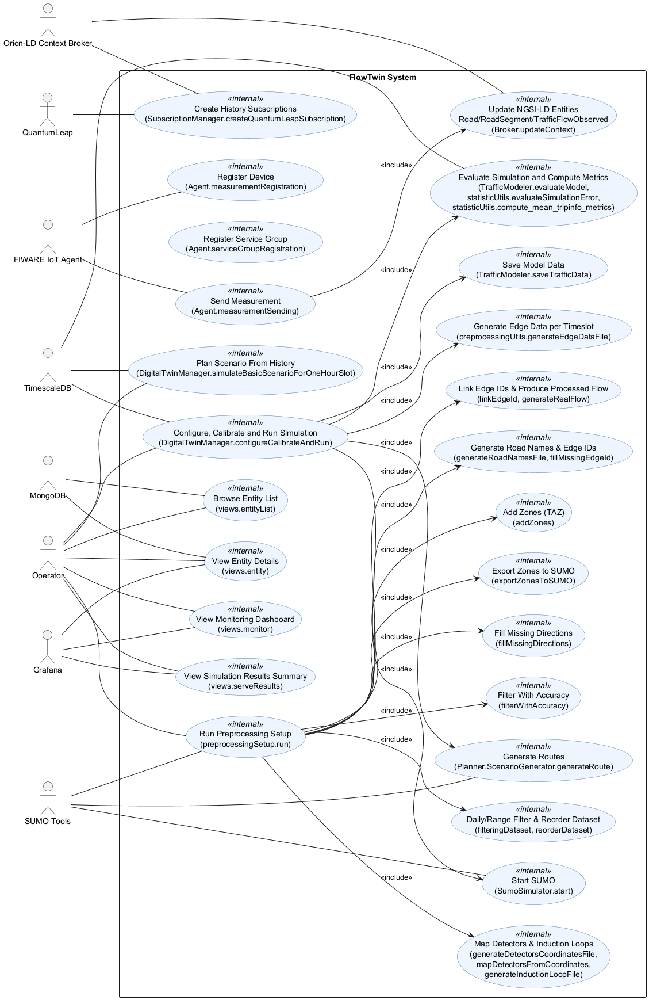
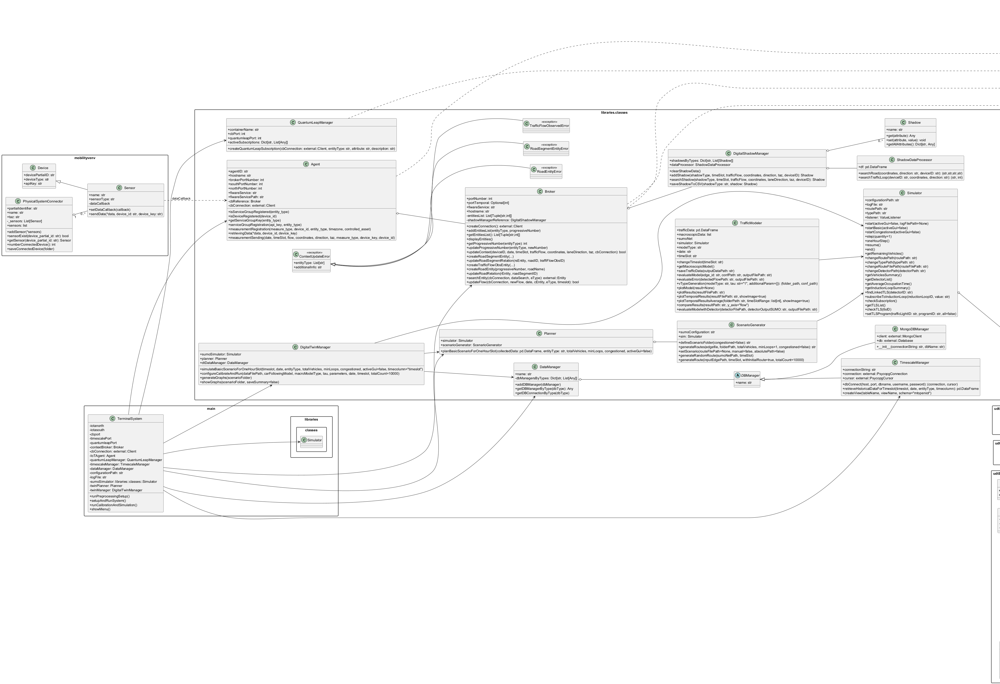
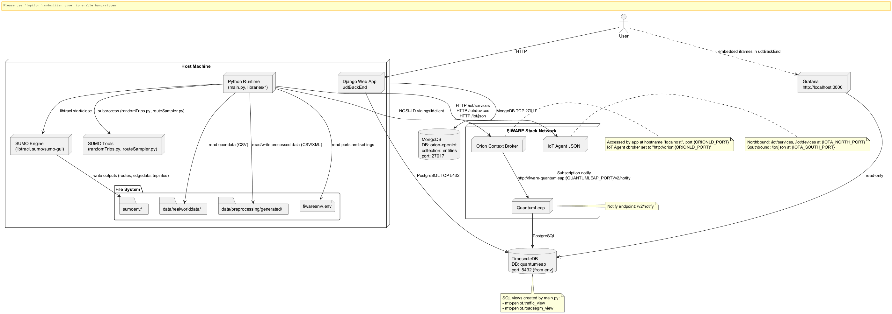

 

% 1 — System Overview
# SECTION 1 — System Overview

This section introduces the purpose, scope, and main capabilities of the system as implemented in the repository. It is derived strictly from the source code and is intended to be understandable by both technical and non-technical stakeholders. No diagrams are included in this section.

The system implements an Urban Digital Twin for road traffic, combining FIWARE-based context management with a SUMO-based traffic simulator. It ingests real-world open data, preprocesses it to align with a SUMO network, emulates physical sensing through a Mobility Virtual Environment, registers and streams measurements via a FIWARE IoT Agent to Orion-LD, maintains NGSI-LD entities in a Context Broker, subscribes those entities to QuantumLeap for time-series storage in TimescaleDB, and orchestrates SUMO simulations that can be calibrated against observed flows. A Django web application provides user-facing pages to list and inspect entities, configure and run calibrations, and review results with summary metrics and links to dashboards.

## Purpose and Main Functionalities

The system’s purpose is to create a calibrated, data-driven digital twin of urban traffic flows. It operationalizes a continuous loop in which real-world traffic loop measurements are mapped to network edges, sent as NGSI-LD device measurements, reflected as domain entities (Road, RoadSegment, TrafficFlowObserved), persisted historically, and used to configure, calibrate, simulate, and evaluate traffic scenarios in SUMO.

Key functionalities evidenced in the codebase include:

- Data preprocessing pipeline to:
  - Filter raw open data by sensor accuracy thresholds and dates.
  - Enrich records with spatial zones, detector coordinates, and SUMO edge identifiers.
  - Export TAZ (zones) to SUMO, map detectors to lanes, and generate edge-based XML inputs for simulations.
  - Produce Digital Shadow seed data (shadow types) for later entity mapping.

- Mobility Virtual Environment to emulate the physical system:
  - Set up “roads” and “traffic loop” sensor devices from preprocessed CSVs.
  - Register IoT Agent service groups and devices (type Device) with appropriate attributes.
  - Stream “trafficFlow” measurements (with location, timeSlot, laneDirection, dateObserved, taz) to the IoT Agent South port and update the Context Broker.

- FIWARE context and time-series integration:
  - NGSI-LD entity management with Road, RoadSegment, and TrafficFlowObserved types via ngsildclient.
  - Digital shadow matching to derive Road metadata (name, edgeID, start/end points) for consistent NGSI-LD updates.
  - Subscriptions from Orion-LD to QuantumLeap for targeted attributes (trafficFlow).
  - Time-series storage and querying from TimescaleDB for historical flows.

- SUMO-based traffic simulation and calibration:
  - Route generation from edge-based counts, scenario setup, and simulation execution via libtraci.
  - Macroscopic modeling per edge and time slot (Greenshield, Underwood, Van Aerde) and calibration against SUMO outputs.
  - Support for multiple car-following models (Krauss, IDM, W99) with tunable parameters (e.g., tau, sigma, delta, cc1/cc2).
  - Error and performance evaluation (RMSE, MAPE, R2, GEH, normalized metrics) and summary metrics across runs.

- Web application for interaction and reporting:
  - Entity list and detail views backed by MongoDB “entities” (Orion-LD store).
  - Simulation modeler form to run calibrations with chosen models, parameters, dates, and time windows.
  - Results pages with mean error tables, summary trip metrics, and integration hooks to Grafana dashboards.

## High-Level Scope

The repository implements the full end-to-end system:

- Ingestion and preprocessing of open traffic flow data into a SUMO-aligned form.
- Emulation of device measurements and real-time context updates in FIWARE.
- Time-series subscriptions and historical queries.
- SUMO scenario generation, execution, calibration, and evaluation.
- A UI for monitoring, model calibration, and results inspection.

External systems assumed by the implementation include FIWARE Orion-LD, FIWARE IoT Agent (JSON), QuantumLeap, TimescaleDB, MongoDB, and Eclipse SUMO (with tools and libtraci available on the host). Paths and ports are driven by code-level constants and environment files.

## Key Features Observable from the Codebase

- Preprocessing and data products:
  - Accuracy filtering, date range filtering, dataset reordering.
  - Zone enrichment using custom geoshapes; export of TAZ as SUMO additional file.
  - Detector coordinate extraction and mapping to lanes; induction loop export.
  - SUMO edge ID assignment to roads; generation of edgedata.xml per time slot from real flows.
  - Digital shadow seed CSV: “digital_shadow_types.csv” for road and traffic loop shadows.

- FIWARE integration:
  - IoT Agent interactions for service groups and device registration, plus measurement sending to South port.
  - Orion-LD context operations creating/updating:
    - Road (with BolognaRoadName).
    - RoadSegment (startPoint, endPoint, location, direction, taz, edgeID, trafficFlow, timeslot, DateTime).
    - TrafficFlowObserved (laneDirection, trafficFlow, timeslot, DateTime, relations to RoadSegment).
  - Subscriptions to QuantumLeap on selected entity types and attributes for historical persistence.

- Digital shadowing:
  - On-demand shadow creation/matching for “road” and “trafficLoop” using spatial and device keys.
  - Shadow persistence to CSV per shadow name, supporting reusability in the same runtime.

- Simulation orchestration:
  - Route generation: randomTrips and routeSampler from SUMO tools.
  - Macroscopic model generation and per-edge parameters from observed flows.
  - Batch execution across time slots, parameter sweeps for car-following models, and collection of SUMO outputs.
  - Error computation and summarization (speed, density, flow; RMSE, MAPE, MAE, R2, NRMSE/NMAE; GEH).

- Web backend and UX:
  - Django application (FlowTwin) with views for monitoring, entity list/detail, model calibration (forms), and result summaries.
  - Entity browsing over MongoDB “entities” (orion-openiot).
  - Results pages that read model parameter JSON, mean errors, and mean trip metrics; embeds or links for Grafana dashboards.

## Subsystems and Code Organization

| Subsystem | Path | Purpose and Core Elements |
|-----------|------|---------------------------|
| Data preprocessing | data/preprocessing/preprocessingSetup.py; libraries/utils/preprocessingUtils.py | Complete pipeline to convert raw open data into SUMO- and FIWARE-ready datasets (zones/TAZ export, detector/edge mapping, edge XML, shadow types). |
| FIWARE integration | libraries/classes/Agent.py; libraries/classes/Broker.py; libraries/classes/SubscriptionManager.py | IoT Agent registration and telemetry; NGSI-LD entity lifecycle management via ngsildclient; subscriptions to QuantumLeap. |
| Digital shadows | libraries/classes/DigitalShadowManager.py | Shadow search/creation for roads and traffic loops to map device observations to domain entities (edgeID, road name, endpoints). |
| Simulation and modeling | libraries/classes/SumoSimulator.py; libraries/classes/Planner.py; libraries/classes/TrafficModeler.py; libraries/classes/DigitalTwinManager.py | SUMO driver wrapper; route generation; macroscopic model creation; calibration, simulation execution, and evaluation. |
| Data access | libraries/classes/DataManager.py | Managers for TimescaleDB (queries, views) and MongoDB; plumbing for historical data retrieval. |
| Utilities | libraries/utils/*.py; libraries/constants.py | Helpers for reading env, converting dates, stat evaluation, plotting; shared constants for paths, model types, and SUMO tooling. |
| Mobility virtual environment | mobilityvenv/* | Emulates physical roads and traffic loop sensors; sets callbacks to stream device measurements through the IoT Agent. |
| Web backend (UI) | udtBackEnd/* | Django app to browse entities, configure simulations, and view aggregated results; connects to MongoDB and Timescale outputs. |
| Orchestrator | main.py | Terminal-driven end-to-end orchestration: preprocessing, system setup, emulation, calibration, and batch simulation runs. |

Required artefacts (JSON):
{}

% 2 — Architectural Context
## 2. Architectural Context

This section summarizes the external systems, interfaces, and data sources explicitly referenced in the codebase, and identifies the human and system actors that interact with the solution. The intent is to anchor the architecture to verifiable endpoints, files, and connectors present in the implementation so that project stakeholders can validate assumptions and integrations.

### External Systems

- FIWARE IoT Agent (JSON)
  - Northbound Admin API used for service-group and device registration.
  - Southbound Ingestion API used for measurement ingestion.
- FIWARE Orion-LD Context Broker
  - Accessed via ngsildclient for NGSI-LD entity create, update, query, and subscriptions.
- FIWARE QuantumLeap
  - Target of NGSI-LD subscriptions (notification endpoint /v2/notify).
  - Acts as data pump from Orion-LD to TimescaleDB.
- TimescaleDB (PostgreSQL)
  - Queried directly via psycopg2 for historical NGSI-LD time-series (“mtopeniot” schema).
- MongoDB
  - Orion-LD entities collection (“orion-openiot.entities”) used by the web UI to list and inspect entities.
- SUMO (Simulator and Tools)
  - SUMO engine controlled via libtraci.
  - SUMO tools invoked as external scripts: randomTrips.py, routeSampler.py, detector/mapDetectors.py, edgeDataFromFlow.py.
- Grafana
  - Embedded dashboards (iframes) for monitoring and simulation result visualization.
- Django Web Server (udtBackEnd)
  - Hosts the UI for monitoring, entity listing, calibration, and results; integrates with MongoDB and file-based outputs.

### APIs / Interfaces

- IoT Agent (host: Agent.hostname; ports from .env via CONTAINER_ENV_FILE_PATH)
  - Northbound Admin:
    - GET http://{host}:{northPort}/iot/services
    - POST http://{host}:{northPort}/iot/services
    - GET http://{host}:{northPort}/iot/devices/{device_id}
    - POST http://{host}:{northPort}/iot/devices
    - Required headers: fiware-service, fiware-servicepath, Content-Type: application/json.
    - Payload fields used:
      - services: apikey, cbroker (http://orion:{cbPort}), entity_type, resource (/iot/json).
      - devices: device_id, entity_name, entity_type, timezone, attributes (trafficFlow, location, laneDirection, timeSlot, dateObserved), static_attributes (deviceCategory, controlledAsset).
  - Southbound Ingestion:
    - POST http://{host}:{southPort}/iot/json?k={apiKey}&i={deviceId}
    - Headers: fiware-service=openiot, fiware-servicepath=/, Content-Type: application/json.
    - Payload fields sent: trafficFlow, location {type=Point, coordinates=[lon,lat]}, taz, timeSlot, laneDirection, dateObserved.

- Orion-LD Context Broker via ngsildclient
  - Client(hostname, port, tenant) used for:
    - Entity create/update for types: Road, RoadSegment, TrafficFlowObserved.
    - Query iteration (query_generator) on types:
      - https://smartdatamodels.org/dataModel.Transportation/Road
      - https://smartdatamodels.org/dataModel.Transportation/RoadSegment
  - Relationships used: hasPart (Road → RoadSegment), isContainedIn (RoadSegment → Road), observedBy, refRoadSegment, refTrafficFlowObs.

- Subscriptions (ngsildclient → CB)
  - SubscriptionBuilder with notification URL:
    - http://{containerName}:{quantumleapPort}/v2/notify
  - Subscriptions created for entity types:
    - RoadSegment (https://smartdatamodels.org/dataModel.Transportation/RoadSegment)
    - TrafficFlowObserved (https://smartdatamodels.org/dataModel.Transportation/TrafficFlowObserved)
    - Device
  - Attribute watched: trafficFlow.

- TimescaleDB (psycopg2)
  - Connection: postgres://{user}:{password}@{host}:{port}/{dbname}
  - Queries on schema “mtopeniot” tables:
    - mtopeniot.etdevice
    - mtopeniot."ethttps://smartdatamodels.org/datamodel.transportation/roadsegm"
    - mtopeniot."ethttps://smartdatamodels.org/datamodel.transportation/trafficf"
  - Custom views created:
    - CREATE VIEW mtopeniot.traffic_view AS SELECT * FROM mtopeniot."ethttps://smartdatamodels.org/datamodel.transportation/trafficf";
    - CREATE VIEW mtopeniot.roadsegm_view AS SELECT * FROM mtopeniot."ethttps://smartdatamodels.org/datamodel.transportation/roadsegm";

- MongoDB (mongoengine/pymongo)
  - Database: orion-openiot (host=localhost, port=27017).
  - Collection: entities; documents mapped in Django model Device for UI; pymongo used in processing to read/write entity metadata.

- SUMO command-line tools
  - randomTrips.py: generation of random trips.
  - routeSampler.py: route sampling based on edge data; used with parameters such as --edgedata-files, --total-count, --optimize, --minimize-vehicles.
  - detector/mapDetectors.py: mapping detectors by coordinates against SUMO net.
  - detector/edgeDataFromFlow.py: generating edgedata from per-detector flow.
  - Engine controlled via libtraci: start, step, subscription to induction loops, traffic light control.

- Django HTTP Endpoints (UI)
  - /udtApp/index, /udtApp/monitor, /udtApp/entityList, /udtApp/entityList/<id>, /udtApp/simulationModeler, /udtApp/simulation, /udtApp/simulationResults, /udtApp/simulationResults/<folder>, /udtApp/summary.
  - Static embedding of Grafana iframes:
    - http://localhost:3000/d/l8-g1tiHk/
    - http://localhost:3000/d/JeNeickHz/new-dashboard?orgId=1&var-edgeID={entityId}

### Data Sources

- Environment and configuration
  - fiwareenv/.env (CONTAINER_ENV_FILE_PATH): source of IOTA_NORTH_PORT, IOTA_SOUTH_PORT, ORIONLD_PORT, TIMESTCALE_DB_PORT, QUANTUMLEAP_PORT.
  - NGSI-LD context URLs (TRANSPORTATION_DATA_MODEL_CTX, DEVICE_DATA_MODEL_CTX) used when building entities.

- Databases
  - MongoDB: database “orion-openiot”, collection “entities”.
  - TimescaleDB (PostgreSQL): database “quantumleap”, schema “mtopeniot”; tables:
    - etdevice
    - "ethttps://smartdatamodels.org/datamodel.transportation/roadsegm"
    - "ethttps://smartdatamodels.org/datamodel.transportation/trafficf"
  - Created views:
    - mtopeniot.traffic_view
    - mtopeniot.roadsegm_view

- Opendata and preprocessing inputs (CSV)
  - data/realworlddata/opendata/traffic_flow_2024.csv (TRAFFIC_FLOW_OPENDATA_FILE_PATH)
  - data/realworlddata/opendata/accuracy_traffic_loop_2024.csv (ACCURACY_TRAFFIC_LOOP_OPENDATA_FILE_PATH)
  - data/realworlddata/opendata/statistical_areas.csv (STATISTICAL_AREAS_OPENDATA_FILE_PATH)
  - data/realworlddata/opendata/zone-del-comune-di-bologna.csv (ZONE_OPENDATA_FILE_PATH)

- Generated/processed datasets
  - data/preprocessing/generated/accurate_traffic_flow.csv (TRAFFIC_FLOW_ACCURATE_FILE_PATH)
  - data/preprocessing/generated/processed_traffic_flow.csv (PROCESSED_TRAFFIC_FLOW_EDGE_FILE_PATH)
  - data/preprocessing/generated/road_names.csv (ROAD_NAMES_FILE_PATH)
  - data/preprocessing/generated/edgedata.xml (EDGE_DATA_FILE_PATH)
  - data/preprocessing/generated/flow.csv (FLOW_DATA_FILE_PATH)
  - data/preprocessing/generated/model.csv (MODEL_DATA_FILE_PATH)
  - data/preprocessing/generated/daily_flow.csv (DAILY_TRAFFIC_FLOW_FILE_PATH)

- Digital shadow artifacts
  - data/digitalshadow/digital_shadow_types.csv (SHADOW_TYPE_FILE_PATH)
  - data/digitalshadow/ (SHADOWS_PATH, SHADOW_TYPE_PATH) for generated shadow CSVs.

- Mobility virtual environment inputs/outputs
  - data/realworlddata/mvenvdata/flows/real_traffic_flow.csv (REAL_TRAFFIC_FLOW_DATA_MVENV_FILE_PATH)
  - data/realworlddata/mvenvdata/detectors.csv (EXTRACTED_DETECTOR_COORDINATES_FILE_PATH)
  - data/realworlddata/mvenvdata/inductionLoop.csv (EXTRACTED_INDUCTION_LOOP_FILE_PATH)
  - registereddevices/*.csv (REGISTERED_DEVICES_PATH) for saved device metadata.

- SUMO network and outputs
  - sumoenv/static/full.net.xml (SUMO_NET_PATH)
  - sumoenv/static/detectors.add.xml (SUMO_DETECTORS_ADD_FILE_PATH)
  - sumoenv/static/output_taz.add.xml (TAZ_ADDITIONAL_FILE_PATH)
  - sumoenv/routes/* (SUMO_ROUTES_PATH)
  - sumoenv/output/* (SUMO_OUTPUT_PATH)
  - SUMO tools path (SUMO_TOOLS_PATH), used to invoke external scripts.
  - Scenario collection root (SCENARIO_COLLECTION_PATH) and results written under sumoenv/* folders, including mean_tripinfo_metrics.json, mean_errors.csv, plotResults.png.

### Users / Actors

- System Operator (Web UI)
  - Interacts with Django endpoints to browse entities, monitor, configure calibration and run simulations (simulationModeler), and review results (simulationResults, summary). Evidence: udtBackEnd/udtApp/views.py and templates.

- System Operator (CLI)
  - Uses TerminalSystem in main.py to run preprocessing, start the emulated physical system, and launch calibration/simulation tasks.

- Simulated Physical Devices (Traffic Loop Sensors)
  - Implemented by Sensor and PhysicalSystemConnector; send measurements to the IoT Agent southbound endpoint; registered to IoT Agent northbound. Evidence: mobilityvenv/*, libraries/classes/Agent.py.

- FIWARE Components
  - Orion-LD Context Broker: receives and stores NGSI-LD entities; interacts with QuantumLeap via subscriptions.
  - IoT Agent: device/service registry and measurement ingestion path.
  - QuantumLeap: receives notifications and persists to TimescaleDB.

- SUMO Simulation Engine
  - Acts as the traffic simulator controlled by the application; produces outputs consumed by analysis and UI.

% 2.1 — Architectural Context – Use Case Diagram
# SECTION 2.1 — Architectural Context – Use Case Diagram

This section presents the use case context of the system as implemented in the provided codebase. It identifies external actors and the concrete interactions they have with the system boundary. The diagram captures only behaviors and integrations that are explicitly present in the source code, including preprocessing of open data, IoT device lifecycle, NGSI-LD entity management, historical data capture, SUMO-based simulation calibration and execution, and the web user interface for monitoring and results inspection.

Figure 2.1.1 — Use Case Diagram — Architectural Context

Caption: Figure 2.1.1 — Use Case Diagram — Architectural Context

% 3 — Containers
## 3. Containers

This section identifies every runtime container evidenced by the source code and describes each container’s responsibility, core technologies, and the communication mechanisms it uses. The list is complete and directly traceable to the implementation, allowing validation by developers familiar with the codebase.

| Container | Responsibility | Technology | Communication |
|---|---|---|---|
| Django Web Backend (udtBackEnd) | Serves the web UI for entity browsing, monitoring, simulation setup, and viewing results; orchestrates simulations via forms and views; reads model outputs and statistics. | Python 3, Django, mongoengine, psycopg2, Templates (Bootstrap), App code in udtBackEnd/udtApp | HTTP(S) to browsers; TCP to MongoDB (27017) via mongoengine; TCP to TimescaleDB (PostgreSQL) via psycopg2; local filesystem I/O (sumoenv outputs) |
| Python Orchestrator (main.py) | CLI that initializes the FIWARE stack integrations, configures subscriptions, sets up the mobility virtual environment, drives data emulation and SUMO-based simulation/calibration pipelines. | Python 3, ngsildclient, requests, pandas, shapely, geopandas, sumolib | HTTP to IoT Agent (north/south endpoints); HTTP (NGSI‑LD) to Orion‑LD via ngsildclient; HTTP notifications to QuantumLeap (subscription creation); TCP to TimescaleDB (psycopg2); TCP (TraCI) to SUMO via libtraci; local filesystem I/O |
| SUMO Simulator | Executes microscopic traffic simulations and produces edgedata/tripinfo outputs used for calibration and evaluation. | Eclipse SUMO, libtraci (Python), SUMO tools (randomTrips.py, routeSampler.py) | TraCI (TCP) via libtraci; reads/writes local files (routes, edgedata, tripinfos); spawns sumo/sumo-gui processes |
| FIWARE IoT Agent (JSON) | Device provisioning and measurement ingestion; northbound device/service management and southbound data intake for telemetry. | FIWARE IoT Agent (JSON) | HTTP REST northbound: /iot/services, /iot/devices; HTTP southbound: /iot/json for measurement ingestion (requests from Agent class) |
| FIWARE Orion‑LD Context Broker | NGSI‑LD context management for Roads, RoadSegments, TrafficFlowObserved, and Devices; supports entity creation, update, and query used by the Broker class. | FIWARE Orion‑LD, NGSI‑LD | HTTP (NGSI‑LD) via ngsildclient: entity create/update/query; receives notifications target URLs set for QuantumLeap subscriptions |
| FIWARE QuantumLeap | Time‑series persistence for NGSI‑LD entities (RoadSegment, TrafficFlowObserved, Device) and attributes; serves as notification sink for subscriptions. | QuantumLeap | HTTP notification endpoint /v2/notify (set by SubscriptionManager to http://fiware-quantumleap:{port}/v2/notify); internal DB access to TimescaleDB (out of scope of repo code) |
| TimescaleDB (quantumleap) | Time‑series storage for historical data used by the simulation planner/modeler; queried for hourly slots and entity attributes. | TimescaleDB on PostgreSQL, accessed via psycopg2 | PostgreSQL protocol (TCP, default 5432) used by TimescaleManager; SQL queries for mtopeniot schemas and created views |
| MongoDB (orion-openiot) | Stores current NGSI‑LD entities (collection entities) consumed by the web backend for listing and device detail pages. | MongoDB, mongoengine ODM | MongoDB wire protocol (TCP 27017) configured in settings.py (connect to orion-openiot) |
| Grafana | Renders monitoring dashboards embedded in the web UI via iframes for live metrics visualization. | Grafana | HTTP from browsers to Grafana at http://localhost:3000; (data sources handled by Grafana, not configured in this repo) |

Introduction mapping to code:
- Django Web Backend: udtBackEnd/udtApp (views.py, templates/*, models.py) serves pages for list/detail (Device via mongoengine), simulation setup (forms.py, views.simulationModeler), results (views.serveResults).
- Python Orchestrator: main.py (TerminalSystem) wires Agent, Broker, QuantumLeapManager, TimescaleManager, Simulator, and DigitalTwinManager; runs preprocessing (data/preprocessing), subscriptions, emulation (mobilityvenv/*), and simulations.
- SUMO Simulator: libraries/classes/SumoSimulator.py controls sumo/sumo-gui via libtraci; Planner and TrafficModeler generate routes/types and parse outputs.
- FIWARE IoT Agent: libraries/classes/Agent.py uses /iot/services and /iot/devices (northbound) and /iot/json (southbound).
- Orion‑LD: libraries/classes/Broker.py uses ngsildclient to create/update/query Road/RoadSegment/TrafficFlowObserved entities.
- QuantumLeap: libraries/classes/SubscriptionManager.py targets http://fiware-quantumleap:{port}/v2/notify for subscriptions; main.py registers them.
- TimescaleDB: libraries/classes/DataManager.py (TimescaleManager) connects via psycopg2 to quantumleap DB and runs queries and view creation.
- MongoDB: udtBackEnd/udtBackEnd/settings.py connects to orion-openiot (localhost:27017); udtApp/models.py maps Device collection (entities).
- Grafana: templates embed dashboards (entity.html, monitor.html, summary.html) at http://localhost:3000 via iframes.

% 3.1 — Architecture Overview – Component Diagram
# Section 3.1 — Architecture Overview – Component Diagram

This section presents the component view of the Urban Digital Twin system, derived strictly from the provided source code. It shows the main runtime components, their responsibilities, and the interaction boundaries with external platforms (FIWARE IoT Agent, Orion-LD, QuantumLeap/TimescaleDB, SUMO, MongoDB, and Grafana). The diagram and descriptions are intended to be validated directly against the codebase and to support both developers and integrators in understanding the system structure and integration points.

Figure 3.1-1 — Component Diagram

Table 3.1-1 — Implemented Components and Responsibilities

| Module/File | Component/Class | Responsibility and Interactions |
|---|---|---|
| main.py | TerminalSystem (CLI) | Wires the system together: loads env vars, instantiates Agent, Broker, QuantumLeapManager, TimescaleManager, DataManager, SumoSimulator, Planner, DigitalTwinManager; creates QuantumLeap subscriptions; offers menu to run preprocessing, emulate physical system, and run calibration/simulation. |
| mobilityvenv/MobilityVirtualEnvironment.py | setupPhysicalSystem, startPhysicalSystem | Builds a dictionary of PhysicalSystemConnector roads with Sensor devices (traffic loops), registers devices via Agent, and replays real traffic data by timeslot calling Sensor.sendData which calls Agent.retrievingData. |
| mobilityvenv/PhysicalSystemConnector.py | PhysicalSystemConnector, Sensor, Device | Holds “physical” devices (sensors) attached to a road. Sensor buffers the callback to Agent.retrievingData and invokes it when sending data. Also persists connected devices metadata to CSV. |
| libraries/classes/Agent.py | Agent | Talks to FIWARE IoT Agent north (/iot/services, /iot/devices) and south (/iot/json). Registers service groups and devices; sends measurements; on success connects to Broker to update NGSI-LD context. |
| libraries/classes/Broker.py | Broker, ContextUpdateError, RoadEntityError, RoadSegmentEntityError, TrafficFlowObservedError | Encapsulates Orion-LD access via ngsildclient. Creates/updates Road, RoadSegment, TrafficFlowObserved; uses DigitalShadowManager to resolve roadName, edgeID, start/end points; manages progressive IDs; updates flows and relations. |
| libraries/classes/DigitalShadowManager.py | DigitalShadowManager, ShadowDataProcessor, Shadow | Loads and filters the digital shadow CSV (digital_shadow_types.csv), resolves mapping from device/coordinates/direction to Road/Edge/Start/End; caches Shadows; persists per-road CSVs under data/digitalshadow. |
| libraries/classes/SubscriptionManager.py | QuantumLeapManager | Creates NGSI-LD subscriptions on Orion-LD to notify QuantumLeap for entity types Device, RoadSegment, TrafficFlowObserved. Tracks active subscriptions per entity type. |
| libraries/classes/DataManager.py | DataManager, DBManager, TimescaleManager, MongoDBManager | Registry of DB managers. TimescaleManager connects to Postgres (QuantumLeap DB) and retrieves historical data by timeslot for a given entity type, and creates SQL views. MongoDBManager provides a simple client/db wrapper (available, not wired in views). |
| libraries/classes/DigitalTwinManager.py | DigitalTwinManager | Orchestrates calibration/simulation over a time range using TrafficModeler, Planner/ScenarioGenerator and SumoSimulator; generates edgedata.xml from processed CSV; evaluates and aggregates results via statisticUtils and TrafficModeler. |
| libraries/classes/Planner.py | Planner, ScenarioGenerator | Generates SUMO routes from edge data (SUMO tools routeSampler.py and randomTrips.py), defines scenario folders, runs simulations through SumoSimulator; also supports a “basic” one-hour scenario generation from Timescale historical data. |
| libraries/classes/SumoSimulator.py | Simulator, ValueListener | Manages SUMO execution via libtraci, sets file paths via environment variables, performs step/resume lifecycle, exposes detector/TLS subscription helpers and aggregation methods. |
| libraries/classes/TrafficModeler.py | TrafficModeler | Computes macroscopic model data from CSV and SUMO network (sumolib), writes vType add files, evaluates detected vs real data by parsing SUMO outputs, computes errors and plots. |
| libraries/utils/generalUtils.py | readingFiles, generate_random_key, loadEnvVar, convertDate, processingTlData, etc. | Generic helpers for file I/O, env loading, date conversion, and Mongo-backed processing of loop data during emulation; integrates with Sensor callback and Agent. |
| libraries/utils/preprocessingUtils.py | filterWithAccuracy, addZones, exportZonesToSUMO, generateRoadNamesFile, generateDetectorsCoordinatesFile, mapDetectorsFromCoordinates, generateEdgeDataFile, etc. | End-to-end preprocessing pipeline for CSV and SUMO artifacts: filtering data by accuracy and date, mapping detectors to edges, creating induction loops, exporting TAZ polygons to SUMO, building edgedata.xml for simulation. Uses SUMO tools where appropriate. |
| libraries/utils/statisticUtils.py | evaluateError, evaluateSimulationError, compute_mean_tripinfo_metrics, compute_mean_road_metrics | Computes error metrics (RMSE, MAPE, R2, GEH) from detected vs real flows; aggregates and saves mean metrics to CSV/JSON for later visualization. |
| libraries/constants.py | constants | Centralized file paths, model contexts/types (Smart Data Models URIs), SUMO paths and tools paths. |
| udtBackEnd/udtApp/views.py | Django Views | Renders Home/Monitor pages; lists NGSI-LD entities from MongoDB (Device Document); runs simulation calibration pipeline (DigitalTwinManager) via POST form; exposes results summary view reading outputs (JSON/CSV) and embedding Grafana. |
| udtBackEnd/udtApp/models.py | Django Models (SQL) and MongoEngine Documents | SQL models for migrations; the runtime uses MongoEngine Device document bound to collection “entities” in db “orion-openiot”. |
| udtBackEnd/udtApp/forms.py | ConfigForm | Collects model parameters (macromodel, car-following, tau, additional params), time window, and date; performs validation. |
| udtBackEnd/udtApp/templates/*, templatetags/custom_filters.py | Templates and Filters | HTML templates (Bootstrap-based) and filters for rendering entities, simulation forms and results; references Grafana dashboards via iframe; filter utilities for formatting. |
| data/preprocessing/preprocessingSetup.py | run() | Orchestrates preprocessing sequence by invoking preprocessingUtils functions and saving outputs. |

Notes for validation:
- All HTTP endpoints and NGSI-LD operations reflected in the diagram are present in the code (Agent for IoT Agent north/south, Broker via ngsildclient to Orion-LD, SubscriptionManager creating subscriptions to QuantumLeap).
- Historical data access for scenario generation is implemented via TimescaleManager against the “quantumleap” database.
- SUMO integration uses libtraci (runtime) and tools scripts (randomTrips.py, routeSampler.py, detector/mapDetectors.py).
- MongoDB access is present in both the emulation path (processingTlData) and the Django UI (Device document in collection “entities”).
- Grafana dashboards are embedded in templates and expected to read from TimescaleDB; no back-channel writes occur in code.

% 4 — Components
## 4. Components

This section decomposes the system into its internal components per container and describes the responsibility and collaborations of each component. The content is derived directly from the source code and reflects real dependencies, function calls, and data exchanges across modules, classes, and frameworks.

### 4.1 Core Libraries (libraries/classes)

| Component | Responsibility | Interactions |
|---|---|---|
| Agent (libraries/classes/Agent.py) | IoT Agent client for device/service registration and telemetry forwarding; wraps Northbound/Southbound HTTP calls, and coordinates post-ingestion Context Broker updates. | Uses requests; uses Broker to update Orion-LD; creates Broker and ngsildclient.Client connections; calls Agent.serviceGroupRegistration(), Agent.measurementRegistration(), Agent.measurementSending(); calls Broker.updateContext(); depends on libraries.constants for FIWARE service/path; interacts with external IoT Agent endpoints (/iot/services, /iot/devices, /iot/json). |
| Broker (libraries/classes/Broker.py) | Context Broker façade using ngsildclient. Creates/updates NGSI-LD entities Road, RoadSegment, TrafficFlowObserved; manages progressive IDs; orchestrates entity relationships and traffic flow updates. | Uses ngsildclient.Client/Entity/Rel; uses DigitalShadowManager.searchShadow(); uses libraries.utils.generalUtils.convertDate(); uses libraries.constants for context/type URIs; creates connections; calls cbConnection.query_generator(), cbConnection.create(), cbConnection.update(), cbConnection.get(); called by Agent.measurementSending(). |
| ContextUpdateError, RoadEntityError, RoadSegmentEntityError, TrafficFlowObservedError | Typed exceptions for context update flows, adding domain-specific details to error messages. | Raised inside Broker.updateContext() and its helpers; consumed by same method to log and return False. |
| DataManager (libraries/classes/DataManager.py) | Registry for database managers by type; provides access to managers and underlying connections. | Holds TimescaleManager and MongoDBManager instances; used by DigitalTwinManager and Django views; prints registrations; raises when missing. |
| DBManager (libraries/classes/DataManager.py) | Abstract base class for database managers. | Extended by TimescaleManager, MongoDBManager. |
| TimescaleManager (libraries/classes/DataManager.py) | PostgreSQL/TimescaleDB access: connects via psycopg2, creates views, and queries historical data by timeslot for device/road segment/traffic flow observed entities. | Uses psycopg2; returns cursor results as pandas.DataFrame; used by DigitalTwinManager.simulateBasicScenarioForOneHourSlot(); used by Django simulationModeler view; called in main.TerminalSystem to create QL materialized views. |
| MongoDBManager (libraries/classes/DataManager.py) | MongoDB connection factory storing client and db references. | Uses pymongo.MongoClient; not directly used elsewhere in code paths shown (Django uses mongoengine instead). |
| DigitalShadowManager (libraries/classes/DigitalShadowManager.py) | Manages digital shadows (road and trafficLoop) from a curated CSV; caches, persists per-shadow CSV snapshots, and resolves metadata for incoming observations. | Uses pandas, os, shutil; uses constants for shadow paths; uses ShadowDataProcessor to lookup road/loop metadata; called by Broker.updateContext() to resolve roadName, edgeID, points; writes shadow CSV files under data/digitalshadow. |
| Shadow (libraries/classes/DigitalShadowManager.py) | Lightweight attribute bag representing a shadow instance with helpers for get/set/export. | Created by DigitalShadowManager.addShadow(); persisted to CSV. |
| ShadowDataProcessor (libraries/classes/DigitalShadowManager.py) | Loads the curated “digital_shadow_types.csv” and performs lookups by coordinates/direction/deviceID to return road linkage and loop metadata. | Used internally by DigitalShadowManager.addShadow() for road or traffic loop lookups. |
| DigitalTwinManager (libraries/classes/DigitalTwinManager.py) | High-level orchestration of SUMO-based scenario generation, simulation runs across time ranges, calibration file generation, and error/metric aggregation. | Uses Simulator, Planner, TrafficModeler, statisticUtils; uses preprocessingUtils.generateEdgeDataFile(); changes simulator route file and starts SUMO; calls TrafficModeler.vTypeGeneration(), saveTrafficData(), evaluateModel(), evaluateError(); calls statisticUtils.evaluateSimulationError(), compute_mean_tripinfo_metrics(); used by CLI (main.py) and Django simulationModeler view. |
| Planner (libraries/classes/Planner.py) | Scenario planner that converts historical edge flows into SUMO routes, starts simulations, and controls scenario lifecycle. | Holds ScenarioGenerator; uses Simulator; writes XML edgefile; calls ScenarioGenerator.generateRoutes(), setScenario(), start(); used by DigitalTwinManager and CLI. |
| ScenarioGenerator (libraries/classes/Planner.py) | Low-level generator for SUMO scenarios: defines folder layout, invokes SUMO tools (randomTrips.py, routeSampler.py), and sets environment paths inside Simulator. | Uses constants for SUMO paths; subprocess to run SUMO tools; writes generatedRoutes.rou.xml; exports abs paths; used by Planner. |
| QuantumLeapManager (libraries/classes/SubscriptionManager.py) | Subscription helper to register Orion-LD subscriptions targeting QuantumLeap notification endpoint, by type and attribute. | Uses ngsildclient.Client and SubscriptionBuilder; maps friendly type aliases to full NGSI-LD types (constants); used by CLI (main.py). |
| Simulator (libraries/classes/SumoSimulator.py) | SUMO control via libtraci; manages start/stop, route/type/detector paths, runs steps, collects loop and vehicle KPIs, and TL control operations. | Uses libtraci; environment variables for STATICPATH/ROUTEFILEPATH/TYPEPATH/DETECTORPATH; called by Planner, DigitalTwinManager, TrafficModeler; exposes induction loop and traffic light helpers; ValueListener registered in constructor. |
| ValueListener (libraries/classes/SumoSimulator.py) | libtraci.StepListener to hook into simulation steps (no-op). | Registered by Simulator.__init__ via libtraci.addStepListener(). |
| TrafficModeler (libraries/classes/TrafficModeler.py) | Builds macroscopic models (Greenshield, Underwood, Van Aerde) from historical edge flows; exports model CSV; evaluates SUMO outputs against model; plotting utilities. | Uses pandas, numpy, matplotlib, scipy, sumolib; consumes PROCESSED_TRAFFIC_FLOW_EDGE_FILE_PATH; interacts with SUMO network (sumolib.net.readNet) and outputs; used by DigitalTwinManager. |

### 4.2 Utilities (libraries/utils)

| Component | Responsibility | Interactions |
|---|---|---|
| generalUtils (libraries/utils/generalUtils.py) | Misc tooling: CSV folder loader, random key generation, .env loader, format converters, date/time synthesis for NGSI-LD DateTime, polling MongoDB for entity modDate changes, and processing of TL data through Agent callback. | Uses pandas, MongoClient (pymongo); used by MobilityVirtualEnvironment (processingTlData), Broker (convertDate), CLI (loadEnvVar); calls Sensor.sendData callback (Agent.retrievingData). |
| preprocessingUtils (libraries/utils/preprocessingUtils.py) | Complete preprocessing toolchain: accuracy filtering; SUMO road name-to-edge mapping; detector coordinate extraction; detector mapping (mapDetectors.py); induction loop file creation; edge ID linking and fill-ins; shadow dataset build; real flow exports; edge data XML generation; daily filter; dataset filtering/reordering; zone tagging; TAZ export; edge data enrichment; flow derivation and edgeDataFromFlow pipeline. | Uses pandas, geopandas, shapely, scipy.spatial.cKDTree, sumolib, subprocess, SUMO tools; interacts with constants paths; called by data/preprocessing/preprocessingSetup.run(), DigitalTwinManager.configureCalibrateAndRun() (generateEdgeDataFile), Planner.ScenarioGenerator.generateRoute (consumes EDGE_DATA_FILE_PATH). |
| statisticUtils (libraries/utils/statisticUtils.py) | Error metrics computation (RMSE, NRMSE, MAPE, MAE, R2, GEH), per-simulation aggregation, and average summaries; parsing of SUMO outputs for edge/tripinfo metrics. | Used by DigitalTwinManager.configureCalibrateAndRun(); standalone helpers to compute means and write JSON/CSV files inside SUMO_PATH runs. |

### 4.3 Data Preprocessing Orchestrator (data/preprocessing)

| Component | Responsibility | Interactions |
|---|---|---|
| preprocessingSetup.run (data/preprocessing/preprocessingSetup.py) | One-shot orchestrator chaining all preprocessing steps to derive accurate, edge-linked flows, detector mapping, shadows, and real flow extracts; prepares inputs for ShadowManager and SUMO. | Calls preprocessingUtils.exportZonesToSUMO(), fillMissingDirections(), filterWithAccuracy(), addZones(), filteringDataset(), reorderDataset(), generateRoadNamesFile(), generateDetectorsCoordinatesFile(), mapDetectorsFromCoordinates(), generateInductionLoopFile(), fillMissingEdgeId(), linkEdgeId(), filterForShadowManager(), generateRealFlow(); uses constants for all paths. |

### 4.4 Mobility Virtual Environment (mobilityvenv)

| Component | Responsibility | Interactions |
|---|---|---|
| Device (mobilityvenv/PhysicalSystemConnector.py) | Base DTO for physical devices with id/type/apiKey attributes. | Extended by Sensor. |
| Sensor (mobilityvenv/PhysicalSystemConnector.py) | Concrete device representing a traffic loop sensor; holds a data callback and pushes readings to Agent via callback. | setDataCallback() with Agent.retrievingData; sendData() triggers Agent.measurementSending flow; used by MobilityVirtualEnvironment.setupPhysicalSystem(). |
| PhysicalSystemConnector (mobilityvenv/PhysicalSystemConnector.py) | Represents a “Road” physical aggregation with attached sensors; CRUD for sensors; persists connected devices to CSV under REGISTERED_DEVICES_PATH. | Uses pandas, os; created by MobilityVirtualEnvironment.setupPhysicalSystem(); sensorExist(), addSensor(), getSensor() used during setup; saveConnectedDevice() ensures id/key persisted. |
| MobilityVirtualEnvironment.setupPhysicalSystem (mobilityvenv/MobilityVirtualEnvironment.py) | Builds the physical topology from real flows: creates PhysicalSystemConnector per road, attaches TL Sensors, registers service/device with IoT Agent if missing. | Uses generalUtils.readingFiles(); uses Agent.isServiceGroupRegistered(), getServiceGroupKey(), serviceGroupRegistration(), measurementRegistration(), isDeviceRegistered(); uses PhysicalSystemConnector/Sensor; writes REGISTERED_DEVICES_PATH CSVs. |
| MobilityVirtualEnvironment.startPhysicalSystem (mobilityvenv/MobilityVirtualEnvironment.py) | Replays day-long traffic flows over 24 time slots, calling processingTlData() to push simulated device data to the Agent at intervals. | Uses generalUtils.readingFiles() and processingTlData(); loops time slots and sleeps between sends. |

### 4.5 Django Backend (udtBackEnd)

| Component | Responsibility | Interactions |
|---|---|---|
| udtBackEnd.settings (udtBackEnd/udtBackEnd/settings.py) | Django configuration; connects to MongoDB (mongoengine.connect to orion-openiot) and defines Timescale and default SQLite databases; static dirs and apps. | Enables udtApp; sets STATICFILES_DIRS; used across the Django runtime. |
| udtBackEnd.urls (udtBackEnd/udtBackEnd/urls.py) | Root URL router; redirects to udtApp/index; serves scenarioCollection statics in DEBUG. | Includes udtApp.urls; Django admin. |
| udtBackEnd.asgi / wsgi | ASGI/WSGI entry points. | Standard Django deployment. |
| apps.UdtappConfig (udtBackEnd/udtApp/apps.py) | AppConfig for udtApp. | Registered in INSTALLED_APPS. |
| models.Simulator (udtBackEnd/udtApp/models.py) | Django model carrying SUMO paths (not used in views). | No active references. |
| models.Misuration (udtBackEnd/udtApp/models.py) | Unmanaged Django model mapped to Timescale “mtopeniot.etdevice” to reflect device measurements. | Managed=False; not queried in views (TimescaleManager used instead). |
| models.DeviceID, Metadata, Attribute (udtBackEnd/udtApp/models.py) | Embedded MongoEngine documents for Device structure. | Used by Device Document. |
| models.Device (udtBackEnd/udtApp/models.py) | MongoEngine Document mapping to MongoDB “entities” collection (Orion-LD mirror), used to list and view devices. | Used by views.entity() and views.entityList(); relies on mongoengine global connect in settings. |
| forms.ConfigForm (udtBackEnd/udtApp/forms.py) | Calibration form for simulations, including macro/carfollow params, date, time range; validation that start<end. | Used by views.simulationModeler(); drives DigitalTwinManager configuration. |
| templatetags.custom_filters (udtBackEnd/udtApp/templatetags/custom_filters.py) | Template helpers: dict get, type extraction from NGSI-LD URIs, timestamp formatting, and string split. | Used in templates entity.html and entityList.html; format device info. |
| views.index (udtBackEnd/udtApp/views.py) | Renders index.html. | No external dependencies. |
| views.monitor | Renders monitor.html with embedded Grafana iframe. | Static content. |
| views.entity | Looks up a single Device by _id.id and renders entity.html; 404 on missing. | Uses models.Device (MongoEngine). |
| views.entityList | Lists Devices with optional type filter, paginated; renders entityList.html. | Uses models.Device, Paginator, custom_filters in template. |
| views.simulation | Lists available scenarioCollection folders filtered by date/time and type; renders simulation.html. | Uses os/pathlib; purely file-system oriented. |
| views.simulationModeler | Orchestrates a full calibration+simulation run from form POST: builds TimescaleManager, DataManager, Simulator, DigitalTwinManager; calls configureCalibrateAndRun(); persists params.json. | Uses constants for paths and env file; uses generalUtils.loadEnvVar(); uses DigitalTwinManager.configureCalibrateAndRun(); writes messages framework notices. |
| views.serve_image | Serves plotResults.png for a selected folder from SUMO_PATH; raises 404 if missing. | FileResponse; relies on absolute BASE_DIR. |
| views.simulationResults | Enumerates SUMO result folders matching naming pattern and renders selection UI. | Uses os, regex. |
| views.serveResults | Loads params.json, mean_tripinfo_metrics.json, mean_errors.csv from selected simulation folder and renders a monitoring summary dashboard (summary.html). | Uses pandas to extract subset metrics; provides Grafana URL for embed. |
| views.mocksummary | Renders summary.html with mock values for rapid UI testing. | No backend dependencies. |
| views.backup_serveResults | Legacy view to render result.html with an image and table; not used in URLs (kept as fallback). | Reads CSV under folder path. |
| urls (udtBackEnd/udtApp/urls.py) | App-level URL mapping for all views including results and modeler. | Included by project urls. |
| admin (udtBackEnd/udtApp/admin.py) | Django admin registration (empty). | None. |
| templates (udtBackEnd/udtApp/templates/udtApp/*.html) | UI templates for base layout, entity views, monitoring, simulation scenario/config/results, and summary dashboard. | Consume custom_filters and context variables from views; embed Grafana iframes and render CSV-derived metrics and images. |
| migrations (udtBackEnd/udtApp/migrations/*.py) | Historical schema artifacts for early Timescale table mapping and entity scaffolding (now mostly removed/unused). | Informational only; not executed at runtime. |

### 4.6 CLI Orchestrator (main.py)

| Component | Responsibility | Interactions |
|---|---|---|
| TerminalSystem (main.py) | CLI-driven orchestrator to initialize FIWARE components, create CB subscriptions, configure DB access, and run end-to-end pipelines (preprocessing, physical emulation, simulation calibration/runs). | Loads env via generalUtils.loadEnvVar(); instantiates Broker, ngsildclient.Client, Agent; registers QuantumLeap subscriptions via QuantumLeapManager; sets up TimescaleManager, DataManager; creates Simulator, Planner, DigitalTwinManager; uses preprocessingSetup.run(); calls MobilityVirtualEnvironment.setupPhysicalSystem() and startPhysicalSystem(); calls DigitalTwinManager.configureCalibrateAndRun(); interacts with preprocessingUtils.generateEdgeDataFile(). |
| Top-level script (main.py bottom) | Non-interactive sequence that mirrors TerminalSystem capabilities and loops multiple parameter sweeps across models; ensures routes generation option; registers QL subscriptions and runs all simulations. | Same dependencies as TerminalSystem; writes SUMO outputs and results under SUMO_PATH. |

### 4.7 Constants and Configuration

| Component | Responsibility | Interactions |
|---|---|---|
| constants (libraries/constants.py) | Centralized definition of file system paths, SUMO resources, Smart Data Models contexts/types, and dataset locations; used across all containers. | Referenced by nearly all modules: preprocessing pipeline, SUMO planner/modeler, Django views, CLI, Agent/Broker, DigitalShadowManager. |

### 4.8 Data Artifacts

| Component | Responsibility | Interactions |
|---|---|---|
| Curated datasets and outputs (data/…, sumoenv/…) | Generated artifacts used at runtime: digital shadows CSVs, detectors, induction loops, edge data XML, SUMO outputs, metrics JSON/CSV, and scenario collections. | Produced by preprocessingUtils, DigitalTwinManager, Planner, statisticUtils; consumed by DigitalShadowManager, Planner, Django views. |

This complete component inventory covers all classes, modules, and top-level functions present in the repository and makes explicit the collaboration patterns among the physical emulation, FIWARE context management, preprocessing, simulation, and monitoring subsystems.

% 5 — Code-Level View
# Section 5 — Code-Level View

This section describes how the implemented architecture maps onto the source code. It identifies the executable entry points, the key modules and directories, and any explicit architectural or design patterns observable from the code. It provides a code-to-component inventory that can be validated by the development team and used to navigate and evolve the system.

## 5.1 Purpose and Scope

The goal is to make the architecture concrete by linking responsibilities, runtime behaviors, and deployment aspects to the actual code artifacts. This includes the end-to-end data path from data preprocessing, through emulated physical system and FIWARE interactions, to simulation/calibration and the web backend for monitoring and summarizing results.

## 5.2 Main Entry Points

This system exposes three primary execution contexts:

1) Interactive CLI orchestrator  
- File: main.py  
- Class: TerminalSystem  
- Role: Initializes FIWARE connections (IoT Agent, Orion-LD, QuantumLeap), sets up subscriptions, configures TimescaleDB connectivity and SUMO environment, and orchestrates:
  - Preprocessing pipeline: data.preprocessing.preprocessingSetup.run()
  - Physical system emulator: mobilityvenv.MobilityVirtualEnvironment.setupPhysicalSystem() and startPhysicalSystem()
  - Calibration and simulation: libraries.classes.DigitalTwinManager.DigitalTwinManager.configureCalibrateAndRun()
- Behavior: Presents a CLI loop; alternatively executes a “legacy main” sequence configuring multiple simulation configurations batch-wise.

2) Web backend (Django)  
- Project: udtBackEnd  
- Process entry points: udtBackEnd/udtBackEnd/wsgi.py and udtBackEnd/udtBackEnd/asgi.py  
- Development server runner: udtBackEnd/manage.py  
- Views: udtBackEnd/udtApp/views.py exposes routes to list entities (MongoDB), start simulations (form-backed), and render results and summaries.

3) Preprocessing task  
- File: data/preprocessing/preprocessingSetup.py  
- Function: run()  
- Role: Builds derived datasets for the rest of the system (filtering, enrichment, SUMO mapping, detector generation, traffic flow extraction, edge mapping) using functions in libraries.utils.preprocessingUtils and constants in libraries.constants.

## 5.3 Key Modules and Directories

This subsection lists all source files with their key classes/functions, responsibilities, and internal/external dependencies.

### Data preprocessing

- data/preprocessing/preprocessingSetup.py  
  - Function run(): End-to-end preprocessing workflow invoking:
    - exportZonesToSUMO, fillMissingDirections, filterWithAccuracy, addZones, filteringDataset, reorderDataset, generateRoadNamesFile, generateDetectorsCoordinatesFile, mapDetectorsFromCoordinates, generateInductionLoopFile, fillMissingEdgeId, linkEdgeId, filterForShadowManager, generateRealFlow (all from libraries.utils.preprocessingUtils)
  - Depends on libraries.constants for file paths; produces CSV/XML inputs for SUMO and later stages.

### Core classes

- libraries/classes/Agent.py  
  - Class Agent: Encapsulates IoT Agent North/South API interactions and bridges to the Broker.
    - isServiceGroupRegistered(), getServiceGroupKey(), serviceGroupRegistration()
    - isDeviceRegistered(), measurementRegistration()
    - retrievingData() callback from sensors → measurementSending()
    - measurementSending(): posts telemetry to IoT Agent Southbound and then triggers Broker.updateContext()
  - Dependencies: requests, libraries.classes.Broker.Broker, ngsildclient (via Broker), CaseInsensitiveDict; uses FIWARE service headers; uses libraries.constants for service values.

- libraries/classes/Broker.py  
  - Classes ContextUpdateError, RoadEntityError, RoadSegmentEntityError, TrafficFlowObservedError: Error taxonomy for context updates.
  - Class Broker: Handles Orion-LD (NGSI-LD) operations via ngsildclient:
    - createConnection(): builds ngsildclient.Client
    - Entity ID progressive management (addEntitiesList/getProgressiveNumber/updateProgressiveNumber)
    - updateContext(): end-to-end orchestration:
      - Uses DigitalShadowManager to resolve road shadow attributes (edgeID, points, name)
      - Searches/creates/updates NGSI-LD entities (Road, RoadSegment, TrafficFlowObserved)
      - Updates flows and timeslot attributes; manages relationships (HAS_PART/IS_CONTAINED_IN, OBSERVED_BY)
    - Entity factories: createRoadEntity(), createRoadSegmentEntity(), createTrafficFlowObsEntity(), relation updaters
    - searchEntity(): uses query_generator with ROAD_SEGMENT_DATA_MODEL_TYPE and ROAD_DATA_MODEL_TYPE constants
    - updateFlow(): sets properties and tprop before cbConnection.update()
  - Dependencies: ngsildclient (Client, Entity, Rel), libraries.classes.DigitalShadowManager.DigitalShadowManager, libraries.utils.generalUtils.convertDate, libraries.constants model context and types.

- libraries/classes/DataManager.py  
  - Class DataManager: Registry for DB managers keyed by type (TimescaleDB, MongoDB).
  - Abstract DBManager
  - Class TimescaleManager:
    - psycopg2 connection/cursor setup; createView()
    - retrieveHistoricalDataForTimeslot(): parameterized queries selecting time slots and entity types (RoadSegment, Device, TrafficFlowObserved) to feed simulation planners
  - Class MongoDBManager: Thin wrapper over pymongo.MongoClient and Database
  - Dependencies: pandas, psycopg2, pymongo, datetime.

- libraries/classes/DigitalShadowManager.py  
  - Class Shadow: Value object storing attributes; getters/setters and CSV persistence helpers.
  - Class ShadowDataProcessor: Loads and normalizes a CSV (SHADOW_TYPE_FILE_PATH); provides:
    - searchRoad(): resolve RoadName, EdgeID, StartingPoint, EndPoint from deviceID, coordinates, direction
    - searchTrafficLoop(): resolve loopCode/loopLevel
  - Class DigitalShadowManager:
    - clearShadowData(): cleans SHADOWS_PATH except type file
    - addShadow(): creates a shadow for "road" or "trafficLoop", persists to CSV per type
    - searchShadow(): in-memory lookup; lazy addShadow on miss
  - Dependencies: pandas, filesystem (os/shutil), libraries.constants for file paths.

- libraries/classes/DigitalTwinManager.py  
  - Class DigitalTwinManager: Orchestrates SUMO-based calibration/simulation
    - simulateBasicScenarioForOneHourSlot(): pulls TimescaleDB historical data via DataManager/TimescaleManager and delegates to Planner
    - configureCalibrateAndRun(): main loop over time slots:
      - Creates TrafficModeler configured for modelType (macro model)
      - Generates per-slot vType files and routes via Planner and preprocessingUtils.generateEdgeDataFile()
      - Runs SUMO simulation via SumoSimulator.start()
      - Post-processes outputs via TrafficModeler.evaluateModel(), evaluateError(), and statisticUtils; persists results and summary images
    - generateGraphs(), showGraphs(): utilities over SUMO tools outputs
  - Dependencies: Planner, TrafficModeler, SumoSimulator, statisticUtils, preprocessingUtils, constants (paths), pandas, PIL, subprocess.

- libraries/classes/Planner.py  
  - Class ScenarioGenerator:
    - defineScenarioFolder(): timestamped scenario directories under SCENARIO_COLLECTION_PATH
    - generateRoutes(): two-step SUMO route generation using randomTrips.py then routeSampler.py; returns absolute route path
    - setScenario(): GUI-based or programmatic route file selection; updates Simulator route path
    - generateRandomRoute(): helper used by generateRoute()
    - generateRoute(): programmatic route sampling from EDGE_DATA_FILE_PATH
  - Class Planner:
    - planBasicScenarioForOneHourSlot(): converts collected traffic counts to SUMO edgefile XML; generates routes; starts simulation via Simulator
  - Dependencies: libraries.classes.SumoSimulator.Simulator, libraries.constants, SUMO tools via subprocess, xml.etree, os, sys.

- libraries/classes/SubscriptionManager.py  
  - Class QuantumLeapManager:
    - Creates Orion-LD subscriptions targeting QuantumLeap’s /v2/notify; supports entity types: RoadSegment, TrafficFlowObserved, Device
    - Maintains in-memory activeSubscriptions map
  - Dependencies: ngsildclient.Client and SubscriptionBuilder; constants for NGSI-LD types.

- libraries/classes/SumoSimulator.py  
  - Class Simulator:
    - Wraps libtraci lifecycle: start(), step(), resume(), end()
    - Path setters for ROUTEFILEPATH/TYPEPATH/DETECTORPATH
    - Helper metrics: getVehiclesSummary(), getDetectorList(), getAverageOccupationTime(), getInductionLoopSummary()
    - TLS helpers: findLinkedTLS(), setTLSProgram(), subscribe/check logic
  - Class ValueListener: libtraci.StepListener implementation (no-op)
  - Dependencies: libtraci, traci.constants, os and environment variables, constants.

- libraries/classes/TrafficModeler.py  
  - Class TrafficModeler:
    - Loads trafficData; builds macroscopic model parameters per edge using SUMO network metadata via sumolib
    - Model families supported explicitly: greenshield, underwood, vanaerde (macro); car-following configs Krauss/IDM/W99 emitted into XML vType
    - saveTrafficData(), evaluateModel(), evaluateError(): extract and compare simulated vs real metrics; write CSV summaries
    - vTypeGeneration(): writes additional vehicle type XML and config folder structure; sets simulator paths
    - Plot helpers: plotModel(), plotResults(), plotTemporalResults(), plotTemporalResultsAverage(), compareResults()
    - evaluateModelwithDetector(): correlates detector outputs to modeled values
  - Dependencies: pandas, numpy, scipy, matplotlib, sumolib, xml.etree, subprocess, file I/O.

### Utilities

- libraries/utils/generalUtils.py  
  - File/CSV utilities (readingFiles), env var loader (loadEnvVar), random key generator, date/time conversions (convertDate), and MongoDB poll helper (wait_for_mod_date_change)
  - processingTlData(): Iterates over real-world traffic rows, locates corresponding Sensor in roads map, and triggers sensor.sendData() → Agent path
  - Dependencies: pandas, pymongo, random/time, MongoClient, Simulator/TrafficModeler not directly used in core path except imports.

- libraries/utils/preprocessingUtils.py  
  - Opendata and SUMO preprocessing functions:
    - filterWithAccuracy(), generateRoadNamesFile() using sumolib spatial queries, generateDetectorsCoordinatesFile(), mapDetectorsFromCoordinates() (SUMO tools), generateInductionLoopFile()
    - fillMissingEdgeId(), linkEdgeId(), filterForShadowManager(), generateRealFlow()
    - generateEdgeDataFile(): build SUMO edge data XML for routeSampler
    - dailyFilter(), reorderDataset(), filteringDataset(), fillMissingDirections()
    - addZones(): spatial join points with zones; nearest fill via KDTree
    - fillEdgeDataInfo(), generateFlow(), generateEdgeFromFlow(), exportZonesToSUMO() (TAZ generation)
  - Dependencies: pandas, geopandas, shapely, numpy, scipy.spatial, sumolib, subprocess, xml, constants.

- libraries/utils/statisticUtils.py  
  - Simulation error metrics:
    - evaluateError(): RMSE/MAPE/MAE/NRMSE/R2/GEH across speed/density/flow
    - evaluateErrorEverywhere(), evaluateSimulationError()
    - compute_mean_road_metrics(), compute_mean_tripinfo_metrics()
  - Dependencies: pandas, math, glob/re/os, xml.etree, json.

- libraries/constants.py  
  - Centralized configuration: projectPath discovery, data model contexts/types; all filesystem locations for input/output data, SUMO assets, tools, and generated artifacts.

### Mobility virtual environment (physical emulator)

- mobilityvenv/MobilityVirtualEnvironment.py  
  - Functions:
    - setupPhysicalSystem(agentInstance: Agent) → (roads dict, files list): Loads real traffic flow CSVs (REAL_TRAFFIC_FLOW_DATA_MVENV_PATH), creates PhysicalSystemConnector per road and Sensor per loop, registers each device to IoT Agent (service group + device) if needed, persists registered device info.
    - startPhysicalSystem(roads): For each hour across the day, slices traffic data and calls processingTlData() → each Sensor invokes Agent.retrievingData() callback to send telemetry and update context.
  - Dependencies: libraries.constants, PhysicalSystemConnector, Agent, generalUtils.readingFiles/processingTlData, datetime.

- mobilityvenv/PhysicalSystemConnector.py  
  - Class Device: Base device with devicePartialID, deviceType, apiKey.
  - Class Sensor(Device): Holds name/type and dataCallback; sendData() triggers callback (Agent.retrievingData).
  - Class PhysicalSystemConnector: Aggregates sensors per road; persistence of registered devices to CSV; helpers to add/get sensors.
  - Dependencies: generalUtils (file ops), pandas, os.

### Web backend (Django)

- udtBackEnd/udtBackEnd/settings.py, urls.py, asgi.py, wsgi.py  
  - Django configuration (SQLite default + Timescale and Mongo connections), static dirs, and URL routing.

- udtBackEnd/manage.py  
  - Django management entry point.

- udtBackEnd/udtApp/apps.py, admin.py, tests.py  
  - App config; tests placeholder.

- udtBackEnd/udtApp/models.py  
  - Django model Simulator (local storage); unmanaged model Misuration mapping to mtopeniot.etdevice; Mongoengine Document Device mapping Orion “entities” collection; Embedded documents for DeviceID/Metadata/Attribute.

- udtBackEnd/udtApp/forms.py  
  - ConfigForm: Defines macromodel, car-following model, tau/params, total_count, date, start/end time with validation (start < end).

- udtBackEnd/udtApp/views.py  
  - index(), monitor(): render basic pages.
  - entity(entity_id): lookup Device via Mongoengine; render attributes and timestamps.
  - entityList: filterable/paginated list of Orion devices by _id.type suffix.
  - simulation: filter scenarioCollection folders by datetime range and scenario type.
  - simulationModeler: Loads ports from CONTAINER_ENV_FILE_PATH; instantiates TimescaleManager, DataManager, Simulator, DigitalTwinManager; on valid form, invokes DigitalTwinManager.configureCalibrateAndRun() with selected parameters; persists params.json in result folder.
  - simulationResults: Lists results folders in sumoenv; routes to serveResults.
  - serveResults(folder_name): Reads params.json, mean_tripinfo_metrics.json, mean_errors.csv; renders summary.html with evaluation metrics and a dashboard iframe URL.
  - serve_image(folder_name): Serves plotResults.png from SUMO_PATH/folder.
  - backup_serveResults, mocksummary: auxiliary endpoints for fallback/mocks.

- udtBackEnd/udtApp/urls.py  
  - URL patterns for all views named above.

- udtBackEnd/udtApp/templatetags/custom_filters.py  
  - Template filters for dict/key access, type extraction, timestamp formatting, and splitting strings.

- udtBackEnd/udtApp/templates/...  
  - HTML templates for layout, entity list/detail, simulation filters, calibration form (simulationModeler), results listing and summary (summary.html), and monitoring.

- udtBackEnd/udtApp/migrations/*.py  
  - Migration history for Simulator and historical attempts to map Orion/Timescale structures; most unmanaged/removed in later migrations.

## 5.4 End-to-End Code-Level Flow

- Preprocessing (offline, once): preprocessingSetup.run() composes a pipeline converting raw open data into:
  - Accurate, zone-enriched CSVs; detector coordinates; induction loop map; SUMO detectors.add.xml; road name to SUMO edge mapping; filtered “shadow types” CSV; real traffic flow tables; and per-slot SUMO edgdata XML.
- Physical emulation:
  - setupPhysicalSystem(): builds road connectors and sensors from real flow CSVs, registers devices with IoT Agent and Orion-LD (via Agent).
  - startPhysicalSystem(): for each timeslot, emits sensor data → Agent.measurementSending() → IoT Agent South → Broker.updateContext() → Orion-LD entities created/updated using DigitalShadowManager for enrichment.
  - QuantumLeap subscriptions: created upfront via SubscriptionManager.QuantumLeapManager to persist time series to TimescaleDB.
- Calibration and simulation:
  - DigitalTwinManager.configureCalibrateAndRun(): per-slot SUMO execution using macroscopic model (TrafficModeler) and per-slot routes (Planner); collects metrics; computes and persists error summaries (statisticUtils).
- Web backend:
  - simulationModeler view: form-driven run of the calibration pipeline.
  - simulationResults and serveResults: browsing of results folders and visualization of metrics and dashboards.
  - entityList/entity: live Orion entities through Mongoengine.

## 5.5 Recognizable Architectural/Design Patterns

- Layered organization (explicit in code structure):
  - Data ingestion and preprocessing (libraries.utils.* and data/preprocessing/*)
  - Device/emulation adapter layer (mobilityvenv/*, libraries/classes/Agent.py)
  - Context management and domain model mapping (libraries/classes/Broker.py, DigitalShadowManager.py)
  - Persistence adapters (libraries/classes/DataManager.py, TimescaleManager, MongoDBManager)
  - Simulation layer (libraries/classes/{Planner,TrafficModeler,SumoSimulator,DigitalTwinManager}.py)
  - Presentation layer (udtBackEnd Django app, MTV pattern)

- Adapter/Facade:
  - Agent encapsulates IoT Agent HTTPs; Broker encapsulates ngsildclient; DataManager/TImescaleManager wrap DB access; ScenarioGenerator encapsulates SUMO tools.

- Observer/Callback:
  - Sensor.setDataCallback() → Agent.retrievingData(); libtraci StepListener (ValueListener) pattern registered in SumoSimulator.

- Builder (via external lib):
  - SubscriptionBuilder from ngsildclient used to build Orion-LD subscriptions.

- MVC/MTV (Django):
  - Models (Mongoengine Document + unmanaged SQL table), Templates, Views, URL routing.

## 5.6 External Dependencies Evident in Code

- FIWARE: Orion-LD via ngsildclient, IoT Agent JSON (HTTP), QuantumLeap subscriptions (HTTP).
- Databases: TimescaleDB via psycopg2, MongoDB via mongoengine/pymongo.
- SUMO stack: libtraci, sumolib, SUMO tools (randomTrips.py, routeSampler.py, detector tools).
- Data science/GIS: pandas, numpy, scipy, geopandas, shapely, matplotlib.
- Imaging: PIL.
- Web: Django.

All external calls and file paths are parameterized in libraries/constants.py and by environment variables loaded through libraries.utils.generalUtils.loadEnvVar().

## 5.7 Notes for Validation

- The linkage between measurementSending() and Broker.updateContext() is explicit and guarded by success status codes and exception raising.  
- Road/RoadSegment/TrafficFlowObserved entity types and relationships are created and updated as per ngsildclient usage in Broker.py.  
- DigitalShadowManager.searchShadow() defers to data-driven CSV lookups and lazily creates shadows; errors propagate via RuntimeError/ValueError and are surfaced in Broker.updateContext().  
- TimescaleManager.retrieveHistoricalDataForTimeslot() queries are parameterized and return pandas DataFrames consistent with Planner expectations.  
- The Django views instantiate the same classes as main.py (Simulator, DigitalTwinManager, TimescaleManager) to drive server-side simulations, and store params.json alongside computed CSV/JSON artifacts.

This code-level view directly mirrors the implementation, allowing a reviewer to trace responsibilities and interactions from files to runtime behaviors without ambiguity.

% 5.1 — Class Diagram
# SECTION 5.1 — Class Diagram

This section presents the complete static structure of the codebase as a PlantUML class diagram. It is derived directly from the source code and shows all classes, their attributes where relevant, inheritance, and key associations and aggregations among components. The diagram is organized by logical packages reflecting the project’s directory structure to support validation by developers familiar with the code.

Figure 5.1 — Class Diagram

Notes on the diagram

The diagram depicts all classes defined in the repository with their relationships:

- The Agent aggregates a Broker and an ngsildclient Client to manage device registration and measurement forwarding, and it updates the Context Broker via Broker.updateContext.

- The Broker composes a DigitalShadowManager to resolve road shadows and orchestrates NGSI-LD entities using ngsildclient types (Client, Entity, Rel). Specific exception types specialize ContextUpdateError to pinpoint errors per entity category.

- The DataManager aggregates database managers. TimescaleManager and MongoDBManager derive from DBManager and expose their respective connections (psycopg2 and pymongo).

- The DigitalShadowManager composes a ShadowDataProcessor and manages a collection of Shadow objects persisted to CSV.

- The DigitalTwinManager composes a Simulator, a Planner, and uses the DataManager and TrafficModeler to calibrate and run simulations.

- The Planner orchestrates scenario generation through ScenarioGenerator, which in turn uses the Simulator.

- The Simulator registers a ValueListener (a libtraci StepListener) and provides APIs for SUMO execution, telemetry, and TLS control.

- In the mobility virtual environment, PhysicalSystemConnector aggregates Sensors (which extend Device). Sensors push data via a callback bound to Agent.retrievingData.

- The Django app contains a ConfigForm (extends forms.Form), UdtappConfig (extends AppConfig), and MongoEngine/Django models for Timescale, Mongo, and device entities. Names identical to classes in libraries (e.g., Simulator, Device) are namespaced by package and do not conflict.

- TerminalSystem (main.py) wires all runtime components: Agent, Broker, QuantumLeapManager, TimescaleManager, DataManager, Simulator, Planner, and DigitalTwinManager. The associations shown reflect actual attributes in TerminalSystem’s initializer.

This class diagram can be validated against the code by verifying class names, attributes, and method signatures, as well as imports and composition patterns present in the repository.

% 6 — Cross-Cutting Concerns
## 6. Cross-Cutting Concerns

This section identifies system-wide concerns that cut across multiple modules and layers. It records how the current codebase implements or omits security, logging, configuration, error handling, testing, and monitoring, with precise evidence to support validation by the development team.

| Concern | Evidence from code | Description |
|---|---|---|
| Authentication | libraries/classes/Agent.py: serviceGroupRegistration(), measurementRegistration(), measurementSending() use FIWARE IoT Agent API keys; mobilityvenv/PhysicalSystemConnector.py: saveConnectedDevice() persists device keys; udtBackEnd/udtBackEnd/settings.py uses hardcoded SECRET_KEY; libraries/classes/DataManager.py TimescaleManager() uses hardcoded DB credentials | Authentication toward FIWARE IoT Agent relies on an API key (apikey) and per-device key passed in URL query (k=...), with no token-based auth. MongoDB connects without credentials. Django SECRET_KEY and PostgreSQL credentials are hardcoded, indicating development-mode practices. |
| Authorization | No role/permission checks in any service integration; requests to IoT Agent and Context Broker use tenant headers only (fiware-service, fiware-servicepath) | There is no explicit authorization layer in the application code. Access control is delegated to FIWARE components if configured; the code itself does not enforce roles/permissions. |
| Transport encryption | All external HTTP calls are plain http:// (e.g., Agent → IoT Agent: http://{host}:{port}/iot/...; Broker → Orion-LD via ngsildclient hostname/port without TLS); Django templates embed http Grafana iframes | No TLS is enforced for external communications (IoT Agent, Orion-LD, QuantumLeap, Grafana, TimescaleDB, MongoDB). Connections and credentials traverse plaintext channels. |
| Secrets management | udtBackEnd/udtBackEnd/settings.py: SECRET_KEY literal; DataManager.TimescaleManager.dbConnect() embeds postgres://...; PhysicalSystemConnector.saveConnectedDevice() writes device_id and device_key to CSV under registereddevices/; libraries/utils/generalUtils.generate_random_key() generates keys but no vaulting | Secrets and credentials are stored in code and on disk in plaintext (CSV). The .env reader (generalUtils.loadEnvVar) is used for FIWARE ports only, not for secrets. There is no secret rotation or encryption at rest. |
| Configuration management | libraries/constants.py centralizes file paths, data model URIs, and tool paths (Windows-specific SUMO_TOOLS_PATH); libraries/utils/generalUtils.loadEnvVar() loads fiwareenv/.env used by main.py and views.simulationModeler(); udtBackEnd/udtBackEnd/settings.py appends a fixed Windows path to sys.path | Mixed configuration sources: a constants module for paths and model URIs, a custom .env loader for FIWARE port values, and hardcoded OS-specific paths. This impacts portability (Windows-specific) and deployability. |
| Error handling and resilience | libraries/classes/Broker.py defines ContextUpdateError and specializations; updateContext() wraps flow with granular exceptions and returns False on failure; Agent.measurementSending() catches requests errors and raises; TrafficModeler.evaluateModel() and preprocessing utils catch and continue on file/parse errors; widespread prints instead of structured handling | Exceptions are defined and sometimes propagated; in other cases, functions print and return False, which can hide failures. There is no unified error policy or retry/backoff for remote calls and subprocesses. |
| Logging and tracing | Extensive use of print() across modules (Broker.updateFlow() prints JSON entity payloads; preprocessingUtils prints status; SumoSimulator prints state transitions); Django logging not configured; libtraci.start() writes traceFile but not integrated | No standard Python logging is configured. There is no log level control, correlation IDs, or centralized aggregation. Diagnostics for external tool invocations (subprocess) are often suppressed (stdout/stderr redirected to DEVNULL in Planner.generateRoute). |
| Input validation and unsafe eval | forms.ConfigForm.clean() validates time ranges; DataManager.TimescaleManager.retrieveHistoricalDataForTimeslot() guards parameters; Planner/ScenarioGenerator validate inputs/files; preprocessingUtils.addZones() and exportZonesToSUMO() use eval() to parse Geo Shape fields | Most inputs have basic validation, but the use of eval() on CSV content in preprocessing creates a code injection risk. Replace eval with safe JSON parsing (json.loads) for Geo Shape values. |
| Monitoring and observability | libraries/classes/SubscriptionManager.py: QuantumLeapManager.createQuantumLeapSubscription() sets Orion-LD subscriptions for trafficFlow on RoadSegment, TrafficFlowObserved, Device; Django templates (entity.html, monitor.html, summary.html) embed Grafana dashboards; libraries/utils/statisticUtils.py compute_mean_tripinfo_metrics(), evaluateSimulationError(); libraries/classes/SumoSimulator.py exposes detector summaries | Time-series persistence and dashboards are present via QuantumLeap + TimescaleDB + Grafana. Simulation KPIs and error metrics are computed and persisted. There is no health-check/heartbeat instrumentation, nor metrics export (e.g., Prometheus) for the Python services. |
| External process execution and safety | Planner.ScenarioGenerator.generateRoutes() and generateRoute() invoke SUMO tools via subprocess; TrafficModeler calls ET.parse on tool outputs; DigitalTwinManager runs SUMO simulations via libtraci without external watchdogs | External tool calls lack timeouts and robust error handling; some invocations suppress stderr/stdout, hampering diagnostics. Long-running SUMO processes rely on libtraci without circuit breakers. |
| Testing | udtBackEnd/udtApp/tests.py is empty; no unit or integration tests for core services (Agent, Broker, DigitalShadowManager, preprocessing pipeline) | Automated testing is absent. Behavior is validated manually via the web UI and ad-hoc scripts. Adding tests for data preprocessing, shadow matching, entity updates, and route generation would improve reliability. |

% 7 — Quality Attributes and Rationale
## 7. Quality Attributes and Rationale

This section summarizes the key quality attributes that are explicitly supported by the implementation. For each attribute, we provide concrete evidence from the codebase and explain the design rationale implied by structure, patterns, and comments. The goal is to make these claims verifiable by developers familiar with the code.

| Quality Attribute | Evidence | Rationale |
| --- | --- | --- |
| Interoperability (FIWARE NGSI-LD, IoT Agent, QuantumLeap, SUMO) | Broker uses ngsildclient and Smart Data Models (e.g., TRANSPORTATION_DATA_MODEL_CTX, ROAD_SEGMENT_DATA_MODEL_TYPE); Agent registers devices and sends measurements to IoT Agent via /iot/services and /iot/devices; SubscriptionManager creates subscriptions to QuantumLeap; constants define NGSI-LD types/contexts; SUMO integrated via libtraci, sumolib and SUMO tools. | The system bridges real-time IoT ingestion (IoT Agent), context management (Orion-LD), time-series persistence (QuantumLeap/TimescaleDB), and traffic simulation (SUMO). Explicit use of NGSI-LD models and context URIs ensures semantic alignment with FIWARE Smart Data Models. |
| Performance (simulation throughput) | Planner.generateRoute passes "--threads 8" to routeSampler.py; SumoSimulator uses libtraci (native step loop); TrafficModeler precomputes models edge-by-edge; preprocessing uses vectorized Pandas and SciPy cKDTree. | Multi-threaded route sampling, native SUMO stepping, and vectorized preprocessing reduce compute latency in scenario generation and model evaluation. |
| Maintainability (modularity, clarity) | Clear separation of concerns: Agent, Broker, DigitalShadowManager, DigitalTwinManager, Planner, Simulator, TrafficModeler, DataManager; constants centralized in libraries/constants.py; extensive type hints; domain-specific exceptions in Broker (ContextUpdateError hierarchy). | The decomposition and explicit types simplify reasoning, change impact, and onboarding. Custom exceptions localize error semantics for road, segment, and observed flow operations. |
| Reliability and Robustness (defensive checks) | Widespread input validation and guards: checks for file/path existence (Planner.setScenario, SumoSimulator path setters); try/except with explicit messages (Broker.createConnection/updateContext, Agent.measurementSending); deduplication and correction in preprocessing (mapDetectorsFromCoordinates duplicate removal; fillMissingDirections; fillMissingEdgeId). | Defensive programming and explicit failure handling maintain system continuity across external dependencies (files, network, SUMO), while preprocessing enforces consistency before analytics/simulation. |
| Data Quality and Consistency | preprocessingUtils.filterWithAccuracy enforces minimum accuracy; addZones assigns and imputes missing zones via spatial containment and nearest centroid (cKDTree); linkEdgeId joins edge IDs; exportZonesToSUMO ensures SUMO TAZ consistency; reorderDataset and filteringDataset order and constrain data temporally. | The pipeline explicitly curates open data for quality, completeness, and alignment with the SUMO network, which is crucial for reliable calibration and credible simulation outcomes. |
| Observability and Monitoring | Django UI exposes entities and a monitor page; templates embed Grafana dashboards; statisticUtils computes mean TripInfo metrics and error summaries (RMSE, NRMSE, MAPE, GEH) persisted to CSV/JSON; TrafficModeler writes per-edge detected vs. real metrics. | The system provides both operational dashboards (Grafana) and quantitative evaluation artifacts (CSV/JSON) to observe, diagnose, and compare model behavior over time. |
| Testability (injection and seams) | DigitalTwinManager accepts external Simulator and DataManager; Planner receives Simulator; DataManager composes DB managers; Agent defers Broker connection creation; most side-effects contained in class methods. | Constructor injection and late-binding of external collaborators enable isolation in tests and facilitate mocking of network/simulation dependencies. |
| Extensibility (models and parameters) | TrafficModeler supports multiple macroscopic models (greenshield, underwood, vanaerde) and multiple car-following models (Krauss, IDM, W99) with pluggable parameters; DigitalTwinManager.configureCalibrateAndRun loops over timeslots and persists model artifacts per configuration; DataManager supports multiple DB backends via addDBManager. | New models, parameters, or DB backends can be introduced with localized changes, preserving existing flows. The calibration loop is designed to scale across time ranges and edges. |
| Scalability (data and scenario generation) | Planner.scenarioGenerator supports large vehicle counts via routeSampler; generateEdgeDataFile and evaluate routines iterate across all edges and hours; QuantumLeap subscriptions are defined per entity type; ngsildclient query_generator used for entity iteration. | The system scales by delegating heavy-lift tasks to SUMO tools and time-series backends, while iterating by type/edge/hour to avoid monolithic processing. |
| Fault Handling and Recovery Cues | Agent.measurementSending catches requests errors and raises explicit messages; Broker.updateContext returns False on failures and logs messages; DigitalShadowManager.searchShadow falls back to creating shadows; preprocessing scripts continue on missing or malformed rows with informative prints. | The code favors graceful degradation and explicit diagnostics instead of silent failures, aiding operational recovery when upstream components are unavailable or data is inconsistent. |
| Security (transport and credentials — current state) | IoT Agent calls include fiware-service headers and per-device API keys (generate_random_key); .env-based port configuration via loadEnvVar. | Basic tenant scoping and device API keys are present; however, the code currently uses HTTP, default DB credentials and local hosts, indicating a development posture rather than hardened security. |
| Portability (current constraints) | Hard-coded Windows paths for SUMO tools (e.g., SUMO_TOOLS_PATH set to "C:\\Program Files (x86)\\Eclipse\\Sumo\\tools"); Django settings sys.path with absolute Windows paths; views use absolute Windows BASE_DIR. | The project runs on a Windows-based environment as-is. Portability to Linux/macOS would require externalizing paths and removing OS-specific assumptions. |
| Usability (operator workflow) | Django forms (ConfigForm) with validation (time range, parameter bounds), dynamic fields by model, toast notifications; templates for listing entities with pagination and filtering; simulation results summarized in a single page. | Operators can configure, run, and inspect simulations through a guided UI, reducing the need to invoke scripts manually and lowering error likelihood in parameterization. |

% 8 — Deployment View
## 8. Deployment View

This section describes how the software elements in the repository are allocated to infrastructure elements and external services, based strictly on the artifacts and runtime assumptions visible in the source code. It clarifies what processes run where, which external systems are expected, the configuration artifacts that bind them, and the operational dependencies between runtime nodes.

### Deployment artifacts

- Application entry points and server runtimes
  - Main CLI orchestrator: main.py (class TerminalSystem orchestrates preprocessing, IoT integration, calibration, and simulation).
  - Django web application: udtBackEnd/ (WSGI in udtBackEnd/udtBackEnd/wsgi.py, ASGI in udtBackEnd/udtBackEnd/asgi.py, manage.py to runserver).
  - Django app: udtBackEnd/udtApp/ (views, urls, templates, forms, migrations).

- Configuration sources and constants
  - Environment file path expected at libraries/constants.CONTAINER_ENV_FILE_PATH → fiwareenv/.env (contains IOTA_NORTH_PORT, IOTA_SOUTH_PORT, ORIONLD_PORT, TIMESCALE_DB_PORT, QUANTUMLEAP_PORT; loaded by libraries/utils/generalUtils.loadEnvVar).
  - Centralized paths and model constants in libraries/constants.py (SUMO_PATH, SUMO_TOOLS_PATH, SUMO_NET_PATH, data directories, Smart Data Models context/type IRIs).
  - Django settings in udtBackEnd/udtBackEnd/settings.py:
    - MongoDB connection via mongoengine.connect(db='orion-openiot', host='localhost', port=27017).
    - TimescaleDB (PostgreSQL) connection profile in DATABASES['timescale'].
    - sys.path customization to "C:/Users/manfr/PycharmProjects/IntelliFlowTwin" for module resolution (environment-specific).
    - Static files configuration.

- Data and file-system layouts (read/write at runtime)
  - SUMO working tree under SUMO_PATH = <project>/sumoenv with subfolders:
    - static/ (full.net.xml, detectors.add.xml, output/, TAZ additional files).
    - routes/ (generated by Planner/ScenarioGenerator).
    - output/ (simulation outputs).
    - standalone/ (configuration and logs for standalone runs).
  - Preprocessing inputs/outputs under data/:
    - Opendata inputs under data/realworlddata/opendata/ (CSV files; must exist at runtime).
    - Generated outputs under data/preprocessing/generated/ (processed_traffic_flow.csv, edgedata.xml, road_names.csv, flow/model/daily files).
    - Digital shadow data under data/digitalshadow/.
  - Simulation result folders (created by DigitalTwinManager/TrafficModeler) under SUMO_PATH, including per-configuration folders with params.json, mean_errors.csv, mean_tripinfo_metrics.json, and plots.

- External executables and toolchains invoked
  - SUMO binaries: sumo and sumo-gui (invoked by libraries/classes/SumoSimulator via libtraci).
  - SUMO Tools scripts:
    - randomTrips.py and routeSampler.py (Planner.ScenarioGenerator, DigitalTwinManager).
    - detector/mapDetectors.py and detector/edgeDataFromFlow.py (preprocessingUtils).
  - libtraci and traci constants expected in Python environment.

- Database-level artifacts (as used by the code)
  - TimescaleDB (quantumleap database) tables referenced by TimescaleManager:
    - "mtopeniot"."ethttps://smartdatamodels.org/datamodel.transportation/roadsegm".
    - "mtopeniot"."ethttps://smartdatamodels.org/datamodel.transportation/trafficf".
    - "mtopeniot".etdevice.
  - Views created programmatically (TimescaleManager.createView) to expose those tables as views under schema mtopeniot.
  - MongoDB collection: 'entities' (Device Document model) in database 'orion-openiot'.

- Programmatic FIWARE subscriptions and registrations
  - Orion-LD subscriptions created by libraries/classes/SubscriptionManager.QuantumLeapManager with notification URL http://fiware-quantumleap:{QUANTUMLEAP_PORT}/v2/notify for:
    - RoadSegment (trafficFlow).
    - TrafficFlowObserved (trafficFlow).
    - Device (trafficFlow).
  - IoT Agent service-group and device registrations performed by libraries/classes/Agent against IoT Agent north/south endpoints.

### Execution environment

- Operating system and file paths
  - The repository assumes a Windows host for SUMO tools based on SUMO_TOOLS_PATH = "C:\Program Files (x86)\Eclipse\Sumo\tools" and multiple absolute Windows paths in Django settings and views (e.g., serve_image BASE_DIR, sys.path in settings). Non-Windows deployments require adjusting these paths accordingly.

- Required local processes/services
  - Django development server or WSGI/ASGI host running udtBackEnd (uses Python packages specified in code).
  - SUMO stack installed locally with libtraci available to Python; sumo/sumo-gui on PATH.
  - MongoDB listening on localhost:27017 with database 'orion-openiot' (Orion-LD’s data store accessed directly by the web app Device model).
  - TimescaleDB (PostgreSQL) on localhost:{TIMESCALE_DB_PORT} with database 'quantumleap' and user postgres/postgres (as per code).
  - Grafana available at http://localhost:3000 for dashboards embedded in templates.

- Required FIWARE services (reachable per configuration)
  - Orion-LD Context Broker accessible to the application at hostname: localhost and port ORIONLD_PORT (ngsildclient.Client in Broker creates connections with tenant openiot).
  - IoT Agent (JSON):
    - Northbound API at http://{hostname}:{IOTA_NORTH_PORT} for service and device registration (/iot/services, /iot/devices).
    - Southbound ingestion at http://{hostname}:{IOTA_SOUTH_PORT}/iot/json for measurement ingestion.
  - QuantumLeap:
    - Notification endpoint configured as http://fiware-quantumleap:{QUANTUMLEAP_PORT}/v2/notify in Orion-LD subscriptions (expects DNS name resolution within the Orion-LD network, typically a Docker network).

- Environment variables and runtime settings
  - Ports are read at runtime from fiwareenv/.env via loadEnvVar:
    - IOTA_NORTH_PORT, IOTA_SOUTH_PORT, ORIONLD_PORT, TIMESCALE_DB_PORT, QUANTUMLEAP_PORT.
  - SUMO runtime environment variables set by SumoSimulator:
    - STATICPATH, ROUTEFILEPATH, TYPEPATH, DETECTORPATH (pointing to SUMO_PATH subfolders).
  - Django STATICFILES_DIRS points to udtBackEnd/udtApp/static.

- Python runtime and libraries (as imported by code)
  - Django, mongoengine, pymongo, psycopg2, ngsildclient, requests, pandas, geopandas, shapely, sumolib, libtraci/traci, numpy, scipy, Pillow, matplotlib, pytz.

- File-system permissions and expectations
  - The process must be able to create and write under:
    - data/preprocessing/generated/, data/digitalshadow/.
    - sumoenv/output, sumoenv/routes, sumoenv/static (TAZ and detector outputs), and per-simulation result folders.
  - TimescaleDB user must be able to CREATE VIEW on the referenced tables in schema mtopeniot.

### Dependencies between nodes

- Physical data emulation and ingestion path
  - MobilityVirtualEnvironment (mobilityvenv):
    - Reads real traffic loop CSVs from data/realworlddata/mvenvdata/flows.
    - For each timeslot, Sensor.sendData → Agent.retrievingData → Agent.measurementSending performs HTTP POST to IoT Agent Southbound /iot/json with k (API key) and i (device id).
    - Agent also ensures IoT Agent service-group and device registration via IoT Agent Northbound (/iot/services, /iot/devices). Registration payloads include cbroker "http://orion:{ORIONLD_PORT}" which assumes IoT Agent can resolve "orion" within its network.

- Context management and shadow resolution
  - Broker.updateContext (ngsildclient) connects to Orion-LD at localhost:{ORIONLD_PORT} with tenant openiot to:
    - Resolve road shadows via DigitalShadowManager using CSV under data/digitalshadow/digital_shadow_types.csv.
    - Create/update Road, RoadSegment, and TrafficFlowObserved entities (Smart Data Models) and inter-entity relations.
  - DigitalShadowManager uses preprocessed mapping from preprocessingUtils.filterForShadowManager and supports on-demand shadow creation.

- Historical persistence flow
  - SubscriptionManager.QuantumLeapManager creates Orion-LD subscriptions that notify QuantumLeap at http://fiware-quantumleap:{QUANTUMLEAP_PORT}/v2/notify on updates to trafficFlow for the three entity types. QuantumLeap persists events into TimescaleDB (schema mtopeniot).
  - TimescaleDB is queried directly by TimescaleManager.retrieveHistoricalDataForTimeslot to drive simulations and calibrations.

- Web application data access
  - udtBackEnd/udtApp:
    - Reads Orion-LD’s MongoDB (database orion-openiot, collection entities) via mongoengine Device Document for entity list/detail pages.
    - Orchestrates simulations via DigitalTwinManager from the web form (simulationModeler), which pulls historical data via TimescaleManager, runs SUMO, and then reads SUMO outputs for result pages.

- Simulation and modeling
  - DigitalTwinManager and Planner/ScenarioGenerator:
    - Generate edge-weighted route inputs from processed_traffic_flow.csv and edgedata.xml.
    - Invoke SUMO Tools (randomTrips.py, routeSampler.py) and run SUMO via libtraci; write outputs under SUMO_PATH.
  - statisticUtils and TrafficModeler analyze SUMO outputs (tripinfos.xml, edgedata-output.xml) to compute metrics and error summaries for result rendering in the Django app.

- Cross-process naming and networking assumptions
  - The application process uses localhost to reach Orion-LD, IoT Agent north/south, TimescaleDB, MongoDB, and Grafana.
  - IoT Agent and QuantumLeap are addressed by Orion-LD using Docker-internal hostnames "orion" and "fiware-quantumleap" in registration/subscription payloads. This implies Orion-LD, IoT Agent, and QuantumLeap must be on a shared network where those names resolve (e.g., a Docker Compose deployment), while the application itself talks to localhost ports exposed by those containers.

- Data preprocessing dependencies
  - preprocessingUtils relies on SUMO network (full.net.xml) and SUMO Tools (detector/mapDetectors.py) to:
    - Map detectors, deduplicate, and generate detectors.add.xml.
    - Export TAZ polygons to SUMO additional files from zone CSVs.
    - Produce processed CSVs required by DigitalShadowManager and the Digital Twin pipeline.

% 8.1 — Deployment Diagram
# Section 8.1 — Deployment Diagram

This section describes the runtime deployment topology derived from the codebase. The system comprises a Python runtime that orchestrates data preprocessing, a mobility virtual environment, FIWARE interactions, and SUMO-based simulations; a Django web application for monitoring and calibration; FIWARE components (IoT Agent JSON, Orion Context Broker, QuantumLeap); persistence layers (TimescaleDB for time-series, MongoDB for entity snapshots); and Grafana for dashboards. All inter-node communications, endpoints, and file-system interactions shown below are directly evidenced in the source code.

Figure 8.1 — Deployment Diagram (section-8-1-deployment.puml)

The diagram shows:

- End-user access to the Django web application for browsing entities and driving simulations. Django reads entities from MongoDB (database orion-openiot, collection entities) and embeds Grafana dashboards served at http://localhost:3000.  
- The Python runtime (main.py and libraries) encapsulates the DigitalTwinManager, Agent, Broker, Subscription/QuantumLeap management, preprocessing utilities, and the Mobility Virtual Environment. It communicates with the IoT Agent JSON (northbound for service/device provisioning; southbound for measurement ingestion), and directly updates the Orion Context Broker via ngsildclient.  
- Orion forwards notifications to QuantumLeap, which persists time-series in TimescaleDB. The runtime and Django access TimescaleDB (views mtopeniot.traffic_view and mtopeniot.roadsegm_view are created by the application).  
- SUMO simulations run locally via libtraci, with routes generated via SUMO Tools (randomTrips.py, routeSampler.py). Simulation inputs/outputs and preprocessed datasets are stored under sumoenv/ and data/... folders.

 