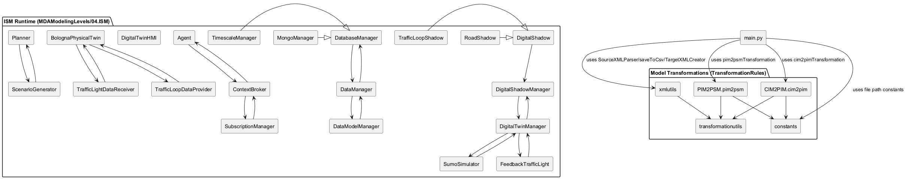
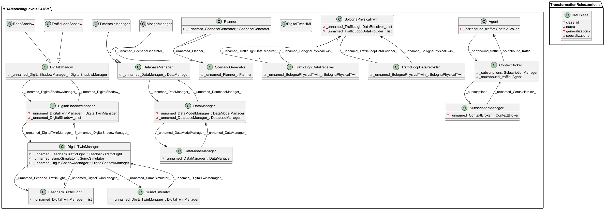
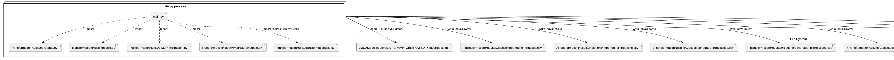

 

% 1 — System Overview
# SECTION 1 — System Overview

This section introduces the system’s purpose, scope, and main capabilities, strictly derived from the repository. It provides a high-level understanding of what the software does, how it is structured, and which artifacts it produces, enabling validation by team members familiar with the codebase.

## Purpose and Scope

The repository implements a model-driven engineering (MDE/MDA) toolchain tailored to a mobility digital twin domain. It automates transformations from a Computation Independent Model (CIM) to a Platform Independent Model (PIM), and then to a Platform Specific Model (PSM), and renders the resulting models in both CSV and Visual Paradigm–compatible XML formats. The codebase also contains an Implementation/Integration Specific Model (ISM) set of Python classes representing the PSM/implementation concepts (e.g., FIWARE Context Broker, storage managers, simulation and planning components) as Python stubs.

The scope is the complete end-to-end transformation pipeline plus model-to-diagram rendering utilities:
- Ingestion of a CIM model exported as Visual Paradigm XML.
- Transformation to PIM: introducing Digital Representation, Digital Model, Digital Shadow, adapters for sensors/actuators, service feedback, and data management.
- Transformation to PSM: materializing FIWARE-inspired context management, storage managers, SUMO integration, service orchestration, and data integration.
- Generation of CSV and Visual Paradigm–style XML artifacts for PIM and PSM.
- Provision of ISM Python class stubs mirroring key PSM elements.

## What the System Does

At runtime, the pipeline is orchestrated by main.py:
1. It parses a CIM Visual Paradigm XML file (path configured in constants) into in-memory pandas DataFrames (classes and relationships).
2. It applies TransformationRules/CIM2PIM/cim2pim.py to generate PIM classes and relations. This stage:
   - Maps physical entities to PhysicalTwin classes.
   - Derives Digital models from physical entities and Digital shadows from temporal entities.
   - Introduces DigitalModel, DigitalModelManager, DigitalShadow, DigitalShadowManager, DigitalTwinManager, DigitalRepresentation.
   - Constructs adapters and providers/receivers:
     - For sensors: DataProvider, P2DAdapter children, and a shared Adapter supertype.
     - For actuators: DataReceiver, D2PAdapter children, and reuse of Adapter supertype.
   - Integrates ServiceManager and Feedback providers composed under it, and wires usage to DigitalTwinManager and DataReceivers.
   - Integrates DataManager and DataModel, and wires usage from ServiceManager, DigitalTwinManager, and Adapter.
   - Guarantees uniqueness via random IDs and removes duplicate classes and relations by name/type.
3. It persists the PIM model to CSV and renders a Visual Paradigm–compatible XML project for the PIM diagram via TransformationRules/xmlutils.py.
4. It transforms PIM to PSM using TransformationRules/PIM2PSM/pim2psm.py. This stage:
   - Creates SumoSimulator and links it to DigitalTwinManager via aggregation.
   - Builds FIWARE-like context: ContextBroker, SubscriptionManager, MongoManager, TimescaleManager, with:
     - Association ContextBroker–SubscriptionManager.
     - Usage ContextBroker→MongoManager.
   - Projects PhysicalTwin, DataProviders, and DataReceivers; introduces an Agent; links:
     - Agent—ContextBroker association.
     - DataProvider→Agent usage; Agent→DataReceiver usage.
     - Agent→MongoManager usage.
   - Adds service orchestration: ScenarioGenerator, Planner, DigitalTwinHMI and wires:
     - DigitalTwinHMI→DigitalTwinManager usage.
     - DigitalTwinManager→Planner usage; Planner—ScenarioGenerator aggregation.
     - ScenarioGenerator→SumoSimulator usage.
     - Feedback classes under DigitalTwinManager via containment.
   - Integrates data: DataManager, DataModelManager, DatabaseManager; establishes:
     - Generalization DatabaseManager→MongoManager, DatabaseManager→TimescaleManager.
     - ContextBroker→DataModelManager usage.
     - DataManager aggregations to DataModelManager and DatabaseManager.
     - DigitalTwinManager→DataManager usage.
5. It persists the PSM model to CSV and renders a Visual Paradigm–compatible XML project for the PSM diagram.

All transforms operate on pandas DataFrames and use helper utilities (TransformationRules/transformationutils.py) for ID generation, relationship search, and name-based selection. XML parsing and generation is implemented in TransformationRules/xmlutils.py using the Python standard library (xml.etree.ElementTree, xml.dom.minidom) and deterministic structure expected by Visual Paradigm.

## Repository Contents and Execution Boundary

The repository is organized around four concerns:
- Transformation rules: TransformationRules/CIM2PIM and TransformationRules/PIM2PSM contain the model transformation logic.
- Utilities: TransformationRules/xmlutils.py and TransformationRules/transformationutils.py provide XML parsing/generation, diagram shape/connector synthesis, ID management, and lookup functions.
- Configuration: TransformationRules/constants.py centralizes file paths and class name anchors used by rules.
- ISM stubs: MDAModelingLevels/04.ISM contains Python class skeletons that mirror PSM/implementation concepts. These classes are not executed by main.py; instead, they ground the PSM concepts and support validation of naming/relationships.

The system is file-driven. It does not perform network I/O nor invoke external services; it reads and writes local files and uses only the Python standard library and pandas.

## Key Features Evident from the Codebase

The following characteristics are directly implemented and verifiable in the code:
- End-to-end MDA pipeline with two transformation stages (CIM→PIM, PIM→PSM).
- Deterministic structure with non-deterministic identifiers: class and relation IDs are randomly generated and guaranteed unique per run; duplicates by semantic identity are removed.
- Model semantics:
  - Generalization, Aggregation, Composition, Association, and Usage are modeled and exported.
  - Adapters and providers/receivers bridge physical systems (sensors, actuators) and digital representation.
  - Digital twin orchestration includes DigitalTwinManager, ScenarioGenerator, Planner, SUMO, and HMI.
  - Data management includes DataManager, DataModelManager, DatabaseManager hierarchy (MongoManager, TimescaleManager).
  - FIWARE-inspired context with ContextBroker and SubscriptionManager, plus usage of MongoManager.
- Visual Paradigm export:
  - CSV outputs for classes and relations at each stage.
  - Project XML generation with classes, relationship containers, shapes, connectors, and basic layout.
- Strict, name-based mapping:
  - All transformations are anchored to configured class names in constants.py (e.g., RealCity, PhysicalEntity, Sensor, Actuator, DigitalModel, PhysicalTwin, Adapter).

## Implementation-Specific Model (ISM) Inventory

The ISM package defines all PSM/implementation concepts as Python classes with explicit relationships encoded via attributes and inheritance. This list is complete:

- Agent.Agent: references ContextBroker via _northbound_traffic.
- BolognaPhysicalTwin.BolognaPhysicalTwin: holds collections of TrafficLightDataReceiver and TrafficLoopDataProvider.
- ContextBroker.ContextBroker: references SubscriptionManager via _subscriptions and Agent via _southbound_traffic.
- DatabaseManager.DatabaseManager: references DataManager via _unnamed_DataManager_.
- DataManager.DataManager: references DataModelManager and DatabaseManager.
- DataModelManager.DataModelManager: references DataManager.
- DigitalShadow.DigitalShadow: references DigitalShadowManager.
- DigitalShadowManager.DigitalShadowManager: references DigitalTwinManager and holds a collection of DigitalShadow.
- DigitalTwinHMI.DigitalTwinHMI: defined as a placeholder class.
- DigitalTwinManager.DigitalTwinManager: references FeedbackTrafficLight, SumoSimulator, and DigitalShadowManager.
- FeedbackTrafficLight.FeedbackTrafficLight: holds a collection of DigitalTwinManager.
- MongoManager.MongoManager: inherits DatabaseManager.
- Planner.Planner: references ScenarioGenerator.
- RoadShadow.RoadShadow: inherits DigitalShadow.
- ScenarioGenerator.ScenarioGenerator: references Planner.
- SubscriptionManager.SubscriptionManager: references ContextBroker.
- SumoSimulator.SumoSimulator: references DigitalTwinManager.
- TimescaleManager.TimescaleManager: inherits DatabaseManager.
- TrafficLightDataReceiver.TrafficLightDataReceiver: references BolognaPhysicalTwin.
- TrafficLoopDataProvider.TrafficLoopDataProvider: references BolognaPhysicalTwin.
- TrafficLoopShadow.TrafficLoopShadow: inherits DigitalShadow.

These names and relationships match the entities created within the PSM transformation, providing a cross-check between the transformation outputs and the ISM stubs.

## Inputs, Outputs, and Execution

The execution entry point is main.py:main(). Paths and naming anchors are set in TransformationRules/constants.py:
- Input:
  - CIM Visual Paradigm XML: ./MDAModelingLevels/01.CIM/VP_GENERATED_XML/project.xml
- Generated PIM artifacts:
  - CSV classes: ./TransformationResults/Classes/generated_pimclasses.csv
  - CSV relations: ./TransformationResults/Relations/generated_pimrelations.csv
  - Visual Paradigm XML: ./MDAModelingLevels/02.PIM/M2MT_GENERATED_XML/pim.xml
- Generated PSM artifacts:
  - CSV classes: ./TransformationResults/Classes/generated_psmclasses.csv
  - CSV relations: ./TransformationResults/Relations/generated_psmrelations.csv
  - Visual Paradigm XML: ./MDAModelingLevels/03.PSM/M2MT_GENERATED_XML/psm.xml

The code uses pandas for in-memory model manipulation and xml.etree.ElementTree/minidom for XML serialization. No additional external services, frameworks, or libraries are invoked.

## Notable Assumptions and Constraints

The following behaviors are inherent in the current implementation:
- ID generation is random per run; outputs are not stable across executions unless input classes contain stable IDs that constrain derived lengths. Deduplication by semantic keys reduces, but does not eliminate, ordering differences.
- Transformations rely on strict name matching configured in constants.py (e.g., “Sensor”, “Actuator”, “DigitalModel”, “DigitalTwinManager”). Missing or differently named classes in the CIM input will reduce or skip parts of the pipeline, as coded with guard conditions and warnings.
- The ISM classes are structural stubs only; they encode relationships through attributes and inheritance but are not executed by main.py.

This overview reflects exactly what is implemented, enabling stakeholders to understand the pipeline, validate naming and relationships, and locate generated artifacts for inspection.

% 2 — Architectural Context
## 2. Architectural Context

This section summarizes the external context of the transformation tool implemented in this repository. It identifies external systems, interfaces and data artifacts the code actually touches at runtime, and clarifies additional systems that are only represented as model elements in generated PIM/PSM outputs. The content is derived strictly from the code and configuration paths visible in the repository.

### External Systems

- Local file system
  The tool reads and writes XML and CSV files in the project workspace (e.g., under ./MDAModelingLevels, ./TransformationResults). All transformations are file-based; there are no network calls.

- Visual Paradigm UML project XML (input format)
  The function TransformationRules.xmlutils.SourceXMLParser consumes a Visual Paradigm “UML 2.x, simple XML” file at the configured path ./MDAModelingLevels/01.CIM/VP_GENERATED_XML/project.xml. The XML schema elements used include Project, Models, Class, Association, Generalization, Usage, and related sub-elements.

- Systems represented in generated models only (no runtime integration)
  Names such as ContextBroker, SubscriptionManager, MongoManager, TimescaleManager, SumoSimulator, Agent, DigitalTwinManager, DigitalTwinHMI, Planner, ScenarioGenerator appear in transformation rules (TransformationRules/PIM2PSM/pim2psm.py) and in reference stubs (MDAModelingLevels/04.ISM). These are emitted as PSM classes and relationships to reflect target-platform concepts (e.g., FIWARE, MongoDB, TimescaleDB, SUMO) but are not invoked or connected at runtime by this codebase.

### APIs / Interfaces

- Command-line entry point
  Running python main.py executes the end-to-end pipeline: parse CIM XML, persist imported CIM as CSV, compute PIM and PSM DataFrames, persist generated CSVs, and emit PIM/PSM Visual Paradigm XML.

- DataFrame-based transformation contracts
  The core transformations operate on pandas.DataFrame inputs/outputs with explicit schemas:
  - Classes DataFrame: columns ['Class ID', 'Class Name'].
  - Relations DataFrame: columns ['Relationship Type', 'From Class ID', 'From Class Name', 'To Class ID', 'To Class Name', 'Aggregation'] where Aggregation can be absent or None for some flows.
  Functions:
  - TransformationRules.CIM2PIM.cim2pim.cim2pimTransformation(cimClasses, cimRelations) -> (pimClasses, pimRelations)
  - TransformationRules.PIM2PSM.pim2psm.pim2psmTransformation(pimClasses, pimRelations) -> (psmClasses, psmRelations)

- XML parsing and generation interface
  - TransformationRules.xmlutils.SourceXMLParser(xmlPath) -> (dfClasses, dfRelationships) parses Visual Paradigm XML using xml.etree.ElementTree and xml.dom.minidom.
  - TransformationRules.xmlutils.TargetXMLCreator(outputXmlPath, author, projectName, classDiagramName, inputClasses, inputRelations) writes a Visual Paradigm-compatible “simple” XML project with classes, relationships, class diagram, shapes, and connectors derived from the provided DataFrames.

- CSV persistence interface
  - TransformationRules.xmlutils.saveToCsv(classesDf, relationsDf, classesPath, relationsPath) writes tabular artifacts to disk for inspection and traceability.

- Transformation utility functions (internal API)
  TransformationRules.transformationutils exposes helper functions used throughout the rules (e.g., generateId, findGeneralizationChildClasses, findClassesByPartialName, getExistingIds, getIdLength). These functions define the internal contract for ID generation, filtering, and lookups across the DataFrames.

- Python standard and third-party libraries
  - pandas (tabular transformations and concatenations).
  - xml.etree.ElementTree and xml.dom.minidom (XML parsing and writing).
  - random and string (pseudo-random ID generation).
  - os (filesystem operations).

### Data Sources

- Primary input
  - CIM_VP_XML_FILE_PATH: ./MDAModelingLevels/01.CIM/VP_GENERATED_XML/project.xml (Visual Paradigm UML 2.x “simple XML”).

- Intermediate and generated artifacts (written by the tool)
  - CIM_IMPORTED_CLASSES_FILE_PATH: ./TransformationResults/Classes/imported_cimclasses.csv
  - CIM_IMPORTED_RELATIONS_FILE_PATH: ./TransformationResults/Relations/imported_cimrelations.csv
  - PIM_GENERATED_CLASSES_FILE_PATH: ./TransformationResults/Classes/generated_pimclasses.csv
  - PIM_GENERATED_RELATIONS_FILE_PATH: ./TransformationResults/Relations/generated_pimrelations.csv
  - PIM_M2MT_XML_FILE_PATH: ./MDAModelingLevels/02.PIM/M2MT_GENERATED_XML/pim.xml
  - PIM_VP_XML_FILE_PATH: ./MDAModelingLevels/02.PIM/VP_GENERATED_XML/project.xml (target location; generation path used by TargetXMLCreator is PIM_M2MT_XML_FILE_PATH)
  - PSM_GENERATED_CLASSES_FILE_PATH: ./TransformationResults/Classes/generated_psmclasses.csv
  - PSM_GENERATED_RELATIONS_FILE_PATH: ./TransformationResults/Relations/generated_psmrelations.csv
  - PSM_M2MT_XML_FILE_PATH: ./MDAModelingLevels/03.PSM/M2MT_GENERATED_XML/psm.xml
  - PSM_VP_XML_FILE_PATH: ./MDAModelingLevels/03.PSM/VP_GENERATED_XML/project.xml (target location; generation path used by TargetXMLCreator is PSM_M2MT_XML_FILE_PATH)

- Determinism note
  IDs for generated classes and relationships are produced via random.choices, so outputs are non-deterministic across runs unless the random module is seeded externally.

### Users / Actors

- CLI operator (developer or integrator)
  A user invokes the transformation pipeline by executing main.py. No interactive prompts or GUI are present; the process is fully automated based on file paths in TransformationRules/constants.py.

- No runtime end-users
  Although classes like DigitalTwinHMI, Agent, ContextBroker, etc., are present as stubs or appear in generated PSM models, they do not correspond to interactive users in this codebase and are not executed at runtime.

% 2.1 — Architectural Context – Use Case Diagram
# Section 2.1 — Architectural Context – Use Case Diagram

This section presents the architectural context of the codebase as a set of externally observable use cases derived strictly from the implemented orchestration in main.py and the transformation utilities. The system is a batch model-transformation tool that imports a CIM model from a Visual Paradigm XML file, transforms it into a PIM and PSM, and persists both intermediate and final artefacts (CSV and XML). The use cases below reflect only executable behaviors and file interactions present in the source code, without introducing any actors or behaviors not evidenced by the implementation.

Figure 2.1 shows the use case diagram of the Model Transformation Tool with its single external actor, the file system, through which all inputs are read and outputs are written.

Figure 2.1 — Use Case Diagram for Model Transformation Tool (PlantUML source: section-2-1-use-case-diagram.puml)

## Implementation-to-Use-Case Mapping

The following table maps each use case to its concrete implementation elements and file artefacts, as defined in main.py and TransformationRules/constants.py. This enables validation against the code by tracing function calls and constants used.

| Use Case | Implemented By | Input | Output |
|---|---|---|---|
| Import CIM VP XML (SourceXMLParser) | TransformationRules.xmlutils.SourceXMLParser | CIM_VP_XML_FILE_PATH | In-memory DataFrames: imported_cimClasses, imported_cimRelations |
| Persist imported CIM CSV (saveToCsv - CIM) | TransformationRules.xmlutils.saveToCsv | imported_cimClasses, imported_cimRelations | CIM_IMPORTED_CLASSES_FILE_PATH, CIM_IMPORTED_RELATIONS_FILE_PATH |
| Transform CIM to PIM (cim2pimTransformation) | TransformationRules.CIM2PIM.cim2pim.cim2pimTransformation | imported_cimClasses, imported_cimRelations | generated_pimClasses, generated_pimRelations |
| Persist generated PIM CSV (saveToCsv - PIM) | TransformationRules.xmlutils.saveToCsv | generated_pimClasses, generated_pimRelations | PIM_GENERATED_CLASSES_FILE_PATH, PIM_GENERATED_RELATIONS_FILE_PATH |
| Generate PIM XML (TargetXMLCreator) | TransformationRules.xmlutils.TargetXMLCreator | generated_pimClasses, generated_pimRelations | PIM_M2MT_XML_FILE_PATH |
| Transform PIM to PSM (pim2psmTransformation) | TransformationRules.PIM2PSM.pim2psm.pim2psmTransformation | generated_pimClasses, generated_pimRelations | generated_psmClasses, generated_psmRelations |
| Persist generated PSM CSV (saveToCsv - PSM) | TransformationRules.xmlutils.saveToCsv | generated_psmClasses, generated_psmRelations | PSM_GENERATED_CLASSES_FILE_PATH, PSM_GENERATED_RELATIONS_FILE_PATH |
| Generate PSM XML (TargetXMLCreator) | TransformationRules.xmlutils.TargetXMLCreator | generated_psmClasses, generated_psmRelations | PSM_M2MT_XML_FILE_PATH |

Notes:
- All file paths are defined in TransformationRules/constants.py and are passed explicitly in main.py.
- No interactive user actor exists in the code. The only external interaction boundary evidenced by the implementation is the file system for reading and writing artefacts.
- The use cases reflect only the top-level orchestration in main.py; lower-level transformation steps (e.g., rule functions inside cim2pim and pim2psm) are internal to those use cases.

% 3 — Containers
## 3. Containers

This section identifies the concrete runtime containers that materialize when executing the system as implemented in the provided codebase. The system is a single-process, batch-style Python application that reads a CIM UML XML file, performs deterministic transformations to derive PIM and PSM models, and emits CSV and Visual Paradigm–compatible XML artifacts. There are no networked services, databases, or external runtimes instantiated by the code. All transformation functionality resides in-process, and persistence is via the local file system.

| Container | Responsibility | Technology | Communication |
|---|---|---|---|
| Model Transformation CLI (main.py) | Orchestrates the end-to-end pipeline: parses CIM UML XML into DataFrames; runs CIM→PIM and PIM→PSM transformations; saves intermediate CSVs and final Visual Paradigm–compatible XML artifacts for PIM and PSM. Internally coordinates TransformationRules.xmlutils, TransformationRules.CIM2PIM.cim2pim, and TransformationRules.PIM2PSM.pim2psm modules. | Python 3.x; pandas; xml.etree.ElementTree; Python standard library (os, random, string, datetime) | File I/O to read input CIM XML (constants.CIM_VP_XML_FILE_PATH) and write generated CSV/XML outputs (constants.PIM_* and PSM_* paths); in-process function calls only; no network protocols |
| Artifact Store (Local File System) | Stores input CIM XML and all generated artifacts: CSVs for imported/generated classes and relations; generated PIM and PSM XML project files. Paths are defined in TransformationRules/constants.py (CIM_VP_XML_FILE_PATH, PIM_M2MT_XML_FILE_PATH, PIM/PSM_GENERATED_*_FILE_PATH, PSM_M2MT_XML_FILE_PATH). | OS file system; CSV and XML file formats | File I/O via standard open/read/write performed by xml.etree.ElementTree and pandas; no DB or message broker; no network |

% 3.1 — Architecture Overview – Component Diagram
# Section 3.1 — Architecture Overview – Component Diagram

This section provides a precise, code-derived component overview of the repository. It consolidates the two main concerns implemented in the codebase: the model-transformation pipeline (CIM→PIM→PSM) and the Implementation Specific Model (ISM) runtime classes for a mobility digital twin. All components and their relationships are extracted from imports, attributes, inheritance and object references found in the provided source files. The diagram and the tables are intended to be directly verifiable by developers familiar with the codebase.

## Figure 3.1-1 — Component Diagram (complete)

Filename: figure-3.1-1-component-diagram.puml

## Component Inventory and Code-Derived Relationships

The following table enumerates all components present in the repository and summarizes the relationships strictly as implemented by imports, attributes, inheritance, and composition within the code.

| Component | Source File | Key Relationships (as implemented in code) |
|---|---|---|
| main.py | main.py | Uses TransformationRules.constants, TransformationRules.xmlutils.SourceXMLParser/saveToCsv/TargetXMLCreator, TransformationRules.CIM2PIM.cim2pim.cim2pimTransformation, TransformationRules.PIM2PSM.pim2psm.pim2psmTransformation. |
| CIM2PIM.cim2pim | TransformationRules/CIM2PIM/cim2pim.py | Depends on TransformationRules.transformationutils (generateId, getIdLength, getExistingIds, findGeneralizationChildClasses, findClassId, findRelatedRelationships, findClassesByPartialName); uses pandas; depends on TransformationRules.constants. |
| PIM2PSM.pim2psm | TransformationRules/PIM2PSM/pim2psm.py | Depends on TransformationRules.transformationutils (findGeneralizationChildClasses, generateId, findClassesByPartialName, getIdLength, getExistingIds); uses pandas; depends on TransformationRules.constants. |
| transformationutils | TransformationRules/transformationutils.py | Utility functions used by CIM2PIM, PIM2PSM, xmlutils; uses random, string, pandas. |
| constants | TransformationRules/constants.py | Centralized constants for file paths and class names; imported by main, CIM2PIM, PIM2PSM. |
| xmlutils | TransformationRules/xmlutils.py | Provides SourceXMLParser, saveToCsv, TargetXMLCreator; depends on TransformationRules.transformationutils (generateId, getExistingIds, getIdLength); uses xml.etree.ElementTree, xml.dom.minidom, pandas, os. |
| Agent | MDAModelingLevels/04.ISM/Agent.py | Depends on ContextBroker; holds _northbound_traffic: ContextBroker. |
| ContextBroker | MDAModelingLevels/04.ISM/ContextBroker.py | Depends on SubscriptionManager and Agent; holds _subscriptions: SubscriptionManager and _southbound_traffic: Agent. |
| SubscriptionManager | MDAModelingLevels/04.ISM/SubscriptionManager.py | Depends on ContextBroker; holds _unnamed_ContextBroker_: ContextBroker. |
| DigitalTwinManager | MDAModelingLevels/04.ISM/DigitalTwinManager.py | Depends on FeedbackTrafficLight, SumoSimulator, DigitalShadowManager; holds references to each. |
| FeedbackTrafficLight | MDAModelingLevels/04.ISM/FeedbackTrafficLight.py | Holds list of DigitalTwinManager instances. |
| SumoSimulator | MDAModelingLevels/04.ISM/SumoSimulator.py | Depends on DigitalTwinManager; holds _unnamed_DigitalTwinManager_. |
| DigitalShadowManager | MDAModelingLevels/04.ISM/DigitalShadowManager.py | Depends on DigitalTwinManager; holds _unnamed_DigitalTwinManager_ and a list of DigitalShadow. |
| DigitalShadow | MDAModelingLevels/04.ISM/DigitalShadow.py | Depends on DigitalShadowManager; holds _unnamed_DigitalShadowManager_. |
| RoadShadow | MDAModelingLevels/04.ISM/RoadShadow.py | Inherits DigitalShadow. |
| TrafficLoopShadow | MDAModelingLevels/04.ISM/TrafficLoopShadow.py | Inherits DigitalShadow. |
| BolognaPhysicalTwin | MDAModelingLevels/04.ISM/BolognaPhysicalTwin.py | Maintains collections of TrafficLightDataReceiver and TrafficLoopDataProvider references. |
| TrafficLightDataReceiver | MDAModelingLevels/04.ISM/TrafficLightDataReceiver.py | Depends on BolognaPhysicalTwin; holds _unnamed_BolognaPhysicalTwin_. |
| TrafficLoopDataProvider | MDAModelingLevels/04.ISM/TrafficLoopDataProvider.py | Depends on BolognaPhysicalTwin; holds _unnamed_BolognaPhysicalTwin_. |
| Planner | MDAModelingLevels/04.ISM/Planner.py | Depends on ScenarioGenerator; holds _unnamed_ScenarioGenerator_. |
| ScenarioGenerator | MDAModelingLevels/04.ISM/ScenarioGenerator.py | Depends on Planner; holds _unnamed_Planner_. |
| DataManager | MDAModelingLevels/04.ISM/DataManager.py | Depends on DataModelManager and DatabaseManager; holds references to both. |
| DataModelManager | MDAModelingLevels/04.ISM/DataModelManager.py | Depends on DataManager; holds _unnamed_DataManager_. |
| DatabaseManager | MDAModelingLevels/04.ISM/DatabaseManager.py | Depends on DataManager; holds _unnamed_DataManager_. |
| MongoManager | MDAModelingLevels/04.ISM/MongoManager.py | Inherits DatabaseManager. |
| TimescaleManager | MDAModelingLevels/04.ISM/TimescaleManager.py | Inherits DatabaseManager. |
| DigitalTwinHMI | MDAModelingLevels/04.ISM/DigitalTwinHMI.py | Declared; no attributes or imports. |

## Notes for Validation

This component view is based solely on the provided source code. The inter-component relationships reflect:

- Imports between modules.
- Attribute types and composition-like fields linking classes.
- Bidirectional dependencies where each side references the other.
- Inheritance relationships explicitly defined in class declarations.

No external systems beyond those imported in the repository are shown. The transformation pipeline and the ISM runtime are independent in this codebase; there are no imports from TransformationRules into the ISM package or vice versa, and main.py orchestrates only the transformation pipeline.

% 4 — Components
## 4. Components

This section enumerates all identifiable components present in the codebase and describes their roles and their static collaborations as evident from imports, inheritance, attribute references, and orchestration code. The table reflects only what is implemented in the repository, without inferring behavior beyond the source.

| Component | Responsibility | Interactions |
|---|---|---|
| MDAModelingLevels.04.ISM.Agent.Agent | Holds a reference to a ContextBroker instance for “northbound traffic.” No operational methods are implemented. | ["MDAModelingLevels.04.ISM.ContextBroker.ContextBroker"] |
| MDAModelingLevels.04.ISM.BolognaPhysicalTwin.BolognaPhysicalTwin | Represents the physical twin for Bologna. Aggregates data receivers and data providers via lists; no methods are implemented. | ["MDAModelingLevels.04.ISM.TrafficLightDataReceiver.TrafficLightDataReceiver", "MDAModelingLevels.04.ISM.TrafficLoopDataProvider.TrafficLoopDataProvider"] |
| MDAModelingLevels.04.ISM.ContextBroker.ContextBroker | Context broker that maintains a subscription manager and a southbound Agent reference. | ["MDAModelingLevels.04.ISM.SubscriptionManager.SubscriptionManager", "MDAModelingLevels.04.ISM.Agent.Agent"] |
| MDAModelingLevels.04.ISM.DatabaseManager.DatabaseManager | Database management abstraction holding a reference to DataManager. No methods are implemented. | ["MDAModelingLevels.04.ISM.DataManager.DataManager"] |
| MDAModelingLevels.04.ISM.DataManager.DataManager | Coordinates data concerns by holding references to DataModelManager and DatabaseManager. | ["MDAModelingLevels.04.ISM.DataModelManager.DataModelManager", "MDAModelingLevels.04.ISM.DatabaseManager.DatabaseManager"] |
| MDAModelingLevels.04.ISM.DataModelManager.DataModelManager | Data model coordination placeholder with a back-reference to DataManager. | ["MDAModelingLevels.04.ISM.DataManager.DataManager"] |
| MDAModelingLevels.04.ISM.DigitalShadow.DigitalShadow | Base digital shadow entity holding a reference to DigitalShadowManager. | ["MDAModelingLevels.04.ISM.DigitalShadowManager.DigitalShadowManager"] |
| MDAModelingLevels.04.ISM.DigitalShadowManager.DigitalShadowManager | Manages digital shadows (list) and maintains a link to DigitalTwinManager. | ["MDAModelingLevels.04.ISM.DigitalTwinManager.DigitalTwinManager", "MDAModelingLevels.04.ISM.DigitalShadow.DigitalShadow"] |
| MDAModelingLevels.04.ISM.DigitalTwinHMI.DigitalTwinHMI | Placeholder for a Digital Twin HMI. No attributes or methods implemented. | [] |
| MDAModelingLevels.04.ISM.DigitalTwinManager.DigitalTwinManager | Aggregates FeedbackTrafficLight, SumoSimulator, and DigitalShadowManager references for twin orchestration. | ["MDAModelingLevels.04.ISM.FeedbackTrafficLight.FeedbackTrafficLight", "MDAModelingLevels.04.ISM.SumoSimulator.SumoSimulator", "MDAModelingLevels.04.ISM.DigitalShadowManager.DigitalShadowManager"] |
| MDAModelingLevels.04.ISM.FeedbackTrafficLight.FeedbackTrafficLight | Maintains a list of back-references to DigitalTwinManager; no logic implemented. | ["MDAModelingLevels.04.ISM.DigitalTwinManager.DigitalTwinManager"] |
| MDAModelingLevels.04.ISM.MongoManager.MongoManager | Specialized DatabaseManager (inheritance) for MongoDB; no additional logic implemented. | ["MDAModelingLevels.04.ISM.DatabaseManager.DatabaseManager"] |
| MDAModelingLevels.04.ISM.Planner.Planner | Holds a reference to ScenarioGenerator; no operational methods implemented. | ["MDAModelingLevels.04.ISM.ScenarioGenerator.ScenarioGenerator"] |
| MDAModelingLevels.04.ISM.RoadShadow.RoadShadow | Specialized DigitalShadow (inheritance); no additional logic implemented. | ["MDAModelingLevels.04.ISM.DigitalShadow.DigitalShadow"] |
| MDAModelingLevels.04.ISM.ScenarioGenerator.ScenarioGenerator | Holds a reference to Planner; no operational methods implemented. | ["MDAModelingLevels.04.ISM.Planner.Planner"] |
| MDAModelingLevels.04.ISM.SubscriptionManager.SubscriptionManager | Holds a back-reference to ContextBroker; no operational methods implemented. | ["MDAModelingLevels.04.ISM.ContextBroker.ContextBroker"] |
| MDAModelingLevels.04.ISM.SumoSimulator.SumoSimulator | Holds a reference to DigitalTwinManager; no simulation logic implemented here. | ["MDAModelingLevels.04.ISM.DigitalTwinManager.DigitalTwinManager"] |
| MDAModelingLevels.04.ISM.TimescaleManager.TimescaleManager | Specialized DatabaseManager (inheritance) for TimescaleDB; no additional logic implemented. | ["MDAModelingLevels.04.ISM.DatabaseManager.DatabaseManager"] |
| MDAModelingLevels.04.ISM.TrafficLightDataReceiver.TrafficLightDataReceiver | Data receiver holding a reference to BolognaPhysicalTwin; no handling logic implemented. | ["MDAModelingLevels.04.ISM.BolognaPhysicalTwin.BolognaPhysicalTwin"] |
| MDAModelingLevels.04.ISM.TrafficLoopDataProvider.TrafficLoopDataProvider | Data provider holding a reference to BolognaPhysicalTwin; no handling logic implemented. | ["MDAModelingLevels.04.ISM.BolognaPhysicalTwin.BolognaPhysicalTwin"] |
| MDAModelingLevels.04.ISM.TrafficLoopShadow.TrafficLoopShadow | Specialized DigitalShadow (inheritance); no additional logic implemented. | ["MDAModelingLevels.04.ISM.DigitalShadow.DigitalShadow"] |
| TransformationRules.CIM2PIM.cim2pim | Module implementing the CIM-to-PIM transformation pipeline. Creates PIM classes and relations (physical twin mapping, digital models/shadows, sensors, actuators, services, and data manager integration) using pandas DataFrames and utilities. | ["TransformationRules.transformationutils", "TransformationRules.constants", "main"] |
| TransformationRules.PIM2PSM.pim2psm | Module implementing the PIM-to-PSM transformation. Produces PSM classes/relations (SumoSimulator, FIWARE ContextBroker stack, Agent, adapters, service layer, data integration) using pandas and utilities. | ["TransformationRules.transformationutils", "TransformationRules.constants", "main"] |
| TransformationRules.constants | Centralized configuration constants (file paths and canonical class-name tokens) consumed by the pipeline. | ["main", "TransformationRules.CIM2PIM.cim2pim", "TransformationRules.PIM2PSM.pim2psm"] |
| TransformationRules.transformationutils | Utility functions for ID generation, DataFrame queries (find classes/relations by name/type), and helper lookups used across transformation and XML modules. | ["TransformationRules.CIM2PIM.cim2pim", "TransformationRules.PIM2PSM.pim2psm", "TransformationRules.xmlutils"] |
| TransformationRules.xmlutils.UMLClass | Lightweight data structure representing a UML class during XML parsing, with fields for IDs, names, and relation lists. | [] |
| TransformationRules.xmlutils | Module for parsing source VP XML into DataFrames, generating/saving target XML (M2MT) and CSV outputs, and rendering diagram elements (classes, relationships, connectors). | ["TransformationRules.transformationutils", "main"] |
| main | Orchestrates the end-to-end workflow: parses CIM XML, persists CSVs, runs CIM→PIM and PIM→PSM transformations, and generates PIM and PSM XML artifacts. | ["TransformationRules.constants", "TransformationRules.xmlutils", "TransformationRules.CIM2PIM.cim2pim", "TransformationRules.PIM2PSM.pim2psm"] |

% 5 — Code-Level View
# Section 5 — Code-Level View

This section describes how the architecture maps to concrete source code elements in the repository. It identifies the main entry point, details all key modules, files, classes, and functions, and highlights any recognizable implementation patterns. The content is derived strictly from the codebase provided and is intended to be verifiable by developers familiar with the project.

## 5.1 Source Tree and Key Directories

The repository is organized around two main areas:

- TransformationRules: Implements the executable transformation pipeline for MDA (CIM -> PIM -> PSM), including XML parsing and generation utilities, transformation rulesets, and shared utilities/constants.
- MDAModelingLevels/04.ISM: Defines Python classes that mirror the platform-specific model (PSM) entities (e.g., Agent, ContextBroker, DigitalTwinManager). These serve as structural representations and are not invoked by the transformation pipeline.

Top-level orchestrator:
- main.py: Orchestrates the end-to-end pipeline using the TransformationRules modules.

## 5.2 Main Entry Point

The system is executed via the Python module main.py:

- Entry function: main()
- Guard: if __name__ == "__main__": main()
- Responsibilities:
  1. Parse CIM model from Visual Paradigm XML (SourceXMLParser).
  2. Persist imported CIM classes and relations to CSV (saveToCsv).
  3. Transform CIM to PIM (cim2pimTransformation) and persist/save XML view (TargetXMLCreator).
  4. Transform PIM to PSM (pim2psmTransformation) and persist/save XML view (TargetXMLCreator).

Execution order matches the intended MDA pipeline and can be validated by the printed PSM DataFrames and the generated CSV/XML artifacts indicated by constants.

## 5.3 Modules, Classes, and Functions

This subsection enumerates all modules and their concrete elements, responsibilities, and notable dependencies to support traceability.

### 5.3.1 main.py

- Functions:
  - main(): Orchestrates parsing, transformations (CIM->PIM->PSM), CSV persistence, and XML generation.
- Imports:
  - TransformationRules.constants (all file path and naming constants).
  - TransformationRules.xmlutils: SourceXMLParser, saveToCsv, TargetXMLCreator.
  - TransformationRules.CIM2PIM.cim2pim: cim2pimTransformation.
  - TransformationRules.PIM2PSM.pim2psm: pim2psmTransformation.

### 5.3.2 TransformationRules/constants.py

- Purpose: Centralized configuration and file paths for input/output artifacts and diagram metadata.
- Constants (complete list):
  - CIM_VP_XML_FILE_PATH
  - CIM_IMPORTED_CLASSES_FILE_PATH
  - CIM_IMPORTED_RELATIONS_FILE_PATH
  - CIM_REAL_TWIN_CLASS_NAME
  - PHYSICAL_ENTITY_CLASS_NAME
  - TEMPORAL_ENTITY_CLASS_NAME
  - SENSOR_ENTITY_CLASS_NAME
  - ACTUATOR_ENTITY_CLASS_NAME
  - PIM_M2MT_XML_FILE_PATH
  - PIM_VP_XML_FILE_PATH
  - PIM_PROJECT_NAME
  - PIM_PROJECT_AUTHOR
  - PIM_CLASS_DIAGRAM_NAME
  - PIM_GENERATED_CLASSES_FILE_PATH
  - PIM_GENERATED_RELATIONS_FILE_PATH
  - PIM_DIGITAL_RELATED_CLASS_NAME
  - PIM_DIGITAL_MODEL_RELATED_CLASS_NAME
  - PIM_MODEL_MANAGER_CLASS_NAME
  - PIM_TWIN_MANAGER_CLASS_NAME
  - PIM_REAL_TWIN_CLASS_NAME
  - PIM_DATA_PROVIDER_CLASS_NAME
  - PIM_DATA_RECEIVER_CLASS_NAME
  - PIM_ADAPTER_CLASS_NAME
  - PSM_M2MT_XML_FILE_PATH
  - PSM_VP_XML_FILE_PATH
  - PSM_PROJECT_NAME
  - PSM_PROJECT_AUTHOR
  - PSM_CLASS_DIAGRAM_NAME
  - PSM_GENERATED_CLASSES_FILE_PATH
  - PSM_GENERATED_RELATIONS_FILE_PATH

### 5.3.3 TransformationRules/transformationutils.py

- Purpose: Shared utilities for ID generation and DataFrame queries.
- External dependencies: random, string, pandas.
- Functions (complete list):
  - generateId(existingIds, length=10)
  - getIdLength(classesDf)
  - getExistingIds(classesDf)
  - findGeneralizationChildClasses(relationsDf, parentClassId)
  - findClassId(dfClasses, className)
  - findRelatedRelationships(relationsDf, classId)
  - findClassesByPartialName(classesDf, partialName)

### 5.3.4 TransformationRules/xmlutils.py

- Purpose: Parse Visual Paradigm XML (source) and construct XML models (target), including diagram elements and connectors; CSV persistence helpers.
- External dependencies: xml.etree.ElementTree (ET), xml.dom.minidom, pandas, os, datetime; internal utilities for ID handling.
- Classes:
  - UMLClass: Container for class id, name, and relationship placeholders.
- Functions (complete list):
  - generateTimestamp()
  - parseClasses(rootElement)
  - findAssociations(rootElement, classDict)
  - findGeneralizations(rootElement, classDict, relationshipList)
  - filterUnknownClasses(dataFrame)
  - SourceXMLParser(xmlFilePath)
  - saveToCsv(dfClasses, dfRelationships, classesFilePath, relationshipsFilePath)
  - generateXml(inputClasses, inputRelations, projectName, fileName)
  - saveXml(project, outputXmlPath)
  - prettify(element)
  - addStaticProjectOptions(projectInfo)
  - addStaticDataType(models, projectAuthor)
  - addUsageStereotype(projectAuthor, models, existingIDs, idLength)
  - addUsageRelation(projectAuthor, modelChildrenMCC, fromID, toID, usageShapeID, usageMasterIdRef, usageStereotypeIdRef)
  - addUsageRelationContainer(projectAuthor, modelChildren, pimRelations, pimClasses, usageStereotypeIdRef, existingIDs, idLength)
  - addAssociationRelation(projectAuthor, modelChildrenMCC, ...)
  - addAssociationRelationContainer(projectAuthor, modelChildren, pimRelations, pimClasses, existingIDs, idLength)
  - addGeneralizationRelation(projectAuthor, modelChildrenMCC, fromID, fromName, toID, toName, generalizationShapeID, generalizationMasterIdRef)
  - addGeneralizationRelationContainer(projectAuthor, modelChildren, pimRelations, pimClasses, existingIDs, idLength)
  - addDependencyRelation(projectAuthor, modelChildrenMCC, fromID, toID, dependencyShapeID, dependencyMasterIdRef)
  - addDependencyRelationContainer(projectAuthor, modelChildren, pimRelations, pimClasses, existingIDs, idLength)
  - addClassElement(models, projectAuthor, pimClasses, pimRelations, existingIDs, IdLength)
  - addClassDiagram(diagrams, projectAuthor, classDiagramID, classDiagramName)
  - generateXYValues(pimClasses, pimRelations)
  - addClassShapes(shapes, pimClasses, pimRelations)
  - addSubElementsToConnector(connector_element, relation_type, from_x, from_y, to_x, to_y)
  - addConnectorsForRelations(connectors, pimRelations, pimClasses)
  - TargetXMLCreator(OutputXMLPath, projectAuthor, projectName, classDiagramName, inputClasses, inputRelations)
- Notes:
  - SourceXMLParser reads the CIM Visual Paradigm XML and produces DataFrames for classes and relationships.
  - TargetXMLCreator produces a full VP-compatible XML with shapes and connectors based on class/relation DataFrames.

### 5.3.5 TransformationRules/CIM2PIM/cim2pim.py

- Purpose: Rule-based transformation from CIM classes/relations to PIM classes/relations in pandas DataFrames.
- External dependencies: pandas; internal: transformationutils, constants.
- Top-level transformation:
  - cim2pimTransformation(cimClasses, cimRelations)
- Functions (complete list):
  - createPhysicalTwinClasses(childClasses, existingIds, idLength)
  - mapToPhysicalTwin(cimClasses, cimRelations, parentClassName)
  - searchPhysicalEntityClass(cimClasses, physicalEntityName)
  - searchPhysicalEntities(cimClasses, physicalEntityId, cimRelations)
  - createDigitalModels(cimClasses, cimRelations, existingIds, idLength)
  - addDigitalModel(existingIds, idLength)
  - addDigitalModelManager(existingIds, idLength)
  - createDigitalRelations(cimClasses, cimRelations, newPimClasses, pimRelations)
  - addGeneralizationModels(digitalModels, digitalModelID)
  - addAggregationModelManager(digitalModelID, digitalModelManagerId, pimRelations)
  - digitalizePhysicalEntity(cimClasses, cimRelations, pimClasses, pimRelations)
  - searchTemporalEntityClass(cimClasses)
  - searchTemporalEntities(cimClasses, temporalEntityId, cimRelations)
  - createDigitalShadows(cimClasses, cimRelations, existingIds, idLength)
  - addDigitalShadow(existingIds, idLength)
  - addDigitalShadowManager(existingIds, idLength)
  - addGeneralizationShadows(digitalShadows, digitalShadowId)
  - addAggregationManager(digitalShadowID, digitalShadowManagerId, pimRelations)
  - transformTemporalEntity(cimClasses, cimRelations, pimClasses, pimRelations)
  - addDigitalTwinManager(existingIds, idLength)
  - addDigitalRepresentation(existingIds, idLength)
  - addAggregationTwinManager(digitalTwinManagerId, digitalShadowManagerId, digitalModelManagerId, pimRelations)
  - addGeneralizationRepresentation(digitalRepresentationId, digitalShadowID, digitalModelID, pimRelations)
  - mergeShadowModelFlow(cimClasses, cimRelations, pimClasses, pimRelations)
  - searchSensorEntityClass(cimClasses)
  - searchSensorEntities(cimClasses, sensorEntityId, cimRelations)
  - addP2DAdapters(dataProviders, existingIds, idLength, pimClasses)
  - createDataProviders(cimClasses, cimRelations, existingIds, idLength)
  - addAdapter(existingIds, idLength)
  - addGeneralizationAdapters(adaptersList, adapterID, pimRelations)
  - addUseProviders(providersList, adaptersList, pimRelations)
  - addPhysicalTwinAggregation(pimClasses, dataProviders, pimRelations)
  - transformSensor(cimClasses, cimRelations, pimClasses, pimRelations)
  - searchActuatorEntityClass(cimClasses)
  - searchActuatorEntities(cimClasses, actuatorEntityId, cimRelations)
  - addD2PAdapters(dataReceivers, existingIds, idLength, pimClasses)
  - createDataReceivers(cimClasses, cimRelations, existingIds, idLength)
  - addUseReceivers(receiversList, adaptersList, pimRelations)
  - transformActuator(cimClasses, cimRelations, pimClasses, pimRelations)
  - addServiceManager(existingIds, idLength)
  - addFeedback(existingIds, idLength)
  - createFeedbackProviders(pimClasses, existingIds, idLength)
  - addAggregationFeedback(feedbackList, serviceId, pimRelations)
  - addUseService(serviceId, digitalTwinManagerId, pimRelations)
  - addUseFeedbackProviders(feedbackList, pimClasses, pimRelations)
  - integrateServiceFeedback(cimClasses, cimRelations, pimClasses, pimRelations)
  - addDataManager(existingIds, idLength)
  - addDataModel(existingIds, idLength)
  - addUseDataModel(dataModelId, dataManagerId, pimRelations)
  - addUseDataManager(dataManagerId, digitalTwinManagerId, serviceManagerId, adapterId, pimRelations)
  - integrateDataManager(pimClasses, pimRelations)
- Notes:
  - Uses non-deterministic ID generation (random) via generateId.
  - Deduplication occurs by class name and selected relation keys.

### 5.3.6 TransformationRules/PIM2PSM/pim2psm.py

- Purpose: Rule-based transformation from PIM to PSM, adding FIWARE/SUMO-specific elements and data integration.
- External dependencies: pandas; internal: transformationutils, constants.
- Top-level transformation:
  - pim2psmTransformation(pimClasses, pimRelations)
- Functions (complete list):
  - transformDigitalModel(pimClasses, pimRelations, psmRelations)
  - createFiwareContext(psmClasses, psmRelations)
  - transformAdapter(pimClasses, pimRelations, psmClasses, psmRelations)
  - transformService(pimClasses, pimRelations, psmClasses, psmRelations)
  - integrateData(pimClasses, pimRelations, psmClasses, psmRelations)
  - updateShadowRelation(pimClasses, pimRelations, psmClasses, psmRelations)  [stub returning inputs]
- Notes:
  - Introduces SumoSimulator and aggregates it with DigitalTwinManager at PSM.
  - Creates ContextBroker, SubscriptionManager, MongoManager, TimescaleManager and relates them (Association/Usage).
  - Adds Agent and associates it with the Broker and Mongo; connects to providers/receivers via Usage.
  - Adds Planner, ScenarioGenerator, DigitalTwinHMI, and Feedback-related classes under the DigitalTwinManager scope.

### 5.3.7 MDAModelingLevels/04.ISM

These classes define the PSM domain entities as Python classes. They are simple structural declarations with attributes typed to other classes and minimal or no behavior. Inheritance is used where evident from the PSM.

- Agent.py
  - Class Agent
    - Attributes: _northbound_traffic: ContextBroker = None
    - Imports: ContextBroker
- BolognaPhysicalTwin.py
  - Class BolognaPhysicalTwin
    - Attributes: _unnamed_TrafficLightDataReceiver_ (list), _unnamed_TrafficLoopDataProvider_ (list)
- ContextBroker.py
  - Class ContextBroker
    - Attributes: _subscriptions: SubscriptionManager = None; _southbound_traffic: Agent = None
    - Imports: SubscriptionManager, Agent
- DatabaseManager.py
  - Class DatabaseManager
    - Attributes: _unnamed_DataManager_: DataManager = None
- DataManager.py
  - Class DataManager
    - Attributes: _unnamed_DataModelManager_: DataModelManager = None; _unnamed_DatabaseManager_: DatabaseManager = None
- DataModelManager.py
  - Class DataModelManager
    - Attributes: _unnamed_DataManager_: DataManager = None
- DigitalShadow.py
  - Class DigitalShadow
    - Attributes: _unnamed_DigitalShadowManager_: DigitalShadowManager = None
- DigitalShadowManager.py
  - Class DigitalShadowManager
    - Attributes: _unnamed_DigitalTwinManager_: DigitalTwinManager = None; _unnamed_DigitalShadow_ (list)
- DigitalTwinHMI.py
  - Class DigitalTwinHMI (empty placeholder)
- DigitalTwinManager.py
  - Class DigitalTwinManager
    - Attributes: _unnamed_FeedbackTrafficLight_: FeedbackTrafficLight = None; _unnamed_SumoSimulator_: SumoSimulator = None; _unnamed_DigitalShadowManager_: DigitalShadowManager = None
- FeedbackTrafficLight.py
  - Class FeedbackTrafficLight
    - Attributes: _unnamed_DigitalTwinManager_ (list)
- MongoManager.py
  - Class MongoManager(DatabaseManager)  [inherits DatabaseManager]
- Planner.py
  - Class Planner
    - Attributes: _unnamed_ScenarioGenerator_: ScenarioGenerator = None
- RoadShadow.py
  - Class RoadShadow(DigitalShadow)  [inherits DigitalShadow]
- ScenarioGenerator.py
  - Class ScenarioGenerator
    - Attributes: _unnamed_Planner_: Planner = None
- SubscriptionManager.py
  - Class SubscriptionManager
    - Attributes: _unnamed_ContextBroker_: ContextBroker = None
- SumoSimulator.py
  - Class SumoSimulator
    - Attributes: _unnamed_DigitalTwinManager_: DigitalTwinManager = None
- TimescaleManager.py
  - Class TimescaleManager(DatabaseManager)  [inherits DatabaseManager]
- TrafficLightDataReceiver.py
  - Class TrafficLightDataReceiver
    - Attributes: _unnamed_BolognaPhysicalTwin_: BolognaPhysicalTwin = None
- TrafficLoopDataProvider.py
  - Class TrafficLoopDataProvider
    - Attributes: _unnamed_BolognaPhysicalTwin_: BolognaPhysicalTwin = None
- TrafficLoopShadow.py
  - Class TrafficLoopShadow(DigitalShadow)  [inherits DigitalShadow]

Notes and limitations (as implemented):
- In these files, imports use bare module names (e.g., import DataManager) and type hints reference the class names directly. Because this folder is not a Python package (no __init__.py) and types are not qualified (e.g., DataManager.DataManager), these type hints may not resolve at runtime. However, no behavior in the repository depends on executing these classes, and they serve as structural PSM mirrors.

## 5.4 Mapping Architecture Components to Code

The following mapping ties conceptual architectural responsibilities to specific code elements:

- Pipeline Orchestrator:
  - Code: main.py (main()).
  - Role: Controls end-to-end MDA flow and artifact generation.

- CIM Ingestion:
  - Code: TransformationRules/xmlutils.py (SourceXMLParser, parseClasses, findAssociations, findGeneralizations).
  - Role: Imports classes and relationships from the CIM Visual Paradigm XML into pandas DataFrames and saves them to CSV.

- CIM -> PIM Transformation:
  - Code: TransformationRules/CIM2PIM/cim2pim.py (cim2pimTransformation and all helper rule functions).
  - Role: Constructs PIM classes/relations, including DigitalRepresentation, DigitalModel/Manager, DigitalShadow/Manager, PhysicalTwin, sensor/actuator data providers/receivers, adapters, service/feedback, and data manager integration.

- PIM -> PSM Transformation:
  - Code: TransformationRules/PIM2PSM/pim2psm.py (pim2psmTransformation and all helper rule functions).
  - Role: Introduces platform-specific classes and relations for FIWARE (ContextBroker, SubscriptionManager, MongoManager, TimescaleManager), SumoSimulator, Agent, Planner, ScenarioGenerator, DigitalTwinHMI, and integrates data-layer relations and generalizations.

- XML/Diagram Generation:
  - Code: TransformationRules/xmlutils.py (TargetXMLCreator and subordinate functions).
  - Role: Builds M2MT-style XML with shapes and connectors for the PIM and PSM diagrams and persists to filesystem.

- Shared Utilities:
  - Code: TransformationRules/transformationutils.py.
  - Role: ID management and DataFrame search helpers used across transformations.

- PSM Structural Model (reference classes):
  - Code: MDAModelingLevels/04.ISM/*.py.
  - Role: Domain type skeletons mirroring PSM elements referenced in PIM2PSM rules (Agent, ContextBroker, DigitalTwinManager, MongoManager, TimescaleManager, SumoSimulator, etc.). Not invoked by the pipeline.

## 5.5 Cross-Module Dependencies

The transformation stages form a strict upstream-to-downstream dependency:

- main.py -> constants, xmlutils, cim2pim, pim2psm.
- cim2pim.py -> transformationutils, constants, pandas.
- pim2psm.py -> transformationutils, constants, pandas.
- xmlutils.py -> transformationutils (generateId/getExistingIds/getIdLength) and pandas.
- MDAModelingLevels/04.ISM classes are not imported into the pipeline; they cross-reference each other locally for type hints.

External libraries:
- pandas: DataFrames for classes and relations; concatenation, filtering, deduplication.
- xml.etree.ElementTree and xml.dom.minidom: XML build/pretty-print for VP-compatible files.
- os, datetime: Filesystem and timestamps.
- random/string: Non-deterministic ID generation.

## 5.6 Recognizable Design and Architectural Patterns

The code exhibits the following explicit, verifiable patterns:

- Layered MDA Transformation Pipeline:
  - Distinct phases (CIM ingestion, CIM->PIM, PIM->PSM, XML generation) encapsulated in separate modules. Each stage consumes and produces DataFrames in a unidirectional flow managed by main.py.

- Rule-based Transformation Functions:
  - Each transformation module groups granular rules (e.g., transformSensor, transformActuator, integrateDataManager, createFiwareContext) that are composed inside top-level transformation functions. This follows a functional pipeline style.

- Builder Pattern for XML Generation:
  - TargetXMLCreator orchestrates the construction of complex XML trees by composing helper functions that add classes, relationships, diagrams, shapes, and connectors.

- Data-oriented Programming:
  - All modeling elements are represented as pandas DataFrames with explicit schemas. Relations are manipulated through DataFrame operations; deduplication is consistently applied.

- Domain Model Stubs:
  - MDAModelingLevels/04.ISM contains skeletal classes reflecting PSM entities and inheritance relationships (e.g., MongoManager and TimescaleManager generalize DatabaseManager; RoadShadow/TrafficLoopShadow generalize DigitalShadow), matching names introduced by PIM2PSM rules.

No MVC or web-layered patterns are present. There is no service/process containerization or runtime messaging implemented; ContextBroker, Agent, and related classes are represented structurally only within the PSM and ISM class stubs.

## 5.7 Noteworthy Implementation Details and Constraints

- ID Generation Non-Determinism:
  - IDs are randomly generated without seeding. Repeated runs on the same input can yield different IDs; downstream merges rely on names and tuple keys for deduplication.

- Error Handling:
  - Primarily print-based warnings; a ValueError is raised if PhysicalTwin is not found during sensor/actuator integration (addPhysicalTwinAggregation). No try/except wrapping in the main orchestration.

- Import Semantics in ISM Classes:
  - In MDAModelingLevels/04.ISM, imports use simple module names and type hints reference unqualified class names. Without package initialization and proper imports (e.g., from .DataManager import DataManager), these annotations may not resolve at runtime. This does not affect the transformation pipeline.

- File System Outputs:
  - CSV and XML outputs are controlled by constants; directories are created on demand (saveToCsv, saveXml). Generation functions log to stdout.

## 5.8 How to Validate Against the Codebase

- Execute main.py to reproduce the pipeline:
  - Verify CSVs are created at constants-defined paths for CIM, PIM, and PSM.
  - Verify PIM and PSM XMLs exist and contain classes/relations named as constructed in cim2pim.py and pim2psm.py.
- Inspect DataFrames printed by main.py for PSM content matching pim2psm rules (presence of ContextBroker, SubscriptionManager, MongoManager, TimescaleManager, Agent, SumoSimulator, Planner, ScenarioGenerator, DigitalTwinHMI).
- Cross-check that structural classes under MDAModelingLevels/04.ISM correspond to the PSM class names (e.g., Agent, ContextBroker, DigitalTwinManager, MongoManager, TimescaleManager, SumoSimulator).

% 5.1 — Class Diagram
# SECTION 5.1 — Class Diagram

This section presents a complete and verifiable class diagram reflecting the implementation in the provided codebase. The diagram captures all classes, inheritance hierarchies, and explicit associations as defined by typed attributes and identifiable list-based references within the modules. The goal is to enable team members to validate the architecture directly against the source code and to provide both technical and non-technical stakeholders with a coherent view of the implemented structure.

Figure: section-5-1-class-diagram.puml — Class Diagram (ISM and Transformation Utilities)

## Classes Included

The following table enumerates every class defined in the repository, including their module path and inheritance information as implemented.

| Module | Class | Inherits |
|---|---|---|
| MDAModelingLevels/04.ISM/Agent.py | Agent | object |
| MDAModelingLevels/04.ISM/BolognaPhysicalTwin.py | BolognaPhysicalTwin | object |
| MDAModelingLevels/04.ISM/ContextBroker.py | ContextBroker | object |
| MDAModelingLevels/04.ISM/DatabaseManager.py | DatabaseManager | object |
| MDAModelingLevels/04.ISM/DataManager.py | DataManager | object |
| MDAModelingLevels/04.ISM/DataModelManager.py | DataModelManager | object |
| MDAModelingLevels/04.ISM/DigitalShadow.py | DigitalShadow | object |
| MDAModelingLevels/04.ISM/DigitalShadowManager.py | DigitalShadowManager | object |
| MDAModelingLevels/04.ISM/DigitalTwinHMI.py | DigitalTwinHMI | object |
| MDAModelingLevels/04.ISM/DigitalTwinManager.py | DigitalTwinManager | object |
| MDAModelingLevels/04.ISM/FeedbackTrafficLight.py | FeedbackTrafficLight | object |
| MDAModelingLevels/04.ISM/MongoManager.py | MongoManager | DatabaseManager |
| MDAModelingLevels/04.ISM/Planner.py | Planner | object |
| MDAModelingLevels/04.ISM/RoadShadow.py | RoadShadow | DigitalShadow |
| MDAModelingLevels/04.ISM/ScenarioGenerator.py | ScenarioGenerator | object |
| MDAModelingLevels/04.ISM/SubscriptionManager.py | SubscriptionManager | object |
| MDAModelingLevels/04.ISM/SumoSimulator.py | SumoSimulator | object |
| MDAModelingLevels/04.ISM/TimescaleManager.py | TimescaleManager | DatabaseManager |
| MDAModelingLevels/04.ISM/TrafficLightDataReceiver.py | TrafficLightDataReceiver | object |
| MDAModelingLevels/04.ISM/TrafficLoopDataProvider.py | TrafficLoopDataProvider | object |
| MDAModelingLevels/04.ISM/TrafficLoopShadow.py | TrafficLoopShadow | DigitalShadow |
| TransformationRules/xmlutils.py | UMLClass | object |

## PlantUML Class Diagram

Validation notes:
- All classes and relationships are derived strictly from the source files. Inheritance is included exactly as declared in the class definitions. Associations are drawn from typed attributes; list-based associations are included where attribute identifiers explicitly reference defined classes. No classes or relationships outside those present in the codebase are introduced.

% 6 — Cross-Cutting Concerns
## 6. Cross-Cutting Concerns

This section identifies system-wide concerns observable across the codebase. Each concern is evidenced with concrete references to modules and functions so the development team can validate and act on them. The scope includes configuration, logging, error handling, data integrity, determinism, persistence, coupling, security, monitoring, and testing aspects as implemented in the repository.

| Concern | Evidence from code | Description |
|---|---|---|
| Configuration management | TransformationRules/constants.py; used by main.py | Configuration is centralized in a constants module that defines file paths, project names, authors, and diagram names. These values are imported directly by main.py and drive all input/output locations. There is no environment-based or CLI-driven configuration, making changes require code edits and hampering portability. |
| Logging and diagnostics | print statements in TransformationRules/xmlutils.py (saveToCsv, saveXml, generateXml), TransformationRules/CIM2PIM/cim2pim.py (createDigitalModels, createDataProviders, createDataReceivers) | The code uses ad-hoc print statements for progress and warnings. There is no logging framework, severity levels, or structured logging, limiting observability and making it difficult to adjust verbosity or route logs in different environments. |
| Error handling and robustness | TransformationRules/CIM2PIM/cim2pim.py addPhysicalTwinAggregation raises ValueError; multiple lookups via .values[0] (e.g., mergeShadowModelFlow, integrateDataManager, transformService) without guards; TransformationRules/xmlutils.py SourceXMLParser without try/except | Error handling is minimal. Some preconditions are enforced (a single explicit ValueError); otherwise, missing data can cause IndexError when dereferencing empty DataFrames. XML parsing and file I/O operations are not wrapped in exception handling, so failures propagate directly and may terminate execution without actionable diagnostics. |
| ID generation and determinism | TransformationRules/transformationutils.py generateId (random.choices), getIdLength, getExistingIds; pervasive usage across CIM2PIM and PIM2PSM transformations | IDs are randomly generated and length is derived from existing IDs, yielding non-deterministic outputs. Combined with xmlutils.generateTimestamp, artifacts (CSV and XML) change across runs, complicating diffing, caching, reproducibility, and test assertions. There is no seeding or stable ID strategy. |
| Data deduplication and relation de-dup | Frequent calls to DataFrame.drop_duplicates in TransformationRules/CIM2PIM/cim2pim.py (end of each transformation stage); use of processedRelations sets | Deduplication is a cross-cutting safeguard to control relationship and class proliferation during transformations. While reducing noise, it can also mask upstream modeling issues; the criteria rely on specific column subsets and may drop legitimate relations if not tuned carefully. |
| File I/O and persistence | TransformationRules/xmlutils.py saveToCsv (creates directories, writes CSV); saveXml and TargetXMLCreator (writes XML); main.py orchestrates all reads/writes via constants.py paths | The system performs extensive file I/O for CSV and XML artifacts. It auto-creates output directories and overwrites files without versioning. There is no atomic write, locking, or configurable output strategy (e.g., stdout streams or cloud storage). |
| Timestamps and metadata injection | TransformationRules/xmlutils.py generateTimestamp; used across addStaticProjectOptions, addUsageStereotype, addClassDiagram, class/relationship elements | Runtime timestamps are embedded in generated XML, contributing to non-reproducible outputs. This is useful for provenance but complicates artifact comparison and deterministic pipelines. |
| Circular imports and tight coupling (ISM layer) | MDAModelingLevels/04.ISM: DataManager.py imports DatabaseManager and vice versa; ContextBroker.py imports SubscriptionManager and Agent; SubscriptionManager.py imports ContextBroker; DigitalShadowManager.py imports DigitalTwinManager, while DigitalTwinManager.py imports DigitalShadowManager | Several modules mutually import each other for type references, creating circular dependencies. Although these classes are mostly structural stubs, executing them in Python can lead to ImportError or partially initialized modules. This coupling complicates testing and reuse and suggests a need for forward references (typing.TYPE_CHECKING or string annotations) or decoupling via interfaces. |
| Naming-based discovery and string matching | TransformationRules/transformationutils.py findClassesByPartialName; used widely in CIM2PIM and PIM2PSM (e.g., transformAdapter, transformDigitalModel, integrateData) | Many transformation rules rely on case-insensitive substring matches of class names (e.g., “Adapter”, “DataProvider”, “PhysicalTwin”). This cross-cutting convention is fragile: minor naming changes can break lookups or produce unintended matches, and there is no schema-based validation. |
| Performance considerations (pandas concat-in-loop) | TransformationRules/CIM2PIM/cim2pim.py and PIM2PSM/pim2psm.py: repeated pd.concat and row-wise loops inside transformations; xmlutils.addClassElement iterates with per-row subtree creation | The implementation repeatedly concatenates small DataFrames inside loops, which is suboptimal at scale. While adequate for small-to-medium models, the approach can degrade performance for large class graphs. Batch appends or list accumulation followed by a single concat would be more efficient. |
| Security (authn/authz, encryption) | No authentication/authorization logic; no cryptography; all paths are local and relative; direct filesystem access | There is no security model. The tool assumes trusted local execution and unrestricted filesystem access. No secrets handling, input sanitization, or privilege separation is implemented. |
| Monitoring and metrics | No usage of metrics libraries or health probes; only print statements | Operational monitoring is absent. There are no counters, timings, or gauges for transformation steps or I/O. |
| Testing and validation | No tests present; no assertions except a few precondition checks (e.g., addPhysicalTwinAggregation); warnings via print in some missing-class cases | There is no automated test suite. Input model validation is limited to ad-hoc presence checks and warnings. This reduces change confidence and makes regressions likely as rules evolve. |
| XML generation templates and static options | TransformationRules/xmlutils.py addStaticProjectOptions, addStaticDataType, addClassDiagram, addClassShapes, addConnectorsForRelations | XML serialization includes extensive static configuration blocks and display options. These cross-cut system behavior and output, yet are embedded as code constants rather than configurable templates, limiting adaptability across tooling versions or presentation needs. |
| Directory and path management | TransformationRules/xmlutils.py saveToCsv and saveXml create directories; constants.py defines relative paths like ./TransformationResults | Path handling is simplistic and platform-agnostic but assumes write permissions and a specific working directory. There is no path normalization, sandboxing, or user-specified output root. |

In summary, the codebase favors simplicity and direct pandas/XML manipulation over configurability and operational concerns. The most impactful cross-cutting improvements would be: introducing a structured logging framework; adding error handling around I/O and parsing; stabilizing ID and timestamp behavior for reproducible builds; decoupling circular imports in the ISM layer; and adding automated tests and input validations.

% 7 — Quality Attributes and Rationale
## 7. Quality Attributes and Rationale

This section summarizes the principal quality attributes that the codebase explicitly supports, as inferred from its structure, module boundaries, transformation workflow, and implementation patterns. Each attribute is grounded in concrete code evidence and accompanied by the rationale that explains how the implementation choices influence the attribute.

| Quality Attribute | Evidence | Rationale |
| --- | --- | --- |
| Modularity and Separation of Concerns | Distinct modules per responsibility: xmlutils.py (parse/generate UML-like XML), transformationutils.py (ID and search utilities), constants.py (configuration), CIM2PIM/cim2pim.py (CIM→PIM rules), PIM2PSM/pim2psm.py (PIM→PSM rules), main.py (orchestration). Functions are small and cohesive (e.g., transformSensor, transformActuator, integrateData). | Clear decomposition reduces coupling and eases local reasoning, modification, and testing. Each stage is independently comprehensible and replaceable without ripple effects. |
| Extensibility (Rule-based Transformation) | Rule pipeline in cim2pimTransformation and pim2psmTransformation composes discrete steps: mapToPhysicalTwin, digitalizePhysicalEntity, transformTemporalEntity, mergeShadowModelFlow, transformSensor, transformActuator, integrateServiceFeedback, integrateData; and transformDigitalModel, createFiwareContext, transformAdapter, transformService, integrateData. | The architecture supports adding, reordering, or swapping rules with minimal changes. Each rule consumes and produces DataFrames, facilitating incremental extension. |
| Configurability | Centralized constants in constants.py for file paths, class names, and project metadata; main.py uses those constants to drive the end-to-end flow. | Encapsulating environment and naming conventions in a single place simplifies deployment differences and evolution of naming/persistence strategies. |
| Traceability and Transparency of Transformations | Intermediate artifacts are persisted: saveToCsv is invoked for imported CIM classes/relations and generated PIM/PSM classes/relations; TargetXMLCreator writes model XMLs for both PIM and PSM. | Persisting intermediate CSV/XML outputs provides auditability and enables external validation or re-import into modeling tools, improving traceability across model levels. |
| Consistency and Duplicate Control | Systematic deduplication: drop_duplicates on class and relation keys in multiple rules; processedRelations sets guard against repeated insertions; filterUnknownClasses removes dangling relationships in xmlutils.SourceXMLParser. | Explicit duplicate suppression and filtering of unresolved references support internal model correctness and stable outputs across passes. |
| Data Integrity Guards | Defensive checks and fallbacks: explicit warnings when entities are absent (e.g., missing Sensor/Actuator classes), ValueError raised when PhysicalTwin is not present for aggregations, existence checks before using IDs. | Early detection of invalid preconditions prevents silently corrupting the model and makes failure modes explicit to the caller. |
| Testability (Functional Core) | Most rule functions take DataFrame inputs and return new DataFrames without global mutable state; pure helpers in transformationutils (e.g., findClassesByPartialName, findGeneralizationChildClasses). | Side-effect–light, parameterized functions are unit-test–friendly. Model-level tests can exercise each rule independently with synthetic DataFrames. |
| Reproducibility (Limitations) | ID generation via transformationutils.generateId uses random.choices without seeding; multiple rules generate IDs mid-flow; ordering may depend on DataFrame iteration. | While uniqueness is ensured, outputs are non-deterministic across runs, which complicates snapshot-based tests and diff-based validations. Determinism was likely de-prioritized in favor of simplicity in ID management. |
| Performance Characteristics | Broad use of pandas DataFrames and vector-friendly operations; but many pd.concat calls inside loops across rules, frequent DataFrame scans using str.contains, and iterative relationship expansions. | The approach scales adequately to moderate model sizes common in modeling pipelines. The code prioritizes clarity over micro-optimizations; concat-in-loop patterns may be tuned if input models grow substantially. |
| Interoperability | Explicit PSM constructs for FIWARE-like context components (ContextBroker, SubscriptionManager, MongoManager, TimescaleManager) and SUMO simulator integration; generation of Visual Paradigm–style UML XML via TargetXMLCreator. | The pipeline outputs standard CSVs and UML-like XML artifacts suitable for tooling ecosystems and integrates domain-relevant components, enabling downstream consumption by FIWARE/SUMO-aligned stacks and modeling tools. |
| Portability | Standard Python libraries (xml.etree, xml.dom, os) and pandas; file-system interactions use os.path and os.makedirs; relative paths configured in constants.py. | Minimal environmental assumptions increase portability across platforms where Python and pandas are available. |
| Robustness (Limitations) | Basic error signaling (ValueError in addPhysicalTwinAggregation) and printed warnings for missing classes; no structured logging or exception stratification; extensive prints in xml generation utilities. | The code handles common invalid states but lacks comprehensive error taxonomy and logging, indicating robustness is addressed to a basic level appropriate for research/prototyping phases rather than hardened production. |
| Maintainability through Naming and Structure | Consistent, descriptive function names (addGeneralizationAdapters, integrateServiceFeedback, addAggregationTwinManager) and layered naming reflecting domain patterns (DigitalShadow, DigitalModel, Adapter variants). | Semantic naming documents intent and domain mapping directly in code, lowering cognitive load for maintainers and domain stakeholders. |
| Idempotency of Relationship Generation (Partial) | Use of processedRelations sets and relation-tuple checks across multiple rule functions (e.g., addAggregationTwinManager, addAggregationManager). | Prevents uncontrolled duplication when rules are composed, improving stability of repeated runs over the same input, although full idempotency is limited by randomized IDs. |

% 8 — Deployment View
## 8. Deployment View

This section describes how the software artifacts produced by the model-transformation pipeline are allocated to the execution environment and the relationships among those runtime elements. The pipeline is a single-process Python application that reads a source UML XML file, transforms it into PIM and PSM models using pandas-based rules, and persists intermediate and final artifacts (CSV and XML) on the local filesystem. There are no distributed runtime nodes or external networked services involved; all dependencies are file-based and local.

### Deployment artifacts

- Source input (required at runtime):
  - ./MDAModelingLevels/01.CIM/VP_GENERATED_XML/project.xml
- Generated CSV (persisted for traceability and validation):
  - ./TransformationResults/Classes/imported_cimclasses.csv
  - ./TransformationResults/Relations/imported_cimrelations.csv
  - ./TransformationResults/Classes/generated_pimclasses.csv
  - ./TransformationResults/Relations/generated_pimrelations.csv
  - ./TransformationResults/Classes/generated_psmclasses.csv
  - ./TransformationResults/Relations/generated_psmrelations.csv
- Generated XML models (final outputs of each transformation stage):
  - ./MDAModelingLevels/02.PIM/M2MT_GENERATED_XML/pim.xml
  - ./MDAModelingLevels/03.PSM/M2MT_GENERATED_XML/psm.xml
- Executable entry point:
  - main.py (invokes SourceXMLParser, cim2pimTransformation, pim2psmTransformation, and TargetXMLCreator)

### Execution environment

- Single-node, local execution on a Python interpreter.
- Required runtime:
  - Python environment with the following libraries:
    - pandas (DataFrame manipulation in transformation rules)
    - Standard library modules used by the code: xml.etree.ElementTree, xml.dom.minidom, os, datetime, random, string
- Filesystem characteristics:
  - The application reads and writes files using relative paths; it must be executed from the repository root so that all paths in TransformationRules/constants.py resolve correctly.
  - Output directories are created on demand by the code:
    - TransformationRules/xmlutils.saveToCsv ensures parent directories exist for CSVs.
    - TransformationRules/xmlutils.saveXml ensures parent directories exist for generated XML files.
- Process model:
  - Single process; sequential execution orchestrated by main.py.
  - No network sockets, containers, message brokers, or external services are used at runtime.

### Dependencies between nodes

- Logical node topology:
  - Single execution node only (developer workstation or CI agent running Python).
- External dependencies and data flow constraints within the node:
  - The CIM source file must exist before execution: ./MDAModelingLevels/01.CIM/VP_GENERATED_XML/project.xml (consumed by SourceXMLParser).
  - PIM outputs depend on successful parsing of the CIM source and on cim2pimTransformation completion.
  - PSM outputs depend on successful PIM generation and on pim2psmTransformation completion.
  - CSV artifacts and XML files share the same DataFrame sources within a single run; there are no cross-run dependencies enforced by the code.
- Filesystem-level relationships:
  - All generated artifacts are written locally into:
    - ./TransformationResults/ (CSV snapshots of imported and generated models)
    - ./MDAModelingLevels/02.PIM/M2MT_GENERATED_XML/ (PIM XML)
    - ./MDAModelingLevels/03.PSM/M2MT_GENERATED_XML/ (PSM XML)
- Failure modes tied to dependencies:
  - Missing or unreadable CIM source XML leads to parsing failure in SourceXMLParser and stops the pipeline.
  - Write permissions are required for the TransformationResults and MDAModelingLevels subdirectories to persist outputs.

% 8.1 — Deployment Diagram
# Section 8.1 — Deployment Diagram

This section describes the actual runtime deployment of the model-transformation tool implemented in this repository. The Python entry point main.py executes entirely as a single local process, invoking internal transformation modules and performing file I/O. No external services or network endpoints are contacted at runtime. The only external interaction is with the local filesystem: one CIM XML file is read and multiple CSV and XML artifacts are produced for PIM and PSM. The FIWARE- and SUMO-related classes referenced in the transformation rules are model elements generated into output files; they are not deployed or executed services in this codebase.

Figure 8.1 illustrates the concrete deployment: a single process hosting the Python modules and the complete set of input and output artifacts referenced by main.py and its subordinate functions.

Figure 8.1 — Deployment Diagram (PlantUML)

 