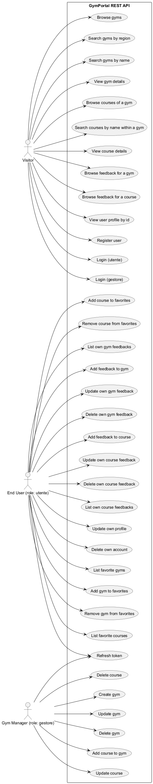
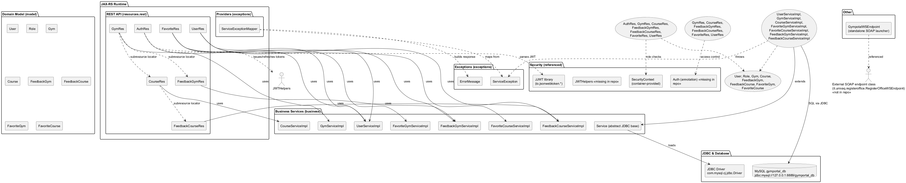
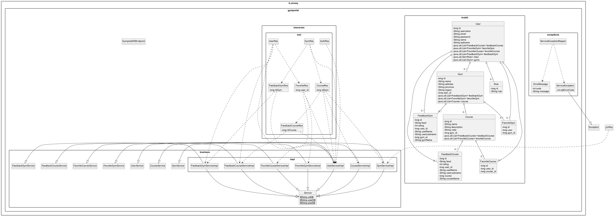
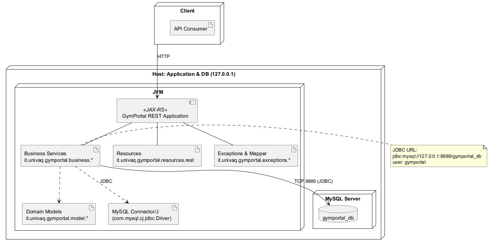

 
% 1 — System Overview
# SECTION 1 — System Overview

This section introduces the GymPortal backend as implemented in the provided repository. It describes the system’s purpose, scope within a larger solution, and the key features directly evidenced by the source code. The intent is to establish a common understanding for both technical and non-technical stakeholders and to enable validation by the development team.

## Purpose

The codebase implements a RESTful backend for a gym discovery and management portal. It exposes APIs for user registration and login, role-based access-controlled management of gyms and their courses, user-contributed feedback on both gyms and courses, and user-maintained favorites. Persistence is implemented with direct JDBC access to a MySQL database, and application errors from the persistence layer are mapped to HTTP responses.

## Scope

The repository contains the service’s API and business logic layers and the domain model classes:

- REST API layer using JAX-RS (resources under it.univaq.gymportal.resources.rest.*).
- Business services with raw JDBC (it.univaq.gymportal.business.* and impl.*).
- Domain model classes (it.univaq.gymportal.model.*).
- Exception handling and mapping (it.univaq.gymportal.exceptions.*).
- JDBC bootstrap (it.univaq.gymportal.business.Service) with hard-coded MySQL connection parameters.

The repository does not include server bootstrapping for JAX-RS (e.g., an Application subclass) or security implementation classes (e.g., the Auth annotation’s implementation or JWT utilities). One class, GympotalWSEndpoint, is unrelated to the JAX-RS API and appears to be a leftover example for a SOAP endpoint; it is not integrated with the REST service.

## Key Features Evident in the Code

### Authentication and Authorization

The system provides endpoints for registration and login and uses roles to authorize protected operations.

- Registration: POST /auth/registration creates a new user and assigns a default role (role_id = 1 via user_role association).
- Login: 
  - POST /auth/login authenticates a regular user (role "utente").
  - POST /auth/admin/login authenticates a manager (role "gestore").
- Token issuance and refresh:
  - Tokens are intended to be issued and refreshed, but the implementation is incomplete:
    - issueToken currently returns an empty string.
    - /auth/refresh references JWT utilities (Claims, Jwts, JWTHelpers) that are not present in the repository and are not imported.

Role checks are executed against the database (checkUser and checkRole in UserServiceImpl). Protected endpoints are annotated with @Auth and enforce role-based checks within resource methods. The @Auth implementation is not included in the repository.

### User Management

- GET /users/{idUser}: returns user information without the password.
- PUT /users/{idUser}: updates user information; if an empty password is submitted, the existing password is preserved.
- DELETE /users/{idUser}: deletes the authenticated user’s account.
- GET /users/{idUser}/feedbacks/gyms and /users/{idUser}/feedbacks/courses: returns the authenticated user’s own feedback entries.
- /users/{idUser}/favorites subresource: manage favorites for gyms and courses for the authenticated user (see “Favorites” below).

All modifying operations require that the path idUser matches the authenticated principal’s user ID.

### Gym Management

- GET /gyms with optional filters:
  - name: partial match on gym name.
  - region: exact match on region.
- GET /gyms/{idGym}: return a gym by ID.
- POST /gyms: creates a gym and ties it to the authenticated manager user (role “gestore”).
- PUT /gyms/{idGym} and DELETE /gyms/{idGym}: update or delete a gym if, and only if, the authenticated manager is the owner (verified by comparing the gym’s user_id with the authenticated user’s ID).

Gyms expose subresources:
- /gyms/{idGym}/courses to manage courses.
- /gyms/{idGym}/feedbacks to manage feedback about the gym.

### Course Management

Courses are nested under a gym:

- GET /gyms/{idGym}/courses with optional name filter: list courses for a gym; optionally filter by partial name.
- GET /gyms/{idGym}/courses/{idCourse}: return a single course.
- POST /gyms/{idGym}/courses: create a course for the gym; restricted to a manager who owns the gym.
- PUT /gyms/{idGym}/courses/{idCourse} and DELETE /gyms/{idGym}/courses/{idCourse}: update or delete a course; restricted to the gym’s owner.

Courses expose subresource:
- /gyms/{idGym}/courses/{idCourse}/feedbacks for feedback related to the specific course.

### Feedback (Gyms and Courses)

For gyms:

- GET /gyms/{idGym}/feedbacks: list feedback for the gym (with user and gym names resolved).
- GET /gyms/{idGym}/feedbacks/{idFeedback}: retrieve a specific feedback.
- POST /gyms/{idGym}/feedbacks: create feedback as the authenticated user (role “utente”).
- PUT /gyms/{idGym}/feedbacks/{idFeedback}: update feedback only if authored by the authenticated user.
- DELETE /gyms/{idGym}/feedbacks/{idFeedback}: delete feedback only if authored by the authenticated user.

For courses:

- GET /gyms/{idGym}/courses/{idCourse}/feedbacks: list feedback for the course.
- GET /gyms/{idGym}/courses/{idCourse}/feedbacks/{idFeedback}: retrieve a specific course feedback.
- POST /gyms/{idGym}/courses/{idCourse}/feedbacks: create feedback as the authenticated user (role “utente”).
- PUT /gyms/{idGym}/courses/{idCourse}/feedbacks/{idFeedback} and DELETE similarly enforce author-only modifications.

### Favorites

Favorites are managed under the user subresource and are scoped to the authenticated user:

- Gyms:
  - POST /users/{idUser}/favorites/gyms: add a gym to favorites; request body is a raw long (gym ID) consumed as application/json.
  - GET /users/{idUser}/favorites/gyms: list favorite gyms for the authenticated user.
  - DELETE /users/{idUser}/favorites/gyms/{idGym}: remove the gym from favorites.
- Courses:
  - POST /users/{idUser}/favorites/courses: add a course to favorites; request body is a raw long (course ID) consumed as application/json.
  - GET /users/{idUser}/favorites/courses: list favorite courses for the authenticated user.
  - DELETE /users/{idUser}/favorites/courses/{idCourse}: remove the course from favorites.

Authorization enforces that the path user matches the authenticated principal.

### Persistence and Error Handling

All business services (GymServiceImpl, CourseServiceImpl, FeedbackGymServiceImpl, FeedbackCourseServiceImpl, FavoriteGymServiceImpl, FavoriteCourseServiceImpl, UserServiceImpl) use direct JDBC via DriverManager:

- MySQL JDBC driver: com.mysql.cj.jdbc.Driver loaded statically.
- Connection settings are hard-coded:
  - URL: jdbc:mysql://127.0.0.1:8889/gymportal_db?... (UTC timezone and related flags).
  - User: gymportal
  - Password: gymportal
- Prepared statements are used for all parameterized queries.
- On SQLException, services throw ServiceException encapsulating the SQL error code.
- ServiceExceptionMapper converts ServiceException to an ErrorMessage with HTTP status mapping:
  - 1062 → 400 (Data already exist).
  - 1366 → 400 (Incorrect value).
  - 1452 → 400 (Foreign key constraint).
  - Any other code → 500 (Server Error with the SQL error code included).

### Domain Model

The model classes reflect the persistent attributes used across services:

- User: id, username, email, password, name, lastname; relations to feedbacks, favorites, roles, and gyms.
- Role: id, role.
- Gym: id, name, address, province, region, user_id (owner), plus lists of associated entities.
- Course: id, code, name, description, gym_id, plus associated favorites and feedbacks.
- FeedbackGym: id, feed, rating, gym_id, gymName (resolved in queries), user_id, userName, userLastname.
- FeedbackCourse: id, feed, rating, course (id), courseName (resolved), user_id, userName, userLastname.
- FavoriteGym: id, user, gym_id.
- FavoriteCourse: id, user_id, course_id.

### Public REST Endpoints (as implemented)

| Path | Methods | Description | Auth/Role |
|---|---|---|---|
| /auth/registration | POST (JSON User) | Register a user; assigns default role_id=1 | None |
| /auth/login | POST (form username,password) | Login as “utente”; returns Authorization header | None; returns 401 on failure |
| /auth/admin/login | POST (form username,password) | Login as “gestore”; returns Authorization header | None; returns 401 on failure |
| /auth/refresh | GET | Refresh JWT token (implementation references missing JWT classes) | Requires Authorization header; returns 401 on parsing errors |
| /gyms | GET | List gyms; supports name and region filters | None |
| /gyms/{idGym} | GET | Get gym by ID | None |
| /gyms | POST (JSON Gym) | Create gym for authenticated manager | @Auth; role “gestore” |
| /gyms/{idGym} | PUT, DELETE (JSON Gym for PUT) | Update/delete gym if caller owns it | @Auth; role “gestore” and ownership check |
| /gyms/{idGym}/courses | GET | List courses for gym; optional name filter | None |
| /gyms/{idGym}/courses/{idCourse} | GET | Get course by ID | None |
| /gyms/{idGym}/courses | POST (JSON Course) | Create course in gym if caller owns it | @Auth; role “gestore” and ownership check |
| /gyms/{idGym}/courses/{idCourse} | PUT, DELETE (JSON Course for PUT) | Update/delete course if caller owns the gym | @Auth; role “gestore” and ownership check |
| /gyms/{idGym}/feedbacks | GET | List feedback for gym | None |
| /gyms/{idGym}/feedbacks/{idFeedback} | GET | Get a gym feedback by ID | None |
| /gyms/{idGym}/feedbacks | POST (JSON FeedbackGym) | Create feedback as authenticated user | @Auth; role “utente” |
| /gyms/{idGym}/feedbacks/{idFeedback} | PUT, DELETE (JSON FeedbackGym for PUT) | Update/delete only by feedback author | @Auth; role “utente” and ownership check |
| /gyms/{idGym}/courses/{idCourse}/feedbacks | GET | List feedback for course | None |
| /gyms/{idGym}/courses/{idCourse}/feedbacks/{idFeedback} | GET | Get a course feedback by ID | None |
| /gyms/{idGym}/courses/{idCourse}/feedbacks | POST (JSON FeedbackCourse) | Create feedback as authenticated user | @Auth; role “utente” |
| /gyms/{idGym}/courses/{idCourse}/feedbacks/{idFeedback} | PUT, DELETE (JSON FeedbackCourse for PUT) | Update/delete only by feedback author | @Auth; role “utente” and ownership check |
| /users/{idUser} | GET | Get user without password | None |
| /users/{idUser} | PUT, DELETE (JSON User for PUT) | Update/delete own user | @Auth; path ID must match authenticated user |
| /users/{idUser}/feedbacks/gyms | GET | List gym feedback by the authenticated user | @Auth; path ID must match authenticated user |
| /users/{idUser}/feedbacks/courses | GET | List course feedback by the authenticated user | @Auth; path ID must match authenticated user |
| /users/{idUser}/favorites/gyms | GET | List favorite gyms | @Auth; path ID must match authenticated user |
| /users/{idUser}/favorites/gyms | POST (JSON body: long idGym) | Add gym to favorites | @Auth; role “utente”; path ID must match authenticated user |
| /users/{idUser}/favorites/gyms/{idGym} | DELETE | Remove gym from favorites | @Auth; role “utente”; path ID must match authenticated user |
| /users/{idUser}/favorites/courses | GET | List favorite courses | @Auth; path ID must match authenticated user |
| /users/{idUser}/favorites/courses | POST (JSON body: long idCourse) | Add course to favorites | @Auth; role “utente”; path ID must match authenticated user |
| /users/{idUser}/favorites/courses/{idCourse} | DELETE | Remove course from favorites | @Auth; role “utente”; path ID must match authenticated user |

Note: For favorites POST endpoints, the resource methods accept a bare long (course/gym ID) as the JSON request entity.

### Notable Implementation Constraints and Gaps

The following behaviors are strictly derived from the current code and impact runtime characteristics:

- Security:
  - @Auth annotation and JWT tooling (JWTHelpers, Jwts, Claims, and JWT exception types) are referenced but not present in the repository; issueToken returns an empty token. Consequently, token-based authentication and refresh are incomplete.
- Persistence:
  - Database connection settings are hard-coded in Service (URL, username, password).
  - No connection pooling or explicit transaction management is implemented; each operation opens a new connection and relies on auto-commit.
- Error Handling:
  - SQL error codes are mapped to HTTP statuses via ServiceExceptionMapper; all other exceptions would surface as defaults from the JAX-RS runtime, as there are no other mappers.
- Logging:
  - Logging uses System.out.println statements scattered across services and resources.
- Bootstrapping:
  - There is no JAX-RS Application class in the repository; deployment assumes container-based scanning and registration.
- Extraneous class:
  - GympotalWSEndpoint is a standalone main for a SOAP endpoint unrelated to the REST API and not integrated with this service.

This overview reflects the concrete implementation found in the source code and serves as the baseline for subsequent architecture views and decisions.

% 2 — Architectural Context
## 2. Architectural Context

This section situates the GymPortal service within its environment by describing the external systems it depends on, the public APIs exposed, the underlying data sources, and the users and roles observable in the code. All details below are derived strictly from the provided source code and can be validated directly against it.

### External Systems

- MySQL database accessed via JDBC using the MySQL Connector/J driver (class: com.mysql.cj.jdbc.Driver).
- JAX-RS runtime (javax.ws.rs.*) providing the RESTful HTTP endpoint infrastructure, including provider-based exception mapping.
- JWT infrastructure referenced but not fully present in the repository:
  - JWTHelpers (it.univaq.gymportal.resources.rest.AuthRes reference).
  - JJWT parsing classes (Jwts, Claims, ExpiredJwtException, MalformedJwtException, UnsupportedJwtException, SignatureException).
  - Note: AuthRes.issueToken currently returns an empty string and referenced JWT helpers/classes are not present in the codebase.
- Custom authentication/authorization annotation @Auth (it.univaq.gymportal.security.Auth) referenced by resource methods; its implementation is not part of the repository and is assumed to be provided externally in the runtime.
- JAX-WS (javax.xml.ws.*) publisher scaffold present in GympotalWSEndpoint for SOAP endpoint bootstrapping, but it does not integrate with the REST API and appears to be a standalone utility/placeholder.

### APIs / Interfaces

- Exception mapping
  - ServiceExceptionMapper (@Provider): maps ServiceException to JSON ErrorMessage with appropriate HTTP status derived from SQL error codes.

- REST endpoints (class-level paths and sub-resource locators):
  - AuthRes (@Path("auth"))
    - POST /auth/registration
      - Consumes: application/json (User)
      - Creates user and assigns default role via UserService; returns Location: /users/{id}
    - POST /auth/login
      - Consumes: application/x-www-form-urlencoded (username, password)
      - On valid credentials and role "utente", returns Authorization: Bearer <token> and Location: /users/{id}
    - POST /auth/admin/login
      - Consumes: application/x-www-form-urlencoded (username, password)
      - On valid credentials and role "gestore", returns Authorization: Bearer <token> and Location: /users/{id}
    - GET /auth/refresh
      - Reads Authorization: Bearer <token>, attempts JWT refresh, returns new Authorization header if valid

  - GymRes (@Path("gyms"))
    - GET /gyms
      - Produces: application/json
      - Query params: name, region (mutually exclusive); returns gyms by filter or all
    - GET /gyms/{idGym}
      - Produces: application/json; returns one gym
    - POST /gyms
      - @Auth; requires role "gestore"
      - Consumes: application/json (Gym); creates a gym bound to the authenticated manager; returns Location: /gyms/{id}
    - PUT /gyms/{idGym}
      - @Auth; requires role "gestore" and ownership (manager of the gym)
      - Consumes: application/json (Gym); updates the gym
    - DELETE /gyms/{idGym}
      - @Auth; requires role "gestore" and ownership (manager of the gym); deletes the gym
    - Sub-resources:
      - /gyms/{idGym}/courses → CourseRes
        - GET /gyms/{idGym}/courses
          - Produces: application/json; optional query param name for filtering
        - GET /gyms/{idGym}/courses/{idCourse}
          - Produces: application/json; returns one course
        - POST /gyms/{idGym}/courses
          - @Auth; requires role "gestore"; creates course in the gym; returns Location: /gyms/{idGym}/courses/{id}
        - PUT /gyms/{idGym}/courses/{idCourse}
          - @Auth; requires role "gestore" and ownership (manager of the gym); updates the course
        - DELETE /gyms/{idGym}/courses/{idCourse}
          - @Auth; requires role "gestore" and ownership (manager of the gym); deletes the course
        - Sub-resource:
          - /gyms/{idGym}/courses/{idCourse}/feedbacks → FeedbackCourseRes
            - GET /gyms/{idGym}/courses/{idCourse}/feedbacks
              - Produces: application/json; list feedback for course
            - GET /gyms/{idGym}/courses/{idCourse}/feedbacks/{idFeedback}
              - Produces: application/json; one feedback
            - POST /gyms/{idGym}/courses/{idCourse}/feedbacks
              - @Auth; requires role "utente"; creates feedback; returns Location: …/feedbacks/{id}
            - PUT /gyms/{idGym}/courses/{idCourse}/feedbacks/{idFeedback}
              - @Auth; requires role "utente" and ownership (author of feedback); updates feedback
            - DELETE /gyms/{idGym}/courses/{idCourse}/feedbacks/{idFeedback}
              - @Auth; requires role "utente" and ownership (author of feedback); deletes feedback
      - /gyms/{idGym}/feedbacks → FeedbackGymRes
        - GET /gyms/{idGym}/feedbacks
          - Produces: application/json; list feedback for gym
        - GET /gyms/{idGym}/feedbacks/{idFeedback}
          - Produces: application/json; one feedback
        - POST /gyms/{idGym}/feedbacks
          - @Auth; requires role "utente"; creates feedback; returns Location: …/feedbacks/{id}
        - PUT /gyms/{idGym}/feedbacks/{idFeedback}
          - @Auth; requires role "utente" and ownership (author of feedback); updates feedback
        - DELETE /gyms/{idGym}/feedbacks/{idFeedback}
          - @Auth; requires role "utente" and ownership (author of feedback); deletes feedback

  - UserRes (@Path("users"))
    - GET /users/{idUser}
      - Produces: application/json; returns user without password
    - DELETE /users/{idUser}
      - @Auth; requires authenticated user matching {idUser}; deletes user
    - PUT /users/{idUser}
      - @Auth; requires authenticated user matching {idUser}; updates user; preserves password if empty in payload
    - GET /users/{idUser}/feedbacks/gyms
      - @Auth; requires authenticated user matching {idUser}; returns user’s gym feedback
    - GET /users/{idUser}/feedbacks/courses
      - @Auth; requires authenticated user matching {idUser}; returns user’s course feedback
    - Sub-resource:
      - /users/{idUser}/favorites → FavoriteRes
        - POST /users/{idUser}/favorites/gyms
          - @Auth; requires role "utente" and identity match; Consumes: application/json (body: long idGym); creates favorite gym
        - POST /users/{idUser}/favorites/courses
          - @Auth; requires role "utente" and identity match; Consumes: application/json (body: long idCourse); creates favorite course
        - GET /users/{idUser}/favorites/gyms
          - @Auth; requires role "utente" and identity match; returns favorite gyms
        - GET /users/{idUser}/favorites/courses
          - @Auth; requires role "utente" and identity match; returns favorite courses
        - DELETE /users/{idUser}/favorites/gyms/{idGym}
          - @Auth; requires role "utente" and identity match; deletes favorite gym
        - DELETE /users/{idUser}/favorites/courses/{idCourse}
          - @Auth; requires role "utente" and identity match; deletes favorite course

- SOAP publisher scaffold
  - GympotalWSEndpoint: a main() printing instructions for publishing a JAX-WS endpoint; no direct service publishing logic is present in this class for GymPortal and it is not referenced by the REST resources.

### Data Sources

- JDBC configuration (Service.java)
  - URL: jdbc:mysql://127.0.0.1:8889/gymportal_db with timezone parameters
  - Username: gymportal
  - Password: gymportal
  - Driver: com.mysql.cj.jdbc.Driver

- Tables accessed and fields referenced in queries:
  - user: id, email, lastname, name, password, username
  - role: id, role
  - user_role: user_id, role_id
  - gym: id, address, name, province, region, user_id
  - course: id, code, name, description, gym_id
  - favoritegym: id, gym_id, user_id
  - favoritecourse: id, course_id, user_id
  - feedbackgym: id, feed, rating, gym_id, user_id
  - feedbackcourse: id, feed, rating, course_id, user_id

- Relationships implied by queries:
  - Gym managed by User via gym.user_id.
  - Course belongs to Gym via course.gym_id.
  - FavoriteGym links User to Gym via favoritegym.user_id and favoritegym.gym_id.
  - FavoriteCourse links User to Course via favoritecourse.user_id and favoritecourse.course_id.
  - FeedbackGym links User to Gym; FeedbackCourse links User to Course.
  - User roles resolved via user_role join to role; roles checked by role.role string.

### Users / Actors

- Unauthenticated client
  - Can register and access public GET endpoints (e.g., browse gyms, courses, and view feedback).

- Authenticated user with role "utente"
  - Can authenticate via /auth/login; can create, update, and delete own feedback; can manage own favorites; can view own feedback via /users/{idUser}/feedbacks/*.

- Authenticated gym manager with role "gestore"
  - Can authenticate via /auth/admin/login; can create, update, and delete gyms they manage; can create, update, and delete courses under gyms they manage.

Notes on security mechanisms in code:
- Authorization decisions rely on SecurityContext roles ("utente", "gestore") and identity checks against resource path parameters.
- The @Auth annotation marks methods requiring authenticated access; its implementation is external to this repository.
- JWT issuance/parsing flow is referenced but incomplete in the provided AuthRes (issueToken returns an empty string and helper classes are missing).

% 2.1 — Architectural Context – Use Case Diagram
## Section 2.1 — Architectural Context – Use Case Diagram

This section presents the externally visible behavior of the GymPortal system as a set of use cases derived strictly from the codebase. The diagram and mapping table reflect the REST resources, paths, HTTP methods, security annotations, and role checks implemented in the JAX-RS resources. Roles are enforced via the custom @Auth and SecurityContext checks with application roles “utente” (end user) and “gestore” (gym manager). Public endpoints are those without @Auth. No functionality is introduced beyond what is present in the source.

Figure 2.1 — Use Case Diagram (file: fig-2-1-usecases.puml)

The diagram shows three external actors. “Visitor” covers unauthenticated usage such as browsing gyms, courses, and feedback, and viewing public user profiles. “End User (role: utente)” covers authenticated consumer features such as managing own profile, favorites, and feedback. “Gym Manager (role: gestore)” covers administrative features such as managing gyms and their courses. The refresh token operation is available to authenticated clients in both roles.

Use Case to REST Endpoint Mapping

| Use case | HTTP | Path | Resource class | Auth/Role constraint (from code) |
|---|---|---|---|---|
| Register user | POST | /auth/registration | AuthRes | Public |
| Login (utente) | POST | /auth/login | AuthRes | Public (form) |
| Login (gestore) | POST | /auth/admin/login | AuthRes | Public (form) |
| Refresh token | GET | /auth/refresh | AuthRes | Requires valid Bearer token |
| Browse gyms | GET | /gyms | GymRes | Public |
| Search gyms by region | GET | /gyms?region={region} | GymRes | Public |
| Search gyms by name | GET | /gyms?name={name} | GymRes | Public |
| View gym details | GET | /gyms/{idGym} | GymRes | Public |
| Create gym | POST | /gyms | GymRes | @Auth, role=gestore |
| Update gym | PUT | /gyms/{idGym} | GymRes | @Auth, role=gestore and user is manager of gym |
| Delete gym | DELETE | /gyms/{idGym} | GymRes | @Auth, role=gestore and user is manager of gym |
| Browse courses of a gym | GET | /gyms/{idGym}/courses | CourseRes | Public |
| Search courses by name within a gym | GET | /gyms/{idGym}/courses?name={name} | CourseRes | Public |
| View course details | GET | /gyms/{idGym}/courses/{idCourse} | CourseRes | Public |
| Add course to gym | POST | /gyms/{idGym}/courses | CourseRes | @Auth, role=gestore (no manager-of-gym check in code) |
| Update course | PUT | /gyms/{idGym}/courses/{idCourse} | CourseRes | @Auth, role=gestore and user is manager of gym |
| Delete course | DELETE | /gyms/{idGym}/courses/{idCourse} | CourseRes | @Auth, role=gestore and user is manager of gym |
| Browse feedback for a gym | GET | /gyms/{idGym}/feedbacks | FeedbackGymRes | Public |
| View single gym feedback | GET | /gyms/{idGym}/feedbacks/{idFeedback} | FeedbackGymRes | Public |
| Add feedback to gym | POST | /gyms/{idGym}/feedbacks | FeedbackGymRes | @Auth, role=utente |
| Update own gym feedback | PUT | /gyms/{idGym}/feedbacks/{idFeedback} | FeedbackGymRes | @Auth, role=utente and ownership check |
| Delete own gym feedback | DELETE | /gyms/{idGym}/feedbacks/{idFeedback} | FeedbackGymRes | @Auth, role=utente and ownership check |
| Browse feedback for a course | GET | /gyms/{idGym}/courses/{idCourse}/feedbacks | FeedbackCourseRes | Public |
| View single course feedback | GET | /gyms/{idGym}/courses/{idCourse}/feedbacks/{idFeedback} | FeedbackCourseRes | Public |
| Add feedback to course | POST | /gyms/{idGym}/courses/{idCourse}/feedbacks | FeedbackCourseRes | @Auth, role=utente |
| Update own course feedback | PUT | /gyms/{idGym}/courses/{idCourse}/feedbacks/{idFeedback} | FeedbackCourseRes | @Auth, role=utente and ownership check |
| Delete own course feedback | DELETE | /gyms/{idGym}/courses/{idCourse}/feedbacks/{idFeedback} | FeedbackCourseRes | @Auth, role=utente and ownership check |
| View user profile by id | GET | /users/{idUser} | UserRes | Public (password omitted) |
| Update own profile | PUT | /users/{idUser} | UserRes | @Auth, self-only; preserves password if empty |
| Delete own account | DELETE | /users/{idUser} | UserRes | @Auth, self-only |
| List own gym feedbacks | GET | /users/{idUser}/feedbacks/gyms | UserRes | @Auth, self-only |
| List own course feedbacks | GET | /users/{idUser}/feedbacks/courses | UserRes | @Auth, self-only |
| List favorite gyms | GET | /users/{idUser}/favorites/gyms | FavoriteRes | @Auth, role=utente, self-only |
| Add gym to favorites | POST | /users/{idUser}/favorites/gyms | FavoriteRes | @Auth, role=utente, self-only; body: long idGym |
| Remove gym from favorites | DELETE | /users/{idUser}/favorites/gyms/{idGym} | FavoriteRes | @Auth, role=utente, self-only |
| List favorite courses | GET | /users/{idUser}/favorites/courses | FavoriteRes | @Auth, role=utente, self-only |
| Add course to favorites | POST | /users/{idUser}/favorites/courses | FavoriteRes | @Auth, role=utente, self-only; body: long idCourse |
| Remove course from favorites | DELETE | /users/{idUser}/favorites/courses/{idCourse} | FavoriteRes | @Auth, role=utente, self-only |

Notes on constraints implemented in code

The creation of a course under a gym requires the “gestore” role but does not verify the caller is the manager of that gym, whereas updates and deletions do verify both the role and ownership via UserRes/GymRes helper checks. All listing and read operations for gyms, courses, and feedback are public. Feedback creation, update, and deletion are restricted to “utente” and, for modifications, checked against resource ownership.

% 3 — Containers
## 3. Containers

This section identifies the runtime containers that the codebase actually uses and interacts with at execution time. It focuses on the REST application layer and its persistence layer, detailing responsibilities, technologies, and communication mechanisms, strictly based on the provided source code. No diagrams are included in this section.

| Container | Responsibility | Technology | Communication |
|---|---|---|---|
| GymPortal JAX-RS REST API | Exposes REST endpoints for gyms, courses, feedbacks (gyms and courses), favorites, users, and authentication. Applies role-based authorization decisions using SecurityContext and a custom @Auth annotation (referenced), and maps service-layer exceptions to HTTP responses via ServiceExceptionMapper. | Java, JAX-RS (javax.ws.rs.*), JAX-RS ExceptionMapper, direct JDBC calls from service layer; JWT token parsing utilities are referenced in AuthRes (Claims, Jwts, JWTHelpers) though token issuing is currently stubbed. | HTTP/1.1 with JSON payloads (application/json) for most endpoints; application/x-www-form-urlencoded for login; Authorization: Bearer <token> header processed in refresh endpoint. |
| MySQL Database (gymportal_db) | Persists domain entities and relations used by services: gym, course, user, role, user_role, favoritegym, favoritecourse, feedbackgym, feedbackcourse (as evidenced by SQL statements across services). | MySQL with JDBC driver com.mysql.cj.jdbc.Driver; connection via DriverManager using url jdbc:mysql://127.0.0.1:8889/gymportal_db with credentials user=gymportal, password=gymportal (as configured in Service). | JDBC (MySQL protocol) over TCP to 127.0.0.1:8889; SQL statements executed via PreparedStatement/Statement. |
| JAX-WS Endpoint CLI (GympotalWSEndpoint) | Standalone main class that prints instructions for publishing a SOAP endpoint; it does not start any endpoint in the current code and is unrelated to the REST API runtime. | Java SE main class; references JAX-WS concepts (javax.xml.ws.Endpoint) only in messaging. | No network communication performed by this class as implemented; if invoked per its instructions, it would target HTTP/SOAP at a provided URL. |

% 3.1 — Architecture Overview – Component Diagram
# Section 3.1 — Architecture Overview – Component Diagram

This section provides an overview of the system’s logical components and their interactions as realized in the provided codebase. It highlights the JAX-RS REST API layer, the business services implemented with plain JDBC, the exception mapping mechanism, the domain model, the external MySQL database, and the security/JWT dependencies referenced by the code. The diagram and descriptions strictly reflect the current implementation, including referenced but missing elements required at runtime.

Figure 3.1 — Architecture Overview – Component Diagram (section-3-1-architecture-overview-component-diagram.puml)

The diagram shows each REST resource depending on concrete service implementations, the common JDBC base class used by all services, the domain model used across layers, the exception mapping to HTTP responses, and the external dependencies required at runtime (JAX-RS runtime, SecurityContext, JWT helpers/library, JDBC driver, and MySQL). It also highlights the standalone SOAP endpoint launcher included in the codebase but not wired into the REST application.

## Component Inventory and Responsibilities

The implementation defines the following components. Each entry lists the concrete code elements to enable validation against the repository.

REST API (JAX-RS resources). These classes expose HTTP endpoints and perform authorization checks via SecurityContext. They construct service instances directly and return JAX-RS Response objects:
- AuthRes: POST /auth/registration, POST /auth/login, POST /auth/admin/login, GET /auth/refresh; issues and refreshes JWT tokens via JWTHelpers and io.jsonwebtoken; depends on UserServiceImpl.
- GymRes: GET /gyms, GET /gyms/{idGym}, POST /gyms, PUT /gyms/{idGym}, DELETE /gyms/{idGym}; checks role gestore and ownership via UserServiceImpl and GymServiceImpl; exposes subresources /gyms/{idGym}/courses and /gyms/{idGym}/feedbacks.
- CourseRes: Bound as subresource under a gym; GET courses with optional name filter; GET single course; POST/PUT/DELETE courses for gestore; exposes subresource /courses/{idCourse}/feedbacks (FeedbackCourseRes).
- FeedbackGymRes: Bound under a gym; GET all and single feedback; POST/PUT/DELETE feedback for utente.
- FeedbackCourseRes: Bound under a course; GET all and single feedback; POST/PUT/DELETE feedback for utente.
- FavoriteRes: Bound under a user; POST/GET/DELETE favorites for gyms and courses restricted to the authenticated utente owner.
- UserRes: GET user by id (without password), PUT/DELETE current user, GET user feedbacks for gyms and courses.

Business Services (JDBC). These classes implement application logic and persistence using plain JDBC, extending the shared abstract Service for connection parameters and driver loading:
- Service (abstract): Loads com.mysql.cj.jdbc.Driver; defines JDBC URL jdbc:mysql://127.0.0.1:8889/gymportal_db and credentials gymportal/gymportal; provides utility printRS.
- UserServiceImpl implements UserService: User CRUD, credential checks, role checks, assign default role via user_role.
- GymServiceImpl implements GymService: Gym CRUD; queries by name and region; getGymWithManager returns user_id.
- CourseServiceImpl implements CourseService: Course CRUD; list by gym and by name within a gym.
- FavoriteGymServiceImpl implements FavoriteGymService: Manage favorite gyms per user; list favorites.
- FavoriteCourseServiceImpl implements FavoriteCourseService: Manage favorite courses per user; list favorites.
- FeedbackGymServiceImpl implements FeedbackGymService: Create, read, update, delete feedback for gyms; list by gym and by user.
- FeedbackCourseServiceImpl implements FeedbackCourseService: Create, read, update, delete feedback for courses; list by course and by user.

Domain Model (DTOs). These Plain Old Java Objects carry data between layers and to/from the REST API:
- User, Role, Gym, Course, FeedbackGym, FeedbackCourse, FavoriteGym, FavoriteCourse.

Exceptions and Provider. This layer translates service errors to HTTP responses:
- ServiceException: Checked exception carrying a SQL error code.
- ErrorMessage: Maps SQL error codes to HTTP status and user-facing message; serialized in responses.
- ServiceExceptionMapper (@Provider): Maps ServiceException to JSON HTTP responses using ErrorMessage.

External and Security Dependencies. These are referenced in code but not implemented in the repository:
- Auth (annotation): it.univaq.gymportal.security.Auth used on protected endpoints; implies a JAX-RS filter/feature authenticating JWT and populating SecurityContext roles utente and gestore.
- SecurityContext: Provided by the JAX-RS runtime to supply authenticated principal and roles.
- JWTHelpers: Utility used to obtain the JWT signing key in AuthRes; not present in repository.
- JJWT library (io.jsonwebtoken.*): Used in AuthRes for parsing and refreshing tokens (Jwts, Claims, ExpiredJwtException, MalformedJwtException, UnsupportedJwtException, SignatureException).
- JAX-RS runtime: Required to host resources and the provider.
- JDBC Driver com.mysql.cj.jdbc.Driver: Loaded by Service.
- MySQL database gymportal_db: Target database backing all persistence.

Other Included Code. Present in the codebase but unrelated to the REST flow:
- GympotalWSEndpoint: A standalone SOAP endpoint launcher printing instructions; references it.univaq.registeroffice.RegisterOfficeWSEndpoint which is not included, and does not integrate with the REST components.

## Notes and Constraints Visible in the Implementation

The resources directly instantiate service implementations without dependency injection, creating tight coupling to concrete classes while occasionally typing variables to service interfaces. All JDBC access is performed with try-with-resources via DriverManager, using inline SQL statements against MySQL. Error handling consistently wraps SQLException error codes into ServiceException, which are mapped to HTTP responses by ServiceExceptionMapper. Authorization relies on roles utente and gestore as provided by the SecurityContext and an Auth annotation; these security components and the JWT helper are referenced but not present in the repository, and the token issuance method in AuthRes is currently a stub.

% 4 — Components
## 4. Components

This section describes the internal components realized as Java classes and interfaces in the codebase. For each component, it states its responsibility and identifies the main collaborators and dependencies through which it interacts with the rest of the system. The list is complete and directly derived from the provided source code, covering REST resources, business interfaces and implementations, domain models, infrastructure utilities, and exception handling.

| Component | Responsibility | Interactions |
|---|---|---|
| it.univaq.gymportal.business.Service | Provides shared JDBC infrastructure to business services, including driver loading and database connection parameters; utility to print ResultSet content. | Class.forName(com.mysql.cj.jdbc.Driver); java.sql.DriverManager; java.sql.Connection; java.sql.ResultSet; Extended by all *ServiceImpl classes. |
| it.univaq.gymportal.business.CourseService | Declares the course-related business operations (CRUD and queries). | Implemented by it.univaq.gymportal.business.impl.CourseServiceImpl; Used by it.univaq.gymportal.resources.rest.CourseRes. |
| it.univaq.gymportal.business.FavoriteCourseService | Declares operations to manage a user’s favorite courses. | Implemented by it.univaq.gymportal.business.impl.FavoriteCourseServiceImpl; Used by it.univaq.gymportal.resources.rest.FavoriteRes. |
| it.univaq.gymportal.business.FavoriteGymService | Declares operations to manage a user’s favorite gyms. | Implemented by it.univaq.gymportal.business.impl.FavoriteGymServiceImpl; Used by it.univaq.gymportal.resources.rest.FavoriteRes. |
| it.univaq.gymportal.business.FeedbackCourseService | Declares operations to manage feedback on courses. | Implemented by it.univaq.gymportal.business.impl.FeedbackCourseServiceImpl; Used by it.univaq.gymportal.resources.rest.FeedbackCourseRes. |
| it.univaq.gymportal.business.FeedbackGymService | Declares operations to manage feedback on gyms. | Implemented by it.univaq.gymportal.business.impl.FeedbackGymServiceImpl; Used by it.univaq.gymportal.resources.rest.FeedbackGymRes. |
| it.univaq.gymportal.business.GymService | Declares the gym-related business operations (CRUD and queries). | Implemented by it.univaq.gymportal.business.impl.GymServiceImpl; Used by it.univaq.gymportal.resources.rest.GymRes and CourseRes. |
| it.univaq.gymportal.business.UserService | Declares user-related operations (auth checks, CRUD, lookup). | Implemented by it.univaq.gymportal.business.impl.UserServiceImpl; Used by AuthRes, GymRes, CourseRes, FavoriteRes, FeedbackGymRes, FeedbackCourseRes, UserRes. |
| it.univaq.gymportal.business.impl.CourseServiceImpl | Implements CourseService using plain JDBC; maps rows to Course model; performs CRUD and search by gym/name. | Extends Service; Uses java.sql.*; Uses it.univaq.gymportal.model.Course; Throws it.univaq.gymportal.exceptions.ServiceException; Called by CourseRes. |
| it.univaq.gymportal.business.impl.FavoriteCourseServiceImpl | Manages favorite courses using JDBC; inserts, queries by user, and deletes favorites. | Extends Service; Uses java.sql.*; Uses it.univaq.gymportal.model.FavoriteCourse and Course; Throws ServiceException; Called by FavoriteRes. |
| it.univaq.gymportal.business.impl.FavoriteGymServiceImpl | Manages favorite gyms using JDBC; inserts, queries by user, and deletes favorites. | Extends Service; Uses java.sql.*; Uses it.univaq.gymportal.model.FavoriteGym and Gym; Throws ServiceException; Called by FavoriteRes. |
| it.univaq.gymportal.business.impl.FeedbackCourseServiceImpl | Manages feedback on courses using JDBC; CRUD and queries by course/user; joins course and user for enriched response. | Extends Service; Uses java.sql.*; Uses it.univaq.gymportal.model.FeedbackCourse; Throws ServiceException; Called by FeedbackCourseRes. |
| it.univaq.gymportal.business.impl.FeedbackGymServiceImpl | Manages feedback on gyms using JDBC; CRUD and queries by gym/user; joins gym and user for enriched response. | Extends Service; Uses java.sql.*; Uses it.univaq.gymportal.model.FeedbackGym; Throws ServiceException; Called by FeedbackGymRes. |
| it.univaq.gymportal.business.impl.GymServiceImpl | Implements GymService using JDBC; CRUD and queries by region/name; optional manager lookup. | Extends Service; Uses java.sql.*; Uses it.univaq.gymportal.model.Gym; Throws ServiceException; Called by GymRes and CourseRes. |
| it.univaq.gymportal.business.impl.UserServiceImpl | Implements UserService using JDBC; checks credentials and roles; user CRUD and lookups; assigns default role. | Extends Service; Uses java.sql.*; Uses it.univaq.gymportal.model.User; Throws ServiceException; Called by AuthRes, GymRes, CourseRes, FavoriteRes, FeedbackGymRes, FeedbackCourseRes, UserRes. |
| it.univaq.gymportal.exceptions.ErrorMessage | Maps SQL error codes to HTTP status codes and human-readable messages; supports exception-to-response mapping. | Used by ServiceExceptionMapper; Constructed from ServiceException.sqlErrorCode. |
| it.univaq.gymportal.exceptions.ServiceException | Checked exception carrying SQL error codes from service layer to REST layer. | Thrown by all *ServiceImpl classes; Mapped by ServiceExceptionMapper. |
| it.univaq.gymportal.exceptions.ServiceExceptionMapper | JAX-RS provider mapping ServiceException to HTTP Response with ErrorMessage body. | javax.ws.rs.ext.ExceptionMapper; javax.ws.rs.core.Response; javax.ws.rs.core.MediaType; Used by JAX-RS runtime. |
| it.univaq.gymportal.model.Course | Domain model for course entity, including id, code, name, description, and gym association. | Used by CourseServiceImpl; FavoriteCourseServiceImpl; CourseRes; Serialized in REST responses. |
| it.univaq.gymportal.model.FavoriteCourse | Domain model linking user to a favorite course. | Used by FavoriteCourseServiceImpl and FavoriteRes. |
| it.univaq.gymportal.model.FavoriteGym | Domain model linking user to a favorite gym. | Used by FavoriteGymServiceImpl and FavoriteRes. |
| it.univaq.gymportal.model.FeedbackCourse | Domain model for course feedback with rating and denormalized user/course names for presentation. | Used by FeedbackCourseServiceImpl and FeedbackCourseRes. |
| it.univaq.gymportal.model.FeedbackGym | Domain model for gym feedback with rating and denormalized user/gym names for presentation. | Used by FeedbackGymServiceImpl and FeedbackGymRes. |
| it.univaq.gymportal.model.Gym | Domain model for gym entity, including location, manager (user_id), and aggregates. | Used by GymServiceImpl; FavoriteGymServiceImpl; GymRes; CourseRes. |
| it.univaq.gymportal.model.Role | Domain model representing a user role. | Referenced by it.univaq.gymportal.model.User (roles set). |
| it.univaq.gymportal.model.User | Domain model for user entity with identity, credentials, profile, roles, and associations. | Used by UserServiceImpl; AuthRes; GymRes; CourseRes; FavoriteRes; FeedbackGymRes; FeedbackCourseRes; UserRes. |
| it.univaq.gymportal.resources.rest.AuthRes | Authentication and registration REST resource; registers users, logs in users/admins, issues and refreshes JWT tokens. | Instantiates UserServiceImpl; Uses javax.ws.rs.*; Uses javax.ws.rs.core.HttpHeaders/UriInfo/Response; References it.univaq.gymportal.resources.rest.UserRes for location headers; References JWT classes (io.jsonwebtoken.Jwts, io.jsonwebtoken.Claims, exceptions) and JWTHelpers; References it.univaq.gymportal.security.Auth for secured endpoints (annotation appears elsewhere). |
| it.univaq.gymportal.resources.rest.CourseRes | Nested REST resource for courses under a gym; lists, fetches, creates, updates, deletes courses; exposes nested course feedbacks. | Instantiates CourseServiceImpl; Uses @Auth and SecurityContext role "gestore" for mutations; Uses UserServiceImpl and GymServiceImpl to enforce gym manager authorization; Returns FeedbackCourseRes as sub-resource. |
| it.univaq.gymportal.resources.rest.FavoriteRes | Nested REST resource under users/{id}/favorites; manages user favorites for gyms and courses; lists and deletes favorites. | Instantiates FavoriteGymServiceImpl and FavoriteCourseServiceImpl; Uses UserServiceImpl; Uses SecurityContext role "utente" and user identity checks; Uses javax.ws.rs.* and Response. |
| it.univaq.gymportal.resources.rest.FeedbackCourseRes | Nested REST resource for course feedbacks; lists, reads, creates, updates, deletes course feedback. | Instantiates FeedbackCourseServiceImpl; Uses UserServiceImpl; Uses @Auth and SecurityContext role "utente" and ownership checks before update/delete; Uses javax.ws.rs.* and Response. |
| it.univaq.gymportal.resources.rest.FeedbackGymRes | Nested REST resource for gym feedbacks; lists, reads, creates, updates, deletes gym feedback. | Instantiates FeedbackGymServiceImpl; Uses UserServiceImpl; Uses @Auth and SecurityContext role "utente" and ownership checks before update/delete; Uses javax.ws.rs.* and Response. |
| it.univaq.gymportal.resources.rest.GymRes | Top-level REST resource for gyms; lists/filter gyms, reads, creates, updates, deletes; exposes nested course and feedback resources. | Instantiates GymServiceImpl; Uses UserServiceImpl; Uses @Auth and SecurityContext role "gestore"; Authorization check via GymServiceImpl.getGymWithManager; Returns CourseRes and FeedbackGymRes sub-resources. |
| it.univaq.gymportal.resources.rest.UserRes | Top-level REST resource for users; reads, updates, deletes user; lists user’s feedbacks; exposes nested favorites. | Instantiates UserServiceImpl; Uses FeedbackGymServiceImpl and FeedbackCourseServiceImpl for per-user listings; Uses @Auth and SecurityContext identity checks; Returns FavoriteRes sub-resource. |
| it.univaq.gymportal.GympotalWSEndpoint | Standalone main class printing endpoint publishing instructions; not wired to REST stack. | java.lang.System; Prints usage; No interaction with the JAX-RS resources. |

% 5 — Code-Level View
# Section 5 — Code-Level View

This section maps the implemented architectural elements to concrete source code artifacts. It identifies the executable entry points, key modules and directories, the end-to-end call paths from REST resources to JDBC operations, and the explicit patterns evident in the code. The content reflects exactly what is present in the repository and is intended to be verifiable by the development team.

## 5.1 Source Tree and Modules

The codebase is organized into clear packages corresponding to responsibilities. The following table enumerates all packages and types.

| Package | Purpose | Types |
|---|---|---|
| it.univaq.gymportal | Standalone entry point (not used by REST) | GympotalWSEndpoint |
| it.univaq.gymportal.business | Service layer contracts and base JDBC support | CourseService, FavoriteCourseService, FavoriteGymService, FeedbackCourseService, FeedbackGymService, GymService, UserService, Service (abstract) |
| it.univaq.gymportal.business.impl | Service layer implementations using JDBC | CourseServiceImpl, FavoriteCourseServiceImpl, FavoriteGymServiceImpl, FeedbackCourseServiceImpl, FeedbackGymServiceImpl, GymServiceImpl, UserServiceImpl |
| it.univaq.gymportal.exceptions | Error abstraction and JAX-RS exception mapping | ErrorMessage, ServiceException, ServiceExceptionMapper |
| it.univaq.gymportal.model | Domain model (POJOs) | Course, FavoriteCourse, FavoriteGym, FeedbackCourse, FeedbackGym, Gym, Role, User |
| it.univaq.gymportal.resources.rest | JAX-RS resource layer (REST API) | AuthRes, GymRes, CourseRes, FeedbackGymRes, FeedbackCourseRes, UserRes, FavoriteRes |

Observed external references (not present in this repository):
- it.univaq.gymportal.security.Auth (annotation used to guard endpoints).
- JWT utilities and types in AuthRes refresh path: JWTHelpers, Jwts, Claims, and JWT exceptions.

## 5.2 Executable Entry Points

There are two kinds of entry points observable in code:

- JAX-RS resources discovered by the runtime container:
  - Root resources with @Path at class level: AuthRes (@Path("auth")), GymRes (@Path("gyms")), UserRes (@Path("users")). Sub-resources are returned via locator methods in GymRes, CourseRes, UserRes.
  - There is no Application subclass; discovery relies on the hosting environment’s scanning and configuration.

- Standalone Java main:
  - it.univaq.gymportal.GympotalWSEndpoint contains a public static void main(String[] args). It prints usage/help and endpoint information but does not start the REST API. It references unrelated RegisterOffice classes/jars in messages. This class appears to be a leftover utility and is not connected to the REST stack.

## 5.3 Runtime Layering and Patterns

The implementation follows a layered architecture:

- Resource layer (JAX-RS): it.univaq.gymportal.resources.rest.* performs HTTP handling, input validation, authorization checks via SecurityContext and the custom @Auth annotation, and delegates to the service layer.

- Service layer (business): it.univaq.gymportal.business.* defines interfaces; it.univaq.gymportal.business.impl.* implements them with direct JDBC calls. An abstract base class Service centralizes JDBC driver loading and connection parameters.

- Data access: implemented within the service implementations via java.sql APIs, using prepared statements and try-with-resources.

- Error handling: service methods throw ServiceException with embedded SQL error codes; a JAX-RS ExceptionMapper (ServiceExceptionMapper) translates these to HTTP responses with JSON bodies (ErrorMessage) and status codes derived from SQL error codes.

Recognizable patterns:
- Layered architecture (Resources -> Services -> JDBC).
- Subresource locator pattern in JAX-RS (CourseRes, FeedbackGymRes, FeedbackCourseRes, FavoriteRes).
- Exception-to-HTTP mapping via JAX-RS ExceptionMapper.
- Hardcoded configuration in a static initializer (DB connectivity) inside Service.

## 5.4 REST API Surface and Code Mapping

This subsection lists all REST endpoints and their code mapping to services and models.

- AuthRes (@Path "auth")
  - POST /auth/registration
    - Consumes application/json User
    - Calls UserServiceImpl.createUser and addRoleToUser
    - Returns 201 with Location: /users/{id}
  - POST /auth/login
    - Consumes application/x-www-form-urlencoded (username, password)
    - Calls UserServiceImpl.checkUser, checkRole("utente"), getUserByUsername
    - Issues a token via issueToken (stubbed; see 5.8)
    - Returns 200 with Authorization header and Location: /users/{id} or 401
  - POST /auth/admin/login
    - As above but role "gestore"
  - GET /auth/refresh
    - Reads Bearer token, parses JWT (external JWTHelpers/Jwts), returns refreshed token or 401

- GymRes (@Path "gyms")
  - GET /gyms[?region][&name]
    - Calls GymServiceImpl.getAllGyms / getGymsByRegion / getGymsByName
    - Produces application/json List<Gym>
  - GET /gyms/{idGym}
    - Calls GymServiceImpl.getGym
  - POST /gyms (guarded @Auth, role "gestore")
    - Consumes application/json Gym, sets userId from authenticated principal, calls GymServiceImpl.createGym
    - Returns 201 Location: /gyms/{id}
  - PUT /gyms/{idGym} (guarded @Auth, role "gestore")
    - Verifies manager with isUserManagerOfGym (compares Gym.userId to principal)
    - Calls GymServiceImpl.updateGym
  - DELETE /gyms/{idGym} (guarded @Auth, role "gestore")
    - Verifies manager, calls GymServiceImpl.deleteGym
  - Sub-resources
    - /gyms/{idGym}/courses -> CourseRes
    - /gyms/{idGym}/feedbacks -> FeedbackGymRes

- CourseRes (subresource, no @Path at class level)
  - GET /gyms/{idGym}/courses[?name]
    - Calls CourseServiceImpl.getCoursesByGym or getCoursesByName
  - GET /gyms/{idGym}/courses/{idCourse}
    - Calls CourseServiceImpl.getCourse
  - POST /gyms/{idGym}/courses (guarded @Auth, role "gestore")
    - Verifies manager via isUserManagerOfGym, sets gymId, calls CourseServiceImpl.createCourse
  - PUT /gyms/{idGym}/courses/{idCourse} (guarded @Auth, role "gestore")
    - Verifies manager, calls CourseServiceImpl.updateCourse
  - DELETE /gyms/{idGym}/courses/{idCourse} (guarded @Auth, role "gestore")
    - Verifies manager, calls CourseServiceImpl.deleteCourse
  - Sub-resource
    - /gyms/{idGym}/courses/{idCourse}/feedbacks -> FeedbackCourseRes

- FeedbackGymRes (subresource for gyms)
  - GET /gyms/{idGym}/feedbacks
    - Calls FeedbackGymServiceImpl.getAllFeedbackByGym
  - GET /gyms/{idGym}/feedbacks/{idFeedback}
    - Calls FeedbackGymServiceImpl.getFeedback
  - POST /gyms/{idGym}/feedbacks (guarded @Auth, role "utente")
    - Sets userId and gymId, calls FeedbackGymServiceImpl.createFeedbackGym
  - PUT /gyms/{idGym}/feedbacks/{idFeedback} (guarded @Auth, role "utente")
    - Ensures ownership (feedback.userId == principal.id), calls updateFeedbackGym
  - DELETE /gyms/{idGym}/feedbacks/{idFeedback} (guarded @Auth, role "utente")
    - Ensures ownership, calls deleteFeedbackGym

- FeedbackCourseRes (subresource for courses)
  - GET /gyms/{idGym}/courses/{idCourse}/feedbacks
    - Calls FeedbackCourseServiceImpl.getAllFeedbackByCourse
  - GET /gyms/{idGym}/courses/{idCourse}/feedbacks/{idFeedback}
    - Calls FeedbackCourseServiceImpl.getFeedback
  - POST /gyms/{idGym}/courses/{idCourse}/feedbacks (guarded @Auth, role "utente")
    - Sets userId and course, calls createFeedbackCourse
  - PUT /gyms/{idGym}/courses/{idCourse}/feedbacks/{idFeedback} (guarded @Auth, role "utente")
    - Ensures ownership, calls updateFeedbackCourse
  - DELETE /gyms/{idGym}/courses/{idCourse}/feedbacks/{idFeedback} (guarded @Auth, role "utente")
    - Ensures ownership, calls deleteFeedbackCourse

- UserRes (@Path "users")
  - GET /users/{idUser}
    - Calls UserServiceImpl.getUserByIdWithoutPassword
  - DELETE /users/{idUser} (guarded @Auth)
    - Ensures principal matches idUser, calls deleteUser
  - PUT /users/{idUser} (guarded @Auth)
    - Ensures principal matches idUser, preserves password if missing, calls updateUser
  - GET /users/{idUser}/feedbacks/gyms (guarded @Auth)
    - Ensures principal matches idUser, calls FeedbackGymServiceImpl.getAllFeedbackByUser
  - GET /users/{idUser}/feedbacks/courses (guarded @Auth)
    - Ensures principal matches idUser, calls FeedbackCourseServiceImpl.getAllFeedbackByUser
  - Sub-resource
    - /users/{idUser}/favorites -> FavoriteRes

- FavoriteRes (subresource for a user)
  - POST /users/{idUser}/favorites/gyms (guarded @Auth, role "utente")
    - Body is a long idGym; ensures principal matches idUser; calls FavoriteGymServiceImpl.createFavoriteGym
  - POST /users/{idUser}/favorites/courses (guarded @Auth, role "utente")
    - Body is a long idCourse; ensures principal matches idUser; calls FavoriteCourseServiceImpl.createFavoriteCourse
  - GET /users/{idUser}/favorites/gyms (guarded @Auth, role "utente")
    - Ensures principal matches idUser; calls FavoriteGymServiceImpl.getAllFavoriteGym
  - GET /users/{idUser}/favorites/courses (guarded @Auth, role "utente")
    - Ensures principal matches idUser; calls FavoriteCourseServiceImpl.getAllFavoriteCourse
  - DELETE /users/{idUser}/favorites/gyms/{idGym} (guarded @Auth, role "utente")
    - Ensures principal matches idUser; calls FavoriteGymServiceImpl.deleteFavoriteGym
  - DELETE /users/{idUser}/favorites/courses/{idCourse} (guarded @Auth, role "utente")
    - Ensures principal matches idUser; calls FavoriteCourseServiceImpl.deleteFavoriteCourse

## 5.5 Service Layer and JDBC Mapping

All JDBC connectivity is centralized in it.univaq.gymportal.business.Service:

- Static initializer:
  - Loads MySQL driver com.mysql.cj.jdbc.Driver.
  - Sets URL, username, password:
    - urlDB = jdbc:mysql://127.0.0.1:8889/gymportal_db?...UTC
    - userDB = gymportal
    - pswDB = gymportal

Services open connections via DriverManager.getConnection(urlDB, userDB, pswDB) and use prepared statements. Below is the complete mapping of interfaces to their implementations and SQL responsibilities.

- CourseService -> CourseServiceImpl
  - getCoursesByGym: SELECT * FROM course WHERE gym_id=?
  - getCoursesByName: SELECT * FROM course WHERE course.gym_id = ? AND course.name LIKE ?
  - getCourse: SELECT * FROM course WHERE course.id = ?
  - createCourse: INSERT INTO course (code,name,description,gym_id) VALUES (?,?,?,?)
  - updateCourse: UPDATE course SET code=?, name=?, description=? WHERE id=?
  - deleteCourse: DELETE FROM course WHERE id=?

- FavoriteCourseService -> FavoriteCourseServiceImpl
  - createFavoriteCourse: INSERT INTO favoritecourse (course_id,user_id) VALUES (?,?)
  - getAllFavoriteCourse: SELECT ... FROM course LEFT JOIN favoritecourse ... WHERE favoritecourse.user_id=?
  - deleteFavoriteCourse: DELETE FROM favoritecourse WHERE user_id=? AND course_id=?

- FavoriteGymService -> FavoriteGymServiceImpl
  - createFavoriteGym: INSERT INTO favoritegym (gym_id,user_id) VALUES (?,?)
  - getAllFavoriteGym: SELECT gym.id, gym.address, gym.name, gym.province, gym.region, favoritegym.id FROM gym LEFT JOIN favoritegym ... WHERE favoritegym.user_id=?
  - deleteFavoriteGym: DELETE FROM favoritegym WHERE user_id=? AND gym_id=?

- FeedbackCourseService -> FeedbackCourseServiceImpl
  - createFeedbackCourse: INSERT INTO feedbackcourse (feed,rating,course_id,user_id) VALUES (?,?,?,?)
  - getFeedback: SELECT ... JOIN course ... JOIN user ... WHERE feedbackcourse.id=?
  - getAllFeedbackByCourse: SELECT ... WHERE feedbackcourse.course_id=?
  - getAllFeedbackByUser: SELECT ... WHERE feedbackcourse.user_id=?
  - deleteFeedbackCourse: DELETE FROM feedbackcourse WHERE id=?
  - updateFeedbackCourse: UPDATE feedbackcourse SET feed=?, rating=? WHERE id=?

- FeedbackGymService -> FeedbackGymServiceImpl
  - createFeedbackGym: INSERT INTO feedbackgym (feed,rating,gym_id,user_id) VALUES (?,?,?,?)
  - getFeedback: SELECT ... JOIN gym ... JOIN user ... WHERE feedbackgym.id=?
  - getAllFeedbackByGym: SELECT ... WHERE feedbackgym.gym_id=?
  - getAllFeedbackByUser: SELECT ... WHERE feedbackgym.user_id=?
  - deleteFeedbackGym: DELETE FROM feedbackgym WHERE id=?
  - updateFeedbackGym: UPDATE feedbackgym SET feed=?, rating=? WHERE id=?

- GymService -> GymServiceImpl
  - getAllGyms: SELECT * FROM gym
  - getGymsByRegion: SELECT * FROM gym WHERE gym.region = ?
  - getGymsByName: SELECT * FROM gym WHERE gym.name LIKE ?
  - getGym: SELECT * FROM gym WHERE id = ?
  - getGymWithManager: SELECT * FROM gym WHERE id = ? (returns user_id for ownership checks)
  - createGym: INSERT INTO gym (address,name,province,region,user_id) VALUES (?,?,?,?,?)
  - updateGym: UPDATE gym SET address=?, name=?, province=?, region= ? WHERE id=?
  - deleteGym: DELETE FROM gym WHERE id=?

- UserService -> UserServiceImpl
  - checkUser: SELECT COUNT(1) FROM user WHERE username=? AND password=?
  - checkRole: SELECT COUNT(1) FROM user JOIN user_role ... WHERE user.username=? AND role.role=?
  - getUserById: SELECT * FROM user WHERE id=?
  - getUserByIdWithoutPassword: SELECT * FROM user WHERE id=? (omits password in response)
  - getUserByUsername: SELECT * FROM user WHERE username=?
  - createUser: INSERT INTO user (email,lastname,name,password,username) VALUES (?,?,?,?,?)
  - addRoleToUser: INSERT INTO user_role (user_id, role_id) VALUES (?,1)
  - updateUser: UPDATE user SET email=?, lastname=?, name=?, password=?, username=? WHERE id=?
  - deleteUser: DELETE FROM user WHERE id=?

## 5.6 Domain Model Mapping

The domain classes are simple POJOs with fields, getters/setters, equals/hashCode, and some aggregate lists. The following table lists each class and its principal fields (all fields are present in code).

| Model | Fields (as implemented) |
|---|---|
| Course | id, name, description, code, gym_id; lists: feedbackCourse, favoriteCourse |
| FavoriteCourse | id, user_id, course_id |
| FavoriteGym | id, user, gym_id |
| FeedbackCourse | id, feed, rating, user_id, userName, userLastname, course, courseName |
| FeedbackGym | id, feed, rating, user_id, userName, userLastname, gym_id, gymName |
| Gym | id, name, address, province, region, user_id; lists: feedbackGym, favoriteGym, course |
| Role | id, role |
| User | id, username, email, password, name, lastname; lists: feedbackCourse, favoriteGym, favoriteCourse, feedbackGym, gyms; roles: Set<Role> |

Notes observable in the code:
- Field names sometimes use underscores to mirror DB columns (e.g., gym_id, user_id).
- Some setter signatures use boxed types (e.g., User.setId(Long)) and one naming inconsistency exists (User.setGym sets gyms list).

## 5.7 Error Handling and HTTP Mapping

- Service layer throws ServiceException in response to SQLException. The SQLException error code is propagated via ServiceException(sqlErrorCode).

- ServiceExceptionMapper (@Provider) converts ServiceException to an HTTP Response:
  - ErrorMessage translates SQL codes:
    - 1062 -> 400 Bad Request, message: Data Already Exist
    - 1366 -> 400 Bad Request, message: Incorrect value
    - 1452 -> 400 Bad Request, message: Cannot add or update - The related data doesn't exist
    - default -> 500 Server Error - SQLError: <code>
  - The mapper returns JSON-typed ErrorMessage with corresponding HTTP status.

## 5.8 Security Hooks and External Dependencies

- Security enforcement in resources uses:
  - @Auth (custom annotation; class not in repository) to require authentication.
  - SecurityContext.isUserInRole("gestore" or "utente") and principal identity checks for authorization.

- JWT handling in AuthRes:
  - issueToken(UriInfo, String) is a placeholder returning an empty token string literal. The method currently uses invalid Java syntax for string initialization and does not sign a token.
  - refreshJWTToken expects a Bearer token, parses it using JWTHelpers.getInstance().getJwtKey() and Jwts.parser()...; types Claims, Jwts, and JWT exceptions are not imported or defined in this repository and must come from external libraries (e.g., io.jsonwebtoken).

- Database driver: com.mysql.cj.jdbc.Driver is loaded in Service.loadDriver.

These hooks indicate integration points that must be provided by the runtime environment and external libraries for a fully functioning deployment.

## 5.9 Notable Code-Level Observations (Verifiable)

The following observations are directly inferred from the code and may affect compilation or runtime behavior:

- AuthRes does not compile as-is:
  - issueToken uses String token = ''; which is invalid Java (character literal instead of String). It should return a string and sign it; currently it returns an invalid token.
  - Missing imports for JWT-related classes (Claims, Jwts, and exceptions) referenced in refreshJWTToken.
  - JWTHelpers is referenced but not present.

- GympotalWSEndpoint main references an unrelated register-office artifact and does not start any REST services. It appears to be a template or leftover and is not connected to the JAX-RS layer.

- No JAX-RS Application subclass or explicit registration of resources/providers is present; deployment relies on container classpath scanning.

- FavoriteRes POST methods consume application/json but declare a single long parameter for the entity body. Without a custom MessageBodyReader, clients must send a bare JSON number to match deserialization.

- The Service base class hardcodes DB URL and credentials, which couples the build to a specific environment (localhost:8889, database gymportal_db).

- Several service implementations use SELECT * and rely on JDBC column positions (e.g., rs.getString(4) assumed to be name). Schema changes or column order may break mapping.

- Logging relies on System.out.println across layers; no logging framework is used.

## 5.10 Summary of Recognizable Design

The code exhibits a conventional layered architecture:

- JAX-RS resource layer handling HTTP, security checks, and orchestration.
- Service layer encapsulating business operations and direct JDBC access.
- Domain model layer with simple POJOs.
- Cross-cutting exception mapping translating SQL errors to HTTP status codes.

The mapping from resources to services to SQL is direct and verifiable in code. Subresource locators are used to model nested resources for gyms, courses, and feedbacks.

% 5.1 — Class Diagram
# SECTION 5.1 — Class Diagram

This section presents a complete, code-derived class diagram of the GymPortal backend. It captures all concrete classes, interfaces, inheritance and realization relationships, and key aggregations present in the repository. The diagram focuses on the domain model, business service interfaces and their JDBC-based implementations, REST resources, exception handling utilities, and the standalone endpoint runner. The intent is to provide a faithful structural view that aligns with the current implementation and can be validated by the development team.

Figure 5.1.1 — GymPortal Class Diagram (PlantUML)

The diagram above includes every class and interface present in the repository, showing:
- Domain entities and their aggregations as implemented via collection fields.
- Service abstractions with full operation sets and their concrete JDBC-based implementations extending the shared Service base.
- REST resources and their dependencies on concrete service implementations, reflecting direct instantiation in code.
- Exception classes and the JAX-RS exception mapper linking ServiceException to ErrorMessage.
- The standalone GympotalWSEndpoint runner class.

% 6 — Cross-Cutting Concerns
## 6. Cross-Cutting Concerns

This section describes cross-cutting aspects that affect multiple parts of the system and are observable in the provided codebase. For each concern, it identifies concrete evidence in the code and summarizes the implemented (or missing) behavior so both technical and non-technical stakeholders can validate what is actually in place.

| Concern | Evidence from code | Description |
|---|---|---|
| Security — Authentication | AuthRes.authenticateUser(...), AuthRes.authenticateAdmin(...); UserServiceImpl.checkUser(String,String); AuthRes.registerUser(...), UserServiceImpl.createUser(User), UserServiceImpl.addRoleToUser(long) | Users authenticate via form-encoded username/password checked directly against the database with plaintext password comparison (no hashing). Registration inserts the user and then assigns a default role via a second insert. |
| Security — Authorization (roles) | Use of @Auth on resource methods (e.g., GymRes.addGym/updateGym/deleteGym, CourseRes.addCourse/updateCourse/deleteCourse, FeedbackGymRes.*, FeedbackCourseRes.*, UserRes.*); SecurityContext.isUserInRole("gestore"/"utente") across resources | Role-based authorization is enforced at resource methods using a custom @Auth filter (referenced but not included in the repo) and role checks via SecurityContext. Access is restricted to roles “gestore” (manager) or “utente” as appropriate. |
| Security — Authorization (ownership checks) | GymRes.isUserManagerOfGym(...); CourseRes.isUserManagerOfGym(...); FavoriteRes methods compare path idUser with authenticated user; FeedbackGymRes/FeedbackCourseRes compare feedback owner with authenticated user before update/delete | Beyond roles, the code enforces ownership: only the gym’s manager can mutate the gym/courses; only the author can change or delete their feedback; only the owner can manage their favorites and profile. |
| Security — Token issuance/verification | AuthRes.issueToken(...): returns an empty string; AuthRes.refreshJWTToken(...) uses JWTHelpers.getInstance().getJwtKey(), Jwts.parser(), Claims; references exceptions ExpiredJwtException, etc. | JWT-based authentication is referenced but not implemented. Tokens are never created (issueToken returns empty string with invalid string literal ''), and the helper classes (JWTHelpers, Jwts, Claims) are not present/imported in the repo. The refresh endpoint attempts to parse a token but relies on missing classes. |
| Security — Encryption and password handling | UserServiceImpl.CHECK_USER query compares username and password directly; UserRes.updateUser(...) preserves plaintext password if omitted | Passwords are stored and compared in plaintext. There is no evidence of hashing/salting or transport-layer security in the code. |
| SQL Injection protection | Use of PreparedStatement in all parameterized queries (e.g., throughout ServiceImpl classes); GymServiceImpl.getAllGyms() uses a fixed Statement without parameters | All dynamic inputs use PreparedStatement, mitigating SQL injection. Static queries executed via Statement contain no user-supplied parameters. |
| Logging | System.out.println(...) pervasive in services and resources (e.g., all *ServiceImpl methods print operation names; Service static initializer prints driver loading; ErrorMessage prints SQL codes) | Console-based logging is used throughout. There is no structured logging or configurable log levels. Note: User.toString() includes the password, which could leak sensitive data if ever logged. |
| Configuration management | Service static initializer hard-codes DB settings: urlDB, userDB, pswDB; Service.loadDriver() loads com.mysql.cj.jdbc.Driver | Database connection URL and credentials are hard-coded in code and initialized statically. No external configuration, environment variables, or property files are used. |
| Error handling and exception mapping | All JDBC calls catch SQLException and wrap it as ServiceException with SQL error code; ServiceExceptionMapper maps ServiceException to HTTP via ErrorMessage, translating MySQL codes (1062, 1366, 1452) into 400; default -> 500 | Centralized error mapping converts database error codes into HTTP responses with JSON bodies. Business resources also use appropriate HTTP statuses for authorization/permission failures (401/403) and some validation (400 for bad query combinations). |
| Input validation | Path regex constraints like {id: [0-9]+} across resources; minimal parameter checks (e.g., GymRes.getGyms requires name or region, not both) | Basic validation is present via path parameter regex and simple request parameter checks. There is no Bean Validation or entity-level field validation evident. |
| Transaction management | Multi-step operations executed without transactions, e.g., AuthRes.registerUser(...) calls createUser then addRoleToUser; each JDBC operation uses a new Connection with default autocommit | There is no explicit transaction demarcation. Multi-statement business operations are not atomic, risking partial updates if a later step fails. |
| Serialization and content negotiation | JAX-RS annotations @Consumes/@Produces(MediaType.APPLICATION_JSON) across resources; ServiceExceptionMapper returns JSON via MediaType.APPLICATION_JSON | JSON is the default exchange format. POJOs are used without explicit annotations, relying on the JAX-RS provider for serialization. |
| Testing | No test sources present; no testing libraries referenced in the codebase | There is no evidence of automated tests (unit, integration, or API). |
| Monitoring and health checks | No metrics, health endpoints, or monitoring hooks | No runtime observability or health reporting is implemented. |

% 7 — Quality Attributes and Rationale
## 7. Quality Attributes and Rationale

This section explains the key quality attributes the codebase actually supports, with concrete evidence from the implementation and the underlying rationale. It focuses on what is verifiably present in the source code and avoids assumptions that are not grounded in the repository.

| Quality Attribute | Evidence | Rationale |
|---|---|---|
| Maintainability (layering and separation of concerns) | Distinct packages for resources (it.univaq.gymportal.resources.rest), business services (interfaces in it.univaq.gymportal.business and implementations in it.univaq.gymportal.business.impl), models (it.univaq.gymportal.model), and exceptions (it.univaq.gymportal.exceptions). Service interfaces include CourseService, GymService, UserService, FavoriteCourseService, FavoriteGymService, FeedbackCourseService, FeedbackGymService. | The separation between REST resources and service interfaces promotes clearer responsibilities and reduces coupling. Developers can reason about API, business logic, and data mapping in separate places, which eases changes and onboarding. |
| Maintainability (interface-based design) | REST resources refer to service interfaces but instantiate concrete impls (e.g., new UserServiceImpl(), new GymServiceImpl()). | Interfaces provide an explicit contract that documents behavior and can support substitution in principle. Although resources directly instantiate implementations, the interface layer still clarifies intent and can be used to refactor towards DI later with minimal API churn. |
| Reliability and resource safety | All JDBC calls use try-with-resources to close Connection, PreparedStatement/Statement, and ResultSet (e.g., in GymServiceImpl, CourseServiceImpl, Feedback*ServiceImpl, Favorite*ServiceImpl, UserServiceImpl). | Automatic resource management prevents connection and cursor leaks, improving robustness under load and reducing the risk of resource exhaustion or inconsistent behavior over time. |
| Fault handling and client error transparency | ServiceException wraps SQL error codes; ServiceExceptionMapper (@Provider) maps them to HTTP responses with ErrorMessage translating selected MySQL codes (1062, 1366, 1452) to 400 and others to 500. | A centralized exception-to-HTTP mapping provides consistent client behavior and clearer diagnostics while avoiding stack traces leaking to clients. Specific SQL codes are normalized into domain-meaningful messages (e.g., “Data Already Exist”). |
| Security (injection resistance) | All SQL statements use PreparedStatement with bound parameters; there is no string concatenation of untrusted data into SQL. | Parameter binding eliminates classic SQL injection vectors at the data access layer and is consistently applied across all services. |
| Security (authorization checks) | REST methods use @Auth on protected endpoints and role checks via SecurityContext.isUserInRole("gestore") or "utente" (e.g., GymRes.addGym/updateGym/deleteGym; CourseRes.addCourse/updateCourse/deleteCourse; Feedback*Res mutations; FavoriteRes). Ownership checks compare authenticated user id with resource owner (e.g., isUserManagerOfGym, equality checks in FavoriteRes and Feedback*Res). | Role-based access control and explicit ownership checks enforce authorization at the resource layer, ensuring only allowed principals can mutate resources or access user-bound data. |
| Security (authentication/JWT handling) | AuthRes.refresh parses and validates a JWT using JWTHelpers and JJWT classes (Claims, Jwts) from the Authorization header; AuthRes.issueToken exists but currently returns an empty string literal. | Token validation logic is present for refresh, indicating an intended JWT-based auth flow. However, token issuance is stubbed, so authentication is incomplete; this limits real-world security until fully implemented. |
| Security (credential handling) | UserServiceImpl.checkUser compares stored and supplied password directly in SQL (CHECK_USER) using plaintext; no hashing or salting is performed. | While functional, plaintext password storage/verification degrades security posture and increases risk. It is evidence of a trade-off favoring simplicity over strong data protection at this stage. |
| Consistency/Atomicity | Registration in AuthRes executes createUser followed by addRoleToUser as two separate JDBC operations without an explicit transaction. | Absence of transactional boundaries can lead to partial updates (e.g., user created without role assignment if the second call fails). This highlights a reliability gap that could be addressed with transaction management to ensure atomic multi-step operations. |
| Performance and scalability | Each service method opens a new JDBC connection via DriverManager.getConnection(urlDB, userDB, pswDB). No connection pooling or batching is used; queries are straightforward with optional LIKE filters. | The simple per-call connection model and lack of pooling make the code easy to follow but can constrain throughput and latency under load. PreparedStatement reuse within a single call reduces parsing overhead for that call, but wider scalability will depend on adding pooling. |
| Portability and configurability | Database connection properties and driver class are hard-coded in Service’s static block (urlDB to localhost:8889, userDB, pswDB; explicit Class.forName for MySQL 8 driver). | Hard-coded environment settings simplify local setup but constrain portability across environments. Externalizing these settings would improve deployability without affecting the current code’s functional behavior. |
| Testability | Existence of service interfaces aids mocking in principle, but REST resources construct concrete implementations directly (e.g., new UserServiceImpl()), and DB config is static and global. | Direct instantiation and global DB settings hinder dependency injection and test isolation. Nonetheless, the clear service contracts offer a path to introducing DI (e.g., via a factory or CDI) to improve testability later. |
| API usability and consistency | JAX-RS resources use predictable paths and subresource locators: /gyms, /gyms/{id}, /gyms/{id}/courses, /gyms/{id}/feedbacks, /users/{id}, /users/{id}/favorites, with standard HTTP verbs and statuses (201 Created with Location, 204 No Content, 400/401/403/500). | Consistent REST conventions improve client developer experience and reduce integration friction. Subresource locators model hierarchical relationships clearly (e.g., feedbacks under gyms/courses). |
| Observability (logging) | Console logging via System.out.println is used throughout services and resources for tracing operations and errors. | Basic logging provides minimal runtime insight without external dependencies. However, lack of structured logging, log levels, and correlation support limits diagnosability in production scenarios. |
| Data mapping resilience | Services map ResultSet columns by index (e.g., rs.getLong(1), rs.getString(3)) rather than by column name when hydrating model objects. | Index-based mapping performs well but is fragile against schema changes and SELECT list reordering, reducing maintainability compared to name-based access or an ORM. |

% 8 — Deployment View
## 8. Deployment View

This section explains how the software elements in the repository are allocated to execution infrastructure. It is derived strictly from the code present, focusing on the REST API runtime, its database connectivity, and inter-node relationships. No deployment descriptors or container-specific configuration are provided in the repository; therefore, this view documents what can be validated from the source code.

### Deployment artifacts

- JAX-RS REST API application:
  - Root resources:
    - it.univaq.gymportal.resources.rest.AuthRes (path: auth)
    - it.univaq.gymportal.resources.rest.GymRes (path: gyms)
    - it.univaq.gymportal.resources.rest.UserRes (path: users)
  - Sub-resource classes returned dynamically by root resources:
    - it.univaq.gymportal.resources.rest.CourseRes (sub-path under gyms/{idGym}/courses)
    - it.univaq.gymportal.resources.rest.FeedbackGymRes (sub-path under gyms/{idGym}/feedbacks)
    - it.univaq.gymportal.resources.rest.FeedbackCourseRes (sub-path under gyms/{idGym}/courses/{idCourse}/feedbacks)
    - it.univaq.gymportal.resources.rest.FavoriteRes (sub-path under users/{idUser}/favorites)
  - JAX-RS provider:
    - it.univaq.gymportal.exceptions.ServiceExceptionMapper (@Provider)
  - Business and persistence layer (JDBC-based), loaded in-process by the REST resources:
    - Services (interfaces): CourseService, FavoriteCourseService, FavoriteGymService, FeedbackCourseService, FeedbackGymService, GymService, UserService
    - Service base: it.univaq.gymportal.business.Service (static JDBC configuration and driver loader)
    - Service implementations: CourseServiceImpl, FavoriteCourseServiceImpl, FavoriteGymServiceImpl, FeedbackCourseServiceImpl, FeedbackGymServiceImpl, GymServiceImpl, UserServiceImpl
    - Exception model: ErrorMessage, ServiceException
    - Domain model: Course, FavoriteCourse, FavoriteGym, FeedbackCourse, FeedbackGym, Gym, Role, User
- Database (required schema inferred from SQL in services; must exist in the target MySQL instance):
  - Tables referenced: user, role, user_role, gym, course, favoritecourse, favoritegym, feedbackcourse, feedbackgym
- Security integration points required by the REST API:
  - JAX-RS SecurityContext is used in resources to enforce roles: utente and gestore
  - Custom annotation used by secured endpoints: it.univaq.gymportal.security.Auth (not present in the repository; must be provided at deployment time)
  - JWT utilities referenced in AuthRes (Jwts, Claims, Key and helper JWTHelpers), with token passed via HTTP Authorization: Bearer ... (implementations not present in the repository)
- Non-REST console class (not integrated in the REST runtime):
  - it.univaq.gymportal.GympotalWSEndpoint contains a main method that prints usage information for publishing a SOAP endpoint. It does not publish an endpoint nor is it invoked by any other code in this repository. It appears unrelated to the REST deployment and is not required for operating the REST API.

### Execution environment

- Java runtime:
  - Requires a JVM capable of running javax.ws.rs APIs and the application classes.
  - The code references com.mysql.cj.jdbc.Driver and loads it via Class.forName in it.univaq.gymportal.business.Service.
- JAX-RS runtime:
  - Any JAX-RS 2.x compatible container is required to:
    - Discover and expose @Path resources and the @Provider ServiceExceptionMapper.
    - Inject SecurityContext and JAX-RS infrastructural types (@Context, HttpHeaders, UriInfo).
  - No web.xml, Application subclass, or explicit registration code is present; the runtime must support classpath scanning or other configuration external to this repository.
- Database:
  - MySQL server accessible at jdbc:mysql://127.0.0.1:8889/gymportal_db?useUnicode=true&useJDBCCompliantTimezoneShift=true&useLegacyDatetimeCode=false&serverTimezone=UTC
  - Database credentials: user gymportal, password gymportal (hard-coded in it.univaq.gymportal.business.Service)
  - The schema must contain the tables listed above with columns compatible with the SQL in the service implementations.
- Third-party libraries required on the application classpath (referenced by code but not present in the repository):
  - MySQL Connector/J (com.mysql.cj.jdbc.Driver)
  - A JAX-RS implementation (to host and run the resources)
  - JWT library (io.jsonwebtoken.*; AuthRes references Jwts, Claims, ExpiredJwtException, MalformedJwtException, UnsupportedJwtException, SignatureException)
  - A security module providing it.univaq.gymportal.security.Auth and JWT key management (JWTHelpers), both referenced but not included.
- Configuration characteristics:
  - Database connectivity parameters and driver loading are hard-coded and initialized statically on Service class load; external configuration files are not used in this codebase.
  - No container ports, base URL, or deployment descriptors are defined in the repository.

### Dependencies between nodes

- Client to REST API node:
  - Consumers interact over HTTP with the JAX-RS endpoints under the following resource roots:
    - /auth (registration, login, admin login, token refresh)
    - /gyms (CRUD and sub-resources: courses, feedbacks)
    - /users (CRUD and sub-resources: feedbacks, favorites)
  - Secured endpoints expect Authorization: Bearer <JWT> headers; role checks rely on SecurityContext and roles utente and gestore.
- REST API node to Database node:
  - All business operations use direct JDBC connections via DriverManager.getConnection(urlDB, userDB, pswDB) to the MySQL instance at 127.0.0.1:8889.
  - SQL statements operate on tables: user, role, user_role, gym, course, favoritecourse, favoritegym, feedbackcourse, feedbackgym.
  - Error handling maps SQL error codes (e.g., 1062, 1366, 1452) to HTTP responses via ServiceException and ServiceExceptionMapper.
- Optional/unused node:
  - The GympotalWSEndpoint main can be executed as a standalone Java process, but it is not linked to the REST application and does not publish any SOAP service by itself. It has no runtime dependency from or to the REST API and database nodes in this codebase.

% 8.1 — Deployment Diagram
# Section 8.1 — Deployment Diagram

This section describes the runtime deployment of the GymPortal system based strictly on the provided source code. It identifies the hardware nodes, software execution environments, deployed artifacts, and inter-node communication channels. The codebase exposes RESTful HTTP endpoints using JAX-RS and accesses a MySQL database using JDBC with the MySQL Connector/J driver. The JDBC URL explicitly targets 127.0.0.1 on port 8889, which indicates that the application process and the database server are collocated on the same host.

## Deployment Overview

The deployment consists of a client consuming REST APIs over HTTP and a single host machine running both the GymPortal REST application (within a JVM) and a MySQL database server instance. The application relies on a JAX-RS–capable runtime and registers a JAX-RS ExceptionMapper. All data access is executed via direct JDBC connections using com.mysql.cj.jdbc.Driver with the connection URL jdbc:mysql://127.0.0.1:8889/gymportal_db.

The class it.univaq.gymportal.GympotalWSEndpoint is a standalone main meant for publishing a SOAP endpoint of a different service (RegisterOffice), and it is not wired to any classes in this repository; it does not participate in the GymPortal runtime deployment.

## Figure 8-1 — UML Deployment Diagram

## Deployed Nodes and Software Units

| Node | Deployed software | Responsibilities | Technology and details |
|---|---|---|---|
| Client | API Consumer | Invokes REST endpoints | Any HTTP client; communicates over HTTP to JAX-RS resources |
| Host: Application & DB (127.0.0.1) | JVM with GymPortal REST Application | Hosts JAX-RS resources, business services, exception mapper; performs JDBC I/O | Java SE JVM; JAX-RS API; packages: it.univaq.gymportal.resources.rest, it.univaq.gymportal.business, it.univaq.gymportal.model, it.univaq.gymportal.exceptions |
| Host: Application & DB (127.0.0.1) | MySQL Server | Persists users, gyms, courses, favorites, feedback | MySQL reachable at TCP port 8889; schema: gymportal_db; credentials gymportal/gymportal |
| JVM (within host) | MySQL Connector/J | JDBC driver for MySQL access | com.mysql.cj.jdbc.Driver; loaded in Service.loadDriver() |

## Deployment Notes and Constraints

The Service base class configures and loads com.mysql.cj.jdbc.Driver and connects to the MySQL instance using DriverManager with credentials hardcoded in the code. The target MySQL endpoint is 127.0.0.1:8889; therefore, the database must be reachable on the same host as the application process. The JAX-RS ExceptionMapper (it.univaq.gymportal.exceptions.ServiceExceptionMapper annotated with @Provider) requires a JAX-RS runtime to be active. The resources use SecurityContext and an @Auth annotation; the corresponding security filter/feature and JWT helpers referenced in AuthRes are not present in the provided codebase and must be supplied by the deployed artifact or platform, but they do not constitute separate deployment nodes.

This deployment view contains no additional components such as API gateways, reverse proxies, or message brokers; none are referenced or required by the current implementation.

 