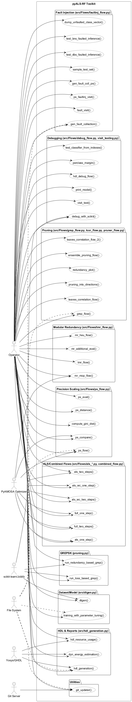
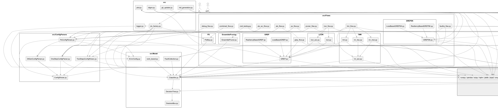
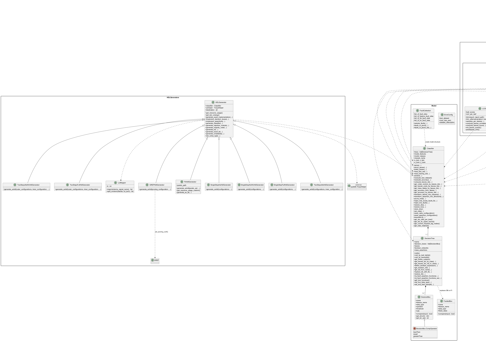
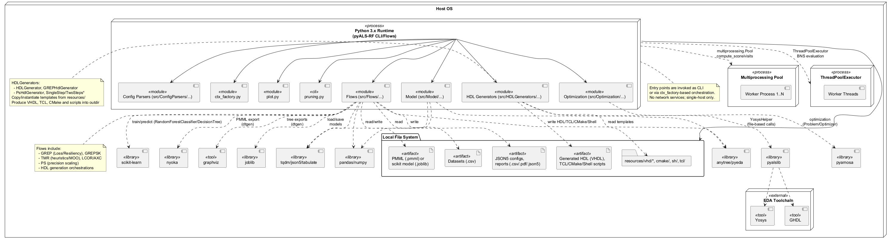

 

% 1 — System Overview
# SECTION 1 — System Overview

This repository implements “pyALS‑RF”, a software system that ingests trained decision tree–based classifiers (single DecisionTree or ensemble RandomForest), analyzes and transforms them into exact and approximate hardware accelerators, and evaluates trade‑offs between accuracy and implementation cost. The system provides multiple approximation flows (precision scaling, logic pruning, correlated leaf trimming, modular redundancy), supports multi‑objective optimization, generates synthesizable VHDL HDL together with testbenches, and includes comprehensive evaluation, reporting, and fault‑injection capabilities. It targets both algorithm designers and hardware integrators who need to co‑optimize machine learning inference and digital implementation metrics.

The scope covers the full toolchain around Random Forest/Decision Tree hardware acceleration from model import to HDL generation and evaluation. The codebase is structured around reusable Models and HDL generators, pluggable Approximation/Optimization Flows, and orchestration utilities. All behaviors and features described below are directly reflected in the source files provided.

## Purpose

The system’s purpose is to:
- Parse tree‑based ML models (PMML or joblib) and reconstruct an internal representation of decision trees, their decision boxes, and class assertion functions.
- Evaluate exact classifier behavior and resource usage, then apply approximation techniques that reduce hardware cost with bounded accuracy loss.
- Generate synthesizable VHDL for both exact and approximate accelerators, including testbenches and build scripts.
- Explore accuracy/cost Pareto fronts via multi‑objective metaheuristics (AMOSA via pyamosa) and export results for downstream use.
- Assess robustness via fault injection at feature, decision box, and Boolean network levels.

## High‑level Scope

The implementation constitutes a complete system, not a single subsystem. It spans:
- Configuration ingestion and context orchestration.
- ML model parsing and representation.
- Approximation and optimization flows with measurement loops.
- HDL generation for reference and approximated designs.
- Reporting, plotting, and artifact management (JSON5/CSV/PDF/VHDL/TCL/CMake).

It assumes binary decision trees, CSV datasets for testing/training, and availability of external dependencies (notably pyalslib for Yosys integration and pyamosa for optimization).

## Key Features Observed in the Codebase

The following features are strictly derived from the repository:

- Model ingestion and representation
  - PMML parsing and joblib model loading for scikit‑learn DecisionTreeClassifier and RandomForestClassifier (including a custom RandomForestClassifierMV majority‑vote variant).
  - Internal DecisionTree and DecisionBox abstractions, generation of Boolean networks (minterm SoP) per class.
  - Multicore prediction and leaf‑index computation; draw detection; per‑sample/leaf vote vectors.

- Exact and approximate HDL generation
  - Exact VHDL generation for classifiers, decision boxes, Boolean networks, majority voter and rejection module; testbench generation with vector emission.
  - Approximate HDL generation for:
    - Pruning (GREP): remove selected assertion minterms/leaves.
    - Precision Scaling (PS): feature bitmasking (NABS) propagated to decision boxes.
    - ALS (single/two‑step, and worst‑case variants): approximate assertion network mapping via LUT catalogs.
  - Resource and dynamic energy estimators at generator level, based on LUT/FF accounting and parametrized comparator types.

- Approximation flows
  - GREP (on internal decision trees):
    - Loss‑based and resiliency‑based pruning with validation split and accuracy bound; pruning configuration dumping; redundancy and cost modeling (depth/activity/combined).
  - GREP‑SK (on scikit‑learn ensembles):
    - Loss‑based and resiliency‑based pruning of sklearn estimators; validation/test accuracy tracking; constraint‑driven iterative leaf pruning and model checkpointing.
  - LCOR/LCOR‑AXC:
    - Cross‑tree leaf correlation via Q‑statistic; per‑leaf scores; iterative pruning subject to acceptable loss; variant with separate pruning/validation/test partitions and reports.
  - TMR/MR:
    - Modular redundancy approximations with per‑class tree selection; ranking heuristics (per‑tree accuracy, per‑sample margin), MR voting simulation (vectors), and multi‑objective MR optimization (MrMop).
  - Precision Scaling (PS):
    - Multi‑objective problem over feature NABS (and combined with ALS in full flows); baseline/validation split, rank‑based sampling heuristics, and Pareto front generation.

- Optimization and evaluation
  - Multi‑objective optimization via pyamosa (AMOSA): archive handling, checkpointing, grouping strategies, combined stop criteria.
  - ALS problems (single step and two steps, including worst‑case variants); first‑step per‑tree AIG‑based approximation catalogs (via pyalslib).
  - Validation/test metrics: baseline/pruned accuracy (with/without draw), margin and resiliency measures, cost accounting, and CSV/PDF reports.

- Fault injection and robustness analysis
  - Automatic sampling of fault sites:
    - Feature bit faults (respecting NABS), decision box faults, Boolean network/minterm faults.
  - Structured and list‑based JSON5 fault collections; batched visits injecting faults to measure detected/critical fault rates and per‑fault probabilities.

- Orchestration and utilities
  - Context factory (ctx_factory) to create configuration, classifier, optimizer/problem, and Yosys helper; flow persistence (.flow.json5).
  - Plot helpers (boxplots, scatterplots) and structured logging.
  - CLI script for GREP‑SK pruning over joblib models (pruning.py).
  - Dataset utilities for training/tuning/export to PMML (dtgen.py), including model cross‑validation against internal evaluator.

## Major Modules and Responsibilities

The repository is organized into coherent modules:

- Configuration Parsers
  - ConfigParser, DtGenConfigParser, PSConfigParser, OneStepConfigParser, TwoStepsConfigParser: parse JSON5 configuration files into typed structures for flows and optimizers.

- Model
  - Classifier: parsing (PMML/joblib), tree orchestration, multicore prediction, vote/margin utilities, pruning transformations, and direction‑file generation.
  - DecisionTree/DecisionBox: tree parsing, DB instantiation, minterm consolidation (optionally via espresso), visiting by leaf, fault modeling, and support for ALS flows.
  - FaultCollection: sampling and serialization of feature/DB/BN fault sets.
  - rank_based: dataset ranking and loss estimation for PS flows.

- Flows
  - GREP, GREPSK, LCOR, TMR families plus PS, ALS (one/two‑step, worst‑case), and auxiliary visit/faultinj flows: each encapsulates data splits, metrics, iteration heuristics, pruning configuration emission, and reports.

- HDL Generators
  - HDLGenerator and concrete generators (GREPHdlGenerator, PsHdlGenerator, SingleStep/TwoSteps variants): VHDL emission for exact and approximate designs; testbenches, TCL scripts, and build support; resource/energy estimators.

- Optimization
  - Problem definitions for ALS single/two‑step, worst‑case, combined PS+ALS, PS (reference and rank‑based), and TMR (MrMop). All integrate with pyamosa and use Classifier APIs for evaluation.

- Utilities
  - ctx_factory for lifecycle orchestration; plot helpers; logger configuration; git_updater; hdl_generation orchestration and reporting.

## Primary Inputs and Outputs

- Inputs
  - Trained models: PMML files or joblib dumps (DecisionTree/RandomForest).
  - Datasets: CSV test/training files with configurable separators and outcome column.
  - Flow configurations: JSON5 with optimization parameters, error constraints, output directories.
  - Optional pruning configurations and fault collections in JSON5.

- Outputs
  - HDL deliverables: VHDL sources, testbenches, TCL projects, CMake and build scripts under the configured outdir.
  - Approximation artifacts: pruning configurations, per‑class/per‑tree configs, direction files, Pareto fronts, caches, and checkpoints.
  - Reports and plots: CSV summaries (accuracy, loss, nodes/energy), PDF boxplots/scatterplots, intermediate indices (MOP/validation/test), and logs.

## Notable Constraints and Assumptions

- Only binary decision trees are supported when parsing PMML.
- Accuracy metrics optionally treat “draws” (ties in class votes) as correct or incorrect, depending on context.
- External dependencies are required at runtime (e.g., pyalslib for Yosys and ALS cataloging, pyamosa for AMOSA, scikit‑learn, nyoka, numpy/scipy/pandas, anytree/pyeda, jinja2).
- Resource and energy estimation models in HDL generators are parameterized and include fixed per‑comparator figures defined in code.

This overview reflects concrete capabilities and interfaces observed in the codebase and establishes a common vocabulary and scope for subsequent architecture views.

% 2 — Architectural Context
## 2. Architectural Context

This section describes the system’s external environment as it is evident from the codebase. It clarifies which external systems, libraries, and toolchains are used; what file and programmatic interfaces are exposed; what data sources are read or produced; and who the actors are as they appear in the implementation. No diagrams are provided in this section.

### External Systems

- Logic synthesis and HDL tooling:
  - Yosys and GHDL, invoked through pyalslib.YosysHelper (HDLGenerators/*, hdl_generation.py). The code generates VHDL, TCL, and shell scripts to drive synthesis/simulation flows.
  - CMake toolchain, targeted via generated CMakeLists.txt and bundled cmake support files (HDLGenerators/HDLGenerator.py).
- Machine learning stack:
  - scikit-learn (RandomForestClassifier, DecisionTreeClassifier) and a local extension RandomForestClassifierMV (src/scikit/RandonForestClassifierMV.py).
  - nyoka.skl_to_pmml and sklearn2pmml for PMML export (src/dtgen.py).
- Boolean/logic utilities:
  - PyEDA (espresso_exprs via pyeda.inter) for optional logic minimization of Boolean networks (src/Model/DecisionTree.py).
- Numerical and data tooling:
  - NumPy, pandas, SciPy (statistics), matplotlib, tqdm (progress), tabulate (reporting), joblib (model I/O), json5 (config/result I/O).
- Version control:
  - Git (GitPython) for self-update support (src/git_updater.py).
- Operating system and shell:
  - OS filesystem and process environment for reading/writing artifacts (VHDL, TCL, CSV, JSON5, PDFs) and for executing generated scripts (HDL flows).

### APIs / Interfaces

- Python API (library usage):
  - Core model API: Classifier, DecisionTree, DecisionBox (src/Model/*).
  - Optimization problems: PsMop, RankBasedPsMop, MrMop, ALS-related MOPs (src/Flows/PS/*, src/Flows/TMR/*, src/Optimization/*).
  - Pruning and trimming flows: GREP/LossBasedGREP/ResiliencyBasedGREP, LCOR/LCOR_AXC, GREPSK variants, TMR flows and heuristics (src/Flows/*).
  - HDL generation utilities: hdl_generation, hdl_resource_usage, dyn_energy_estimation (src/hdl_generation.py) and HDLGenerators/*.
  - Context factory for CLI-style orchestration (src/ctx_factory.py).
- Command-line interface:
  - pruning.py provides a CLI for loss-based or redundancy-based GREPSK pruning over scikit-learn models.
  - Flow functions are structured for CLI integration via a context object (ctx), although the CLI wrapper itself is not included; ctx_factory establishes the expected object model and configuration loading.
- File-based interfaces (inputs/outputs):
  - Inputs:
    - PMML models (*.pmml) and scikit-learn models (*.joblib) (Classifier.pmml_parser/joblib_parser).
    - Datasets in CSV (training/testing); configuration files in JSON5 (ConfigParsers/*).
  - Outputs and intermediates:
    - Pruning configurations, per-class/tree configurations, leaf indices, direction files, and experimental summaries as JSON5/CSV (Flows/*).
    - HDL artifacts: VHDL sources, TCL scripts, shell scripts, CMake files, and testbenches (HDLGenerators/*).
    - Reports and plots: CSV summaries and PDF plots (plot.py usage, flows).
    - Checkpoints and caches for optimization (pyamosa checkpoint files and .cache directories).

### Data Sources

- Supervised learning datasets:
  - CSV files with features and labels; split into training/testing, as configured via DtGenConfigParser and PSConfigParser.
  - Derived indices for MOP/validation/test subsets (mop_indexes.txt, val_indexes.txt, tst_idx.txt).
- ML models:
  - PMML exported models (from nyoka/sklearn2pmml) and joblib-persisted scikit-learn models.
- Configuration and results:
  - JSON5 configuration files for flows and optimizers (OneStep/TwoSteps/PS parsers).
  - Generated pruning and fault injection artifacts (e.g., pruning_configuration.json5, per_class_cfg.json5, per_tree_cfg.json5, leaves_idx.json5, leaf_pruning_directions.json5).
  - Fault collections for features/DBs/BNs (feat_faults.json5, dbs_faults.json5, bns_faults.json5), including list- and map-based variants (src/Model/FaultCollection.py and src/Flows/faultinj_flow.py).
- HDL resources:
  - Template VHDL modules, TCL scripts, shell scripts, and cmake files under the packaged resources directory used by HDLGenerators.

### Users / Actors

- Command-line operator:
  - Interacts with pruning.py and flow entry points (e.g., grep_flow, lcor_flow, tmr_flow, ps_flow, als_* flows) by providing paths to models, datasets, and configuration files; receives reports and generated artifacts in output directories.
- Python integrator/developer:
  - Uses the Python API directly to construct Classifier instances, run flows/optimizations, and generate HDL or analysis artifacts programmatically via the provided modules and context factory (ctx_factory).

% 2.1 — Architectural Context – Use Case Diagram
# Section 2.1 — Architectural Context – Use Case Diagram

This section presents the system-level use cases of the pyALS-RF toolkit as implemented in the repository. It shows how a primary operator interacts with the flows (precision scaling, pruning, modular redundancy, ALS-based, HDL generation, debugging, fault injection, dataset/model generation) and how external tools and libraries (PyAMOSA, scikit-learn/Joblib, Yosys/GHDL, Git server, file system) participate in these use cases. All use cases are named after the concrete functions and scripts present in the codebase to support straightforward validation by the development team.

Figure 2.1 — Use Case Diagram (pyALS-RF Toolkit)

Validation notes. The diagram enumerates every externally-invokable flow and helper present in the codebase:

- Precision Scaling: ps_flow, ps_eval, ps_distance, ps_compare, compute_gini_dist.
- Pruning: grep_flow, redundancy_plot, pruning_into_directions; LCOR: leaves_correlation_flow, leaves_correlation_flow_2; Ensemble: ensemble_pruning_flow.
- GREPSK script: run_loss_based_grep, run_redundancy_based_grep.
- Modular Redundancy: tmr_flow, mr_heu_flow, mr_mop_flow, mr_additional_eval.
- ALS/Combined: als_one_step, als_two_steps, als_wc_one_step, als_wc_two_steps, full_one_step, full_two_steps.
- HDL: hdl_generation, hdl_resource_usage, dyn_energy_estimation.
- Debugging: debug_with_scikit, hdl_debug_flow, print_model, visit_test, test_classifier_from_indexes, perclass_margin.
- Fault Injection: gen_fault_collection, fault_visit, dump_unfaulted_class_vector, test_bns_faulted_inference, test_dbs_faulted_inference, sample_test_set, gen_fault_coll_ps, ps_faultinj_visit.
- Dataset/Model: training_with_parameter_tuning, dtgen.
- Utilities: git_updater.

External actors are bound to use cases consistently with the implementation, for example PyAMOSA is used by optimization flows, scikit-learn/Joblib by model training and GREPSK, and Yosys/GHDL by HDL generation and resource/energy estimations. The file system is involved wherever configurations, datasets, or outputs are read or written. The diagram can be verified against the corresponding modules and function names in the repository.

% 3 — Containers
## 3. Containers

This section identifies the concrete runtime containers involved when executing this codebase. It focuses on deployable applications, external tools/services, and persistent data stores that the system uses at runtime. Source modules are grouped by the process that hosts them to avoid duplicating implementation details while preserving completeness of responsibilities.

| Container | Responsibility | Technology | Communication |
|---|---|---|---|
| pyALS-RF Core Application (Python process) | Hosts all domain logic and orchestration for model parsing, evaluation, approximation, optimization, HDL generation, reporting, and fault injection. Concretely implements: configuration parsing (src/ConfigParsers/*.py), model representation and inference (src/Model/*.py), flows and orchestrators (src/Flows/als_flow.py, als_wc_flow.py, combined_flow.py, grep_flow.py, lcor_flow.py, tmr_flow.py, pruner_flow.py, faultinj_flow.py, debug_flow.py, visit_testing.py), GREP/LCOR/TMR algorithms (src/Flows/GREP/*, LCOR/*, TMR/*, EnsemblePruning/*), optimization problems (src/Optimization/*), HDL generation (src/HDLGenerators/*), utilities (ctx_factory.py, hdl_generation.py, plot.py, logger.py, git_updater.py), dataset/model generation (dtgen.py), and the custom scikit wrapper (src/scikit/RandomForestClassifierMV.py). | Python 3; NumPy, SciPy, pandas, scikit-learn; pyamosa (metaheuristic optimizer); pyalslib (Yosys/GHDL integration, LUT mapping); anytree, pyeda, joblib, json5, matplotlib; multiprocessing.Pool, ThreadPoolExecutor. | Local in-process calls; multiprocessing IPC; file I/O (CSV, JSON5, joblib, PMML, PDF, VHDL); subprocess/CLI via pyalslib to EDA tools; optional Git network I/O via GitPython. |
| GREP-SK CLI (standalone) | Standalone command-line tool to prune scikit-learn RandomForest models without PMML: loads a .joblib model and a test CSV, performs loss- or resiliency-based pruning, saves pruned model and reports (src/pruning.py, src/Flows/GREPSK/*). | Python 3; scikit-learn; NumPy/pandas; joblib; tqdm; json5. | CLI arguments; file I/O (CSV, joblib, JSON5, CSV reports). |
| EDA Toolchain (external) | Logic synthesis/simulation toolchain used during HDL generation and resource/energy estimation. Invoked through pyalslib/YosysHelper from HDLGenerators. Includes GHDL/Yosys flows, shell scripts, TCL, and VHDL resources. Also includes the C++ oracle used by VHDL testbenches (resources/vhd/tb/oracles_generator/tb_decision_box_fp.cc). | Yosys, GHDL, shell/TCL scripts; CMake/GCC/Clang for C++ testbench utility. | Subprocess execution (CLI), TCL scripting; file I/O (VHDL sources, generated netlists/artifacts, build artifacts). |
| File System Data Store | Persistent storage for inputs/outputs and intermediate artifacts: datasets (CSV), models (.pmml, .joblib), pruning configs and directions (JSON5), Pareto fronts (JSON/JSON5), fault collections (JSON5), indexes (TXT), reports (CSV, PDF), generated HDL trees/projects (VHDL, TCL, scripts). Written and read across flows and generators. | Local filesystem; text/binary files (CSV, JSON5/JSON, PMML, VHDL, TXT, PDF). | File I/O only. |
| Git Remote Repository (optional) | Remote VCS used by git_updater.py to fetch/pull updates of the repository and its submodules at runtime if invoked. | Git via GitPython (HTTPS/SSH). | Git protocol/HTTPS; network I/O triggered by git_updater.git_updater(). |

% 3.1 — Architecture Overview – Component Diagram
# Section 3.1 — Architecture Overview – Component Diagram

This section presents the component-level view of the software system as implemented in the repository. The diagram groups Python modules by package and shows their key dependencies and interactions with external libraries and tools. It is derived solely from the provided source code to ensure consistency with the actual implementation. The intent is to help both technical and non-technical stakeholders understand the main building blocks, their responsibilities, and how they collaborate to produce configuration-driven approximation flows, analysis, pruning, and HDL generation.

Figure 3.1-1 shows the complete set of modules, organized by package, and the principal “use” relationships among them. External technologies include scikit-learn, pyamosa, pyalslib/Yosys, scientific Python libraries, and the filesystem for configuration and artifacts.

Figure 3.1-1 — Component Diagram — Architecture Overview (components_overview_component_diagram.puml)

Notes for validation:
- Every Python module and the C++ utility in the repository is represented as a component within its package. Names match filenames exactly to ease cross-checking.
- Dependencies reflect explicit imports and calls observed in the source. For example, GREP components depend on Model.Classifier and DecisionTree; HDL generators depend on Model plus pyalslib.YosysHelper; Optimization problems depend on pyamosa and the Model; flows orchestrate configuration parsing, model creation, algorithm execution, and persistence.
- External components denote third-party libraries and the filesystem/toolchain used by the system as per the imports and usage patterns in the code.

% 4 — Components
## 4. Components

This section identifies all internal modules, classes, and public functions grouped by package. For each component, it states its primary responsibility and how it collaborates with others (imports, calls, data exchanged). The intent is to provide a verifiable map between concrete implementation artifacts in the repository and their runtime roles and dependencies. No diagrams are included here.

### 4.1. ConfigParsers

| Component | Responsibility | Interactions |
|---|---|---|
| src/ConfigParsers/ConfigParser.ConfigParser | Load a JSON5 configuration file into memory; expose it via self.configuration. | [json5] |
| src/ConfigParsers/ConfigParser.search_field_in_config | Read a top-level field from a configuration dict with optional default and mandatory checks; terminates on missing mandatory field. | [ConfigParser.ConfigParser] |
| src/ConfigParsers/ConfigParser.search_subfield_in_config | Read a nested field from a configuration dict with optional default and mandatory checks; terminates on missing mandatory field. | [ConfigParser.ConfigParser] |
| src/ConfigParsers/DtGenConfigParser.DtGenConfigParser | Extend ConfigParser to support dataset generation/IO fields (separator, outcome_col, attributes_name, classes_name, etc.). | [ConfigParser.search_field_in_config, ConfigParser.search_subfield_in_config] |
| src/ConfigParsers/OneStepConfigParser.OneStepConfigParser | Parse one-step ALS flow configuration: model path, output dir, error and ALS configs, optimizer params, termination criterion. | [json5, pyamosa.Config, pyamosa.CombinedStopCriterion, pyalslib.ALSConfig, Model.ErrorConfig.ErrorConfig, ConfigParser.search_*] |
| src/ConfigParsers/PsConfigParser.PSConfigParser | Parse Precision Scaling flow configuration: model paths, datasets, ALS config, optimizer (AMOSA) params, grouping strategies, termination criterion, working directories (checkpoints and cache). | [pyamosa.Config, pyamosa.CombinedStopCriterion, pyalslib.ALSConfig, Model.ErrorConfig.ErrorConfig, DtGenConfigParser, ConfigParser.search_*] |
| src/ConfigParsers/TwoStepsConfigParser.TwoStepsConfigParser | Parse two-steps ALS flow configuration: model paths, datasets, ALS config, two separate AMOSA optimizers and termination criteria. | [pyamosa.Config, pyamosa.CombinedStopCriterion, pyalslib.ALSConfig, Model.ErrorConfig.ErrorConfig, ConfigParser.search_*] |

### 4.2. Model

| Component | Responsibility | Interactions |
|---|---|---|
| src/Model/DecisionBox.DecisionBox | Encapsulate a single threshold comparison (feature, operator, threshold) with numeric type handling and bit-accuracy (nab) masking for doubles/ints. | [pyalslib.double_to_hex, pyalslib.apply_mask_to_double, pyalslib.apply_mask_to_int, numpy] |
| src/Model/DecisionBox.FaultedBox | Fault model for a decision box, forcing comparison output to a fixed boolean value. | [DecisionBox users] |
| src/Model/DecisionTree.DecisionTree | In-memory representation of a decision tree with decision boxes and boolean networks; parse PMML/joblib-derived structures; evaluate samples; compute costs and leaf indices; boolean network generation/minimization; inject and restore faults. | [anytree, pyeda.inter (espresso), pyalslib (YosysHelper, ALSGraph, ALSCatalog, negate), jinja2.Environment (templates), re, numpy, HDLGenerators expectations, GREP set_pruning_conf consumers] |
| src/Model/Classifier.Classifier | Central model orchestrator: parse model (.pmml or .joblib), manage test/train sets, parallel pools, tree visits, voting and draw detection, pruning transforms, accuracy evaluation, feature precision (nabs) setting, assertions configuration, BNs/DBs fault injection, prediction dumping, dataset linearization for acceleration. | [multiprocessing.Pool, concurrent.futures.ThreadPoolExecutor, numpy, pandas, anytree, joblib, sklearn (RandomForestClassifier, DecisionTreeClassifier), ..Model.DecisionTree.DecisionTree, ..Model.DecisionBox, ..Flows.GREP.GREP (config translation), FaultCollection, ctx_factory] |
| src/Model/ErrorConfig.ErrorConfig | Container for error-related config (max loss, dataset paths). | [ConfigParsers] |
| src/Model/FaultCollection.FaultCollection | Enumerate and sample fault sites across features, decision boxes, and boolean networks; persist faults to JSON5 (both dict and list layouts). | [Model.Classifier (tree metadata), scipy.stats.norm, random, tqdm, json5] |
| src/Model/rank_based.softmax | Compute softmax over a score vector. | [numpy] |
| src/Model/rank_based.dispersion | Auxiliary metric: dispersion around theta. | [numpy] |
| src/Model/rank_based.giniImpurity | Compute Gini impurity over probability vector. | [numpy] |
| src/Model/rank_based.dist_gini | Evaluate and save distribution of Gini impurity for correctly/incorrectly classified samples. | [Model.Classifier, plot.boxplot, numpy, tqdm] |
| src/Model/rank_based.datasetRanking | Rank dataset indices into C (correct) and M (misclassified) by Gini impurity; sorted for sampling heuristics. | [Model.Classifier, numpy, tqdm] |
| src/Model/rank_based.estimateLoss | Loss estimator for rank-based PS, sampling M then C under alpha/beta/gamma constraints. | [Model.Classifier, numpy] |

### 4.3. scikit adapter

| Component | Responsibility | Interactions |
|---|---|---|
| src/scikit/RandonForestClassifierMV.RandomForestClassifierMV | Subclass RandomForestClassifier to aggregate estimator predict_proba into majority-vote one-hot probabilities; thread-safe accumulation. | [sklearn.ensemble.RandomForestClassifier, joblib.effective_n_jobs, sklearn.utils.Parallel] |

### 4.4. Flows — Core pruning/approximation engines

| Component | Responsibility | Interactions |
|---|---|---|
| src/Flows/EnsemblePruning/EnsemblePruner.Pruner | Greedy ensemble pruner: splits test set, computes per-sample margins and tree contributions, iteratively removes least-impact tree, validates loss, emits pruning configuration. | [Model.Classifier, Model.DecisionTree, numpy, sklearn.model_selection.train_test_split, tqdm, copy] |
| src/Flows/GREP/GREP.GREP | Generalized Redundancy-based Ensemble Pruning engine over pyALS trees; dataset split, redundancy evaluation, cost calculation, leaf selection ordering, apply/restore pruning configurations, compare exact vs pruned behavior. | [Model.Classifier (pool, voting), Model.DecisionTree (leaves, asserts), numpy, sklearn.model_selection.train_test_split, scipy.stats.norm, tabulate, tqdm, json5] |
| src/Flows/GREP/LossBasedGREP.LossBasedGREP | GREP strategy: accept leaf pruning if validation loss is below max_loss threshold. | [GREP.GREP.evaluate_accuracy, GREP.GREP.set_pruning_conf] |
| src/Flows/GREP/ResiliencyBasedGREP.ResiliencyBasedGREP | GREP strategy: accept leaf pruning if residual redundancy across affected samples remains above min_resiliency. | [GREP.GREP.update_redundancy, GREP.GREP.set_pruning_conf] |
| src/Flows/GREPSK/GREPSK.GREPSK | GREP-like pruning directly on scikit RandomForestClassifier: compute leaf depths/activities, redundancy (EPI), prune leaves by cost criterion while monitoring validation loss; manage split and reporting. | [sklearn.ensemble.RandomForestClassifier, numpy, sklearn.model_selection.train_test_split, scipy.stats.norm, joblib, json5] |
| src/Flows/GREPSK/LossBasedGREPSK.LossBasedGREPSK | GREPSK loss-based trimming with fixed validation; produces report. | [GREPSK, sklearn.metrics.accuracy_score, tqdm, pandas] |
| src/Flows/GREPSK/ResiliencyBasedGREPSK.ResiliencyBasedGREPSK | GREPSK resiliency-based trimming; prunes if redundancy drop eta is within min_eta; produces report. | [GREPSK, sklearn.metrics.accuracy_score, pandas] |
| src/Flows/LCOR/lcor.LCOR | Leaf-correlation-based ranking and pruning over pyALS trees; compute Q-statistic correlations across leaves, derive scores weighted by literal count, prune within max_loss. | [GREP.GREP, itertools.combinations/product, numpy, tqdm, json5] |
| src/Flows/LCOR/lcor_axc.LCOR_AXC | LCOR variant with explicit validation/test split and score initialization; accumulates pruning configuration and reports; dumps indices. | [GREP.GREP, numpy, sklearn.model_selection.train_test_split, json5, csv, os] |
| src/Flows/TMR/mr_axc.MrAxC | Modular redundancy approximation core: sample DSE subsets, compute per-tree costs and predictions, majority vectors, thresholds tuning, configuration evaluation, cost evaluation, CFG export, and pruning CFG derivation. | [Model.Classifier (compute_leaves_idx, transforms), GREP.GREP (cfg from leaves), pyalslib.list_partitioning, multiprocessing.Pool, numpy, json5, tqdm] |
| src/Flows/TMR/mr_heu.MrHeu | Heuristic builder of MR configurations per class: rank trees by accuracy or margin (via Pruner utilities), evaluate draw/no-draw accuracy, dump configs and reports. | [MrAxC, EnsemblePruning.Pruner, pandas, numpy, multiprocessing.Pool] |
| src/Flows/TMR/mr_moo.MrMop | AMOSA problem for MR: decision variables are per-class tree selections; objectives are accuracy loss and cost. | [pyamosa.Problem, MrAxC] |
| src/Flows/TMR/tmr.TMR | GREP-like baseline for TMR: per-class best trees by per-tree accuracy; pruning configuration export; validation/evaluation including draw handling and per-class metrics. | [GREP.GREP, numpy, multiprocessing.Pool, tqdm, json5, pandas-like CSV] |

### 4.5. Flows — Orchestration and CLIs

| Component | Responsibility | Interactions |
|---|---|---|
| src/Flows/als_flow.als_one_step | Run single-step ALS optimization: parse config, generate exact HDL, run AMOSA SingleStepAlsMop, archive/plots, generate approximate HDL variants. | [ConfigParsers.OneStepConfigParser, Model.Classifier, Optimization.SingleStepAlsMop, pyamosa.Optimizer, HDL generation in Classifier] |
| src/Flows/als_flow.als_two_steps | Run two-steps ALS optimization: parse, generate exact HDL, run per-tree FirstStep and global SecondStep, archive/plots, generate approximate HDL combining steps. | [ConfigParsers.TwoStepsConfigParser, Model.Classifier, Optimization.SecondStepAlsMop, pyamosa.Optimizer] |
| src/Flows/als_wc_flow.als_wc_one_step | Worst-case single-step ALS optimization pipeline. | [OneStepConfigParser, Model.Classifier.wc_parse/wc_fix_ys_helper, Optimization.SingleStepAlsWcMop, pyamosa.Optimizer] |
| src/Flows/als_wc_flow.als_wc_two_steps | Worst-case two-step ALS optimization pipeline. | [TwoStepsConfigParser, Optimization.SecondStepAlsWcMop, pyamosa.Optimizer] |
| src/Flows/combined_flow.full_one_step | Combined (PS + ALS) single-step optimization pipeline. | [OneStepConfigParser, Optimization.SingleStepCombinedMop, pyamosa.Optimizer] |
| src/Flows/combined_flow.full_two_steps | Combined (PS + ALS) two-steps optimization pipeline. | [TwoStepsConfigParser, Optimization.SecondStepCombinedMop, pyamosa.Optimizer] |
| src/Flows/grep_flow.grep_flow | Run GREP trimming flow selected by approach and cost criterion; persist pruning config and redundancy plot. | [ctx_factory (load_configuration_ps, create_classifier), GREP.{LossBasedGREP,ResiliencyBasedGREP}, plot.boxplot] |
| src/Flows/grep_flow.redundancy_plot | Plot redundancy distribution and per-class E_pi values for scikit model vs pyALS dataset. | [joblib, numpy, Model.Classifier, plot.boxplot] |
| src/Flows/grep_flow.pruning_into_directions | Convert pruning configuration into direction files (dirs/ops) and optionally dump axc prediction vectors. | [Model.Classifier.transform_assertion_into_directions, GREP.set_pruning_conf, json5] |
| src/Flows/lcor_flow.leaves_correlation_flow | Run LCOR across a sweep of max_loss; dump per-sweep outputs. | [ctx_factory, LCOR.trim_alternative] |
| src/Flows/lcor_flow.leaves_correlation_flow_2 | Run LCOR_AXC with explicit fractions and paths; triggers full trim. | [ctx_factory, LCOR_AXC] |
| src/Flows/pruner_flow.ensemble_pruning_flow | Execute EnsemblePruner on pyALS classifier, emit pruning report, pruned tree indices, pruning configuration. | [ctx_factory, EnsemblePruning.Pruner, pandas, numpy, json5] |
| src/Flows/ps_flow.ps_flow | Run Precision Scaling with either full or rank-based problem; run AMOSA; save indexes and archive. | [ctx_factory, PsMop or RankBasedPsMop, pyamosa.Optimizer, numpy, plot] |
| src/Flows/ps_flow.ps_eval | Evaluate a single PS configuration (nabs) against test dataset; compute accuracy loss, retained bits. | [PSConfigParser, Model.Classifier, PsMop] |
| src/Flows/ps_flow.ps_distance | For all archive solutions, compute rho vs rho' distance metrics and plot distributions. | [PSConfigParser, pyamosa.Optimizer, Model.rank_based, plot.boxplot, plot.scatterplot] |
| src/Flows/ps_flow.ps_compare | Compare actual vs estimated Pareto fronts using rank-based estimator; scatter plots and boxplots of estimation error. | [PSConfigParser, pyamosa.Optimizer, PsMop, Model.rank_based.estimateLoss, plot] |
| src/Flows/ps_flow.compute_gini_dist | Compute and plot Gini impurity distributions; utility entrypoint. | [PSConfigParser, Model.Classifier, Model.rank_based.dist_gini] |
| src/Flows/tmr_flow.tmr_flow | Run TMR baseline flow (GREP-like). | [ctx_factory, TMR] |
| src/Flows/tmr_flow.mr_heu_flow | Run MR heuristic pipeline with optional excluded trees, dump pruning configs and CSVs. | [ctx_factory, MrAxC, MrHeu] |
| src/Flows/tmr_flow.mr_mop_flow | Run MR MOOP via AMOSA; dump archive and per-solution cfg files, pruning CFG, directions, summary. | [ctx_factory, MrAxC, MrMop, pyamosa.Optimizer, GREP.get_pruning_cfg_from_leaves_idx, pandas] |
| src/Flows/tmr_flow.mr_additional_eval | Post-process MR experiments: per-class accuracy/loss and node-count savings reports across MR orders and reps. | [ctx_factory, numpy, pandas, json5, re, Model.Classifier] |
| src/Flows/faultinj_flow.float64_to_bitstring/bitstring_to_float64/modify_bitstring | Utility conversions between float64 and bitstrings and bit modifications. | [struct] |
| src/Flows/faultinj_flow.inject_fault_feature/inject_fault_input | Apply feature-bit faults across dataset samples in-place. | [Model.Classifier context] |
| src/Flows/faultinj_flow.gen_fault_collection | Build fault collections (features/DBs/BNs) for a model and persist to JSON5. | [ctx_factory, Model.FaultCollection, GREP.set_pruning_conf] |
| src/Flows/faultinj_flow.fault_visit | Execute predictions under injected faults (feature/DBs/BNs), dump vectors, compute detection and criticality metrics. | [ctx_factory, GREP.set_pruning_conf, numpy, json5] |
| src/Flows/faultinj_flow.dump_unfaulted_class_vector | Persist original (unfaulted) class vectors for a test subset. | [ctx_factory, json5] |
| src/Flows/faultinj_flow.test_bns_faulted_inference/test_dbs_faulted_inference | Sanity tests for BNs/DBs fault injection and restoration correctness. | [Model.Classifier] |
| src/Flows/faultinj_flow.compute_faults_prob | Compute detected/critical fault percentages and per-sample probabilities. | [numpy] |
| src/Flows/faultinj_flow.sample_test_set | Randomly sample test indexes for fault injection experiments; save to JSON5. | [random, json5] |
| src/Flows/faultinj_flow.gen_fault_coll_ps | Build fault collections for PS configurations selected from Pareto by loss bins; includes accuracy re-evaluation on validation subset. | [ctx_factory, json5, numpy, tqdm, Model.FaultCollection] |
| src/Flows/faultinj_flow.ps_faultinj_visit | Batch run fault_visit across multiple PS configs loaded from ps_index. | [ctx_factory, json5] |
| src/Flows/debug_flow.debug_with_scikit | Cross-validate pyALS predictions vs scikit model probabilities on test set; log mismatches. | [ctx_factory, joblib, numpy, tabulate, tqdm, Model.Classifier] |
| src/Flows/debug_flow.none_hdl_debug_flow/pruning_hdl_debug_flow/ps_hdl_debug_flow/hdl_debug_flow | Debug flows to dump prediction internals, apply pruning configs, manage ctx. | [ctx_factory, json5] |
| src/Flows/visit_testing.visit_test | Build fault collections for selected PS solutions and save to per-config directories. | [json, json5, numpy, os, Model.FaultCollection] |
| src/Flows/visit_testing.test_classifier_from_indexes | Create per-sample vote vectors, per-class accuracies, leaves costs and labels for given index set; save to files. | [Model.Classifier, numpy, os] |
| src/Flows/visit_testing.perclass_margin | Compute and persist per-sample and per-class margins for a given index set. | [pandas, numpy, Model.Classifier] |

### 4.6. HDL Generators

| Component | Responsibility | Interactions |
|---|---|---|
| src/HDLGenerators/HDLGenerator.HDLGenerator | Base VHDL generator: compute resource/energy estimates; implement DBs and assertions to VHDL using templates; generate test benches, TCL, CMake scaffolding; manage YosysHelper; provide ALS-related hooks. | [pyalslib.YosysHelper, jinja2, distutils.dir_util, distutils.file_util, pathlib.Path, ..Model.Classifier, ..Model.DecisionTree, ..HDLGenerators.LutMapper, re, numpy] |
| src/HDLGenerators/LutMapper.LutMapper | Map SoP minterms into k-LUT netlists (AND/OR tiling) and instantiate LUT configs; utility for HDLGenerator. | [itertools.islice, logging] |
| src/HDLGenerators/GREPHdlGenerator.GREPHdlGenerator | Generate approximate HDL for GREP-pruned classifiers: apply pruning configuration, then render trees, assertions, rejection/majority voters and test benches. | [HDLGenerator, GREP.set_pruning_conf, jinja2] |
| src/HDLGenerators/PsHdlGenerator.PsHdlGenerator | Generate a directory of HDL variants for Precision Scaling pareto set; sets nabs per variant, renders assertions/trees/voters/TB/TCL/CMake. | [HDLGenerator, Model.Classifier.set_nabs, jinja2] |
| src/HDLGenerators/SingleStepAlsHdlGenerator.SingleStepAlsHdlGenerator | Single-step ALS HDL generator integrating pre-rendered assertions and trees; project scaffolding. | [HDLGenerator, jinja2] |
| src/HDLGenerators/SingleStepAlsWcHdlGenerator.SingleStepAlsWcHdlGenerator | Worst-case variant of SingleStep ALS HDL generator. | [HDLGenerator, jinja2] |
| src/HDLGenerators/SingleStepFullHdlGenerator.SingleStepFullHdlGenerator | Combined SingleStep (features + assertions) HDL generator; chunks config by tree and cell counts. | [HDLGenerator, jinja2] |
| src/HDLGenerators/TwoStepsAlsHdlGenerator.TwoStepsAlsHdlGenerator | Two-step ALS HDL generator for per-tree selected inner configurations. | [HDLGenerator, jinja2] |
| src/HDLGenerators/TwoStepsAlsWcHdlGenerator.TwoStepsAlsWcHdlGenerator | Two-step worst-case ALS HDL generator. | [HDLGenerator, jinja2] |
| src/HDLGenerators/TwoStepsFullHdlGenerator.TwoStepsFullHdlGenerator | Two-step combined (features + assertions) HDL generator; wires inner per-tree selections. | [HDLGenerator, jinja2] |

### 4.7. Optimization (AMOSA problems and bases)

| Component | Responsibility | Interactions |
|---|---|---|
| src/Optimization/BaseMop.BaseMop | Common initializer for optimization problems: clone classifiers for parallel evaluation, compute baseline accuracy, reset approximations. | [multiprocessing.cpu_count, copy, pyalslib.list_partitioning (via Model.Classifier), Model.Classifier] |
| src/Optimization/FirstStepAlsMop.FirstStepAlsMop | Tree-level ALS problem: choose assertion approximations per cell to minimize error probability and AIG nodes on preloaded samples. | [pyamosa.Problem, Model.DecisionTree (ALSGraph), multiprocessing.Pool] |
| src/Optimization/SecondStepBaseMop.SecondStepBaseMop | Driver for two-step ALS: run FirstStep per tree and collect Pareto sets; prepare arguments for SecondStep problems. | [BaseMop, FirstStepAlsMop, pyamosa.Optimizer, distutils.dir_util.mkpath, os] |
| src/Optimization/SecondStepAlsMop.SecondStepAlsMop | Classifier-level selection of per-tree ALS solutions; objectives: accuracy loss and AIG nodes. | [SecondStepBaseMop, pyamosa.Problem] |
| src/Optimization/SecondStepAlsWcMop.SecondStepAlsWcMop | Worst-case variant of SecondStep ALS using the same first-step solutions applied across all trees. | [SecondStepWcBaseMop, pyamosa.Problem] |
| src/Optimization/SecondStepWcBaseMop.SecondStepWcBaseMop | Prepare a single-tree first-step problem for WC flows and run AMOSA to get its Pareto set. | [BaseMop, FirstStepAlsMop, pyamosa.Optimizer, os] |
| src/Optimization/SingleStepAlsMop.SingleStepAlsMop | Single-step ALS problem: per-assertion selection across all trees; objectives: accuracy loss and gates. | [BaseMop, pyamosa.Problem, Model.Classifier] |
| src/Optimization/SingleStepAlsWcMop.SingleStepAlsWcMop | Single-step worst-case ALS problem: same config length across trees (validated) and replicated. | [BaseMop, pyamosa.Problem] |
| src/Optimization/SingleStepCombinedMop.SingleStepCombinedMop | Combined PS + ALS single-step problem: decision variables include per-feature nabs and assertion selections; 3 objectives (loss, retained bits, gates). | [BaseMop, pyamosa.Problem] |
| src/Optimization/SecondStepCombinedMop.SecondStepCombinedMop | Two-step combined problem: choose per-feature nabs and per-tree ALS solutions; 3 objectives. | [SecondStepBaseMop, pyamosa.Problem] |

### 4.8. Context, generation utilities, plotting, logging, updater

| Component | Responsibility | Interactions |
|---|---|---|
| src/ctx_factory.set_global_options | Initialize CLI context (logger, config path, ncpus, espresso flag, flow id). | [logger.configure_logger] |
| src/ctx_factory.create_yshelper | Instantiate and load YosysHelper in context. | [pyalslib.YosysHelper, logging] |
| src/ctx_factory.load_configuration_ps | Load PSConfigParser-based configuration into context; validate files; ensure outdir. | [PSConfigParser, pyalslib.check_for_file, distutils.dir_util.mkpath] |
| src/ctx_factory.load_flow/store_flow | Load/store a serialized flow descriptor (.flow.json5) in the outdir. | [json5, os] |
| src/ctx_factory.create_classifier | Build and prepare Model.Classifier in context: parse model, read test and training sets, set CPU parallelism. | [Model.Classifier, PSConfigParser] |
| src/ctx_factory.create_problem | Instantiate the optimization problem object into context depending on flow: PsMop/RankBasedPsMop or MrMop. | [Flows.PS.PsMop, Flows.TMR.mr_moo.MrMop] |
| src/ctx_factory.create_optimizer | Instantiate pyamosa optimizer; optionally applies variable grouping (DVG/DRG). | [pyamosa.Optimizer, pyamosa.DynamicRandomGroupingOptimizer, pyamosa.DifferentialVariableGrouping2, pyamosa.GenericGroupingOptimizer] |
| src/ctx_factory.can_improve | Detect and set previous archive as starting point for optimizer. | [os] |
| src/dtgen.read_dataset_from_csv/get_labels/to_one_hot | Parsing and basic label encoding utilities for CSV datasets. | [csv, numpy] |
| src/dtgen.get_sets/get_sets_no_split | Train/test split (or not) pipeline; logging sizes. | [sklearn.model_selection.train_test_split, logging] |
| src/dtgen.graphviz_export | Export decision trees to Graphviz .gv files. | [sklearn.tree.export_graphviz, graphviz] |
| src/dtgen.print_nodes/print_clf | Console diagnostic tree structure printer for sklearn models. | [sklearn.tree] |
| src/dtgen.save_model | Save sklearn model, pmml export, training/testing CSVs, and error plots; optional cross-validation via models_crossvalidation. | [nyoka.skl_to_pmml, joblib, Model.Classifier, plot.boxplot] |
| src/dtgen.training_with_parameter_tuning | Conduct grid/random search over RF hyperparameters; fit, log best params, save model artifacts. | [sklearn.model_selection.GridSearchCV/RandomizedSearchCV, RandomForestClassifierMV, numpy, pandas, tqdm] |
| src/dtgen.dtgen | Train a DT or RF with specific hyperparams; save artifacts. | [RandomForestClassifierMV or DecisionTreeClassifier, save_model] |
| src/hdl_generation.hdl_generation | High-level HDL generation orchestrator across flows (exact + approximate). Computes and logs resource usage; delegates to correct HDLGenerator. | [ctx_factory, HDLGenerators.*, pyamosa.Pareto] |
| src/hdl_generation.hdl_resource_usage | Compute and report LUT/FF resource estimates for exact and approximate configurations (GREP or PS). | [HDLGenerator, GREPHdlGenerator, PsHdlGenerator, json5, pandas] |
| src/hdl_generation.dyn_energy_estimation | Estimate dynamic energy for exact and approximate classifiers and report. | [HDLGenerator, GREPHdlGenerator, pandas] |
| src/plot.scatterplot/boxplot | Matplotlib wrappers for consistent publication-ready plots with annotations. | [matplotlib, numpy] |
| src/logger.CustomFormatter/configure_logger | Console and file logging setup with colored console output; central logger factory. | [logging] |
| src/git_updater.git_updater | Fetch and pull updates for the repo (and submodules); indicate if restart is needed. | [gitpython] |
| pruning.py (module CLI) | Command-line driver for GREPSK flows (loss-based or redundancy-based) consuming a scikit model and CSV test set; dumps pruning config and report. | [LossBasedGREPSK, ResiliencyBasedGREPSK, argparse, pandas, joblib, numpy, logging, os, time] |

### 4.9. Resources

| Component | Responsibility | Interactions |
|---|---|---|
| resources/vhd/tb/oracles_generator/tb_decision_box_fp.cc | C++ test stimulus generator for floating-point decision box comparisons; prints pairs and relation flags as bitstrings. | [iostream, bitset, random] |

% 5 — Code-Level View
# Section 5 — Code-Level View

This section maps the system’s architectural elements to concrete source code artifacts, identifies the main program entry points, and summarizes the major modules and their responsibilities. It is intended to help developers and integrators validate that the codebase implements the described architecture and to locate implementation details efficiently.

## 5.1 Purpose and scope

The repository implements a toolchain to parse trained decision-tree/forest models (PMML or scikit-learn joblib), analyze and approximate them (via pruning, precision scaling, modular redundancy and logic-catalog–based approximations), evaluate impacts on accuracy and costs, and generate HDL for both accurate and approximate hardware implementations. The codebase is structured into cohesive Python packages reflecting configuration parsing, model and domain types, approximation flows, multi-objective optimization problems, HDL generation, and utilities. This code-level view details the mapping between these conceptual components and the source code elements actually present in the repository.

## 5.2 Entry points

The following entry points exist in the repository:

- pruning.py: Python CLI entry point for scikit-based GREP pruning flows.
  - Main: guarded by if __name__ == "__main__".
  - Commands implemented via argparse and functions:
    - run_loss_based_grep
    - run_redundancy_based_grep

There is no other module with a top-level __main__ block. The remaining modules provide callable functions to be used by a higher-level CLI (not included here) relying on the “Flows/*_flow.py” functions and the context factory.

## 5.3 Directory-level mapping and module responsibilities

This subsection lists every module in the repository and the classes and top-level functions it contains, together with a concise responsibility statement. Where applicable, it also highlights recognisable design patterns.

### resources/vhd/tb/oracles_generator

- tb_decision_box_fp.cc
  - Functions:
    - print_binary_64(stream, data)
  - Main: generates random 64-bit double pairs, prints their bit patterns and comparison outcomes (oracle generator for VHDL testbenches).

### src/ConfigParsers

- ConfigParser.py
  - Classes:
    - ConfigParser: base class; loads a JSON5 configuration file.
  - Functions:
    - search_field_in_config(configuration, field, mandatory=True, default_value=None)
    - search_subfield_in_config(configuration, section, field, mandatory=True, default_value=None)
  - Responsibility: robust JSON5 configuration accessors with mandatory/optional semantics.

- DtGenConfigParser.py
  - Classes:
    - DtGenConfigParser(ConfigParser): dataset generation/IO-related configuration (separator, outcome column, headers, names, training/hyperparam splits).
  - Responsibility: training/test data schema and parsing parameters.

- OneStepConfigParser.py
  - Classes:
    - OneStepConfigParser(ConfigParser): one-step ALS/optimization configuration (PMML path, outdir, ErrorConfig, ALSConfig, pyamosa optimizer, stop criterion).
  - Responsibility: configure single-phase ALS flows.

- PsConfigParser.py
  - Classes:
    - PSConfigParser(ConfigParser): Precision Scaling (PS) flow configuration, including dataset description (DtGenConfigParser), optimizer, grouping strategies, and stop criteria.
  - Responsibility: configure PS flow, including optimizer parameters and termination.

- TwoStepsConfigParser.py
  - Classes:
    - TwoStepsConfigParser(ConfigParser): two-step ALS/optimization configuration (first and second optimizers and termination criteria).
  - Responsibility: configure two-phase ALS flows.

Pattern notes: Configuration Parser hierarchy (specialization). Clear separation of concerns between flow types.

### src/Model

- Classifier.py
  - Top-level functions:
    - generate_boolean_function(expr, func_name)
    - extract_nodes_from_assertion(assertion)
    - clean_node_names_from_not(nodes)
    - evaluate_bns_mthd_per_sample(args)
  - Classes:
    - Classifier: central domain object. Parses PMML/joblib into DecisionTree structures, loads datasets, maintains multiprocessing Pool/ThreadPool, computes predictions, labels, leaves, votes, accuracy, transforms pruning configurations to “directions”, injects/restore faults, multi-thread/multi-process visits, and provides resource/evaluation utilities (including DB/BNS function generation).
  - Responsibility: in-memory representation and inference of trees/forests; concurrency configuration; interface to FLOWS/HDL/optimization. Uses external libs: numpy, pandas, anytree, sklearn, joblib, pyeda, pyalslib, tqdm.

- DecisionBox.py
  - Classes:
    - DecisionBox: typed comparator for a feature threshold with bit-precision control (nab). Supports double and integer variants, operator mapping, and “struct” export.
    - FaultedBox: DB variant with fixed boolean output, used for fault injection.
  - Responsibility: encapsulate node comparators (DBs) with precision scaling and fault models.

- DecisionTree.py
  - Classes:
    - DecisionTree: builds a tree from PMML or joblib-derived structures; compacts identical DBs, produces leaves and per-class boolean networks, supports visiting, pruning queries, boolean network minimization (optional via espresso), mapping to HDL blocks, ALS integration hooks, and FI helpers.
  - Responsibility: per-tree structural model, boolean network generation and visiting logic.

- ErrorConfig.py
  - Classes:
    - ErrorConfig: wraps error-related configuration (test dataset path, max loss percentage, and dataset description).
  - Responsibility: portability of error thresholds and dataset metadata.

- FaultCollection.py
  - Classes:
    - FaultCollection: enumerates feature/DB/BN fault sites, samples a set of faults statistically, and serializes them as JSON5 (both keyed dict and list variants).
  - Responsibility: FI campaigns preparation (site enumeration and sampling).

- rank_based.py
  - Functions:
    - softmax, dispersion, giniImpurity, dist_gini(classifier, outdir), datasetRanking(classifier), estimateLoss(…)
  - Responsibility: rank-based accuracy estimation and sampling to speed PS searches.

Pattern notes: rich domain model (Classifier, DecisionTree, DecisionBox) with Strategy elements (different visiting and evaluation strategies, FI injectors). Factory role for JSON->domain conversions in Classifier.pmml_parser/joblib_parser.

### src/Flows

Orchestrators implementing specific approximation strategies and analyses. They take a context (ctx) or arguments, use Classifier, and drive algorithms and artifact generation.

- EnsemblePruning/EnsemblePruner.py
  - Classes:
    - Pruner: tree-pruning heuristic over ensembles; computes margins, updates per pruned tree, validates accuracy on held-out sets, outputs pruning configuration tuples (class, tree, leaf SOP).
  - Responsibility: loss-minimizing pruning of decision trees inside a forest.

- GREP/GREP.py
  - Classes:
    - GREP: base “GREedy Pruning” flow over DecisionTree boolean networks; dataset splits, per-sample redundancy eval, leaf cost calculations, pruning configuration setters, validation, comparisons, common metrics.
    - Nested class CostCriterion: cost strategy enumeration (depth, activity, combined).
  - Responsibility: base template for leaf-level pruning algorithms on boolean networks.

- GREP/LossBasedGREP.py
  - Classes:
    - LossBasedGREP(GREP): concrete trim() applying tentative prunes when validation loss remains within a threshold.
  - Responsibility: loss-bounded pruning.

- GREP/ResiliencyBasedGREP.py
  - Classes:
    - ResiliencyBasedGREP(GREP): concrete trim() using redundancy (per-sample resiliency) thresholds and updates.
  - Responsibility: redundancy-based pruning.

Pattern notes: Template Method (GREP.trim is specialized by subclasses). Strategy (GREP.CostCriterion). Shared state via Classifier.pool (multiprocessing).

- GREPSK/GREPSK.py
  - Top-level functions: compute_sample_size
  - Classes:
    - GREPSK: GREP-like pruning but operating directly on scikit-learn RandomForestClassifier; leaf-depth/activity costs, redundancy metrics (EPI), structural “prune_leaf” edit operations, and accuracy checks.
    - CostCriterion: integer enum with crit_to_str converter.
  - Responsibility: pruning for scikit-learn forests with in-place tree edits.

- GREPSK/LossBasedGREPSK.py
  - Classes:
    - LossBasedGREPSK(GREPSK): pruning loop bound by validation loss; collects reports and persistence.
  - Responsibility: loss-bounded pruning (scikit).

- GREPSK/ResiliencyBasedGREPSK.py
  - Classes:
    - ResiliencyBasedGREPSK(GREPSK): pruning loop using eta/min-resiliency constraints.
  - Responsibility: resiliency-based pruning (scikit).

- LCOR/lcor.py
  - Classes:
    - LCOR(GREP): “leaves correlation”-driven scoring and pruning with tabu tracking and CSV reporting.
  - Responsibility: pruning guided by cross-tree leaf co-activation correlation.

- LCOR/lcor_axc.py
  - Top-level functions: compute_sample_size
  - Classes:
    - LCOR_AXC(GREP): LCOR variant with explicit validation/test splits and reporting into filesystem.
  - Responsibility: LCOR pruning with separate validation/test.

- PS/PsMop.py
  - Top-level functions: compute_sample_size
  - Classes:
    - PsMop(pyamosa.Problem): PS search problem (accuracy loss vs retained bits), using Classifier.set_nabs and constrained by max loss.
    - RankBasedPsMop(pyamosa.Problem): rank-based estimation to reduce evaluations; can post-correct archive for actual accuracy.
  - Responsibility: optimization problems for PS (AMOSA).

- TMR/mr_axc.py
  - Top-level functions: compute_sample_size
  - Classes:
    - MrAxC: modular redundancy exploration utilities (sampling, per-tree accuracy, MR vectors, thresholds, costs, prediction vectors, export of pruning/directions). Uses multiprocessing for per-tree visits.
  - Responsibility: MR approximation groundwork and evaluation.

- TMR/mr_heu.py
  - Classes:
    - MrHeu: heuristic MR configuration generator (by per-tree accuracy or per-sample margin), reporting and exporting pruning configurations.
  - Functions:
    - rank_trees_per_margin(heu_solver)
    - rank_trees_per_accuracy(heu_solver)
  - Responsibility: MR heuristics over MrAxC.

- TMR/mr_moo.py
  - Classes:
    - MrMop(pyamosa.Problem): MOO problem for MR (accuracy loss vs hardware cost), binary per-tree-per-class variables.
  - Responsibility: MR optimization problem.

- TMR/tmr.py
  - Top-level functions:
    - tree_accuracy(tree, x_set, c)
    - tree_visit(tree, input_samples)
  - Classes:
    - TMR(GREP): pruning all leaves not in best MR-order trees per class; evaluates draw/no-draw metrics; exports reports and direction files.
  - Responsibility: deterministic MR approximation and evaluation.

- als_flow.py
  - Functions:
    - als_one_step(configfile, ncpus)
    - als_two_steps(configfile, ncpus)
  - Responsibility: ALS flows orchestration (single/two-step) including HDL generation and AMOSA runs.

- als_wc_flow.py
  - Functions:
    - als_wc_one_step(configfile, ncpus)
    - als_wc_two_steps(configfile, ncpus)
  - Responsibility: worst-case (WC) ALS flows.

- combined_flow.py
  - Functions:
    - full_one_step(configfile)
    - full_two_steps(configfile)
  - Responsibility: combined PS+ALS flows.

- debug_flow.py
  - Functions:
    - debug_with_scikit(ctx, output)
    - none_hdl_debug_flow(ctx, index, output)
    - pruning_hdl_debug_flow(ctx, index, results, output)
    - print_model(dump_file, pmml_file)
    - ps_hdl_debug_flow(ctx, index, results, variant, output) [pass]
    - hdl_debug_flow(ctx, index, axflow, results, variant, output)
  - Responsibility: debugging helpers (pyALS vs scikit comparators, HDL debug dumps).

- faultinj_flow.py
  - Functions (selected, complete list in file):
    - float64_to_bitstring, modify_bitstring, bitstring_to_float64, inject_fault_feature, inject_fault_input
    - gen_fault_collection(ctx, …)
    - fault_visit(ctx, …)
    - dump_unfaulted_class_vector(ctx, …)
    - test_bns_faulted_inference, test_dbs_faulted_inference
    - compute_faults_prob
    - sample_test_set, gen_fault_coll_ps, ps_faultinj_visit
  - Responsibility: FI dataset generation and campaign execution (DB/BN/feature faults), result summarization.

- grep_flow.py
  - Functions:
    - grep_flow(ctx, fraction, approach, cost_criterion, minredundancy, maxloss, output)
    - redundancy_plot(ctx, output)
    - pruning_into_directions(ctx, pruning_conf, gen_val_set, val_idx, ncpus, output)
  - Responsibility: GREP flow orchestration and reporting.

- lcor_flow.py
  - Functions:
    - leaves_correlation_flow(ctx, output, fraction, maxloss_lb, maxloss_ub, loss_step, ncpus, report)
    - leaves_correlation_flow_2(ctx, fraction, fraction_validation, max_loss, ncpus, report_path, pruning_path)
  - Responsibility: orchestration and storage for LCOR variants.

- pruner_flow.py
  - Functions:
    - ensemble_pruning_flow(ctx, method, fraction, n_trees, ncpus, report_path, configuration_path)
  - Responsibility: orchestration for ensemble pruning heuristic.

- ps_flow.py
  - Functions:
    - ps_flow(ctx, mode, alpha, beta, gamma, output)
    - ps_eval(configfile, nabs)
    - ps_distance(configfile, pareto=None)
    - ps_compare(configfile, outdir, pareto, alpha, beta, gamma, maxloss, neval)
    - compute_gini_dist(configfile, outdir)
  - Responsibility: PS orchestration, evaluation, and analyses.

- tmr_flow.py
  - Functions:
    - tmr_flow(ctx, output, fraction, ncpus, report, it, test_samples, mr_order, report_name)
    - mr_heu_flow(ctx, quantization_type, in_pruning, method, fraction, mr_order, ncpus, pruning_dir, csv_dir)
    - mr_mop_flow(ctx, alpha, beta, gamma, output, n_jobs=1, fraction=None)
    - mr_additional_eval(ctx, quantization_type, ncpus, exp_path, subpath_k, subpath_rep, k_lb, k_ub, k_step, nreps)
    - __unique_pareto(pareto) [module-local helper]
  - Responsibility: MR flow orchestration (deterministic, heuristic, MOO) and post-analyses.

- visit_testing.py
  - Functions:
    - visit_test(ctx, ps_dir, …)
    - test_classifier_from_indexes(ctx, quantization_type, indexes_path, ncpus, outpath)
    - perclass_margin(ctx, quantization_type, indexes_path, ncpus, outpath)
  - Responsibility: additional visit/testing utilities and per-class margin reporting.

Pattern notes: “Flows” implement orchestration and use common template methods or share utilities through base classes (e.g., GREP). They expose functional APIs for a higher-level CLI (via ctx_factory) rather than direct scripts.

### src/Optimization

- BaseMop.py
  - Classes:
    - BaseMop: common initialization for AMOSA problems; computes baseline accuracy; builds parallel classifier copies (note: the current version references self.error_config.test_dataset in other modules; in this BaseMop it accepts a classifier and ncpus).
  - Responsibility: shared problem initialization state.

- FirstStepAlsMop.py
  - Classes:
    - FirstStepAlsMop(pyamosa.Problem): per-tree first-stage ALS problem (error probability vs gate count) over a catalog; evaluates with multiprocessing.
  - Responsibility: search on ALS cell-level approximations.

- SecondStepBaseMop.py
  - Classes:
    - SecondStepBaseMop(BaseMop): coordinates first-step per-tree runs, collects Pareto sets, prepares second stage.
  - Responsibility: orchestration of two-step ALS search.

- SecondStepAlsMop.py
  - Classes:
    - SecondStepAlsMop(SecondStepBaseMop, pyamosa.Problem): second-stage ALS problem (accuracy loss vs gates) selecting per-tree configs.
  - Responsibility: second-stage ALS optimization.

- SecondStepWcBaseMop.py
  - Classes:
    - SecondStepWcBaseMop(BaseMop): “worst-case” variant running first-step for a representative tree.
  - Responsibility: WC-first stage orchestration.

- SecondStepAlsWcMop.py
  - Classes:
    - SecondStepAlsWcMop(SecondStepWcBaseMop, pyamosa.Problem): second-stage WC ALS problem.
  - Responsibility: second-stage WC ALS optimization.

- SecondStepCombinedMop.py
  - Classes:
    - SecondStepCombinedMop(SecondStepBaseMop, pyamosa.Problem): combined PS+ALS optimization (3 objectives).
  - Responsibility: combined optimization across features and assertions.

- SingleStepAlsMop.py
  - Classes:
    - SingleStepAlsMop(BaseMop, pyamosa.Problem): single-step ALS problem (accuracy loss vs gates).
  - Responsibility: single-phase ALS optimization.

- SingleStepAlsWcMop.py
  - Classes:
    - SingleStepAlsWcMop(BaseMop, pyamosa.Problem): single-step WC ALS problem.
  - Responsibility: single-phase WC optimization.

- SingleStepCombinedMop.py
  - Classes:
    - SingleStepCombinedMop(BaseMop, pyamosa.Problem): combined PS+ALS (3 objectives) in a single phase.
  - Responsibility: single-phase combined optimization.

Pattern notes: pyamosa.Problem subclasses encapsulate objective/constraint evaluation (Strategy). Second-step problems wrap first-step results (Template Method across steps).

### src/HDLGenerators

- HDLGenerator.py
  - Classes:
    - HDLGenerator: base HDL generator (VHDL emission). Computes resource/energy estimates; copies templates; generates classifier, tree blocks, assertions (mapping boolean networks to LUT k-ary structures), testbenches, TCL, CMake. Supports comparator type parametrization (comp64/16/8).
  - Responsibility: reference HDL generation and metrics.

- GREPHdlGenerator.py
  - Classes:
    - GREPHdlGenerator(HDLGenerator): generates approximate HDL given a pruning configuration (updates networks then emits per-tree HDL).
  - Responsibility: HDL generation for GREP-style pruned models.

- PsHdlGenerator.py
  - Classes:
    - PsHdlGenerator(HDLGenerator): generates per-variant HDL for a PS Pareto set, with PS-specific resource estimation.
  - Responsibility: HDL generation for sets of PS configurations.

- SingleStepAlsHdlGenerator.py
  - Classes:
    - SingleStepAlsHdlGenerator(HDLGenerator): single-step ALS HDL packager (uses reference HDL templates; writes project per configuration).
  - Responsibility: emission scaffolding for ALS single-step variants.

- SingleStepAlsWcHdlGenerator.py
  - Classes:
    - SingleStepAlsWcHdlGenerator(HDLGenerator): WC single-step ALS HDL scaffolding.
  - Responsibility: emission scaffolding for ALS-WC variants.

- SingleStepFullHdlGenerator.py
  - Classes:
    - SingleStepFullHdlGenerator(HDLGenerator): combined PS+ALS single-step HDL scaffolding.
  - Responsibility: emission scaffolding for combined variants.

- TwoStepsAlsHdlGenerator.py
  - Classes:
    - TwoStepsAlsHdlGenerator(HDLGenerator): two-step ALS HDL scaffolding; maps outer and inner configurations to per-tree files.
  - Responsibility: emission scaffolding for two-step ALS.

- TwoStepsAlsWcHdlGenerator.py
  - Classes:
    - TwoStepsAlsWcHdlGenerator(HDLGenerator): two-step WC ALS HDL scaffolding.
  - Responsibility: emission scaffolding for two-step ALS-WC.

- TwoStepsFullHdlGenerator.py
  - Classes:
    - TwoStepsFullHdlGenerator(HDLGenerator): combined PS+ALS two-step HDL scaffolding.
  - Responsibility: emission scaffolding for two-step combined variants.

- LutMapper.py
  - Classes:
    - LutMapper: maps boolean minterms into LUT-k netlists; emits instance params for LUT configuration.
  - Responsibility: boolean network technology mapping into LUT fabrics.

Pattern notes: Inheritance hierarchy for HDL generators. Strategy for LUT mapping granularity (k). Template-based file generation via Jinja2 (Factory/Builder flavor).

### src/scikit

- RandonForestClassifierMV.py
  - Classes:
    - RandomForestClassifierMV(RandomForestClassifier): overrides predict_proba to produce majority-vote one-hot aggregation across estimators; includes fake() helper for PMML export in dtgen.
  - Responsibility: adaptor around scikit’s RF to fit toolchain needs for proba/voting and PMML serialization.

### src (utilities and orchestration)

- ctx_factory.py
  - Functions:
    - set_global_options(ctx, …)
    - create_yshelper(ctx)
    - load_configuration_ps(ctx)
    - load_flow(ctx)
    - store_flow(ctx)
    - create_classifier(ctx)
    - create_alsgraph(ctx) [pass]
    - create_catalog(ctx) [pass]
    - create_problem(ctx, **kwargs)
    - create_optimizer(ctx)
    - can_improve(ctx)
  - Responsibility: application context assembly (Factory), choosing optimizers and problems, wiring configs and classifier.

- dtgen.py
  - Functions (selected, complete list in file):
    - read_dataset_from_csv, to_one_hot, get_labels, get_sets, get_sets_no_split
    - save_dataset_to_csv, graphviz_export, print_clf, print_nodes
    - training_with_parameter_tuning(…)
    - dtgen(…)
    - models_crossvalidation(…)
    - quantize_16, quantize_8
  - Responsibility: training, hyperparameter search, model export to joblib/PMML, dataset preparation and debugging.

- git_updater.py
  - Functions:
    - git_updater(directory)
  - Responsibility: update repo and submodules; report if restart is needed.

- hdl_generation.py
  - Functions:
    - hdl_generation(ctx, lut_tech, skip_exact, output, pruning_name)
    - hdl_resource_usage(ctx, …)
    - dyn_energy_estimation(ctx, …)
  - Responsibility: top-level HDL generation orchestration and resource/energy estimation for exact vs approximate designs.

- logger.py
  - Classes:
    - CustomFormatter(logging.Formatter)
  - Functions:
    - configure_logger(name, verbosity)
  - Responsibility: structured logging configuration for console/file.

- plot.py
  - Functions:
    - scatterplot
    - boxplot
  - Responsibility: plotting utilities for reports.

- Flows/*_flow.py modules
  - Responsibility: thin orchestration functions around the corresponding algorithmic classes (GREP/LCOR/TMR/PS/ALS) using ctx_factory to build context.

Pattern notes: ctx_factory acts as a Builder/Factory for the runtime composition of flows; flows serve as application services.

## 5.4 Recognizable design and structural patterns

The code demonstrates clear, conventional patterns:

- Layered modularization:
  - Configuration (ConfigParsers/*) → Domain (Model/*) → Algorithms/Flows (Flows/*) → Optimization (Optimization/*) and HDL generation (HDLGenerators/*) → Utilities and Orchestration (ctx_factory, hdl_generation, plot, logger).
- Template Method:
  - GREP defines common trimming scaffolding; LossBasedGREP and ResiliencyBasedGREP specialize behavior.
  - Two-step ALS problems build on SecondStepBaseMop and WC variant base classes.
- Strategy:
  - GREP.CostCriterion influences leaf cost; pyamosa.Problem subclasses provide different objective strategies; fault injection targets (features/DB/BN) are strategies encoded in FaultCollection and FI flows.
- Factory/Builder:
  - ctx_factory creates and wires classifiers, optimizers, problems, and helpers.
  - HDLGenerators use Jinja2 templates to build project artifacts.
- Adaptor:
  - RandomForestClassifierMV adapts scikit-learn RF predict_proba and cooperates with PMML export via fake().

## 5.5 Cross-cutting concerns, concurrency, and external dependencies

Concurrency is pervasive in evaluation-heavy paths:

- Classifier maintains a multiprocessing Pool (self.pool) and ThreadPoolExecutor (self.thd_pool); prediction paths (predict, compute_score, compute_indexes) and GREP/flows reuse it through Classifier.p_tree partitions.
- GREPSK manipulates scikit RandomForest structures directly and does not rely on Classifier.pool.
- TMR/MR utilities use multiprocessing Pools for per-tree evaluations and vector computations.

External dependencies (as used in code): numpy, pandas, sklearn, joblib, scipy, pyamosa, pyalslib (Yosys integration, helper functions), anytree, pyeda, jinja2, nyoka, tqdm, matplotlib, json5, gitpython. HDL resource templates live under resources/vhd and related folders and are copied/instantiated by HDLGenerator and derivatives.

## 5.6 Validation cues for maintainers

- Configuration parsing: All config fields referenced in OneStepConfigParser, PSConfigParser, TwoStepsConfigParser must be present in JSON5 config files; optional fields default as coded.
- PMML/joblib model parsing: Classifier.pmml_parser and joblib_parser populate DecisionTree structures and DecisionBox comparators; leaves and boolean networks can be inspected via DecisionTree.boolean_networks and DecisionTree.leaves to validate correctness.
- GREP pruning: set_pruning_conf updates in-place tree.boolean_networks, keeping “minterms”, “sop”, and “hdl_expression” coherent via DecisionTree.define_boolean_expression; correctness can be validated by GREP.compare, which contrasts exact vs pruned outcomes on validation sets.
- Precision scaling: Classifier.set_nabs delegates to all DecisionBox instances; PsMop and RankBasedPsMop use Classifier.get_total_retained for objective 2; HDL PsHdlGenerator.get_resource_usage_custom reflects NABs in DBs FFs/LUTs estimates.
- HDL generation: HDLGenerator.get_resource_usage and get_dyn_energy report counts/energies derived from mapped minterms; emitted VHDL is assembled in outdir/[exact|pruned|ax]/ with templates listed in HDLGenerator constants; GREPHdlGenerator first applies GREP.set_pruning_conf then emits HDL.
- Fault injection: FaultCollection enumerates sites across features/DBs/BNs and serializes; faultinj_flow applies faults and compares vectors vs original via compute_faults_prob.

This mapping comprehensively covers all modules, classes, and top-level functions present in the repository and ties them back to their architectural roles.

% 5.1 — Class Diagram
## SECTION 5.1 — Class Diagram

This section presents the complete static structure of the system as derived from the codebase. The PlantUML class diagram groups classes by module (packages) and captures inheritance, composition/aggregation, and key dependencies among the major subsystems: Model, HDL generators, approximation flows (GREP, GREPSK, LCOR, TMR, PS), configuration parsers, optimization problems, and the scikit integration. External library types (e.g., pyamosa, pyalslib, scikit-learn) are shown as external classes to clarify dependencies without introducing undocumented internals. The diagram is faithful to the implementation and does not introduce elements not present in the source.

The diagram shows:

- Model core with Classifier composing DecisionTree, which in turn composes DecisionBox and depends on FaultedBox for fault injection, matching the parsing and visiting logic in the code.
- All HDL generator subclasses of HDLGenerator, with dependencies to Classifier, YosysHelper, and LutMapper, and GREPHdlGenerator depending on GREP to set pruning configuration.
- Approximation flows in GREP, GREPSK, LCOR, and TMR packages with their inheritance and associations to Classifier or scikit models, exactly as implemented.
- PS flows (precision scaling) and all Optimization problem classes as pyamosa.Problem subclasses, including their hierarchy through BaseMop and the second-step abstractions.
- Configuration parsers hierarchy and their dependencies on ErrorConfig, ALSConfig, and pyamosa configurations.
- scikit integration via RandomForestClassifierMV subclassing sklearn RandomForestClassifier.
- The logging CustomFormatter used by the repository’s logger.

This class diagram is directly derived from the code and can be validated by inspecting the class definitions, imports, and attribute usage across the modules listed above.

% 6 — Cross-Cutting Concerns
## 6. Cross-Cutting Concerns

This section identifies and describes cross-cutting aspects that are implemented across multiple modules of the codebase. The goal is to make implicit systemic mechanisms explicit so that stakeholders can reason about quality attributes such as observability, robustness, performance, and operational concerns. All items below cite concrete code evidence to enable validation by the development team.

| Concern | Evidence from code | Description |
|---|---|---|
| Logging and observability | src/logger.py; pervasive getLogger("pyALS-RF") usage in modules under src/ (e.g., Flows/GREP/*.py, Flows/TMR/*.py, Flows/LCOR/*.py, Flows/*.py, HDLGenerators/*.py, Model/*.py) | A centralized logging strategy is implemented via a custom formatter and dual handlers (console + file). Modules obtain the named logger and emit INFO/DEBUG statements for major steps and progress. This enables traceability of flows (e.g., pruning, MR heuristics, PS optimization), HDL generation, accuracy evaluation, and resource estimation. |
| Progress indicators (UX) | Widespread use of tqdm in flows and model operations (e.g., GREP.evaluate_redundancy, EnsemblePruner.initialize_tree_ranking, PsMop.archived_actual_accuracy, many Flows/*) | Long-running computations display progress bars, improving operator observability during multi-sample evaluations, pruning loops, fault injections, and dataset ranking. |
| Configuration management | src/ConfigParsers/*.py (ConfigParser, OneStepConfigParser, TwoStepsConfigParser, PSConfigParser); src/ctx_factory.py (load_configuration_ps, create_optimizer); JSON5 configurations persisted under outdir | Configuration is externalized as JSON5 and parsed into strongly-typed structures (ALSConfig, pyamosa.Config, ErrorConfig). The factory module wires configurations into runtime contexts (ctx.obj), sets optimizer grouping strategies, checkpoint paths, cache directories, and termination criteria. |
| File system layout and persistence | distutils.dir_util.mkpath in Flows/* and HDLGenerators/*; extensive JSON5/CSV/NPY persistence (e.g., GREP.store_pruning_conf, various flows writing reports: report.csv, summaries, pruning_configuration.json5; numpy.savetxt for indices) | All flows create output directories deterministically and persist intermediates and results (archives, reports, test indexes, pruning configurations, HDL artifacts). This supports reproducibility and post-run analysis. |
| Serialization of models and artefacts | joblib dump/load (e.g., dtgen.save_model, Flows/debug_flow); PMML export (nyoka.skl_to_pmml in dtgen.py); JSON5 across flows; PDF plots via matplotlib | Models, optimisation archives, and analysis artefacts are serialized in standard formats to support cross-tool ingestion, verification and deployment pipelines. |
| Error handling and input validation | Assertions throughout (e.g., GREPSK.GREPSK.sort_leaves_by_cost; many flows with assert and exit(1)); guarded config access in ConfigParser.search_field_in_config and search_subfield_in_config with mandatory/optional flags; pyalslib.check_for_file | Defensive checks ensure required resources exist and configurations are well-formed. In many places failure paths call exit(1) or assert, which aborts execution rather than raising typed exceptions. Messages are logged or printed before exiting to aid diagnosis. |
| Concurrency and parallelism | multiprocessing.Pool in Classifier, GREP, MrAxC, TMR; concurrent.futures.ThreadPoolExecutor in Classifier; joblib.Parallel in scikit/RandonForestClassifierMV; list_partitioning from pyalslib for data partitioning | The system exploits multi-core parallelism for tree evaluation, accuracy computations, and heuristics. Classifier manages process and thread pools (p_tree partitioning) and provides batch scoring primitives to be composed by flows. Parallel sections are explicit and typically return aggregations (e.g., sum over starmap). |
| Lifecycle of pools (resource management) | Classifier.__del__ attempts thd_pool.shutdown() and pool.close(); Classifier.parse initializes pools | The Classifier owns thread and process pools and shuts them down in its destructor. Care must be taken to ensure parse() was called before destruction; otherwise attributes may be unset. |
| Dynamic evaluation of Boolean expressions | eval(...) in Model/DecisionTree.visit, visit_by_leaf_idx, get_num_nodes_4_sample; Flows/GREP/GREP.tree_visit_with_leaf | Boolean networks are represented as textual SoP expressions generated from PMML-derived trees and evaluated with Python eval. Expressions are owned and generated by the system (not user input), but this is explicitly a code execution surface. Treat the generation path as trusted-only and keep expressions from any untrusted runtime source. |
| Reproducibility and randomness | random.sample, random.choice (Model/FaultCollection, dtgen); numpy RNG in RandomizedSearchCV; std::random_device in resources/vhd/tb/...; many procedures do not fix seeds | Sampling (faults, validation splits outside scikit’s stratify), randomized hyperparameter search, and testbench vector generation depend on RNGs. There is no global seeding policy; reproducibility across runs requires explicit seeding by callers or extensions to accept a seed. |
| Reporting and analytics | CSV summaries via pandas in many flows (GREP SK dump_report, TMR flows, LCOR, mr_additional_eval); PDF plots via src/plot.py (boxplot, scatterplot); text tables via tabulate | Execution emits machine-readable reports and plots that quantify accuracy, loss, resource usage, energy estimates, node counts, and class metrics. This is essential for experiment traceability and model selection. |
| Test and diagnostic utilities | Flows/debug_flow.py (model parity checks vs scikit); Flows/visit_testing.py (evaluation helpers, per-class margins); HDLGenerators generate_exact_tb() VHDL testbenches; resources/vhd/tb/oracles_generator/tb_decision_box_fp.cc | The codebase includes utilities for validating PMML vs scikit behavior, writing validation vectors, generating VHDL testbenches, and C++ test vector generators for floating-point comparisons. These support verification across software and HDL. |
| Fault injection support (resilience evaluation) | Model/FaultCollection (site enumeration and sampling; JSON5 dump); Flows/faultinj_flow.py (fault injection across features, DBs, BNs; detection metrics) | Cross-cutting fault modeling and injection enable resilience assessment for both feature-level and logic-level faults. This integrates with classifier prediction flows and reporting to quantify detectability and criticality. |
| Code generation pipeline | HDLGenerators/* with Jinja2 templates and YosysHelper integration; hdl_generation.py orchestrator | HDL artefacts (exact and approximate) are generated uniformly from model structures. This cross-cuts flows by turning pruning/PS outputs into reproducible HDL builds and resource/energy estimates. |
| External tool integration and caching | pyamosa optimizer configs in ConfigParsers; optimizer checkpoints and cache_dir paths (e.g., PSConfigParser, TwoStepsConfigParser); yosyshdl usage via pyalslib.YosysHelper | Optimization runs cache archives and checkpoints; hardware synthesis/logic-minimization tooling is integrated through helpers to support efficient repeated runs. |
| Update mechanism (scm) | src/git_updater.py (pull/fetch, submodules update) | Provides a basic Git self-update helper. It is optional and not used by core flows, but it is a cross-cutting operational utility that touches the runtime environment. |
| Data visualization (publication-quality) | src/plot.py used by flows (e.g., GREP redundancy_boxplot, ps_distance) | Standardized plots for redundancy/error distributions and Pareto comparisons improve reproducibility of analysis and documentation of results. |
| Input/output formats and corrective parsing | JSON5 read/write throughout (e.g., pruning configs, faults, archives); visit_testing.py and faultinj_flow.py include corrective parsing for malformed JSON5-like content | The system favors JSON5 for its comments/tolerance. Some utilities sanitize input archives to handle non-JSON-compliant fragments, improving robustness when consuming external artefacts. |
| Security posture (absence of authn/z; eval usage) | No authentication/authorization modules; dynamic eval of internally-produced SoP; filesystem writes under configured outdir | The tooling targets offline experiments and HDL generation. There is no authn/z. Security-sensitive patterns include eval of expressions (trusted source), and reading/writing many files from configuration-provided paths. Operators should treat inputs as trusted or add validation to mitigate injection or path traversal risks when exposing as a service. |

% 7 — Quality Attributes and Rationale
## 7. Quality Attributes and Rationale

This section analyzes the quality attributes explicitly supported by the implementation. Each attribute is justified with concrete evidence taken from the source code (file paths, classes, methods), explaining the rationale behind the design choices. No statements are speculative; all entries are grounded in the codebase supplied.

| Quality Attribute | Evidence | Rationale |
|---|---|---|
| Performance (parallel inference) | Classifier uses multiprocessing.Pool and list partitioning to parallelize inference across trees in the forest: src/Model/Classifier.py: predict(), compute_score(), compute_indexes(), p_tree/list_partitioning; GREP/TMR flows reuse Classifier.pool and starmap over partitioned trees: e.g., src/Flows/GREP/GREP.py: evaluate_accuracy(), evaluate_redundancy(); src/Flows/TMR/mr_heu.py and mr_axc.py use Pool for per-tree evaluation. | Parallel decomposition over trees amortizes per-sample work and scales with CPU cores, reducing inference and evaluation latency for large ensembles. The partitioning boundaries are computed once and reused across calls, minimizing overhead. |
| Performance (thread-level parallelism) | ThreadPoolExecutor for multi-threaded boolean network evaluation: src/Model/Classifier.py: thd_pool and visit_acc_multhd_samples()/evaluate_bns_mthd_per_sample; mixed use with process Pool. | The design leverages threads for fine-grained operations (boolean nets over linearized DB outputs) while processes parallelize tree-level evaluation, matching Python’s GIL and workload characteristics. |
| Performance (data-reduction and sampling) | Statistically grounded sub-sampling across flows via compute_sample_size based on normal quantile: src/Flows/GREP/GREP.py, GREPSK.py, LCOR/lcor_axc.py, PS/PsMop.py and FaultCollection.compute_sample_size. | Reducing evaluation sets with a confidence/precision bound keeps pruning/optimization loops fast while preserving statistical validity of accuracy estimates. |
| Scalability (large forests and datasets) | ncpus clamped to tree count (Classifier.__init__/parse), dynamic partitioning of trees (list_partitioning), pool reuse; GREP/TMR process only necessary leaves and trees (e.g., GREP.set_pruning_conf updates networks in place). | Work scales linearly with number of trees, and the system avoids CPU oversubscription. In-place BN updates avoid re-materializing whole models, keeping memory and time proportional to deltas. |
| Maintainability (separation of concerns) | Clear layering: ConfigParsers/* (config I/O), Model/* (core representation and inference), Flows/* (algorithms), HDLGenerators/* (code generation), Optimization/* (AMOSA problems), ctx_factory.py (composition). | Responsibilities are decoupled across packages; flows can evolve independently from the core model and HDL backends. This eases local changes and targeted testing. |
| Maintainability (configuration and logging) | Centralized configuration objects: src/ConfigParsers/*.py; consistent logger wiring via src/logger.py and pervasive logger usage in flows and generators. | A single configuration source reduces drift across flows; consistent logging enables troubleshooting without modifying code paths. |
| Testability (cross-validation against scikit) | src/Flows/debug_flow.py: debug_with_scikit compares pyALS predictions vs scikit predict_proba; asserts on score equivalence; logs mismatches with tabulate. | A reference implementation is used to detect semantic regressions in parsing/inference; the checks are deterministic and detailed, enabling pinpointing errors. |
| Testability (fault injection and predict dumps) | src/Flows/faultinj_flow.py and Model/FaultCollection.py support sampling of fault sites (features/DBs/BNs), injection, restoration, and probability-of-detection metrics; Classifier.predict_dump dumps per-tree outcomes. | The ability to inject, restore, and quantify effects supports systematic validation of resiliency and quick repro of anomalous behaviors through deterministic dumps. |
| Reliability and Resilience (backup/restore) | GREP.backup_bns()/restore_bns() (src/Flows/GREP/GREP.py); Classifier.store_bns()/restore_bns(); DecisionTree.replace_db_with_fb()/restore_db(). | Risky transformations (pruning, FI) are wrapped with explicit backup/restore to guarantee model state integrity across experiments. |
| Reliability (defensive checks) | Extensive asserts across modules: config parsing (PSConfigParser/OneStepConfigParser/etc.), boundary checks in sampler splits, GREPSK.prune_leaf parent/sibling resolution, file existence checks, type checks. | Assertions provide early failure for inconsistent inputs and invariants, preventing silent corruption and making failure modes diagnosable. |
| Security/Safety (expression evaluation scope) | Boolean evaluation via Python eval on generated expressions: src/Model/DecisionTree.py: visit(), get_bns_functions(); expressions derive from PMML/joblib parsing only. | While eval is confined to model-derived expressions and controlled symbol tables (boxes_output), it still implies trust in model sources; the code keeps eval inputs programmatically generated, limiting injection vectors. |
| Extensibility (algorithm families) | GREP base with LossBasedGREP and ResiliencyBasedGREP (src/Flows/GREP/*); MR flows with heuristic and MOO variants (src/Flows/TMR/*); GREPSK for scikit models. | Strategy-like organization allows adding pruning/selection policies without touching the core model. Extensions compose with common evaluation and reporting utilities. |
| Portability (HDL backends and templating) | HDLGenerators use Jinja2 templates and YosysHelper abstraction; VHDL generation for exact and approximate models (e.g., HDLGenerator.generate_exact_implementation(), GREPHdlGenerator.generate_axhdl()). | Code generation is isolated, target formats are template-driven, and external tool integration is wrapped, enabling adaptation to different EDA flows with minimal code impact. |
| Observability (metrics and reports) | Rich logging throughout flows; CSV/JSON5 dumping of results and configuration (e.g., GREP.store_pruning_conf, LCOR_AXC.inner_trim CSVs, tmr_flow summary.csv, ps_flow archive JSON); plot utilities (src/plot.py). | The system produces reproducible artifacts (archives, indices, reports) and visualizations that facilitate offline analysis and regression tracking. |
| Resource Efficiency (estimation and savings) | HDLGenerators compute LUT/FF and energy estimates: HDLGenerator.get_resource_usage()/get_dyn_energy(); PsHdlGenerator.get_resource_usage_custom(); flows report savings percentages (hdl_generation.hdl_resource_usage/dyn_energy_estimation). | Resource-aware decisions (e.g., pruning N minterms) are guided by explicit cost models, enabling Pareto-oriented optimization and predictable hardware impacts. |
| Accuracy Preservation (baselines and loss) | Baseline accuracies calculated and compared consistently (GREP.evaluate_accuracy, GREPSK/LossBasedGREPSK.baseline/pruned metrics, PS/PsMop baselines, MR_HEU baseline vs approx loss). | All approximation flows gate decisions on measured accuracy deltas, ensuring quality constraints (e.g., max_loss) are respected. |
| Reproducibility (index dumps and checkpoints) | Flows dump MOP/validation/test indexes and checkpoints (e.g., ps_flow writes mop_indexes.txt/val_indexes.txt; LCOR_AXC saves idx files; AMOSA checkpoint files configured in parsers). | Persisting dataset splits and optimizer checkpoints enables deterministic reruns and cross-validation across different machines and sessions. |

% 8 — Deployment View
## 8. Deployment View

This section explains how the software is allocated to infrastructure and which runtime artifacts are produced, as derived strictly from the repository’s code. The system is a Python application that runs as a single-process, single-host toolchain with optional multiprocessing and external EDA tool invocation for HDL generation and analysis. No client–server or distributed deployment is implemented; all flows execute locally, interact with the filesystem, and optionally call external tools through Python bindings.

### Deployment artifacts

- Python application modules
  - Source tree under src/, including:
    - Core model and algorithms (src/Model, src/Optimization)
    - Flows (src/Flows) for pruning and approximation (GREP, GREPSK, LCOR, PS, TMR), HDL generation, fault injection, and evaluation
    - Configuration parsing (src/ConfigParsers)
    - HDL generators and mappers (src/HDLGenerators)
    - Utility and factory (src/ctx_factory.py, src/logger.py, src/plot.py, src/git_updater.py)
    - Data/scikit adapter (src/scikit/RandonForestClassifierMV.py)
    - Dataset/model generation utilities (src/dtgen.py)
    - Top-level orchestration functions (src/hdl_generation.py)
- Command-line entry point
  - pruning.py: CLI to run GREPSK-based pruning on scikit-learn models
- External resource templates for HDL flows
  - Referenced by src/HDLGenerators/HDLGenerator.py via resource_dir = "/resources/"
  - VHDL templates/sources, TCL scripts, shell scripts, constraints, and CMake fragments are copied into per-run output directories (e.g., exact/, pruned/, ax/variant_XXXXX/, ax/configuration_N/)
  - C++ helper for VHDL TB oracle generation under resources/vhd/tb/oracles_generator/tb_decision_box_fp.cc
- Generated artifacts (per flow, under configuration.outdir)
  - Optimizer outputs: report.csv, pareto_front.pdf, final_archive.json, .cache/ and checkpoint files (see pyamosa usage across flows)
  - Classifier dumps: classifier.joblib and classifier.pmml (from dtgen when used)
  - Pruning/approximation configs: pruning_configuration.json5, per_tree_cfg.json5, per_class_cfg.json5, leaves_idx.json5, leaf_pruning_directions.json5, considered_classes.json5
  - Index files: mop_indexes.txt, val_indexes.txt, tst_idx.txt, additional validation/MOP indexes depending on flow
  - Evaluation outputs: CSV reports (e.g., mr_report.csv, report.csv, summary.csv), JSON5 summaries, predicted vectors, margin and per-class reports
  - HDL project trees for exact and approximate implementations:
    - exact/ and pruned/ for GREP-based pruning
    - ax/variant_XXXXX/ or ax/configuration_N/ for PS/ALS/combined flows
    - Subfolders src/ (VHDL), tb/ (test benches), TCL project scripts, shell scripts (run_synth.sh, run_sim.sh, build.sh), constraints.xdc, CMakeLists.txt
  - Plots: redundancy_boxplot.pdf, error_boxplot.pdf, scatter plots for pareto comparisons

### Execution environment

- Runtime
  - Python 3.x
  - Local execution on a single host; multiprocessing via multiprocessing.Pool and thread pools (ThreadPoolExecutor) within the process
- Python dependencies (as imported in code)
  - Core: numpy, scipy, pandas, joblib, tqdm, json5, logging, enum, itertools, concurrent.futures, multiprocessing
  - ML: scikit-learn (RandomForestClassifier, DecisionTreeClassifier), nyoka (PMML export)
  - Optimization: pyamosa (optimizer, stop criteria, Pareto archive)
  - EDA binding/utilities: pyalslib (YosysHelper, ALSGraph, ALSCatalog and utilities)
  - Templating: jinja2
  - Graphs/trees: anytree, graphviz (optional export)
  - Plotting: matplotlib
  - Misc: tabulate, GitPython (git), pyeda (logic expressions)
- External tools (invoked via bindings or scripts)
  - GHDL and Yosys invoked through pyalslib.YosysHelper (loading GHDL, AIG generation, logic mapping/evaluation)
  - Shell scripts and TCL files placed in output HDL projects for downstream synthesis/simulation; constraints.xdc and TCL project scripts are emitted for vendor EDA tools (tool invocation itself is not implemented in Python code)
- Filesystem and OS
  - Extensive use of the local filesystem for inputs (PMML/joblib models, datasets) and outputs (JSON5, CSV, PDFs, VHDL/TCL/sh)
  - POSIX-like shell assumed by the provided sh/* scripts copied into output directories

### Dependencies between nodes

- Single-node topology
  - All modules and flows run on one host in a single Python process with internal multiprocessing/threading; there are no networked services, daemons, or remote RPC calls in the codebase.
- Intra-node dependencies (process boundaries)
  - Python process ↔ local filesystem: configuration intake (JSON5), dataset CSVs, model artifacts (joblib/PMML), and all generated reports, HDL projects, and plots
  - Python process ↔ external EDA toolchain: via pyalslib.YosysHelper calls (loading GHDL, synthesizing and analyzing boolean networks/graphs). The tool executables must be available on the same node and discoverable in PATH
  - Python process ↔ shell/TCL scripts: the code writes TCL/sh scripts into output directories; execution of these scripts is intended to be performed by the user or CI on the same node
- Concurrency/resource considerations
  - Multiprocessing uses cpu_count() by default and partitions work across cores (Classifier.p_tree and Pools across flows). Memory and CPU allocations are local to the single node
  - Long-running optimizations (pyamosa) use on-disk caches and checkpoint files in outdir subpaths; no shared-state across machines is implemented

% 8.1 — Deployment Diagram
# Section 8.1 — Deployment Diagram

This section describes the concrete runtime topology of the system as implemented in the codebase. The software runs as a Python process on a single host, orchestrating machine‑learning flows, pruning/heuristics, and HDL generation. Computation is parallelized with multiprocessing and thread pools, while hardware-oriented assets are produced by HDL generators that rely on external EDA toolchains via pyalslib. Inputs and outputs are exchanged exclusively through the local file system (datasets, models, JSON5 configurations, reports, and generated HDL sources). No networked services or distributed components are used.

## Figure 8.1 — System Deployment (PlantUML)

### Deployment rationale

The deployed system is a single-host Python application. Flows under src/Flows orchestrate model parsing (PMML or joblib), dataset loading, optimization (pyamosa), pruning and resiliency analysis, and finally HDL generation. Parallel computation is achieved through multiprocessing.Pool and ThreadPoolExecutor from within the same Python process. HDL generators read VHDL templates and scripts from resources and write generated sources, TCL, and build scripts to the output directory. Interactions with Yosys and GHDL occur through pyalslib’s YosysHelper via file-based command invocations; no network boundaries are crossed. All inputs and outputs (datasets, models, JSON5 configurations, Pareto archives, reports, and generated HDL) are persisted on the local file system for subsequent synthesis or analysis.

This diagram fully reflects the actual components, libraries, processes, and artifacts present in the codebase and can be validated by reviewing the imports, external tool invocations, and file I/O paths implemented across src/.

 