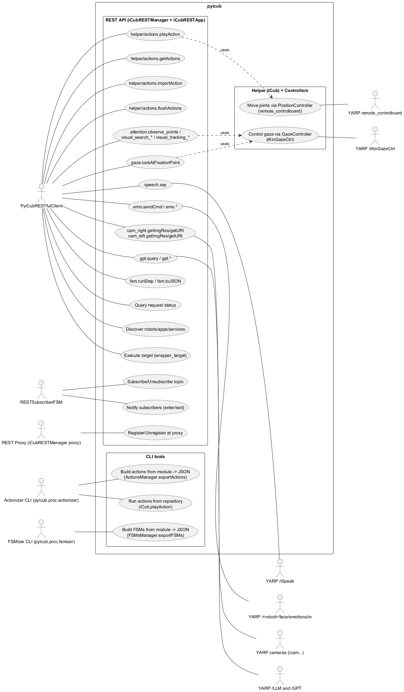
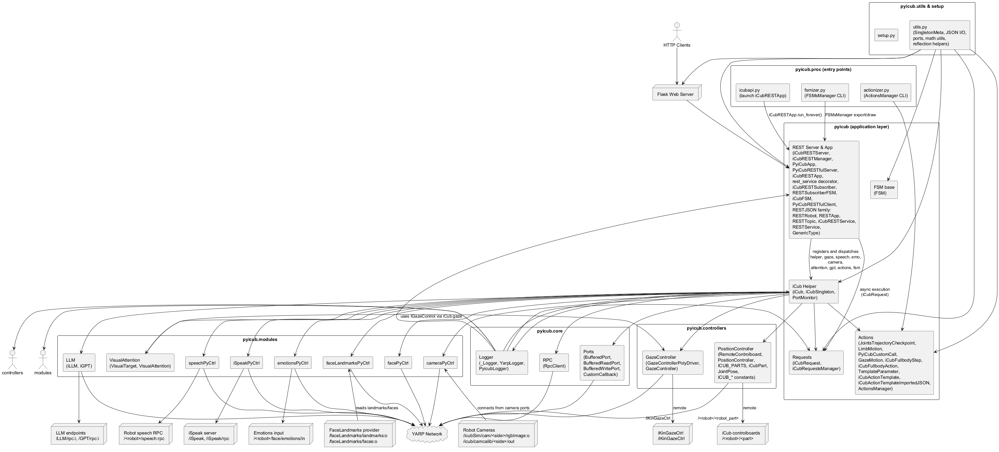
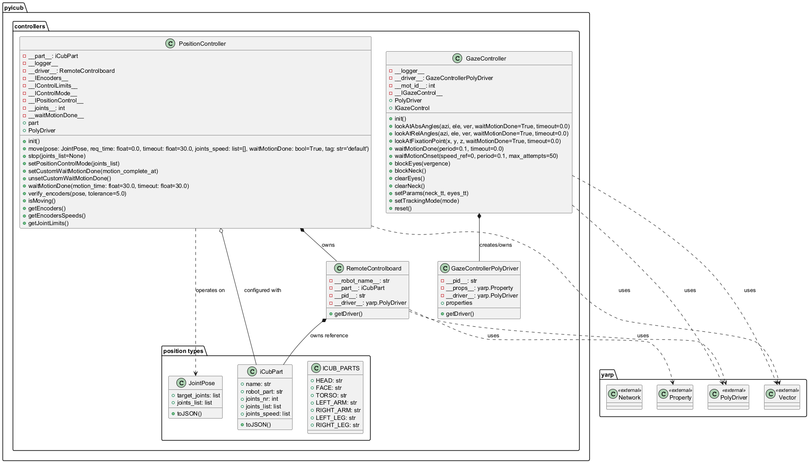
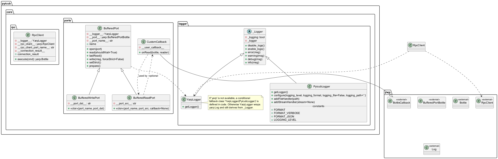
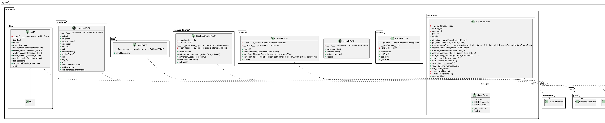
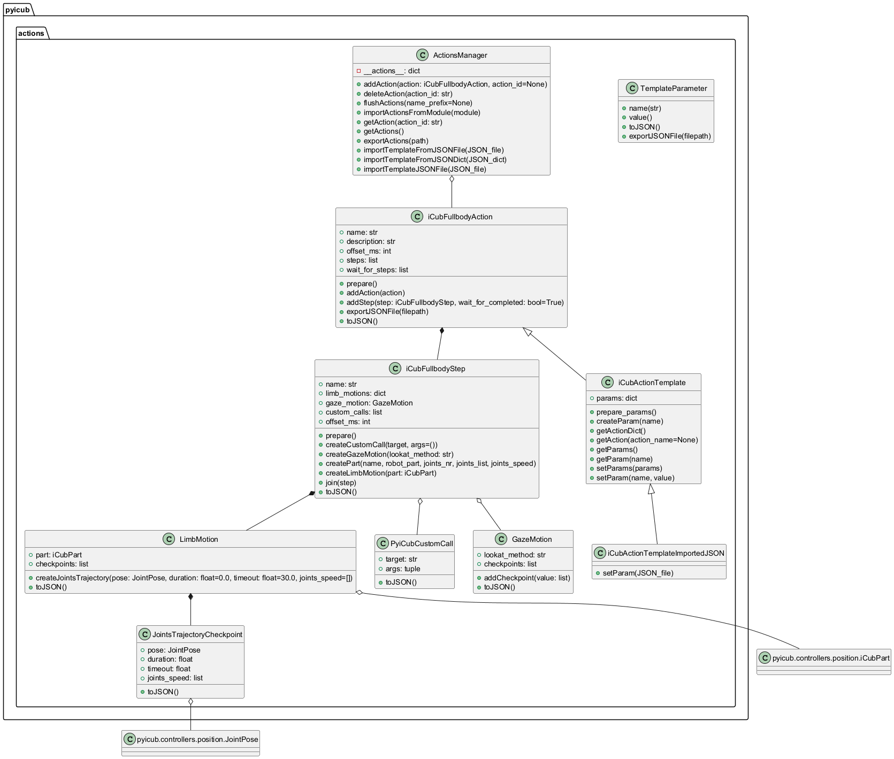
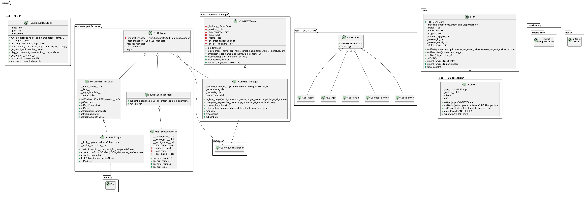
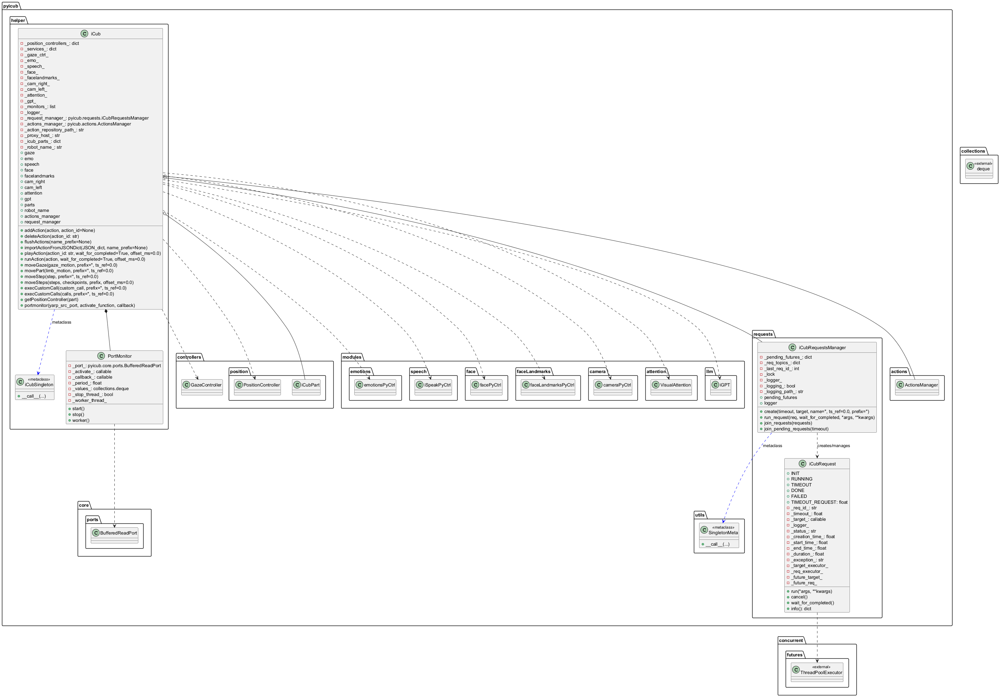
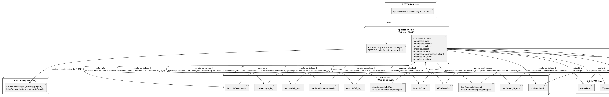

 

% 1 — System Overview
# SECTION 1 — System Overview

This section introduces the purpose, scope, and main capabilities of the pyicub software system as evidenced by the repository. It summarizes how the library is organized, what it provides to application developers and integrators, and the runtime environment and dependencies inferred directly from the codebase. No architectural diagrams are included in this section.

## Purpose and Scope

The pyicub repository provides a Python-based control and integration layer for the iCub humanoid robot via YARP (Yet Another Robot Platform). It exposes:

- Low-level robot controllers for joint positions and gaze through YARP drivers.
- Mid-level modules for speech, facial expressions, cameras, face landmarks, visual attention, and LLM-backed interaction.
- A high-level orchestration “helper” that composes controllers and modules into a unified runtime.
- An action system for defining full-body, multi-step movements (including gaze and custom calls) that can be exported/imported as JSON.
- A finite state machine (FSM) framework integrated with the action system and exposed over a REST API.
- A REST server exposing helper methods, controllers, FSMs, and actions as remote services, with subscription/notification for long-running requests.
- A concurrent request execution and monitoring subsystem for time-bounded, cancellable operations.

The scope of the repository is a complete application stack (library and server) for controlling iCub or icubSim. It includes command-line utilities to build and run action and FSM repositories, as well as a REST server process to expose robot skills to external clients.

## System Capabilities and Features

The system enables developers to build iCub applications in Python that:

- Command robot joints in position mode for head, torso, arms, hands, and legs using YARP remote_controlboard.
- Control and monitor the robot gaze using iKinGazeCtrl through a YARP client.
- Express facial emotions and raw face commands via YARP ports.
- Access camera image streams and camera host/port information; obtain network-accessible MJPEG URIs.
- Read face landmarks and number of detected faces from YARP topics through buffered read ports.
- Drive speech via iSpeak with synchronous completion detection, including speaking text from files or randomly from folders.
- Perform visual attention tasks (observe/search/track points or areas) safely within specified gaze angle ranges, using gaze motion and optional target providers.
- Interact with an external LLM/GPT through a YARP RPC protocol for status, query, session, and model control.
- Define reusable full-body actions with steps, per-limb trajectories, timeouts, gaze commands, and custom calls; serialize them to/from JSON; parameterize templates.
- Construct, run, and observe FSMs that orchestrate actions; integrate FSM transitions with REST subscription/notification for state entry/exit events.
- Execute all motions and services via an asynchronous request manager with per-request timeouts, thread-based execution, and optional CSV logging.
- Expose helper functions, controllers, actions, and FSMs via a REST server (Flask) with a proxyable registry, subscriber topics, and synchronous/asynchronous invocation; includes a Python REST client.

Runtime configuration supports both physical robot (“icub”) and simulator (“icubSim”) selection via environment variables, and optional logging and API enablement through environment-based configuration.

## Codebase Structure Summary

The following table lists all modules and files present in the repository and their responsibilities as implemented.

| Path | Responsibilities |
|------|------------------|
| pyicub/__init__.py | Package metadata: name, authors, emails, license, version, description. |
| pyicub/utils.py | Utility functions: SingletonMeta, vector ops (distance, norm), reflection helpers (getPublicMethods, getDecoratedMethods), package info, firstAvailablePort, JSON import/export. |
| pyicub/core/logger.py | Logging abstractions. YarpLogger proxies to yarp.Log when yarp present; PyicubLogger configures Python logging with stream/file handlers. Falls back to PyicubLogger if yarp not installed. |
| pyicub/core/ports.py | YARP port wrappers. BufferedPort with open/read/write/prepare; BufferedReadPort connects to source and optional callback; BufferedWritePort connects to destination. CustomCallback delegates to user callback. |
| pyicub/core/rpc.py | YARP RPC client wrapper with connection management and command execution (Bottle-based). |
| pyicub/controllers/position.py | Position control for robot parts over YARP remote_controlboard. Defines ICUB_PARTS taxonomy and iCubPart specifications (names, joints, speeds). PositionController initializes IEncoders, IControlLimits, IControlMode, IPositionControl, handles motion commands with speed/time, waitMotionDone policies, encoder verification, and exposes lower-level getters. Includes RemoteControlboard driver. |
| pyicub/controllers/gaze.py | Gaze control through iKinGazeCtrl via yarp.PolyDriver gazecontrollerclient. Provides absolute/relative angle look, 3D fixation point conversion, blocking/clearing eyes/neck, tracking mode, and motion onset/wait helpers with logging. |
| pyicub/modules/emotions.py | Face emotions sender over YARP via BufferedWritePort to /<robot>/face/emotions/in; helpers to set specific emotion patterns, color, brightness, and generic “set” commands. |
| pyicub/modules/face.py | Raw face command sender via BufferedWritePort to /<robot>/face/raw/in. |
| pyicub/modules/camera.py | Camera client using yarp.BufferedPortImageRgb. Connects to appropriate camera output (real or sim). Provides image resolution, underlying YARP port and host info, HTTP URI builder for image streaming, and cleanup on destruction. |
| pyicub/modules/faceLandmarks.py | Face landmarks subscriber using BufferedReadPort for /faceLandmarks/landmarks:o and /faces:o; maintains current landmarks and face count; getter helpers. |
| pyicub/modules/speech.py | Speech control. speechPyCtrl writes “say”, “setPitch”, “setSpeed” to /<robot>/speech:rpc. iSpeakPyCtrl writes text to /iSpeak and uses RPC to poll speaking status for sync completion; includes speaking from file/folder helpers with validation and logging. |
| pyicub/modules/llm.py | iLLM RPC client abstraction for an LLM service at /LLM/rpc:i; operations for status, query, system prompt, sessions, model selection, quit. iGPT specialization binds to /GPT/rpc:i. |
| pyicub/modules/attention.py | VisualAttention subsystem using gaze controller. Defines VisualTarget abstraction; safe angle checks; grid sampling on ellipsoids; observe workspace/scene/points; search target strategies; track moving points with stop support and locks; stable target waiting; structured logging. |
| pyicub/actions.py | Action model. JointPose, JointsTrajectoryCheckpoint, LimbMotion, GazeMotion, PyiCubCustomCall; iCubFullbodyStep and iCubFullbodyAction with JSON import/export and composition; parameterized templates (iCubActionTemplate, iCubActionTemplateImportedJSON) with substitution; ActionsManager for discovery/import from module, registry, and export. |
| pyicub/fsm.py | FSM abstraction using transitions GraphMachine. FSM with states, transitions, triggers, drawing, JSON import/export, runStep execution and session/state counts. iCubFSM extends FSM to bind actions (on_enter triggers play actions via app), import/export with actions, and integration with iCubRESTApp. |
| pyicub/requests.py | Asynchronous request execution. iCubRequest manages a target function in a single-thread executor with timeout, status (INIT/RUNNING/TIMEOUT/DONE/FAILED), cancellation and thread termination, timing metadata, and logging. iCubRequestsManager is a singleton that creates/launches requests, tracks pending futures, joins, logs optionally to CSV, and finalizes with callbacks. |
| pyicub/rest.py | REST infrastructure using Flask and CORS. Core entities (RESTJSON, RESTRobot, RESTApp, RESTTopic, iCubRESTService, RESTService). iCubRESTServer exposes registry endpoints, routes for listing robots/apps/services, proxying remote services, subscription/notification, and publish-subscribe topic management. iCubRESTManager adds request/process listings, registration/unregistration for services with proxy replication, and request-based execution semantics (sync/async). PyiCubApp wires logging, request manager, and optional REST manager via environment variables. PyiCubRESTfulServer registers utility and custom services, exposes decorated methods, and can attach an FSM. iCubRESTApp is the primary server for the iCub helper: it detects managed mode, owns or delegates to a remote helper, registers helper subservices (gaze, speech, emo, cameras, attention, gpt, actions), imports actions, and configures FSM integration. iCubRESTSubscriber and RESTSubscriberFSM implement subscription to FSM runStep events with enter/exit callbacks. PyiCubRESTfulClient provides a Python client for invoking services and managing requests. |
| pyicub/helper.py | High-level orchestrator. Initializes YARP, constructs and caches PositionControllers for all parts, builds/initializes GazeController, and lazily instantiates modules (emo, speech, face, facelandmarks, cameras, attention, gpt). Provides action lifecycle (import/export, play/run), motion execution (per-limb, steps, gaze), custom call execution, port monitoring, and request orchestration via iCubRequestsManager. Supports robot selection (icub/icubSim) via ICUB_SIMULATION. Includes singleton-by-robot-name behavior and graceful shutdown. |
| pyicub/proc/actionizer.py | CLI tool to build actions from a Python module to JSON, or run actions by ID from a JSON repository using iCub helper. |
| pyicub/proc/fsmizer.py | CLI tool to build/export FSMs from a Python module to JSON and graph images. |
| pyicub/proc/icubapi.py | Entrypoint that instantiates iCubRESTApp and starts the REST manager loop. |
| pyicub/requests.py (duplicate in table for clarity) | See above. |
| setup.py | Package setup referencing pyicub metadata. |

## External Dependencies and Runtime Environment

The implementation relies on the following external libraries and services, as seen in imports and usage:

- YARP (yarp): Required for all robot communications (PolyDriver, BufferedPort, RpcClient, Log, Vector, Network). Multiple modules call yarp.Network().init().
- Flask and Flask-CORS: REST server and CORS handling (flask, flask_cors).
- transitions: FSM state machine engine (GraphMachine).
- requests: HTTP client used by REST proxying, registry, and subscribers.
- numpy: Used in visual attention and speech modules (grid generation, RNG).
- threading, concurrent.futures: Request execution, callbacks, and subscription worker threads.
- Environment variables: ICUB_SIMULATION (selects “icub” vs “icubSim”); PYICUB_LOGGING, PYICUB_LOGGING_PATH (logging); PYICUB_API and PYICUB_API_* (REST manager host/port/proxy).

At runtime, the system can operate against a simulated robot (icubSim) or a real robot (icub), connects to specific YARP ports for motion controllers (remote_controlboard) and gaze (/iKinGazeCtrl), and can expose a REST API on a configurable host/port with an optional proxy for registry mirroring.

% 2 — Architectural Context
## 2. Architectural Context

This section describes the external systems, protocols, and interfaces that the codebase connects to, as well as the actors that interact with the system. All elements are derived from the repository and can be validated by inspecting classes, port names, and REST routes defined in the code.

### External Systems

- YARP middleware and network
  - Core device drivers and network APIs (yarp.Network, yarp.PolyDriver, yarp.BufferedPortBottle, yarp.RpcClient, yarp.BufferedPortImageRgb, yarp.Bottle).
  - Devices used:
    - remote_controlboard (motor/joint control).
    - gazecontrollerclient (iKin Gaze Controller client).
- iCub robot (hardware) or iCub simulator
  - Robot name “icub” (hardware) or “icubSim” (simulation), auto-selected via env var ICUB_SIMULATION.
  - Exposes remote YARP endpoints for joints, gaze controller, face/emotions, speech/iSpeak, cameras.
- iKin Gaze Controller
  - YARP server “/iKinGazeCtrl” used by GazeController via gazecontrollerclient device.
- iCub face and emotions modules
  - Emotions port “/<robot>/face/emotions/in”.
  - Face raw drawing port “/<robot>/face/raw/in”.
- iSpeak (text-to-speech)
  - Text port “/iSpeak”.
  - RPC server “/iSpeak/rpc”.
  - Alternate speech RPC “/<robot>/speech:rpc”.
- FaceLandmarks module
  - Publishers “/faceLandmarks/landmarks:o” and “/faceLandmarks/faces:o”.
- iCub cameras
  - icubSim: “/icubSim/cam/<side>/rgbImage:o”.
  - icub: “/icub/camcalib/<side>/out”.
- External LLM/GPT services via YARP RPC
  - LLM RPC server “/LLM/rpc:i”.
  - GPT RPC server “/GPT/rpc:i”.
- Flask-based REST server
  - Hosts the iCub REST Manager and service registry on HTTP; supports remote service discovery, invocation, and pub/sub notifications.
- Python libraries/frameworks
  - transitions (state machine/GraphMachine).
  - Flask + flask_cors (REST server and CORS).
  - requests (HTTP client).
  - numpy (numeric ops in attention).
  - logging (system logging).

### APIs / Interfaces

- YARP device/port interfaces (all local ports are opened by this code; all remotes must exist externally):
  - Gaze controller client
    - Device: gazecontrollerclient.
    - Local: “/pyicub/gaze/<pid>”.
    - Remote: “/iKinGazeCtrl”.
  - Remote controlboards (per iCub part)
    - Device: remote_controlboard.
    - Local: “/pyicub/<pid>/<robot>/<PartName>”.
    - Remote: “/<robot>/<robot_part>” (robot_part is one of head, torso, left_arm, right_arm, left_leg, right_leg, face).
  - Emotions
    - Local write: “/pyicub/emotions:o”.
    - Remote: “/<robot>/face/emotions/in”.
  - Face raw drawing
    - Local write: “/face/raw/out”.
    - Remote: “/<robot>/face/raw/in”.
  - FaceLandmarks
    - Local read: “/faceLandmarksPyCtrl/landmarks:i” ← “/faceLandmarks/landmarks:o”.
    - Local read: “/faceLandmarksPyCtrl/faces:i” ← “/faceLandmarks/faces:o”.
  - Cameras
    - Local read images: “/read/<side>_image:o”.
    - Remote:
      - icubSim: “/icubSim/cam/<side>/rgbImage:o”.
      - icub: “/icub/camcalib/<side>/out”.
  - Speech (two modes)
    - iSpeak:
      - Local write: “/pyicub/speech:o” → “/iSpeak”.
      - RPC client: local “/iSpeak/rpc/rpc_client/commands” → “/iSpeak/rpc”.
    - Robot speech:
      - Local write: “/pyicub/speech:o” → “/<robot>/speech:rpc”.
  - LLM/GPT RPC
    - LLM: local “/LLM/rpc:i/rpc_client/commands” → “/LLM/rpc:i”.
    - GPT: local “/GPT/rpc:i/rpc_client/commands” → “/GPT/rpc:i”.
- HTTP REST API (served by iCubRESTManager/iCubRESTServer)
  - Base: “http://<host>:<port>/pyicub”.
  - Service discovery and management:
    - GET “/” → version/info.
    - GET “/pyicub” → robots.
    - GET “/pyicub/tree” → registry tree.
    - GET “/pyicub/<robot>” → apps.
    - GET “/pyicub/<robot>/<app>” → services (targets).
    - POST “/pyicub/register” / “/pyicub/unregister” → remote registration/unregistration.
  - Target invocation:
    - GET/POST “/pyicub/<robot>/<app>/<target>”.
    - Query “?sync” to wait for completion; async returns a request URL.
  - Requests/processes introspection:
    - GET “/pyicub/requests”, “/pyicub/processes”.
    - GET “/pyicub/<robot>/<app>/<target>/<local_id>” → single request info.
  - Pub/Sub for target topics:
    - POST “/pyicub/subscribe” / “/pyicub/unsubscribe”.
    - POST “/pyicub/notify” (enter/exit events).
  - Helper app auto-registered services (when available for robot):
    - “helper/info”, “helper/actions.playAction”, “helper/actions.getActions”, “helper/actions.importAction”, “helper/actions.flushActions”.
    - Class-method export of “gaze.*”, “speech.*”, “emo.*”, “cam_right.*”, “cam_left.*”, “attention.*”, “gpt.*”.
  - iCubRESTfulServer app utilities:
    - “utils.configure”, “utils.getServices”, “utils.getArgsTemplate”, “utils.getArgs”, “utils.setArgs”, “utils.getArg”, “utils.setArg”.
  - FSM services for apps that attach an FSM:
    - “fsm.runStep”, “fsm.toJSON”.
- REST client-side interfaces
  - PyiCubRESTfulClient wraps HTTP calls to invoke targets (sync/async), play actions, query requests, and poll FSM.

### Data Sources

- YARP message streams
  - Face landmarks and face count: “/faceLandmarks/landmarks:o”, “/faceLandmarks/faces:o”.
  - Camera image streams: “/icubSim/cam/<side>/rgbImage:o” or “/icub/camcalib/<side>/out”.
  - Emotions and face raw command streams: “/<robot>/face/emotions/in”, “/<robot>/face/raw/in”.
  - Gaze controller and controlboards via device drivers and network connections.
  - iSpeak and speech RPC/command ports; LLM/GPT RPC ports.
- Local filesystem
  - JSON repositories for actions and FSMs (import/export through actions.py and fsm.py managers).
  - Speech text sources: plain-text files and folders (speech.iSpeakPyCtrl.say_from_file / say_from_folder_rnd).
  - Optional CSV request log file “pyicub_requests.csv” (when logging enabled).
- Environment variables
  - ICUB_SIMULATION (select “icubSim” vs “icub”).
  - PYICUB_LOGGING, PYICUB_LOGGING_PATH (logging toggle/path).
  - PYICUB_API, PYICUB_API_RESTMANAGER_HOST/PORT (enable and bind REST manager).
  - PYICUB_API_PROXY_HOST/PORT/SCHEME (proxy configuration).

### Users / Actors

- REST clients/integrators
  - External systems calling the HTTP API to invoke targets, play actions, manage FSMs, and subscribe to topics; optionally using PyiCubRESTfulClient.
- YARP services and devices
  - External YARP servers providing robot functionality consumed by this code: controlboards “/<robot>/<part>”, “/iKinGazeCtrl”, “/iSpeak”, “/iSpeak/rpc”, cameras, “/faceLandmarks/*”, face/emotions, LLM “/LLM/rpc:i”, GPT “/GPT/rpc:i”.
- CLI operators (developers)
  - actionizer.py (build actions from Python modules; run actions from JSON repositories).
  - fsmizer.py (build FSMs from Python modules to JSON; draw PNGs).
  - proc/icubapi.py (starts the REST app and runs it indefinitely).
- REST subscribers
  - Implemented via iCubRESTSubscriber and RESTSubscriberFSM, which subscribe to topic URIs (e.g., “fsm.runStep”) to receive enter/exit notifications and react to FSM transitions.

% 2.1 — Architectural Context – Use Case Diagram
## Section 2.1 — Architectural Context – Use Case Diagram

This section presents the system’s external interaction context as a use case diagram derived strictly from the provided codebase. It identifies the concrete external actors and top-level use cases that the pyicub system exposes or exercises. The diagram covers the REST API surface (iCubRESTManager/iCubRESTApp), command-line tools (actionizer, fsmizer), the iCub helper/controllers, request lifecycle and topic subscription/notification, as well as the concrete YARP-based services that the system consumes (e.g., iKinGazeCtrl, remote_controlboard, iSpeak, face emotions, cameras, LLM/GPT). All names and interactions correspond to actual modules, classes, methods, and endpoints implemented in the repository.

Figure: Section 2.1 — Use case context of pyicub derived from the implemented REST API, helper/controllers, CLI tools, and their interactions with concrete YARP services.

% 3 — Containers
## 3. Containers

This section identifies all runtime containers involved when deploying and using this codebase. It captures both first-party applications (Python processes started from this repository) and external services the code connects to at runtime. The description is derived from the actual code, reflecting concrete responsibilities, technologies, and communication mechanisms observed in the implementation. No speculative elements are introduced.

| Container | Responsibility | Technology | Communication |
|---|---|---|---|
| pyicub-api (iCub REST Manager server) | Exposes a REST API for robot control, action execution, and FSM orchestration; registers callable Python targets as HTTP endpoints; manages asynchronous request execution and optional proxy registration/forwarding; emits HTTP notifications to subscribers. Typically launched via pyicub/proc/icubapi.py. | Python 3; Flask (werkzeug, Flask-CORS); requests; threading; integrates iCub helper, controllers, and modules in-process. | HTTP/JSON (server) on /pyicub/...; HTTP/JSON (client) for proxy and notifications; YARP (in-process via gaze, controlboards, speech, emotions, cameras, landmarks, LLM). |
| pyicub-actionizer (CLI) | Builds action definitions from Python modules to JSON and runs actions from a JSON repository through the iCub helper. | Python 3 (argparse); pyicub.actions; pyicub.helper; file I/O. | Filesystem JSON I/O; YARP (robot control during “run”). |
| pyicub-fsmizer (CLI) | Builds FSMs from Python modules to JSON and draws their graphs; “run” is currently a placeholder. | Python 3 (argparse); pyicub.fsm (transitions, Graphviz drawing); file I/O. | Filesystem JSON/PNG output only (no network I/O). |
| pyicub-rest-subscriber (optional) | Hosts a REST subscriber to receive notifications from pyicub-api and react to FSM transitions (RESTSubscriberFSM). | Python 3; Flask (same iCubRESTManager stack when enabled); requests; threading. | HTTP/JSON (server to receive notifications; client to refresh FSM state); subscribes to /pyicub/... topics. |
| YARP iKinGazeCtrl server (external) | Provides the robot gaze control server used by the gaze controller client. | YARP module (external to this repo). | YARP PolyDriver device “gazecontrollerclient” connecting to remote “/iKinGazeCtrl”; local client port “/pyicub/gaze/<pid>”. |
| YARP remote controlboards (external) | Expose joint control for robot parts required by PositionController. Parts include: head, face, torso, left_arm, right_arm, left_leg, right_leg. | YARP modules (external). | YARP device “remote_controlboard” to “/<robot>/<robot_part>”; local client ports “/pyicub/<pid>/<robot>/<part_name>”; RPC/streamed control via IEncoders/IPositionControl/IControlMode interfaces. |
| YARP emotions/face display server (external) | Receives facial emotion commands (mouth, eyebrows, eyelids, color, brightness). | YARP module (external). | YARP Bottle over BufferedPortBottle: local “/pyicub/emotions:o” → remote “/<robot>/face/emotions/in”. |
| YARP face raw server (external) | Receives raw face drawing commands. | YARP module (external). | YARP Bottle over BufferedPortBottle: local “/face/raw/out” → remote “/<robot>/face/raw/in”. |
| YARP iSpeak speech server (external) | Text-to-speech service with RPC status. | YARP module (external). | YARP Bottle over BufferedPortBottle: local “/pyicub/speech:o” → remote “/iSpeak”; YARP RPC client to “/iSpeak/rpc” (polls “stat” for speaking status). |
| YARP faceLandmarks server (external) | Publishes detected faces count and facial landmarks used by vision/attention. | YARP module (external). | YARP Bottle read via BufferedPortBottle: local “/faceLandmarksPyCtrl/landmarks:i” ← “/faceLandmarks/landmarks:o”; local “/faceLandmarksPyCtrl/faces:i” ← “/faceLandmarks/faces:o”. |
| YARP cameras (external) | Provide RGB images from robot/simulator cameras used by cameraPyCtrl. | YARP modules (external). | YARP image streaming: local “/read/<side>_image:o”; connects remote source: for real robot “/icub/camcalib/<side>/out”, for simulator “/icubSim/cam/<side>/rgbImage:o”. |
| YARP LLM servers (external) | Large Language Model backends addressed via YARP RPC (generic LLM and GPT flavor). | YARP modules (external). | YARP RPC client to “/LLM/rpc:i” (iLLM) and “/GPT/rpc:i” (iGPT). |
| YARP Name Server (infrastructure) | YARP name resolution and inter-process routing used by all YARP communications in this code. | YARP runtime (external). | YARP name registration/lookup; required by all YARP connect/addOutput operations. |

Introduction notes and validation cues:
- The REST API container is implemented by iCubRESTManager/iCubRESTApp in pyicub/rest.py and started in pyicub/proc/icubapi.py. It registers services under /pyicub/<robot>/<app>/<target> and can proxy-register with another manager.
- Robot motion depends on YARP remote_controlboard devices, created in PositionController via yarp.PolyDriver to “/<robot>/<robot_part>”.
- Gaze depends on “/iKinGazeCtrl” via device “gazecontrollerclient” in GazeControllerPolyDriver.
- Emotions, face raw, speech, faceLandmarks, cameras, and LLM/GPT are all addressed via concrete YARP ports exactly as hard-coded in the corresponding modules (modules/emotions.py, face.py, speech.py, faceLandmarks.py, camera.py, llm.py).
- The Actionizer and FSMizer CLIs are provided by pyicub/proc/actionizer.py and pyicub/proc/fsmizer.py. The subscriber service is provided by iCubRESTSubscriber/RESTSubscriberFSM in rest.py.
- No databases are used by this codebase.

% 3.1 — Architecture Overview – Component Diagram
# SECTION 3.1 — Architecture Overview – Component Diagram

This section provides an implementation-faithful architectural overview of the pyicub software as a set of interacting components. It reflects the concrete module boundaries, classes, YARP ports, REST endpoints, and external dependencies visible in the codebase. The component diagram highlights how iCub high-level control and services are exposed as REST targets, how asynchronous requests are executed, and how robot control devices and auxiliary services are reached via YARP.

Figure 3.1-1 depicts the major runtime components, their dependencies, and the YARP/HTTP integration boundaries. Table 3.1-1 enumerates all code-derived components and their responsibilities, covering every class and module present in the repository.

## Figure 3.1-1 — Component Diagram (PlantUML)

Caption: Figure 3.1-1 — pyicub Component Diagram (component-diagram-3-1.puml)

## Table 3.1-1 — Code-derived Components, Classes, and Responsibilities

The following table enumerates all modules and classes in the repository, with precise responsibilities and notable interactions, as implemented.

| Module | Classes / Symbols | Responsibilities and Notes |
|---|---|---|
| pyicub/controllers/gaze.py | GazeControllerPolyDriver; GazeController | Opens a YARP PolyDriver with device "gazecontrollerclient" and remote "/iKinGazeCtrl". Provides gaze operations: lookAtAbsAngles, lookAtRelAngles, lookAtFixationPoint, tracking mode, neck/eyes block/clear, trajectory timing, waitMotionDone/onset. Logs every motion with a provided logger. |
| pyicub/controllers/position.py | ICUB_PARTS (HEAD, FACE, TORSO, LEFT_ARM, RIGHT_ARM, LEFT_LEG, RIGHT_LEG); iCubPart; constant iCubPart instances: ICUB_EYELIDS, ICUB_HEAD, ICUB_EYES, ICUB_NECK, ICUB_LEFTARM_FULL, ICUB_LEFTHAND, ICUB_LEFTARM, ICUB_RIGHTARM_FULL, ICUB_RIGHTHAND, ICUB_RIGHTARM, ICUB_TORSO, ICUB_LEFTLEG, ICUB_RIGHTLEG; JointPose; RemoteControlboard; PositionController | Wraps YARP "remote_controlboard" devices at "/<robot>/<robot_part>". PositionController initializes YARP IEncoders, IControlLimits, IControlMode, IPositionControl, handles motion execution either with requested time or per-joint speeds, supports waitMotionDone strategies, and encoder verification. |
| pyicub/core/logger.py | _Logger; YarpLogger; PyicubLogger | Logging abstraction. YarpLogger delegates to yarp.Log when available; fallback inherits from PyicubLogger. PyicubLogger configures Python logging (stream/file), supports multiple formats and verbosity. |
| pyicub/core/ports.py | CustomCallback; BufferedPort; BufferedReadPort; BufferedWritePort | YARP Bottle-based buffered ports with logging. Read/write helpers, strict mode, and callback support. BufferedReadPort connects source to local port; BufferedWritePort connects local to destination. |
| pyicub/core/rpc.py | RpcClient | Thin wrapper around yarp.RpcClient. Opens local client port "<server>/rpc_client/commands", connects to remote RPC server, executes Bottle commands, returns responses. |
| pyicub/modules/attention.py | VisualTarget; VisualAttention | Visual exploration and tracking using GazeController. Generates grid points on ellipsoids for workspace/scene observation, checks safety by converting 3D points to angles and validating ranges, tracks moving targets registered as VisualTarget with callable_position and flush. Provides blocking and cooperative tracking helpers. |
| pyicub/modules/camera.py | cameraPyCtrl | Reads RGB images from robot cameras. Local port "/read/<side>_image:o" connects from "/icubSim/cam/<side>/rgbImage:o" or "/icub/camcalib/<side>/out". Utility methods to get resolution, YARP carrier host/port, and HTTP URI to stream. |
| pyicub/modules/emotions.py | emotionsPyCtrl | Sends facial emotion commands via YARP Bottle messages to "/<robot>/face/emotions/in". Provides methods for specific expressions and LED controls (setColor, setBrightness). |
| pyicub/modules/face.py | facePyCtrl | Sends raw face commands to "/<robot>/face/raw/in" via BufferedWritePort. |
| pyicub/modules/faceLandmarks.py | faceLandmarksPyCtrl | Subscribes to "/faceLandmarks/landmarks:o" and "/faceLandmarks/faces:o" via BufferedReadPort with callbacks. Provides getters for landmarks and count of faces. |
| pyicub/modules/llm.py | iLLM; iGPT | iLLM connects via RpcClient to "/LLM/rpc:i" (default). Provides status, query, session management, model selection, and quit. iGPT specializes to "/GPT/rpc:i". |
| pyicub/modules/speech.py | speechPyCtrl; iSpeakPyCtrl | speechPyCtrl writes to "/<robot>/speech:rpc" with commands like say, setPitch, setSpeed. iSpeakPyCtrl writes to "/iSpeak" and uses RpcClient "/iSpeak/rpc" to poll status, with helpers to speak from files or folders. |
| pyicub/proc/actionizer.py | main() | CLI to build JSON actions from a Python module (ActionsManager.importActionsFromModule, exportActions) or run actions from a repository via iCub.playAction. |
| pyicub/proc/fsmizer.py | main() | CLI to build JSON FSMs from a Python module (FSMsManager.importFSMsFromModule, exportFSMs). |
| pyicub/proc/icubapi.py | app = iCubRESTApp(); app.rest_manager.run_forever() | Starts the REST server for iCub services, exposing helper and related modules. |
| pyicub/__init__.py | metadata | Package metadata: name, authors, license, version, description. |
| pyicub/actions.py | JointsTrajectoryCheckpoint; LimbMotion; PyiCubCustomCall; GazeMotion; iCubFullbodyStep; iCubFullbodyAction; TemplateParameter; iCubActionTemplate; iCubActionTemplateImportedJSON; ActionsManager | Action modeling: limb trajectories, gaze motion, custom calls, action composition into steps, JSON import/export. Templating allows parameterized actions and JSON-based templates. ActionsManager loads actions from modules, assigns IDs, and exports as JSON. |
| pyicub/fsm.py | FSM | Finite State Machine based on transitions GraphMachine. Adds logging, JSON import/export, drawing, session bookkeeping, and runStep to trigger transitions. |
| pyicub/helper.py | iCubSingleton (metaclass); iCub; PortMonitor | Orchestrator facade. Initializes PositionControllers for all known parts, GazeController, actions import, and services (emotions, speech, face, faceLandmarks, cameras, VisualAttention, GPT). Exposes high-level operations: movePart, moveStep, moveSteps, playAction, moveGaze, execCustomCall(s), and a port monitor. Uses iCubRequestsManager for async execution and PyicubLogger/YarpLogger for logging. |
| pyicub/requests.py | iCubRequest; iCubRequestsManager | Asynchronous request execution with per-request thread pools, timeouts, cancellation, and CSV logging (optional). The manager creates requests, runs/join them, maintains pending futures, and supports finalization callbacks. |
| pyicub/rest.py | GenericType; RESTJSON; RESTRobot; RESTApp; RESTTopic; iCubRESTService; RESTService; iCubRESTServer; iCubRESTManager; PyiCubApp; rest_service decorator; PyiCubRESTfulServer; iCubRESTApp; iCubRESTSubscriber; RESTSubscriberFSM; iCubFSM; PyiCubRESTfulClient; FSMsManager | Flask-based REST server. iCubRESTServer defines API tree and registry; iCubRESTManager executes targets using iCubRequestsManager and notifies subscribers. PyiCubApp configures logging and optional REST manager with proxying. PyiCubRESTfulServer registers class and decorated methods as REST targets. iCubRESTApp binds the iCub helper and its modules into the REST tree (helper, gaze, speech, emo, cam_left/right, attention, gpt, actions, FSM). Client and subscriber utilities provide remote control and FSM subscription. FSMsManager discovers and exports FSMs. |
| pyicub/utils.py | SingletonMeta; vector_distance; norm; getPublicMethods; getDecoratedMethods; getPyiCubInfo; firstAvailablePort; importFromJSONFile; exportJSONFile | General utilities: math helpers, reflection of public/decorated methods, package info, first-available-port probing, and JSON file I/O. |
| setup.py | setup() | Packaging metadata using setuptools; imports pyicub metadata. |

Notes:
- All YARP device and port names, as well as REST routes, are taken directly from the code (no inferred or invented endpoints).
- The iCub helper transparently selects "icubSim" vs "icub" when the ICUB_SIMULATION environment variable equals "true".
- REST base path is "http://<host>:<port>/pyicub", with dynamic registration of targets under "/<robot>/<app>/<target>" as implemented in iCubRESTServer/iCubRESTManager.
- Asynchronous execution is uniformly handled via iCubRequestsManager and iCubRequest, including timeouts and structured logging.

% 4 — Components
## 4. Components

This section identifies and describes all internal components in the codebase, grouped by logical container (controllers, core, modules, orchestration/domain, requests/runtime, REST, CLI processes, and utilities). For each component, it states its responsibility and its collaborations with other components, as evident from imports, function calls, and object composition in the implementation. The coverage is exhaustive and based solely on the provided source code snapshot.

### 4.1 Controllers

| Component | Responsibility | Interactions |
|---|---|---|
| pyicub.controllers.gaze.GazeControllerPolyDriver (class) | Wraps a YARP PolyDriver for the iKinGazeCtrl device; configures properties for the gaze controller client and exposes the driver | Uses yarp.Property, yarp.PolyDriver; Used by pyicub.controllers.gaze.GazeController |
| pyicub.controllers.gaze.GazeController (class) | High-level gaze control: initializes IGazeControl, sets modes, and provides look-at primitives by absolute/relative angles and 3D points; supports tracking and motion onset detection | Uses GazeControllerPolyDriver, yarp.IGazeControl via PolyDriver.viewIGazeControl(), yarp.Vector, yarp.delay, pyicub.utils.norm; Logs via injected logger (typically PyicubLogger); Used by pyicub.helper.iCub (gaze property), pyicub.modules.attention.VisualAttention (through GazeController instance) |
| pyicub.controllers.position.ICUB_PARTS (class) | Namespaces robot part identifiers (head, face, torso, arms, legs) | Used to instantiate iCubPart constants in the same module; Indirectly used by pyicub.helper.iCub |
| pyicub.controllers.position.iCubPart (class) | Data model describing a robot part: name, corresponding YARP remote part, number of joints, controlled joint indices, and default joint speeds | Used by pyicub.controllers.position (predefined constants), pyicub.actions (composition in LimbMotion and import/export), pyicub.helper.iCub (controllers map), pyicub.controllers.position.PositionController |
| pyicub.controllers.position.ICUB_EYELIDS (iCubPart) | Predefined iCubPart for eyelids (face) | Used by pyicub.helper.iCub |
| pyicub.controllers.position.ICUB_HEAD (iCubPart) | Predefined iCubPart for head (6 joints) | Used by pyicub.helper.iCub |
| pyicub.controllers.position.ICUB_EYES (iCubPart) | Predefined iCubPart for eyes (subset of head joints) | Used by pyicub.helper.iCub |
| pyicub.controllers.position.ICUB_NECK (iCubPart) | Predefined iCubPart for neck (subset of head joints) | Used by pyicub.helper.iCub |
| pyicub.controllers.position.ICUB_LEFTARM_FULL (iCubPart) | Predefined iCubPart for full left arm (16 joints) | Used by pyicub.helper.iCub |
| pyicub.controllers.position.ICUB_LEFTHAND (iCubPart) | Predefined iCubPart for left hand (8 joints) | Used by pyicub.helper.iCub |
| pyicub.controllers.position.ICUB_LEFTARM (iCubPart) | Predefined iCubPart for left arm (8 joints) | Used by pyicub.helper.iCub |
| pyicub.controllers.position.ICUB_RIGHTARM_FULL (iCubPart) | Predefined iCubPart for full right arm (16 joints) | Used by pyicub.helper.iCub |
| pyicub.controllers.position.ICUB_RIGHTHAND (iCubPart) | Predefined iCubPart for right hand (8 joints) | Used by pyicub.helper.iCub |
| pyicub.controllers.position.ICUB_RIGHTARM (iCubPart) | Predefined iCubPart for right arm (8 joints) | Used by pyicub.helper.iCub |
| pyicub.controllers.position.ICUB_TORSO (iCubPart) | Predefined iCubPart for torso (3 joints) | Used by pyicub.helper.iCub |
| pyicub.controllers.position.ICUB_LEFTLEG (iCubPart) | Predefined iCubPart for left leg (6 joints) | Used by pyicub.helper.iCub |
| pyicub.controllers.position.ICUB_RIGHTLEG (iCubPart) | Predefined iCubPart for right leg (6 joints) | Used by pyicub.helper.iCub |
| pyicub.controllers.position.JointPose (class) | Value object for a target pose: vector of joint targets and optional joint indices subset | Used by pyicub.controllers.position.PositionController.move, pyicub.actions (serialization), pyicub.helper.iCub.movePart |
| pyicub.controllers.position.RemoteControlboard (class) | Wraps a YARP remote_controlboard driver for a specific robot part; creates and exposes a PolyDriver | Uses yarp.Property, yarp.PolyDriver; Used by pyicub.controllers.position.PositionController |
| pyicub.controllers.position.PositionController (class) | High-level joint-space position controller per iCubPart; initializes YARP interfaces (encoders, limits, control mode, position control), performs time/speed-based moves, waits for motion completion, verifies encoders | Uses RemoteControlboard, yarp interfaces (IEncoders, IControlLimits, IControlMode, IPositionControl), yarp.Vector, yarp.delay, time; Logs via injected logger; Used by pyicub.helper.iCub (per-part controllers), pyicub.helper.iCub.movePart via iCubRequestsManager |

### 4.2 Core

| Component | Responsibility | Interactions |
|---|---|---|
| pyicub.core.logger._Logger (class) | Base singleton-like logging façade with enable/disable and severity methods delegating to underlying logger | Used as base by YarpLogger, PyicubLogger; Used across core.ports, core.rpc, modules.speech, helper, requests, rest |
| pyicub.core.logger.YarpLogger (class) | YARP-backed logger (yarp.Log) when available; otherwise falls back to subclassing PyicubLogger; exposes getLogger() singleton | Uses yarp.Log (if available) or Python logging via PyicubLogger; Used by core.ports, core.rpc, modules.speech, rest.PyiCubApp |
| pyicub.core.logger.PyicubLogger (class) | Python logging-based logger with configurable handler/format; singleton accessor; defaults to DEBUG | Uses logging; Used by pyicub.helper.iCub (default logger), rest.PyiCubApp (conditional configuration) |
| pyicub.core.ports.CustomCallback (class) | Adaptor from user Python callback to YARP BottleCallback.onRead | Uses yarp.BottleCallback; Used by BufferedReadPort |
| pyicub.core.ports.BufferedPort (class) | Wrapper around yarp.BufferedPortBottle with named open/connect, prepare/read/write and strict mode; logs port operations | Uses YarpLogger, yarp.BufferedPortBottle; Used by BufferedReadPort, BufferedWritePort |
| pyicub.core.ports.BufferedReadPort (class) | Specializes BufferedPort for subscriptions; optional callback; opens a local port and connects a remote source | Uses CustomCallback, yarp.Network.connect; Used by pyicub.modules.faceLandmarks, pyicub.helper.PortMonitor |
| pyicub.core.ports.BufferedWritePort (class) | Specializes BufferedPort for publishing; opens a local port and connects to a remote destination | Uses yarp.Network.connect; Used by pyicub.modules.emotions, pyicub.modules.face, pyicub.modules.speech |
| pyicub.core.rpc.RpcClient (class) | Wraps yarp.RpcClient: opens a client port, connects to an RPC server, and provides execute(cmd) | Uses yarp.RpcClient, yarp.Bottle, YarpLogger; Used by pyicub.modules.llm.iLLM, pyicub.modules.speech.iSpeakPyCtrl |

### 4.3 Modules

| Component | Responsibility | Interactions |
|---|---|---|
| pyicub.modules.attention.VisualTarget (class) | Encapsulates a named visual target with callables to fetch 3D position and to flush state | Used by VisualAttention (targets registry) |
| pyicub.modules.attention.VisualAttention (class) | Visual attention behaviors: safe-angle checks, scanning areas/workspaces/scenes, tracking moving point, search and wait-for-stable logic; orchestrates gaze movements and collects detections from registered VisualTarget providers | Uses yarp.Vector, yarp.delay, numpy, threading, logging; Uses pyicub.controllers.gaze.GazeController and its IGazeControl; Called via pyicub.helper.iCub.attention and exposed by REST through iCubRESTApp |
| pyicub.modules.camera.cameraPyCtrl (class) | Connects to iCub camera output port, exposes resolution, host/port, and URL; maintains a BufferedPortImageRgb | Uses yarp.BufferedPortImageRgb, yarp.Network; Used by pyicub.helper.iCub.cam_right/cam_left; Exposed by REST |
| pyicub.modules.emotions.emotionsPyCtrl (class) | Sends pre-defined face emotion commands and parameters to the robot’s emotion port | Uses pyicub.core.ports.BufferedWritePort; Used by pyicub.helper.iCub.emo; Exposed by REST |
| pyicub.modules.face.facePyCtrl (class) | Sends raw face display commands to the robot’s face raw input | Uses pyicub.core.ports.BufferedWritePort; Used by pyicub.helper.iCub.face; Exposed by REST |
| pyicub.modules.faceLandmarks.faceLandmarksPyCtrl (class) | Subscribes to face landmarks and faces count streams; provides accessors (landmark positions, eyes center, faces count) | Uses pyicub.core.ports.BufferedReadPort; Used by pyicub.helper.iCub.facelandmarks; Exposed by REST |
| pyicub.modules.llm.iLLM (class) | RPC client for a generic LLM service with commands (status/query/sessions/model/quit) expressed as YARP Bottles | Uses pyicub.core.rpc.RpcClient, yarp.Bottle; Used by pyicub.helper.iCub.gpt; Exposed by REST |
| pyicub.modules.llm.iGPT (class) | iLLM specialized for GPT service port (/GPT/rpc:i) | Inherits iLLM; Used by pyicub.helper.iCub.gpt; Exposed by REST |
| pyicub.modules.speech.speechPyCtrl (class) | Sends TTS commands to robot speech port (say, setPitch, setSpeed) | Uses pyicub.core.ports.BufferedWritePort; Can be used independently |
| pyicub.modules.speech.iSpeakPyCtrl (class) | Client for iSpeak: asynchronous speech with status polling via RPC; supports reading text from files/folders | Uses BufferedWritePort, pyicub.core.rpc.RpcClient (/iSpeak/rpc), yarp.Bottle, numpy.random, os; Logs via YarpLogger; Used by pyicub.helper.iCub.speech; Exposed by REST |

### 4.4 Orchestration and Domain (Actions, Helper, FSM)

| Component | Responsibility | Interactions |
|---|---|---|
| pyicub.actions.JointsTrajectoryCheckpoint (class) | Encapsulates a single limb trajectory checkpoint (pose, duration, timeout, per-joint speeds) | Used by pyicub.actions.LimbMotion |
| pyicub.actions.LimbMotion (class) | Collects checkpoints for a given iCubPart; builds trajectories | Uses pyicub.controllers.position.JointPose, iCubPart; Used by pyicub.actions.iCubFullbodyStep, pyicub.helper.iCub.movePart |
| pyicub.actions.PyiCubCustomCall (class) | Represents a dynamic method call on iCub helper with arguments to be invoked as part of an action step | Used by pyicub.actions.iCubFullbodyStep and executed by pyicub.helper.iCub.execCustomCall/execCustomCalls |
| pyicub.actions.GazeMotion (class) | Represents a sequence of gaze checkpoints against a named GazeController method (e.g., lookAtFixationPoint) | Used by pyicub.actions.iCubFullbodyStep; Executed by pyicub.helper.iCub.moveGaze |
| pyicub.actions.iCubFullbodyStep (class) | Composes limb motions, gaze motion, and custom calls into a named step; supports JSON import/export and joining steps | Uses LimbMotion, GazeMotion, PyiCubCustomCall; Used by iCubFullbodyAction (steps list); Executed by pyicub.helper.iCub.moveStep |
| pyicub.actions.iCubFullbodyAction (class) | High-level action: ordered steps with per-step wait flags; JSON import/export | Uses iCubFullbodyStep; Managed by ActionsManager; Executed by pyicub.helper.iCub.runAction/playAction |
| pyicub.actions.TemplateParameter (class) | Holds a single named templated parameter with value; supports JSON export | Used by iCubActionTemplate |
| pyicub.actions.iCubActionTemplate (class) | Action template with parameter placeholders ($name) and replacement; produces concrete iCubFullbodyAction | Uses TemplateParameter; Used by ActionsManager and iCubFSM.addTemplate |
| pyicub.actions.iCubActionTemplateImportedJSON (class) | Template backed by imported JSON; derives parameter names from JSON and supports replacement | Used by ActionsManager.importTemplateFromJSONDict |
| pyicub.actions.ActionsManager (class) | Discovers, instantiates, registers, imports, and exports iCubFullbodyAction instances; also handles templates | Uses importlib, inspect; Uses pyicub.utils.importFromJSONFile/exportJSONFile; Used by pyicub.helper.iCub and proc.actionizer |
| pyicub.helper.iCubSingleton (metaclass) | Custom singleton keyed by robot_name (one iCub instance per robot_name) | Used by pyicub.helper.iCub |
| pyicub.helper.iCub (class) | Main orchestrator: initializes per-part PositionController and GazeController, exposes modules (face, landmarks, cameras, emotions, attention, LLM, speech), action management, asynchronous execution pipeline (requests), and composite move/run methods | Uses controllers (PositionController, GazeController), modules (face, faceLandmarks, camera, emotions, attention, llm, speech), pyicub.actions (ActionsManager, iCubFullbodyAction, iCubFullbodyStep, LimbMotion, GazeMotion, PyiCubCustomCall), pyicub.requests (iCubRequestsManager, iCubRequest), pyicub.core.logger.PyicubLogger, yarp.Network; Exposed by REST (iCubRESTApp registers helper services) |
| pyicub.helper.PortMonitor (class) | Background monitor that reads a YARP port periodically and triggers a callback when an activation function over recent values is true | Uses pyicub.core.ports.BufferedReadPort, collections.deque, threading, yarp.delay; Used via pyicub.helper.iCub.portmonitor |
| pyicub.fsm.FSM (class) | Generic FSM using transitions.GraphMachine; defines state/transition management, logging, JSON import/export, and execution of triggers | Uses transitions, logging, pyicub.utils.import/export; Used directly or via iCubFSM |
| pyicub.fsm.iCubFSM (class) | FSM integrating with actions: states are iCubFullbodyAction; on_enter triggers playAction via its app; imports/exports augmented FSM JSON with actions | Uses pyicub.actions.iCubFullbodyAction, pyicub.rest.iCubRESTApp (via setApp), pyicub.fsm.FSM base; Used by REST apps and FSMsManager |

### 4.5 Requests and Execution Runtime

| Component | Responsibility | Interactions |
|---|---|---|
| pyicub.requests.iCubRequest (class) | Represents an asynchronous execution of a callable with timeout, status tracking, timing, logging, cancellation, and optional forced thread termination | Uses concurrent.futures.ThreadPoolExecutor, ctypes for thread termination, time, logging via injected logger; Used by iCubRequestsManager, pyicub.helper.iCub (creation and coordination), pyicub.rest.iCubRESTManager |
| pyicub.requests.iCubRequestsManager (class) | Factory and registry for iCubRequest instances; runs requests, tracks futures, persists CSV logs, and exposes join/wait | Uses threading.Lock, csv, os; Uses iCubRequest; Used by pyicub.helper.iCub, pyicub.rest.PyiCubApp/iCubRESTManager |

### 4.6 REST API and Integration

| Component | Responsibility | Interactions |
|---|---|---|
| pyicub.rest.GenericType (class) | Wrapper to allow custom JSON serialization via custom_serializer | Used by pyicub.rest.custom_serializer |
| pyicub.rest.RESTJSON (class) | Base class for simple JSON (de)serialization into object fields | Base for RESTRobot, RESTApp, RESTTopic, RESTService |
| pyicub.rest.RESTRobot (class) | Data object for a registered robot entry | Used by iCubRESTServer registry |
| pyicub.rest.RESTApp (class) | Data object for an app entry under a robot | Used by iCubRESTServer registry |
| pyicub.rest.RESTTopic (class) | Data object for a pub/sub topic | Used by iCubRESTServer.subscribe/unsubscribe, remote_* methods |
| pyicub.rest.iCubRESTService (class) | Internal representation of a registered REST-exposed method (target and signature) | Used by iCubRESTServer and iCubRESTManager |
| pyicub.rest.RESTService (class) | Transport/DTO for iCubRESTService towards registration APIs | Used by register/remote_register |
| pyicub.rest.iCubRESTServer (class) | Flask-based registry and router: manages robots/apps/services, routes GET/POST to local/remote targets, implements pub/sub notifications | Uses Flask, CORS, requests, urllib.parse, threading; Used by iCubRESTManager; Accessed by PyiCubRESTfulServer/iCubRESTApp for registration |
| pyicub.rest.iCubRESTManager (class) | Extends server with request execution via iCubRequestsManager; exposes endpoints to query requests/processes; proxies registration to a proxy server if not local; notifies subscribers | Uses iCubRequestsManager, iCubRequest, threading, requests; Used by PyiCubApp; Holds mapping of req_id to requests |
| pyicub.rest.PyiCubApp (class) | Application base initializing logger and iCubRequestsManager, and optionally creating an iCubRESTManager based on environment variables; centralizes configuration | Uses environment variables, YarpLogger/PyicubLogger, iCubRequestsManager, firstAvailablePort |
| pyicub.rest.rest_service (decorator) | Marks methods for REST exposure by tagging __decorators__ list | Used by PyiCubRESTfulServer.__register_custom_methods__ |
| pyicub.rest.PyiCubRESTfulServer (class) | Base REST server for a “service app”: registers utility endpoints, registers decorated methods, and optionally an FSM; manages app arguments | Uses PyiCubApp, iCubRESTManager, getPublicMethods/getDecoratedMethods, inspect.signature; Used by iCubRESTApp |
| pyicub.rest.iCubRESTApp (class) | Concrete RESTful app for iCub: creates/attaches an iCub helper if locally managed; registers helper sub-services (gaze, emo, speech, cameras, attention, gpt), exposes action APIs, supports remote-managed fallback | Uses pyicub.helper.iCub, pyicub.actions (import/export/play/flush), requests (HTTP), iCubRESTManager for registration; Executable via pyicub/proc/icubapi.py |
| pyicub.rest.iCubRESTSubscriber (class) | Base for subscriber processes; subscribes to topics and runs server loop | Uses iCubRESTManager.subscribe and run_forever |
| pyicub.rest.RESTSubscriberFSM (class) | FSM-aware subscriber that listens to fsm.runStep topic; provides hooks for entering/exiting states/FSM lifecycle | Uses iCubRESTSubscriber, requests to poll FSM state to resolve triggers to destination states |
| pyicub.rest.PyiCubRESTfulClient (class) | Client helper to call REST targets sync/async, retrieve FSM graph, list robots/apps/services, list/play actions, and query request status | Uses requests; Encodes URLs following iCubRESTManager rules |
| pyicub.rest.FSMsManager (class) | Discovers and exports iCubFSM classes from a module; JSON and graph export | Uses importlib, inspect, pyicub.fsm.iCubFSM, pyicub.utils.exportJSONFile |

### 4.7 CLI Processes

| Component | Responsibility | Interactions |
|---|---|---|
| pyicub.proc.actionizer.main (function) | CLI tool to build actions from a Python module to JSON files, or run actions from a JSON repository | Uses argparse, pyicub.actions.ActionsManager, pyicub.helper.iCub.playAction |
| pyicub.proc.fsmizer.main (function) | CLI tool to build FSMs from a Python module and export diagram/JSON; run subcommand currently not implemented | Uses argparse, pyicub.rest.FSMsManager |
| pyicub.proc.icubapi (module-level) | Starts a REST app for iCub and blocks forever serving the API | Uses pyicub.rest.iCubRESTApp, app.rest_manager.run_forever() |

### 4.8 Utilities

| Component | Responsibility | Interactions |
|---|---|---|
| pyicub.utils.SingletonMeta (metaclass) | Reusable metaclass ensuring single instance per class type | Used by pyicub.requests.iCubRequestsManager, pyicub.rest.iCubRESTServer/iCubRESTManager via SingletonMeta in rest module, and by others importing SingletonMeta |
| pyicub.utils.vector_distance (function) | Computes Euclidean distance between vectors with overflow protection | General utility (not directly referenced in provided code paths) |
| pyicub.utils.norm (function) | Computes Euclidean norm; used for detecting motion onset in gaze controller | Used by pyicub.controllers.gaze.GazeController.waitMotionOnset |
| pyicub.utils.getPublicMethods (function) | Reflection helper to list public callables of an object | Used by pyicub.rest.PyiCubRESTfulServer.__register_class__, pyicub.proc.icubapi import (not used there) |
| pyicub.utils.getDecoratedMethods (function) | Reflection helper to list methods tagged by a decorator | Used by pyicub.rest.PyiCubRESTfulServer.__register_custom_methods__ |
| pyicub.utils.getPyiCubInfo (function) | Returns package metadata (name, version, license, authors, emails, description) | Used by pyicub.rest.iCubRESTServer.info() |
| pyicub.utils.firstAvailablePort (function) | Finds first free TCP port on a host starting from a given port | Used by pyicub.rest.PyiCubApp to allocate REST manager port |
| pyicub.utils.importFromJSONFile (function) | Reads and parses a JSON file | Used by pyicub.actions (import action/template), pyicub.fsm (import), pyicub.rest.iCubRESTApp (import actions), pyicub.rest.FSMsManager |
| pyicub.utils.exportJSONFile (function) | Serializes data to a JSON file | Used by pyicub.actions (export), pyicub.fsm (export), pyicub.rest.FSMsManager |

% 5 — Code-Level View
# Section 5 — Code‑Level View

This section maps the implemented architecture to concrete source code elements and explains how the codebase is structured, initialized, and executed. It identifies entry points, shows how the main architectural components are realized in the repository, and highlights recognizable design patterns based solely on the provided code.

## 5.1 Purpose and Scope

The aim is to provide a faithful, verifiable mapping from architectural concepts to the codebase. It enables developers and integrators to:
- Locate the implementation of each architectural component.
- Understand runtime entry points, startup flow, and dependencies.
- Recognize cross‑cutting concerns such as logging, concurrency, and REST exposure.
This description derives strictly from the provided source code; no speculative elements are introduced.

## 5.2 Architectural Components → Source Code Mapping

The codebase follows a layered, service‑oriented structure on top of YARP (Yet Another Robot Platform), with a RESTful management layer. The main components and their implementation locations are:

| Architectural Component | Responsibility | Source Code | Key Classes / Elements |
|---|---|---|---|
| Core utilities | Logging, YARP port wrappers, RPC client | pyicub/core | logger.py: _Logger, YarpLogger, PyicubLogger; ports.py: Buffered(Read/Write)Port, CustomCallback; rpc.py: RpcClient |
| Device controllers | Hardware adapters for gaze and joints | pyicub/controllers | gaze.py: GazeControllerPolyDriver, GazeController; position.py: RemoteControlboard, PositionController (+ iCubPart, JointPose) |
| Functional modules | High‑level robot functions | pyicub/modules | attention.py: VisualAttention; camera.py: cameraPyCtrl; emotions.py: emotionsPyCtrl; face.py: facePyCtrl; faceLandmarks.py: faceLandmarksPyCtrl; llm.py: iLLM, iGPT; speech.py: speechPyCtrl, iSpeakPyCtrl |
| Action model | Full‑body actions and templates | pyicub/actions.py | iCubFullbodyAction, iCubFullbodyStep, LimbMotion, GazeMotion, JointsTrajectoryCheckpoint, iCubActionTemplate(+ImportedJSON), ActionsManager, TemplateParameter |
| FSM model | Finite state machines, action‑driven FSMs | pyicub/fsm.py | FSM, iCubFSM |
| Orchestration / Facade | High‑level helper that wires controllers, modules, actions, requests | pyicub/helper.py | iCub (singleton facade), PortMonitor |
| Async execution | Request lifecycle, thread‑backed futures | pyicub/requests.py | iCubRequest, iCubRequestsManager |
| REST layer | REST server, app, proxying, client, subscribers | pyicub/rest.py | iCubRESTServer, iCubRESTManager, PyiCubApp, PyiCubRESTfulServer, iCubRESTApp, iCubRESTSubscriber, RESTSubscriberFSM, PyiCubRESTfulClient, REST* DTOs, rest_service decorator |
| Process entry points | CLI tools and REST server bootstrap | pyicub/proc | actionizer.py, fsmizer.py, icubapi.py |
| Utilities | Helpers for reflection, JSON I/O, math, network ports | pyicub/utils.py | SingletonMeta, getPublicMethods, getDecoratedMethods, import/export JSON, firstAvailablePort, vector_distance, norm |
| Packaging | Distribution metadata | setup.py, pyicub/__init__.py | setup configuration; package metadata |

This mapping is exhaustive for the files in the provided repository.

## 5.3 Main Entry Points and Runtime Initialization

There are three executable scripts under pyicub/proc, each with a clear invocation model:

| Entry Point | Invocation | Function | Purpose |
|---|---|---|---|
| pyicub/proc/actionizer.py | python -m pyicub.proc.actionizer build --module <module> --target <dir> | main() | Build step: introspect Python module for iCubFullbodyAction subclasses via ActionsManager.importActionsFromModule and export JSON definitions. |
|  | python -m pyicub.proc.actionizer run --actions <ids...> --source <json_repo_dir> | main() | Run step: instantiate iCub with action repository and play listed actions via iCub.playAction. |
| pyicub/proc/fsmizer.py | python -m pyicub.proc.fsmizer build --module <module> --target <dir> | main() | Build FSMs: introspect Python module for iCubFSM subclasses via FSMsManager.importFSMsFromModule, export .json and .png diagrams. |
|  | python -m pyicub.proc.fsmizer run --fsm <name> --source <json_repo_dir> | main() | Placeholder for executing an FSM (currently “pass”). |
| pyicub/proc/icubapi.py | python -m pyicub.proc.icubapi | app.rest_manager.run_forever() | Starts a REST server iCubRESTApp; registers helper services and runs Flask loop with auto‑port advance on conflict. |

Runtime initialization (REST path):
- iCubRESTApp resolves robot name (ICUB_SIMULATION env var), instantiates PyiCubApp (initializes logging, requests manager, REST manager depending on env), configures helper methods, imports actions, and registers helper sub‑APIs (gaze, speech, emotions, cameras, attention, GPT) into the REST registry.
- The Flask server is run via iCubRESTManager.run_forever with listener port selection and subscriber cleanup on shutdown.

Runtime initialization (Helper path):
- iCub is a keyed singleton (per robot_name) that initializes all defined iCubPart controllers, gaze controller, ActionsManager, VisualAttention facade, optional GPT client, and services (emotions, speech, cameras, face landmarks). It wires into the provided iCubRequestsManager or creates one.

## 5.4 Source Code Elements by Module

This section lists, per file, the concrete classes, key constants, and responsibilities.

### pyicub/controllers/gaze.py
- GazeControllerPolyDriver: wraps yarp.PolyDriver configuration for IGazeControl; properties include robot name, device type, local/remote port names; lifecycle close on destructor.
- GazeController: high‑level gaze API wrapping IGazeControl with logging and motion flow; capabilities: initialization, tracking mode toggle, neck/eyes blocking/clearing, absolute/relative angle targeting, fixation point targeting (3D→angles), trajectory times, waitMotionDone/onset with velocity threshold (uses pyicub.utils.norm).

External deps: yarp, pyicub.utils.

### pyicub/controllers/position.py
- Constants: DEFAULT_TIMEOUT = 30.0.
- ICUB_PARTS: string labels for major robot parts.
- iCubPart: describes a part (name, YARP remote, number of joints, joint index list, default speeds).
- Predefined parts: ICUB_EYELIDS, ICUB_HEAD, ICUB_EYES, ICUB_NECK, ICUB_LEFTARM_FULL, ICUB_LEFTHAND, ICUB_LEFTARM, ICUB_RIGHTARM_FULL, ICUB_RIGHTHAND, ICUB_RIGHTARM, ICUB_TORSO, ICUB_LEFTLEG, ICUB_RIGHTLEG.
- JointPose: target joint array and optional targeted joint indices.
- RemoteControlboard: configures and opens a yarp.PolyDriver for remote_controlboard to a part; lifecycle close on destructor.
- PositionController: device adapter for joint position control providing init(), encoder reading, joint limit query, positionMove on subsets, motion timing, waitMotionDone heuristics (start detection + completion + timeout), control mode configuration, custom “motion complete at” setting, and verification of final encoders.

External deps: yarp, os, time, pyicub.utils; note: json module is referenced inside iCubPart.toJSON but not imported (see Section 5.8).

### pyicub/core/logger.py
- _Logger: base singleton with enable/disable of logs; thin wrapper around a Python logger.
- YarpLogger: Singleton returning a yarp.Log by default; if yarp is missing, YarpLogger is re‑aliased to PyicubLogger (ensures API consistency).
- PyicubLogger: Python logging‑based singleton; supports console/file handlers, format presets (plain, verbose, JSON), dynamic configuration.

External deps: logging, datetime, os; optional yarp (with fallback).

### pyicub/core/ports.py
- CustomCallback: yarp.BottleCallback wrapper to inject a user callback.
- BufferedPort: base class around yarp.BufferedPortBottle with open/read/write/prepare API and debug logging.
- BufferedReadPort: opens a local buffered reader and connects to a remote source; optional callback mode.
- BufferedWritePort: opens a local writer and connects to a remote destination.

External deps: yarp, YarpLogger.

### pyicub/core/rpc.py
- RpcClient: wraps a yarp.RpcClient; opens “<server>/rpc_client/commands” and connects to the server, execute(cmd: yarp.Bottle) returns yarp.Bottle answer with logging.

External deps: yarp, YarpLogger.

### pyicub/modules/attention.py
- VisualTarget: name + two callables (position supplier, flush); simple façade over target sources.
- VisualAttention: high‑level gaze exploration/tracking around 3D points, with safety checks by converting 3D to angles via IGazeControl.getAnglesFrom3DPoint and applying configured limits. Provides:
  - Grid samplers (grid_ellipsoid).
  - Observe area/workspace/scene (randomized points around center).
  - Observe points with optional registered targets introspection.
  - Track moving point with cooperative stop via threading.Event.
  - Visual search routines with flush and fallback rechecks.
  - Track‑and‑wait until target is stable within a radius for a duration (wait_stable_target) using repeated tracking bursts and Euclidean checks.

External deps: numpy, time, logging, yarp, threading, random.

### pyicub/modules/camera.py
- cameraPyCtrl: opens a BufferedPortImageRgb reader, connects to the appropriate iCub camera producer (sim vs real topology), provides methods to read image resolution, query name server for host/port, and construct an HTTP URL to a stream.

External deps: yarp.

### pyicub/modules/emotions.py
- emotionsPyCtrl: thin wrapper to publish emotions to the robot face via BufferedWritePort; provides several semantic presets (smile, surprised, neutral, sad, angry, evil, eyelids, brightness, color).

External deps: yarp, BufferedWritePort.

### pyicub/modules/face.py
- facePyCtrl: wraps a raw face command port sender (BufferedWritePort) for low‑level face drawing.

External deps: BufferedWritePort.

### pyicub/modules/faceLandmarks.py
- faceLandmarksPyCtrl: subscribes to two YARP topics (landmarks, faces) and maintains the latest state via callbacks; provides accessors to specific landmarks (e.g., center eyes) and face count.

External deps: BufferedReadPort.

### pyicub/modules/llm.py
- iLLM: RPC client for an LLM service; supports status, query, session management, model selection, and quit; all via yarp.Bottle over RpcClient.
- iGPT: convenience subclass using a specific “/GPT/rpc:i” endpoint.

External deps: yarp, RpcClient.

### pyicub/modules/speech.py
- speechPyCtrl: simple writer to “/<robot>/speech:rpc” to issue say/setPitch/setSpeed commands.
- iSpeakPyCtrl: richer client for /iSpeak: writes the utterance, polls /iSpeak/rpc “stat” until speaking completes if waitActionDone is True; convenience methods to speak text files or random files from a folder with logging.

External deps: yarp, BufferedWritePort, RpcClient, numpy (random choice), os, YarpLogger.

### pyicub/actions.py
- JointsTrajectoryCheckpoint: container for pose/duration/timeout/joint speeds.
- LimbMotion: manages a sequence of JointsTrajectoryCheckpoint for a part; default joint_list and speed inference if omitted.
- PyiCubCustomCall: late‑bound arbitrary helper invocation target + args.
- GazeMotion: a sequence of gaze “checkpoints” bound to a method name on GazeController.
- iCubFullbodyStep: a composite of limb motions, gaze motion, and custom calls; supports import/export JSON, joining steps, and dynamic construction via prepare().
- iCubFullbodyAction: aggregates steps and wait_for_steps policy; import/export JSON and templates.
- TemplateParameter: simple key→value parameter wrapper.
- iCubActionTemplate: Template Method pattern for parameterized action definitions; supports placeholder replacement ($param) and rendering into a concrete iCubFullbodyAction.
- iCubActionTemplateImportedJSON: template fed from JSON with params auto‑extracted; supports setting parameter values from JSON files.
- ActionsManager: reflection‑based discovery of iCubFullbodyAction subclasses; registry CRUD; import/export to/from JSON; template handling.

External deps: json, importlib, inspect; uses JointPose/iCubPart from controllers.position.

### pyicub/fsm.py
- FSM: wrapper around transitions.GraphMachine; manages states, transitions, triggers, logging, JSON import/export, draw, and a runStep method that fires a trigger, manages terminal states, and tracks session/state counters.
- iCubFSM: FSM specialized for action execution. Adds:
  - addAction: registers an iCubFullbodyAction as a state with on_enter calling the helper to play the action.
  - addTemplate: parameterized action insertion.
  - JSON import/export for compound FSMs that include actions.

External deps: transitions, logging, json, utils (import/export).

### pyicub/helper.py
- iCubSingleton: keyed singleton metaclass using class attribute robot_name as the instance key.
- iCub: the facade/orchestrator. Responsibilities:
  - YARP network init and teardown in the process lifecycle.
  - Build the complete registry of iCubPart values and instantiate a PositionController per part (if available).
  - Instantiate and initialize GazeController, services (emotions, speech, cameras, face/landmarks, attention, GPT), and an ActionsManager.
  - Lazy properties for sub‑modules with error handling and logging.
  - Action import/export/run orchestration; step/gaze execution orchestrated via iCubRequestsManager, yielding parallel requests per limb/gaze/custom blocks and joining at step boundaries; offsets supported.
  - Custom call execution by dynamic getattr chain over self.
  - PortMonitor: YARP port sampling worker with activation predicate and callback.

External deps: yarp, controllers, modules, actions, core.logger, core.ports, requests manager, utils, os, time, threading, collections.deque.

### pyicub/requests.py
- iCubRequest: wrapper for executing a callable in a dedicated single‑thread executor, while another executor supervises timeout and status transitions; tracks metadata and supports cancellation (thread termination via PyThreadState_SetAsyncExc).
- iCubRequestsManager: singleton registry of requests; offers creation with topic‑based tag generation, coordinated joining, pending tracking, CSV logging (optional), finalization callback to update registry.

External deps: concurrent.futures, threading, time, csv, ctypes, atexit, os, utils.SingletonMeta.

### pyicub/rest.py
- DTOs: GenericType, RESTJSON, RESTRobot, RESTApp, RESTTopic, iCubRESTService, RESTService.
- iCubRESTServer: Flask app exposing service discovery, remote register/unregister, subscription management, proxying for remote services, and a wrapper_target that calls locally registered methods or forwards requests upstream; notify subscribers on enter/exit events via threads.
- iCubRESTManager: extends server with request/process introspection APIs and integration with iCubRequestsManager; registers targets and mirrors to a proxy hub if configured; emits notifications to subscribers and supports synchronous or asynchronous invocation modes (?sync).
- PyiCubApp: application base that:
  - Initializes logging (PyicubLogger/YarpLogger) and iCubRequestsManager.
  - Optionally spins a REST manager depending on environment variables (PYICUB_API*, see Section 5.7).
- rest_service decorator: marker used for custom method registration scans.
- PyiCubRESTfulServer: registers utility targets (configure/getArgs*) and decorated/custom methods; can attach an FSM and expose its methods under “fsm.*”.
- iCubRESTApp: specialization that embeds the iCub facade if not already managed by another app; registers helper APIs (gaze/speech/emo/cams/attention/gpt/actions) under “/<robot>/helper/*”; imports actions from a directory if provided.
- iCubRESTSubscriber: utility to subscribe to server topics.
- RESTSubscriberFSM: subscriber that reacts to FSM events (enter/exit), fetching FSM metadata to compute root/leaf and destination states for triggers; requires application‑specific callbacks to be implemented.
- PyiCubRESTfulClient: lightweight client with helpers for FSM interactions, actions, and generic target invocations (sync/async).
- FSMsManager: reflection‑based discovery and export of iCubFSM subclasses to JSON and diagram PNGs.

External deps: flask, flask_cors, requests (HTTP), logging, threading, functools, inspect, json, urllib.parse, typing.Any; conditional yarp/iCub presence.

### pyicub/utils.py
- SingletonMeta: class‑keyed singleton metaclass.
- Numeric helpers: vector_distance, norm.
- Reflection helpers: getPublicMethods, getDecoratedMethods.
- Metadata: getPyiCubInfo.
- Port utility: firstAvailablePort (bind probe loop).
- JSON utilities: importFromJSONFile, exportJSONFile.

### pyicub/__init__.py and setup.py
- __init__.py: package metadata (name, authors, emails, version 8.3.4, license BSD‑2, description).
- setup.py: setuptools packaging using package metadata from pyicub.

## 5.5 Recognizable Architectural/Design Patterns

The code exhibits the following patterns, evidenced by the implementation:

- Facade: iCub in helper.py aggregates controllers, modules, action execution, and exposes a simplified API to higher layers and REST.
- Adapter: controllers/gaze.py and controllers/position.py adapt YARP interfaces (PolyDriver, I*Control) into Python objects with domain semantics.
- Singleton: Widespread use via SingletonMeta (iCubRequestsManager), class‑specific singletons (PyicubLogger, YarpLogger, PyiCubApp), and keyed singleton (iCubSingleton).
- State: FSM built on transitions.GraphMachine; iCubFSM composes actions as states with on_enter behavior.
- Template Method / Parameterization: iCubActionTemplate defines a replace‑params pipeline for rendering parameterized actions; iCubActionTemplateImportedJSON loads template definitions externally.
- Command/Future: iCubRequest encapsulates an executable with timeout, result, and status; managed by iCubRequestsManager with completion callbacks and optional CSV logging.
- Observer/Pub‑Sub: RESTSubscriberFSM plus iCubRESTManager’s subscribe/notify model provide topic notifications for request lifecycle (enter/exit) over HTTP.
- Layered architecture: core → controllers → modules → helper/orchestration → REST.

These patterns are directly inferable from class structures and method calls.

## 5.6 Key Module Dependencies

- YARP: device control (PolyDriver, IGazeControl, remote_controlboard), ports (BufferedPortBottle, Bottle, RpcClient), images, delays.
- Flask/Flask‑CORS: REST server.
- transitions: FSM engine and diagram export.
- requests (HTTP): REST proxying and client calls.
- numpy: random selection and vector operations in speech/attention modules.
- logging: extensive throughout, with both YARP logger and Python logging fallback.

## 5.7 Runtime Configuration and Environment

- ICUB_SIMULATION: if “true”, selects robot_name “icubSim” in iCub and iCubRESTApp.
- PYICUB_LOGGING, PYICUB_LOGGING_PATH: enable/route Python logging output in PyiCubApp.
- PYICUB_API: when “true”, starts the REST manager inside PyiCubApp.
- PYICUB_API_RESTMANAGER_HOST/PORT: bind address for REST manager; port auto‑incremented to firstAvailablePort.
- PYICUB_API_PROXY_HOST/PORT/SCHEME: proxy registration hub; iCubRESTManager mirrors services to the proxy if not itself the proxy.

## 5.8 Concurrency and Blocking Behavior

- Asynchronous requests: iCub.moveStep and runAction create multiple iCubRequest instances for gaze, limbs, and custom calls. Each request runs in its own thread (single‑thread executor), and the manager joins at step/action boundaries.
- Timeouts: iCubRequest supervises targets with a separate future; on timeout, it cancels and attempts thread termination via PyThreadState_SetAsyncExc.
- Polling and delays: controllers use yarp.delay for wait loops (encoders read, motion detection), VisualAttention uses sleep for fixation times, and iSpeakPyCtrl polls the speech server status.
- Port monitoring: helper.PortMonitor runs a reader loop with activation predicate and callback in a worker thread.
- REST notify: iCubRESTManager spawns a thread per subscriber notification to avoid blocking HTTP handler.

## 5.9 Known Code‑Level Issues (from the provided code)

These items can be validated directly against the source:

- Missing import in controllers/position.py: iCubPart.toJSON uses json.dumps but the module does not import json. This will raise NameError when calling toJSON on iCubPart.
- core/ports.py BufferedPort.lastRead does not return the “res” value. It logs but returns None implicitly.
- requests.py uses Thread.isAlive(), which is deprecated/removed in Python 3 (should use is_alive()). _terminate_thread_ may fail on modern interpreters.
- controllers/position.py PositionController.stop sets ref speed to 0.0 per joint but does not invoke a stop command; consider explicit stop if supported by driver.
- Robustness: Forceful thread termination via PyThreadState_SetAsyncExc is unsafe; use cooperative cancellation where possible.
- VisualAttention.__is_safe__: angle bounds are exclusive; boundary values equal to min/max are considered unsafe by design.

These points should be considered during validation and potential remediation.

## 5.10 How to Validate This Mapping

- Instantiate iCub(robot_name) to verify which PositionController instances are valid for the current YARP network; compare against helper._icub_parts_ and helper._position_controllers_.
- Use iCubRESTApp to start the REST server; GET “/<rule_prefix>/<robot_name>” should list the app tree registered in iCubRESTManager; verify helper sub‑APIs are present.
- Trigger GazeController.lookAtFixationPoint and check yarp port activity at “/iKinGazeCtrl”.
- Run actionizer build against a module containing iCubFullbodyAction subclasses; confirm JSON exports match actions.toJSON structure.
- Play an imported action via iCub.playAction and inspect iCubRequestsManager CSV (if logging enabled) or via REST “/pyicub/requests”.

This completes the code‑level view, providing a comprehensive and verifiable mapping from architecture to implementation for all files in the repository.

% 5.1 — Class Diagram
# Section 5.1 — Class Diagram

This section presents code-derived class diagrams for the PyiCub system. The diagrams were generated by statically analyzing the source files in the repository and reflect the actual classes, inheritance, and principal composition/usage relationships implemented in the codebase. External dependencies (for example, yarp and transitions) are indicated as external types to clarify integration points. To aid readability and validation, the model is organized into coherent sub-packages: Controllers, Core, Modules, Actions, FSM & REST, and Helper & Requests. No elements have been invented; classes and relations are included only if present in the source code.

Figure 5.1.1 — Controllers (gaze, position, robot remote controlboard, parts, and poses)

Figure 5.1.2 — Core (logging, buffered ports, RPC client)

Figure 5.1.3 — Modules (perceptual, actuation adapters, attention, LLM, speech)

Figure 5.1.4 — Actions (action model, templates, and manager)

Figure 5.1.5 — FSM and REST (servers, apps, services, clients, subscribers)

Figure 5.1.6 — Helper and Requests (iCub orchestration, request lifecycle)

% 6 — Cross-Cutting Concerns
## 6. Cross-Cutting Concerns

This section identifies and describes cross-cutting concerns implemented across the codebase. It focuses on aspects that affect multiple modules and layers, including logging, configuration, error handling, concurrency, communication, serialization, monitoring, security, and resource management. Each concern is grounded in concrete evidence from the repository to support validation by the development team.

| Concern | Evidence from code | Description |
|---|---|---|
| Logging and diagnostics | pyicub/core/logger.py: _Logger, PyicubLogger, YarpLogger; pyicub/rest.py: PyiCubApp logging configuration via env; widespread usage in controllers, core, modules (e.g., attention.py logger, core/ports.py YarpLogger, requests.py injected logger) | Unified logging facility with two backends: YARP-native logging (YarpLogger) when yarp is available, and Python logging (PyicubLogger) as fallback. PyicubLogger supports configurable formats, file/stream handlers, and levels. PyiCubApp wires logging enablement via environment variables and optionally writes CSV for requests. Modules adhere to injected loggers or local Python loggers for structured diagnostics. |
| Configuration management (environment, CLI, runtime) | pyicub/rest.py: PyiCubApp reads PYICUB_LOGGING, PYICUB_LOGGING_PATH, PYICUB_API, PYICUB_API_RESTMANAGER_HOST/PORT, PYICUB_API_PROXY_HOST/PORT/SCHEME; pyicub/helper.py: ICUB_SIMULATION toggles real vs simulator robot name; pyicub/proc/actionizer.py and pyicub/proc/fsmizer.py use argparse; pyicub/rest.py: PyiCubRESTfulServer exposes utils.configure/getArgs via REST and captures method signatures | Configuration is composed from environment variables (REST enablement, logging, ports, proxy), command-line arguments in process utilities, and REST-level runtime configuration of server apps. Argument signatures for each REST target are exposed to clients to drive dynamic invocation. Simulation mode is controlled via an environment variable. |
| Error handling and timeouts | pyicub/requests.py: iCubRequest status state machine (INIT/RUNNING/TIMEOUT/DONE/FAILED), exception capture and logging, timeout propagation; pyicub/controllers/position.py: DEFAULT_TIMEOUT, waitMotionDone returns False on start/motion timeouts; pyicub/modules/speech.py: path checks with error/ warning logs returning "ERROR"; pyicub/modules/attention.py and pyicub/controllers/gaze.py: warnings on unsafe angles/timeouts | Errors are handled with a combination of explicit checks, structured request lifecycle states, and logging. Operations enforce timeouts (request-level and device-level) and propagate failures. Some user-facing methods intentionally return sentinel strings like "ERROR"; most controller paths favor boolean or status-driven feedback. |
| Concurrency and threading | pyicub/requests.py: ThreadPoolExecutor per request and per request wrapper; cancellation via PyThreadState_SetAsyncExc in iCubRequest._terminate_thread_; pyicub/helper.py: PortMonitor thread; pyicub/modules/attention.py: locks and events for tracking; pyicub/rest.py: Flask threaded=True and notifier threads in notify_subscriber; iCubRESTServer.run_forever retry loop increments port on bind errors | Asynchronous execution is standardized through iCubRequest with thread pools, ensuring time-bound task execution and lifecycle tracking. Additional background threads monitor YARP ports and REST topic notifications. Thread cancellation uses CPython’s async exception injection, which is powerful but potentially unsafe; it is bounded to per-request executors. |
| Communication (YARP IPC) | pyicub/core/ports.py: BufferedReadPort/BufferedWritePort with callbacks and strict mode; pyicub/core/rpc.py: RpcClient wrapper; pyicub/controllers/* uses yarp.PolyDriver and device interfaces; pyicub/modules/* connect to YARP ports (camera, emotions, speech, face, landmarks) | YARP is the primary IPC layer for robot control and perception. Communication wrappers normalize logging and lifecycle management of YARP ports and RPC clients. Controllers leverage iCub standard devices (remote_controlboard, gazecontrollerclient). |
| REST API and remote control | pyicub/rest.py: Flask app, CORS, registration of robots/apps/services; iCubRESTManager.register_target/unregister/subscribe/notify; process_target with async/sync request handling; PyiCubRESTClient utilities; pyicub/proc/icubapi.py: launches iCubRESTApp server | A REST layer exposes robot capabilities and application services with service registration, discovery, and subscription for event-style notifications. Requests may be executed asynchronously (returning a request URL) or synchronously (?sync), mapped to the internal request lifecycle. |
| Serialization and persistence | pyicub/utils.py: importFromJSONFile/exportJSONFile; toJSON methods in actions.py, fsm.py, rest.py DTOs (RESTService, RESTApp, etc.); CSV logging in pyicub/requests.py when enabled | JSON is the canonical format for action/FSM definitions and REST payloads; utilities centralize JSON import/export. When enabled, request executions are persisted as CSV for later analysis. |
| Monitoring, observability, and introspection | pyicub/requests.py: iCubRequest.info() structured metrics; iCubRESTManager endpoints /pyicub/requests, /pyicub/processes, /pyicub/.../<target>/<local_id>; PyiCubRESTClient.get_request_info/is_request_running/wait_until_completed; helper.PortMonitor; controllers verify_encoders | The system exposes run-time request state and timing via REST and programmatic clients. PortMonitor provides application-level signal monitoring and callback invocation. Controllers include validation helpers (e.g., encoder verification) to assess actuation outcomes. |
| Security (authentication, authorization, encryption) | pyicub/rest.py: Flask app with CORS enabled and no authentication or authorization paths; HTTP-only URLs; subscribe/notify endpoints accept external subscriber rules; process_target executes methods based on registry without access control | There is no in-repo implementation of authentication, authorization, or transport encryption. All REST endpoints are open (subject to network reachability), CORS is permissive, and callbacks/notifications trust provided URLs. Deployments must layer external controls (reverse proxy, TLS termination, auth) as this codebase does not provide them. |
| Resource and lifecycle management | Widespread __del__ destructors: core/rpc.RpcClient closes ports; core/ports.BufferedPort closes; modules/camera disconnects and closes buffers; controllers/gaze and position close drivers; pyicub/helper.py: yarp.Network().init()/fini(); iCub.close() stops monitors | YARP device drivers and ports are explicitly closed and disconnected on object teardown. iCub helper finalizer performs a close and network fini. REST manager unregisters services on destruction. This helps prevent stale connections and device locks across runs. |
| Data validation and safety constraints | pyicub/modules/attention.py: __checkRange__/__is_safe__ to gate unsafe head orientations; pyicub/controllers/position.py: assert on SPEED_SCALING bounds and verify_encoders tolerance checks; pyicub/modules/speech.py: file/folder existence and content checks with logs | Safety and validation checks protect hardware and user experience: gaze targets must map to safe joint angles; position control enforces speed scaling constraints and can verify encoder deltas; speech input paths are validated. Violations are logged and operations may be skipped or return failure indications. |
| Timeouts and synchronization semantics | pyicub/controllers/position.py: DEFAULT_TIMEOUT and motion start/motion completion timeouts; pyicub/controllers/gaze.py waitMotionDone/Onset; pyicub/requests.py: TIMEOUT_REQUEST default; REST ?sync parameter to block until completion | Time-bounded control is consistently applied across movement primitives and request execution. REST clients can choose synchronous or asynchronous patterns. Motion primitives detect delayed starts and late completions to mitigate indefinite blocking. |
| Build/run orchestration (CLI) | pyicub/proc/actionizer.py and pyicub/proc/fsmizer.py: argparse-driven build/run to import/export actions/FSMs to JSON repositories | Command-line utilities support offline or scripted generation of action and FSM artifacts, encouraging reproducible setups and separation between authoring and runtime. |
| Testing | No test suite or testing harness present in the repository | There is no explicit unit/functional test implementation detectable in the source tree. Validation relies on runtime checks, logs, and manual or REST-driven inspection. |

% 7 — Quality Attributes and Rationale
## 7. Quality Attributes and Rationale

This section summarizes the key quality attributes demonstrated by the implementation and explains the rationale behind the design choices. All evidence points to concrete classes, methods, and structures present in the codebase so that developers can validate them against the source.

| Quality Attribute | Evidence | Rationale |
| --- | --- | --- |
| Responsiveness and Concurrency | requests.py: iCubRequest uses concurrent.futures.ThreadPoolExecutor and per-request worker threads (run, _execute_), with non-blocking orchestration via iCubRequestsManager.run_request and join_requests. helper.py: moveStep, movePart, moveGaze submit multiple requests and join them. rest.py: process_target delegates to iCubRequestsManager, supporting async and sync via query param ?sync. modules/attention.py: threading.Lock and Event in VisualAttention to coordinate tracking. | Asynchronous execution and request orchestration allow actions (e.g., moving different limbs, gaze, speech) to run in parallel while keeping the main flow responsive. REST endpoints can fire-and-forget or wait for completion, which supports UI and automation use cases without blocking. |
| Robustness and Timeout Handling | requests.py: TIMEOUT_REQUEST, per-request timeouts with status transitions (INIT, RUNNING, TIMEOUT, DONE, FAILED), cancel on timeout. controllers/position.py: waitMotionDone uses multi-phase waiting (motion onset, motion time, extra timeout). controllers/gaze.py: waitMotionDone, waitMotionOnset with speed threshold. modules/speech.py: iSpeakPyCtrl.say polls "stat" until completion. | Defensive waiting with timeouts prevents indefinite blocking on hardware and RPCs. Explicit status and cancellation paths keep the system from stalling if a device or network path becomes unresponsive. |
| Safety (robot motion limits) | modules/attention.py: VisualAttention.__checkRange__ enforces azimuth/elevation/vergence bounds; __is_safe__ maps 3D points to angles via IGazeControl.getAnglesFrom3DPoint and rejects unsafe targets. controllers/gaze.py: blockNeck, blockEyes, clearNeck, clearEyes primitives. | Constraining motion ranges and providing block/clear primitives reduce risk of unsafe head/eye movements. Safety checks are applied before commanding the controller. |
| Reliability of Motion Execution | controllers/position.py: verify_encoders compares actual vs target within tolerance; setPositionControlMode uses yarp.VOCAB_CM_POSITION; getLimits exposes joint limits. SPEED_SCALING bounds and assertion. WAITMOTIONDONE_PERIOD pacing. controllers/gaze.py: explicit motion logging for start, completion, timeout. | Verifying encoder positions, using the correct control mode, and scaling speeds deliberately improve the likelihood of achieving commanded postures reliably and predictably. Detailed logs enable diagnosing deviations. |
| Observability and Diagnostics | core/logger.py: YarpLogger and PyicubLogger with configurable formats and file/stream handlers; global enable/disable. requests.py: request lifecycle logged; CSV audit trail when enabled. rest.py: /pyicub/requests, /pyicub/processes, and per-target request info endpoints; subscriber notifications track enter/exit of operations. controllers/gaze.py and controllers/position.py: rich info/warning logs. | Consistent logging and request auditing provide operational visibility and post-mortem diagnostics. REST endpoints expose runtime state for tooling, dashboards, and tests. |
| Extensibility and Modularity | actions.py: ActionsManager discovers and instantiates iCubFullbodyAction subclasses dynamically via importlib/inspect; iCubActionTemplate parametric JSON generation; JSON import/export across actions and steps. rest.py: PyiCubRESTfulServer registers services using reflection (inspect.signature), supports decorator-based exposure (rest_service), and class-level registration. helper.py: addRuntimeModule allows on-the-fly extension. | Dynamic discovery, JSON-based definitions, and reflective registration make it straightforward to add new behaviors, REST services, and device integrations without altering core execution flows. |
| Interoperability and Integration | core/ports.py and core/rpc.py wrap YARP BufferedPortBottle and RpcClient; modules/speech.py integrates with /iSpeak; modules/llm.py talks to /LLM or /GPT via yarp.RpcClient; modules/camera.py reads from YARP image ports; rest.py provides a Flask-based REST layer, proxying and subscription between apps/robots. | The system bridges YARP (robot middleware) and HTTP REST, allowing both low-latency robot connections and broader system integration with web clients and services. |
| Portability and Runtime Awareness | helper.py and rest.py: ICUB_SIMULATION environment variable toggles icub/icubSim; modules/camera.py chooses camera ports based on robot; core/logger.py gracefully falls back if YARP is missing (PyicubLogger used instead). | Environment-driven configuration and fallbacks allow running on hardware, simulator, or development machines with reduced functionality, improving portability and developer experience. |
| Testability and Reproducibility | actions.py: pervasive toJSON/importFromJSONFile; templates with parameter substitution; FSMs import/export JSON and draw diagrams; modules/speech.py: say_from_folder_rnd uses seeded RNG; controllers/position.py: verify_encoders for post-checks. rest.py: PyiCubRESTfulClient drives FSM and actions via HTTP for black-box tests. | Declarative JSON artifacts, deterministic helpers, and REST clients enable automated and reproducible tests without embedding test logic into controllers. Encoder verification provides a simple assertion mechanism on hardware. |
| Security Considerations | rest.py: CORS enabled; no authentication or authorization; process_target executes registered callables with client-supplied kwargs; remote register/unregister; YARP RPC/ports accept connections without auth. | The system assumes a trusted network (lab environment). Exposure of control surfaces without auth is a deliberate trade-off for ease of integration. Deployments should place the REST server and YARP network behind proper network segmentation or add auth if exposed. |
| Maintainability and Code Quality | Clear separation: controllers, core, modules, proc, REST, FSM, actions; single-responsibility helpers (BufferedPort, RpcClient). Use of Singletons (logger, request manager, helper) to centralize concerns. Notable defects discovered: controllers/position.py.setCustomWaitMotionDone assigns waitMotionDone2 which is not implemented; requests.py._terminate_thread_ uses PyThreadState_SetAsyncExc (unsafe). | Modular packaging and consistent patterns promote maintainability. The identified defects and risky thread termination should be addressed to avoid runtime errors and undefined behavior, improving long-term maintainability. |
| Scalability (lightweight) | rest.py: Flask app runs threaded; iCubRequest uses one thread per target; iCubRequestsManager tracks pending futures; subscriber notifications are offloaded to threads. | This design scales adequately for a lab-scale robot application with tens of concurrent operations. There is no centralized worker pool or backpressure; thus, vertical scaling is limited but acceptable for the domain. |
| Resource Management | Many classes close YARP ports in __del__ (controllers/gaze.py, core/ports.py, core/rpc.py, modules/camera.py). helper.iCub.close stops monitors; rest.iCubRESTServer unsubscribes on shutdown; requests.py unregisters atexit handler for thread pools to control shutdown order. | Systematically releasing device connections and subscribers reduces leaks and eases reconfiguration. Explicit shutdown paths help avoid dangling YARP connections and improve robustness during restarts. |

Overall, the codebase emphasizes responsive non-blocking execution, safe robot motion boundaries, and strong observability, while offering a flexible extension model via JSON artifacts and reflective REST exposure. The main risks are the lack of authentication on the REST/YARP surfaces and the unsafe thread termination path used to cancel long-running targets; both should be mitigated in production deployments.

% 8 — Deployment View
## 8. Deployment View

This section explains how the software elements in the repository are allocated to runtime infrastructure. It is derived from the codebase and describes the concrete processes, network endpoints, and external dependencies the system binds to at runtime. It focuses on the Python REST process, its interaction with the YARP middleware, and all YARP client/server port connections required to operate iCub hardware or the iCub simulator.

### Deployment artifacts

- Python REST server process
  - Entry point: pyicub/proc/icubapi.py instantiates iCubRESTApp and then calls rest_manager.run_forever(), launching a Flask-based HTTP server (threaded).
  - HTTP routes are rooted at /pyicub and include discovery, registration, subscription, and method invocation endpoints (see Execution environment for details).
  - Services are registered dynamically for a robot name (icub or icubSim based on ICUB_SIMULATION) and an app name (e.g., helper), exposing helper methods and module methods via HTTP.

- Command-line tools
  - Actions packager/runner: pyicub/proc/actionizer.py can “build” JSON from Python action classes or “run” actions from a JSON repository by driving iCub via helper APIs.
  - FSM packager: pyicub/proc/fsmizer.py can “build” JSON FSMs and export their diagrams; it does not start any server.

- YARP-based controllers and modules
  - The iCub helper (pyicub/helper.py) initializes a GazeController and a PositionController per iCub part, each backed by yarp.PolyDriver or yarp ports.
  - Modules bind to specific YARP ports for cameras, speech, emotions, landmarks, and LLM services. All port names and remote endpoints are coded and fixed. The helper lazily instantiates these modules and registers their methods into the REST server if present.

- REST proxy/aggregator (optional)
  - iCubRESTManager supports registration with an upstream REST “proxy” server for service aggregation across nodes. If PYICUB_API_PROXY_HOST and PYICUB_API_PROXY_PORT are set (and differ from the local host/port), the local services register/unregister to the proxy via HTTP.

- Configuration via environment variables
  - ICUB_SIMULATION: when set to 'true', the system uses robot_name = "icubSim" and camera endpoints for the simulator; otherwise "icub".
  - PYICUB_API, PYICUB_API_RESTMANAGER_HOST, PYICUB_API_RESTMANAGER_PORT: enable and configure the REST server host/port.
  - PYICUB_API_PROXY_HOST, PYICUB_API_PROXY_PORT: enable optional proxy registration.
  - PYICUB_LOGGING, PYICUB_LOGGING_PATH: enable application logging and log file path.

- External services required at runtime (provided by the robot stack or other nodes)
  - iKinGazeCtrl YARP server.
  - YARP remote_controlboard servers for all robot parts used (head, face, torso, left_arm, right_arm, left_leg, right_leg).
  - iSpeak speech ports (/iSpeak and /iSpeak/rpc) or /<robot>/speech:rpc for speechPyCtrl.
  - /<robot>/face/emotions/in and /<robot>/face/raw/in for face/emotions control.
  - Camera image streams (icubSim: /icubSim/cam/<side>/rgbImage:o; icub: /icub/camcalib/<side>/out).
  - Face landmarks publishers (/faceLandmarks/landmarks:o and /faceLandmarks/faces:o).
  - Optional LLM YARP RPC servers at /LLM/rpc:i or /GPT/rpc:i.

Table: YARP connections opened by this codebase (local → remote)

| Component (file) | Local endpoint (opened) | Remote endpoint (connected) | Notes |
|---|---|---|---|
| GazeControllerPolyDriver (controllers/gaze.py) | Property local=/pyicub/gaze/<pid> | /iKinGazeCtrl | yarp.PolyDriver device gazecontrollerclient |
| RemoteControlboard (controllers/position.py) for part EYELIDS (robot_part=face) | /pyicub/<pid>/<robot>/EYELIDS | /<robot>/face | Joints subset of face |
| RemoteControlboard for HEAD (head) | /pyicub/<pid>/<robot>/HEAD | /<robot>/head | Full 6 DOF |
| RemoteControlboard for EYES (head) | /pyicub/<pid>/<robot>/EYES | /<robot>/head | Joints 3,4,5 |
| RemoteControlboard for NECK (head) | /pyicub/<pid>/<robot>/NECK | /<robot>/head | Joints 0,1,2 |
| RemoteControlboard for LEFTARM_FULL (left_arm) | /pyicub/<pid>/<robot>/LEFTARM_FULL | /<robot>/left_arm | 16 joints |
| RemoteControlboard for LEFTHAND (left_arm) | /pyicub/<pid>/<robot>/LEFTHAND | /<robot>/left_arm | Hand joints |
| RemoteControlboard for LEFTARM (left_arm) | /pyicub/<pid>/<robot>/LEFTARM | /<robot>/left_arm | 8 joints |
| RemoteControlboard for RIGHTARM_FULL (right_arm) | /pyicub/<pid>/<robot>/RIGHTARM_FULL | /<robot>/right_arm | 16 joints |
| RemoteControlboard for RIGHTHAND (right_arm) | /pyicub/<pid>/<robot>/RIGHTHAND | /<robot>/right_arm | Hand joints |
| RemoteControlboard for RIGHTARM (right_arm) | /pyicub/<pid>/<robot>/RIGHTARM | /<robot>/right_arm | 8 joints |
| RemoteControlboard for TORSO (torso) | /pyicub/<pid>/<robot>/TORSO | /<robot>/torso | 3 joints |
| RemoteControlboard for LEFTLEG (left_leg) | /pyicub/<pid>/<robot>/LEFTLEG | /<robot>/left_leg | 6 joints |
| RemoteControlboard for RIGHTLEG (right_leg) | /pyicub/<pid>/<robot>/RIGHTLEG | /<robot>/right_leg | 6 joints |
| emotionsPyCtrl (modules/emotions.py) | /pyicub/emotions:o | /<robot>/face/emotions/in | BufferedWritePort |
| facePyCtrl (modules/face.py) | /face/raw/out | /<robot>/face/raw/in | BufferedWritePort |
| speechPyCtrl (modules/speech.py) | /pyicub/speech:o | /<robot>/speech:rpc | BufferedWritePort |
| iSpeakPyCtrl (modules/speech.py) | /pyicub/speech:o | /iSpeak | BufferedWritePort |
| iSpeakPyCtrl RPC (core/rpc.py) | /iSpeak/rpc/rpc_client/commands | /iSpeak/rpc | RpcClient addOutput |
| iLLM (modules/llm.py) | /LLM/rpc:i/rpc_client/commands | /LLM/rpc:i | RpcClient addOutput |
| iGPT (modules/llm.py) | /GPT/rpc:i/rpc_client/commands | /GPT/rpc:i | RpcClient addOutput |
| faceLandmarksPyCtrl (modules/faceLandmarks.py) | /faceLandmarksPyCtrl/landmarks:i | /faceLandmarks/landmarks:o | BufferedReadPort with callback |
| faceLandmarksPyCtrl (modules/faceLandmarks.py) | /faceLandmarksPyCtrl/faces:i | /faceLandmarks/faces:o | BufferedReadPort with callback |
| cameraPyCtrl right (modules/camera.py, icubSim) | /read/right_image:o | /icubSim/cam/right/rgbImage:o | BufferedPortImageRgb; Network.connect(remote, local) |
| cameraPyCtrl left (icubSim) | /read/left_image:o | /icubSim/cam/left/rgbImage:o |  |
| cameraPyCtrl right (icub) | /read/right_image:o | /icub/camcalib/right/out |  |
| cameraPyCtrl left (icub) | /read/left_image:o | /icub/camcalib/left/out |  |

Notes:
- PositionController local port prefix pattern is determined by the OS process ID and robot name: /pyicub/<pid>/<robot>/<part_name>.
- All YARP connections are established using yarp.Network.connect (for Buffered*Ports) or yarp.PolyDriver (for device clients).
- yarp.Network().init() is invoked in multiple modules (attention.py, helper.py) to ensure YARP network initialization within the process.

### Execution environment

- Process model
  - A single Python process typically hosts both the REST server (Flask via iCubRESTManager) and the iCub helper instance. The REST server runs threaded, and request execution is delegated to per-call ThreadPoolExecutor workers managed by iCubRequestsManager. Additional short-lived threads are used for notifications and subscription callbacks.

- HTTP endpoints (served by the REST manager)
  - Root: "/" returns package info; "/pyicub" lists robots; "/pyicub/tree" shows the registered app/service tree.
  - Registration and subscription: "/pyicub/register", "/pyicub/unregister", "/pyicub/subscribe", "/pyicub/unsubscribe", "/pyicub/subscribers", "/pyicub/notify" support cross-node aggregation and eventing.
  - Service invocation: "/pyicub/<robot>/<app>/<target>" accepts POST (and GET for metadata). If ?sync is present, the server waits until the underlying request completes; otherwise it returns a URL to poll the request status.

- YARP runtime
  - The process initializes YARP and hosts multiple client-side YARP ports and PolyDrivers. It connects to pre-existing remote YARP servers provided by the robot stack or simulator.
  - No YARP servers are started by this codebase; all remote ports must already be available on the network under the exact names used in the table above.

- Robot selection and cameras
  - When ICUB_SIMULATION='true', the system assumes "icubSim" and uses camera streams /icubSim/cam/<side>/rgbImage:o.
  - Otherwise "icub" is assumed, using /icub/camcalib/<side>/out streams.

- External services over YARP
  - Gaze: /iKinGazeCtrl must be reachable.
  - Controlboards: /<robot>/(head|face|torso|left_arm|right_arm|left_leg|right_leg) must be reachable for the joints used.
  - Speech: either /<robot>/speech:rpc (speechPyCtrl) or /iSpeak and /iSpeak/rpc (iSpeakPyCtrl).
  - Emotions and face raw: /<robot>/face/emotions/in and /<robot>/face/raw/in.
  - Face landmarks: /faceLandmarks/landmarks:o and /faceLandmarks/faces:o publishers.
  - LLM: /LLM/rpc:i or /GPT/rpc:i (YARP RPC servers).

- Python dependencies (as imported in code)
  - yarp (Python bindings), Flask, flask_cors, requests, transitions, numpy, logging. The system relies on these to start the REST server, run FSMs, and process numeric operations.

- Logging
  - YarpLogger is used when yarp is present; otherwise PyicubLogger falls back to Python logging. PYICUB_LOGGING[=_path] governs log emission and optional file logging.

### Dependencies between nodes

- REST clients depend on the Flask server reachable at http://<host>:<port>/pyicub (host/port controlled by PYICUB_API_RESTMANAGER_HOST/PORT, with firstAvailablePort selection on conflicts). Clients invoke targets under /pyicub/<robot>/<app>/<target>.

- The REST server depends on the iCub helper instance to fulfill “helper” app endpoints. The helper, in turn, depends on successfully created YARP PolyDrivers and port connections for gaze and position control, as well as on-demand modules (speech, emotions, face, camera, landmarks, attention, LLM).

- The YARP client ports in this process depend on the exact remote YARP servers:
  - GazeController → /iKinGazeCtrl.
  - PositionController per part → /<robot>/(head|face|torso|left_arm|right_arm|left_leg|right_leg).
  - Emotions → /<robot>/face/emotions/in; Face raw → /<robot>/face/raw/in.
  - Speech (mode 1) → /<robot>/speech:rpc; Speech (mode 2) → /iSpeak and /iSpeak/rpc.
  - Face landmarks → /faceLandmarks/landmarks:o and /faceLandmarks/faces:o.
  - Cameras → /icubSim/cam/<side>/rgbImage:o or /icub/camcalib/<side>/out.
  - LLM → /LLM/rpc:i or /GPT/rpc:i.

- Optional proxy dependency: when configured as a non-proxy node, the local REST manager registers/unregisters its services with a remote proxy at http://PYICUB_API_PROXY_HOST:PYICUB_API_PROXY_PORT/pyicub, which then acts as an aggregator for discovery and delegation.

- FSM subscribers (if used) depend on the publisher’s REST /pyicub/notify endpoint for event callbacks. The subscriber registers via REST and receives asynchronous enter/exit notifications executed by threads within the publisher process.

This deployment view is fully determined by the source code: the single Python process hosts both the HTTP control plane and the YARP data/control plane, and it binds to the specific YARP and HTTP endpoints listed.

% 8.1 — Deployment Diagram
# Section 8.1 — Deployment Diagram

This section describes the concrete runtime deployment of the PyiCub system as implemented in the codebase. It focuses on processes, hosts, and external dependencies, and on how components interact over YARP and HTTP. The diagram reflects actual port names, devices, and endpoints used by the code, including the Flask-based REST API, YARP PolyDrivers/ports, and external YARP services such as gaze control, robot part control boards, TTS (iSpeak), face landmarks, and LLM RPC servers. The robot side can be either a physical iCub or the simulator (icubSim), selected via the ICUB_SIMULATION environment variable.

Figure 8.1 — PyiCub Deployment Diagram

The Application Host runs the Flask-based REST layer (iCubRESTApp and iCubRESTManager) and the iCub helper runtime. The helper connects via YARP to robot-side control boards and services. Camera sources depend on whether ICUB_SIMULATION enables icubSim; accordingly, camera endpoints switch between /icub/camcalib/<side>/out and /icubSim/cam/<side>/rgbImage:o. The REST manager may optionally register to a proxy aggregator; when not configured, it operates standalone. The REST API host and port are determined from environment variables, with port selection using the firstAvailablePort utility.

 