 

% 1 — System Overview
# SECTION 1 — System Overview

This section introduces the Treeco codebase as observed from the repository. It explains the system’s purpose, its scope across the repository, and the concrete features implemented in code so that architects, developers, and integrators can understand the system’s intent and verify it against the implementation.

Treeco is a domain-specific compiler toolchain that consumes decision-tree ensembles described in ONNX and produces executable or targetable intermediate representations. The codebase builds on xdsl to define custom dialects and passes that progressively lower a high-level TreeEnsemble representation into lower-level forms suitable for execution or emission to downstream backends. The primary functional goal visible in the code is to compile ONNX TreeEnsembleClassifier and TreeEnsembleRegressor models into an xdsl ModuleOp with a public function named “inference”, then transform and lower that module through a sequence of custom dialects and passes, and finally emit MLIR suitable for LLVM or EmitC-based targets. The implementation centers on lowering model semantics, applying structural and numerical transformations (e.g., pruning, padding, quantization), and generating IR that can be emitted or compiled.

The high-level scope covers a full compiler pipeline. The frontend consists of a parser for ONNX models and an IR generator that creates a builtin ModuleOp containing func.FuncOp "inference" with ONNXML-specific operations. Custom dialects provide the semantic layers of compilation: onnxml captures the ONNX TreeEnsemble ops; crown represents an ensemble prediction operator with a single attribute containing all model arrays; trunk introduces a structured tree traversal API at IR level (e.g., GetTree, GetRoot, VisitNextNode, GetLeaf, AggregateLeaf); and treeco defines the core attribute and type system for trees and ensembles. Extended dialects add missing operations or convenient variants for bufferization, ml_program, tensor, and emitc to bridge gaps with external toolchains. Together, these form the foundation on which lowering passes operate.

The middle-end is composed of dedicated lowering passes and model-structure transforms. The ConvertOnnxmlToCrownPass turns ONNXML ops into a crown.TreeEnsembleOp with a comprehensive TreeEnsembleAttr. The ConvertCrownToTrunkIterativePass structures the algorithm into an iterative traversal over trees and nodes, generating loops over batches and trees and converting buffers to tensors for traversal and aggregation. The LowerTrunkPass concretizes the trunk API into low-level IR using ml_program globals to store model arrays and relies on arithmetic, tensor, and control flow ops to implement inference logic. The LowerTreecoPass then erases type-level constructs and no-op casts introduced by the model types. Additional middle-end transforms exist to pad trees to perfect depth, prune ensembles to multiples, convert logits to voting classifiers, and quantize both inputs (thresholds) and outputs (leaf weights). These transformations are implemented by parsing the structured TreeEnsembleAttr back into a Python Ensemble model, mutating it, and re-materializing a new attribute for the IR.

The backend and code emission components provide two primary target directions. The LLVM path prepares functions for C interfacing, converts structured control flow to cf where needed, applies MLIR canonicalization and CSE, and emits MLIR appropriate for conversion to LLVM IR; helper utilities can compile the result to a shared library and call into it via ctypes. The EmitC path introduces an emitc dialect and converts arith, memref, scf, and printf constructs to emitc operations, with a pass to inject a main function and bridge printing; the pipeline then dumps an MLIR suitable for C code generation via EmitC. Both targets rely on external mlir-opt and associated tools; the repository includes multiple helper utilities and transformation sequences to shell out to these tools and persist the IR.

From an operational perspective, the system presents itself primarily as a library API in compiler.py, with explicit pipeline entry points: context() returns a configured MLContext; parse_ensemble() loads an ONNX model; generate_ir() creates the initial module; crown_transform(), trunk_transform(), and root_transform() apply ordered transforms for model normalization, structural lowering, and bufferization/quantization and final cleanups. The resulting ModuleOp can be further processed via targets/llvm or targets/cpp sequences that prepare and dump target-specific MLIR and optionally compile/run it. A minimal CLI stub exists in __main__.py to parse arguments, but the end-to-end CLI workflow is not completed in this code snapshot.

Key features directly evidenced by the code include custom xdsl dialects for tree-ensemble IR modeling (treeco, crown, trunk, onnxml) and target dialects (emitc, ml_program extensions), a set of precise lowering passes that progressively translate high-level ensemble semantics to low-level loops and array accesses, and transformation passes to pad/prune/quantize and convert classification modes. The implementation demonstrates iterative tree traversal on batches and trees using scf.For/While, extraction and insertion of tensor slices for batch handling, aggregation of leaf values into output buffers (supporting SUM and VOTE in the model class with corresponding IR patterns), and conversion of globals to concrete memory when bufferizing. The repository further includes utilities to convert between numpy arrays and xdsl attributes, fold memref subviews, and quantize global index arrays for compactness. While some pathways are marked as not implemented (e.g., certain post-transforms, matrix multiplication traversal variant, and specific unimplemented ops), the provided pipelines for iterative traversal, bufferization, and target emission are complete and verifiable within the codebase.

% 2 — Architectural Context
## 2. Architectural Context

This section describes the external systems, APIs, data sources, and users that the codebase directly references or integrates with. It is limited strictly to elements evidenced in the source code so that stakeholders can validate each item against the implementation.

### External Systems

- xdsl framework and dialects (Python package): builtin, arith, memref, func, scf, cf, printf, linalg, affine, llvm; used pervasively for IR construction, dialect loading, rewriting, passes, and printing.
- ONNX (Python package): used to load and parse ONNX models in the frontend parser.
- NumPy (Python package): used for numerical processing, tensor construction, quantization, and dtype handling across frontend, model, transforms, and targets.
- bigtree (Python package): used for tree data structures and traversals in the model layer.
- LLVM/MLIR toolchain executables invoked via subprocess:
  - mlir-opt: required by utils.dump_ir and lowering.mlir_opt to run optimization and conversion pipelines.
  - mlir-translate: used by targets/llvm (library.compile_as_library, standalone.compile_and_run) to lower MLIR to LLVM IR.
  - clang: used by targets/llvm (library.compile_as_library, standalone.compile_and_run) to compile LLVM IR to shared libraries or executables.
- C runtime printf: invoked via the MLIR printf dialect and via emitc.call_opaque("printf") during EmitC lowering.
- Python ctypes: used to load and call generated shared libraries for inference (targets/llvm/library.py).

### APIs / Interfaces

- Command-line interface (treeco.__main__):
  - Positional arg: model (onnx file path).
  - Options: --bits, --scale, --quantize-outputs, --emit {onnxml,crown,trunk,root,scf,llvm,emitc,emitc-pulp}.
- Python compilation API (treeco.compiler):
  - context() → MLContext.
  - parse_ensemble(onnx_path) → Mapping.
  - generate_ir(parsed_model, batch_size) → (ModuleOp, MLContext).
  - crown_transform(module_op, ctx, …) → ModuleOp.
  - trunk_transform(module_op, ctx, …) → ModuleOp.
  - root_transform(module_op, ctx, …) → ModuleOp.
- Frontend API (treeco.frontend):
  - Parser(file).parseModel() → Mapping with ONNX TreeEnsemble attributes.
  - ir_gen(parsed_onnx, batch_size) → ModuleOp (func @inference signature).
- IR dump and toolchain interfaces:
  - utils.dump_ir(target_path, module_op, run_mlir_opt_passes): writes MLIR after running mlir-opt.
  - lowering.mlir_opt.mlir_opt_pass(module_op, ctx, additional_args, …): runs mlir-opt with configured passes.
- Target backends:
  - targets/llvm/transforms.target_transform_and_dump(output_path, module_op, ctx) → ModuleOp (emits LLVM-ready MLIR, runs printf lowering and scf→cf).
  - targets/llvm/standalone.AddLLVMMainPass.apply(ctx, op, test_data), compile_and_run(build_dir, mlir_path) → list of outputs parsed from program stdout.
  - targets/llvm/library.compile_as_library(build_dir, mlir_path) → ctypes.CDLL; run_ctype_inference(lib, buffer_in, buffer_out).
  - targets/cpp/transforms.target_transform_and_dump(output_path, module_op, ctx) → ModuleOp (EmitC lowering and dump).
  - targets/cpp/standalone.AddMainPass.apply(ctx, op): injects a main that calls @inference and prints outputs via printf/EmitC.
- Dialect extension interfaces:
  - Custom extended dialects (treeco.dialects.extended): bufferization.MaterializeInDestinationOp, ml_program.* (Global, GlobalLoadConstant), tensor.* (ExtractOp, InsertOp).
  - Domain-specific dialects: treeco (types and attrs for nodes/trees/ensembles), crown (TreeEnsembleOp), trunk (tree traversal ops), emitc (C-emission ops/types).

### Data Sources

- ONNX model file read from disk (frontend/parser.Parser.parseModel opens the provided path and uses onnx.load).
- MLIR textual IR files written to disk (utils.dump_ir target_path; targets/*/transforms.dump_to_llvm, target_transform_and_dump).
- Generated LLVM IR (.ll), object/shared libraries, and executables produced via mlir-translate and clang (targets/llvm/library and targets/llvm/standalone).
- Test data tensors passed programmatically to code generation (targets/llvm/standalone.AddLLVMMainPass; targets/codegen_main.generate_main_function).

### Users / Actors

- Command-line user invoking the tool with a model path and options (treeco.__main__).
- Python integrator invoking the compiler API (treeco.compiler.*) to parse models, generate IR, apply transformations, and emit targets.
- Build toolchain components (mlir-opt, mlir-translate, clang) as external executables that the system orchestrates to lower and compile the generated IR.

% 2.1 — Architectural Context – Use Case Diagram
## Section 2.1 — Architectural Context – Use Case Diagram

This section presents the system’s external interactions and primary usage scenarios, derived strictly from the repository’s implementation. The Treeco toolchain is used by developers to parse ONNX TreeEnsemble models, generate xdsl/MLIR-based IR, apply model-level and IR-level transformations, and emit either LLVM-based executables/libraries or C-like EmitC IR. External tools are invoked where implemented in code: mlir-opt is used for optimization and bufferization; mlir-translate and clang are used to build LLVM-based binaries; ctypes is used to invoke compiled shared libraries for inference.

The diagram below captures the end-to-end usage flows as orchestrated by the compiler entry points and target backends:
- Frontend: Parser.parseModel and frontend.ir_gen.ir_gen generate initial IR in the onnxml dialect.
- Crown/Trunk: compiler.crown_transform, compiler.trunk_transform, compiler.root_transform apply domain-specific transforms and lower to executable IR, including bufferization and cleanups.
- LLVM target: targets.llvm.standalone.AddLLVMMainPass, targets.llvm.transforms.dump_to_llvm, targets.llvm.standalone.compile_and_run, and targets.llvm.library.* build and run executables or shared libraries.
- EmitC target: targets.cpp.standalone.AddMainPass and targets.cpp.transforms.target_transform_and_dump produce C-like IR via emitc and prepare execution scaffolding.
- Utilities: lowering.mlir_opt.mlir_opt_pass and utils.dump_ir invoke mlir-opt for canonicalization, lowering, bufferization, and final IR dumping.

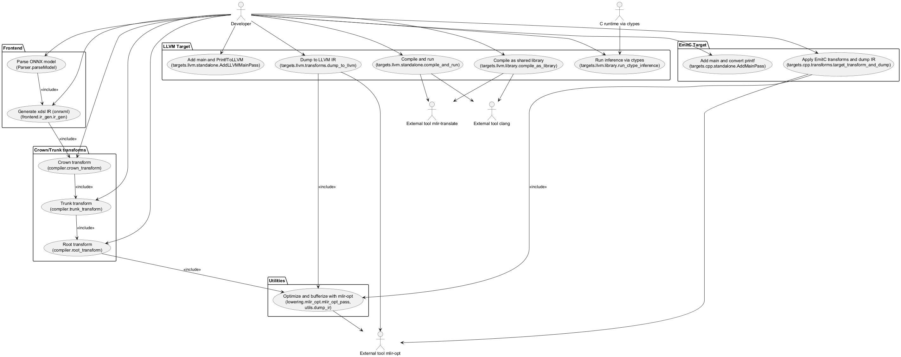

The Developer actor initiates the pipeline by parsing an ONNX model and generating onnxml IR. They then apply the Crown, Trunk, and Root transformations via compiler.crown_transform, compiler.trunk_transform, and compiler.root_transform, which encapsulate the optional quantization, pruning, padding, voting conversion, lowering to ml_program/memref/scf/arith, bufferization, and further canonicalization supported by the pass suite in lowering and transforms. For the LLVM target, the developer can add a main function (AddLLVMMainPass), dump LLVM-convertible IR (dump_to_llvm), compile and run an executable (compile_and_run), or compile as a shared library and run inference via ctypes. For the EmitC target, the developer can add a main function and convert printf, then apply EmitC transformations and dump the IR. External tools are involved exactly where invoked by the code: mlir-opt for optimization and bufferization stages, mlir-translate and clang for code generation and execution, and ctypes for library invocation.

% 3 — Containers
## 3. Containers

This section identifies the executable processes the system starts or interacts with at runtime. The codebase is primarily a Python library and CLI that orchestrates model parsing, intermediate representation (IR) generation, and lowering. When targeting LLVM or emitting textual IR, it invokes external compiler toolchain processes. No databases or networked services are used; all communication is via local files, standard I/O streams, and in-process calls.

| Container | Responsibility | Technology | Communication |
|---|---|---|---|
| Treeco Python Compiler Process | Orchestrates the pipeline: parses ONNX, generates xdsl IR (onnxml/crown/trunk/treeco), applies lowerings and transforms, optionally buffers/converts to memref, and triggers codegen for LLVM or EmitC targets. Can execute compiled inference by loading shared libraries or by running a native executable. | Python 3, xdsl, NumPy, ONNX; internal modules under treeco.frontend, treeco.lowering, treeco.transforms, treeco.targets | File I/O (read ONNX, write MLIR text), subprocess to external toolchain, in-process FFI via ctypes when running shared libraries |
| mlir-opt (external CLI) | Applies canonicalization, CSE, bufferization, linalg-to-loops, and other MLIR passes as configured throughout the pipeline. Invoked both via xdsl.transforms (MLIROptPass) and direct subprocess in utils.dump_ir. | LLVM MLIR toolchain (mlir-opt) | Subprocess invocation; MLIR text via stdin/stdout; local files when dumping transformed IR |
| mlir-translate (external CLI) | Translates MLIR to LLVM IR prior to native compilation for library or standalone executable flows. Used in targets/llvm/library.compile_as_library and targets/llvm/standalone.compile_and_run. | LLVM mlir-translate | Subprocess with file arguments; reads .mlir, writes .ll |
| clang (external CLI) | Compiles LLVM IR to a shared library (.so) for ctypes-based execution or to a native executable for standalone runs. | Clang/LLVM | Subprocess with file arguments; reads .ll, produces .so or native binary |
| LLVM Native Inference Executable | Standalone process that runs the generated main function and prints model outputs (targets/llvm/standalone.compile_and_run). | Native executable produced by clang | Subprocess execution; results over stdout read by Python |

% 3.1 — Architecture Overview – Component Diagram
# Section 3.1 — Architecture Overview – Component Diagram

This section provides a code-true component view of the Treeco system, based strictly on the repository’s implementation. It shows how the compiler orchestrates front-end parsing and IR generation, applies dialect-specific lowerings and transformations, and drives target-specific emission for C/C++ (EmitC) and LLVM. The diagram groups source files by subsystem and depicts the key dependency relations among subsystems and toward external tools and libraries used at runtime or during code generation.

Figure 3.1 — Architecture Overview – Component Diagram

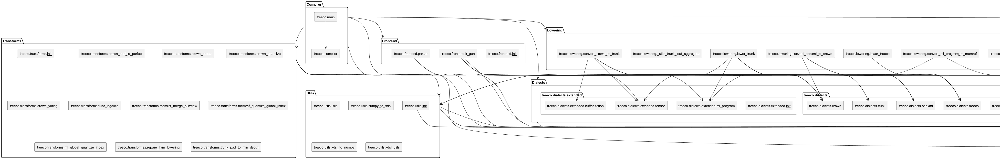

% 4 — Components
## 4. Components

This section identifies and describes the internal components of the Treeco compiler as implemented in the repository. Each row corresponds to a concrete Python module (file) that defines operations, passes, utilities, or orchestration logic. For each component, we summarize its responsibility and list its principal interactions, derived from imports and explicit usage in the code. This provides a verifiable overview of responsibilities and dependencies for developers and integrators.

| Component | Responsibility | Interactions |
|---|---|---|
| src/treeco/dialects/extended/__init__.py | Package marker for extended dialect extensions. | None |
| src/treeco/dialects/extended/bufferization.py | Extends xdsl bufferization dialect by adding MaterializeInDestinationOp and re-exposing the Bufferization dialect with the new op. Handles printing and parsing for the op. | xdsl.dialects.bufferization, xdsl.printer.Printer, xdsl.parser.Parser, xdsl.irdl (opt_prop_def, var_result_def, AnyAttr, IRDLOperation), xdsl.ir (Dialect), xdsl.dialects.builtin (TensorType, MemRefType, UnitAttr), typing (Optional, Sequence), SSAValue |
| src/treeco/dialects/extended/ml_program.py | Defines ml_program dialect ops: Global and GlobalLoadConstant with print/parse/verify, for constants/globals used downstream. | xdsl.dialects.builtin (NoneType, StringAttr, SymbolRefAttr, UnitAttr), xdsl.ir (Dialect, Attribute, TypeAttribute), xdsl.irdl (IRDLOperation, opt/properties, result_def, irdl_op_definition), xdsl.traits.SymbolOpInterface, xdsl.parser.Parser, xdsl.printer.Printer, VerifyException |
| src/treeco/dialects/extended/tensor.py | Extends tensor dialect with ExtractOp and InsertOp helpers that compute result types from operands. | xdsl.dialects.tensor, xdsl.dialects.builtin, xdsl.irdl.ConstraintVar, SSAValue, Sequence |
| src/treeco/dialects/__init__.py | Package marker for treeco dialects. | None |
| src/treeco/dialects/crown.py | Defines crown dialect TreeEnsembleOp which carries TreeEnsembleAttr and buffers. Serves as the high-level model op after ONNX-ML conversion. | treeco.utils, xdsl.ir.Dialect, treeco.dialects.treeco.TreeEnsembleAttr, xdsl.irdl (IRDLOperation, attr/operand defs), xdsl.dialects.builtin (MemRefType, IntegerType/Attr, FloatAttr, AnyFloat, Signedness, SSAValue) |
| src/treeco/dialects/emitc.py | Defines emitc dialect attributes (ArrayType, OpaqueType/Attr, PointerType) and a large set of C-like ops (arithmetic, control, globals, functions, loops, yield). Provides traits and printing overrides. Used by C/C++ codegen transformations. | xdsl.ir (Dialect, Operation, Region, SSAValue, Attributes), xdsl.dialects.builtin (types, attrs, ModuleOp, ContainerType), xdsl.dialects.func.FuncOpCallableInterface, xdsl.irdl (operands/results/regions/traits), xdsl.traits (HasParent, IsTerminator, SymbolOpInterface, Pure, RecursiveMemoryEffect, SingleBlockImplicitTerminator), xdsl.dialects.utils.AbstractYieldOperation, typing (Generic, Iterable, Sequence) |
| src/treeco/dialects/onnxml.py | Defines ONNXML dialect ops for TreeEnsembleClassifier and TreeEnsembleRegressor, their attributes, and helpers (get_n_trees). Acts as ingestion target from parser/IR-gen. | treeco.utils, numpy, xdsl.dialects.builtin (ArrayAttr, FloatAttr, IntegerAttr, StringAttr, MemRefType, SSAValue), xdsl.irdl, xdsl.ir.Dialect |
| src/treeco/dialects/treeco.py | Core Treeco dialect: type system (LeafType, NodeType, TreeType, TreeEnsembleType), attribute (TreeEnsembleAttr) with helpers for structure analysis, and utility ops (Cast, CastSignOp). Bridges ensemble metadata to lowering passes. | numpy, treeco.utils, xdsl.dialects.builtin (TensorType, IntegerType/Attr, FloatAttr, IndexType, DenseIntOrFPElementsAttr, StringAttr, AnyFloat, Signedness, SSAValue, AffineMapAttr), xdsl.ir (Dialect, ParametrizedAttribute, TypeAttribute), xdsl.irdl, xdsl.ir.affine.AffineMap |
| src/treeco/dialects/trunk.py | Trunk dialect modeling tree traversal: constants, root retrieval, is-leaf checks, next-node visits, leaf extraction, aggregation, traversal and post-transform. Outputs ops used by SCF lowering. | xdsl.traits (HasParent, IsTerminator, Pure), xdsl.irdl, xdsl.ir (Dialect, Operation, SSAValue), xdsl.dialects.builtin (Integer/Index/MemRef/Tensor types and attrs), xdsl.irdl.prop_def, treeco.utils, xdsl.dialects.scf, treeco.dialects.treeco (LeafType, NodeType, TreeType, TreeEnsembleType, TreeEnsembleAttr) |
| src/treeco/frontend/__init__.py | Package marker for frontend. | None |
| src/treeco/frontend/ir_gen.py | IR generation from parsed ONNX model dict into ModuleOp with func inference signature and an ONNXML op. Handles attribute type conversion (to xdsl attrs). | xdsl.dialects.builtin (ModuleOp, MemRefType, ArrayAttr, IntegerType, IndexType, StringAttr, DenseIntOrFPElementsAttr, f32), xdsl.ir (Block, Region, SSAValue), xdsl.dialects.func (FuncOp, func.Return), treeco.dialects.onnxml, type utilities |
| src/treeco/frontend/parser.py | ONNX model parser: loads model, extracts TreeEnsemble* node, converts attributes to Python types, derives shapes and defaults. | pathlib.Path, typing.Mapping, numpy, onnx, logging |
| src/treeco/lowering/emitc/convert_arith_to_emitc.py | Pattern-based lowering from arith to emitc ops (Cmp, Add, Mul, Sub, Cast, Constant). Provides ConvertArithToEmitcPass. | xdsl.context.MLContext, xdsl.dialects.builtin (ModuleOp, IndexType), xdsl.pattern_rewriter (patterns, walkers), xdsl.passes.ModulePass, xdsl.dialects.arith, treeco.dialects.emitc |
| src/treeco/lowering/emitc/convert_memref_to_emitc.py | Converts memref ops to emitc (alloc to globals/opaque, store/load to assign/subscript, globals mapping). Also type conversion MemRefType→emitc.ArrayType. Provides ConvertMemrefToEmitcPass. | time, numpy, xdsl.context.MLContext, xdsl.dialects (arith, func, memref), xdsl.dialects.builtin (IntAttr, MemRefType, ModuleOp), xdsl.pattern_rewriter, xdsl.passes.ModulePass, xdsl.rewriter.InsertPoint, treeco.dialects.emitc, treeco.utils.convert_np_to_arrayattr |
| src/treeco/lowering/emitc/convert_printf_to_emitc.py | Rewrites printf ops to emitc.CallOpaque “printf” or nested loop emitc.For constructs for array printing with format string synthesis. Provides ConvertPrintfToEmitcPass. | re, typing.Any, xdsl.builder.Builder, xdsl.context.MLContext, xdsl.dialects.printf, xdsl.dialects.builtin (types), xdsl.pattern_rewriter, xdsl.passes.ModulePass, treeco.dialects.emitc |
| src/treeco/lowering/emitc/convert_scf_to_emitc.py | Lowers a subset of scf.For and scf.While to emitc.For/If/Yield constructs with necessary rewrites and temporaries. Provides ConvertScfToEmitcPass. | xdsl.context.MLContext, xdsl.dialects (arith, scf), xdsl.dialects.builtin (IndexType, IntegerAttr, ModuleOp, StringAttr), xdsl.ir (Block, Region), xdsl.pattern_rewriter, xdsl.passes.ModulePass, xdsl.rewriter.InsertPoint, treeco.dialects.emitc |
| src/treeco/lowering/__init__.py | Aggregates and re-exports lowering passes for convenience. | convert_crown_to_trunk, convert_ml_program_to_memref, convert_onnxml_to_crown, lower_trunk, lower_treeco, mlir_opt.mlir_opt_pass, bufferize.bufferize_pass, convert_scf_to_cf.convert_scf_to_cf_pass |
| src/treeco/lowering/_utils_trunk_leaf_aggregate.py | Helper routines to aggregate leaf tensors (VOTE, SUM), implemented using arith/tensor/linalg and treeco.CastSignOp. | typing, treeco.dialects.treeco, xdsl.ir.Operation, xdsl.dialects (builtin, arith, linalg), treeco.dialects.extended.tensor, xdsl.ir.affine.AffineConstantExpr |
| src/treeco/lowering/bufferize.py | Thin wrapper to invoke mlir-opt bufferization pipeline with configured flags. | .mlir_opt.mlir_opt_pass, xdsl.context.MLContext, xdsl.dialects.builtin.ModuleOp |
| src/treeco/lowering/convert_crown_to_trunk.py | Lowers crown.TreeEnsembleOp into trunk dialect with iterative traversal using scf.For/While, tensor slice ops, and bufferization materialization. Also optimizes perfect iterative loops. Provides ConvertCrownToTrunkIterativePass. | xdsl.passes.ModulePass, xdsl.context.MLContext, xdsl.builder.Builder, treeco.dialects (crown, trunk, treeco), treeco.utils (find_op_in_operands_chain, find_operation_in_module, I64_MIN), treeco.model.Ensemble, xdsl.dialects (builtin, arith, scf, func), treeco.dialects.extended (tensor, bufferization), xdsl.pattern_rewriter |
| src/treeco/lowering/convert_ml_program_to_memref.py | Converts extended ml_program globals and loads to memref globals and bufferization.ToTensorOp. Provides ConvertMlProgramToMemrefPass. | typing, xdsl.context.MLContext, xdsl.dialects (bufferization, memref), treeco.dialects.extended.ml_program, xdsl.dialects.builtin (ModuleOp, TensorType, UnitAttr), xdsl.pattern_rewriter, xdsl.passes.ModulePass |
| src/treeco/lowering/convert_onnxml_to_crown.py | Converts ONNXML ensemble ops to crown.TreeEnsembleOp with TreeEnsembleAttr built from ONNXML attributes and derived n_features, default aggregate mode SUM. | xdsl.dialects.builtin (ModuleOp, IntegerAttr, i64, StringAttr), xdsl.context.MLContext, xdsl.passes.ModulePass, xdsl.pattern_rewriter, treeco.dialects (onnxml, crown, treeco), xdsl.dialects.func, treeco.utils |
| src/treeco/lowering/convert_scf_to_cf.py | Invokes mlir-opt pass to convert SCF to CF with canonicalization/CSE. | treeco.lowering.mlir_opt.mlir_opt_pass |
| src/treeco/lowering/lower_treeco.py | Cleans up Treeco IR: type conversions to signless integers, removes redundant casts and leftover Node/Leaf types, prunes unused ml_program globals. Provides LowerTreecoPass. | xdsl.passes.ModulePass, xdsl.context.MLContext, treeco.dialects.treeco, xdsl.dialects.builtin, treeco.dialects.extended.ml_program, xdsl.pattern_rewriter |
| src/treeco/lowering/lower_trunk.py | Lowers trunk dialect to primitive dialects (arith, tensor, ml_program, printf) by materializing ensemble data as ml_program globals and replacing traversal ops (GetRoot, IsLeaf, VisitNextNode, GetLeaf, GetLeafValue, AggregateLeafOp). Provides LowerTrunkPass. | xdsl.passes.ModulePass, xdsl.dialects.printf, treeco.utils (convert_np_to_tensor, I64_MIN), xdsl.context.MLContext, treeco.dialects (trunk, treeco), treeco.model.Ensemble, typing (Optional, Sequence), xdsl.dialects (builtin, arith, scf), xdsl.dialects.builtin.StringAttr, xdsl.rewriter.InsertPoint, treeco.dialects.extended (tensor, ml_program), xdsl.pattern_rewriter |
| src/treeco/lowering/mlir_opt.py | Utility to invoke external mlir-opt executable with a configured pass sequence; gracefully no-ops if not found. | xdsl.transforms.mlir_opt.MLIROptPass, xdsl.dialects.builtin.ModuleOp, xdsl.context.MLContext, shutil, os |
| src/treeco/model/__init__.py | Re-exports Ensemble and Node. | .ensemble, .node |
| src/treeco/model/ensemble.py | Ensemble domain model: stores trees, provides analytics (depths, targets), prediction, quantization, conversions to/from TreeEnsembleAttr, numpy arrays/vectors for lowering, pruning/padding transforms, and voting/logits conversions. | numpy, bigtree (levelorder_iter, preorder_iter), xdsl.dialects.builtin (IntegerAttr, StringAttr, i64), treeco.dialects.treeco, treeco.model.node.Node, treeco.utils (convert_attrdict_to_lists, convert_np_to_arrayattr, convert_np_to_tensor), typing |
| src/treeco/model/node.py | Binary decision tree node model with traversal, prediction, quantization, pruning, padding to perfect/min depth, conversion to dict/numpy forms. | bigtree (BinaryNode, iterators, shift_nodes), numpy, typing, treeco.utils.quantize |
| src/treeco/targets/cpp/__init__.py | Package marker for C++ target. | None |
| src/treeco/targets/cpp/standalone.py | Adds a C entry point (main) and emitc globals for IO buffers, converts printf to emitc; orchestrates building runnable emitc module. Provides AddMainPass. | xdsl.rewriter.InsertPoint, treeco.lowering.emitc.ConvertPrintfToEmitcPass, numpy, xdsl.dialects.builtin (ModuleOp, StringAttr, UnitAttr), xdsl.dialects (func, printf), xdsl.context.MLContext, xdsl.ir (Block, Region), xdsl.passes.ModulePass, xdsl.pattern_rewriter, treeco.dialects.emitc, treeco.utils.convert_np_to_tensor |
| src/treeco/targets/cpp/transforms.py | Applies emitc-target lowering passes and dumps MLIR with target-specific optimization flags. | treeco.lowering.emitc (ConvertMemrefToEmitcPass, ConvertArithToEmitcPass, ConvertPrintfToEmitcPass), xdsl.dialects.builtin.ModuleOp, xdsl.context.MLContext, treeco.utils.dump_ir |
| src/treeco/targets/llvm/__init__.py | Re-exports dump_to_llvm and target_transform_and_dump. | .transforms |
| src/treeco/targets/llvm/library.py | Compiles MLIR to LLVM IR and shared library via mlir-translate and clang; provides ctypes execution of inference. | ctypes, pathlib, subprocess, os, numpy |
| src/treeco/targets/llvm/standalone.py | Ensures main function exists (printf lowered to LLVM), compiles and runs the executable, collects output. Provides AddLLVMMainPass and utility compile_and_run. | numpy, xdsl.dialects.builtin.ModuleOp, typing.Optional, xdsl.context.MLContext, xdsl.passes.ModulePass, xdsl.transforms.printf_to_llvm.PrintfToLLVM, treeco.targets.codegen_main (generate_main_function, find_func), subprocess, xdsl.pattern_rewriter, xdsl.rewriter.InsertPoint |
| src/treeco/targets/llvm/transforms.py | Target-side transform to lower to LLVM (printf to LLVM, SCF→CF) and dump LLVM-ready MLIR. | xdsl.context.MLContext, xdsl.dialects.builtin.ModuleOp, treeco.lowering.convert_scf_to_cf_pass, xdsl.transforms.printf_to_llvm.PrintfToLLVM, treeco.utils.dump_ir |
| src/treeco/targets/__init__.py | Package marker for targets. | None |
| src/treeco/targets/codegen_main.py | Generates a main function around the inference func using memref globals, SCF loops to feed batches, and printf to print results. | numpy, xdsl.dialects.builtin (ModuleOp, UnitAttr), xdsl.dialects (memref, arith, func, printf, scf, builtin), xdsl.ir (Block, Region), xdsl.builder.ImplicitBuilder, treeco.utils.numpy_to_xdsl.convert_np_to_tensor, treeco.utils.xdsl_to_numpy.convert_xdsl_to_np_type |
| src/treeco/transforms/__init__.py | Re-exports transformation passes for external use. | crown_pad_to_perfect, crown_prune, crown_quantize, crown_voting, trunk_pad_to_min_depth, func_legalize, memref_merge_subview, memref_quantize_global_index, ml_global_quantize_index, prepare_llvm_lowering |
| src/treeco/transforms/crown_pad_to_perfect.py | Pads non-perfect trees to perfect shape at crown level using Ensemble API, replacing the crown op attribute. Provides CrownPadTreesPerfectPass. | xdsl.context.MLContext, xdsl.dialects.builtin.ModuleOp, xdsl.passes.ModulePass, xdsl.pattern_rewriter, treeco.dialects (crown, treeco), treeco.model.Ensemble |
| src/treeco/transforms/crown_prune.py | Prunes ensemble to a multiple of N trees at crown level. Provides CrownPruneTreesPass. | xdsl.context.MLContext, xdsl.dialects.builtin.ModuleOp, xdsl.passes.ModulePass, xdsl.pattern_rewriter, treeco.dialects (crown, treeco), treeco.model.Ensemble |
| src/treeco/transforms/crown_quantize.py | Quantizes or rounds input thresholds and/or quantizes output leaves at crown level; updates function signatures. Provides CrownQuantizeInputPass, CrownRoundInputPass, CrownQuantizeLeavesPass. | xdsl.context.MLContext, xdsl.dialects.builtin (IntegerType, MemRefType, ModuleOp, Signedness), xdsl.passes.ModulePass, xdsl.pattern_rewriter, treeco.dialects (crown, treeco), treeco.model.Ensemble, treeco.transforms.func_legalize.UpdateSignatureFuncOp |
| src/treeco/transforms/crown_voting.py | Converts SUM ensembles to VOTE by converting logits to class votes and adjusting output buffer types and shapes; updates signatures. Provides CrownConvertToVotingClassifierPass. | numpy, xdsl.context.MLContext, xdsl.dialects.builtin (IntegerType, MemRefType, ModuleOp, Signedness), xdsl.passes.ModulePass, xdsl.pattern_rewriter, treeco.dialects (crown, treeco), treeco.model.Ensemble, .func_legalize.UpdateSignatureFuncOp |
| src/treeco/transforms/func_legalize.py | Ensures func.FuncOp signature matches block argument and result types after transformations; updates function type. | xdsl.dialects.func, xdsl.pattern_rewriter |
| src/treeco/transforms/memref_merge_subview.py | Folds/merges memref.Subview chains into base refs by rewriting indices and offsets; erases redundant subviews. Provides FoldMemRefSubViewChainPass. | xdsl.dialects (builtin, arith, memref), xdsl.rewriter.InsertPoint, treeco.utils.I64_MIN, xdsl.pattern_rewriter, xdsl.passes.ModulePass |
| src/treeco/transforms/memref_quantize_global_index.py | Quantizes constant memref globals of Index element type to minimal integer types; rewrites GetGlobal users with casts back to Index where needed. Provides MemrefQuantizeGlobalIndexPass. | numpy, xdsl.context.MLContext, xdsl.dialects (arith, builtin, memref), xdsl.passes.ModulePass, xdsl.pattern_rewriter, treeco.utils.numpy_to_xdsl.convert_np_to_tensor, treeco.utils.xdsl_to_numpy.convert_dense_to_np |
| src/treeco/transforms/ml_global_quantize_index.py | Quantizes ml_program globals of Index element type to smaller integer types and rewrites loads; preserves immutability constraint. Provides MlGlobalQuantizeIndexPass. | numpy, xdsl.context.MLContext, xdsl.dialects (arith, builtin, memref), xdsl.passes.ModulePass, xdsl.pattern_rewriter, treeco.dialects.extended (ml_program, tensor), treeco.utils.numpy_to_xdsl.convert_np_to_tensor, treeco.utils.xdsl_to_numpy.convert_dense_to_np |
| src/treeco/transforms/prepare_llvm_lowering.py | Marks functions with llvm.emit_c_interface for LLVM lowering compatibility. Provides PrepareLLVMLoweringPass. | xdsl.dialects.builtin (ModuleOp, UnitAttr), xdsl.dialects.func, xdsl.context.MLContext, xdsl.passes.ModulePass, xdsl.pattern_rewriter |
| src/treeco/transforms/trunk_pad_to_min_depth.py | Intended to pad trunk ensembles to minimum depth before iterative lowering (incomplete as written). Provides TrunkPadToMinDepthPass. | xdsl.context.MLContext, xdsl.dialects.builtin.ModuleOp, xdsl.passes.ModulePass, xdsl.pattern_rewriter, treeco.dialects (treeco, trunk), treeco.model.Ensemble |
| src/treeco/utils/__init__.py | Aggregates utilities: quantize, IR traversal/search helpers, numpy-xdsl conversions, IR dumping, and type helpers. | shutil, subprocess, xdsl.printer.Printer, io.StringIO, xdsl.dialects (builtin, func, scf), numpy; re-exports from utils, xdsl_utils, xdsl_to_numpy, numpy_to_xdsl |
| src/treeco/utils/numpy_to_xdsl.py | Converts numpy arrays to xdsl attributes/dense tensors (emitc arrays, ArrayAttr, DenseIntOrFPElementsAttr) with proper type selection and signness control. | numpy, treeco.dialects.emitc, xdsl.dialects.builtin (ArrayAttr, StringAttr, IntegerType, Float32Type, Signedness, FloatAttr, IntegerAttr, IndexType, DenseIntOrFPElementsAttr, TensorType, f32) |
| src/treeco/utils/utils.py | Numeric quantization utility (uniform affine) returning quantized data and scale/zero-point. | numpy, typing.Tuple, typing.Literal |
| src/treeco/utils/xdsl_to_numpy.py | Converts xdsl ArrayAttr/Dense elements to numpy arrays and maps xdsl types to numpy dtypes; also flattens attr dicts to native types. | numpy, xdsl.dialects.builtin (ArrayAttr, StringAttr, IntegerType, AnyFloat, IndexType, DenseIntOrFPElementsAttr) |
| src/treeco/utils/xdsl_utils.py | IR search utilities to find operations in modules, walk operand/result chains across regions/loops conservatively. | xdsl.ir.Operation, xdsl.dialects.builtin.ModuleOp, xdsl.ir.Block, xdsl.dialects (func, scf) |
| src/treeco/__main__.py | CLI argument parser defining entry-point flags for model path, emission targets, and precision options. | argparse, pathlib.Path |
| src/treeco/compiler.py | Orchestration API: builds MLContext with required dialects; parses ONNX; generates initial IR; applies crown/trunk/root transformation pipelines; coordinates bufferization and target-lowering options. | pathlib.Path, typing (Literal, Union, Optional, Mapping, Any, Tuple), xdsl.context.MLContext, xdsl.dialects (arith, builtin, cf, func, llvm, memref, printf, scf, linalg, affine), xdsl.dialects.builtin.ModuleOp, treeco.dialects (crown, onnxml, treeco, trunk), treeco.dialects.extended (bufferization, ml_program, tensor), treeco.frontend (ir_gen, Parser), treeco.lowering (passes, mlir_opt_pass, bufferize_pass, convert_scf_to_cf_pass), treeco.transforms (Crown*, Trunk*, func_legalize, memref_*), utils |

% 5 — Code-Level View
# Section 5 — Code-Level View

This section maps the architectural components of the Treeco system to concrete source code elements. It identifies the main entry points, organizes the key modules and directories by responsibility, and highlights recognizable implementation patterns. The intent is to provide developers and integrators with a precise, code-backed reference that can be validated against the repository.

## Purpose

Treeco is an xDSL/MLIR-based compiler pipeline that parses ONNX TreeEnsemble models, builds a high-level IR, and progressively lowers it through Treeco-specific dialects to standard or target-specific forms (e.g., C via emitc or LLVM). The codebase is organized into distinct stages: frontend parsing and IR generation, domain-specific dialects, lowering passes, target backends, generic transforms, and utilities. This section documents how these responsibilities manifest at code level.

## Main Entry Points

The system supports both CLI and programmatic entry points, as well as backend-specific helpers.

- CLI entry point
  - src/treeco/__main__.py
    - Defines the argument parser for driving compilation; declares flags for model path, target emission, crown/trunk/root toggles, and precision options. It does not wire a full pipeline; programmatic APIs below are the authoritative orchestration points.

- Programmatic compiler API
  - src/treeco/compiler.py
    - context(): constructs an MLContext and loads all required dialects (treeco, crown, trunk, onnxml, extended bufferization/ml_program/tensor, builtin, scf, memref, func, arith, printf, cf, linalg, affine, llvm).
    - parse_ensemble(onnx_path): parses the ONNX file into a Python mapping.
    - generate_ir(parsed_model, batch_size): builds the initial ModuleOp with a single public func inference(...) and an onnxml TreeEnsemble op.
    - crown_transform(...): converts onnxml model to crown dialect; optional transforms: voting conversion, pruning, padding to perfect, input quantization/rounding, output quantization; runs mlir-opt canonicalization/cse.
    - trunk_transform(...): lowers crown to trunk iterative traversal; optional padding to min depth; runs mlir-opt.
    - root_transform(...): lowers trunk to explicit operations (ml_program/memref/bufferize, linalg to loops, index quantization, etc.); runs multiple mlir-opt stages to legalize.

- Target backends
  - src/treeco/targets/cpp/transforms.py
    - target_transform_and_dump(output_path, module_op, ctx): applies emitc lowering passes and dumps C-like IR to file via utils.dump_ir.
  - src/treeco/targets/llvm/transforms.py
    - target_transform_and_dump(output_path, module_op, ctx): runs PrintfToLLVM, converts SCF to CF, and dumps LLVM-ready IR.
    - dump_to_llvm(...): emits a pipeline of MLIR-to-LLVM conversions and writes to file.
  - src/treeco/targets/llvm/library.py
    - compile_as_library(build_dir, mlir_path): invokes mlir-translate and clang to build a shared object; returns ctypes.CDLL.
    - run_ctype_inference(lib, buffer_in, buffer_out, function_name): drives the compiled entrypoint using ctypes-aware buffers.
  - src/treeco/targets/llvm/standalone.py
    - AddLLVMMainPass: injects a main function that loads test data, invokes inference, and prints outputs; also applies PrintfToLLVM.
    - compile_and_run(build_dir, mlir_path): compiles and runs a native executable using mlir-translate and clang.
  - src/treeco/targets/cpp/standalone.py
    - AddMainPass: constructs emitc-level globals and a public main that loads buffers, calls inference, and prints results; also converts printf to emitc.

- Codegen helper
  - src/treeco/targets/codegen_main.py
    - find_func(module_op, func_name): utility to locate functions.
    - generate_main_function(inference_module_op, test_data): synthesizes a public main with global input/output, looped invocation of inference, and formatted prints.

## Repository Layout and Responsibilities

The repository is organized into coherent packages corresponding to compiler stages and backends.

- Dialects (domain-specific and target-specific)
  - src/treeco/dialects: Treeco, Crown, Trunk, Onnxml, EmitC, plus extended Bufferization, ML Program, and Tensor.

- Frontend
  - src/treeco/frontend: ONNX parser and IR generator that produce an xDSL ModuleOp with the initial model op.

- Lowering
  - src/treeco/lowering: Multi-stage lowering passes from crown to trunk, trunk to explicit operations, conversion to memref/bufferized forms, and auxiliary MLIR pipelines; emitc-specific conversions reside under lowering/emitc.

- Transformation passes (model-aware and structural)
  - src/treeco/transforms: Tree-level transformations (quantization, pruning, padding, voting), signature fix-ups, memref subview folding, index quantization, and LLVM prep.

- Target backends
  - src/treeco/targets: C++/EmitC helpers and LLVM helpers for adding main, transforming, dumping, and compiling/running.

- Models
  - src/treeco/model: In-memory ensemble and node representations, with conversion to/from Treeco attributes and NumPy arrays.

- Utilities
  - src/treeco/utils: xDSL/NumPy conversions, IR dumping via mlir-opt, graph search utilities for operations, and quantization math.

- Orchestration
  - src/treeco/compiler.py: Public API to construct contexts and apply the pipeline stages end-to-end.

## Detailed Module-to-Component Mapping

The table below exhaustively lists each module, its principal classes/functions, and responsibilities.

### Dialects

| File | Classes / Functions | Responsibility |
|------|----------------------|----------------|
| src/treeco/dialects/__init__.py | (empty) | Package marker. |
| src/treeco/dialects/crown.py | TreeEnsembleOp; Dialect Crown | Crown op representing the model inference: buffer_in, buffer_out, and TreeEnsembleAttr. |
| src/treeco/dialects/emitc.py | Traits: CExpression; Types: ArrayType, OpaqueType, PointerType; Attr: OpaqueAttr; Ops: Add, Apply, Conditional, Constant, DeclareFunction, Div, Assign, CallOpaque, Cast, Cmp, Variable, Func, GetGlobal, Global, If, Include, Literal, LogicalAnd, LogicalNot, LogicalOr, Mul, Rem, Return, Sub, Subscript, Verbatim, Yield, For; Dialect Emitc | Target dialect modeling C-like constructs and expressions; provides scalar, array, control-flow, function, and global mechanisms to emit C via emitc. |
| src/treeco/dialects/onnxml.py | TreeEnsembleClassifier, TreeEnsembleRegressor; Dialect Onnxml | ONNX-ML ops representing ensembles; carriers of model attributes and helpers like get_n_trees. |
| src/treeco/dialects/treeco.py | Attrs: LeafType, NodeType, TreeType, TreeEnsembleType, TreeEnsembleAttr; Ops: CastSignOp, Cast; Dialect Treeco | Core Treeco types and attributes for trees/ensembles and casting ops used across lowering. |
| src/treeco/dialects/trunk.py | Ops: AggregateLeafOp, GetTreeDepthOp (unimplemented), GetLeafValueOp, GetLeafOp, VisitNextNodeOp, IsLeafOp, IsLeafConditionOp, GetRootOp, TreeEnsembleConstantOp, PostTransform, GetTreeOp, TraverseTreeOp; Dialect Trunk | Trunk dialect exposing explicit traversal/building blocks over tree ensembles. Note: IsLeaf and IsLeafCondition share the same op name string "trunk.is_leaf". |
| src/treeco/dialects/extended/__init__.py | (empty) | Package marker for extended dialects. |
| src/treeco/dialects/extended/bufferization.py | MaterializeInDestinationOp; Dialect Bufferization (augmented) | Extends xdsl bufferization with a materialization op used to commit tensor results into destination buffers. |
| src/treeco/dialects/extended/ml_program.py | Global, GlobalLoadConstant; Dialect MLProgram | Extended ML Program ops to model immutable/mutable globals and constant loads with print/parse. |
| src/treeco/dialects/extended/tensor.py | ExtractOp, InsertOp; Dialect Tensor (augmented) | Extended tensor element/subtensor extract/insert ops with convenient builders. |

### Frontend

| File | Classes / Functions | Responsibility |
|------|----------------------|----------------|
| src/treeco/frontend/__init__.py | (empty) | Package marker. |
| src/treeco/frontend/parser.py | ParseWarning, ParseError, Parser.parseModel, Parser._parseTreeEnsembleClassifier, Parser._parseTreeEnsembleRegressor | Reads ONNX files, selects the TreeEnsemble node, and extracts attributes plus input/output shapes; handles classifier and regressor forms. |
| src/treeco/frontend/ir_gen.py | convert_types_and_attr, ir_gen, ir_gen_regressor, ir_gen_classifier | Converts Python-native parsed attributes to xDSL attributes; builds a ModuleOp with a public func inference(...) and either onnxml TreeEnsembleClassifier or TreeEnsembleRegressor op. |

### Lowering (generic and Trunk/Treeco)

| File | Classes / Functions | Responsibility |
|------|----------------------|----------------|
| src/treeco/lowering/__init__.py | Re-exports: ConvertCrownToTrunkIterativePass, ConvertMlProgramToMemrefPass, ConvertOnnxmlToCrownPass, LowerTrunkPass, LowerTreecoPass, mlir_opt_pass, bufferize_pass, convert_scf_to_cf_pass | Facade for importing passes. |
| src/treeco/lowering/convert_onnxml_to_crown.py | convert_attributes, ConvertEnsemble, ConvertOnnxmlToCrownPass | Converts onnxml ops to crown op with TreeEnsembleAttr; normalizes attribute names and sets aggregate_mode/SUM. |
| src/treeco/lowering/convert_crown_to_trunk.py | LowerEnsembleToMatmulTraverse (stub), LowerPostTransform (partial), ConvertIterativeEnsembleToPerfectIterativeMaybe, LowerEnsembleToIterativeTraverse, LowerEnsembleToVectorTraverse (stub), LowerEnsemblePostTransform (stub), LowerEnsembleAggregateMode (stub), ConvertCrownToTrunkIterativePass | Implements iterative traversal lowering from crown to trunk, building nested SCF loops and per-tree traversal; optimizes perfect-iterative loops; materializes tensor results into output memrefs. |
| src/treeco/lowering/lower_trunk.py | Constants, find_global_mlprogram_by_name, add_and_get_ensemble_global_leaf, is_external; visit_next_node_iterative_rchild, visit_next_node_iterative_perfect; Patterns: PartialLowerEnsemble, LowerGetRoot, LowerIsLeaf, LowerVisitNextNode, LowerGetTreeOp, LowerGetLeafOp, LowerGetLeafValueOp, LowerAggregateLeafOp; LowerTrunkPass | Lowers trunk ops to explicit arithmetic/tensor/printf/ML Program ops; emits ml_program.Global constants for model arrays; implements traversal and aggregation (SUM/VOTE) using arithmetic, SCF, tensor ops; injects debugging prints. |
| src/treeco/lowering/lower_treeco.py | SignToSignLess (type conversion), LowerCast, LowerCastSign, RemoveLeftoverNodeTypes (type conversion), RemoveUnusedGlobals, LowerTreecoPass | Post-trunk cleanup: remove redundant casts, normalize integer signedness to signless, strip treeco node/leaf types, and prune unused ml_program.globals. |
| src/treeco/lowering/convert_ml_program_to_memref.py | ConvertGlobalPattern, ConvertGlobalLoadConst, ConvertMlProgramToMemrefPass | Replaces ml_program.global with memref.global and ml_program.global_load_const with memref.get_global then bufferization.to_tensor. |
| src/treeco/lowering/convert_scf_to_cf.py | convert_scf_to_cf_pass | Runs mlir-opt passes to lower SCF to CF and canonicalize. |
| src/treeco/lowering/bufferize.py | bufferize_pass | Invokes a standard MLIR bufferization pipeline via mlir-opt arguments. |
| src/treeco/lowering/mlir_opt.py | mlir_opt_pass | Wrapper for invoking mlir-opt through xdsl’s MLIROptPass; includes canonicalization and CSE sequences. |
| src/treeco/lowering/_utils_trunk_leaf_aggregate.py | _aggregate_leaf_tensors_vote, _aggregate_leaf_tensors_sum_single, _aggregate_leaf_tensors_sum_multi, _aggregate_leaf_tensors | Utility to implement trunk.AggregateLeafOp lowering for both VOTE and SUM modes (single/multi target variants). |

### Lowering (EmitC-specific)

| File | Classes / Functions | Responsibility |
|------|----------------------|----------------|
| src/treeco/lowering/emitc/convert_arith_to_emitc.py | Patterns: CmpiToCmp, CmpfToCmp, AddToAdd, MulToMul, SubToSub, ExtUIToCast, IndexCastToCast, ConstantToConstant; ConvertArithToEmitcPass | Maps arith ops to emitc counterparts; replaces comparison predicates with C-like enums; mirrors arithmetic ops; handles constant materialization. |
| src/treeco/lowering/emitc/convert_memref_to_emitc.py | get_unique_name; MemrefToArrayType (type conversion); Patterns: AllocToGlobal, AllocToAllocOpaque, StoreToAssign, GlobalToGlobal, GetGlobalToGetGlobal, LoadToSubscript, FixFuncBlocks; ConvertMemrefToEmitcPass | Converts memref types to emitc.array; maps alloc/store/load/global/get_global to emitc equivalents; inserts emitc.subscript and emitc.assign nodes. Note: AllocToAllocOpaque references CallOpaque.from_malloc, which is not defined in emitc.CallOpaque. |
| src/treeco/lowering/emitc/convert_printf_to_emitc.py | PrintfToEmitc.convert_string_python_to_c, generate_nested_printf, match_and_rewrite; ConvertPrintfToEmitcPass | Lowers printf.PrintFormatOp to emitc.call_opaque "printf"; emits nested emitc.for loops for array printing. |
| src/treeco/lowering/emitc/convert_scf_to_emitc.py | Patterns: ForToFor, WhileToFor (not applied by the pass); ConvertScfToEmitcPass | Converts SCF for to emitc.for; transforms while into for with break via emitc.if and emitc.verbatim "break" when applicable; pass applies only ForToFor. |

### Transforms (model-aware, structural, and prep)

| File | Classes / Functions | Responsibility |
|------|----------------------|----------------|
| src/treeco/transforms/__init__.py | Re-exports: CrownPadTreesPerfectPass, CrownPruneTreesPass, CrownQuantizeInputPass, CrownQuantizeLeavesPass, CrownRoundInputPass, CrownConvertToVotingClassifierPass, TrunkPadToMinDepthPass, UpdateSignatureFuncOp, FoldMemRefSubViewChainPass, MemrefQuantizeGlobalIndexPass, MlGlobalQuantizeIndexPass, PrepareLLVMLoweringPass | Transform aggregation point. |
| src/treeco/transforms/crown_pad_to_perfect.py | CrownPadTreesPerfect, CrownPadTreesPerfectPass | Pads trees to perfect depth at crown level by mutating the ensemble attribute. |
| src/treeco/transforms/crown_prune.py | CrownPruneTrees, CrownPruneTreesPass | Prunes the number of trees to the nearest lower multiple of a supplied factor. |
| src/treeco/transforms/crown_quantize.py | QuantizeInput, RoundInput, QuantizeLeaves; Passes: CrownQuantizeInputPass, CrownRoundInputPass, CrownQuantizeLeavesPass | Quantizes or rounds input thresholds and output leaves at crown level; updates func signatures accordingly. |
| src/treeco/transforms/crown_voting.py | ConvertToVoting, CrownConvertToVotingClassifierPass | Converts regression/logits to a voting classifier, changing output shape and ensemble mode. |
| src/treeco/transforms/func_legalize.py | UpdateSignatureFuncOp | Synchronizes func.FuncOp signature with block argument/result types after transformations. |
| src/treeco/transforms/memref_merge_subview.py | FoldMemRefSubViewChain, MergeSubviewSlices, FoldMemRefSubViewChainPass | Folds chains of memref.subview into simpler index arithmetic; merges slicings where safe. |
| src/treeco/transforms/memref_quantize_global_index.py | quantize_global_op, find_global_op_by_name, MemrefQuantizeGlobalIndex, MemrefQuantizeGlobalIndexPass | Converts constant memref globals of index element type into narrower integer types and fixes all users, adding casts back to index. |
| src/treeco/transforms/ml_global_quantize_index.py | quantize_global_op, find_global_op_by_name, MlGlobalQuantizeIndex, MlGlobalQuantizeIndexPass | Same as above for ml_program.globals. |
| src/treeco/transforms/prepare_llvm_lowering.py | CCompatibleFunc, PrepareLLVMLoweringPass | Marks functions with llvm.emit_c_interface attribute to ease lowering. |
| src/treeco/transforms/trunk_pad_to_min_depth.py | TrunkPadToMinDepth, TrunkPadToMinDepthPass | Intended to pad trunk ensemble to a minimum depth; current implementation references nonexistent properties (e.g., min_depth_ensemble). |

### Targets

| File | Classes / Functions | Responsibility |
|------|----------------------|----------------|
| src/treeco/targets/__init__.py | (empty) | Package marker. |
| src/treeco/targets/cpp/__init__.py | (empty) | Package marker. |
| src/treeco/targets/cpp/standalone.py | AddEmitC, AddMainPass | Injects emitc globals for inputs/outputs and a public main calling inference and printing. Applies ConvertPrintfToEmitcPass. |
| src/treeco/targets/cpp/transforms.py | target_transform_and_dump | Compose emitc lowering passes and dump IR to file for C-like emission. |
| src/treeco/targets/llvm/__init__.py | Re-exports: dump_to_llvm, target_transform_and_dump | Convenience exports. |
| src/treeco/targets/llvm/library.py | compile_as_library, run_ctype_inference | Builds a shared library via mlir-translate/clang and executes inference with ctypes buffers. |
| src/treeco/targets/llvm/standalone.py | AddLLVMMain, AddLLVMMainPass, compile_and_run | Adds a main function to run inference and printf results; compiles to native; applies printf-to-LLVM conversion. |
| src/treeco/targets/llvm/transforms.py | dump_to_llvm, target_transform_and_dump | Prepares and dumps LLVM-friendly IR with standard conversion passes. |
| src/treeco/targets/codegen_main.py | find_func, generate_main_function | Synthesizes a fully-featured main based on an inference signature; uses memref globals and SCF loops to iterate batches and print results. |

### Model

| File | Classes / Functions | Responsibility |
|------|----------------------|----------------|
| src/treeco/model/__init__.py | Re-exports: Ensemble, Node | Package export. |
| src/treeco/model/ensemble.py | _lambda_from_aggregate_mode, _get_binary_classification_threshold; class Ensemble (properties and methods) | In-memory model with tree list, predictions (raw/aggregated), output range, quantization (thresholds/leaves), voting conversion, padding/pruning, parsing to/from TreeEnsembleAttr, and conversion to NumPy arrays/vectors for globals. |
| src/treeco/model/node.py | _get_max_value, _get_min_value, _get_fake_threshold; class Node (BinaryNode) | Binary tree node with metadata (feature ids, thresholds, targets, weights); methods for prediction, manipulation (quantization, rounding, pruning, padding), and conversion to aggregated dictionaries/NumPy arrays for serialization. |

### Utilities

| File | Classes / Functions | Responsibility |
|------|----------------------|----------------|
| src/treeco/utils/__init__.py | Exports: quantize, find_op_in_operands_chain, find_op_in_results_chain, find_operation_in_module, convert_arrayattr_to_np, convert_attrdict_to_lists, convert_dense_to_np, convert_xdsl_to_np_type, convert_np_to_arrayattr, convert_np_to_emitcarray, convert_np_to_tensor; tensor_to_memref, dump_ir; constants: I64_MIN | Central utility aggregator and IR dumping via mlir-opt. |
| src/treeco/utils/utils.py | quantize | Fixed-point quantization producing integer array, scale, and zero-point with clipping/truncation. |
| src/treeco/utils/numpy_to_xdsl.py | convert_np_to_emitcarray, convert_np_to_arrayattr, convert_np_to_tensor | Converts NumPy arrays to xDSL ArrayAttr and Dense elements; handles signless/signed integers, floats, and emitc arrays. |
| src/treeco/utils/xdsl_to_numpy.py | convert_arrayattr_to_np, convert_dense_to_np, convert_attrdict_to_lists, convert_xdsl_to_np_type | Converts xDSL attributes to NumPy arrays and types. |
| src/treeco/utils/xdsl_utils.py | find_operation_in_module, find_op_in_operands_chain, find_op_in_results_chain | Graph traversal over operation operands/results within a module; robust search through SCF contexts. |

### Orchestration and CLI

| File | Classes / Functions | Responsibility |
|------|----------------------|----------------|
| src/treeco/compiler.py | context, parse_ensemble, generate_ir, crown_transform, trunk_transform, root_transform | Orchestrates the end-to-end pipeline and exposes a stable programmatic API. |
| src/treeco/__main__.py | Argument parser | Defines CLI flags for model, emission target, and precision; does not invoke pipeline directly. |

## Notable Design and Implementation Patterns

Treeco follows a compiler-pipeline architecture, where each stage is an isolated transformation over xDSL IR:

- Pass-and-rewrite pattern. Systematic use of xdsl.pattern_rewriter with RewritePattern and TypeConversionPattern to transform IR in-place. Lowering steps are composed through ModulePass classes and applied sequentially (e.g., crown → trunk → ml_program/memref → bufferization → target lowering).

- Dialect layering. Domain-specific dialects (onnxml, crown, trunk, treeco) progressively refine the representation. Extended dialects augment upstream ones (bufferization, ml_program, tensor) when missing required operations.

- Separation of concerns. Frontend parsing/IR generation is isolated; model semantics live in treeco.model.*; lowering logic uses only the dialect contracts and utilities, improving testability and reusability.

- External tool integration. mlir-opt, mlir-translate, and clang are invoked via wrappers (utils.dump_ir, lowering.mlir_opt_pass, targets.llvm.library.*); proper guards are present to handle missing executables.

- Target-specific strategies. Distinct emission flows exist for emitc/C++ and LLVM, each with dedicated pattern sets and “add main” passes.

## Validation Hints and Observed Caveats

The mapping above is derived from the exact code. While validating, note:

- emitc.DeclareFunction.__init__ uses an undefined variable name instead of sym_name; callers should be aware this constructor will fail as written.

- trunk.IsLeafConditionOp and trunk.IsLeafOp both declare name = "trunk.is_leaf", which collides at the dialect level.

- lowering/emitc/convert_memref_to_emitc.AllocToAllocOpaque uses CallOpaque.from_malloc, which is not defined in emitc.CallOpaque.

- transforms/trunk_pad_to_min_depth.py references attributes (min_depth_leaves, min_depth_ensemble, pad_to_depth) not present on Ensemble; this pass as written will not function.

- Some rewrite patterns are defined but not applied by their passes (e.g., WhileToFor in convert_scf_to_emitc.py), which is an intentional limitation in the current pipeline.

These caveats do not change the architectural mapping but are relevant when exercising specific code paths.

## Summary

- Entry points: CLI via python -m treeco (argument parsing only); programmatic orchestration via treeco.compiler.*; target-specific compile-and-run helpers under targets/*.

- Components: Frontend (parser/ir_gen), Dialects (onnxml → crown → trunk → treeco), Lowering (generic and target-specific), Transforms (model-aware and structural), Targets (emitc/C++ and LLVM), Models (Ensemble/Node), Utilities (conversions, mlir-opt/clang wrappers).

- Patterns: Composable passes with pattern rewriters, dialect-driven layering, and target-specific strategies.

This code-level view is complete and can be validated by inspecting the corresponding files and class/function definitions listed above.

% 5.1 — Class Diagram
# SECTION 5.1 — Class Diagram

This section provides a set of concise, package-scoped class diagrams that accurately reflect the concrete classes defined in the repository. The diagrams emphasize inheritance and key associations between classes defined in this codebase (e.g., operations and attributes for xDSL dialects, rewrite patterns, passes, and core domain model). External classes imported from xdsl, numpy, onnx, bigtree, etc., are referenced only as base types or stereotypes and are not redefined. The intent is to allow developers to validate implementation structure and dependencies at a glance.

The following diagrams are organized by subsystem and cover all user-defined classes present in the codebase. Each diagram uses package namespaces consistent with the source code structure. For readability, properties and method details are omitted except where they clarify relationships; inheritance and composition/dependency edges are complete and consistent with the implementation.

## 5.1.1 Domain Model — Ensemble and Node

Figure: 5.1.1 — Domain Model (Ensemble and Node)

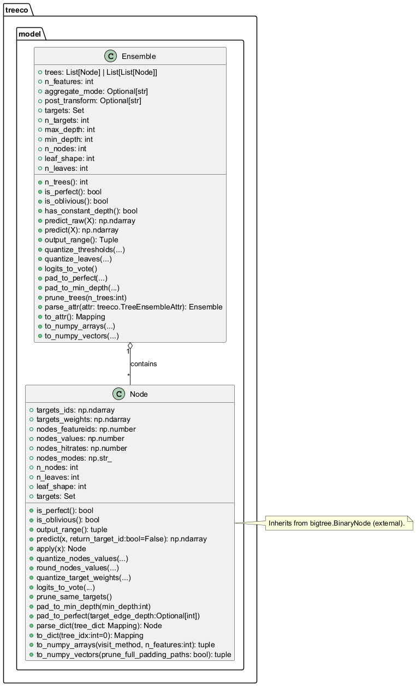

## 5.1.2 Dialects — Treeco, Crown, Trunk, Onnxml (Operations and Attributes)

Figure: 5.1.2a — treeco Dialect

Figure: 5.1.2b — crown Dialect

Figure: 5.1.2c — trunk Dialect

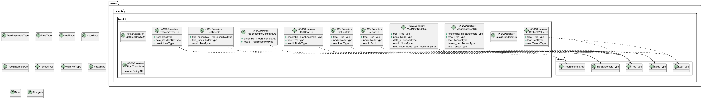

Figure: 5.1.2d — onnxml Dialect

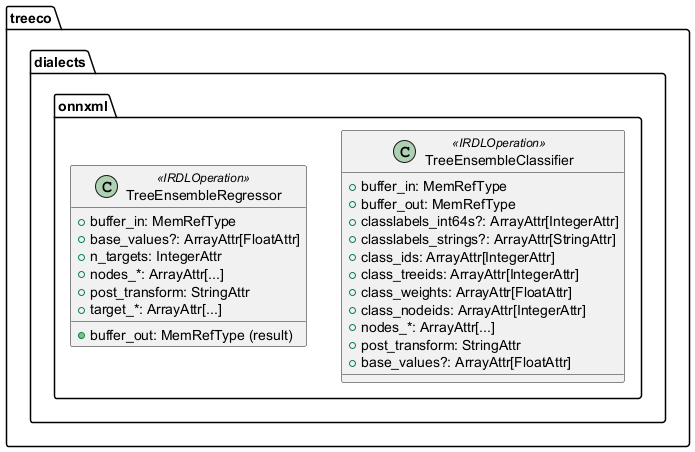

## 5.1.3 Dialects — Extended (ml_program, tensor, bufferization)

Figure: 5.1.3a — extended.ml_program

Figure: 5.1.3b — extended.tensor

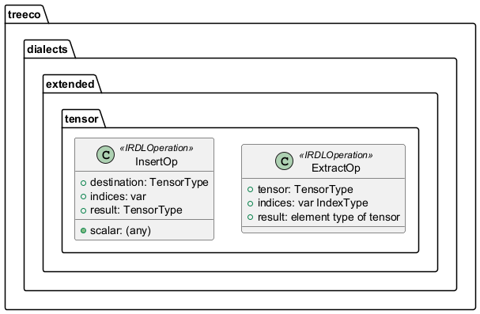

Figure: 5.1.3c — extended.bufferization

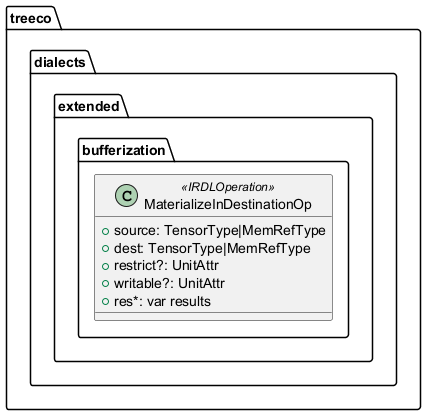

## 5.1.4 Dialects — emitc (Attributes, Operations, Traits)

Figure: 5.1.4 — emitc Dialect

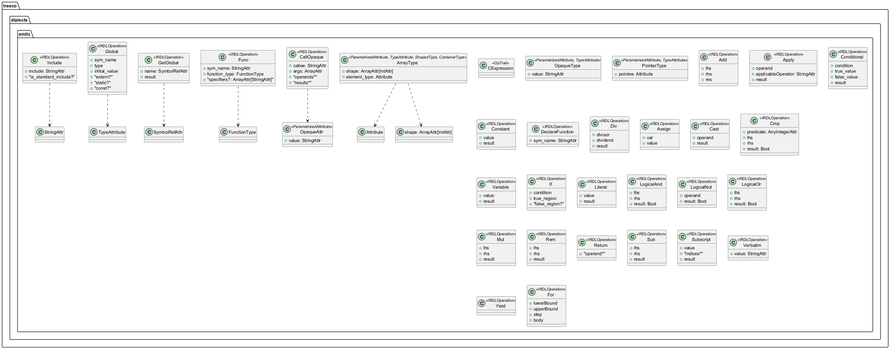

## 5.1.5 Frontend — Parser and IR Generation Entry Points

Figure: 5.1.5 — Frontend

## 5.1.6 Lowering — Rewrite Patterns and Passes (EmitC, Treeco, Trunk, Onnxml, SCF)

Figure: 5.1.6a — Lowering to emitc

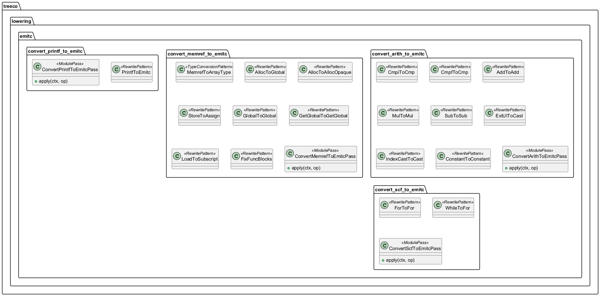

Figure: 5.1.6b — Lowering treeco/trunk/onnxml pipelines

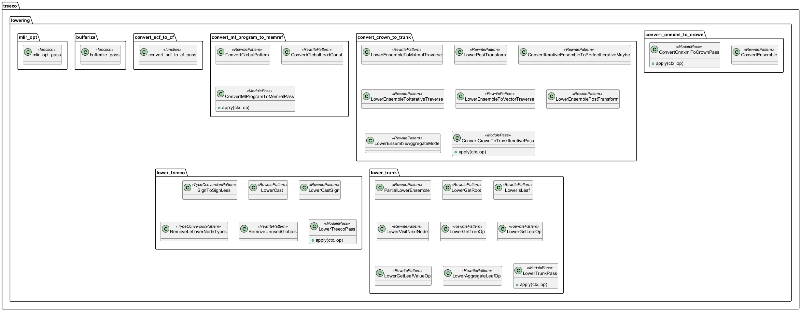

## 5.1.7 Transforms — Crown/Trunk/Func/MemRef/ML globals, LLVM Prep

Figure: 5.1.7 — Transforms

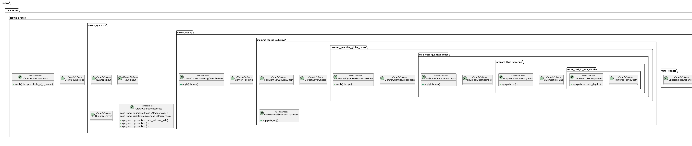

## 5.1.8 Targets — C++ and LLVM (Drivers and Passes)

Figure: 5.1.8a — Targets C++

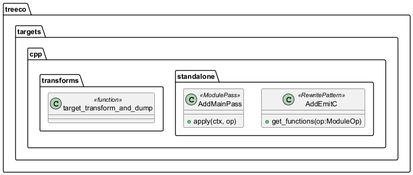

Figure: 5.1.8b — Targets LLVM

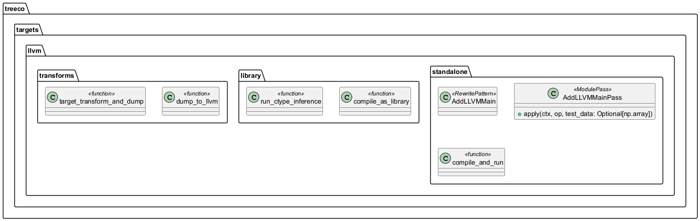

## 5.1.9 Compiler Entry Point (Context and Pipeline)

Figure: 5.1.9 — Compiler Pipeline Functions

## Consistency Notes

The diagrams enumerate all user-defined classes present in this repository and their inheritance relationships, using the exact class names and package namespaces as defined in the source code. Associations are included where they are explicit in constructor signatures or attribute/operand types (for example, trunk operations depend on treeco types and attributes). Functions and modules are shown with the stereotype <<function>> strictly when the implementation does not define classes for those capabilities.

% 6 — Cross-Cutting Concerns
## 6. Cross-Cutting Concerns

This section identifies and explains the cross-cutting concerns present in the codebase. Each concern is backed by concrete evidence from the source and described in terms of its role and implications across the system. The intent is to help both technical and non-technical stakeholders understand systemic qualities such as diagnostics, configurability, performance, and operational aspects that affect multiple parts of the implementation.

| Concern | Evidence from code | Description |
|---|---|---|
| Security (authentication, authorization, encryption) | No security libraries or checks present; multiple subprocess calls: utils/dump_ir.py (subprocess.run to mlir-opt), targets/llvm/library.py (subprocess.check_call/ check_output to mlir-translate/clang), targets/llvm/standalone.py (subprocess.check_call to mlir-translate/clang). | No authentication/authorization paths, no crypto, and no sandboxing for external tool invocations. External tool execution and dynamic library loading (ctypes) are performed without explicit hardening; this is acceptable for a build/compile toolchain but has operational security implications if used in untrusted environments. |
| Logging and tracing | frontend/parser.py uses logging.info; pervasive IR-level printf instrumentation: lower_trunk.py (Printf ops in LowerIsLeaf, LowerVisitNextNode, LowerGetLeafOp), targets/codegen_main.py (printf.PrintFormatOp for OUTPUT lines); conversion passes: lowering/emitc/convert_printf_to_emitc.py (PrintfToEmitc), targets/llvm/transforms.py (PrintfToLLVM), targets/cpp/standalone.py (AddEmitC adds printf of output). | Tracing is implemented primarily via IR-level printf, which is lowered to EmitC or LLVM. This provides runtime observability of key values during traversal and aggregation. Minimal use of Python’s logging exists in the ONNX parser. No structured logging or log levels are enforced system-wide. |
| Configuration management | CLI scaffold: __main__.py defines arguments (emit target, precision-related flags, quantize-outputs), although not wired to an entrypoint; programmatic configuration: compiler.py exposes parameters for all passes (e.g., convert_to_voting, prune_to_n_trees, pad_to_perfect, quantize_input_to_n_bits, truncate_input_to_n_bits, quantize_output_to_n_bits, pad_to_min_depth, bufferize, quantize_index_arrays); toolchain configuration via PATH and optional mlir_opt_path: lowering/mlir_opt.py; utils/dump_ir.py resolves mlir-opt from PATH. | The system is configured via function parameters in compiler.py and limited CLI options. There is no centralized configuration file; configuration is explicit at call sites. External tool locations are discovered from PATH (mlir-opt, mlir-translate, clang) or optional arguments. |
| Error handling and diagnostics | Custom exceptions: frontend/parser.py (ParseWarning, ParseError), dialects/extended/ml_program.py (VerifyException in Global._verify), utils/dump_ir.py (DiagnosticException wrapping mlir-opt failures); numerous NotImplementedError placeholders (e.g., lowering/convert_crown_to_trunk.py: LowerEnsembleToMatmulTraverse, LowerPostTransform; dialects/trunk.py: GetTreeDepthOp); explicit RuntimeError on toolchain failures: targets/llvm/library.py, targets/llvm/standalone.py; widespread op.verify() after passes: lowering/convert_crown_to_trunk.py, lowering/lower_treeco.py, lowering/lower_trunk.py, transforms/*.py. | The code uses explicit exceptions and per-pass verification to catch invalid IR. Some features are intentionally unimplemented and fail-fast via NotImplementedError. Toolchain errors are surfaced with clear exceptions. |
| Testing and assertions | Assertions in targets/codegen_main.py (generate_main_function asserts batch divisibility and feature counts); type assertions in lowering/convert_ml_program_to_memref.py; frequent verify() calls after transformation passes (e.g., LowerTrunkPass, LowerTreecoPass, MemrefQuantizeGlobalIndexPass). | There is no dedicated test suite in this repository. Assertions and IR verification act as runtime guards ensuring preconditions and IR invariants during compilation flows. |
| Monitoring/metrics | None found. | No metrics collection or health monitoring is implemented. All runtime visibility relies on printf-based tracing. |
| Performance optimization | Centralized mlir-opt orchestration: lowering/mlir_opt.py (LICM, canonicalize, CSE, loop hoisting; accepts additional pass pipelines); utils/dump_ir.py applies canonicalize + CSE when dumping; bufferization and deallocation pipeline: lowering/bufferize.py; memory access folding: transforms/memref_merge_subview.py (FoldMemRefSubViewChain, MergeSubviewSlices); index array bit-width reduction: transforms/memref_quantize_global_index.py and transforms/ml_global_quantize_index.py; SCF/CF conversions: lowering/convert_scf_to_cf.py; Linalg lowering: compiler.root_transform calls “--convert-linalg-to-loops”. | Multiple optimization passes are applied across flows to reduce IR size, simplify control flow, canonicalize memory ops, and quantize indices for smaller/faster code. The pipeline design is explicitly performance-oriented for generated artifacts. |
| External toolchain integration | Subprocess usage to invoke toolchain: utils/dump_ir.py (mlir-opt), targets/llvm/library.py and targets/llvm/standalone.py (mlir-translate, clang); lowering/mlir_opt.py wraps MLIROptPass; dynamic library loading and FFI execution: targets/llvm/library.py (ctypes.CDLL, run_ctype_inference signature and pointer passing). | The compiler is tightly integrated with MLIR/LLVM toolchains. External binaries must be available on PATH or provided by configuration. This cross-cutting concern affects portability, repeatability, and security posture of deployments. |
| Determinism and reproducibility | lowering/emitc/convert_memref_to_emitc.py uses time.time_ns() in get_unique_name() to synthesize symbol names; numpy min_scalar_type used in multiple places (e.g., model/ensemble.py, transforms) can yield platform-dependent bit-widths. | Non-deterministic symbol names (nanosecond timestamps) make IR diffs non-reproducible across runs. Platform-dependent integer narrowing may produce different element widths across environments. |
| Data conversion and serialization | Utilities in utils/numpy_to_xdsl.py and utils/xdsl_to_numpy.py provide conversions between NumPy arrays and xDSL attributes (DenseIntOrFPElementsAttr, ArrayAttr); used pervasively in passes (e.g., transforms/… quantization, lowering/lower_trunk.py, lowering/convert_onnxml_to_crown.py). | Conversion utilities are cross-cutting enablers that bridge Python-side numeric data (NumPy) and IR-side attributes. Correctness and dtype handling here affect all lowerings and targets. |
| Memory management and allocation strategy | lowering/emitc/convert_memref_to_emitc.py: AllocToGlobal hoists allocations to emitc.global with zero initialization; GetGlobal/Global lowering; Store/Load rewritten to emitc.assign/subscript; AllocToAllocOpaque (skeleton) references CallOpaque.from_malloc but is incomplete. | The EmitC lowering prefers static globals over dynamic allocation for simplicity. There is an incomplete path for heap allocation via opaque calls, indicating a design intent that is not fully implemented yet. |
| Feature completeness and technical debt | NotImplementedError placeholders across trunk and crown lowerings (e.g., convert_crown_to_trunk.LowerEnsembleToMatmulTraverse, LowerPostTransform; dialects/trunk.GetTreeDepthOp); TODO-like debug prints embedded in lowerings (e.g., tracing strings “IS_LEAF_CHECK…”, “VISIT_LOOP…”, “GET_LEAF_OP…”). | Several code paths are explicitly unimplemented, guarded by fail-fast exceptions. Debug-only prints signal areas where formal logging or completed implementations are pending. |
| Build artifacts and code generation selection | Target-specific pipelines: targets/llvm/transforms.py (dump_to_llvm and PrintfToLLVM, SCF→CF); targets/cpp/transforms.py (EmitC lowering pipeline and dumping). | Cross-cutting target selection affects which passes and diagnostics apply. EmitC and LLVM paths use different transforms but share many upstream lowerings. |
| Tool availability handling | lowering/mlir_opt.py gracefully prints “mlir-opt not found” and returns the module; utils/dump_ir.py raises DiagnosticException if mlir-opt execution fails. | The system partially degrades when tools are missing (skipping optimizations), and escalates appropriately when dumping artifacts fails, affecting all flows that rely on external MLIR tools. |

% 7 — Quality Attributes and Rationale
## 7. Quality Attributes and Rationale

This section documents the key quality attributes that the codebase explicitly supports through its structure, passes, dialects, and transformations. Each attribute is grounded in concrete evidence from the implementation and explains the rationale behind the design choices. The focus is on observable behavior in the code, including pass orchestration, data structures, verification hooks, backend targets, and optimization stages.

| Quality Attribute | Evidence | Rationale |
|---|---|---|
| Performance (compiler optimizations) | mlir_opt.py adds canonicalize, CSE, loop-invariant code motion, hoisting, and buffer pipelines; bufferize.py uses one-shot-bufferize and buffer deallocation pipeline; targets/llvm/transforms.py runs conversion and canonicalization passes; targets/cpp/transforms.py runs conversion passes then CSE/canonicalize | The pipelines consistently invoke MLIR’s optimization passes to reduce redundant operations, hoist invariants, and normalize IR before code generation, directly improving runtime and compile-time performance of generated code. |
| Performance (algorithmic lowering) | lowering/convert_crown_to_trunk.py converts high-level ensemble inference to iterative traversal with loop structures; lowering/lower_trunk.py further lowers to explicit arithmetic and comparisons; lowering/emitc/* convert arithmetic/memref/scf to emitc primitives | Iterative tree traversal with explicit loops and arithmetic minimizes control overhead and enables backend optimizers to reason about simple loops and array accesses, improving generated code performance. |
| Memory efficiency | transforms/memref_quantize_global_index.py and transforms/ml_global_quantize_index.py quantize index arrays to smallest integer width; transforms/crown_quantize.py quantizes inputs and leaves; model/ensemble.py supports compress_indices and min-scalar-type selection; lowering/emitc/convert_memref_to_emitc.py folds alloc+store into const globals where possible | Reducing integer widths and quantizing tensors reduces memory footprint and bandwidth. Folding allocations with constant initialization into globals avoids runtime allocations and enables better cache locality for read-only data. |
| Scalability (large ensembles) | model/ensemble.py and model/node.py use NumPy-based vectorization for conversion and aggregation; utils/xdsl_to_numpy.py and numpy_to_xdsl.py handle bulk conversions; transforms such as CrownPruneTrees and CrownPadTreesPerfect reshape/trim models | Vectorized conversions and pruning/padding utilities allow ingestion and restructuring of large tree ensembles while keeping conversion costs linear and enabling downstream optimizations to scale with model size. |
| Portability and target flexibility | targets/llvm/* produces LLVM IR and invokes clang; targets/cpp/* uses emitc dialect and printf lowering; compiler.py exposes switches for tree algorithm and bufferization; lowering/emitc/* map standard dialects to emitc | The layered backends (LLVM and emitc/C) allow the same IR to be lowered to different runtime environments. Backend-specific pipelines isolate target concerns while reusing front/mid layers. |
| Maintainability and modularity | Clear package boundaries: dialects/*, frontend/*, lowering/*, transforms/*, targets/*, utils/*; each pass in its own module (e.g., ConvertOnnxmlToCrownPass, LowerTrunkPass); compiler.py composes pipelines declaratively | Modular passes and directories follow a single-responsibility approach, making extensions and maintenance localized. The compiler orchestrator wires stages coherently without cross-coupling implementation internals. |
| Extensibility (new ops/pipelines) | Custom IR dialects defined via IRDL (dialects/treeco.py, dialects/crown.py, dialects/extended/*, dialects/emitc.py, dialects/onnxml.py, dialects/trunk.py) with print/parse and traits; RewritePattern-based conversions throughout lowering/ and transforms/ | IRDL-based ops with parse/print and traits enable adding operations and dialects with consistent verification. Pattern-based rewriting allows incremental addition of conversions and optimizations without refactoring existing passes. |
| Correctness by construction | Frequent op.verify() invocations after passes (e.g., lower_trunk.py, lower_treeco.py, transforms/* passes); extensive type conversions and cast normalization (lower_treeco.py’s SignToSignLess, LowerCast, LowerCastSign; lowering/lower_trunk.py forces IndexType at boundaries) | Regular verification and type normalization reduces malformed IR risks. Early elimination of redundant casts and sign mismatches keeps types consistent across lowering boundaries, improving correctness of subsequent passes. |
| Debuggability and observability | lowering/lower_trunk.py inserts diagnostic printf traces (e.g., “IS_LEAF_CHECK…”, “VISIT_LOOP…”, “GET_LEAF_OP…”); targets/llvm/standalone.py parses printed OUTPUT values; targets/cpp/standalone.py injects main and printf; convert_printf_to_emitc.py lowers printf to emitc | Runtime observability is built-in via printf-based tracing that is preserved and lowered to both LLVM and emitc targets, facilitating debugging of traversal, comparisons, and outputs on actual executions. |
| Testability (deterministic pipelines) | Passes are pure rewrite patterns over IR (PatternRewriteWalker + RewritePattern), with explicit inputs/outputs; utils/dump_ir produces stabilized IR via mlir-opt; frontend/ir_gen.py constructs reproducible ModuleOp from parsed model | Deterministic rewrites and stable IR printing enable predictable outputs for golden-file testing and facilitate unit tests at pass and pipeline boundaries. |
| Reliability and error handling | frontend/parser.py defines ParseError/ParseWarning; extended/ml_program.Global._verify enforces initial value for immutables; utils.dump_ir raises DiagnosticException on mlir-opt failures; library/compile_as_library checks files and subprocess return codes | Early validation and explicit exceptions surface errors in parsing, verification, and external tool invocation, preventing silent failures and aiding fault isolation. |
| Interoperability | frontend/parser.py consumes ONNX models; dialects/onnxml.py models ONNX-ML operators; lowering/convert_onnxml_to_crown.py translates to internal crown/treeco IR; targets/llvm/library.py supports ctypes execution | The system bridges ONNX-ML to custom IRs and supports multiple execution paths (native LLVM shared lib via ctypes, or C via emitc), enabling integration in diverse toolchains. |
| Code generation quality | lowering/emitc conversions map arithmetic, memory, and control-flow to emitc ops; convert_memref_to_emitc folds subscript/assign; convert_scf_to_emitc handles loops; targets/llvm/transforms lower to LLVM with reconciliation and finalize-memref-to-llvm; transforms/memref_merge_subview.py folds subviews | Canonical patterns and IR simplifications pre-codegen improve generated code by reducing indirections and normalizing access and control patterns, giving backends simpler code to optimize. |
| Security considerations | External tool invocation (mlir-opt, mlir-translate, clang) via subprocess in utils.dump_ir, targets/llvm/*, lowering/mlir_opt.py; file writes in dump_ir with no sandboxing; no input sanitization beyond ONNX parsing | The code does not implement explicit security controls; it assumes trusted inputs and build tools. This is an area for hardening if exposed to untrusted models or environments. |

% 8 — Deployment View
## 8. Deployment View

This section explains how the software artifacts produced by the Treeco toolchain are materialized on the host system, which external tools they require, and how the runtime and build-time elements depend on each other. The description is derived from the repository’s source code and reflects the concrete deployment behavior of the compiler pipeline and targets.

### Deployment artifacts

- Textual MLIR files
  - Produced via utils.dump_ir when called by targets/cpp/transforms.target_transform_and_dump and targets/llvm/transforms.dump_to_llvm. These files contain MLIR after the configured optimization and lowering pipelines, and may include dialects such as emitc, memref, func, arith, scf/cf, and LLVM.
  - File naming and location are provided by the caller (output_path argument).

- LLVM IR (.ll) files
  - Produced by targets/llvm/library.compile_as_library and targets/llvm/standalone.compile_and_run via the external mlir-translate tool (argument -mlir-to-llvmir). The output path is derived from the input .mlir path.

- Object files (.o) and shared libraries (.so)
  - Produced by targets/llvm/library.compile_as_library using clang with -fPIC -shared. The .so is then loaded with ctypes for in-process inference (run_ctype_inference).

- Standalone executables
  - Produced by targets/llvm/standalone.compile_and_run using clang to link an executable from the generated LLVM IR. The executable is then run to print results to stdout (PrintfToLLVM lowering is applied beforehand).

- Main-instrumented MLIR modules
  - For emitc targets: targets/cpp/standalone.AddMainPass injects a main function and emitc globals for input/output buffers, then ConvertPrintfToEmitcPass lowers print operations to emitc.call_opaque "printf". The final artifact is MLIR with emitc dialect, dumped via utils.dump_ir.
  - For LLVM targets: targets/llvm/standalone.AddLLVMMainPass injects a main function at MLIR level; PrintfToLLVM lowers print ops before emitting LLVM IR.

- In-memory artifacts
  - Python-side MLIR ModuleOp instances constructed in treeco.frontend.ir_gen and transformed through passes in treeco.compiler.{crown_transform,trunk_transform,root_transform}. These are transient in-memory deployment artifacts that are optionally persisted to disk by dump_ir or compiled further.

### Execution environment

- Python runtime and libraries
  - A Python interpreter capable of running the codebase (the repository is pure Python).
  - Required Python packages (directly imported in the code):
    - xdsl (dialects, passes, printers, transforms, IR, rewriter, patterns)
    - onnx (frontend/parser.py loads ONNX models)
    - numpy (np)
    - bigtree (model tree utilities)
  - Standard library modules used for subprocesses, file I/O, ctypes, and path management (subprocess, shutil, pathlib, os, ctypes, logging, argparse).

- External command-line tools (must be available on PATH when the corresponding features are used)
  - mlir-opt
    - Used by utils.dump_ir and by lowering/mlir_opt.mlir_opt_pass to run MLIR optimization pipelines. If mlir-opt is missing, dump_ir raises, and mlir_opt_pass logs “mlir-opt not found” and returns the unmodified module.
  - mlir-translate
    - Invoked by targets/llvm/library.compile_as_library and targets/llvm/standalone.compile_and_run to convert MLIR to LLVM IR (-mlir-to-llvmir).
  - clang
    - Invoked by targets/llvm/library.compile_as_library to produce .so and by targets/llvm/standalone.compile_and_run to produce an executable.

- File system layout and permissions
  - The ONNX model is read from disk (frontend/parser.Parser).
  - MLIR, LLVM IR, object files, shared libraries, and executables are written next to the provided output paths and build directories (targets/llvm/library.py; targets/llvm/standalone.py; utils.dump_ir). Write permissions are required.

- Runtime integration (FFI)
  - For shared-library execution, ctypes is used to load the produced .so and to call the exported inference function (targets/llvm/library.run_ctype_inference). The function signature and memref descriptors are passed as ctypes pointers consistent with the MLIR-LLVM MemRef ABI expectations set in code.

### Dependencies between nodes

- Python compilation pipeline → MLIR optimization tool
  - The in-process Python pipeline constructs and transforms MLIR modules (treeco.compiler, lowering passes, transforms).
  - When persisting or further optimizing, utils.dump_ir and lowering/mlir_opt.mlir_opt_pass invoke mlir-opt to run configured pass pipelines (canonicalize, cse, convert passes, bufferization pipelines, etc.).

- LLVM code generation path
  - MLIR (post-lowering) → mlir-translate (-mlir-to-llvmir) → LLVM IR (.ll).
  - LLVM IR → clang → object/shared library (.o/.so) or standalone executable (targets/llvm/library.compile_as_library and targets/llvm/standalone.compile_and_run).
  - Shared library (.so) → ctypes loader → in-process inference call (targets/llvm/library.run_ctype_inference).
  - Standalone binary → executed via subprocess to print outputs (targets/llvm/standalone.compile_and_run).

- EmitC path
  - MLIR with emitc dialect generated by Convert*ToEmitc passes and AddMainPass (targets/cpp/standalone, lowering/emitc/*).
  - printf lowering to emitc.call_opaque "printf" (ConvertPrintfToEmitcPass).
  - Final artifact is dumped MLIR; no C compilation step is implemented in this repository for emitc (deployment remains as MLIR text).

- Input model dependency
  - The ONNX model file is parsed by frontend/parser.Parser using the onnx package; its attributes are converted into MLIR (frontend/ir_gen). The rest of the pipeline depends on the correctness and availability of the ONNX file.

- Optional quantization and transformation passes
  - Various transformation passes (in treeco.transforms and treeco.lowering) run in-process only; some rely on mlir-opt for further canonicalization and CSE. These do not introduce external services but do depend on mlir-opt when dump_ir or mlir_opt_pass are used.

% 8.1 — Deployment Diagram
# SECTION 8.1 — Deployment Diagram

This section describes how the Treeco toolchain is deployed and executed on a local workstation. The codebase is a Python library/CLI that parses ONNX models, constructs xdsl/MLIR IR, lowers across custom and standard MLIR dialects, and optionally compiles to native code. All executions happen locally via the Python runtime, with external tool invocations to the MLIR and C/LLVM toolchains performed through subprocess calls. Files are emitted to the local filesystem and may be compiled into a shared library or an executable binary.

Treeco provides:
1) A CLI entry point (src/treeco/__main__.py) for end-to-end compilation.
2) A programmatic API (src/treeco/compiler.py) to orchestrate transformations and invoke target backends.
3) Optional native execution paths using LLVM toolchain utilities (mlir-opt, mlir-translate, clang) as seen in src/treeco/utils/dump_ir.py, src/treeco/lowering/mlir_opt.py, src/treeco/targets/llvm/library.py, and src/treeco/targets/llvm/standalone.py.

The following UML deployment view shows all runtime nodes, external tools, artifacts, and their interactions, as implemented in the repository.

## Figure 8.1.1 — Deployment (Local Workstation)

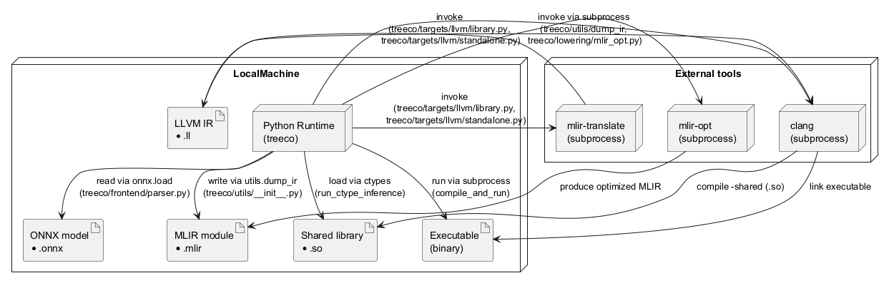

Caption: Figure 8.1.1 — The Treeco Python runtime runs locally, invokes MLIR and LLVM tools via subprocesses, and reads/writes artifacts on the local filesystem. Two native execution options exist: shared library (.so) loaded via ctypes, or an executable invoked via subprocess.

## Nodes, tools, and artifacts

The table below enumerates the deployed nodes, external tools, and artifacts, together with the exact code elements that use or produce them. All elements are derived directly from the source code and are required for end-to-end execution.

| Element | Type | Implemented/Used by | Purpose |
|---|---|---|---|
| Python Runtime (Treeco) | Process on LocalMachine | src/treeco/__main__.py; src/treeco/compiler.py | Entry points for CLI and API driving parsing, lowering, and targets |
| ONNX model (*.onnx) | Artifact (input file) | src/treeco/frontend/parser.py (Parser.parseModel) | Model input read via onnx.load |
| MLIR module (*.mlir) | Artifact (intermediate/output file) | src/treeco/utils/__init__.py (dump_ir); src/treeco/lowering/mlir_opt.py (mlir_opt_pass) | IR emitted/optimized and written to disk |
| LLVM IR (*.ll) | Artifact | src/treeco/targets/llvm/library.py (compile_as_library); src/treeco/targets/llvm/standalone.py (compile_and_run) | Result of mlir-translate (MLIR to LLVM IR) |
| Shared library (*.so) | Artifact | src/treeco/targets/llvm/library.py (compile_as_library) | Output of clang -shared, later loaded via ctypes |
| Executable (binary) | Artifact | src/treeco/targets/llvm/standalone.py (compile_and_run) | Output of clang for direct execution |
| mlir-opt | External tool (subprocess) | src/treeco/utils/__init__.py (dump_ir); src/treeco/lowering/mlir_opt.py (mlir_opt_pass) | Applies MLIR passes; Treeco passes supply args |
| mlir-translate | External tool (subprocess) | src/treeco/targets/llvm/library.py; src/treeco/targets/llvm/standalone.py | Converts MLIR to LLVM IR |
| clang | External tool (subprocess) | src/treeco/targets/llvm/library.py; src/treeco/targets/llvm/standalone.py | Produces .so and/or executable |
| ctypes | In-process loader | src/treeco/targets/llvm/library.py (run_ctype_inference) | Loads .so and calls inference symbol |
| Filesystem | Local storage | All above | Intermediate and final artifacts |

## Python runtime dependencies

These Python packages are directly imported and required at runtime by the codebase:
- xdsl and its dialects/passes (extensively across the repository)
- onnx (src/treeco/frontend/parser.py)
- numpy (multiple modules: utils, transforms, model)
- bigtree (src/treeco/model/node.py, src/treeco/model/ensemble.py)
- ctypes (standard library; src/treeco/targets/llvm/library.py)
- subprocess, shutil, os, pathlib, typing (standard library; used across utils and targets)

These dependencies execute within the single LocalMachine node shown above; no remote services or distributed components are used.

## Validation notes

A maintainer can validate this deployment view by:
1) Inspecting subprocess invocations and tool paths in src/treeco/lowering/mlir_opt.py (mlir-opt), src/treeco/utils/__init__.py (dump_ir -> mlir-opt), src/treeco/targets/llvm/library.py and src/treeco/targets/llvm/standalone.py (mlir-translate, clang).
2) Verifying file reads/writes to MLIR and LLVM artifacts in the same files.
3) Confirming ONNX parsing occurs via onnx.load in src/treeco/frontend/parser.py.
4) Confirming native execution via ctypes in src/treeco/targets/llvm/library.py or via running the compiled executable in src/treeco/targets/llvm/standalone.py.

This deployment description contains only elements present in the codebase and reflects the actual execution and compilation paths implemented by Treeco.

 