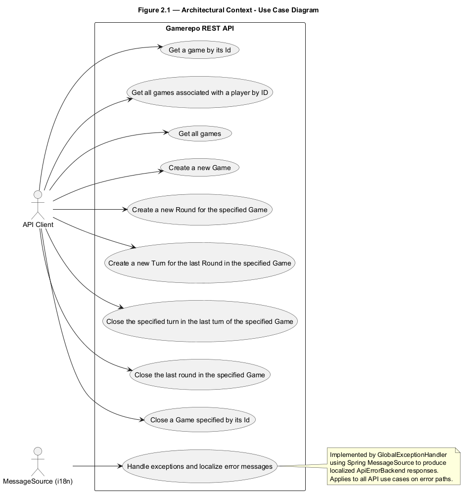
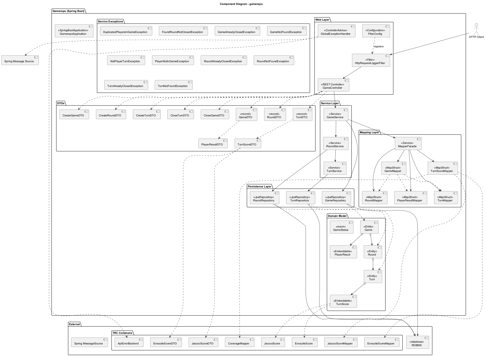
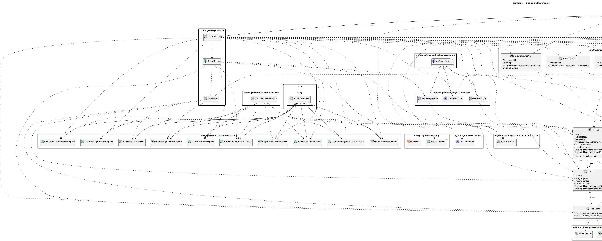
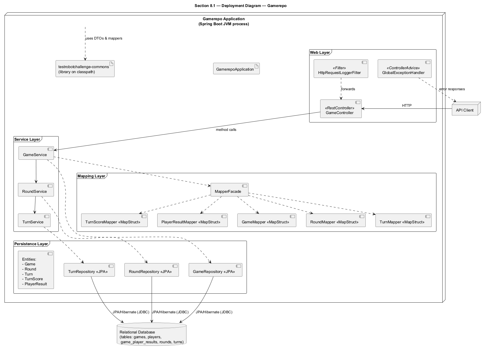

 

% 1 — System Overview
# SECTION 1 — System Overview

This section introduces the system’s purpose, scope, and the core features directly evidenced by the codebase. It is intended to align all stakeholders on what the software does, what it exposes, and which responsibilities it implements, without speculating beyond what is present in the repository.

## Purpose and Scope

The repository implements a Spring Boot backend service that manages the lifecycle of competitive “games” composed of rounds and turns. It exposes a REST API to create games, progress through rounds and turns, record scores, and close games with player results. The service persists game state using Spring Data JPA and maps domain entities to API DTOs using MapStruct. It also standardizes error handling across the API and logs inbound HTTP requests.

The scope is a full backend service. It includes domain modeling, persistence, application services, mapping, HTTP endpoints, exception handling, a request logging filter, and OpenAPI annotations for API documentation. There is no UI component in this repository.

## Primary Capabilities

The service enables clients to:
Create and retrieve games, including listing all games and all games for a specific player.
Start and close rounds within a game, enforcing sequential lifecycle rules.
Start and close turns within a round for a specific player, enforcing that only the associated player can close their turn.
Assign and persist structured scoring for a turn using embedded Evosuite and Jacoco score models.
Close a game with final per-player results and a surrendered or finished status.
Handle errors consistently with localized messages and structured error payloads.

These operations are implemented via the GameService, RoundService, and TurnService, backed by JPA repositories and surfaced through a single GameController under the /games path.

## Domain Summary

The domain model comprises:
Game: Root aggregate; tracks players (List<Long>), status (CREATED, STARTED, IN_PROGRESS, FINISHED, SURRENDERED), mode (GameMode), per-player results (Map<Long, PlayerResult>), ordered rounds, and timestamps (startedAt, closedAt).
Round: Child of Game; includes metadata (classUT, type, difficulty), an ordered list of turns, and timestamps. Only one open round at a time is permitted.
Turn: Child of Round; associated to a specific player (playerId) and a turnNumber; carries a TurnScore composed of embedded JacocoScore and EvosuiteScore; contains timestamps (startedAt, closedAt). A turn can be closed once and only by its associated player.
PlayerResult: Embeddable value for final per-player game results (score, isWinner).
Lifecycle rules are enforced by services:
A new round cannot start if the previous one is still open.
A game cannot accept new rounds or turns once closed.
Only registered players can start/close turns; only the owning player can close their turn.
Closing operations set closedAt timestamps and update status fields as appropriate.

## HTTP API Overview

The system exposes the following REST endpoints from GameController, all under the /games base path. DTOs are defined under com.t4.gamerepo.model.dto.* and mapping is done via MapStruct mappers.

| Method | Path                                     | Purpose                                                  | Request body                 | Success response          |
|--------|------------------------------------------|----------------------------------------------------------|------------------------------|---------------------------|
| GET    | /games/{gameId}                          | Retrieve a game by its id                                | —                            | GameDTO                   |
| GET    | /games/player/{playerId}                 | List all games where the player participates             | —                            | List<GameDTO>             |
| GET    | /games                                   | List all games                                          | —                            | List<GameDTO>             |
| POST   | /games                                   | Create a new game                                        | CreateGameDTO                | 201 Created with GameDTO  |
| POST   | /games/{gameId}/rounds                   | Start a new round for the game                           | CreateRoundDTO               | 201 Created with RoundDTO |
| POST   | /games/{gameId}/rounds/last/turns        | Start a new turn in the last round                       | CreateTurnDTO                | 201 Created with TurnDTO  |
| PUT    | /games/{gameId}/rounds/last/turns/{n}    | Close turn number n in the last round                    | CloseTurnDTO                 | TurnDTO                   |
| PUT    | /games/{gameId}/rounds/last              | Close the last round                                     | —                            | RoundDTO                  |
| PUT    | /games/{gameId}                          | Close the game with final results                        | CloseGameDTO                 | GameDTO                   |

Error handling is centralized in GlobalExceptionHandler, which maps domain exceptions to HTTP status codes and returns ApiErrorBackend bodies populated via Spring’s MessageSource for localization.

## Cross-cutting Concerns and Technical Characteristics

The service uses Spring Data JPA for persistence with repositories for Game (Long id), Round (Long id), and Turn (configured with Integer id in TurnRepository). Entities define tables and relationships explicitly: games, rounds, turns, and element-collection tables players and game_player_results.

DTO and entity conversions are performed with MapStruct mappers: GameMapper, RoundMapper, TurnMapper, TurnScoreMapper, and PlayerResultMapper. TurnScore mapping leverages external mappers from testrobotchallenge.commons for Jacoco and Evosuite score conversions. MapperFacade provides a single entry point for conversions used by services.

A OncePerRequestFilter-based HttpRequestLoggerFilter logs method, path, headers, query string, and request body after the chain proceeds, and FilterConfig registers it with order 1. CORS is enabled at the controller level with @CrossOrigin.

OpenAPI annotations are present on controller methods for documentation, covering summaries, response schemas, and error responses. Transactions are applied at the service layer where state changes occur using @Transactional. Logging is used in GameService to trace key lifecycle transitions and decisions.

## Out of Scope and Not Present

The repository does not include authentication or authorization logic, multi-tenant concerns, or explicit database configuration files. Validation annotations on DTO fields are not defined beyond the use of @Validated at method level. No messaging, caching, or asynchronous processing is present in the codebase.

% 2 — Architectural Context
## 2. Architectural Context

This section describes the external boundaries of the system as evidenced by the codebase, including external systems and libraries it interacts with, the public APIs it exposes, the underlying data sources it persists to, and the kinds of users or actors that interact with it. The goal is to enable readers to understand what is outside the system, what the system offers to its environment, and which data sources it depends on. All details below are derived from the provided source code.

### External Systems

- No outbound runtime integrations to other networked services are present in the codebase. The application only exposes REST endpoints and persists data to a relational database via JPA/Hibernate.
- Internationalization uses Spring’s MessageSource to resolve error messages from resource bundles (message codes are listed below). The actual message bundles are not included in the repository.
- The system depends on the shared library package testrobotchallenge.commons for:
  - Error payload type: testrobotchallenge.commons.models.dto.api.ApiErrorBackend.
  - Domain enums: testrobotchallenge.commons.models.opponent.GameMode and OpponentDifficulty.
  - Score model/DTO mapping: testrobotchallenge.commons.models.score.JacocoScore, testrobotchallenge.commons.models.score.EvosuiteScore, and mappers testrobotchallenge.commons.mappers.{JacocoScoreMapper, EvosuiteScoreMapper, CoverageMapper}.
- Frameworks and libraries used (as visible in imports and annotations): Spring Boot (Web MVC, DI, Validation), Spring Data JPA, Hibernate/JPA (jakarta.persistence), MapStruct, Lombok, SLF4J, Servlet API (OncePerRequestFilter).

### APIs / Interfaces

- REST endpoints (JSON over HTTP), defined in com.t4.gamerepo.controller.GameController:
  - GET /games/{gameId} → 200 GameDTO; 404 on GameNotFoundException.
  - GET /games/player/{playerId} → 200 List<GameDTO>.
  - GET /games → 200 List<GameDTO>.
  - POST /games with CreateGameDTO → 201 GameDTO; 400 on DuplicatedPlayersInGameException.
  - POST /games/{gameId}/rounds with CreateRoundDTO → 201 RoundDTO; 404 on GameNotFoundException; 409 on GameAlreadyClosedException or FoundRoundNotClosedException.
  - POST /games/{gameId}/rounds/last/turns with CreateTurnDTO → 201 TurnDTO; 404 on GameNotFoundException or RoundNotFoundException; 409 on GameAlreadyClosedException or PlayerNotInGameException.
  - PUT /games/{gameId}/rounds/last/turns/{turnNumber} with CloseTurnDTO → 200 TurnDTO; 404 on GameNotFoundException/RoundNotFoundException/TurnNotFoundException; 409 on GameAlreadyClosedException or PlayerNotInGameException.
  - PUT /games/{gameId}/rounds/last → 200 RoundDTO; 404 on GameNotFoundException or RoundNotFoundException; 409 on GameAlreadyClosedException or RoundAlreadyClosedException.
  - PUT /games/{gameId} with CloseGameDTO → 200 GameDTO; 404 on GameNotFoundException; 409 on GameAlreadyClosedException.
- CORS is enabled at controller level (@CrossOrigin), allowing browser-based clients to call the API.
- Error handling via com.t4.gamerepo.controller.advices.GlobalExceptionHandler:
  - Maps domain exceptions to HTTP status codes and returns ApiErrorBackend with messages resolved through MessageSource using these keys:
    - errors.game.notFound
    - errors.players.notFoundInGame
    - errors.players.duplicated
    - errors.rounds.foundOpen
    - errors.games.alreadyClosed
    - errors.rounds.alreadyClosed
    - errors.turns.alreadyClosed
    - errors.players.notInTurn
    - errors.rounds.notFound
    - errors.turns.notFound
- Cross-cutting request logging via com.t4.gamerepo.filter.HttpRequestLoggerFilter (OncePerRequestFilter) registered by FilterConfig. It logs method, URI, query string, headers, and request body at DEBUG level.

### Data Sources

- Relational database accessed via Spring Data JPA/Hibernate. Entities and table mappings:
  - Game (table: games)
    - id (Long, @Id, generated)
    - players: @ElementCollection in table players with join column game_id and column player_id.
    - status (enum GameStatus), gameMode (enum GameMode).
    - playerResults: @ElementCollection in table game_player_results with map key column player_id; value type PlayerResult (@Embeddable).
    - rounds: @OneToMany(cascade = ALL, orphanRemoval = true) with join column game_id; ordered by roundNumber ASC.
    - startedAt (@CreationTimestamp), closedAt.
  - Round (table: rounds)
    - id (Long, @Id, generated), classUT, type, difficulty (enum OpponentDifficulty), roundNumber.
    - turns: @OneToMany(cascade = ALL, orphanRemoval = true) with join column round_id; ordered by turnNumber ASC.
    - startedAt (@CreationTimestamp), closedAt.
  - Turn (table: turns)
    - id (Long, @Id, generated), playerId (not null), turnNumber, score (@Embedded TurnScore), startedAt (@CreationTimestamp), closedAt.
  - PlayerResult (@Embeddable): score (int), isWinner (boolean).
  - TurnScore (@Embeddable): jacocoScore (@Embedded), evosuiteScore (@Embedded) sourced from testrobotchallenge.commons.models.score.
- Repositories:
  - GameRepository extends JpaRepository<Game, Long>; native query findByPlayerId joins games with players element-collection table.
  - RoundRepository extends JpaRepository<Round, Long>.
  - TurnRepository extends JpaRepository<Turn, Integer> (repository id type differs from Turn.id’s declared Long in the entity).
- Transaction boundaries are declared at service methods (@Transactional in GameService) that mutate state.
- No explicit database vendor or schema migration tool configuration is present in the codebase; JPA/Hibernate default DDL behavior is implied.

### Users / Actors

- HTTP API consumers (e.g., web or service clients) invoking the REST endpoints; CORS settings indicate browser-based frontends are supported.
- No authentication/authorization mechanisms are present in the code; all endpoints are publicly accessible based on the code provided.
- Domain “players” are modeled as IDs within games but are not represented as authenticated users or API callers in this codebase.

% 2.1 — Architectural Context – Use Case Diagram
## SECTION 2.1 — Architectural Context – Use Case Diagram

This section presents the business context of the Gamerepo REST API as exposed by its controller layer. It identifies the external actor and the complete set of use cases directly supported by the implementation. The use case names align exactly with the API operation summaries in the code to ensure traceability. Global error handling and localization behavior are also indicated, as implemented by the GlobalExceptionHandler and Spring’s MessageSource.

Figure: section-2-1-architectural-context-use-case-diagram.puml

Table 2.1 — Use cases mapped to endpoints and services

| Use case (as in code)                                                      | HTTP verb | Path                                           | Controller method                | Service interactions                                                                 |
|----------------------------------------------------------------------------|-----------|-----------------------------------------------|----------------------------------|--------------------------------------------------------------------------------------|
| Get a game by its Id                                                       | GET       | /games/{gameId}                               | getGameById                      | GameService.getGameById                                                              |
| Get all games associated with a player by ID                               | GET       | /games/player/{playerId}                      | getAllPlayerGames                | GameService.getAllPlayerGames                                                        |
| Get all games                                                              | GET       | /games                                        | getAllGames                      | GameService.getAllGames                                                              |
| Create a new Game                                                          | POST      | /games                                        | createGame                       | GameService.createGame                                                               |
| Create a new Round for the specified Game                                  | POST      | /games/{gameId}/rounds                        | startRound                       | GameService.startRound → RoundService.createRound                                    |
| Create a new Turn for the last Round in the specified Game                 | POST      | /games/{gameId}/rounds/last/turns             | startTurn                        | GameService.startTurn → RoundService.startTurn → TurnService.createTurn              |
| Close the specified turn in the last turn of the specified Game            | PUT       | /games/{gameId}/rounds/last/turns/{turnNumber}| closeTurn                        | GameService.endTurn → RoundService.closeTurn → TurnService.closeTurn                 |
| Close the last round in the specified Game                                 | PUT       | /games/{gameId}/rounds/last                   | closeRound                       | GameService.endRound → RoundService.closeRound                                       |
| Close a Game specified by its Id                                           | PUT       | /games/{gameId}                               | closeGame                        | GameService.endGame                                                                   |

Notes:
The GlobalExceptionHandler provides localized error responses for all use cases by mapping domain exceptions (e.g., GameNotFoundException, PlayerNotInGameException, RoundNotFoundException) to HTTP status codes and messages retrieved from MessageSource. The HttpRequestLoggerFilter logs every HTTP request and body content; it is orthogonal to use-case behavior and does not introduce additional use cases.

% 3 — Containers
## 3. Containers

This section identifies the runtime containers that make up the system as implemented in the provided codebase. For each container, it describes its primary responsibility, the technologies and frameworks in use, and the communication mechanisms through which it interacts with other containers. All details are derived strictly from the source code and reflect the current implementation.

| Container | Responsibility | Technology | Communication |
|---|---|---|---|
| Gamerepo REST API | Exposes HTTP endpoints to manage games, rounds, and turns; enforces domain rules; maps entities to DTOs; handles exceptions; logs requests; persists domain entities via repositories. | Java, Spring Boot (Spring Web MVC, Spring Data JPA), Hibernate/JPA, MapStruct, Jakarta Servlet API, SLF4J, Lombok | Inbound: HTTP/JSON. Outbound: JDBC/SQL via JPA/Hibernate to the relational database. |
| Relational Database (JPA-managed) | Stores domain data for games, rounds, turns, players, and scores; supports element collections and embedded value objects used by the domain model. | JPA/Hibernate-managed relational schema (tables: games, rounds, turns, players, game_player_results) | Inbound: JDBC/SQL from the Gamerepo REST API via Spring Data JPA. |

% 3.1 — Architecture Overview – Component Diagram
# SECTION 3.1 — Architecture Overview – Component Diagram

This section presents the implementation-level component view of the gamerepo Spring Boot service. It summarizes the runtime-relevant components, their responsibilities, and their dependencies as realized in the codebase. The diagram and the accompanying index are derived strictly from the provided source code and are intended to be validated by the development team.

Figure 3-1 depicts the complete set of components and their interactions across web, service, mapping, persistence, and domain layers, as well as their connections to external dependencies including the relational database, Spring’s MessageSource, and the TestRobotChallenge Commons library.

Figure 3-1 — Component Diagram — gamerepo

## Component index and traceability to code

The following index enumerates all implemented components that appear in the diagram and links them to their code locations, enabling direct traceability:

- GamerepoApplication (com.t4.gamerepo.GamerepoApplication) initializes the Spring Boot application.
- Web layer consists of:
  - GameController (com.t4.gamerepo.controller.GameController) exposing REST endpoints for games, rounds, and turns.
  - GlobalExceptionHandler (com.t4.gamerepo.controller.advices.GlobalExceptionHandler) translating service exceptions to ApiErrorBackend via Spring MessageSource.
  - HttpRequestLoggerFilter (com.t4.gamerepo.filter.HttpRequestLoggerFilter) logging incoming HTTP requests and bodies.
  - FilterConfig (com.t4.gamerepo.filter.FilterConfig) registering the logging filter.
- Service layer consists of:
  - GameService (com.t4.gamerepo.service.GameService) orchestrating game lifecycle and delegating to RoundService, repositories, and mappers.
  - RoundService (com.t4.gamerepo.service.RoundService) managing round creation, turn start/close, and round close.
  - TurnService (com.t4.gamerepo.service.TurnService) creating and closing turns with validation.
- Mapping layer consists of:
  - MapperFacade (com.t4.gamerepo.mapper.MapperFacade) providing a single entry to MapStruct mappers and entity conversions.
  - GameMapper, RoundMapper, TurnMapper, TurnScoreMapper, PlayerResultMapper (com.t4.gamerepo.mapper.*) mapping between entities and DTOs, with TurnScoreMapper delegating to JacocoScoreMapper, EvosuiteScoreMapper, and CoverageMapper from the external library.
- Persistence layer consists of:
  - GameRepository (com.t4.gamerepo.model.repositories.GameRepository) with a native query for player-based lookup.
  - RoundRepository (com.t4.gamerepo.model.repositories.RoundRepository).
  - TurnRepository (com.t4.gamerepo.model.repositories.TurnRepository).
- Domain model consists of:
  - Game, Round, Turn (JPA entities) and PlayerResult, TurnScore (embeddables) in com.t4.gamerepo.model.
  - GameStatus (enum) in com.t4.gamerepo.model.
- DTOs consist of:
  - Requests: CreateGameDTO, CreateRoundDTO, CreateTurnDTO, CloseTurnDTO, CloseGameDTO (com.t4.gamerepo.model.dto.request.*).
  - Responses: GameDTO, RoundDTO, TurnDTO (com.t4.gamerepo.model.dto.response.*).
  - Commons: PlayerResultDTO, TurnScoreDTO (com.t4.gamerepo.model.dto.common.*).
- Service exceptions consist of:
  - DuplicatedPlayersInGameException, FoundRoundNotClosedException, GameAlreadyClosedException, GameNotFoundException, NotPlayerTurnException, PlayerNotInGameException, RoundAlreadyClosedException, RoundNotFoundException, TurnAlreadyClosedException, TurnNotFoundException (com.t4.gamerepo.service.exceptions.*).
- External dependencies visible in code:
  - RDBMS accessed via Spring Data JPA repositories.
  - Spring MessageSource used by GlobalExceptionHandler.
  - TestRobotChallenge Commons library providing ApiErrorBackend, Evosuite/Jacoco score models and DTOs, and the JacocoScoreMapper, EvosuiteScoreMapper, CoverageMapper used by TurnScoreMapper.

This component view reflects the actual implementation structure and dependencies in the repository and can be validated by reviewing the referenced classes in the listed packages.

% 4 — Components
## 4. Components

This section enumerates all internal components present in the codebase, organized at class level. For each component, it states the primary responsibility and its concrete collaborations with other in-repo components as evidenced by method calls, constructor injection, repository usage, and MapStruct mappings. This view supports both code-level validation and impact analysis by showing how controllers, services, repositories, mappers, entities, DTOs, filters, and exception handlers depend on and interact with each other.

| Component | Responsibility | Interactions |
|---|---|---|
| com.t4.gamerepo.GamerepoApplication | Bootstraps the Spring Boot application and triggers component scanning and auto-configuration. | — |
| com.t4.gamerepo.controller.advices.GlobalExceptionHandler | Centralizes translation of domain/service exceptions into HTTP responses with localized error messages. | GameNotFoundException; PlayerNotInGameException; DuplicatedPlayersInGameException; FoundRoundNotClosedException; GameAlreadyClosedException; RoundAlreadyClosedException; TurnAlreadyClosedException; NotPlayerTurnException; RoundNotFoundException; TurnNotFoundException |
| com.t4.gamerepo.controller.GameController | Exposes REST endpoints to create, query, and mutate games, rounds, and turns; delegates business logic to the service layer; shapes responses with DTOs. | GameService; CreateGameDTO; CreateRoundDTO; CreateTurnDTO; CloseTurnDTO; CloseGameDTO; GameDTO; RoundDTO; TurnDTO |
| com.t4.gamerepo.filter.FilterConfig | Registers the HTTP request logging filter in the servlet filter chain and sets its order. | HttpRequestLoggerFilter |
| com.t4.gamerepo.filter.HttpRequestLoggerFilter | Logs method, URI, headers, and body of each HTTP request after processing, using a content-caching wrapper. | — |
| com.t4.gamerepo.mapper.GameMapper | MapStruct mapper converting Game entity to GameDTO, delegating nested mappings to other mappers. | Game; GameDTO; RoundMapper; TurnMapper; PlayerResultMapper |
| com.t4.gamerepo.mapper.MapperFacade | Facade centralizing mapping between entities and DTOs for Game, Round, Turn, TurnScore, and PlayerResult; used by services. | GameMapper; RoundMapper; TurnMapper; TurnScoreMapper; PlayerResultMapper; Game; Round; Turn; TurnScore; PlayerResult; GameDTO; RoundDTO; TurnDTO; TurnScoreDTO; PlayerResultDTO |
| com.t4.gamerepo.mapper.PlayerResultMapper | MapStruct mapper converting between PlayerResult and PlayerResultDTO. | PlayerResult; PlayerResultDTO |
| com.t4.gamerepo.mapper.RoundMapper | MapStruct mapper converting Round to RoundDTO; provides list mapping; delegates nested turn mapping. | Round; RoundDTO; TurnMapper |
| com.t4.gamerepo.mapper.TurnMapper | MapStruct mapper converting Turn to TurnDTO; provides list mapping; delegates score mapping. | Turn; TurnDTO; TurnScoreMapper |
| com.t4.gamerepo.mapper.TurnScoreMapper | MapStruct mapper converting between TurnScore and TurnScoreDTO; delegates nested score conversions to external mappers. | TurnScore; TurnScoreDTO |
| com.t4.gamerepo.model.dto.common.PlayerResultDTO | DTO carrying per-player end-of-game result: winner flag and score. | — |
| com.t4.gamerepo.model.dto.common.TurnScoreDTO | DTO carrying per-turn scores (Evosuite and Jacoco). | — |
| com.t4.gamerepo.model.dto.request.CloseGameDTO | Request DTO to close a game with per-player results and surrender flag. | PlayerResultDTO |
| com.t4.gamerepo.model.dto.request.CloseTurnDTO | Request DTO to close a turn with playerId and turn score payload. | TurnScoreDTO |
| com.t4.gamerepo.model.dto.request.CreateGameDTO | Request DTO to create a new game with mode and players. | — |
| com.t4.gamerepo.model.dto.request.CreateRoundDTO | Request DTO to start a round with class under test, type, difficulty, and round number. | — |
| com.t4.gamerepo.model.dto.request.CreateTurnDTO | Request DTO to start a turn with playerId and turn number. | — |
| com.t4.gamerepo.model.dto.response.GameDTO | Response DTO for a game with metadata, status, player results, and rounds. | PlayerResultDTO; RoundDTO |
| com.t4.gamerepo.model.dto.response.RoundDTO | Response DTO for a round with metadata and turns. | TurnDTO |
| com.t4.gamerepo.model.dto.response.TurnDTO | Response DTO for a turn with player, number, score, and timestamps. | TurnScoreDTO |
| com.t4.gamerepo.model.repositories.GameRepository | Spring Data repository for Game; implements CRUD and native query to find games by player in the players element collection. | Game |
| com.t4.gamerepo.model.repositories.RoundRepository | Spring Data repository for Round; implements CRUD. | Round |
| com.t4.gamerepo.model.repositories.TurnRepository | Spring Data repository for Turn; persists and retrieves turns. | Turn |
| com.t4.gamerepo.model.Game | JPA entity representing a game with players, status, mode, player results, and rounds; provides helpers to add and get the last round. | Round; PlayerResult |
| com.t4.gamerepo.model.GameStatus | Enumerates lifecycle states of a game (CREATED, STARTED, IN_PROGRESS, FINISHED, SURRENDERED). | — |
| com.t4.gamerepo.model.PlayerResult | Embeddable value for per-player end-of-game result (score, winner flag). | — |
| com.t4.gamerepo.model.Round | JPA entity representing a round with metadata and ordered turns; provides helper to add turns. | Turn |
| com.t4.gamerepo.model.Turn | JPA entity representing a turn with playerId, number, score, and timestamps. | TurnScore |
| com.t4.gamerepo.model.TurnScore | Embeddable value combining Jacoco and Evosuite scores for a turn. | — |
| com.t4.gamerepo.service.exceptions.DuplicatedPlayersInGameException | Domain exception signaled when duplicate player IDs are found on game creation. | — |
| com.t4.gamerepo.service.exceptions.FoundRoundNotClosedException | Domain exception signaled when attempting to start a new round while the last round is still open. | — |
| com.t4.gamerepo.service.exceptions.GameAlreadyClosedException | Domain exception signaled when mutating a game that is already closed. | — |
| com.t4.gamerepo.service.exceptions.GameNotFoundException | Domain exception for missing game by id. | — |
| com.t4.gamerepo.service.exceptions.NotPlayerTurnException | Domain exception when a player attempts to close a turn not belonging to them. | — |
| com.t4.gamerepo.service.exceptions.PlayerNotInGameException | Domain exception when a referenced player does not belong to a game. | — |
| com.t4.gamerepo.service.exceptions.RoundAlreadyClosedException | Domain exception when mutating a round that is already closed. | — |
| com.t4.gamerepo.service.exceptions.RoundNotFoundException | Domain exception for missing round in a game. | — |
| com.t4.gamerepo.service.exceptions.TurnAlreadyClosedException | Domain exception when attempting to close an already closed turn. | — |
| com.t4.gamerepo.service.exceptions.TurnNotFoundException | Domain exception when a turn number is not present in the current round. | — |
| com.t4.gamerepo.service.GameService | Orchestrates game lifecycle: create game, start/end round, start/end turn, close game; enforces business constraints; persists via repositories; maps entities to DTOs. | GameRepository; RoundService; MapperFacade; Game; Round; Turn; TurnScore; PlayerResult; CreateGameDTO; CreateRoundDTO; CreateTurnDTO; CloseTurnDTO; CloseGameDTO; GameDTO; RoundDTO; TurnDTO; DuplicatedPlayersInGameException; GameNotFoundException; GameAlreadyClosedException; FoundRoundNotClosedException; PlayerNotInGameException; RoundNotFoundException |
| com.t4.gamerepo.service.RoundService | Manages round lifecycle: creation, starting turns, closing turns and rounds; enforces round-level constraints; persists via repository; delegates turn operations. | RoundRepository; TurnService; Round; Turn; TurnScore; RoundAlreadyClosedException; TurnNotFoundException |
| com.t4.gamerepo.service.TurnService | Manages turn lifecycle: creation and closure; validates player ownership and closed state; persists via repository. | TurnRepository; Turn; TurnScore; NotPlayerTurnException; TurnAlreadyClosedException |
| com.t4.gamerepo.GamerepoApplicationTests | Validates that the Spring Boot application context loads successfully. | — |

% 5 — Code-Level View
# Section 5 — Code-Level View

This section describes how the source code realizes the architectural elements, focusing on entry points, modules, responsibilities, and inter-module dependencies. It maps the layered organization visible in the codebase to concrete packages, classes, and methods, to enable validation by developers familiar with the implementation.

## 5.1 Architectural layering and recognizable patterns

The codebase implements a classic Spring Boot layered architecture with clear separation of concerns:

- Web/API layer: HTTP endpoints exposed by a REST controller, with a global exception handler and a servlet filter for request logging.
- Service layer: application and domain services encapsulating business logic and transactional coordination.
- Mapping layer: MapStruct mappers converting between domain entities and DTOs; a facade centralizes mapping calls.
- Data/model layer: JPA entities and embeddables modeling the domain; Spring Data repositories providing persistence operations.
- DTO layer: request and response DTOs for API contracts.

Cross-cutting concerns include a servlet filter for request logging and centralized exception-to-HTTP mapping via @ControllerAdvice.

Patterns explicitly recognizable:
- Layered architecture (Controller → Service → Repository).
- DTO + Mapper pattern using MapStruct.
- Spring’s @ControllerAdvice for exception handling.
- Servlet Filter (OncePerRequestFilter) for request logging.

## 5.2 Main entry points

- Application bootstrap: com.t4.gamerepo.GamerepoApplication.main(String[] args) launches Spring Boot.
- HTTP API endpoints: com.t4.gamerepo.controller.GameController methods annotated with @GetMapping, @PostMapping, @PutMapping under the /games base path.
- Servlet filter: com.t4.gamerepo.filter.HttpRequestLoggerFilter.doFilterInternal is invoked once per request.
- Exception handling entry point: com.t4.gamerepo.controller.advices.GlobalExceptionHandler methods via @ExceptionHandler annotations.

## 5.3 Package/module structure and responsibilities

The following table lists all top-level modules and their classes, with responsibilities and dependencies.

| Package | Class | Responsibility | Direct dependencies (imports and calls) |
|---|---|---|---|
| com.t4.gamerepo | GamerepoApplication | Spring Boot application entry point | SpringApplication, SpringBootApplication |
| com.t4.gamerepo.controller | GameController | Exposes REST endpoints to manage games, rounds, and turns; delegates to GameService | GameService; request/response DTOs; Swagger/OpenAPI annotations; ResponseEntity/HttpStatus |
| com.t4.gamerepo.controller.advices | GlobalExceptionHandler | Maps domain exceptions to HTTP responses with localized messages | MessageSource, ApiErrorBackend, Spring MVC @ControllerAdvice/@ExceptionHandler, HttpStatus |
| com.t4.gamerepo.filter | FilterConfig | Registers HttpRequestLoggerFilter with filter order | FilterRegistrationBean, @Configuration/@Bean |
| com.t4.gamerepo.filter | HttpRequestLoggerFilter | Logs HTTP request method, URI, headers, and body for each request | OncePerRequestFilter, ContentCachingRequestWrapper, SLF4J Logger |
| com.t4.gamerepo.mapper | MapperFacade | Central facade to convert entities↔DTOs using MapStruct mappers | GameMapper, RoundMapper, TurnMapper, TurnScoreMapper, PlayerResultMapper |
| com.t4.gamerepo.mapper | GameMapper | MapStruct mapper: Game → GameDTO | RoundMapper, TurnMapper, PlayerResultMapper |
| com.t4.gamerepo.mapper | RoundMapper | MapStruct mapper: Round → RoundDTO, List<Round> → List<RoundDTO> | TurnMapper |
| com.t4.gamerepo.mapper | TurnMapper | MapStruct mapper: Turn → TurnDTO, List<Turn> → List<TurnDTO> | TurnScoreMapper |
| com.t4.gamerepo.mapper | TurnScoreMapper | MapStruct mapper: TurnScore ↔ TurnScoreDTO with qualified mappings | testrobotchallenge.commons.mappers.JacocoScoreMapper, EvosuiteScoreMapper, CoverageMapper |
| com.t4.gamerepo.mapper | PlayerResultMapper | MapStruct mapper: PlayerResult ↔ PlayerResultDTO | — |
| com.t4.gamerepo.model | Game | JPA entity: game aggregate root; owns rounds, players, results, status, timestamps | JPA annotations, GameStatus, Round, PlayerResult, GameMode |
| com.t4.gamerepo.model | GameStatus | Enum of lifecycle statuses | — |
| com.t4.gamerepo.model | PlayerResult | Embeddable player result (score, isWinner) | JPA @Embeddable |
| com.t4.gamerepo.model | Round | JPA entity: round details, turns, timestamps | Turn, OpponentDifficulty, JPA annotations |
| com.t4.gamerepo.model | Turn | JPA entity: turn details (playerId, number), score, timestamps | TurnScore (embedded), JPA annotations |
| com.t4.gamerepo.model | TurnScore | Embeddable score composed of JacocoScore and EvosuiteScore | testrobotchallenge.commons.models.score.*, JPA @Embeddable/@Embedded |
| com.t4.gamerepo.model.repositories | GameRepository | Spring Data JPA repository for Game with custom native query findByPlayerId | JpaRepository, @Query(nativeQuery = true) |
| com.t4.gamerepo.model.repositories | RoundRepository | Spring Data JPA repository for Round | JpaRepository |
| com.t4.gamerepo.model.repositories | TurnRepository | Spring Data JPA repository for Turn | JpaRepository |
| com.t4.gamerepo.model.dto.common | PlayerResultDTO | DTO representing player result | Lombok annotations |
| com.t4.gamerepo.model.dto.common | TurnScoreDTO | DTO representing turn score with embedded DTOs | EvosuiteScoreDTO, JacocoScoreDTO |
| com.t4.gamerepo.model.dto.request | CreateGameDTO | Request DTO for game creation | GameMode |
| com.t4.gamerepo.model.dto.request | CreateRoundDTO | Request DTO for round creation | OpponentDifficulty |
| com.t4.gamerepo.model.dto.request | CreateTurnDTO | Request DTO for turn creation | — |
| com.t4.gamerepo.model.dto.request | CloseTurnDTO | Request DTO to close a turn with score | TurnScoreDTO |
| com.t4.gamerepo.model.dto.request | CloseGameDTO | Request DTO to close a game (results, surrender) | Map<Long, PlayerResultDTO> |
| com.t4.gamerepo.model.dto.response | GameDTO | API response record for Game | GameStatus, GameMode, PlayerResultDTO, RoundDTO |
| com.t4.gamerepo.model.dto.response | RoundDTO | API response record for Round | OpponentDifficulty, TurnDTO |
| com.t4.gamerepo.model.dto.response | TurnDTO | API response record for Turn | TurnScoreDTO |
| com.t4.gamerepo.service | GameService | Application service orchestrating game lifecycle; uses repositories and other services; transaction boundaries | GameRepository, RoundService, MapperFacade, exceptions |
| com.t4.gamerepo.service | RoundService | Domain service for rounds; delegates to TurnService | RoundRepository, TurnService, exceptions |
| com.t4.gamerepo.service | TurnService | Domain service for turns; enforces constraints and persistence | TurnRepository, exceptions |
| com.t4.gamerepo.service.exceptions | DuplicatedPlayersInGameException | Domain exception | — |
| com.t4.gamerepo.service.exceptions | FoundRoundNotClosedException | Domain exception | — |
| com.t4.gamerepo.service.exceptions | GameAlreadyClosedException | Domain exception | — |
| com.t4.gamerepo.service.exceptions | GameNotFoundException | Domain exception | — |
| com.t4.gamerepo.service.exceptions | NotPlayerTurnException | Domain exception | — |
| com.t4.gamerepo.service.exceptions | PlayerNotInGameException | Domain exception | — |
| com.t4.gamerepo.service.exceptions | RoundAlreadyClosedException | Domain exception | — |
| com.t4.gamerepo.service.exceptions | RoundNotFoundException | Domain exception | — |
| com.t4.gamerepo.service.exceptions | TurnAlreadyClosedException | Domain exception | — |
| com.t4.gamerepo.service.exceptions | TurnNotFoundException | Domain exception | — |
| com.t4.gamerepo (test) | GamerepoApplicationTests | Spring Boot context smoke test | @SpringBootTest |

Notes on observable code-level inconsistencies to aid validation:
- TurnRepository uses JpaRepository<Turn, Integer> while Turn.id is a Long.
- GlobalExceptionHandler has parameter type mismatches in two handlers: playerNotInGame accepts GameNotFoundException instead of PlayerNotInGameException; turnNotFound accepts RoundNotFoundException instead of TurnNotFoundException. Two handler methods share the same Java name foundRoundNotClosed with different exception types.

## 5.4 REST endpoints to service mapping

The controller exposes nine endpoints. The table shows the method, URI, controller method, delegated service, and main exceptions thrown by lower layers.

| HTTP | URI | Controller method | Service call | Primary exceptions propagated |
|---|---|---|---|---|
| GET | /games/{gameId} | getGameById | GameService.getGameById | GameNotFoundException |
| GET | /games/player/{playerId} | getAllPlayerGames | GameService.getAllPlayerGames | — |
| GET | /games | getAllGames | GameService.getAllGames | — |
| POST | /games | createGame | GameService.createGame | DuplicatedPlayersInGameException |
| POST | /games/{gameId}/rounds | startRound | GameService.startRound | GameNotFoundException, GameAlreadyClosedException, FoundRoundNotClosedException |
| POST | /games/{gameId}/rounds/last/turns | startTurn | GameService.startTurn | GameAlreadyClosedException, PlayerNotInGameException, RoundNotFoundException |
| PUT | /games/{gameId}/rounds/last/turns/{turnNumber} | closeTurn | GameService.endTurn | GameAlreadyClosedException, PlayerNotInGameException, RoundNotFoundException, TurnNotFoundException, TurnAlreadyClosedException, NotPlayerTurnException |
| PUT | /games/{gameId}/rounds/last | closeRound | GameService.endRound | GameAlreadyClosedException, RoundNotFoundException, RoundAlreadyClosedException |
| PUT | /games/{gameId} | closeGame | GameService.endGame | GameAlreadyClosedException |

## 5.5 Service layer behavior and repository usage

Service orchestration and repository interactions are as follows.

| Service | Method | Core logic summary | Repository interactions |
|---|---|---|---|
| GameService | getGameById | Load game or 404; map to DTO | GameRepository.findById |
| GameService | getAllPlayerGames | Native join on players table; map to DTO list | GameRepository.findByPlayerId |
| GameService | getAllGames | Load all; map to DTO list | GameRepository.findAll |
| GameService | createGame | Validate no duplicate player IDs; initialize status CREATED; persist; map | GameRepository.save |
| GameService | startRound | Guard closed game; previous round closed; create Round via RoundService; add to game; update status STARTED; persist | RoundService.createRound, GameRepository.save |
| GameService | startTurn | Guards: game not closed, player in game, round exists; delegate to RoundService.startTurn; update status IN_PROGRESS; persist | RoundService.startTurn, GameRepository.save |
| GameService | endTurn | Guards: game not closed, player in game, round exists; map TurnScoreDTO→entity; close via RoundService; persist | RoundService.closeTurn, GameRepository.save |
| GameService | endRound | Guards: game not closed, latest round present; close via RoundService; persist | RoundService.closeRound, GameRepository.save |
| GameService | endGame | Map per-player results; guard closed; set status FINISHED/SURRENDERED; set closedAt; persist; map | GameRepository.save |
| RoundService | createRound | Instantiate and persist Round | RoundRepository.save |
| RoundService | startTurn | Guard round not closed; create Turn; add to Round; persist | TurnService.createTurn, RoundRepository.save |
| RoundService | closeTurn | Validate turn index; delegate to TurnService.closeTurn | TurnService.closeTurn |
| RoundService | closeRound | Guard not already closed; set closedAt; persist | RoundRepository.save |
| TurnService | createTurn | Create Turn with playerId and turnNumber; persist | TurnRepository.save |
| TurnService | closeTurn | Guard correct player; guard not already closed; set closedAt and score; persist | TurnRepository.save |

Transactional boundaries: @Transactional is declared on write operations in GameService (createGame, startRound, startTurn, endTurn, endRound, endGame), ensuring repository operations within those methods participate in a single transaction.

## 5.6 Data model: entities and relationships

Entity: com.t4.gamerepo.model.Game

| Field | Type | Mapping | Notes |
|---|---|---|---|
| id | Long | @Id @GeneratedValue(AUTO) | Primary key |
| players | List<Long> | @ElementCollection, @CollectionTable(name="players", joinColumn="game_id"), @Column(name="player_id") | Players associated with this game; referenced in native query |
| status | GameStatus | @Enumerated(STRING) | Lifecycle status |
| gameMode | testrobotchallenge.commons.models.opponent.GameMode | @Enumerated(STRING) | External enum |
| playerResults | Map<Long, PlayerResult> | @ElementCollection, @CollectionTable(name="game_player_results"), @MapKeyColumn("player_id") | Embeddable values |
| rounds | List<Round> | @OneToMany(cascade=ALL, orphanRemoval=true) @JoinColumn("game_id") @OrderBy("roundNumber ASC") | Composition to rounds |
| startedAt | Timestamp | @Temporal(TIMESTAMP) @CreationTimestamp | Set by Hibernate |
| closedAt | Timestamp | @Temporal(TIMESTAMP) | Null if open |
| Methods | addRound, getLastRound | Domain helpers | getLastRound annotated @JsonIgnore |

Entity: com.t4.gamerepo.model.Round

| Field | Type | Mapping | Notes |
|---|---|---|---|
| id | Long | @Id @GeneratedValue(AUTO) | Primary key |
| classUT | String | Column | Unit-under-test class identifier |
| type | String | Column | Arbitrary round type |
| difficulty | OpponentDifficulty | @Enumerated(STRING) | External enum |
| roundNumber | int | Column | Round sequence |
| turns | List<Turn> | @OneToMany(cascade=ALL, orphanRemoval=true) @JoinColumn("round_id") @OrderBy("turnNumber asc") | Composition to turns |
| startedAt | Timestamp | @Temporal(TIMESTAMP) @CreationTimestamp | Set by Hibernate |
| closedAt | Timestamp | @Temporal(TIMESTAMP) | Null if open |
| Constructors | Round(int, String, String, OpponentDifficulty) | — | |
| Methods | addTurn | Domain helper | |

Entity: com.t4.gamerepo.model.Turn

| Field | Type | Mapping | Notes |
|---|---|---|---|
| id | Long | @Id @GeneratedValue(AUTO) | Primary key |
| playerId | Long | @Column(name="player_id", nullable=false) | Player who owns the turn |
| turnNumber | int | Column | Turn index within round |
| score | TurnScore | @Embedded | Null until closed |
| startedAt | Timestamp | @Temporal(TIMESTAMP) @CreationTimestamp | Set by Hibernate |
| closedAt | Timestamp | @Temporal(TIMESTAMP) | Null until close |

Embeddable: com.t4.gamerepo.model.PlayerResult

| Field | Type | Mapping |
|---|---|---|
| score | int | — |
| isWinner | boolean | — |

Embeddable: com.t4.gamerepo.model.TurnScore

| Field | Type | Mapping | Notes |
|---|---|---|---|
| jacocoScore | testrobotchallenge.commons.models.score.JacocoScore | @Embedded | External type |
| evosuiteScore | testrobotchallenge.commons.models.score.EvosuiteScore | @Embedded | External type |

Enum: com.t4.gamerepo.model.GameStatus

Values: CREATED, STARTED, IN_PROGRESS, FINISHED, SURRENDERED.

## 5.7 DTOs and API contracts

Common DTOs

- PlayerResultDTO
  - Fields: boolean isWinner; int score.
- TurnScoreDTO
  - Fields: EvosuiteScoreDTO evosuiteScoreDTO; JacocoScoreDTO jacocoScoreDTO.

Request DTOs

- CreateGameDTO
  - Fields: GameMode gameMode; List<Long> players.
- CreateRoundDTO
  - Fields: String classUT; String type; OpponentDifficulty difficulty; int roundNumber.
- CreateTurnDTO
  - Fields: long playerId; int turnNumber.
- CloseTurnDTO
  - Fields: Long playerId; TurnScoreDTO turnScoreDTO.
- CloseGameDTO
  - Fields: Map<Long, PlayerResultDTO> results; boolean isGameSurrendered.

Response DTOs

- GameDTO (record)
  - Fields: Long id; List<Long> players; GameStatus status; GameMode gameMode; Map<Long, PlayerResultDTO> playerResults; List<RoundDTO> rounds; Timestamp startedAt; Timestamp closedAt.
- RoundDTO (record)
  - Fields: String classUT; String type; OpponentDifficulty difficulty; int roundNumber; List<TurnDTO> turns; Timestamp startedAt; Timestamp closedAt.
- TurnDTO (record)
  - Fields: Long playerId; int turnNumber; TurnScoreDTO score; Timestamp startedAt; Timestamp closedAt.

## 5.8 Mapping layer: MapStruct mappers and facade

Mapping interfaces and methods:

- GameMapper
  - GameDTO gameToGameDTO(Game game).
- RoundMapper
  - RoundDTO roundToRoundDTO(Round round).
  - List<RoundDTO> roundstoRoundDTOList(List<Round> rounds).
- TurnMapper
  - TurnDTO turnToTurnDTO(Turn turn).
  - List<TurnDTO> turnsToTurnDTOList(List<Turn> turns).
- TurnScoreMapper
  - TurnScoreDTO turnScoreToTurnScoreDTO(TurnScore turnScore) with @Mapping of jacocoScore→jacocoScoreDTO and evosuiteScore→evosuiteScoreDTO using qualifiedByName into external mappers JacocoScoreMapper, EvosuiteScoreMapper, CoverageMapper.
  - TurnScore turnScoreDTOToTurnScore(TurnScoreDTO turnScoreDTO).
- PlayerResultMapper
  - PlayerResultDTO playerResultToPlayerResultDTO(PlayerResult playerResult).
  - PlayerResult playerResultDTOToPlayerResult(PlayerResultDTO playerResultDTO).

MapperFacade centralizes usage:

- toDTO(Game), toDTO(Round), toDTO(Turn) delegate to respective mappers.
- toEntity(TurnScoreDTO) and toEntity(PlayerResultDTO) delegate to TurnScoreMapper and PlayerResultMapper.

## 5.9 Repositories

- GameRepository extends JpaRepository<Game, Long>.
  - Custom native query findByPlayerId(Long playerId) using table games joined with element collection table players on game_id.
- RoundRepository extends JpaRepository<Round, Long>.
- TurnRepository extends JpaRepository<Turn, Integer>.
  - Note: Turn.id is Long; the repository uses Integer as ID type, which is inconsistent with the entity definition.

## 5.10 Exception model and HTTP mapping

Domain exceptions (all extend RuntimeException):
- DuplicatedPlayersInGameException
- FoundRoundNotClosedException
- GameAlreadyClosedException
- GameNotFoundException
- NotPlayerTurnException
- PlayerNotInGameException
- RoundAlreadyClosedException
- RoundNotFoundException
- TurnAlreadyClosedException
- TurnNotFoundException

GlobalExceptionHandler maps exceptions to ResponseEntity<ApiErrorBackend> with localized messages from MessageSource:

| Exception | HTTP status | Message key |
|---|---|---|
| GameNotFoundException | 404 NOT_FOUND | errors.game.notFound |
| PlayerNotInGameException | 400 BAD_REQUEST | errors.players.notFoundInGame |
| DuplicatedPlayersInGameException | 400 BAD_REQUEST | errors.players.duplicated |
| FoundRoundNotClosedException | 409 CONFLICT | errors.rounds.foundOpen |
| GameAlreadyClosedException | 409 CONFLICT | errors.games.alreadyClosed |
| RoundAlreadyClosedException | 409 CONFLICT | errors.rounds.alreadyClosed |
| TurnAlreadyClosedException | 409 CONFLICT | errors.turns.alreadyClosed |
| NotPlayerTurnException | 400 BAD_REQUEST | errors.players.notInTurn |
| RoundNotFoundException | 404 NOT_FOUND | errors.rounds.notFound |
| TurnNotFoundException | 404 NOT_FOUND | errors.turns.notFound |

Observed signature mismatches for validation:
- playerNotInGame handler takes GameNotFoundException parameter.
- turnNotFound handler takes RoundNotFoundException parameter.

## 5.11 Servlet filter for request logging

- Filter: HttpRequestLoggerFilter extends OncePerRequestFilter.
  - Wraps request in ContentCachingRequestWrapper, delegates filterChain, then logs method, URI, query string, remote address, all headers, and request body using a dedicated SLF4J logger at debug level.
- Registration: FilterConfig registers the filter via FilterRegistrationBean<HttpRequestLoggerFilter>, sets order=1.

## 5.12 External dependencies visible in code

- testrobotchallenge.commons.models.* for:
  - ApiErrorBackend (error response payload from GlobalExceptionHandler).
  - score basic DTOs and domain scores used in TurnScore/TurnScoreDTO.
  - opponent enums GameMode and OpponentDifficulty used in entities and DTOs.
- testrobotchallenge.commons.mappers.* for MapStruct qualified mapping of score objects.
- Spring Boot, Spring Web, Spring Data JPA, Hibernate/JPA annotations, Lombok.

## 5.13 Testing

- GamerepoApplicationTests runs a Spring Boot context load test with a single test method contextLoads(), ensuring the application context starts successfully.

## 5.14 Summary of design constraints at code level

The code enforces:
- Game lifecycle transitions via GameService with explicit guards (e.g., cannot start rounds/turns if game/round closed).
- Turn ownership validation in TurnService (NotPlayerTurnException).
- Idempotency and integrity constraints via TurnAlreadyClosedException and RoundAlreadyClosedException.
- DTO-to-entity conversions isolated in MapperFacade/MapStruct to keep controllers and services free of mapping logic.
- Global, localized error payloads via MessageSource and ApiErrorBackend.

These constraints and mappings are directly reflected in the file structure and class implementations listed above and can be validated by inspecting the referenced classes and method calls.

% 5.1 — Class Diagram
# SECTION 5.1 — Class Diagram

This section presents the static structure of the gamerepo application as implemented in the provided codebase. It shows all classes, records, interfaces, enums, repositories, services, controllers, filters, mappers, DTOs, and exceptions found in the repository, with their key relationships and dependencies. External types from Spring, JPA, and the testrobotchallenge.commons libraries are represented as external elements to clarify integration points. The diagram reflects the actual implementation and can be validated against the source by inspecting packages, type names, members, and associations.

Figure 5.1 — Static Class Diagram of gamerepo

% 6 — Cross-Cutting Concerns
## 6. Cross-Cutting Concerns

This section describes the cross-cutting aspects that affect multiple parts of the system. The content is derived exclusively from the provided codebase and is intended to be verifiable by the development team. It covers error handling, logging, configuration, transactions, validation, security posture, internationalization, API documentation, mapping, persistence details, testing, and other systemic concerns observable in the implementation.

| Concern | Evidence from code | Description |
|---|---|---|
| Exception handling | controller/advices/GlobalExceptionHandler.java | Centralized exception-to-HTTP mapping via @ControllerAdvice. Maps domain exceptions to ResponseEntity<ApiErrorBackend> with appropriate status codes (404, 400, 409). Uses MessageSource for localized error messages. Note: two handler method signature mismatches will prevent those mappings from being applied: playerNotInGame(...) mistakenly accepts GameNotFoundException, and turnNotFound(...) mistakenly accepts RoundNotFoundException. |
| Internationalization (i18n) | GlobalExceptionHandler uses org.springframework.context.MessageSource; message keys like "errors.game.notFound" | Error messages are resolved through MessageSource with Locale passed into handler methods, enabling localized error payloads. Resource bundles are expected to be provided via configuration; none are present in the repository. |
| API error model | testrobotchallenge.commons.models.dto.api.ApiErrorBackend | Unified error payload type returned by the exception handler. This creates a consistent error response contract across the API. |
| Logging: HTTP request logging | filter/HttpRequestLoggerFilter.java; filter/FilterConfig.java | OncePerRequestFilter logs method, URI, query string, remote address, all headers, and full request body at DEBUG level using SLF4J. The filter is registered via FilterRegistrationBean with order 1. Caution: the filter class is also annotated with @Component while a new instance is registered via FilterRegistrationBean, which can lead to duplicate registration and duplicate logging. Additionally, logging all headers and bodies may expose sensitive data (e.g., Authorization). |
| Logging: application events | service/GameService.java (logger info/error) | Business-level logging is present in GameService for key operations (creating rounds, closing turns/rounds) and for error conditions. This provides minimal operational visibility. Other services have no loggers. |
| Transactions | service/GameService.java methods createGame, startRound, startTurn, endTurn, endRound, endGame annotated with @Transactional | All write operations in GameService are transactional, ensuring atomic persistence behavior across repository interactions and cascaded entity mutations. RoundService and TurnService rely on GameService’s transactions for most workflows. |
| Validation (Bean Validation) | controller/GameController.java uses @Validated; DTOs in model/dto/request/* and model/dto/common/* contain no javax/jakarta validation annotations | Method-level @Validated is present on controller endpoints, but DTOs lack constraint annotations (e.g., @NotNull, @Min). Therefore, automatic bean validation will not trigger; input validation is largely manual (e.g., duplicate players check in GameService.createGame). |
| CORS | controller/GameController.java annotated with @CrossOrigin | CORS is globally allowed for all endpoints in GameController without origin restrictions. No fine-grained configuration is provided. |
| Security (authentication/authorization) | Absence of Spring Security configuration or filters in codebase | There is no authentication or authorization implemented. Endpoints are publicly accessible, and the open CORS policy further broadens exposure. No encryption or credential handling appears in code. |
| Configuration management | filter/FilterConfig.java (@Configuration, @Bean) | Explicit Spring configuration registers the HTTP logging filter with a defined order. Most other configuration relies on Spring Boot auto-configuration and component scanning. No custom application properties are present in the repository. |
| Mapping between entities and DTOs | mapper/* with MapStruct (@Mapper componentModel = "spring"); mapper/MapperFacade.java | MapStruct-based mappers convert between JPA entities and API DTOs. TurnScoreMapper integrates external mappers (JacocoScoreMapper, EvosuiteScoreMapper, CoverageMapper) via qualifiedByName mappings. MapperFacade centralizes mapping orchestration to keep controllers/services free from mapping details. |
| Persistence (JPA) | model/* entities; model/repositories/* repositories | JPA entities (Game, Round, Turn, PlayerResult, TurnScore) use proper mappings (ElementCollection, OneToMany, Embeddable/Embedded) and timestamps. Repositories extend JpaRepository; GameRepository includes a native query to find games by playerId via join with players table. Orphan removal and cascade settings propagate persistence operations. |
| Serialization safeguards | model/Game.java @JsonIgnore on getLastRound | While APIs expose DTOs (not entities), @JsonIgnore on getLastRound prevents accidental serialization of derived entity properties if entities are ever exposed. DTOs for responses use Java records, which serialize predictably with Jackson. |
| API documentation | controller/GameController.java uses io.swagger.v3.oas.annotations.* | OpenAPI/Swagger annotations document each endpoint, request/response bodies, and status codes. There is a duplicate 409 ApiResponse in closeTurn; otherwise, documentation is comprehensive for the exposed endpoints. |
| Testing | test/GamerepoApplicationTests.java (contextLoads) | Only a context load test exists. There are no unit or integration tests for services, controllers, or mappers, and no contract tests for the API. |
| Observability/monitoring | No Actuator or metrics usage | No health, metrics, or tracing endpoints are present. Operational insights are limited to logs. |
| Error conditions and domain rules | service/* exceptions; GlobalExceptionHandler | Domain-specific exceptions clearly model error states (e.g., GameAlreadyClosedException, RoundAlreadyClosedException, NotPlayerTurnException). These are mapped to HTTP statuses, supporting a consistent error contract. |
| External integration points | testrobotchallenge.commons.* types and mappers referenced in TurnScoreMapper, DTOs | The code depends on external DTOs and mappers for code coverage and test score structures (Jacoco/Evosuite). These are integrated via MapStruct and exposed in API DTOs (TurnScoreDTO). |

% 7 — Quality Attributes and Rationale
## 7. Quality Attributes and Rationale

This section summarizes the key quality attributes that the codebase explicitly supports, citing concrete evidence found in the implementation and explaining the rationale behind how the design and implementation choices contribute to those qualities. The focus is on verifiable aspects in the code such as package structure, annotations, patterns, and control flows.

| Quality Attribute | Evidence | Rationale |
| --- | --- | --- |
| Modularity and Separation of Concerns | Clear package layering: controller (GameController, GlobalExceptionHandler), service (GameService, RoundService, TurnService), model/entities (Game, Round, Turn, TurnScore, PlayerResult), repositories (GameRepository, RoundRepository, TurnRepository), mappers (MapStruct interfaces and MapperFacade). Controllers depend on services; services depend on repositories and mappers. | Layering reduces coupling and isolates responsibilities, making changes localized. Each layer has a focused role (web, business logic, persistence, mapping), improving maintainability and evolvability. |
| Maintainability via Mapping Abstraction | MapStruct mappers: GameMapper, RoundMapper, TurnMapper, TurnScoreMapper, PlayerResultMapper, assembled through MapperFacade. DTOs as records: GameDTO, RoundDTO, TurnDTO; common DTOs PlayerResultDTO, TurnScoreDTO. External mappers used: JacocoScoreMapper, EvosuiteScoreMapper, CoverageMapper. | Compile-time mapping eliminates manual mapping boilerplate and runtime reflection, reducing defects and easing refactoring. MapperFacade centralizes conversions, simplifying usage and future extensions. |
| Transactional Consistency (ACID) | @Transactional on mutating GameService methods: createGame, startRound, startTurn, endTurn, endRound, endGame. | Scoped transactions ensure operations that modify aggregate state (Game/Round/Turn) are atomic and consistent, preventing partial updates on errors. |
| Domain Correctness and Invariant Enforcement | Guard clauses and domain exceptions: GameAlreadyClosedException, FoundRoundNotClosedException, PlayerNotInGameException, RoundNotFoundException, TurnAlreadyClosedException, NotPlayerTurnException. State checks for closedAt not null across flows. Duplicate player detection in createGame via Set size comparison. | Explicit invariant checks enforce the intended lifecycle: game → rounds → turns. Violations raise typed exceptions, preventing illegal states (e.g., creating turns in closed rounds, ending already-closed turns). |
| Error Handling and Internationalization | GlobalExceptionHandler with @ControllerAdvice and @ExceptionHandler per domain exception. MessageSource used with locale to build ApiErrorBackend from message keys (e.g., errors.game.notFound). | Centralized error handling provides consistent API error responses. MessageSource enables localization, improving UX for multi-locale clients without exposing internal messages. |
| API Usability and Discoverability | OpenAPI annotations in GameController (@Operation, @ApiResponses, @Schema, @ArraySchema) across all endpoints. | Machine- and human-readable documentation supports client integration, testing, and reduces misinterpretation of API contracts. |
| Observability and Diagnostics | HttpRequestLoggerFilter extends OncePerRequestFilter, logs method, URI, headers, and body using SLF4J at debug level. Additional service-level logs in GameService (logger.info/error) and RoundService. | Request/response context and domain event logging aid troubleshooting and traceability during development and operations. |
| Persistence Design and Performance Considerations | JPA entities with OneToMany mappings (Game.rounds, Round.turns) and ElementCollection for players and playerResults; default lazy fetch semantics apply to OneToMany/ElementCollection. @OrderBy ensures deterministic ordering. GameRepository includes a native query for findByPlayerId. | Lazy loading avoids unnecessary data retrieval. Ordered collections provide stable iteration semantics. Native query can be efficient for join-based player filtering. |
| Data Integrity and Lifecycle Management | CascadeType.ALL and orphanRemoval=true on Game.rounds and Round.turns; @JoinColumn-based associations; @Embedded for TurnScore and @Embeddable for PlayerResult. | Child entities’ lifecycle is tied to parents, ensuring consistent cleanup and persistence. Embedding value objects (scores, results) maintains aggregate integrity. |
| Temporal Consistency | @CreationTimestamp on startedAt for Game, Round, Turn; end operations set closedAt via Timestamp.from(Instant.now()). | Server-side timestamps standardize time tracking for state transitions, enabling reliable auditing of lifecycle events. |
| Testability | Constructor injection in controllers/services; repositories are interfaces; DTOs are immutable records; layers can be isolated (MapperFacade and services are replaceable in tests). SpringBootTest baseline exists (GamerepoApplicationTests). | Dependency injection and clear seams simplify unit and integration testing. Records reduce accidental mutation in tests and production. |
| Security Posture (Current) | No authentication/authorization present. GameController annotated with @CrossOrigin (permissive). HttpRequestLoggerFilter logs headers and request bodies at debug. | Defaults are suitable for internal/dev scenarios. For production, authentication/authorization, CORS restrictions, and sensitive data redaction in logs should be added to mitigate risks. |
| Robustness in Turn Access | RoundService.closeTurn checks currentRound.getTurns().size() < turnNumber and indexes with (turnNumber - 1). TurnService.closeTurn validates player identity and closedAt before updating. | Defensive checks prevent out-of-bounds access and enforce ownership/closure rules, reducing runtime errors and ensuring consistent updates. |
| Performance Trade-offs in Logging | ContentCachingRequestWrapper used to access request body after filterChain; logs full body and headers. | While useful for diagnostics, caching and logging bodies may increase memory usage and I/O on large payloads; guarded by debug level to limit production impact. |

% 8 — Deployment View
## 8. Deployment View

This section explains how the software elements in the repository are allocated to runtime infrastructure. It focuses on what can be validated directly from the codebase and avoids assumptions not evidenced by the source. The application is a single Spring Boot service exposing RESTful endpoints and persisting state via JPA to a relational database.

### Deployment artifacts

- Executable service: a Spring Boot application with entry point com.t4.gamerepo.GamerepoApplication launching the web and application context.
- Web/API layer: com.t4.gamerepo.controller.GameController exposes REST endpoints under /games; com.t4.gamerepo.controller.advices.GlobalExceptionHandler centralizes exception-to-HTTP error mapping and requires a Spring MessageSource.
- HTTP filter: com.t4.gamerepo.filter.HttpRequestLoggerFilter registered by com.t4.gamerepo.filter.FilterConfig logs inbound request metadata and body at DEBUG level.
- Application services: com.t4.gamerepo.service.GameService orchestrates game lifecycle and delegates to com.t4.gamerepo.service.RoundService and com.t4.gamerepo.service.TurnService for round and turn operations.
- Persistence layer: Spring Data JPA repositories com.t4.gamerepo.model.repositories.GameRepository, RoundRepository, and TurnRepository back entities with relational tables defined by JPA annotations.
- Domain model and JPA mappings:
  - com.t4.gamerepo.model.Game -> table games; players via @ElementCollection in table players (join column game_id, column player_id); playerResults via @ElementCollection in table game_player_results (join column game_id, map key player_id); rounds via @OneToMany with @JoinColumn(name = "game_id").
  - com.t4.gamerepo.model.Round -> table rounds with @OneToMany turns via @JoinColumn(name = "round_id"), ordered by turnNumber.
  - com.t4.gamerepo.model.Turn -> table turns; columns include player_id, turnNumber; embeds com.t4.gamerepo.model.TurnScore.
  - com.t4.gamerepo.model.PlayerResult and com.t4.gamerepo.model.TurnScore are @Embeddable components.
- Mapping layer: MapStruct interfaces com.t4.gamerepo.mapper.* with componentModel = "spring" generate mapper implementations at build-time; com.t4.gamerepo.mapper.MapperFacade composes them for use by services.
- External, but required, runtime types (from testrobotchallenge.commons.*) referenced by the code and thus required on the classpath:
  - DTOs: testrobotchallenge.commons.models.dto.api.ApiErrorBackend; testrobotchallenge.commons.models.dto.score.basic.EvosuiteScoreDTO; testrobotchallenge.commons.models.dto.score.basic.JacocoScoreDTO.
  - Domain: testrobotchallenge.commons.models.score.EvosuiteScore; testrobotchallenge.commons.models.score.JacocoScore.
  - Mappers: testrobotchallenge.commons.mappers.CoverageMapper; EvosuiteScoreMapper; JacocoScoreMapper.
  - Enums: testrobotchallenge.commons.models.opponent.GameMode; OpponentDifficulty.
- OpenAPI annotations are present in the controller; any UI or OpenAPI generation depends on the inclusion of the relevant libraries at build/runtime (not shown in the repo).

### Execution environment

- Process model: single Java process started via SpringApplication.run in GamerepoApplication; runs a Spring Boot application context and an embedded servlet container provided by Spring Boot.
- Inbound interface: HTTP REST endpoints under /games supporting GET, POST, and PUT; cross-origin requests are allowed via @CrossOrigin on the controller.
- Persistence: JPA/Hibernate is used to map entities to a relational database accessed via Spring Data JPA repositories. Table names and join columns are defined explicitly in annotations as described above. The actual DataSource, JDBC driver, and schema creation strategy are supplied by runtime configuration (not included in the repository).
- Internationalization: org.springframework.context.MessageSource is required by GlobalExceptionHandler to resolve message keys such as errors.game.notFound, errors.players.notFoundInGame, errors.players.duplicated, errors.rounds.foundOpen, errors.games.alreadyClosed, errors.rounds.alreadyClosed, errors.turns.alreadyClosed, errors.players.notInTurn, errors.rounds.notFound, errors.turns.notFound. Message bundle configuration and resources must be provided at runtime.
- Logging: SLF4J is used for application and request logging. The concrete logging backend and appenders are supplied by the runtime classpath and configuration; HttpRequestLoggerFilter emits request details at DEBUG level after filterChain processing.
- Code generation: MapStruct generates mapper implementations at build time; these are wired as Spring components and included in the deployed artifact.
- Testing: a SpringBootTest exists for context load validation; no dedicated test-time deployment artifacts or profiles are defined in the repository.
- Packaging and containerization: no Dockerfile, Kubernetes manifests, or other container/orchestration descriptors are present in the repository; the repository does not prescribe a specific container runtime.

### Dependencies between nodes

- Application node to relational database node: the Spring Boot application communicates with a relational database via JPA/Hibernate and Spring Data JPA. From the code, the following tables and relationships are required:
  - games primary table for Game entities.
  - players element-collection table joined to games by game_id with player_id values; used by GameRepository.findByPlayerId native query.
  - rounds table with foreign key game_id (from @JoinColumn on Game.rounds).
  - turns table with foreign key round_id (from @JoinColumn on Round.turns).
  - game_player_results element-collection map table joined to games by game_id and keyed by player_id.
- External service dependencies: the code does not perform outbound HTTP calls to other services; all external interactions are via the database, message bundles, logging backends, and the presence of the testrobotchallenge.commons library on the classpath.
- Intra-process dependencies: the HTTP filter intercepts all requests before controllers; controllers depend on services; services depend on repositories and mappers; repositories depend on the configured JPA EntityManager connected to the database. These interactions occur within the single application process.

% 8.1 — Deployment Diagram
# Section 8.1 — Deployment Diagram

This section describes the physical deployment of the gamerepo system as implemented in the provided source code. It identifies the runtime nodes, the deployed artifacts, and the communication paths between them. The diagram and descriptions are strictly derived from the codebase and reflect a single-process Spring Boot application that exposes REST endpoints, persists data via JPA/Hibernate to a relational database, and uses MapStruct-generated mappers and external DTO/mappers from the testrobotchallenge.commons library.

## Deployed Nodes and Responsibilities

| Node | Role and responsibilities | Technology and elements (from code) |
|------|---------------------------|-------------------------------------|
| API Client | Consumes REST endpoints and receives responses and errors. | Interacts over HTTP with GameController; receives ApiErrorBackend responses via GlobalExceptionHandler. |
| Gamerepo Application (JVM process) | Hosts the Spring Boot application, exposes REST API, applies request logging filter, executes business logic, mapping, and data access. | Spring Boot main class GamerepoApplication; Web: GameController, GlobalExceptionHandler, HttpRequestLoggerFilter; Services: GameService, RoundService, TurnService; Persistence: GameRepository, RoundRepository, TurnRepository; Entities: Game, Round, Turn, TurnScore, PlayerResult; Mapping: MapperFacade, GameMapper, RoundMapper, TurnMapper, TurnScoreMapper, PlayerResultMapper; External library on classpath: testrobotchallenge.commons (DTOs, mappers, scores). |
| Relational Database | Persists domain data via JPA/Hibernate with the schema inferred from entities. | Tables used in code: games, players, game_player_results, rounds, turns; accessed via JPA repositories and a native query in GameRepository. |

Figure: section-8-1-deployment-diagram.puml

This deployment diagram can be validated against the codebase by observing the Spring Boot entry point (GamerepoApplication), the REST controller and advice, the servlet filter registration, the service and repository layers, the JPA entities and native query, and the MapStruct mappers and external library usage, along with the database tables referenced by the entities and queries.

 