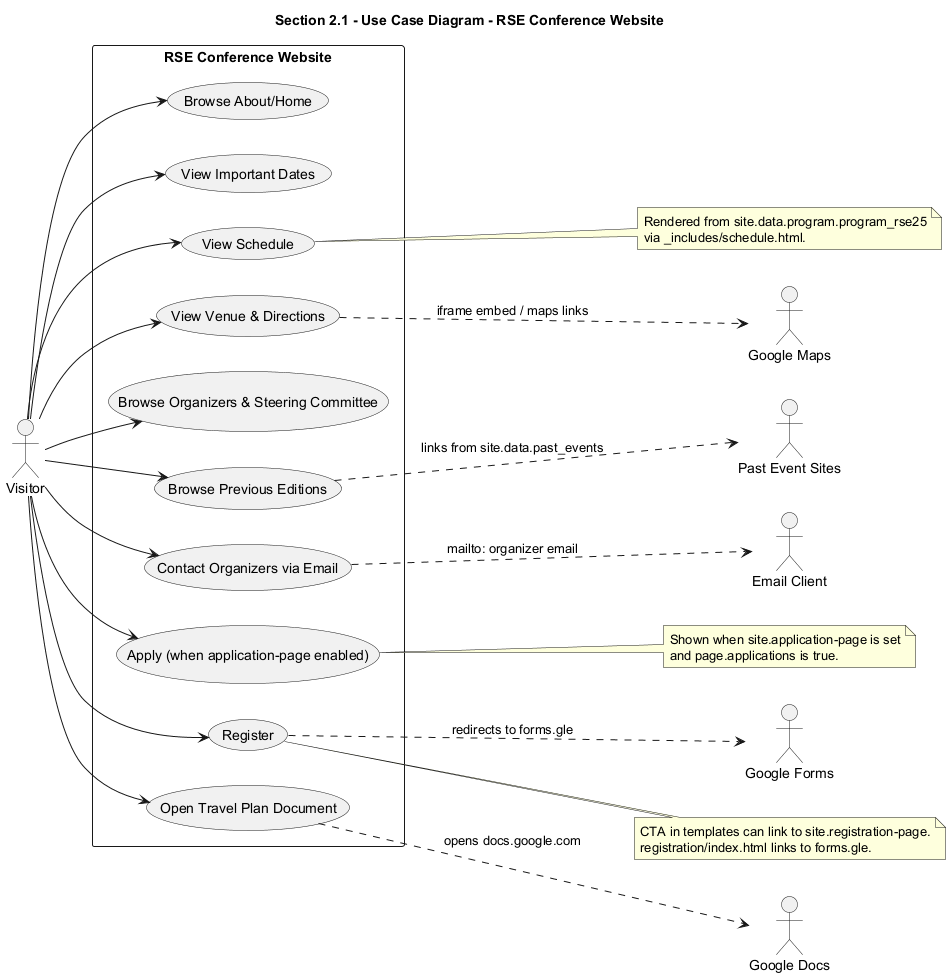
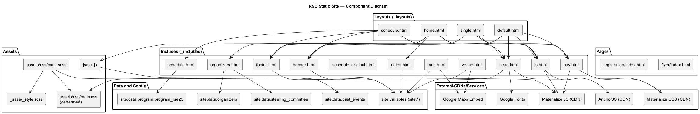
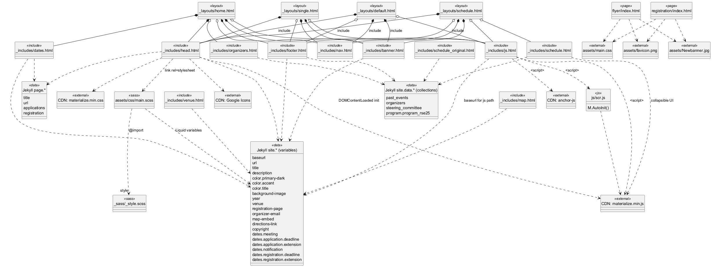
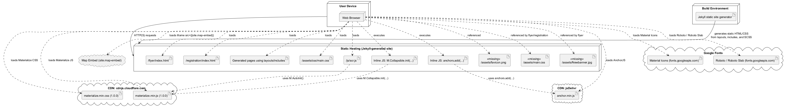

 

% 1 — System Overview
# SECTION 1 — System Overview

This section introduces the system’s purpose, scope, and visible capabilities as implemented in the repository. It summarizes what the software does, who it serves, and how its main features are realized by the code so that stakeholders can validate intent against implementation.

## Purpose and Context

The repository implements a static website for the Robotics Software Engineering event (RSE). It is built with Jekyll and Liquid templating, styled with SCSS compiled by Jekyll’s Sass pipeline, and enhanced with client-side behaviors from Materialize CSS/JS and AnchorJS. The site presents event information including dates, registration, schedule, venue, organizers, and previous editions. Content and theming are driven by site configuration values and data files (for example, organizers, steering committee, past events, and the program for RSE ‘25).

## System Scope

This repository contains the full front-end (presentation layer) of the event website. It is a static site with no server-side application logic beyond Jekyll’s build-time rendering. The scope includes:

- Page templates and partials in Jekyll’s _layouts and _includes.
- Stylesheets written in SCSS under _sass and assets/css, compiled to main.css.
- Client-side JavaScript initialization using Materialize (for UI components) and AnchorJS (for header anchors).
- Static, standalone HTML pages for registration and flyer.
- References to data collections (site.data.*) and site-level configuration variables (site.*, page.*) required to render event-specific content.

The scope does not include any backend services, databases, APIs, or automated deployment scripts. Several data files and assets referenced by templates are expected to exist outside this code listing (for example, _data files and certain images).

## Key Features Observable in the Codebase

The website’s main capabilities derive directly from templates and includes:

- Theming and branding driven by site configuration variables. Colors, banner text, and background imagery are injected via Liquid variables (for example, site.color.*, site.background-image, site.year, site.title).
- Responsive navigation. A fixed top navigation bar with section anchors and a mobile sidenav are provided; both are rendered by _includes/nav.html and styled by Materialize.
- Prominent event banner. A hero banner displays the event title, venue, meeting dates, and a Register Now button using values from site.*, rendered by _includes/banner.html.
- Important dates and calls to action. _includes/dates.html renders meeting, application, notification, and registration milestones with conditional handling for extensions and application/registration link enablement.
- Dynamic organizers and steering committee. _includes/organizers.html enumerates organizers and steering committee members from site.data collections, producing Materialize cards with portrait images and affiliations.
- Schedule overview and details. _includes/schedule.html renders a two-level schedule from site.data.program.program_rse25. It groups entries by day and session, shows an overview table, and provides collapsible session details with times, speakers, titles, and abstracts where present.
- Venue and map embed. _includes/venue.html provides venue information and embeds a map via site.map-embed and a directions link via site.directions-link.
- Previous editions listing. _layouts/home.html and _includes/footer.html render past events from site.data.past_events.
- Anchor links for headings. _includes/js.html loads AnchorJS to add anchors to h1–h4 elements within post-content.
- Materialize component initialization. js/scr.js calls M.AutoInit(), and head.html preps Collapsible initialization on DOMContentLoaded.

## External Dependencies

The implementation uses the following external resources at runtime:

- Materialize CSS and JS via CDN for responsive layout, components, and styles.
- Google Fonts (Roboto, Roboto Slab) and Google Material Icons via CDN.
- AnchorJS for automatic anchor links on headings.
- An embeddable map URL supplied through site.map-embed.

At build time, Jekyll and its Sass pipeline are required to process Liquid templates and SCSS into the final static site.

## Build and Runtime Characteristics

The site is assembled at build time by Jekyll:

- Layouts in _layouts wrap page content and include shared partials (banner, nav, footer, scripts).
- Includes in _includes encapsulate reusable fragments (dates, schedule, organizers, venue, etc.).
- SCSS in _sass/_style.scss and assets/css/main.scss compiles to /assets/css/main.css with Liquid-driven theming via site.color.*.
- Data is injected from site configuration (for example, _config.yml) and collections (for example, _data/*.yml), which are referenced but not included in this code listing.

At runtime, the site is static; all interactivity is client-side via Materialize and AnchorJS. There is no server-side session or API. Two pages (registration/index.html and flyer/index.html) are standalone static HTML documents not using Jekyll layouts; they reference assets under assets/ that must exist at deploy time.

## Repository Inventory and Purpose

The following table lists all top-level files and templates and their responsibilities as implemented.

| Path | Role in the System |
|---|---|
| _includes/banner.html | Renders the hero banner with title (Robotics Software Engineering {{site.year}}), venue, meeting dates, register button (site.registration-page), and image copyright caption (site.copyright-image). |
| _includes/dates.html | Renders the Important Dates table. Uses site.dates.* for meeting, application, notification, and registration; handles extensions and disabled buttons based on page flags and site links. |
| _includes/footer.html | Site footer with About link to site.url, and a Previous editions list bound to site.data.past_events, and copyright from site.copyright. |
| _includes/head.html | HTML head content: meta, title, canonical, links to compiled main.css, Google Fonts, Materialize CSS, favicon, and an inline DOMContentLoaded listener that initializes Materialize Collapsible instances. |
| _includes/js.html | Loads AnchorJS, applies anchors to headings, loads Materialize JS from CDN, and the site script js/scr.js. |
| _includes/map.html | Iframe wrapper that embeds the map from site.map-embed. |
| _includes/nav.html | Navigation bar and mobile sidenav with anchors to About, Application, Schedule, Venue, Travel Information, Privacy Policy, and Contact. |
| _includes/organizers.html | Lists organizers and steering committee using site.data.organizers and site.data.steering_committee, rendering cards with image, name, and affiliation. |
| _includes/schedule_original.html | An earlier version of the schedule rendering template for program_rse25; similar structure to schedule.html. Not included by any layout by default. |
| _includes/schedule.html | The active schedule include for program_rse25: generates overview and detailed, collapsible sessions grouped by day and session, with times, speakers, titles, abstracts, and special handling for breaks and keynotes. |
| _includes/venue.html | Venue section with a responsive Google Maps iframe (site.map-embed), venue information text, directions link (site.directions-link), nearest station, and a campus map link. |
| _layouts/default.html | Base layout used by pages that want a banner and a containerized content area. Includes nav, banner, footer, and js includes. |
| _layouts/home.html | Home page layout: includes nav, banner, about content slot, dates include, organizers, and previous editions table, plus footer and scripts. |
| _layouts/schedule.html | Schedule page layout: includes nav, banner, content slot, and the schedule include to render the full program, plus footer and scripts. |
| _layouts/single.html | Generic single-page layout with nav, banner, a containerized content slot, footer, and scripts. |
| _sass/_style.scss | Core SCSS with typography, layout, banner, cards, schedule, session, and table styles; responsive map iframe helpers; section theming; and Materialize overrides. |
| assets/css/main.scss | SCSS entrypoint compiled by Jekyll. Imports _style.scss and applies theme variables from site.color.*, sets banner background image from site.background-image, and styling for buttons, nav, and footer. |
| flyer/index.html | Standalone static flyer page with a banner image and links to example flyer PDFs/images. Not using Jekyll layouts; references assets/main.css and assets/Newbanner.jpg. |
| js/scr.js | Initializes Materialize components via M.AutoInit(). |
| registration/index.html | Standalone static registration page with event banner text and links to Google Form and travel coordination document. Not using Jekyll layouts; references assets/main.css and assets/Newbanner.jpg. |

## Notable Data and Configuration Inputs

Several Liquid variables and data sources are required for correct rendering:

- site-level variables: site.title, site.description, site.url, site.baseurl, site.year, site.venue, site.color.primary-dark, site.color.accent, site.color.title, site.background-image, site.registration-page, site.application-page, site.organizer-email, site.copyright, site.copyright-image, site.map-embed, site.directions-link.
- site.dates.* structure: site.dates.meeting, site.dates.application.deadline, site.dates.application.extension, site.dates.notification, site.dates.registration.deadline, site.dates.registration.extension.
- site.data collections: site.data.past_events, site.data.organizers, site.data.steering_committee, site.data.program.program_rse25.

These inputs are referenced in templates and must be supplied (for example, via _config.yml and files in _data/) for a successful build and accurate content.

## Observed Implementation Constraints

The overview reveals a few constraints stemming from the current implementation:

- The schedule templates contain Liquid conditionals using an invalid syntax pattern with double curly braces inside if statements (for example, ); this will cause Jekyll/Liquid parsing errors unless corrected to . Similar patterns appear for position, affiliation, abstract, and bio.
- The schedule uses session.items[-1].end_time to obtain the last item’s end_time. Standard Jekyll Liquid does not support negative indexes; an alternative (for example, last filter or forloop.last) may be required.
- head.html initializes Materialize Collapsible components on DOMContentLoaded, but Materialize JS is loaded later at the end of the body (in _includes/js.html). Depending on load timing, the M symbol may be undefined when the listener runs. The scr.js also calls M.AutoInit(), which similarly requires M to be available.
- The standalone pages reference assets/main.css and assets/Newbanner.jpg, which are not present in this listing. The main Jekyll CSS builds to assets/css/main.css; deployment should reconcile these paths or provide the missing files.

These constraints do not change the system’s scope but are relevant for validating the build and runtime behavior against expectations.

% 2 — Architectural Context
## 2. Architectural Context

This section describes the external systems, APIs/interfaces, and data sources that the website depends on, together with the users/actors explicitly surfaced by the codebase. All items below are derived from the provided source files and can be validated by inspecting the referenced files and Liquid templates.

### External Systems

- Jekyll static site generator and Liquid templating engine (implied by Liquid tags/filters throughout includes and layouts; for example: _includes/*.html, _layouts/*.html, assets/css/main.scss).
- Google Material Icons served via Google Fonts CDN (https://fonts.googleapis.com/icon?family=Material+Icons) used in _includes/head.html.
- Materialize CSS and JavaScript served via Cloudflare CDN (https://cdnjs.cloudflare.com/ajax/libs/materialize/1.0.0/css/materialize.min.css and https://cdnjs.cloudflare.com/ajax/libs/materialize/1.0.0/js/materialize.min.js) used in _includes/head.html and _includes/js.html.
- AnchorJS served via jsDelivr CDN (https://cdn.jsdelivr.net/npm/anchor-js/anchor.min.js) used in _includes/js.html.
- Google Maps Embed via site.map-embed in iframes (_includes/map.html and _includes/venue.html).
- Google Maps deep link (https://maps.app.goo.gl/...) referenced in _includes/venue.html.
- MapsIndoors client map link (https://clients.mapsindoors.com/...) referenced in _includes/venue.html.
- Google Forms (https://forms.gle/...) referenced in registration/index.html for registration.
- Google Docs (https://docs.google.com/document/...) referenced in registration/index.html for travel coordination.
- Mailto email integration for organizer contact (mailto:{{site.organizer-email}}) referenced in multiple includes (e.g., _includes/organizers.html and _includes/dates.html).
- External informational links on the flyer page (e.g., https://math.jonathanalcaraz.com/, http://math.ucr.edu/~mathconn/) referenced in flyer/index.html.

### APIs / Interfaces

- Liquid templating API: variables, tags, and filters used across templates and includes, including:
  - Variables: site.* (e.g., site.title, site.url, site.baseurl, site.color.*, site.year, site.venue, site.dates.*, site.registration-page, site.application-page, site.map-embed, site.directions-link, site.organizer-email, site.background-image, site.description, site.copyright, site.copyright-image) and page.* (e.g., page.title, page.url, page.applications, page.registration).
  - Tags/filters: assign, for, if/unless, case/when, group_by, sort, markdownify, prepend, replace, capture of arrays via indexing (e.g., session.items[0], session.items[-1]).
- Materialize JavaScript API used via the global M object:
  - M.AutoInit() invoked in js/scr.js.
  - M.Collapsible.init(...) invoked inline in _includes/head.html for collapsible components.
- AnchorJS API: anchors.add(...) invoked in _includes/js.html to add anchor links to headings.
- Iframe integration for maps via src set to site.map-embed in _includes/map.html and _includes/venue.html.
- Standard web navigation and UI interactions using Materialize components and classes (e.g., sidenav, collapsible, cards, grid system) across _includes/*.html and _layouts/*.html.

### Data Sources

- Jekyll data files referenced via site.data.*:
  - site.data.past_events used in _includes/footer.html and _layouts/home.html.
  - site.data.organizers used in _includes/organizers.html.
  - site.data.steering_committee used in _includes/organizers.html.
  - site.data.program.program_rse25 used in _includes/schedule.html and _includes/schedule_original.html.
- Jekyll site configuration variables (from the site configuration, referenced but not included in the repo snapshot):
  - Branding and metadata: site.title, site.description, site.url, site.baseurl.
  - Theming: site.color.primary-dark, site.color.accent, site.color.title (used in assets/css/main.scss).
  - Content and event info: site.year, site.venue, site.dates.meeting, site.dates.application.deadline, site.dates.application.extension, site.dates.notification, site.dates.registration.deadline, site.dates.registration.extension.
  - Links: site.registration-page, site.application-page, site.map-embed, site.directions-link.
  - Media and copyright: site.background-image, site.copyright, site.copyright-image.
  - Contacts: site.organizer-email.
- Page-level front matter flags and variables:
  - page.title and page.url used in _includes/head.html (title and canonical).
  - page.applications and page.registration used in _includes/dates.html to enable/disable buttons and notices.
- Local static assets produced and consumed by the site:
  - assets/css/main.css generated from assets/css/main.scss and _sass/_style.scss via Jekyll’s SASS pipeline.
  - js/scr.js included via _includes/js.html.

### Users / Actors

- Public site visitors accessing the responsive navigation and content sections (e.g., About, Schedule, Venue) as implemented in _includes/nav.html and the various layouts.
- Applicants and participants interacting with application and registration calls-to-action:
  - Apply Now and Registration buttons driven by site.application-page and site.registration-page in _includes/dates.html and _includes/banner.html; registration/index.html directs users to a Google Form and a Google Doc for coordination.
- Organizers and steering committee members represented as content entities via site.data.organizers and site.data.steering_committee and reachable via mailto:{{site.organizer-email}}.
- Site content editors/maintainers who populate site.data.* collections and site.* configuration to drive rendering, implied by extensive use of Liquid and data-driven includes.

% 2.1 — Architectural Context – Use Case Diagram
# Section 2.1 — Architectural Context – Use Case Diagram

This section presents the externally visible interactions of the static Jekyll-based RSE conference website as implemented in the provided codebase. The diagram captures the primary actor (a site visitor), the available use cases rendered by the Liquid templates and includes, and the concrete external services the site links to or embeds. All elements are derived directly from the repository’s HTML/Liquid, SCSS, and JavaScript files.

Figure filename: section-2-1-use-case.puml  
Figure caption: Use Case Diagram — RSE Conference Website Visitor Interactions and External Services

Figure 2.1 — Use Case Diagram: RSE Conference Website visitor interactions and external services.

% 3 — Containers
## 3. Containers

This section identifies the runtime containers that deliver the Jekyll-generated static website and the external services it consumes in the browser. The system is a client-rendered static site that relies on third-party CDNs and embeds for styling, JavaScript behavior, fonts, and maps. There are no server-side application or database containers; all dynamic content is resolved at build time by Jekyll/Liquid and delivered as static assets to browsers.

| Container | Responsibility | Technology | Communication |
|---|---|---|---|
| Client-side Web Application (Jekyll-generated site) | Presents the conference website (home, schedule, venue, flyer, registration pages), renders prebuilt schedule/organizer content, initializes UI components, and anchors headings. | Jekyll + Liquid templates and includes (`_layouts/*.html`, `_includes/*.html`), HTML5, SCSS compiled to CSS (`assets/css/main.scss`, `_sass/_style.scss`), Materialize CSS/JS components, AnchorJS, minimal custom JS (`js/scr.js` with `M.AutoInit()`). | HTTPS from browser to Static Asset Host to fetch HTML/CSS/JS; browser performs additional HTTPS requests to external CDNs (Materialize, AnchorJS, Google Fonts) and embeds Google Maps via iframe. |
| Static Asset Host | Serves the compiled static site (HTML, CSS, JS, images) to browsers. | Static HTTP server compatible with Jekyll outputs (e.g., serves compiled `_site`); no server-side code in this repository. | HTTP/HTTPS to web browsers. |
| Materialize CDN (cdnjs.cloudflare.com) | Delivers Materialize CSS and JS used for layout, components, and UI behavior. | Materialize v1.0.0 via CDN: `https://cdnjs.cloudflare.com/ajax/libs/materialize/1.0.0/css/materialize.min.css` and `https://cdnjs.cloudflare.com/ajax/libs/materialize/1.0.0/js/materialize.min.js`. | HTTPS requests from the browser. |
| AnchorJS CDN (jsDelivr) | Provides AnchorJS to add anchor links to headings. | AnchorJS via CDN: `https://cdn.jsdelivr.net/npm/anchor-js/anchor.min.js`. | HTTPS requests from the browser. |
| Google Fonts | Supplies web fonts (Roboto, Roboto Slab) and Material Icons used by the site. | Google Fonts CSS and font assets: `https://fonts.googleapis.com/css?family=Roboto%7CRoboto+Slab`, `https://fonts.googleapis.com/icon?family=Material+Icons`. | HTTPS requests from the browser. |
| Google Maps Embed | Renders an interactive map on venue pages via an iframe. | Google Maps Embed (iframe) sourced from `site.map-embed` in `_includes/map.html` and `_includes/venue.html`. | HTTPS iframe load from the browser. |
| Google Forms (Registration) | Collects participant registrations via an external form linked from the site. | Google Forms hyperlink: `https://forms.gle/qjfDbdCytcpyADjg8` referenced in `registration/index.html`. | User-initiated HTTPS navigation from the browser. |
| Google Docs (Travel Coordination) | Hosts the shared travel-planning document linked from the registration page. | Google Docs hyperlink: `https://docs.google.com/document/d/1QGc5myZ-1zNHec4lOmMg-bioGIjtmYQ08e3FDpknfUU/edit` referenced in `registration/index.html`. | User-initiated HTTPS navigation from the browser. |

% 3.1 — Architecture Overview – Component Diagram
# Section 3.1 — Architecture Overview – Component Diagram

This section provides a concise component-level view of the static site implementation present in the repository. It captures the actual Liquid layouts and includes, the styling and script assets, the runtime dependencies on third-party CDNs, and the data/configuration contracts the templates expect at build and render time. The diagram and inventory are derived strictly from the codebase to support validation by the development team.

Figure 3-1 — Component Diagram

Component inventory and responsibilities

The implementation is a static site composed of Jekyll Liquid layouts and includes, a Sass-based stylesheet, and a small JavaScript initializer. Runtime styling and UI behavior rely on Materialize (CSS/JS), AnchorJS, Google Fonts, and an embedded Google Maps iframe. The following table enumerates every component observed in the repository, its role, and its key dependencies.

| Component | Type | Responsibility | Key dependencies (from code) |
|---|---|---|---|
| _layouts/default.html | Layout | Base layout rendering head, navigation, banner, content slot, footer, and JS includes. | _includes/head.html, _includes/nav.html, _includes/banner.html, _includes/footer.html, _includes/js.html |
| _layouts/home.html | Layout | Home page layout; renders banner, About content with Important Dates, organizers, previous editions, footer, and JS. | _includes/head.html, _includes/nav.html, _includes/banner.html, _includes/dates.html, _includes/organizers.html, _includes/footer.html, _includes/js.html; site.data.past_events (inline in layout) |
| _layouts/schedule.html | Layout | Schedule page layout; renders banner, page content, and the schedule include. | _includes/head.html, _includes/nav.html, _includes/banner.html, _includes/schedule.html, _includes/footer.html, _includes/js.html |
| _layouts/single.html | Layout | Generic single-page layout; renders banner, page content, footer, and JS. | _includes/head.html, _includes/nav.html, _includes/banner.html, _includes/footer.html, _includes/js.html |
| _includes/head.html | Include | HTML head: meta, title, canonical, CSS links, fonts, favicon, and inline script initializing Materialize collapsibles. | assets/css/main.css (generated from assets/css/main.scss), Google Fonts, Materialize CSS (CDN), site.baseurl, site.url; uses Materialize JS API in a DOMContentLoaded handler (provided later by _includes/js.html) |
| _includes/nav.html | Include | Top navigation and mobile sidenav markup. | Materialize CSS/JS classes/behavior |
| _includes/banner.html | Include | Hero banner with event title, venue, dates, and call-to-action. | site.year, site.venue, site.dates.meeting, site.registration-page, site.copyright-image |
| _includes/dates.html | Include | Important Dates table with conditional rendering for application/registration deadlines and links. | site.dates.*, site.application-page, page.applications, site.organizer-email, site.color.primary-dark, site.registration-page, page.registration |
| _includes/organizers.html | Include | Organizers and Steering Committee cards, and contact email. | site.organizer-email, site.data.organizers, site.data.steering_committee |
| _includes/schedule.html | Include | Full schedule rendering: overview and detailed sessions, talks, and abstracts. | site.data.program.program_rse25; Materialize collapsible classes |
| _includes/schedule_original.html | Include | Alternative schedule rendering (not referenced by layouts). | site.data.program.program_rse25 |
| _includes/footer.html | Include | Footer with About link and Previous editions list. | site.url, site.data.past_events, site.copyright |
| _includes/js.html | Include | JS includes at end of body. | AnchorJS (CDN), Materialize JS (CDN), js/scr.js |
| _includes/map.html | Include | Embedded Google Map iframe. | site.map-embed |
| _includes/venue.html | Include | Venue section with map iframe and useful links. | site.map-embed, site.directions-link |
| assets/css/main.scss | Asset (Sass) | Entry-point stylesheet compiled by Jekyll; imports _sass/_style.scss and binds site colors and banner image via Liquid variables. | _sass/_style.scss, site.color.*, site.background-image; generates assets/css/main.css |
| _sass/_style.scss | Asset (Sass partial) | Base style definitions: typography, layout, schedule styling, cards, sections, and utilities. | None |
| assets/css/main.css (generated) | Asset (CSS, generated) | Output CSS produced by Jekyll from assets/css/main.scss. | Generated at build; linked in _includes/head.html |
| js/scr.js | Asset (JS) | Initializes Materialize components across the page. | Materialize JS (global M), loaded via _includes/js.html |
| flyer/index.html | Page (standalone) | Static flyer page with banner and links to external assets. Not integrated with Jekyll layouts/includes. | References assets/main.css, assets/Newbanner.jpg, assets/MathConnections-Flyer*.pdf/png (not present in repo) |
| registration/index.html | Page (standalone) | Static registration info page with dates and links. Not integrated with Jekyll layouts/includes. | References assets/main.css, assets/Newbanner.jpg (not present in repo) |
| site variables (site.*) | Data/config (external to repo) | Liquid variables used across templates and SCSS (colors, title, URLs, year, dates, map embed, etc.). | Required for correct rendering (e.g., site.color.*, site.dates.*, site.url, site.baseurl) |
| site.data.past_events | Data (external to repo) | Collection used in footer and home to list previous editions. | YAML/JSON expected under _data |
| site.data.organizers | Data (external to repo) | Collection rendered in Organizers section. | YAML/JSON expected under _data |
| site.data.steering_committee | Data (external to repo) | Collection rendered in Steering Committee section. | YAML/JSON expected under _data |
| site.data.program.program_rse25 | Data (external to repo) | Program dataset rendered by schedule includes. | YAML/JSON expected under _data |
| Materialize CSS (CDN) | External | CSS framework for layout and components. | Referenced from CDN in _includes/head.html |
| Materialize JS (CDN) | External | JS for interactive components (collapsible, sidenav, etc.). | Referenced from CDN in _includes/js.html |
| AnchorJS (CDN) | External | Adds anchor links to headings in content. | Referenced from CDN in _includes/js.html |
| Google Fonts | External | Provides Material Icons font. | Referenced in _includes/head.html |
| Google Maps Embed | External | Renders map iframe in map/venue includes. | Used in _includes/map.html and _includes/venue.html |

Notes for validation

The diagram reflects all files in the repository and their observed dependencies. The build expects a Jekyll environment that compiles assets/css/main.scss to assets/css/main.css and resolves Liquid variables and data collections. Two standalone pages under flyer/ and registration/ are not wired into the Jekyll layouts and reference assets (e.g., assets/main.css, assets/Newbanner.jpg, several flyers) that are not present in this repository; they will not render as intended unless those files are added or their paths adjusted. The schedule includes contain Liquid conditionals with nested output tags (e.g., ), which is invalid Liquid syntax and should be corrected to standard forms (e.g., ) for proper rendering.

% 4 — Components
## 4. Components

This section identifies all implementation-level components present in the repository and describes their responsibilities and collaborations. Components include Liquid includes and layouts (Jekyll templates), SASS/CSS stylesheets, JavaScript modules, and standalone HTML pages. Interactions summarize template inclusion relationships, data dependencies on site/page variables and data files, external libraries, and runtime effects in the browser. This inventory reflects the actual code and enables validation by anyone familiar with the codebase.

| Component | Responsibility | Interactions |
|---|---|---|
| _includes/banner.html | Renders the hero banner with conference title, venue, dates, a “Register Now” call-to-action, and image copyright caption. | ["_layouts/default.html", "_layouts/home.html", "_layouts/schedule.html", "_layouts/single.html", "site.year", "site.venue", "site.dates.meeting", "site.registration-page", "site.copyright-image", "Materialize CSS classes"] |
| _includes/dates.html | Displays Important Dates table with conditional logic for application/registration deadlines, extensions, and links; shows status messages and action buttons. | ["_layouts/home.html", "site.dates.meeting", "site.dates.application.deadline", "site.dates.application.extension", "site.dates.notification", "site.dates.registration.deadline", "site.dates.registration.extension", "site.application-page", "site.registration-page", "site.organizer-email", "page.applications", "page.registration", "site.color.primary-dark", "Material Icons"] |
| _includes/footer.html | Global footer with “About RSE”, list of previous editions from data, and copyright. | ["_layouts/default.html", "_layouts/home.html", "_layouts/schedule.html", "_layouts/single.html", "site.data.past_events", "site.url", "site.copyright"] |
| _includes/head.html | Head metadata (charset, viewport, description), canonical URL, favicon, CSS links (compiled main.css, Materialize CSS, Google Icons), and a DOMContentLoaded handler that initializes Materialize collapsibles. | ["_layouts/default.html", "_layouts/home.html", "_layouts/schedule.html", "_layouts/single.html", "assets/css/main.css", "site.baseurl", "site.url", "Google Fonts", "Material Icons", "Materialize CSS CDN", "Materialize JS global M (assumed available at runtime)"] |
| _includes/js.html | Loads client-side JS dependencies and initializes anchors on headings: anchor-js (CDN), Materialize JS (CDN), and local scr.js. | ["_layouts/default.html", "_layouts/home.html", "_layouts/schedule.html", "_layouts/single.html", "anchor-js CDN", "Materialize JS CDN", "js/scr.js", "anchors.add('.post-content > h1, h2, h3, h4')"] |
| _includes/map.html | Embeds a general-purpose map iframe for directions using a configurable map-embed URL. | ["Pages that include it (none in provided layouts)", "site.map-embed"] |
| _includes/nav.html | Top navigation bar and mobile side navigation with anchor links to sections; depends on Materialize for sidenav behavior. | ["_layouts/default.html", "_layouts/home.html", "_layouts/schedule.html", "_layouts/single.html", "Materialize Sidenav via M.AutoInit"] |
| _includes/organizers.html | Organizer and Steering Committee sections: renders contact email and card grids sourced from data files, preserving display order. | ["_layouts/home.html", "site.organizer-email", "site.data.organizers", "site.data.steering_committee", "Materialize card components"] |
| _includes/schedule_original.html | Alternative schedule rendering component with “Overview” and detailed session tables, using collapsible panels and talk metadata. | ["Not referenced by current layouts", "site.data.program.program_rse25", "Materialize Collapsible", "Liquid fields: day, session, start_time, end_time, topic, speaker, position, affiliation, title, abstract, bio"] |
| _includes/schedule.html | Primary schedule rendering component used by the schedule layout, with overview and detailed collapsible sessions. | ["_layouts/schedule.html", "site.data.program.program_rse25", "Materialize Collapsible", "Liquid fields: day, session, start_time, end_time, topic, speaker, position, affiliation, title, abstract, bio", "Styles from _sass/_style.scss"] |
| _includes/venue.html | Venue section with an embedded campus map and contextual travel/links. | ["Pages that include it (none in provided layouts)", "site.map-embed", "site.directions-link"] |
| _layouts/default.html | Base layout for generic pages: assembles head, nav, banner, a container for page content, footer, and JS includes. | ["_includes/head.html", "_includes/nav.html", "_includes/banner.html", "{{content}}", "_includes/footer.html", "_includes/js.html"] |
| _layouts/home.html | Home page layout: combines banner, About content, Important Dates (include), organizers section, and previous editions table. | ["_includes/head.html", "_includes/nav.html", "_includes/banner.html", "{{content}}", "_includes/dates.html", "_includes/organizers.html", "_includes/footer.html", "_includes/js.html", "site.title", "site.data.past_events"] |
| _layouts/schedule.html | Schedule page layout: renders content and appends the schedule component. | ["_includes/head.html", "_includes/nav.html", "_includes/banner.html", "{{content}}", "_includes/schedule.html", "_includes/footer.html", "_includes/js.html"] |
| _layouts/single.html | Single-content layout: banner + containerized content with footer and JS. | ["_includes/head.html", "_includes/nav.html", "_includes/banner.html", "{{content}}", "_includes/footer.html", "_includes/js.html"] |
| _sass/_style.scss | Core style definitions: typography, banners, sections, cards, schedule and session visuals, responsive map embedding, and utility styles. | ["assets/css/main.scss @import", "Google Fonts (Roboto, Roboto Slab)", "Materialize class names (visual alignment)"] |
| assets/css/main.scss | Jekyll SASS entrypoint compiled to assets/css/main.css; imports core styles and applies theme variables from site config (colors, background image). | ["Jekyll SASS pipeline", "_sass/_style.scss", "site.color.primary-dark", "site.color.accent", "site.color.title", "site.background-image", "site.baseurl", "Consumed by _includes/head.html"] |
| js/scr.js | Initializes Materialize components automatically on page load. | ["_includes/js.html", "Materialize JS (M.AutoInit)"] |
| flyer/index.html | Standalone flyer page with banner image, simple navigation, and links to external flyer assets (PNG/PDF). Independent of Jekyll layouts/includes. | ["assets/favicon.png", "assets/main.css (expected externally)", "assets/Newbanner.jpg (expected externally)", "assets/MathConnections-Flyer.pdf (external)", "assets/MathConnections-FlyerBW.pdf (external)"] |
| registration/index.html | Standalone registration page linking to a Google Form and a shared travel-plan document. Independent of Jekyll layouts/includes. | ["assets/favicon.png", "assets/main.css (expected externally)", "Google Forms URL", "Google Docs URL"] |

% 5 — Code-Level View
# Section 5 — Code-Level View

This section describes how the source code implements the architectural elements at code level. It maps templates, includes, styles, and scripts to their responsibilities and dependencies, identifies the runtime entry points and initializers, and highlights the recognizable patterns used by the implementation. The intent is to enable developers and integrators to validate that the codebase behavior and composition align with the intended site structure and data-driven rendering.

## Main Entry Points and Runtime Initialization

The build-time and run-time entry points are clearly split due to the use of Jekyll and Liquid templates.

At build time, Jekyll detects SCSS compilation via Front Matter and renders pages through the selected layouts. The single build pipeline entry point for styles is assets/css/main.scss, which imports the partial _sass/_style.scss and interpolates Liquid variables from site configuration (for example, site.color and site.background-image).

At run time in the browser, pages composed from layouts load HTML, CSS, and JavaScript in a specific order. All Jekyll-composed layouts include _includes/head.html inside the <head> to load meta tags, Materialize CSS, and a DOMContentLoaded handler that prepares collapsibles. Scripts included at the end of <body> via _includes/js.html load AnchorJS, apply anchors to headings, load Materialize JavaScript from CDN, and then execute the local initializer js/scr.js which calls M.AutoInit(). The combination of the DOMContentLoaded callback in _includes/head.html and the automatic component initialization in js/scr.js ensures Materialize components, including collapsibles rendered by _includes/schedule.html, are initialized once the DOM and scripts are loaded. Two standalone, non-Jekyll pages (flyer/index.html and registration/index.html) act as additional runtime entry points but are not integrated with the Jekyll include/layout stack.

The primary HTML composition entry points are the layout files under _layouts, which include common head, navigation, banners, footers, and optional content sections such as the schedule or dates. The resulting pages depend on data files referenced via site.data.* and on configuration keys from _config.yml (not part of the provided code) for colors, text, and links.

## Modules, Directories, and Responsibilities

The repository is organized around Jekyll conventions with clear separation between layouts, includes, styles, assets, scripts, and two standalone static pages. The table below maps every source file to its role, how it is referenced, and any external or configuration dependencies it assumes. This mapping reflects actual inclusions and the flow defined in the layouts.

| Source path | Kind | Role / responsibility | Referenced by / includes | External and configuration dependencies |
|---|---|---|---|---|
| _includes/banner.html | Include | Renders the hero banner title, venue/dates, and a call-to-action button; prints an image copyright caption. | Included by all layouts: _layouts/default.html, _layouts/home.html, _layouts/schedule.html, _layouts/single.html. | Liquid config: site.year, site.venue, site.dates.meeting, site.registration-page, site.copyright-image. |
| _includes/dates.html | Include | Renders “Important Dates” table with meeting, application, notification, and registration sections. Controls button enabled/disabled state based on page flags. | Included by _layouts/home.html on the right column of the “About” section. | Liquid config: site.dates.meeting, site.dates.application.deadline, site.dates.application.extension, site.application-page, site.organizer-email, site.dates.notification, site.dates.registration.deadline, site.dates.registration.extension, site.registration-page, site.color.primary-dark; page flags: page.applications, page.registration. |
| _includes/footer.html | Include | Page footer with “About RSE” and “Previous editions” list. | Included by all layouts. | Liquid data and config: site.data.past_events (array with year, location, url), site.url, site.copyright. |
| _includes/head.html | Include | <head> metadata; canonical link; loads Materialize CSS and Google icons; links site CSS; contains a DOMContentLoaded script initializing Materialize collapsibles. | Included by all layouts. | Liquid config: page.title, site.title, site.description, page.url, site.baseurl, site.url; resources: Materialize CSS CDN, Google Icons; relies on Materialize JS to be available by DOMContentLoaded time (loaded via _includes/js.html at end of body). |
| _includes/js.html | Include | Loads AnchorJS and applies anchors to headings; loads Materialize JS; loads local script js/scr.js. | Included by all layouts, after footer. | External scripts: AnchorJS CDN, Materialize JS CDN; local script: js/scr.js; selector dependency: .post-content > h1, h2, h3, h4. |
| _includes/map.html | Include | Embeds a map iframe. | Not referenced by any provided layout. | Liquid config: site.map-embed. |
| _includes/nav.html | Include | Top navigation bar and responsive sidenav. | Included by all layouts. | No Liquid dependencies; links are in-page anchors. Note: one mobile link uses “#Privacy Policy” (with space and case) which does not match “#privacy-policy”. |
| _includes/organizers.html | Include | Renders organizers and steering committee as card grids; shows contact email. | Included by _layouts/home.html beneath the main content. | Liquid data and config: site.organizer-email; site.data.organizers and site.data.steering_committee, each with fields: name, link, image, affiliation, order_number. |
| _includes/schedule_original.html | Include | Earlier version of the schedule rendering with collapsibles and details/summary; contains Liquid syntax issues. | Not referenced by any provided layout. | Liquid data: site.data.program.program_rse25; expects fields: day, start_time, end_time, session, topic, speaker, position, affiliation, title, abstract, bio. Contains invalid Liquid conditions like . |
| _includes/schedule.html | Include | Current schedule rendering used by the schedule layout; builds overview and detailed session/talk lists using Materialize collapsibles. | Included by _layouts/schedule.html. | Liquid data: site.data.program.program_rse25; same expected fields as above; same Liquid condition issues present (, etc.). |
| _includes/venue.html | Include | Venue section with embedded map and useful links. | Not referenced by any provided layout. | Liquid config: site.map-embed, site.directions-link. |
| _layouts/default.html | Layout | Base page layout with common head, nav, banner, containerized content, footer, and scripts. | Selected by pages that use “layout: default” (no such pages are included in the provided code). | Includes: head.html, nav.html, banner.html, footer.html, js.html. |
| _layouts/home.html | Layout | Home page layout with “About” content, Important Dates sidebar, Organizers section, and “Previous Editions” table. | Intended as the front page template. | Includes: head.html, nav.html, banner.html, dates.html, organizers.html, footer.html, js.html; data: site.data.past_events. |
| _layouts/schedule.html | Layout | Schedule page layout; renders page content and appends the schedule include. | Intended for the program page. | Includes: head.html, nav.html, banner.html, schedule.html, footer.html, js.html. |
| _layouts/single.html | Layout | Simple content page layout. | Intended for single-topic content pages. | Includes: head.html, nav.html, banner.html, footer.html, js.html. |
| _sass/_style.scss | SCSS partial | Core style rules: typography, banners, sections, cards, schedule tables, collapsibles, layout helpers, and responsive map styles. | Imported by assets/css/main.scss. | No Liquid; relies on fonts from Google Fonts. |
| assets/css/main.scss | SCSS entry | Build-time SCSS entry with Front Matter; imports _sass/_style.scss and defines theme rules that interpolate site color variables and background image. | Linked by _includes/head.html as “/assets/css/main.css”. | Liquid config: site.color.primary-dark, site.color.accent, site.color.title, site.background-image, site.baseurl; generates assets/css/main.css at build time. |
| flyer/index.html | Standalone page | A static flyer page not using Jekyll layouts or includes; links to images and PDFs under assets/. | Not referenced by layouts; accessible directly as /flyer/. | References assets/main.css (does not exist in provided code), assets/Newbanner.jpg, assets/MathConnections-Flyer*.png and PDFs; potential broken links. |
| js/scr.js | Script | Local JavaScript initializer calling M.AutoInit() to auto-initialize Materialize components. | Loaded by _includes/js.html. | Depends on the global M object from Materialize JS CDN. |
| registration/index.html | Standalone page | A static registration page not using Jekyll layouts; provides Google Form and shared doc links. | Not referenced by layouts; accessible directly as /registration/. | References assets/main.css and assets/Newbanner.jpg (assets/main.css not present in provided code); potential broken links. |

This mapping shows that all active Jekyll-driven pages are composed from the layouts in _layouts, with _includes providing reusable partials. Three includes remain unused in the current layout set (map.html, venue.html, schedule_original.html). Two standalone HTML pages live outside the Jekyll rendering stack.

## Architectural and Design Patterns Recognizable from the Code

The code adopts a conventional Jekyll “Template View” pattern with layouts orchestrating page composition and partials (_includes) encapsulating reusable fragments. It further demonstrates a data-driven templating pattern through Liquid’s site.data access for program schedules, past events, and team listings. The style layer follows a partial-based SCSS organization, with a single SCSS entry file that interpolates site configuration variables for theme colors and the banner image, yielding a themable presentation layer without code changes. On the client side, progressive enhancement is applied via Materialize CSS/JS for UI components and AnchorJS to improve heading navigation.

## Notable Implementation Details and Validations

The schedule rendering depends on site.data.program.program_rse25 and uses grouping by day and session to derive both an overview and detailed content. However, the code contains invalid Liquid syntax within conditionals, such as , , , and . These should be corrected to , etc., otherwise Jekyll will fail to build or will not evaluate the expressions as intended. The same issue appears in both _includes/schedule.html and _includes/schedule_original.html.

The JavaScript initialization occurs in two places. The script block in _includes/head.html registers a DOMContentLoaded listener that initializes M.Collapsible and sets accordion: false on .collapsible.expandable. The local script js/scr.js calls M.AutoInit() after Materialize JS loads. Both work together at runtime; however, developers should be aware of potential duplicate initialization if the same components are auto-initialized and manually initialized. The observed configuration ensures collapsibles receive the “expandable” behavior even when AutoInit is used.

The SCSS entry file assets/css/main.scss has Jekyll Front Matter and is imported in _includes/head.html as “/assets/css/main.css”. This is the correct output path after compilation. By contrast, the two standalone pages reference assets/main.css and assets/Newbanner.jpg, neither of which are present in the codebase. Unless additional assets are added during deployment, these references are broken.

Several includes depend on configuration variables that are not part of the repository but are expected from _config.yml: site.color.primary-dark, site.color.accent, site.color.title, site.background-image, site.year, site.venue, site.dates.*, site.registration-page, site.application-page, site.organizer-email, site.map-embed, site.directions-link, site.copyright, site.url, and site.baseurl. The data-driven includes expect specific data files and structures under _data, notably site.data.past_events, site.data.organizers, site.data.steering_committee, and site.data.program.program_rse25. Providing these with the inferred schemas is necessary for a successful build and accurate rendering.

Finally, some minor HTML issues are visible directly in the code. In _includes/dates.html, a stray “# ” precedes a blockquote, producing a literal hash in the output. In _includes/nav.html, one mobile menu link uses an anchor “#Privacy Policy” that does not match the expected lowercase id “#privacy-policy”. In _includes/venue.html, the map iframe width is set to “00”, which is likely unintended and overridden by responsive CSS, but it should be corrected for clarity.

## Mapping of Components to Source Elements

The composition of the site can be validated against the following mapping from architectural elements to code:

| Component | Implementation | Notes on data/config |
|---|---|---|
| Page composition and theming | _layouts/*.html, _includes/*, assets/css/main.scss, _sass/_style.scss | Theming driven by site.color.* and site.background-image; all layouts include the same head, nav, banner, footer, and scripts for consistency. |
| Schedule rendering | _includes/schedule.html (active), _layouts/schedule.html | Requires site.data.program.program_rse25 with fields: day, start_time, end_time, session, topic, optional speaker, position, affiliation, title, abstract, bio. Contains Liquid conditional syntax errors that need correction. |
| Dates and registration CTA | _includes/dates.html, _layouts/home.html | Requires site.dates.* and site.registration-page/site.application-page; supports page.applications and page.registration flags to enable/disable buttons. |
| Organizers and committee | _includes/organizers.html, _layouts/home.html | Requires site.data.organizers and site.data.steering_committee with name, link, image, affiliation, order_number. |
| Navigation and responsive sidenav | _includes/nav.html | No data dependencies; one anchor mismatch in mobile menu. |
| Footer and previous editions | _includes/footer.html, _layouts/* | Requires site.data.past_events with year, location, url. |
| Client-side UI behavior | _includes/head.html (DOMContentLoaded init), _includes/js.html (anchors, Materialize, scr.js), js/scr.js | Depends on Materialize JS CDN for M; AnchorJS for anchors; initializes collapsibles with accordion: false and runs M.AutoInit(). |
| Standalone static pages | flyer/index.html, registration/index.html | Do not use Jekyll includes or styles; currently reference non-existent assets/main.css and assets/Newbanner.jpg within this repository. |

This code-level view reflects the actual repository content and structure. It can be directly validated by tracing includes from each layout, inspecting Liquid variable usage, and building the site with Jekyll using appropriate _config.yml and _data files to supply the required configuration and datasets.

% 5.1 — Class Diagram
# Section 5.1 — Class Diagram

This section presents the static structure of the website as implemented in the repository. Although the system is not object-oriented code, the diagram models Jekyll layouts, includes, pages, stylesheets, scripts, data contexts, and external libraries as classes, with their include and dependency relationships. This view enables developers and integrators to validate how templates compose pages, how assets are wired, and which site/page variables and data collections are consumed.

Figure: section-5-1-class-diagram.puml — Static structure and dependencies of layouts, includes, pages, assets, data, and external libraries

Validation notes. The four layouts include exactly the includes shown in the diagram, as can be verified in the corresponding files. The shared head include links styles and registers a Materialize Collapsible initializer; the shared js include loads AnchorJS, Materialize JS, and js/scr.js. The schedule include consumes site.data.program.program_rse25 and uses Materialize collapsibles. The home layout additionally embeds the dates include and the organizers include, and renders previous editions using site.data.past_events. The SCSS compilation path is assets/css/main.scss which imports _sass/_style.scss and interpolates Liquid variables from site.*. Two standalone pages (flyer and registration) do not use Jekyll layouts; they reference assets/main.css and assets/Newbanner.jpg directly, as depicted.

% 6 — Cross-Cutting Concerns
## 6. Cross-Cutting Concerns

This section identifies and explains cross-cutting concerns that span multiple parts of the site’s codebase. The analysis is based solely on the provided Jekyll templates, SCSS, and client-side JavaScript, and highlights security, configuration, error handling, testing, and monitoring aspects that affect the system end-to-end. Where a concern is not implemented, the absence is explicitly evidenced from the code.

| Concern | Evidence from code | Description |
|---|---|---|
| Authentication | Entire repository contains only static Jekyll templates and static HTML; no auth libraries, routes, or guards present. | The site is a static, publicly accessible web property. There is no authentication or session handling in templates or JavaScript. |
| Authorization | Same as above; no role checks or protected sections in Liquid/JS. | There is no authorization model. All content is public. |
| Secure transport and content security | _includes/head.html loads third-party resources via HTTPS (Google Fonts, Materialize CSS/JS, AnchorJS); no Content-Security-Policy meta/header or Subresource Integrity attributes; _includes/map.html sets referrerpolicy="no-referrer-when-downgrade". | External dependencies are fetched over HTTPS, but there is no CSP or SRI to mitigate script/style injection risks. The map embed sets a referrer policy; other embeds do not. |
| Privacy and PII handling | registration/index.html links to a Google Form for data collection; _includes/organizers.html and _includes/dates.html expose mailto: links; _includes/map.html and _includes/venue.html embed Google Maps. | Personal data collection and processing are delegated to third-party services (Google Forms/Docs/Maps). The site itself stores no user data. Embeds may introduce third-party tracking; only one map embed sets a referrer policy. |
| Configuration management (site-level) | Widespread use of Liquid site/page variables: _includes/banner.html uses {{ site.year }}, {{ site.venue }}, {{ site.dates.* }}; _includes/dates.html branches on {{ site.dates.* }}, {{ site.registration-page }}; assets/css/main.scss parametrizes colors and background with {{ site.color.* }}, {{ site.background-image }}; _includes/schedule.html consumes site.data.program.program_rse25; _includes/organizers.html consumes site.data.organizers and site.data.steering_committee; _layouts/* use {{ content }} and includes. | The site is data-driven and themeable via _config.yml and _data/*. Theming, schedule, and content are configured without code changes. This is the primary cross-cutting mechanism for content and branding control. |
| Feature toggles/content gating (template-level) | _includes/dates.html uses conditional rendering: ,  to disable buttons via class "disabled" and to display closure notices; similar for registration via . | Liquid conditionals gate UI elements globally without JS. This pattern is used to enable/disable calls to action across pages consistently. |
| Error handling and robustness in Liquid | _includes/dates.html defends against missing values using /; _includes/schedule.html and _includes/schedule_original.html contain incorrect Liquid in conditionals (e.g., "", "", "", "", "") which will not parse as valid Liquid. | Templates attempt to guard against absent data, but several invalid conditional expressions would cause build-time errors or unexpected output. These are cross-cutting risks for the schedule pages. |
| Client-side initialization and resilience | _includes/head.html registers a DOMContentLoaded listener to initialize M.Collapsible; _includes/js.html loads AnchorJS and Materialize JS in the footer; js/scr.js calls M.AutoInit(). | Initialization of Materialize components is centralized and automatic. There is no defensive coding (e.g., feature detection/try-catch); failures in third-party scripts could impact all pages that rely on Materialize components. |
| Logging (client-side) | No usages of console logging frameworks or custom logging; no log aggregation endpoints. | There is no logging strategy in the client. Failures would be observable only via browser dev tools. |
| Monitoring/Analytics | No analytics tags (e.g., GA/GTAG/Matomo), RUM, or performance beacons; no error reporting (e.g., Sentry). | There is no monitoring or telemetry in the site. Issues cannot be tracked centrally. |
| Testing | No tests in the repository (no unit, integration, visual regression, or link checking scripts). | There is no automated testing. Content and template regressions would be caught only by manual review/build failures. |
| Static asset pipeline | assets/css/main.scss contains Jekyll front matter (---) and imports _sass/_style.scss; SCSS variables interpolate Liquid site variables. | Jekyll’s built-in Sass pipeline produces a single CSS artifact with site-driven theming. This cross-cuts layout and styling across all pages. |
| Performance optimizations | _includes/map.html uses loading="lazy" on the iframe; assets/css/main.scss and _sass/_style.scss define responsive styles; third-party assets loaded via CDNs; minimal custom JS. | Limited but effective optimizations are present. One map embed (_includes/venue.html) omits lazy loading and uses width="00", which appears erroneous. |
| SEO and linkability | _includes/head.html sets canonical link and meta description; _includes/js.html uses AnchorJS to generate anchors for h1–h4 within .post-content. | Canonical URLs and descriptions are set globally. Heading anchors improve deep-linking, though the selector targets ".post-content" which is not present in the provided layouts. |
| Navigation consistency | _includes/nav.html defines desktop and mobile menus; mobile menu contains a malformed anchor "href=\"#Privacy Policy\"" with a space and mismatched case vs "privacy-policy" used elsewhere. | Navigation is responsive via Materialize. The malformed anchor is a cross-cutting navigation defect affecting mobile users. |
| Security headers (build-time) | No meta http-equiv CSP, no Expect-CT, no Referrer-Policy (except on one iframe), no Permissions-Policy; none set in templates. | Security headers are not configured at the template level. If served via a platform (e.g., GitHub Pages), headers would need to be configured there; otherwise, add meta or server config. |
| Dependency management (CDN usage) | _includes/head.html and _includes/js.html fetch Google Fonts, Materialize, and AnchorJS from public CDNs without version pinning with integrity hashes. | CDN reliance is global; lack of SRI and strict version pinning is a cross-cutting supply-chain risk. |
| Internationalization | Entire site content and labels are in English; no i18n frameworks or Liquid-based locale switching present. | The site is single-locale with no cross-cutting i18n strategy. |

% 7 — Quality Attributes and Rationale
## 7. Quality Attributes and Rationale

This section summarizes the quality attributes that are directly evidenced by the implementation. It explains how specific architectural and coding choices in the repository contribute to or detract from these qualities so that reviewers can validate the claims against the codebase.

| Quality Attribute | Evidence | Rationale |
|---|---|---|
| Maintainability (structural decomposition) | Use of Jekyll layouts and includes: _layouts/{default,home,schedule,single}.html; _includes/{head,nav,banner,dates,schedule,organizers,venue,footer,js}.html | Clear separation of page chrome, navigation, banner, content sections, and scripts reduces duplication and localizes change. Updating a shared element (for example, navigation) requires editing a single include. |
| Maintainability (styling) | SCSS partials and aggregation: _sass/_style.scss; assets/css/main.scss with front matter and @import "style" | Centralized styling with SCSS promotes reuse and consistent typography/layout. The Jekyll SCSS pipeline compiles to a single CSS file, simplifying distribution and updates. |
| Content maintainability (data-driven rendering) | Liquid over site.data: organizers and steering committee in _includes/organizers.html; past events in _includes/footer.html and _layouts/home.html; program via site.data.program.program_rse25 in _includes/schedule.html | Rendering content from data files allows adding or reordering items without touching templates, minimizing risk of logic regressions when content changes. |
| Theming and configurability | Template variables in styles and markup: assets/css/main.scss uses {{ site.color.* }}, {{ site.background-image }}; _includes/banner.html uses {{ site.year }}, {{ site.venue }}, {{ site.dates.meeting }} | Brand and edition-specific aspects are configured via _config.yml (site.*), enabling reuse across years with minimal code changes. |
| Performance and scalability | Static site with minimal custom JS: no server-side runtime; CDNs for Materialize CSS/JS and AnchorJS; js/scr.js contains only M.AutoInit(); map and schedule rendered statically | Static generation scales well on commodity hosting (e.g., GitHub Pages). CDN offloads library delivery. Minimal JS lowers CPU and network overhead. |
| Responsiveness and usability | Materialize grid/classes across templates (e.g., col s12 m6 l2), sidenav for mobile in _includes/nav.html, collapsible schedule in _includes/schedule.html, AnchorJS in _includes/js.html | The grid and components provide responsive layouts and mobile navigation. Collapsible sessions improve readability. Anchor links support deep linking to sections and headings. |
| Deployability/portability | Jekyll conventions and URL helpers: Liquid front matter in assets/css/main.scss; use of site.baseurl and site.url in _includes/head.html and assets/css/main.scss | Adherence to Jekyll’s build model and path helpers eases deployment across environments and preserves canonical URLs. |
| Security (attack surface) | Purely static pages; externalized data collection via Google Forms in registration/index.html; no custom form handling; limited JS | Eliminating server-side processing minimizes common web vulnerabilities. Offloading registration to Google Forms avoids handling PII directly in this codebase. |
| Supply-chain and third-party risk | External scripts and iframes: Materialize JS/CSS via cdnjs; AnchorJS via jsdelivr; Google Maps iframe via site.map-embed | Reliance on third-party CDNs/embeds introduces availability and integrity risks beyond project control; pinning versions and considering subresource integrity would mitigate this. |
| Accessibility (partial support) | Use of semantic headings, details/summary for abstracts in _includes/schedule.html; nav keyboardable links | details/summary improves content discoverability for assistive tech. However, missing alt attributes on images (e.g., organizer portraits) and color-driven semantics indicate room for improvement. |
| SEO (basic) | Canonical link in _includes/head.html; meta description; heading hierarchy | Canonical and descriptions support search indexing. This is generally sufficient for a static event site. |
| Correctness/robustness (risks) | Liquid syntax issues in _includes/schedule.html and _includes/schedule_original.html: tags like  and  should be  and ; stray “# ” before a blockquote in _includes/dates.html; duplicate meta description tags in _includes/head.html; mobile sidenav “Privacy Policy” anchor differs (“#Privacy Policy”) from desktop (“#privacy-policy”) | These defects can break builds (Liquid parsing), produce malformed HTML, or yield broken in-page links, harming reliability and user experience. Fixing them improves robustness without altering architecture. |
| Observability and analytics | No logging/analytics present in templates or includes | Absence of analytics aligns with privacy-by-default but limits insight into usage; adding opt-in analytics would trade off privacy and observability. |
| Privacy | Links to external Google Docs/Forms for coordination and registration in registration/index.html; a “Privacy Policy” nav link exists but no corresponding page is present in the repo | Offloading data collection reduces local data handling but shifts privacy assurances to Google services. Missing policy page undermines transparency; adding it would strengthen compliance expectations. |
| Reusability across editions | Past editions listing via site.data.past_events in _includes/footer.html and _layouts/home.html; templated year/venue/dates in _includes/banner.html | The site is structurally reusable per edition, with key facts parameterized. This supports long-term sustainability of the site with minimal template churn. |

Introduction of the above evidence-backed qualities should guide targeted improvements. The most impactful, code-proven actions to strengthen quality without architectural change are: correct Liquid conditionals in the schedule templates; remove the stray “# ” in _includes/dates.html; deduplicate the meta description in _includes/head.html; align mobile/desktop privacy anchors; add alt attributes for images; and ensure all standalone pages reference the correct compiled stylesheet path (assets/css/main.css rather than assets/main.css in flyer/index.html and registration/index.html).

% 8 — Deployment View
## 8. Deployment View

This section explains how the website’s software elements are allocated to infrastructure and how they interact at runtime. The repository implements a static website composed of Jekyll/Liquid templates, SCSS stylesheets, and minimal custom JavaScript, augmented by third-party assets loaded from public CDNs. There is no server-side application code, database, or containerization present in the codebase. All details below are derived directly from the provided sources.

### Deployment artifacts

- Build-time templates and styles (not served directly as-is)
  - Jekyll layouts: _layouts/default.html, _layouts/home.html, _layouts/schedule.html, _layouts/single.html.
  - Jekyll includes: _includes/head.html, _includes/nav.html, _includes/banner.html, _includes/dates.html, _includes/schedule.html, _includes/schedule_original.html, _includes/venue.html, _includes/organizers.html, _includes/footer.html, _includes/js.html, _includes/map.html.
  - SCSS sources: assets/css/main.scss (with Jekyll front matter), _sass/_style.scss.
- Runtime pages and scripts (served by the static host)
  - Static pages: flyer/index.html, registration/index.html.
  - Client script: js/scr.js (calls M.AutoInit()).
  - Generated stylesheet (build output): /assets/css/main.css produced from assets/css/main.scss and _sass/_style.scss. Referenced in _includes/head.html as /assets/css/main.css via Liquid tag.
  - Inline scripts:
    - In _includes/head.html: registers DOMContentLoaded handler and calls M.Collapsible; relies on Materialize JS global M at event time.
    - In _includes/js.html: anchors.add(...) invocation for AnchorJS.
- Third-party runtime assets (loaded from CDNs or external providers at page load)
  - CSS: https://cdnjs.cloudflare.com/ajax/libs/materialize/1.0.0/css/materialize.min.css.
  - JS: https://cdnjs.cloudflare.com/ajax/libs/materialize/1.0.0/js/materialize.min.js; https://cdn.jsdelivr.net/npm/anchor-js/anchor.min.js.
  - Fonts and icons: https://fonts.googleapis.com/icon?family=Material+Icons; Roboto/Roboto Slab via @import url('https://fonts.googleapis.com/css?family=Roboto%7CRoboto+Slab') in _sass/_style.scss (which in turn loads font files from Google Fonts infrastructure at runtime).
  - Maps: Google Maps embed via site.map-embed (used by _includes/map.html and _includes/venue.html).
  - External links used as navigation/interaction (not embedded): Google Forms and Google Docs links in registration/index.html.
- Referenced but missing assets in the repository snapshot (will 404 unless provided by the host)
  - assets/favicon.png (referenced in head.html and flyer/registration pages).
  - assets/Newbanner.jpg (referenced in flyer/index.html and registration/index.html).
  - assets/main.css (referenced by flyer/index.html and registration/index.html; note this differs from the Jekyll-generated /assets/css/main.css used elsewhere).
  - assets/MathConnections-Flyer.pdf, assets/MathConnections-Flyer.png, assets/MathConnections-FlyerBW.pdf, assets/MathConnections-FlyerBW.png (referenced by flyer/index.html).

### Execution environment

- Build environment
  - Static site generator: Jekyll-style Liquid templates and SCSS pipeline are used, inferred from directory conventions (_layouts, _includes, _sass) and front matter in assets/css/main.scss. A Jekyll build is required to transform Liquid/SCSS into deployable HTML/CSS.
  - Site configuration: Numerous Liquid variables are referenced and must be defined at build time (e.g., site.title, site.description, site.url, site.baseurl, site.color.primary-dark, site.color.accent, site.color.title, site.background-image, site.venue, site.dates.*, site.registration-page, site.application-page, site.organizer-email, site.map-embed, site.directions-link). The build will render these into the generated HTML/CSS.
- Runtime environment (static hosting plus browsers)
  - Static file hosting: Serves the generated HTML and assets under the expected paths, notably /assets/css/main.css and /js/scr.js.
  - Web browser: Executes the inline scripts and js/scr.js; loads third-party assets from CDNs; renders Google Maps iframes.
  - Script loading order requirements:
    - _includes/head.html defines a DOMContentLoaded handler that calls M.Collapsible; Materialize JS is included later via _includes/js.html near the end of body and is a blocking script tag (no async/defer). Therefore, Materialize is available by the time DOMContentLoaded fires. Changing script loading attributes or order may break this assumption.
  - No server-side compute or data stores: All functionality executes client-side; there is no backend code in this repository.
- Notes on divergent static subpages
  - flyer/index.html and registration/index.html are standalone static HTML pages that do not use the Jekyll includes/layouts. They reference assets/main.css and assets/Newbanner.jpg, which are not part of the SCSS/CSS pipeline used elsewhere. Hosting must provide these assets separately, or the pages will have missing styles/images.

### Dependencies between nodes

- Browser ↔ Static host
  - The browser requests site pages (generated by Jekyll for pages using _layouts, or the raw HTML under flyer/ and registration/).
  - The browser then loads local assets:
    - /assets/css/main.css compiled from SCSS (for Jekyll-driven pages).
    - /js/scr.js (Materialize initialization via M.AutoInit()).
- Browser ↔ Third-party CDNs and services
  - CSS/JS from CDNs:
    - Materialize CSS/JS from cdnjs.cloudflare.com.
    - AnchorJS from cdn.jsdelivr.net.
    - Google Fonts CSS from fonts.googleapis.com, which further fetches font files from Google Fonts infrastructure.
    - Material Icons from fonts.googleapis.com.
  - Embedded map:
    - Google Maps iframe sourced from the URL provided by site.map-embed; the map content is served by Google’s servers directly to the browser.
  - Outbound links:
    - Google Forms and Google Docs are accessed when the user follows links on registration/index.html.
- Templating/build-time dependencies
  - Jekyll consumes _layouts, _includes, and Liquid variables to produce final HTML.
  - SCSS compilation combines assets/css/main.scss and _sass/_style.scss into a single /assets/css/main.css that inlines theme colors via Liquid variables.
- Critical assumptions and coupling
  - Correct definition of site.* variables at build time is required for proper theming, URLs, and content (e.g., buttons, dates, canonical links).
  - Consistency of asset paths: Jekyll-driven pages expect /assets/css/main.css, while flyer/registration expect /assets/main.css and additional images/PDFs; hosting must reconcile these paths or provide both sets of assets.
  - Network access to CDNs and Google services is necessary at runtime; if blocked, styling (Materialize, fonts) and features (anchors, collapsible components, maps) may degrade or fail.

% 8.1 — Deployment Diagram
SECTION 8.1 — Deployment Diagram

This section describes how the static website is deployed and executed at runtime. It reflects the actual codebase, which is a Jekyll-generated static site served over HTTP(S) to a web browser. All dynamic behavior is client-side, relying on third-party CDNs for UI frameworks and utilities (Materialize CSS/JS, AnchorJS, Google Fonts/Material Icons) and an embedded map via site.map-embed. Two standalone static pages (flyer and registration) reference additional assets. The diagram below shows the user’s browser, the static hosting of generated assets, the build-time Jekyll environment, and all external services used by the running site.

Figure: Section 8.1 — Deployment Diagram (section-8-1-deployment-diagram.puml)

 