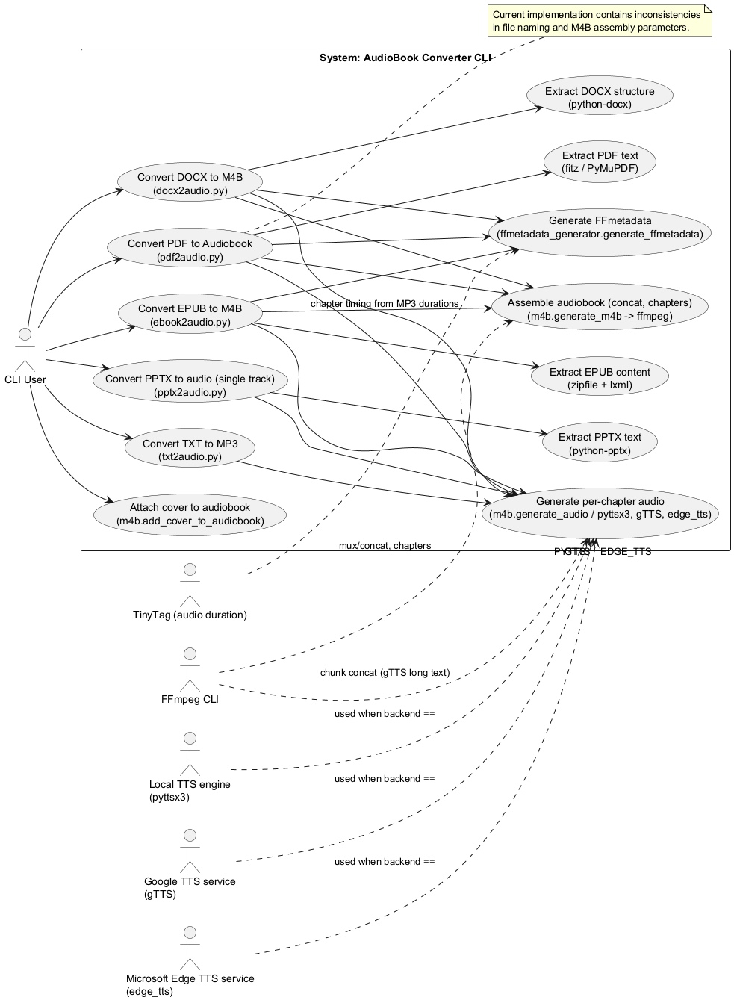
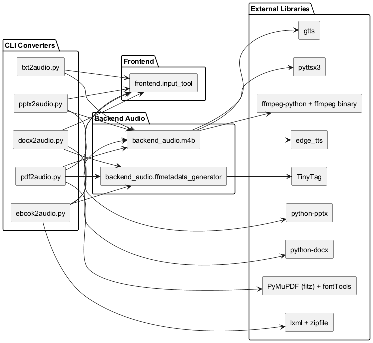
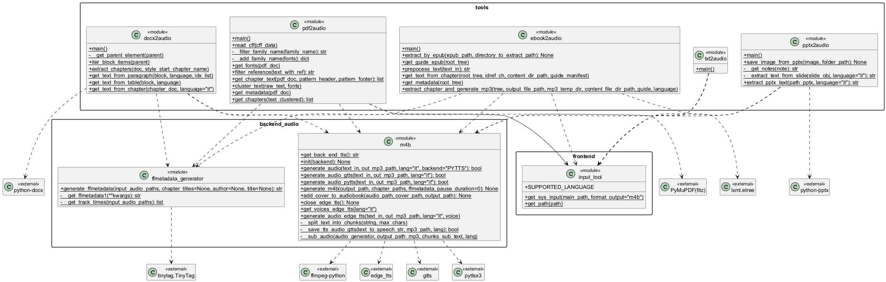
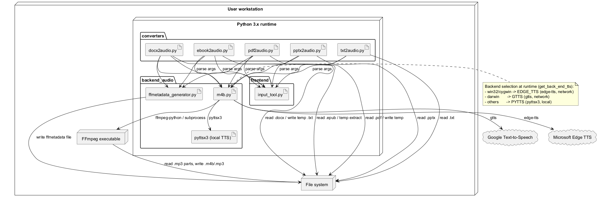

 

% 1 — System Overview
# SECTION 1 — System Overview

This section provides a concise description of the system’s purpose, scope, and key features, strictly derived from the source code. It summarizes what the toolkit does, the formats it supports, how it operates at a high level, and the entry points available to end users. The goal is to enable both technical and non-technical stakeholders to understand the system’s intent and breadth, as implemented.

## 1.1 Purpose

The repository implements a command-line toolkit that converts various document formats into spoken audio and optionally assembles chapterized audiobooks. It uses multiple Text-To-Speech (TTS) backends to generate audio segments from input text, and employs ffmpeg to concatenate segments, inject FFMETADATA (title/artist and chapters), and produce a final m4b audiobook file. The system supports simple one-file outputs (MP3) as well as multi-chapter audiobook assembly.

## 1.2 Scope

The codebase provides end-to-end pipelines for these input types:

- DOCX: Extracts structured content by headings, produces per-chapter audio segments, and builds a chapterized m4b.
- EPUB: Extracts spine items, filters content via the EPUB manifest and guide, produces per-chapter audio segments, and builds a chapterized m4b enriched with title and author metadata from the package.
- PDF: Extracts text by font/size clusters, filters references and boilerplate headers/footers, and attempts to produce a chapterized m4b. The current implementation writes intermediate artifacts but contains inconsistencies when assembling the final audiobook.
- PPTX: Extracts slide text (optionally notes placeholder), generates a single audio file from all slides’ text without m4b chapterization.
- TXT: Reads the raw text file and produces a single MP3 audio file.

The scope includes a TTS abstraction layer with multiple backends, FFMETADATA generation for chaptered audiobooks, and a simple CLI input module to enforce common argument parsing across tools. It does not include a GUI, a network service, or persistent state beyond generated media files and temporary/diagnostic outputs.

## 1.3 High-Level Capabilities

The implementation provides the following capabilities:

- Text extraction per input type:
  - DOCX: Iterates over paragraphs/tables preserving document structure; treats Heading 1/Title variants as chapter delimiters and Heading 2 as chapter markers in text.
  - EPUB: Unzips EPUB, parses container.xml and the package document (OPF), walks the spine, resolves item hrefs, and extracts text content from XHTML nodes.
  - PDF: Uses PyMuPDF to walk text spans, merges contiguous spans with identical font+size, removes reference patterns, and filters configurable headers/footers.
  - PPTX: Reads slides’ text frames; placeholder for notes support; writes a single TTS output.
  - TXT: Reads the entire file as plain text.

- TTS backends (selected by OS at runtime):
  - PYTTS (pyttsx3): Default on non-Windows/non-macOS platforms; saves TTS output to file.
  - EDGE_TTS (edge-tts): Default on Windows; async synthesis using a selected voice.
  - GTTS (gtts): Default on macOS; chunked synthesis to work around provider limits and concatenation via ffmpeg.

- Audiobook generation:
  - Produces an m4b container by concatenating MP3 audio segments (and optional silence padding) using ffmpeg.
  - Injects FFMETADATA (artist/title and chapters with start/end times inferred from the actual MP3 durations via TinyTag).
  - Optionally attaches a cover image to an existing audiobook.

- CLI consistency:
  - Unified argument parsing to accept an input file and an optional language code (default: it), with a consistent output naming scheme based on the input stem and requested format.

## 1.4 Entry Points and Responsibilities

The repository exposes the following command-line tools, each orchestrating the end-to-end process for a specific input type:

| Script          | Input                | Output Artifact                   | Chapterization | Metadata Injection | Notes strictly from code |
|-----------------|----------------------|-----------------------------------|----------------|--------------------|--------------------------|
| docx2audio.py   | .docx                | .m4b                              | Yes            | Yes (chapters, title list) | Uses python-docx; writes debug UTF-16 chapter text files; chapter detection via styles (Heading 1/Title). |
| ebook2audio.py  | .epub                | .m4b                              | Yes            | Yes (title, author, chapters) | Unzips EPUB; parses container and OPF via lxml; skips idrefs in SKIP_IDREF; writes per-chapter logs; concatenates generated MP3 segments. |
| pdf2audio.py    | .pdf                 | Intended .m4b                     | Intended       | Intended           | Extracts/filters with PyMuPDF; writes test.json; currently calls generate_m4b with a text list instead of MP3 paths, which does not match the generate_m4b signature. |
| pptx2audio.py   | .pptx                | Single audio file at output path  | No             | No                 | Extracts slide text; calls generate_audio directly; no m4b assembly; output path extension is whatever input_tool provides (default m4b), but the code writes a single TTS audio stream without ffmpeg chapter metadata. |
| txt2audio.py    | .txt                 | .mp3                              | No             | No                 | Uses format_output="mp3"; selects backend (PYTTS or EDGE_TTS) directly; EDGE_TTS path selects a voice before synthesis. |

Backend modules:

- backend_audio/m4b.py: TTS selection and synthesis orchestration; ffmpeg-based audio concatenation and m4b assembly; ffmetadata file injection; cover attachment; Windows-specific async loop initialization for Edge TTS; simple bitrate setting for output.
- backend_audio/ffmetadata_generator.py: Builds FFMETADATA1 header with optional artist/title; computes chapter start/end times by summing actual MP3 durations read via TinyTag; falls back to generated chapter titles if none are provided.

CLI helper:

- frontend/input_tool.py: Normalizes argument parsing across tools; validates input path; derives output path (default extension m4b unless overridden); supports language codes in ["it", "en"] and a verbose flag.

## 1.5 Supported Languages and Platforms

Language selection is exposed through the CLI and flows into TTS backends:

- CLI accepts: it, en.
- PYTTS (pyttsx3) voice mapping in code: it → “italian”, en → “default”.
- GTTS mapping in code: only “it” explicitly mapped.
- EDGE_TTS selects a female voice by language code during initialization; at runtime only the resolved voice is used for synthesis.

Backend selection is automatic by platform:

- Windows/cygwin → EDGE_TTS
- macOS (darwin) → GTTS
- Other platforms → PYTTS

## 1.6 Notable Behaviors and Constraints

The following behaviors and constraints are directly evident in the implementation:

- Audiobook chapter timing is computed from the actual generated MP3 durations using TinyTag; times are cumulated and serialized into an ffmetadata file that ffmpeg ingests during m4b creation.
- Optional inter-chapter silence is supported in m4b assembly via ffmpeg anullsrc.
- The system writes intermediate text logs for DOCX/EPUB chapters in UTF-16 and a JSON snapshot for PDF extraction.
- EDGE_TTS requires network access to fetch voices; initialization asserts the presence of available voices.
- pdf2audio currently constructs chapters but passes a list of text strings to generate_m4b where a list of audio file paths is required, indicating the PDF pipeline is incomplete in its current form.
- pptx2audio writes a single TTS output without chapters or metadata; it does not call the m4b assembly routine.

## 1.7 Summary

In its current state, the repository is a practical CLI toolkit for transforming documents into spoken audio with optional chapterized audiobook output. DOCX and EPUB pipelines are complete and produce m4b files with chapter metadata; TXT produces a simple MP3; PPTX produces a single audio stream; PDF extraction is present but the final audiobook assembly requires correction. The system is portable, selects TTS backends by OS, and uses ffmpeg for robust audio concatenation and metadata handling.

% 2 — Architectural Context
## 2. Architectural Context

This section describes the external systems, programmatic and command-line interfaces, data sources, and human actors that are directly visible in the implementation. It focuses on concrete dependencies and interactions present in the codebase so that team members can validate the context against the actual code.

### External Systems

- FFmpeg CLI
  - Used via ffmpeg-python and subprocess to concatenate audio segments, inject chapters/metadata, produce m4b output, add cover images, and optionally insert silence using lavfi anullsrc.
  - Invocation patterns in code:
    - ffmpeg.concat(...).output(..., f='mp4', map_metadata=0, audio_bitrate='40k').global_args('-f', 'ffmetadata', '-i', 'ffmetada')
    - subprocess.run([... 'ffmpeg', '-i', audio, '-i', cover, '-map', '0', '-map', '1', '-c:a', 'copy', '-c:v', 'mjpeg', '-disposition:v:0', 'attached_pic', '-vtag', 'avc1', output])
- Google Text-to-Speech (gTTS) online service
  - Accessed via the gtts library to synthesize speech from text; requires internet connectivity.
- Microsoft Edge TTS online service
  - Accessed via the edge_tts library to enumerate voices and synthesize speech asynchronously; requires internet connectivity.
- Local OS Speech (pyttsx3)
  - Local, offline TTS engine used by pyttsx3; depends on OS-installed voices.
- TinyTag
  - Used to read audio file durations from generated MP3 segments to compute chapter start/end times for ffmetadata.

### APIs / Interfaces

- Command-line interfaces (all use frontend/input_tool.get_sys_input):
  - Common arguments:
    - file: required positional path to input document.
    - language: optional positional language; choices: ["it", "en"]; default "it".
    - --verbose: optional flag enabling DEBUG logging.
  - docx2audio.py
    - Input: .docx
    - Output: .m4b in the script directory (derived from input filename).
    - Behavior: extracts chapters by DOCX styles; generates per-chapter MP3s; writes debug .txt per chapter; builds m4b with chapters and metadata.
  - ebook2audio.py
    - Input: .epub
    - Output: .m4b
    - Behavior: unzips EPUB; parses OPF; extracts spine items (skipping: coverpage, frontespizio, footnotes, copyright); generates MP3 chapters; injects EPUB metadata (title, author) into ffmetadata; builds m4b.
  - pdf2audio.py
    - Input: .pdf
    - Output: .m4b
    - Behavior: extracts page text via PyMuPDF, filters headers/footers and references, clusters spans; writes test.json with extracted text; synthesizes one or more chapter audios; builds m4b.
  - pptx2audio.py
    - Input: .pptx
    - Output: audio file at path derived by input_tool (extension .m4b by default); generated via a single TTS call over the concatenated slide text.
  - txt2audio.py
    - Input: .txt
    - Output: .mp3 (format_output override)
    - Behavior: reads entire file text and synthesizes an MP3 with the selected backend.
- TTS backend selection (backend_audio/m4b.get_back_end_tts)
  - Returns backend by OS: win32/cygwin → EDGE_TTS; darwin → GTTS; else → PYTTS.
- Programmatic functions (backend_audio/m4b.py)
  - init(backend: str) → None: initializes the chosen TTS backend (pyttsx3 or edge_tts event loop and voice).
  - generate_audio(text_in, out_mp3_path, lang='it', backend='PYTTS') → bool: unified entry point delegating to the selected backend.
  - generate_audio_gtts(text_in, out_mp3_path, lang='it') → bool: gTTS synthesis with chunking for long texts.
  - generate_audio_pytts(text_in, out_mp3_path, lang='it') → bool: pyttsx3 synthesis to file.
  - get_voices_edge_tts(lang) → List[Dict[str, Any]] (async): lists Edge TTS voices.
  - generate_audio_edge_tts(text_in, out_mp3_path, lang, voice) → bool (async): Edge TTS synthesis to file.
  - generate_m4b(output_path, chapter_paths, ffmetadata, pause_duration=0) → None: concatenates chapter MP3s (with optional silence), injects ffmetadata, and writes the final m4b.
  - add_cover_to_audiobook(audio_path, cover_path, output_path) → None: attaches a cover image using ffmpeg.
  - close_edge_tts() → None: closes the Edge TTS event loop if open.
- Metadata generation (backend_audio/ffmetadata_generator.py)
  - generate_ffmetadata(input_audio_paths, chapter_titles=None, author=None, title=None) → str: produces FFMETADATA1 string with [CHAPTER] blocks using MP3 durations via TinyTag.

### Data Sources

- Input documents
  - DOCX: parsed with python-docx; chapters inferred from styles (Heading 1/Title/Titolo and Heading 2); list paragraphs and tables are converted to text.
  - EPUB: unzipped; OPF parsed via lxml; text extracted from manifest items referenced by spine; skips specific idrefs (coverpage, frontespizio, footnotes, copyright).
  - PDF: parsed with PyMuPDF; spans clustered; optional removal of references via regex; header/footer removal via provided patterns.
  - PPTX: slide text extracted; optional notes hook present (currently returns empty string).
  - TXT: read as UTF-8 whole-file text.
- Intermediate artifacts
  - Per-chapter MP3 files written to temporary directories or alongside inputs.
  - Debug text logs:
    - DOCX: one UTF-16 .txt per chapter.
    - EPUB: one UTF-16 .log per spine item.
    - PDF: test.json containing clustered text data.
  - ffmetadata side file
    - A temporary ffmetadata file named "ffmetada" is written to the working directory and consumed by ffmpeg for chapter/metadata injection.
- Output artifacts
  - Final audiobook containers: .m4b produced by docx2audio.py, ebook2audio.py, and pdf2audio.py.
  - Single-file audio: txt2audio.py outputs .mp3; pptx2audio.py uses generate_audio to the path provided by input_tool.

### Users / Actors

- Command-line user
  - Invokes the conversion scripts with the required input path and optional language and verbosity; relies on the platform-driven TTS backend selection and on FFmpeg availability in PATH.

% 2.1 — Architectural Context – Use Case Diagram
# SECTION 2.1 — Architectural Context – Use Case Diagram

This section presents the functional context of the AudioBook Converter CLI as implemented in the provided codebase. It focuses on user-visible goals and the external systems the software directly interacts with during execution. The diagram is derived strictly from the observed scripts and modules: docx2audio.py, ebook2audio.py, pdf2audio.py, pptx2audio.py, txt2audio.py, backend_audio/m4b.py, and backend_audio/ffmetadata_generator.py. It highlights the distinct conversion entry points, the shared internal use cases for audio generation, metadata creation, and audiobook assembly, as well as the concrete third-party services and tools the system invokes.

The CLI User triggers one of five conversion flows. The DOCX and EPUB tools parse structured content, synthesize per-chapter audio via the selected TTS backend, compute chapter start/end using TinyTag, and assemble an M4B audiobook through ffmpeg with embedded chapter metadata. The PPTX tool extracts slide text and produces a single audio track without M4B assembly, while the TXT tool directly synthesizes MP3 output. The PDF path extracts text using PyMuPDF and attempts to follow the same audiobook steps; however, based on the current code, its chapter-to-file handling and final assembly require corrections. TTS backends are selected by platform defaults and include the local pyttsx3 engine, Google gTTS, and Microsoft Edge TTS, all mediated through the m4b module’s generate_audio functions.

% 3 — Containers
## 3. Containers

This section identifies the runtime containers and external services involved when converting input documents into audio. Each container description states its responsibility, the primary technologies observed in the codebase, and how it communicates with other containers or external systems. All details are derived directly from the provided source code and reflect actual runtime behavior.

| Container | Responsibility | Technology | Communication |
|---|---|---|---|
| docx2audio CLI | Reads .docx documents, extracts chapters and text, generates per-chapter MP3 segments, produces a final M4B with chapters and metadata. | Python 3; python-docx; backend_audio.m4b; backend_audio.ffmetadata_generator; tempfile; logging | In-process calls to backend_audio; local file I/O (read .docx, write .mp3, .m4b, debug .txt); indirect HTTPS when using GTTS/EDGE_TTS via backend; spawns FFmpeg via ffmpeg-python/subprocess through backend |
| ebook2audio CLI | Processes .epub files, extracts chapters and metadata, generates MP3 segments, and muxes an M4B with chapters and book metadata. | Python 3; zipfile; lxml.etree; codecs; tempfile; backend_audio.m4b; backend_audio.ffmetadata_generator; logging | In-process calls to backend_audio; local file I/O (unzip EPUB, write .mp3, .m4b, debug .log); indirect HTTPS when using GTTS/EDGE_TTS via backend; spawns FFmpeg via ffmpeg-python/subprocess through backend |
| pdf2audio CLI | Parses PDFs, clusters text, filters references, generates MP3, and attempts M4B muxing. | Python 3; PyMuPDF (fitz); fontTools.cffLib; re; json; tempfile; backend_audio.m4b; backend_audio.ffmetadata_generator | In-process calls to backend_audio; local file I/O (read .pdf, write .mp3, .json); indirect HTTPS when using GTTS/EDGE_TTS via backend; spawns FFmpeg via ffmpeg-python/subprocess through backend |
| pptx2audio CLI | Extracts text content from .pptx slides (and optionally notes), generates a single audio file. | Python 3; python-pptx; backend_audio.m4b; logging | In-process calls to backend_audio; local file I/O (read .pptx, write audio file); indirect HTTPS when using GTTS/EDGE_TTS via backend; spawns FFmpeg only if used by backend for concatenation (not used in this flow) |
| txt2audio CLI | Reads plain text and generates a single MP3 via the selected TTS backend. | Python 3; asyncio; backend_audio.m4b; logging | In-process calls to backend_audio; local file I/O (read .txt, write .mp3); direct event loop usage for EDGE_TTS; indirect HTTPS when using EDGE_TTS; no FFmpeg muxing in this flow |
| Backend Audio (library) | Provides TTS generation (GTTS, EDGE_TTS, PYTTS), audio concatenation, M4B muxing, cover embedding, and FFmetadata authoring. | Python 3; backend_audio.m4b; backend_audio.ffmetadata_generator; gtts; edge-tts; pyttsx3; ffmpeg-python; subprocess (ffmpeg CLI); tinytag | In-process API for frontends; HTTPS to Google TTS via gtts; HTTPS to Microsoft Edge TTS via edge-tts; local OS APIs via pyttsx3; spawns FFmpeg processes; local file I/O for temporary artifacts and outputs |
| FFmpeg Process | Concatenates audio segments, inserts silence, injects chapters/metadata, and writes final M4B or MP3 files; can attach cover art. | External ffmpeg executable invoked via ffmpeg-python and subprocess | Spawned as a subprocess; communicates via OS process I/O and filesystem; reads/writes media files and ffmetadata text files |
| Google TTS Service | Cloud text-to-speech when GTTS backend is selected. | gtts library (Google Translate TTS) | HTTPS requests initiated by backend_audio.m4b (gtts) |
| Microsoft Edge TTS Service | Cloud text-to-speech when EDGE_TTS backend is selected, including voice discovery. | edge-tts library | HTTPS requests (and underlying protocol as implemented by edge-tts) initiated by backend_audio.m4b; event loop managed in-process |
| Local TTS Engine | Offline/local TTS when PYTTS backend is selected. | pyttsx3 with platform-specific voice providers | In-process API calls; no network; writes audio files locally |
| Local File System | Storage for inputs, intermediate artifacts, and final outputs. | OS filesystem; tempfile; Pathlib/OS modules | Local file I/O for reading inputs (.docx, .epub, .pdf, .pptx, .txt), writing segments (.mp3), debug logs, ffmetadata text, and final .m4b outputs |

% 3.1 — Architecture Overview – Component Diagram
# SECTION 3.1 — Architecture Overview – Component Diagram

This section presents the component-level view of the system, showing all executable entry points, internal modules, and external libraries they depend on. It captures how each converter tool coordinates with the frontend CLI, the audio backend, and metadata generation to produce audio files and audiobooks. The diagram and catalogue reflect the actual modules and interactions visible in the codebase without introducing elements not present in the source.

Figure 3.1 — Component Diagram (component-diagram-3-1.puml)

Component Catalogue

| Component | Type | Responsibilities | Key Dependencies | Used By |
|---|---|---|---|---|
| docx2audio.py | CLI converter | Parses .docx, extracts chapters, generates per-chapter audio, builds .m4b with chapter metadata. | python-docx; backend_audio.m4b; backend_audio.ffmetadata_generator; frontend.input_tool | End user (CLI) |
| ebook2audio.py | CLI converter | Unzips .epub, parses manifest/spine, extracts text, generates per-chapter audio, builds .m4b with book metadata. | zipfile; lxml.etree; backend_audio.m4b; backend_audio.ffmetadata_generator; frontend.input_tool | End user (CLI) |
| pdf2audio.py | CLI converter | Extracts text by font/size spans, filters references/headers/footers, clusters text, generates audio, attempts to build .m4b. | PyMuPDF (fitz); fontTools.cffLib; backend_audio.m4b; backend_audio.ffmetadata_generator; frontend.input_tool | End user (CLI) |
| pptx2audio.py | CLI converter | Extracts slide text (and stubs for notes/images), generates single audio file from all slides. | python-pptx; backend_audio.m4b; frontend.input_tool | End user (CLI) |
| txt2audio.py | CLI converter | Reads plain text and generates a single .mp3 using selected TTS backend. | backend_audio.m4b; asyncio (when EDGE_TTS) ; frontend.input_tool | End user (CLI) |
| frontend.input_tool | Frontend utility | Validates input path, parses command-line args, determines output path and language. | argparse; pathlib; os | All CLI converters |
| backend_audio.m4b | Backend module | Initializes TTS backend, generates audio via EDGE_TTS/GTTS/pyttsx3, concatenates segments (and silence), writes .m4b with metadata, optionally embeds cover. | edge_tts; gtts; pyttsx3; ffmpeg-python; subprocess (ffmpeg); asyncio; tempfile; os | All converters |
| backend_audio.ffmetadata_generator | Backend module | Builds FFMETADATA1 with artist/title and chapter start/end using TinyTag durations. | tinytag.TinyTag | docx2audio.py; ebook2audio.py; pdf2audio.py |

Notes

The selected TTS backend is chosen at runtime by backend_audio.m4b.get_back_end_tts() based on sys.platform: EDGE_TTS on win32/cygwin, GTTS on darwin, and PYTTS otherwise. The metadata generator computes chapter boundaries by reading the duration of each generated audio segment with TinyTag and emits an FFMETADATA1-compliant payload consumed by ffmpeg during .m4b creation.

% 4 — Components
## 4. Components

This section identifies all implemented components within each container (modules and scripts) of the repository. For every component, it describes the responsibility and its collaborations, including function calls, imports, and cross-module dependencies. The coverage is exhaustive and reflects the current codebase.

| Component | Responsibility | Interactions |
|---|---|---|
| backend_audio.ffmetadata_generator.__get_ffmetadata1 | Build the FFMETADATA1 header and optional artist/title tags based on provided author/title values. | ["invoked by: backend_audio.ffmetadata_generator.generate_ffmetadata"] |
| backend_audio.ffmetadata_generator.__get_track_times | Compute cumulative chapter start times (in nanoseconds) by reading durations from input MP3 files. | ["calls: tinytag.TinyTag.get", "invoked by: backend_audio.ffmetadata_generator.generate_ffmetadata"] |
| backend_audio.ffmetadata_generator.generate_ffmetadata | Generate a complete ffmetadata text including global metadata and [CHAPTER] sections with START/END and title per segment. | ["calls: backend_audio.ffmetadata_generator.__get_track_times", "calls: backend_audio.ffmetadata_generator.__get_ffmetadata1"] |
| backend_audio.m4b.get_back_end_tts | Choose the TTS backend based on the host OS (EDGE_TTS for Windows, GTTS for macOS, default PYTTS). | ["uses: sys.platform", "invoked by: docx2audio.BACK_END_TTS", "invoked by: ebook2audio.BACK_END_TTS", "invoked by: pdf2audio.BACK_END_TTS", "invoked by: pptx2audio.BACK_END_TTS", "invoked by: txt2audio.BACK_END_TTS"] |
| backend_audio.m4b.get_voices_edge_tts | Retrieve Edge TTS voice list filtered by language and female gender. | ["calls: edge_tts.VoicesManager.create", "calls: edge_tts.VoicesManager.find", "invoked by: backend_audio.m4b.init", "invoked by: txt2audio.main (non-PYTTS path)"] |
| backend_audio.m4b.generate_audio_edge_tts | Asynchronously synthesize speech using Edge TTS and save to an MP3 file. | ["calls: edge_tts.Communicate.save", "invoked by: backend_audio.m4b.generate_audio (EDGE_TTS)", "invoked by: txt2audio.main (non-PYTTS path)"] |
| backend_audio.m4b.__split_text_into_chunks | Split long input text into chunks not exceeding Google TTS max chars, breaking on spaces. | ["uses: gtts.gTTS.GOOGLE_TTS_MAX_CHARS", "invoked by: backend_audio.m4b.generate_audio_gtts"] |
| backend_audio.m4b.__save_tts_audio_gtts | Generate and save a single MP3 chunk with Google TTS; retries once on gTTSError and logs errors. | ["calls: gtts.gTTS(...).save", "calls: time.sleep", "calls: logging.Logger.error", "invoked by: backend_audio.m4b.generate_audio_gtts", "invoked by: backend_audio.m4b.__sub_audio (as audio_generator)"] |
| backend_audio.m4b.generate_audio_gtts | Synthesize speech with Google TTS; if text exceeds limit, chunk and concatenate outputs. | ["calls: backend_audio.m4b.__split_text_into_chunks", "calls: backend_audio.m4b.__save_tts_audio_gtts", "calls: backend_audio.m4b.__sub_audio"] |
| backend_audio.m4b.generate_audio_pytts | Synthesize speech with pyttsx3 to MP3; sets engine voice based on requested language. | ["uses: engine_ptts (global)", "calls: pyttsx3.Engine.setProperty", "calls: pyttsx3.Engine.save_to_file", "calls: pyttsx3.Engine.runAndWait"] |
| backend_audio.m4b.__sub_audio | Concatenate multiple MP3 chunks into a single MP3 using ffmpeg. | ["calls: tempfile.TemporaryDirectory", "calls: ffmpeg.input", "calls: ffmpeg.concat", "calls: ffmpeg.output(...).run", "invoked by: backend_audio.m4b.generate_audio_gtts"] |
| backend_audio.m4b.generate_m4b | Concatenate chapter MP3s (with optional silence) into an M4B and attach ffmetadata. | ["calls: ffmpeg.input (audio and anullsrc)", "calls: ffmpeg.concat", "calls: ffmpeg.output", "creates: ffmetadata temp file", "calls: ffmpeg.run", "logs: ffmpeg.Error via logger"] |
| backend_audio.m4b.init | Initialize backend resources (pyttsx3 engine or Edge TTS event loop and voice). | ["calls: pyttsx3.init (PYTTS)", "calls: asyncio.set_event_loop(ProactorEventLoop) (EDGE_TTS)", "calls: backend_audio.m4b.get_voices_edge_tts (EDGE_TTS)"] |
| backend_audio.m4b.generate_audio | Dispatch TTS generation to GTTS, PYTTS, or EDGE_TTS based on selected backend. | ["calls: backend_audio.m4b.generate_audio_gtts (GTTS)", "calls: backend_audio.m4b.generate_audio_pytts (PYTTS)", "calls: backend_audio.m4b.generate_audio_edge_tts via asyncio loop (EDGE_TTS)"] |
| backend_audio.m4b.close_edge_tts | Close the global asyncio event loop used for Edge TTS if initialized. | ["uses: loop (global)"] |
| backend_audio.m4b.add_cover_to_audiobook | Attach a cover image to an audiobook using ffmpeg and embedded picture disposition. | ["calls: subprocess.run(['ffmpeg', ...])"] |
| frontend.input_tool.get_path | Validate that an input file exists and return it as a pathlib.Path; exit on error. | ["calls: os.path.exists", "calls: sys.exit on error", "uses: logging to report missing file"] |
| frontend.input_tool.get_sys_input | Parse CLI arguments (file, language, verbosity) and compute the output file path. | ["calls: argparse.ArgumentParser", "uses: SUPPORTED_LANGUAGE", "calls: frontend.input_tool.get_path (as type)", "calls: logger.setLevel for verbose"] |
| docx2audio.__get_parent_element | Map python-docx wrapper objects to their underlying XML parent element. | ["uses: docx.document.Document, _Cell, _Row", "invoked by: docx2audio.iter_block_items"] |
| docx2audio.iter_block_items | Iterate over document body children yielding Paragraph or Table objects in order. | ["uses: CT_P, CT_Tbl from python-docx", "invoked by: docx2audio.extract_chapters"] |
| docx2audio.extract_chapters | Split the document into chapter blocks when encountering configured title styles. | ["calls: docx2audio.iter_block_items"] |
| docx2audio.get_text_from_paragraph | Convert a paragraph to annotated text, including list numbering and chapter markers by style. | ["uses: LIST_ITEM_TOKEN, CHAPTER_TOKEN, CHAPTER_KEYWORD"] |
| docx2audio.get_text_from_table | Convert a table to tab-separated row text across all cells. | ["iterates: Table.rows/cells/paragraphs"] |
| docx2audio.get_text_from_chapter | Build TTS-ready text for a chapter, prefixed with a localized TITLE and concatenating paragraphs/tables; return also the chapter title. | ["calls: docx2audio.get_text_from_paragraph", "calls: docx2audio.get_text_from_table"] |
| docx2audio.main | Convert a DOCX into an audiobook: parse chapters, TTS each chapter to MP3, generate ffmetadata, assemble M4B. | ["calls: frontend.input_tool.get_sys_input", "calls: m4b.init", "calls: docx.Document", "calls: docx2audio.extract_chapters", "calls: docx2audio.get_text_from_chapter", "writes: per-chapter UTF-16 debug text", "calls: m4b.generate_audio", "calls: ffmetadata_generator.generate_ffmetadata", "calls: m4b.generate_m4b", "calls: m4b.close_edge_tts"] |
| ebook2audio.extract_by_epub | Extract all files from an EPUB (ZIP) into a temporary directory. | ["calls: zipfile.ZipFile.extractall"] |
| ebook2audio.get_guide_epub | Parse the OPF guide section mapping reference types to hrefs. | ["calls: lxml.etree XPath on package/guide/reference"] |
| ebook2audio.prepocess_text | Normalize text encoding and whitespace, removing non-breaking spaces and CRLF artifacts. | ["calls: codecs.decode"] |
| ebook2audio.get_text_from_chapter | Resolve an itemref id to its href and extract visible text content from the corresponding XHTML body. | ["calls: lxml.etree XPath on manifest", "calls: etree.parse(HTMLParser)", "iterates: subtree.xpath('//html/body/*').itertext"] |
| ebook2audio.get_metadata | Extract book-level metadata (title, author, rights, description) from the OPF metadata section. | ["calls: lxml.etree XPath with namespaces"] |
| ebook2audio.extract_chapter_and_generate_mp3 | Iterate spine items, extract and preprocess text, log debug text, synthesize chapter MP3s, and return their paths. | ["calls: ebook2audio.get_text_from_chapter", "calls: ebook2audio.prepocess_text", "writes: per-idref UTF-16 debug logs", "calls: m4b.generate_audio"] |
| ebook2audio.main | Convert an EPUB into an audiobook: unpack, parse container/rootfiles, extract chapters, generate ffmetadata, and assemble M4B. | ["calls: frontend.input_tool.get_sys_input", "calls: m4b.init", "calls: tempfile.TemporaryDirectory", "calls: ebook2audio.extract_by_epub", "calls: lxml.etree.parse(container.xml and OPF)", "calls: ebook2audio.get_guide_epub", "calls: ebook2audio.get_metadata", "calls: ebook2audio.extract_chapter_and_generate_mp3", "calls: ffmetadata_generator.generate_ffmetadata", "calls: m4b.generate_m4b"] |
| pdf2audio.read_cff | Decompile a CFF font blob and return its top dict for metadata inspection. | ["calls: fontTools.cffLib.CFFFontSet.decompile"] |
| pdf2audio.__filter_family_name | Normalize a font family name (lowercase, strip weight/style tokens). | ["invoked by: pdf2audio.__add_family_name"] |
| pdf2audio.__add_family_name | Map extracted fonts to their normalized family names by inspecting embedded CFF data. | ["calls: pdf2audio.read_cff", "calls: pdf2audio.__filter_family_name"] |
| pdf2audio.get_fonts | Extract and deduplicate embedded fonts from a PDF, then annotate them with normalized family names. | ["iterates: fitz Document.pages.get_fonts", "calls: pdf_doc.extract_font", "calls: pdf2audio.__add_family_name"] |
| pdf2audio.filter_reference | Strip inline reference markers using a compiled regex pattern. | ["uses: REGEX_REFERENCE"] |
| pdf2audio.get_chapter_text | Traverse page text spans, grouping consecutive spans with same font/size, and filtering header/footer patterns. | ["calls: page.get_text('dict')", "uses: regex_header/regex_footer", "calls: pdf2audio.filter_reference"] |
| pdf2audio.cluster_text | Merge adjacent text blocks sharing the same font and size to form larger coherent blocks. | ["invoked by: pdf2audio.main"] |
| pdf2audio.get_metadata | Placeholder metadata extraction for PDFs; currently returns None values. | ["invoked by: pdf2audio.main"] |
| pdf2audio.get_chapters | Combine clustered text blocks into a single chapter string. | ["invoked by: pdf2audio.main"] |
| pdf2audio.main | Convert a PDF into audio: extract structured text, cluster, synthesize audio per chapter, and attempt M4B assembly. | ["calls: frontend.input_tool.get_sys_input", "calls: fitz.open", "calls: pdf2audio.get_chapter_text", "calls: pdf2audio.cluster_text", "writes: test.json for diagnostics", "calls: pdf2audio.get_chapters", "calls: pdf2audio.get_metadata", "calls: m4b.init", "calls: tempfile.TemporaryDirectory", "calls: m4b.generate_audio", "calls: ffmetadata_generator.generate_ffmetadata", "calls: m4b.generate_m4b"] |
| pptx2audio.save_image_from_pptx | Persist an embedded PPTX image part to disk. | ["writes: image.blob to filesystem"] |
| pptx2audio.__get_notes | Stub for extracting notes from a slide; currently logs and returns empty. | ["invoked by: pptx2audio.__extract_text_from_slide"] |
| pptx2audio.__extract_text_from_slide | Extract visible text from slide shapes and optionally notes; localize notes header. | ["uses: slide.shapes / text_frame", "calls: pptx2audio.__get_notes"] |
| pptx2audio.extract_pptx_text | Aggregate text across all slides, prefixing each with a localized slide number. | ["calls: pptx.Presentation", "calls: pptx2audio.__extract_text_from_slide"] |
| pptx2audio.main | Convert a PPTX into audio: extract slide text and synthesize it as a single audio file. | ["calls: frontend.input_tool.get_sys_input", "calls: m4b.init", "calls: pptx2audio.extract_pptx_text", "calls: m4b.generate_audio"] |
| txt2audio.main | Convert a plain text file into an MP3 using the selected TTS backend. | ["calls: frontend.input_tool.get_sys_input", "reads: input text file", "calls: m4b.init", "calls: m4b.generate_audio_pytts (PYTTS path)", "calls: m4b.get_voices_edge_tts and m4b.generate_audio_edge_tts (non-PYTTS path)"] |

% 5 — Code-Level View
# SECTION 5 — Code-Level View

This section documents how the implemented source code maps to architectural elements, identifies executable entry points, and clarifies the organization of modules and their responsibilities. It is intended to enable developers to validate the documentation directly against the codebase and to support maintainability and onboarding.

## 5.1 Purpose and Scope

The goal of this code-level view is to describe the concrete structure of the repository, the responsibilities and interactions of its modules, and the way the system implements text extraction and text-to-speech pipelines for multiple input formats. It focuses on the mapping between architectural components and source code files, including key functions, runtime initialization, and external dependencies that are visible in the implementation.

## 5.2 Repository Layout and Component Mapping

The repository is organized into three areas: backend_audio (audio generation and assembly), frontend (CLI input handling), and format-specific command-line tools at the repository root. The following table maps each file to its implemented component and responsibilities.

| Path | Component | Responsibilities | External Libraries |
|------|-----------|------------------|--------------------|
| backend_audio/ffmetadata_generator.py | FFmetadata Generator | Builds ffmetadata text (global metadata + chapter markers) and computes per-chapter time ranges from audio segment durations. | tinytag |
| backend_audio/m4b.py | Audio Backend and M4B Assembler | Selects TTS backend per platform, initializes engine; generates audio via gTTS, pyttsx3, or Microsoft Edge TTS; concatenates segments with optional silence; writes m4b with metadata; adds cover art via ffmpeg; handles asyncio loop for Edge TTS. | pyttsx3, gtts, edge_tts, ffmpeg-python, asyncio, tempfile, logging, subprocess |
| frontend/input_tool.py | CLI Input Parser | Parses CLI arguments: input file path, language, verbosity; validates file existence; constructs output file path by replacing extension. | argparse, pathlib, logging |
| docx2audio.py | DOCX Orchestrator | Parses .docx; partitions content into chapters by style; linearizes document blocks (paragraphs/tables); generates per-chapter mp3; composes m4b with chapters and metadata. | python-docx, backend_audio.*, frontend.input_tool |
| ebook2audio.py | EPUB Orchestrator | Unzips .epub; parses container and content OPF; reads spine and manifest; extracts XHTML text per itemref; filters/skips known sections; generates chapter mp3s and final m4b with book metadata. | zipfile, lxml.etree, tempfile, codecs, backend_audio.*, frontend.input_tool |
| pdf2audio.py | PDF Orchestrator (experimental) | Parses PDF with PyMuPDF; groups text by font/size; removes header/footer and reference patterns; clusters spans; generates audio and attempts m4b assembly. | fitz (PyMuPDF), fontTools, re, json, tempfile, backend_audio.*, frontend.input_tool |
| pptx2audio.py | PPTX Orchestrator | Reads slides and optional notes; extracts text per slide; generates a single audio file directly from aggregated text. | python-pptx, backend_audio.*, frontend.input_tool |
| txt2audio.py | TXT Orchestrator | Reads plain text; generates a single audio file (mp3 for txt); handles both pyttsx3 and Edge TTS execution flows. | asyncio, backend_audio.*, frontend.input_tool |

## 5.3 Executable Entry Points

The system provides multiple command-line entry points, one per supported input format. All tools accept the input document path and an optional language argument and rely on frontend/input_tool.py for consistent parsing.

| Script | Invocation Pattern | Inputs | Outputs | Notes |
|--------|--------------------|--------|---------|-------|
| docx2audio.py | python docx2audio.py <file.docx> [language] [--verbose] | .docx file path; language in {it, en} | .m4b in script directory with input stem | Splits by styles in TITLE_TOKENS and CHAPTER_TOKEN; writes per-chapter debug .txt files in UTF-16. |
| ebook2audio.py | python ebook2audio.py <file.epub> [language] [--verbose] | .epub file path | .m4b in script directory with input stem | Uses spine to drive chapter order; skips items by SKIP_IDREF; uses EPUB metadata for title/author. |
| pdf2audio.py | python pdf2audio.py <file.pdf> [language] [--verbose] | .pdf file path | Intended .m4b in script directory | Extracts spans and clusters by font/size; experimental; see Implementation Notes below. |
| pptx2audio.py | python pptx2audio.py <file.pptx> [language] [--verbose] | .pptx file path | .m4b in script directory with input stem | Aggregates slide text; notes handling stubbed. |
| txt2audio.py | python txt2audio.py <file.txt> [language] [--verbose] | .txt file path | .mp3 in script directory with input stem | Direct single-file TTS; uses Edge voices lookup flow if backend is EDGE_TTS. |
| backend_audio/m4b.py | python backend_audio/m4b.py | hardcoded | out.m4b | Demonstration utility calling add_cover_to_audiobook on fixed relative files. |

All entry points use frontend/input_tool.get_sys_input to enforce argument consistency and to compute the destination path, replacing the extension with .m4b except for txt2audio.py which sets format_output to mp3.

## 5.4 Module-to-Code Mapping and Key Functions

This subsection enumerates each module’s significant functions and their roles. Function names and signatures are taken directly from the source.

### backend_audio/ffmetadata_generator.py

This module builds ffmetadata text, including optional global artist/title and chapter entries, with chapter START/END boundaries computed from audio durations.

| Function | Signature | Responsibility |
|----------|-----------|----------------|
| __get_ffmetadata1 | __get_ffmetadata1(**kwargs) -> str | Builds the header and optional artist/title fields in ffmetadata format when either title or author is provided. |
| __get_track_times | __get_track_times(input_audio_paths: list) -> list | Reads durations with TinyTag and returns cumulative end times for each track as integer nanoseconds in string form. |
| generate_ffmetadata | generate_ffmetadata(input_audio_paths: list, chapter_titles: list = None, author: str = None, title: str = None) -> str | Produces complete ffmetadata text including [CHAPTER] sections with START/END spanning consecutive cumulative times and chapter titles (from chapter_titles if provided, else auto c{idx}). |

Notes: The time unit used is nanoseconds (tag.duration multiplied by 1e9), directly written into START/END fields.

### backend_audio/m4b.py

This module provides the TTS backends and the audio packaging to m4b using ffmpeg, exposing a stable API to the format-specific orchestrators.

| Function / Constant | Signature / Type | Responsibility |
|---------------------|------------------|----------------|
| LANGUAGE_DICT | dict | Maps CLI language to gTTS language codes (e.g., it -> it). |
| LANGUAGE_DICT_PYTTS | dict | Maps language to pyttsx3 voice property values (e.g., it -> italian). |
| BIT_RATE_HUMAN | str | Audio bitrate string for ffmpeg output (40k). |
| get_back_end_tts | get_back_end_tts() -> str | Selects default backend per platform: win32/cygwin -> EDGE_TTS, darwin -> GTTS, else PYTTS. |
| get_voices_edge_tts | async get_voices_edge_tts(lang: str = LANGUAGE_DICT["it"]) -> List[Dict[str, Any]] | Queries Edge TTS VoicesManager; returns female voices filtered by language. |
| generate_audio_edge_tts | async generate_audio_edge_tts(text_in: str, out_mp3_path: str, *, lang: str = "it", voice: str) -> bool | Generates audio via Edge TTS and saves to file. |
| __split_text_into_chunks | __split_text_into_chunks(string: str, max_chars: int = gtts.gTTS.GOOGLE_TTS_MAX_CHARS) | Splits text at word boundaries to respect gTTS length limits. |
| __save_tts_audio_gtts | __save_tts_audio_gtts(text_to_speech_str: str, mp3_path: str, lang: str) -> bool | Generates a single mp3 chunk using gTTS with retry and logging on gTTSError. |
| generate_audio_gtts | generate_audio_gtts(text_in: str, out_mp3_path: str, *, lang: str = "it") -> bool | Splits text if needed and concatenates resulting mp3 chunks using ffmpeg. |
| generate_audio_pytts | generate_audio_pytts(text_in: str, out_mp3_path: str, *, lang: str = "it") -> bool | Uses pyttsx3 to synthesize directly to file; adjusts engine voice based on LANGUAGE_DICT_PYTTS. |
| __sub_audio | __sub_audio(audio_generator: Callable[[str, str], bool], output_path_mp3: str, chunks_sub_text: str, lang: str) | Invokes a chunk-aware generator for each chunk; concatenates mp3 segments via ffmpeg.concat. |
| generate_m4b | generate_m4b(output_path: str, chapter_paths: List[str], ffmetadata: str, pause_duration: int = 0) -> None | Optionally inserts silence between chapters; concatenates mp3s; writes ffmetadata to a temp file; runs ffmpeg to produce .m4b with audio_bitrate and map_metadata=0. |
| init | init(backend: str) -> None | Initializes pyttsx3 engine for PYTTS or sets up ProactorEventLoop and picks a default voice for EDGE_TTS. |
| generate_audio | generate_audio(text_in: str, out_mp3_path: str, *, lang: str = "it", backend: str = "PYTTS") -> bool | Unified facade dispatching to GTTS, PYTTS, or EDGE_TTS paths. |
| close_edge_tts | close_edge_tts() -> None | Closes the asyncio loop used by EDGE_TTS if set. |
| add_cover_to_audiobook | add_cover_to_audiobook(audio_path: str, cover_path: str, output_path: str) -> None | Uses system ffmpeg to attach cover art (as mjpeg) to an existing audio container. |

Notes: EDGE_TTS path relies on an event loop; on Windows, init sets a ProactorEventLoop. Concatenation uses ffmpeg-python graph construction. The ffmetadata file name is "ffmetada" in the implementation.

### frontend/input_tool.py

This module encapsulates CLI parsing, validation, and output path derivation used uniformly by all entry points.

| Function | Signature | Responsibility |
|----------|-----------|----------------|
| get_path | get_path(path: str) -> Path | Validates that the file exists; logs and exits on failure; returns a Path. |
| get_sys_input | get_sys_input(main_path: str, format_output: str = "m4b") -> Tuple[str, str, str] | Parses positional file, optional language, and --verbose; computes output path as main_path/input_stem.format_output; sets logger level on verbose; returns (input_path, output_path, language). |

Constants: SUPPORTED_LANGUAGE = ["it", "en"].

### docx2audio.py

This orchestrator translates a .docx into chapters and produces an .m4b audiobook.

| Function | Signature | Responsibility |
|----------|-----------|----------------|
| __get_parent_element | __get_parent_element(parent) | Resolves the oxml container for paragraphs/tables to iterate mixed content. |
| iter_block_items | iter_block_items(parent) -> Generator[Paragraph or Table] | Yields paragraphs and tables in document order. |
| extract_chapters | extract_chapters(doc: Document, style_start_chapter_name: Tuple[str] = TITLE_TOKENS) -> List[List[Paragraph or Table]] | Segments the document into chapters, starting a new chapter on encountering block styles in TITLE_TOKENS. |
| get_text_from_paragraph | get_text_from_paragraph(block: Paragraph, language: str, idx_list: int) -> Tuple[str, int] | Converts a paragraph to TTS text with special handling for list items and chapter headings. |
| get_text_from_table | get_text_from_table(block: Table, language: str) -> str | Flattens a table into tab-separated rows for TTS. |
| get_text_from_chapter | get_text_from_chapter(chapter_doc: List[Paragraph or Table], language: str = LANGUAGE) -> Tuple[str, str] | Generates a TTS-ready string per chapter, prefixed with localized title markers; returns (text, chapter_title). |
| main | main() | CLI integration: parse args, init backend, load document, extract chapters, synthesize mp3 per chapter, write debug .txt, assemble .m4b with ffmetadata, close Edge loop. |

Constants: BACK_END_TTS, LANGUAGE, TITLE_KEYWORD, CHAPTER_KEYWORD, TITLE_TOKENS, LIST_ITEM_TOKEN, CHAPTER_TOKEN.

### ebook2audio.py

This orchestrator converts an .epub into an audiobook by following the OPF spine and extracting XHTML.

| Function | Signature | Responsibility |
|----------|-----------|----------------|
| extract_by_epub | extract_by_epub(epub_path: str, directory_to_extract_path: str) -> None | Unzips the epub into a temporary directory. |
| get_guide_epub | get_guide_epub(root_tree: etree.ElementBase) -> Dict[str, str] | Extracts guide entries (type -> href) from the package file. |
| prepocess_text | prepocess_text(text_in: str) -> str | Normalizes whitespace and encoding artifacts before TTS. |
| get_text_from_chapter | get_text_from_chapter(root_tree, idref_ch, content_dir_path, guide_manifest) -> Tuple[str, Dict[str, str]] | Resolves href by idref in manifest; skips if href appears in guide; parses XHTML and accumulates text. |
| get_metadata | get_metadata(root_tree) -> Dict[str, str] | Extracts dc:title, dc:creator, dc:rights, dc:description from metadata. |
| extract_chapter_and_generate_mp3 | extract_chapter_and_generate_mp3(tree, output_file_path, mp3_temp_dir, content_file_dir_path, guide, language) -> List[str] | Iterates spine/@idref; for each, extracts text, applies filters and preprocessing, writes debug logs, calls m4b.generate_audio to synthesize mp3; returns list of mp3 paths. |
| main | main() | CLI integration and orchestration: unzip, parse container, iterate rootfiles, build guide and metadata, generate mp3s, build and write ffmetadata and .m4b. |

Constants: BACK_END_TTS and SKIP_IDREF.

### pdf2audio.py

This module implements an experimental PDF flow: it extracts text spans, removes references and repeated headers/footers, then produces audio.

| Function | Signature | Responsibility |
|----------|-----------|----------------|
| read_cff | read_cff(cff_data) | Parses a CFF font to obtain topDict for metadata (family name). |
| __filter_family_name | __filter_family_name(family_name: str) -> str | Normalizes font family names by removing weight/style variants. |
| __add_family_name | __add_family_name(fonts: dict) -> dict | Attaches normalized family names to extracted fonts. |
| get_fonts | get_fonts(pdf_doc) | Extracts embedded fonts from a PDF and annotates them with family names. |
| filter_reference | filter_reference(text_with_ref: str) -> str | Removes inline reference patterns using compiled regex. |
| get_chapter_text | get_chapter_text(pdf_doc, pattern_header: str, pattern_footer: str) -> list | Walks spans block-by-block; coalesces text with same font/size; filters header/footer matches; returns a list of dicts with txt/font/size. |
| cluster_text | cluster_text(raw_text: list, fonts: dict) -> dict | Merges adjacent spans with matching font+size to reduce fragmentation. |
| get_metadata | get_metadata(pdf_doc) | Returns placeholder dict with title/author as None. |
| get_chapters | get_chapters(text_clustered: list) -> list | Produces a single-chapter text by joining all span texts. |
| main | main() | CLI integration: parse input, extract/cluster text, dump JSON debug, synthesize chapters, assemble ffmetadata, run m4b. |

Constants: BACK_END_TTS, PATTERN_REFERENCE_STR and REGEX_REFERENCE.

Implementation notes for validation:
- In the audio generation loop, files are created with a .txt extension in a temp dir before calling m4b.generate_audio, which expects an output mp3 path. The code as written passes .txt paths to TTS generation.
- m4b.generate_m4b is called with chapters (text list) instead of chapters_paths when building the final audiobook.

### pptx2audio.py

This module reads slides, aggregates slide text, and directly generates a single audio file.

| Function | Signature | Responsibility |
|----------|-----------|----------------|
| save_image_from_pptx | save_image_from_pptx(image, folder_path) -> None | Utility to persist images from presentation; not used in main pipeline. |
| __get_notes | __get_notes(note) -> str | Placeholder; currently returns empty string, notes not synthesized. |
| __extract_text_from_slide | __extract_text_from_slide(slide_obj, language: str = "it") -> str | Concatenates text from shapes; appends notes if present (stubbed). |
| extract_pptx_text | extract_pptx_text(path_pptx: str, language: str = "it") -> str | Iterates slides; builds a single text payload with slide numbering and content. |
| main | main() | CLI integration: parse args, init backend, extract text, synthesize one audio file via m4b.generate_audio. |

Constants: BACK_END_TTS, LANGUAGE, and localized tokens TOK_NUM_SLIDES, TOK_SLIDE_NOTE.

### txt2audio.py

This module reads a plain text file and synthesizes one mp3 output.

| Function | Signature | Responsibility |
|----------|-----------|----------------|
| main | main() | CLI integration: parse args with mp3 output, read file, init backend; dispatch to pyttsx3 or Edge TTS code paths; for Edge, resolves voices then synthesizes and closes loop. |

Constants: BACK_END_TTS and LANGUAGE.

## 5.5 Cross-Cutting Implementation Patterns

The code implements a clear layered and pipeline-based approach:

- Layered structure. frontend/input_tool.py handles CLI entry sanitation; backend_audio provides TTS and muxing services; format-specific modules orchestrate the domain parsing and call backend services. This separation is consistently enforced by imports and module responsibilities.

- Strategy-style TTS backend selection. m4b.get_back_end_tts selects a suitable backend based on the operating system. The unified m4b.generate_audio facade dispatches to the respective backend implementation (gTTS, pyttsx3, or Edge TTS), encapsulating backend differences from the orchestrators.

- Pipeline flow. All orchestrators implement a similar pipeline: parse input -> normalize text -> synthesize per chapter or whole -> compute ffmetadata -> assemble m4b. Intermediate debug artifacts are written to support validation (e.g., chapter .txt logs for docx/epub/pdf).

- Asynchronous execution for Edge TTS. When the EDGE_TTS backend is selected, the code configures an asyncio ProactorEventLoop on Windows and uses run_until_complete for I/O-bound synthesis.

## 5.6 External Integration and Runtime Behavior

The implementation depends on the following external libraries and system tools, as directly referenced in the code:

- TTS engines: gtts, pyttsx3, edge_tts.
- Media handling: ffmpeg-python and the system ffmpeg binary (also used directly via subprocess in add_cover_to_audiobook).
- Metadata reading: tinytag for audio durations.
- Document parsers: python-docx for .docx; lxml.etree for .epub; fitz (PyMuPDF) and fontTools for .pdf; python-pptx for .pptx.
- CLI and utilities: argparse, logging, tempfile, asyncio, pathlib, zipfile, codecs, re, json.

TTS backend selection is automatic via get_back_end_tts. Backend initialization is explicit via m4b.init(BACK_END_TTS) and must be called before synthesis. Where Edge TTS is used, an event loop is created and later closed by m4b.close_edge_tts or in a finally block in txt2audio.py.

## 5.7 Validation Notes Tied to Current Code

This documentation reflects the current implementation. The following observable details can be used to validate behavior:

- ffmetadata chapter times are computed as cumulative nanoseconds derived from TinyTag durations and are written verbatim into ffmetadata text.
- m4b.generate_m4b writes an ffmetadata file named ffmetada in the current working directory and includes it using ffmpeg’s -f ffmetadata -i global args before running the graph.
- docx2audio.py and ebook2audio.py write per-chapter debug .txt files in UTF-16 encoding alongside the input or within a temporary directory.
- pptx2audio.py aggregates all slides into a single audio file and currently ignores notes content.
- pdf2audio.py persists a test.json with clustered spans and uses fixed header/footer regex patterns inside main; it constructs a chapters list and a chapters_paths list within its flow.

This code-level view enumerates all modules, entry points, and top-level functions in the repository and maps them to their architectural roles, enabling direct cross-checking with the source.

% 5.1 — Class Diagram
# Section 5.1 — Class Diagram

This section presents a complete and code-accurate class diagram of the repository by representing each Python module as a UML class with static operations corresponding to the module’s functions. The diagram includes all modules and all defined functions, and shows explicit dependencies between modules and the external libraries they use. This view supports quick validation of responsibilities and interactions across the backend_audio, frontend, and tool modules without introducing fictitious elements.

Figure 5.1 — Class and Module Diagram

% 6 — Cross-Cutting Concerns
## 6. Cross-Cutting Concerns

This section documents architectural aspects that cut across modules and features, as observable in the current codebase. It focuses on concerns such as logging, configuration, error handling, internationalization, concurrency, resource management, external integrations, and the absence or presence of security, monitoring, and testing practices. The intent is to allow validation by the development team through direct traceability to concrete code references and to highlight improvement areas without speculating beyond what is present in the repository.

| Concern | Evidence from code | Description |
| --- | --- | --- |
| Logging and diagnostics | backend_audio/m4b.py: logging.basicConfig(level=logging.INFO), logger = logging.getLogger(__name__); docx2audio.py, ebook2audio.py set logging to INFO; pptx2audio.py, txt2audio.py set logging to ERROR; various logger.info/debug/error calls; print statements in pdf2audio.py and pptx2audio.py | Logging is present but inconsistent. Multiple modules call logging.basicConfig, which can lead to non-deterministic configuration depending on import order. Some paths use print instead of logging, reducing observability. The frontend/input_tool.py supports a --verbose flag that only toggles that module’s logger to DEBUG, not global configuration. Centralized, consistent logging configuration is absent. |
| Configuration management | backend_audio/m4b.py: get_back_end_tts() selects backend by sys.platform; constants LANGUAGE_DICT, LANGUAGE_DICT_PYTTS, BIT_RATE_HUMAN; docx2audio.py has TITLE_KEYWORD, CHAPTER_KEYWORD, tokens; frontend/input_tool.py uses argparse for CLI; hard-coded patterns in pdf2audio.py | Configuration is largely embedded as module-level constants and dictionaries, with minimal runtime configurability. Backend selection is implicit by OS; there is no explicit CLI or env var to override backends or parameters such as bitrate, pause duration, or language mappings. No external config files or env-based configuration mechanisms are used. |
| Error handling and fault tolerance | backend_audio/m4b.generate_m4b: try/except logs ffmpeg.Error stderr; backend_audio/m4b.__save_tts_audio_gtts: while loop but effectively single attempt, logs gTTSError and returns False; backend_audio/m4b.init: assert on voices availability; frontend/input_tool.get_path: sys.exit(1) on missing file; ebook2audio.py: normal flow without protective try/except around file I/O and XML parsing; subprocess.run(check=True) in add_cover_to_audiobook without try/except | Error handling is partial and inconsistent. Some operations are guarded (ffmpeg, gTTS), others fail fast (assert in EDGE TTS init; sys.exit in CLI). The gTTS “retry” loop does not actually retry (re_try is set to False in both branches). Many file I/O and parsing operations lack exception handling, which may terminate execution on malformed inputs. |
| Internationalization and localization | backend_audio/m4b.py: LANGUAGE_DICT, LANGUAGE_DICT_PYTTS; docx2audio.py: TITLE_KEYWORD, CHAPTER_KEYWORD, language-dependent styles; frontend/input_tool.py: SUPPORTED_LANGUAGE = ["it", "en"], argparse choices; pptx2audio.py: TOK_NUM_SLIDES, TOK_SLIDE_NOTE; txt2audio.py forwards language to TTS | Internationalization is present at a basic level. Language labels and some content tokens support Italian and English. TTS backends accept a language parameter, but mappings are incomplete (e.g., EDGE TTS voice selection uses “it” and stores a voice name; inconsistencies like “it” vs “it-IT” appear). There is no locale negotiation or pluralization framework. |
| CLI and input validation | frontend/input_tool.py: argparse with positional file and language; get_path checks existence and exits with error; language constrained to SUPPORTED_LANGUAGE | The CLI validates existence of the input file and constrains language. There is no validation for output paths, chapter counts vs titles, or mismatched types. Verbose flag only affects the frontend logger. |
| Concurrency and async/event loop management | backend_audio/m4b.init: sets ProactorEventLoop and uses event loop for EDGE TTS; backend_audio/m4b.generate_audio: run_until_complete for EDGE TTS; backend_audio/m4b.close_edge_tts closes loop; txt2audio.py manages its own loop and closes it in finally | Asynchronous operations are used for EDGE TTS. Event loop management differs between m4b and txt2audio; both manipulate global event loops. There is potential for loop conflicts if libraries or future components assume a different loop policy. ProactorEventLoop is explicitly set for Windows. |
| Resource and temporary file management | tempfile.TemporaryDirectory in backend_audio/m4b.__sub_audio, ebook2audio.main, ebook2audio.extract_chapter_and_generate_mp3, pdf2audio.main; ffmetadata written to a fixed file name "ffmetada" in current working directory; debug chapter text files written alongside inputs | Temporary directories are used correctly to clean up intermediate files. However, generate_m4b writes ffmetadata to a constant filename “ffmetada” without cleanup, which may collide across runs and leave artifacts. Debug outputs in docx2audio and ebook2audio are persistent, which can clutter project directories. |
| External integrations and dependencies | ffmpeg via ffmpeg-python and subprocess (backend_audio/m4b.generate_m4b, add_cover_to_audiobook); TTS backends: pyttsx3 (offline), gtts (network), edge_tts (network); tinytag in ffmetadata_generator; python-docx in docx2audio; lxml in ebook2audio; PyMuPDF (fitz) and fontTools in pdf2audio; python-pptx in pptx2audio | The system relies on several third-party libraries and external binaries (ffmpeg). Network connectivity is required for gTTS and EDGE TTS. No availability checks exist for ffmpeg binary; missing or misconfigured dependencies will raise at runtime. |
| Audio processing and metadata management | backend_audio/m4b.generate_m4b concatenates chapter audio and optional silence; ffmetadata_generator uses TinyTag to compute durations and builds FFMETADATA1 content; add_cover_to_audiobook embeds cover via ffmpeg | Audio concatenation and metadata injection are implemented via ffmpeg. FFmetadata generation sets artist/title and chapter markers with calculated START/END based on cumulative durations. There is no validation that TinyTag can read durations for all input files. |
| Security: authentication/authorization | No references to authentication, authorization frameworks, or credential handling across the repository | The tools are standalone CLI utilities without user accounts or protected resources. No authentication or authorization mechanisms are implemented or required by the current scope. |
| Data protection and encryption | No encryption or key management code. Network calls are delegated to third-party libraries (gtts, edge_tts) without explicit TLS handling in this codebase | There is no custom encryption or explicit secure storage. Data is handled as local files and network requests are managed by dependencies. |
| Monitoring, metrics, health checks | No metrics collection, tracing, or health endpoints present | The system lacks runtime observability beyond logging. There are no counters, timings, or structured telemetry emitted. |
| Testing and testability | No tests, test frameworks, or fixtures present; no dependency injection; heavy reliance on globals (e.g., engine_ptts, voice_edge, loop) | The absence of tests and dependency injection patterns reduces testability. Globals and side-effectful module initializations complicate isolation during unit testing. |
| Performance and scalability | backend_audio/m4b.__split_text_into_chunks limits gTTS text size to GOOGLE_TTS_MAX_CHARS; ffmpeg concatenation avoids re-encoding when possible for cover embedding; BIT_RATE_HUMAN = "40k" | Basic performance considerations exist for gTTS chunking. There is no parallelization of chapter TTS generation, and synchronous run_until_complete calls serialize EDGE TTS work. Audio bitrate is fixed and not configurable. |
| Input/output encoding practices | docx2audio.py and ebook2audio.py write debug text files with encoding="UTF-16"; ffmetadata file written with UTF-8; pdf2audio.py writes JSON with UTF-8 | Encodings are explicitly set in several places, reducing platform variance. Mixed encodings (UTF-16 for debug, UTF-8 for metadata) are intentional but undocumented. |
| Robustness of data flows | pdf2audio.main passes chapters (text) instead of chapters_paths (mp3 paths) to m4b.generate_m4b; minimal validation of chapter_titles length vs chapter count in ffmetadata_generator.generate_ffmetadata | There are latent bugs and missing validations that can cause runtime failures. The metadata generator assumes chapter_titles aligns with chapter count; out-of-range indexing can occur if lengths diverge. |

Introduction to validations and improvements: The codebase provides functional paths for converting multiple document types into audio with chapters and metadata. Cross-cutting practices are present but uneven. The most impactful improvements would be to centralize logging configuration, make configuration parameters explicit and overridable (backend, bitrate, pause duration, language and voice selection), harden error handling around external tools and I/O, unify event loop management for asynchronous backends, and add basic monitoring and tests to guard against regressions such as the incorrect parameter passed to m4b.generate_m4b in pdf2audio.py.

% 7 — Quality Attributes and Rationale
## 7. Quality Attributes and Rationale

This section documents the quality attributes that the system targets or impacts, together with concrete evidence from the implementation and a brief rationale tying the design and coding choices to each attribute. The analysis is strictly derived from the provided codebase and is intended to be verifiable by maintainers familiar with the modules and functions cited.

| Quality Attribute | Evidence | Rationale |
| --- | --- | --- |
| Performance (audio size efficiency) | backend_audio/m4b.py: BIT_RATE_HUMAN = "40k" passed to ffmpeg.output(..., audio_bitrate=BIT_RATE_HUMAN) | A low constant bitrate reduces output size of voice-centric audiobooks, improving storage efficiency and transfer time at the expense of fidelity, which is acceptable for speech. |
| Performance (long-text handling) | backend_audio/m4b.py: __split_text_into_chunks(...) uses gTTS.GOOGLE_TTS_MAX_CHARS; generate_audio_gtts splits and concatenates chunks via ffmpeg.concat | Text is segmented to comply with gTTS limits and concatenated into a single track, allowing processing of large inputs without failures from service-imposed limits. |
| Resource management | backend_audio/m4b.py: use of tempfile.TemporaryDirectory() in __sub_audio; ebook2audio.py/pdf2audio.py: TemporaryDirectory for intermediates; m4b.close_edge_tts() closes event loop | Temporary resources are encapsulated within context managers to avoid leaks, and the event loop for EDGE_TTS is explicitly closed, preventing resource retention across runs. |
| Portability | backend_audio/m4b.py: get_back_end_tts() maps sys.platform to "EDGE_TTS" on Windows, "GTTS" on macOS, fallback "PYTTS"; pyttsx3 used as default local TTS | The runtime selects a suitable TTS backend per platform, enabling operation across Windows, macOS, and other systems where Python TTS is available, provided ffmpeg is installed. |
| Reliability (external tool invocation) | backend_audio/m4b.py: try/except around ffmpeg.run(out) with logging of e.stderr; add_cover_to_audiobook() uses subprocess.run([...], check=True) | Errors from ffmpeg are surfaced and logged, enabling diagnosis. Using subprocess with a list (no shell) and check=True ensures failures are not silently ignored. |
| Reliability (network/service variability) | backend_audio/m4b.py: __save_tts_audio_gtts catches gtts.gTTSError, logs, returns False; EDGE_TTS voice discovery guarded with assertion | gTTS errors are handled with a logged failure return, preventing unhandled exceptions. EDGE_TTS enforces voice availability early to fail fast with a clear message if connectivity is missing. |
| Observability (logging) | logging.basicConfig in multiple modules; logger.info/debug/error calls across ebook2audio.py, docx2audio.py, m4b.py; debug chapter text written to .txt files | Logging at INFO/DEBUG/ERROR levels and persistence of per-chapter extracted text improves traceability of processing stages and simplifies troubleshooting content and pipeline issues. |
| Modularity and separation of concerns | Dedicated modules: backend_audio (m4b.py, ffmetadata_generator.py), frontend/input_tool.py, and per-format drivers (docx2audio.py, ebook2audio.py, pdf2audio.py, pptx2audio.py, txt2audio.py) | TTS generation, ffmpeg composition, metadata creation, CLI I/O, and source-format parsing are decoupled, which simplifies localized changes (e.g., adding a new source format or TTS backend) and aids comprehension. |
| Extensibility (TTS backends) | backend_audio/m4b.py: generate_audio() dispatches to backend-specific functions (GTTS, PYTTS, EDGE_TTS); init() sets up backend state (voices, engines) | The unified TTS façade enables adding new backends with minimal impact on callers, centralizing selection and initialization logic. |
| Usability (CLI) | frontend/input_tool.py: argparse with positional file and language, existence check in get_path(), SUPPORTED_LANGUAGE = ["it", "en"], default language | Users get immediate feedback for missing files, simple language selection, and predictable output naming, facilitating straightforward command-line usage. |
| Internationalization readiness | backend_audio/m4b.py: LANGUAGE_DICT and LANGUAGE_DICT_PYTTS; docx2audio.py: TITLE_KEYWORD/CHAPTER_KEYWORD dictionaries for "it-IT"/"en" | Language codes and labels are parameterized, enabling basic multilingual behavior for TTS and textual labels, primarily targeting Italian and English. |
| Testability (functional units) | backend_audio/ffmetadata_generator.py: pure string/sequence helpers (__get_ffmetadata1, generate_ffmetadata); backend_audio/m4b.py: __split_text_into_chunks is pure | Deterministic, side-effect-free functions are straightforward to unit test, allowing verification of metadata generation and text-chunking logic without external dependencies. |
| Fault tolerance (empty inputs) | backend_audio/m4b.py: generate_audio() trims input and returns False on empty strings | Avoiding calls to TTS backends for empty inputs prevents unnecessary work and potential backend errors. |
| Data correctness (chapter timing) | backend_audio/ffmetadata_generator.py: TinyTag.get(...).duration used to compute cumulative START/END per chapter; ffmetadata header ";FFMETADATA1" plus [CHAPTER] sections | Chapter timing and labels are derived from actual audio durations, which aligns m4b chapter markers with generated audio segments for consistent navigation in players. |

Note on limitations evident in the code:
- Robustness is inconsistent across modules. For example, ebook2audio.py and docx2audio.py handle failures per chapter by conditionally appending generated files, but pdf2audio.py currently mixes file extensions for audio outputs and passes an incorrect chapters argument to generate_m4b, which may fail at runtime. These issues suggest areas for reliability and maintainability improvement.
- Internationalization keys are not fully aligned across modules (e.g., "it-IT" vs "it"), which can lead to missing labels or voice mismatches. Aligning language codes would improve correctness and usability.
- Configuration is largely hard-coded (bitrate, language defaults, pause duration, ffmetadata temp filename), which reduces flexibility. Externalizing these as parameters or configuration options would improve deployability and maintainability.

% 8 — Deployment View
## 8. Deployment View

This section describes how the software is executed on target infrastructure and how runtime artifacts are produced and allocated. It focuses on the command-line execution model, external dependencies, and interactions with local and remote services observed in the codebase. No infrastructure or container orchestration is present; all tools run as local CLI processes that coordinate with the file system, the ffmpeg binary, and optional cloud TTS services.

### Deployment artifacts

- CLI entry points (executed with a Python interpreter):
  - docx2audio.py
  - ebook2audio.py
  - pdf2audio.py
  - pptx2audio.py
  - txt2audio.py

- Shared backend components producing artifacts:
  - backend_audio/m4b.py
    - Final audiobook assembly via ffmpeg producing M4B/MP4 container files (audio bitrate set to 40k).
    - Creates a temporary metadata file named ffmetada in the current working directory during m4b generation.
    - Uses temporary directories to build intermediate dummyN.mp3 segments when chunking text (removed automatically).
    - Optional cover embedding (add_cover_to_audiobook) outputs a new file specified by the caller.
  - backend_audio/ffmetadata_generator.py
    - Generates ffmetadata text (returned as a string) and relies on tinytag to compute chapter start times from MP3 durations.

- Per-tool generated artifacts and file locations:
  - docx2audio.py
    - For each detected chapter:
      - MP3 chapter files: <input.docx>.c{N}.mp3 (written alongside the input .docx).
      - Debug text: <input.docx>.c{N}.txt (UTF-16, written alongside the input .docx).
    - Final audiobook: <repo_dir>/docx2audio_output_stem.m4b (actual path: os.path.dirname(__file__) joined with the input stem).
    - Temporary ffmetada metadata file in the current working directory during assembly.
  - ebook2audio.py
    - Temporary extraction of the EPUB into a system temp directory.
    - For each spine item (excluding SKIP_IDREF types):
      - MP3 chapter files: <system_temp_dir>/<idref>.mp3 (persist only during execution).
      - Debug logs: <system_temp_dir>/<idref}.log (persist only during execution).
    - Final audiobook: <repo_dir>/ebook2audio_output_stem.m4b (under the script directory).
    - Temporary ffmetada metadata file in the current working directory during assembly.
  - pdf2audio.py
    - Analysis output: test.json (written in the current working directory).
    - MP3 audio segments are produced in a system temp directory but named with a .txt extension (e.g., <system_temp_dir>/<idx>.txt) by generate_audio; contents are MP3 despite the extension.
    - Intended final audiobook assembly is invoked; however, the current code passes chapter text instead of audio paths to m4b.generate_m4b, which likely prevents correct M4B creation.
    - Temporary ffmetada metadata file would be created if assembly runs.
  - pptx2audio.py
    - Direct TTS output: <repo_dir>/pptx2audio_output_stem.m4b (produced by generate_audio without ffmpeg concatenation; the file extension is .m4b but the content is a single MP3 track).
  - txt2audio.py
    - Direct TTS output: <repo_dir>/txt2audio_output_stem.mp3 (under the script directory).

### Execution environment

- Runtime model:
  - All tools are invoked as local Python CLI processes and operate on input files provided via command-line arguments.
  - Audio generation uses one of three TTS backends selected at runtime:
    - sys.platform win32/cygwin → EDGE_TTS (edge-tts, requires internet).
    - sys.platform darwin → GTTS (gtts, requires internet).
    - All other platforms → PYTTS (pyttsx3, uses local TTS engine/voices, offline).
  - ffmpeg is invoked via ffmpeg-python and, for cover embedding, via subprocess; the ffmpeg binary must be installed and discoverable in PATH.

- Software prerequisites (Python packages and system binaries explicitly imported/used in code):
  - Python packages: tinytag, pyttsx3, gtts, edge_tts, ffmpeg (ffmpeg-python), lxml, python-docx, python-pptx, PyMuPDF (fitz), fontTools, argparse, tempfile, asyncio, zipfile.
  - System binary: ffmpeg (required for concatenation, encoding, lavfi anullsrc, metadata injection, and cover embedding).

- External connectivity:
  - EDGE_TTS and GTTS backends require internet access. The EDGE_TTS initialization asserts that voices are retrievable (implying a live network dependency).
  - PYTTS backend is offline and uses local speech synthesis.

- File system permissions and locations:
  - Tools write outputs under the directory of each script (frontend/input_tool.py constructs output paths relative to os.path.dirname(__file__)), not the input file’s directory.
  - Some intermediates (chapter MP3s for docx2audio) are written alongside the input file path.
  - Temporary directories are used extensively for intermediate audio segments and EPUB extraction; they are cleaned up automatically.
  - A metadata file named ffmetada is created in the current working directory during final M4B assembly.

- Platform notes for event loops and audio:
  - EDGE_TTS on Windows sets asyncio.ProactorEventLoop and uses an event loop to retrieve voices and synthesize audio.
  - PYTTS (pyttsx3) saves directly to file and blocks until completion (runAndWait).

### Dependencies between nodes

- Local workstation (single host execution):
  - Runs the Python CLI process for each tool.
  - Invokes the ffmpeg binary locally via ffmpeg-python and subprocess.
  - Reads source documents (DOCX, EPUB, PDF, PPTX, TXT) from the local file system.
  - Writes intermediate chapter audio, debug logs, ffmetada, and final output audio files to the local file system.

- External cloud TTS services (when selected by platform or user choice):
  - Google TTS (gtts) is contacted over the network to synthesize audio segments; the local process saves returned audio to disk.
  - Microsoft Edge TTS (edge-tts) is contacted over the network to synthesize audio segments; the local process streams/saves audio to disk.

- Local process orchestration:
  - The Python CLI process controls the ffmpeg process to concatenate chapter audio, inject metadata, optionally add cover art, and write final M4B outputs.
  - No inter-host communication or distributed deployment is present; all orchestration occurs on the same machine, with optional outbound connections to the TTS providers.

% 8.1 — Deployment Diagram
# Section 8.1 — Deployment Diagram

This section describes how the CLI converters and the shared audio backend are deployed and interact at runtime. It focuses on the execution on a single user workstation, the selection of the Text-to-Speech (TTS) backend based on the operating system, the use of local and external services, and file I/O. The diagram and descriptions are derived strictly from the provided source code and are suitable for validating the actual execution environment.

Figure 8.1-1 — Deployment View

Table 8.1-1 — Deployment nodes and responsibilities

| Node/Artifact | Type | Technology | Purpose | Interactions |
|---|---|---|---|---|
| User workstation | Host node | Desktop OS | Runs the CLI tools and audio backend locally | Hosts Python runtime, FFmpeg, file system |
| Python 3.x runtime | Runtime node | CPython | Executes all Python modules | Runs frontend, converters, backend_audio |
| input_tool.py | Artifact | argparse, logging | Parses CLI arguments and resolves input/output paths and language | Used by all converters |
| m4b.py | Artifact | ffmpeg-python, subprocess, pyttsx3, gtts, edge-tts, asyncio, logging | TTS generation and audio assembly; concatenates chapters and embeds metadata | Invokes FFmpeg, calls external TTS services or local pyttsx3 |
| ffmetadata_generator.py | Artifact | tinytag | Builds FFMETADATA1 text with chapters, computes start/end via TinyTag | Writes ffmetadata file for FFmpeg |
| docx2audio.py | Artifact | python-docx | Extracts chapters and text from .docx; generates per-chapter mp3; builds final .m4b | Uses m4b.py and ffmetadata_generator.py; file I/O |
| ebook2audio.py | Artifact | zipfile, lxml, tempfile, codecs | Extracts EPUB content, parses spine/manifest, generates per-chapter mp3, builds .m4b | Uses m4b.py and ffmetadata_generator.py; file I/O |
| pdf2audio.py | Artifact | fitz (PyMuPDF), fontTools | Extracts, filters, and clusters PDF text; generates audio; assembles intended .m4b | Uses m4b.py and ffmetadata_generator.py; file I/O |
| pptx2audio.py | Artifact | python-pptx | Extracts slide text; generates a single audio file | Uses m4b.py; file I/O |
| txt2audio.py | Artifact | asyncio (for EDGE_TTS) | Reads plain text and generates a single audio file | Uses m4b.py; file I/O |
| FFmpeg executable | External process | ffmpeg | Concatenates audio segments and embeds metadata/cover; writes mp3/m4b | Invoked by m4b.py via ffmpeg-python and subprocess |
| File system | Storage | Local FS | Input documents; temp chapter mp3; ffmetadata file; final output (.mp3/.m4b) | Read/write by converters, backend, and FFmpeg |
| Google Text-to-Speech | External service | gTTS | Network TTS backend when backend is GTTS | Called by m4b.py (gtts) |
| Microsoft Edge TTS | External service | edge-tts | Network TTS backend when backend is EDGE_TTS | Called by m4b.py (edge-tts) |
| pyttsx3 (local TTS) | In-process library | pyttsx3 | Local TTS backend when backend is PYTTS | Called by m4b.py |

Execution notes

This deployment view reflects three mutually exclusive TTS execution paths determined at runtime by sys.platform in m4b.get_back_end_tts. On Windows (win32/cygwin) the system uses edge-tts and requires network connectivity; on macOS (darwin) it uses gtts and requires network connectivity; on other platforms it uses the local pyttsx3 engine and does not require network access. FFmpeg must be available on the path for both ffmpeg-python operations and direct subprocess calls used for audio concatenation and optional cover embedding.

 