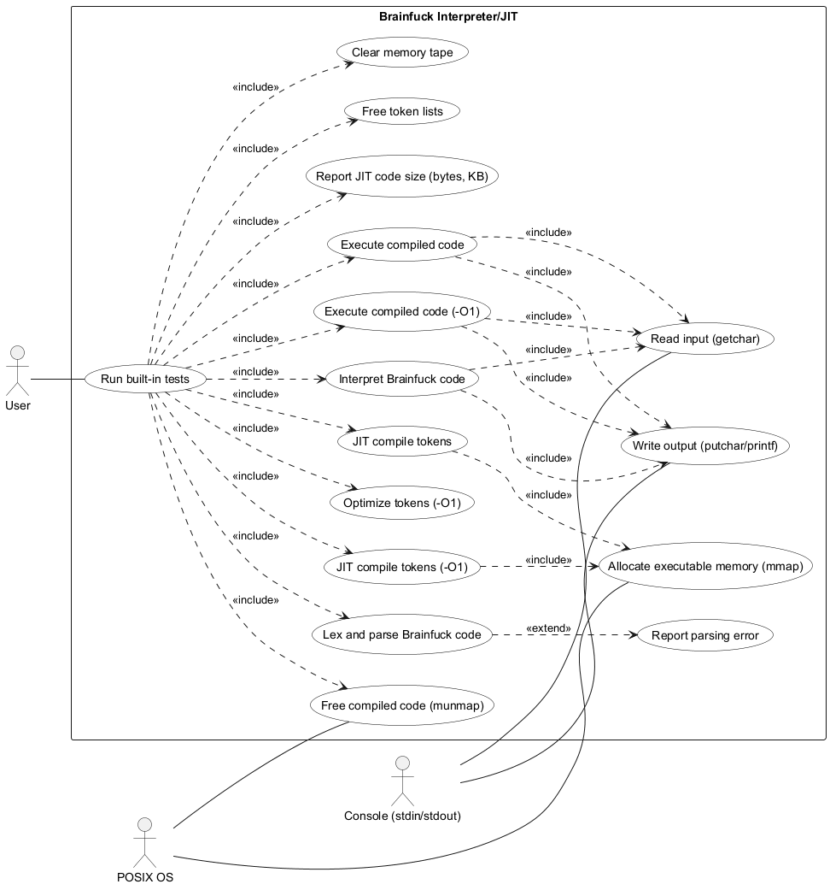
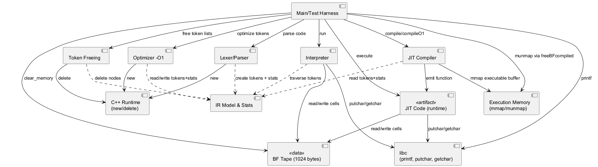
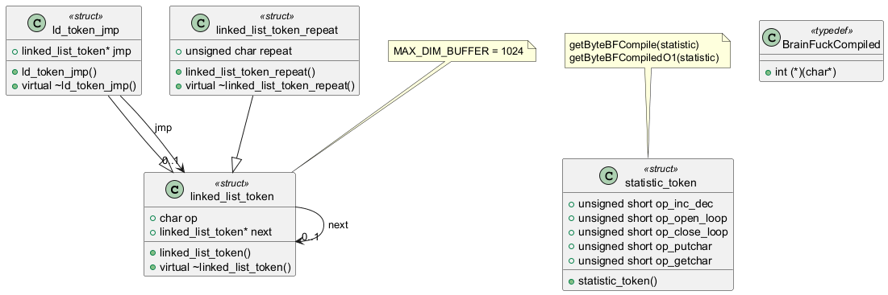
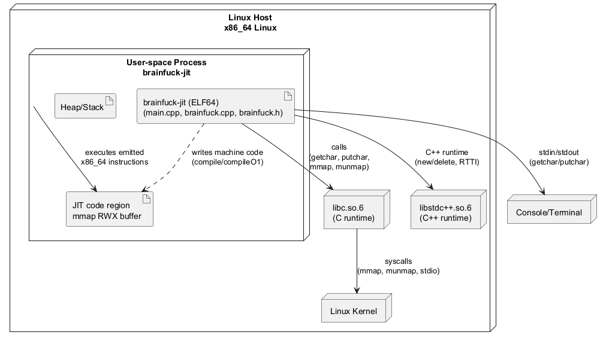

 

% 1 — System Overview
# SECTION 1 — System Overview

This repository implements a compact Brainfuck execution engine in C++ that supports both direct interpretation and just-in-time (JIT) native code generation for x86-64 Linux. The system parses Brainfuck source code into a linked-list intermediate representation, executes it via an interpreter with a fixed-size circular tape, and can alternatively compile it to executable machine code at runtime using mmap. An optional -O1 optimization pass reduces sequences of repeated operations prior to JIT compilation. A small test harness exercises interpretation, JIT, and optimized JIT on sample Brainfuck programs and reports generated code sizes.

The scope covers the full program as delivered in this repository: a monolithic, single-process console application. It consists of a minimal public API for parsing, interpreting, optimizing, compiling, and freeing resources, plus a main program that demonstrates and validates behavior. No external services or libraries beyond the standard C/C++ runtime and POSIX system calls are required. The JIT compiler emits raw x86-64 instructions and relies on Linux-specific memory management (mmap with PROT_EXEC).

Functionally, the system provides: parsing and validation of Brainfuck tokens with loop matching; a byte-oriented interpreter operating over a 1024-byte circular memory tape; direct I/O through getchar and putchar; JIT code generation that translates Brainfuck tokens to native x86-64 instructions using the System V AMD64 ABI; an optimization pass that collapses consecutive +, -, <, >, ., , operations; and resource management that unmaps generated code and frees intermediate data structures. Behavior and implementation reflect the codebase precisely: the interpreter correctly assigns input to the tape, pointer moves wrap at tape boundaries, and bracket pairs are matched during parsing. The JIT compilers generate functional code for all operations, but they currently call getchar without storing its return value back into the tape, which differs from the interpreter and is observable in input-consuming programs. The parser rejects unmatched closing brackets (returning false) but does not detect leftover unmatched opening brackets at end-of-input; non-Brainfuck characters are ignored.

The system’s architecture is intentionally simple. A set of token node types (plain, jump-paired, and repeat-collapsed) model the program and enable both interpreter traversal and code generation. Statistics collected during parsing or optimization feed size estimators to pre-allocate executable memory for the JIT. The JIT emits a short function prolog/epilog, uses RDI as the tape pointer (preserved across libc calls by saving/restoring via RBX), emits cmp/je and jmp rel32 sequences to implement loops, and calls C library I/O functions through absolute addresses. The main program orchestrates end-to-end flow: clear tape, parse and interpret, compile and run JIT, optimize and run optimized JIT, print sizes, and free all resources.

Repository contents and responsibilities are as follows.

| File | Role and key contents |
|------|------------------------|
| brainfuck.h | Public API and data types. Defines MAX_DIM_BUFFER=1024; token node types linked_list_token, ld_token_jmp (paired [ and ]), linked_list_token_repeat (repeat counts); statistic_token; byte-size estimators getByteBFCompile and getByteBFCompiledO1; BrainFuckCompiled function type; declarations of parsing (lexing_parsing), interpretation (interpeter), optimization (optimizeListTokenO1), compilation (compile, compileO1), memory management (freeListToken, freeBFcompiled, clear_memory), and utility addNext. |
| brainfuck.cpp | Full implementation. Parsing with ltrim/ftrim, tokenization, and bracket linking (lexing_parsing); interpreter over circular tape with getchar/putchar; raw x86-64 JIT (compile) and optimized JIT (compileO1) with loop patching and ABI-safe save/restore; O1 token list construction (optimizeListTokenO1); executable memory allocation via mmap and release via munmap; token list cleanup; tape clearing. |
| main.cpp | Console test harness. Runs three embedded Brainfuck programs through interpreter, JIT, and optimized JIT; prints outputs and generated code sizes; frees all resources. |

Public API surface (from brainfuck.h) available to integrators includes: addNext; lexing_parsing; interpeter; compile; compileO1; freeListToken; optimizeListTokenO1; clear_memory; freeBFcompiled; plus the BrainFuckCompiled function type and size-estimation macros. The program targets 64-bit Linux with the System V ABI due to its explicit instruction encodings and use of mmap with PROT_EXEC.

% 2 — Architectural Context
## 2. Architectural Context

This section describes the external systems, interfaces, and data sources that the Brainfuck interpreter/JIT interacts with, as evidenced by the codebase. It also identifies the actors observable in the implementation. The intent is to make the runtime context explicit and verifiable by reading the code, without introducing elements not present in the implementation.

### External Systems

- C standard I/O runtime (stdio): printf, putchar, getchar (main.cpp, brainfuck.cpp include <cstdio> and use these functions).
- POSIX memory management and OS services: mmap and munmap with PROT_EXEC, PROT_READ, PROT_WRITE, MAP_PRIVATE, MAP_ANONYMOUS (brainfuck.cpp includes <sys/mman.h> and calls mmap/munmap for JIT).
- C++ runtime and standard library: operator new/delete for dynamic allocations; std::string, std::vector and RTTI/dynamic_cast usage (brainfuck.cpp includes <string>, <vector>).
- Target architecture and ABI: x86-64 (System V AMD64 calling convention) assumed by emitted machine code bytes and register usage (e.g., rbp, rdi, rbx, rax) in compile and compileO1.

### APIs / Interfaces

- Public header interface (brainfuck.h):
  - addNext(linked_list_token*&, char): Internal list builder used by lexing_parsing; exposed in header but used within the module.
  - lexing_parsing(const char*, linked_list_token*&, statistic_token&): Converts Brainfuck source into a linked list of tokens, validates matching loops, and collects instruction counts.
  - interpeter(linked_list_token*, char*): Interprets token list against a 1024-byte tape (MAX_DIM_BUFFER), performing I/O via putchar/getchar.
  - compile(linked_list_token*, const statistic_token&): JIT-compiles tokens to x86-64 machine code using mmap; returns BrainFuckCompiled.
  - compileO1(linked_list_token*, const statistic_token&): JIT-compiles an -O1–optimized token stream (with repeats collapsed) to x86-64 machine code.
  - optimizeListTokenO1(linked_list_token*, linked_list_token*&, statistic_token&): Produces an optimized token list where repeated operations are collapsed and loop jump links preserved; updates statistics accordingly.
  - freeListToken(linked_list_token*&): Frees the entire token list (including ld_token_jmp and linked_list_token_repeat nodes).
  - clear_memory(char[MAX_DIM_BUFFER]): Zeroes the Brainfuck tape.
  - freeBFcompiled(BrainFuckCompiled, const statistic_token&): Releases JIT code memory via munmap; uses statistics to compute the original allocation size.
  - Typedef BrainFuckCompiled: int (*)(char*), the callable JIT entry accepting the tape pointer and returning int.
  - Macros:
    - MAX_DIM_BUFFER (1024): Tape size.
    - getByteBFCompile(statistic_token): Size calculation for mmap in compile.
    - getByteBFCompiledO1(statistic_token): Size calculation for mmap in compileO1.

- Internal helpers (not part of external API, but visible in code):
  - ltrim(std::string&), ftrim(std::string&): Whitespace trimming for lexing.
  - Preprocessor macros addStatistic and AddNodeO1: Used during optimization to update statistics and build collapsed token lists.

- Consumption of external APIs:
  - stdio: printf in main.cpp for test output; putchar and getchar called directly from interpreter and embedded in emitted machine code.
  - POSIX: mmap/munmap for executable memory management.
  - C++: dynamic_cast relies on polymorphic base (virtual destructors present).

### Data Sources

- Brainfuck program strings defined in main.cpp (code, code2, code3), passed to lexing_parsing.
- Standard input stream (stdin) consumed by the Brainfuck ',' instruction via getchar.
- No files or databases are read or written; the Brainfuck tape is an in-process buffer (char ptr[MAX_DIM_BUFFER]) initialized and reused across tests.

### Users / Actors

- Main executable (main.cpp) acting as the client of the brainfuck.h API: constructs tape, invokes lexing, interpretation, JIT compilation, and optimization.
- Console/terminal via standard streams: provides input characters to getchar and displays output produced by putchar during interpretation and JIT execution.
- Operating system kernel and runtime environment: supplies executable memory pages via mmap and enforces the x86-64 process ABI under which the emitted code executes.

% 2.1 — Architectural Context – Use Case Diagram
## Section 2.1 — Architectural Context – Use Case Diagram

This section presents the external context of the Brainfuck Interpreter/JIT as implemented in the provided codebase. It identifies the primary and secondary actors interacting with the system and the top-level use cases executed during program runtime. All use cases are derived strictly from the observed source code paths in main.cpp, brainfuck.cpp, and brainfuck.h, without introducing capabilities not present in the implementation.

Figure: Use Case diagram for Architectural Context — Brainfuck Interpreter/JIT

% 3 — Containers
## 3. Containers

This section identifies the runtime containers and external dependencies involved when executing the Brainfuck interpreter/JIT contained in this repository. The codebase builds a single native command-line executable that parses Brainfuck code, interprets it, optionally compiles it to x86-64 machine code into an executable memory region via mmap, executes it, and writes results to standard output. There are no databases, message brokers, or networked services; the application interacts only with the local C/C++ runtime, the OS kernel (for memory mapping), and the user terminal via standard I/O.

| Container | Responsibility | Technology | Communication |
|---|---|---|---|
| Brainfuck CLI (native executable) | Parses Brainfuck source into a token linked list (lexing_parsing), interprets programs (interpeter), compiles to x86-64 machine code into RWX pages (compile, compileO1), runs compiled code via function pointers, and frees JIT memory (freeBFcompiled). Provides test harness invoking three sample programs (main, test). Manages 1024-byte circular data tape (clear_memory, MAX_DIM_BUFFER). | C++ (brainfuck.cpp, brainfuck.h, main.cpp), x86-64 JIT code emission, STL (std::string, std::vector), RTTI/dynamic_cast, POSIX mmap/munmap, printf/putchar/getchar. | In-process calls; standard I/O via C stdio (printf, putchar, getchar) to stdin/stdout; POSIX memory-mapping syscalls via mmap/munmap for executable pages. |
| C runtime and C++ standard library | Provides I/O primitives and runtime support used by the app, including printf/putchar/getchar, dynamic allocation (operator new/delete), and STL containers/algorithms. | glibc and libstdc++ (typical GNU toolchain targets). | C ABI function calls from the executable to libc/libstdc++; stdio stream buffering for stdin/stdout. |
| Operating System Kernel | Supplies process, memory, and protection services required for JIT execution, specifically creating and freeing executable memory regions. | Linux x86-64 kernel facilities accessed via sys/mman.h (PROT_READ|PROT_WRITE|PROT_EXEC, MAP_PRIVATE|MAP_ANONYMOUS). | Syscalls mmap and munmap invoked by the process; standard file descriptors for stdin/stdout handled by the kernel. |
| User Terminal/Console | Acts as the interactive endpoint for Brainfuck program input and output. Displays results and optionally provides input bytes to the program. | TTY/PTY terminal (shell/terminal emulator). | Standard streams: stdin consumed via getchar; stdout produced via putchar/printf. |

This containerization reflects the actual runtime boundaries and explicit dependencies present in the code. There are no additional services, databases, or network interactions beyond those listed.

% 3.1 — Architecture Overview – Component Diagram
# Section 3.1 — Architecture Overview – Component Diagram

This section provides a concise, implementation-accurate overview of the system’s main components and their dependencies as realized in the codebase. It explains how source code is organized into runtime responsibilities (parsing, interpretation, optimization, JIT compilation, memory management, and test orchestration), how data flows between them (token IR, statistics, and the Brainfuck tape), and how the program interacts with external dependencies (C library I/O, OS virtual memory, and the C++ runtime). The diagram and inventory enable validation by developers familiar with the source.

Figure 3.1 — Component Diagram (Fig-3_1-Component-Diagram.puml)

## Component Inventory (complete mapping to code)

The following table enumerates all code artifacts and assigns them to their implementing component, ensuring full traceability to the source.

| Component | Files | Types / Macros | Functions |
|---|---|---|---|
| Main/Test Harness | main.cpp | MAX_DIM_BUFFER (from header) | main; test |
| Lexer/Parser | brainfuck.cpp, brainfuck.h | — | addNext; ltrim; ftrim; lexing_parsing |
| Interpreter | brainfuck.cpp, brainfuck.h | — | interpeter |
| Optimizer -O1 | brainfuck.cpp, brainfuck.h | addStatistic (macro); AddNodeO1 (macro) | optimizeListTokenO1 |
| JIT Compiler | brainfuck.cpp, brainfuck.h | getByteBFCompile (macro); getByteBFCompiledO1 (macro); BrainFuckCompiled (typedef) | compile; compileO1 |
| Execution Memory (mmap/munmap) | brainfuck.cpp, brainfuck.h | — | freeBFcompiled (munmap); mmap usage inside compile/compileO1 |
| Token Freeing | brainfuck.cpp, brainfuck.h | — | freeListToken |
| IR Model & Stats | brainfuck.h | struct linked_list_token; struct ld_token_jmp; struct linked_list_token_repeat; struct statistic_token | ctors/dtors (inline); field initializers |
| BF Tape (1024 bytes) | brainfuck.h, brainfuck.cpp | MAX_DIM_BUFFER | clear_memory |
| External: libc | standard headers (cstdio) | — | printf (main/test); putchar/getchar (interpeter; embedded calls in JIT code) |
| External: C++ Runtime | standard C++ | — | operator new/delete (allocation in Lexer/Optimizer; deallocation in freeListToken) |
| External: OS VM | sys/mman.h, unistd.h | — | mmap/munmap (used by compile/compileO1 and freeBFcompiled) |
| Unused include | main.cpp | time.h | — |

Narrative summary

The Main/Test Harness orchestrates end-to-end execution: it clears the Brainfuck tape, invokes the Lexer/Parser to produce a linked-list IR and statistics, executes the Interpreter against the tape, compiles the IR to native code via the JIT Compiler, executes the resulting function pointer, applies the -O1 Optimizer to create a reduced IR, repeats JIT execution with the optimized IR, and finally frees both the compiled code and all IR nodes.

The Lexer/Parser constructs a singly linked list of token nodes, embedding loop jump links for matching brackets and accumulating operation counts in a statistic_token. The IR Model defines all token node types and the statistics structure. The Interpreter walks the IR to mutate the tape and perform I/O via libc. The Optimizer -O1 coalesces consecutive operations into repeat-count nodes, preserving loop jump links and recomputing statistics.

The JIT Compiler generates x86_64 machine code into an executable buffer obtained via mmap. The generated code directly calls libc putchar/getchar, reads and writes the tape through the ABI-passed pointer, and is returned to Main as a BrainFuckCompiled function pointer. freeBFcompiled later releases the code buffer via munmap. All token list memory is managed with C++ new/delete and explicitly freed by freeListToken.

This structure separates concerns cleanly: IR concerns (node shapes, jumps, and statistics), pure interpretation, IR optimization, native code generation, managed execution memory, and orchestration. The diagram and inventory correspond one-to-one with the functions, types, and macros present in the repository, enabling straightforward validation against the code.

% 4 — Components
## 4. Components

This section identifies and describes all internal components implemented within the single-process executable. It covers functions, data structures, macros, and constants, detailing their responsibilities and the concrete interactions among them as they appear in the source code. The intent is to enable validation by developers familiar with the codebase and to provide a precise map of responsibilities and dependencies inside the application.

| Component | Responsibility | Interactions |
|---|---|---|
| Driver.Main (main in main.cpp) | Entrypoint; defines three Brainfuck programs and orchestrates their execution by invoking the test harness. | Calls Driver.TestHarness.test. |
| Driver.TestHarness (test in main.cpp) | Orchestrates the end-to-end flow for a given Brainfuck program: resets memory, parses, interprets, JIT-compiles (baseline and -O1), executes, reports byte sizes, frees resources. | Calls Utilities.clear_memory; Lexer.lexing_parsing; Interpreter.interpeter; JIT.Baseline.getByteBFCompile; JIT.Baseline.compile; JIT.Memory.freeBFcompiled; Optimizer.optimizeListTokenO1; JIT.O1.getByteBFCompiledO1; JIT.O1.compileO1; JIT.Memory.freeBFcompiled; Utilities.freeListToken. Uses BrainFuckCompiled function pointers returned by compilers. |
| Core.Types.TokenBase (struct linked_list_token in brainfuck.h) | Base node of the token singly-linked list representing Brainfuck operations; provides virtual destructor for safe polymorphic deletion. | Extended by Core.Types.TokenJump and Core.Types.TokenRepeat; used by Lexer.lexing_parsing, Interpreter.interpeter, Optimizer.optimizeListTokenO1, Utilities.freeListToken, JIT compilers. |
| Core.Types.TokenJump (struct ld_token_jmp in brainfuck.h) | Token node for loop brackets ‘[’ and ‘]’; carries a jmp pointer linking matching brackets for fast traversal. | Created in Lexer.addNext; jmp linked in Lexer.lexing_parsing and Optimizer.optimizeListTokenO1; read in Interpreter.interpeter and both JIT compilers via dynamic_cast to resolve loop control. |
| Core.Types.TokenRepeat (struct linked_list_token_repeat in brainfuck.h) | Optimized token node that adds a repeat count for run-length encoding of operations <, >, +, -, ., ,. | Created in Optimizer.optimizeListTokenO1; consumed by JIT.O1.compileO1; managed by Utilities.freeListToken. |
| Core.Types.Statistic (struct statistic_token in brainfuck.h) | Accumulates operation counts used for code-size estimation and allocation of JIT buffers. | Updated in Lexer.lexing_parsing and Optimizer.optimizeListTokenO1 (via Optimizer.addStatistic macro and direct increments); read by JIT.Baseline.getByteBFCompile and JIT.O1.getByteBFCompiledO1; passed to JIT.Memory.freeBFcompiled. |
| Core.Constants (MAX_DIM_BUFFER in brainfuck.h) | Defines the size of the Brainfuck memory tape (1024 bytes). | Used by Interpreter.interpeter and Utilities.clear_memory; influences pointer wrap-around in Interpreter. |
| Core.ABI (typedef BrainFuckCompiled in brainfuck.h) | Defines the function pointer type for JIT-compiled code with signature int(char*). | Return type of JIT.Baseline.compile and JIT.O1.compileO1; accepted by JIT.Memory.freeBFcompiled; invoked in Driver.TestHarness. |
| Lexer.addNext (addNext in brainfuck.cpp) | Appends a new token node to the linked list, creating either a generic token or a bracket token with initialized jump pointer. | Called exclusively by Lexer.lexing_parsing; allocates linked_list_token or ld_token_jmp; updates next linkage. |
| Lexer.ltrim (ltrim in brainfuck.cpp) | Trims leading whitespace from a string before lexing. | Called by Lexer.lexing_parsing. |
| Lexer.ftrim (ftrim in brainfuck.cpp) | Trims trailing whitespace from a string before lexing. | Called by Lexer.lexing_parsing. |
| Lexer.lexing_parsing (lexing_parsing in brainfuck.cpp) | Converts source code into a linked list of tokens; matches brackets with a stack; updates statistics by operation class; ignores non-Brainfuck characters. | Calls Lexer.ltrim, Lexer.ftrim, Lexer.addNext; uses std::vector for bracket matching; updates Core.Types.Statistic; sets ld_token_jmp::jmp for matched brackets; returns false on unmatched ‘]’. Produces the head pointer to the token list. |
| Interpreter.interpeter (interpeter in brainfuck.cpp) | Executes the token list on a circular 1024-byte tape; implements Brainfuck semantics including wrap-around, I/O, and loop control. | Reads Core.Constants.MAX_DIM_BUFFER; uses putchar and getchar from C stdio; follows ld_token_jmp::jmp on ‘[’ and ‘]’ via dynamic_cast; called by Driver.TestHarness. |
| Optimizer.addStatistic (macro in brainfuck.cpp) | Increments the appropriate field in Core.Types.Statistic based on an operation code. | Used in Optimizer.optimizeListTokenO1 to keep statistics consistent with the optimized stream. |
| Optimizer.AddNodeO1 (macro in brainfuck.cpp) | Macro intended to append or coalesce repeated operations into a linked_list_token_repeat sequence. | Defined but not used; an invocation exists commented out in Optimizer.optimizeListTokenO1. Retained as an alternative formulation of the implemented logic. |
| Optimizer.optimizeListTokenO1 (optimizeListTokenO1 in brainfuck.cpp) | Transforms the raw token list into an optimized list by coalescing consecutive <, >, +, -, ., , into linked_list_token_repeat nodes and rebuilding bracket jump links; computes new statistics for the optimized stream. | Consumes Core.Types.TokenBase/TokenJump list; produces a list mixing TokenRepeat and TokenJump nodes; uses a vector as a stack for matching brackets; updates Core.Types.Statistic via Optimizer.addStatistic and direct increments; called by Driver.TestHarness. |
| JIT.Baseline.getByteBFCompile (macro in brainfuck.h) | Computes the exact byte size needed for the baseline JIT code buffer from statistics. | Used by JIT.Baseline.compile to size mmap; logged by Driver.TestHarness; also used by JIT.Memory.freeBFcompiled to determine unmapping size. |
| JIT.Baseline.compile (compile in brainfuck.cpp) | Emits x86-64 machine code for the unoptimized token list; allocates RX memory with mmap; calls libc putchar/getchar via absolute addresses; implements loop control via relative jumps and backpatching. | Calls mmap (PROT_READ|PROT_WRITE|PROT_EXEC, MAP_PRIVATE|MAP_ANONYMOUS); uses JIT.Baseline.getByteBFCompile; references putchar/getchar addresses; manages loop stack with std::vector; returns Core.ABI.BrainFuckCompiled; called by Driver.TestHarness; paired with JIT.Memory.freeBFcompiled. |
| JIT.O1.getByteBFCompiledO1 (macro in brainfuck.h) | Computes the exact byte size needed for the -O1 JIT code buffer from optimized statistics. | Used by JIT.O1.compileO1 to size mmap; logged by Driver.TestHarness. |
| JIT.O1.compileO1 (compileO1 in brainfuck.cpp) | Emits x86-64 machine code consuming TokenRepeat nodes to fold repeated operations into immediate operands; allocates RX memory; implements loop control with relative jumps and backpatching. | Calls mmap (PROT_READ|PROT_WRITE|PROT_EXEC, MAP_PRIVATE|MAP_ANONYMOUS); uses JIT.O1.getByteBFCompiledO1; references putchar/getchar addresses; expects linked_list_token_repeat for repeated ops; returns Core.ABI.BrainFuckCompiled; called by Driver.TestHarness; paired with JIT.Memory.freeBFcompiled. |
| JIT.Memory.freeBFcompiled (freeBFcompiled in brainfuck.cpp) | Releases the JIT-compiled code buffer using munmap with a size derived from statistics. | Calls munmap; size computed via JIT.Baseline.getByteBFCompile with the provided statistics; called by Driver.TestHarness for both baseline and -O1 compiled functions. |
| Utilities.clear_memory (clear_memory in brainfuck.cpp) | Resets the Brainfuck data tape to zeros prior to each run. | Called by Driver.TestHarness before interpretation and JIT execution; uses Core.Constants.MAX_DIM_BUFFER. |
| Utilities.freeListToken (freeListToken in brainfuck.cpp) | Iteratively deletes a token list (including derived node types) to free all heap-allocated nodes. | Called by Driver.TestHarness for both original and optimized token lists; relies on virtual destructors in Core.Types to delete derived instances safely. |

% 5 — Code-Level View
# Section 5 — Code-Level View

This section describes the concrete mapping between the architecture and the source code artifacts present in the repository. It identifies the executable entry points, details every module, class/struct, constant, macro, and function, and explains how they interact at runtime. The content is derived strictly from the provided source code to ensure validation by the development team.

## 5.1 Codebase Organization and Modules

The repository contains three translation units. Their roles and the symbols they define or declare are summarized below.

| File | Purpose | Key Symbols (definitions unless noted) |
|---|---|---|
| brainfuck.h | Public API, data model, constants/macros, and function declarations shared across units | Constants: MAX_DIM_BUFFER; Macros: getByteBFCompile, getByteBFCompiledO1; Typedef: BrainFuckCompiled; Structs: linked_list_token, ld_token_jmp, linked_list_token_repeat, statistic_token; Declarations: addNext, lexing_parsing, interpeter, compile, compileO1, freeListToken, optimizeListTokenO1, clear_memory, freeBFcompiled |
| brainfuck.cpp | Implementation of the Brainfuck lexer/parser, interpreter, optimizer (-O1), and two JIT compilers; memory management utilities | Functions: addNext, lexing_parsing, interpeter, freeBFcompiled, freeListToken, compile, optimizeListTokenO1, compileO1, clear_memory; File‑local helpers: ltrim, ftrim; File‑local macros: addStatistic, AddNodeO1 |
| main.cpp | Test harness and demonstration of interpreter and JIT execution paths | Functions: test, main |

The system implements a single-process, in-memory pipeline: Brainfuck source is tokenized and parsed into an internal linked-list representation, optionally optimized, then either interpreted or JIT-compiled to native x86‑64 code and executed against a preallocated byte buffer.

## 5.2 Data Model and Types

The header defines a minimal token IR using a singly linked list. Loop semantics are realized via explicit cross-links between matching bracket nodes.

| Struct | Fields | Purpose and Usage |
|---|---|---|
| linked_list_token | char op; linked_list_token* next; virtual ~linked_list_token() | Base token node containing the operator character and a pointer to the next token. Serves as polymorphic root enabling dynamic_cast in control flow and JIT generation. |
| ld_token_jmp (derived) | inherited op,next; linked_list_token* jmp; virtual ~ld_token_jmp() | Loop control token used when op is '[' or ']'. The jmp pointer is a bi-directional link to its matching bracket node to enable efficient jumping in interpreter and patching in JIT. |
| linked_list_token_repeat (derived) | inherited op,next; unsigned char repeat; virtual ~linked_list_token_repeat() | Optimized token used by -O1 optimizer for collapsing consecutive identical operations '<', '>', '+', '-', '.', ','. The repeat field stores the count. |
| statistic_token | unsigned short op_inc_dec; unsigned short op_open_loop, op_close_loop; unsigned short op_putchar; unsigned short op_getchar | Operation counts accumulated during lexing/parsing and re-accumulated during optimization. These counts are used to pre-size mmap regions for JIT output. |

Supporting API types and constants are as follows.

| Name | Definition | Purpose |
|---|---|---|
| MAX_DIM_BUFFER | 1024 | Size of the execution tape (byte buffer) used by the interpreter and JIT functions. |
| BrainFuckCompiled | typedef int (*BrainFuckCompiled)(char*) | Native function signature for JIT-compiled programs. The single argument is a pointer to the start of the execution tape. |
| getByteBFCompile(statistic) | macro: 11 + op_inc_dec*3 + op_open_loop*9 + op_close_loop*5 + op_putchar*20 + op_getchar*20 | Computes code size in bytes for the non-optimized JIT, used to size the mmap region. |
| getByteBFCompiledO1(statistic) | macro: 11 + op_inc_dec*4 + op_open_loop*9 + op_close_loop*5 + op_putchar*20 + op_getchar*20 | Computes code size in bytes for the -O1 JIT, accounting for immediate forms using repeat. |

## 5.3 Functions and Responsibilities

The following tables enumerate all functions, their locations, responsibilities, callers, and immediate dependencies. This mapping is exhaustive with respect to the provided code.

### 5.3.1 brainfuck.cpp

| Function Signature | Responsibility | Called By | Calls/Uses |
|---|---|---|---|
| void addNext(linked_list_token*& father, char op) | Allocates and appends a new token node to a construction cursor. Creates ld_token_jmp for '['/']' with jmp initialized to null; otherwise creates a plain linked_list_token. Updates father to point to the newly appended node. | lexing_parsing | new, dynamic_cast (for type init) |
| static inline void ltrim(string& s) | Trims leading whitespace from code string during lexing. | lexing_parsing | isspace |
| static inline void ftrim(string& s) | Trims trailing whitespace from code string during lexing. | lexing_parsing | isspace |
| bool lexing_parsing(const char* code, linked_list_token*& token, statistic_token& statistic) | Converts Brainfuck source into a linked list of tokens. Increments statistics. For '[' and ']', creates ld_token_jmp nodes and threads jmp pointers in both directions using a vector stack. Ignores non‑BF characters. Returns false on unmatched ']'. | test (in main.cpp) | addNext, dynamic_cast, std::vector |
| void interpeter(linked_list_token* token, char* ptr) | Executes the token list directly. Supports circular tape wrap‑around. Implements loop control via jmp pointers on ld_token_jmp nodes. Performs I/O via putchar/getchar. | test (in main.cpp) | putchar, getchar, dynamic_cast |
| void freeBFcompiled(BrainFuckCompiled fn, const statistic_token& s) | Releases the mmap’ed JIT code region by calling munmap with size computed by getByteBFCompile. | test (in main.cpp) | munmap, getByteBFCompile |
| void freeListToken(linked_list_token*& token) | Deletes the entire linked list of tokens, one node at a time, relying on virtual destructors; jmp pointers are not separately deleted to avoid double free. | test (in main.cpp) | delete |
| BrainFuckCompiled compile(linked_list_token* token, const statistic_token& s) | JIT compiles the non‑optimized token list to x86‑64 machine code into an RWX mmap’ed buffer sized by getByteBFCompile. Emits prolog/epilog, pointer moves, cell inc/dec, I/O calls via movabs to rax and call rax, and loop je/jmp with backpatching using jmp threading. Returns a callable function pointer. | test (in main.cpp) | mmap, putchar, getchar, dynamic_cast |
| void optimizeListTokenO1(linked_list_token* source, linked_list_token*& dest, statistic_token& statistic) | Builds a new optimized token list into dest by collapsing runs of '<', '>', '+', '-', '.', ',' into linked_list_token_repeat nodes with repeat counts and re‑establishing jmp threading for loops. Recomputes statistics accordingly. | test (in main.cpp) | new, dynamic_cast, std::vector |
| BrainFuckCompiled compileO1(linked_list_token* token, const statistic_token& s) | JIT compiles the optimized token list using immediate forms that apply repeat counts in a single instruction when possible. Emits loop code and I/O calls repeated according to repeat. Sizes and allocates with getByteBFCompiledO1. Returns a callable function pointer. | test (in main.cpp) | mmap, putchar, getchar, dynamic_cast |
| void clear_memory(char ptr[MAX_DIM_BUFFER]) | Fills the execution tape with zeros prior to execution. | test (in main.cpp) | none |

Notes on file-local macros in brainfuck.cpp: addStatistic accumulates counts per operator into a statistic_token. AddNodeO1 is a helper macro for O(1)-style list building by coalescing repeats; in the current code path, its usage is commented out and its logic is inlined in optimizeListTokenO1.

### 5.3.2 main.cpp

| Function Signature | Responsibility | Called By | Calls/Uses |
|---|---|---|---|
| static void test(const char* code, char* ptr) | End-to-end demonstration for a single Brainfuck program: prints the source, parses to tokens, interprets it, JIT compiles and runs it, optimizes to -O1, JIT compiles and runs the optimized version, and finally frees all resources. Reports computed JIT code sizes. | main | lexing_parsing, interpeter, getByteBFCompile, compile, freeBFcompiled, optimizeListTokenO1, getByteBFCompiledO1, compileO1, freeListToken, clear_memory |
| int main(int argc, char** argv) | Program entry point. Constructs three Brainfuck programs and invokes the test harness for each using a shared MAX_DIM_BUFFER-sized tape. | OS | test |

## 5.4 Control and Data Flow at Code Level

The execution pipeline is realized as a sequence of function calls over well-defined data structures.

The input Brainfuck source arrives as const char* into lexing_parsing. The function constructs a polymorphic linked list of token nodes, with ld_token_jmp nodes bridging loop pairs using their jmp pointers. The statistic_token is populated concurrently to allow accurate estimation of the JIT buffer sizes.

The interpreter consumes this linked list directly. It maintains a char* tape pointer into a statically sized buffer of length MAX_DIM_BUFFER. Pointer movements wrap around at the boundaries by resetting the pointer to the opposite end when increment or decrement crosses the limits. For loop control, encountering '[' on a zero cell causes a jump to the matching ']' node via token->jmp, and encountering ']' unconditionally jumps back to the matching '[' via token->jmp, suppressing the normal token->next advancement for that step.

The optimizer optimizeListTokenO1 builds a distinct token list by coalescing consecutive identical operations into linked_list_token_repeat nodes while preserving loop structure with ld_token_jmp nodes and updated jmp threading. It recomputes a statistic_token aligned to the optimized list.

The non-optimized JIT compiler compile and the optimized JIT compiler compileO1 each traverse their respective token lists to emit x86‑64 machine code into an RWX buffer obtained via mmap. They emit a function prolog (push rbp; push rbx; mov rbp, rsp; mov rdi, rbx), treat rdi as the live tape pointer, and manage loop control by emitting conditional jumps and backpatching displacement fields using the previously established jmp threading. I/O is performed by materializing absolute function addresses for putchar and getchar into rax (movabs imm64, rax) and calling through rax. Both append an epilog (pop rbx; pop rbp; ret) and return the buffer cast to BrainFuckCompiled. The caller invokes the resulting function with the tape pointer.

The test harness clears the tape between runs, executes the interpreter first, then the non-optimized JIT, and finally the optimized JIT. It frees token lists via freeListToken and unmaps JIT buffers via freeBFcompiled.

## 5.5 Entry Points

The program-level entry point is main in main.cpp. From a library/API perspective, the operational entry points are lexing_parsing for IR construction, interpeter for interpretation, compile and compileO1 for JIT compilation returning a BrainFuckCompiled function pointer, clear_memory for tape initialization, optimizeListTokenO1 for IR optimization, freeBFcompiled for unmapping compiled code buffers, and freeListToken for reclaiming the IR.

The JIT-generated functions themselves conform to the BrainFuckCompiled signature and are directly invoked by test with a pointer to the tape.

## 5.6 Recognizable Architectural and Design Patterns

The code implements a straightforward Interpreter pattern over a simple token-based IR. It also incorporates a JIT Compiler pattern, emitting native x86‑64 machine code using a linear scan over the IR and relying on precomputed jmp threading for loop backpatching. The optimizer constitutes a peephole-style pass that aggregates consecutive identical operations into a compact form, which the optimized JIT lowers into immediate instructions.

The overall control follows a pipeline: Lex/Parse → IR → Optional Optimization → Execution (Interpreter or JIT).

## 5.7 External Dependencies and Platform Characteristics

The implementation depends on the C standard I/O functions putchar and getchar for Brainfuck I/O and on POSIX memory management via mmap and munmap with PROT_READ | PROT_WRITE | PROT_EXEC and MAP_PRIVATE | MAP_ANONYMOUS for code generation. It targets x86‑64 calling conventions, using registers rdi as the tape pointer, rbx as a saved copy during I/O, rax as the call target holder, and standard prolog/epilog sequences. Dynamic casting relies on the polymorphic base type linked_list_token with a virtual destructor to support RTTI.

## 5.8 Code-Level Observations Relevant to Validation

The lexing_parsing function returns false upon an unmatched closing bracket but does not explicitly fail if opening brackets remain unmatched at end of input; in that case, it returns true with dangling loop stack entries not reconciled. The freeBFcompiled function always uses getByteBFCompile to compute the allocation size for munmap; when freeing a buffer produced by compileO1, the caller provides the -O1 statistic, yet freeBFcompiled still uses the non-optimized sizing macro, leading to a size mismatch relative to the actual allocation from getByteBFCompiledO1. The compileO1 implementation decrements the repeat counter in linked_list_token_repeat nodes for '.' and ',' while emitting repeated call sequences, which mutates the IR; this is tolerable in the current flow because the IR is not reused after compilation and is subsequently freed.

These observations reflect the actual code paths and are provided to support code-level validation and alignment with the intended architecture.

% 5.1 — Class Diagram
# SECTION 5.1 — Class Diagram

This section presents the complete class diagram of the Brainfuck interpreter/JIT core as implemented in the provided codebase. It models the token linked-list hierarchy used for parsing and interpretation, the jump linkage for loops, the optimization repeat counter, and the statistics tracked for code generation sizing. The diagram strictly reflects the structs, their attributes, constructors, destructors, inheritance, and pointer-based associations as defined in brainfuck.h and used throughout the implementation.

Figure 5.1 — Class diagram (file: figure-5-1-class-diagram.puml)

The linked_list_token struct is the base node for the token stream and contains the opcode and a pointer to the next node, forming a singly linked list. The ld_token_jmp struct extends the base to support loop control by maintaining a jump pointer to the matching bracket token; this is used by both the interpreter and the JIT to implement Brainfuck loops. The linked_list_token_repeat struct extends the base with a repeat counter used exclusively by the -O1 optimizer to aggregate consecutive identical operations for more compact and efficient code generation. The statistic_token struct accounts for operation categories encountered during lexing/parsing or optimization and is used to size the executable buffers via the getByteBFCompile and getByteBFCompiledO1 macros. The BrainFuckCompiled typedef denotes the JIT-compiled function signature that executes over a Brainfuck memory buffer.

% 6 — Cross-Cutting Concerns
## 6. Cross-Cutting Concerns

This section summarizes architectural aspects that cut across modules and functions in the codebase. It highlights how the implementation addresses (or omits) concerns such as security, logging, configuration, error handling, testing, and monitoring. Each concern is grounded in concrete evidence from the repository to enable validation by the development team.

| Concern | Evidence from code | Description |
|---|---|---|
| Security – memory execution and safety | brainfuck.cpp: compile(), compileO1() use mmap(NULL, size, PROT_READ | PROT_WRITE | PROT_EXEC, MAP_PRIVATE | MAP_ANONYMOUS, -1, 0); JIT emits raw x86-64 instructions; emitted code for pointer movement lacks bounds checks; interpreter wraps pointer, JIT does not. | The JIT allocates RWX memory (simultaneous write and execute), increasing attack surface. In emitted code, pointer increments/decrements (e.g., addq/subq on rdi) are unconstrained; unlike interpeter(), which wraps between first_address and last_address, JIT code can walk beyond the 1024-byte buffer, causing out-of-bounds reads/writes or crashes. Calls to putchar/getchar are via absolute addresses loaded into rax. No sandboxing or W^X policy. |
| Security – authentication and authorization | Absent across all files; no references to credentials, users, roles, PAM/ACLs, or auth libraries. | Not applicable in this standalone CLI utility. There is no concept of identity, roles, or protected resources in scope. |
| Security – encryption and data protection | Absent across all files; no crypto headers, TLS, or key handling. | Not applicable. The program processes in-memory Brainfuck code and uses stdin/stdout without confidentiality guarantees. |
| Logging and diagnostics | main.cpp: test() uses printf to emit headings and results; prints code-size metrics; no logging library. | Ad hoc console output serves as basic diagnostics. There is no structured logging, levels, sinks, or correlation IDs. Output is suitable for local runs but not for production-grade observability. |
| Configuration management | brainfuck.h: #define MAX_DIM_BUFFER 1024; code-size macros getByteBFCompile and getByteBFCompiledO1; main.cpp ignores argc/argv and embeds three program strings. | Configuration is compile-time only. Buffer size and code-size estimates are fixed via macros. There is no external configuration (env/CLI/config files). Changing behavior requires recompilation. |
| Error handling | brainfuck.cpp: lexing_parsing() returns false only on unmatched ']' but does not fail when '[' remains unmatched at end; compile()/compileO1() do not check mmap() return value; new allocations unchecked; optimizeListTokenO1() assumes balanced loops; main.cpp continues to optimize even if lexing fails; if(fn != NULL) guards execution. | Error handling is minimal and inconsistent. Some malformed inputs are not detected (e.g., dangling '['), allocation failures are unchecked, and JIT size assumptions rely on statistics matching emitted bytes. Potential undefined behavior can occur if earlier steps fail but later steps proceed. |
| Testing | main.cpp: test() runs three embedded Brainfuck programs; uses printf to compare interpreter vs JIT outputs; includes time.h but does not measure time. | The code includes manual smoke tests only. There are no assertions, fixtures, or automated unit/integration tests. Behavior verification is by human inspection of console output. |
| Monitoring and metrics | brainfuck.h/statistic_token; brainfuck.cpp: statistic_token updated during lexing and optimization; main.cpp prints “N Byte Code” and “-O1 N Byte Code”. | An internal counter tracks operation frequencies to size JIT buffers and report code size. There is no runtime health, latency, or error-rate telemetry, and no external monitoring integration. |
| Resource management | brainfuck.cpp: compile()/compileO1() allocate code via mmap(); freeBFcompiled() unmaps using munmap(); freeListToken() deletes token lists; clear_memory() zeroes buffer. | Manual memory management is explicit. Correctness depends on statistic_token accurately predicting emitted byte length; otherwise munmap() may unmap the wrong size. There is no RAII wrapper; failures on mmap/new are not handled; potential misuse if later code is invoked after earlier steps fail. |
| Portability | Includes <unistd.h>, <sys/mman.h>; emits System V AMD64 calling convention and x86-64 opcodes; uses reinterpret_cast<uint64_t> for function addresses. | The JIT is Linux/POSIX and x86-64 specific. It will not work on Windows without POSIX/mmap equivalents, nor on non-x86 architectures. Endianness and ABI are assumed; no portability abstractions are present. |
| Input and I/O behavior | Interpreter uses getchar/putchar; lexing_parsing() trims whitespace with ltrim/ftrim and ignores non-instruction characters; ',' stores raw getchar() result into the tape. | Input is unbuffered and blocking. Non-Brainfuck characters are ignored rather than rejected. No encoding/locale handling; characters are treated as bytes. |

% 7 — Quality Attributes and Rationale
## 7. Quality Attributes and Rationale

This section analyzes the observable quality characteristics of the Brainfuck interpreter/JIT compiler as implemented in the provided codebase. Each attribute is grounded in explicit code structures, functions, macros, control flow, or constants. The rationale explains how the implementation supports (or undermines) the attribute.

| Quality Attribute | Evidence | Rationale |
|---|---|---|
| Performance (throughput/latency) | JIT code generation in compile and compileO1 using mmap(PROT_READ | PROT_WRITE | PROT_EXEC) and hard-coded x86-64 opcodes; optimization pass optimizeListTokenO1 aggregates repeated operations (linked_list_token_repeat::repeat); reduced code size estimation via getByteBFCompile and getByteBFCompiledO1 macros; direct calls to putchar/getchar via absolute addresses and call %rax. | The system avoids per-token interpreter overhead by emitting native code and combining consecutive operations into single instructions with immediates. This directly improves runtime performance compared to interpreting token-by-token. |
| Correctness (language semantics) | Interpreter interpeter implements tape wrap-around on '<' and '>' using first_address/last_address and MAX_DIM_BUFFER; loop matching via ld_token_jmp and vector<ld_token_jmp*>; lexing_parsing rejects unmatched ']' but does not reject unmatched '[' at end; JIT code omits pointer wrap-around and memcpy/store for ','; compile/compileO1 emit getchar call but never write the result to *ptr. | The interpreter aligns more closely to Brainfuck semantics (tape wrap-around, loop jumps). The JIT diverges: it can move RDI out of bounds (no wrap-around/bounds check) and does not store input from ',' back to memory, breaking correctness for programs using input. Unchecked unmatched '[' can lead to malformed token graphs. |
| Security (memory execution policy) | mmap called with PROT_READ | PROT_WRITE | PROT_EXEC in compile and compileO1; dynamically writes and executes code from the same region; direct function pointer addresses for putchar/getchar embedded via movabs rax, imm64. | RWX mappings violate W^X best practices and increase exploit surface. Embedding function pointers into executable pages further tightens coupling to process address space and ASLR behavior. |
| Portability | Use of sys/mman.h and unistd.h; x86-64 specific opcodes emitted (e.g., 0x55, 0x48 prefixes, 0x0f 0x84, 0xe9); register conventions (RDI, RAX, RBX) hard-coded; reliance on absolute 64-bit addresses; calling convention consistent with System V AMD64. | The JIT is architecture- and OS-specific (Linux-like x86-64). It will not run on non-x86-64 targets or systems lacking mmap with executable permissions. |
| Maintainability (readability/changeability) | Hard-coded opcode sequences with magic constants throughout compile/compileO1; pervasive dynamic_cast across multiple token subclasses; macros AddNodeO1 and addStatistic (one macro unused) intermixing logic and statistics; minimal comments and no separation between code emission and semantics. | The low-level encoding and RTTI use create tight coupling and cognitive load, making changes risky and error-prone. Lack of abstractions for instruction emission complicates debugging and extension (e.g., adding bounds checks or new optimizations). |
| Memory Management | Tokens allocated with new and freed by freeListToken; JIT buffers freed via freeBFcompiled calling munmap with sizes computed by getByteBFCompile/getByteBFCompiledO1; clear_memory zeroes the fixed tape buffer. | Memory ownership is explicit and mostly balanced. However, correctness of munmap size relies on accurate statistics; a mismatch would cause undefined behavior. |
| Testability | main.cpp test harness runs three Brainfuck programs through interpeter, compile, and compileO1; prints outputs and code sizes; no assertions or automated comparison of interpreter vs JIT results. | The harness enables manual, observational testing but does not verify equivalence automatically. Discrepancies (e.g., ',' behavior) would require human inspection to detect. |
| Scalability (data/tape size) | Fixed MAX_DIM_BUFFER 1024; interpreter wraps pointer within this ring; JIT uses RDI without bounds checks or wrap logic. | The interpreter is constrained to a small, fixed tape, limiting programs that need larger tapes. The JIT can overrun caller-provided memory (no bounds), which risks crashes rather than enabling larger, safe tapes. |
| Observability/Diagnostics | printf tracing in test for “Interpeter Result”, “JIT Result”, byte counts; minimal error reporting (“error” on unmatched ']'). | Limited diagnostics support basic visibility, but there is no logging, error codes, or structured comparison of outputs between modes. |
| Resource Efficiency (code size/runtime) | Byte-size estimation macros; O(1) aggregation of repeats reduces emitted instruction count; compile uses 3-byte sequences for +,-,<,> while O1 uses 4-byte forms with immediates but fewer aggregated tokens; push/pop minimal prolog/epilog. | The code-generation strategy aims to reduce runtime work and keep emitted code compact, trading a slight per-instruction byte increase for fewer instructions overall via aggregation. |
| Robustness (error handling) | lexing_parsing validates only unmatched ']' during scan; optimizeListTokenO1 assumes balanced brackets, sets jmp links; no error handling for mmap failure or system call errors. | Error handling is partial. Invalid inputs (unmatched '') and system-level failures (mmap) are not surfaced, which may lead to crashes or undefined behavior. |
| Thread Safety | No global mutable state beyond constants and functions; JIT functions call C stdio (putchar/getchar). | Functions are reentrant if separate tapes and token lists are used, but use of stdio and shared process state may interleave outputs; no explicit synchronization is provided. |

% 8 — Deployment View
## 8. Deployment View

This section explains how the software is deployed and executed based strictly on the repository’s source code. The system is a single-process, native command-line application that lexes, interprets, and JIT-compiles Brainfuck code at runtime. It does not rely on external services or additional processes. Deployment therefore focuses on the native executable, its runtime JIT memory allocations, the standard C/C++ runtime dependencies, and the operating system and CPU capabilities required to execute the hard-coded x86-64 machine instructions emitted by the JIT.

### Deployment artifacts

- Native executable produced by compiling main.cpp and brainfuck.cpp (brainfuck.h is a build-time header).
- Runtime JIT code pages allocated via mmap with PROT_READ | PROT_WRITE | PROT_EXEC; these are generated dynamically by compile and compileO1 and are freed by freeBFcompiled.
- Standard C and C++ runtime libraries required by the use of printf, putchar, getchar, new/delete, std::string, and std::vector.

### Execution environment

- Operating system: POSIX environment providing unistd.h and sys/mman.h; the code path and opcodes target an x86-64 System V ABI environment typically found on Linux.
- CPU architecture: x86-64 is required; the JIT emits fixed AMD64 opcodes (e.g., use of registers RDI, RAX, RBX and instructions like movabs, call via RAX).
- Memory and permissions: the process must be allowed to mmap pages with simultaneous read, write, and execute permissions (PROT_READ | PROT_WRITE | PROT_EXEC).
- I/O: access to standard input and output is required; the program reads from stdin and writes to stdout via getchar, putchar, and printf.
- Process model: single-process, single-threaded CLI application; no network, storage, or inter-process communication is used.

### Dependencies between nodes

- Single node (local process) only; no inter-node communication.
- Within the node, the executable depends on:
  - The operating system kernel for memory mapping and unmapping (mmap, munmap).
  - The C standard library for console I/O (printf, putchar, getchar).
  - The C++ runtime for dynamic memory management and standard containers (new/delete, std::string, std::vector).

% 8.1 — Deployment Diagram
# Section 8.1 — Deployment Diagram

This section describes the concrete runtime deployment of the Brainfuck interpreter and JIT compiler implemented in the provided codebase. The goal is to precisely document the execution environment, deployed artifacts, and runtime relationships, strictly derived from the source code. The system is a single-process, console-based program for x86_64 Linux that interprets and JIT-compiles Brainfuck code to native machine instructions placed in an executable memory region via mmap. Input/output occurs through standard streams using getchar and putchar.

## Runtime Nodes and Artifacts

The following table enumerates the runtime nodes and deployed artifacts, along with their responsibilities and interfaces, as realized by the code.

| Element | Type | Realization in Code | Responsibilities | Interfaces/Interactions |
|---|---|---|---|---|
| Linux Host (x86_64) | Node | Implied by use of unistd.h, sys/mman.h and x86_64 opcodes | Provides process execution, virtual memory, and syscalls; executes emitted x86_64 code | POSIX syscalls via libc (mmap, munmap, underlying I/O) |
| User-space Process: brainfuck-jit | Node | Executable built from main.cpp, brainfuck.cpp, brainfuck.h | Initializes, parses, interprets, JIT-compiles, executes Brainfuck; manages memory; prints results | Links to libc, C++ runtime; uses stdin/stdout (getchar/putchar) |
| brainfuck-jit (ELF64) | Artifact | main.cpp, brainfuck.cpp, brainfuck.h | Hosts all program logic: lexing_parsing, interpeter, compile, compileO1, freeBFcompiled, freeListToken, optimizeListTokenO1 | Calls libc: getchar, putchar, mmap, munmap |
| JIT code region (mmap RWX buffer) | Artifact | compile, compileO1 allocate via mmap; freeBFcompiled via munmap | Stores and executes generated x86_64 machine code; calls putchar/getchar by absolute address | Executed on CPU; function addresses captured via reinterpret_cast<uint64_t>(putchar/getchar) |
| C runtime (libc.so.6) | Artifact | getc/putc wrappers via stdio; mmap via sys/mman.h | Provides getchar, putchar, mmap, munmap | Bridges to kernel syscalls; stdio and memory mgmt |
| C++ runtime (libstdc++.so.6) | Artifact | new/delete, vtables (virtual destructors used) | Provides object lifecycle and RTTI/dynamic_cast | Supports virtual destructors and dynamic_cast in token types |
| Console/Terminal | External Node | Implied by use of stdin/stdout | Human I/O via standard streams | Data flows through getchar/putchar |

Notes for validation:
- Executable memory is created with mmap(NULL, size, PROT_READ|PROT_WRITE|PROT_EXEC, MAP_PRIVATE|MAP_ANONYMOUS, -1, 0) in compile and compileO1; freed by freeBFcompiled via munmap.
- I/O occurs only via putchar and getchar in interpeter, compile, and compileO1 (emitted call sequences).
- Emitted code targets x86_64 (use of rdi/rax and specific opcodes) and uses absolute addresses to call putchar/getchar.
- No networking, IPC, or multi-process distribution is present.

## Deployment Diagram

Figure 8.1 depicts the runtime deployment of the program, including the Linux host, the user-space process, dynamically linked runtimes, the mmap’ed executable region, and standard I/O interactions. The model is derived directly from the code paths in main.cpp and brainfuck.cpp.

Figure: fig-8-1-deployment.puml — Figure 8.1 — Deployment of brainfuck-jit

## Assumptions and Constraints Evident in the Code

This deployment requires a 64-bit Linux environment due to the following code facts:
- The generated machine code uses x86_64 opcodes and registers (for example, rdi, rax) and absolute 64-bit addresses for external calls to putchar/getchar.
- Executable memory mapping (RWX) is required via mmap with PROT_EXEC, PROT_READ, and PROT_WRITE; memory is released via munmap.
- The program uses standard streams exclusively for I/O, relying on stdin and stdout through libc.
- The code relies on the C++ runtime for dynamic allocation and RTTI/dynamic_cast, as seen in the linked_list_token hierarchy with virtual destructors.

These constraints must be satisfied by the deployment environment for the system to execute as implemented.

 