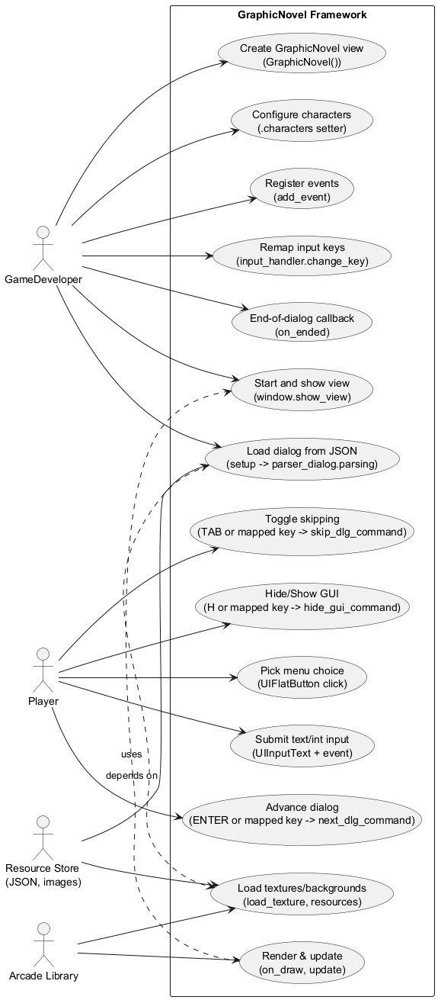
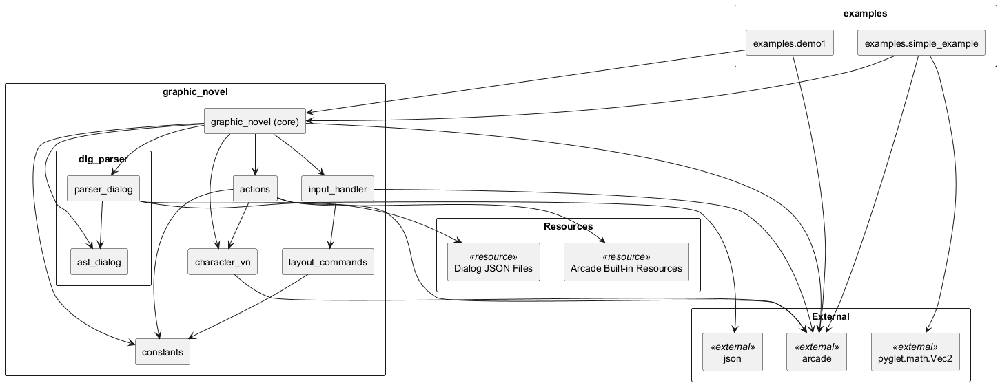
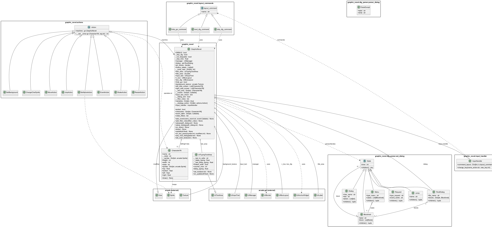
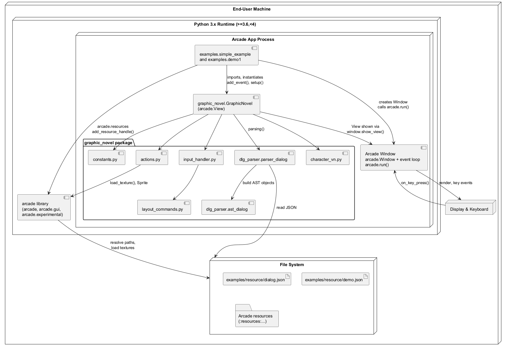

 

% 1 — System Overview
# SECTION 1 — System Overview

This section introduces the software system contained in the repository, its purpose, scope, and key features as they are implemented in the codebase. The goal is to give both technical and non-technical stakeholders a clear understanding of what the system does, how it is intended to be used, and which capabilities are available out of the box.

## Purpose and Main Functionalities

The repository provides a lightweight framework to build visual/graphic novel experiences using the Python Arcade library. The core of the framework is a reusable view class that reads dialogs and interaction flows from JSON, renders them using Arcade UI components, and executes scripted actions tied to dialog steps. The examples demonstrate how a game developer can load dialog definitions, register custom events, control characters and backgrounds, and drive progression through menus and user inputs.

At runtime, the system performs the following primary functions:

- Parses a JSON-based dialog DSL into an AST and iterates through dialog blocks to control the storytelling flow.
- Renders dialog text with a typewriter effect, displays speaker labels, and optionally collects user input.
- Displays character sprites on the left or right side of the screen, supports sprite state changes, and applies per-sprite alpha changes.
- Handles menus and branching through buttons, and supports programmatic jumps within the dialog.
- Exposes an event mechanism so game code can plug in custom behaviors (for example, validating input, adding video filters, or jumping to labels).
- Manages background textures, optional post-processing video filters, GUI visibility, and a skip mechanic for faster progression.

## Scope

The codebase implements the “graphic novel engine” as a self-contained Python package named graphic_novel. It is a framework-level subsystem intended to be embedded into an Arcade application. The examples under the examples/ directory illustrate how to integrate this subsystem into a complete executable game by creating a window, instantiating the GraphicNovel view, providing character sprites, registering events, and loading dialog resources.

The scope covers:

- Runtime view and UI composition with Arcade’s UIManager and widgets.
- A dialog parser and AST nodes for the domain-specific JSON format.
- An execution model that walks the AST and triggers UI updates and actions.
- Input handling, key bindings, and simple interactive widgets (buttons and text input).
- A small set of built-in actions for scene and character control.

It does not include a full authoring tool, asset pipeline, or packaging of content beyond the JSON samples provided.

## Key Features Evident in the Codebase

The following table summarizes the framework’s main features as implemented:

| Feature | Description | Key Implementation Elements |
|---|---|---|
| JSON dialog DSL | Dialog flow described as named blocks containing sequences of instructions. Supports dialogs, menus, input requests, and inline actions. | graphic_novel/dlg_parser/parser_dialog.py; ast_dialog.py; constants.py; examples/resource/*.json |
| AST-backed parsing | Converts JSON into typed nodes: RootDialog, BlockInstr, Dialog, Menu, Request, Jump. | ast_dialog.py; parser_dialog.parsing |
| Dialog rendering | Speaker label and text are shown via Arcade UI widgets; text supports a typewriter effect with adjustable delay or instant write. | GraphicNovel; UITypingTextArea.delay_typing and set_text |
| Character management | Characters have named sprite states (e.g., “idle”, “happy”) and are laid out left or right of the dialog box with size adjustments. | CharacterVN; GraphicNovel.characters setter; MoveAction |
| Actions/commands | Inline actions decoded from dialog strings control movement, alpha, background, sprite state, event callbacks, jumps, shake placeholder, and restart. | actions.py; constants tokens: move, alpha, event, jmp, shake, restart, bg, face |
| Menus and branching | Regular menus render as buttons; choices jump to labeled blocks. | parser _parse_menu; GraphicNovel.__generate_regular_menu; UIFlatButton |
| User input requests | Request nodes prompt for text or integer input; on confirmation, an event is invoked to process the input and continue. | Request node; layout_commands.next_dlg_command; GraphicNovel.__generate_request |
| Event extensibility | Game code registers named events; dialog “event” actions and request completions invoke these callbacks with the GraphicNovel instance. | GraphicNovel.add_event; actions.EventAction; examples/simple_example.py and demo1.py |
| Backgrounds and filters | Background textures can change per action; optional post-processing filters can be applied and drawn in a dedicated pass. | actions.SetBackground; GraphicNovel.add_filter_video; on_draw pipeline |
| Input handling and key remapping | Built-in commands: next dialog (Enter), toggle skip (Tab), hide GUI (H). Keys can be remapped at runtime. | input_handler.InputHandler; layout_commands.*; change_key in examples/demo1.py |
| Flow control and history | Jump to labels, track label history, detect end of dialog, and provide an on_ended callback. | GraphicNovel.jmp_next_dialog; history_labels; ended; on_ended |
| Restart behavior | Clears character placements, removes filters, and resets text color. | actions.RestartAction; GraphicNovel properties and deleter for video_filters |

The JSON dialog format used by the examples and parser supports:

- Blocks keyed by label names (e.g., “init”, “yes”, “meh”, “end”), each with a “block” array.
- Dialog entries as arrays where the first two elements are speaker name and text; any additional elements are inline action strings such as “move left”, “alpha 50”, “bg path”, “face happy”, “event name”, “jmp label”, or “restart all”.
- Menu entries expressed as objects with “menu”: “regular” and a “choice” array, where each choice has “txt” and “jmp” fields.
- Request entries expressed as objects with “request”: “text” or “int” and “event”: “event_name”.

The provided examples demonstrate:

- Loading dialog resources via Arcade’s resource system, configuring characters with sprites and states, and wiring events to gameplay logic.
- Applying a CRT-style post-processing filter during an event and altering text color at runtime.
- Using integer validation on input requests and branching based on user-entered values.

This section reflects the concrete behavior visible in the repository; no capabilities are claimed beyond what is implemented in code and demonstrated in the examples.

% 2 — Architectural Context
## 2. Architectural Context

This section defines the external context of the Graphic Novel framework as evidenced by the source code. It identifies external systems and libraries the code integrates with, the public APIs/interfaces exposed to integrators, the data sources consumed at runtime, and the actors who interact with the system. All items are grounded in the provided codebase, with file and symbol references to support validation.

### External Systems

The runtime relies on the Python Arcade ecosystem for rendering, input, UI widgets, resource resolution, and optional post-processing filters, plus minimal standard-library modules and packaging tools.

| Name | Purpose | Evidence in Code |
|---|---|---|
| Arcade core (arcade) | Windowing, rendering, textures, sprites, event loop | graphic_novel/__init__.py (arcade.View, arcade.Window, arcade.Sprite, arcade.draw_*), graphic_novel/actions.py (arcade.load_texture), graphic_novel/character_vn.py (arcade), examples/*.py (arcade.Window, arcade.run) |
| Arcade GUI (arcade.gui) | UI manager and widgets for text area, labels, input, buttons | graphic_novel/__init__.py (UIManager, UIBoxLayout, UIAnchorWidget, UIFlatButton, UITextArea, UILabel, UIBorder, UIInputText) |
| Arcade resources (arcade.resources) | Resource path resolution and handles | graphic_novel/__init__.py (resolve_resource_path), examples/*.py (add_resource_handle) |
| Arcade experimental CRTFilter | Optional post-processing video filter | examples/simple_example.py (arcade.experimental.CRTFilter), graphic_novel/__init__.py (add_filter_video, video_filters) |
| Pyglet (pyglet.math.Vec2) | Vector math for CRT filter configuration | examples/simple_example.py |
| Python standard library (json, os, sys, pathlib, typing) | JSON parsing, filesystem paths, module path manipulation, typing | graphic_novel/dlg_parser/parser_dialog.py (json), examples/*.py (os, sys), setup.py (pathlib), multiple files (typing) |
| Setuptools | Packaging and distribution | setup.py |

### APIs / Interfaces

The framework exposes a small, direct API surface for game developers via the graphic_novel package. The primary integration points are the GraphicNovel view, event registration, character/sprite injection, dialog setup, and optional video filters. It also consumes a strict JSON dialog format parsed by the internal dialog parser.

| Interface | Description | How to Use (as seen in examples) | Evidence in Code |
|---|---|---|---|
| GraphicNovel (arcade.View subclass) | Core view/state machine that renders characters, dialog text, menus, and handles requests; executes inline actions | Instantiate, assign characters, register events, setup with dialog path, optionally tweak typing delay and key bindings, show view | examples/demo1.py and examples/simple_example.py (GraphicNovel usage) |
| GraphicNovel.characters (setter) | Injects character sprites; accepts either a single Sprite or a dict mapping state names to Sprites per character; auto-scales large sprites | game_view.characters = {"ME": Sprite(...), "Man": Sprite(...)} or nested dict for multiple states | graphic_novel/__init__.py (characters.setter), examples/demo1.py, examples/simple_example.py |
| GraphicNovel.add_event(name, func) | Registers callback events invocable from dialog actions or request submissions; signature Callable[[GraphicNovel], int] | game_view.add_event("event1", event1); functions use context methods (e.g., jmp_next_dialog) | graphic_novel/__init__.py (add_event, event_table), examples/simple_example.py (event1, event_request), examples/demo1.py (quest_ev) |
| GraphicNovel.setup(path_dialog) | Initializes UI, resolves resource path, parses JSON dialog, sets initial block, starts flow | game_view.setup(":res:dialog.json") after adding an arcade resource handle | graphic_novel/__init__.py (setup, setup_dialog), examples/*.py |
| GraphicNovel.jmp_next_dialog(label) | Immediate jump to a labeled block; used within events or inline jmp actions | context.jmp_next_dialog("ok_resp") in event; executed also by JmpAction | graphic_novel/__init__.py (jmp_next_dialog), examples/demo1.py (quest_ev) |
| GraphicNovel.add_filter_video(filter) | Adds post-processing filters (e.g., CRTFilter); on_draw renders through filters when present | gn.add_filter_video(crt_filter) in event | graphic_novel/__init__.py (add_filter_video, on_draw), examples/simple_example.py |
| GraphicNovel.set_color_text(color) | Changes UI text color (dialog, title, input) | gn.set_color_text((255,0,0,255)) in event | graphic_novel/__init__.py (set_color_text), examples/simple_example.py |
| GraphicNovel.text_area.delay_typing | Controls typewriter effect speed; 0 means instant | game_view.text_area.delay_typing = 0 | graphic_novel/__init__.py (UITypingTextArea.delay_typing) |
| GraphicNovel.on_ended callback | User-assignable callback invoked when dialog ends | game_view.on_ended = end_game | graphic_novel/__init__.py (_next_step sets __dialog_end and calls on_ended), examples/*.py |
| InputHandler.change_key(name_action, new_key) | Rebinds input action keys by action name | game_view.input_handler.change_key("Hide gui", arcade.key.H); change_key("Next Dialog", arcade.key.RIGHT) | graphic_novel/input_handler.py (change_key), examples/demo1.py |
| Layout commands (ENTER/TAB/H) | Default key actions: ENTER advances dialog (and submits requests), TAB toggles skip mode, H toggles GUI visibility | Bound by default; see change_key note below | graphic_novel/input_handler.py (default command_layout), graphic_novel/layout_commands.py |

Important integration notes (as implemented):
- Request handling: when a Request node is active, ENTER validates type (int coerced) and calls the registered event by its name, then resumes dialog progression. See layout_commands.next_dlg_command and GraphicNovel.__generate_request.
- Menu handling: only menu type "regular" is implemented. Selecting a UIFlatButton jumps to its target label. See parser_dialog._parse_menu and GraphicNovel.__generate_regular_menu.
- Supported inline actions (tokens found in dialog action strings): move, alpha, event, jmp, shake, restart, bg, face. Their semantics are implemented by the strategy in graphic_novel/__init__.py and graphic_novel/actions.py.
- Key rebinding caveat: change_key searches by command name (cmd.name). In layout_commands, name is set from __doc__ (which is None for these classes), so name matching will not find "Hide gui" or "Next Dialog"; change_key will raise NotImplementedError. This reflects the current implementation and may require adding docstrings to layout command classes to enable rebinding by name.

Dialog JSON contract (input interface, parsed internally):
- Top-level: a mapping from label name to an object with a required "block" array.
- Each block item is either:
  - A dialog tuple/list: [char_name, text, optional actions...], where actions are space-delimited tokens interpreted by the action strategy.
  - A menu object with keys: menu = "regular", choice = [{txt, jmp}, ...].
  - A request object with keys: request = "text"|"int", event = <registered event name>.
- Implemented tokens (see constants.py and actions.py): move left|right, alpha N, event NAME, jmp LABEL, shake NAME, restart all, bg PATH, face STATE.

### Data Sources

At runtime, the system consumes structured dialog definitions, image resources, and user input from UI controls and the keyboard. All data access paths are local; there is no networking or database usage.

| Data Source | Role | Access Mechanism | Evidence in Code |
|---|---|---|---|
| Dialog definition files (JSON) | Defines blocks, dialogs, menus, and requests driving the state machine | parser_dialog.parsing(open(filename).read()); path resolved via arcade.resources.resolve_resource_path | graphic_novel/dlg_parser/parser_dialog.py; graphic_novel/__init__.py (setup/setup_dialog); examples/resource/*.json |
| Texture and sprite assets | Character sprites and background textures | arcade.Sprite(path) provided by integrator; bg action loads via arcade.load_texture(path) | examples/*.py (PATH_* constants and Sprite calls), graphic_novel/actions.py (SetBackground) |
| Arcade resource handles | Indirect resource resolution using schemes like :res: and :resources: | arcade.resources.add_resource_handle("res", dir); resolve_resource_path | examples/*.py; graphic_novel/__init__.py |
| Keyboard input | Advances dialog, toggles skip, toggles GUI; submits request input | on_key_press -> InputHandler.command_layout (ENTER, TAB, H by default) | graphic_novel/__init__.py (on_key_press), graphic_novel/input_handler.py, graphic_novel/layout_commands.py |
| Text input (UIInputText) | Captures user-provided text or integers for Request nodes | UIInputText widget swapped into dialog box; validated/cast for int | graphic_novel/__init__.py (__generate_request, set_color_text), graphic_novel/layout_commands.py (next_dlg_command) |

### Users / Actors

The code indicates two interacting roles during execution and integration.

| Actor | Interaction with the System | Evidence in Code |
|---|---|---|
| Game Player | Views dialog, selects menu options via UIFlatButton, advances or skips dialog with keyboard, enters text or numbers on request | graphic_novel/__init__.py (UI widgets, on_draw, __generate_regular_menu, __generate_request, on_key_press), graphic_novel/layout_commands.py (ENTER/TAB/H behavior) |
| Game Developer / Integrator | Embeds the GraphicNovel view in an Arcade Window, provides character sprites, dialog JSON, registers events, optionally adds filters and customizes text color | examples/demo1.py and examples/simple_example.py (end-to-end usage); graphic_novel/__init__.py (public methods and properties) |

% 2.1 — Architectural Context – Use Case Diagram
## Section 2.1 — Architectural Context – Use Case Diagram

This section presents the system’s external interaction context as a use case diagram derived strictly from the implementation. It identifies all actors that directly interact with the GraphicNovel framework and enumerates the observable use cases supported by the code. The diagram covers the developer-facing API surface (as used in the examples), player interactions via input handling and GUI widgets, and integration with the external Arcade library and resource loading.

Figure 2.1 — Architectural Context — Use Case Diagram

% 3 — Containers
## 3. Containers

This section identifies the concrete runtime containers that exist when executing the code in this repository. It focuses on the deployable applications present in the examples and the externalized resources they consume. The implementation runs entirely on a single machine, without networked services or databases; all interactions are in-process calls, OS event handling, and local file I/O.

| Container | Responsibility | Technology | Communication |
|---|---|---|---|
| Example Game (examples/simple_example.py) | Bootstraps an Arcade window, instantiates the GraphicNovel view, provides character sprites, registers custom events, loads dialog JSON, and runs the game loop. | Python 3.x, Arcade (arcade.View, arcade.gui, arcade.experimental.CRTFilter), pyglet.math.Vec2, graphic_novel package modules | In-process Python API calls; OS event loop and keyboard input via Arcade; local file I/O for JSON and textures via arcade.resources and open() |
| Example Game (examples/demo1.py) | Bootstraps an Arcade window, instantiates the GraphicNovel view, provides multi-state character sprites, registers a validation event for numeric input, loads dialog JSON, and runs the game loop. | Python 3.x, Arcade (arcade.View, arcade.gui), graphic_novel package modules | In-process Python API calls; OS event loop and keyboard input via Arcade; local file I/O for JSON and textures via arcade.resources and open() |
| Local Resources (examples/resource) | Supplies dialog scripts and media paths consumed at runtime by the games: dialog trees in JSON and image assets resolved through Arcade’s resource system. | JSON dialog files (dialog.json, demo.json); file paths for textures resolved by arcade.resources and loaded via arcade.load_texture | Local file I/O (read JSON via json.load/open; resolve resource paths via arcade.resources.resolve_resource_path; load textures via arcade.load_texture) |

% 3.1 — Architecture Overview – Component Diagram
# Section 3.1 — Architecture Overview – Component Diagram

This section provides a concise structural view of the system’s main components and their relationships, derived directly from the provided source code. It identifies the executable entry points, core framework modules, parsing and action subsystems, and their dependencies on external libraries and resources. The diagram is intended to help both developers and integrators understand how the examples bootstrap the engine, how the engine composes UI, input handling, parsing, and action execution, and how dialog scripts and textures are consumed at runtime.

Figure 3.1 — Component Diagram (fig-3-1-component-diagram.puml)

% 4 — Components
## 4. Components

This section enumerates all implemented components across the repository, describing their responsibilities and the concrete interactions visible in the code. The list is exhaustive with respect to modules, classes, and key functions present in the source tree so that reviewers can validate this section directly against the codebase.

| Component | Responsibility | Interactions |
|---|---|---|
| graphic_novel.constants (module) | Defines shared constants for timing, tokens, defaults, and input handling used throughout the engine. | Imported by graphic_novel.__init__.GraphicNovel, graphic_novel.actions.*, graphic_novel.input_handler.InputHandler, graphic_novel.layout_commands.* |
| graphic_novel.character_vn.CharacterVN (class) | Encapsulates a character’s sprites, current visual state, size, and positioning; provides drawing and positional properties. | Used by graphic_novel.__init__.GraphicNovel (composition and rendering), graphic_novel.actions.SetAlphaAction, graphic_novel.actions.ChangeCharSprite; relies on arcade.Sprite textures |
| graphic_novel.actions.Action (class) | Base strategy for actions executable by the engine; holds a reference to the engine (“machine”). | Extended by all concrete action classes; receives CharacterVN, calls methods/properties on graphic_novel.__init__.GraphicNovel |
| graphic_novel.actions.MoveAction (class) | Moves a character to the left or right side of the screen. | Uses graphic_novel.__init__.GraphicNovel._remove_pg_from_lists, left_side_screen, right_side_screen; consumes constants.LEFT_TOKEN, constants.RIGHT_TOKEN |
| graphic_novel.actions.JmpAction (class) | Performs a dialog jump to a label and advances the flow. | Calls graphic_novel.__init__.GraphicNovel.jmp_next_dialog, _next_step |
| graphic_novel.actions.SetAlphaAction (class) | Sets the current sprite alpha for a character. | Reads/updates CharacterVN.sprites[CharacterVN.state].alpha |
| graphic_novel.actions.EventAction (class) | Invokes a registered event callback by name. | Reads graphic_novel.__init__.GraphicNovel.event_table and calls the function with engine context |
| graphic_novel.actions.ShakeAction (class) | Validates a character name exists to be shaken (behavior stub). | Asserts presence in graphic_novel.__init__.GraphicNovel.__dict_char |
| graphic_novel.actions.RestartAction (class) | Resets scene state: clears characters, removes video filters, and restores default text color. | Mutates graphic_novel.__init__.GraphicNovel.left_side_screen, right_side_screen; deletes graphic_novel.__init__.GraphicNovel.video_filters; calls set_color_text(constants.DEFAULT_COLOR_TEXT) |
| graphic_novel.actions.SetBackground (class) | Loads and applies a background texture. | Calls arcade.load_texture; sets graphic_novel.__init__.GraphicNovel.background_texture |
| graphic_novel.actions.ChangeCharSprite (class) | Switches the visible sprite state for a character. | Sets CharacterVN.state |
| graphic_novel.dlg_parser.ast_dialog.Node (class) | Abstract base for AST nodes representing dialog structures; provides children iteration and repr. | Inherited by all AST node types; used by parser and engine logic in graphic_novel.__init__.GraphicNovel |
| graphic_novel.dlg_parser.ast_dialog.RootDialog (class) | Root AST node holding the mapping of block labels to BlockInstr. | Constructed in parser; used by graphic_novel.__init__.GraphicNovel to access blocks and iterate dialog |
| graphic_novel.dlg_parser.ast_dialog.Dialog (class) | Represents a single dialog line with character name, text, and a sequence of action tokens. | Emitted by parser; consumed in graphic_novel.__init__.GraphicNovel._next_step and __action_video |
| graphic_novel.dlg_parser.ast_dialog.BlockInstr (class) | Represents a labeled block containing Dialog, Menu, Request, or Jump nodes. | Constructed by parser; iterated by graphic_novel.__init__.GraphicNovel via ptr_blocks |
| graphic_novel.dlg_parser.ast_dialog.Menu (class) | Represents a menu with a type and a list of choice cases (as BlockInstr with Jump). | Constructed by parser; rendered by graphic_novel.__init__.GraphicNovel.__generate_regular_menu |
| graphic_novel.dlg_parser.ast_dialog.Request (class) | Represents an input request (text or int) tied to an event name. | Constructed by parser; handled by graphic_novel.__init__.GraphicNovel.__generate_request and layout_commands.next_dlg_command |
| graphic_novel.dlg_parser.ast_dialog.Jump (class) | Represents a jump to a named block label. | Constructed by parser; read by graphic_novel.__init__.GraphicNovel.__generate_regular_menu (maps button to Jump.name) |
| graphic_novel.dlg_parser.parser_dialog.ParseExcept (class) | Parsing exception capturing the label context and error detail (“what”). | Raised by parser_dialog.__check_token and validation paths; can be surfaced to callers |
| graphic_novel.dlg_parser.parser_dialog.__check_token (function) | Validates a required key exists in menu/request structures; raises ParseExcept with context. | Called by _parse_menu, _parse_request |
| graphic_novel.dlg_parser.parser_dialog._parse_menu (function) | Builds a Menu node from JSON definition, translating choices into BlockInstr with Jump. | Uses __check_token; creates ast_dialog.Menu, BlockInstr, Jump |
| graphic_novel.dlg_parser.parser_dialog._parse_request (function) | Builds a Request node with type and event name. | Uses __check_token; creates ast_dialog.Request |
| graphic_novel.dlg_parser.parser_dialog._parsing_json (function) | Converts a loaded JSON object into a RootDialog with Blocks and instructions. | Creates ast_dialog.Dialog/Menu/Request/Jump; returns RootDialog |
| graphic_novel.dlg_parser.parser_dialog.parsing (function) | Loads a JSON file from disk and delegates to _parsing_json. | Uses json.load; calls _parsing_json |
| graphic_novel.input_handler.InputHandler (class) | Maps keyboard keys to command objects and allows remapping by action name. | Instantiates layout_commands.next_dlg_command, skip_dlg_command, hide_gui_command; used by graphic_novel.__init__.GraphicNovel.on_key_press; references arcade.key constants |
| graphic_novel.layout_commands.layout_command (class) | Base class for input command objects; stores an action name. | Extended by concrete command classes; carried in InputHandler.command_layout |
| graphic_novel.layout_commands.next_dlg_command (class) | Advances the dialog; when a request is active, validates int input, invokes the bound event, resets UI, then proceeds. | Reads/writes machine.input_text_check, machine.input_text, machine.event_table, machine._not_skippable; mutates machine.box_dlg (swap input and text areas); calls machine._next_step |
| graphic_novel.layout_commands.skip_dlg_command (class) | Toggles auto-skipping of dialog when allowed. | Reads/writes machine._skip_dlg; checks machine._not_skippable |
| graphic_novel.layout_commands.hide_gui_command (class) | Toggles GUI visibility. | Flips machine.hide_gui |
| graphic_novel.__init__.UITypingTextArea (class) | UITextArea subclass with incremental typing effect controlled by delay_typing and instant_write; updates text on a timer. | Extends arcade.gui.widgets.UITextArea; used by graphic_novel.__init__.GraphicNovel as the dialog text area |
| graphic_novel.__init__.GraphicNovel (class) | Core engine view: initializes UI, parses dialog files, renders background and characters, manages input, events, actions, and dialog progression. | Extends arcade.View; uses arcade.gui (UIManager, UIBoxLayout, UIAnchorWidget, UIFlatButton, UILabel, UIBorder, UIInputText); parses via graphic_novel.dlg_parser.parser_dialog; consumes AST nodes ast_dialog.Dialog/Menu/Request/Jump; dispatches actions via strategy map to graphic_novel.actions.*; holds CharacterVN instances; uses constants; delegates input to graphic_novel.input_handler.InputHandler; draws with arcade; loads resources with arcade.resources; manages video filters provided by callers |
| examples.simple_example.event1 (function) | Example event: adds a CRT video filter and changes text color; returns 1. | Calls graphic_novel.__init__.GraphicNovel.add_filter_video, set_color_text; uses arcade.experimental.CRTFilter, pyglet.math.Vec2 |
| examples.simple_example.event_request (function) | Example request handler: reads input text and jumps to a label with the same name; returns 1. | Reads gn.input_text.text; calls gn.jmp_next_dialog |
| examples.simple_example.end_game (function) | Example callback invoked on dialog end; prints last dialog label. | Reads context.history_labels |
| examples.simple_example.main (function) | Example app entrypoint: creates window, builds GraphicNovel, registers events, loads resources, assigns sprites, and starts the loop. | Uses arcade.Window, arcade.resources.add_resource_handle, arcade.Sprite, window.show_view, arcade.run; instantiates graphic_novel.__init__.GraphicNovel; calls setup, add_event |
| examples.demo1.quest_ev (function) | Example request validator: if input equals 10, jumps to “ok_resp”, else “bad_resp”. | Reads context.input_text.text; calls context.jmp_next_dialog |
| examples.demo1.end_game (function) | Example callback invoked on dialog end; prints last dialog label. | Reads context.history_labels |
| examples.demo1.main (function) | Example app entrypoint: creates window, builds GraphicNovel, registers event, sets character states, customizes input mapping and typing delay, and starts the loop. | Uses arcade.Window, arcade.resources.add_resource_handle, arcade.Sprite, window.show_view, arcade.run; sets game_view.characters with multiple states; calls add_event, setup; sets text_area.delay_typing; modifies game_view.input_handler.change_key; assigns game_view.on_ended |

% 5 — Code-Level View
# Section 5 — Code‑Level View

This section maps the implemented architectural elements to concrete source code artifacts, so that developers can validate the architecture against the actual code. It identifies the entry points, details the structure and responsibilities of every module, class, function, and constant, and highlights recognizable design patterns that shape the implementation. All content is derived strictly from the provided repository.

## Repository layout and key directories

The repository is organized into an installable Python package named graphic_novel, a dialog parser subpackage, runnable examples, and simple JSON dialog resources.

| Path | Purpose |
|---|---|
| graphic_novel/ | Core framework package implementing rendering, UI integration, input handling, actions, and domain model for a visual novel. |
| graphic_novel/dlg_parser/ | Dialog parser and AST for the JSON dialog format. |
| examples/ | Two runnable examples demonstrating the framework against the JSON dialog resources. |
| examples/resource/ | Dialog resources in JSON format consumed by the parser and game. |
| setup.py | Packaging metadata for distribution to PyPI. |

## Application entry points

The framework is used via examples which expose Python entry points guarded by if __name__ == "__main__". There is no console script entry point in setup.py.

| File | Entry function or guard | Description of startup behavior |
|---|---|---|
| examples/demo1.py | if __name__ == "__main__": main() | Creates an arcade.Window, instantiates graphic_novel.GraphicNovel, registers characters with multiple sprite states, registers an integer input event quest_ev, loads dialog from :res:demo.json, configures input, and starts the Arcade run loop. |
| examples/simple_example.py | if __name__ == "__main__": main() | Creates an arcade.Window, instantiates graphic_novel.GraphicNovel, registers characters with a single sprite each, registers two events event1 and event_request, loads dialog from :res:dialog.json, and starts the Arcade run loop. |

## Modules, classes, functions, and constants

The following tables enumerate all source files with their top-level constructs and responsibilities.

### Module: graphic_novel/__init__.py

Provides the main view/controller and a typing text widget, and wires together parsing, actions, input handling, and UI.

| Construct | Kind | Responsibility and key behavior |
|---|---|---|
| UITypingTextArea | Class (subclass of arcade.gui.widgets.UITextArea) | Adds incremental typing effect with configurable delay_typing and instant_write; set_text and on_update manage progressive rendering of text. |
| GraphicNovel | Class (subclass of arcade.View) | Orchestrates dialog progression, UI composition, rendering, character sprites, actions execution, video filters, input routing, and events. Key properties: manager (UIManager), dialog (AST root), ptr_blocks (iterator over current block), history_labels (list of jumped labels), text_area/title_area/input_text UI widgets, left_side_screen/right_side_screen sprite placements, __dict_char character registry, __events callback registry, input_text_check gating request input, __dialog_end flag, __filter_video list, variables free-form dict, __strategy_action action dispatch map, input_handler (InputHandler). Key methods: setup, setup_dialog, on_draw, draw, debug_draw, update, on_key_press; dialog control via _next_step, jmp_next_dialog, __jump_next_dialog; UI behaviors via __generate_regular_menu, __generate_request; action application via __action_video, __interpreting_action; sprite list management via _remove_pg_from_lists; text helpers set_color_text and __adapt_text_var; video filter management add_filter_video and video_filters property; events registration add_event; characters property setter normalizes Sprites vs dict of state->Sprite and scales appropriately; lifecycle hook on_ended invoked when dialog ends. |

Notable internal mappings and tokens:

| Mapping | Purpose |
|---|---|
| __strategy_action | Maps action tokens to concrete Action classes: move -> MoveAction; alpha -> SetAlphaAction; event -> EventAction; jmp -> JmpAction; shake -> ShakeAction; restart -> RestartAction; bg -> SetBackground; face -> ChangeCharSprite. |
| input_text_check | Dict controlling request input handling: { "check": bool, "type": "text" or "int", "evt": event name }. |

### Module: graphic_novel/actions.py

Defines Action classes invoked by GraphicNovel based on tokens embedded in dialog JSON. All actions are callable objects receiving the target CharacterVN (or None) and a string argument.

| Construct | Kind | Responsibility and key behavior |
|---|---|---|
| Action | Base class | Stores a reference to the GraphicNovel machine; defines __call__ placeholder. |
| MoveAction | Class | Moves a character to left or right lists based on constants.LEFT_TOKEN or constants.RIGHT_TOKEN, after removing from previous placement. |
| JmpAction | Class | Performs an in-dialog jump by calling machine.jmp_next_dialog and immediately advances machine._next_step. |
| SetAlphaAction | Class | Sets the alpha of the current state sprite of the CharacterVN to int(arg, 10). |
| EventAction | Class | Looks up arg in machine.event_table and invokes the registered callback if present. |
| ShakeAction | Class | Placeholder; asserts character name exists but currently attempts to access a private attribute on machine (see “Implementation notes and issues”). |
| RestartAction | Class | Clears character lists, removes video filters via deleter, and resets text color to DEFAULT_COLOR_TEXT. |
| SetBackground | Class | Loads a background texture via arcade.load_texture(arg) and assigns it to machine.background_texture. |
| ChangeCharSprite | Class | Sets CharacterVN.state to arg (switch active sprite). |

### Module: graphic_novel/character_vn.py

Encapsulates a character with multiple sprite states and provides geometry and drawing delegation.

| Construct | Kind | Responsibility and key behavior |
|---|---|---|
| CharacterVN | Class | Holds name, current state, a mapping of state->arcade.Sprite, and cached width/height from active texture. Exposes drawing and geometry proxy properties (top, bottom, left, right) to manipulate the active sprite; state setter preserves sprite center and updates active dimensions. |

### Module: graphic_novel/constants.py

All framework-wide constants and tokens.

| Name | Value |
|---|---|
| SKIP_TIME | 0.15 |
| DELAY_WRITING_TIME | 0.2 |
| INIT_BLOCK | "init" |
| CHAR_SELECTED_KEY | "selected" |
| INPUT_CHECK_DEFAULT | {"check": False, "type": "text", "evt": ""} |
| DEFAULT_COLOR_TEXT | (0, 0, 0, 255) |
| MOVE_ACTION_TOKEN | "move" |
| LEFT_TOKEN | "left" |
| RIGHT_TOKEN | "right" |
| ALPHA_TOKEN | "alpha" |
| EVENT_TOKEN | "event" |
| SHAKE_TOKEN | "shake" |
| JUMP_TOKEN | "jmp" |
| RESTART_TOKEN | "restart" |
| SET_BG_TOKEN | "bg" |
| SET_SPRITE_TOKEN | "face" |
| SKIP_DLG_KEY | 0 |
| NEXT_DLG_KEY | 1 |

These tokens are consumed by GraphicNovel.__strategy_action and by the dialog JSON actions.

### Module: graphic_novel/input_handler.py

Wraps a mapping of platform key codes to command objects and supports rebinding.

| Construct | Kind | Responsibility and key behavior |
|---|---|---|
| InputHandler | Class | Initializes command_layout mapping keyboard codes to layout_commands.* instances: ENTER -> next_dlg_command, TAB -> skip_dlg_command, H -> hide_gui_command. change_key(name_action, new_key) searches command by its human-readable name (cmd.name) and rebinds it to a new key, or raises NotImplementedError if not found. |

### Module: graphic_novel/layout_commands.py

Implements the Command pattern for input actions.

| Construct | Kind | Responsibility and key behavior |
|---|---|---|
| layout_command | Base class | Holds a name attribute initialized to "<N/A>". |
| next_dlg_command | Class | When invoked, if a request input is pending, validates int type, invokes the registered event callback, resets input widgets to text area, and advances the dialog via machine._next_step(). |
| skip_dlg_command | Class | Toggles machine._skip_dlg if current node is skippable (machine._not_skippable is False). |
| hide_gui_command | Class | Toggles machine.hide_gui. |

Note that next_dlg_command, skip_dlg_command, and hide_gui_command set name to their __doc__ string in __init__.

### Module: graphic_novel/dlg_parser/ast_dialog.py

Defines the dialog AST built from JSON.

| Construct | Kind | Responsibility and key behavior |
|---|---|---|
| Node | Base class | Provides a __repr__ that renders children recursively; defines children() placeholder. |
| RootDialog | Class | Holds file_name and blocks mapping labels to BlockInstr; iterable yields blocks; children() returns ("blocks", blocks). |
| Dialog | Class | Represents a single dialog line with char_name (speaker), text, and action list (list[str] tokens). |
| BlockInstr | Class | Represents a labeled block containing a sequence of nodes: Dialog, Menu, or Jump; label is str, block is list. |
| Menu | Class | Represents a regular menu; type_menu is str, cases is a list of BlockInstr, each case uses BlockInstr.label as button text and holds a single Jump node in its block to the label specified by the dialog JSON. |
| Request | Class | Represents a request for user input; type_request is "text" or "int"; event_name is a registered callback name. |
| Jump | Class | Represents a jump target by name (string). |

All classes use __slots__ for memory efficiency and define minimal __iter__ and children behaviors to support pretty-printing and iteration.

### Module: graphic_novel/dlg_parser/parser_dialog.py

Parses dialog JSON into the AST.

| Construct | Kind | Responsibility and key behavior |
|---|---|---|
| ParseExcept | Exception | Carries label and what attributes to report parsing errors with context. |
| parsing(filename) | Function | Opens filename, loads JSON via json.load, and delegates to _parsing_json. |
| _parsing_json(filename, dialog_json) | Function | For each name_block in dialog_json, builds a BlockInstr; within each "block", decides instruction type: dict with "menu" or "request" becomes Menu or Request nodes; otherwise constructs Dialog with optional actions list (third and further entries). Assembles RootDialog with blocks mapping label -> BlockInstr. |
| _parse_menu(name_block, menu) | Function | Validates presence of "choice"; converts each choice dict {"txt": "...", "jmp": "..."} into a BlockInstr with label=txt and a single Jump node; sets menu_inst.type_menu from menu["menu"]. |
| _parse_request(name_block, req) | Function | Validates presence of "event"; produces Request node with type_request=req["request"] and event_name=req["event"]. |
| __check_token(dc_menu, key, what, name_block) | Helper | Raises ParseExcept if a key is missing in the provided dict. |

All tokens are defined at module top: MENU_TOKEN, REQ_TOKEN, CHAR_TOKEN, BLOCK_TOKEN, CHOICE_TOKEN, TXT_MENU_TOKEN, JMP_MENU_TOKEN, EVT_REQ_TOKEN.

### Module: examples/demo1.py

Demonstrates characters with multiple sprite states, integer input, and background changes.

| Construct | Kind | Responsibility and key behavior |
|---|---|---|
| SCREEN_WIDTH/HEIGHT/TITLE | Constants | Window configuration. |
| PATH_C1_NORMAL/PATH_C1_HAPPY | Constants | Arcade resource paths for sprite states. |
| end_game(context) | Function | Prints the last dialog label when dialog ends. |
| quest_ev(context) | Function | Reads context.input_text.text, routes to ok_resp or bad_resp via context.jmp_next_dialog based on int value. |
| main() | Function | Creates window and view, sets resource handle "res" to examples/resource; registers multi-state character "Emma", binds quest_ev, loads :res:demo.json, disables typing delay, attempts to rebind keys, sets on_ended callback, shows view, and runs Arcade loop. |

### Module: examples/simple_example.py

Demonstrates video filter, color changes, text request, events, and restart.

| Construct | Kind | Responsibility and key behavior |
|---|---|---|
| SCREEN_WIDTH/HEIGHT/TITLE | Constants | Window configuration. |
| PATH_CHARACTER_1/PATH_CHARACTER_2 | Constants | Arcade resource paths for characters. |
| event1(gn) | Function | Adds a CRTFilter effect, sets text color, returns 1. |
| event_request(gn) | Function | Reads input, jumps to matching label, returns 1. |
| end_game(context) | Function | Prints the last dialog label. |
| main() | Function | Creates window/view, sets resource handle, registers characters, loads :res:dialog.json, binds event1 and event_request, sets on_ended, shows view, and runs. |

### Module: examples/resource/dialog.json and examples/resource/demo.json

Both files define dialog structures consumed by the parser and executed by the engine. They include blocks keyed by labels, with each block consisting of lists of instructions, each being either a two-or-more element array [char, text, actions…], or a dict-based instruction for menu or request. Actions in these examples use tokens move left/right, alpha, event, jmp, restart, bg, and face, all mapped to Action classes through GraphicNovel.__strategy_action.

### Module: setup.py

Standard setuptools configuration. No console entry_points defined. Declares dependency on arcade and Python versions >=3.6,<4. Contains project metadata and classifiers.

## Dialog tokens to Action mapping

GraphicNovel binds action tokens to concrete Action implementations via __strategy_action. The following mapping is exact.

| Token | Action class | Effect |
|---|---|---|
| move | MoveAction | Moves CharacterVN to left or right placement lists. |
| alpha | SetAlphaAction | Sets alpha channel of current sprite state. |
| event | EventAction | Invokes registered event callback by name. |
| jmp | JmpAction | Jumps to the given label and advances immediately. |
| shake | ShakeAction | Placeholder; see issues below. |
| restart | RestartAction | Clears character placement, removes video filters, resets text color. |
| bg | SetBackground | Loads and sets background texture. |
| face | ChangeCharSprite | Switches character sprite state. |

## Recognizable design and implementation patterns

The code explicitly implements the Strategy pattern through the mapping of action tokens to Action objects in GraphicNovel.__strategy_action. Input handling implements the Command pattern: InputHandler maps key codes to command objects (next_dlg_command, skip_dlg_command, hide_gui_command) that encapsulate behavior. Iteration over a dialog block leverages Python iterators; ptr_blocks is an iterator over the block list and is advanced stepwise in _next_step. A callback/event table (GraphicNovel.__events) forms a lightweight observer-like mechanism where external code registers functions and engine invokes them by name.

The overall layering is implicit but clear from code boundaries: dialog parsing and AST (dlg_parser) are decoupled from rendering and interaction (GraphicNovel and UI), while actions form an extension layer that operates over the engine state.

## Control flow and data mappings

Dialog JSON is parsed into a RootDialog containing a dict of labels to BlockInstr instances. GraphicNovel.setup loads and parses the file via parser_dialog.parsing and initializes ptr_blocks to iterate the "init" block. Each advance (either via _next_step timer, user key press, or JmpAction) processes the next AST node:

- Dialog nodes update title_area, text_area and invoke actions on the named character, applying each tokenized action through __strategy_action.
- Menu nodes materialize UIFlatButton controls; clicking a button jumps to the target label stored in __jump_next.
- Request nodes replace the text area with an input field; the ENTER command triggers validation and event invocation, then restores the text area before proceeding.

Characters are provided by client code either as a single arcade.Sprite or a dict of state->arcade.Sprite; the setter normalizes to a CharacterVN with proper scaling relative to window size.

InputHandler routes arcade key codes to command objects; GraphicNovel.on_key_press checks if the pressed symbol is in command_layout and executes the command, passing the GraphicNovel instance.

## Implementation notes and issues traceable from code

The following issues are directly observable in the current implementation and are important for developers validating behavior:

- Command naming for key rebinding: layout_commands.next_dlg_command, skip_dlg_command, and hide_gui_command set self.name = self.__doc__, but these classes have no docstrings, so name becomes None. InputHandler.change_key searches by human-readable name (e.g., "Hide gui" or "Next Dialog" used in examples/demo1.py), which will not match and will raise NotImplementedError. Either provide docstrings that match expected names or set explicit names in constructors.
- Private attribute access in ShakeAction: ShakeAction asserts arg in self.machine.__dict_char. GraphicNovel stores this mapping as a double-underscore attribute (__dict_char), which is name-mangled to _GraphicNovel__dict_char. Accessing __dict_char from actions.ShakeAction refers to a non-mangled attribute and will raise AttributeError. Use machine.characters (public property) or _GraphicNovel__dict_char to avoid failure.
- Duplicate button addition: GraphicNovel.__generate_regular_menu adds each UIFlatButton twice to v_box (once via with_space_around and again directly), causing duplicates in the UI layout. Remove the second self.v_box.add(button).
- Background texture may be None: GraphicNovel.draw calls arcade.draw_texture_rectangle with self.background_texture which is None until a "bg" action runs. Arcade may error if a None texture is passed; guard the call or initialize a default texture.
- Menu type support: Only "regular" menus are implemented; any other menu type raises NotImplementedError.
- Request type support: Only "text" and "int" are implemented; other values raise NotImplementedError.
- JmpAction immediate advancement: JmpAction both jumps and calls _next_step; this consumes the next node immediately and may skip expected user interaction depending on context. This is intended in examples but should be noted for authoring dialogs.

These observations map one-to-one with the code and can be validated by inspecting the referenced lines.

## How the examples map to the engine

The examples register events and characters, then call GraphicNovel.setup with a resource path like :res:demo.json after registering a "res" handle pointing to examples/resource. The dialog files contain actions matching constants tokens and drive the engine:

- examples/resource/demo.json uses "face" to switch sprite states, "move" to position characters, "alpha" to fade, "bg" to set background, "jmp" to branch, "request":"int" with event quest_ev to conditionally route to ok_resp or bad_resp, and "restart all" to reset state.
- examples/resource/dialog.json uses "move", "alpha", "event event1", "request":"text" with "event_request", "restart all", and a menu that restarts or ends.

Both examples attach on_ended to print the final label stored in GraphicNovel.history_labels.

## Summary of code–architecture traceability

- Dialog Parser and AST are fully implemented in graphic_novel/dlg_parser with clear token handling and AST node definitions.
- The core Engine and UI composition are implemented in graphic_novel/__init__.py via GraphicNovel and UITypingTextArea and are responsible for rendering, state, and flow.
- Actions are decoupled and dispatched via a Strategy map in GraphicNovel to classes in graphic_novel/actions.py.
- Input is handled via a Command map in graphic_novel/input_handler.py backed by command objects in graphic_novel/layout_commands.py.
- The Domain entity CharacterVN encapsulates sprite state and geometry in graphic_novel/character_vn.py.
- Constants unify tokens and engine timings in graphic_novel/constants.py.
- Examples demonstrate end-to-end usage including event callbacks, character registration, resource resolution, and execution in Arcade.

This code-level view provides the definitive mapping between architectural responsibilities and the concrete Python artifacts that realize them, enabling straightforward validation by developers familiar with this codebase.

% 5.1 — Class Diagram
# Section 5.1 — Class Diagram

This section presents the complete, implementation-derived class model for the repository. It captures all classes defined in the codebase, their inheritance hierarchies, core attributes and operations, and the principal associations and dependencies between subsystems. External classes from the Arcade UI framework are shown as external references to make inheritance and composition explicit. The model reflects the actual implementation without introducing additional classes or fictitious relationships.

Figure 5.1 — Class Diagram

Notes

The diagram is derived directly from the source code. External Arcade classes are included solely to make inheritance and composition explicit. Within CharacterVN, the sprites map is used in practice as a mapping from state names to arcade.Sprite instances; the diagram reflects this effective usage.

% 6 — Cross-Cutting Concerns
## 6. Cross-Cutting Concerns

This section identifies and explains cross-cutting aspects implemented (or explicitly absent) across the codebase. The purpose is to make system-wide qualities, constraints, and reusable mechanisms visible and verifiable by the development team. All statements are strictly derived from the provided source code and example scripts.

| Concern | Evidence from code | Description |
|---|---|---|
| Security: authentication/authorization | No related imports or code paths; purely local UI, no networking | The framework does not implement authentication, authorization, or identity management. There are no security controls around user identity or roles; this is consistent with a local, single-player UI tool. |
| Security: encryption/data protection | No crypto libraries; no IO beyond textures and JSON dialog files | No encryption at rest or in transit is present. Dialog JSON and assets are loaded from local resources only. |
| Configuration and runtime settings | graphic_novel/constants.py; GraphicNovel.set_color_text; GraphicNovel.UITypingTextArea.delay_typing; InputHandler.change_key; examples modify keys and typing delay | Configuration is code-driven via constants and runtime setters. Examples change key bindings and text typing delay at runtime. Color and visual filters can be adjusted dynamically. No external configuration files or environment variables are used. |
| Keybinding remapping robustness | input_handler.InputHandler.change_key; layout_commands.next_dlg_command/hide_gui_command/skip_dlg_command use self.__doc__ as name | change_key relies on command.name, which is initialized from __doc__. The command classes have no docstrings, so name is None. This makes change_key unable to locate actions by the human-readable names used in examples (e.g., "Hide gui", "Next Dialog"), resulting in NotImplementedError at runtime. |
| Error handling and failure modes | parser_dialog.ParseExcept; parser_dialog.__check_token; NotImplementedError for unsupported menu/request types; extensive assert usage (e.g., GraphicNovel.jmp_next_dialog, __interpreting_action, ShakeAction) | Parsing errors are reported via a domain-specific exception (ParseExcept), including label context. Unsupported features raise NotImplementedError early. Many runtime checks use assert, which can be disabled with Python optimizations and terminate the app abruptly; replacing with explicit exceptions would improve resilience. StopIteration in _next_step marks dialog end cleanly. |
| Input validation and sanitation | layout_commands.next_dlg_command validates int inputs; parser_dialog enforces token presence and shapes; GraphicNovel._next_step limits request types to "text" or "int"; examples/simple_example.event_request uses user text as label | Numeric input is validated and coerced (invalid int becomes "0"). JSON dialogs are validated for required tokens (menu, choice, jmp, event). Free-text input is passed to jmp_next_dialog; if the label does not exist, an assertion fails, ending the flow. There is no sanitation layer for free-text beyond label existence. |
| Logging and diagnostics | examples print to stdout (event1, end_game); GraphicNovel.DEBUG flag; GraphicNovel.debug_draw draws bounding boxes; no logging module usage | Diagnostics rely on console prints and on-screen debug outlines when DEBUG is true. There is no structured logging, log levels, or sinks. |
| Observability/monitoring/metrics | No metrics, tracing, or health endpoints | The framework provides no runtime metrics, tracing, or health checks. Debug UI drawing is the only built-in observability aid. |
| Testing and quality gates | No tests present; setup.py extras_require["test"] is empty | There are no automated tests in the repository. No CI hooks or fixtures are present. |
| Internationalization/localization | Text is provided in JSON; no i18n framework | The framework renders text as-is; there is no locale, resource bundling, or font/RTL handling beyond arcade defaults. |
| Resource and memory management | actions.RestartAction clears lists and resets color; GraphicNovel.video_filters deleter clears filter list; CharacterVN.sprites resizes sprites on assignment; SetBackground loads textures | Video filters are explicitly cleared on restart. Sprites are resized to fit the screen heuristically. Background textures are loaded on demand; there is no explicit disposal API for textures or UI manager disablement on teardown. |
| Extensibility and plug-in points | GraphicNovel.add_event/event_table; __strategy_action dispatch map; constants.py action tokens; actions.* subclasses | The framework is extensible through event callbacks and a strategy map of actions keyed by tokens. New actions can be added by extending actions.Action and wiring them into __strategy_action; new events are registered via add_event. |
| Configuration of resources | arcade.resources.add_resource_handle in examples; resolve_resource_path in GraphicNovel.setup | Dialog files and assets are resolved via arcade’s resource system; resource namespaces can be added per example (e.g., ":res:"). No runtime validation prevents passing non-resource absolute paths to SetBackground. |
| Failure reporting to users | Exceptions surface; UI shows no error messages | Failures propagate as exceptions or assertions; there is no user-facing error messaging or recovery inside the UI flow. |

Introduction note on validation:
- The absence of security, monitoring, and testing is confirmed by lack of imports, modules, and code paths for such concerns.
- The keybinding mismatch is provable by the combination of InputHandler.change_key searching by command.name and layout_commands setting name from an absent docstring, contrasted with the example calls that pass human-readable names.
- Input validation behaviors are demonstrable in layout_commands.next_dlg_command and the event handlers in examples.

% 7 — Quality Attributes and Rationale
## 7. Quality Attributes and Rationale

This section summarizes the quality attributes that the current implementation demonstrably supports, based solely on the code structure, patterns, and explicit checks present in the repository. Each attribute lists concrete evidence from the code and explains how the implementation decisions contribute to that quality.

| Quality Attribute | Evidence | Rationale |
|---|---|---|
| Maintainability | Clear modularization across parser (graphic_novel/dlg_parser), runtime/view (graphic_novel/__init__.py), actions (graphic_novel/actions.py), input routing (graphic_novel/input_handler.py, graphic_novel/layout_commands.py), and domain objects (graphic_novel/character_vn.py). Strong typing and cohesive APIs (type hints across modules; CharacterVN encapsulates sprite state). Constants centralized in graphic_novel/constants.py. | Separation of concerns reduces coupling and eases change. The codebase isolates parsing from rendering/interaction, and user input from the state machine, making localized changes practical without broad refactoring. |
| Extensibility | Strategy mapping in GraphicNovel.__strategy_action binds tokens to Action subclasses (MoveAction, SetAlphaAction, EventAction, JmpAction, ShakeAction, RestartAction, SetBackground, ChangeCharSprite). Event injection via GraphicNovel.add_event and dynamic menu/request handling in _next_step and __generate_* helpers. Characters setter accepts multi-state sprite dictionaries. | New actions or behaviors can be added by introducing an Action subclass and wiring a token, without altering control flow. External events are plugged in by name, enabling feature extension in examples without core changes. |
| Performance | __slots__ in AST nodes (ast_dialog.*) reduce per-node memory overhead. RootDialog.blocks stored as a dict keyed by label for O(1) jmp_next_dialog. UITypingTextArea.on_update performs incremental typing (one character per tick) and avoids string rebuilding beyond the visible slice. SKIP_TIME gating in update throttles skip progression. | Memory and lookup efficiency improve runtime behavior for larger scripts. Incremental rendering of text and throttled skipping avoid CPU spikes and ensure smooth frame updates. |
| Scalability | Dialog flow modeled as a dictionary of BlockInstr in RootDialog for constant-time jumps; events and characters stored in dicts; on-screen characters held in lists (left_side_screen, right_side_screen); video filters in an append-only list. | Data structures remain efficient as content grows. The architecture supports many labels, characters, and events without changing algorithms or APIs. |
| Testability | Pure parsing logic in parser_dialog._parsing_json and parsing with explicit ParseExcept on malformed inputs. Deterministic key remapping in InputHandler.change_key. Encapsulated state transitions in CharacterVN.state and CharacterVN.sprites. | Parser and input remapping can be unit-tested without graphics. Domain state transitions are locally verifiable. While rendering requires Arcade, the non-UI portions provide a useful test surface. |
| Usability | Default key bindings (ENTER: next, TAB: skip, H: hide) and runtime remapping via InputHandler.change_key. Typing speed control through UITypingTextArea.delay_typing and instant_write. Menu generation using UIFlatButton and request prompts supporting "text" and "int" with type guarding in layout_commands.next_dlg_command. | Users can control pacing and visibility; designers can bind keys per taste. Dialog choices and simple input flows are supported out of the box. |
| Reliability/Robustness | Input JSON validated with __check_token and custom ParseExcept for missing/empty menu/request fields. _next_step raises NotImplementedError for unsupported menu/request types. Assertions validate invariants (e.g., jmp_next_dialog label existence; action token presence; argument arity). | The system fails fast on malformed content, preventing silent corruption. However, reliance on assert for runtime errors (e.g., invalid jump labels, unknown actions) will terminate the program rather than recover gracefully. |
| Security | No network access; file I/O limited to reading a JSON dialog via parser_dialog.parsing and Arcade resource resolution. Events require explicit registration in GraphicNovel.event_table. | The attack surface is minimal and interactions are constrained to pre-registered callbacks. Note: user-provided request text can be used as a label (see examples.event_request), and invalid labels trigger an assertion failure; this is a robustness concern rather than a direct security flaw. |
| Portability | setup.py targets Python 3.6–3.11. Arcade resource handles used for cross-platform asset resolution (arcade.resources.add_resource_handle and resolve_resource_path). | The runtime should operate across OSes supported by Arcade and the listed Python versions without OS-specific paths. |
| Observability/Debugging | GraphicNovel.DEBUG toggles debug overlays in debug_draw. history_labels records the jump trail. Examples print event activity and end state. | Visual overlays and explicit history aid diagnosing layout issues and dialog flow during development. |

% 8 — Deployment View
## 8. Deployment View

This section explains how the software is packaged, what it runs on, and how its runtime elements relate to the underlying infrastructure. The repository provides a small, self-contained desktop application framework built on Arcade that runs as a single local process. It loads dialogue content from JSON files on the local filesystem and uses Arcade’s resource system for textures and built-in assets. There are no distributed nodes, network services, or external runtimes involved.

### Deployment artifacts

- Python package (installable via setup.py):
  - Package name: graphic_novel_pyarcade (setup.py)
  - Install requirement: arcade
  - Supported Python versions: 3.6–3.11 (setup.py)
  - Source modules included in the package:
    - graphic_novel/__init__.py
    - graphic_novel/actions.py
    - graphic_novel/character_vn.py
    - graphic_novel/constants.py
    - graphic_novel/input_handler.py
    - graphic_novel/layout_commands.py
    - graphic_novel/dlg_parser/__init__.py
    - graphic_novel/dlg_parser/parser_dialog.py
    - graphic_novel/dlg_parser/ast_dialog.py
- Example applications (not packaged as entry points; run directly):
  - examples/simple_example.py
  - examples/demo1.py
- Example dialogue resources (referenced by the examples):
  - examples/resource/dialog.json
  - examples/resource/demo.json
- Asset usage:
  - Arcade built-in resources referenced via the “:resources:” handle for sprites and backgrounds (e.g., :resources:images/...).
  - Local resource handle “res” added at runtime to map to examples/resource, enabling paths like :res:dialog.json and :res:demo.json.
- Packaging configuration:
  - setup.py present; package_data is empty; no console scripts or entry_points defined.
  - No Dockerfiles, container descriptors, or deployment manifests are present in the repository.

### Execution environment

- Process model:
  - Single-process, desktop windowed application created via arcade.Window and an arcade.View (GraphicNovel).
  - Rendering and UI through Arcade (UIManager, UI widgets, textures, drawing).
- Runtime dependencies observable in code:
  - arcade (direct dependency; install_requires specifies arcade).
  - pyglet (used indirectly by Arcade and directly imported in examples/simple_example.py as pyglet.math.Vec2).
  - Optional usage in examples of arcade.experimental.CRTFilter (requires an Arcade version that provides this class).
- Python runtime:
  - Python 3.6–3.11 (as per setup.py classifiers and python_requires).
- File and resource access:
  - Local JSON dialogue files resolved through arcade.resources.resolve_resource_path using the “res” handle pointed at examples/resource.
  - Built-in Arcade assets referenced via the “:resources:” handle and loaded by arcade.load_texture and arcade.Sprite.
- User input devices:
  - Keyboard input handled through arcade.key; configurable bindings via InputHandler (ENTER/TAB/H by default; examples change some bindings).
- Typical run (from repository root, after installing dependencies):
  - pip install -e .
  - python examples/simple_example.py
  - python examples/demo1.py

### Dependencies between nodes

- Node topology:
  - Single node: local desktop machine running one Python process.
  - No inter-process or network communication; no client-server or microservices are involved.
- Intra-process runtime relationships:
  - The application view (GraphicNovel) depends on Arcade’s windowing and UI subsystems for rendering and input handling.
  - Dialogue content is read from local JSON files; parsing is performed in-process by graphic_novel.dlg_parser.parser_dialog.
  - Textures and sprites are loaded locally using Arcade’s resource loader; some assets come from Arcade’s built-in resource package (no external network calls).
  - When filters are used (e.g., CRTFilter in examples/simple_example.py), the view renders to filters first and then composites back to the window, all within the same process and GPU context managed by Arcade.
- External environment assumptions observable from code:
  - A windowed environment compatible with Arcade to create and render the application.
  - Local filesystem access to the examples/resource directory for the demo JSON files.

% 8.1 — Deployment Diagram
# Section 8.1 — Deployment Diagram

This section describes how the graphic_novel_pyarcade system is deployed at runtime, identifying execution nodes, key libraries, and runtime artifacts used by the examples provided in the repository. The diagram and accompanying table are derived directly from the codebase and are intended to support validation by developers familiar with Arcade-based desktop applications.

Figure 8.1 — Deployment Diagram (section-8-1-deployment.puml)

Table 8.1 — Deployment elements and implementation evidence

| Element | Role at runtime | Implementation evidence |
|---|---|---|
| Python 3.x Runtime (>=3.6,<4) | Language runtime and package execution environment | setup.py python_requires ">=3.6, <4" |
| arcade library (arcade, arcade.gui, arcade.experimental) | Windowing, rendering, UI, event loop and filters | examples/*.py import arcade; graphic_novel/__init__.py imports arcade and arcade.gui; examples/simple_example.py uses arcade.experimental.CRTFilter |
| Arcade Window and event loop | OS window creation, rendering, input dispatch | examples/*.py create arcade.Window(...) and call arcade.run(); GraphicNovel shown via window.show_view(...) |
| examples.simple_example / examples.demo1 | Application entry points and configuration | examples/simple_example.py and examples/demo1.py instantiate GraphicNovel, map events, configure characters and resources |
| graphic_novel.GraphicNovel (arcade.View) | Core view coordinating UI, dialog advancement, rendering and actions | graphic_novel/__init__.py class GraphicNovel; methods setup(), on_draw(), update(), on_key_press(), add_event() |
| dlg_parser.parser_dialog and dlg_parser.ast_dialog | JSON dialog parsing and AST construction | graphic_novel/dlg_parser/parser_dialog.py; graphic_novel/dlg_parser/ast_dialog.py; invoked by GraphicNovel.setup_dialog() |
| actions.py | Runtime actions: move, jump, alpha, event dispatch, restart, set background, change sprite | graphic_novel/actions.py; invoked by GraphicNovel.__action_video() |
| input_handler.py and layout_commands.py | Keyboard mapping and command execution (next, skip, hide) | graphic_novel/input_handler.py; graphic_novel/layout_commands.py; used by GraphicNovel.on_key_press() |
| character_vn.py | Character sprite state manager and drawing | graphic_novel/character_vn.py; used by GraphicNovel.characters and rendering |
| constants.py | Tokens, defaults and timings for actions and UI | graphic_novel/constants.py; used across modules |
| File System: examples/resource/*.json | Dialog scripts consumed at runtime | examples/resource/dialog.json; examples/resource/demo.json; loaded by parser_dialog.parsing() via GraphicNovel.setup_dialog() |
| Arcade resources (:resources:...) | Built-in textures for sprites and backgrounds | examples reference ":resources:images/..."; actions.SetBackground uses arcade.load_texture(arg) |
| Display & Keyboard | User IO for rendering and input | Window rendering path and on_key_press() in GraphicNovel; input_handler command layout |

This deployment view reflects a single-process desktop application executed on an end-user machine under the Arcade event loop. All inter-component relationships in the diagram are directly evidenced by imports, method calls, and resource access patterns present in the repository.

 