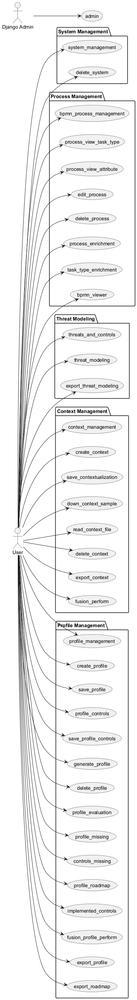
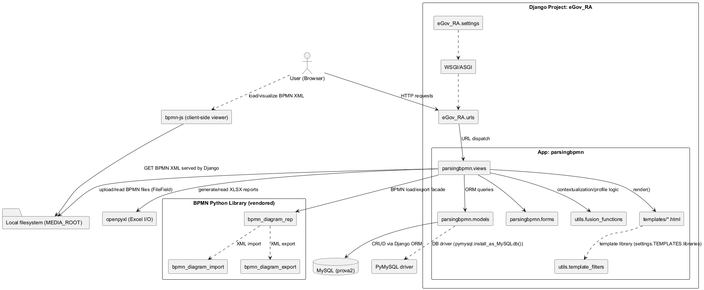
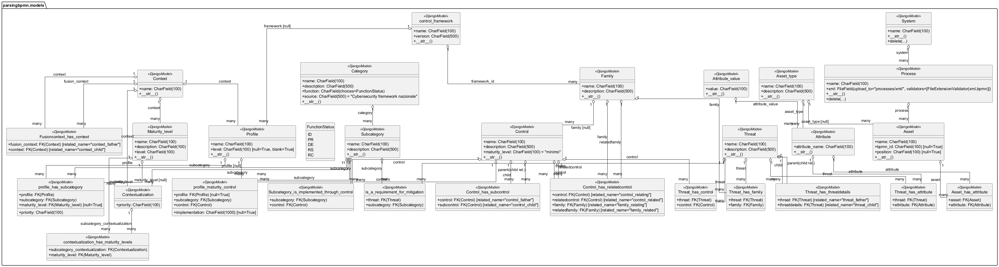
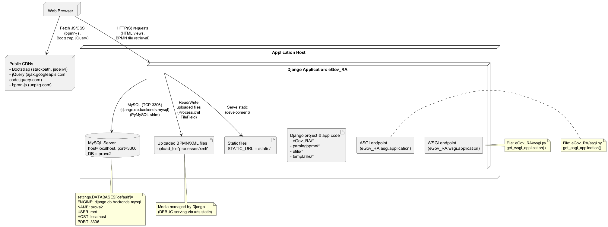

 

% 1 — System Overview
# SECTION 1 — System Overview

This section introduces the software system as implemented in the repository, stating its purpose, scope, and key features strictly derived from the codebase. It is intended to provide a shared understanding for both technical and non-technical stakeholders before deeper architectural views.

## Purpose

The system is a Django-based web application that performs process-centric cybersecurity risk analysis for e-government use cases. It ingests BPMN 2.0 process models, extracts and enriches asset information from tasks and annotations, derives relevant threats and corresponding security controls, and manages contextualization and profiling aligned with control frameworks and maturity levels. Users can create systems and processes, upload BPMN models, review and enrich asset metadata, generate threat/control reports, define and merge contexts, create target and current profiles, evaluate maturity against target levels, identify missing controls, and export outcomes to spreadsheets. The application embeds and uses a BPMN processing library to load, interpret, and optionally export BPMN models.

## Scope

The repository contains the full application stack for the web system:

- The Django project (eGov_RA) with ASGI/WSGI entry points, configuration, URL routing, templates, forms, models, and views.
- A Django app (parsingbpmn) with the domain model for systems, processes, assets, attributes, threats, controls, families, categories, subcategories, contexts, maturity levels, profiles, and their relationships; plus view logic, form handling, and Excel import/export operations.
- An embedded BPMN processing library (parsingbpmn/bpmn_python_master/bpmn_python) supporting BPMN import/export, layout, visualization, CSV transformations, and metrics; used by the application to load BPMN XML and access node/flow metadata.
- A small utility module (utils) for profile/context fusion logic and Django template filters.
- Templated HTML pages implementing the user flows for system/process management, BPMN enrichment and visualization, threat modeling, contextualization, profile management, control selection, and reporting.

The codebase is self-contained and runnable as a Django application with a MySQL backend, and includes all persistence definitions (migrations) for the domain.

## High-level Functional Capabilities

The system’s implemented capabilities are established by the Django views and URL routes (eGov_RA/urls.py) and their underlying logic (parsingbpmn/views.py), the models (parsingbpmn/models.py), the forms, and the templates:

- System and process management. Users can create and delete systems; for a selected system, upload BPMN 2.0 XML/BPMN files to create processes, view existing processes, and delete them. Process files are stored via Django’s FileField and are deleted upon model deletion.

- BPMN ingestion and asset extraction. Upon uploading a BPMN file, the application uses BpmnDiagramGraph (parsingbpmn.bpmn_python_master.bpmn_python.bpmn_diagram_rep) to load the diagram and iterate nodes and flows. It identifies tasks and collects associated BPMN DI positions and dimensions, detects textAnnotation and association nodes, and creates Asset instances (with bpmn_id and position) mapped to Django Asset_type entries. For send/receive/user/service/script/business rule tasks, it infers attribute values from associated text annotations where present and populates Asset_has_attribute entries.

- Asset type and attribute enrichment. If the BPMN did not fully specify types/attributes, the UI guides users through enrichment:
  - process_view_task_type and task_type_enrichment allow assigning an Asset_type to tasks lacking one.
  - process_view_attribute and process_enrichment allow assigning specific Attribute entries (per Asset_type) to each Asset; when saving, attributes are persisted and, for assets with available positional metadata, the code prepares to write corresponding BPMN textAnnotation and association elements (writeTextAnnotation_bpmn stub).

- Threat modeling and control mapping. Given asset attributes, the system looks up Threat_has_attribute relationships to derive threats, and then maps threats to policy controls. The current implementation displays families via Threat_has_family; separate views show aggregated threats/policies (threats_and_controls) and detailed per-asset reports including control descriptions (threat_modeling). Users can export threat modeling results to an Excel workbook.

- BPMN viewing. A dedicated page (bpmn_viewer.html) renders the stored BPMN model in-browser using bpmn-js, loading the XML from the uploaded file path and providing panning/zooming.

- Context (CSF) management and fusion. Users can:
  - Create a new Context, define default maturity levels (Maturity_level) and assign priorities and maturity-level sets to subcategories via Contextualization and contextualization_has_maturity_levels.
  - Upload context data from a provided spreadsheet template (read_context_file) and export a context to Excel (export_context).
  - Merge two contexts (fusion_perform) by reconciling priorities and intersecting maturity-level sets per subcategory; the fusion is persisted as a new Context and linked to the originals via Fusioncontext_has_context.

- Profile management, generation, evaluation, and export. Users can:
  - Create a current Profile linked to a Context and select the control framework (control_framework) and optional level.
  - Generate a target Profile for a chosen framework and level (minimo/standard/avanzato). Generation selects Controls bound to Families in the chosen framework and derives profile_has_subcategory rows with maturity levels resolved from context definitions; Subcategory_is_implemented_through_control links drive the per-subcategory control set.
  - Select and record implemented controls per subcategory with free-text implementation notes (profile_controls and save_profile_controls).
  - Evaluate a current profile against target maturity thresholds using the profile_has_subcategory maturity levels (profile_evaluation). The evaluation adjusts maturity per subcategory based on implemented controls compared to target sets (minimo → standard → avanzato), sets profile.level to insufficiente/minimo/standard/avanzato accordingly, and persists the results.
  - Compute missing controls for roadmaping, either comparing the current profile to the next maturity level (profile_missing) or fusing current with a target profile (fusion_profile_perform), then display and export a roadmap (controls_missing, export_roadmap). Implemented controls can also be listed (implemented_controls). Profiles and profile contents can be exported to Excel (export_profile).

- BPMN processing library features (embedded). The bpmn_python_master library supports:
  - Import of BPMN XML with DI, including participants, lanes, flows (sequence and message), event definitions, annotations, and associations.
  - Export of BPMN XML with DI and without DI.
  - CSV import/export transformations of BPMN models based on an ordering scheme.
  - Automatic layout generation, diagram metrics, and visualization helpers (matplotlib, pydotplus). While present and tested in the embedded package, the Django app primarily uses the XML import facility.

## Key Implementation Characteristics

The application is built on Django with the following salient characteristics derived from the code:

- Project configuration. eGov_RA.settings uses DEBUG=True and ALLOWED_HOSTS=['*'], configures MySQL (ENGINE=django.db.backends.mysql) with database name prova2, and integrates a custom template library utils.template_filters. ASGI and WSGI entry points are provided. The parsingbpmn app is installed.

- Data model. The parsingbpmn/models.py module defines a comprehensive schema covering:
  - Core process data: System, Process (with XML file), Asset_type, Asset (with BPMN id and DI position), Attribute_value, Attribute, and linkage Asset_has_attribute.
  - Threats and controls: Threat, Threat_has_attribute, Control, Family (linked to control_framework), Threat_has_control, Threat_has_family, Control_has_subcontrol, Control_has_relatedcontrol, Subcategory_is_implemented_through_control.
  - CSF taxonomy: Category (with FunctionStatus choices: ID/PR/DE/RS/RC), Subcategory.
  - Context and maturity: Context, Contextualization, Maturity_level, contextualization_has_maturity_levels, Fusioncontext_has_context.
  - Profiles and evaluation: Profile (linked to Context and control_framework), profile_has_subcategory (with selected Maturity_level), profile_maturity_control (per-subcategory control selection with implementation notes), Threat_has_threatdetails.
  Deletion hooks on System and Process ensure uploaded files are cleaned up.

- Request handling and templates. Views (parsingbpmn/views.py) implement the user flows, including Excel workbook generation using openpyxl and structured generation of reports. Templates in templates/ provide the UI pages referenced by routes and embed bpmn-js for BPMN visualization.

- Embedded BPMN library. The embedded bpmn_python_master package encapsulates:
  - Graph classes and constants for BPMN entities.
  - Import/export logic using xml.dom.minidom and ElementTree.
  - CSV transformations, layouter, and metrics.
  - Unit tests and examples for the library. Within the Django app, the import API is directly used to parse uploaded models.

Overall, the implemented system is a monolithic Django web application with a MySQL persistence layer and a client-side BPMN model viewer, providing end-to-end functionality from BPMN ingestion through risk analysis, context/profile management, to actionable control roadmaps and report exports.

% 2 — Architectural Context
## 2. Architectural Context

This section describes the runtime environment surrounding the Django-based eGov_RA application, the external systems and libraries it depends on, the HTTP interfaces it exposes, and the concrete data sources it reads from and writes to. All elements enumerated here are derived from the provided codebase, configuration, and templates without introducing assumptions beyond the implementation.

### External Systems

- MySQL database server
  - Configured in eGov_RA/settings.py under DATABASES["default"] with ENGINE django.db.backends.mysql, NAME prova2, USER root, HOST localhost, PORT 3306.
  - Accessed via PyMySQL (installed and registered in parsingbpmn/__init__.py).
- Web browser (client)
  - Renders Django templates and interacts with the application via HTTP.
  - Loads BPMN viewer JavaScript libraries from a public CDN (see below) to visualize BPMN files.
- Public CDN for front-end libraries
  - unpkg CDN is used by templates/bpmn_viewer.html to load bpmn-js (BPMN model viewer) scripts:
    - https://unpkg.com/bpmn-js@7.4.0/dist/bpmn-viewer.development.js
    - https://unpkg.com/bpmn-js@7.4.0/dist/bpmn-navigated-viewer.development.js

### APIs / Interfaces

The application exposes the following HTTP routes (URL patterns) and associated views (all defined in eGov_RA/urls.py and implemented in parsingbpmn/views.py):

- admin/ → Django admin site.
- "" (root) → system_management: list/create Systems.
- bpmn_process_management/<int:pk> → bpmn_process_management: list/upload BPMN Processes for System pk; parses BPMN XML and persists Assets and attributes.
- process_view_task_type/<int:pk> → process_view_task_type: review/complete Asset type enrichment for Process pk.
- process_view_attribute/<int:pk> → process_view_attribute: review/complete Asset attribute enrichment for Process pk.
- edit_process/<int:pk> → edit_process: re-open attribute enrichment UI for Process pk.
- delete_process/<int:pk> → delete_process: delete Process pk (and its uploaded BPMN file).
- delete_system/<int:pk> → delete_system: delete System pk (and related Processes and files).
- process_enrichment/<int:pk> → process_enrichment: persist selected attributes for Assets of Process pk; attempts BPMN annotation.
- bpmn_viewer/<int:pk> → bpmn_viewer: BPMN diagram rendering page (client-side bpmn-js).
- task_type_enrichment/<int:pk> → task_type_enrichment: persist selected Asset types for Process pk.
- threats_and_controls/<int:pk> → threats_and_controls: aggregate Threats and (Family-based) countermeasures for Process pk.
- threat_modeling/<int:pk> → threat_modeling: detailed per-Asset Threats, related Families, and policy composition for Process pk.
- export_threat_modeling/<int:pk> → export_threat_modeling: export Threat Modeling report to XLSX for Process pk.
- context_management → context_management: list/create Contexts; links to sample download and import.
- profile_management/<int:pk> → profile_management: manage Profiles for Context pk (create/generate/list/evaluate/export).
- fusion_perform → fusion_perform: merge two Contexts into a new Context; copies contextualization and maturity levels.
- fusion_profile_perform → fusion_profile_perform: compute upgrade plan to a target Profile level within same Context/framework.
- controls_missing → controls_missing: display missing controls (from session-computed results).
- profile_roadmap/<int:pk> → profile_roadmap: compute implemented controls for Profile pk and prepare implemented_controls view.
- delete_profile/<int:pk> → delete_profile: delete Profile pk.
- delete_context/<int:pk> → delete_context: delete Context pk (and related Profiles).
- create_context → create_context: UI to select subcategories and default maturity levels; posts to save_contextualization.
- save_contextualization → save_contextualization: persist Context, Contextualization, and contextualization_has_maturity_levels records.
- create_profile/<int:pk> → create_profile: start Profile creation for Context pk; captures subcategory list in session.
- save_profile/<int:pk> → save_profile: persist Profile for Context pk; saves profile_has_subcategory and redirects to controls selection.
- profile_controls/<int:pk> → profile_controls: UI to select controls per subcategory for Profile pk; filters by chosen framework.
- save_profile_controls/<int:pk> → save_profile_controls: persist selected controls and their implementation text for Profile pk.
- down_context_sample → down_context_sample: download contextualization sample XLSX from utils/Contestualizzazione_sample.xlsx.
- read_context_file → read_context_file: import contextualization from uploaded XLSX (Sheet1); creates Context, Contextualization, and maturity links.
- generate_profile/<int:pk> → generate_profile: auto-generate a target Profile for Context pk based on chosen framework and level, deriving controls from Subcategory_is_implemented_through_control and Control.maturity_level.
- profile_evaluation/<int:pk> → profile_evaluation: compute Profile pk’s maturity per subcategory and overall level; record missing controls.
- profile_missing/<int:pk> → profile_missing: compute missing controls to reach next level from current Profile pk.
- export_context/<int:pk> → export_context: export Context pk data (function, categories, subcategories, priority, maturity levels) to XLSX.
- export_profile/<int:pk> → export_profile: export Profile pk data (function/category/subcategory, priority, maturity level, controls, implementation) to XLSX.
- export_roadmap/<int:pk> → export_roadmap: export missing-control roadmap (availability, subcategory, controls) to XLSX.
- implemented_controls → implemented_controls: display implemented controls for the last selected Profile (session-backed).

Client-side integration visible in templates:

- bpmn_viewer.html initializes a bpmn-js viewer and loads the uploaded BPMN XML via XHR from the MEDIA storage path.

Programmatic library interfaces (server-side):

- BPMN processing via internal library parsingbpmn/bpmn_python_master/bpmn_python:
  - Import/export of BPMN XML, CSV; graph representation and layout; metrics; diagram visualization helpers.
  - Used in views to parse uploaded BPMN XML and derive nodes, associations, annotations, positions, and types.

### Data Sources

- MySQL database (prova2)
  - All Django ORM models in parsingbpmn/models.py: System, Process, Asset_type, Asset, Attribute_value, Attribute, Threat, Threat_has_attribute, Threat_has_control, Threat_has_family, Family, control_framework, Category, Subcategory, Context, Contextualization, contextualization_has_maturity_levels, Profile, profile_has_subcategory, Maturity_level, profile_maturity_control, is_a_requirement_for_mitigation, Subcategory_is_implemented_through_control, Threat_has_threatdetails, Control_has_subcontrol, Control_has_relatedcontrol, Fusioncontext_has_context.
- File system storage
  - Uploaded BPMN files stored under processes/xml/ (Process.xml FileField); MEDIA_ROOT is project base directory; MEDIA_URL empty string in settings.
  - Downloadable contextualization sample: utils/Contestualizzazione_sample.xlsx.
  - Generated XLSX exports created in-memory and streamed to clients via HttpResponse (openpyxl); not persisted on disk by the application.
- BPMN XML content
  - Parsed directly from uploaded Process.xml via the internal BPMN library to populate Assets and their attributes/types.
  - Optionally intended to be annotated (writeTextAnnotation_bpmn stub); the function reads and parses the BPMN XML text for potential updates.

### Users / Actors

- Django admin user
  - Explicitly exposed via admin/ and django.contrib.admin; can manage models through the admin interface.
- Web user (anonymous or authenticated)
  - Interacts with all application views/forms; no explicit authentication or authorization checks are enforced in views.py.
  - Initiates system creation, BPMN upload, enrichment, threat modeling exports, context/profile management, and roadmap generation from a web browser.

% 2.1 — Architectural Context – Use Case Diagram
# SECTION 2.1 — Architectural Context – Use Case Diagram

This section presents the externally visible interactions of the eGov_RA web application as a Use Case diagram, derived strictly from the exposed HTTP endpoints and their bound Django views. The diagram identifies two external actors. The primary actor, denoted as User, interacts with every application capability implemented by urls.py and views.py, including system creation and selection, BPMN process ingestion and enrichment, threat modeling, contextualization management, profile generation and evaluation, and corresponding exports. The Administrator actor represents access to the Django administration endpoint that is exposed in the routing configuration. Use cases are grouped to mirror coherent functional areas observable in the codebase; the labels of use cases match the actual named endpoints, ensuring verifiability against the implementation.

Figure file: section-2-1-usecase.puml

Caption: Use Case diagram of the eGov_RA application derived from urls.py and views.py (file: section-2-1-usecase.puml).

% 3 — Containers
## 3. Containers

This section identifies the runtime containers that compose the system as implemented. It focuses on executable applications and data stores, the technologies they use, and the communication mechanisms between them. The Django application hosts the domain logic and BPMN processing library, while persistence and static assets are handled by MySQL and the local filesystem. The user interacts via a web browser that also fetches front-end libraries from public CDNs.

| Container | Responsibility | Technology | Communication |
|---|---|---|---|
| Web Browser (User Agent) | Presents the UI, submits forms, downloads exports, and renders BPMN diagrams using a client-side viewer. | HTML5, JavaScript, bpmn-js 7.4.0 (loaded from CDN), Bootstrap 4 | HTTP/HTTPS to Django application; HTTPS to public CDNs; HTTP GET to fetch uploaded BPMN XML from Django-served media path |
| eGov_RA Django Application | Serves web pages and APIs; handles BPMN file upload, parsing and enrichment; persists and queries domain data; generates Excel exports; implements threat modeling and profile logic. | Python 3.x, Django 3.1, parsingbpmn app; internal library parsingbpmn/bpmn_python_master (networkx, xml.dom.minidom, pydotplus, matplotlib as used by library/tests), openpyxl; PyMySQL (MySQLdb shim) | HTTP (WSGI/ASGI) with browser; SQL over TCP to MySQL; local file I/O to store/read BPMN files; HTTP file serving for media (in DEBUG) |
| MySQL Database | Persists all domain entities and relationships (System, Process, Asset, Attributes, Threats, Controls, Categories, Subcategories, Contexts, Profiles, maturity levels, mappings). | MySQL (django.db.backends.mysql) using PyMySQL; database name “prova2” on localhost:3306 | SQL/TCP (port 3306) from Django ORM |
| Local File Storage (Processes XML) | Stores uploaded BPMN files under processes/xml/; provides files for download and for server-side BPMN parsing/enrichment. | OS filesystem via Django FileField; MEDIA_ROOT at project base dir; MEDIA_URL set to empty string; Django static() serves media in DEBUG | File I/O from Django; HTTP file serving to browser (DEBUG mode) |
| External CDNs for front-end libraries | Hosts client-side assets required by the browser (bpmn-js, Bootstrap). | unpkg.com/jsDelivr/MaxCDN | HTTPS from browser to CDN |

% 3.1 — Architecture Overview – Component Diagram
# SECTION 3.1 — Architecture Overview – Component Diagram

This section presents the component-level architecture of the eGov_RA Django application, based strictly on the inspected source code. It identifies the main runtime building blocks, their responsibilities, and the precise dependencies among them. The goal is to provide an accurate, verifiable overview that matches the current implementation and can be validated by the development team.

## Component Diagram

The diagram shows the Django project and its app components, the vendored BPMN processing library, the database and file-system integration, and the client-side BPMN viewer used by the templates.

## Component-to-Source Mapping

The table below enumerates the depicted components and the exact source entries they represent, enabling straightforward verification against the codebase.

| Component | Responsibility | Key source files and entries |
|---|---|---|
| eGov_RA.settings | Django configuration (apps, middleware, DB, templates, media) | eGov_RA/settings.py |
| eGov_RA.urls | URL routing to view functions | eGov_RA/urls.py (imports from parsingbpmn.views) |
| WSGI/ASGI | Deployment entry points | eGov_RA/wsgi.py, eGov_RA/asgi.py |
| parsingbpmn.views | Application logic: system/process management, BPMN parsing and enrichment, CSF context/profile flow, report exports | parsingbpmn/views.py (imports diagram.BpmnDiagramGraph, openpyxl, utils) |
| parsingbpmn.models | Domain model and ORM mappings | parsingbpmn/models.py, plus migrations/ |
| parsingbpmn.forms | Forms for System, Process, Context, Profile, Fusion | parsingbpmn/forms.py |
| utils.fusion_functions | Context/profile fusion and comparison algorithms | utils/fusion_functions.py |
| utils.template_filters | Custom template filters used by templates | utils/template_filters.py; registered in settings.TEMPLATES['OPTIONS']['libraries'] |
| templates/*.html | Server-side views rendered to the browser; includes bpmn_viewer embedding bpmn-js | templates/ directory (all listed *.html) |
| BPMN Python Library — bpmn_diagram_rep | BPMN graph representation and high-level API used by views | parsingbpmn/bpmn_python_master/bpmn_python/bpmn_diagram_rep.py |
| BPMN Python Library — bpmn_diagram_import | XML import into BPMN graph | parsingbpmn/bpmn_python_master/bpmn_python/bpmn_diagram_import.py |
| BPMN Python Library — bpmn_diagram_export | XML export from BPMN graph | parsingbpmn/bpmn_python_master/bpmn_python/bpmn_diagram_export.py |
| MySQL (prova2) | Application database | Configured in settings.DATABASES (ENGINE django.db.backends.mysql) |
| PyMySQL driver | MySQL DB driver for Django | parsingbpmn/__init__.py (pymysql.install_as_MySQLdb()) |
| Local filesystem (MEDIA_ROOT) | Persistent storage for uploaded BPMN XML files | settings.MEDIA_ROOT; Process.xml FileField (upload_to='processes/xml/') |
| openpyxl (Excel I/O) | XLSX import/export for context, profiles, threat modeling reports | Used in parsingbpmn/views.py (Workbook, load_workbook) |
| bpmn-js (client-side viewer) | BPMN diagram visualization in browser | templates/bpmn_viewer.html (scripts from unpkg.com) |

This component view is intentionally aligned with the runtime architecture evidenced in the source. It reflects concrete interactions: URL dispatching to view functions, view usage of forms/models and the vendored BPMN library, file-based storage of BPMN XML, Excel I/O via openpyxl, persistence via Django ORM to MySQL via PyMySQL, custom template filters wired in settings, and the client-side bpmn-js viewer invoked by templates.

% 4 — Components
## 4. Components

This section identifies and describes the internal components found in each container of the system, based strictly on the source code. It covers Django project and app modules, the embedded BPMN processing library, utilities, and the presentation layer. For every component, the responsibility and its key interactions (imports, function calls, foreign key relations, or usage within other modules) are listed to enable validation by the development team.

### 4.1 Django Project Container — eGov_RA

| Component | Responsibility | Interactions |
|---|---|---|
| eGov_RA/manage.py | Django management entrypoint; bootstraps Django CLI. | Imports eGov_RA.settings; uses django.core.management.execute_from_command_line. |
| eGov_RA/asgi.py | ASGI application setup for async servers. | Reads DJANGO_SETTINGS_MODULE=eGov_RA.settings; uses django.core.asgi.get_asgi_application. |
| eGov_RA/wsgi.py | WSGI application setup for sync servers. | Reads DJANGO_SETTINGS_MODULE=eGov_RA.settings; uses django.core.wsgi.get_wsgi_application. |
| eGov_RA/settings.py | Global Django configuration: installed apps, middleware, templates, database, static. | INSTALLED_APPS include parsingbpmn; DATABASES uses MySQL; templates load utils.template_filters; uses django.* subsystems. |
| eGov_RA/urls.py | URL routing; binds paths to parsingbpmn.views endpoints; serves media in DEBUG. | Imports django.contrib.admin, parsingbpmn.views functions; uses django.conf.settings and django.conf.urls.static. |

### 4.2 Django App Container — parsingbpmn

| Component | Responsibility | Interactions |
|---|---|---|
| parsingbpmn/__init__.py | Replaces MySQLdb with PyMySQL for Django’s MySQL backend. | Calls pymysql.install_as_MySQLdb; impacts Django DB layer from settings.py. |
| parsingbpmn/apps.py (ParsingbpmnConfig) | Declares Django AppConfig. | App discovery via INSTALLED_APPS. |
| parsingbpmn/admin.py | Placeholder for admin registrations. | None currently. |
| parsingbpmn/forms.py (SystemForm) | ModelForm for System (name). | Uses parsingbpmn.models.System. |
| parsingbpmn/forms.py (ProcessForm) | ModelForm for Process (name, xml); excludes system_id set in view. | Uses parsingbpmn.models.Process. |
| parsingbpmn/forms.py (ContextualizationForm) | ModelForm for Context (name). | Uses parsingbpmn.models.Context. |
| parsingbpmn/forms.py (ProfileForm) | ModelForm for Profile (name, level, framework); excludes context. | Uses parsingbpmn.models.Profile and control_framework FK. |
| parsingbpmn/forms.py (FusionForm) | Form selecting two Profile instances (actual, target). | Queries parsingbpmn.models.Profile. |
| parsingbpmn/forms.py (SelectContextForm) | Form selecting two Context instances for fusion. | Queries parsingbpmn.models.Context. |
| parsingbpmn/models.py (System) | Business system; parent of Process; cascade delete cleans files. | FK from Process; used by views, forms. |
| parsingbpmn/models.py (Process) | A BPMN process with uploaded XML/BPMN file; linked to System. | FK to System; used in views to parse BPMN; referenced by Asset. |
| parsingbpmn/models.py (Asset_type) | Classifies Assets (Send/User/Service/… task types). | FK from Attribute; used in enrichment UI. |
| parsingbpmn/models.py (Asset) | Represents BPMN task node in DB; stores bpmn_id and diagram position. | FK to Process and Asset_type; joined via Asset_has_attribute; used in views. |
| parsingbpmn/models.py (Attribute_value) | Atomic attribute values (e.g., PEC communication). | FK from Attribute. |
| parsingbpmn/models.py (Attribute) | Attribute definition for an Asset_type with an Attribute_value. | FK to Asset_type and Attribute_value; linked via Asset_has_attribute; used in threat mapping. |
| parsingbpmn/models.py (Threat) | Threat catalog entry. | Linked via Threat_has_attribute; Threat_has_control/Threat_has_family; used in views. |
| parsingbpmn/models.py (control_framework) | Control framework (name, version). | FK from Family; FK from Profile (framework). |
| parsingbpmn/models.py (Family) | Control family under a framework. | FK to control_framework; FK from Control; joined via Threat_has_family. |
| parsingbpmn/models.py (Control) | Concrete control (name, description, maturity_level, family). | FK to Family; linked via Subcategory_is_implemented_through_control, Threat_has_control, Control_* relations. |
| parsingbpmn/models.py (Asset_has_attribute) | Junction of Asset to Attribute (assigned attribute). | FK to Asset and Attribute; written by enrichment flow. |
| parsingbpmn/models.py (Threat_has_attribute) | Maps Threats to triggering Attributes. | FK to Threat and Attribute; traversed in threat modeling. |
| parsingbpmn/models.py (Threat_has_control) | Maps Threat to specific Control (not primary in current views). | FK to Threat and Control. |
| parsingbpmn/models.py (Threat_has_family) | Maps Threat to Control Family (used in views). | FK to Threat and Family. |
| parsingbpmn/models.py (Category, FunctionStatus) | CSF category with function enumeration and source. | FK from Subcategory; exported in context/profile sheets. |
| parsingbpmn/models.py (Subcategory) | CSF subcategory under Category. | FK to Category; mapped to controls by Subcategory_is_implemented_through_control; linked in Contextualization/Profile. |
| parsingbpmn/models.py (Context) | A contextualization container. | FK from Contextualization; referenced by Profile, Maturity_level, Fusioncontext_has_context. |
| parsingbpmn/models.py (Contextualization) | Priority of Subcategory within a Context. | FK to Context and Subcategory; joined via contextualization_has_maturity_levels. |
| parsingbpmn/models.py (Profile) | Profile for a Context and Framework; has level and selected controls. | FK to Context and control_framework; linked via profile_has_subcategory and profile_maturity_control. |
| parsingbpmn/models.py (Maturity_level) | Context-bound maturity level definition (name, description, level). | FK to Context; linked via contextualization_has_maturity_levels and Profile. |
| parsingbpmn/models.py (contextualization_has_maturity_levels) | Junction linking Contextualization to Maturity_level. | FK to both; built during context creation/import. |
| parsingbpmn/models.py (profile_has_subcategory) | Junction linking Profile to Subcategory with priority and maturity. | FK to Profile, Subcategory, Maturity_level. |
| parsingbpmn/models.py (profile_maturity_control) | Junction of Profile–Subcategory–Control with optional implementation text. | FK to Profile, Subcategory, Control; used in exports and evaluation. |
| parsingbpmn/models.py (is_a_requirement_for_mitigation) | Maps Threat to required Subcategory. | FK to Threat and Subcategory. |
| parsingbpmn/models.py (Subcategory_is_implemented_through_control) | Maps Subcategory to implementing Controls. | FK to Subcategory and Control; used when generating/selecting controls. |
| parsingbpmn/models.py (Threat_has_threatdetails) | Threat composition relation (parent–child Threat). | Self-relations via related_name. |
| parsingbpmn/models.py (Control_has_subcontrol) | Control decomposition (parent–child). | Self-relations via related_name. |
| parsingbpmn/models.py (Control_has_relatedcontrol) | Control relationships across families. | FK to Control and Family pairs. |
| parsingbpmn/models.py (Fusioncontext_has_context) | Links fused Context to its source Contexts. | FK to Context via related_name context_father/context_child. |
| parsingbpmn/views.py (system_management) | List/create Systems; redirect to process management. | Uses SystemForm, System; renders system_management.html. |
| parsingbpmn/views.py (bpmn_process_management) | Uploads BPMN, parses BPMN file, auto-creates Assets and attributes from textAnnotations/associations; lists processes. | Uses ProcessForm, Process, Asset, Asset_type, Attribute_value/Attribute, Asset_has_attribute; bpmn_python_master.bpmn_python.bpmn_diagram_rep; renders bpmn_process_management.html. |
| parsingbpmn/views.py (delete_system) | Deletes a System (cascades to Processes). | Uses System.delete(). |
| parsingbpmn/views.py (delete_process) | Deletes a Process (file removed via model delete). | Uses Process.delete(). |
| parsingbpmn/views.py (process_view_task_type) | Shows Assets requiring type enrichment; forwards to attribute view. | Uses Asset, Asset_type; renders process_view_task_type.html. |
| parsingbpmn/views.py (task_type_enrichment) | Persists selected Asset_type per Asset. | Updates Asset.asset_type. |
| parsingbpmn/views.py (process_view_attribute) | Shows missing attributes per Asset; provides attribute selection. | Uses Asset_has_attribute, Attribute; renders process_view_attribute.html. |
| parsingbpmn/views.py (process_enrichment) | Saves selected Attribute for Asset; contains helper to write BPMN TextAnnotation (stubbed). | Writes Asset_has_attribute; calls writeTextAnnotation_bpmn; uses file path from Process.xml. |
| parsingbpmn/views.py (get_random_string) | Helper to generate random IDs for BPMN elements. | Used by writeTextAnnotation_bpmn. |
| parsingbpmn/views.py (writeTextAnnotation_bpmn) | Prepares XML snippets for textAnnotation and association; currently parses minidom for process membership; scaffolding for writing back. | Reads file path; uses xml.dom.minidom; interacts with BPMN XML (no write). |
| parsingbpmn/views.py (edit_process) | Pre-fills attribute selection UI (non-destructive). | Uses Asset, Attribute sets; renders process_view_attribute.html. |
| parsingbpmn/views.py (threats_and_controls) | Aggregates Threats from Attributes, then Families as policies for the Process; summary page. | Joins Asset → Asset_has_attribute → Threat_has_attribute → Threat_has_family; renders threats_and_controls.html. |
| parsingbpmn/views.py (threat_modeling) | Detailed per-asset Threats and Controls; composes modal content. | Same joins as above, expands controls_per_asset; renders threat_modeling.html. |
| parsingbpmn/views.py (export_threat_modeling) | Exports Threat Modeling report to XLSX (assets, attributes, threats, policies). | openpyxl; queries multiple joins; returns HttpResponse with workbook. |
| parsingbpmn/views.py (bpmn_viewer) | Embeds BPMN viewer (frontend uses bpmn-js). | Renders bpmn_viewer.html with Process.xml URL. |
| parsingbpmn/views.py (context_management) | Lists, creates Context; provides fusion UI and upload entrypoints. | Uses ContextualizationForm, SelectContextForm; renders context_management.html. |
| parsingbpmn/views.py (create_context) | Presents context creation form with Category/Subcategory list and priorities. | Queries Category, Subcategory; renders create_context.html. |
| parsingbpmn/views.py (save_contextualization) | Saves new Context, Contextualization rows, creates Maturity_level rows, and links via contextualization_has_maturity_levels. | Uses models Context, Subcategory, Contextualization, Maturity_level, contextualization_has_maturity_levels; regex for ID extraction. |
| parsingbpmn/views.py (fusion_perform) | Merges two Contexts by priority and maturity levels using utils; creates fused Context and links sources. | Uses utils.fusion_functions (convertFrom/ToDatabase, comparingmaturity, checkPriority), Fusioncontext_has_context. |
| parsingbpmn/views.py (profile_management) | Lists Profiles for a Context; hosts forms for generation and fusion. | Queries Profile; renders profile_management.html. |
| parsingbpmn/views.py (generate_profile) | Generates a target Profile for a Context and framework at chosen level; populates profile_has_subcategory and profile_maturity_control based on Subcategory→Control mapping and framework. | Uses ProfileForm, Profile, Contextualization, Family, Control, Subcategory_is_implemented_through_control, Maturity_level, profile_has_subcategory, profile_maturity_control. |
| parsingbpmn/views.py (create_profile) | Starts manual Profile creation; stores Subcategory list in session. | Uses Contextualization, Subcategory; renders create_profile.html. |
| parsingbpmn/views.py (save_profile) | Persists new Profile and profile_has_subcategory priorities from form; stores list in session. | Uses Profile, profile_has_subcategory. |
| parsingbpmn/views.py (profile_controls) | Displays per-subcategory Controls for selected Framework; stores selection matrix in session. | Uses Profile, Family, Control, Subcategory_is_implemented_through_control; renders profile_controls.html. |
| parsingbpmn/views.py (save_profile_controls) | Saves profile_maturity_control records with optional implementation text from form. | Uses profile_maturity_control. |
| parsingbpmn/views.py (profile_roadmap) | Prepares implemented controls list for a Profile; stores in session; redirects to implemented_controls. | Uses profile_maturity_control; utils.createdict. |
| parsingbpmn/views.py (implemented_controls) | Renders implemented controls per Subcategory; joins framework for display. | Uses Subcategory, Control, Family, profile_maturity_control; template filters. |
| parsingbpmn/views.py (profile_evaluation) | Evaluates a Profile level by comparing with target “minimo/standard/avanzato” profiles; updates per-subcategory maturity; computes missing controls. | Uses Maturity_level, profile_has_subcategory, Profile, profile_maturity_control; utils.createdict/comparingcontrols. |
| parsingbpmn/views.py (profile_missing) | Computes missing controls to reach next level or target framework/profile; stores in session. | Uses Profile, profile_maturity_control; utils.createdict/profileupgrade. |
| parsingbpmn/views.py (controls_missing) | Displays missing controls; computes availability by subcategory presence in profile. | Uses profile_has_subcategory, Subcategory, Control, Family; template filters; prepares export. |
| parsingbpmn/views.py (fusion_profile_perform) | Fusion of an actual profile with target maturity set; computes missing controls via utils. | Uses FusionForm, Profile, profile_maturity_control; utils.createdict/merge/profileupgrade fusionprofileandupgrade. |
| parsingbpmn/views.py (delete_context) | Deletes a Context and cascades. | Uses Context.delete(). |
| parsingbpmn/views.py (delete_profile) | Deletes a Profile; redirects to its Context. | Uses Profile.delete(). |
| parsingbpmn/views.py (down_context_sample) | Serves contextualization XLSX template. | Reads utils/Contestualizzazione_sample.xlsx; returns HttpResponse. |
| parsingbpmn/views.py (read_context_file) | Imports contextualization from uploaded XLSX; creates Context, Contextualization, Maturity levels and links. | Uses openpyxl; Context, Contextualization, Maturity_level, contextualization_has_maturity_levels. |
| parsingbpmn/views.py (export_context) | Exports Contextualization to XLSX with function/category/subcategory mapping and maturity levels. | Uses Category, Subcategory, Contextualization, Maturity_level, contextualization_has_maturity_levels; openpyxl. |
| parsingbpmn/views.py (export_profile) | Exports Profile to XLSX including controls and implementations. | Uses profile_has_subcategory, Maturity_level, profile_maturity_control, Control. |
| parsingbpmn/views.py (export_roadmap) | Exports missing controls roadmap to XLSX; uses session data from controls_missing. | Uses Subcategory, Control; openpyxl. |
| parsingbpmn/migrations/0001…0045 | Schema migrations defining and evolving DB structures for all models. | Applied by Django migration system; reflect models.py history. |

### 4.3 Embedded BPMN Library Container — parsingbpmn/bpmn_python_master/bpmn_python

| Component | Responsibility | Interactions |
|---|---|---|
| bpmn_python/__init__.py | Exposes library modules via __all__. | Subpackages and modules listed. |
| bpmn_diagram_exception.BpmnPythonError | Custom exception for BPMN operations. | Raised by export/import/CSV modules. |
| bpmn_python_consts.Consts | Centralized constant strings for BPMN keys, tags, and CSV headers. | Used across all BPMN modules and graph/classes. |
| bpmn_diagram_rep.BpmnDiagramGraph | Core in-memory representation of BPMN diagram using networkx; provides high-level API to create/load/save/query nodes and flows. | Uses networkx; uses bpmn_diagram_import/export/CSV import/export; bpmn_python_consts; bpmn_diagram_exception. Called by parsingbpmn.views (import). |
| bpmn_diagram_import.BpmnDiagramGraphImport | Parses BPMN XML (minidom) into BpmnDiagramGraph; imports nodes, flows, lanes, collaborations, shapes/edges, associations and textAnnotations. | Uses minidom; bpmn_import_utils; bpmn_python_consts; populates diagram_graph. |
| bpmn_diagram_export.BpmnDiagramGraphExport | Serializes BpmnDiagramGraph to BPMN XML with DI (or without); writes nodes, flows, lanes, participants, shapes, and waypoints. | Uses xml.etree.ElementTree; bpmn_python_consts; filesystem operations. |
| bpmn_diagram_layouter | Computes grid layout, node coordinates, and flow waypoints; topological sort with handling of joins/splits. | Uses bpmn_python_consts; grid_cell_class. |
| bpmn_diagram_visualizer | Visualization with matplotlib/pydotplus; outputs DOT/PNG; draws nodes by type. | Uses networkx, pydotplus, matplotlib; bpmn_python_consts. |
| bpmn_diagram_metrics | Computes various complexity/structure metrics (counts, degrees, squares). | Uses BpmnDiagramGraph APIs; collections, math. |
| bpmn_import_utils.BpmnImportUtils | Utilities for namespace handling, node classification, element iteration; classification of split/join. | Used by import and CSV export. |
| bpmn_process_csv_import (helpers + BpmnDiagramGraphCSVImport) | Reads CSV into BpmnDiagramGraph; infers gateways/splits/merges; builds edges and sequence flows; post-process cleanup. | Uses pandas; regex; bpmn_python_consts; bpmn_diagram_exception; BpmnDiagramGraph API. |
| bpmn_process_csv_export.BpmnDiagramGraphCsvExport | Traverses BpmnDiagramGraph from start; exports linearized branching to CSV with order/conditions. | Uses os; bpmn_python_consts; BpmnImportUtils; raises BpmnPythonError when needed. |
| diagram_layout_metrics | Geometric metrics based on waypoints: crossing points, segments, longest path. | Uses bpmn_python_consts; operates on flows and waypoints. |
| grid_cell_class.GridCell | Data structure used by layouter to place nodes on grid. | Used by bpmn_diagram_layouter. |
| test.py | Ad-hoc script loading a diagram and printing flows. | Uses BpmnDiagramGraph. |

Graph/class subpackage for BPMN meta-model:

| Component | Responsibility | Interactions |
|---|---|---|
| graph/classes/base_element_type.BaseElement | Base with id; setter validation. | Parent of FlowElement, LaneSet, Lane, MessageFlow, Participant. |
| graph/classes/flow_element_type.FlowElement | Base with name; extends BaseElement. | Parent of FlowNode and SequenceFlow. |
| graph/classes/flow_node_type.FlowNode | Adds incoming/outgoing refs (lists of flow IDs). | Parent of Event, Activity, Gateway. |
| graph/classes/activities/activity_type.Activity | Activity base; default flow reference. | Extends FlowNode; parent of Task, SubProcess. |
| graph/classes/activities/task_type.Task | Leaf Activity type. | Extends Activity. |
| graph/classes/activities/subprocess_type.SubProcess | Has triggered_by_event, lane_sets, and flow_elements. | Extends Activity; references lane_set.LaneSet, flow_element.FlowElement. |
| graph/classes/events/event_type.Event | Base Event. | Extends FlowNode; parent classes CatchEvent/ThrowEvent/Start/End/Intermediate. |
| graph/classes/events/catch_event_type.CatchEvent | Catch events with parallel_multiple and event_definitions. | Extends Event; references root_element.EventDefinition. |
| graph/classes/events/throw_event_type.ThrowEvent | Throw events with event_definitions. | Extends Event; references root_element.EventDefinition. |
| graph/classes/events/start_event_type.StartEvent | Start event specialization of CatchEvent. | Extends CatchEvent. |
| graph/classes/events/end_event_type.EndEvent | End event specialization of ThrowEvent. | Extends ThrowEvent. |
| graph/classes/events/intermediate_catch_event_type.IntermediateCatchEvent | Intermediate catch event. | Extends CatchEvent. |
| graph/classes/events/intermediate_throw_event_type.IntermediateThrowEvent | Intermediate throw event. | Extends ThrowEvent. |
| graph/classes/gateways/gateway_type.Gateway | Base for gateways with gatewayDirection enum. | Extends FlowNode; parent of Exclusive/Inclusive/Parallel. |
| graph/classes/gateways/exclusive_gateway_type.ExclusiveGateway | Exclusive gateway with default flow. | Extends Gateway. |
| graph/classes/gateways/inclusive_gateway_type.InclusiveGateway | Inclusive gateway with default flow. | Extends Gateway. |
| graph/classes/gateways/parallel_gateway_type.ParallelGateway | Parallel gateway. | Extends Gateway. |
| graph/classes/root_element/root_element_type.RootElement | Root element base. | Extends BaseElement; parent of Process, EventDefinition, CallableElement. |
| graph/classes/root_element/callable_element_type.CallableElement | Has name; callable root. | Extends RootElement; parent of Process. |
| graph/classes/root_element/process_type.Process | BPMN Process with type flags, lane sets, and flow elements. | Extends CallableElement; references LaneSet, FlowElement. |
| graph/classes/root_element/event_definition_type.EventDefinition | Event definition marker. | Extends RootElement. |
| graph/classes/lane_set_type.LaneSet | Holds lanes list; name. | Extends BaseElement; contains Lane. |
| graph/classes/lane_type.Lane | Lane with name, flow node refs, optional child LaneSet. | Extends BaseElement; references LaneSet. |
| graph/classes/message_flow_type.MessageFlow | Message flow with source/target/message refs. | Extends BaseElement. |
| graph/classes/participant_type.Participant | Collaboration participant with processRef. | Extends BaseElement. |
| graph/classes/sequence_flow_type.SequenceFlow | Sequence flow with source/target and optional condition expression. | Extends FlowElement; references condition_expression.ConditionExpression. |
| graph/classes/condition_expression_type.ConditionExpression | Condition expression holder (string). | Used by SequenceFlow. |
| graph/__init__.py, classes/__init__.py, activities/events/gateways/root_element/__init__.py | Package exports. | Module aggregation; used by relative imports. |

### 4.4 Utilities Container — utils

| Component | Responsibility | Interactions |
|---|---|---|
| utils/fusion_functions.convertFromDatabase | Transforms Contextualization queryset dicts: priority to ints, resolves maturity level IDs to string levels. | Queries contextualization_has_maturity_levels and Maturity_level; called by views.fusion_perform. |
| utils/fusion_functions.convertToDatabase | Inverse transform: priority ints to strings; resolves maturity levels to IDs. | Queries contextualization_has_maturity_levels and Maturity_level; used in fusion_perform. |
| utils/fusion_functions.checkPriority | Attempts to strip leading 0 maturity levels; not robust in current code. | Called from fusion_perform. |
| utils/fusion_functions.comparingmaturity | Merges two sorted maturity level vectors. | Used in fusion_perform. |
| utils/fusion_functions.createdict | Aggregates list of profile_maturity_control rows into per-subcategory lists. | Used in multiple views (profile_roadmap, evaluation, fusion). |
| utils/fusion_functions.profileupgrade | Computes missing controls to reach target per-subcategory list. | Used in profile_missing and export_roadmap. |
| utils/fusion_functions.comparingcontrols | Set-diff style comparison of two control ID lists. | Used in evaluation and upgrades. |
| utils/fusion_functions.mergecontrols | Merges two control lists across profiles by subcategory. | Used in fusionprofileandupgrade. |
| utils/fusion_functions.fusionprofileandupgrade | Computes missing controls to reach a target level (minimo/standard/avanzato). | Used in fusion_profile_perform. |
| utils/template_filters.get_item | Template filter to access dict item by key. | Loaded in templates via libraries in settings. |
| utils/template_filters.index | Template filter to index lists by numeric position. | Used in templates to align parallel lists. |

### 4.5 Presentation Layer — templates

| Component | Responsibility | Interactions |
|---|---|---|
| templates/base.html | Shared layout, navbar, bootstrap includes. | Receives variables pk and context for nav; loads template filters. |
| templates/system_management.html | List/create Systems; actions to select/delete. | Used by views.system_management. |
| templates/bpmn_process_management.html | Upload/process listing with enrichment status; actions for viewer, selection, edit, delete. | Used by views.bpmn_process_management. |
| templates/bpmn_viewer.html | Embeds bpmn-js viewer to render BPMN XML; back action. | Used by views.bpmn_viewer; reads process.xml URL. |
| templates/process_view_task_type.html | Asset type enrichment form per Asset. | Used by views.process_view_task_type and task_type_enrichment. |
| templates/process_view_attribute.html | Attribute enrichment per Asset with dynamic selects by type. | Used by views.process_view_attribute and process_enrichment. |
| templates/threats_and_controls.html | Process-level threats and policy summary, link to details. | Used by views.threats_and_controls. |
| templates/threat_modeling.html | Detailed per-asset threats and controls with modals; export action. | Used by views.threat_modeling and export_threat_modeling. |
| templates/context_management.html | Create/upload/fuse contextualizations; list contexts with export/delete. | Used by views.context_management, create_context, read_context_file, export_context, fusion_perform, delete_context. |
| templates/create_context.html | Form to build a Context with default maturity levels and subcategory priorities. | Used by views.create_context and save_contextualization. |
| templates/profile_management.html | Manage/generate/evaluate/export/delete Profiles; fusion UI. | Used by views.profile_management, generate_profile, profile_evaluation, profile_roadmap, profile_missing, export_profile, delete_profile, fusion_profile_perform. |
| templates/create_profile.html | Manual Profile creation: set priorities per Subcategory. | Used by views.create_profile and save_profile. |
| templates/profile_controls.html | Select and document implemented controls per subcategory. | Used by views.profile_controls and save_profile_controls. |
| templates/controls_implemented.html | Displays implemented controls and implementations. | Used by views.implemented_controls. |
| templates/controls_missing.html | Displays missing controls with availability and export button. | Used by views.controls_missing and export_roadmap. |
| templates/bpmn_process_management.html (Download link) | Provides raw BPMN file download via Process.xml URL. | Relies on Django static/media settings. |

### 4.6 Test and Documentation Artifacts (embedded with library)

| Component | Responsibility | Interactions |
|---|---|---|
| parsingbpmn/bpmn_python_master/tests/* | Unit tests for CSV import/export, layouter, metrics, and XML import/export. | Use BpmnDiagramGraph APIs and example BPMN assets. |
| parsingbpmn/bpmn_python_master/docs/source/conf.py | Sphinx documentation configuration. | Imports library for docs; no runtime involvement. |

Notes on interactions across containers: parsingbpmn.views imports the embedded BPMN library (BpmnDiagramGraph) to parse uploaded BPMN XMLs and to manipulate content for enrichment; database relations among models drive threat/control derivations and exports; utils functions encapsulate list/dict transformations and comparison logic used in profile evaluation and fusion; templates consume data prepared by views and use custom template filters for presentation.

% 5 — Code-Level View
# SECTION 5 — Code-Level View

This section maps the implemented architectural elements to concrete source code artifacts. It identifies the main runtime entry points, summarizes each module’s responsibilities, and details how core features are realized across Django views, models, templates, and the embedded BPMN processing library. The goal is to enable developers and integrators to validate that the documentation accurately reflects the codebase and to support code navigation during maintenance and extension.

## 5.1 Codebase Overview and Main Entry Points

The repository contains a Django project named eGov_RA, a primary Django app parsingbpmn, a vendored BPMN processing library parsingbpmn/bpmn_python_master, a utilities package, and templates.

Table — Main entry points and runtime configuration

| File | Purpose and role |
|---|---|
| manage.py | Django management CLI entry point (runserver, migrations, etc.). |
| eGov_RA/asgi.py | ASGI application factory for async-capable deployments. |
| eGov_RA/wsgi.py | WSGI application factory for traditional deployments. |
| eGov_RA/settings.py | Django settings: app registration, templating, MySQL database (prova2), static/media configuration, DEBUG, SECRET_KEY, template libraries. |
| eGov_RA/urls.py | Root URL dispatcher mapping HTTP endpoints to view functions in parsingbpmn.views. |

Table — Project structure (top-level responsibilities)

| Directory / File | Responsibility |
|---|---|
| eGov_RA/ | Django project configuration, app wiring and server entry points. |
| parsingbpmn/ | Main Django application: domain models, forms, views, migrations, and vendor BPMN library. |
| parsingbpmn/bpmn_python_master/ | Vendored BPMN library providing XML/CSV import/export, layout, metrics, and visualization over a NetworkX graph. |
| templates/ | Django templates for all UI pages. |
| utils/ | Application utilities: business logic helpers for context/profile fusion and template filters. |

Notable external dependencies (as imported and used):
- Django (web framework, ORM, templating).
- MySQL backend (django.db.backends.mysql) configured in settings.py.
- networkx, matplotlib, pydotplus (BPMN visualization/graph).
- openpyxl (Excel import/export of context and profiles).
- xml.etree.cElementTree and xml.dom.minidom (BPMN XML manipulation).
- jQuery/Bootstrap and bpmn-js (loaded from CDN in templates) for the web UI and BPMN viewing.

Recognizable pattern:
- Django MTV (Model–Template–View) pattern is plainly implemented: parsingbpmn/models.py, templates/*.html, parsingbpmn/views.py.
- The BPMN library adopts a graph-based representation using NetworkX, with import/export modules and procedural utilities.

## 5.2 URL Endpoints to View Functions to Templates

The entire HTTP surface is defined in eGov_RA/urls.py. The following table enumerates every path, its view function, the user-facing purpose, and the template (when applicable).

Table — URL-to-view-to-template mapping

| URL pattern | View function (module: parsingbpmn.views) | Purpose | Template |
|---|---|---|---|
| admin/ | Django admin | Administration | Built-in |
| "" (root) | system_management | System CRUD landing page and navigation to processes | system_management.html |
| bpmn_process_management/<int:pk> | bpmn_process_management | Upload/manage BPMN per system, auto-parse assets | bpmn_process_management.html |
| process_view_task_type/<int:pk> | process_view_task_type | Enrich asset types where missing | process_view_task_type.html |
| process_view_attribute/<int:pk> | process_view_attribute | Enrich asset attributes where missing | process_view_attribute.html |
| edit_process/<int:pk> | edit_process | Edit attributes for existing assets | process_view_attribute.html |
| delete_process/<int:pk> | delete_process | Delete a process and its BPMN file | Redirect |
| delete_system/<int:pk> | delete_system | Delete a system and related processes | Redirect |
| process_enrichment/<int:pk> | process_enrichment | Persist attribute enrichment; attempts BPMN annotation | Redirect |
| bpmn_viewer/<int:pk> | bpmn_viewer | Render BPMN diagram using bpmn-js (client-side) | bpmn_viewer.html |
| task_type_enrichment/<int:pk> | task_type_enrichment | Persist selected asset types | Redirect |
| threats_and_controls/<int:pk> | threats_and_controls | Summarize threats and mapped policies (families) | threats_and_controls.html |
| threat_modeling/<int:pk> | threat_modeling | Detailed threats-to-controls per asset | threat_modeling.html |
| export_threat_modeling/<int:pk> | export_threat_modeling | Export threat modeling report to XLSX | File response |
| context_management | context_management | List/create contexts and import/export context XLSX | context_management.html |
| profile_management/<int:pk> | profile_management | List/manage profiles within a context | profile_management.html |
| fusion_perform | fusion_perform | Merge two contexts into a new one | Redirect |
| fusion_profile_perform | fusion_profile_perform | Compute deltas for upgrading to a target profile | Redirect/Profile page fallback |
| controls_missing | controls_missing | Show computed missing controls for a profile | controls_missing.html |
| profile_roadmap/<int:pk> | profile_roadmap | Prepare implemented controls view | Redirect to implemented_controls |
| delete_profile/<int:pk> | delete_profile | Delete a profile | Redirect |
| delete_context/<int:pk> | delete_context | Delete a context and related data | Redirect |
| create_context | create_context | Form for manual context creation | create_context.html |
| save_contextualization | save_contextualization | Persist new context data and maturity levels | context_management.html |
| create_profile/<int:pk> | create_profile | Form for manual profile creation | create_profile.html |
| save_profile/<int:pk> | save_profile | Persist manual profile and subcategory priorities | Redirect to profile_controls |
| profile_controls/<int:pk> | profile_controls | Select controls implemented per subcategory | profile_controls.html |
| save_profile_controls/<int:pk> | save_profile_controls | Persist selected controls and implementations | profile_controls.html |
| down_context_sample | down_context_sample | Download sample XLSX for context | File response |
| read_context_file | read_context_file | Import context from XLSX | Redirect/Profile page fallback |
| generate_profile/<int:pk> | generate_profile | Auto-generate target profile (framework+level) | profile_management.html |
| profile_evaluation/<int:pk> | profile_evaluation | Evaluate maturity across profiles and compute gaps | Redirect to profile_management |
| profile_missing/<int:pk> | profile_missing | Compute missing controls to reach next level | Redirect to controls_missing |
| export_context/<int:pk> | export_context | Export a context to XLSX | File response |
| export_profile/<int:pk> | export_profile | Export a profile to XLSX | File response |
| export_roadmap/<int:pk> | export_roadmap | Export missing-controls roadmap to XLSX | File response |
| implemented_controls | implemented_controls | View implemented controls and implementations | controls_implemented.html |

Notes on view-level responsibilities and dependencies:
- BPMN processing during upload: bpmn_process_management uses BpmnDiagramGraph.load_diagram_from_xml_file then iterates nodes to create Asset records and infer attributes from BPMN textAnnotation/association pairs when present.
- Attribute enrichment writes to DB; process_enrichment also calls writeTextAnnotation_bpmn to attempt in-file BPMN annotations (this method currently reads but does not persist modifications to the BPMN XML on disk).
- Threat-policy mapping currently uses Threat_has_family (families) for controls shown in UI; Threat_has_control exists but is not consistently used.
- Excel operations are implemented with openpyxl in export_threat_modeling, export_context, export_profile, export_roadmap, and read_context_file.

## 5.3 Domain Model (Django ORM)

All models reside in parsingbpmn/models.py. The following table lists every model and its fields/relations as implemented (complete list).

Table — Models, fields, and relations

| Model | Fields (type) | Relations |
|---|---|---|
| System | name(CharField) | — |
| Process | name(CharField), xml(FileField validators xml,bpmn) | system(FK System, CASCADE) |
| Asset_type | name(CharField), description(CharField) | — |
| Asset | name(CharField), bpmn_id(CharField, null), position(CharField, null) | process(FK Process, CASCADE), asset_type(FK Asset_type, null) |
| Attribute_value | value(CharField) | — |
| Threat | name(CharField), description(CharField) | — |
| Attribute | attribute_name(CharField) | asset_type(FK Asset_type, CASCADE), attribute_value(FK Attribute_value, CASCADE) |
| control_framework | name(CharField), version(CharField) | — |
| Family | name(CharField), description(CharField) | framework_id(FK control_framework, CASCADE, default=1) |
| Control | name(CharField), description(CharField), maturity_level(CharField, default "minimo") | family(FK Family, CASCADE, null, default '1') |
| Asset_has_attribute | — | asset(FK Asset, CASCADE), attribute(FK Attribute, CASCADE) |
| Threat_has_attribute | — | threat(FK Threat, CASCADE), attribute(FK Attribute, CASCADE) |
| Threat_has_control | — | threat(FK Threat, CASCADE), control(FK Control, CASCADE) |
| Threat_has_family | — | threat(FK Threat, CASCADE), family(FK Family, CASCADE) |
| Category | name(CharField), description(CharField), function(choices: ID/PR/DE/RS/RC, default ID), source(CharField, default) | — |
| Subcategory | name(CharField), description(CharField) | category(FK Category, CASCADE, default=1) |
| Context | name(CharField) | — |
| Contextualization | priority(CharField) | context(FK Context, CASCADE), subcategory(FK Subcategory, CASCADE) |
| Profile | name(CharField), level(CharField, null, blank), — | context(FK Context, CASCADE), framework(FK control_framework, CASCADE, null) |
| Maturity_level | name(CharField), description(CharField), level(CharField) | context(FK Context, CASCADE, default=1) |
| contextualization_has_maturity_levels | — | subcategory_contextualization(FK Contextualization, CASCADE), maturity_level(FK Maturity_level, CASCADE) |
| profile_has_subcategory | priority(CharField) | profile(FK Profile, CASCADE), subcategory(FK Subcategory, CASCADE), maturity_level(FK Maturity_level, CASCADE, null) |
| profile_maturity_control | implementation(CharField, null) | profile(FK Profile, CASCADE, null), subcategory(FK Subcategory, CASCADE), control(FK Control, CASCADE) |
| is_a_requirement_for_mitigation | — | threat(FK Threat, CASCADE), subcategory(FK Subcategory, CASCADE) |
| Subcategory_is_implemented_through_control | — | subcategory(FK Subcategory, CASCADE), control(FK Control, CASCADE) |
| Threat_has_threatdetails | — | threat(FK Threat, related_name='threat_father', CASCADE), threatdetails(FK Threat, related_name='threat_child', CASCADE) |
| Control_has_subcontrol | — | control(FK Control, related_name='control_father', CASCADE), subcontrol(FK Control, related_name='control_child', CASCADE) |
| Control_has_relatedcontrol | — | control(FK Control, related_name='control_relating', CASCADE), relatedcontrol(FK Control, related_name='control_related', CASCADE), family(FK Family, related_name='family_relating', CASCADE), relatedfamily(FK Family, related_name='family_related', CASCADE) |
| Fusioncontext_has_context | — | fusion_context(FK Context, related_name='context_father', CASCADE), context(FK Context, related_name='context_child', CASCADE) |

Model-specific behavior:
- System.delete() and Process.delete() override deletion to remove associated BPMN XML files from storage before deleting DB records.

Migrations under parsingbpmn/migrations/ capture the full schema evolution consistent with the above definitions.

## 5.4 Forms and Template Filters

Forms (parsingbpmn/forms.py):
- SystemForm, ProcessForm (upload BPMN XML/BPMN), ContextualizationForm, ProfileForm (name/level/framework), FusionForm (select actual and target profile), SelectContextForm (two contexts for fusion). These are directly consumed by the corresponding views.

Template filters (utils/template_filters.py):
- get_item(dictionary, key): dictionary lookup.
- index(sequence, position): positional access; used in controls_implemented.html and controls_missing.html.

## 5.5 Utilities for Context/Profile Fusion

Module utils/fusion_functions.py implements core business logic used by views:
- convertFromDatabase, convertToDatabase: transform contextualization maturity representations between DB-linked IDs and normalized lists.
- checkPriority, comparingmaturity: reconcile maturity vectors.
- createdict: aggregate profile_maturity_control rows by subcategory.
- profileupgrade, comparingcontrols, mergecontrols, fusionprofileandupgrade: set operations and merges on control lists to compute missing controls or fusion results across levels (minimo, standard, avanzato).

These functions are invoked in fusion_perform, profile_evaluation, profile_missing, fusion_profile_perform, and related export/view functions.

## 5.6 Embedded BPMN Processing Library

The vendored library in parsingbpmn/bpmn_python_master/bpmn_python provides BPMN import/export, graph representation, layout, metrics, visualization, and CSV conversion.

Key modules and classes (as used by the app):

- bpmn_diagram_rep.py
  - BpmnDiagramGraph: main façade over a NetworkX graph with methods:
    - create_new_diagram_graph, add_process_to_diagram.
    - add_task_to_diagram, add_subprocess_to_diagram, add_start_event_to_diagram, add_end_event_to_diagram.
    - add_exclusive_gateway_to_diagram, add_inclusive_gateway_to_diagram, add_parallel_gateway_to_diagram.
    - add_sequence_flow_to_diagram.
    - load_diagram_from_xml_file, export_xml_file, export_xml_file_no_di.
    - load_diagram_from_csv_file, export_csv_file.
    - Query helpers: get_nodes, get_nodes_list_by_process_id, get_node_by_id, get_nodes_id_list_by_type, get_flows, get_flow_by_id, get_flows_list_by_process_id, get_nodes_positions.

- bpmn_diagram_import.py
  - BpmnDiagramGraphImport: static methods to parse BPMN 2.0 XML (minidom), populate nodes/edges, import shapes/edges DI, lanes, participants, associations, and textAnnotation. Handles collaboration/message flows when present.

- bpmn_diagram_export.py
  - BpmnDiagramGraphExport: static methods to serialize the graph to BPMN 2.0 XML with DI, collaboration, lanes, and flows, including waypoints and visual bounds.

- bpmn_diagram_layouter.py
  - Heuristics for topological sort, grid placement, node coordinates, and flow waypoints computation.

- bpmn_diagram_visualizer.py
  - Optional visualization via matplotlib/networkx or DOT/PNG via pydotplus.

- bpmn_diagram_metrics.py and diagram_layout_metrics.py
  - Complexity/quality metrics for BPMN models (counts, degrees, path lengths, crossing points).

- bpmn_process_csv_import.py and bpmn_process_csv_export.py
  - Round-trip CSV format for process activities and control flow.

- bpmn_python_consts.py
  - Constants used across modules to unify attribute/element names.

- graph/classes/*
  - Lightweight data types that mirror BPMN semantic elements (activities, gateways, events, lanes, etc.). In practice, higher-level app code interacts with the BpmnDiagramGraph API rather than these classes directly.

The app uses BpmnDiagramGraph.load_diagram_from_xml_file in bpmn_process_management to parse user-uploaded BPMN files and derive Asset records; it also inspects textAnnotation and association nodes parsed by bpmn_diagram_import to infer attributes automatically.

Note: BpmnDiagramGraph initializes an undirected NetworkX Graph (nx.Graph). The library maintains source_ref/target_ref metadata on edges to preserve directed semantics for flows.

## 5.7 Templates and Client-Side Integrations

Templates under templates/ implement the views. Noteworthy integrations:
- bpmn_viewer.html loads bpmn-js (CDN) and renders the uploaded BPMN by fetching the XML file path and importing it into the viewer. It uses client-side zoom and overlays.
- All pages use Bootstrap CSS/JS (CDN) and jQuery.
- Modal dialogs in threat_modeling.html provide control/family descriptions per threat.

Templates are organized to match the views listed in 5.2. The base.html provides navigation with context-aware menus (system, process, context, profile sections).

## 5.8 Data Flow Across Layers (Feature-Level Mapping)

- System and Process management:
  - system_management: SystemForm creates System; navigation to bpmn_process_management.
  - bpmn_process_management: ProcessForm uploads BPMN; parsing via BpmnDiagramGraph populates Asset and (where possible) their attributes from textAnnotation/association; otherwise, redirection to enrichment steps.

- Asset enrichment:
  - process_view_task_type, task_type_enrichment: complete missing Asset.asset_type assignments.
  - process_view_attribute, process_enrichment: assign Attribute via Asset_has_attribute; attempts to annotate BPMN using writeTextAnnotation_bpmn (currently non-persistent).

- Threat modeling:
  - threats_and_controls: from Asset attributes, derive Threats via Threat_has_attribute, and policies via Threat_has_family (families). Summaries shown.
  - threat_modeling: detailed per-asset threats and families; export_threat_modeling generates XLSX.

- Context and Profile:
  - context_management, create_context, save_contextualization: create Context, set Contextualization with priorities and maturity levels (Maturity_level), and link via contextualization_has_maturity_levels; import/export via XLSX.
  - profile_management, create_profile/save_profile: manual profile creation tied to Context; profile_controls/save_profile_controls: select controls and provide implementation text; export_profile creates XLSX.
  - generate_profile: auto-generate a target Profile by chosen framework and level from Context, deriving default controls via Subcategory_is_implemented_through_control and Control.maturity_level.

- Evaluation and Roadmap:
  - profile_evaluation/profile_missing: compute current profile’s level and missing controls toward next/target maturity using utils.fusion_functions; controls_missing, implemented_controls render the results; export_roadmap generates XLSX.

Session usage:
- Several views (profile_controls, save_profile_controls, profile_missing, implemented_controls, controls_missing) exchange structured lists across redirects via request.session.

## 5.9 Architectural/Design Patterns in Code

- Django MTV pattern:
  - Models: parsingbpmn/models.py, migrations programmatically ensure schema alignment.
  - Templates: templates/*.html for all views.
  - Views: parsingbpmn/views.py implements request handling, orchestration, and rendering.

- Library façade pattern:
  - BpmnDiagramGraph acts as a façade over import/export/graph/layout modules, presenting a uniform API to the app.

- Data processing utilities:
  - utils/fusion_functions centralizes non-ORM business operations on domain structures, facilitating unit-level reuse in multiple views.

## 5.10 Notable Implementation Details and Caveats

- Security and environment:
  - settings.py includes a hard-coded SECRET_KEY and DEBUG=True with ALLOWED_HOSTS=['*']. In production, these should be externalized and tightened.
  - MySQL credentials are configured with an empty password for user root; this is development-only and must be secured for deployment.

- BPMN annotation persistence:
  - writeTextAnnotation_bpmn currently constructs XML fragments and reads the BPMN file, but does not write back modifications. The enrichment UX persists to the database but BPMN-in-file annotations are not actually embedded.

- Threat-control linkage:
  - UI and summaries use Threat_has_family to present policies; Threat_has_control exists but is not the primary relation used in most views.

- Graph directionality:
  - The BPMN library uses an undirected NetworkX graph while carrying direction in edge attributes. Consumers should rely on source_ref/target_ref rather than graph direction APIs.

- Visualization:
  - bpmn-js viewer fetches the BPMN file via relative URL construction in client-side JavaScript; cross-origin and path correctness depend on deployment configuration.

## 5.11 Code Locations by Feature

This mapping enumerates the core files per feature to support validation:

- System & Process management: parsingbpmn/views.py (system_management, bpmn_process_management, delete_system, delete_process), templates/system_management.html, templates/bpmn_process_management.html; forms: SystemForm, ProcessForm.

- BPMN viewer: views.bpmn_viewer, templates/bpmn_viewer.html; client-side bpmn-js.

- Asset enrichment: views.process_view_task_type, task_type_enrichment, process_view_attribute, process_enrichment, edit_process; templates/process_view_task_type.html, process_view_attribute.html.

- Threat modeling: views.threats_and_controls, threat_modeling, export_threat_modeling; templates/threats_and_controls.html, threat_modeling.html.

- Context management: views.context_management, create_context, save_contextualization, fusion_perform, delete_context, read_context_file, export_context; templates/context_management.html, create_context.html.

- Profile management and evaluation: views.profile_management, create_profile, save_profile, profile_controls, save_profile_controls, generate_profile, profile_evaluation, profile_missing, profile_roadmap, implemented_controls, controls_missing, fusion_profile_perform, export_profile, export_roadmap, delete_profile; templates/profile_management.html, create_profile.html, profile_controls.html, controls_missing.html, controls_implemented.html.

- Utilities: utils/fusion_functions.py, utils/template_filters.py.

- BPMN library: parsingbpmn/bpmn_python_master/bpmn_python/*.py; invoked primarily in bpmn_process_management (import) and exports from tests within the library (application does not call export for its own generated models except where explicitly noted).

This code-level view has been derived directly from the provided source files and reflects the complete list of entry points, modules, view endpoints, models, utilities, and library components present in the implementation.

% 5.1 — Class Diagram
# SECTION 5.1 — Class Diagram

This section presents the authoritative class diagram of the eGov_RA application domain model as implemented in parsingbpmn/models.py. It captures all Django model classes, their attributes, and relationships, including associative and self-referential link tables. The diagram is intended to support developers and integrators in understanding the persistent domain structure, enforcing consistency with the actual code and enabling validation by the development team.

Figure 5.1.1 — eGov_RA Domain Class Diagram (parsingbpmn.models)

The diagram enumerates every model class and their foreign key relationships as implemented. It reflects nullable fields, defaults where explicitly set in code, and includes the internal FunctionStatus enum used by Category.function. This figure can be validated against parsingbpmn/models.py and the corresponding migrations.

% 6 — Cross-Cutting Concerns
## 6. Cross-Cutting Concerns

This section documents cross-cutting aspects implemented or evident in the codebase. It focuses on security, configuration, error handling, logging, monitoring, testing, and supporting concerns that affect multiple parts of the system. The evidence column references concrete modules and constructs to enable validation by the development team.

| Concern | Evidence from code | Description |
|---|---|---|
| Authentication and authorization | eGov_RA/settings.py MIDDLEWARE includes django.contrib.auth.middleware.AuthenticationMiddleware; parsingbpmn/views.py contains only function-based views without authentication decorators; eGov_RA/urls.py exposes all endpoints publicly | Django authentication middleware is enabled, but no view enforces login or authorization. All operations (system/process management, uploads, context/profile management) are publicly accessible. |
| CSRF protection | eGov_RA/settings.py MIDDLEWARE includes django.middleware.csrf.CsrfViewMiddleware; templates use  across forms (e.g., templates/system_management.html, bpmn_process_management.html, etc.) | CSRF protection is active and consistently used in templates for POST forms. |
| Session management | eGov_RA/settings.py INSTALLED_APPS and MIDDLEWARE enable sessions; parsingbpmn/views.py uses request.session to pass data across requests (e.g., create_profile/profile_controls/controls_missing flows) | Django sessions are used to store transient UI selections (subcategory and control lists, missing controls, profile ids). No custom session storage configuration is present. |
| Security headers and clickjacking protection | eGov_RA/settings.py MIDDLEWARE includes django.middleware.clickjacking.XFrameOptionsMiddleware | Default X-Frame-Options are applied via middleware. No further security headers are configured. |
| Configuration and secrets management | eGov_RA/settings.py defines SECRET_KEY hardcoded; DEBUG=True; ALLOWED_HOSTS=['*']; DATABASES configured inline with MySQL root user and empty password | Development-oriented configuration is hardcoded. No use of environment variables. ALLOWED_HOSTS wildcard and DEBUG=True are unsafe for production; database credentials are not externalized. |
| Database access and ORM | parsingbpmn/models.py defines all domain models and relationships; migrations/00xx_*.py provide full schema evolution; eGov_RA/settings.py configures django.db.backends.mysql | Data access is handled exclusively via Django ORM with a MySQL backend. Migration history fully describes schema changes and relations. No explicit transaction management is used; default Django behavior applies. |
| Input validation and file uploads | parsingbpmn/models.Process.xml uses FileExtensionValidator(allowed_extensions=['xml','bpmn']); parsingbpmn/views.read_context_file processes uploaded Excel via openpyxl without extension-level validation; multiple forms are ModelForms (parsingbpmn/forms.py) | BPMN uploads are limited to XML/BPMN extensions at model level. Excel uploads rely on form enctype and server-side parsing without additional content validation beyond worksheet access. ModelForms provide basic validation from model constraints. |
| File storage and lifecycle | parsingbpmn/models.Process.xml stored under upload_to='processes/xml/'; model delete() methods explicitly remove files; eGov_RA/urls.py serves MEDIA_URL via static() when DEBUG | Uploaded BPMN files are managed on disk and cleaned on deletion. Media serving is only configured in DEBUG, aligning with Django recommendations. MEDIA_URL is empty in settings, which yields default behavior during development only. |
| Error handling and exceptions | parsingbpmn/bpmn_python_master/bpmn_python/bpmn_diagram_exception.py defines BpmnPythonError; raised in multiple library modules (e.g., bpmn_process_csv_export.py, bpmn_process_csv_import.py, bpmn_diagram_rep.py); os.makedirs guarded with errno.EEXIST in exporters | The BPMN library uses a dedicated exception type for domain errors and guards some filesystem ops. Django views largely omit try/except and bubble errors to Django’s default handlers. |
| Logging and diagnostics | No project-level LOGGING configuration in eGov_RA/settings.py; occasional print() usage (e.g., parsingbpmn/views.writeTextAnnotation_bpmn); tests print in bpmn_python_master/test.py | There is no structured logging configured. Diagnostics rely on default Django logging and ad-hoc prints in a few places. |
| Monitoring and health checks | Not present | No runtime health checks, metrics endpoints, or APM integrations are implemented. |
| Internationalization and localization | eGov_RA/settings.py USE_I18N=True, LANGUAGE_CODE='en-us'; parsingbpmn/models.Category uses gettext_lazy for choice labels | Basic i18n is enabled and a subset of model labels are localized. No translation catalogs are present in the repo. |
| Template rendering and XSS considerations | Django templates throughout templates/*.html use default auto-escaping; custom filters utils/template_filters.py expose get_item and index without unsafe HTML operations | Rendering follows Django’s auto-escape defaults. No direct mark_safe or raw HTML injection helpers are present in custom filters. |
| External scripts and CDN usage | templates/base.html loads Bootstrap via CDN (with integrity attributes) and jQuery; templates/bpmn_viewer.html loads bpmn-js from unpkg without SRI; in-browser AJAX reads the BPMN XML | UI relies on CDNs. One script (bpmn-js) is loaded without SRI, which is acceptable in development but not ideal for production security. |
| Data import/export (Excel, XML, CSV, images) | Excel export/import via openpyxl across views (export_threat_modeling, export_context, export_profile, export_roadmap, read_context_file); BPMN XML import/export handled by the embedded library (bpmn_diagram_import.py/export.py); PNG/DOT exports in visualizer module | The system supports rich I/O: uploading BPMN, importing contextualization from Excel, exporting threat models/profiles/roadmaps to Excel. The BPMN library handles XML roundtrips comprehensively. |
| XML parsing and serialization | parsingbpmn/bpmn_python_master/bpmn_python uses xml.dom.minidom and xml.etree.ElementTree for parsing and writing; parsingbpmn/views.writeTextAnnotation_bpmn constructs XML fragments via string concatenation and uses minidom parse() on the file without writing back | Core BPMN operations are structured and safe via ElementTree/minidom. One view helper constructs XML by string concatenation; it parses the file but does not persist modifications, indicating a partial/experimental utility. |
| Third-party dependencies and adapters | parsingbpmn/__init__.py installs PyMySQL as MySQLdb; bpmn_python modules depend on networkx, matplotlib, pydotplus, openpyxl | The library stack includes scientific/graph tooling and Excel processing. MySQL driver is provided via PyMySQL shim to satisfy Django’s MySQLdb expectation. |
| Testing | parsingbpmn/bpmn_python_master/tests contain extensive unittest suites (CSV import/export, layouter, metrics, XML import/export) with pytest conftest fixture to manage CWD; parsingbpmn/tests.py is empty | The embedded BPMN library is well covered by unit tests. The Django application layer has no tests in this repository. |
| Configuration of template filters | utils/template_filters.py defines get_item and index filters; settings.TEMPLATES registers 'template_filters' | Cross-cutting UI helpers are provided to access dict items and sequence indices in templates. |
| Performance considerations | openpyxl used synchronously in multiple export views (building workbooks row-by-row); BPMN graph operations use networkx in-process; no async/background processing | Long-running exports and large BPMN graphs are processed in request/response cycles. There is no offloading to background jobs; this may impact responsiveness for large datasets. |

% 7 — Quality Attributes and Rationale
## 7. Quality Attributes and Rationale

This section summarizes the most relevant quality attributes of the system as they are evidenced by the codebase. For each attribute, concrete code artefacts are referenced to substantiate the observation, and the rationale explains how the implementation supports or weakens the attribute. No speculative claims are included.

| Quality Attribute | Evidence | Rationale |
|---|---|---|
| Maintainability (modular structure) | Django app and framework code are cleanly separated: parsingbpmn (domain app) vs eGov_RA (Django project). Within parsingbpmn, concerns are split into models.py, forms.py, views.py, templates/*. The BPMN library is vendored under parsingbpmn/bpmn_python_master/bpmn_python with cohesive modules (import, export, layouter, metrics). | Clear separation of concerns and packaging promotes local reasoning and ease of change. Teams can evolve the Django app independently from the BPMN library. |
| Evolvability (schema versioning) | Extensive Django migrations 0001…0045 under parsingbpmn/migrations/ enumerate incremental model changes (adds, renames, deletes, field alterations). | The presence of granular, reversible migrations demonstrates controlled schema evolution and supports safe deployment across environments. |
| Testability (library) | Automated tests under parsingbpmn/bpmn_python_master/tests/ cover CSV import/export, XML import/export for Signavio and Camunda, layouting, and metrics. pytest fixtures in tests/conftest.py manage path setup. | Core BPMN functions are validated via unit tests and scenario tests, improving confidence in import/export correctness and layout/metric algorithms. |
| Testability (web layer gap) | parsingbpmn/tests.py exists but is empty; no tests for views or integration paths. | The Django views and end-to-end flows (uploads, enrichment, exports) are untested, which reduces defect detection for the user-facing application. |
| Interoperability (BPMN 2.0) | Exporter sets BPMN 2.0 namespaces (export_definitions_element in bpmn_diagram_export.py). Import/export tests target Signavio and Camunda examples (tests/xml_import_export/*). | Standards-based BPMN XML and demonstrated compatibility with common tools facilitate exchange with external modeling ecosystems. |
| Performance (graph operations) | BPMN graph represented via networkx.Graph in bpmn_diagram_rep.py. Layout and metrics traverse nodes/edges (e.g., layouter.generate_layout, diagram_layout_metrics.py, bpmn_diagram_metrics.py). | The chosen data structures and algorithms are appropriate for small-to-medium diagrams typical of interactive use; there is no explicit optimization or batching for very large models. |
| Scalability (deployment/runtime) | Single-process Django app with synchronous views; local filesystem for media (settings.STATIC_URL/MEDIA_*); MySQL single instance configuration (settings.py). | The runtime model fits a monolithic deployment. Horizontal scaling, distributed media storage, and background job offloading are not addressed in code. |
| Reliability (resource cleanup) | Overridden delete methods remove uploaded files: System.delete and Process.delete in models.py. | Prevents orphaned BPMN files on deletion, reducing storage leaks and keeping file–DB state consistent. |
| Security (framework safeguards) | Default security middleware enabled (MIDDLEWARE in settings.py includes SecurityMiddleware, CsrfViewMiddleware, XFrameOptionsMiddleware). File uploads for Process.xml constrained by FileExtensionValidator(['xml','bpmn']). | Baseline protections (CSRF, clickjacking) are active and basic file-type validation reduces accidental misuse of upload endpoints. |
| Security (configuration risk) | settings.py sets DEBUG=True, SECRET_KEY is hardcoded, ALLOWED_HOSTS=['*'], and DATABASES uses MySQL user 'root' with empty password. | Configuration is development-grade and unsafe for production. If deployed as-is, it exposes sensitive settings and broad host access. |
| Security (authentication/authorization) | Views that mutate state (delete_system, delete_process, delete_context, delete_profile, save_* endpoints) do not check authentication/authorization; access protected only by CSRF on POST. | Without explicit user authentication and authorization checks, any browser with a valid CSRF context could invoke destructive operations. Role-based access is absent. |
| Security (XML parsing hardening) | BPMN import uses xml.dom.minidom.parse directly in bpmn_diagram_import.py (read_xml_file) and writeTextAnnotation_bpmn in views.py parses files without hardened parsers. | No explicit secure XML parser (e.g., defusedxml) or size/entity limits is used; for untrusted uploads, this may increase exposure to XML-based attacks. |
| Observability (logging/metrics) | Minimal ad-hoc prints (writeTextAnnotation_bpmn), no logging configuration, no request or domain telemetry. | Lack of structured logging and metrics impedes production troubleshooting and operational monitoring. |
| Usability (UI affordances) | Templates use Bootstrap-based UI (templates/base.html), modal details for threats/controls, Excel exports via openpyxl, and BPMN rendering via bpmn-js (templates/bpmn_viewer.html). | Users can visualize processes, interact with details, and export reports—supporting analyst workflows without additional tooling. |
| Internationalization (readiness) | settings.USE_I18N=True and gettext_lazy used for Category.FunctionStatus labels in models.py. | Partial i18n readiness exists in models; templates and view strings are not localized, so full i18n is incomplete. |
| Data integrity (relational model) | FK relations with on_delete=models.CASCADE across linking tables (e.g., Asset_has_attribute, Threat_has_*), and many-to-many realized via explicit join models. | Referential integrity is enforced by the ORM and database. However, uniqueness constraints are not defined for several associative tables, so duplicates require application-level control. |
| Extensibility (templating/utilities) | Custom template filters (utils/template_filters.py) and utility functions (utils/fusion_functions.py) encapsulate presentation helpers and domain logic. | These extension points localize customization and reduce duplication across templates and view code. |

% 8 — Deployment View
## 8. Deployment View

This section explains how the software elements in this repository are allocated to runtime infrastructure based strictly on the source code. It covers the artifacts that are deployed, the execution environment required by the code, and the dependencies between the deployed nodes and external services. No elements are introduced beyond what is evidenced in the codebase.

### Deployment artifacts

- Django project entry points:
  - eGov_RA/wsgi.py exposes the WSGI application callable eGov_RA.wsgi.application.
  - eGov_RA/asgi.py exposes the ASGI application callable eGov_RA.asgi.application.
  - manage.py is used to run management commands and the development server.
- Django settings and configuration:
  - eGov_RA/settings.py configures INSTALLED_APPS (including parsingbpmn), templates directory (BASE_DIR/templates), middleware, and database connection using django.db.backends.mysql.
  - ALLOWED_HOSTS is set to ['*'] and DEBUG is True (development-oriented defaults).
  - MEDIA_ROOT is set to BASE_DIR and MEDIA_URL is an empty string; file uploads are stored under BASE_DIR/processes/xml/.
  - STATIC_URL is set to /static/ (no STATIC_ROOT is defined in the repository).
- Django URL mapping:
  - eGov_RA/urls.py maps all HTTP endpoints; when settings.DEBUG is True it serves MEDIA_URL from MEDIA_ROOT using django.conf.urls.static.static(...).
- Application code (deployed with the project):
  - parsingbpmn app including models, views, forms, templates, migrations, and a vendored BPMN processing library under parsingbpmn/bpmn_python_master/bpmn_python.
- Database schema migrations:
  - Full set under parsingbpmn/migrations/0001_initial.py through 0045_auto_20210329_1223.py describing all models actually used by the application.
- User-uploaded artifacts:
  - BPMN/XML process files uploaded via Process.xml (upload_to='processes/xml/') and persisted under MEDIA_ROOT/processes/xml/.
- Templated front-end pages:
  - HTML templates in templates/ rendering UI and referencing CDNs for Bootstrap, jQuery, and bpmn-js (used purely client-side in the browser).
- File export artifacts:
  - XLSX responses generated at runtime (openpyxl) for context, profile, threat modeling, and roadmap exports; these are streamed to clients and not persisted server-side by default.

### Execution environment

- Python application runtime:
  - Django application configured to run as WSGI (eGov_RA.wsgi.application) or ASGI (eGov_RA.asgi.application). The repository does not prescribe a specific server (e.g., gunicorn/uwsgi/uvicorn); both entry points are present.
  - Required Python packages indicated by imports in code include Django, PyMySQL (installed as MySQLdb in parsingbpmn/__init__.py), openpyxl, and the BPMN library’s transitive needs (e.g., networkx). Tests and optional modules import matplotlib and pydotplus, but these are not referenced by the runtime views.
- Database server:
  - MySQL reachable at host localhost on port 3306, with database name prova2, user root, and empty password as configured in eGov_RA/settings.py. The Django engine is django.db.backends.mysql with OPTIONS {'sql_mode': 'traditional'} and init_command "SET sql_mode='STRICT_TRANS_TABLES'".
- File storage:
  - Local filesystem under MEDIA_ROOT = BASE_DIR is used for persisting uploaded BPMN/XML files in processes/xml/. With DEBUG=True, these files are served by Django through the static(...) helper bound to MEDIA_URL (empty string).
- Web client:
  - End-user browsers render server-side templates and execute client-side JavaScript that pulls:
    - bpmn-js and its navigated viewer from https://unpkg.com (CDN).
    - Bootstrap CSS/JS and jQuery from public CDNs.
  - The bpmn_viewer.html template issues a browser-side XMLHttpRequest to fetch the uploaded BPMN file at a relative path "../{{ process.xml }}", which relies on the application serving the upload path directly.
- Environment variables:
  - DJANGO_SETTINGS_MODULE is set to eGov_RA.settings by both eGov_RA/wsgi.py and eGov_RA/asgi.py prior to creating the application callable.

### Dependencies between nodes

- Django application process to MySQL:
  - All persistence relies on a live MySQL instance at localhost:3306 using the credentials and schema defined by the parsingbpmn migrations. The Django ORM connects via PyMySQL and the mysql backend; availability of the DB is required for app startup that touches the database and for all request paths that read/write models (e.g., process upload, context/profile management, threat evaluations, exports).
- Django application process to local filesystem:
  - The application writes uploaded Process.xml files to MEDIA_ROOT/processes/xml/ and reads them back (e.g., parsing BPMN files in parsingbpmn/views.py using the vendored BPMN library). It also serves these files to clients when DEBUG=True through the static(...) route bound to MEDIA_URL.
- Browser client to Django application:
  - HTTP interactions for all URLs in eGov_RA/urls.py including file download links that resolve to {{ process.xml.url }}. The bpmn viewer page requests the BPMN XML over HTTP via a relative URL to display it in-browser using bpmn-js.
- Browser client to external CDNs:
  - Client-side scripts and styles are fetched from public CDNs: Bootstrap, jQuery, and bpmn-js (as referenced in templates/base.html and templates/bpmn_viewer.html). Rendering the BPMN diagram depends on these external resources being reachable from the client environment.
- Optional/conditional dependencies not exercised by deployed views:
  - The vendored BPMN library includes visualization modules importing matplotlib and pydotplus; these are used in test utilities but are not invoked by the Django views, so they are not required in the production runtime unless those features are explicitly integrated.

% 8.1 — Deployment Diagram
# Section 8.1 — Deployment Diagram

This section specifies the concrete deployment view of the eGov_RA Django application as implemented in the codebase. It identifies runtime nodes, external services, execution endpoints, storage, and client-side dependencies that are explicitly present in the code. The diagram is limited to elements derivable from the source code and avoids speculative infrastructure.

Figure file name (recommended): fig-8-1-deployment.puml

## Deployment View

The system is a Django web application (project: eGov_RA) exposing both WSGI and ASGI entry points, persisting data to a local MySQL database, and storing uploaded BPMN assets as files. Client-side rendering of BPMN models uses bpmn-js loaded from public CDNs, along with Bootstrap and jQuery delivered via public CDNs referenced in the HTML templates.

Key deployment aspects derived from the implementation:
- Application entry points: eGov_RA/wsgi.py (WSGI) and eGov_RA/asgi.py (ASGI).
- Database: MySQL (django.db.backends.mysql), host=localhost, port=3306, name=prova2, user=root (settings.py).
- Python MySQL driver: PyMySQL shim (pymysql.install_as_MySQLdb), parsingbpmn/__init__.py.
- File storage: uploaded BPMN/XML files via Process.xml (upload_to='processes/xml/'); media served during DEBUG via django.conf.urls.static.static.
- Static assets: STATIC_URL=/static/ (settings.py).
- Client-side libraries (referenced in templates): bpmn-js (unpkg.com), Bootstrap (stackpath/jsdelivr), jQuery (ajax.googleapis.com/code.jquery.com).
- BPMN viewing in the browser loads the uploaded BPMN XML via Django and renders it with bpmn-js (templates/bpmn_viewer.html).

### Figure 8.1 — Deployment (PlantUML)

## Validation Notes

- The database engine, name, and connection parameters are taken directly from eGov_RA/settings.py.
- WSGI and ASGI endpoints map to eGov_RA/wsgi.py and eGov_RA/asgi.py, respectively, as implemented.
- The file upload destination for BPMN/XML is defined in parsingbpmn.models.Process.xml (upload_to='processes/xml/').
- Client-side dependencies and their origins are referenced verbatim in templates (Bootstrap, jQuery, bpmn-js).
- The diagram intentionally avoids introducing reverse proxies, container runtimes, or cloud services since they are not present in the codebase.

 