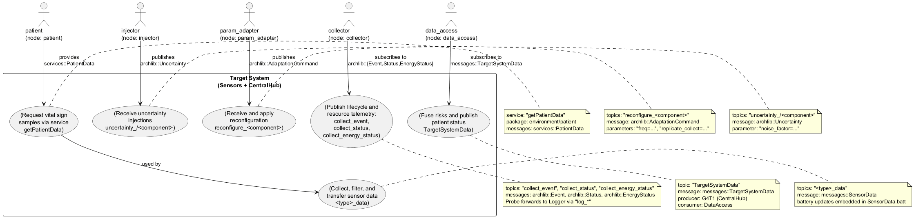
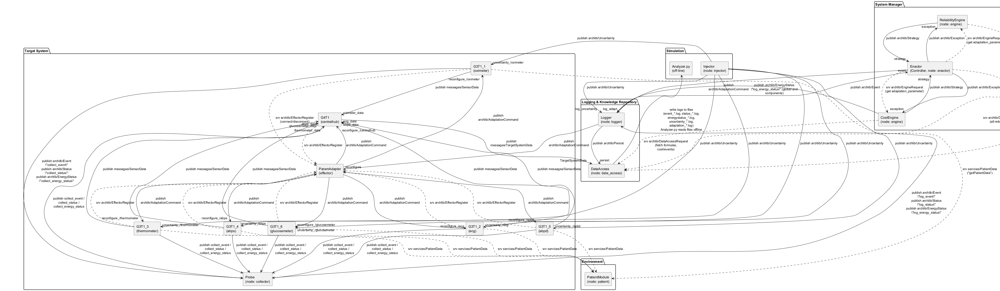
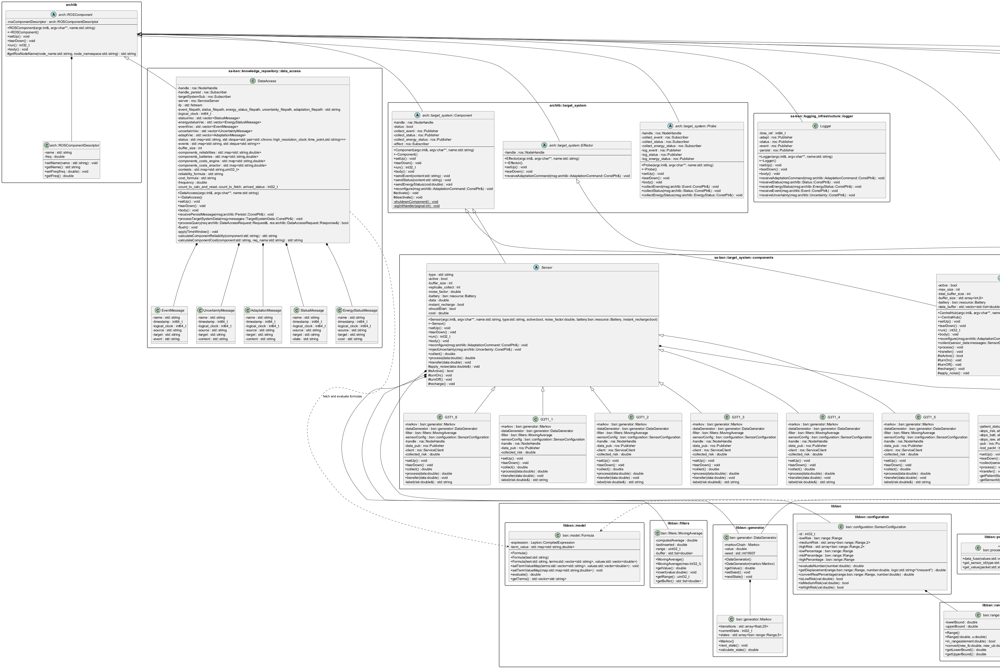
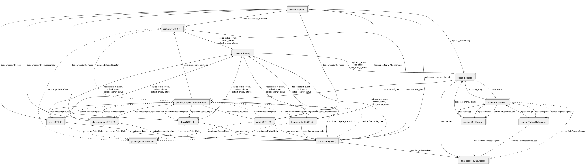

 

# SECTION 1 — System Overview

This repository implements a self-adaptive Body Sensor Network (SA-BSN) over ROS. It comprises a simulated patient environment, a set of target-system components (six sensors and a central hub), a logging and knowledge repository, and a MAPE-K control loop (monitor, analyze, plan, execute with knowledge). The system runs as multiple ROS nodes that interact through topics and services to generate vital-sign signals, compute fused patient status, observe and persist runtime data, evaluate system-level quality attributes from algebraic models, and adapt the sensors and hub at runtime by issuing reconfiguration commands.

The scope covered here is the entire system as delivered by the source tree. It includes all runtime nodes, supporting libraries, and analysis tooling present in the codebase. The implementation is centered on C++ ROS nodes, with one Python-based analyzer. Internally, the system uses a generic architecture library (archlib) for structuring ROS components and an embedded expression engine (lepton) for algebraic model evaluation. A domain library (libbsn) provides models and utilities for goal modeling, ranges, filters, Markov-based data generation, resource/battery handling, and formula evaluation.

At runtime, each target-system component is a ROS node derived from arch::ROSComponent, which standardizes setup/teardown and run loops. All target components publish their operational events, status, and energy usage to “collect_*” topics; a Probe node bridges these into “log_*” topics, which the Logger gathers and re-publishes as Persist messages to the DataAccess node for storage and query. The adaptation engines (ReliabilityEngine, CostEngine) periodically query DataAccess for component metrics and model formulas, compute a Strategy, and publish it. The Enactor consumes strategies and issues AdaptationCommand messages, which the ParamAdapter effector routes to component-specific “reconfigure_<node>” topics. Components apply reconfigurations (e.g., frequency changes, replicate_collect). A dedicated Injector injects uncertainties into components via “uncertainty_/<node>” topics to simulate disturbances. All persisted data can be post-processed by the Python Analyzer.

The system’s core functionalities evident in the code are: i) simulation of patient vital signs with configurable state transitions and ranges; ii) component-level sensing, filtering, risk estimation, and energy consumption accounting; iii) central fusion of risks into a patient status indicator; iv) telemetry collection, persistence, and query via a knowledge repository; v) evaluation of algebraic QoS models (reliability, cost) using the embedded lepton engine; vi) closed-loop adaptation through planning (strategy synthesis) and execution (parameter updates) with feedback via exception signaling and priorities; and vii) offline analysis of control performance using persisted logs.

The table below lists every executable node, its primary class, and its principal responsibilities and interfaces, strictly reflecting the code.

| Executable (path) | ROS node name (as coded) | Class | Primary responsibilities | Key topics/services used (publish/subscribe/service) |
|---|---|---|---|---|
| sa-bsn/environment/patient/apps/patient.cpp | patient | PatientModule | Provides patient vital-sign values as a service, parametrized by ROS params; advances Markov chains over time to change state periodically. | Service: getPatientData (server); Params: vitalSigns, <VS>_Change, <VS>_Offset, <VS>_State0..4, risk ranges; Frequency param to set ROS loop freq |
| sa-bsn/target_system/components/component/apps/g3t1_1.cpp | oximeter | G3T1_1 (Sensor) | Collects “oxigenation” via service; filters, evaluates risk using SensorConfiguration; accounts battery; publishes messages::SensorData; reports status/event/energy. | Publishes: oximeter_data; Inherited: collect_event/status/energy_status; Subscribes: reconfigure_/oximeter, uncertainty_/oximeter; Uses service: getPatientData |
| sa-bsn/target_system/components/component/apps/g3t1_2.cpp | ecg | G3T1_2 (Sensor) | As above, for “heart_rate”; publishes ecg_data. | Publishes: ecg_data; Subscribes: reconfigure_/ecg, uncertainty_/ecg; Uses service: getPatientData |
| sa-bsn/target_system/components/component/apps/g3t1_3.cpp | thermometer | G3T1_3 (Sensor) | As above, for “temperature”; publishes thermometer_data. | Publishes: thermometer_data; Subscribes: reconfigure_/thermometer, uncertainty_/thermometer; Uses service: getPatientData |
| sa-bsn/target_system/components/component/apps/g3t1_4.cpp | abps | G3T1_4 (Sensor) | As above, for “abps” (systolic); publishes abps_data. | Publishes: abps_data; Subscribes: reconfigure_/abps, uncertainty_/abps; Uses service: getPatientData |
| sa-bsn/target_system/components/component/apps/g3t1_5.cpp | apbd | G3T1_5 (Sensor) | As above, for “abpd” (diastolic); publishes abpd_data. | Publishes: abpd_data; Subscribes: reconfigure_/apbd, uncertainty_/apbd; Uses service: getPatientData |
| sa-bsn/target_system/components/component/apps/g3t1_6.cpp | glucosemeter | G3T1_6 (Sensor) | As above, for “glucose”; publishes glucosemeter_data. | Publishes: glucosemeter_data; Subscribes: reconfigure_/glucosemeter, uncertainty_/glucosemeter; Uses service: getPatientData |
| sa-bsn/target_system/components/component/apps/g4t1.cpp | centralhub | G4T1 (CentralHub) | Subscribes to all sensor data; fuses risks via bsn::processor::data_fuse; tracks batteries and raw values; publishes messages::TargetSystemData; reports status/event/energy. | Subscribes: *_data topics, reconfigure_/centralhub; Publishes: TargetSystemData; Inherited: collect_event/status/energy_status |
| sa-bsn/target_system/effectors/param_adapter/apps/param_adapter.cpp | param_adapter | ParamAdapter (Effector) | Forwards generic AdaptationCommand on “reconfigure” to target-specific “reconfigure_<node>” after registration. | Service: EffectorRegister (server); Subscribes: reconfigure; Publishes: reconfigure_<registered_node> |
| sa-bsn/target_system/probes/collector/apps/collector.cpp | collector | arch::target_system::Probe | Bridges “collect_*” streams from components to “log_*” for Logger. | Subscribes: collect_event/status/energy_status; Publishes: log_event/status/energy_status |
| sa-bsn/logging_infrastructure/logger/apps/logger.cpp | logger | Logger | Converts “log_*” telemetry into Persist records; republishes Status/Event; forwards AdaptationCommand to “reconfigure”; persists Uncertainty. | Subscribes: log_adapt, log_status, log_energy_status, log_event, log_uncertainty; Publishes: persist, reconfigure, status, event |
| sa-bsn/knowledge_repository/data_access/apps/data_access.cpp | data_access | DataAccess | Persists events, status, energy status, uncertainty, adaptation logs; computes reliability (success/fail) in a time window; aggregates cost; serves formulas; provides metrics to engines/enactor; tracks contexts and component batteries via TargetSystemData. | Subscribes: persist, TargetSystemData; Service: DataAccessRequest (server); Writes logs to resource/logs/* files |
| sa-bsn/system_manager/adaptation_engine/apps/reli_engine.cpp | engine | ReliabilityEngine (Engine) | Fetches reliability formula, gathers per-component reliability and contexts; synthesizes Strategy to meet reliability setpoint; publishes Strategy; reacts to Exceptions by adjusting priorities. | Publishes: strategy; Service: EngineRequest (server); Subscribes: exception; Calls DataAccessRequest for reliability/event; Params: setpoint, offset, gain, qos_attribute, monitor_freq, actuation_freq |
| sa-bsn/system_manager/adaptation_engine/apps/cost_engine.cpp | engine | CostEngine (Engine) | As above for cost; also publishes global and per-component EnergyStatus for logging. | Publishes: strategy, log_energy_status; Service: EngineRequest (server); Subscribes: exception; Calls DataAccessRequest for cost/event; Params as above |
| sa-bsn/system_manager/enactor/apps/enactor.cpp | enactor | Enactor (base) | Periodically queries DataAccess for current component metrics; receives Strategy and maintains per-component references; delegates application to subclass. | Subscribes: event, strategy; Calls DataAccessRequest; Calls EngineRequest to fetch adaptation parameter |
| sa-bsn/system_manager/enactor/apps/controller.cpp | enactor | Controller (Enactor) | Implements execution: issues AdaptationCommand to “log_adapt”; dynamically adjusts frequency or replicate_collect; raises Exceptions to engines on sustained errors. | Publishes: log_adapt, exception; Subscribes: event, strategy; Params: frequency, kp, adaptation_parameter |
| sa-bsn/simulation/injector/apps/injector.cpp | injector | Injector | Injects uncertainty (noise_factor) into components on “uncertainty_/<component>”; also logs uncertainty. | Publishes: uncertainty_/<component>, log_uncertainty; Params: components list and per-component type/offset/amplitude/frequency/duration/begin; frequency |
| sa-bsn/simulation/analyzer/analyzer.py | n/a (offline) | Analyzer (Python) | Offline analysis of logs for reliability or cost step-response properties (stability, settling time, overshoot, SSE); optional plotting; simple in-script formula evaluator. | Reads: knowledge_repository/resource/logs/*.log; Reads: knowledge_repository/resource/models/*.formula |
| archlib-based targets (all above) | varies | arch::target_system::Component, Effector, Probe; arch::ROSComponent | Provide common ROS lifecycle (setUp/tearDown/run); standardized event/status/energy telemetry, effector registration, probe bridging, logging interface. | Topics/services as per subclass responsibilities |

The system-level interactions are consistent across all components and directly supported by the code:

- Sensors and the central hub publish events (activate/deactivate), status (init/running/success/fail), and energy status (per-cycle “cost”). Component::setUp registers with the ParamAdapter via the EffectorRegister service, enabling targeted reconfigurations on “reconfigure_<node>”.
- The Probe (“collector”) converts the components’ “collect_*” channels into “log_*”. The Logger persists all “log_*” streams by emitting archlib::Persist messages, which DataAccess consumes and appends to CSV-like logs. Uncertainty injections are likewise persisted.
- DataAccess maintains time-windowed deques per source for status, computes reliability as success/(success+fail), tracks per-component costs from EnergyStatus, maintains activation contexts from Event logs, and exposes both the algebraic formulas (read from files) and computed metrics through its DataAccessRequest service. It also ingests TargetSystemData from the central hub to update per-component battery levels and raw data snapshots.
- Engines request formulas and metrics from DataAccess, reset their Strategy maps, overlay current R_/W_/CTX_ values, and compute overall QoS via bsn::model::Formula (Lepton backend). They publish a Strategy when the attribute deviates from setpoint beyond tolerance and adapt priorities upon Exceptions.
- The Enactor queries DataAccess for current metrics, subscribes to Strategy, and uses a simple proportional action (gain KP) to craft AdaptationCommand messages, which go to the Logger’s “log_adapt” and then to ParamAdapter’s “reconfigure”. Components receiving “reconfigure_<node>” update internal parameters (“freq”, “replicate_collect”).
- The Injector perturbs selected components by publishing “noise_factor” commands to “uncertainty_/<component>”, which sensors apply stochastically in the next collection cycle.
- The Analyzer can be run offline to evaluate and visualize reliability or cost time series derived from the persisted logs.

Support libraries used across the system are fully contained in the repository. The lepton subtree provides a complete expression parser and evaluator for algebraic models (including differentiation and optimization). The libbsn subtree provides domain abstractions used by both the target system and the MAPE-K control loop, such as SensorConfiguration and Range (for risk bins and conversions), MovingAverage (filter), Markov and DataGenerator (stateful data synthesis), Battery (resource accounting), Processor (fusion and parsing utilities), goal model structures, and the Formula wrapper around Lepton’s compiled expressions.

This overview reflects the implemented code paths only; it documents all executable nodes, their responsibilities, and their communication patterns as defined in the source tree.

## 2. Architectural Context

This section describes the external context in which the system operates, as evidenced by the code. It identifies external systems and frameworks, the concrete ROS topics and services used as interfaces, the data sources the system depends on at runtime and for post-run analysis, and the actors explicitly represented in the codebase. The content is limited to elements that are directly observable in the source.

### External Systems

- ROS runtime: ROS master, topic and service middleware, and the ROS parameter server (extensively used throughout nodes for configuration and message exchange).
- ROS packages providing message/service definitions not contained in this repository:
  - archlib: Event, Status, EnergyStatus, AdaptationCommand, EffectorRegister (service), Persist, Uncertainty, Strategy, Exception, DataAccessRequest (service), EngineRequest (service).
  - messages: SensorData, TargetSystemData.
  - services: PatientData (service).
- Filesystem access via ros::package::getPath("repository") in DataAccess to locate model files and create log files; standard C++ file I/O is used to persist runtime data.
- C++ standard runtime and OS services: time (chrono, timeval), random number generation (std::mt19937, distributions), and signal handling (SIGINT) for controlled shutdown.
- Python environment for offline analysis (simulation/analyzer/Analyzer.py), using matplotlib, numpy, and supporting libraries. This tool operates post-execution over the log files produced by the system.

### APIs / Interfaces

- ROS topics (publish/subscribe):
  - System telemetry collection:
    - collect_event (archlib/Event) — published by all target system Components (Sensors, CentralHub).
    - collect_status (archlib/Status) — published by all target system Components.
    - collect_energy_status (archlib/EnergyStatus) — published by all target system Components.
    - log_event (archlib/Event) — published by Probe (collector), subscribed by Logger.
    - log_status (archlib/Status) — published by Probe (collector), subscribed by Logger.
    - log_energy_status (archlib/EnergyStatus) — published by Probe (collector), subscribed by Logger.
  - Logging and persistence:
    - status (archlib/Status) — published by Logger.
    - event (archlib/Event) — published by Logger, subscribed by Enactor.
    - persist (archlib/Persist) — published by Logger, subscribed by DataAccess.
    - log_uncertainty (archlib/Uncertainty) — published by Injector, subscribed by Logger.
  - Adaptation control:
    - reconfigure (archlib/AdaptationCommand) — published by Logger, subscribed by ParamAdapter.
    - reconfigure_<module_name> (archlib/AdaptationCommand) — published by ParamAdapter per registered module; subscribed by each Component under its own name: "reconfigure_"+ros::this_node::getName().
    - log_adapt (archlib/AdaptationCommand) — published by Enactor::Controller, subscribed by Logger.
    - strategy (archlib/Strategy) — published by ReliabilityEngine and CostEngine, subscribed by Enactor.
    - exception (archlib/Exception) — published by Enactor, subscribed by Engine (base of ReliabilityEngine/CostEngine).
  - Uncertainty injection:
    - uncertainty_/+<component_name> (archlib/Uncertainty) — published by Injector per configured component; subscribed by Sensors at topic "uncertainty_"+ros::this_node::getName().
  - Target system data plane:
    - thermometer_data (messages/SensorData) — published by G3T1_3 (thermometer), subscribed by CentralHub (G4T1).
    - oximeter_data (messages/SensorData) — published by G3T1_1 (oximeter), subscribed by CentralHub.
    - ecg_data (messages/SensorData) — published by G3T1_2 (ecg), subscribed by CentralHub.
    - abps_data (messages/SensorData) — published by G3T1_4 (abps), subscribed by CentralHub.
    - abpd_data (messages/SensorData) — published by G3T1_5 (abpd), subscribed by CentralHub.
    - glucosemeter_data (messages/SensorData) — published by G3T1_6 (glucosemeter), subscribed by CentralHub.
    - TargetSystemData (messages/TargetSystemData) — published by CentralHub (G4T1), subscribed by DataAccess.

- ROS services:
  - EffectorRegister (archlib/EffectorRegister) — provided by ParamAdapter; Component base class registers/unregisters on startup/shutdown.
  - DataAccessRequest (archlib/DataAccessRequest) — provided by DataAccess; clients: ReliabilityEngine, CostEngine, Enactor. Queries supported in code include:
    - reliability_formula, cost_formula.
    - all:reliability:<N>, all:event:<N>, all:cost:<N> (component-scoped aggregations).
  - EngineRequest (archlib/EngineRequest) — provided by Engine (base of ReliabilityEngine/CostEngine); client: Enactor (to fetch current adaptation parameter: reliability or cost).
  - getPatientData (services/PatientData) — provided by PatientModule; clients: all Sensors (G3T1_1..G3T1_6) to retrieve vital sign measurements.

- ROS parameters (selected keys read in code; all required at runtime where applicable):
  - Generic: frequency (multiple nodes), start, instant_recharge.
  - PatientModule: vitalSigns; for each vital sign s in vitalSigns: s_Change, s_Offset; state transition matrices via s_State0..s_State4; risk ranges via s_LowRisk, s_MidRisk0, s_HighRisk0, s_MidRisk1, s_HighRisk1.
  - Sensors (per vital sign type): lowrisk, midrisk, highrisk percentage ranges; the same Low/Mid/High risk range keys listed above; instant_recharge; start.
  - Engines (Engine base, ReliabilityEngine, CostEngine): qos_attribute, info_quant, monitor_freq, actuation_freq; setpoint, offset, gain; CostEngine also publishes energy status.
  - Enactor::Controller: kp, adaptation_parameter, frequency.
  - Injector: components (comma-separated); per component: <name>/type, <name>/offset, <name>/amplitude, <name>/frequency, <name>/duration, <name>/begin.
  - ParamAdapter, Logger, Probe, DataAccess: frequency.
  - DataAccess: no explicit path parameter; model and log paths are resolved via ros::package::getPath("repository").

### Data Sources

- Environment-generated vital signs via PatientModule getPatientData service; Sensors request and use returned data for collect/process/transfer cycles.
- Runtime configuration via ROS parameter server, including:
  - Vital sign risk ranges and Markov model transitions for PatientModule and Sensors.
  - Adaptation and control parameters for Engine (qos_attribute, setpoint, gain, offset, monitor/actuation frequencies) and Enactor (kp, adaptation_parameter).
  - Uncertainty injection schedules and amplitudes for Injector, and generic node frequencies.
- On-disk model files (loaded at runtime by DataAccess):
  - reliability.formula and cost.formula located under the ROS package resolved by ros::package::getPath("repository") + "/../resource/models/".
- Persisted logs (created and consumed post-run):
  - event_<timestamp>.log, status_<timestamp>.log, energystatus_<timestamp>.log, uncertainty_<timestamp>.log, adaptation_<timestamp>.log under "<repository>/../resource/logs/". These are produced by DataAccess from "persist" messages and read by the Python Analyzer.
- Uncertainty inputs delivered at runtime via uncertainty_/<component> topics (published by Injector), altering Sensor data paths through noise_factor.

### Users / Actors

- PatientModule (environment actor) simulates a patient and serves measurement data via getPatientData.
- Target system components:
  - Six Sensors (G3T1_1..G3T1_6) publishing sensor-specific data and internal status/energy telemetry.
  - CentralHub (G4T1) aggregating sensor data, computing patient status, and publishing TargetSystemData.
- Logging infrastructure:
  - Probe (collector) bridges internal collect_* topics to log_*.
  - Logger persists all log_* streams by publishing structured Persist messages and republishing normalized event/status topics.
- Knowledge repository:
  - DataAccess accumulates Persist messages, maintains sliding windows for component metrics, answers DataAccessRequest queries, and fetches/serves model formulas.
- System manager:
  - Adaptation Engines (ReliabilityEngine, CostEngine) monitor metrics via DataAccessRequest, compute strategies, and publish strategy and energy summaries.
  - Enactor (Controller) receives strategies, queries current metrics, and issues adaptation commands (log_adapt) and exceptions.
  - ParamAdapter (Effector) registers components and forwards AdaptationCommands to each component’s reconfigure_<name> channel.
- Simulation tooling:
  - Injector injects runtime uncertainty on configured components.
  - Analyzer (Python) is an offline consumer of the produced log files to compute and visualize performance metrics.

# SECTION 2.1 — Architectural Context – Use Case Diagram

This section presents the architectural context of the Target System (comprising the sensors and the central hub) by depicting its externally observable interactions as a UML Use Case diagram. The diagram is strictly derived from the source code and shows the external ROS nodes and services interacting with the Target System, the use cases they trigger or support, and the main communication mechanisms (topics and services).

Figure: Architectural Context — Target System Use Cases

## 3. Containers

This section identifies every runtime container present in the codebase and describes its responsibility, the principal technologies used, and the concrete ROS communication endpoints (topics and services). Containers correspond to build-and-run units such as ROS nodes, CLI tools, and the file-based data store used at runtime. Note that two engine executables declare the same ROS node name ("engine") and are therefore intended to run alternatively or with remapped names. Also, the enactor/apps/enactor.cpp entry would instantiate an abstract class and is therefore not runnable; the concrete enactor is the Controller.

| Container | Responsibility | Technology | Communication |
|---|---|---|---|
| patient (PatientModule) | Provides simulated patient vital-signs on demand; manages per-vital-sign Markov chains and timing | C++ (roscpp), archlib::ROSComponent, libbsn (generator/range/utils) | ROS service: getPatientData (services::PatientData); ROS params: vitalSigns, <VS>_Change, <VS>_Offset, <VS>_State<i>, <RiskBands> |
| logger (Logger) | Aggregates and persists system events by emitting Persist records; forwards adaptation/status/event streams | C++ (roscpp), archlib messages | Subscribes: log_adapt (archlib::AdaptationCommand), log_status (archlib::Status), log_energy_status (archlib::EnergyStatus), log_event (archlib::Event), log_uncertainty (archlib::Uncertainty). Publishes: persist (archlib::Persist), reconfigure (archlib::AdaptationCommand), status (archlib::Status), event (archlib::Event) |
| data_access (DataAccess) | Central knowledge repository; receives persisted telemetry, maintains sliding windows, computes reliability and cost from algebraic models, answers queries, writes CSV logs | C++ (roscpp), libbsn::model::Formula, Lepton, filesystem I/O | Subscribes: persist (archlib::Persist), TargetSystemData (messages::TargetSystemData). Provides service: DataAccessRequest (archlib::DataAccessRequest). Reads formulas via ros::package and writes logs to knowledge_repository/resource/logs |
| injector (Injector) | Injects uncertainty/noise into target components per configured schedules; logs the injections | C++ (roscpp) | Publishes: uncertainty_/COMPONENT (archlib::Uncertainty), log_uncertainty (archlib::Uncertainty). ROS params: components and per-component type/offset/amplitude/frequency/duration/begin |
| engine (ReliabilityEngine) | MAPE-K engine for reliability; monitors via DataAccess, computes strategies against a reliability formula, exposes its adaptation parameter, reacts to exceptions | C++ (roscpp), Engine base, libbsn::model::Formula, Lepton | Provides service: EngineRequest (archlib::EngineRequest). Subscribes: exception (archlib::Exception). Publishes: strategy (archlib::Strategy). Calls service: DataAccessRequest (archlib::DataAccessRequest). ROS params: qos_attribute, info_quant, monitor_freq, actuation_freq, setpoint, offset, gain |
| engine (CostEngine) | MAPE-K engine for cost; monitors via DataAccess, computes cost strategy, publishes global and per-component costs, exposes its adaptation parameter | C++ (roscpp), Engine base, libbsn::model::Formula, Lepton | Provides service: EngineRequest (archlib::EngineRequest). Subscribes: exception (archlib::Exception). Publishes: strategy (archlib::Strategy), log_energy_status (archlib::EnergyStatus, content: global and per-component costs). Calls service: DataAccessRequest (archlib::DataAccessRequest). ROS params: qos_attribute, info_quant, monitor_freq, actuation_freq, setpoint, offset, gain |
| enactor (Controller) | Closes the loop by applying engine strategies; queries current metrics, computes local control actions (freq/replication), emits adaptation commands, escalates exceptions | C++ (roscpp) | Publishes: log_adapt (archlib::AdaptationCommand), exception (archlib::Exception). Subscribes: event (archlib::Event), strategy (archlib::Strategy). Calls services: EngineRequest (archlib::EngineRequest), DataAccessRequest (archlib::DataAccessRequest). ROS params: frequency, kp, adaptation_parameter |
| param_adapter (ParamAdapter) | Effector that dispatches adaptation commands to specific components via per-target reconfigure topics; maintains registration of components | C++ (roscpp), archlib::target_system::Effector | Provides service: EffectorRegister (archlib::EffectorRegister). Subscribes: reconfigure (archlib::AdaptationCommand). Publishes: reconfigure_/TARGET (archlib::AdaptationCommand, one per registered component) |
| collector (Probe) | Probe that bridges target-system "collect_*" topics into logger-facing "log_*" topics | C++ (roscpp), archlib::target_system::Probe | Subscribes: collect_event (archlib::Event), collect_status (archlib::Status), collect_energy_status (archlib::EnergyStatus). Publishes: log_event (archlib::Event), log_status (archlib::Status), log_energy_status (archlib::EnergyStatus) |
| centralhub (G4T1) | Aggregates sensor data, computes patient status, publishes system snapshot; manages battery and runtime activation | C++ (roscpp), archlib::target_system::Component, libbsn::processor | Subscribes: thermometer_data, ecg_data, oximeter_data, abps_data, abpd_data, glucosemeter_data (messages::SensorData), reconfigure_/centralhub (archlib::AdaptationCommand). Publishes: TargetSystemData (messages::TargetSystemData), collect_event/status/energy_status via base Component |
| oximeter (G3T1_1) | Sensor pipeline for blood oxygenation; collects from PatientModule, filters, computes risk, publishes data and energy cost | C++ (roscpp), archlib::target_system::Component, libbsn (filters/config/generator) | Calls service: getPatientData. Publishes: oximeter_data (messages::SensorData), collect_event/status/energy_status (archlib::*). Subscribes: uncertainty_/oximeter (archlib::Uncertainty), reconfigure_/oximeter (archlib::AdaptationCommand). Registers via service: EffectorRegister |
| ecg (G3T1_2) | Sensor pipeline for heart rate; as above | C++ (roscpp), archlib::target_system::Component, libbsn | Calls service: getPatientData. Publishes: ecg_data, collect_event/status/energy_status. Subscribes: uncertainty_/ecg, reconfigure_/ecg. Registers via EffectorRegister |
| thermometer (G3T1_3) | Sensor pipeline for temperature; as above | C++ (roscpp), archlib::target_system::Component, libbsn | Calls service: getPatientData. Publishes: thermometer_data, collect_event/status/energy_status. Subscribes: uncertainty_/thermometer, reconfigure_/thermometer. Registers via EffectorRegister |
| abps (G3T1_4) | Sensor pipeline for systolic arterial blood pressure; as above | C++ (roscpp), archlib::target_system::Component, libbsn | Calls service: getPatientData. Publishes: abps_data, collect_event/status/energy_status. Subscribes: uncertainty_/abps, reconfigure_/abps. Registers via EffectorRegister |
| apbd (G3T1_5) | Sensor pipeline for diastolic arterial blood pressure; node name is "apbd" while data type/topics use "abpd" | C++ (roscpp), archlib::target_system::Component, libbsn | Calls service: getPatientData. Publishes: abpd_data, collect_event/status/energy_status. Subscribes: uncertainty_/apbd, reconfigure_/apbd. Registers via EffectorRegister |
| glucosemeter (G3T1_6) | Sensor pipeline for glucose; as above | C++ (roscpp), archlib::target_system::Component, libbsn | Calls service: getPatientData. Publishes: glucosemeter_data, collect_event/status/energy_status. Subscribes: uncertainty_/glucosemeter, reconfigure_/glucosemeter. Registers via EffectorRegister |
| analyzer (Analyzer.py) | Offline analysis of cost/reliability logs; computes stability, settling time, overshoot, etc., and plots time series | Python 3, matplotlib | Reads CSV logs from knowledge_repository/resource/logs; no ROS endpoints |
| knowledge_repository logs (file store) | Persistent storage of event, status, energy status, uncertainty, and adaptation CSV logs | Filesystem (CSV) | Written by data_access (flush to event_*.log, status_*.log, energystatus_*.log, uncertainty_*.log, adaptation_*.log). Read by analyzer |

# SECTION 3.1 — Architecture Overview – Component Diagram

This section presents a complete component view of the Self-Adaptive Body Sensor Network (SA-BSN) system as implemented in the repository. The diagram shows the runtime ROS nodes (components), their responsibilities, and the concrete interactions via ROS topics and services. It covers the target system (sensors and central hub), environment, system manager (adaptation engines and enactor), logging and knowledge repository, probes and effectors, and simulation tooling. All topics and services are named exactly as they appear in the code to support validation.

Figure 3.1 — Component Diagram (PlantUML: fig-3-1-component-diagram.puml)

The diagram can be validated directly against the codebase:

- Topic names and service names match the literal strings used in the code (e.g., “collect_event”, “log_event”, “persist”, “DataAccessRequest”, “EffectorRegister”, “EngineRequest”, “TargetSystemData”, per-sensor data topics, and “uncertainty_/…”).
- All runtime nodes defined by main entry points are included: PatientModule, G3T1_1..G3T1_6, G4T1, Probe, Logger, DataAccess, ReliabilityEngine, CostEngine, Enactor (Controller), ParamAdapter, Injector. Analyzer.py is included as an off-line consumer of the log files produced by DataAccess.
- The control loop is explicit: engines calculate strategy based on DataAccess queries; Enactor applies strategy by issuing AdaptationCommand via Logger to ParamAdapter, which routes to component-specific reconfigure topics after EffectorRegister handshakes; components respond by adjusting frequency or replicate_collect as implemented.

## 4. Components

This section enumerates and explains the internal components implemented in the codebase, grouped by container. For each component, it describes its responsibility and the primary collaborations and dependencies it has with other components, including message topics, services, function calls, and libraries. The list reflects the concrete implementation observed in the source code and is exhaustive for the provided repository.

### 4.1 archlib (ROS runtime and Target System abstractions)

| Component | Responsibility | Interactions |
|---|---|---|
| arch::ROSComponent | Base class for all ROS nodes in this system. Initializes ROS, owns a ROSComponentDescriptor (name and frequency), provides the canonical run loop (setUp → loop with body and spinOnce → tearDown), and utility to normalize node names. | Uses ros::init, ros::Rate, ros::spinOnce; stores name and frequency through ROSComponentDescriptor; static getRosNodeName normalizes ROS names. Extended by PatientModule, Logger, Injector, Engine (Reliability/Cost), Enactor/Controller, DataAccess, ParamAdapter, Probe, and all target_system Components. |
| arch::ROSComponentDescriptor | Holds node metadata (name and execution frequency). | Set and get name/freq from various components; used by all ROSComponent derivatives to control loop frequency. |
| arch::target_system::Component | Abstract base for Target System modules that emit events, status and energy status, and register for reconfiguration. Provides run loop with status reporting, activation/deactivation, and graceful shutdown. | Publishes archlib::Event on topic collect_event; archlib::Status on collect_status; archlib::EnergyStatus on collect_energy_status; registers/deregisters with Effector via Service archlib::EffectorRegister; subscribes to reconfigure_<node> via ParamAdapter route; used by Sensor and CentralHub subclasses. |
| arch::target_system::Effector | Abstract base for effectors receiving adaptation commands. | Reads "frequency" parameter; subclasses subscribe to reconfigure and act on archlib::AdaptationCommand (ParamAdapter). |
| arch::target_system::Probe | Generic collector that subscribes to Target System telemetry and republish it for logging. | Subscribes to collect_event, collect_status, collect_energy_status; republishes to log_event, log_status, log_energy_status; frequency set from "frequency" parameter; used by sa-bsn/target_system/probes/collector. |

### 4.2 lepton (Expression parsing, compilation, and evaluation)

| Component | Responsibility | Interactions |
|---|---|---|
| Lepton::Parser | Tokenizes and parses algebraic expressions into ExpressionTreeNode trees; supports custom functions and many operators. | Produces ParsedExpression; uses Operation factory for operators/functions; consumed by bsn::model::Formula. |
| Lepton::ParsedExpression | Immutable parsed expression tree with optimization, differentiation, and program/compiled forms. | Creates ExpressionProgram and CompiledExpression; uses Operation and ExpressionTreeNode; used by bsn::model::Formula. |
| Lepton::CompiledExpression | Optimized evaluator with variable binding and workspace for execution. | Built from ParsedExpression; evaluate() computes result; used by bsn::model::Formula to set variable references and evaluate. |
| Lepton::ExpressionProgram | Linearized program representation with a stack machine evaluator. | Built from ParsedExpression; not directly used by this codebase outside lepton. |
| Lepton::ExpressionTreeNode | Tree node wrapper for Operation with children; supports equality and cloning. | Used pervasively across Parser/ParsedExpression/CompiledExpression. |
| Lepton::Operation and nested operations (Constant, Variable, Custom, Add, Subtract, Multiply, Divide, Power, Negate, Sqrt, Exp, Log, Sin, Cos, Sec, Csc, Tan, Cot, Asin, Acos, Atan, Sinh, Cosh, Tanh, Erf, Erfc, Step, Delta, Square, Cube, Reciprocal, AddConstant, MultiplyConstant, PowerConstant, Min, Max, Abs) | Defines the full algebra and calculus (evaluate and differentiate) used by the expression engine. | Used by Parser/ParsedExpression/CompiledExpression; some functions rely on MSVC_erfc.h for portability. |
| Lepton::CustomFunction | Interface for user-provided functions callable by expressions. | Recognized by Parser; cloned and invoked by Operation::Custom. |
| Lepton::Exception | Exception for parse/eval errors. | Thrown by Parser and evaluators; caught by clients as needed. |
| lepton/windowsIncludes.h | Platform export macros. | Included throughout lepton headers. |

### 4.3 libbsn (Domain library for ranges, filters, generators, goal model, utilities, model evaluation)

| Component | Responsibility | Interactions |
|---|---|---|
| bsn::range::Range | Numeric interval with conversions and checks. | Used by SensorConfiguration, Markov states, DataGenerator, tests. |
| bsn::filters::MovingAverage | Fixed-window moving average filter over a list buffer. | Used by all Sensors (G3T1_1..G3T1_6) during process(). |
| bsn::generator::Markov | 5-state Markov chain with transitions and ranges per state. | Held by DataGenerator and Sensors; next_state(), calculate_state(). |
| bsn::generator::DataGenerator | Uses Markov and RNG to produce values within current state’s range; can advance state. | Used by Sensors; setSeed(), nextState(), getValue(). |
| bsn::processor::{data_fuse, get_sensor_id, get_value} | Data fusion and helpers for sensor id/value extraction. | CentralHub::process() calls data_fuse; CentralHub::getSensorId duplicates mapping locally; tests validate behavior. |
| bsn::configuration::SensorConfiguration | Encodes risk ranges and maps raw values into percentage risk bands; can test risk class. | Used by all Sensors for risk computation and labeling. |
| bsn::resource::Battery | Simple capacity model with consume/generate and bounds. | Used by Sensor and CentralHub to track/limit activity and cost. |
| bsn::time::TimeData | Elapsed time calculation and formatted timestamp. | Not used by ROS nodes in this repo; available utility. |
| bsn::utils::split | String split helper. | Used throughout (Sensors, Engines, Enactor, DataAccess, Injector, PatientModule, etc.). |
| bsn::goalmodel::{Node, Goal, Task, LeafTask, GoalTree, Property, Context} | Goal modeling classes with tree structure, properties, and contexts. | Not directly wired into ROS nodes in this repo’s runtime but included in DataAccess headers and engines; validated by unit tests. |
| bsn::model::Formula | Thin wrapper around Lepton compiled expressions; maps terms to values and evaluates. | Used by Engine to evaluate QoS (reliability or cost) from current strategy. |

### 4.4 sa-bsn/environment/patient (Synthetic patient data provider)

| Component | Responsibility | Interactions |
|---|---|---|
| PatientModule | ROS node serving patient vital signs via service; advances internal Markov-based generators at a configured cadence per vital sign. Holds per-vital-sign frequency change logic. | Advertises services::PatientData on getPatientData; reads params: vitalSigns and per-sign State0..4 transitions and risk ranges, _Change and _Offset; constructs bsn::generator::Markov/DataGenerator; Sensors call getPatientData; loops with ROSComponent rate. |

### 4.5 sa-bsn/knowledge_repository/data_access (Persistence and query engine for telemetry)

| Component | Responsibility | Interactions |
|---|---|---|
| DataAccess | Central persistence and query service. Logs events/status/energy/uncertainty/adaptation to files; maintains sliding window of status per component; computes component reliabilities and costs on demand; caches and serves QoS formulas; relays TargetSystemData into battery map. | Subscribes to persist (archlib::Persist) to receive logs from Logger; subscribes to messages::TargetSystemData for battery and raw sensor snapshots; advertises service archlib::DataAccessRequest for Engines/Enactor queries; fetches formula strings from repository/resources; returns strings encoding per-component time-series for reliability, cost, and recent events. |
| StatusMessage, EnergyStatusMessage, EventMessage, UncertaintyMessage, AdaptationMessage | In-memory record types used for buffering before flushing to files. | Used only within DataAccess for persistence buffering and flush to CSV-like logs. |

### 4.6 sa-bsn/logging_infrastructure/logger (Event/status aggregator and forwarder)

| Component | Responsibility | Interactions |
|---|---|---|
| Logger | Bridges between collection and persistence layers. Receives log_* streams, generates Persist records, forwards operational streams where needed, and bridges adaptation commands into the ParamAdapter via "reconfigure". | Publishes archlib::Persist on persist; publishes archlib::AdaptationCommand on reconfigure; republishes archlib::Status on status and archlib::Event on event; subscribes to log_adapt, log_status, log_energy_status, log_event, log_uncertainty; time-bases timestamps relative to node start; reads frequency parameter. Works with Probe (producer) and DataAccess (consumer). |

### 4.7 sa-bsn/simulation/injector (Uncertainty injection)

| Component | Responsibility | Interactions |
|---|---|---|
| Injector | Injects uncertainty into target system components by publishing Uncertainty messages with noise_factor based on configured waveforms (step, ramp, random) per time window and frequency. | Publishes archlib::Uncertainty to per-component topic uncertainty_/COMPONENT and to log_uncertainty; reads parameters frequency, components and per-component type/offset/amplitude/frequency/duration/begin; consumed by Sensors via subscription to uncertainty_<their-name> and by Logger via log_uncertainty. |

### 4.8 sa-bsn/simulation/analyzer (Offline analysis; Python)

| Component | Responsibility | Interactions |
|---|---|---|
| Analyzer (Python) | Parses persisted logs to compute and plot global and per-component reliability or cost; computes control metrics (stability, settling time, overshoot, SSE, robustness) relative to a setpoint; can plot series. | Reads knowledge_repository/resource/logs/* files and repository/resource/models/*.formula; internal classes Formula, AdaptationCommand, Status, EnergyStatus, Event, Task, Context are helper data structures; does not interact with ROS at runtime. |

### 4.9 sa-bsn/system_manager/adaptation_engine (Strategy synthesis for reliability and cost)

| Component | Responsibility | Interactions |
|---|---|---|
| Engine | Abstract strategy engine template. Fetches QoS formula from DataAccess; maintains strategy and priority maps over model terms; monitors via DataAccess queries; provides calculate_qos using bsn::model::Formula; handles exceptions that adjust priorities; advertises EngineRequest to inform Enactor about current adaptation parameter. | Service client archlib::DataAccessRequest to fetch formulas and telemetry; advertises archlib::EngineRequest to serve adaptation_parameter; subscribes to archlib::Exception from Enactor; publishes nothing directly; extended by ReliabilityEngine and CostEngine. |
| ReliabilityEngine | Implements MAPE-K for reliability. Monitors per-component reliability and context; analyzes error to set plan; plans adjustments per priority order and gains; executes by publishing a Strategy with per-component R_* references to Enactor. | Queries DataAccess for reliability and event; publishes archlib::Strategy on strategy; uses Engine base functions to compute QoS; interacts with Enactor via strategy and with Controller via EngineRequest service. |
| CostEngine | Implements MAPE-K for cost. Similar to ReliabilityEngine but uses W_* terms; publishes current global and per-component cost on log_energy_status for persistence/visualization. | Queries DataAccess for cost and event; publishes archlib::Strategy on strategy; publishes archlib::EnergyStatus on log_energy_status (source "/engine", content "global:...; /component:...;"); interacts with Enactor and DataAccess similarly. |

### 4.10 sa-bsn/system_manager/enactor (Strategy application/control)

| Component | Responsibility | Interactions |
|---|---|---|
| Enactor | Receives strategies and applies closed-loop control per component. Periodically queries DataAccess for current metric values (reliability or cost), compares to references, and calls virtual hooks to enact per-component changes. Discovers the active adaptation parameter from Engine via service. | Subscribes to event (from Logger), strategy (from Engines); calls DataAccessRequest to fetch current reliability/cost time-series; calls EngineRequest to retrieve adaptation parameter; exposes virtual receiveEvent/apply_reli_strategy/apply_cost_strategy for Controller. |
| Controller | Concrete Enactor. For each component, computes error against reference and publishes adaptation commands to adjust frequency or replication (sensors) or frequency (G4T1). Implements exception buffering and reports hysteresis to Engine. | Publishes archlib::AdaptationCommand on log_adapt (consumed by Logger, which persists and forwards on reconfigure through ParamAdapter); publishes archlib::Exception on exception (adjusts Engine priorities); reads params frequency, kp, adaptation_parameter; maintains per-component freq, references, and replicate_task. |

### 4.11 sa-bsn/target_system/components/component (Sensors and Central Hub)

| Component | Responsibility | Interactions |
|---|---|---|
| Sensor | Abstract base for all sensors. Implements run loop, activation based on battery level, uncertainty ingestion, data collection/processing/transfer sequence with replication and noise application, cost tracking, and adaptation handling. | Subscribes to uncertainty_<self> (archlib::Uncertainty) and reconfigure_<self> (archlib::AdaptationCommand from ParamAdapter); publishes messages::<type>_data (messages::SensorData); uses services::PatientData (PatientModule) to collect raw vital sign; uses bsn::filters::MovingAverage, bsn::configuration::SensorConfiguration, bsn::resource::Battery; sends archlib::Status and archlib::EnergyStatus via base Component; uses bsn::utils::split for parsing; can be adapted via "freq" and "replicate_collect". |
| CentralHub | Abstract base for the central hub. Buffers latest readings from all sensors, enforces activation based on battery, and orchestrates collect/process/transfer; accepts adaptation to frequency; emits status and events via base Component. | Subscribes thermometer_data, oximeter_data, ecg_data, abps_data, abpd_data, glucosemeter_data (messages::SensorData) and reconfigure_<self>; publishes messages::TargetSystemData (aggregated status); uses bsn::processor::data_fuse, bsn::resource::Battery; sends archlib::Status; uses bsn::utils::split to parse adaptations. |
| G3T1_1 (Oximeter) | Concrete Sensor for oxygen saturation. Reads ranges and percentages from params; collects via PatientModule; filters and computes risk; publishes oximeter_data. | Service client getPatientData (vitalSign="oxigenation"); publishes oximeter_data; consumes uncertainty and reconfigure; sends energy status; uses SensorConfiguration/MovingAverage/Battery. |
| G3T1_2 (ECG) | Concrete Sensor for heart rate. Similar to G3T1_1; publishes ecg_data. | Service getPatientData(vitalSign="heart_rate"); publishes ecg_data; same adaptation/logging/sequencing as Sensor base. |
| G3T1_3 (Thermometer) | Concrete Sensor for temperature. Publishes thermometer_data. | Service getPatientData(vitalSign="temperature"); publishes thermometer_data; same base interactions. |
| G3T1_4 (ABPS) | Concrete Sensor for systolic blood pressure. Publishes abps_data. | Service getPatientData(vitalSign="abps"); publishes abps_data; same base interactions. |
| G3T1_5 (ABPD) | Concrete Sensor for diastolic blood pressure. Publishes abpd_data. | Service getPatientData(vitalSign="abpd"); publishes abpd_data; same base interactions. |
| G3T1_6 (Glucosemeter) | Concrete Sensor for blood glucose. Publishes glucosemeter_data. | Service getPatientData(vitalSign="glucose"); publishes glucosemeter_data; same base interactions. |
| G4T1 (CentralHub) | Concrete CentralHub. Subscribes to all sensor topics, processes by fusing most recent values, classifies patient risk, and publishes TargetSystemData (including battery, raw, and risk per sensor and overall status). | Subscribes to all *_data topics; publishes TargetSystemData; consumes reconfigure_<self>; sends status and event via base; used by DataAccess to derive component batteries; uses data_fuse. |

### 4.12 sa-bsn/target_system/effectors/param_adapter (Effector for parameter adaptation)

| Component | Responsibility | Interactions |
|---|---|---|
| ParamAdapter | Effector that routes global adaptation commands to per-target reconfigure topics. Keeps dynamic registry of target module publishers. | Advertises service EffectorRegister (archlib::EffectorRegister) for modules to connect/disconnect; subscribes to reconfigure (archlib::AdaptationCommand) and republishes to reconfigure_<target-name>; reads frequency param. |

### 4.13 sa-bsn/target_system/probes/collector (Telemetry collector)

| Component | Responsibility | Interactions |
|---|---|---|
| Collector (main; uses arch::target_system::Probe) | Entry point instantiating Probe that bridges Target System telemetry to Logger. | Probe subscribes to collect_event, collect_status, collect_energy_status and publishes to log_event, log_status, log_energy_status; frequency from param. |

### 4.14 Cross-cutting collaborations (end-to-end flows)

| Component | Responsibility | Interactions |
|---|---|---|
| Event/Status/EnergyStatus flow | Capture, log, and query runtime signals. | Sensor/CentralHub (arch::target_system::Component) publish collect_* → Probe republishes to log_* → Logger converts to Persist and republishes event/status; DataAccess persists and builds time-series; Engines/Enactor query via DataAccessRequest; CostEngine additionally publishes log_energy_status (global and per-component) to Logger/DataAccess. |
| Adaptation flow | Compute strategy and apply to components through an effector. | Engines publish Strategy → Enactor/Controller computes per-component setpoints → Controller publishes AdaptationCommand to log_adapt → Logger persists and forwards to reconfigure → ParamAdapter dispatches to reconfigure_<target> → target Sensor/CentralHub handles reconfigure() to change frequency or replication; Sensors and CentralHub register/unregister via EffectorRegister on startup/shutdown. |
| Uncertainty injection | Introduce runtime noise and persist its history. | Injector publishes Uncertainty to uncertainty_/COMPONENT and to log_uncertainty; Sensor::injectUncertainty applies noise; Logger persists Uncertainty; Analyzer correlates uncertainty with QoS response offline. |

This completes the inventory of implemented components and their concrete interactions as derived from the source code.

# Section 5 — Code-Level View

This section documents how the source code realizes the architectural components identified for the self-adaptive Body Sensor Network (SA-BSN). It maps each architectural element to concrete code elements, highlights all executable entry points, and explains the main modules, submodules, and their responsibilities. It also characterizes the recognizable design patterns present in the implementation. The content is derived strictly from the supplied codebase and is intended to be verifiable by developers familiar with it.

## 5.1 Purpose and scope

The code-level view provides a precise mapping from the architecture to code artifacts so that stakeholders can:
- Locate the implementation of each runtime component (ROS node).
- Understand the layering and dependencies (framework vs domain vs application).
- Validate messaging and service boundaries.
- Identify design patterns (where evident from the code).
- Confirm all runtime entry points.

This section does not introduce new elements; it only reflects what the code implements.

## 5.2 Codebase organization and layering

The repository is organized into four main layers, which are consistently reflected by the directory structure and code dependencies:

1) Framework and runtime support (archlib)
2) Domain logic and utilities (libbsn)
3) Third-party expression engine (lepton)
4) Application layer (sa-bsn), which implements system manager, target system, environment, logging, knowledge repository, simulation tooling

The directories and responsibilities are:

- src/archlib
  - include/archlib: Framework abstractions for ROS components; target system base classes (Component, Effector, Probe).
  - src: Implementations of ROSComponent, Component, Effector, Probe, and ROSComponentDescriptor.
  - test: Google Test main.

- src/libbsn
  - include/libbsn: Domain models (goal model tree, properties), generators (Markov, DataGenerator), filters (MovingAverage), resources (Battery), ranges, processor utilities, time, formatting utils, and model formula adapter over Lepton.
  - src: Implementations of all domain classes and functions.
  - test: Unit and integration tests with Google Test.

- src/lepton
  - include/lepton, src: Math expression parsing, compilation, and evaluation library (Operations, Parser, ParsedExpression, ExpressionProgram, CompiledExpression).

- src/sa-bsn
  - environment/patient: The synthetic patient data provider ROS node (service).
  - knowledge_repository/data_access: The DataAccess ROS node that persists and serves system data and formulas.
  - logging_infrastructure/logger: The Logger ROS node, which persists messages and republishes them.
  - simulation: Python analyzer tool and C++ Injector ROS node for uncertainty injection.
  - system_manager
    - adaptation_engine: Engines (ReliabilityEngine, CostEngine) and the Engine base class (strategy calculation/feedback loop).
    - enactor: Enactor base and Controller concrete enactor (applies strategies by sending adaptation commands).
  - target_system
    - components/component: Sensors (G3T1_1 to G3T1_6) and CentralHub (G4T1), plus Sensor and CentralHub abstractions.
    - effectors/param_adapter: ParamAdapter ROS effector node (for reconfiguration routing).
    - probes/collector: Probe ROS node (collects and logs system events/status/energy).

This layering is evident in how the application layer (sa-bsn) depends on archlib (ROS abstractions) and libbsn (domain logic), while libbsn depends on lepton (expression evaluation).

## 5.3 Recognizable implementation patterns

The codebase demonstrates the following design patterns clearly in code:

- Template Method: arch::ROSComponent::run() implements a fixed control loop and delegates to setUp(), body(), and tearDown(). The same pattern is extended in arch::target_system::Component, and further specialized in Sensor and CentralHub classes, which override body() behavior.
- Inheritance-based specialization: arch::target_system::{Component, Effector, Probe} are extended by concrete classes (e.g., Sensor, CentralHub, ParamAdapter, Collector) to implement system behaviors.
- Observer (publish/subscribe) and Request/Reply (service): ROS topics and services concretize decoupled interactions between nodes.
- Adapter: ParamAdapter acts as a transport adapter for adaptation commands, mapping a shared “reconfigure” topic to per-node reconfigure topics, registered dynamically via EffectorRegister service.
- Layered architecture: Framework (archlib), domain (libbsn), third-party math (lepton), and application (sa-bsn) cleanly separate concerns.

## 5.4 Executable entry points (complete list)

Every file with a main() function corresponds to one executable ROS node or tool:

- src/sa-bsn/environment/patient/apps/patient.cpp → PatientModule
- src/sa-bsn/knowledge_repository/data_access/apps/data_access.cpp → DataAccess
- src/sa-bsn/logging_infrastructure/logger/apps/logger.cpp → Logger
- src/sa-bsn/simulation/injector/apps/injector.cpp → Injector
- src/sa-bsn/system_manager/adaptation_engine/apps/cost_engine.cpp → CostEngine
- src/sa-bsn/system_manager/adaptation_engine/apps/reli_engine.cpp → ReliabilityEngine
- src/sa-bsn/system_manager/enactor/apps/controller.cpp → Controller (concrete Enactor)
- src/sa-bsn/system_manager/enactor/apps/enactor.cpp → Enactor (note: Enactor is abstract with pure virtual methods; this entry point constructs Enactor directly, which is not instantiable; see anomalies in 5.9)
- src/sa-bsn/target_system/components/component/apps/g3t1_1.cpp → G3T1_1 (Oximeter)
- src/sa-bsn/target_system/components/component/apps/g3t1_2.cpp → G3T1_2 (ECG)
- src/sa-bsn/target_system/components/component/apps/g3t1_3.cpp → G3T1_3 (Thermometer)
- src/sa-bsn/target_system/components/component/apps/g3t1_4.cpp → G3T1_4 (ABP Systolic)
- src/sa-bsn/target_system/components/component/apps/g3t1_5.cpp → G3T1_5 (ABP Diastolic)
- src/sa-bsn/target_system/components/component/apps/g3t1_6.cpp → G3T1_6 (Glucosemeter)
- src/sa-bsn/target_system/components/component/apps/g4t1.cpp → G4T1 (CentralHub)
- src/sa-bsn/target_system/effectors/param_adapter/apps/param_adapter.cpp → ParamAdapter
- src/sa-bsn/target_system/probes/collector/apps/collector.cpp → arch::target_system::Probe (Collector)
- src/libbsn/test/main.cpp → Google Test runner
- src/archlib/test/main.cpp → Google Test runner
- src/sa-bsn/simulation/analyzer/analyzer.py → Python analyzer (entry in Python)
- src/sa-bsn/simulation/analyzer/src/Analyzer.py → Python module (invoked by analyzer.py)

Each of these nodes then delegates runtime behavior to its class’ run() method (inherited from arch::ROSComponent or arch::target_system::Component).

## 5.5 Mapping architectural components to code

This subsection enumerates all runtime nodes and their implementing classes, with key ROS interactions.

Application components:

- Environment: Patient data provider
  - Class: PatientModule (src/sa-bsn/environment/patient/include/PatientModule.hpp, .../src/PatientModule.cpp)
  - Node: “patient”
  - Responsibilities: Provides service getPatientData for vital signs; holds per-sign Markov models; controls state changes over time.
  - ROS:
    - Service server: getPatientData (services::PatientData)
    - Parameters: vitalSigns list, per-sign Change/Offset, state distributions and ranges, frequency

- Knowledge Repository: DataAccess
  - Class: DataAccess (src/sa-bsn/knowledge_repository/data_access/include/data_access/DataAccess.hpp, .../src/DataAccess.cpp)
  - Node: “data_access”
  - Responsibilities: Persist Event/Status/EnergyStatus/Uncertainty/Adaptation logs; serve queries (formulas, metrics); compute rolling reliabilities and costs; maintain component contexts/batteries.
  - ROS:
    - Subscriber: “persist” (archlib::Persist), “TargetSystemData” (messages::TargetSystemData)
    - Service server: “DataAccessRequest” (archlib::DataAccessRequest)
    - Publishes: none directly; uses file I/O for persistence
    - Parameters: frequency

- Logging Infrastructure: Logger
  - Class: Logger (src/sa-bsn/logging_infrastructure/logger/include/Logger.hpp, .../src/Logger.cpp)
  - Node: “logger”
  - Responsibilities: Receive log_* streams, wrap into archlib::Persist, re-publish clean streams.
  - ROS:
    - Subscribers: log_adapt, log_status, log_energy_status, log_event, log_uncertainty
    - Publishers: “persist” (archlib::Persist), “reconfigure” (archlib::AdaptationCommand), “status” (archlib::Status), “event” (archlib::Event)

- Simulation: Uncertainty Injector
  - Class: Injector (src/sa-bsn/simulation/injector/include/Injector.hpp, .../src/Injector.cpp)
  - Node: “injector”
  - Responsibilities: Inject uncertainty to components via “uncertainty_/component” topics; log uncertainty; drive different noise patterns (step, ramp, random).
  - ROS:
    - Publishers: per-component topics “uncertainty_/COMPONENT”, “log_uncertainty”
    - Parameters: components, and per-component type/offset/amplitude/frequency/duration/begin; frequency
  - Analyzer: Python tool (src/sa-bsn/simulation/analyzer) operating offline on logs

- System Manager: Adaptation Engine
  - Abstract Base: Engine (src/sa-bsn/system_manager/adaptation_engine/include/engine/Engine.hpp, .../src/Engine.cpp)
    - Node frequency derives from “monitor_freq”
    - Service client: “DataAccessRequest” to fetch formulas and metrics
    - Service server: “EngineRequest” (returns adaptation parameter name)
    - Publishes: “strategy” (archlib::Strategy)
  - ReliabilityEngine (src/.../ReliabilityEngine.*)
    - Node: “engine” (apps/reli_engine.cpp)
    - Responsibilities: Monitor reliability, compute plan using configured setpoint/gain/offset; publish strategy (targets R_* and CTX_* terms).
    - Parameters: setpoint, gain, offset
  - CostEngine (src/.../CostEngine.*)
    - Node: “engine” (apps/cost_engine.cpp)
    - Responsibilities: Monitor cost; compute and publish strategies; publish global and per-component archlib::EnergyStatus to “log_energy_status”.
    - Parameters: setpoint, gain, offset

- System Manager: Enactor/Controller
  - Abstract Base: Enactor (src/sa-bsn/system_manager/enactor/include/enactor/Enactor.hpp, .../src/Enactor.cpp)
    - Responsibilities: Receive “strategy”; query DataAccess for current metric; compute error; invoke apply_*_strategy(); relay Exceptions to Engine (priority tuning).
    - Subscribers: “event”, “strategy”
    - Service clients: “EngineRequest” (to learn whether adapting cost or reliability), “DataAccessRequest” (to fetch metrics)
  - Controller (src/.../controller/Controller.*)
    - Node: “enactor” (apps/controller.cpp)
    - Responsibilities: Concrete application of strategy: send archlib::AdaptationCommand to nodes to change frequency or replication; raise archlib::Exception to Engine with bounded counters; track per-component references/currents.
    - Publishers: “log_adapt”, “exception”
    - Parameters: frequency, kp, adaptation_parameter

- Target System: Sensors and Central Hub (BSN components)
  - Base abstraction (archlib): arch::target_system::Component (publish events/status/energy, register to effector)
  - Sensor base: Sensor (src/sa-bsn/target_system/components/component/include/component/Sensor.hpp, .../src/Sensor.cpp)
    - Per-cycle: collect → apply_noise/replicate → process → transfer; consumes battery; sends Status/EnergyStatus.
    - Subscribers: “uncertainty_/SELF”, “reconfigure_SELF”
    - Adaptation: “freq=” and/or “replicate_collect=” via AdaptationCommand
  - Central hub base: CentralHub (src/.../CentralHub.*)
    - Subscribes to all sensor data topics and “reconfigure_SELF”; fuses data, publishes messages::TargetSystemData; consumes battery; raises failures on overflow or charge depletion.

  Concrete sensors (all publish messages::SensorData with type, data, risk, batt):
  - G3T1_1 (Oximeter) → topic “oximeter_data”
  - G3T1_2 (ECG) → topic “ecg_data”
  - G3T1_3 (Thermometer) → topic “thermometer_data”
  - G3T1_4 (ABP systolic) → topic “abps_data”
  - G3T1_5 (ABP diastolic) → topic “abpd_data”
  - G3T1_6 (Glucosemeter) → topic “glucosemeter_data”

  Central hub:
  - G4T1 → subscribes to all six *_data topics; publishes “TargetSystemData”; adapts via reconfigure_SELF.

- Target System: Effector(s)
  - ParamAdapter (src/sa-bsn/target_system/effectors/param_adapter/include/param_adapter/ParamAdapter.hpp, .../src/ParamAdapter.cpp)
    - Node: “param_adapter”
    - Registers publishers for target modules on demand; mediates “reconfigure” → “reconfigure_/TARGET”
    - Service server: “EffectorRegister” (archlib::EffectorRegister), invoked by all arch::target_system::Component instances on setUp()/shutdown
    - Subscriber: “reconfigure” (archlib::AdaptationCommand)
    - Publisher: “reconfigure_/NODE_NAME” per registered node

- Target System: Probe
  - Collector (src/sa-bsn/target_system/probes/collector/apps/collector.cpp uses arch::target_system::Probe)
    - Node: “collector”
    - Subscribes: “collect_event”, “collect_status”, “collect_energy_status”
    - Publishes: “log_event”, “log_status”, “log_energy_status”

## 5.6 Key modules, classes, and responsibilities

Framework (archlib):

- arch::ROSComponent (include/archlib/ROSComponent.hpp, src/archlib/src/ROSComponent.cpp)
  - Base for all nodes; handles ros::init, name resolution, run loop, and descriptor injection.
- arch::ROSComponentDescriptor (include/.../ROSComponentDescriptor.hpp, src/.../ROSComponentDescriptor.cpp)
  - Holds node name and execution frequency; setters/getters.
- arch::target_system::Component (include/.../target_system/Component.hpp, src/.../target_system/Component.cpp)
  - Extends ROSComponent; provides publishers for collect_event/status/energy_status; registers to effector; higher-level run loop that emits Status messages (running/success/fail).
- arch::target_system::Effector (include/.../target_system/Effector.hpp, src/.../target_system/Effector.cpp)
  - Effector base for receiving adaptation commands; exposes receiveAdaptationCommand() to be overridden.
- arch::target_system::Probe (include/.../target_system/Probe.hpp, src/.../target_system/Probe.cpp)
  - Concrete collector; subscribes to collect_* topics and republishes to log_* topics.

Domain (libbsn):

- configuration: SensorConfiguration (evaluateNumber, displacement strategies, risk bands and percent conversion)
- filters: MovingAverage
- generator: Markov, DataGenerator (state transitions, value generation)
- goalmodel: Node, Goal, Task, LeafTask, Context, Property, GoalTree (hierarchical goal tree)
- model: Formula (adapts Lepton to domain; maps terms to variables, evaluates expressions)
- processor: Processor (data_fuse, get_sensor_id, get_value)
- range: Range (bounds checking and conversion)
- resource: Battery (capacity, current, consume/generate)
- time: TimeData (elapsed time, formatted timestamp)
- utils: split()

Lepton (expression engine):

- Operation and subclasses (Constant, Variable, arithmetic and transcendental ops)
- ParsedExpression, ExpressionProgram, CompiledExpression, Parser
- windowsIncludes portability helpers

Application (sa-bsn):

- PatientModule, DataAccess, Logger, Injector, Analyzer (python)
- Engine hierarchy: Engine (base), ReliabilityEngine, CostEngine
- Enactor hierarchy: Enactor (base), Controller (concrete)
- Target system: Sensor (base) and concrete G3T1_1..G3T1_6; CentralHub (base) and concrete G4T1
- Effector: ParamAdapter
- Probe: Collector (via archlib::Probe)

## 5.7 ROS topics, services, and interactions per component (selected, as implemented)

The following is a faithful summary of ROS I/O for the principal nodes (as defined in code):

- PatientModule
  - Service server: getPatientData
  - Parameters: vitalSigns; per-sign ranges, transition matrices; frequency

- Logger
  - Subscribes: log_adapt, log_status, log_energy_status, log_event, log_uncertainty
  - Publishes: persist, reconfigure, status, event

- DataAccess
  - Subscribes: persist, TargetSystemData
  - Service server: DataAccessRequest

- Injector
  - Publishes: uncertainty_/COMPONENT, log_uncertainty

- ReliabilityEngine
  - Service client: DataAccessRequest
  - Service server (in Engine base): EngineRequest
  - Publishes: strategy

- CostEngine
  - Service client: DataAccessRequest
  - Service server (in Engine base): EngineRequest
  - Publishes: strategy, log_energy_status (global and per-component costs)

- Enactor/Controller
  - Subscribes: event, strategy
  - Service clients: DataAccessRequest, EngineRequest
  - Publishes: log_adapt (to be routed by Logger → reconfigure)

- ParamAdapter
  - Subscribes: reconfigure
  - Service server: EffectorRegister
  - Publishes: reconfigure_/NODE_NAME (per registered component)

- Collector (Probe)
  - Subscribes: collect_event, collect_status, collect_energy_status
  - Publishes: log_event, log_status, log_energy_status

- Sensors G3T1_1..G3T1_6 (via Sensor base)
  - Subscribes: uncertainty_/SELF, reconfigure_SELF
  - Publishes: collect_event, collect_status, collect_energy_status (via arch::target_system::Component)
  - Publishes: <type>_data (messages::SensorData) in transfer()

- Central Hub G4T1 (via CentralHub base)
  - Subscribes: thermometer_data, oximeter_data, ecg_data, abps_data, abpd_data, glucosemeter_data, reconfigure_SELF
  - Publishes: collect_event, collect_status, collect_energy_status (via arch::target_system::Component)
  - Publishes: TargetSystemData in transfer()

## 5.8 Directory-to-component mapping

- src/archlib/include/archlib
  - ROSComponent, ROSComponentDescriptor
  - target_system: Component, Effector, Probe

- src/archlib/src
  - Implementations for the above framework classes

- src/libbsn/include/libbsn and src/libbsn/src
  - All domain classes listed in 5.6; all functionality verified by unit tests in src/libbsn/test/unit and an empty integration test stub

- src/lepton/include/lepton and src/lepton/src
  - Expression language parser, operations, compiler, evaluators

- src/sa-bsn
  - environment/patient: PatientModule node (service-based data provider)
  - knowledge_repository/data_access: DataAccess node (persistence, query)
  - logging_infrastructure/logger: Logger node (logging hub)
  - simulation/injector: Injector node (uncertainty)
  - simulation/analyzer: Analyzer Python tool (plots and metrics over logs)
  - system_manager/adaptation_engine: Engine base, ReliabilityEngine, CostEngine
  - system_manager/enactor: Enactor base, Controller concrete enactor
  - target_system/components/component: Sensor base, CentralHub base, sensors G3T1_1..G3T1_6, central hub G4T1
  - target_system/effectors/param_adapter: ParamAdapter node
  - target_system/probes/collector: Collector (Probe) node

## 5.9 Notable code-level anomalies and caveats (as implemented)

- Abstract instantiation in enactor/apps/enactor.cpp: The main() constructs Enactor directly, but Enactor declares pure virtual methods (setUp(), receiveEvent(), apply_*_strategy()). This would not link as-is. The working enactor node is controller/apps/controller.cpp which constructs Controller (a concrete subclass). The enactor.cpp entry point should be considered non-buildable or obsolete in its current form.

- arch::target_system::Component::reconfigure() (src/archlib/src/target_system/Component.cpp) calls itself recursively with the same signature, which would cause infinite recursion if invoked. Concrete classes (Sensor, CentralHub) implement their own reconfigure handlers and are registered with ROS subscribers; the base method should either be pure-virtual or provide a safe default.

- ROSComponentDescriptor::operator= in src/archlib/src/ROSComponentDescriptor.cpp does not return *this, which is undefined behavior in standard operator= contracts.

- ROSComponent::getRosNodeName() prints to std::cout unexpectedly, which may flood logs; it also attempts to normalize namespace in the node name via replace logic.

These observations reflect current code and can guide corrective actions if required.

## 5.10 Tests

Google Test runners exist at:
- src/libbsn/test/main.cpp
- src/archlib/test/main.cpp

libbsn has extensive unit tests covering configuration, filters, generator, goalmodel, model, processor, range, resource. There is an empty integration test at src/libbsn/test/integration/IntegrationTest.cpp. No tests are present for archlib or sa-bsn components in the provided tree.

## 5.11 Summary of executable classes and responsibilities

- Framework base nodes:
  - arch::ROSComponent: run() loop, descriptor, init
  - arch::target_system::Component/Effector/Probe: specializations for sensors, actuators, and probes

- Domain logic (libbsn): risk computation bands (SensorConfiguration), moving average filter, Markov-based data generation, fusion (Processor), and the goal-model structures with Lepton-backed Formula.

- Application:
  - PatientModule: provides service-based vital sign data
  - Sensors G3T1_1..G3T1_6: collect-process-transfer with noise injection and adaptation
  - CentralHub G4T1: multi-sensor fusion, status, and system data publication
  - ParamAdapter: reconfiguration command router with dynamic registration
  - Logger: logging hub and persist publisher
  - DataAccess: persistence and query engine, reliability/cost calculation, formula provider
  - ReliabilityEngine/CostEngine: closed-loop target tracking (qos_attribute), strategy computation
  - Controller (Enactor): applies strategies to components via AdaptationCommand
  - Injector: uncertainty injection with configurable profiles
  - Analyzer (Python): offline metrics and plots from logs

This mapping captures the complete set of components and their corresponding code artifacts, providing a verifiable code-level view of the system.

# Section 5.1 — Class Diagram

This section presents a consolidated static class view of the core implementation across the architecture library (archlib), the Self-Adaptive BSN runtime (sa-bsn), and the supporting BSN model library (libbsn). The diagram focuses on inheritance hierarchies and the principal associations that are explicitly implemented in the codebase. It allows stakeholders to validate how runtime nodes, engines, enactors, target-system components, and supporting model entities relate and depend on each other. All classes, methods, and relationships shown are derived directly from the provided source code without any additions.

Figure 5-1 — Core Classes and Relationships (section-5-1-class-diagram.puml)

## 6. Cross-Cutting Concerns

This section identifies and explains cross-cutting concerns implemented across the codebase. The analysis is grounded in code artifacts and demonstrates how non-functional requirements and system-wide mechanisms are addressed. The coverage includes security, logging, configuration management, error handling, testing, monitoring/observability, reconfiguration, graceful shutdown, messaging patterns, time and scheduling, resource accounting, and input validation. All statements below are backed by specific code references so the development team can validate the findings.

| Concern | Evidence from code | Description |
|---|---|---|
| Security (authentication, authorization, encryption) | DataAccess::processQuery (src/sa-bsn/knowledge_repository/data_access/src/DataAccess.cpp), Engine::sendAdaptationParameter (src/sa-bsn/system_manager/adaptation_engine/src/Engine.cpp), ParamAdapter::moduleConnect (src/sa-bsn/target_system/effectors/param_adapter/src/ParamAdapter.cpp), PatientModule service getPatientData (src/sa-bsn/environment/patient/src/PatientModule.cpp) | No authentication, authorization, or encryption is implemented on ROS services or topics. Components expose services (e.g., DataAccessRequest, EngineRequest, EffectorRegister, getPatientData) without access control or transport security. There is no TLS, credential check, or signing. ROS is initialized without security extensions. This is an explicit gap rather than a feature. |
| Logging and eventing | Logger (src/sa-bsn/logging_infrastructure/logger/src/Logger.cpp), use of ROS_INFO/ROS_ERROR in multiple files (e.g., src/archlib/src/target_system/Component.cpp; src/sa-bsn/system_manager/adaptation_engine/src/*.cpp), DataAccess::flush (src/sa-bsn/knowledge_repository/data_access/src/DataAccess.cpp) | System-wide logging is implemented via ROS logging macros and a dedicated Logger component. Logger subscribes to log_event, log_status, log_energy_status, log_uncertainty, and log_adapt and republishes normalized Persist messages as well as echoing back to event/status topics. DataAccess persists events, statuses, energy statuses, uncertainties, and adaptations as CSV lines into files under knowledge_repository/resource/logs/*. Log file rotation is based on timestamped filenames generated at startup. |
| Configuration management (runtime parameters) | getParam usage across components: Effector::setUp (src/archlib/src/target_system/Effector.cpp), Probe::setUp (src/archlib/src/target_system/Probe.cpp), Controller::setUp (src/sa-bsn/system_manager/enactor/src/Controller.cpp), Engine::setUp (src/sa-bsn/system_manager/adaptation_engine/src/Engine.cpp), CostEngine::setUp and ReliabilityEngine::setUp, PatientModule::setUp/configureDataGenerator (src/sa-bsn/environment/patient/src/PatientModule.cpp), sensors G3T1_*::setUp (src/sa-bsn/target_system/components/component/src/*/G3T1_*.cpp), G4T1::setUp (src/sa-bsn/target_system/components/component/src/g4t1/G4T1.cpp), Injector::setUp (src/sa-bsn/simulation/injector/src/Injector.cpp) | The system relies heavily on ROS parameters for configuration, including component frequencies, setpoints, PID-like gains (kp), lists of vital signs, Markov state transitions, risk ranges, uncertainty injection schedules, and analyzer settings. Parameters are retrieved at startup and, in some cases, periodically (e.g., Engine refreshes formulas from DataAccess). Dynamic parameter changes are effected via AdaptationCommand rather than ROS parameter updates. |
| Error handling and exception semantics | Structured try/catch in Component::run (src/archlib/src/target_system/Component.cpp), Sensor::run (src/sa-bsn/target_system/components/component/src/Sensor.cpp), CentralHub::run/body (src/sa-bsn/target_system/components/component/src/CentralHub.cpp); targeted throws in Range (invalid_argument, src/libbsn/src/range/Range.cpp), SensorConfiguration (invalid_argument, src/libbsn/src/configuration/SensorConfiguration.cpp), DataGenerator (out_of_range, src/libbsn/src/generator/DataGenerator.cpp), Battery (invalid_argument, src/libbsn/src/resource/Battery.cpp), Sensor and CentralHub operational guards (domain_error on invalid risk/buffer overflow) | Components catch exceptions around their main body loops to publish failure states (sendStatus("fail")) and maintain liveness. Domain errors are thrown when sensor risk is out of range or accuracy checks fail, and when central hub loses data due to buffer overflow. Library layers use standard exceptions for precondition violations (e.g., Range constructor, Battery invariants). Enactor escalates persistent control errors via archlib::Exception messages to Engine; Engine adjusts priorities based on these. |
| Testing | GoogleTest suites in src/libbsn/test/unit and src/libbsn/test/integration; tests for configuration, filters, generator, goal model, model, processor, range, resource | Unit and integration tests exist for libbsn (data structures, algorithms, and utilities). There are no tests for archlib, system manager, environment, logging, or target system components in this repository. The presence of src/archlib/test/main.cpp indicates test scaffolding for archlib without test cases. |
| Monitoring and observability | Probe (src/archlib/src/target_system/Probe.cpp), Logger (src/sa-bsn/logging_infrastructure/logger/src/Logger.cpp), DataAccess::receivePersistMessage/processQuery/flush (src/sa-bsn/knowledge_repository/data_access/src/DataAccess.cpp), Analyzer.py (src/sa-bsn/simulation/analyzer/src/Analyzer.py) | Observability is implemented via probe/collector that subscribes to collect_event/status/energy_status and republishes to log_* topics. Logger turns log_* into Persist messages and raw topics; DataAccess persists them and computes rolling reliability and cost, maintains context flags, and serves aggregated metrics via the DataAccessRequest service. Analyzer.py post-processes persisted logs to compute and visualize time series for reliability or cost, including stability, settling time, overshoot, and steady-state error. |
| Dynamic reconfiguration and adaptation | AdaptationCommand flow: Controller::apply_*_strategy publishes to log_adapt (src/sa-bsn/system_manager/enactor/src/Controller.cpp), ParamAdapter routes reconfigure to component-specific topics via EffectorRegister (src/sa-bsn/target_system/effectors/param_adapter/src/ParamAdapter.cpp), CentralHub::reconfigure and Sensor::reconfigure apply "freq" and "replicate_collect" (src/sa-bsn/target_system/components/component/src/CentralHub.cpp, src/sa-bsn/target_system/components/component/src/Sensor.cpp), Component registers/deregisters with Effector via EffectorRegister (src/archlib/src/target_system/Component.cpp) | The system implements a closed-loop MAPE-K control for reliability and cost. Engines compute strategies from formulas via DataAccess; Enactor converts strategies into AdaptationCommands; ParamAdapter routes them to the target component’s reconfigure_<node> topic after registration via EffectorRegister. Components implement reconfigure handlers to update frequency and, for sensors, replication of data collection. |
| Graceful startup/shutdown | ROSComponent disables default SIGINT handler (ros::init(..., NoSigintHandler), src/archlib/src/ROSComponent.cpp); Component installs SIGINT handler and publishes final messages, disconnects from effector, then ros::shutdown (src/archlib/src/target_system/Component.cpp::sigIntHandler/shutdownComponent) | A custom shutdown path ensures that, upon SIGINT, components publish a final deactivate event and status, deregister from the effector through the EffectorRegister service, and then call ros::shutdown. This avoids dangling effector routing and ensures collectors and DataAccess receive terminal states. |
| Messaging architecture (topics/services) | Topics: collect_event/status/energy_status, log_*, event/status, uncertainty_, strategy, exception, reconfigure, reconfigure_<node>, sensor data topics; Services: EffectorRegister, DataAccessRequest, EngineRequest, PatientData (multiple files across src/archlib, src/sa-bsn/*) | A consistent ROS pub/sub and service pattern underpins the system. Components publish events, status, and energy consumption; Logger normalizes to Persist; DataAccess persists and aggregates; Engines query DataAccess and publish strategies; Enactor consumes strategies and publishes AdaptationCommands; ParamAdapter routes commands to component-specific reconfigure topics; Sensors and CentralHub subscribe to reconfigure_* and uncertainty_* channels. |
| Time, scheduling, and rates | Frequent use of ros::Rate with rosComponentDescriptor.getFreq() (src/archlib/src/ROSComponent.cpp; Component::run; Sensor::run; CentralHub::run); Engine frequencies monitor_freq/actuation_freq (src/sa-bsn/system_manager/adaptation_engine/src/Engine.cpp); DataAccess::applyTimeWindow with 10.1s window (src/sa-bsn/knowledge_repository/data_access/src/DataAccess.cpp); TimeData utilities (src/libbsn/src/time/TimeData.cpp) | Execution pacing is centrally controlled via rosComponentDescriptor frequencies, set from ROS parameters or computed. Engines run monitor/analyze/plan/execute at configured rates. DataAccess maintains a time window over status messages for metric computation. TimeData offers elapsed-time and timestamp utilities used by Logger and Analyzer. |
| Resource and cost accounting | Sensor cost accumulation and sendEnergyStatus (src/sa-bsn/target_system/components/component/src/Sensor.cpp), Battery model (src/libbsn/src/resource/Battery.cpp), cost aggregation in DataAccess (components_costs_engine/components_costs_enactor, src/sa-bsn/knowledge_repository/data_access/src/DataAccess.cpp), CostEngine global cost broadcast (energy_status, src/sa-bsn/system_manager/adaptation_engine/src/CostEngine.cpp) | Energy consumption is modeled and accounted as a cross-cutting concern. Sensors increment cost based on operations (collection, filtering, transfer) proportional to BATT_UNIT and filter range, then publish EnergyStatus. DataAccess aggregates per-component costs and exposes them to engines; CostEngine computes global cost and reports it as a special EnergyStatus message for observability. |
| Input validation and defensive checks | Range invariants (invalid_argument on lower/upper bounds, src/libbsn/src/range/Range.cpp), SensorConfiguration::getDisplacement invalid operation (src/libbsn/src/configuration/SensorConfiguration.cpp), DataGenerator::calculateValue bounds (src/libbsn/src/generator/DataGenerator.cpp), Battery constructor guard rails (src/libbsn/src/resource/Battery.cpp), Sensor/CentralHub runtime checks and domain_error on invalid risk/overflow (multiple G3T1_*::transfer, G4T1::collect/transfer) | Library types enforce invariants at construction and usage. Operational code validates data boundaries and behaviors (e.g., risk percentage ranges, buffer overflow) and signals errors via exceptions to be caught at component loops, ensuring system-level resilience and consistent failure reporting via Status messages. |
| Exception routing and priority adjustment | Controller publishes archlib::Exception with +/-1 adjustments (src/sa-bsn/system_manager/enactor/src/Controller.cpp); Engine::receiveException increases/decreases component priority with bounds [0,100] (src/sa-bsn/system_manager/adaptation_engine/src/Engine.cpp) | Persistent control errors are escalated across the system via a dedicated Exception topic. The adaptation engine updates a priority map used during planning to order component adjustments, providing a cross-cutting feedback mechanism affecting future decisions. |
| Build-time and runtime diagnostics | Stdout diagnostic prints in Engines, Enactor, Sensors and CentralHub; Analyzer plots (src/sa-bsn/simulation/analyzer/src/Analyzer.py) | Beyond ROS logging and file persistence, components print human-readable diagnostics at key steps (monitor, analyze, plan, execute) to ease interactive debugging. Analyzer complements runtime diagnostics with visual analysis of persisted metrics. |
| Signal handling | ros::init NoSigintHandler (src/archlib/src/ROSComponent.cpp), custom SIGINT in Component (src/archlib/src/target_system/Component.cpp) | Global signal handling is centralized to ensure consistent and graceful termination across all ROS nodes composing the target system. |

## 7. Quality Attributes and Rationale

This section summarizes the principal quality attributes that the codebase demonstrably supports. Each attribute is justified by direct evidence from the implementation (class structure, control flows, message types, parameters, and tests) and a concise rationale linking design choices to the attribute. The intent is to enable validation by developers who can trace each claim to the referenced files, classes, and methods.

| Quality Attribute | Evidence | Rationale |
|---|---|---|
| Performance and timing control | All runtime loops use explicit rates driven by ros::Rate and a shared descriptor: ROSComponent::run, Component::run, CentralHub::run, Enactor::body; dynamic rate set via rosComponentDescriptor.setFreq and read from ROS params in many modules (e.g., Logger::setUp, Effector::setUp, G4T1::setUp, Engine::setUp). | Execution cadence and throughput are explicitly bounded and tunable at runtime per node, allowing predictable CPU usage and responsiveness for sensing, fusion, and adaptation. |
| Reliability (runtime outcome monitoring) | Status life-cycle and result reporting: Component::run sends “running/success/fail”; Sensor::body updates status and publishes EnergyStatus; CentralHub::body throws on “out of charge”; DataAccess::calculateComponentReliability computes success/(success+fail) with a 10.1s sliding window (applyTimeWindow). | The architecture measures component success/failure continuously and aggregates reliability over a moving time window, enabling feedback control and historical analysis. |
| Fault tolerance and error handling | Systematic try/catch around bodies: Component::run, Sensor::run, CentralHub::run; domain errors thrown on invalid data (e.g., G4T1::transfer, sensor transfers) and caught to emit “fail”; Enactor escalates repeated deviation via Exception messages after thresholds. | Localized exception handling prevents node crashes from invalid inputs or transient conditions; failures become observable signals for adaptation rather than silent faults. |
| Energy awareness and cost management | Battery resource model with explicit consume/generate in Sensor and CentralHub (Battery.hpp; Sensor::body; CentralHub::body); per-cycle cost accumulation and sendEnergyStatus; DataAccess persists EnergyStatus and aggregates per-component costs; CostEngine computes and publishes global and per-component costs. | Energy/cost is a first-class operational metric, tracked and fed into the CostEngine control loop to keep system cost near a setpoint. |
| Modifiability and extensibility (architecture) | Clear base classes and virtual interfaces: arch::ROSComponent, target_system::Component, Sensor, CentralHub, Effector; adaptation layer: Engine (abstract), ReliabilityEngine, CostEngine, Enactor, Controller; ParamAdapter wires reconfigure_* topics dynamically via EffectorRegister service. | New sensors/effectors/engines can be added by subclassing and wiring topics/services; common concerns (ROS node lifecycle, frequency control, status/event emission) are inherited and uniformly handled. |
| Modifiability (model-driven QoS) | Target system QoS modeled as algebraic formulas evaluated at runtime: Engine::fetch_formula, Engine::setUp_formula, bsn::model::Formula using Lepton parser/compiler (lepton/*). | QoS definitions (reliability, cost) are externalized in formula files and re-fetched periodically, allowing runtime evolution of system objectives without recompilation. |
| Configurability | Extensive use of ROS parameters across modules: frequencies, setpoints, gains, offsets (Engines, Controller), KP and adaptation_parameter (Controller), signal ranges and transition probabilities (sensors, PatientModule), uncertainty injection profiles (Injector). | System behavior, control loops, signal models, and experiment profiles are configurable at runtime, enabling scenario-driven operation and tuning. |
| Observability, logging, and audit | Logger converts incoming log_* streams to Persist records; DataAccess subscribes to persist and TargetSystemData, writes structured CSV logs for Status, EnergyStatus, Event, Uncertainty, Adaptation; Probe forwards collect_* topics to log_*; Analyzer.py consumes the logs for time-series and performance KPIs. | The system provides end-to-end telemetry, persistence, and offline analysis, supporting diagnosis, KPI tracking, and experiment reproducibility. |
| Testability (domain logic) | libbsn has comprehensive unit tests for ranges, filters, generators, goal model, processor, and formula parsing/evaluation (src/libbsn/test/unit/*, using gtest). | Core domain computations are validated independently of ROS, increasing confidence in numerical correctness and easing refactoring of non-ROS logic. |
| Runtime adaptability (feedback control) | Engines implement Monitor–Analyze–Plan–Execute (Engine::body; ReliabilityEngine/CostEngine::monitor/analyze/plan/execute); Enactor receives strategies, computes per-component errors, and publishes AdaptationCommand (Controller::apply_reli_strategy/apply_cost_strategy) with anti-windup-like thresholds and exception escalation. | Closed-loop adaptation adjusts component frequencies/replication to track QoS setpoints, with safeguards (stability margin, exception buffers) for controlled actuation. |
| Scalability and decoupling (ROS) | Pub/sub topics for data and status, services for queries/registration (DataAccessRequest, EffectorRegister, EngineRequest); dynamic mapping in ParamAdapter to per-component reconfigure_* topics; Enactor and Engine operate on maps keyed by component IDs. | Loose coupling via topics/services supports distributed deployment. Note: DataAccess initializes fixed maps for six known components, which limits dynamic scaling without changes. |
| Portability | C++ and ROS APIs across modules; Lepton has windowsIncludes.h with export macros; Analyzer is Python and OS-agnostic; file IO uses standard C++ streams. | The code is largely portable across ROS-supported OSes; Lepton guards support MSVC; overall deployment expects POSIX-like environments typical for ROS. |
| Security (not addressed) | No authentication/authorization on topics/services; logs are plain-text; no crypto or input hardening beyond basic validation in domain classes. | The implementation prioritizes experimentation and adaptation; production deployments would need ROS graph hardening and message-level security. |

Notes for maintainability validation by the team:
- The formula-driven approach and abstract base classes are strong enablers for change; the evidence resides in Engine::setUp_formula and derived engines’ strategy initialization, plus the Sensor/CentralHub/Effector hierarchies.
- Exception-to-status patterns are consistent: failures are observable via Status and subsequently factored into reliability, as seen in DataAccess::receivePersistMessage and calculateComponentReliability.
- A few correctness issues detectable in code review merit backlog items: Component::reconfigure recursively calls itself (Component.cpp), and ROSComponentDescriptor::operator= lacks a return statement (ROSComponentDescriptor.cpp). These do not undermine the stated qualities but should be fixed to avoid undefined behavior.

## 8. Deployment View

This section explains how the software elements in the repository are deployed as runtime processes (ROS nodes and scripts), what they publish/subscribe or expose as services, and how they interconnect at runtime. Details are derived strictly from the implementation. No infrastructure diagram is provided here; instead, a verifiable list of deployable artefacts, their execution context, and the inter-node dependencies is presented.

### Deployment artifacts

- sa-bsn/environment/patient/apps/patient.cpp → ROS node name: patient
  - Purpose: Provides synthetic vital sign data to target-system sensors.
  - Services (server): getPatientData (services::PatientData)
  - Parameters (read): vitalSigns; for each configured sign: <sign>_Change, <sign>_Offset, <sign>_State0..4 (Markov transitions), and risk ranges (<sign>_LowRisk, _MidRisk0, _HighRisk0, _MidRisk1, _HighRisk1).
  - Notes: Internally constructs per-sign Markov models and emits values on service calls.

- sa-bsn/knowledge_repository/data_access/apps/data_access.cpp → ROS node name: data_access
  - Purpose: Persistent logging, time-windowed status accounting, and query service for reliability and cost; also tracks contexts and energy cost.
  - Subscriptions: persist (archlib::Persist), TargetSystemData (messages::TargetSystemData)
  - Services (server): DataAccessRequest (archlib::DataAccessRequest)
  - Files written: ../resource/logs/event_*.log, status_*.log, energystatus_*.log, uncertainty_*.log, adaptation_*.log
  - Formula sources (read via ros::package path): ../resource/models/reliability.formula, cost.formula

- sa-bsn/logging_infrastructure/logger/apps/logger.cpp → ROS node name: logger
  - Purpose: Receives “log_*” streams, persists them (by publishing archlib::Persist), and republishes “status”, “event”, and “reconfigure”.
  - Subscriptions: log_adapt (archlib::AdaptationCommand), log_status (archlib::Status), log_energy_status (archlib::EnergyStatus), log_event (archlib::Event), log_uncertainty (archlib::Uncertainty)
  - Publications: reconfigure (archlib::AdaptationCommand), persist (archlib::Persist), status (archlib::Status), event (archlib::Event)

- sa-bsn/simulation/injector/apps/injector.cpp → ROS node name: injector
  - Purpose: Injects uncertainty as noise into components over time based on configured schedules; logs those injections.
  - Publications: log_uncertainty (archlib::Uncertainty), uncertainty_/<component> (archlib::Uncertainty) per configured component
  - Parameters (read): frequency; components (CSV). For each listed component: <comp>/type, <comp>/offset, <comp>/amplitude, <comp>/frequency, <comp>/duration, <comp>/begin

- sa-bsn/simulation/analyzer/analyzer.py and simulation/analyzer/src/Analyzer.py → Python script (offline)
  - Purpose: Offline analysis of persisted logs to derive QoS behavior (reliability or cost) and plot metrics.
  - Inputs: knowledge_repository/resource/logs/*, knowledge_repository/resource/models/*.formula
  - Not a ROS node; no runtime ROS interaction.

- sa-bsn/system_manager/adaptation_engine/apps/reli_engine.cpp → ROS node name: engine (ReliabilityEngine)
  - Purpose: MAE loop for reliability. Queries DataAccess for reliability and contexts, computes strategy (R_*, F_*, CTX_*), and publishes strategy setpoints to the Enactor.
  - Subscriptions: exception (archlib::Exception) [from Enactor]
  - Publications: strategy (archlib::Strategy)
  - Services (server): EngineRequest (archlib::EngineRequest) — returns adaptation parameter “reliability”
  - Service clients: DataAccessRequest (archlib::DataAccessRequest)

- sa-bsn/system_manager/adaptation_engine/apps/cost_engine.cpp → ROS node name: engine (CostEngine)
  - Purpose: MAE loop for cost. Queries DataAccess for cost and contexts, computes cost strategy (W_*, CTX_*), publishes strategy, and also reports cost via log_energy_status.
  - Subscriptions: exception (archlib::Exception)
  - Publications: strategy (archlib::Strategy), log_energy_status (archlib::EnergyStatus)
  - Services (server): EngineRequest (archlib::EngineRequest) — returns adaptation parameter “cost”
  - Service clients: DataAccessRequest (archlib::DataAccessRequest)
  - Note: ReliabilityEngine and CostEngine are alternative deployments (both use node name “engine”). Only one should run at a time.

- sa-bsn/system_manager/enactor/apps/controller.cpp → ROS node name: enactor (Controller)
  - Purpose: Closed-loop enactor. Receives strategy setpoints, queries DataAccess for current metrics, computes per-component actuation (freq or replicate_collect), and emits reconfiguration commands.
  - Subscriptions: event (archlib::Event), strategy (archlib::Strategy)
  - Publications: log_adapt (archlib::AdaptationCommand), exception (archlib::Exception)
  - Service clients: DataAccessRequest (archlib::DataAccessRequest), EngineRequest (archlib::EngineRequest)

- sa-bsn/system_manager/enactor/apps/enactor.cpp → ROS node name: enactor (Enactor base)
  - Purpose: Minimal enactor (no controller gains). Also subscribes to strategy and events and queries DataAccess similarly.
  - Subscriptions/Publications/Clients: same topics/services pattern as Controller, minus the advanced control logic.
  - Note: Controller and Enactor are alternative deployments; both produce node name “enactor”. Choose one.

- sa-bsn/target_system/probes/collector/apps/collector.cpp → ROS node name: collector (arch::target_system::Probe)
  - Purpose: Bridges internal “collect_*” topics to “log_*” topics for Logger.
  - Subscriptions: collect_event (archlib::Event), collect_status (archlib::Status), collect_energy_status (archlib::EnergyStatus)
  - Publications: log_event (archlib::Event), log_status (archlib::Status), log_energy_status (archlib::EnergyStatus)

- sa-bsn/target_system/effectors/param_adapter/apps/param_adapter.cpp → ROS node name: param_adapter (Effector)
  - Purpose: Effector hub. Forwards generic “reconfigure” commands to per-component reconfigure_<target> topics; manages component registration.
  - Subscriptions: reconfigure (archlib::AdaptationCommand)
  - Publications: reconfigure_<registered-component> (archlib::AdaptationCommand), dynamically created per registration
  - Services (server): EffectorRegister (archlib::EffectorRegister)
  - Notes: Sensors/CentralHub register/deregister via EffectorRegister; ParamAdapter maintains a target map.

- sa-bsn/target_system/components/component/apps/g3t1_1.cpp → ROS node name: oximeter (G3T1_1, Sensor)
  - Purpose: Oximeter sensor; collects via patient service, filters, computes risk, publishes sensor data; reports status, events, and energy.
  - Subscriptions: reconfigure_/oximeter, uncertainty_/oximeter
  - Publications: oximeter_data (messages::SensorData), collect_event, collect_status, collect_energy_status
  - Service clients: getPatientData (services::PatientData)
  - Registers to: EffectorRegister (service client call)
  - Parameters: oxigenation_* ranges, lowrisk/midrisk/highrisk, instant_recharge, start

- sa-bsn/target_system/components/component/apps/g3t1_2.cpp → ROS node name: ecg (G3T1_2, Sensor)
  - Subscriptions: reconfigure_/ecg, uncertainty_/ecg
  - Publications: ecg_data (messages::SensorData), collect_*
  - Service clients: getPatientData
  - Parameters: heart_rate_* ranges, lowrisk/midrisk/highrisk, instant_recharge, start

- sa-bsn/target_system/components/component/apps/g3t1_3.cpp → ROS node name: thermometer (G3T1_3, Sensor)
  - Subscriptions: reconfigure_/thermometer, uncertainty_/thermometer
  - Publications: thermometer_data (messages::SensorData), collect_*
  - Service clients: getPatientData
  - Parameters: temperature_* ranges, lowrisk/midrisk/highrisk, instant_recharge, start

- sa-bsn/target_system/components/component/apps/g3t1_4.cpp → ROS node name: abps (G3T1_4, Sensor)
  - Subscriptions: reconfigure_/abps, uncertainty_/abps
  - Publications: abps_data (messages::SensorData), collect_*
  - Service clients: getPatientData
  - Parameters: abps_* ranges, lowrisk/midrisk/highrisk, instant_recharge, start

- sa-bsn/target_system/components/component/apps/g3t1_5.cpp → ROS node name: apbd (G3T1_5, Sensor)
  - Subscriptions: reconfigure_/apbd, uncertainty_/apbd
  - Publications: abpd_data (messages::SensorData), collect_*
  - Service clients: getPatientData
  - Parameters: abpd_* ranges, lowrisk/midrisk/highrisk, instant_recharge, start
  - Note: Node name (“apbd”) differs from type/topic (“abpd_*”) by implementation; this matters for per-node topics (reconfigure_/apbd, uncertainty_/apbd).

- sa-bsn/target_system/components/component/apps/g3t1_6.cpp → ROS node name: glucosemeter (G3T1_6, Sensor)
  - Subscriptions: reconfigure_/glucosemeter, uncertainty_/glucosemeter
  - Publications: glucosemeter_data (messages::SensorData), collect_*
  - Service clients: getPatientData
  - Parameters: glucose_* ranges, lowrisk/midrisk/highrisk, instant_recharge, start

- sa-bsn/target_system/components/component/apps/g4t1.cpp → ROS node name: centralhub (G4T1, CentralHub)
  - Purpose: Fuses sensor risks and raw data; produces TargetSystemData; reports status/events/energy; accepts reconfiguration.
  - Subscriptions: thermometer_data, oximeter_data, ecg_data, abps_data, abpd_data, glucosemeter_data; reconfigure_/centralhub
  - Publications: TargetSystemData (messages::TargetSystemData), collect_*
  - Parameters: frequency
  - Registers to: EffectorRegister (service client call)

- Libraries linked into the above (non-process artefacts)
  - archlib (ROSComponent, Component/Effector/Probe base, messages/services bindings)
  - libbsn (goal model, generator, filters, processor, etc.)
  - lepton (expression parsing/evaluation)

### Execution environment

- Runtime platform
  - ROS 1 roscpp nodes; node initialization via ros::init; communication via topics and services as listed per artefact.
  - A single ROS master and parameter server are assumed by code (ros::NodeHandle/ros::param usage); no multi-master or DDS-specific features are used.

- Message and service contracts
  - Custom messages: archlib::{Status, EnergyStatus, Event, AdaptationCommand, Uncertainty, Persist}, messages::{SensorData, TargetSystemData}
  - Custom services: archlib::{DataAccessRequest, EffectorRegister, EngineRequest}, services::PatientData

- Parameterization
  - Extensive use of rosparam for sensor risk ranges and PatientModule Markov transitions, Injector schedules, Engine control parameters (qos_attribute, setpoint, offset, gain, info_quant, monitor_freq, actuation_freq), Enactor params (frequency, kp, adaptation_parameter), and general frequencies.
  - Components’ base classes rely on rosComponentDescriptor frequency; some reconfiguration actions set this at runtime.

- Filesystem interaction (non-ROS)
  - DataAccess persists logs to files under knowledge_repository/resource/logs (event_*, status_*, energystatus_*, uncertainty_*, adaptation_*).
  - Analyzer.py reads those logs and model formulas (knowledge_repository/resource/models/*.formula) and produces plots at runtime (matplotlib) outside of ROS.

- Startup ordering constraints observable in code
  - All Components (Sensor and CentralHub) spin-wait in Component::setUp until collect_* publishers have at least one subscriber; the Probe node “collector” must be up before Components start work to avoid deadlock.
  - Components attempt to register with the EffectorRegister service at startup and shutdown; ParamAdapter should be running to enable targeted reconfigure_* topics (failure to register is logged but does not abort).
  - Sensors require PatientModule “patient” service to be available for data collection; otherwise they log “error collecting data” and continue.

- Mutually exclusive artefacts by node name
  - Only one of ReliabilityEngine or CostEngine should be deployed at a time, as both use node name “engine”.
  - Only one of Controller (Controller.hpp) or Enactor (Enactor.hpp) should be deployed at a time, as both use node name “enactor”.

### Dependencies between nodes

- Event/Status/Energy logging pipeline
  - Any Component (Sensor or CentralHub) → publishes collect_event / collect_status / collect_energy_status
  - Probe (collector) → subscribes collect_* and republishes to log_event / log_status / log_energy_status
  - Logger (logger) → subscribes log_*; for each:
    - emits archlib::Persist on persist topic
    - republishes Status to status and Event to event topics
    - forwards AdaptationCommand from log_adapt to reconfigure
  - DataAccess (data_access) → subscribes persist to build internal state and append to log files

- Configuration and actuation flow
  - Engines (engine: ReliabilityEngine or CostEngine)
    - Service client to DataAccessRequest for metric snapshots: “all:reliability:<n>”, “all:event:1”, or “all:cost:<n>”
    - Publish strategy (archlib::Strategy) with per-component setpoints (R_* or W_*)
  - Enactor (enactor)
    - Subscribes strategy; keeps per-component references (r_ref/c_ref)
    - Service client to EngineRequest to learn adaptation parameter (“reliability” or “cost”)
    - Periodically calls DataAccessRequest (name = enactor) with “all:reliability:” or “all:cost:” to get current per-component measurements (r_curr/c_curr)
    - Computes per-component actions and publishes AdaptationCommand to log_adapt
  - Logger (logger)
    - Subscribes log_adapt and republishes to reconfigure
  - ParamAdapter (param_adapter)
    - Subscribes reconfigure; for each message, publishes to a registered target topic reconfigure_<component-name>
    - Provides EffectorRegister service for module registration
  - Components (Sensors and CentralHub)
    - At startup, call EffectorRegister (service client) with connection=true; ParamAdapter creates per-target publisher:
      - module topic: reconfigure_/[component_ros_name]
    - Subscribe to reconfigure_/[component_ros_name] to accept actions:
      - Sensor: “freq=<double>”, “replicate_collect=<int>”
      - CentralHub: “freq=<double>”
    - Apply the reconfiguration by updating rosComponentDescriptor frequency or replication factor

- Uncertainty injection and logging
  - Injector (injector) → publishes uncertainty_/[component] based on schedule; publishes same to log_uncertainty
  - Sensors → subscribe uncertainty_/[their_ros_name]; on “noise_factor=<double>” set noise_factor for next collect cycle
  - Logger → subscribes log_uncertainty and persists via persist topic

- Patient data access
  - Sensors (G3T1_1..G3T1_6) → call getPatientData (services::PatientData) with their vitalSign key to retrieve synthetic values
  - PatientModule (patient) → serves the request, generating Markov-driven values based on parameters

- Sensor data fusion and telemetry
  - Sensors → publish messages::<type>_data (SensorData)
  - CentralHub (centralhub) → subscribes thermometer_data, oximeter_data, ecg_data, abps_data, abpd_data, glucosemeter_data; fuses and computes patient_status
  - CentralHub → publishes TargetSystemData (messages::TargetSystemData) containing raw values, risks, and batteries
  - DataAccess → subscribes TargetSystemData to update batteries map used in cost/reliability analytics

- Engine cost broadcast to logging
  - CostEngine (engine) → publishes archlib::EnergyStatus on log_energy_status with global and per-component costs
  - Logger → persists to file via persist; DataAccess ingests persisted EnergyStatus for subsequent “all:cost:<n>” queries

- Exceptional conditions and priority learning
  - Enactor → publishes archlib::Exception to exception topic (component=±1) upon persistent error band excursions
  - Engine → subscribes exception to adjust component priorities (increase/decrease internal priority map), influencing plan() ordering

- Startup/teardown registration
  - All Components (via Component base)
    - On setUp: call EffectorRegister with connection=true (ParamAdapter registers target topic)
    - On SIGINT/tearDown: send a final “deactivate” Event and Status, then call EffectorRegister with connection=false and ros::shutdown()

These allocations and interactions reflect the precise runtime behavior encoded in the codebase and can be validated by observing ROS topic/services lists (rostopic/rosservice) and the log files produced under knowledge_repository/resource/logs.

# Section 8.1 — Deployment Diagram

This section provides the concrete deployment view of the SA-BSN system as implemented in the repository. Each runtime ROS node is represented as a deployment node. Inter-node communications are shown as topic or service connectors using the exact names from the source code. The diagram covers every executable in the codebase, all interacting topics, and all services observable from the code, without introducing any external or inferred elements.

Figure 8.1 depicts how the target system components (sensors and central hub), the system manager (engine and enactor/controller), the logging infrastructure (logger), the knowledge repository (data access), the uncertainty injector, the parameter effector (param_adapter), the probe (collector), and the patient environment module collaborate at runtime.

Figure 8.1 — Deployment Diagram. The diagram enumerates every deployed executable and their concrete ROS interactions, namely:
- All target-system components publish collect_event, collect_status, and collect_energy_status to the collector, which forwards them to the logger via log_event, log_status, and log_energy_status. The logger persists everything to data_access using persist and rebroadcasts event to the enactor.
- The controller enactor receives strategy from the engine, requests current metrics and models from data_access via DataAccessRequest, and publishes adaptation commands to logger via log_adapt. The logger forwards those commands to param_adapter via reconfigure. Target-system components register to param_adapter via the EffectorRegister service and then receive per-component commands on reconfigure_/<name>.
- Sensors call patient’s getPatientData service to collect synthetic vital signs. Sensors publish their processed readings to the central hub, which fuses them and publishes TargetSystemData to data_access.
- The uncertainty injector publishes uncertainty_/<> noise topics to each component and logs uncertainties to the logger. The enactor publishes exceptions to the engine via the exception topic. The cost engine additionally publishes global and per-component energy cost via log_energy_status to the logger.

This deployment diagram is directly derived from the source code and can be validated by inspecting the apps/* entry points, topic names in publishers/subscribers, and service names in service servers/clients throughout the codebase.

 