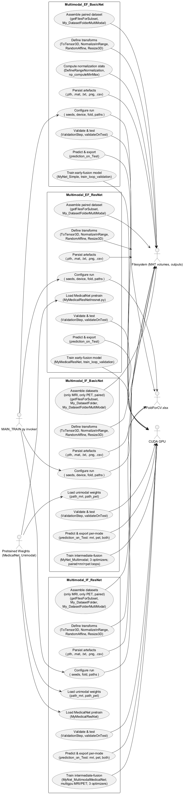
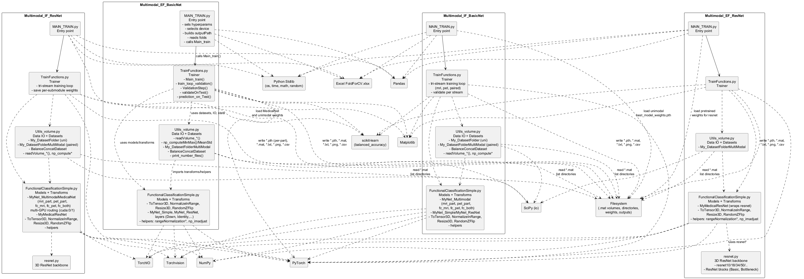
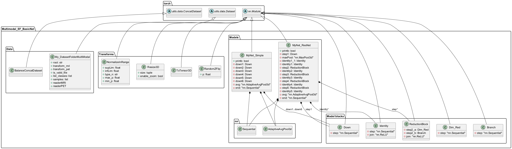
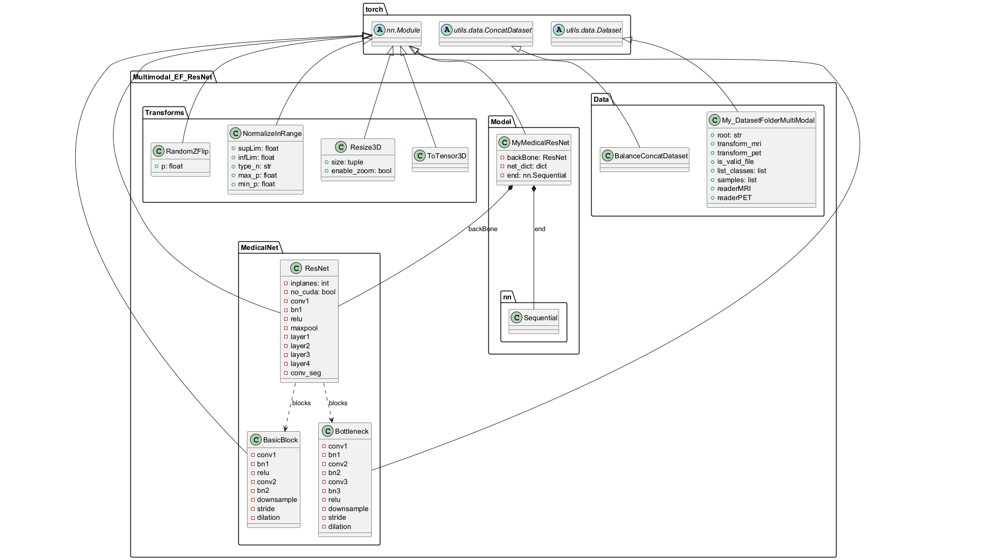
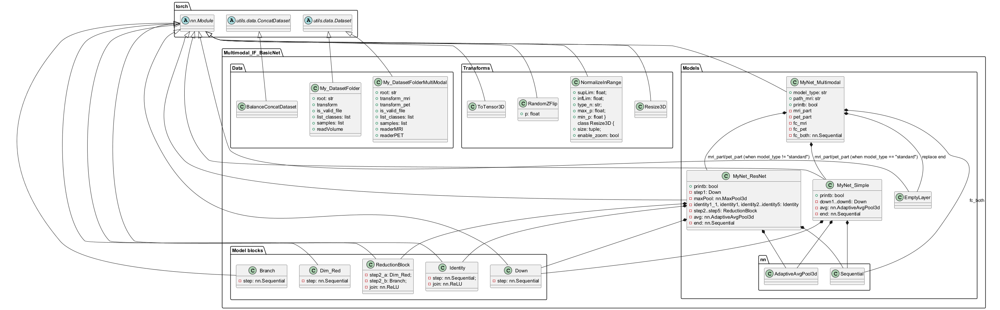
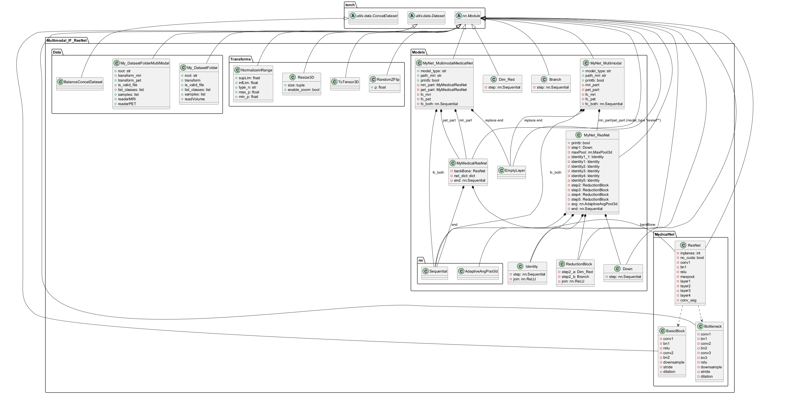
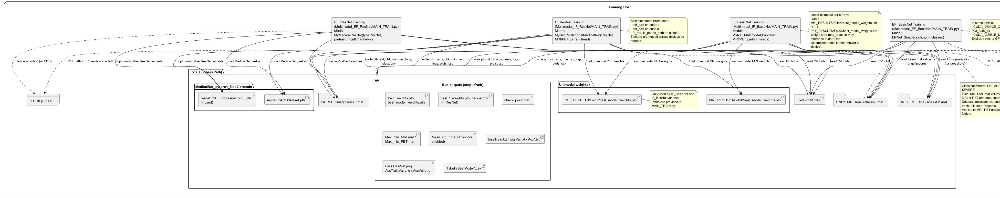

% 1 — System Overview
# SECTION 1 — System Overview

This section introduces the codebase, its purpose, scope, and the key capabilities that are evident from the source. It is intended to be understandable by both technical and non-technical stakeholders while remaining faithful to the code as implemented.

## Purpose

The repository implements multimodal 3D medical image classification pipelines using MRI and PET volumes. It provides two fusion strategies—early fusion and intermediate fusion—and two backbone families—custom CNNs (“BasicNet”) and 3D ResNet variants (via MedicalNet pretraining). The system focuses on supervised classification for neurological conditions with either binary (CN vs NO_CN) or three-class (CN, MILD, SEVERE) targets. It includes complete training, validation, testing, checkpointing, and prediction export workflows.

## Scope

The codebase contains four self-contained training pipelines:

- Early Fusion with BasicNet backbones.
- Early Fusion with pre-trained 3D ResNets (MedicalNet).
- Intermediate Fusion with BasicNet branches (MRI and PET branches fused late).
- Intermediate Fusion with MedicalNet-based branches and explicit multi-GPU placement.

Each pipeline includes:
- Data I/O from MATLAB .mat files for MRI and PET volumes.
- Preprocessing, normalization, optional intensity enhancement, geometric augmentation, and 3D resizing.
- Dataset construction, class balancing, and patient-based cross-validation splits derived from an Excel file.
- Model definition, training loops with validation-driven model selection, and test evaluation.
- Artifact generation including logs, plots, checkpoints, and CSV exports of predictions.

## Repository Structure and Roles

| Directory | Fusion Strategy | Backbone | Classification | Main Model(s) | Entrypoint |
|---|---|---|---|---|---|
| Multimodal_EF_BasicNet | Early fusion (concatenate MRI and PET as channels) | Custom 3D CNN (“BasicNet”) | Binary (CN vs NO_CN) | MyNet_Simple | MAIN_TRAIN.py |
| Multimodal_EF_ResNet | Early fusion | MedicalNet 3D ResNet (e.g., resnet34) | Three-class (CN, MILD, SEVERE) | MyMedicalResNet | MAIN_TRAIN.py |
| Multimodal_IF_BasicNet | Intermediate fusion (separate MRI/PET branches, late FC fusion) | Custom 3D CNN branches | Three-class | MyNet_Multimodal (MyNet_Simple or MyNet_ResNet per config) | MAIN_TRAIN.py |
| Multimodal_IF_ResNet | Intermediate fusion (medicalnet branches, explicit multi-GPU) | MedicalNet 3D ResNet branches | Three-class | MyNet_MultimodalMedicalNet | MAIN_TRAIN.py |

Each directory contains a consistent split of FunctionalClassificationSimple.py (models and transforms), TrainFunctions.py (training/validation/test loops), Utils_volume.py (I/O, normalization statistics, datasets), and MAIN_TRAIN.py (configuration and orchestration).

## Key Features Observable in the Code

The system implements a practical, end-to-end training framework:

- Patient-centric cross-validation. All pipelines read a FoldForCV.xlsx file (Sheet1) to derive validation and test patient sets by fold. Training only includes patients not present in validation or test subsets. This ensures disjoint splits by patient ID.
- MATLAB-based volume ingestion. Volumes are stored in .mat files with MRI under the 'norm' struct and PET under the 'pet' struct. Optional cropping uses coordinates embedded in the .mat files to define a cubic region of interest.
- Flexible preprocessing. Two range normalization modes are supported:
  - Intra-scan (range_intra): per-volume min–max normalization.
  - Inter-scan (range_inter): global min–max computed over training files and saved to Max_min_[MRI|PET].mat.
  Z-score normalization hooks are present but usually disabled in provided configurations.
- Data augmentation and resizing. Augmentations are applied via TorchIO’s RandomAffine (control over scales, degrees, translation), coupled with 3D Resize (trilinear interpolation). An optional enhancement step clips intensities to given quantiles before normalization.
- Early fusion pipeline. For early fusion, MRI and PET volumes are concatenated channel-wise to form a 2-channel 3D tensor processed by a single network.
- Intermediate fusion pipeline. For intermediate fusion, MRI and PET are processed by modality-specific branches:
  - Branches can be BasicNet or MedicalNet-based.
  - Branch logits are replaced by feature extractors, and a dedicated fully connected head fuses features for final classification.
  - The IF_ResNet pipeline includes explicit multi-GPU placement: MRI branch on cuda:1, PET branch and fusion heads on cuda:0, with cross-device tensor transfers.
- Backbones.
  - BasicNet: A compact 3D CNN (MyNet_Simple) with sequential Down blocks (Conv3d+BatchNorm3d+ReLU), progressive channel doublings, AdaptiveAvgPool3d, and a linear classifier.
  - Custom residual CNN (MyNet_ResNet) used in some BasicNet folders for deeper variants: Down blocks, residual Identity blocks, and ReductionBlock stages, followed by global pooling and a linear head.
  - MedicalNet 3D ResNet: Wrappers around resnet10/18/34/50 architectures (3D) with MedicalNet pretraining loaded from .pth checkpoints. The segmentation head is replaced with AdaptiveAvgPool3d and a linear classifier. For early fusion, the first conv layer is replaced to accept 2 input channels.
- Dataset construction and balancing.
  - Utility dataset classes read from ONLY_MRI_final, ONLY_PET_final, and PAIRED_final directories. Sampling respects patient membership and class labels from folder names.
  - Early fusion multi-modal dataset concatenates MRI/PET tensors along channels (My_DatasetFolderMultiModal).
  - Intermediate fusion datasets include both unimodal (MRI-only, PET-only) and paired (both modalities) loaders.
  - BalanceConcatDataset oversamples minority classes by duplicating samples to match the largest class size.
  - EF_BasicNet applies a custom loader pairing to balance binary classes by interleaving batches from “big” and “small” grouped datasets.
- Training, validation, and test loops.
  - Cross-entropy loss and Adam optimizers are consistently used. Batch size, learning rate, weight decay, num epochs, and resize size are configurable in MAIN_TRAIN.py per pipeline.
  - Validation-driven best model selection is based on a combination of mean accuracy, balanced accuracy, and loss, with checkpoints saved as .pth and .mat metadata.
  - Test evaluation is triggered whenever a new best is found during training.
- Outputs and reporting.
  - Training/validation logs are appended to text files (lossTrain.txt, AccTrain.txt, lossVal.txt, AccVal.txt, AccVal_[class].txt).
  - Plots illustrating loss and accuracy trajectories are saved as PNGs.
  - Best model weights and the last training weights are persisted.
  - Prediction exports are written to CSV (e.g., TabellaBestModel*.csv) with filename, patient ID, timepoint fields (dMRI/dPET), class probabilities per class, predicted and true labels, and the originating class folder.
- Reproducibility and device handling.
  - Determinism is configured (manual seeds, cuDNN deterministic/benchmark flags).
  - Devices are selected per script, with explicit CUDA device assignments for multi-GPU configurations where applicable.

## Data and Dependencies

The pipelines assume:
- A root basePath containing an Excel spreadsheet FoldForCV.xlsx with patient IDs and fold metadata (including FOLD and FOLD_VAL columns).
- Three image roots: ONLY_MRI_final, ONLY_PET_final, and PAIRED_final, each organized by class subfolders (CN, MILD, SEVERE).
- MRI .mat files with 'norm' arrays and optional crop coordinates; PET .mat files with 'pet' arrays and optional crop coordinates.

The code depends on:
- PyTorch, torchvision.transforms, and torchio for 3D deep learning and augmentation.
- SciPy (scipy.io) for .mat loading, NumPy, pandas, scikit-learn (balanced_accuracy_score), and Matplotlib for metrics and plotting.

## Summary

In summary, the repository provides four ready-to-run multimodal 3D classification pipelines that differ by fusion strategy and backbone family. All implementations are self-contained, share consistent utilities, and produce artifacts sufficient for model selection, auditability, and downstream analysis, strictly as implemented in the codebase.

% 2 — Architectural Context
## 2. Architectural Context

This section identifies the external systems, libraries, data sources, and operational interfaces that the codebase depends on or exposes. It focuses strictly on elements that are explicitly visible in the repository and its configuration. No hypothetical or inferred integrations are introduced.

### External Systems

- NVIDIA CUDA and cuDNN: The training scripts detect and target specific CUDA devices (e.g., cuda:0, cuda:1), query cuDNN and CUDA versions, and set CUDA-related environment variables (CUDA_DEVICE_ORDER, CUDA_VISIBLE_DEVICES). Computation expects one or multiple GPUs to be available.
- PyTorch (torch): Core deep learning framework for model definition, GPU execution, autograd, optimizers, and serialization (torch.save, torch.load).
- TorchVision (torchvision.transforms): Used for transformation pipelines (Compose) and tensor normalization.
- TorchIO (torchio.transforms.RandomAffine): 3D medical image data augmentation for affine transforms.
- NumPy (numpy): Numeric processing and array math.
- SciPy (scipy.io.loadmat, scipy.io.savemat): MATLAB .mat I/O for volumetric data ingestion and saving checkpoints/statistics.
- scikit-learn (sklearn.metrics.balanced_accuracy_score): Balanced accuracy computation for validation metrics.
- pandas: Reading cross-validation schema from Excel (read_excel) and generating result tables (DataFrame, to_csv).
- Matplotlib (matplotlib.pyplot): Training/validation plots generation and PNG export.
- Matplotlib toolkit (mpl_toolkits.axes_grid1.ImageGrid): Imported in EF/ResNet training modules; not used beyond import.

### APIs / Interfaces

- Filesystem-based dataset interface:
  - Directory layout required by all training scripts:
    - basePath_mri = ONLY_MRI_final
    - basePath_pet = ONLY_PET_final
    - basePath_Paired = PAIRED_final
  - Class subdirectories must exist under each of the above and match listClasses (['CN', 'MILD', 'SEVERE']).
  - File naming conventions are parsed to derive patient identifiers and scan metadata:
    - Patient ID must be the first underscore-separated token in filenames (e.g., PATIENTID_...).
    - Unimodal files are expected to have exactly 3 underscore-separated tokens; paired multimodal files 5.
    - Tokens containing dMRI and dPET (e.g., ..._d12_..., ..._d8.mat) are parsed during prediction for reporting.
  - Label mapping:
    - EF_BasicNet multimodal dataset maps labels to binary: 0 for class listClasses[0] ('CN'), 1 for all others.
    - EF_ResNet and both IF variants map labels to the full class index 0/1/2 consistent with listClasses order.
- Volume file format (.mat) contract:
  - MRI files expose key 'norm' with structure:
    - x['norm'][0][0][0]: 3D volume (float32).
    - x['norm'][0][0][1..3]: axis-aligned crop coordinates for zoom mode (arrays).
  - PET files expose key 'pet' with structure:
    - x['pet'][0][0][0]: 3D volume (float32); transposed with y = y.transpose(1,0,2) before use.
    - x['pet'][0][0][1..3]: crop coordinates for zoom mode.
  - Crop logic assumes volumes fit within [0,255] index ranges per axis and maintains cubic extents.
  - All loaders expand a singleton channel dimension before tensor conversion; ToTensor3D then permutes to NCHWD with C first.
- Cross-validation schema (Excel) interface:
  - File path: basePath + FoldForCV.xlsx, sheet_name='Sheet1'.
  - Required columns referenced in code:
    - Partitioning: Patient, FOLD, FOLD_VAL.
    - Counting/diagnostics across variants:
      - EF_BasicNet/EF_ResNet: MRI_CN, MRI_MILD, MRI_SEVERE, PET_CN, PET_MILD, PET_SEVERE, PAIRED_CN, PAIRED_MILD, PAIRED_SEVERE.
      - IF_ResNet: MRI_MILD, MRI_SEVERE, PET_MILD, PET_SEVERE, PAIRED_MILD, PAIRED_SEVERE.
- Pretrained weight file interface:
  - MedicalNet weights (example path: .../MedicalNet_pytorch_files2/pretrain/resnet_34_23dataset.pth) must be a dict with key 'state_dict' whose keys match or partially match resnet.py layer names for state_dict update.
  - IF variants load unimodal weights from specific directories (e.g., MRI_RESULTS/FoldX/best_model_weights.pth, PET_RESULTS/FoldX/best_model_weights.pth; or MRI_WEIGHTS/PET_WEIGHTS in IF_ResNet).
- Device and environment interface:
  - Scripts set CUDA env variables and select devices programmatically; training assumes deterministic mode toggles and cudnn flags are set as in MAIN_TRAIN.py files.
- Output artifacts (produced interfaces on disk):
  - Model weights:
    - EF_BasicNet/EF_ResNet: train_weights.pth, best_model_weights.pth.
    - IF_ResNet: per-part and per-head weights (train_mri_part_weights.pth, train_fc_mri_weights.pth, train_pet_part_weights.pth, train_fc_pet_weights.pth, train_fc_both_weights.pth; corresponding best_* files).
  - Checkpoints and statistics: check_point.mat, Max_min_MRI.mat, Max_min_PET.mat, optional Mean_std_MRI.mat/Mean_std_PET.mat.
  - Logs and metrics: lossTrain.txt, lossVal.txt, AccTrain.txt, AccVal.txt, per-class AccVal_*.txt.
  - Evaluation tables: TabellaBestModel*.csv.
  - Plots: LossTrainVal.png, AccTrainVal.png, AccVal.png.

### Data Sources

- MRI volumetric data (.mat) located under ONLY_MRI_final/<class>/ and PAIRED_final/<class>/ with required 'norm' key and optional crop coordinates.
- PET volumetric data (.mat) located under ONLY_PET_final/<class>/ and PAIRED_final/<class>/ with required 'pet' key and optional crop coordinates.
- Cross-validation fold definition Excel at basePath + FoldForCV.xlsx with the columns listed above.
- Pretrained 3D ResNet weights (.pth) for MedicalNet backbones, containing a 'state_dict' compatible with resnet.py implementations.
- Unimodal pretrained checkpoints used to initialize IF models (paths configured in MAIN_TRAIN.py).
- GPU devices enumerated and selected at runtime; used as computational resources for training and inference.

### Users / Actors

- No explicit user or actor classes are modeled in the codebase. The scripts are executed directly (e.g., MAIN_TRAIN.py) and interact with the filesystem, GPUs, and the datasets as described above.

% 2.1 — Architectural Context – Use Case Diagram
## Section 2.1 — Architectural Context – Use Case Diagram

This section presents the architectural context of the multimodal MRI/PET classification training system as implemented in the repository. The diagram captures how each training variant interacts with external assets and runtime infrastructure, and which end-to-end activities are executed. The four subsystems are directly derived from the codebase directories: Multimodal_EF_BasicNet, Multimodal_EF_ResNet, Multimodal_IF_BasicNet, and Multimodal_IF_ResNet. External actors are the CUDA GPU device, the filesystem hosting the .mat volumes and output artefacts, the cross-validation spreadsheet (FoldForCV.xlsx), and pretrained weights consumed by the ResNet/MedicalNet and intermediate-fusion variants. The primary human interaction is through invoking the corresponding MAIN_TRAIN.py scripts, which orchestrate configuration, dataset assembly, preprocessing/augmentation, training, validation/testing, and artefact persistence.

Figure 2.1 — Use Case Diagram — Architectural Context (section-2-1-use-case-diagram.puml)

The diagram is derived exclusively from the repository structure, module names, classes, and functions present in the code. It shows, for each subsystem, how MAIN_TRAIN.py orchestrates configuration and data splits (reading FoldForCV.xlsx), constructs datasets and transforms, optionally loads pretrained weights, executes training/validation/testing on CUDA devices, and persists all artefacts to the filesystem, including model weights (.pth), checkpoints (.mat), logs (.txt), plots (.png), and predictions (.csv).

% 3 — Containers
## 3. Containers

This section identifies and describes the executable runtime containers present in the repository. Each container corresponds to a Python training application that orchestrates data loading, preprocessing, model training, validation, and artifact persistence. No networked services or databases are implemented; all interoperation occurs via local file I/O and CUDA-enabled GPU execution.

| Container | Responsibility | Technology | Communication |
|---|---|---|---|
| Multimodal_EF_BasicNet (MAIN_TRAIN.py) | Trains an early-fusion binary classifier (CN vs NO_CN) using a custom 3D CNN (MyNet_Simple). Loads MRI and PET pairs into a two-channel tensor, performs data augmentation, trains/validates/tests, and persists checkpoints, metrics, plots, and predictions. | Python, PyTorch (nn, DataLoader), TorchIO (RandomAffine), SciPy (loadmat/savemat), NumPy, pandas (read_excel/to_csv), scikit-learn (balanced_accuracy), Matplotlib; CUDA device selection via torch.device and CUDA_VISIBLE_DEVICES. | Local file I/O: reads FoldForCV.xlsx and .mat volumes from ONLY_MRI_final, ONLY_PET_final, PAIRED_final; writes .pth weights, .mat checkpoints, .txt logs, .png plots, .csv predictions under outputPath. GPU execution via CUDA (primarily cuda:1). No network protocols. |
| Multimodal_EF_ResNet (MAIN_TRAIN.py) | Trains an early-fusion multi-class classifier (CN, MILD, SEVERE) using a 3D MedicalNet ResNet backbone (resnet34/10/18/50) adapted to two input channels and a classification head. Loads pretrained weights, conducts training, validation, testing, and persists artifacts. | Python, PyTorch (custom resnet.py backbone, state_dict manipulation), SciPy, NumPy, pandas, TorchIO, scikit-learn, Matplotlib; CUDA via torch.device. | Local file I/O: reads FoldForCV.xlsx, .mat volumes, and MedicalNet pretrained .pth from weightPath; writes .pth weights, .mat checkpoints, .txt logs, .png plots, .csv predictions. GPU execution via CUDA (primarily cuda:0). No network protocols. |
| Multimodal_IF_BasicNet (MAIN_TRAIN.py) | Trains an intermediate-fusion multi-class classifier with modality-specific BasicNet backbones (MyNet_Multimodal). Loads unimodal pretrained weights (MRI/PET), alternates training on three data streams (MRI-only, PET-only, PAIRED), and trains a joint fusion head. Persists combined best/train weights, metrics, plots, and predictions for both unimodal and fused modes. | Python, PyTorch (custom MyNet_Simple/MyNet_ResNet blocks, multi-optimizer setup), TorchIO, SciPy, NumPy, pandas, scikit-learn, Matplotlib; CUDA with explicit device and CUDA_VISIBLE_DEVICES. | Local file I/O: reads FoldForCV.xlsx and .mat volumes; loads unimodal .pth weights from MRI_RESULTS/ and PET_RESULTS/; writes combined best/train .pth, .mat checkpoints, .txt logs, .png plots, and .csv predictions (separate for MRI, PET, and both). GPU execution via CUDA (primarily cuda:1). No network protocols. |
| Multimodal_IF_ResNet (MAIN_TRAIN.py) | Trains an intermediate-fusion multi-class classifier using dual MedicalNet ResNet backbones (MyNet_MultimodalMedicalNet). Loads MedicalNet pretrained weights and unimodal best weights, executes cross-device computation (MRI on cuda:1, PET on cuda:0), and trains a fusion head. Persists per-part and fusion weights, metrics, plots, and predictions for unimodal and fused modes. | Python, PyTorch (custom resnet.py backbone wrapping, multi-optimizer, cross-GPU tensor movement), SciPy, NumPy, pandas, TorchIO, scikit-learn, Matplotlib; CUDA multi-GPU. | Local file I/O: reads FoldForCV.xlsx and .mat volumes; loads MedicalNet pretrained .pth and unimodal .pth weights; writes per-module .pth (mri_part, pet_part, fc_mri, fc_pet, fc_both), .mat checkpoints, .txt logs, .png plots, and .csv predictions. GPU execution via CUDA with cross-device transfers (cuda:1 and cuda:0). No network protocols. |
| Local datasets and artifacts (filesystem) | Provides persistent storage for training/validation/test inputs and all outputs. Input datasets include .mat volumes organized under ONLY_MRI_final, ONLY_PET_final, PAIRED_final; CV schema in FoldForCV.xlsx; pretrained weights under paths specified in configurations. Stores outputs including .pth weights, .mat checkpoints, .txt metrics, .png plots, and .csv prediction tables. | OS filesystem; MATLAB .mat format via SciPy; Excel via pandas; PyTorch .pth state_dict files; CSV via pandas; image plots via Matplotlib. | File read/write operations only (no DB, no network). Used by all training containers. |

% 3.1 — Architecture Overview – Component Diagram
# Section 3.1 — Architecture Overview – Component Diagram

This section provides a high-level view of the software architecture as implemented in the repository. It identifies the concrete modules, their responsibilities, and the dependencies among them for all four training variants: Early Fusion with BasicNet, Early Fusion with MedicalNet ResNet, Intermediate Fusion with BasicNet, and Intermediate Fusion with MedicalNet ResNet. The diagram reflects the actual Python files, classes, and call relationships, including data ingestion from the filesystem, model composition, training orchestration, and output artifact generation.

Figure 3.1-1 — Component diagram (all variants)

Table 3.1-1 — Component purpose and key responsibilities

| Package | Component | Purpose and key responsibilities (as implemented) |
|---|---|---|
| Multimodal_EF_BasicNet | MAIN_TRAIN.py | Entry point; seeds, device selection, environment variables, reads FoldForCV.xlsx, computes outputPath, calls Main_train. |
|  | TrainFunctions.py | Defines Main_train (dataset building with My_DatasetFolderMultiModal, transforms, normalizations), training loop train_loop_validation, ValidationStep, validateOnTest, prediction_on_Test; persists artifacts (.pth, .mat, .txt, .png, .csv). |
|  | Utils_volume.py | Data IO from .mat (readVolume_mri/_zoom, readVolume_pet/_zoom), dataset classes (My_DatasetFolderMultiModal, BalanceConcatDataset), dataset statistics (np_computeMinMax, np_computeMeanAndStd_all), helper print_number_files, crop utilities. |
|  | FunctionalClassificationSimple.py | Model definitions (MyNet_Simple, MyNet_ResNet and building blocks), data transforms (ToTensor3D, NormalizeInRange, Resize3D, RandomZFlip), normalization helpers (rangeNormalization*, np_imadjust), utilities (getFilesForSubset, count_parameters). |
| Multimodal_EF_ResNet | MAIN_TRAIN.py | Entry; as above; sets model_type and weightPath for MedicalNet. |
|  | TrainFunctions.py | Trainer for 3-class EF; builds balanced train set (BalanceConcatDataset), computes metrics/logs; uses MyMedicalResNet. |
|  | Utils_volume.py | As above, with 3-class labeling in My_DatasetFolderMultiModal. |
|  | FunctionalClassificationSimple.py | MyMedicalResNet wrapping resnet.* backbone, replacing conv1 and conv_seg, adding classifier head; same transforms and helpers. |
|  | resnet.py | 3D ResNet backbones (10/18/34/50/101/152/200), BasicBlock and Bottleneck, feature layers, conv_seg. |
| Multimodal_IF_BasicNet | MAIN_TRAIN.py | Entry; loads unimodal weights (MRI, PET) paths used by MyNet_Multimodal; sets IF training parameters. |
|  | TrainFunctions.py | Tri-stream training loop over mri-only, pet-only, and paired data; three optimizers (mri, pet, paired); per-stream validation and testing; predictions exported per modality. |
|  | Utils_volume.py | Adds My_DatasetFolder (unimodal) and My_DatasetFolderMultiModal (paired) plus BalanceConcatDataset; same IO/statistics; crop and normalization utilities. |
|  | FunctionalClassificationSimple.py | MyNet_Multimodal composed of mri_part and pet_part (MyNet_Simple/MyNet_ResNet), with fc_mri, fc_pet, and fc_both heads; supports forward modes 'mri'/'pet'/'multi'. |
| Multimodal_IF_ResNet | MAIN_TRAIN.py | Entry; loads MedicalNet pretrained and unimodal weights; sets paths and output. |
|  | TrainFunctions.py | Tri-stream training with MedicalNet; saves and reloads per-submodule weights (mri_part, fc_mri, pet_part, fc_pet, fc_both). |
|  | Utils_volume.py | As in IF BasicNet variant. |
|  | FunctionalClassificationSimple.py | MyNet_MultimodalMedicalNet composing two MyMedicalResNet encoders with explicit multi-GPU routing between cuda:0 and cuda:1; fc_both combines modality embeddings; also MyMedicalResNet (single-modality head). |
|  | resnet.py | 3D ResNet backbones used by MyMedicalResNet. |

This diagram and table can be validated directly against the codebase by inspecting each module’s imports, classes, and function calls.

% 4 — Components
## 4. Components

This section identifies and describes the internal components implemented in each container of the repository. It focuses on responsibilities and concrete interactions, as evident from imports, function calls, data flows, and dependencies. The scope includes modules, functions, classes, datasets, and training orchestration in each container. This section intentionally lists all components defined in the codebase to enable validation by the development team.

### 4.1 Multimodal_EF_BasicNet

The Early-Fusion BasicNet pipeline concatenates MRI and PET 3D volumes into a two-channel tensor and trains a 3D CNN end-to-end.

Table: Multimodal_EF_BasicNet Components

| Component | Responsibility | Interactions |
|---|---|---|
| MAIN_TRAIN.py (entrypoint) | Sets seeds, device, paths, CV fold, normalization/augmentation flags, and output directory; invokes Main_train. | TrainFunctions.Main_train |
| FunctionalClassificationSimple.rangeNormalizationIntra | Numpy min-max scaling per-instance to [infLim, supLim]. | Used by Utils_volume.np_computeMeanAndStd_all |
| FunctionalClassificationSimple.rangeNormalizationInter | Numpy min-max scaling using global min/max across training set to [infLim, supLim]. | Used by Utils_volume.np_computeMeanAndStd_all |
| FunctionalClassificationSimple.np_imadjust | Intensity clipping by quantiles for enhancement. | TrainFunctions.Main_train (via lambda wrappers) |
| FunctionalClassificationSimple.ToTensor3D | Convert numpy volume HWD1 to tensor C, D, H, W (transpose 3,2,0,1). | torchvision.transforms.Compose in TrainFunctions.Main_train |
| FunctionalClassificationSimple.RandomZFlip | Optional flip along channel index 1 with probability p. | Not used in the current transforms pipeline |
| FunctionalClassificationSimple.NormalizeInRange | Torch tensor variant of min-max scaling (intra or inter). | TrainFunctions.DefineRangeNormalization; applied in transforms pipelines |
| FunctionalClassificationSimple.Resize3D | Optional 3D interpolation to target size. | Applied in train/val transforms in TrainFunctions.Main_train |
| FunctionalClassificationSimple.getFilesForSubset | Walk basepath/class folders and select files via include_patient predicate; labels by class index. | TrainFunctions.Main_train |
| FunctionalClassificationSimple.count_parameters | Count trainable parameters. | TrainFunctions.Main_train |
| FunctionalClassificationSimple.Down | 3D Conv-BN-ReLU block with stride/padding; used for downsampling. | MyNet_Simple, MyNet_ResNet |
| FunctionalClassificationSimple.MyNet_Simple | 3D CNN (6 Down blocks) with AdaptiveAvgPool3d and Linear head for classification. | Instantiated in TrainFunctions.Main_train; used in training/validation/test; used by TrainFunctions.prediction_on_Test |
| FunctionalClassificationSimple.Identity | Two 3x3x3 residual convs with skip connection and ReLU. | MyNet_ResNet |
| FunctionalClassificationSimple.Dim_Red | 1x1x1 stride-2 convolution + BN to reduce spatial dims and channels. | ReductionBlock |
| FunctionalClassificationSimple.Branch | 3x3x3 stride-2 conv + 3x3x3 conv branch. | ReductionBlock |
| FunctionalClassificationSimple.ReductionBlock | Sum of Dim_Red and Branch followed by ReLU. | MyNet_ResNet |
| FunctionalClassificationSimple.MyNet_ResNet | Custom residual 3D CNN with staged reductions and identities; avg pool and Linear head. | Not instantiated in EF_BasicNet MAIN; available alternative |
| Utils_volume.print_number_files | Log file counts per modality and class from pandas dataframe. | MAIN_TRAIN.py before training |
| Utils_volume.compute_crop | Compute cubic crop box centered on provided coordinates and clamp to [0,255]. | readVolume_mri_zoom, readVolume_pet_zoom |
| Utils_volume.check_coord | Adjust crop to maintain range and bounds. | compute_crop |
| Utils_volume.readVolume_mri | Load MATLAB .mat; extract x['norm'][0][0][0]; expand channel. | TrainFunctions.Main_train data loaders |
| Utils_volume.readVolume_mri_zoom | As above plus center crop using landmarks. | TrainFunctions.Main_train when enable_zoom |
| Utils_volume.readVolume_pet | Load MATLAB .mat; extract x['pet'][0][0][0]; transpose and expand channel. | TrainFunctions.Main_train data loaders |
| Utils_volume.readVolume_pet_zoom | As above plus center crop using landmarks. | TrainFunctions.Main_train when enable_zoom |
| Utils_volume.np_computeMeanAndStd_all | Compute global mean/std after normalization selection. | TrainFunctions.Main_train when zscore flags are true |
| Utils_volume.np_computeMinMax | Compute global min/max over training files via reader. | TrainFunctions.DefineRangeNormalization; persisted to MAT |
| Utils_volume.My_DatasetFolderMultiModal | Dataset yielding concatenated MRI and PET tensors (channels-first) and binary target (class 0 vs others). | Constructed in TrainFunctions.Main_train for train/val/test |
| Utils_volume.BalanceConcatDataset | Class-balanced concatenation by oversampling to equal length. | Not used in EF_BasicNet codepath; defined |
| TrainFunctions.train_loop_validation | Epoch loop: balanced training across big_dataset (CN) and small_dataset (MILD+SEVERE), backprop, log, checkpoint; run ValidationStep and potentially validateOnTest; write checkpoint MAT. | Uses torch DataLoader, optimizer, criterion; calls ValidationStep, validateOnTest; saves weights and metrics |
| TrainFunctions.ValidationStep | Evaluate on validation set; compute loss, accuracy, per-class accuracies, balanced accuracy; log metrics. | Called by train_loop_validation |
| TrainFunctions.validateOnTest | Evaluate on test set with same metrics. | Called upon best checkpoint updates |
| TrainFunctions.prediction_on_Test | Inference on test set; builds per-sample DataFrame with probabilities and metadata; writes later. | Used after loading best model in Main_train |
| TrainFunctions.DefineRangeNormalization | Build NormalizeInRange transform; for range_inter compute min/max using Utils_volume.np_computeMinMax. | Called in Main_train |
| TrainFunctions.Main_train | End-to-end orchestration: datasets construction and balancing, transform pipelines, model construction (MyNet_Simple with 2 input channels), optimizer and criterion, training loop, plotting loss/accuracy, best-model reload and test inference, performance summary. | Uses all utility readers, transforms, datasets; calls train_loop_validation, prediction_on_Test; persists artifacts to outputPath |

### 4.2 Multimodal_EF_ResNet

The Early-Fusion MedicalNet pipeline concatenates MRI and PET into two channels and fine-tunes a 3D ResNet backbone initialized from MedicalNet weights.

Table: Multimodal_EF_ResNet Components

| Component | Responsibility | Interactions |
|---|---|---|
| MAIN_TRAIN.py (entrypoint) | Configure seeds, device, fold, normalization flags, paths, and output; invokes Main_train. | TrainFunctions.Main_train |
| FunctionalClassificationSimple.rangeNormalizationIntra | Per-instance min-max scaling (numpy). | Utils_volume.np_computeMeanAndStd_all |
| FunctionalClassificationSimple.rangeNormalizationInter | Global min-max scaling (numpy). | Utils_volume.np_computeMeanAndStd_all |
| FunctionalClassificationSimple.np_imadjust | Intensity clipping by quantiles. | TrainFunctions.Main_train (optional enhancement) |
| FunctionalClassificationSimple.ToTensor3D | Numpy to torch (C,D,H,W). | Transforms in Main_train |
| FunctionalClassificationSimple.RandomZFlip | Probabilistic flip. | Defined, not used |
| FunctionalClassificationSimple.NormalizeInRange | Tensor normalization in range. | Train/val transforms via DefineRangeNormalization |
| FunctionalClassificationSimple.Resize3D | Optional 3D interpolation to resize. | Transforms in Main_train |
| FunctionalClassificationSimple.getFilesForSubset | Enumerate files per class with predicate. | TrainFunctions.Main_train |
| FunctionalClassificationSimple.count_parameters | Count trainable parameters. | TrainFunctions.Main_train |
| FunctionalClassificationSimple.MyMedicalResNet | Wrap MedicalNet ResNet (10/18/34/50) with pretrained weights; replace conv1 to accept multi-channel input; replace conv_seg with avg pool; add Linear(512,num_classes). | Instantiated in TrainFunctions.Main_train with inputChannel=2; uses resnet module |
| resnet.conv3x3x3 | 3D conv utility. | Used by resnet blocks |
| resnet.downsample_basic_block | Downsample shortcut helper for type A. | resnet.ResNet._make_layer |
| resnet.BasicBlock | Residual basic block (3D). | resnet.ResNet |
| resnet.Bottleneck | Residual bottleneck block (3D). | resnet.ResNet |
| resnet.ResNet | 3D ResNet backbone with layers 1–4 and segmentation head conv_seg (overridden later). | Used by FunctionalClassificationSimple.MyMedicalResNet |
| resnet.resnet{10,18,34,50,101,152,200} | Factory functions to build ResNet variants. | Used by FunctionalClassificationSimple.MyMedicalResNet |
| Utils_volume.print_number_files | Log counts per class/modality. | MAIN_TRAIN.py |
| Utils_volume.compute_crop | Compute cubic crop from landmarks. | readVolume_*_zoom |
| Utils_volume.check_coord | Crop range adjustment. | compute_crop |
| Utils_volume.readVolume_mri | Load MRI volume from .mat as 4D array. | TrainFunctions.Main_train data loaders |
| Utils_volume.readVolume_mri_zoom | MRI reader with crop. | TrainFunctions.Main_train when enable_zoom |
| Utils_volume.readVolume_pet | Load PET volume and transpose to match orientation; expand channel. | TrainFunctions.Main_train data loaders |
| Utils_volume.readVolume_pet_zoom | PET reader with crop and transpose; expand channel. | TrainFunctions.Main_train when enable_zoom |
| Utils_volume.np_computeMeanAndStd_all | Global mean/std after normalization. | TrainFunctions.Main_train when zscore enabled |
| Utils_volume.np_computeMinMax | Global min/max computation. | TrainFunctions.DefineRangeNormalization |
| Utils_volume.My_DatasetFolderMultiModal | Dataset yielding concatenated MRI+PET tensor and 3-class target by class index. | Constructed in TrainFunctions.Main_train |
| Utils_volume.BalanceConcatDataset | Oversample to equalize lengths across datasets. | Used to balance concatenated per-class datasets (completeTrainSet) |
| TrainFunctions.train_loop_validation | Standard training loop; logs, checkpoints, triggers validation and test; saves state_dict. | Calls ValidationStep, validateOnTest; saves to outputPath |
| TrainFunctions.ValidationStep | Validation metrics including per-class and balanced accuracy; logs to files. | Called by train_loop_validation |
| TrainFunctions.validateOnTest | Test set evaluation and logging. | Called on new best |
| TrainFunctions.prediction_on_Test | Build predictions DataFrame with 3-class probabilities; metadata extraction from filename. | Used post-training |
| TrainFunctions.DefineRangeNormalization | Build NormalizeInRange; compute and return global min/max for range_inter. | Called by Main_train |
| TrainFunctions.Main_train | Orchestrate data loading, transforms, dataset balancing, model creation (MyMedicalResNet with 2 input channels), optimizer, training, metric plotting, and best model evaluation. | Uses all above components; persists MAT, PNG, CSV artifacts |

### 4.3 Multimodal_IF_BasicNet

The Intermediate-Fusion BasicNet pipeline trains unimodal MRI and PET branches (initialized from unimodal checkpoints) and a fusion head on paired data, alternating training on paired, MRI-only, and PET-only batches.

Table: Multimodal_IF_BasicNet Components

| Component | Responsibility | Interactions |
|---|---|---|
| MAIN_TRAIN.py (entrypoint) | Configure seeds, GPU visibility, fold, normalization flags, paths; defines unimodal weight paths; invokes Main_train. | TrainFunctions.Main_train |
| FunctionalClassificationSimple.rangeNormalizationIntra | Per-instance min-max scaling (numpy). | Utils_volume.np_computeMeanAndStd_all |
| FunctionalClassificationSimple.rangeNormalizationInter | Global min/max scaling (numpy). | Utils_volume.np_computeMeanAndStd_all |
| FunctionalClassificationSimple.np_imadjust | Intensity clipping. | TrainFunctions.Main_train (optional) |
| FunctionalClassificationSimple.ToTensor3D | Numpy to torch (C,D,H,W). | Train/val transforms |
| FunctionalClassificationSimple.RandomZFlip | Flip augmentation. | Defined, not used |
| FunctionalClassificationSimple.NormalizeInRange | Tensor normalization in given range. | Transforms via DefineRangeNormalization |
| FunctionalClassificationSimple.Resize3D | Optional 3D interpolation resize. | Transforms |
| FunctionalClassificationSimple.getFilesForSubset | Enumerate files per class/predicate. | TrainFunctions.Main_train |
| FunctionalClassificationSimple.count_parameters | Trainable params count. | TrainFunctions.Main_train |
| FunctionalClassificationSimple.Down | 3D Conv-BN-ReLU block. | MyNet_Simple, MyNet_ResNet |
| FunctionalClassificationSimple.MyNet_Simple | 3D CNN encoder-head network for classification. | Subnet in MyNet_Multimodal when model_type == 'standard' |
| FunctionalClassificationSimple.EmptyLayer | Identity module to bypass a head. | Used to strip final heads when fusing embeddings |
| FunctionalClassificationSimple.MyNet_Multimodal | Two-branch model (MRI and PET) with optional BasicNet/ResNet backbones; loads unimodal weights; exposes three heads: fc_mri, fc_pet, and fc_both for fusion. | Instantiated in TrainFunctions.Main_train; trained with three optimizers; forward supports modes 'mri', 'pet', 'multi' |
| FunctionalClassificationSimple.Identity | Residual block helper. | MyNet_ResNet |
| FunctionalClassificationSimple.Dim_Red | 1x1x1 stride-2 reducer. | ReductionBlock |
| FunctionalClassificationSimple.Branch | 3x3x3 stride-2 + 3x3x3 conv branch. | ReductionBlock |
| FunctionalClassificationSimple.ReductionBlock | Combine branches with ReLU. | MyNet_ResNet |
| FunctionalClassificationSimple.MyNet_ResNet | Custom residual 3D CNN variant. | Alternative backbone for MyNet_Multimodal when model_type != 'standard' |
| Utils_volume.print_number_files | Log counts per class/modality. | MAIN_TRAIN.py |
| Utils_volume.compute_crop | Crop computation using landmarks. | readVolume_*_zoom |
| Utils_volume.check_coord | Crop bounds adjustment. | compute_crop |
| Utils_volume.readVolume_mri | Load MRI from .mat; expand channel. | TrainFunctions.Main_train loaders |
| Utils_volume.readVolume_mri_zoom | MRI reader with crop. | When enable_zoom |
| Utils_volume.readVolume_pet | Load PET; transpose and expand channel. | TrainFunctions.Main_train loaders |
| Utils_volume.readVolume_pet_zoom | PET reader with crop/transpose. | When enable_zoom |
| Utils_volume.np_computeMeanAndStd_all | Global mean/std after normalization. | TrainFunctions.Main_train when zscore enabled |
| Utils_volume.np_computeMinMax | Global min/max for normalization. | TrainFunctions.DefineRangeNormalization |
| Utils_volume.My_DatasetFolder | Unimodal dataset returning single-volume tensor and class index. | Constructed for MRI-only and PET-only datasets (from ONLY_* and PAIRED_* roots) |
| Utils_volume.My_DatasetFolderMultiModal | Paired dataset returning MRI tensor, PET tensor, and class index. | Constructed for trained paired data, and val/test paired |
| Utils_volume.BalanceConcatDataset | Oversample per-class datasets to equal length. | Used to balance unimodal and paired datasets |
| TrainFunctions.train_loop_validation | Training loop that cycles: paired multi-step, then MRI-only step, then PET-only step per iteration; uses three optimizers; logs, checkpoints, validation/test. | Calls ValidationStep, validateOnTest |
| TrainFunctions.ValidationStep | Evaluate MRI-only, PET-only, and paired; accumulate metrics and balanced accuracy; logs. | Called by train_loop_validation |
| TrainFunctions.validateOnTest | Evaluate test sets for MRI-only, PET-only, and paired; logs metrics. | Called on improvement |
| TrainFunctions.prediction_on_Test | Generate three DataFrames: both, mri, pet; collects probabilities and metadata for each branch/fusion; prints shapes. | Called post-training |
| TrainFunctions.DefineRangeNormalization | Build NormalizeInRange and optionally compute global min/max. | Called by Main_train |
| TrainFunctions.calcolaPerformance | Compute and print accuracy per class for a results table. | Used post-inference on the three tables |
| TrainFunctions.Main_train | Full orchestration: construct transforms, readers, datasets, balance datasets, instantiate MyNet_Multimodal with unimodal checkpoints, set up three optimizers, train, plot metrics, reload best, run predictions and performance summaries. | Integrates all above components; persists artifacts |

### 4.4 Multimodal_IF_ResNet

The Intermediate-Fusion MedicalNet pipeline fuses two MedicalNet backbones (potentially on separate GPUs) and trains modality-specific heads and a fusion head with alternating training across paired, MRI-only, and PET-only data.

Table: Multimodal_IF_ResNet Components

| Component | Responsibility | Interactions |
|---|---|---|
| MAIN_TRAIN.py (entrypoint) | Configure seeds, paths, fold, normalization flags; set MedicalNet weight path and unimodal checkpoint paths; invokes Main_train. | TrainFunctions.Main_train |
| FunctionalClassificationSimple.rangeNormalizationIntra | Per-instance min-max scaling (numpy). | Utils_volume.np_computeMeanAndStd_all |
| FunctionalClassificationSimple.rangeNormalizationInter | Global min/max scaling (numpy). | Utils_volume.np_computeMeanAndStd_all |
| FunctionalClassificationSimple.np_imadjust | Intensity clipping. | TrainFunctions.Main_train (optional) |
| FunctionalClassificationSimple.ToTensor3D | Numpy to torch (C,D,H,W). | Transforms |
| FunctionalClassificationSimple.RandomZFlip | Flip augmentation. | Defined, not used |
| FunctionalClassificationSimple.NormalizeInRange | Tensor normalization in target range. | Transforms via DefineRangeNormalization |
| FunctionalClassificationSimple.Resize3D | Optional 3D resize. | Transforms |
| FunctionalClassificationSimple.getFilesForSubset | Enumerate files per class/predicate. | TrainFunctions.Main_train |
| FunctionalClassificationSimple.count_parameters | Trainable params count. | TrainFunctions.Main_train |
| FunctionalClassificationSimple.MyMedicalResNet | Wrap MedicalNet ResNet with pretrained weights; replace conv_seg with avg pool; dense head Linear(512,num_classes). | Used inside MyNet_MultimodalMedicalNet for each modality |
| FunctionalClassificationSimple.Down | 3D Conv-BN-ReLU. | MyNet_ResNet (alternative) |
| FunctionalClassificationSimple.EmptyLayer | Identity module to bypass a head. | Used to remove unimodal heads before fusion |
| FunctionalClassificationSimple.MyNet_Multimodal | Two-branch model with BasicNet/ResNet backbones and fusion MLP; loads unimodal weights; single-device variant. | Defined but not used in this container’s training path |
| FunctionalClassificationSimple.MyNet_MultimodalMedicalNet | Two MedicalNet branches on separate CUDA devices (mri on cuda:1, pet on cuda:0); loads unimodal heads; defines fc_mri, fc_pet, and fc_both on cuda:0; forward supports modes 'mri', 'pet', 'multi'. | Instantiated and trained in TrainFunctions.Main_train; parameters persisted per submodule |
| FunctionalClassificationSimple.Identity | Residual helper. | MyNet_ResNet alternative |
| FunctionalClassificationSimple.Dim_Red | 1x1x1 stride-2 reducer. | ReductionBlock |
| FunctionalClassificationSimple.Branch | 3x3x3 stride-2 + 3x3x3 conv branch. | ReductionBlock |
| FunctionalClassificationSimple.ReductionBlock | Combine branches with ReLU. | MyNet_ResNet |
| FunctionalClassificationSimple.MyNet_ResNet | Alternative custom residual 3D CNN with multi-layer head. | Defined but not used by training path |
| resnet.conv3x3x3 | 3D conv utility. | Used by resnet blocks |
| resnet.downsample_basic_block | Downsample shortcut helper. | resnet.ResNet._make_layer |
| resnet.BasicBlock | Residual basic block (3D). | resnet.ResNet |
| resnet.Bottleneck | Residual bottleneck block (3D). | resnet.ResNet |
| resnet.ResNet | 3D ResNet backbone; layer strides configured (layers 2–4 use stride 2). | Used by FunctionalClassificationSimple.MyMedicalResNet |
| resnet.resnet{10,18,34,50,101,152,200} | Factory functions for ResNet variants. | Used by FunctionalClassificationSimple.MyMedicalResNet |
| Utils_volume.print_number_files | Print counts (IF_ResNet variant prints only MILD/SEVERE subsets). | MAIN_TRAIN.py |
| Utils_volume.compute_crop | Compute crop window. | readVolume_*_zoom |
| Utils_volume.check_coord | Adjust crop window bounds. | compute_crop |
| Utils_volume.readVolume_mri | Load MRI from .mat; expand channel. | TrainFunctions.Main_train loaders |
| Utils_volume.readVolume_mri_zoom | MRI reader with crop. | When enable_zoom |
| Utils_volume.readVolume_pet | Load PET; transpose; expand channel. | TrainFunctions.Main_train loaders |
| Utils_volume.readVolume_pet_zoom | PET reader with crop/transpose. | When enable_zoom |
| Utils_volume.np_computeMeanAndStd_all | Global mean/std after normalization. | TrainFunctions.Main_train when zscore enabled |
| Utils_volume.np_computeMinMax | Global min/max. | TrainFunctions.DefineRangeNormalization |
| Utils_volume.My_DatasetFolder | Unimodal dataset returning single tensor and class index. | Constructed for MRI-only and PET-only datasets |
| Utils_volume.My_DatasetFolderMultiModal | Paired dataset returning MRI tensor, PET tensor, and target. | Constructed for paired train/val/test |
| Utils_volume.BalanceConcatDataset | Oversample class datasets to equal length. | Used to balance unimodal and paired datasets |
| TrainFunctions.train_loop_validation | Alternates multi, MRI-only, PET-only training steps per iteration; uses three optimizers; logs; saves submodule weights separately (mri_part, fc_mri, pet_part, fc_pet, fc_both); validates and tests on improvement. | Calls ValidationStep, validateOnTest; uses device strings with CUDA mappings |
| TrainFunctions.ValidationStep | Evaluate three modes (mri, pet, multi); compute metrics and balanced accuracy; logs to files. | Used by train_loop_validation |
| TrainFunctions.validateOnTest | Test evaluation across three modes; logs metrics. | Called when best improves |
| TrainFunctions.prediction_on_Test | Generate three DataFrames (both, mri, pet) with probabilities and metadata; runs purely on CPU tensors inside function. | Used post-training |
| TrainFunctions.DefineRangeNormalization | Build NormalizeInRange; compute and return global min/max for range_inter. | Called by Main_train |
| TrainFunctions.calcolaPerformance | Compute and print overall and per-class accuracies for a predictions table. | Used post-inference |
| TrainFunctions.Main_train | Orchestrate transforms, readers, datasets, balancing, model creation (MyNet_MultimodalMedicalNet), optimizers, training/validation/test, metric plotting, best submodules reload, predictions and performance summaries. | Integrates all above; persists artifacts including separate weights per submodule |

% 5 — Code-Level View
# Section 5 — Code-Level View

This section describes how architectural elements map to concrete source files, classes, and functions. It identifies executable entry points, summarizes key modules and directories, and outlines recognizable design patterns that are evident from the code. The intent is to aid developers in navigating, validating, and evolving the implementation.

## 5.1 Purpose and Scope

The repository implements four training pipelines for multimodal 3D medical image classification, distinguished by fusion strategy (Early vs Intermediate) and backbone (BasicNet vs MedicalNet/3D-ResNet). Each pipeline is self-contained in its directory and exposes a single executable script. This section maps the architectural building blocks—data ingestion, preprocessing, datasets, model architectures, training and evaluation—onto Python modules, providing a full inventory of classes and functions per file.

## 5.2 Repository Layout and Module Overview

The repository contains four top-level directories, one per pipeline. Each directory follows a consistent module structure: FunctionalClassificationSimple.py (models and transforms), Utils_volume.py (I/O and datasets), TrainFunctions.py (training orchestration), and MAIN_TRAIN.py (entry point). ResNet-based pipelines also include resnet.py.

Table 5.2.1 — Top-level directories and purposes

| Directory                     | Fusion strategy | Backbone            | Purpose                                                                 |
|------------------------------|-----------------|---------------------|-------------------------------------------------------------------------|
| Multimodal_EF_BasicNet       | Early fusion    | Custom BasicNet     | Binary classification CN vs NO_CN from paired MRI+PET with BasicNet.    |
| Multimodal_EF_ResNet         | Early fusion    | MedicalNet (3D-ResNet) | Multiclass CN/MILD/SEVERE from paired MRI+PET using pretrained ResNet. |
| Multimodal_IF_BasicNet       | Intermediate fusion | Custom BasicNet  | Multiclass CN/MILD/SEVERE with unimodal branches fused at feature level. |
| Multimodal_IF_ResNet         | Intermediate fusion | MedicalNet/3D-ResNet | Multiclass CN/MILD/SEVERE with two GPUs, feature-level fusion.        |

## 5.3 Main Entry Points

Each pipeline is executed by its MAIN_TRAIN.py module. These scripts assemble configuration parameters, resolve device(s), create output directories, and invoke the corresponding Main_train function from TrainFunctions.py.

Table 5.3.1 — Executable scripts and invoked trainers

| Entry point file                                         | Called function            | Primary responsibilities                                                                                              |
|----------------------------------------------------------|----------------------------|-----------------------------------------------------------------------------------------------------------------------|
| Multimodal_EF_BasicNet/MAIN_TRAIN.py                     | TrainFunctions.Main_train  | Prepares binary CN vs NO_CN early-fusion training; builds transforms/datasets; instantiates MyNet_Simple; trains.     |
| Multimodal_EF_ResNet/MAIN_TRAIN.py                       | TrainFunctions.Main_train  | Prepares multiclass early-fusion MedicalNet training; loads pretrained ResNet; trains MyMedicalResNet.                |
| Multimodal_IF_BasicNet/MAIN_TRAIN.py                     | TrainFunctions.Main_train  | Prepares multiclass intermediate-fusion training; loads unimodal weights; trains MyNet_Multimodal with 3 modes.       |
| Multimodal_IF_ResNet/MAIN_TRAIN.py                       | TrainFunctions.Main_train  | Prepares multiclass intermediate-fusion MedicalNet training across two GPUs; trains MyNet_MultimodalMedicalNet.       |

All four entry points are script-style; there is no CLI argument parsing. Configuration is done via literal values at the top of each script, with simple string-to-boolean conversions. EF_BasicNet and IF_BasicNet optionally set CUDA environment variables for device ordering and visibility.

## 5.4 Component-to-Code Mapping

The architecture is decomposed consistently across pipelines into the following component types:

- Data readers and preprocessing transforms.
- Dataset definitions (unimodal and multimodal).
- Model architectures (BasicNet variants, MedicalNet/ResNet wrappers, multimodal aggregators).
- Training orchestration (train/validate/test loops, checkpointing, metrics, prediction export).
- Utility functions (fold statistics, normalization parameter computation).

The following tables enumerate, per module, all classes and functions and their responsibilities.

### 5.4.1 Multimodal_EF_BasicNet

Table 5.4.1.1 — FunctionalClassificationSimple.py

| Element                          | Kind      | Responsibility                                                                                           |
|----------------------------------|-----------|-----------------------------------------------------------------------------------------------------------|
| rangeNormalizationIntra          | Function  | Per-sample min–max normalization to [infLim, supLim].                                                    |
| rangeNormalizationInter          | Function  | Dataset-level min–max normalization to [infLim, supLim] given global min/max.                            |
| np_imadjust                      | Function  | Percentile clipping with symmetric quantiles q1,q2 before normalization.                                 |
| ToTensor3D                       | Class     | Transform: converts numpy volume (H,W,D,C) to torch tensor (C,D,H,W).                                    |
| RandomZFlip                      | Class     | Transform: random flip along channel index 1 (not used in current pipelines).                            |
| NormalizeInRange                 | Class     | Transform: intra- or inter-sample range normalization in torch.                                          |
| Resize3D                         | Class     | Transform: optional trilinear interpolation to a target 3D size.                                         |
| getFilesForSubset                | Function  | Gathers (path,label) pairs filtered by include_patient predicate.                                        |
| count_parameters                 | Function  | Counts trainable parameters of a torch model.                                                            |
| Down                             | Class     | 3D Conv-BN-ReLU block with configurable kernel/stride/padding.                                           |
| MyNet_Simple                     | Class     | Six-level 3D downsampling network with AdaptiveAvgPool3d and Linear head; used as EF BasicNet backbone.  |
| Identity                         | Class     | Residual block with two convs and identity skip.                                                         |
| Dim_Red                          | Class     | 1x1x1 conv stride-2 for channel and spatial downsampling.                                                |
| Branch                           | Class     | 3x3x3 reduction branch (stride-2) followed by 3x3x3 conv.                                                |
| ReductionBlock                   | Class     | Aggregates Dim_Red and Branch with elementwise sum and ReLU.                                             |
| MyNet_ResNet                     | Class     | Deeper residual network variant (unused in EF_BasicNet pipeline).                                        |

Table 5.4.1.2 — Utils_volume.py

| Element                         | Kind      | Responsibility                                                                                              |
|---------------------------------|-----------|--------------------------------------------------------------------------------------------------------------|
| print_number_files              | Function  | Prints per-class sample counts from a pandas DataFrame row subset.                                          |
| compute_crop                    | Function  | Computes a cubic crop around bounding box coordinates; ensures consistent ranges across axes.               |
| check_coord                     | Function  | Adjusts crop bounds to remain within [min,max] while preserving range.                                      |
| readVolume_mri                  | Function  | Loads MATLAB .mat, retrieves x['norm'][0][0][0] as float32, adds channel axis.                              |
| readVolume_mri_zoom             | Function  | Loads MRI volume and applies compute_crop using provided bbox in .mat before adding channel axis.           |
| readVolume_pet                  | Function  | Loads PET volume x['pet'][0][0][0], transpose(1,0,2) to align axes, adds channel axis.                      |
| readVolume_pet_zoom             | Function  | Loads PET volume, crops via bbox, transposes axes, adds channel axis.                                       |
| np_computeMeanAndStd_all        | Function  | Computes mean and std over all voxels of a file list with optional normalization.                           |
| np_computeMinMax                | Function  | Computes global min and max over a file list.                                                               |
| My_DatasetFolderMultiModal      | Class     | Yields concatenated MRI+PET tensors (C=2) and binary labels 0 for listClasses[0] else 1; early fusion.      |
| BalanceConcatDataset            | Class     | Balances datasets to half of the largest length (defined but not used in EF_BasicNet pipeline).             |

Table 5.4.1.3 — TrainFunctions.py

| Element                | Kind     | Responsibility                                                                                                                                |
|------------------------|----------|------------------------------------------------------------------------------------------------------------------------------------------------|
| train_loop_validation  | Function | Alternates batches from majority and minority paired datasets; trains MyNet_Simple; logs metrics; checkpoints best and last; triggers testing. |
| ValidationStep         | Function | Runs validation, computes loss, accuracy, per-class accuracies, and balanced accuracy; logs.                                                  |
| validateOnTest         | Function | Runs test set evaluation; reports loss and per-class accuracies.                                                                               |
| prediction_on_Test     | Function | Iterates over test samples; runs inference; returns DataFrame with probabilities, predictions, and metadata parsed from filenames.             |
| DefineRangeNormalization | Function | Prepares NormalizeInRange transform and computes global min/max for 'range_inter' mode.                                                     |
| Main_train             | Function | End-to-end orchestration: file selection, transform assembly, dataset construction, model and optimizer setup, training, plotting, reporting.  |

Table 5.4.1.4 — MAIN_TRAIN.py

| Element           | Kind     | Responsibility                                                                                                                            |
|-------------------|----------|--------------------------------------------------------------------------------------------------------------------------------------------|
| Script constants  | Variables| Sets seeds, CUDA backend flags, device, fold indices, normalization flags, zoom/enhance flags, learning hyperparameters, I/O paths.        |
| Execution         | Code     | Reads FoldForCV.xlsx, computes patient splits, prints counts, builds outputPath, creates directory, calls TrainFunctions.Main_train.      |

Notes specific to EF_BasicNet:
- Binary labeling is enforced in My_DatasetFolderMultiModal by mapping the first class (CN) to 0 and all others to 1; MAIN_TRAIN sets newClasses = ['CN','NO_CN'] and num_classes=2, consistent with this mapping.
- z-score code paths reference variables (train_files_to_use, loader_img) that are not defined in EF_BasicNet; these paths are inactive given zscore_mri/zscore_pet set to 'false' in MAIN_TRAIN.py.

### 5.4.2 Multimodal_EF_ResNet

Table 5.4.2.1 — FunctionalClassificationSimple.py

| Element                 | Kind   | Responsibility                                                                                                             |
|-------------------------|--------|-----------------------------------------------------------------------------------------------------------------------------|
| rangeNormalizationIntra | Function | As above.                                                                                                                  |
| rangeNormalizationInter | Function | As above.                                                                                                                  |
| np_imadjust             | Function | As above.                                                                                                                  |
| ToTensor3D              | Class    | As above.                                                                                                                  |
| RandomZFlip             | Class    | As above (not used).                                                                                                       |
| NormalizeInRange        | Class    | As above.                                                                                                                  |
| Resize3D                | Class    | As above.                                                                                                                  |
| getFilesForSubset       | Function | As above.                                                                                                                  |
| count_parameters        | Function | As above.                                                                                                                  |
| MyMedicalResNet         | Class    | Wraps resnet.ResNet variants; loads pretrained weights; replaces first conv to match inputChannel; pools, flattens, FC.     |

Table 5.4.2.2 — resnet.py

| Element                   | Kind     | Responsibility                                                                                      |
|---------------------------|----------|------------------------------------------------------------------------------------------------------|
| conv3x3x3                 | Function | 3D convolution helper.                                                                              |
| downsample_basic_block    | Function | Downsample via avg-pool and zero-padding (ResNet shortcut 'A').                                     |
| BasicBlock                | Class    | 3D ResNet basic residual block.                                                                     |
| Bottleneck                | Class    | 3D ResNet bottleneck residual block.                                                                |
| ResNet                    | Class    | 3D ResNet backbone with conv1, layers 1–4, and conv_seg segmentation head (repurposed upstream).    |
| resnet10/resnet18/...     | Function | Factory functions for ResNet variants with preset layer counts.                                     |

Table 5.4.2.3 — Utils_volume.py

| Element                         | Kind   | Responsibility                                                                                       |
|---------------------------------|--------|-------------------------------------------------------------------------------------------------------|
| print_number_files              | Function | As above.                                                                                            |
| compute_crop, check_coord       | Function | As above.                                                                                            |
| readVolume_mri/zoom             | Function | As above.                                                                                            |
| readVolume_pet/zoom             | Function | As above.                                                                                            |
| np_computeMeanAndStd_all        | Function | As above.                                                                                            |
| np_computeMinMax                | Function | As above.                                                                                            |
| My_DatasetFolderMultiModal      | Class    | Yields concatenated MRI+PET tensors and multiclass labels index(c) for early fusion.                 |
| BalanceConcatDataset            | Class    | Balances datasets to the length of the largest dataset (not used in EF_ResNet pipeline).            |

Table 5.4.2.4 — TrainFunctions.py

| Element                | Kind     | Responsibility                                                                                                                                |
|------------------------|----------|------------------------------------------------------------------------------------------------------------------------------------------------|
| train_loop_validation  | Function | Standard single-loader training for early fusion; logs and checkpoints; triggers test on best validation.                                     |
| ValidationStep         | Function | Validates; computes per-class accuracies for classes 0,1,2; balanced accuracy.                                                                |
| validateOnTest         | Function | Tests; computes per-class accuracies.                                                                                                         |
| prediction_on_Test     | Function | Inference on test set; outputs DataFrame with probabilities for 3 classes.                                                                    |
| DefineRangeNormalization | Function | As above.                                                                                                                                    |
| Main_train             | Function | Builds transforms/datasets; creates BalanceConcatDataset across classes (used here); instantiates MyMedicalResNet; trains and reports.        |

Table 5.4.2.5 — MAIN_TRAIN.py

| Element           | Kind     | Responsibility                                                                                                                                |
|-------------------|----------|------------------------------------------------------------------------------------------------------------------------------------------------|
| Script constants  | Variables| Sets seeds, device, fold splits, normalization and augmentation flags, and pretrained weightPath.                                              |
| Execution         | Code     | Builds outputPath, creates dirs, calls TrainFunctions.Main_train with model_type (e.g., 'resnet34') and weightPath.                           |

### 5.4.3 Multimodal_IF_BasicNet

Table 5.4.3.1 — FunctionalClassificationSimple.py

| Element                 | Kind   | Responsibility                                                                                                                     |
|-------------------------|--------|-------------------------------------------------------------------------------------------------------------------------------------|
| rangeNormalizationIntra | Function | As above.                                                                                                                          |
| rangeNormalizationInter | Function | As above.                                                                                                                          |
| np_imadjust             | Function | As above.                                                                                                                          |
| ToTensor3D              | Class    | As above.                                                                                                                          |
| RandomZFlip             | Class    | As above (not used).                                                                                                               |
| NormalizeInRange        | Class    | As above.                                                                                                                          |
| Resize3D                | Class    | As above.                                                                                                                          |
| getFilesForSubset       | Function | As above.                                                                                                                          |
| count_parameters        | Function | As above.                                                                                                                          |
| Down                    | Class    | As above.                                                                                                                          |
| MyNet_Simple            | Class    | As above.                                                                                                                          |
| EmptyLayer              | Class    | Identity head to bypass classifier layers during feature fusion.                                                                    |
| MyNet_Multimodal        | Class    | Two unimodal branches (MRI, PET) with shared architecture (BasicNet or custom ResNet); supports modes 'mri', 'pet', and 'multi'.   |
| Identity, Dim_Red, Branch, ReductionBlock, MyNet_ResNet | Class | Residual components and a deeper custom ResNet alternative; selectable via model_type.                                             |

Table 5.4.3.2 — Utils_volume.py

| Element                         | Kind   | Responsibility                                                                                                      |
|---------------------------------|--------|----------------------------------------------------------------------------------------------------------------------|
| print_number_files              | Function | As above.                                                                                                           |
| compute_crop, check_coord       | Function | As above.                                                                                                           |
| readVolume_mri/zoom             | Function | As above.                                                                                                           |
| readVolume_pet/zoom             | Function | As above.                                                                                                           |
| np_computeMeanAndStd_all        | Function | As above.                                                                                                           |
| np_computeMinMax                | Function | As above.                                                                                                           |
| My_DatasetFolder                | Class    | Unimodal dataset yielding (volume, target) for MRI or PET, with multiclass labels index(c).                         |
| My_DatasetFolderMultiModal      | Class    | Multimodal paired dataset yielding (volume_mri, volume_pet, target); used for the 'multi' mode in training.         |
| BalanceConcatDataset            | Class    | Balances each class dataset to the largest length (used to build balanced concat datasets for MRI, PET, PAIRED).    |

Table 5.4.3.3 — TrainFunctions.py

| Element                | Kind     | Responsibility                                                                                                                                                                         |
|------------------------|----------|-----------------------------------------------------------------------------------------------------------------------------------------------------------------------------------------|
| train_loop_validation  | Function | Alternates over three loaders (paired, MRI-only, PET-only) per epoch; trains respective heads/branches with separate optimizers; logs, checkpoints, triggers test on best validation.   |
| ValidationStep         | Function | Validates each of the three modes; aggregates predictions to compute loss, accuracy, per-class accuracies, and balanced accuracy.                                                       |
| validateOnTest         | Function | Tests each of the three modes; prints per-class accuracies.                                                                                                                             |
| prediction_on_Test     | Function | Runs inference for 'mri', 'pet', and 'both' on respective datasets; returns three DataFrames and prints their shapes.                                                                   |
| DefineRangeNormalization | Function | As above.                                                                                                                                                                              |
| calcolaPerformance     | Function | Utility to print accuracy and per-class accuracies from a predictions table.                                                                                                            |
| Main_train             | Function | End-to-end orchestration: constructs datasets per modality and paired; balances datasets; loads unimodal weights into branches; configures three optimizers; trains and reports.       |

Table 5.4.3.4 — MAIN_TRAIN.py

| Element           | Kind     | Responsibility                                                                                                                                   |
|-------------------|----------|---------------------------------------------------------------------------------------------------------------------------------------------------|
| Script constants  | Variables| As above, including ch (channels base), and paths path_mri/path_pet to load unimodal pretrained weights.                                         |
| Execution         | Code     | Builds outputPath and invokes TrainFunctions.Main_train with fusion model_type and unimodal weight paths.                                        |

### 5.4.4 Multimodal_IF_ResNet

Table 5.4.4.1 — FunctionalClassificationSimple.py

| Element                       | Kind   | Responsibility                                                                                                                                              |
|-------------------------------|--------|--------------------------------------------------------------------------------------------------------------------------------------------------------------|
| rangeNormalizationIntra/Inter | Function | As above.                                                                                                                                                   |
| np_imadjust, ToTensor3D, RandomZFlip, NormalizeInRange, Resize3D, getFilesForSubset, count_parameters | Mixed | As above.                                                                                                            |
| MyMedicalResNet               | Class    | Wraps 3D ResNet; loads pretrained weights; replaces conv_seg with AdaptiveAvgPool3d; final FC 512→num_classes.                                             |
| Down, EmptyLayer              | Class    | As above.                                                                                                                                                    |
| MyNet_Multimodal              | Class    | Two BasicNet/custom-ResNet branches with late classifier; feature-level concatenation; used for single-GPU scenarios.                                       |
| MyNet_MultimodalMedicalNet    | Class    | Two MedicalNet branches placed on different GPUs ('cuda:1' for MRI, 'cuda:0' for PET); fuses features on 'cuda:0'; supports modes 'mri', 'pet', 'multi'.   |
| Identity, Dim_Red, Branch, ReductionBlock, MyNet_ResNet | Class | Custom residual network components and head; alternative backbone not used in this pipeline’s MAIN_TRAIN.                                                   |

Table 5.4.4.2 — Utils_volume.py

| Element                         | Kind   | Responsibility                                                                                                      |
|---------------------------------|--------|----------------------------------------------------------------------------------------------------------------------|
| print_number_files              | Function | Prints selected column counts (subset of columns compared to other pipelines).                                      |
| compute_crop, check_coord       | Function | As above.                                                                                                           |
| readVolume_mri/zoom, readVolume_pet/zoom | Function | As above.                                                                                                           |
| np_computeMeanAndStd_all, np_computeMinMax | Function | As above.                                                                                                           |
| My_DatasetFolder               | Class    | Unimodal dataset for MRI or PET (multiclass labels).                                                                |
| My_DatasetFolderMultiModal     | Class    | Paired dataset (MRI, PET, label).                                                                                   |
| BalanceConcatDataset           | Class    | Balances each class dataset to the largest length (used).                                                           |

Table 5.4.4.3 — TrainFunctions.py

| Element                | Kind     | Responsibility                                                                                                                                                                                                                       |
|------------------------|----------|---------------------------------------------------------------------------------------------------------------------------------------------------------------------------------------------------------------------------------------|
| train_loop_validation  | Function | Alternates across paired, MRI-only, PET-only loaders; backpropagates through appropriate subgraphs; saves separate weights per submodule (mri_part, fc_mri, pet_part, fc_pet, fc_both); logs and checkpoints best; triggers test.      |
| ValidationStep         | Function | Validates across modalities; aggregates predictions and computes metrics (loss, accuracy, per-class accuracies, balanced accuracy).                                                                                                    |
| validateOnTest         | Function | Tests across modalities; prints per-class accuracies.                                                                                                                                                                                 |
| prediction_on_Test     | Function | Inference for 'mri', 'pet', 'both' returning three DataFrames (CPU-only in this pipeline’s prediction function).                                                                                                                      |
| DefineRangeNormalization | Function | As above.                                                                                                                                                                                                                            |
| calcolaPerformance     | Function | As above.                                                                                                                                                                                                                             |
| Main_train             | Function | Builds balanced datasets; instantiates MyNet_MultimodalMedicalNet; configures three optimizers; supports continue_learning by loading submodule weights; trains and reports.                                                         |

Table 5.4.4.4 — resnet.py

| Element                   | Kind     | Responsibility                                                                                      |
|---------------------------|----------|------------------------------------------------------------------------------------------------------|
| conv3x3x3, downsample_basic_block | Function | As above.                                                                                           |
| BasicBlock, Bottleneck, ResNet     | Class    | As above (slightly different layer strides vs EF_ResNet variant).                                   |
| resnet10/resnet18/...              | Function | As above.                                                                                            |

Table 5.4.4.5 — MAIN_TRAIN.py

| Element           | Kind     | Responsibility                                                                                                                                                                     |
|-------------------|----------|-------------------------------------------------------------------------------------------------------------------------------------------------------------------------------------|
| Script constants  | Variables| Sets basePath, fold, device details implicit via training functions, pretrained weightPath, and unimodal weight paths (path_mri, path_pet).                                          |
| Execution         | Code     | Builds outputPath, creates directories, and calls TrainFunctions.Main_train with 3D-ResNet model_type and weightPath for MedicalNet branches.                                       |

## 5.5 End-to-End Flow per Pipeline

The following describes the control flow common to all pipelines, with pipeline-specific specializations noted.

- MAIN_TRAIN.py initializes seeds and CUDA settings, loads FoldForCV.xlsx to derive patient splits per fold, computes outputPath, and calls TrainFunctions.Main_train with all configuration parameters.

- TrainFunctions.Main_train constructs include_* predicates over patient IDs, collects file lists via getFilesForSubset, selects readVolume_* functions depending on enable_zoom and enhance flags, and prepares transforms:
  - ToTensor3D to obtain channel-first tensors.
  - Optional NormalizeInRange, with global min/max computed via np_computeMinMax for 'range_inter'.
  - Optional transforms.Normalize if z-score paths are active (these code paths reference undefined variables loader_img/train_files_to_use in all four pipelines; since zscore_* flags are set to 'false' in provided MAIN_TRAIN.py files, these branches do not execute at runtime).
  - Optional RandomAffine augmentations (from torchio) and optional Resize3D interpolation.

- Datasets are built:
  - EF pipelines: My_DatasetFolderMultiModal yields concatenated MRI and PET volumes (C=2), forming early-fusion inputs. EF_BasicNet’s labels are binary (CN vs NO_CN); EF_ResNet’s labels are multiclass (index of class).
  - IF pipelines: My_DatasetFolder (unimodal MRI or PET) and My_DatasetFolderMultiModal (paired) support three training modes. BalanceConcatDataset is used to equalize class sample counts in IF pipelines and in EF_ResNet.

- Model instantiation:
  - EF_BasicNet: MyNet_Simple(input_ch=2, n_channels=ch, num_classes=2).
  - EF_ResNet: MyMedicalResNet(typeResNet, weightPath, num_classes=len(newClasses), inputChannel=2).
  - IF_BasicNet: MyNet_Multimodal with branches MyNet_Simple or custom MyNet_ResNet depending on model_type; loads unimodal pretrained weights into branch heads; concatenates branch features for 'multi' mode.
  - IF_ResNet: MyNet_MultimodalMedicalNet with two MyMedicalResNet branches loaded on separate GPUs and a fusion MLP on 'cuda:0'.

- Training:
  - EF_BasicNet: The training loop concatenates batches from a “bigger” and a “smaller” paired dataset to balance CN vs NO_CN.
  - EF_ResNet: Standard single-loader training over balanced concatenated dataset.
  - IF pipelines: Training alternates over paired, MRI-only, and PET-only loaders, using three optimizers to update the appropriate submodules per step.

- Validation and Testing:
  - All pipelines compute epoch loss, total accuracy, per-class accuracies, and balanced accuracy (sklearn.metrics.balanced_accuracy_score).
  - Model checkpointing is driven by improvements in mean and balanced accuracies (or lower validation loss on ties).
  - Best weights are saved and reloaded for test-time evaluation and tabular prediction export (CSV).

- Outputs:
  - Loss and accuracy traces (txt files and PNG plots), per-class accuracies, checkpoint MAT files, PyTorch state_dicts for best/train weights, and per-sample predictions CSVs.

## 5.6 Recognizable Architectural and Design Patterns

The codebase exhibits a clear layered structure:

- Data Layer: Volume readers and crop utilities (Utils_volume.py) encapsulate I/O and spatial preprocessing for .mat MRI and PET volumes.

- Transformation Layer: Torch and TorchIO transforms implement normalization, augmentation, and resizing (FunctionalClassificationSimple.py).

- Dataset Layer: PyTorch Dataset classes separate unimodal and multimodal sampling strategies and class labeling rules.

- Model Layer: Backbones include custom BasicNet variants (Down, Identity, ReductionBlock) and third-party MedicalNet (3D ResNet) wrappers, with explicit multimodal feature fusion in IF pipelines.

- Orchestration Layer: TrainFunctions.py modules implement the template for train/validate/test loops, checkpointing, and reporting.

Additionally:
- Residual design is explicitly implemented via Identity blocks and ResNet backbones.
- Strategy/Factory usage is implicit in model_type selection and in ResNet factory functions (resnet10/18/34/…).
- Transfer learning is realized by loading pretrained MedicalNet weights and by initializing IF_BasicNet’s unimodal branches from prior unimodal checkpoints.
- Device placement strategy is explicit in IF_ResNet’s MyNet_MultimodalMedicalNet, splitting branches across 'cuda:1' and 'cuda:0' and performing fusion on 'cuda:0'.

## 5.7 Key Implementation Notes for Validation

- Label semantics:
  - EF_BasicNet is strictly binary CN vs NO_CN by design (first class vs all others).
  - The other three pipelines are multiclass among ['CN','MILD','SEVERE'].

- Input channels:
  - Early fusion models expect 2-channel inputs (MRI, PET) at the tensor level.
  - Intermediate fusion models process modalities separately; fusion happens at feature level.

- Disabled code paths:
  - All provided MAIN_TRAIN.py scripts set zscore_* to 'false'; therefore, any references to undefined variables loader_img or train_files_to_use in z-score branches do not execute.

- Checkpointing:
  - EF and IF BasicNet pipelines save a single model’s weights, except IF_ResNet, which saves weights per submodule (mri_part, fc_mri, pet_part, fc_pet, fc_both) for both train and best checkpoints.

- Devices:
  - EF_BasicNet forces CUDA_VISIBLE_DEVICES to '1', uses 'cuda:1' when available.
  - IF_ResNet splits the model across two GPUs; training functions pass device identifiers accordingly.

- Data dependencies:
  - Training requires a FoldForCV.xlsx with patient splits and per-modality per-class counters.
  - Data directories ONLY_MRI_final, ONLY_PET_final, and PAIRED_final must be structured by class subfolders and contain MATLAB .mat files with specific nested fields (norm/pet volumes and bbox coordinates).

This code-level view should allow a maintainer to locate any functionality, confirm the runtime path followed by each pipeline, and validate the mapping between architecture concepts and implementation artifacts.

% 5.1 — Class Diagram
# SECTION 5.1 — Class Diagram

This section presents complete class diagrams extracted from the codebase. The diagrams are organized by subsystem to ensure readability while preserving fidelity to the actual implementation. Each diagram shows inheritance, composition, and key attributes as defined in the source. External dependencies on PyTorch are modeled as abstract classes to clarify inheritance relationships. This material enables developers to validate the architecture against the code and reason about extensibility and maintenance.

## 5.1.1 Class Inventory by Module

The following table enumerates all classes defined in the repository, grouped by file, to support cross-checking with the diagrams.

| File | Classes |
|------|---------|
| Multimodal_EF_BasicNet/FunctionalClassificationSimple.py | ToTensor3D; RandomZFlip; NormalizeInRange; Resize3D; Down; MyNet_Simple; Identity; Dim_Red; Branch; ReductionBlock; MyNet_ResNet |
| Multimodal_EF_BasicNet/Utils_volume.py | My_DatasetFolderMultiModal; BalanceConcatDataset |
| Multimodal_EF_ResNet/FunctionalClassificationSimple.py | ToTensor3D; RandomZFlip; NormalizeInRange; Resize3D; MyMedicalResNet |
| Multimodal_EF_ResNet/resnet.py | BasicBlock; Bottleneck; ResNet |
| Multimodal_EF_ResNet/Utils_volume.py | My_DatasetFolderMultiModal; BalanceConcatDataset |
| Multimodal_IF_BasicNet/FunctionalClassificationSimple.py | ToTensor3D; RandomZFlip; NormalizeInRange; Resize3D; Down; MyNet_Simple; EmptyLayer; MyNet_Multimodal; Identity; Dim_Red; Branch; ReductionBlock; MyNet_ResNet |
| Multimodal_IF_BasicNet/Utils_volume.py | My_DatasetFolder; My_DatasetFolderMultiModal; BalanceConcatDataset |
| Multimodal_IF_ResNet/FunctionalClassificationSimple.py | ToTensor3D; RandomZFlip; NormalizeInRange; Resize3D; MyMedicalResNet; Down; EmptyLayer; MyNet_Multimodal; MyNet_MultimodalMedicalNet; Identity; Dim_Red; Branch; ReductionBlock; MyNet_ResNet |
| Multimodal_IF_ResNet/resnet.py | BasicBlock; Bottleneck; ResNet |
| Multimodal_IF_ResNet/Utils_volume.py | My_DatasetFolder; My_DatasetFolderMultiModal; BalanceConcatDataset |

## 5.1.2 EF BasicNet — Classes and Relationships

Figure 5.1-a shows the classes for the Early Fusion BasicNet pipeline, including transforms, model building blocks, models, and dataset wrappers.

## 5.1.3 EF ResNet — Classes and Relationships

Figure 5.1-b shows the classes for the Early Fusion ResNet pipeline, including the MedicalNet-based backbone and dataset wrappers.

## 5.1.4 IF BasicNet — Classes and Relationships

Figure 5.1-c shows the classes for the Intermediate Fusion BasicNet pipeline, including unimodal encoders, the multimodal head, and dataset wrappers.

## 5.1.5 IF ResNet — Classes and Relationships

Figure 5.1-d shows the classes for the Intermediate Fusion ResNet pipeline, including MedicalNet encoders, cross-GPU multimodal head, and dataset wrappers.

## 5.1.6 Notes for Validation

The diagrams reflect actual composition fields and inheritance as defined in the code. Where runtime selection occurs (e.g., MyNet_Multimodal choosing between MyNet_Simple and MyNet_ResNet based on model_type), both potential compositions are shown. The IF_ResNet subsystem references only ResNet-based variants; although MyNet_Multimodal contains branches for a standard variant, the code in that module does not define MyNet_Simple, and its execution paths rely on ResNet configurations as used in the training scripts.

% 6 — Cross-Cutting Concerns
## 6. Cross-Cutting Concerns

This section identifies and explains cross-cutting aspects implemented consistently across the repository’s four training pipelines (EF/IF, BasicNet/ResNet). The concerns span configuration and environment handling, logging and metrics, error handling, monitoring, reproducibility, device management, data normalization/augmentation, dataset balancing, persistence, and security/privacy. All observations below are derived directly from the provided source code.

| Concern | Evidence from code | Description |
|---|---|---|
| Security and privacy | All MAIN_TRAIN.py and TrainFunctions.py; prediction_on_Test in EF/IF variants writes Patient identifiers; no auth modules present | There is no authentication, authorization, encryption, or access control. Patient identifiers are written to CSV outputs (e.g., TabellaBestModel.csv), and no anonymization is performed. Files are read/written from local paths without access restrictions. |
| Configuration and environment | MAIN_TRAIN.py in all four modules: hard-coded hyperparameters and paths (basePath, fold, learning rates, batch sizes, flags); EF/IF BasicNet set CUDA env vars (CUDA_DEVICE_ORDER, CUDA_VISIBLE_DEVICES); all MAIN_TRAIN.py read FoldForCV.xlsx | Configuration is embedded as constants in MAIN_TRAIN.py and augmented by a cross-validation schema from FoldForCV.xlsx. Output directories are derived from flags and created via os.makedirs. No CLI, no external config files beyond the Excel fold file. Environment variables are used to pin visible GPUs in some variants. |
| Logging and metrics | TrainFunctions.py across all modules: print-based logging; write metrics to text files (lossTrain.txt, AccTrain.txt, lossVal.txt, AccVal.txt, AccVal_*.txt); plots saved as PNG (LossTrainVal.png, AccTrainVal.png, AccVal.png); checkpoint metrics saved via sio.savemat(check_point.mat) | Logging is handled by print statements and by persisting metrics to plain text and MATLAB files. Training/validation curves are rendered with Matplotlib and saved. No structured logging or log levels are used. |
| Error handling, assertions, and fault tolerance | try/except around DataLoader iterators to restart exhausted loaders in all TrainFunctions.py; try/except on os.makedirs; assertions in normalization (NormalizeInRange.forward, rangeNormalizationIntra/Inter), cropping (compute_crop, check_coord), network shapes (e.g., assert x.shape[2] == 4 in EF BasicNet MyNet_ResNet) | Minimal runtime error handling is present. Assertions validate invariants for normalization ranges, crop sizes, and feature-map sizes. DataLoader exhaustion is handled by re-instantiating loaders. Some branches contain latent errors (see “z-score branch bug” below). |
| Testing | No test files or frameworks; no pytest/unittest usage | There is no automated test coverage or test scaffolding. Correctness relies on runtime assertions and manual inspection of logs/plots. |
| Monitoring and observability | MAIN_TRAIN.py print backend versions (cudnn, CUDA, torch); TrainFunctions.py print per-epoch metrics; occasional GPU memory prints via torch.cuda.memory_allocated() | Basic observability is provided via console prints and persisted metrics. No external monitoring (TensorBoard/MLFlow) or tracing is integrated. |
| Device and multi-GPU management | MAIN_TRAIN.py selects device conditionally; BasicNet EF/IF set CUDA_VISIBLE_DEVICES; IF_ResNet/FunctionalClassificationSimple.MyNet_MultimodalMedicalNet pins MRI/PET subnets to cuda:1/cuda:0 and shuttles tensors across GPUs during forward; loaders use num_workers=0 and pin_memory=False | Device placement is explicit and, in IF_ResNet, multi-GPU aware at module level. Inputs are occasionally kept on CPU and moved in forward for submodules. Memory is manually managed via detach()/del in training loops. DataLoader performance toggles (num_workers=0, pin_memory=False) are uniform across the codebase. |
| Reproducibility and determinism | All MAIN_TRAIN.py set torch.manual_seed(0), np.random_seed(0), torch.backends.cudnn.deterministic=True and benchmark=False | Seeds and determinism flags are set consistently. Stochastic data augmentation (torchio RandomAffine) is used but not seeded per epoch; hence perfect reproducibility is not guaranteed across runs. |
| Data normalization and augmentation | Utils_volume.py: rangeNormalizationIntra/Inter; FunctionalClassificationSimple.NormalizeInRange; z-score path via np_computeMeanAndStd_all; optional intensity clipping via np_imadjust when enhance=True; transforms include ToTensor3D, Resize3D, torchio RandomAffine | All pipelines support per-volume or global range normalization and optional z-score normalization (per modality). Training uses affine augmentations (translations, rotations, scales) with p=0.5, applied consistently to MRI and PET. |
| Dataset construction and class imbalance handling | Utils_volume.py: getFilesForSubset; My_DatasetFolder / My_DatasetFolderMultiModal in all modules; BalanceConcatDataset oversamples to a target length; EF_BasicNet’s multimodal dataset maps CN to 0 and all others to 1 | Data is discovered by class-named directories. Binary EF pipelines consolidate non-CN into a single class. Class imbalance is mitigated via oversampling wrappers (BalanceConcatDataset) or by merging minority classes. |
| Persistence and artifacts | TrainFunctions.py: torch.save/torch.load for weights; .mat persistence via sio.savemat for checkpoints and normalization stats; prediction CSVs written (TabellaBestModel*.csv); plots saved to PNG | Models, checkpoints, statistics, predictions, and diagnostic plots are persisted under outputPath. IF_ResNet saves submodule weights separately (mri_part, pet_part, fc_mri, fc_pet, fc_both) for granular reload and checkpointing. |
| File I/O assumptions and formats | Utils_volume.py reads MATLAB .mat with expected structure (norm, pet and crop coordinates); Pandas read_excel for FoldForCV.xlsx; path conventions encode patient/modality and slice indices | The code assumes specific .mat schemas and file naming patterns to parse dMRI/dPET and patient IDs. There is no schema validation beyond asserts. |
| Performance and memory practices | Training loops frequently detach and del tensors; batch sizes tuned per variant; no mixed precision; torch.backends.cudnn toggled; DataLoader num_workers=0 | Memory pressure is managed manually by freeing tensors. Multi-GPU IF_ResNet splits computation across devices. There is no AMP/FP16 use. |
| Internationalization/localization | Prints contain Italian strings (e.g., “errore!!!”, “PAIRED TERMINATED”) | Console messages are mixed-language; this has no runtime impact but affects operator readability. |

Known cross-cutting pitfalls observed in code

- z-score branch bug: In all TrainFunctions.py variants, the z-score branch references undefined variables (loader_img, train_files_to_use) when zscore_mri/zscore_pet is True. Examples: EF_BasicNet/TrainFunctions.Main_train, EF_ResNet/TrainFunctions.Main_train, IF_BasicNet/TrainFunctions.Main_train, IF_ResNet/TrainFunctions.Main_train. Current MAIN_TRAIN.py files set these flags to 'false', avoiding execution, but enabling them would fail at runtime unless fixed.

- Range normalization edge cases: rangeNormalizationIntra/Inter compute (max - min) denominators without explicit protection against zero variance volumes. While asserts validate output ranges, zero denominators would raise exceptions if encountered.

- Assertions as safeguards: Numerous asserts protect invariants (e.g., shape depth 4, crop ranges, normalization outputs). Running Python with optimizations (-O) disables asserts, removing these safety nets.

- Hard-coded GPU mapping: IF_ResNet’s MyNet_MultimodalMedicalNet pins submodules to specific devices (cuda:1 and cuda:0). This requires those devices to exist and be visible; otherwise, forward will fail. Some torch.load calls specify map_location to accommodate this, others rely on default device availability.

- Patient identifiers in artifacts: Prediction CSVs include Patient column. This is a privacy concern if artifacts are shared without de-identification.

- Silent fallbacks in data iteration: DataLoader exhaustion is handled with generic except clauses that recreate iterators. While robust to iterator completion, it may mask unrelated exceptions.

These cross-cutting concerns and pitfalls should be reviewed and, where appropriate, hardened with explicit configuration management (e.g., CLI or YAML), proper error handling, reproducibility controls for stochastic augmentation, and optional de-identification of output artifacts.

% 7 — Quality Attributes and Rationale
## 7. Quality Attributes and Rationale

This section describes the quality attributes the system explicitly supports, based on evidence present in the source code. The rationale ties each attribute to concrete implementation choices, patterns, and safeguards found across modules in Multimodal_EF_BasicNet, Multimodal_EF_ResNet, Multimodal_IF_BasicNet, and Multimodal_IF_ResNet. The aim is to allow validation by developers familiar with the codebase.

| Quality Attribute | Evidence | Rationale |
|---|---|---|
| Reproducibility | All MAIN_TRAIN.py files set torch.manual_seed(0) and np.random.seed(0); torch.backends.cudnn.deterministic = True; torch.backends.cudnn.benchmark = False. | Fixed seeds and deterministic cuDNN settings reduce stochastic variance across runs. This underpins repeatable training, validation, and testing outcomes on the same hardware and drivers. |
| Performance efficiency (training/inference) | Use of GPU devices via torch.device(...) and model.to(device) in all TrainFunctions/Main_train; torch.set_grad_enabled(False) in ValidationStep and validateOnTest; detach() and del of tensors; AdaptiveAvgPool3d before Linear; batch training with DataLoader; Adam optimizer. | Computation is moved to GPUs, gradients are disabled in eval paths, and intermediate tensors are released promptly to reduce memory pressure. Global average pooling reduces parameter count and adds efficiency before fully connected layers. |
| Resource efficiency (GPU memory) | Frequent memory sanitation: inputs = inputs.detach(); del inputs; y = y.detach(); del y in all training/validation/test loops; diagnostic prints of torch.cuda.memory_allocated(). | Manual cleanup reduces peak memory, preventing fragmentation and out-of-memory during 3D CNN workloads, which are memory-intensive. Memory diagnostics aid in detecting leaks or regressions. |
| Robustness (runtime checks) | Assertions in normalization and geometry: rangeNormalization(Intra/Inter) assert bounds; NormalizeInRange forward asserts; MyNet_ResNet forward asserts (e.g., assert x.shape[2] == 4 in EF_BasicNet); crop/coord checks assert equal ranges; directory operations guarded by try/except; data-loader StopIteration handled via try/except and iterator reset. | Asserts detect data anomalies early (e.g., value ranges, expected depths after downsampling, crop consistency). Iterator re-creation prevents training loops from crashing when one data stream is exhausted. |
| Data integrity and normalization | Centralized normalization pipeline: DefineRangeNormalization computes dataset min/max via np_computeMinMax; NormalizeInRange in transforms; optional z-score (np_computeMeanAndStd_all) scaffolding; saved normalization stats to .mat files; optional np_imadjust for contrast enhancement. | Ensures consistent intensity scaling across MRI/PET volumes and across folds; saved stats document the preprocessing used and support later auditing. |
| Class balance and fairness (modeling) | BalanceConcatDataset oversamples minority classes to match max class length (or half in EF_BasicNet “big/small” strategy); separate tracking of per-class accuracies; balanced_accuracy_score used in validation. | Oversampling mitigates class imbalance; per-class metrics and balanced accuracy emphasize fairness and avoid majority-class bias in model selection. |
| Model selection and recovery | Best-model tracking and checkpointing: torch.save(.../best_model_weights.pth), .../train_weights.pth; checkpoint metadata persisted via scipy.io.savemat('check_point.mat') with best_acc, best_acc_m, best_acc_w, best_loss, best_epoca, last_epoch; reload paths support continue_learning. | Enables early model selection based on validation criteria, experiment continuity, and recovery from interruptions. Metadata documents the criteria that produced the best model. |
| Experiment traceability and observability | Epoch-wise logs to AccTrain.txt, lossTrain.txt, AccVal.txt, AccVal_*.txt; plots persisted (LossTrainVal.png, AccTrainVal.png, AccVal.png); test predictions exported as CSV (TabellaBestModel*.csv) with per-sample probabilities and metadata; console prints of dataset composition. | Artifacts provide transparent records of training dynamics and final outcomes, enabling post-hoc analysis, QA, and reproducibility audits. |
| Scalability (multi-GPU and data volume) | IF_ResNet uses a split-device strategy: MyNet_MultimodalMedicalNet places mri_part on 'cuda:1', pet_part and heads on 'cuda:0', with explicit tensor transfers; adaptive pooling reduces spatial size; DataLoader batch sizing is configurable. | Parallelizing modality branches across GPUs scales throughput for multimodal processing. Pooling and configurable batch sizes provide levers to adapt to larger volumes within memory constraints. |
| Portability (hardware/software) | Device selection via torch.cuda.is_available(); CUDA device exposure via CUDA_VISIBLE_DEVICES in BasicNet variants; pre-trained MedicalNet weights loaded via map_location in some flows; uses standard PyTorch/TorchIO/Scikit-learn APIs. | The system runs on CPU or GPU; however, explicit device strings (e.g., 'cuda:0','cuda:1') and OS-specific path separators reduce portability. Map location improves weight loading flexibility across devices. |
| Maintainability (modularity and clarity) | Separation of concerns: FunctionalClassificationSimple.py encapsulates models and transforms; Utils_volume.py handles IO, dataset classes, normalization stats; TrainFunctions.py contains training, validation, testing loops; consistent interfaces Main_train(...). | Clear modular boundaries facilitate localized changes (e.g., swapping models or transforms) without affecting data IO or training orchestration. |
| Extensibility (architectural flexibility) | Pluggable backbones: BasicNet (MyNet_Simple/MyNet_ResNet) and MedicalNet (ResNet variants) with a consistent classification head; Early Fusion (EF) and Intermediate Fusion (IF) pipelines; MyNet_Multimodal combines pretrained unimodal parts with joint heads. | The architecture supports different fusion strategies and backbones with minimal changes to training code, enabling experimentation with new networks or modalities. |
| Testability (system-level) | Deterministic settings; explicit separation of train/val/test via lambdas and fold definitions; evaluation code paths with no grad; prediction_on_Test exports detailed outputs for offline checks; assertions catch data shape errors. | While there are no unit tests, the design supports reproducible end-to-end evaluations and offline verification of predictions and metrics. |
| Security and safety (files and execution) | Only local file IO (MAT files and CSVs); no network IO; minimal environment mutation limited to CUDA vars; explicit type casts (FloatTensor). | The attack surface is small. There is no input sanitization for file paths or .mat content, but processing is constrained to local datasets expected in controlled experiments. |
| Usability (experiment management) | OutputPath encodes configuration flags (normalization, zoom, enhance, model_type, fold); prints summarize dataset composition per fold/class; plots visualize learning curves. | Descriptive output folder naming and plots simplify bookkeeping of experiments, facilitating comparison and reporting across configurations. |

Rationale notes and limitations

The code demonstrates strong emphasis on reproducibility, data integrity, robustness, and experiment traceability through deterministic settings, normalization controls, assertions, per-epoch artifacts, and checkpointing. Performance and resource efficiency are addressed by GPU usage, memory cleanup, and pooling layers, and multimodal pipelines can scale across two GPUs in IF_ResNet.

There are conscious trade-offs that can be validated in the code: DataLoader is configured with num_workers = 0, which limits input pipeline scalability; hard-coded device strings and path separators reduce portability; there are duplicated patterns across subprojects that could be refactored to improve maintainability. Random augmentations use Torch/TorchIO PRNGs governed by torch.manual_seed(0), but the Python random module is not seeded, and a custom RandomZFlip module is defined but not actively used in the pipelines. These do not negate the existing attributes but delineate the current scope and constraints.

% 8 — Deployment View
## 8. Deployment View

This section describes how the training code and models are allocated to and executed on the available compute infrastructure as evident in the repository. The codebase targets local workstation/server execution with one or two CUDA-capable GPUs, uses the local filesystem for datasets and outputs, and relies on Python scientific and deep learning packages. No container, orchestration, or remote service configuration is present in the repository; all deployments are script-driven.

### Deployment artifacts

- Entry points and training pipelines
  - Multimodal_EF_BasicNet/MAIN_TRAIN.py (early fusion, basic 3D CNN)
  - Multimodal_EF_ResNet/MAIN_TRAIN.py (early fusion, MedicalNet-based 3D ResNet)
  - Multimodal_IF_BasicNet/MAIN_TRAIN.py (intermediate fusion, basic 3D CNNs with unimodal preloading)
  - Multimodal_IF_ResNet/MAIN_TRAIN.py (intermediate fusion, MedicalNet-based 3D ResNet with two GPUs)
- Model definitions and utilities
  - FunctionalClassificationSimple.py (model architectures, transforms, normalization, dataset listing)
  - TrainFunctions.py (train/validation/test loops; checkpointing; plotting; predictions)
  - Utils_volume.py (MAT readers, preprocessing, datasets, balancing)
  - resnet.py (3D ResNet backbone; in ResNet variants)
- External data and weight inputs (paths must exist at runtime)
  - FoldForCV.xlsx under basePath (patient splits)
  - Dataset directories: ONLY_MRI_final, ONLY_PET_final, PAIRED_final (relative or under basePath depending on script)
  - MedicalNet pretrain: MedicalNet_pytorch_files2/pretrain/resnet_34_23dataset.pth (for ResNet variants)
  - Unimodal weights for IF variants: MRI_RESULTS/*/best_model_weights.pth, PET_RESULTS/*/best_model_weights.pth (BasicNet IF); MRI_WEIGHTS/* and PET_WEIGHTS/* for IF_ResNet
- Runtime-generated artifacts (under outputPath per run)
  - Weights and checkpoints
    - train_weights.pth, best_model_weights.pth (EF variants)
    - For IF_ResNet: train_mri_part_weights.pth, train_fc_mri_weights.pth, train_pet_part_weights.pth, train_fc_pet_weights.pth, train_fc_both_weights.pth and corresponding best_* files
    - check_point.mat (metrics and last epoch)
  - Normalization stats
    - Max_min_MRI.mat, Max_min_PET.mat
    - Mean_std_MRI.mat, Mean_std_PET.mat (when z-scoring enabled)
  - Logs and reports
    - lossTrain.txt, AccTrain.txt, lossVal.txt, AccVal.txt, AccVal_0.txt, AccVal_1.txt, AccVal_2.txt
    - LossTrainVal.png, AccTrainVal.png, AccVal.png
    - TabellaBestModel.csv (EF), TabellaBestModel_both.csv, TabellaBestModel_mri.csv, TabellaBestModel_pet.csv (IF)

### Execution environment

- Compute devices and CUDA placement
  - Single-GPU runs
    - EF_BasicNet: torch.device("cuda:1") if available; also sets CUDA_DEVICE_ORDER=PCI_BUS_ID and CUDA_VISIBLE_DEVICES='1'
    - EF_ResNet: torch.device("cuda:0") if available
    - IF_BasicNet: torch.device("cuda:1") if available; also sets CUDA_DEVICE_ORDER=PCI_BUS_ID and CUDA_VISIBLE_DEVICES='1'
  - Multi-GPU run (explicit cross-device model partition)
    - IF_ResNet MyNet_MultimodalMedicalNet:
      - MRI backbone on cuda:1
      - PET backbone and classification heads on cuda:0
      - Forward pass moves tensors between cuda:1 and cuda:0 as needed
- Python runtime and libraries (imported and used)
  - torch, torchvision, torchio, numpy, pandas, scipy (io.loadmat/savemat), scikit-learn (balanced_accuracy_score), matplotlib
  - cuDNN/CUDA used via PyTorch; scripts print torch.version.cuda and torch.backends.cudnn.version()
  - Determinism flags set: torch.manual_seed, numpy seed; torch.backends.cudnn.deterministic=True; benchmark=False
- Data loading and I/O
  - DataLoader configured with num_workers=0, pin_memory=False
  - .mat volumes loaded with scipy.io.loadmat; .xlsx read with pandas.read_excel
  - Filesystem-based datasets and outputs; directories created with os.makedirs(outputPath)
- Input/output path conventions
  - basePath varies per script (e.g., '/PATH/', '/home/', 'D:/PATH/') and prefixes FoldForCV.xlsx and, in some variants, datasets and pretrain paths
  - Datasets referenced either relative (e.g., 'ONLY_MRI_final') or with basePath prefix (notably IF_ResNet)
  - Output directories include fusion type, normalization flags, model type, and Fold index

### Dependencies between nodes

- Host CPU
  - Orchestrates training loops, data loading from filesystem, metric logging, and plot/CSV generation
  - Initiates tensor transfers to/from GPUs via .to(device)
- GPU 0 (cuda:0)
  - Default training device for EF_ResNet and IF_ResNet heads; full-model device for EF_ResNet
  - In IF_ResNet, hosts the PET backbone and all classification heads; receives MRI features from GPU 1 during multi-modal forward
- GPU 1 (cuda:1)
  - Training device for EF_BasicNet and IF_BasicNet end-to-end
  - In IF_ResNet, hosts the MRI backbone only; outputs are transferred to GPU 0 for fusion/classification
- Filesystem storage
  - Provides datasets: ONLY_MRI_final, ONLY_PET_final, PAIRED_final
  - Provides split file: FoldForCV.xlsx
  - Provides pretrain weights for MedicalNet and unimodal checkpoints for IF pipelines
  - Persists all runtime artifacts under computed outputPath per experiment

These nodes interact strictly within the local machine. CPU-to-GPU and inter-GPU dependencies are explicit in code through device placement and tensor transfers, with no external services or networked components involved.

% 8.1 — Deployment Diagram
# Section 8.1 — Deployment Diagram

This section describes how the training applications in the repository are deployed and executed on a single machine with one or two CUDA-capable GPUs and a local filesystem. It reflects the concrete device selection and file interactions implemented in the code. All four training variants are included: early-fusion BasicNet (EF_BasicNet), early-fusion MedicalNet/ResNet backbone (EF_ResNet), intermediate-fusion BasicNet (IF_BasicNet), and intermediate-fusion MedicalNet/ResNet backbone (IF_ResNet). Data and model artifacts are exchanged only through the local filesystem; no networked services are used. GPU assignment is explicit in the code with cuda:0 and/or cuda:1, and some variants support CPU fallback if no GPU is available.

Figure 8-1 shows the deployment topology for all variants, including local datasets, pre-trained weights, the cross-validation Excel file, and per-run output directories.

Figure 8-1 — Deployment topology for EF/IF, BasicNet/ResNet variants

Validation notes

- Device placement is taken directly from the MAIN_TRAIN scripts and model classes: EF_BasicNet uses cuda:1; EF_ResNet uses cuda:0; IF_BasicNet assembles a BasicNet-based multimodal model and moves it to device (often cuda:1); IF_ResNet splits model parts across cuda:0 and cuda:1 exactly as implemented in MyNet_MultimodalMedicalNet (MRI on cuda:1, PET and all FC heads on cuda:0).

- All variants read FoldForCV.xlsx to derive training/validation/test partitions. Normalization statistics read raw volumes from ONLY_MRI_final and ONLY_PET_final; training/validation/test samples for early fusion are loaded from PAIRED_final. Intermediate fusion also loads single-modality datasets from ONLY_MRI_final and ONLY_PET_final.

- EF_ResNet and IF_ResNet load MedicalNet pre-trained weights resnet_34_23dataset.pth; model_type selects resnet34, resnet18, resnet50, etc., matching the resnet.py implementation. IF variants also load unimodal best_model_weights.pth produced by separate unimodal trainings.

- Each run writes outputs under outputPath exactly as saved in TrainFunctions: checkpoints (check_point.mat), model weights (*.pth), normalization stats (*.mat), epoch logs (*.txt), plots (*.png), and prediction tables (*.csv).

This deployment view can be validated by comparing the device selections, filesystem paths, and save/load calls in:
- EF_BasicNet: Multimodal_EF_BasicNet/MAIN_TRAIN.py, TrainFunctions.py, Utils_volume.py
- EF_ResNet: Multimodal_EF_ResNet/MAIN_TRAIN.py, FunctionalClassificationSimple.py (MyMedicalResNet), TrainFunctions.py
- IF_BasicNet: Multimodal_IF_BasicNet/MAIN_TRAIN.py, FunctionalClassificationSimple.py (MyNet_Multimodal), TrainFunctions.py
- IF_ResNet: Multimodal_IF_ResNet/MAIN_TRAIN.py, FunctionalClassificationSimple.py (MyNet_MultimodalMedicalNet), TrainFunctions.py

 