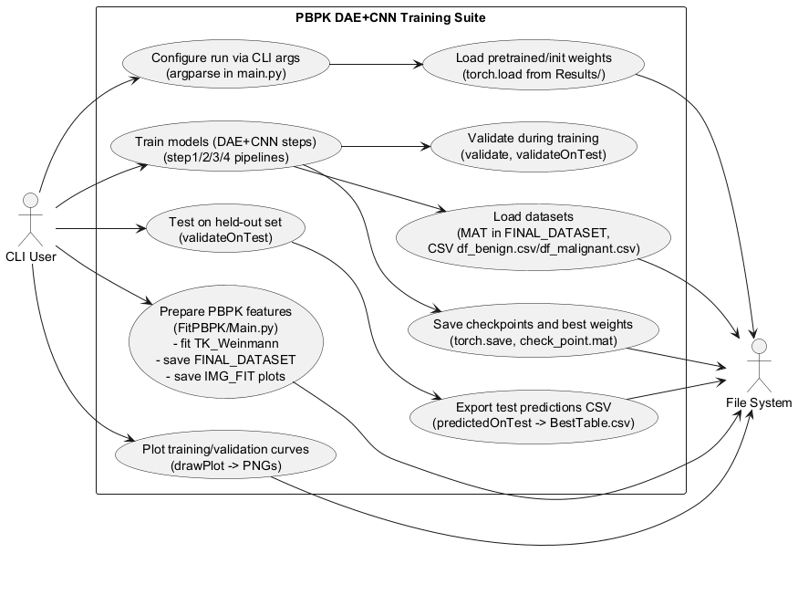
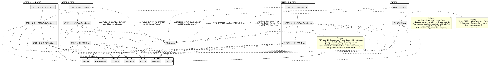
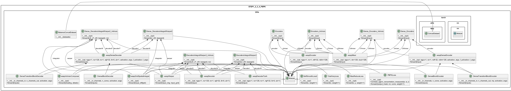
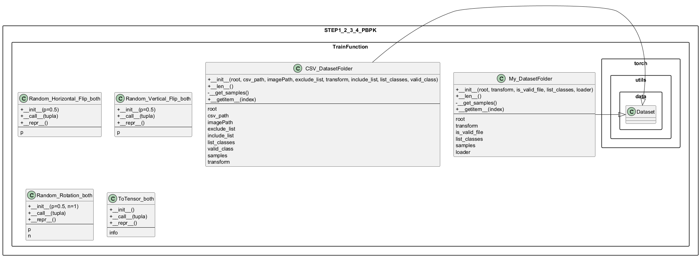
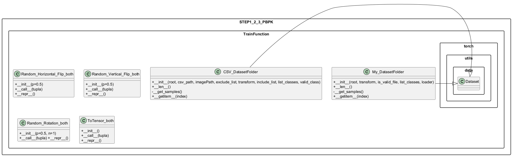
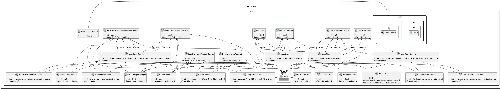
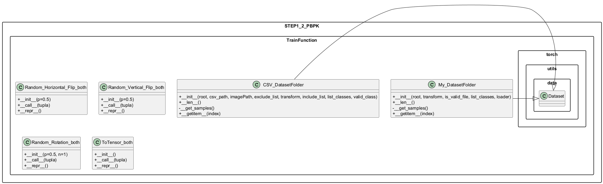
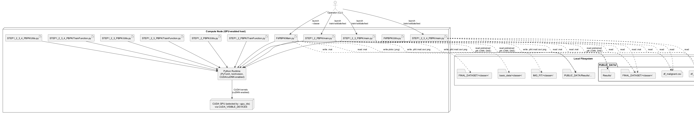

 

% 1 — System Overview
# Section 1 — System Overview

This section introduces the system’s purpose, scope, and main features as implemented in the repository. It summarizes what the software does end-to-end, the subsystems involved, how they interact, and the observable capabilities and constraints derived strictly from the source code.

## 1.1 Purpose

The repository implements an end-to-end pipeline for dynamic-contrast MRI lesion classification (benign vs malignant) that integrates pharmacokinetic modeling (PBPK/Tofts-like), intrinsic image decomposition with spatial warping (a learned DAE/decoder-encoder stack), and a CNN classifier. It comprises two primary stages: data preparation (pharmacokinetic fitting of median ROI curves per study) and training/evaluation of multiple model variants that progressively add training “steps” (1–2, 1–2–3, 1–2–3–4) combining real and synthetic (composed) data, PBPK-consistency losses, and standard reconstruction/regularization terms. The pipeline performs patient-level cross-validation split handling, logging, checkpointing, and test-time inference with per-case reporting.

## 1.2 Scope

The codebase covers:
- PBPK parameter fitting and derived curve generation per sample from .mat inputs containing image, mask, temporal metadata.
- Three training pipelines sharing a common model/loss backbone but differing in included steps and data augmentation strategy:
  - STEP1_2_PBPK: trains on real data using classification loss (Step 1) and DAE+PBPK-consistency loss on real data (Step 2).
  - STEP1_2_3_PBPK: adds Step 3, which composes synthetic lesions by mixing latent albedo/shading/warping codes from CSV-indexed triplets and trains the CNN jointly with the decoder.
  - STEP1_2_3_4_PBPK: further adds Step 4, which optimizes the decoder on synthetic samples with PBPK and regularization losses.
- Cross-validation splits, logging of losses/accuracies, best-model selection on validation loss, plotting of training vs validation curves, and generation of per-file test predictions with auxiliary loss diagnostics.

Out of scope are data acquisition and UI; the repository assumes availability of specific directory structures and precomputed/pretrained weights for warm starts.

## 1.3 High-level Architecture and Features

The system is organized into the following subsystems and entry points:

- Data fitting and preparation (FitPBPK):
  - FitPBPK/Main.py: CLI tool to traverse basic_data/<class>/, fit temporal concentration curves using a Tofts/Weinmann-based model on the median ROI signal, persist the fitted parameters and curves into FINAL_DATASET/<class>/, and export a plot per case.
  - FitPBPK/Utils.py: implementations of concentration computation from signal (Contrast_Agent_Concentration_misured), arterial input functions (Weinmann_AIF, Parker_AIF, and single-time variants), trapezoidal integrator, compartment models (TK/ETK with Weinmann/Parker), the fitter (fitting_mediano), and plotting (plot_curve). This module assumes 5 temporal samples per sequence (fixed array length 5).

- Training pipelines:
  - STEP1_2_PBPK/main.py: end-to-end training and validation for Steps 1 and 2 on real data only; handles fold-based patient splits, data loaders, optimizers, warm-start from pretrained CNN and DAE weights, checkpointing, and plots.
  - STEP1_2_3_PBPK/main.py: extends the above by loading additional CSV-indexed triplets to form synthetic, mixed latent samples, enabling Step 3; persists best models and test metrics.
  - STEP1_2_3_4_PBPK/main.py: further adds Step 4; validates per epoch, saves best, and evaluates on the test partition.

- Training and evaluation logic (per STEP variant):
  - TrainFunction.py in each STEP folder: defines
    - Data loaders:
      - loader_fc: .mat reader selecting three temporal channels [0,2,4] from x['image'] and mask x['mask']; expects x['tk_weiman'] present (populated by FitPBPK).
      - My_DatasetFolder and CSV_DatasetFolder with inclusion/exclusion filters by patient, and transforms ToTensor_both, Random_Horizontal_Flip_both, Random_Vertical_Flip_both, Random_Rotation_both applied consistently to tuples (images, masks).
      - BalanceConcatDataset to upsample minority class datasets.
    - Model construction: buildModel selects and adapts a pretrained torchvision model (alexnet, resnet34, vgg19, mobilenet_v2) for 2 classes.
    - Training steps:
      - Step 1 (step1_DAE_CNN_onReal): forward pass encoders/decoders on real images; feed warped-albedo to CNN; optimize CNN classification loss.
      - Step 2 (step2_DAE_onReal): on real images, optimize decoder/encoder with reconstruction (L1), total variation of warp (TotalVaryLoss), bias to zero warp (BiasReduceLoss), smoothness of shading (SelfSmoothLoss2), and PBPKLoss computed on masked outputs vs tk_weiman curves.
      - Step 3 (step3_Deconder_CNN_onFake): create synthetic samples by mixing encoder latents from CSV triplets (albedo/shading/warp); decode, classify warped-albedo; optimize CNN+decoder.
      - Step 4 (step4_Decoder_onFake): on synthetic samples, optimize decoder-only with TV, bias-reduce, shading-smoothness, and PBPKLoss.
    - Epoch orchestration:
      - train_iteration / validate / validateOnTest / train_loop_validation functions implement per-epoch loops, performance aggregation (computePerformance), model saving, and plotting (drawPlot).
    - Inference:
      - predictedOnTest: computes per-file probabilities and collects per-sample loss terms (reconstruction, TV, bias reduction, shading smoothness, PBPK) and total loss.

- Model, loss, and geometry utilities (Utils.py in each STEP folder):
  - Losses: PBPKLoss (computes measured concentration from masked outputs within ROI and regresses to tk_weiman or other selected params), BiasReduceLoss, TotalVaryLoss, SelfSmoothLoss2.
  - Encoders/Decoders and auxiliary layers:
    - waspEncoder/waspDenseEncoder; waspDecoder/waspDenseDecoder; waspDecoderTanh.
    - Mixer MLPs (waspMixer) to map shared latent to shading/texture/warp subspaces.
    - Encoders variants: Encoders, Encoders_Intrinsic, Dense_Encoders, Dense_Encoders_Intrinsic.
    - Decoders variants: DecodersIntegralWarper2, DecodersIntegralWarper2_Intrinsic, Dense_DecodersIntegralWarper2, Dense_DecodersIntegralWarper2_Intrinsic.
    - Intrinsic composer (waspIntrinsicComposer), grid warper (waspWarper), and learned differential grid integrator (waspGridSpatialIntegral) to build smooth warping fields via transposed 1D convolutions and integrate to a sampling grid; final grid is clamped to [-1, 1].
  - PBPK helpers: computation of concentration from signal, AIFs (Weinmann, Parker), trapezoidal integration, and TK/ETK models operating on 10 time samples (fixed array length 10 in STEP Utils; note this differs from the 5-sample assumption in FitPBPK).
  - Data helpers: BalanceConcatDataset and getBaseGrid to produce normalized base sampling grids of size 64×64, batched as needed.

Key features and behaviors visible in code include:
- Strict directory contract under PUBLIC_DATA/:
  - FINAL_DATASET/<class>/ holds .mat files with fields image, mask, tk_weiman (produced by FitPBPK).
  - df_benign.csv and df_malignant.csv define triplets for synthetic composition in STEP1_2_3[_4] pipelines.
  - Results/<...>/TRAIN_LOOP/FoldX/ contains checkpoints, logs, plots, and per-case BestTable.csv.
- Patient-wise cross-validation splits are hard-coded (CV_FOLD_test lists) and used to derive disjoint train/val/test sets by patient prefix extracted from filenames.
- GPU-centric execution: CUDA device selection via env vars; tensors and buffers moved to GPU; cudnn tuned deterministically or for speed depending on flags.
- Pretraining and warm-start are required/provided through:
  - CNN weights: Results/BASIC_PBPK_FINAL/Class_Task_<model>_WarpedPBPK/Fold<fold>/best_model_weights.pth
  - DAE weights: Results/DAE_noDense_PBPK_LOSS_data_Aug/pesi/<model>/wasp_model_epoch_{encoders|decoders}_{model}_dense.pth
- Uniform image normalization to [0,1], selection of three temporal channels [0,2,4] at load time for both real and synthetic branches.

## 1.4 Entry Points and Configuration

The repository exposes the following CLI entry points and arguments:
- FitPBPK/Main.py: --classe selects class subfolder (default: benign); processes basic_data/<classe>/ and writes outputs to FINAL_DATASET/<classe>/ plus plots to IMG_FIT/<classe>/.
- STEP1_2_PBPK/main.py, STEP1_2_3_PBPK/main.py, STEP1_2_3_4_PBPK/main.py: common args include
  - --batchSize, --epoch_iter, --lr, --modelLr, --decay, --beta1, --cuda, --gpu_ids, --numberOfClasses,
  - --Continue to resume from checkpoint,
  - --model to select parameter target for PBPKLoss (tk_w|tk_p|etk_w|etk_p; current loaders populate tk_w only),
  - --fold to pick cross-validation fold index,
  - --model_cnn to choose CNN backbone (alexnet|resnet|vgg|mobilenet).
All entry points fix the intrinsic image size to 64×64 with bilinear upsampling to 224×224 before CNN classification.

## 1.5 Data Model and Assumptions

Observations verifiable from code:
- .mat inputs must include at minimum: image (H×W×T), mask (H×W), and, after FitPBPK, tk_weiman (1×T or equivalent shaped array). Some utilities assume 5 time points (FitPBPK), while STEP Utils assume 10; training pipelines consistently load only channels [0,2,4].
- ROI-aggregated intensity is used to derive contrast agent concentration via fixed T1 and r1 constants (FitPBPK/STEP1_2_3 use T1=5.3, r1=2.6; STEP1_2_3_4 uses T1=0.820, r1=4.5 inside Utils), then matched with pharmacokinetic curves through PBPKLoss.
- File naming encodes patient and lesion as underscore-separated tokens; patient ID is the first token and drives fold split logic.

## 1.6 Outputs

The system produces:
- Augmented .mat files with fitted parameters and curves (FitPBPK).
- Training artifacts per fold and pipeline:
  - Weights: cnn_weights.pth, encoders_weights.pth, decoders_weights.pth and their best_* counterparts.
  - Logs: AccTrainClassificationREAL.txt, lossTrainClassificationREAL.txt, DAE_*_real(_val).txt and corresponding FAKE logs when applicable.
  - Plots: ACC_Train_val.png, Loss_Train_val.png, PBPK_Train_val.png, Recon_Train_val.png.
  - Test predictions: BestTable.csv with filename, patient, lesion, ROI size, class probabilities, predicted/true label, and per-sample loss terms.

## 1.7 Constraints and Limitations

From the implementation:
- Strong dependency on expected directory structure, file naming, .mat content, and availability of pretrained weights under PUBLIC_DATA/Results/... paths.
- CUDA is effectively required; the code assumes GPU tensors and uses F.grid_sample with align_corners=True.
- Temporal handling is simplified at load time by subsampling three channels; the PBPK helper functions embed fixed-length arrays (5 or 10), which must align with how tk_weiman is produced by FitPBPK for consistency.
- Only tk_weiman parameters are populated throughout loaders; other model targets (tk_p, etk_w, etk_p) are placeholders and will not be functional without extending FitPBPK and loaders accordingly.

## 1.8 Stakeholders and Intended Users

The codebase is tailored to:
- ML engineers and researchers working on DCE-MRI lesion analysis who need a reproducible training/evaluation pipeline integrating biophysical priors (PBPK) with learned image models.
- System integrators who need to orchestrate data preparation, cross-validated training, weight management, and reporting within a controlled directory-based workflow.

% 2 — Architectural Context
## 2. Architectural Context

This repository contains two kinds of pipelines visible in code: a PBPK fitting utility that enriches per-case DCE-MRI .mat files with pharmacokinetic parameters, and several training pipelines that jointly learn intrinsic image decompositions and warping (DAE) together with a CNN classifier on those enriched datasets. The system operates entirely via command-line scripts, processes files on the local filesystem, relies on CUDA-enabled GPUs, and uses third-party scientific Python frameworks (PyTorch, TorchVision, SciPy, NumPy, Pandas, Matplotlib). Interfaces and data formats are file-based: .mat structures with specific keys for images, masks, time-curves and fitted parameters, and CSV files defining augmentation triplets.

### External Systems

- CUDA and cuDNN via PyTorch (torch.backends.cudnn and CUDA_VISIBLE_DEVICES environment variable are used to select and configure GPUs).
- PyTorch and TorchVision model zoo (torchvision.models with pretrained=True for alexnet, resnet34, vgg19, mobilenet_v2; weights may be downloaded if not cached).
- Operating system filesystem (POSIX-like paths, directory creation via os.makedirs, environment variables).
- Scientific Python libraries: NumPy, SciPy (scipy.io.loadmat/savemat; optimization; stats), Pandas (CSV I/O), Matplotlib (plotting to PNG).

### APIs / Interfaces

- Command-line interfaces (argparse) per entrypoint:
  - FitPBPK/Main.py:
    - --classe (default: benign) selects class subfolder under basic_data/, FINAL_DATASET/, IMG_FIT/.
  - STEP1_2_PBPK/main.py, STEP1_2_3_PBPK/main.py, STEP1_2_3_4_PBPK/main.py:
    - --batchSize, --niter, --lr, --modelLr, --beta1, --cuda, --ngpu, --gpu_ids, --epoch_iter, --decay, --numberOfClasses, -f (dummy for notebooks), --Continue, --model (tk_w|tk_p|etk_w|etk_p; tk_w used in code), --fold, --model_cnn (alexnet|resnet|vgg|mobilenet).
- Filesystem contracts and directory layout:
  - Input for fitting: basic_data/<classe>/ contains .mat files with required keys (see below).
  - Fitting outputs: FINAL_DATASET/<classe>/ stores enriched .mat; IMG_FIT/<classe>/ stores per-case PNG plots.
  - Training inputs: PUBLIC_DATA/FINAL_DATASET/{benign,malignant}/ contains .mat files consumed by loaders.
  - Training CSVs for augmentation: PUBLIC_DATA/df_benign.csv and PUBLIC_DATA/df_malignant.csv.
  - Pretrained initialization paths read at startup when --Continue is false:
    - CNN: PUBLIC_DATA/Results/BASIC_PBPK_FINAL/Class_Task_<model_cnn>_WarpedPBPK/Fold<fold>/best_model_weights.pth.
    - DAE encoders/decoders: PUBLIC_DATA/Results/DAE_noDense_PBPK_LOSS_data_Aug/pesi/<model>/wasp_model_epoch_encoders_<model>_dense.pth and ...decoders_...
  - Training outputs:
    - Weights per epoch: cnn_weights.pth, encoders_weights.pth, decoders_weights.pth.
    - Best weights: best_cnn_weights.pth, best_encoders_weights.pth, best_decoders_weights.pth.
    - Checkpoint: check_point.mat (best_acc, best_acc_m, best_loss, best_epoca, last_epoch).
    - Metrics logs: text files (e.g., AccTrainClassificationREAL.txt, DAE_Pbpk_real.txt).
    - Plots: PNG figures from drawPlot(...) into the results folder.
    - Test predictions table: BestTable.csv.
- File formats and schemas visible in code:
  - .mat input for fitting (FitPBPK/Utils.fitting_mediano):
    - Required keys: image (3D/4D with temporal dimension), mask, cordZ, timeInterval_seconds_cumulative.
  - .mat output after fitting (added keys):
    - tk_weiman_param (list of [ktrans, ve]), tk_weiman (fitted curve), ct_misured_list (measured curve), normalized_timeline (minutes).
  - .mat required by training loaders (TrainFunction.loader_fc in all STEP*):
    - image (normalized and time-subsampled channels [0,2,4] used as 3 channels), mask, tk_weiman (time curve; subsampled [0,2,4] for tk_w).
  - CSV required columns (used by CSV_DatasetFolder in all STEP*):
    - patient_albedo_slice, patient_shading_slice, patient_warping_slice.
    - Patient ID is parsed as the substring before the first underscore to include/exclude folds.
- Data loading interfaces:
  - My_DatasetFolder.__getitem__ returns: img, roi, tk_w, tk_p, etk_w, etk_p, path, classe (tk_p, etk_w, etk_p are placeholders set to 0 in current code).
  - CSV_DatasetFolder.__getitem__ returns: alb_image, sha_image, warp_image, mask_roi, tk_w, tk_p, etk_w, etk_p, target; images are normalized and transformed.
- Model selection interface:
  - buildModel(net_name, numberOfClasses) supports alexnet/resnet34/vgg19/mobilenet_v2; classifier heads are replaced to match numberOfClasses.
- Loss and PBPK interface:
  - PBPKLoss(output_mask, roi, curve, weight=1) computes measured contrast agent concentration from ROI-masked outputs and matches it to provided tk_w (or tk_p/etk_* if selected).
- GPU selection and execution interface:
  - CUDA device set via env vars CUDA_DEVICE_ORDER=PCI_BUS_ID and CUDA_VISIBLE_DEVICES, plus opt.gpu_ids; tensors moved to GPU via helper setCuda and guarded by opt.cuda.

### Data Sources

- DCE-MRI .mat cases for fitting: basic_data/<classe>/.
- Enriched training .mat dataset: PUBLIC_DATA/FINAL_DATASET/{benign,malignant}/ with keys image, mask, tk_weiman.
- CSV augmentation sources: PUBLIC_DATA/df_benign.csv and PUBLIC_DATA/df_malignant.csv with triplets (albedo, shading, warping) filenames.
- Initialization weights:
  - CNN backbone: PUBLIC_DATA/Results/BASIC_PBPK_FINAL/Class_Task_<model_cnn>_WarpedPBPK/Fold<fold>/best_model_weights.pth.
  - DAE encoders/decoders: PUBLIC_DATA/Results/DAE_noDense_PBPK_LOSS_data_Aug/pesi/<model>/wasp_model_epoch_{encoders|decoders}_<model>_dense.pth.
- TorchVision pretrained weights cache/model hub for alexnet, resnet34, vgg19, mobilenet_v2 when pretrained=True is used.

### Users / Actors

- Command-line invoker operating the scripts (argparse-driven) to run fitting and training/testing workflows.
- Jupyter Notebook environment as an alternative invoker (indicated by the presence of a dummy -f argument used to satisfy notebook kernels).

% 2.1 — Architectural Context – Use Case Diagram
# SECTION 2.1 — Architectural Context – Use Case Diagram

This section presents the external interactions with the PBPK DAE+CNN Training Suite as implemented in the repository. The diagram focuses on observable behaviors triggered by a command-line user and the system’s interactions with the file system. Each use case maps directly to concrete scripts and functions present in the codebase: FitPBPK/Main.py for PBPK feature preparation and plotting; STEP1_2_PBPK, STEP1_2_3_PBPK, and STEP1_2_3_4_PBPK main scripts and their TrainFunction/Utils modules for configuration, loading data, training, validation, testing, exporting predictions, saving/loading weights, and plotting metrics.

Figure 2.1 captures these interactions without introducing fictitious elements.

Figure 2.1 — Architectural Context – Use Case Diagram (UseCase-Section-2-1.png)

% 3 — Containers
## 3. Containers

This section identifies the executable applications and data stores that make up the runtime architecture of the system. It describes their responsibilities, the principal technologies used, and how they communicate. All interactions in this codebase occur locally via the filesystem; there are no networked services or databases.

| Container | Responsibility | Technology | Communication |
|---|---|---|---|
| FitPBPK CLI (FitPBPK/Main.py) | Processes per-patient dynamic contrast-enhanced MRI signals; computes TK Weinmann parameters by non-linear fitting on median ROI signal; writes enriched .mat files containing fitted curves and parameters; saves diagnostic plots. | Python 3; NumPy; SciPy (io, optimize, stats, integrate); Matplotlib; argparse; OS. | Reads .mat from basic_data/<class>/; writes .mat to FINAL_DATASET/<class>/ and .png plots to IMG_FIT/<class>/ via filesystem I/O. |
| DAE+CNN Training CLI — Steps 1–2 (STEP1_2_PBPK/main.py) | Trains intrinsic-DAE encoders/decoders (reconstruction, warp regularization, PBPK loss) and a CNN classifier on real images; performs validation and test; saves best/baseline weights and training curves; exports per-sample predictions. | Python 3; PyTorch (torch, torchvision, DataLoader); CUDA/cuDNN; NumPy; SciPy (io); pandas; Matplotlib; argparse; OS. | Reads training data from PUBLIC_DATA/FINAL_DATASET/; CSVs from PUBLIC_DATA/df_benign.csv and df_malignant.csv; loads initial weights from PUBLIC_DATA/Results/...; writes results, plots, and weights to PUBLIC_DATA/Results/STEP_PBPK_FINAL_Version/DAE_CNN_STEP1_2_<net>/... via filesystem I/O. |
| DAE+CNN Training CLI — Steps 1–2–3 (STEP1_2_3_PBPK/main.py) | Extends training with synthetic “fake” compositions (step 3) combining encoded albedo/shading/warping; optimizes CNN jointly with decoders on fake data; validates, tests, and logs metrics; saves artifacts. | Python 3; PyTorch (torch, torchvision, F.grid_sample); CUDA/cuDNN; NumPy; SciPy (io); pandas; Matplotlib; argparse; OS. | Same I/O patterns as Steps 1–2: reads PUBLIC_DATA/FINAL_DATASET/ and CSVs; loads initial weights from PUBLIC_DATA/Results/...; writes to PUBLIC_DATA/Results/STEP_PBPK_FINAL_Version/DAE_CNN_STEP1_2_3_<net>/... via filesystem I/O. |
| DAE+CNN Training CLI — Steps 1–2–3–4 (STEP1_2_3_4_PBPK/main.py) | Full training loop: steps 1–2 on real data, step 3 CNN+decoder on fake compositions, and step 4 decoder-only optimization on fake data with PBPK/regularization losses; performs validation, test, plotting, and export of predictions. | Python 3; PyTorch (torch, torchvision, custom losses and modules); CUDA/cuDNN; NumPy; SciPy (io); pandas; Matplotlib; argparse; OS. | Reads PUBLIC_DATA/FINAL_DATASET/ and CSVs; loads pretrained DAE/CNN weights from PUBLIC_DATA/Results/...; writes training logs, best weights, plots, and prediction tables to PUBLIC_DATA/Results/STEP_PBPK_FINAL_Version/DAE_CNN_STEP1_2_3_4_<net>/... via filesystem I/O. |
| Local basic dataset store (basic_data/<class>/) | Holds raw per-patient .mat files consumed by FitPBPK for pharmacokinetic fitting. | Filesystem; MATLAB .mat files accessed via SciPy. | Filesystem I/O by FitPBPK CLI. |
| Prepared dataset store — FitPBPK output (FINAL_DATASET/<class>/) | Stores enriched .mat files with normalized timelines, measured curves, and tk_weiman parameters produced by FitPBPK. | Filesystem; MATLAB .mat via SciPy. | Written by FitPBPK; can be copied/used by downstream pipelines via filesystem I/O. |
| Prepared dataset store — Training input (PUBLIC_DATA/FINAL_DATASET/<class>/) | Canonical source for training/validation/test .mat files; includes image, mask, and tk_weiman curves used by loaders. | Filesystem; MATLAB .mat via SciPy. | Read by all training CLIs via filesystem I/O. |
| CSV metadata store (PUBLIC_DATA/df_benign.csv, df_malignant.csv) | Lists synthetic composition triplets (albedo, shading, warping slices) and labels for data augmentation and validation on “fake” data. | Filesystem; CSV parsed with pandas. | Read by training CLIs’ CSV_DatasetFolder via filesystem I/O. |
| Model artifacts and weights store (PUBLIC_DATA/Results/...) | Persists pretrained initial weights (DAE, baseline CNN) and produces training outputs: epoch checkpoints, best weights (.pth), plots (.png), logs (.txt), checkpoints (.mat), and prediction tables (.csv). | Filesystem; PyTorch .pth; SciPy .mat; PNG; TXT; CSV. | Read and written by training CLIs via filesystem I/O. |

Introduction and validation notes: the four CLI containers correspond one-to-one with the main.py entrypoints present in FitPBPK and the three STEP_x directories. All data exchanges between containers are through explicit paths visible in the code (e.g., basic_data, FINAL_DATASET, PUBLIC_DATA/FINAL_DATASET, PUBLIC_DATA/Results). There are no network calls, databases, or IPC; GPU is leveraged in-process through PyTorch CUDA APIs.

% 3.1 — Architecture Overview – Component Diagram
# Section 3.1 — Architecture Overview – Component Diagram

This section presents a complete component view of the repository, showing all entry points, training pipelines, and utilities as implemented in the source code. The diagram reflects the three training variants (STEP1_2, STEP1_2_3, STEP1_2_3_4), the PBPK fitting pre-processing pipeline (FitPBPK), and their interactions with external libraries and the file system. It is intended to help both developers and integrators understand module boundaries, code-level dependencies, and runtime data flows.

Figure 3.1 — Component Diagram (PlantUML: Fig-3.1-Component-Diagram.puml)

Table 3.1 — Components and Responsibilities

| Component | Responsibility |
|---|---|
| FitPBPK/Main.py | Entry point for PBPK fitting pre-processing. Reads basic_data/<class>/*.mat, invokes fitting_mediano, writes enriched .mat to FINAL_DATASET/<class>/ and diagnostic plots to IMG_FIT/<class>/. |
| FitPBPK/Utils.py | Implements PK functions (Weinmann/Parker AIFs, TK/ETK models), contrast conversion, trapezoidal integration, fitting_mediano using scipy.optimize.curve_fit, and plot_curve. |
| STEP1_2_PBPK/main.py | Orchestrates STEP 1–2 training. Builds datasets, models, losses, optimizers; loads initial weights; executes train_loop_validation; persists checkpoints and best weights; runs predictedOnTest; produces plots. |
| STEP1_2_PBPK/TrainFunction.py | Implements dataset loaders (My_DatasetFolder, CSV_DatasetFolder), training steps step1/step2, validation/test loops, metrics, plotting utilities, torchvision model factory, and data transforms. |
| STEP1_2_PBPK/Utils.py | Defines losses (PBPKLoss, BiasReduceLoss, TotalVaryLoss, SelfSmoothLoss2), neural components (Encoders_Intrinsic, DecodersIntegralWarper2_Intrinsic, Dense variants, wasp* blocks), CUDA and grid helpers, and PK utilities used by losses. |
| STEP1_2_3_PBPK/main.py | Orchestrates STEP 1–3 training and evaluation. Extends STEP1_2 by incorporating CSV-based synthetic data augmentation; saves checkpoints, best weights, and evaluation artifacts. |
| STEP1_2_3_PBPK/TrainFunction.py | Implements full 4-step-capable training utilities but used for STEP 1–3 in this entry point. Includes dataset classes, all step functions step1..step4, validation/test, metrics, plotting, and transforms. |
| STEP1_2_3_PBPK/Utils.py | Same functional scope as STEP1_2_PBPK/Utils.py with minor numeric differences (e.g., AIF vector lengths); provides the same losses and model components. |
| STEP1_2_3_4_PBPK/main.py | Orchestrates STEP 1–4 training. Adds decoder fine-tuning on synthetic data with PBPK loss (step4). Manages CV folds, datasets, DAE and CNN optimizers, validation gating, and test inference. |
| STEP1_2_3_4_PBPK/TrainFunction.py | Full training pipeline with steps step1..step4, including deconstructions, warping, PBPK-guided optimization, validation/test, predictions table export, and figure generation. |
| STEP1_2_3_4_PBPK/Utils.py | Same scope as other Utils in STEP*; houses losses, encoders/decoders (intrinsic and dense), warper, mixers, grid integrator, CUDA helpers, and PK utilities. |
| File System | Persistent storage of datasets (PUBLIC_DATA/FINAL_DATASET), CSVs (df_benign.csv, df_malignant.csv), pretrained weights, intermediate checkpoints, and results/plots. |
| PyTorch, Torchvision, NumPy, SciPy, Pandas, Matplotlib, CUDA/cuDNN | External dependencies used across training and fitting: tensor ops, CNN backbones, numerics, optimization, data IO, plotting, and GPU acceleration. |

Rationale and validation

The diagram and table are derived directly from file-level imports and runtime behaviors in the provided code. Each main entry point (FitPBPK/Main.py, STEP*/main.py) depends on its TrainFunction and/or Utils modules exactly as coded. Data flows through the file system as indicated by hard-coded paths in the code. The listed internal constructs are the classes and functions actually defined in their respective modules, and the external libraries reflect the explicit imports and usage patterns. This section can be validated by inspecting imports and function calls in each file and by verifying the presence of file-system reads and writes during execution.

% 4 — Components
## 4. Components

This section enumerates the internal components implemented in the repository, grouped by container (directory). For each component, the responsibility and its interactions with other code elements are described. Interactions focus on concrete function calls, class usage, and module dependencies as observed in the code. This section does not include diagrams.

### 4.1 FitPBPK

The FitPBPK container implements PBPK-curve fitting over median ROI dynamics and plotting utilities.

Table: FitPBPK Components

| Component | Responsibility | Interactions |
|---|---|---|
| Main (FitPBPK/Main.py) | Command-line entrypoint for fitting and plotting per patient file. Creates output folders, iterates input MAT files, invokes model fitting and curve plotting. | [argparse, os, os.listdir, os.makedirs, Utils.fitting_mediano, Utils.plot_curve] |
| Contrast_Agent_Concentration_misured | Convert signal intensity time series to contrast agent concentration using fixed T1, r1; computes relative enhancement and scales. | [numpy] |
| Weinmann_AIF | Compute arterial input function (AIF) per Weinmann model over provided time grid. | [math, numpy] |
| Parker_AIF | Compute AIF per Parker model using Gaussian PDFs and logistic tail term. | [scipy.stats.norm, math, numpy] |
| Weinmann_AIF_single | Weinmann AIF evaluated at a single time. | [math] |
| Parker_AIF_single | Parker AIF evaluated at a single time. | [scipy.stats.norm, math] |
| integral_trap | Trapezoidal numerical integration utility for non-uniform time steps. | [numpy] |
| TK_model_Weinmann_integral_trap | Two-compartment TK model using Weinmann AIF and trapezoidal integral; returns tissue concentration curve. | [Weinmann_AIF, integral_trap, numpy] |
| ETK_model_Weinmann_integral_trap | Extended TK model (adds plasma volume vp) using Weinmann AIF. | [Weinmann_AIF, integral_trap, numpy] |
| TK_model_Parker_integral_trap | Two-compartment TK model using Parker AIF. | [Parker_AIF, integral_trap, numpy] |
| ETK_model_Parker_integral_trap | Extended TK model using Parker AIF. | [Parker_AIF, integral_trap, numpy] |
| fitting_mediano | Load patient MAT, normalize image, extract ROI median curve, convert to concentration, fit TK-Weinmann parameters via non-linear least squares, save augmented MAT. | [scipy.io.loadmat, scipy.optimize.curve_fit, numpy, Contrast_Agent_Concentration_misured, TK_model_Weinmann_integral_trap, scipy.io.savemat] |
| plot_curve | Plot measured vs fitted concentration curves and save PNG. | [matplotlib.pyplot, TK_model_Weinmann_integral_trap] |

### 4.2 STEP1_2_3_4_PBPK

This container implements the full 4-step training pipeline: (1) supervised classification on real warped-albedo outputs, (2) DAE optimization with PBPK and regularization losses on real data, (3) decoder + CNN training on synthetic combinations from CSV triplets, and (4) decoder optimization on synthetic samples with PBPK/regularization losses.

Table: STEP1_2_3_4_PBPK Components

| Component | Responsibility | Interactions |
|---|---|---|
| main (STEP1_2_3_4_PBPK/main.py) | End-to-end experiment orchestration: argument parsing, seeding, data partitioning (patient folds), dataset construction, transforms, model/loss/optimizer initialization, warm-start from pre-trained DAE/CNN weights, training loop with validation and test evaluation, checkpointing, and result plotting. | [argparse, os, numpy, torch, torchvision.transforms, Utils.BalanceConcatDataset, TrainFunction.My_DatasetFolder, TrainFunction.CSV_DatasetFolder, TrainFunction.buildModel, Utils.{Encoders_Intrinsic,Dense_Encoders_Intrinsic,DecodersIntegralWarper2_Intrinsic,Dense_DecodersIntegralWarper2_Intrinsic}, torch.optim.Adam, torch.load/torch.save, scipy.io.savemat, TrainFunction.train_loop_validation, TrainFunction.predictedOnTest, TrainFunction.drawPlot] |
| loader_fc | Load a MAT sample: extract 3-channel image (channels 0,2,4), normalize [0,1], get ROI mask, TK-Weinmann fitted curve subset, and return tuple for datasets. | [scipy.io.loadmat, numpy] |
| My_DatasetFolder | Dataset over filesystem hierarchy for real samples; filters by predicate, applies transform, yields (img, roi, TK/ETK params, path, class). | [os.listdir, loader_fc, torch.utils.data.Dataset] |
| CSV_DatasetFolder | Dataset over CSV triplets (albedo, shading, warping) for synthetic mixing; filters by include/exclude lists; loads/normalizes images, applies transform, returns tensors with target class. | [pandas.read_csv, scipy.io.loadmat, numpy, transforms pipeline] |
| rangeNormalization | Min-max normalization to specified range with asserts. | [numpy] |
| count_parameters | Count trainable parameters of a model. | [torch.nn.Module] |
| imshow_grid | Utility to display a grid of images with mpl ImageGrid. | [matplotlib.pyplot, mpl_toolkits.axes_grid1.ImageGrid] |
| buildModel | Construct and configure torchvision backbone (alexnet, resnet34, vgg19, mobilenet_v2) with final classifier sized to numberOfClasses. | [torchvision.models, torch.nn.Linear] |
| step1_DAE_CNN_onReal | Forward encoders/decoders on real batch to produce warpedAlbedo; classify with CNN; compute CrossEntropy; backprop only CNN/optimizer_conv step. | [Utils.{Encoders_Intrinsic,DecodersIntegralWarper2_Intrinsic}, torch.nn.functional.interpolate, torch.max, criterionCNN, optimizer_conv] |
| step2_DAE_onReal | Forward encoders/decoders on real batch; compute reconstruction (L1), warp TV, bias reduce, intrinsic smoothness, and PBPK losses; backprop and update encoders/decoders. | [criterionRecon, Utils.TotalVaryLoss, Utils.BiasReduceLoss, Utils.SelfSmoothLoss2, Utils.PBPKLoss, updator_encoders, updator_decoders] |
| step3_Deconder_CNN_onFake | Encode albedo/shading/warp separate images, decode to compose/warp synthetic sample; classify with CNN; backprop via criterionCNN on CNN+decoders using optimizer_conv_decoders. | [encoders, decoders, torch.nn.functional.interpolate, criterionCNN, optimizer_conv_decoders] |
| step4_Decoder_onFake | Optimize decoder on synthetic samples with TV, bias, smoothness, PBPK losses; update decoders only. | [criterionTVWarp, criterionBiasReduce, criterionSmoothL2, criterionPBPK, updator_decoders] |
| step1_DAE_CNN_onReal_val | Validation version of step1; forward-only to accumulate classification and DAE-related loss metrics without updates. | [encoders, decoders, criterionCNN, criterionRecon, criterionTVWarp, criterionBiasReduce, criterionSmoothL2, criterionPBPK] |
| step3_Deconder_CNN_onFake_val | Validation version of step3; compute classification loss/metrics and DAE regularizers for logging. | [encoders, decoders, criterionCNN, criterionTVWarp, criterionBiasReduce, criterionSmoothL2, criterionPBPK] |
| computePerformance | Aggregate loss/accuracy and class-wise accuracies from accumulated predictions and labels. | [numpy] |
| train_iteration | One training epoch over real and synthetic loaders; invokes steps 1–4 in sequence per design; logs metrics and checkpoints intermediate weights. | [DataLoader, step1_DAE_CNN_onReal, step2_DAE_onReal, step3_Deconder_CNN_onFake, step4_Decoder_onFake, torch.save, time] |
| validate | Run validation across real and CSV-derived datasets; compute and persist per-epoch metrics. | [DataLoader, step1_DAE_CNN_onReal_val, step3_Deconder_CNN_onFake_val, computePerformance, file I/O] |
| validateOnTest | Evaluate on test partition; prints aggregated metrics. | [DataLoader, step1_DAE_CNN_onReal_val, computePerformance] |
| train_loop_validation | High-level training loop across epochs; switches train/eval modes; triggers validate, maintains best checkpoints, calls validateOnTest for best. | [train_iteration, validate, validateOnTest, torch.save, scipy.io.savemat] |
| predictedOnTest | Per-file inference loop for test set; runs full encoder/decoder/CNN forward, computes all losses, and returns a Pandas table with predictions and loss breakdown. | [loader_fc, encoders, decoders, buildModel-output CNN, torch.nn.Softmax, criterionRecon, criterionTVWarp, criterionBiasReduce, criterionSmoothL2, criterionPBPK, pandas.DataFrame] |
| save_images | Persist sample reconstructed and warped-albedo images for visual inspection. | [matplotlib.pyplot, os.path] |
| Random_Horizontal_Flip_both | Tensor flip transform for all tuple elements horizontally, stochastic by p. | [torch.flip] |
| Random_Vertical_Flip_both | Tensor flip transform for all tuple elements vertically, stochastic by p. | [torch.flip] |
| Random_Rotation_both | Tensor rotation transform for all tuple elements by k×90°, stochastic by p. | [torch.rot90] |
| ToTensor_both | Convert all tuple elements to tensors using torchvision ToTensor. | [torchvision.transforms.ToTensor] |
| drawPlot | Plot training vs validation curves for accuracy and losses. | [plot_figure] |
| plot_figure | Read metric files, generate and save matplotlib plots. | [matplotlib.pyplot, file I/O] |
| PBPKLoss | Loss computing PBPK-consistent contrast concentration from masked outputs vs fitted curve; uses internal contrast_agent_concentration_measured. | [torch.nn.MSELoss, torch.divide, Variable, ROI reduction] |
| BiasReduceLoss | Penalize average warp bias vs zero field. | [torch.nn.MSELoss, torch.mean] |
| TotalVaryLoss | Total variation regularization over warp field. | [torch.abs, torch.sum] |
| SelfSmoothLoss2 | L2 smoothness on shading/intrinsic maps using finite differences. | [torch operations] |
| waspMixer | Fully-connected sigmoid mixer mapping latent vectors to target-dimensional codes. | [nn.Linear, nn.Sigmoid] |
| waspIntrinsicComposer | Compose intrinsic shading and albedo into RGB image. | [torch.mul, tensor repeat] |
| waspWarper | Spatial transformer using grid_sample to warp images by predicted displacement grids. | [torch.nn.functional.grid_sample] |
| waspGridSpatialIntegral | Integrate differential warping fields into displacement grids via transposed convolutions; normalize to image size. | [F.conv_transpose2d, torch.cat] |
| waspEncoder | CNN encoder producing latent z vector. | [nn.Conv2d stack, nn.BatchNorm2d, nn.LeakyReLU, nn.Sigmoid] |
| waspDecoder | CNN decoder producing images from latent codes with Hardtanh bounds. | [nn.ConvTranspose2d stack, nn.BatchNorm2d, nn.ReLU, nn.Hardtanh] |
| waspDecoderTanh | CNN decoder variant with Tanh/Sigmoid activations suited for bounded fields. | [nn.Tanh, nn.Sigmoid] |
| Encoders | Encoder with mixers for image and warp latents (non-intrinsic). | [waspEncoder, waspMixer] |
| Encoders_Intrinsic | Encoder splitting latents into shading (zS), texture (zT), and warp (zW). | [waspEncoder, waspMixer] |
| Dense_Encoders | DenseNet-style encoder (non-intrinsic) with mixers. | [waspDenseEncoder, waspMixer] |
| Dense_Encoders_Intrinsic | DenseNet-style intrinsic encoder producing zS, zT, zW. | [waspDenseEncoder, waspMixer] |
| DecodersIntegralWarper2 | Decoder for texture and warp fields, integrates warp and warps texture; returns outputs including residual warp relative to base grid. | [waspDecoder, waspDecoderTanh, waspGridSpatialIntegral, waspWarper, nn.Hardtanh] |
| DecodersIntegralWarper2_Intrinsic | Intrinsic decoder reconstructing shading/texture, composing full image, integrating and applying warps, generating masked outputs and warped albedo; also warps ROI to produce fake ROI. | [waspDecoder, waspDecoderTanh, waspIntrinsicComposer, waspGridSpatialIntegral, waspWarper] |
| Dense_DecodersIntegralWarper2 | Dense decoder variant for non-intrinsic pipeline. | [waspDenseDecoder, waspGridSpatialIntegral, waspWarper] |
| Dense_DecodersIntegralWarper2_Intrinsic | Dense decoder variant for intrinsic pipeline. | [waspDenseDecoder, waspIntrinsicComposer, waspGridSpatialIntegral, waspWarper] |
| DenseBlockEncoder | Dense block with N conv layers aggregating previous outputs (encoder side). | [nn.Conv2d, nn.BatchNorm2d, activations] |
| DenseBlockDecoder | Dense block with N transposed conv layers aggregating previous outputs (decoder side). | [nn.ConvTranspose2d, nn.BatchNorm2d] |
| DenseTransitionBlockEncoder | Transition block applying 1×1 conv and max-pooling. | [nn.Conv2d, nn.MaxPool2d] |
| DenseTransitionBlockDecoder | Transition block applying transposed conv upsampling. | [nn.ConvTranspose2d] |
| waspDenseEncoder | Full DenseNet-like encoder funneling to latent dimension with final Sigmoid. | [DenseBlockEncoder, DenseTransition blocks] |
| waspDenseDecoder | Full DenseNet-like decoder from latent to target channels with configurable final activation. | [DenseBlockDecoder, DenseTransition blocks, final activation] |
| Contrast_Agent_Concentration_misured (Utils) | Compute contrast agent concentration (note: T1=0.820, r1=4.5 in this container). | [numpy] |
| Weinmann_AIF (Utils) | Weinmann AIF over 10 samples. | [math, numpy] |
| Parker_AIF (Utils) | Parker AIF over 10 samples. | [scipy.stats.norm, math, numpy] |
| Weinmann_AIF_single (Utils) | Scalar Weinmann AIF. | [math] |
| Parker_AIF_single (Utils) | Scalar Parker AIF. | [scipy.stats.norm, math] |
| integral_trap (Utils) | Trapezoidal integration helper. | [numpy] |
| TK_model_Weinmann_integral_trap (Utils) | TK model with Weinmann AIF (10-length). | [Weinmann_AIF, integral_trap, numpy] |
| ETK_model_Weinmann_integral_trap (Utils) | ETK model with Weinmann AIF (10-length). | [Weinmann_AIF, integral_trap, numpy] |
| TK_model_Parker_integral_trap (Utils) | TK model with Parker AIF (10-length). | [Parker_AIF, integral_trap, numpy] |
| ETK_model_Parker_integral_trap (Utils) | ETK model with Parker AIF (10-length). | [Parker_AIF, integral_trap, numpy] |
| setCuda | Convenience to move tensors to CUDA. | [torch.Tensor.cuda] |
| setAsVariable | Wrap tensors as autograd Variables. | [torch.autograd.Variable] |
| BalanceConcatDataset | Oversample constituent datasets to balance lengths, then concatenate. | [torch.utils.data.ConcatDataset, random.sample] |
| getBaseGrid | Generate normalized base 2D grid ([-1,1] range) optionally batched. | [torch.arange, tensor ops] |

### 4.3 STEP1_2_3_PBPK

This container implements a 3-step training pipeline (real: steps 1–2; synthetic: steps 3–4) with the same architectural building blocks. Differences vs the 4-step variant include minor training details and logging.

Table: STEP1_2_3_PBPK Components

| Component | Responsibility | Interactions |
|---|---|---|
| main (STEP1_2_3_PBPK/main.py) | Experiment orchestration similar to 4-step variant; sets data splits, builds datasets/transforms, initializes models, loads pre-trained weights, runs training with validation and test, saves best checkpoints and plots. | [argparse, os, numpy, torch, torchvision.transforms, Utils.BalanceConcatDataset, TrainFunction.My_DatasetFolder, TrainFunction.CSV_DatasetFolder, TrainFunction.buildModel, Utils.{Encoders_Intrinsic,Dense_Encoders_Intrinsic,DecodersIntegralWarper2_Intrinsic,Dense_DecodersIntegralWarper2_Intrinsic}, TrainFunction.train_loop_validation, TrainFunction.predictedOnTest, TrainFunction.drawPlot] |
| loader_fc | Load MAT image/mask and TK-Weinmann vector; normalize 3 channels and return tuple. | [scipy.io.loadmat, numpy] |
| My_DatasetFolder | Real dataset wrapper with filtering and transform application. | [os.listdir, loader_fc] |
| CSV_DatasetFolder | CSV-driven synthetic dataset; loads albedo/shading/warp from MAT image[:,:,[0,2,4]] and normalizes. | [pandas.read_csv, scipy.io.loadmat, numpy] |
| rangeNormalization | Min-max normalization utility. | [numpy] |
| count_parameters | Trainable parameter count. | [torch] |
| imshow_grid | Display tensor images in a grid. | [matplotlib.pyplot, ImageGrid] |
| buildModel | Build and adapt torchvision backbones. | [torchvision.models] |
| step1_DAE_CNN_onReal | Train CNN on real warped albedo (forward through enc/dec). | [encoders, decoders, criterionCNN, optimizer_conv] |
| step2_DAE_onReal | Train encoders/decoders on real with multi-loss incl. PBPK. | [criterionRecon, Utils losses, updator_encoders/decoders] |
| step3_Deconder_CNN_onFake | Train CNN+decoders on synthetic triplets. | [encoders, decoders, criterionCNN, optimizer_conv_decoders] |
| step4_Decoder_onFake | Train decoders on synthetic with PBPK/regularizers. | [criterionTVWarp, criterionBiasReduce, criterionSmoothL2, criterionPBPK, updator_decoders] |
| step1_DAE_CNN_onReal_val | Validation forward for real data with DAE/CNN metrics. | [encoders, decoders, criteria] |
| step3_Deconder_CNN_onFake_val | Validation forward for synthetic data with metrics. | [encoders, decoders, criteria] |
| computePerformance | Aggregate metrics. | [numpy] |
| train_iteration | One training epoch invoking steps 1–4, handles CSV iters and logging/checkpoint. | [DataLoader, step functions, torch.save] |
| validate | Validation epoch across real and CSV synthetic datasets. | [DataLoader, step1_DAE_CNN_onReal_val, step3_Deconder_CNN_onFake_val, computePerformance] |
| validateOnTest | Test evaluation for real dataset. | [DataLoader, step1_DAE_CNN_onReal_val, computePerformance] |
| train_loop_validation | Multi-epoch training with validation, best checkpointing, and test runs. | [train_iteration, validate, validateOnTest, torch.save, scipy.io.savemat] |
| predictedOnTest | Per-file inference with full loss breakdown and CSV result. | [loader_fc, encoders, decoders, CNN, criteria, pandas.DataFrame] |
| save_images | Save reconstructions and warped albedo images. | [matplotlib.pyplot] |
| Random_Horizontal_Flip_both | Horizontal flip transform for tuples. | [torch.flip] |
| Random_Vertical_Flip_both | Vertical flip transform for tuples. | [torch.flip] |
| Random_Rotation_both | 90°-rotation transform for tuples. | [torch.rot90] |
| ToTensor_both | Convert tuple elements to tensors. | [torchvision.transforms.ToTensor] |
| drawPlot | Plot training vs validation metrics. | [plot_figure] |
| plot_figure | Read metric logs, generate plots. | [matplotlib.pyplot, file I/O] |
| PBPKLoss | PBPK consistency MSE loss (T1=5.3, r1=2.6 here). | [torch.nn.MSELoss, ROI reduction] |
| BiasReduceLoss | Warp bias reduction loss. | [torch.nn.MSELoss] |
| TotalVaryLoss | Total variation loss. | [torch ops] |
| SelfSmoothLoss2 | Intrinsic smoothness loss. | [torch ops] |
| waspMixer | Latent mixer (FC + sigmoid). | [nn.Linear, nn.Sigmoid] |
| waspIntrinsicComposer | Compose shading and albedo into RGB. | [torch.mul] |
| waspWarper | Warp images by grids. | [F.grid_sample] |
| waspGridSpatialIntegral | Integrate differential warp -> grid. | [F.conv_transpose2d] |
| waspEncoder | CNN encoder to z. | [Conv/BN/LeakyReLU/Sigmoid] |
| waspDecoder | CNN decoder to image. | [ConvTranspose/BN/ReLU/Hardtanh] |
| waspDecoderTanh | Decoder variant for bounded fields. | [Tanh/Sigmoid] |
| Encoders | Non-intrinsic encoder with mixers. | [waspEncoder, waspMixer] |
| Encoders_Intrinsic | Intrinsic encoder (zS, zT, zW). | [waspEncoder, waspMixer] |
| Dense_Encoders | Dense variant encoder. | [waspDenseEncoder, waspMixer] |
| Dense_Encoders_Intrinsic | Dense intrinsic encoder. | [waspDenseEncoder, waspMixer] |
| DecodersIntegralWarper2 | Decode texture+warp and apply warp. | [waspDecoder, waspDecoderTanh, waspGridSpatialIntegral, waspWarper] |
| DecodersIntegralWarper2_Intrinsic | Intrinsic decode and warp; produce masked outputs and fake ROI. | [waspDecoder, waspDecoderTanh, waspIntrinsicComposer, waspGridSpatialIntegral, waspWarper] |
| Dense_DecodersIntegralWarper2 | Dense decoder (non-intrinsic). | [waspDenseDecoder, waspGridSpatialIntegral, waspWarper] |
| Dense_DecodersIntegralWarper2_Intrinsic | Dense intrinsic decoder. | [waspDenseDecoder, waspIntrinsicComposer, waspGridSpatialIntegral, waspWarper] |
| DenseBlockEncoder | Dense block (encoder). | [Conv2d] |
| DenseBlockDecoder | Dense block (decoder). | [ConvTranspose2d] |
| DenseTransitionBlockEncoder | Encoder transition block. | [Conv2d, MaxPool2d] |
| DenseTransitionBlockDecoder | Decoder transition block. | [ConvTranspose2d] |
| waspDenseEncoder | Full Dense encoder. | [Dense blocks] |
| waspDenseDecoder | Full Dense decoder. | [Dense blocks] |
| Contrast_Agent_Concentration_misured (Utils) | Convert SI to concentration (T1=5.3, r1=2.6). | [numpy] |
| Weinmann_AIF (Utils) | Weinmann AIF (10 elements). | [math, numpy] |
| Parker_AIF (Utils) | Parker AIF (10 elements). | [scipy.stats.norm, math] |
| Weinmann_AIF_single (Utils) | Scalar Weinmann AIF. | [math] |
| Parker_AIF_single (Utils) | Scalar Parker AIF. | [scipy.stats.norm] |
| integral_trap (Utils) | Trapezoidal integration. | [numpy] |
| TK_model_Weinmann_integral_trap (Utils) | TK with Weinmann AIF (10). | [Weinmann_AIF, integral_trap] |
| ETK_model_Weinmann_integral_trap (Utils) | ETK with Weinmann AIF (10). | [Weinmann_AIF, integral_trap] |
| TK_model_Parker_integral_trap (Utils) | TK with Parker AIF (10). | [Parker_AIF, integral_trap] |
| ETK_model_Parker_integral_trap (Utils) | ETK with Parker AIF (10). | [Parker_AIF, integral_trap] |
| setCuda | Move tensors to CUDA. | [tensor.cuda] |
| setAsVariable | Wrap in Variable. | [Variable] |
| BalanceConcatDataset | Oversample and concat datasets. | [ConcatDataset, random.sample] |
| getBaseGrid | Build normalized base grid. | [torch] |

### 4.4 STEP1_2_PBPK

This container runs steps 1–2 only on real data during training and validates; it uses the same encoder/decoder and loss stack, but does not execute synthetic-step training within the epoch loop. Its CSV dataset variant reads different MAT fields for shading/warping.

Table: STEP1_2_PBPK Components

| Component | Responsibility | Interactions |
|---|---|---|
| main (STEP1_2_PBPK/main.py) | Orchestrate step-1/2 training on real data, and validation; constructs balanced real and CSV datasets, initializes models/losses/optimizers, loads pre-trained weights, runs training loop with validation and test, checkpoints and plots. | [argparse, os, numpy, torch, torchvision.transforms, Utils.BalanceConcatDataset, TrainFunction.My_DatasetFolder, TrainFunction.CSV_DatasetFolder, TrainFunction.buildModel, Utils.{Encoders_Intrinsic,Dense_Encoders_Intrinsic,DecodersIntegralWarper2_Intrinsic,Dense_DecodersIntegralWarper2_Intrinsic}, TrainFunction.train_loop_validation, TrainFunction.predictedOnTest, TrainFunction.drawPlot] |
| loader_fc | Load and normalize MAT image (3 channels), ROI, TK-Weinmann vector subset for steps. | [scipy.io.loadmat, numpy] |
| My_DatasetFolder | Filesystem dataset for real samples. | [os.listdir, loader_fc] |
| CSV_DatasetFolder | CSV-driven dataset; loads shading/warp from 'new_image' fields (pre-normalized), albedo via loader_fc; applies transform. | [pandas.read_csv, scipy.io.loadmat] |
| rangeNormalization | Min-max scaling. | [numpy] |
| count_parameters | Parameter counting utility. | [torch] |
| imshow_grid | Visualization helper. | [matplotlib.pyplot, ImageGrid] |
| buildModel | Initialize torchvision backbones. | [torchvision.models] |
| step1_DAE_CNN_onReal | Train CNN on real warped-albedo outputs. | [encoders, decoders, criterionCNN, optimizer_conv] |
| step2_DAE_onReal | Train encoders/decoders on real with multi-loss incl. PBPK. | [criterionRecon, Utils losses, updator_encoders/decoders] |
| step3_Deconder_CNN_onFake | Train CNN+decoders on synthetic (defined but not used in step1_2 train loop). | [encoders, decoders, criterionCNN, optimizer_conv_decoders] |
| step4_Decoder_onFake | Train decoders on synthetic with PBPK/regularizers (defined; not used in step1_2 train loop). | [criterionTVWarp, criterionBiasReduce, criterionSmoothL2, criterionPBPK, updator_decoders] |
| step1_DAE_CNN_onReal_val | Validation forward for real data. | [encoders, decoders, criterionCNN, DAE criteria] |
| step3_Deconder_CNN_onFake_val | Validation forward for synthetic dataset (not used in this loop). | [encoders, decoders, criteria] |
| computePerformance | Aggregate metrics. | [numpy] |
| train_iteration | Single-epoch loop over real data invoking steps 1–2; logs metrics and checkpoints. | [DataLoader, step1_DAE_CNN_onReal, step2_DAE_onReal, torch.save] |
| validate | Validation on real dataset only; logs metrics. | [DataLoader, step1_DAE_CNN_onReal_val, computePerformance] |
| validateOnTest | Test evaluation using real dataset. | [DataLoader, step1_DAE_CNN_onReal_val, computePerformance] |
| train_loop_validation | Multi-epoch train/validate loop; best-checkpointing and test for best weights. | [train_iteration, validate, validateOnTest, torch.save, scipy.io.savemat] |
| predictedOnTest | Per-file inference with outputs and loss table. | [loader_fc, encoders, decoders, CNN, criteria, pandas.DataFrame] |
| save_images | Save reconstructions/warped-albedo snapshots. | [matplotlib.pyplot] |
| Random_Horizontal_Flip_both | Horizontal flip transform. | [torch.flip] |
| Random_Vertical_Flip_both | Vertical flip transform. | [torch.flip] |
| Random_Rotation_both | 90°-rotation transform. | [torch.rot90] |
| ToTensor_both | Convert tuple elements to tensors. | [torchvision.transforms.ToTensor] |
| drawPlot | Plot training vs validation metrics. | [plot_figure] |
| plot_figure | Read metrics files and save plots. | [matplotlib.pyplot, file I/O] |
| PBPKLoss | PBPK consistency loss (T1=5.3, r1=2.6). | [torch.nn.MSELoss, ROI reduction] |
| BiasReduceLoss | Warp bias reduction. | [torch.nn.MSELoss] |
| TotalVaryLoss | Total variation over warp. | [torch ops] |
| SelfSmoothLoss2 | Intrinsic smoothness penalty. | [torch ops] |
| waspMixer | Latent mixer. | [nn.Linear, nn.Sigmoid] |
| waspIntrinsicComposer | Compose shading and albedo. | [torch.mul] |
| waspWarper | Warp images with grids. | [F.grid_sample] |
| waspGridSpatialIntegral | Integrate differential warp into grid. | [F.conv_transpose2d] |
| waspEncoder | CNN encoder. | [Conv/BN/LeakyReLU/Sigmoid] |
| waspDecoder | CNN decoder to images. | [ConvTranspose/BN/ReLU/Hardtanh] |
| waspDecoderTanh | Decoder for bounded (grid) fields. | [Tanh/Sigmoid] |
| Encoders | Non-intrinsic encoder with mixers. | [waspEncoder, waspMixer] |
| Encoders_Intrinsic | Intrinsic encoder (zS, zT, zW). | [waspEncoder, waspMixer] |
| Dense_Encoders | Dense variant encoder. | [waspDenseEncoder, waspMixer] |
| Dense_Encoders_Intrinsic | Dense intrinsic encoder. | [waspDenseEncoder, waspMixer] |
| DecodersIntegralWarper2 | Texture+warp decoder and warper. | [waspDecoder, waspDecoderTanh, waspGridSpatialIntegral, waspWarper] |
| DecodersIntegralWarper2_Intrinsic | Intrinsic decoder and warper; produce masked/fake outputs. | [waspDecoder, waspDecoderTanh, waspIntrinsicComposer, waspGridSpatialIntegral, waspWarper] |
| Dense_DecodersIntegralWarper2 | Dense decoder (non-intrinsic). | [waspDenseDecoder, waspGridSpatialIntegral, waspWarper] |
| Dense_DecodersIntegralWarper2_Intrinsic | Dense intrinsic decoder. | [waspDenseDecoder, waspIntrinsicComposer, waspGridSpatialIntegral, waspWarper] |
| DenseBlockEncoder | Dense encoder block. | [Conv2d] |
| DenseBlockDecoder | Dense decoder block. | [ConvTranspose2d] |
| DenseTransitionBlockEncoder | Encoder transition. | [Conv2d, MaxPool2d] |
| DenseTransitionBlockDecoder | Decoder transition. | [ConvTranspose2d] |
| waspDenseEncoder | Dense encoder to latent. | [Dense blocks] |
| waspDenseDecoder | Dense decoder from latent. | [Dense blocks] |
| Contrast_Agent_Concentration_misured (Utils) | Convert SI to concentration (T1=5.3, r1=2.6). | [numpy] |
| Weinmann_AIF (Utils) | Weinmann AIF (10). | [math, numpy] |
| Parker_AIF (Utils) | Parker AIF (10). | [scipy.stats.norm, math] |
| Weinmann_AIF_single (Utils) | Scalar Weinmann AIF. | [math] |
| Parker_AIF_single (Utils) | Scalar Parker AIF. | [scipy.stats.norm] |
| integral_trap (Utils) | Trapezoidal integration. | [numpy] |
| TK_model_Weinmann_integral_trap (Utils) | TK with Weinmann AIF (10). | [Weinmann_AIF, integral_trap] |
| ETK_model_Weinmann_integral_trap (Utils) | ETK with Weinmann AIF (10). | [Weinmann_AIF, integral_trap] |
| TK_model_Parker_integral_trap (Utils) | TK with Parker AIF (10). | [Parker_AIF, integral_trap] |
| ETK_model_Parker_integral_trap (Utils) | ETK with Parker AIF (10). | [Parker_AIF, integral_trap] |
| setCuda | Move to CUDA. | [tensor.cuda] |
| setAsVariable | Wrap in Variable. | [Variable] |
| BalanceConcatDataset | Balance and concat datasets. | [ConcatDataset, random.sample] |
| getBaseGrid | Build normalized base grid. | [torch] |

% 5 — Code-Level View
# Section 5 — Code-Level View

This section explains how the implementation artifacts (modules, classes, functions, and scripts) realize the architecture. It identifies the program entry points, maps architectural responsibilities to source code elements, and highlights recognizable design patterns. The content is derived strictly from the provided source code and is intended to be directly verifiable by the development team.

## 5.1 Repository Structure and Entry Points

The repository is organized into a preprocessing tool for kinetic-model fitting and three training pipelines of increasing complexity (Step1–2, Step1–2–3, Step1–2–3–4). Each pipeline consists of a main entry script, training orchestration utilities, and model/loss/component definitions.

| Directory | Files | Purpose | Entry Point |
|---|---|---|---|
| FitPBPK | Main.py, Utils.py | Preprocess raw data: fit PK models per patient ROI, save fitted parameters/curves; generate plots | FitPBPK/Main.py |
| STEP1_2_PBPK | main.py, TrainFunction.py, Utils.py | Train “Step 1–2” pipeline (CNN on warped albedo, plus DAE with PBPK reconstruction on real data only) | STEP1_2_PBPK/main.py |
| STEP1_2_3_PBPK | main.py, TrainFunction.py, Utils.py | Train “Step 1–3” pipeline (adds step on synthetic/fake data) | STEP1_2_3_PBPK/main.py |
| STEP1_2_3_4_PBPK | main.py, TrainFunction.py, Utils.py | Train “Step 1–4” pipeline (adds decoder-only PBPK regularization on fake data) | STEP1_2_3_4_PBPK/main.py |

Main entry points parse command-line arguments with argparse and orchestrate the entire flow (dataset discovery, transforms, model/loss construction, optimizer setup, training/validation/test execution, checkpointing, plotting). All training pipelines set CUDA determinism options and select GPU via environment variables CUDA_DEVICE_ORDER and CUDA_VISIBLE_DEVICES.

CLI arguments (common shape; exact defaults differ slightly):
- --batchSize, --niter, --epoch_iter, --lr, --modelLr, --beta1, --decay, --numberOfClasses, --cuda, --ngpu, --gpu_ids, --Continue, --model (pbpk target: tk_w | tk_p | etk_w | etk_p), --fold, --model_cnn.

## 5.2 Architectural Responsibilities Mapped to Code

The implementation covers the following architectural responsibilities. Each responsibility is mapped to the exact modules, classes, and functions that implement it.

### 5.2.1 Data Preparation and Kinetic Model Fitting (FitPBPK)

| Code Element | Responsibility |
|---|---|
| FitPBPK/Main.py | Program entry. Iterates patients under basic_data/<class>/; calls fitting_mediano; writes extended .mat files to FINAL_DATASET/<class>/; renders plots to IMG_FIT/<class>/. CLI arg --classe selects class subfolder. |
| FitPBPK/Utils.py: Contrast_Agent_Concentration_misured | Convert signal intensity to contrast-agent concentration using RE/(T1·r1). |
| FitPBPK/Utils.py: Weinmann_AIF, Parker_AIF, Weinmann_AIF_single, Parker_AIF_single | Arterial Input Functions (Weinmann, Parker) — vectorized and scalar forms. |
| FitPBPK/Utils.py: integral_trap | Trapezoidal numerical integration of discrete samples. |
| FitPBPK/Utils.py: TK_model_Weinmann_integral_trap, ETK_model_Weinmann_integral_trap, TK_model_Parker_integral_trap, ETK_model_Parker_integral_trap | Tissue concentration models (Tofts/extended Tofts) using AIF and trapezoidal integration; arrays sized for 5 time points. |
| FitPBPK/Utils.py: fitting_mediano | Loads patient .mat; normalizes image; extracts ROI; computes median pixel curve; derives Ct_measured; curve-fits TK Weinmann model; writes x['tk_weiman_param'], x['tk_weiman'], x['ct_misured_list'], x['normalized_timeline']; saves .mat. |
| FitPBPK/Utils.py: plot_curve | Plots measured vs fitted curves for visual QA. |

Notes:
- The fitting uses scipy.optimize.curve_fit on TK Weinmann model.
- Arrays for AIF/model outputs are of fixed length 5 in this module (consistent with selecting channels [0,2,4] later in training).

### 5.2.2 Dataset Loading, Augmentation, and Balancing (All STEP pipelines)

All training pipelines share conceptually similar data loaders and transforms, implemented per pipeline in their TrainFunction.py. The following elements appear in each TrainFunction.py module (with minor differences across pipelines called out in Section 5.3).

| Code Element | Responsibility |
|---|---|
| loader_fc(path) | Load .mat file; slice image channels [:,:,[0,2,4]]; min-max normalize to [0,1]; read ROI x['mask']; read kinetic params x['tk_weiman'][0,[0,2,4]] as tk_w; placeholders tk_p, etk_w, etk_p are zeros; returns (img, roi, tk_w, tk_p, etk_w, etk_p, path). |
| class My_DatasetFolder(Dataset) | Walks class subfolders under FINAL_DATASET; collects (filepath, classIndex) for files that satisfy is_valid_file; __getitem__ uses loader_fc and applies transform to (img, roi). |
| class CSV_DatasetFolder(Dataset) | Reads CSV (df_benign.csv or df_malignant.csv) to pair albedo/shading/warp samples; supports include/exclude lists for fold selection; loads albedo with loader_fc; loads shading/warp from corresponding .mat; normalizes shading/warp to [0,1] and applies transform to (alb, sha, warp, mask). Returns sample and tk_w,tk_p,etk_w,etk_p. |
| class BalanceConcatDataset(ConcatDataset) (Utils.py) | Balances class sizes by sampling with replacement until all class datasets reach max length among them. |
| Transform classes: ToTensor_both, Random_Horizontal_Flip_both, Random_Vertical_Flip_both, Random_Rotation_both | Convert arrays to tensors and apply random flips/rotations consistently across all inputs in the tuple (img, roi) for real or (albedo, shading, warp, mask_roi) for CSV-based fake samples. |
| rangeNormalization, count_parameters, imshow_grid | Utility functions for normalization, model parameter counting, and grids. |

CSV_DatasetFolder differences:  
- STEP1_2_PBPK/TrainFunction.py loads shading/warp from .mat fields 'new_image'.  
- STEP1_2_3_PBPK and STEP1_2_3_4_PBPK load shading/warp from ['image'] and then slice channels [:,:,[0,2,4]] similar to albedo.

### 5.2.3 Model Construction: Encoders/Decoders, Warping, and CNN Classifier

Each STEP pipeline’s Utils.py implements the same neural architecture family (with minor numeric differences in constants noted in 5.3). The modules are organized into losses, compositional/warping operators, encoders/decoders (vanilla and dense variants), and shared utilities.

Losses and Regularizers:
- PBPKLoss(opt): MSE between Ct_output (computed from masked output and ROI via contrast_agent_concentration_measured) and target PBPK curve; uses T1, r1 constants; weights on GPU tensor.
- BiasReduceLoss(opt): MSE between mean of x and target y; used to encourage warp grid bias reduction.
- TotalVaryLoss(opt): L1 total variation penalty for smoothness of warping field or other tensors.
- SelfSmoothLoss2(opt): L2 smoothness on x-differences in both directions.

Compositional/warping operators:
- waspMixer(opt, nin, nout): Linear + sigmoid used to mix latent vectors into specific subspaces (image, warp, shading, texture).
- waspIntrinsicComposer(opt): Compose shading (replicated over channels) and albedo (texture) by elementwise multiplication.
- waspWarper(opt): Differentiable warping via F.grid_sample; expects base grid-like field.
- waspGridSpatialIntegral(opt): Constructs 2D warping grid by transposed convolutions (integrates differential grid); final output cropped to image size; includes CUDA-fixed 1D filters.
- getBaseGrid(N, normalize, getbatch, batchSize) (Utils.py): Creates base coordinate grid (x,y) in [-1,1] for sampling.

Encoders and Decoders (baseline):
- waspEncoder(opt, nc, ndf, ndim): CNN downsampler to produce latent z (Sigmoid at end).
- waspDecoder(opt, nz, nc, ngf, lb, ub): CNN upsampler with Hardtanh final clamp to [lb, ub].
- waspDecoderTanh(opt, nz, nc, ngf): CNN upsampler with Tanh blocks and final Sigmoid.

Dense variants:
- DenseBlockEncoder, DenseBlockDecoder, DenseTransitionBlockEncoder, DenseTransitionBlockDecoder: Dense-style residual blocks (ModuleList with summations) for encoder/decoder depth.
- waspDenseEncoder(opt,...), waspDenseDecoder(opt,...): Dense encoder/decoder stacks using the dense blocks.

Latent-space heads and full enc/dec stacks:
- Encoders(opt): waspEncoder + two waspMixer heads: zImg (idim), zWarp (wdim).
- Encoders_Intrinsic(opt): waspEncoder + three waspMixer heads: zShade (sdim), zTexture (tdim), zWarp (wdim).
- Dense_Encoders(opt), Dense_Encoders_Intrinsic(opt): Dense variants replacing waspEncoder with waspDenseEncoder.

Decoders with integral warper:
- DecodersIntegralWarper2(opt): decoderI (texture), decoderW (differential warp), integrator (to grid), cutter (Hardtanh to [-1,1]), warper; returns texture, residual warping, output, warping grid.
- DecodersIntegralWarper2_Intrinsic(opt): decoders for Shading (1-ch), Texture (nc), Warp (2-ch); compose to img; warp both img and albedo; repeat ROI to nc; produce masked_out, warpedAlbedo, newroi (warped ROI), masked_out_fake.

Dense decoder variants:
- Dense_DecodersIntegralWarper2(opt), Dense_DecodersIntegralWarper2_Intrinsic(opt): same outputs but built with dense decoders.

CNN classifier (from torchvision):
- buildModel(net_name, numberOfClasses) (TrainFunction.py): selects among alexnet, resnet34, vgg19, mobilenet_v2, and replaces final classifier layer; returns trainable model_conv.

### 5.2.4 PBPK Analytical Utilities (Training-time)

Each STEP pipeline’s Utils.py additionally implements PBPK support functions used in training and validation:

| Function | Role |
|---|---|
| Contrast_Agent_Concentration_misured | Signal-to-concentration conversion (note: constants differ in STEP1_2_3_4). |
| Weinmann_AIF, Parker_AIF (+_single) | AIF curve families (arrays of length 10 here). |
| TK_model_Weinmann_integral_trap, ETK_model_Weinmann_integral_trap, TK_model_Parker_integral_trap, ETK_model_Parker_integral_trap | Tissue model solvers using trapezoidal integration (length-10 arrays). |
| setCuda, setAsVariable | Device and variable helpers. |

### 5.2.5 Training, Validation, and Evaluation Orchestration

The TrainFunction.py in each STEP pipeline includes the training “step” functions and loops. The step functions are called in a prescribed order by train_iteration and train_loop_validation. Differences across folders are described in 5.3.

Common elements across STEP pipelines:

- step1_DAE_CNN_onReal:  
  Forward encoders/decoders on real images and ROI; warp albedo; feed warped albedo into classifier; optimize classification loss via optimizer_conv; accumulate classification metrics on real data.

- step2_DAE_onReal:  
  Forward encoders/decoders on real images; compute reconstruction loss (L1), TV on warp, bias-reduction vs zeroWarp, self-smooth loss on shading, PBPK loss on masked output vs kinetic params; backprop and step encoders/decoders updaters.

- step3_Deconder_CNN_onFake:  
  Encode alb/sha/warp independently; decode using mixed latent triplet; classify warped albedo; backprop classification loss and step optimizer_conv_decoders (joint CNN + decoders); accumulate metrics on fake data.

- step4_Decoder_onFake (only in STEP1_2_3_4):  
  Re-decode with previously computed latent triplet; apply TV, bias-reduce, self-smooth, PBPK losses on fake data; update decoders only.

- Validation counterparts (_val):  
  Mirror the forward passes without optimizer steps; compute and log the same losses/metrics.

- train_iteration:  
  Iterates mini-batches; executes the sequence of step calls per design (varies by pipeline); writes running logs and saves latest weights.

- validate and validateOnTest:  
  Aggregate performance on validation/test splits; compute per-class accuracies and DAE/PBPK losses; write logs.

- predictedOnTest:  
  For each test file, runs the full forward (enc + dec + classifier), computes softmax probabilities, all loss terms (including PBPK components), collects metadata (filename, patient, lesion, ROI pixel count), and returns a pandas DataFrame saved to CSV.

- drawPlot / plot_figure:  
  Render and save training vs validation curves for accuracy, loss, PBPK and reconstruction losses.

Checkpoints and best model selection:
- train_loop_validation saves latest weights each epoch.  
- When validation loss improves, it saves best_cnn_weights.pth, best_encoders_weights.pth, best_decoders_weights.pth and updates check_point.mat (best_acc, best_acc_m, best_loss, best_epoca, last_epoch).

## 5.3 Pipeline-Specific Details and Differences

Although the three STEP pipelines share core utilities, the effective training procedure differs by which steps are executed.

### STEP1_2_PBPK

- Entry: STEP1_2_PBPK/main.py.
- Training calls: train_loop_validation → train_iteration → executes only step1_DAE_CNN_onReal and step2_DAE_onReal for real images; there is no fake data step in train_iteration.
- Validation: validate runs only on real images (no fake data validation).
- CSV_DatasetFolder loads shading/warp from field 'new_image' (not 'image').
- PBPK constants in Utils.py: Contrast_Agent_Concentration_misured uses T1=5.3, r1=2.6; AIF/model arrays sized 10.

### STEP1_2_3_PBPK

- Entry: STEP1_2_3_PBPK/main.py.
- Training calls: train_loop_validation → train_iteration → executes step1 (real classification) + step2 (real DAE+PBPK) + step3 (fake classification). No step4 in training.
- Validation: validate runs both real and fake validation passes (includes PBPK on fake via step3_Deconder_CNN_onFake_val).
- PBPK constants in Utils.py: Contrast_Agent_Concentration_misured uses T1=5.3, r1=2.6; AIF/model arrays sized 10.
- CSV_DatasetFolder loads shading/warp from ['image'] and slices channels [:,:,[0,2,4]] with normalization.

### STEP1_2_3_4_PBPK

- Entry: STEP1_2_3_4_PBPK/main.py.
- Training calls: train_loop_validation → train_iteration → executes step1 (real classification) + step2 (real DAE+PBPK) + step3 (fake classification) + step4 (decoder-only PBPK/TV/smooth losses on fake).
- Validation: validate runs real validation and fake validation (classification and PBPK losses) but does not run a training-style step4.
- PBPK constants in Utils.py differ: Contrast_Agent_Concentration_misured uses T1=0.820, r1=4.5; AIF/model arrays sized 10.
- CSV_DatasetFolder loads shading/warp from ['image'] and slices channels [:,:,[0,2,4]] with normalization.

## 5.4 Detailed Module-to-Responsibility Mapping (per file)

The following tables enumerate all key classes and functions per module and their responsibilities.

### FitPBPK/Utils.py — Functions

| Function | Description |
|---|---|
| Contrast_Agent_Concentration_misured(si, si_t) | Compute Ct from SI curves (RE/(T1·r1)) with T1=5.3, r1=2.6. |
| Weinmann_AIF(time), Parker_AIF(time) | Vector AIFs (return length-5 arrays). |
| Weinmann_AIF_single(time), Parker_AIF_single(time) | Scalar AIFs. |
| integral_trap(t,y) | Trapezoidal integral. |
| TK_model_Weinmann_integral_trap(time,ktrans,ve) | TK with Weinmann AIF (length-5 Ct). |
| ETK_model_Weinmann_integral_trap(time,ktrans,ve,vp) | ETK with Weinmann AIF (length-5 Ct). |
| TK_model_Parker_integral_trap(time,ktrans,ve) | TK with Parker AIF (length-5 Ct). |
| ETK_model_Parker_integral_trap(time,ktrans,ve,vp) | ETK with Parker AIF (length-5 Ct). |
| fitting_mediano(patient, patient_path, savePath) | Load .mat, normalize, compute ROI median SI, Ct, fit TK Weinmann, augment and save .mat with results. |
| plot_curve(infoPatient, savePath) | Plot Ct_measured vs fitted TK Weinmann model. |

### FitPBPK/Main.py — Script Flow

| Element | Description |
|---|---|
| argparse args: --classe | Choose class subfolder (default 'benign'). |
| basePath/savePath/savaPathimg | Input/output directories; ensure output dirs exist. |
| Processing loop | For each patient .mat: fitting_mediano; plot_curve to PNG under IMG_FIT. |

### STEP*/Utils.py — Losses, Operators, Encoders/Decoders, Utilities

Losses:
- PBPKLoss(opt).forward(output_mask, roi, curve, weight=1)
- BiasReduceLoss(opt).forward(x, y, weight=1)
- TotalVaryLoss(opt).forward(x, weight=1)
- SelfSmoothLoss2(opt).forward(x, weight=1)

Operators:
- waspMixer(opt, nin, nout).forward(input)
- waspIntrinsicComposer(opt).forward(shading, albedo)
- waspWarper(opt).forward(input_img, input_grid)
- waspGridSpatialIntegral(opt).forward(input_diffgrid)

Encoders/Decoders (vanilla):
- waspEncoder(opt, nc, ndf, ndim).forward(input)
- waspDecoder(opt, nz, nc, ngf, lb, ub).forward(input)
- waspDecoderTanh(opt, nz, nc, ngf).forward(input)
- Encoders(opt).forward(input) → (z, zImg, zWarp)
- Encoders_Intrinsic(opt).forward(input) → (z, zShade, zTexture, zWarp)
- DecodersIntegralWarper2(opt).forward(zI, zW, basegrid) → (texture, resWarping, output, warping)
- DecodersIntegralWarper2_Intrinsic(opt).forward(zS, zT, zW, basegrid, roi) → (shading, texture, img, resWarping, output, warping, masked_out, warpedAlbedo, newroi, masked_out_fake)

Dense blocks and variants:
- DenseBlockEncoder, DenseBlockDecoder
- DenseTransitionBlockEncoder, DenseTransitionBlockDecoder
- waspDenseEncoder, waspDenseDecoder
- Dense_Encoders, Dense_Encoders_Intrinsic
- Dense_DecodersIntegralWarper2, Dense_DecodersIntegralWarper2_Intrinsic

PBPK analytic functions (training-time):
- Contrast_Agent_Concentration_misured, Weinmann_AIF, Parker_AIF, Weinmann_AIF_single, Parker_AIF_single
- integral_trap
- TK_model_Weinmann_integral_trap, ETK_model_Weinmann_integral_trap, TK_model_Parker_integral_trap, ETK_model_Parker_integral_trap

Utilities:
- setCuda, setAsVariable
- BalanceConcatDataset
- getBaseGrid

Key constant differences:
- STEP1_2_3_4_PBPK/Utils.py: Contrast_Agent_Concentration_misured uses T1=0.820, r1=4.5; others use T1=5.3, r1=2.6.
- AIF/model arrays in STEP Utils are length-10 (not 5).

### STEP*/TrainFunction.py — Datasets, Transforms, Training Steps, Loops

Datasets and loaders:
- loader_fc(path)
- class My_DatasetFolder(Dataset)
- class CSV_DatasetFolder(Dataset)  
  - STEP1_2_PBPK uses ['new_image'] for shading/warp.  
  - STEP1_2_3* use ['image'][:,:,[0,2,4]] for shading/warp.
- rangeNormalization, count_parameters, imshow_grid
- buildModel(net_name, numberOfClasses)

Augmentations:
- ToTensor_both
- Random_Horizontal_Flip_both
- Random_Vertical_Flip_both
- Random_Rotation_both

Training steps (forward + update):
- step1_DAE_CNN_onReal(...)
- step2_DAE_onReal(...)
- step3_Deconder_CNN_onFake(...)
- step4_Decoder_onFake(...) (present and used only in STEP1_2_3_4)

Validation/inference steps:
- step1_DAE_CNN_onReal_val(...)
- step3_Deconder_CNN_onFake_val(...)

Orchestration:
- computePerformance(modelLoss, modelAcc, totalSize, totPred, totLabels)
- train_iteration(...)  
  - STEP1_2_PBPK: executes step1 + step2 only.  
  - STEP1_2_3_PBPK: executes step1 + step2 + step3.  
  - STEP1_2_3_4_PBPK: executes step1 + step2 + step3 + step4.
- validate(...), validateOnTest(...)
- train_loop_validation(...)
- predictedOnTest(...)
- save_images(save_path, epoch, rec_tens, warped_albedo_tens, step, folder_name, img_to_save)
- drawPlot(outputPath), plot_figure(file1, file2, title, metric, filename, outputPath)

### STEP*/main.py — Pipeline Assembly

Common responsibilities:
- Parse CLI; set seeds; configure cudnn determinism; set CUDA env.
- Define opt.* dimensions: imgSize=64; sdim=16; tdim=16; idim=sdim+tdim; wdim=128; zdim=128; nc=3; useDense=False by default.
- Set cross-validation folds CV_FOLD_test; choose fold from --fold; use fold-1 for validation, fold for test.
- Construct transforms; datasets (benign/malignant classes under PUBLIC_DATA/FINAL_DATASET/).
- Build model_conv via buildModel; instantiate encoders/decoders (dense or not).
- Losses: criterionRecon (L1), criterionTVWarp, criterionBiasReduce, criterionSmoothL1 (TotalVaryLoss), criterionSmoothL2 (SelfSmoothLoss2), criterionPBPK (PBPKLoss), criterionCNN (CrossEntropy).
- Optimizers: updator_encoders, updator_decoders (lr=opt.lr); optimizer_conv and optimizer_conv_decoders with per-parameter-group LR weight decay on model_conv.
- Initialize from pretrained: if --Continue load latest; else load external pretrained weights for model_conv and DAE enc/dec (from PUBLIC_DATA/Results paths).
- Run train_loop_validation(..., to_validate=True).
- Reload best_* weights; run predictedOnTest; save BestTable.csv; drawPlot.

Differences:
- Output paths vary per pipeline (DAE_CNN_STEP1_2_, DAE_CNN_STEP1_2_3_, DAE_CNN_STEP1_2_3_4_).
- STEP1_2_PBPK builds completeTrainSet_csv and uses it in train_loop_validation signature (trainSet_csv), but the train_iteration only iterates over real images.
- STEP1_2_3* split CSV datasets into benign/malignant and perform balancing at concatenation time or via separate loaders inside training.

## 5.5 Recognizable Architectural and Design Patterns

The codebase exhibits the following recognizable patterns:
- Modular step-based training pipeline: The four training steps are explicit functions composed per pipeline in train_iteration; validation variants decouple gradient updates from metric computation.
- Strategy/factory pattern for classifier selection: buildModel selects among multiple torchvision CNN backbones at runtime.
- Composite/functional composition for image formation: waspIntrinsicComposer composes shading and texture; decoders + warper create composed and geometrically transformed images.
- Dataset/transform pattern: PyTorch Dataset and composed transforms are applied consistently across multiple input tensors to maintain geometric consistency.

No MVC or layered architectural patterns are explicitly encoded beyond the conventional separation of concerns between data loading, model definition, and training orchestration.

## 5.6 Code-Level Entry Points Summary

| Script | Primary Functions Invoked | Outputs |
|---|---|---|
| FitPBPK/Main.py | fitting_mediano, plot_curve | Augmented .mat files under FINAL_DATASET/<class>/; PNG plots under IMG_FIT/<class>/. |
| STEP1_2_PBPK/main.py | train_loop_validation → train_iteration (step1, step2); validate; predictedOnTest; drawPlot | Trained weights, logs, plots; BestTable.csv per fold. |
| STEP1_2_3_PBPK/main.py | train_loop_validation → train_iteration (step1, step2, step3); validate; predictedOnTest; drawPlot | Trained weights, logs, plots; BestTable.csv per fold. |
| STEP1_2_3_4_PBPK/main.py | train_loop_validation → train_iteration (step1, step2, step3, step4); validate; predictedOnTest; drawPlot | Trained weights, logs, plots; BestTable.csv per fold. |

## 5.7 Notes for Validation by the Development Team

- The training pipelines assume the presence of curated .mat inputs under PUBLIC_DATA/FINAL_DATASET/<class>/<filename> with fields: image (H×W×C), mask (H×W), and tk_weiman providing kinetic parameters; these are produced by FitPBPK.
- All STEP pipelines slice channels [0,2,4] from image when loading real data; STEP1_2_3* do the same for shading/warp, while STEP1_2 reads shading/warp from 'new_image'.
- GPU usage is enabled by default; encoders/decoders and classifier are always set to require gradients True; optimizers and losses are consistent with the step semantics.
- Checkpointing writes both “latest” and “best” weights; check_point.mat records scalar best metrics and last_epoch.
- Differences in PBPK constants (T1, r1) between STEP1_2_3_4 and the other pipelines are intentional and reflected directly in PBPKLoss and Contrast_Agent_Concentration_misured implementations.

% 5.1 — Class Diagram
# Section 5.1 — Class Diagram

This section presents complete class diagrams for the repository, derived directly from the source code without introducing any elements not present in the implementation. It is organized by module to preserve package boundaries and to keep duplicated but independently defined classes visible where they occur. The diagrams reflect inheritance, composition, and usage relationships among the neural network modules, dataset abstractions, and data augmentation helpers used across the training pipelines. These diagrams are intended to help developers and integrators understand how the training orchestration composes encoders, decoders, spatial warping, and domain losses, and how datasets and transforms feed data into the models.

## Class Inventory by File

The following table enumerates all classes defined in the codebase. Files not defining any classes are explicitly noted to aid validation.

| File | Classes Defined |
|------|------------------|
| FitPBPK/Main.py | (none) |
| FitPBPK/Utils.py | (none) |
| STEP1_2_3_4_PBPK/TrainFunction.py | My_DatasetFolder, CSV_DatasetFolder, Random_Horizontal_Flip_both, Random_Vertical_Flip_both, Random_Rotation_both, ToTensor_both |
| STEP1_2_3_4_PBPK/Utils.py | PBPKLoss, BiasReduceLoss, TotalVaryLoss, SelfSmoothLoss2, waspMixer, waspIntrinsicComposer, waspWarper, waspGridSpatialIntegral, waspEncoder, waspDecoder, waspDecoderTanh, Encoders, Encoders_Intrinsic, Dense_Encoders, Dense_Encoders_Intrinsic, DecodersIntegralWarper2, DecodersIntegralWarper2_Intrinsic, Dense_DecodersIntegralWarper2, Dense_DecodersIntegralWarper2_Intrinsic, DenseBlockEncoder, DenseBlockDecoder, DenseTransitionBlockEncoder, DenseTransitionBlockDecoder, waspDenseEncoder, waspDenseDecoder, BalanceConcatDataset |
| STEP1_2_3_PBPK/TrainFunction.py | My_DatasetFolder, CSV_DatasetFolder, Random_Horizontal_Flip_both, Random_Vertical_Flip_both, Random_Rotation_both, ToTensor_both |
| STEP1_2_3_PBPK/Utils.py | PBPKLoss, BiasReduceLoss, TotalVaryLoss, SelfSmoothLoss2, waspMixer, waspIntrinsicComposer, waspWarper, waspGridSpatialIntegral, waspEncoder, waspDecoder, waspDecoderTanh, Encoders, Encoders_Intrinsic, Dense_Encoders, Dense_Encoders_Intrinsic, DecodersIntegralWarper2, DecodersIntegralWarper2_Intrinsic, Dense_DecodersIntegralWarper2, Dense_DecodersIntegralWarper2_Intrinsic, DenseBlockEncoder, DenseBlockDecoder, DenseTransitionBlockEncoder, DenseTransitionBlockDecoder, waspDenseEncoder, waspDenseDecoder, BalanceConcatDataset |
| STEP1_2_PBPK/TrainFunction.py | My_DatasetFolder, CSV_DatasetFolder, Random_Horizontal_Flip_both, Random_Vertical_Flip_both, Random_Rotation_both, ToTensor_both |
| STEP1_2_PBPK/Utils.py | PBPKLoss, BiasReduceLoss, TotalVaryLoss, SelfSmoothLoss2, waspMixer, waspIntrinsicComposer, waspWarper, waspGridSpatialIntegral, waspEncoder, waspDecoder, waspDecoderTanh, Encoders, Encoders_Intrinsic, Dense_Encoders, Dense_Encoders_Intrinsic, DecodersIntegralWarper2, DecodersIntegralWarper2_Intrinsic, Dense_DecodersIntegralWarper2, Dense_DecodersIntegralWarper2_Intrinsic, DenseBlockEncoder, DenseBlockDecoder, DenseTransitionBlockEncoder, DenseTransitionBlockDecoder, waspDenseEncoder, waspDenseDecoder, BalanceConcatDataset |

Note: the same class names appear in multiple packages because they are independently defined per package/module in the repository.

## Diagram 5.1.1 — STEP1_2_3_4_PBPK.Utils classes

This diagram shows all neural network modules, loss functions, and building blocks defined in STEP1_2_3_4_PBPK/Utils.py, including their inheritance from torch.nn.Module and their composition relationships.

Figure 5.1.1 — Neural and loss modules in STEP1_2_3_4_PBPK/Utils.py, with composition and inheritance.

## Diagram 5.1.2 — STEP1_2_3_4_PBPK.TrainFunction classes

This diagram shows dataset abstractions and augmentation transforms defined in STEP1_2_3_4_PBPK/TrainFunction.py.

Figure 5.1.2 — Dataset and transform classes in STEP1_2_3_4_PBPK/TrainFunction.py.

## Diagram 5.1.3 — STEP1_2_3_PBPK.Utils classes

This diagram mirrors Diagram 5.1.1 for the STEP1_2_3_PBPK package, where the same neural building blocks and losses are redefined within the module.

Figure 5.1.3 — Neural and loss modules in STEP1_2_3_PBPK/Utils.py.

## Diagram 5.1.4 — STEP1_2_3_PBPK.TrainFunction classes

Figure 5.1.4 — Dataset and transform classes in STEP1_2_3_PBPK/TrainFunction.py.

## Diagram 5.1.5 — STEP1_2_PBPK.Utils classes

Figure 5.1.5 — Neural and loss modules in STEP1_2_PBPK/Utils.py.

## Diagram 5.1.6 — STEP1_2_PBPK.TrainFunction classes

Figure 5.1.6 — Dataset and transform classes in STEP1_2_PBPK/TrainFunction.py.

## Notes for Validation

These diagrams incorporate only the classes explicitly declared in the repository and group them by their defining modules. Inheritance from external frameworks (torch.nn.Module, torch.utils.data.Dataset, torch.utils.data.ConcatDataset) is shown as abstract or external classes for clarity and can be validated against the imports present in each source file. Composition links map 1:1 to the fields initialized in each module’s constructor (for example, Encoders_Intrinsic contains encoder and three waspMixer instances; DecodersIntegralWarper2_Intrinsic contains decoderS/decoderT/decoderW, an intrinsic composer, a warper, and an integrator).

% 6 — Cross-Cutting Concerns
## 6. Cross-Cutting Concerns

This section identifies and describes cross-cutting concerns observable across the codebase. Each concern is grounded in concrete evidence from the implementation to support validation by the development team. The focus spans security, configuration, logging and diagnostics, error handling, monitoring and observability, reproducibility, device and performance management, data normalization and augmentation, persistence and checkpointing, and dataset partitioning. Where a concern is absent by design, this is stated explicitly.

| Concern | Evidence from code | Description |
|---|---|---|
| Security: authentication and authorization | Entire codebase operates on local filesystem; examples include FitPBPK/Main.py reading from basic_data/, and all training mains reading from PUBLIC_DATA/FINAL_DATASET/ and CSVs; no auth libraries imported. | No authentication or authorization mechanisms are implemented. The system assumes trusted local execution with direct filesystem access. |
| Security: transport and data-at-rest encryption | I/O via scipy.io.loadmat, torch.save/torch.load, pandas.read_csv, and matplotlib savefig across all modules; no encryption or secure channels. | No encryption for data in transit or at rest. All artifacts (MAT files, model weights, CSVs, plots) are written in plaintext to disk. |
| Privacy: patient identifiers persisted | STEP1_2_3*/TrainFunction.py and STEP1_2_PBPK/TrainFunction.py, function predictedOnTest builds a DataFrame including patient and lesione derived from filenames and saves BestTable.csv. | Patient identifiers parsed from filenames are persisted to result CSV files, which may require governance in regulated settings. |
| Configuration management: CLI | FitPBPK/Main.py and all main.py under STEP1_2*, STEP1_2_3*, STEP1_2_3_4_* define argparse arguments for batchSize, niter, lr, modelLr, beta1, cuda, ngpu, gpu_ids, epoch_iter, decay, numberOfClasses, Continue, model, fold, model_cnn. | Runtime configuration is provided via command-line arguments. Hyperparameters, model choice, and cross-validation fold are configurable per run. |
| Configuration management: environment | STEP1_2*/main.py, STEP1_2_3*/main.py, STEP1_2_3_4_*/main.py set CUDA env: os.environ["CUDA_DEVICE_ORDER"]="PCI_BUS_ID"; os.environ["CUDA_VISIBLE_DEVICES"]=str(opt.gpu_ids). | GPU device selection is configured through environment variables derived from CLI, affecting all CUDA tensor placements. |
| Device and GPU management | Models and tensors moved to GPU via .cuda() throughout mains; helper setCuda and setAsVariable in STEP1_2*/Utils.py and STEP1_2_3*/Utils.py; encoders/decoders and model_conv .cuda() invoked; zeroWarp created as torch.cuda.FloatTensor. | Centralized device placement for models and tensors; explicit CUDA tensor allocation and helper functions ensure consistent device handling across training, validation, and prediction. |
| Determinism and seeds | All training mains set torch.manual_seed(0), np.random.seed(0); torch.backends.cudnn.deterministic = True and torch.backends.cudnn.benchmark = False initially; later set cudnn.benchmark = True; Python random not seeded. | The code aims for deterministic behavior but has contradictions: cudnn.benchmark is flipped to True after being set False, and Python’s random used in data augmentation is not seeded, causing non-determinism in transforms. |
| Data augmentation randomness | Random_Horizontal_Flip_both, Random_Vertical_Flip_both, Random_Rotation_both use random() from random module (TrainFunction.py across STEP variants); no seed() call present. | Data augmentation relies on unseeded Python RNG, which undermines full reproducibility despite torch/numpy seeds. |
| Logging and diagnostics: console output | Extensive print statements in all main.py and TrainFunction.py (e.g., dataset sizes, epoch summaries, timings, validation metrics). | Logging is simple stdout-based and ubiquitous, providing basic traceability without structured logging or levels. |
| Diagnostics: file-based metric tracking | TrainFunction.train_iteration and validate append metrics to text files (e.g., lossTrainClassificationREAL.txt, AccTrainClassificationREAL.txt, DAE_* files) under outputPath; drawPlot reads them to create plots. | Metrics are persisted per-epoch to plain text for later visualization, enabling post-hoc analysis and simple audit of training dynamics. |
| Monitoring and visualization | drawPlot and plot_figure in TrainFunction.py across STEP variants generate and save PNG plots for accuracy, loss, PBPK loss, reconstruction loss; save_images writes sample reconstructions/warped outputs. | In-run monitoring is achieved via saved plots and example images; there is no external monitoring integration (e.g., TensorBoard, Prometheus). |
| Error handling: dataset iteration resilience | try/except blocks in train_iteration (STEP1_2_3*/TrainFunction.py and STEP1_2_3_4_PBPK/TrainFunction.py) catch iterator exhaustion or transient issues, recreate DataLoaders, and continue; messages like 'qualcosa non va' and 'FAKE image_* RESTORE'. | Minimal resilience to dataloader iteration errors by reinitializing iterators; exceptions are swallowed after printing, which may mask root causes. |
| Error handling: assertions for data integrity | loader_fc asserts input image normalization bounds (assert np.max(img) <= 1, np.min(img) >= 0); CSV loaders assert normalization for sha/warp images; PBPKLoss prints error if empty ROI sum. | Assertions enforce data normalization invariants at load time. PBPK loss warns on invalid ROI masks but does not raise, potentially allowing silent training pathologies. |
| Persistence and checkpointing | torch.save for cnn_weights.pth, encoders_weights.pth, decoders_weights.pth at each epoch; best_* weights saved on validation improvement; check_point.mat saved/loaded with best metrics and last_epoch; os.makedirs ensures output directories exist. | Models and training state are regularly checkpointed, and best-performing weights are kept. A MATLAB-format checkpoint records summary metrics and allows resume. |
| Data normalization | loader_fc normalizes image channels to [0,1] and selects channels [0,2,4] from x['image']; CSV_DatasetFolder normalizes sha_image and warp_image similarly (STEP1_2_3_* uses image; STEP1_2_PBPK uses new_image). | Consistent in-memory normalization across loaders ensures comparable input scales for encoders and loss computations. |
| PBPK domain loss as cross-cutting constraint | PBPKLoss in STEP1_2*/Utils.py and STEP1_2_3*/Utils.py computes physiological loss over masked outputs across steps; integrated into training steps 2 and 4 and validation/prediction loss reporting. | Domain-specific physiological constraints are embedded as a reusable loss module that influences multiple stages, enforcing consistency with pharmacokinetic expectations. |
| Dataset partitioning and balance | CV_FOLD_test defines folds in all main.py; include_patient_* lambdas control split by patient ID; BalanceConcatDataset oversamples to equalize class lengths. | Cross-validation and patient-wise splits are enforced globally; class imbalance is mitigated by oversampling at dataset construction time. |
| Performance considerations | DataLoader configured with num_workers=0, pin_memory=True; frequent gc.collect() calls; mixed optimizers with separate parameter groups; F.grid_sample and F.interpolate used; pretrained models loaded via torchvision. | Performance is addressed modestly. Pinning memory aids GPU transfer, but num_workers=0 reduces CPU parallelism. Frequent GC may mitigate memory pressure at some runtime cost. |
| External dependencies and pretrained weights | buildModel uses torchvision pretrained=True for alexnet, resnet34, vgg19, mobilenet_v2. | Pretrained weights may trigger network downloads if not cached; no offline handling or checksum verification is implemented. |
| File I/O conventions | Paths under PUBLIC_DATA/Results/... constructed with string concatenation and f-strings; data read via scipy.io.loadmat; plots/CSVs saved with matplotlib/pandas; FitPBPK pipeline writes FINAL_DATASET and IMG_FIT outputs. | The project consistently reads/writes from a fixed project-relative directory structure; there is no path sanitization or abstraction layer for I/O. |
| Time and provenance | Timestamps printed in UTC before training loop start (now = datetime.datetime.utcnow()). | Minimal provenance stamping is printed to console; no embedding of run metadata in artifacts beyond filenames and checkpoint.mat. |
| Testing practices | No test modules or frameworks present; only assertions and validation functions used during training; predictedOnTest used to produce test-set predictions and metrics. | There is no automated unit or integration testing infrastructure. Runtime assertions and validation phases act as sanity checks rather than formal tests. |

% 7 — Quality Attributes and Rationale
## 7. Quality Attributes and Rationale

This section identifies the primary quality attributes addressed by the implementation and explains how the code structure and specific constructs support them. All evidence and rationale are derived from the provided source code across FitPBPK and the STEP1_2, STEP1_2_3, and STEP1_2_3_4 pipelines.

| Quality Attribute | Evidence | Rationale |
| --- | --- | --- |
| Reproducibility | In STEP main scripts, seeds and CuDNN settings are configured: torch.manual_seed(0), np.random.seed(0), torch.backends.cudnn.deterministic = True; environment is pinned to a specific GPU via CUDA_VISIBLE_DEVICES; fixed cross-validation partitions (CV_FOLD_test) are hard-coded; metrics and checkpoints are persisted (e.g., check_point.mat, txt logs). | These measures stabilize data splits, weight initialization, and device selection, making runs more repeatable and results auditable. Note that later setting cudnn.benchmark = True trades some determinism for speed, which should be considered when strict reproducibility is required. |
| Domain fidelity (PBPK-constrained learning) | PBPKLoss in STEP Utils computes ROI-averaged curves via contrast_agent_concentration_measured and penalizes mismatch to provided pharmacokinetic parameters; FitPBPK performs physiological curve fitting (TK_model_Weinmann_integral_trap) to generate tk_weiman parameters embedded in training samples; AIF models (Weinmann_AIF, Parker_AIF) are explicitly implemented. | By embedding physiological priors and fitted parameters into loss functions and training data, the model is guided toward bio-plausible solutions, improving scientific validity and generalization on clinical data. |
| Data integrity and normalization | Image inputs are normalized to [0,1] with assert checks in loader_fc and CSV_DatasetFolder getitem; rangeNormalization enforces ranges with asserts; ROI usage is validated in PBPKLoss with a sum check to detect empty masks. | Early validation of input ranges and ROI sanity reduces silent data errors and aids numerical stability for training and loss computation. |
| Configurability and extensibility | Command-line argparse exposes batch sizes, learning rates, model choice (alexnet, resnet34, vgg19, mobilenet_v2), PBPK model family (opt.model: tk_w, tk_p, etk_w, etk_p), fold selection, and dense/non-dense encoders; buildModel switches between CNN backbones; Encoders/Decoders variants (Dense vs non-Dense, Intrinsic vs non-Intrinsic) are selectable. | The architecture is parameterized to adapt to different backbones, latent factorization strategies, and PBPK targets without changing core training loops, facilitating extensions and ablation studies. |
| Observability and experiment traceability | Training and validation metrics are appended to text files (e.g., lossTrainClassificationREAL.txt, DAE_Pbpk_real_val.txt); plots are generated and saved by drawPlot/plot_figure; best weights are saved on validation improvement; check_point.mat persists best metrics and last epoch; predictedOnTest writes per-sample results to BestTable.csv. | Persisting metrics, plots, checkpoints, and per-sample predictions enables comprehensive monitoring, post-hoc analysis, and reproducibility of reported results. |
| Performance and efficiency | GPU acceleration is used throughout (explicit .cuda(), setCuda); CuDNN benchmark is enabled (cudnn.benchmark = True) in STEP pipelines; DataLoader uses pin_memory=True; differentiable warping leverages F.grid_sample; mix of per-module optimizers reduces redundant backward passes by grouping updates (e.g., optimizer_conv_decoders). | The implementation is optimized for GPU throughput and leverages efficient primitives (grid_sample, interpolation) to keep critical paths on device. The use of pin_memory accelerates host-to-device transfers. |
| Robustness and basic fault handling | DataLoader iteration is guarded with try/except to reinitialize iterators on failure; PBPKLoss prints an error when ROI sums are zero; repeated gc.collect calls aim to curb fragmentation/peaks; assertions validate normalization bounds. | These safeguards reduce the likelihood of hard crashes during long training runs and expose data anomalies early, though recovery is best-effort and primarily logging-based. |
| Portability | Heavy reliance on .cuda(), environment variables (CUDA_DEVICE_ORDER, CUDA_VISIBLE_DEVICES), and MATLAB .mat files via scipy.io.sio; many tensor operations assume CUDA presence; path concatenations are mostly OS-agnostic, but some use string concatenation. | The system targets CUDA-capable environments. CPU-only or non-NVIDIA deployments would require code changes (e.g., conditional device selection and I/O abstraction). |
| Scalability | The system trains on a single GPU (opt.ngpu=1) with DataLoader num_workers=0; dataset balancing is performed via BalanceConcatDataset by sample replication; batch size and image dimensions are configurable. | Single-device training and worker count of zero limit input pipeline scaling. However, the design can scale up by increasing num_workers and expanding device parallelism with moderate refactoring. |
| Testability | Assertions check image ranges and mask validity; modular decomposition into encoders, decoders, losses, and dataset classes; deterministic CV folds separate concerns for training/validation/test. | While no unit tests are included, the code’s modularity and runtime assertions support targeted component testing and quicker fault isolation during integration. |
| Maintainability | The architecture is decomposed into main.py, TrainFunction.py, and Utils.py with consistent class/function naming (Encoders_Intrinsic, DecodersIntegralWarper2_Intrinsic, PBPKLoss); model selection and training loops are centralized; however, significant duplication exists across STEP variants with near-identical functions. | Clear module boundaries and naming conventions aid comprehension, but duplicated code across STEP directories increases change effort and risk of divergence; refactoring common logic into shared modules would improve maintainability. |
| Data augmentation correctness | Custom transforms (Random_Horizontal_Flip_both, Random_Vertical_Flip_both, Random_Rotation_both, ToTensor_both) operate on tuples to transform images and ROI consistently. | Applying identical spatial transforms to images and ROI preserves label alignment, ensuring augmentation does not corrupt supervision signals. |
| Model selection and lifecycle management | Multiple optimizers are used to update encoders, decoders, and classifier with distinct learning rates; best-model selection is based on validation loss; training resumes from Continue mode by restoring states and checkpoint metadata; final evaluation reloads best weights into fresh model instances and switches to eval(). | This disciplined lifecycle yields reliable model selection, prevents accidental training-state leakage into evaluation, and supports mid-run recovery. |
| Numerical stability in warping and decoding | Warping grids are integrated and clamped with Hardtanh(-1,1); Regularization losses (TotalVaryLoss, SelfSmoothLoss2, BiasReduceLoss) stabilize warps and intrinsic components with small weights; image generation paths use Hardtanh/Sigmoid bounded activations. | Constraining deformation fields and outputs helps prevent exploding values and non-realistic deformations, improving convergence and output plausibility. |
| Security and safety (scope) | No network services are exposed; all I/O is local; model weights are loaded via torch.load from controlled paths; CSV inputs are used to select files; no deserialization of untrusted formats other than PyTorch .pth and MATLAB .mat. | Security is not a primary concern in this offline training workflow. The attack surface is minimal, but torch.load uses pickle under the hood and assumes trusted inputs; this is acceptable in the intended, controlled research setting. |

Introduction summary and validation guidance: A reviewer can validate these claims by examining the seeding and logging in the STEP main.py files; the PBPKLoss and AIF implementations in STEP Utils; the data normalization assertions in loader_fc and CSV_DatasetFolder; the configurable model choices in buildModel; the logging and plotting functions (drawPlot, plot_figure), and the checkpointing and best-weight selection logic in train_loop_validation and validate functions. The recurrent use of Encoders_Intrinsic and DecodersIntegralWarper2_Intrinsic across STEP variants confirms modular design choices, while duplicated code across STEP directories evidences the maintainability trade-off noted above.

% 8 — Deployment View
## 8. Deployment View

This section explains how the software is executed on available infrastructure, how code artifacts map to the runtime environment, and which runtime dependencies exist between the batch-fitting and training stages. The repository implements an offline/batch pipeline executed on a single GPU-enabled workstation or server. There are no long-running services or networked microservices; all communication happens through the local filesystem using MAT files, CSV files, checkpoints, and plots.

### Deployment artifacts

- Source scripts and modules
  - FitPBPK/Main.py: batch fitter that reads per-patient MAT files, fits pharmacokinetic parameters, augments them into the MAT files, and renders per-patient fit plots.
  - FitPBPK/Utils.py: numerical utilities for AIFs, pharmacokinetic models, curve fitting, trapezoidal integration, and plotting.
  - STEP1_2_PBPK/main.py: training entry point for steps 1–2 (autoencoder + CNN on real images), including validation and test evaluation.
  - STEP1_2_PBPK/TrainFunction.py: dataset definitions, training/validation/test loops, augmentation pipeline, metrics, and result plotting for steps 1–2.
  - STEP1_2_PBPK/Utils.py: all neural components (encoders/decoders/warper), losses (PBPKLoss, BiasReduceLoss, TotalVaryLoss, SelfSmoothLoss2), grid utilities, and helper functions for steps 1–2.
  - STEP1_2_3_PBPK/main.py: training entry point for steps 1–3 (adds decoder training on fake data).
  - STEP1_2_3_PBPK/TrainFunction.py: dataset, training/validation/test loops, augmentation, metrics, and plotting for steps 1–3.
  - STEP1_2_3_PBPK/Utils.py: identical role to the step 1–2 Utils, with consistent neural/loss/grid utilities.
  - STEP1_2_3_4_PBPK/main.py: training entry point for steps 1–4 (full pipeline), including saving best weights and test evaluation.
  - STEP1_2_3_4_PBPK/TrainFunction.py: dataset, training/validation/test loops, augmentation, metrics, plotting, and CSV-based fake sample generation for steps 1–4.
  - STEP1_2_3_4_PBPK/Utils.py: all neural components, losses, and utilities for steps 1–4.

- Runtime outputs (created by the scripts)
  - Fitting stage (FitPBPK/Main.py)
    - FINAL_DATASET/<class>/*.mat: original MAT files augmented with:
      - tk_weiman, tk_weiman_param, ct_misured_list, normalized_timeline.
    - IMG_FIT/<class>/*.png: per-patient fitted vs measured curves (plot_curve).
  - Training stages (all step variants)
    - PUBLIC_DATA/Results/.../TRAIN_LOOP/Fold<k>/:
      - cnn_weights.pth, encoders_weights.pth, decoders_weights.pth: last-epoch weights.
      - best_cnn_weights.pth, best_encoders_weights.pth, best_decoders_weights.pth: best-validation weights.
      - check_point.mat: best metrics and last epoch.
      - Text logs per epoch: lossTrainClassificationREAL.txt, AccTrainClassificationREAL.txt, DAE_Total_real.txt, DAE_Rec_real.txt, DAE_Pbpk_real.txt, lossTrainClassificationFAKE.txt, AccTrainClassificationFAKE.txt, and corresponding *_val.txt files during validation-enabled runs.
      - Plots: ACC_Train_val.png, Loss_Train_val.png, PBPK_Train_val.png, Recon_Train_val.png.
      - rec_warpalb_images/*: images saved by save_images() if invoked.
      - BestTable.csv: per-sample predictions and loss breakdown on the test set (predictedOnTest()).
  - Pretrained dependencies loaded at runtime
    - PUBLIC_DATA/Results/DAE_noDense_PBPK_LOSS_data_Aug/pesi/<model>/:
      - wasp_model_epoch_encoders_<model>_dense.pth
      - wasp_model_epoch_decoders_<model>_dense.pth
    - PUBLIC_DATA/Results/BASIC_PBPK_FINAL/Class_Task_<net_name>_WarpedPBPK/Fold<k>/:
      - best_model_weights.pth

### Execution environment

- Hardware and accelerators
  - Single-node execution with optional NVIDIA GPU; CUDA is enabled by default (arg --cuda; env CUDA_DEVICE_ORDER and CUDA_VISIBLE_DEVICES are set). cuDNN is used and toggled for benchmarking.
  - Data loading uses num_workers=0; there is no distributed or multi-process data loading.

- Operating system and filesystem layout
  - Local filesystem access only; the pipeline expects the following directories to exist or be creatable:
    - Fit stage I/O:
      - basic_data/<class>/ (input MAT files for fitting).
      - FINAL_DATASET/<class>/ (output MAT files augmented with tk_weiman and related fields).
      - IMG_FIT/<class>/ (fit plots).
    - Training stage I/O:
      - PUBLIC_DATA/FINAL_DATASET/{benign, malignant}/ (training and evaluation MAT files; must contain image, mask, and tk_weiman).
      - PUBLIC_DATA/df_benign.csv and PUBLIC_DATA/df_malignant.csv (CSV augmentation inputs referencing MAT filenames).
      - PUBLIC_DATA/Results/... (all training outputs: weights, logs, plots, tables).
      - PUBLIC_DATA/Results/DAE_noDense_PBPK_LOSS_data_Aug/pesi/<model>/ (required encoder/decoder initial weights).
      - PUBLIC_DATA/Results/BASIC_PBPK_FINAL/Class_Task_<net_name>_WarpedPBPK/Fold<k>/ (required CNN initial weights).

- Software stack and versions (as implied by imports)
  - Python 3.x with:
    - torch, torchvision, torch.backends.cudnn, torch.optim, torch.utils.data, torch.nn.functional.
    - numpy, scipy (scipy.io, scipy.stats), pandas, matplotlib (including mpl_toolkits.axes_grid1.ImageGrid).
    - No web frameworks or servers; purely batch execution via Python CLI (argparse).

- Model initialization and determinism
  - Seeds for numpy and torch are set; cuDNN deterministic mode is enabled then benchmark is set to True later in the script, so deterministic behavior is not guaranteed at runtime.
  - torchvision models are instantiated with pretrained=True; if weights are not cached locally, an internet connection or a pre-populated cache is required at first run.

- Data schemas (as enforced by loaders)
  - For all steps: real sample MAT files must provide:
    - image: 3D array with at least five channels; channels 0, 2, and 4 are used.
    - mask: ROI mask.
    - tk_weiman: fitted concentration curve values; indices [0, 2, 4] are used as a 3-vector per sample.
  - For CSV-augmented fake samples:
    - STEP1_2_PBPK expects sha_path and warp_path MAT files with field new_image.
    - STEP1_2_3_PBPK and STEP1_2_3_4_PBPK expect sha_path and warp_path MAT files with field image (channels 0, 2, 4 are used).

- CLI execution
  - Each main.py is invoked from its directory with argparse options (e.g., --batchSize, --epoch_iter, --model_cnn, --fold, --model, --Continue).
  - Environment variable CUDA_VISIBLE_DEVICES is set based on --gpu_ids.

### Dependencies between nodes

- Stage-to-stage data dependency
  - FitPBPK/Main.py must run before any training stage. It augments per-patient MAT files with tk_weiman and other fields that training loaders require. Training will fail if tk_weiman is missing.
  - The augmented MAT files produced under FINAL_DATASET/<class>/ must be available under PUBLIC_DATA/FINAL_DATASET/{benign, malignant}/ before training. The repository does not perform this copy/move; it must be done operationally.

- Pretrained weight dependency
  - Training scripts expect initial weights to exist on disk:
    - PUBLIC_DATA/Results/DAE_noDense_PBPK_LOSS_data_Aug/pesi/<model>/wasp_model_epoch_encoders_<model>_dense.pth and ...decoders... for the autoencoder.
    - PUBLIC_DATA/Results/BASIC_PBPK_FINAL/Class_Task_<net_name>_WarpedPBPK/Fold<k>/best_model_weights.pth for the CNN.
  - If --Continue is used, last and best weights are loaded from the TRAIN_LOOP path.

- CSV augmentation dependency
  - PUBLIC_DATA/df_benign.csv and PUBLIC_DATA/df_malignant.csv must list valid filenames present under PUBLIC_DATA/FINAL_DATASET/{benign, malignant}/. The referenced MAT files must expose expected fields (new_image for STEP1_2_PBPK; image for STEP1_2_3[_4]_PBPK).

- Single-node execution dependency
  - All computation runs on a single host. The GPU device is selected via CUDA_VISIBLE_DEVICES. There is no inter-process or inter-host messaging.
  - DataLoader uses num_workers=0; no worker processes are spawned.

- Model zoo dependency
  - torchvision pretrained=True may trigger a one-time download of model weights if they are not present locally. This requires network access or a pre-populated cache; otherwise initialize with cached weights only.

- Checkpointing and evaluation dependency
  - Training produces and later reloads best_* weights for test-time evaluation within the same node and filesystem namespace.
  - predictedOnTest() reads the test set paths from the constructed dataset and writes BestTable.csv to the TRAIN_LOOP path, relying on the best_* weights saved earlier in the same run.

% 8.1 — Deployment Diagram
# Section 8.1 — Deployment Diagram

This section describes how the repository’s scripts are executed and interact with local resources during data preparation and model training. The system is deployed as command-line Python processes running on a single GPU-enabled compute node. Processes read and write to a local filesystem hierarchy only; there are no networked services or distributed components. GPU usage is controlled via environment variables (CUDA_DEVICE_ORDER and CUDA_VISIBLE_DEVICES) and PyTorch’s CUDA backend.

Figure 8.1 shows the runtime nodes and artifacts, their bindings to the GPU device, and the data flows between scripts and the local directories used by the codebase.

Figure: Figure 8.1 — Deployment Diagram (section-8-1-deployment-diagram.puml)

 