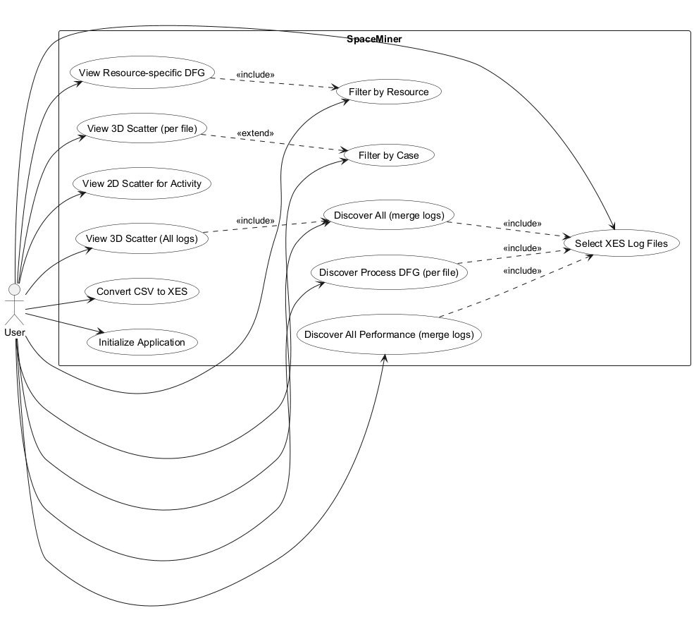
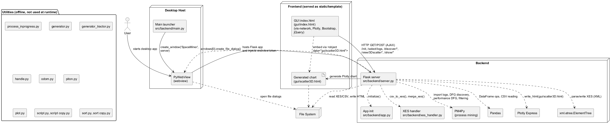
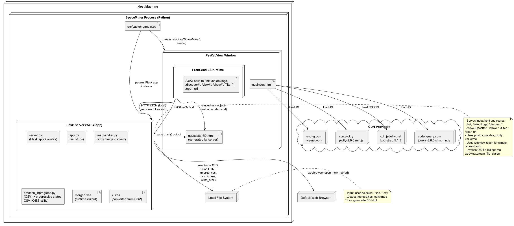

 

% 1 — System Overview
# SECTION 1 — System Overview

This section introduces the SpaceMiner application as implemented in the repository. It explains the system’s purpose, scope, and key features strictly derived from the source code so that both technical and non-technical stakeholders can understand what the system does and how it is intended to be used.

## Purpose and Scope

SpaceMiner is a desktop application for interactive exploration and visual analysis of event logs with spatial-temporal attributes. It focuses on process discovery and visualization using directly-follows graphs (DFG) and 2D/3D spatial plots derived from XES event logs. The application is implemented as a Python desktop app using PyWebView to host a Flask server and render a single-page web UI. The scope of this repository is the full application (UI, backend services, and supporting utilities).

The core capabilities visible in the implementation include:
- Selecting one or more XES event logs from the local filesystem.
- Discovering and visualizing activity-flow and performance-oriented DFGs using PM4Py.
- Visualizing events in 2D and 3D scatter plots based on x, y, z coordinates.
- Filtering by resource and by case to adjust visualizations.
- Merging multiple XES logs into a single combined log and assigning a resource tag derived from source filenames.
- Converting CSV logs into XES format for subsequent analysis.

The repository also contains utility scripts to synthesize, preprocess, and normalize CSV logs for demonstration or test purposes. These utilities are not invoked at runtime by the Flask server but support data preparation.

## High-Level Behavior and Features Evident in the Codebase

The application launches a desktop window titled SpaceMiner that embeds the web UI served by a Flask app. A token-based check (via PyWebView’s token) is performed on all AJAX POST requests for basic request authentication within the local app session.

From a user perspective, the main features are:

- Event log selection and preparation
  - Select multiple XES files via a file dialog. The backend caches selected paths in memory and exposes them by index for subsequent operations.
  - Merge all selected XES files into a single XES file, adding a resource attribute equal to each original file’s basename.
  - Convert a CSV file into XES format (with strict column expectations) and save it locally.

- Process discovery and visualization
  - Build and display activity-based DFGs (frequency) or performance DFGs using PM4Py, filtered to remove in-progress lifecycle events.
  - Display a graph with start/end pseudo-nodes and edges annotated with frequency or mean transition time.
  - Click graph nodes to drill down into spatial 2D scatter plots for the selected activity.

- Spatial analytics
  - Generate a 3D scatter plot of events using x, y, z coordinates and color/symbol encodings, optionally filtered by case.
  - Generate a 2D scatter plot of x vs. y for a selected activity.
  - Produce a categorical bar plot (labeled as area) by location-activity when that attribute exists in the XES.

- Filtering
  - List and select resources (org:resource) extracted from a chosen log and discover a resource-filtered DFG.
  - List and select case identifiers for 3D scatter filtering.

- In-memory session and file handling
  - Maintain selected file paths and the merged XES path in a process-level in-memory map.
  - Persist generated 3D plots to a static HTML file (gui/scatter3D.html) and embed it in the UI.

The UI is built in a single HTML file using vis-network for graph visualization and Plotly for charts, Bootstrap for styling, and lightweight jQuery for DOM utilities. All user actions are translated into AJAX requests to Flask endpoints with a token in the payload.

## Inputs and Outputs

Inputs:
- XES event logs selected via file dialog.
- CSV logs to be converted to XES (column count must be 8 or 9 as handled in xes_handler.csv_to_xes).
- Optional user selections for resource and case filtering from dynamically generated dropdowns.

Outputs:
- Interactive DFG visualizations rendered in-browser (via vis-network).
- 2D and 3D spatial plots rendered in-browser (via Plotly), with 3D plots serialized to gui/scatter3D.html.
- A merged XES file for “Discover All” operations (fixed filename merged.xes).
- A converted XES file from user-selected CSV (filename based on CSV basename).

## Observed Modules and Their Roles

- gui/index.html: Single-page UI and all client-side logic for interaction, plotting, and AJAX orchestration.
- src/backend/main.py: Desktop bootstrapper; creates a PyWebView window pointing to the Flask server.
- src/backend/server.py: Flask application exposing all routes; orchestrates file selection, log parsing, DFG discovery, filters, and plotting.
- src/backend/xes_handler.py: CSV-to-XES conversion and multi-XES merge logic with resource tagging.
- src/backend/app.py: Minimal initialization stub used by /init.
- src/backend/process_inprogress.py: Offline utilities for deriving in-progress lifecycle states and CSV-to-XES conversion (not wired into Flask).
- src/utilities/*.py: Offline data generation, cleaning, sorting, and plotting scripts for producing demo/test CSV data and derived artifacts.

## Notable Implementation Details and Constraints

- Token verification: All POST endpoints wrap a verify_token decorator that compares the request token to webview.token injected into the page. This is scoped to the local app session and is not a general web security mechanism.
- In-memory state: Selected files, merged file path, and filter choices are maintained as module-level globals; restarting the app resets this state.
- File dialogs: Provided by PyWebView; the app runs as a desktop process with local file system access.
- CSV-to-XES schema: xes_handler.csv_to_xes expects 8 or 9 columns and applies a fixed column renaming to XES keys. Any variation in schema will cause errors.
- Heatmap: A heatmap generation facility exists but is not invoked; /show/heatmap expects precomputed heatmap_data that is never populated in the current flow.
- Case filtering: 3D scatter supports case filtering via globals set by /filter/case; these must be configured before issuing /view/3Dscatter for filtering to apply.
- UI routes: The UI references /discover/locations and a csv_parser.html template; these assets/routes are missing or incomplete, so those specific UI actions will not function without further implementation.

## External Libraries and Technologies

- Python: Flask, PyWebView, PM4Py, pandas, plotly, xml.etree.ElementTree.
- Frontend: vis-network, Plotly.js, Bootstrap, jQuery (slim).
- File formats: XES event logs, CSV logs.

## Summary

SpaceMiner is a PyWebView-based desktop application offering end-to-end interactive process mining and spatial visualization of XES event logs. Users load logs, optionally convert CSVs to XES, discover frequency or performance DFGs, and analyze spatial distributions in 2D/3D. The system relies on PM4Py for discovery, Plotly and vis-network for rendering, and provides simple in-session filtering by resource and case. The repository also includes several offline utilities to synthesize and preprocess example event data.

% 2 — Architectural Context
## 2. Architectural Context

This section describes the external context of SpaceMiner as evidenced by the implementation. It identifies external systems and libraries the application depends on, the HTTP endpoints that form its internal API between the GUI and the embedded backend, the data sources and artifacts it reads or writes, and the user roles manifest in code. All details are derived strictly from the provided source code.

### External Systems

- pywebview runtime. The desktop shell that embeds the GUI and hosts the Flask application in a native window. It provides the window token used for request verification and exposes file dialogs used by the backend.
- Flask web server. The embedded HTTP server that serves the GUI and handles AJAX requests from the frontend.
- PM4Py process mining library. Used for XES import, directly‑follows graph and performance DFG discovery, interval lifecycle transformation, and event attribute filtering.
- Plotly Express (Python). Used server‑side to generate 3D scatter plots and write them as HTML files.
- Pandas. Used for CSV/XES preprocessing and DataFrame manipulation.
- XML processing (xml.etree.ElementTree). Used to parse and manipulate XES logs and to inject attributes during merges.
- System web browser. Invoked by the backend to open external URLs upon request.
- Frontend libraries loaded from CDNs. The GUI loads vis-network, Plotly.js, Bootstrap, and jQuery at runtime from unpkg, jsDelivr, and code.jquery.com.
- Local file system. Used throughout for selecting, reading, writing, and merging CSV/XES files and generated visualizations.

### APIs / Interfaces

- GET /  
  Serves gui/index.html with a webview token embedded into the template.

- GET /csv_processing  
  Serves gui/csv_parser.html (template reference; file is not present in this repository).

- POST /init  
  Verifies token; calls app.initialize(); returns {"status": "ok"} or {"status": "error"}.

- POST /select/logs  
  Verifies token; opens a file dialog for XES files; returns {"status": "ok", "filesdict": {int_key: absolute_path, ...}} or {"status": "cancel"}.

- POST /filter  
  Verifies token; expects {"key": <int>}; loads the selected XES; returns a JSON array [<org:resource_1>, ..., <org:resource_n>, <file_key>, <file_path>].

- POST /csv/parse  
  Verifies token; opens a CSV file dialog; converts the chosen CSV to XES via xes_handler.csv_to_xes; returns {"saved_as": "<generated_xes_filename>"} or {}.

- POST /discover/all  
  Verifies token; merges selected XES files via xes_handler.merge_xes; discovers a DFG; returns {"nodes": [...], "edges": [...], "file_key": 20}.

- POST /discover/all/performance  
  Verifies token; merges selected XES files; discovers a performance DFG; returns {"nodes": [...], "edges": [...], "file_key": 20}.

- POST /discover/activity  
  Verifies token; expects {"key": <int>}; discovers a DFG for the given file; returns {"nodes": [...], "edges": [...], "file_key": <int>}.

- POST /discover/performance  
  Verifies token; expects {"key": <int>}; discovers a performance DFG; returns {"nodes": [...], "edges": [...], "file_key": <int>}.

- POST /discover/resource  
  Verifies token; expects {"key": <int>}; uses the globally set resource (via /filter/resource) to filter events and discover a DFG; returns {"nodes": [...], "edges": [...], "file_key": <int>}.

- GET|POST /filter/resource  
  Receives form data {"option": "<resource_value>"}; sets a global resource variable; returns the chosen resource as JSON.

- GET|POST /filter/case  
  Receives form data {"case_select": "<case_id_or_all>"}; sets global case_select and case_check flags used by /view/3Dscatter; returns the current resource as JSON (may be undefined if not previously set).

- GET|POST /case_filtering  
  Expects {"key": <int>} in body; returns a JSON array of distinct case IDs for the selected file plus the file_key appended as the last element.

- POST /view/3Dscatter  
  Verifies token; expects {"key": <int>, "filter": "<column_name>"}; creates a 3D scatter plot (optionally case‑filtered based on prior /filter/case) and writes gui/scatter3D.html; returns {}.

- POST /view/3Dscatter/all  
  Verifies token; generates a 3D scatter plot for the merged file_key=20 and writes gui/scatter3D.html; returns {}.

- POST /show/area  
  Verifies token; expects {"key": <int>, "location": "<activity_name>"}; returns a bar‑chart dataset {"x": [<location_activity>...], "y": [<counts>...]} for the selected activity.

- POST /show/scatter2D  
  Verifies token; expects {"key": <int>, "activity": "<activity_name>"}; returns {"x": [<x_values>...], "y": [<y_values>...], "activity": "<activity_name>"}.

- POST /show/heatmap  
  Verifies token; expects {"activity": "<activity_name>"}; returns {"status": "ok", "data": heatmap_data[activity]} where heatmap_data must have been precomputed via generate_heatmap_data().

- POST /open-url  
  Verifies token; expects {"url": "<absolute_or_http_url>"}; opens the URL in the system browser; returns {}.

All POST endpoints guarded by @verify_token require the webview token in the JSON request body under "token". Several endpoints return graph structures as {"nodes": [...], "edges": [...]} for direct use by the vis-network frontend.

### Data Sources

- Input XES logs. Selected by the user via pywebview file dialogs in /select/logs; loaded with pm4py.xes_importer. Event attributes consumed include:
  - "concept:name" (activity label);
  - "time:timestamp" (event time);
  - "x", "y", "z" (spatial coordinates);
  - "org:resource" (for process mining filters); and
  - "resource" (string attribute injected by merge_xes to mark file provenance).
- Input CSV logs. Optionally selected in /csv/parse; converted to XES via xes_handler.csv_to_xes with strict column mapping to pm4py conventions.
- Generated artifacts:
  - merged.xes. Created by xes_handler.merge_xes when combining multiple logs and adding a "resource" attribute derived from each source filename.
  - gui/scatter3D.html. Produced by /view/3Dscatter and /view/3Dscatter/all and then embedded by the GUI.
  - Converted XES files from CSV. Written by xes_handler.csv_to_xes; the exporter output is immediately post‑processed to replace "xmlns" with "xes.xmlns" within the file.
- In‑memory file registry. files_dict maps small integer keys to absolute file paths selected by the user; keys are used throughout the API to reference the current dataset.

Standalone data generators and preprocessors exist under src/utilities for producing synthetic CSV datasets (e.g., generator.py, generator_tractor.py) and cleaning/sorting, but these utilities are not invoked by the running backend.

### Users / Actors

- End user operating the desktop UI. Interacts with the embedded webview window, selects input files through native dialogs, triggers discovery and visualization actions, and views graphs and plots. This is reflected by the frontend JavaScript calling backend endpoints and passing the webview token.
- Embedded webview host. Acts as the execution environment for both the HTML/JS frontend and the Flask backend, provides the security token used by @verify_token, and mediates file selection dialogs.

% 2.1 — Architectural Context – Use Case Diagram
## Section 2.1 — Architectural Context – Use Case Diagram

This section describes, at a black-box level, how a user interacts with the SpaceMiner application, derived strictly from the provided source code. It focuses on externally visible functionality exposed by the GUI and the Flask backend, without introducing features not implemented in the codebase. The diagram and the accompanying traceability table enable validation by the development team.

Figure: Use Case Diagram — SpaceMiner (section-2-1-use-case-space-miner.puml)



### Implementation traceability

The following mapping ties each use case to concrete UI triggers and backend endpoints to support validation against the code.

| Use case | UI trigger (gui/index.html) | Backend route(s) (src/backend/server.py) |
|---|---|---|
| Initialize Application | doAjax("/init") on page load | POST /init |
| Select XES Log Files | Button: Select XES log files → selectLogs() | POST /select/logs |
| Discover Process DFG (per file) | Per-row button: Discover Process → discoverActivityTree(key) | POST /discover/activity |
| Filter by Resource | Per-row button: Filter by Resource → resourceFiltering(key) → selectFilterHandler() shows a form | POST /filter, then POST /filter/resource (form submission) |
| View Resource-specific DFG | After resource form submit: discoverResourceTree(key) | POST /discover/resource |
| Filter by Case | Per-row button: 3D Scatter → caseFiltering(key) shows case form | POST /case_filtering, then POST /filter/case (form submission) |
| View 3D Scatter (per file) | In case form: 3D Scatter → view_plot(key) | POST /view/3Dscatter |
| View 2D Scatter for Activity | Click a node in the DFG network (updateTree handler) | POST /show/scatter2D |
| Discover All (merge logs) | Button: Discover All! → discoverAll() | POST /discover/all |
| Discover All Performance (merge logs) | Button: Discover All Performance! → discoverAllPerformance() | POST /discover/all/performance |
| View 3D Scatter (All logs) | Button: Scatter All! → scatterAll() | POST /discover/all then POST /view/3Dscatter/all |
| Convert CSV to XES | Button: Do you need to parse a CSV? → csvParser() | POST /csv/parse |

Scope clarifications based on the codebase:
- Heatmap and locations graph features are present in helper functions but not wired by active GUI triggers; they are intentionally excluded to avoid documenting unused or unreachable behavior.
- Per-file performance DFG discovery exists server-side but has no active GUI button; only the “All Performance” discovery is user-accessible and is therefore included.

% 3 — Containers
## 3. Containers

This section identifies the runtime containers that constitute the SpaceMiner application, as implemented in the repository. It covers the desktop UI, the embedded backend service, the local data store used for processing and persistence, and the external services relied upon at runtime. Communication mechanisms are derived from the actual code paths, frameworks, and APIs in use.

| Container | Responsibility | Technology | Communication |
|---|---|---|---|
| SpaceMiner GUI (Embedded WebView) | Presents the user interface for process discovery and 3D visualization; issues user-driven actions (file selection, discovery, filtering, plotting). Renders the DFG graph, 2D scatter, and embeds generated 3D scatter HTML. | HTML5/JavaScript; Bootstrap 5.1.3; Plotly.js 2.9.0; vis-network (UMD); jQuery 3.6.0 slim; hosted inside PyWebView window. | HTTP(S) GET for static assets from the Flask static folder; AJAX HTTP POST/GET with JSON payloads to Flask endpoints (XMLHttpRequest). Token-based request validation via JSON body field “token”. Loads generated 3D scatter as a local static HTML resource. |
| SpaceMiner Backend API (Flask) | Serves the UI, verifies tokens, handles file dialogs, imports/merges XES, converts CSV→XES, computes DFGs and performance DFGs, prepares 2D/3D visualizations, and provides filtering endpoints. Orchestrates pm4py/pandas/Plotly processing and writes output artifacts. | Python 3; Flask; pywebview; pm4py; pandas; plotly (Python); xml.etree.ElementTree. | Receives HTTP requests from the GUI (JSON over HTTP). Local interop with PyWebView APIs (in-process calls) for file dialogs. Performs local filesystem I/O for reading/writing CSV/XES/HTML files. May open external URLs via Python’s webbrowser module (spawns system browser). |
| Local File Storage (XES/CSV and Generated Assets) | Acts as the data store for input and derived artifacts: selected XES files, merged.xes, generated XES from CSV, and rendered Plotly HTML (gui/scatter3D.html). | OS filesystem accessed via Python standard libraries; CSV and XES file formats. | Direct file I/O (read/write) from the Flask backend. Static file serving by Flask to the GUI for generated artifacts. No database in use. |
| External JavaScript CDNs | Hosts third-party libraries used by the GUI for rendering and UI behavior. | unpkg.com (vis-network), cdn.plot.ly (Plotly.js), jsdelivr (Bootstrap), code.jquery.com (jQuery). | HTTPS GET from the embedded WebView to the public CDNs at page load. |

Introduction completeness notes:
- There is no dedicated database; persistence is file-based (CSV/XES and generated HTML).
- All client-server interactions occur within the local desktop process: the WebView executes JavaScript that calls the embedded Flask app via HTTP endpoints.

% 3.1 — Architecture Overview – Component Diagram
# Section 3.1 — Architecture Overview – Component Diagram

This section presents the runtime component structure of SpaceMiner as implemented in the provided codebase. It focuses on the concrete modules, their responsibilities, and the inter-component interactions between the desktop webview shell, the Flask backend, the static web UI, and the data processing libraries. The purpose is to give a faithful, implementation-accurate view that supports validation by the development team.

## Component Diagram

Figure 3.1.1 visualizes the complete set of runtime components and their interactions, including the static GUI, the Flask server, the PyWebView host, and all backend processing modules and key libraries used at runtime. Utility scripts used for offline data preparation are grouped and explicitly shown as non-runtime components.

Figure 3.1.1 — SpaceMiner Component Diagram



## Component Responsibilities and Interfaces

The following table enumerates all components present in the repository, their concrete files, primary responsibilities, and principal dependencies as observed in the implementation. Components are grouped by runtime relevance to distinguish what is active during application execution from what is used for offline data preparation.

| Component | Files | Purpose and Responsibilities | Key Dependencies |
|---|---|---|---|
| Main launcher | src/backend/main.py | Creates the desktop window and embeds the Flask server in a PyWebView window; starts the app in debug mode. | webview |
| PyWebView host | (library) | Provides the desktop container, window creation, token injection (webview.token), and native file dialogs. | OS windowing APIs |
| Flask server | src/backend/server.py | Serves GUI, exposes all HTTP endpoints, orchestrates discovery, filtering, visualization, and CSV/XES conversion workflows; manages in-memory state (files_dict, heatmap_data). | Flask, webview, pm4py, pandas, plotly.express, xml.etree.ElementTree, xes_handler, os |
| App init | src/backend/app.py | Provides initialize() used by /init to signal backend readiness. | None |
| XES handler | src/backend/xes_handler.py | Converts CSV to XES; merges multiple XES logs into a single file tagging events with a resource identifier. | pandas, pm4py (conversion/export), xml.etree.ElementTree, os |
| PM4Py | (library) | Imports XES logs; computes DFG and performance DFG; filters events/traces; interval lifecycle transformation; attribute statistics. | pm4py.objects.log.importer.xes, pm4py.algo.discovery.dfg, pm4py.statistics.attributes, pm4py.objects.log.util.interval_lifecycle |
| Pandas | (library) | DataFrame operations for CSV/XES-derived data manipulation and sorting. | pandas |
| Plotly Express | (library) | Generates 3D scatter plots and writes them to gui/scatter3D.html for embedding by the GUI. | plotly.express |
| ElementTree | (library) | Parses and writes XES XML for log_to_dataframe and heatmap data generation. | xml.etree.ElementTree |
| GUI (index.html) | gui/index.html | Static single-page UI; initializes token; invokes backend via AJAX; renders DFG with vis-network; renders 2D scatter/area charts with Plotly; embeds generated 3D chart HTML. | vis-network, Plotly.js, Bootstrap, jQuery; backend endpoints |
| Generated chart HTML | gui/scatter3D.html (generated) | Output of Plotly Express; embedded by the GUI via object tag for 3D visualization. | Plotly Express (server-side), file system |
| Utilities (offline) | src/backend/process_inprogress.py; src/utilities/*.py | Data preparation and synthetic data generation scripts (CSV massaging, odometry alignment, random generators, merging/sorting, plotting). Not invoked by runtime server. | pandas, csv, glob, math, random, plotly.express, os |

## Notes for Validation

The diagram and table reflect the exact modules and flows evident in the code. The GUI communicates exclusively through the endpoints defined in src/backend/server.py using a token provided by webview.token. Plotly-generated 3D visualizations are written to gui/scatter3D.html on disk and then embedded by the GUI. PM4Py is used for DFG and performance analyses, and xml.etree.ElementTree is used both for parsing XES in log_to_dataframe and for heatmap preprocessing. File selection uses PyWebView’s native dialogs within server routes. All utility scripts are included for completeness but are not referenced by the runtime code paths.

% 4 — Components
## 4. Components

This section enumerates the internal components implemented in the codebase, organized by container. For each component, it describes the responsibility and its concrete interactions (function calls, HTTP endpoints, file I/O, and library dependencies) as visible in the source. The intent is to enable developers and integrators to validate the implementation structure and clarify collaboration among components.

### 4.1 GUI Container Components (gui/index.html)

The GUI is a single-page application served by Flask and rendered inside a pywebview window. It comprises HTML/CSS for layout and a set of JavaScript functions that orchestrate file selection, model discovery, filtering, and plotting via asynchronous HTTP calls to the backend.

| Component | Responsibility | Interactions |
|---|---|---|
| getMethods | Utility to introspect functions on an object for debugging. Not used elsewhere. | None |
| selectLogsHandler | Handle response from /select/logs; populate the files table, enable bulk action buttons when multiple files are loaded. | Receives JSON from POST /select/logs; manipulates DOM (files-table); sets global uploaded_files |
| selectLogs | Trigger file chooser on backend. | POST /select/logs via doAjax |
| resourceFiltering | Initiate resource filtering flow for a selected file key. | POST /filter via doAjax; callback selectFilterHandler |
| selectFilterHandler | Render a resource selection form in the table row; populate <select> options returned by the backend. | Receives JSON from POST /filter; injects form posting to /filter/resource; invokes discoverResourceTree on submit |
| caseFiltering | Initiate case filtering flow for a selected file key. | POST /case_filtering via doAjax; callback selectCaseHandler |
| selectCaseHandler | Render a case-id selection form; default option is “All”; on submit, posts selection to backend and triggers 3D scatter. | Receives JSON from POST /case_filtering; form posts to /filter/case; on submit calls view_plot |
| updateTree | Render a directed graph (DFG) in the #mynetwork div using vis-network; attach node click handler to show 2D scatter for an activity. | Receives nodes/edges from discovery endpoints; on node click: POST /show/scatter2D via doAjax |
| updateArea | Render a simple graph into #mynetwork and set a click handler to show area plot per location. | On node click: POST /show/area via doAjax |
| showScatterHandler | Render a 2D scatter plot into #scatter using Plotly with x/y returned by backend. | Receives JSON from POST /show/scatter2D |
| showHeatmapHandler | Render a heatmap for the selected activity into #heatmap. Not currently wired from UI. | Receives JSON from POST /show/heatmap |
| discoverResourceTree | Discover DFG filtered by selected resource for a given file key. | POST /discover/resource via doAjax; callback updateTree |
| discoverActivityTree | Discover frequency-based DFG for a given file key. | POST /discover/activity via doAjax; callback updateTree |
| discoverPerformanceTree | Discover performance DFG (mean durations) for a given file key. | POST /discover/performance via doAjax; callback updateTree |
| discoverLocationsTree | Attempt to discover a locations graph; calls /discover/locations, which is not implemented server-side. | POST /discover/locations via doAjax; callback updateArea (dead endpoint) |
| view_plot | Request 3D scatter for a given file key with fixed filter 'activity'; renders an embedded HTML after success. | POST /view/3Dscatter via doAjax; callback show3DScatter |
| showAreaHandler | Render a bar chart (x: location_activity, y: counts) into #scatter. | Receives JSON from POST /show/area |
| show3DScatter | Embed generated 3D scatter HTML file into #scatter3d. | Sets <object data="gui/scatter3D.html"> after POST /view/3Dscatter |
| printResponse | Show banner with generated XES filename after CSV parsing. | Receives JSON from POST /csv/parse |
| csvParser | Trigger CSV-to-XES conversion via backend. | POST /csv/parse via doAjax; callback printResponse |
| discoverAll | Merge all selected XES logs and discover frequency DFG. | POST /discover/all via doAjax with uploaded_files; callback updateTree |
| discoverAllPerformance | Merge all selected XES logs and discover performance DFG. | POST /discover/all/performance; callback updateTree |
| showScatter3DAll | Request generation of aggregate 3D scatter HTML. | POST /view/3Dscatter/all via doAjax; callback show3DScatter |
| scatterAll | Merge all logs and then request 3D scatter for merged output. | POST /discover/all (update server state) then POST /view/3Dscatter/all |
| showHide | Toggle visibility of a DOM element by id. | DOM manipulation only |
| openLink | Proxy opening an external URL via backend for the desktop host. | POST /open-url via doAjax |
| getHttpRequestObject | Construct XMLHttpRequest object (fallbacks for legacy IE). | Used by doAjax |
| doAjax | Generic JSON-based AJAX wrapper with webview security token injection and onreadystatechange callback support. | Sets Content-Type: application/json; injects window.token; used by nearly all networked GUI functions |

### 4.2 Backend Container Components (src/backend)

The backend is a Flask application hosting routes used by the GUI, a set of log processing utilities leveraging pm4py, and the pywebview bootstrap that embeds the app.

| Component | Responsibility | Interactions |
|---|---|---|
| src/backend/main.py | Desktop entrypoint; creates a pywebview window pointing at the Flask server object; starts event loop with debug enabled. | webview.create_window('SpaceMiner', server); webview.start(debug=True) |
| src/backend/app.py.initialize | Lightweight readiness check used at GUI init. | Called by route /init |
| src/backend/app.py.do_stuff | Demo function returning a fixed string. Not used by current routes. | None |
| server.Flask app instance | Flask application object exposing all HTTP routes and serving static/templates from gui directory. | Used by pywebview; serves gui/index.html; static_folder/template_folder resolved to gui |
| verify_token (decorator) | Enforce that incoming POST JSON contains token matching webview.token. Guards most POST endpoints. | Wraps many routes (e.g., /init, /select/logs, discovery and plotting endpoints) |
| add_header (after_request) | Disable caching by setting Cache-Control: no-store in all responses. | Flask after_request hook |
| landing (GET /) | Serve the GUI index template with injected token. | render_template('index.html', token=webview.token) |
| csv_processing (GET /csv_processing) | Attempt to serve csv_parser.html (not present in repo). | render_template('csv_parser.html') |
| initialize (POST /init) | Call app.initialize and return status. | Calls app.initialize(); used by GUI bootstrap |
| choose_path (POST /select/logs) | Show native file dialog (XES) via pywebview; store selections in files_dict for later operations. | webview.windows[0].create_file_dialog; updates files_dict; returns {'filesdict': files_dict} |
| get_resources (POST /filter) [route] | For selected file key, extract org:resource values from XES and return list of resource names plus appended file_key and file_path. | Uses pm4py.xes importer; reads files_dict; returns [resources..., file_key, file_path] |
| parse_csv (POST /csv/parse) | Show native file dialog (CSV), convert selection to XES, and return saved filename. | webview file dialog; calls xes_handler.csv_to_xes |
| discover_all (POST /discover/all) | Merge multiple selected XES logs into one (adds 'resource' attribute with original source), register merged file under key 20, return discovered frequency DFG for merged log. | Calls xes_handler.merge_xes; updates files_dict[20]; calls create_dfg |
| discover_all_p (POST /discover/all/performance) | Same as discover_all, but returns performance DFG (mean durations). | Calls xes_handler.merge_xes; calls create_performance |
| log_to_dataframe | Parse an XES file into a pandas DataFrame with columns x,y,z,activity(case name),case,timestamp, optionally resource and location_activity. | Uses xml.etree.ElementTree; pandas; consumed by plotting endpoints |
| create_scatter3D (POST /view/3Dscatter) | Generate a 3D scatter Plotly HTML for a file keyed by GUI selection. Supports server-side case filtering controlled by globals set via /filter/case. | Reads files_dict; calls log_to_dataframe; uses plotly.express; writes gui/scatter3D.html; relies on globals case_check/case_select set by filter_cases |
| create_scatter3D_all (POST /view/3Dscatter/all) | Generate aggregate 3D scatter HTML for merged file under key 20. | Reads files_dict[20]; log_to_dataframe; plotly.express; writes gui/scatter3D.html |
| create_plot_area (POST /show/area) | Compute counts of location_activity for a selected location (activity) and return x (labels) and y (counts) for a bar plot. | log_to_dataframe; pandas; Counter |
| create_2dscatter (POST /show/scatter2D) | Filter by activity and return arrays of x and y coordinates for 2D scatter. | log_to_dataframe; pandas; returns {'x':[], 'y':[], 'activity':str} |
| create_heatmap (POST /show/heatmap) | Return precomputed heatmap data for activity from heatmap_data cache. | Reads heatmap_data (populated by generate_heatmap_data); not currently invoked by GUI |
| generate_heatmap_data | Precompute 10x10 heatmap bins per activity and populate heatmap_data. Not called by routes in this codebase. | Parses XES via ElementTree; updates heatmap_data |
| test | Compute a color mapping for activities for visualization convenience based on min/max activity counts. | Used by create_dist_dfg and create_performance |
| create_dfg | Build a frequency DFG using pm4py for the given XES file. Filters out 'inprogress' lifecycle events and converts lifecycle to intervals. Returns vis.js nodes and edges. | pm4py.xes importer; pm4py.filter_event_attribute_values; interval_lifecycle; pm4py.discover_directly_follows_graph; attr_get.get_attribute_values |
| create_dist_dfg | Build an aggregated DFG by resource across the log (per-resource graphs merged). Not used by routes. | pm4py; interval_lifecycle; attr_get; test() |
| get_resources(file_path) [utility] | Utility to read distinct org:resource values from an XES file. Name shadows route get_resources in module namespace (route remains bound). | pm4py; interval_lifecycle |
| create_performance | Build a performance DFG (mean durations on edges, capped at 100s) and return nodes/edges suitable for vis.js. | pm4py.discover_performance_dfg; interval_lifecycle; attr_get; test() |
| discover_dfg (POST /discover/activity) | Return frequency DFG graph for a selected file key. | Calls create_dfg; reads files_dict |
| discover_performance (POST /discover/performance) | Return performance DFG graph for a selected file key. | Calls create_performance; reads files_dict |
| filter_resource (POST /filter/resource) | Store selected resource (from form POST) in global variable 'resource'. | Sets global resource; returns resource as JSON |
| filter_cases (POST /filter/case) | Store selected case id in globals 'case_select' and 'case_check' (True unless 'all'). | Sets global case_check/case_select; returns resource (variable referenced but may be unset) |
| case_filtering (POST /case_filtering) | Compute distinct case ids for a selected file; return list of cases with the file key appended. | log_to_dataframe; pandas; returns list([...cases], file_key) |
| discover_resource (POST /discover/resource) | Return DFG filtered by the 'resource' global set by /filter/resource. | Calls create_dfg(resource=resource) |
| open_url (POST /open-url) | Open an external URL on the host system. | webbrowser.open_new_tab |

Notes on backend interactions and constraints:  
1) Globals case_check and case_select must be set via /filter/case before invoking /view/3Dscatter; otherwise create_scatter3D references may result in NameError at runtime.  
2) The route /discover/locations referenced by the GUI is not implemented; any calls will fail with 404.  
3) csv_processing serves csv_parser.html which is absent in this repository.  
4) The function name collision get_resources (route) vs get_resources(file_path) (utility) is harmless due to decorator binding but should be refactored for clarity.

### 4.3 Utilities Container Components (src/utilities)

Utilities are offline scripts used to synthesize, clean, or merge CSV logs and to visualize data. They are not invoked by the Flask app at runtime but produce files consumed by other components (e.g., process_inprogress, xes_handler).

| Component | Responsibility | Interactions |
|---|---|---|
| generator.py | Generate synthetic drone event logs with realistic spatial-temporal behavior across many “cases”. Writes drone0.csv with columns time, activity, lifecycle, payload, x, y, z, case_id. | Writes drone0.csv; uses random, datetime; produces data later used by generator_tractor/process_inprogress |
| generator_tractor.py | Generate tractor-related event sequences by reading drone0.csv, extracting weed positions and tractor positions, and synthesizing MOVE/CUT_GRASS/LOW_BATTERY/RETURN_TO_BASE/STOP sequences for a named tractor. Writes tractor_2.csv by default. | Reads drone0.csv; writes <tractor_name>.csv |
| handle.py | Clean and normalize a CSV containing drone data (e.g., fix z minima, scientific notation x/y, lifecycle to start/complete). Outputs drone0.csv. | Reads csv/drone_1_merged.csv; writes drone0.csv |
| odom.py | Merge “macro” activity intervals with odometry samples within time windows, per case; sort by time and write combined CSVs. | Reads fatti/*/*.csv; writes <case>_all.csv files |
| piton.py | Transform raw per-activity CSVs into “Spaghi” datasets with normalized schema and Case_IDs; one output file per input activity. | Reads csv/LogGrezzi/*/*.csv; writes Spaghi/<activity>_<i>.csv |
| sort.py | Append a “resource” column equal to source filename for each CSV in csv/2Trattori, then concatenate and sort all into MRS.csv. | Reads csv/2Trattori/*.csv; writes csv/res/<file>.csv and MRS.csv |
| sort copy.py | Concatenate and sort all CSVs in Spaghi directory into Spaghetti.csv. | Reads Spaghi/*.csv; writes Spaghetti.csv |
| script.py | Normalize a merged CSV: fix z for certain activities, normalize lifecycle strings, and clear scientific notation anomalies. | Reads and rewrites merged_2T.csv |
| script copy.py | Ensure WEED_POSITION events have z=0.0 in 3t.csv, rewriting in place. | Reads and rewrites 3t.csv |
| plot.py | Quick local visualization of all.csv as 3D scatter using plotly. | Reads all.csv; shows interactive figure |
| process_inprogress.assign_progressive_state | Enrich a CSV by interpolating “in-progress” states between start and end of identical activities; write temp_all.csv. | Reads given CSV; writes temp_all.csv; uses datetime interpolation |
| process_inprogress.csv_to_xes | Convert a normalized CSV to XES with pm4py, rename certain columns via renaming(), and write dronefile.xes (modifying xmlns prefix). | Uses pandas, pm4py; writes <name>.xes and dronefile.xes |
| process_inprogress.renaming | Map generic CSV column names to XES-compatible names (time:timestamp, concept:name, lifecycle:transition, case:concept:name). | Used by process_inprogress.csv_to_xes |
| process_inprogress.apply_odom | Integrate odometry data with macro activity intervals into case-specific combined CSVs. | Reads path/*.csv; writes <case>_all.csv |
| xes_handler.csv_to_xes | Convert a CSV to XES with strict column mapping for 8- or 9-column inputs; patch xmlns to xes.xmlns and write back. | Uses pandas, pm4py; writes <name>.xes |
| xes_handler.merge_xes | Merge multiple XES logs into merged.xes, adding a string resource attribute indicating original source file name. | Reads multiple .xes files; writes merged.xes |

Inter-component data flow across utilities and backend:  
- generator.py and handle.py produce drone0.csv, which can be further processed by generator_tractor.py and process_inprogress.py to generate richer CSVs and XES files.  
- xes_handler.csv_to_xes and xes_handler.merge_xes produce XES files consumed by the backend’s pm4py-based discovery and visualization endpoints.

% 5 — Code-Level View
# SECTION 5 — Code-Level View

This section describes how the implemented source code realizes the architecture at code level. It maps architectural responsibilities to concrete modules, identifies all executable entry points, and details the interaction between the front-end and back-end through HTTP endpoints. The content is derived solely from the provided repository and is intended to be verifiable by the development team.

## Repository Layout and Roles

The repository is organized in three top-level directories. The gui directory contains the single HTML page that hosts all presentation logic and JavaScript. The src/backend directory contains the runtime back-end of the application: a Flask server integrated with PyWebview, plus back-end services for XES and DFG computation. The src/utilities directory contains generation, transformation, and helper scripts used for offline data preparation; these scripts are not invoked by the running application but are part of the codebase and are therefore included in this mapping.

The following table lists every source file in the repository and describes its responsibility, role, and dependencies.

Table 5.1 — Modules overview (complete)

| Path | Runtime role | Responsibility | Key functions/classes | External libraries |
|---|---|---|---|---|
| gui/index.html | Front-end UI (rendered by Flask, embedded in PyWebview) | Provides the single-page UI: file selection, controls, and visualization of process graphs and scatter plots; includes all JavaScript logic for AJAX, plotting, and event handling. | JavaScript functions: selectLogs, resourceFiltering, caseFiltering, discoverActivityTree, discoverPerformanceTree, discoverResourceTree, discoverLocationsTree, discoverAll, discoverAllPerformance, scatterAll, view_plot, show3DScatter, showScatterHandler, showAreaHandler, updateTree, updateArea, csvParser, doAjax, getHttpRequestObject, openLink, others. | vis-network, Plotly, Bootstrap, jQuery (CDN) |
| src/backend/app.py | Back-end helper | Provides initialization stub and a sample method. Used by /init to gate startup. | initialize, do_stuff | — |
| src/backend/main.py | Primary runtime entry point | Starts the desktop application by creating a PyWebview window that hosts the Flask server “server” object and starts the GUI loop. | __main__ guard, webview.create_window, webview.start | logging, webview, contextlib.redirect_stdout, io.StringIO |
| src/backend/process_inprogress.py | Offline data processing script | Generates “inprogress” lifecycle events by interpolating positions, converts CSV to XES, and correlates odometry; designed as standalone script with an executable main. Not imported by the server. | assign_progressive_state, csv_to_xes, renaming, apply_odom; __main__ demonstrates usage | csv, os, datetime, pandas, glob, xml.etree.ElementTree, pm4py (log conversion, XES export) |
| src/backend/server.py | Flask back-end server (hosted in PyWebview) | Implements all HTTP routes used by the front-end. Manages file selection (via PyWebview dialogs), XES parsing/merging, DFG and performance DFG computation, 2D/3D plotting, and token verification. Maintains global runtime state. | Flask app “server”; routes: landing (/), csv_processing, init, select/logs, filter, csv/parse, discover/all, discover/all/performance, view/3Dscatter, view/3Dscatter/all, show/area, show/scatter2D, show/heatmap, discover/activity, discover/performance, filter/resource, filter/case, case_filtering, discover/resource, open-url. Helper functions: verify_token, add_header, log_to_dataframe, generate_heatmap_data, test, create_dfg, create_dist_dfg, get_resources, create_performance | Flask, webview (PyWebview), pm4py (importers, filters, DFG discovery, performance DFG, interval lifecycle), pandas, plotly.express, xml.etree.ElementTree |
| src/backend/xes_handler.py | Back-end utility | Converts CSV files into XES with proper attribute mapping and merges multiple XES logs by appending events and adding a “resource” string. Used by server.py. | csv_to_xes, merge_xes | pandas, xml.etree.ElementTree, pm4py (log conversion, XES export), os |
| src/utilities/generator_tractor.py | Offline generator script | Produces tractor-related activity sequences by parsing an existing drone CSV and constructing MOVE/CUT/END sequences; writes tractor_2.csv on execution. | do, out_append, append_movements, add_end; __main__ | os, csv, json, datetime, random |
| src/utilities/generator.py | Offline generator script | Synthesizes drone event logs with spatial-temporal continuity and tractor coordination; writes drone0.csv on execution. | out_append, add_to, add_explore, add_weedhandler, add_end; __main__ | os, csv, math, datetime, random |
| src/utilities/handle.py | Offline cleaner script | Normalizes lifecycles, fixes numeric anomalies, and rewrites input CSV into drone0.csv; executes at import-time. | top-level execution | os, csv |
| src/utilities/odom.py | Offline correlator script | Correlates “macro” activity windows with odometry streams, outputs aligned CSV per case. | top-level execution | csv, pandas, glob, os |
| src/utilities/piton.py | Offline slicer script | Reconstructs activity logs from raw per-activity CSV directories, emits labeled “Spaghi” outputs. | top-level execution | csv, pandas, glob, os |
| src/utilities/plot.py | Offline plot utility | Opens a 3D scatter of an arbitrary CSV using Plotly; diagnostic use. | top-level execution | plotly.express, pandas |
| src/utilities/script copy.py | Offline rewriter script | Adjusts Z for WEED_POSITION and rewrites the CSV in place. | top-level execution | csv, pandas |
| src/utilities/script.py | Offline normalizer script | Normalizes lifecycle labels, fixes Z and denormalized numeric fields; rewrites CSV in place. | top-level execution | csv |
| src/utilities/sort copy.py | Offline aggregator script | Concatenates and sorts multiple CSVs into Spaghetti.csv. | top-level execution | csv, pandas, glob, os |
| src/utilities/sort.py | Offline aggregator script | Adds resource labels per file, concatenates, sorts, and writes MRS.csv. | top-level execution | csv, pandas, glob, os |

## Executable Entry Points

The codebase exposes several entry points. Only one is used for the application runtime; the rest are standalone scripts for data generation and manipulation.

Table 5.2 — Entry points and invocation

| File | Invocation | Purpose | Notes |
|---|---|---|---|
| src/backend/main.py | python src/backend/main.py | Starts the desktop application. Creates a PyWebview window with the Flask app and starts the GUI loop in debug mode. | Primary runtime entry point. |
| src/backend/process_inprogress.py | python src/backend/process_inprogress.py | Runs interpolation and CSV-to-XES conversion for a sample drone0.csv. | Offline; not imported by runtime. |
| src/utilities/generator.py | python src/utilities/generator.py | Generates synthetic drone activity logs and writes drone0.csv. | Offline generator. |
| src/utilities/generator_tractor.py | python src/utilities/generator_tractor.py | Generates tractor-related logs and writes tractor_2.csv. | Offline generator. |
| src/utilities/handle.py | python src/utilities/handle.py | Cleans and normalizes input CSV and writes drone0.csv. | Executes at import; no __main__ guard. |
| src/utilities/odom.py | python src/utilities/odom.py | Correlates odometry with macro activities, writes per-case outputs. | Offline transformer. |
| src/utilities/piton.py | python src/utilities/piton.py | Reconstructs activity streams from raw directories, writes Spaghi outputs. | Offline transformer. |
| src/utilities/plot.py | python src/utilities/plot.py | Displays 3D scatter of all.csv. | Diagnostic plotting. |
| src/utilities/script.py | python src/utilities/script.py | Normalizes lifecycle and numeric anomalies in merged_2T.csv. | In-place rewrite. |
| src/utilities/script copy.py | python src/utilities/script\ copy.py | Adjusts Z for WEED_POSITION in 3t.csv. | In-place rewrite. |
| src/utilities/sort.py | python src/utilities/sort.py | Labels resources, merges and sorts multiple CSVs into MRS.csv. | Offline aggregator. |
| src/utilities/sort copy.py | python src/utilities/sort\ copy.py | Concatenates and sorts Spaghi/*.csv into Spaghetti.csv. | Offline aggregator. |

## Front-End to Back-End Mapping

The front-end (gui/index.html) renders a tokenized page and drives the application entirely with JavaScript. It sends JSON payloads with a token to the Flask back-end. The back-end verifies the token for all protected endpoints via the verify_token decorator and returns JSON responses or side-effect artifacts (for 3D plots, a static HTML file is written to gui/scatter3D.html and then embedded by the front-end).

The following table maps front-end JavaScript functions to back-end routes and server implementations, including the response shape inferred from code.

Table 5.3 — JavaScript to Flask endpoint mapping

| Front-end function (index.html) | HTTP method and path | Back-end handler (server.py) | Request/response behavior |
|---|---|---|---|
| doAjax("/init") on load | POST /init | initialize | Returns {"status":"ok"} on success. |
| selectLogs | POST /select/logs | choose_path | Opens file dialog via PyWebview; returns {"status":"ok","filesdict":{i:path,...}} or {"status":"cancel"}. |
| resourceFiltering | POST /filter | get_resources | Returns JSON array: [list of resources..., file_key, file_path]. |
| caseFiltering | POST /case_filtering | case_filtering | Returns [cases..., file_key] where cases are unique integers from XES. |
| discoverActivityTree | POST /discover/activity | discover_dfg | Returns {"nodes":[], "edges":[], "file_key":k} representing DFG. |
| discoverPerformanceTree | POST /discover/performance | discover_performance | Returns performance DFG as nodes/edges with edge labels as mean duration. |
| discoverResourceTree | POST /discover/resource | discover_resource | Returns DFG filtered by global resource selected by /filter/resource. |
| discoverAll | POST /discover/all | discover_all | Merges multiple XES files into merged.xes, stores as key 20, returns DFG for merged log. |
| discoverAllPerformance | POST /discover/all/performance | discover_all_p | As above, returns performance DFG. |
| scatterAll (via showScatter3DAll) | POST /view/3Dscatter/all | create_scatter3D_all | Generates gui/scatter3D.html for the merged log; returns {}. |
| view_plot | POST /view/3Dscatter | create_scatter3D | Generates gui/scatter3D.html for a single file; supports case filtering through globals. |
| network click -> showScatterHandler | POST /show/scatter2D | create_2dscatter | Returns {"x":[...],"y":[...],"activity":"..."} for 2D scatter of selected activity. |
| discoverLocationsTree | POST /discover/locations | updateArea (front-end) | Not present in back-end; no /discover/locations route implemented. |
| network click in updateArea -> showAreaHandler | POST /show/area | create_plot_area | Returns {"x":[label...],"y":[count...]} for bar chart of location_activity counts. |
| csvParser | POST /csv/parse | parse_csv | Opens file dialog for CSV; converts to XES via xes_handler.csv_to_xes; returns {"saved_as": "<name>.xes"} or {}. |
| openLink | POST /open-url | open_url | Opens a browser tab to the provided URL; returns {}. |
| showHeatmapHandler (commented path usage) | POST /show/heatmap | create_heatmap | Returns {"status":"ok","data": heatmap_data[activity]} when activity precomputed by generate_heatmap_data. |
| Form submit handlers | POST /filter/resource and /filter/case | filter_resource, filter_cases | Set global resource, case_select/case_check respectively; return JSON echo values. |

The back-end handlers that produce process/control-flow models are: create_dfg, create_performance, and create_dist_dfg (the last is not wired to a route). The 3D scatter plot generation functions, create_scatter3D and create_scatter3D_all, persist an HTML artifact to gui/scatter3D.html, which is then embedded by the front-end via an <object> element.

## Back-End Module Responsibilities and Internal Data Structures

The core runtime is implemented in src/backend/server.py. It constructs a Flask application named server with static and template folders pointing to gui. It maintains in-memory global state:

- files_dict: a dictionary mapping integer keys (as used by the front-end table) to absolute file paths of user-selected XES logs. Key 20 is reserved by the implementation for the “merged” log created by discover_all and discover_all_p.
- heatmap_data: a dictionary populated by generate_heatmap_data(log_path) with precomputed 2D heatmaps keyed by activity name.
- resource, case_select, case_check: module-level globals set by /filter/resource and /filter/case, used to filter DFGs and 3D plots. They are referenced by create_scatter3D and discover_resource; if not preset by the respective form submissions, referencing case_check in create_scatter3D would raise a NameError.

The verify_token decorator enforces that incoming JSON payloads contain a token equal to webview.token. The front-end consistently appends this token in doAjax() before sending the request. All token-protected routes require JSON bodies.

Helper functions translate XES into analysis-ready structures:

- log_to_dataframe(log_path) reads an XES file with xml.etree.ElementTree and builds a pandas DataFrame with x, y, z, activity (from concept:name), case, timestamp (as pandas datetime), and optionally resource and location_activity if present in the XES. Numeric columns x, y, z are cast to float, case to int.
- create_dfg(file_path, location_graph=False, resource='') imports an XES log with pm4py, removes inprogress lifecycle events, maps to interval semantics, optionally filters by org:resource, then discovers the directly-follows graph. It returns nodes and edges suitable for vis-network; it synthesizes “start_node” and “end_node” sentinel nodes and annotates edges with frequencies.
- create_performance(file_path, location_graph=False) discovers a performance DFG and formats edge labels as capped mean durations; edge widths are proportional to mean durations.
- create_dist_dfg(file_path, location_graph=False) discovers DFGs per resource and aggregates them; it is not exposed via a route but mirrors the node/edge formatting.
- generate_heatmap_data(log_path) computes activity-specific 2D heatmaps from point clouds using adaptive grid bounds; results are stored in heatmap_data.

For CSV/XES conversion and merging:

- xes_handler.csv_to_xes(path) maps CSV columns to XES attributes according to the detected column count (8 or 9 columns). It uses pm4py to convert to an event log and export to XES. After writing, it replaces the substring "xmlns" with "xes.xmlns" and rewrites the file to ensure a custom namespace tag is present.
- xes_handler.merge_xes(paths) iterates over the selected XES files and, for each event, adds a string attribute “resource” with the source filename stem. It appends events from subsequent traces into the output’s corresponding traces and writes to merged.xes.

## Front-End Structure and AJAX Conventions

The front-end is a single HTML page with embedded JavaScript. It uses the following conventions that are material to integration and validation:

- Token handling: the template variable {{ token }} is injected into window.token by Flask. Each AJAX request performed by doAjax() injects this token into the JSON payload. The back-end verifies it via verify_token.
- Rendering libraries: vis-network is used for nodes/edges visualization; Plotly is used for 2D scatter, bar charts, and for embedding an externally rendered 3D scatter from a persisted HTML file.
- File dialogs: the page does not use standard file inputs. Instead, it requests the back-end to open native dialogs through PyWebview and returns the file paths. The back-end stores these in files_dict for subsequent operations.

The UI wires specific event handlers to populate a table of selected files, request DFGs and performance DFGs, and request resource/case filters to refine computations.

## Observed Architectural and Design Patterns

The implementation follows a clear separation between presentation and service logic:

- Presentation/UI layer: gui/index.html with all client-side logic and rendering. It acts as a thin client relying on JSON responses and on an externally generated 3D plot artifact.
- Service layer: src/backend/server.py exposing HTTP endpoints, performing all computational tasks (PM4Py analysis, data filtering, artifact creation), and implementing token verification. Utility submodules (src/backend/xes_handler.py) encapsulate CSV/XES operations.
- Desktop shell: src/backend/main.py integrates the web UI and server into a desktop application via PyWebview, avoiding a separate browser dependency.

At code level, modules are largely procedural. The back-end uses a decorator (verify_token) to consistently apply request authentication and maintains process-wide global state for user selections and filters.

## Notable Implementation Details Relevant to Validation

The following implementation decisions and constraints are evident from the code and are pertinent for developers and integrators:

- The PyWebview integration in main.py anchors the application life cycle. All navigation flows assume a single window (webview.windows[0]) for native dialogs.
- The Flask app’s static and template folders both point to gui. All HTML, including the dynamically generated 3D scatter plot, is expected under gui. The file gui/scatter3D.html is created at runtime by the back-end and embedded by the front-end.
- Route security relies on verify_token and on the front-end’s inclusion of the token in request bodies. Form submissions to /filter/resource and /filter/case are performed via hidden iframe posts and are not decorated by verify_token; these set module-level globals used by subsequent protected endpoints.
- create_scatter3D references the module globals case_check and case_select. If /filter/case has not been posted previously to define these globals, this function would raise a NameError. This behavior is visible in the code path and should be considered during validation.
- The front-end declares a discoverLocationsTree function and an updateArea handler expecting a /discover/locations route, which is not implemented on the back-end; however, location-based bar charts are supported via /show/area.
- The csv_processing route renders csv_parser.html, which is not present in the repository; the UI path uses /csv/parse directly, which does not require that template.
- The DFG functions deliberately remove lifecycle:transition == "inprogress" events from the log and convert the log to interval semantics before analysis, which affects observed frequencies and performance measures.
- xes_handler.merge_xes adds a custom “resource” attribute rather than “org:resource”. The DataFrame builder in log_to_dataframe expects “resource” specifically, whereas create_dfg’s optional resource filter expects “org:resource”; when resource-based DFG filtering is used, the input XES must carry “org:resource” attributes, which is only present when the source CSV had nine columns and was converted via xes_handler.csv_to_xes.

## Summary of Key Modules and Their Interactions

The application’s runtime path is as follows. The user launches python src/backend/main.py, which creates a PyWebview window bound to the Flask server from src/backend/server.py. The Flask server renders gui/index.html and injects a token. The front-end initiates /init and later requests /select/logs to choose XES files via a native dialog. The server records selections in files_dict and serves discovery endpoints to compute nodes and edges (via PM4Py) for vis-network. For 3D visualization, the back-end writes an HTML artifact under gui/scatter3D.html, which the front-end embeds. All CSV/XES transformations required within the UI flow are delegated to src/backend/xes_handler.py. The utilities under src/utilities provide offline data generation and conditioning capabilities that are independent of the runtime server and GUI.

This code-level view faithfully maps the implemented modules to their architectural roles and interactions, enabling verifiable traceability between requirements, views, and code.

% 5.1 — Class Diagram
# SECTION 5.1 — Class Diagram

This section provides a complete class-like view of the SpaceMiner codebase derived directly from the repository. As the implementation is primarily in Python modules and JavaScript functions rather than object-oriented classes, the diagram models modules as classes (with stereotype markers) and lists their top-level functions as operations. The figure also depicts key dependencies between modules, including server-side Flask endpoints and the frontend JavaScript functions that invoke them. This representation allows validation against the actual code and helps both technical and non-technical stakeholders understand structure and responsibilities.

Figure 5.1 — SpaceMiner Codebase Class Diagram

```plantuml
@startuml

/'
  Legend
  - <<module>>: Python module
  - <<Flask app>>: Flask application module exposing routes
  - <<JavaScript>>: JavaScript in gui/index.html
  - <<script>>: Standalone script (no functions)
'/

skinparam classAttributeIconSize 0

package "gui" {
  class IndexHTML <<JavaScript>> {
    +doAjax(url, method, responseHandler, data)
    +getHttpRequestObject()
    +selectLogs()
    +selectLogsHandler()
    +resourceFiltering(key)
    +selectFilterHandler()
    +caseFiltering(key)
    +selectCaseHandler()
    +discoverActivityTree(key)
    +discoverPerformanceTree(key)
    +discoverResourceTree(key)
    +discoverLocationsTree(key)  ' calls /discover/locations (not implemented server-side)
    +discoverAll()
    +discoverAllPerformance()
    +scatterAll()
    +showScatter3DAll()
    +view_plot(key)
    +updateTree()
    +updateArea()
    +showScatterHandler()
    +showHeatmapHandler()
    +showAreaHandler()
    +show3DScatter()
    +csvParser()
    +printResponse()
    +openLink(e)
    +showHide(div)
    +getMethods(obj)
  }

  note right of IndexHTML
    Calls server endpoints via AJAX:
    - /init
    - /select/logs
    - /filter
    - /filter/resource
    - /filter/case
    - /discover/resource
    - /discover/activity
    - /discover/performance
    - /discover/all
    - /discover/all/performance
    - /view/3Dscatter
    - /view/3Dscatter/all
    - /show/area
    - /show/scatter2D
    - /show/heatmap
    - /case_filtering
    - /open-url
    - /csv/parse
    WARNING: calls /discover/locations (not implemented)
  end note
}

package "src/backend" {
  class app <<module>> {
    +initialize() : bool
    +do_stuff() : str
  }

  class main <<module>> {
    ..entry point..
    ' __main__: creates PyWebview window with Flask server, starts webview
  }

  class server <<Flask app>> {
    ..module globals..
    -gui_dir : str
    -server : Flask
    -files_dict : dict
    -heatmap_data : dict
    -resource : str
    -case_select : str
    -case_check : bool

    ..decorators & hooks..
    +verify_token(function)
    +add_header(response)

    ..routes..
    +landing()
    +csv_processing()
    +initialize()
    +choose_path()
    +get_resources()               ' route: /filter (returns resources list)
    +parse_csv()
    +discover_all()
    +discover_all_p()
    +create_scatter3D()
    +create_scatter3D_all()
    +create_plot_area()
    +create_2dscatter()
    +create_heatmap()
    +discover_dfg()
    +discover_performance()
    +filter_resource()
    +filter_cases()
    +case_filtering()
    +discover_resource()
    +open_url()

    ..helpers..
    +log_to_dataframe(log_path) : pandas.DataFrame
    +generate_heatmap_data(log_path)
    +test(activities_count) : dict
    +create_dfg(file_path, location_graph=false, resource='')
    +create_dist_dfg(file_path, location_graph=false)
    +get_resources(file_path) : dict    ' helper: attribute values
    +create_performance(file_path, location_graph=false)
  }

  class xes_handler <<module>> {
    +csv_to_xes(path) : str
    +merge_xes(paths: dict) : str
  }

  class process_inprogress <<module>> {
    ..constants..
    -out_file : str = "temp_all.csv"
    -maxy : float = 9.5

    ..functions..
    +assign_progressive_state(path)
    +csv_to_xes(path) : str
    +renaming(column: str) : str
    +apply_odom(path)
  }
}

package "src/utilities" {
  class generator <<module>> {
    ..module globals..
    -file : str
    -events : list
    -out_list : list
    -tractors : dict
    -start : str
    -complete : str
    -caseid : int
    -obj : dict

    ..functions..
    +out_append(time, act, lifecycle, payload, x, y, z, case)
    +add_to(time, case) : (end_time, x, y, z)
    +add_explore(x_start, y_start, z_start, time, case, init, counter)
    +add_weedhandler(x_stop, y_stop, z_out, weedf_time, case, init) : datetime
    +add_end(x, y, z, time, case)
  }

  class generator_tractor <<module>> {
    ..module globals..
    -file : io.TextIOBase
    -events : list
    -out_list : list
    -tractors : dict
    -start : str
    -complete : str
    -caseid : int
    -obj : dict

    ..functions..
    +do(tractor_name)
    +out_append(time, act, lifecycle, payload, x, y, z, case)
    +append_movements(time, case, xsta, ysta, xsto, ysto)
    +add_end(x, y, z, time, case)
  }

  class handle <<script>> {
    ..top-level script to normalize CSV lifecycle and coordinates..
  }

  class odom <<script>> {
    ..top-level script to align odometry with activity intervals..
  }

  class piton <<script>> {
    ..top-level script to flatten logs into spaghetti CSVs..
  }

  class plot <<script>> {
    ..top-level script to visualize CSV in 3D via Plotly..
  }

  class "script copy" as script_copy <<script>> {
    ..top-level script to adjust z for WEED_POSITION..
  }

  class script <<script>> {
    ..top-level script to normalize lifecycle and coordinates..
  }

  class "sort copy" as sort_copy <<script>> {
    ..top-level script to concatenate and sort CSVs by time..
  }

  class sort <<script>> {
    ..top-level script to add resource column and merge/sort CSVs..
  }
}

'-----------------------------
' Dependencies and interactions
'-----------------------------

main ..> server : imports Flask app "server"
server ..> app : calls initialize()
server ..> xes_handler : uses csv_to_xes(), merge_xes()
server ..> "Flask" : framework usage <<external>>
server ..> "webview" : token, dialogs <<external>>
server ..> "pm4py" : mining/log APIs <<external>>
server ..> "plotly.express" : 3D scatter <<external>>
server ..> "pandas" : DataFrame handling <<external>>
server ..> "xml.etree.ElementTree" : XES parse <<external>>

IndexHTML ..> server : HTTP endpoints (see note)

process_inprogress ..> "pandas" <<external>>
process_inprogress ..> "xml.etree.ElementTree" <<external>>
process_inprogress ..> "pm4py" <<external>>

generator ..> "random" <<external>>
generator ..> "datetime" <<external>>
generator_tractor ..> "json" <<external>>

xes_handler ..> "pandas" <<external>>
xes_handler ..> "pm4py" <<external>>
xes_handler ..> "xml.etree.ElementTree" <<external>>

@enduml
```

The diagram enumerates all modules and their functions as they appear in the repository. It also highlights the end-to-end interaction between the frontend JavaScript and the Flask backend via concrete endpoints, and it notes a missing server route (/discover/locations) that is referenced from the frontend.

% 6 — Cross-Cutting Concerns
## 6. Cross-Cutting Concerns

This section identifies and explains cross-cutting mechanisms implemented across the SpaceMiner codebase. It focuses on security (authentication, authorization, encryption), logging and diagnostics, configuration and state management, error handling, testing, monitoring/observability, performance/caching, and filesystem I/O. Each concern is supported by precise evidence from the repository so the development team can validate the findings against the actual implementation.

| Concern | Evidence from code | Description |
|---|---|---|
| Authentication (token-based) | src/backend/server.py: verify_token decorator; applied to routes such as /init, /select/logs, /filter, /csv/parse, /discover/*, /view/*, /show/*, /open-url. Frontend passes token via doAjax in gui/index.html. | A request-level token check ensures that AJAX calls include webview.token. The token is injected into the rendered HTML (landing) and attached client-side to each POST payload. This provides a basic safeguard that the UI-issued requests are accepted by the backend. |
| Missing authentication on some endpoints | src/backend/server.py: routes /filter/resource, /filter/case, /case_filtering lack @verify_token; they accept GET/POST form submissions. | Several endpoints bypass token verification, creating an inconsistent trust boundary. These endpoints are callable without the token and are reachable via HTTP form posts, which weakens the overall security model and opens a path for unauthorized use when the server is reachable. |
| Authorization | No role- or resource-level checks across the codebase. | There is no authorization model beyond the presence of a UI token. All authenticated users have the same capabilities, including opening URLs, reading local files via dialogs, and generating outputs. |
| Transport security (encryption in transit) | No TLS setup in src/backend/server.py; Flask default development server; webview.start(debug=True) in src/backend/main.py. | The application does not enforce HTTPS/TLS. In typical PyWebView usage this runs locally within the desktop app process, but if the Flask server is bound to a network interface, traffic would be unencrypted. |
| CSRF and request forgery resilience | src/backend/server.py: no CSRF tokens; /filter/resource, /filter/case accept GET/POST without token. | There is no CSRF protection. Combined with unauthenticated endpoints, cross-origin or unintended requests could trigger state changes or data generation if the server becomes accessible. |
| Input validation and sanitization | src/backend/server.py: JSON parsed with json.loads(request.data) without validation in many endpoints; e.g., create_scatter3D expects key and filter and later uses global state; choose_path trusts file dialog output; log_to_dataframe assumes event attributes exist; create_heatmap indexes heatmap_data[activity] without existence checks. | Request bodies, parameters, and file-derived data are not validated or normalized. Several code paths assume presence of keys and valid types, making the system fragile and prone to runtime exceptions on malformed inputs. |
| Error handling strategy | No try/except around file I/O, parsing, PM4Py operations, or plotting; create_scatter3D references case_check/case_select without guaranteed initialization; create_heatmap may raise KeyError when heatmap_data is empty; many functions assume files exist or contain specific columns (csv_to_xes in both xes_handler.py and process_inprogress.py). | Error handling is minimal. Unexpected inputs or states will propagate exceptions to Flask, returning 500 errors and possibly leaving partial files behind. There is no consistent error-to-HTTP mapping or user feedback strategy beyond the UI’s optimistic flows. |
| Logging and diagnostics | src/backend/main.py defines logger = logging.getLogger(__name__) but does not configure or use it; server.py uses print(1) in create_heatmap; otherwise silent. | There is no structured logging, no request logging, and no error logging. Operational issues will be difficult to diagnose. Debug output is effectively disabled or inconsistent. |
| Configuration management | src/backend/server.py sets server.config['SEND_FILE_MAX_AGE_DEFAULT'] = 1; many hard-coded filenames and paths: merged.xes, gui/scatter3D.html, dronefile.xes, temp_all.csv, MRS.csv; os.getcwd() for output paths; parameters embedded in code (axis ranges, colors, layout). | Configuration is embedded in code. Paths and filenames are fixed and relative to the current working directory, which risks collisions and environment-dependent behavior. There is no environment-based configuration or external config file. |
| State management and concurrency | src/backend/server.py uses global mutable state: files_dict, heatmap_data, resource, case_select, case_check; these are set in different routes; resource set by /filter/resource (no token); case_select/case_check set by /filter/case; used later by create_scatter3D; Flask can run with multiple threads/processes. | Global mutable state is shared across requests and users, making behavior non-deterministic under concurrency, and allowing one user’s selections to influence another’s session. There are no locks or per-session isolation. |
| Caching and performance | src/backend/server.py: @server.after_request sets Cache-Control: no-store; heatmap_data exists but generate_heatmap_data is never invoked; DFG computations are recalculated per request; 3D plots are regenerated to a single file path. | Browser caching is disabled, and there is no server-side caching of computationally heavy results. The heatmap cache structure is unused. Plot generation always overwrites a single artifact, limiting reuse and safe parallelism. |
| Monitoring and metrics | No metrics collection, health checks, or tracing. | The system provides no runtime observability: no counters, histograms, traces, or health endpoints are present. |
| Testing | No tests or test harness present in the repository. | There are no unit, integration, or end-to-end tests to validate log parsing, DFG building, or UI endpoints. |
| Filesystem I/O and permissions | Multiple modules write to project-relative paths: src/backend/server.py writes gui/scatter3D.html and merged.xes; src/backend/xes_handler.py and src/backend/process_inprogress.py write XES files and CSVs; src/utilities/* scripts read/write CSVs in relative folders; csv dialogs return arbitrary paths. | The application reads and writes local files extensively without sandboxing, atomic operations, or permission validation. It overwrites fixed filenames, which risks conflicts and partial writes if errors occur mid-operation. |
| Data privacy | No redaction or PII handling; event payloads and resources are carried through to plots and outputs. | All provided data is processed and written out as-is. If logs contain sensitive information, it will be included in generated artifacts. |

Introduction notes and validation guidance

The frontend consistently attaches the token and calls protected endpoints through doAjax in gui/index.html, which sends JSON with Content-Type application/json. However, several backend routes bypass the verify_token decorator and accept form submissions (targeting a hidden iframe) or GETs without tokens, notably /filter/resource, /filter/case, and /case_filtering. The server also relies on global variables resource, case_select, and case_check to carry user choices into later computations such as create_scatter3D. This global state, combined with unauthenticated form endpoints, explains current behavior and also represents the primary architectural risk surface across security, correctness, and concurrency.

From an operational perspective, the system lacks structured logging and error handling, which limits the team’s ability to diagnose issues. The code shows multiple hard-coded outputs, missing validation around inputs, and PM4Py processing without guards. These observations are fully traceable to the referenced files and functions above, and can be verified by running any of the endpoints with missing parameters or by invoking unprotected routes.

% 7 — Quality Attributes and Rationale
## 7. Quality Attributes and Rationale

This section analyses the implemented code to identify the quality attributes explicitly supported by design choices, structure, and patterns. Each item is grounded in observable evidence within the repository to allow validation by the development team and stakeholders.

| Quality Attribute | Evidence | Rationale |
| --- | --- | --- |
| Security: client-to-server request authentication | server.py: verify_token decorator compares request JSON token to webview.token; gui/index.html: doAjax attaches window.token to every request; routes like /init, /select/logs, /discover/*, /view/*, /show/*, /open-url are decorated. | Prevents unauthorized requests to most data and file operations by coupling GUI and backend via a shared token, appropriate for an embedded webview model. |
| Security: gaps in protection | server.py: /filter/resource, /filter/case, and /case_filtering lack @verify_token and accept GET/POST form submissions; global state (resource, case_check, case_select) is set via these endpoints. | These endpoints can be invoked without token verification and mutate global state used by protected endpoints. This weakens the overall security posture and may allow state manipulation from untrusted sources within the same process. |
| Security: caching disabled for responses | server.py: @server.after_request sets Cache-Control: no-store. | Disables client-side caching to avoid stale UI data in the embedded webview, improving correctness of interactive visualizations. |
| Reliability: missing guards for optional state | server.py: create_scatter3D references globals case_check and case_select without default initialization; they are only set in /filter/case. | If /filter/case is not invoked beforehand, NameError will occur at runtime. This reduces robustness and can break visualization flows. |
| Reliability: limited error handling | Across server.py and processing modules there is minimal try/except and input validation; many file and XML operations assume well-formed inputs. | Errors (I/O issues, malformed XES/CSV, missing attributes) will likely surface as unhandled exceptions, reducing reliability under real-world inputs. |
| Maintainability: modular separation of concerns | src/backend: xes_handler.py encapsulates csv_to_xes and merge_xes; server.py factors discovery and visualization helpers (create_dfg, create_performance, log_to_dataframe); gui/index.html separates UI from backend logic. | Clear functional decomposition eases localized changes (e.g., swapping discovery variants or adjusting CSV-to-XES mapping) and supports understanding. |
| Maintainability: global mutable state | server.py: module-level globals files_dict, heatmap_data, resource, case_check, case_select; multiple routes read/write them. | Global state introduces hidden coupling between endpoints, complicates reasoning, testing, and future refactoring. |
| Data consistency and schema normalization | process_inprogress.py: renaming() maps CSV columns to XES-compliant names; xes_handler.csv_to_xes enforces pm4py column schema (e.g., time:timestamp, concept:name, lifecycle:transition, case:concept:name, optional org:resource). | Normalizing event attributes prior to export ensures consistent logs and enables downstream pm4py algorithms and visualizations to operate reliably. |
| Provenance and traceability | xes_handler.merge_xes injects a string attribute resource with the source_name into each event before merging. | Preserves the origin of each event across merged logs, enabling resource-based filtering and symbol/color mapping in 3D plots and DFG views. |
| Performance: client-side rendering | gui/index.html uses vis-network for graphs and Plotly for 2D/3D plots; server endpoints send compact node/edge data or write a static HTML for the 3D plot (scatter3D.html). | Shifting rendering to the client reduces server CPU load during interactions and allows responsive visualization on moderate datasets. |
| Performance: full-file parsing and in-memory processing | server.py: log_to_dataframe parses entire XES via ElementTree and builds a full DataFrame; pm4py discovery operates on entire logs; merge_xes reads/writes full XML trees; pandas loads entire CSV/XES-derived data. | Suitable for small-to-medium logs; no evidence of streaming, pagination, or incremental computation. Processing time and memory footprint will grow with log size. |
| Scalability: shared mutable state and fixed keys | server.py: discover_all and discover_all/performance store the merged file under a fixed key (20) and global files_dict; no cleanup; global heatmap_data never cleared. | Limits handling multiple concurrent datasets and sessions; potential unbounded growth of memory and file references over time. |
| Portability: path handling | xes_handler.csv_to_xes and process_inprogress.csv_to_xes extract names via path.split('\\'); output paths sometimes built with hardcoded "/" (e.g., fig_path = os.getcwd() + "/gui/scatter3D.html"). | Assumes Windows-style separators and mixes path conventions, reducing portability across operating systems. |
| Usability: interactive exploration | gui/index.html provides file selection, per-file controls, all-files discovery, and interactive graph clicks to open 2D scatter; Bootstrap styling; dynamic controls for resource and case filtering. | Enables exploratory analysis workflows for non-technical users with minimal steps from data selection to visualization. |
| Testability: pure-function cores vs. UI coupling | xes_handler.merge_xes and csv_to_xes; server.py.create_dfg/create_performance/log_to_dataframe are deterministic given inputs; however, routes depend on webview.windows[0].create_file_dialog and global state. | Core data transformations are unit-testable, but end-to-end route testing is hindered by UI/file dialog coupling and hidden globals, complicating automation. |
| Observability: minimal logging | src/backend/main.py defines logger but does not use it; server and utility modules have minimal instrumentation. | Limited runtime insight into failures and performance; adding structured logs would improve diagnosability without altering behavior. |
| Extensibility within process discovery | server.py exposes both frequency DFG and performance DFG via create_dfg and create_performance using pm4py; resource and case filters adjust outputs. | The existing structure supports adding alternative discovery variants or filters with localized changes to helper functions. |

% 8 — Deployment View
## 8. Deployment View

This section describes how SpaceMiner’s software elements are allocated to the execution environment and which runtime and external dependencies are required. The view is strictly derived from the provided codebase and reflects the actual packaging and runtime behavior of the system as a desktop application embedding a Flask server inside a pywebview window. No containerization, orchestration, or cloud deployment artifacts are present.

### Deployment artifacts

- Executables and entry points
  - src/backend/main.py: Application entry point. Creates a pywebview window backed by the Flask server object imported from src/backend/server.py and starts the event loop (webview.start(debug=True)).
  - src/backend/server.py: Flask application definition and HTTP endpoints. Exposes routes consumed by the GUI via AJAX. Also initializes the GUI static/template folder.

- Backend modules and libraries used at runtime
  - src/backend/app.py: Initialization helper invoked by /init.
  - src/backend/xes_handler.py: CSV-to-XES conversion and XES merge utilities used by routes /csv/parse and /discover/all(/performance).
  - Third-party imports used in-process: Flask, pywebview, pm4py (xes importer, dfg discovery, performance dfg, interval lifecycle, attributes), pandas, plotly.express, xml.etree.ElementTree.

- Frontend static assets and generated files
  - gui/index.html: Single-page GUI served by Flask (render_template). Loads external JS via CDN: vis-network, Plotly, Bootstrap, jQuery.
  - gui/scatter3D.html: Generated at runtime by the backend (Plotly) and written to the local filesystem (os.getcwd()/gui/scatter3D.html), then embedded by the GUI.

- Workspace and intermediate data files (created in the working directory)
  - merged.xes: Produced by src/backend/xes_handler.merge_xes during “Discover All”.
  - <name>.xes: Produced by CSV-to-XES conversion; contents are post-processed to rewrite xmlns to xes.xmlns.
  - Files selected via native file chooser are referenced in-process and not copied unless transformed (e.g., CSV to XES).

- Developer utilities (not invoked by the running app)
  - Scripts in src/utilities/* (data generation, cleaning, sorting, plotting). These are standalone and not part of the deployed runtime.

### Execution environment

- Host and process model
  - Single-host, single-process desktop application. The process embeds:
    - A Flask HTTP server instance (server = Flask(...)) serving the GUI and JSON endpoints.
    - A pywebview UI window that renders the Flask app by passing the Flask server object to webview.create_window.
  - No explicit port binding is configured in code; pywebview manages the local server binding internally.

- Runtime prerequisites
  - CPython 3.x.
  - Python packages (as imported in code):
    - flask, pywebview, pm4py, pandas, plotly, lxml not required (xml.etree.ElementTree is used from stdlib).
  - Local filesystem write access to:
    - The working directory for generating merged.xes and Plotly HTML exports (gui/scatter3D.html).
    - The gui directory must exist where server.py calculates it:
      - Preferred: <repo_root>/gui
      - Fallback: <backend_dir>/gui

- External network access at runtime (frontend CDNs)
  - unpkg.com (vis-network)
  - cdn.plot.ly (plotly.js)
  - cdn.jsdelivr.net (Bootstrap CSS/JS)
  - code.jquery.com (jQuery)
  - The app will attempt to load these resources when rendering gui/index.html. Offline operation requires vendoring these assets locally and updating index.html.

- Launch and lifecycle
  - Start via python src/backend/main.py.
  - The first GUI action calls /init; the backend validates a per-process token (webview.token) templated into the page and enforced by the @verify_token decorator on AJAX routes.

### Dependencies between nodes

- In-process nodes and bindings
  - pywebview window → Flask server:
    - The GUI executes XMLHttpRequests to the Flask app at relative paths (e.g., /init, /select/logs, /discover/*, /view/*, /show/*, /filter/*).
    - All AJAX calls include a token injected server-side into gui/index.html (window.token = '{{ token }}'), validated by verify_token using webview.token.
  - Flask server → OS desktop:
    - File selection dialogs use webview.windows[0].create_file_dialog for XES/CSV selection (/select/logs, /csv/parse), requiring desktop environment integration.
    - Optional route /open-url uses webbrowser.open_new_tab to delegate URL opening to the system browser.
  - Flask server → Local filesystem:
    - Reads user-selected XES/CSV files.
    - Writes merged.xes, converted XES files, and Plotly exports under the current working directory and the gui directory.
    - Serves static assets and generated files via Flask’s static/template folders.
  - Flask server → PM4Py/Pandas/Plotly:
    - Parses XES logs, discovers DFGs and performance DFGs, filters traces, and creates visualizations.
    - Plotly generates HTML (scatter3D.html) that the frontend embeds.

- Out-of-process and external service dependencies
  - GUI browser engine → External CDNs for JS/CSS:
    - The embedded renderer fetches third-party libraries from the listed CDNs at runtime.
  - No database, message broker, or external microservices are referenced in the code.
  - No container runtime, orchestrator, or remote infrastructure endpoints are present.

This deployment view can be validated by running src/backend/main.py on a developer machine with the listed Python dependencies installed and observing that the pywebview window hosts the Flask-served GUI, that file dialogs operate natively, that the GUI calls token-verified endpoints, and that artifacts are created under the working directory and gui folder as described.

% 8.1 — Deployment Diagram
# Section 8.1 — Deployment Diagram

This section presents the deployment view of the SpaceMiner system derived directly from the provided source code. It describes the concrete runtime topology, execution environment, external dependencies, and file system interactions. SpaceMiner is a single-machine desktop application implemented in Python. It embeds a Flask server inside a PyWebView window to serve the GUI (HTML/JS) and exposes JSON endpoints consumed by the front-end. The application reads and writes local XES/CSV/HTML files, generates process-mining visualizations with Plotly, and relies on external CDNs for client-side JavaScript libraries.

Figure 8.1.1 depicts the deployment structure, showing all runtime nodes, artifacts, and communication paths evidenced in the codebase.

Figure 8.1.1 — SpaceMiner Deployment Diagram



 