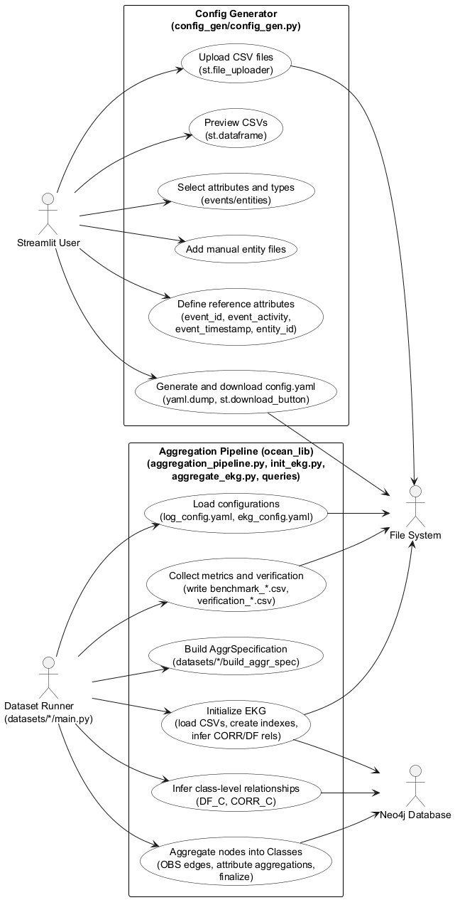
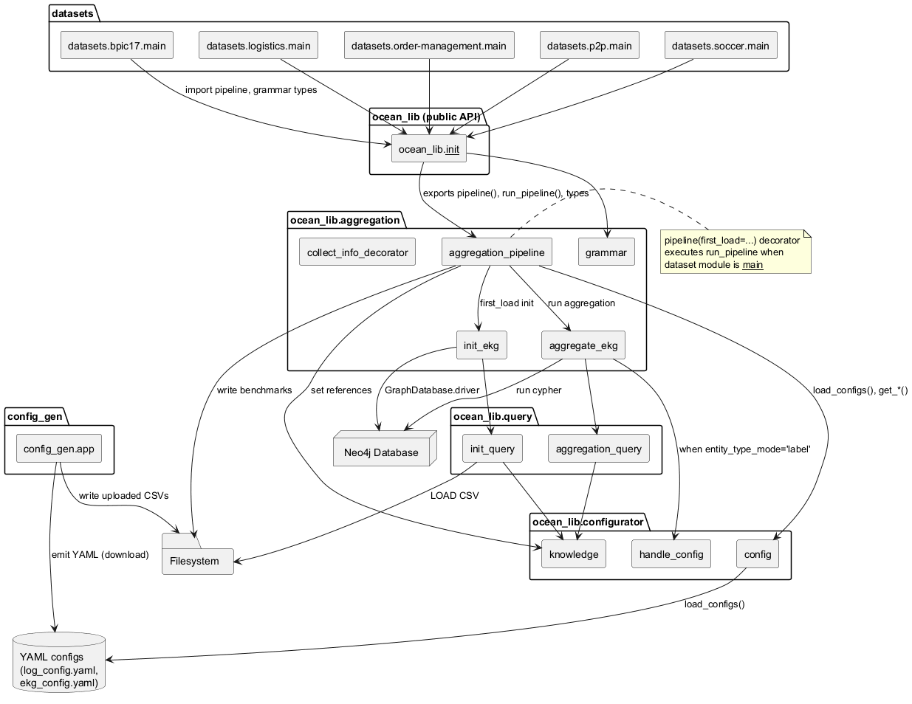
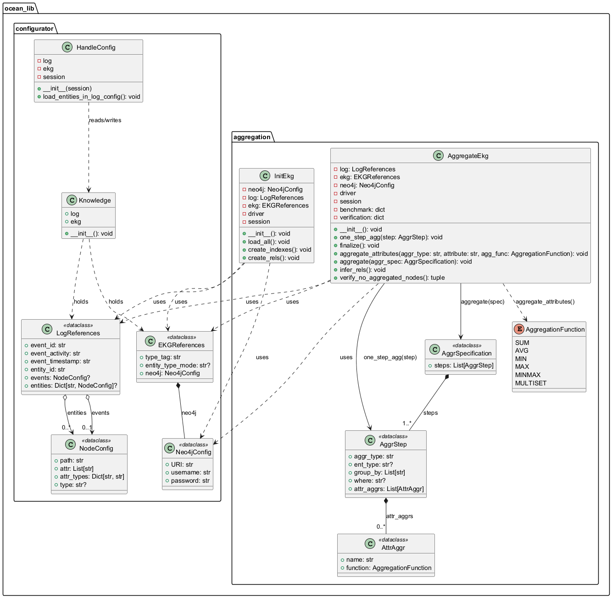
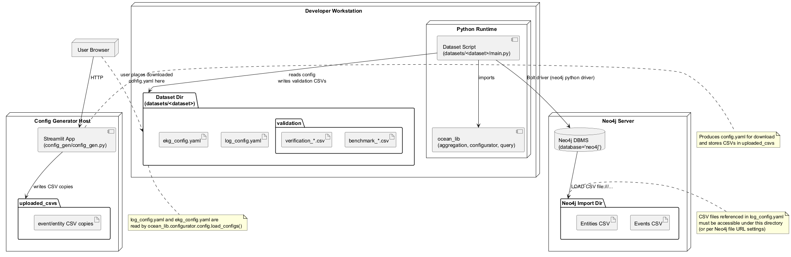

 

% 1 — System Overview
# SECTION 1 — System Overview

This section introduces the purpose, scope, and principal capabilities of the software system as implemented in the provided repository. The description is grounded in the actual source code and is intended to be understandable by both technical and non-technical stakeholders.

The repository implements an aggregation framework for Event Knowledge Graphs (EKGs) persisted in Neo4j. The core library (ocean_lib) provides facilities to: i) load event and entity data from CSV files into Neo4j with typed attributes, ii) infer base relationships between events and entities (CORR) and event sequences (DF), iii) define and execute aggregation pipelines that group events and entities into higher-level “Class” nodes according to configurable specifications, and iv) compute attribute-level aggregations on these classes. The library also derives “class-level” relationships (DF_C and CORR_C) from underlying event-level links to enable higher-level analysis and visualization. Execution metrics and verification counts are collected automatically around each aggregation phase and exported as CSV for validation.

The system’s scope spans three cohesive parts. First, a reusable Python package (ocean_lib) contains the runtime pipeline, configuration model, Neo4j queries, and aggregation logic. Second, a set of dataset-specific drivers (datasets/*/main.py) demonstrate how to declare aggregation specifications using a concise domain grammar (AggrStep, AggrSpecification, AttrAggr, AggregationFunction) and run the end-to-end pipeline, including optional first-load initialization of the database. Third, a Streamlit-based configuration generator (config_gen/config_gen.py) supports non-technical users in preparing log_config.yaml by uploading CSVs, previewing columns, selecting attributes to retain, and assigning basic data types; the generated YAML is then consumed by the pipeline.

At runtime, the pipeline reads two YAML configurations (log_config.yaml and ekg_config.yaml) from the dataset directory, loads them into shared knowledge, and, on first load, imports CSV data into Neo4j as Event and Entity nodes using type-aware conversion rules. It creates or refreshes indexes on commonly queried properties (event activity, entity identifiers, and type tags), infers CORR relationships between events and entities by parsing event-side references, and constructs per-entity DF edges ordered by event timestamps. Aggregation steps are then executed: for Event steps, events are grouped by activity and optionally by correlated entity classes; for Entity steps, entities are grouped by selected attributes and optionally by type tags (supporting both “label” and “property” modes for entity typing). Each group becomes a Class node linked via OBS edges to its source nodes, and configured attribute aggregations (SUM, AVG, MIN, MAX, MINMAX, MULTISET) are computed and stored on these classes. The system finalizes singleton classes for any nodes not captured by previous steps and derives DF_C and CORR_C edges between classes to reflect higher-level behavior. Throughout execution, decorators collect timing and verification data (counts of not-yet-aggregated nodes before and after each phase), which are written to dataset-local validation outputs.

The codebase reflects a clear separation of concerns. The configurator package defines typed configuration models and a thin knowledge holder, including dynamic enrichment of known entity types when operating in “label” mode. The query package encapsulates the exact Cypher statements, generated according to the current configuration (e.g., type tag handling, grouping attributes, and where clauses). The aggregation package orchestrates initialization, step-wise aggregation, relationship inference, and metrics collection—exposing a pipeline decorator that wires dataset-provided specifications into the standard run sequence. The datasets folder contributes concrete, real-world aggregation scenarios spanning BPIC’17, logistics, order management, procure-to-pay, and soccer data, illustrating varied group-by strategies, filters, and attribute aggregations. The setup script packages ocean_lib for reuse, and the library’s public API exposes the pipeline decorator and aggregation grammar required to author new datasets or integrate the engine in external systems.

Overall, the implemented system is a focused, end-to-end solution for building, aggregating, and validating Event Knowledge Graphs in Neo4j from CSV sources. It enables both technical and non-technical users to configure data ingestion, declare aggregation logic succinctly, and obtain class-level structures and relationships together with execution evidence suitable for verification and benchmarking.

% 2 — Architectural Context
## 2. Architectural Context

This section describes the runtime environment surrounding the system, focusing on external systems, visible interfaces, data sources, and the actors that interact with the code as evidenced by the repository. It is limited strictly to elements present in the source code and configuration conventions that the code enforces.

### External Systems

- Neo4j graph database accessed via the official Neo4j Python Driver (neo4j.GraphDatabase). The code opens a session against the "neo4j" database, executes Cypher queries, and relies on LOAD CSV with file:// URLs.
- Local filesystem used for reading YAML configuration files, reading/writing CSV files, and persisting output CSV reports.
- Streamlit runtime providing an interactive UI for generating a log configuration YAML from uploaded CSV files.

### APIs / Interfaces

- ocean_lib public API (ocean_lib/__init__.py):
  - run_pipeline(config_dir, out_dir, aggr_spec_fn, first_load=False): Executes the full pipeline (optionally initial Neo4j load/indexation, aggregation, relationship inference) and writes verification/benchmark CSVs to out_dir.
  - pipeline(first_load=False, out_dir='validation'): Decorator that, when the decorated function is executed in a module that is __main__, invokes run_pipeline using the module directory as config_dir and {module_dir}/validation as out_dir.
  - Aggregation grammar:
    - AggrStep(aggr_type, ent_type, group_by, where, attr_aggrs)
    - AggrSpecification(steps)
    - AggregationFunction {SUM, AVG, MIN, MAX, MINMAX, MULTISET}
- Dataset-specific aggregation specifications (datasets/*/main.py):
  - Each dataset defines build_aggr_spec(log, ekg) decorated with @pipeline(first_load=...), returning an AggrSpecification comprising AggrStep instances. This is the extension point for clients of ocean_lib.
- Configuration format and access (ocean_lib/configurator/config.py):
  - Expected files in the config_dir: log_config.yaml and ekg_config.yaml.
  - Log configuration (LogReferences) requires: event_id, event_activity, event_timestamp, entity_id, events (NodeConfig), entities (Dict[str, NodeConfig]).
  - EKG configuration (EKGReferences) requires: type_tag, entity_type_mode ("property" or "label"), and neo4j connection (URI, username, password).
  - Accessors: load_configs(base_path), get_log_config(), get_ekg_config().
- Streamlit-based configuration generator (config_gen/config_gen.py):
  - Interactive UI to upload CSV files, preview them, select attributes and types, and generate a YAML with keys matching the LogReferences structure (intended as log_config.yaml). It does not generate ekg_config.yaml.
- Internal Neo4j/Cypher query interface (ocean_lib/query/*.py):
  - init_query.py constructs Cypher for LOAD CSV, index management, and inferring CORR/DF relationships.
  - aggregation_query.py constructs Cypher for aggregating Events/Entities into Class nodes, attribute aggregations, finalization of singleton classes, and class-level DF/CORR relationships.
- Pipeline and execution (ocean_lib/aggregation/aggregation_pipeline.py):
  - When first_load=True, performs initial load/index/inference via InitEkg (load_all, create_indexes, create_rels).
  - Aggregation/verification via AggregateEkg (aggregate steps, infer_rels, write benchmark_*.csv and verification_*.csv).
  - Global knowledge propagation via knowledge.log and knowledge.ekg.

### Data Sources

- CSV event and entity files:
  - Provided by the user either via the Streamlit UI (saved under uploaded_csvs/) or via paths specified in log_config.yaml.
  - Loaded into Neo4j with LOAD CSV WITH HEADERS FROM "file:///{path}" using the path fields from NodeConfig (events.path and entities[...].path). These must be accessible to the Neo4j file import subsystem.
- YAML configuration files required at runtime:
  - log_config.yaml containing LogReferences and NodeConfig entries (events and entities with attr and attr_types).
  - ekg_config.yaml containing EKGReferences and Neo4j connection details. This file is not produced by the Streamlit UI and must be supplied separately.
- Pipeline outputs:
  - CSV reports written to the dataset directory’s validation/ subfolder: benchmark_{timestamp}.csv and verification_{timestamp}.csv, reflecting execution timings and counts of not-yet-aggregated nodes before/after each step.

### Users / Actors

- Interactive user operating the Streamlit application to upload CSV files, select attribute subsets and types, and download a generated YAML configuration for the log (intended as log_config.yaml).
- Pipeline operator executing dataset scripts as main modules (datasets/bpic17/main.py, datasets/logistics/main.py, datasets/order-management/main.py, datasets/p2p/main.py, datasets/soccer/main.py). When run as __main__, the @pipeline decorator triggers the pipeline using the current module’s directory for configuration and outputs.

% 2.1 — Architectural Context – Use Case Diagram
## Section 2.1 — Architectural Context – Use Case Diagram

This section presents the system’s external interactions and primary user-visible behaviors, derived strictly from the codebase. It captures how two entry points are used: the Streamlit-based configuration generator and the dataset-specific aggregation pipelines built on ocean_lib. External dependencies (Neo4j and the local file system) are included to reflect actual runtime interactions, queries, and I/O performed by the implementation.

Figure: Figure-2-1-Use-Case-Diagram.puml

% 3 — Containers
## 3. Containers

This section identifies the deployable and runtime containers present in the codebase, their responsibilities, core technologies, and communication mechanisms. It reflects the concrete entry points and external services required to execute the aggregation pipeline and related tooling. The list is exhaustive with respect to the provided source code.

Table 3.1 — Runtime Containers

| Container | Responsibility | Technology | Communication |
|---|---|---|---|
| Config Generator (Streamlit App) | Interactive UI to upload multiple CSV files, preview data, select attributes and types, and generate a log configuration (YAML). Persists uploaded CSVs under uploaded_csvs and offers YAML download. | Python 3, Streamlit, pandas, PyYAML (config_gen/config_gen.py) | HTTP between browser and Streamlit server; local filesystem read/write for CSV and YAML; no database/network calls to Neo4j. |
| BPIC17 Aggregation Application | Defines the aggregation specification for BPIC17 and, when executed as __main__, runs the pipeline to perform class aggregations and relationship inference against an existing EKG, exporting benchmark and verification CSVs. | Python 3, ocean_lib (pipeline, AggrSpecification, AggrStep), Neo4j Python Driver (datasets/bpic17/main.py) | Bolt (Neo4j driver) to Neo4j; local filesystem read of log_config.yaml and ekg_config.yaml in datasets/bpic17, and write of validation/benchmark_*.csv and validation/verification_*.csv. |
| Logistics Aggregation Application | Defines the logistics-specific aggregation steps and runs the same pipeline behavior when executed as __main__. | Python 3, ocean_lib, Neo4j Python Driver (datasets/logistics/main.py) | Bolt to Neo4j; filesystem read of configuration YAMLs in datasets/logistics; writes validation CSV outputs. |
| Order Management Aggregation Application | Defines order-management aggregation steps and runs the pipeline when executed as __main__. | Python 3, ocean_lib, Neo4j Python Driver (datasets/order-management/main.py) | Bolt to Neo4j; filesystem read of configuration YAMLs in datasets/order-management; writes validation CSV outputs. |
| P2P Aggregation Application | Defines P2P aggregation steps and runs the pipeline when executed as __main__. | Python 3, ocean_lib, Neo4j Python Driver (datasets/p2p/main.py) | Bolt to Neo4j; filesystem read of configuration YAMLs in datasets/p2p; writes validation CSV outputs. |
| Soccer Aggregation Application | Defines soccer aggregation steps and runs the pipeline when executed as __main__. | Python 3, ocean_lib, Neo4j Python Driver (datasets/soccer/main.py) | Bolt to Neo4j; filesystem read of configuration YAMLs in datasets/soccer; writes validation CSV outputs. |
| InitEkg CLI Utility | Standalone utility that connects to Neo4j to load Events/Entities from CSV via Cypher LOAD CSV, (re)creates indexes, and infers initial CORR and DF relationships. Can be invoked directly as a script. | Python 3, ocean_lib (InitEkg), Neo4j Python Driver (ocean_lib/aggregation/init_ekg.py) | Bolt to Neo4j; Neo4j LOAD CSV file:/// from the Neo4j server’s filesystem/import path; reads ekg/log configuration via ocean_lib.configurator.config. |
| Neo4j Graph Database | Persistent graph store hosting Event, Entity, and Class nodes, as well as OBS, CORR, DF, DF_C, and CORR_C relationships. Executes Cypher for loading, indexing, aggregation, and relationship inference. | Neo4j Server (database="neo4j") | Bolt protocol serving clients (aggregation applications and InitEkg); LOAD CSV file:/// reads CSVs from server-accessible filesystem; no outbound calls. |

Introduction notes:
- The five dataset-specific applications are independent entry points that use the shared ocean_lib pipeline. In this codebase they are configured with first_load=False and therefore expect data to be already present in Neo4j; they perform aggregation and relationship inference and export timing/verification CSVs.
- The InitEkg CLI Utility encapsulates initial data load and indexing activities and can be run independently when seeding Neo4j from CSVs.
- The Config Generator is an optional tooling container to produce the log configuration YAML from user-provided CSVs; it does not interact with Neo4j.

% 3.1 — Architecture Overview – Component Diagram
# SECTION 3.1 — Architecture Overview – Component Diagram

This section presents the component-level architectural overview of the aggregation system centered on the ocean_lib package. It identifies all modules present in the codebase, their responsibilities, and the explicit runtime and configuration dependencies observable in the implementation. The diagram and catalog are intended to be validated against the repository and to guide both developers and integrators on how dataset-specific pipelines interact with the core library, configuration, and Neo4j.

## Figure 3.1.1 — Component Diagram

The following PlantUML component diagram reflects the actual modules and their interactions found in the repository. It highlights:
- Dataset-specific pipelines that import the public API.
- The orchestration performed by the pipeline decorator and runtime.
- Configuration loading through YAML files.
- Cypher query generation and execution against Neo4j.
- Optional configuration generation via the Streamlit tool.

## Component Catalog

The table below lists every module present in the repository, its key responsibilities, provided APIs, and main dependencies as observed in the code.

| Component | File(s) | Responsibilities | Key provided API | Depends on |
|---|---|---|---|---|
| Streamlit Config Generator | config_gen/config_gen.py | Interactive Streamlit app to upload CSVs, infer attribute types, let users select attributes, and generate a downloadable YAML configuration for logs. Writes uploaded CSVs to disk. | UI for CSV preview and selection; YAML emission (as text download) | streamlit, pandas, yaml, os |
| Dataset pipeline (BPIC17) | datasets/bpic17/main.py | Defines build_aggr_spec returning AggrSpecification; imports public API. | build_aggr_spec(log, ekg) | ocean_lib (pipeline, AggrSpecification, AggrStep) |
| Dataset pipeline (Logistics) | datasets/logistics/main.py | Defines AggrSpecification with AttrAggr and AggregationFunction; imports public API. | build_aggr_spec(log, ekg) | ocean_lib (pipeline, AggrSpecification, AggrStep, AttrAggr, AggregationFunction) |
| Dataset pipeline (Order Management) | datasets/order-management/main.py | Defines multiple entity and event steps with where clauses; imports public API. | build_aggr_spec(log, ekg) | ocean_lib (pipeline, AggrSpecification, AggrStep, AttrAggr, AggregationFunction) |
| Dataset pipeline (P2P) | datasets/p2p/main.py | Defines AggrSpecification with date filters and joins; imports public API. | build_aggr_spec(log, ekg) | ocean_lib (pipeline, AggrSpecification, AggrStep, AttrAggr, AggregationFunction) |
| Dataset pipeline (Soccer) | datasets/soccer/main.py | Provides several alternative AggrSpecifications; returns one; imports public API. | build_aggr_spec(log, ekg) | ocean_lib (pipeline, AggrSpecification, AggrStep, AttrAggr, AggregationFunction) |
| Public API | ocean_lib/__init__.py | Exposes run_pipeline, pipeline decorator, and grammar types as package-level API. | run_pipeline, pipeline, AggrStep, AggrSpecification, AggregationFunction | ocean_lib.aggregation.aggregation_pipeline, ocean_lib.aggregation.grammar |
| Aggregation Orchestration | ocean_lib/aggregation/aggregation_pipeline.py | Loads YAML configs, initializes knowledge, optionally initializes Neo4j content, runs aggregation end-to-end, writes benchmark and verification CSVs. Offers the pipeline decorator that auto-runs when a dataset module is __main__. | run_pipeline(config_dir, out_dir, aggr_spec_fn, first_load), pipeline(first_load, out_dir) | configurator.config, configurator.knowledge, aggregation.init_ekg, aggregation.aggregate_ekg, pandas, os, time, datetime, inspect |
| Aggregation Execution | ocean_lib/aggregation/aggregate_ekg.py | Connects to Neo4j, executes aggregation steps (classes and attributes), finalizes singleton classes, infers relationships, collects metrics and verification data, and conditionally loads entity types when entity_type_mode is label. | aggregate(AggrSpecification), one_step_agg(AggrStep), finalize(), infer_rels(), aggregate_attributes(), verify_no_aggregated_nodes() | neo4j GraphDatabase, query.aggregation_query, configurator.knowledge, configurator.handle_config, aggregation.collect_info_decorator |
| Metrics Decorator | ocean_lib/aggregation/collect_info_decorator.py | Decorator that measures execution time and counts not-yet-aggregated nodes before/after a step, storing results on the AggregateEkg instance. | collect_metrics(step_key) | time |
| Aggregation Grammar | ocean_lib/aggregation/grammar.py | Defines data structures for aggregation: AttrAggr, AggrStep, AggrSpecification, and AggregationFunction. | AggregationFunction, AttrAggr, AggrStep, AggrSpecification | dataclasses, enum, typing |
| EKG Initialization | ocean_lib/aggregation/init_ekg.py | Loads Events and Entities from CSVs into Neo4j, (re)creates indexes, infers CORR and DF relationships. | load_all(), create_indexes(), create_rels() | configurator.config (get_*), neo4j GraphDatabase, query.init_query, time |
| Configuration Model and Loader | ocean_lib/configurator/config.py | Defines dataclasses for log and EKG references; loads log_config.yaml and ekg_config.yaml into typed structures; exposes getters. | load_configs(base_path), get_log_config(), get_ekg_config(); dataclasses: NodeConfig, LogReferences, Neo4jConfig, EKGReferences | yaml, os, typing, dataclasses |
| Config Runtime Knowledge | ocean_lib/configurator/knowledge.py | Global mutable holder for current log and ekg references used across modules. | knowledge (with fields: log, ekg) | — |
| Config Handler (Entity types) | ocean_lib/configurator/handle_config.py | When entity_type_mode is label, queries Neo4j to discover entity labels and updates knowledge.log.entities accordingly. | load_entities_in_log_config() | configurator.knowledge, Neo4j session |
| Query Builders (Aggregation) | ocean_lib/query/aggregation_query.py | Builds Cypher for aggregation: class creation for events/entities, attribute aggregation, finalization, and class-level DF and CORR relations; uses knowledge for LOG/EKG metadata. | generate_cypher_from_step_q(step), aggregate_nodes(), aggregate_events_with_entities_q(), aggregate_attributes(), finalize_c_q(), generate_df_c_q(), generate_corr_c_q(), count_not_aggregated_nodes_q(), finalize_c_noobs_q(); helpers: LOG(), EKG(), translate_aggr_function() | configurator.knowledge, aggregation.grammar |
| Query Builders (Init/Load) | ocean_lib/query/init_query.py | Builds Cypher for indexes, DF/CORR inference, and LOAD CSV statements for Events and Entities; uses knowledge for LOG/EKG metadata. | get_indexes_q(), drop_index_q(), create_index_q(), infer_corr_q(), infer_df_q(), load_log_q(); helpers: LOG(), EKG() | configurator.knowledge, aggregation.grammar |
| Packaging | setup.py | Python packaging metadata and dependencies. | setup() invocation | setuptools, requirements.txt |

## Notes for Validation

- Dataset modules import from ocean_lib at package root; this is enabled by ocean_lib/__init__.py exporting pipeline and grammar types.
- The pipeline decorator triggers run_pipeline only when the dataset module is executed as the main module, as implemented in aggregation_pipeline.pipeline via inspect.
- Configuration is strictly file-based at runtime: load_configs reads log_config.yaml and ekg_config.yaml from the dataset directory (or provided base path). The Streamlit config_gen app is a separate tool producing a YAML the user can save; there is no programmatic link in the codebase.
- All Cypher statements are constructed centrally in query.init_query and query.aggregation_query, and executed via neo4j.GraphDatabase sessions in init_ekg and aggregate_ekg, respectively.
- Metrics and verification CSVs are written to out_dir by aggregation_pipeline after aggregate_ekg completes, using the in-memory dictionaries filled by the collect_metrics decorator.

% 4 — Components
## 4. Components

This section decomposes the codebase into its internal components and explains each component’s purpose and its collaboration with others. Components are identified at module, class, and function level to reflect the actual implementation. Interactions describe concrete dependencies such as imports, function calls, shared singletons, database sessions, I/O, and decorator behaviors, enabling validation against the source code.

| Component | Responsibility | Interactions |
|---|---|---|
| config_gen/config_gen.py (module) | Streamlit UI to generate a log/ekg configuration YAML by uploading CSV files, inferring attribute types, and letting users select attributes for events and entities. Persists uploaded files and exposes a downloadable config.yaml. | [streamlit, pandas, yaml, os, st.file_uploader, st.dataframe, st.columns, st.checkbox, st.selectbox, st.text_input, st.download_button, pd.read_csv, pd.to_datetime, pd.isna, os.makedirs, open(..., "wb")] |
| config_gen/config_gen.py: infer_type(val) | Helper to infer a basic attribute type (String, Integer, Datetime) from a sample value. | [pandas.isna, pandas.to_datetime] |
| datasets/bpic17/main.py: build_aggr_spec(log, ekg) | Defines an aggregation specification with three steps (entities and events) for the BPIC17 dataset. Decorated to run the pipeline when executed as __main__. | [ocean_lib.pipeline, ocean_lib.AggrSpecification, ocean_lib.AggrStep, log.event_activity, ekg.type_tag] |
| datasets/logistics/main.py: build_aggr_spec(log, ekg) | Defines a three-step aggregation spec using entity and event grouping and attribute aggregations for Logistics. | [ocean_lib.pipeline, AggrSpecification, AggrStep, AttrAggr, AggregationFunction, log.event_activity, log.event_timestamp, ekg.type_tag] |
| datasets/order-management/main.py: build_aggr_spec(log, ekg) | Defines a five-step aggregation spec with entity filtering and event time-window splits for Order Management. | [ocean_lib.pipeline, AggrSpecification, AggrStep, AttrAggr, AggregationFunction, log.event_activity, log.event_timestamp, ekg.type_tag] |
| datasets/p2p/main.py: build_aggr_spec(log, ekg) | Defines a four-step aggregation spec with date-based splits and attribute aggregations for P2P. | [ocean_lib.pipeline, AggrSpecification, AggrStep, AttrAggr, AggregationFunction, log.event_activity, ekg.type_tag] |
| datasets/soccer/main.py: build_aggr_spec(log, ekg) | Defines multiple example specs and returns aggr_basic0 (entity and event steps) for Soccer. | [ocean_lib.pipeline, AggrSpecification, AggrStep, AttrAggr, AggregationFunction, log.event_activity, log.event_timestamp] |
| ocean_lib/aggregation/aggregation_pipeline.py (module) | Orchestrates loading configs, initializing the EKG, executing aggregation and relationship inference, and exporting benchmark/verification CSVs. Provides the pipeline decorator that auto-runs when a dataset main is executed as __main__. | [os, inspect, time, datetime, pandas, config.load_configs, knowledge.log/ekg, InitEkg, AggregateEkg, AggrSpecification] |
| aggregation_pipeline.run_pipeline(config_dir, out_dir, aggr_spec_fn, first_load=False) | Loads configuration, writes outputs, optionally initializes the DB, builds the aggregation specification by invoking the provided function, and executes aggregation and relationship inference. | [config.load_configs, knowledge.log, knowledge.ekg, os.makedirs, InitEkg.load_all, InitEkg.create_indexes, InitEkg.create_rels, AggregateEkg.aggregate, AggregateEkg.infer_rels, pandas.DataFrame.from_dict, to_csv] |
| aggregation_pipeline.pipeline(first_load=False, out_dir='validation') | Decorator factory to wrap a spec-builder function; when the function’s module is __main__, it runs the full pipeline with the module’s directory as config_dir. | [functools.wraps, inspect.getmodule, inspect.getsourcefile, os.path.abspath, run_pipeline] |
| ocean_lib/aggregation/aggregate_ekg.py (module) | Aggregation executor over Neo4j: prepares session, runs step-by-step and finalization queries, infers relationships, and collects metrics and verification counters via decorator. | [neo4j.GraphDatabase, collect_info_decorator.collect_metrics, configurator.knowledge, configurator.handle_config.HandleConfig, query.aggregation_query as q_lib] |
| AggregateEkg.__init__(self) | Initializes Neo4j driver/session, reads shared knowledge (log/ekg), optionally loads entity types from existing graph when entity_type_mode is "label". | [knowledge.log, knowledge.ekg, GraphDatabase.driver, driver.verify_connectivity, driver.session, HandleConfig.load_entities_in_log_config] |
| AggregateEkg.one_step_agg(self, step) | Executes a single aggregation step: generates and runs Cypher, then optionally aggregates attributes. Benchmarked via decorator. | [q_lib.generate_cypher_from_step_q, session.run, self.aggregate_attributes, AttrAggr.name, AttrAggr.function] |
| AggregateEkg.finalize(self) | Creates singleton Class nodes for non-observed events/entities. Benchmarked via decorator. | [q_lib.finalize_c_q('Event'), q_lib.finalize_c_q('Entity'), session.run] |
| AggregateEkg.aggregate_attributes(self, aggr_type, attribute, agg_func) | Generates and runs attribute aggregation Cypher for the current Class grouping. | [q_lib.aggregate_attributes, session.run] |
| AggregateEkg.aggregate(self, aggr_spec) | Runs all steps sequentially and finalizes. Benchmarked via decorator. | [self.one_step_agg, self.finalize, AggrSpecification.steps] |
| AggregateEkg.infer_rels(self) | Infers class-level DF and CORR relationships from observed event/entity relations. Benchmarked via decorator. | [q_lib.generate_df_c_q, q_lib.generate_corr_c_q, session.run] |
| AggregateEkg.verify_no_aggregated_nodes(self) | Counts nodes without OBS relationships for verification. | [q_lib.count_not_aggregated_nodes_q, session.run, Cursor.single] |
| ocean_lib/aggregation/collect_info_decorator.py (module) | Provides a decorator to collect timing and verification metrics around methods on classes that implement verify_no_aggregated_nodes and maintain benchmark/verification dicts. | [time.time, functools.wraps] |
| collect_info_decorator.collect_metrics(step_key) | Decorator factory: records initial/final counts of non-aggregated nodes, measures duration, stores metrics keyed by step label. | [wrapped_self.verify_no_aggregated_nodes, wrapped_self.benchmark, wrapped_self.verification] |
| ocean_lib/aggregation/grammar.py (module) | Domain grammar for aggregations: enum for aggregation functions and dataclasses for attribute agg, steps, and specifications. | [dataclasses.dataclass, enum.Enum, typing.List, typing.Optional] |
| AggregationFunction (Enum) | Defines aggregation functions: SUM, AVG, MIN, MAX, MINMAX, MULTISET. | [used by query generation and dataset specs] |
| AttrAggr (dataclass) | Attribute aggregation descriptor: name and function. | [used by AggrStep and AggregateEkg.aggregate_attributes] |
| AggrStep (dataclass) | Aggregation step descriptor: aggr_type, ent_type, group_by, where, attr_aggrs. | [consumed by query.aggregation_query.generate_cypher_from_step_q] |
| AggrSpecification (dataclass) | Sequence of AggrStep items. | [iterated by AggregateEkg.aggregate] |
| ocean_lib/aggregation/init_ekg.py (module) | Initializes the EKG in Neo4j: loads CSVs, creates indexes, and infers base CORR and DF relationships from raw logs. | [config.get_log_config, config.get_ekg_config, neo4j.GraphDatabase, query.init_query as q_lib, time.sleep] |
| InitEkg.__init__(self) | Establishes connection to Neo4j and loads log/ekg references. | [get_log_config, get_ekg_config, GraphDatabase.driver, driver.verify_connectivity, driver.session] |
| InitEkg.load_all(self) | Loads Event and Entity nodes from CSV files with typed properties based on log config. | [q_lib.load_log_q, session.run, self.log.events.attr, self.log.entities] |
| InitEkg.create_indexes(self) | Drops existing indexes and creates indexes for Entity and Event properties as well as Class(Name). | [q_lib.get_indexes_q, q_lib.drop_index_q, q_lib.create_index_q, session.run] |
| InitEkg.create_rels(self) | Infers CORR and DF relationships per entity type in transactions. | [q_lib.infer_corr_q, q_lib.infer_df_q, session.begin_transaction, tx.run] |
| init_ekg: __main__ block | Standalone initializer invoking load_all, create_indexes, and create_rels with sleep between. | [InitEkg, time.sleep] |
| ocean_lib/configurator/config.py (module) | Loads YAML config into typed dataclasses for log and EKG references; provides global accessors. | [os.path, yaml.safe_load, dataclasses.dataclass, typing.Dict, typing.List, typing.Optional] |
| NodeConfig (dataclass) | Configuration for a node set (events or a specific entity type): path, attribute lists, and types. | [constructed in load_configs] |
| LogReferences (dataclass) | Log reference names (IDs, activity, timestamp) and NodeConfig mappings. | [global LOG_REFERENCES] |
| Neo4jConfig (dataclass) | Connection details for Neo4j. | [embedded in EKGReferences] |
| EKGReferences (dataclass) | EKG-level references including type_tag, entity_type_mode, and Neo4j connection. | [global EKG_REFERENCES] |
| load_configs(base_path=None) | Reads log_config.yaml and ekg_config.yaml; materializes dataclasses and sets module-level globals. | [yaml.safe_load, NodeConfig mappings, Neo4jConfig, LogReferences, EKGReferences] |
| get_log_config() | Returns loaded LOG_REFERENCES or raises if not loaded. | [LOG_REFERENCES] |
| get_ekg_config() | Returns loaded EKG_REFERENCES or raises if not loaded. | [EKG_REFERENCES] |
| ocean_lib/configurator/handle_config.py (module) | Dynamically populates log.entities from the live graph based on entity_type_mode by querying Neo4j. | [knowledge, session.run] |
| HandleConfig.__init__(self, session) | Captures current log/ekg knowledge and Neo4j session. | [knowledge.log, knowledge.ekg] |
| HandleConfig.load_entities_in_log_config(self) | Queries the graph for distinct entity types (by property or label), updates log.entities, and refreshes knowledge. | [session.run, knowledge.log] |
| ocean_lib/configurator/knowledge.py (module) | Defines a shared knowledge singleton to pass log and EKG references across modules without tight coupling. | [global instance] |
| Knowledge class and knowledge instance | Holds two fields: log and ekg. | [mutated by config.load_configs, handle_config, aggregation_pipeline] |
| ocean_lib/query/aggregation_query.py (module) | Translates aggregation specs and context into Cypher to create Class nodes, OBS edges, attribute aggregations, and class-level DF/CORR edges; provides verification queries. | [knowledge, grammar, configurator references] |
| aggregation_query.EKG(), LOG() | Helpers to access shared EKG and log references from knowledge. | [knowledge.ekg, knowledge.log] |
| translate_aggr_function(attr, func) | Maps AggregationFunction to Cypher expressions/fragments (including MINMAX and MULTISET forms). | [AggregationFunction enum] |
| generate_cypher_from_step_q(step) | Builds a full Cypher query for a single step, selecting match strategy based on entity_type_mode and aggr_type; delegates to aggregate_nodes. | [EKG().entity_type_mode, aggregate_nodes] |
| aggregate_nodes(node_type, group_by, where) | Constructs grouping, value synthesis, Class MERGE, and OBS creation for Event/Entity nodes; adapts to type_tag handling. | [LOG().event_id, LOG().entity_id, LOG().event_activity, EKG().type_tag, aggregate_events_with_entities_q] |
| aggregate_events_with_entities_q(group_by, where) | For event aggregation, resolves correlated entity classes and composes a stable group value with COALESCE fallback; collects event IDs. | [LOG().event_id, LOG().event_activity, EKG().type_tag] |
| aggregation_query.aggregate_attributes(aggr_type, attribute, agg_func) | Generates Cypher to compute and set aggregated attribute(s) on Class nodes for Events or Entities. | [translate_aggr_function] |
| finalize_c_q(node_type) | Creates singleton Class and OBS edges for nodes without aggregation; handles both Event and Entity modes. | [LOG().event_activity, LOG().event_id, LOG().entity_id, EKG().type_tag] |
| generate_df_c_q() | Builds class-level DF_C relationships by folding event-level DF edges filtered per entity type mode. | [EKG().type_tag] |
| generate_corr_c_q() | Builds class-level CORR_C relationships by lifting event-to-entity CORR via observed classes. | [Cypher MATCH/MERGE] |
| count_not_aggregated_nodes_q(node_type) | Counts nodes lacking OBS edges for verification. | [Cypher query] |
| finalize_c_noobs_q(node_type) | Alternative singleton finalization based on Class.Ids coverage, not used elsewhere in the code. | [LOG(), EKG()] |
| ocean_lib/query/init_query.py (module) | Generates initialization Cypher for indexes, CSV loads with typed casting, and infers base CORR/DF at event level. | [knowledge, grammar] |
| init_query.EKG(), LOG() | Helpers to access EKG and log references. | [knowledge] |
| get_indexes_q(), drop_index_q(index_name), create_index_q(node_type, index_name) | Utility queries for index management. | [Cypher DSL] |
| infer_corr_q(entity) | Creates CORR edges from events to entities by splitting multi-valued IDs in event properties. | [LOG().entity_id, EKG().type_tag, Cypher split/UNWIND] |
| infer_df_q(entity) | Orders correlated events per entity and creates DF edges with type and ID metadata. | [EKG().type_tag, LOG().entity_id, eventDatetime property] |
| load_log_q(node_type, path, log_name, header_data, type=None) | Builds Neo4j LOAD CSV query with typed property casting based on attr_types; injects EKG type_tag for entities. | [LOG().events/entities.attr_types, EKG().type_tag, yaml-derived types] |
| ocean_lib/__init__.py (module) | Exposes library API surface for consumers: run_pipeline, pipeline, and grammar types. | [from .aggregation.aggregation_pipeline import run_pipeline, pipeline; from .aggregation.grammar import *; __all__] |
| setup.py (module) | Packaging metadata and installation requirements discovery for ocean_lib. | [setuptools.setup, find_packages, open("requirements.txt").readlines()] |

This component breakdown reflects the complete codebase, including all modules, classes, and functions, and their concrete inter-module interactions as implemented.

% 5 — Code-Level View
# Section 5 — Code-Level View

This section details how the implemented source code realizes the architectural elements of the system. It maps logical components to concrete modules, identifies entry points and execution flow, clarifies responsibilities and dependencies of each class and function, and highlights recognizable design patterns. The goal is to enable developers and integrators to validate the documentation against the codebase and navigate the implementation confidently.

## 5.1 Source Tree and Modules

The repository comprises a reusable aggregation library (ocean_lib), dataset-specific pipelines, and a separate configuration generator UI. The table below enumerates every file, its key public types and functions, responsibilities, and external dependencies.

| Path | Module / Script | Public types / functions | Responsibility | External dependencies |
|---|---|---|---|---|
| config_gen/config_gen.py | config_gen | infer_type(val) | Streamlit UI to generate log_config.yaml from uploaded CSVs. Enables attribute selection and type inference, detects an event CSV, and emits a YAML configuration for events and entities. | streamlit, pandas, yaml, os |
| datasets/bpic17/main.py | datasets.bpic17.main | build_aggr_spec(log, ekg) | Dataset-specific aggregation spec. Returns AggrSpecification with ENTITIES and EVENTS steps for Invoice and event activity. | ocean_lib (pipeline, grammar) |
| datasets/logistics/main.py | datasets.logistics.main | build_aggr_spec(log, ekg) | Dataset-specific aggregation spec. Demonstrates ENTITIES aggregation with attribute aggregations and EVENTS grouped by activity and Customer_Order. | ocean_lib (pipeline, grammar) |
| datasets/order-management/main.py | datasets.order-management.main | build_aggr_spec(log, ekg) | Dataset-specific aggregation spec. Mixes ENTITIES and EVENTS steps with timestamp-based filters. | ocean_lib (pipeline, grammar) |
| datasets/p2p/main.py | datasets.p2p.main | build_aggr_spec(log, ekg) | Dataset-specific aggregation spec. ENTITIES grouped by type_tag and attributes; EVENTS grouped by activity and entities. | ocean_lib (pipeline, grammar) |
| datasets/soccer/main.py | datasets.soccer.main | build_aggr_spec(log, ekg) | Dataset-specific aggregation spec variants; returns AggrSpecification with ENTITIES and EVENTS; showcases MINMAX and MULTISET attribute aggregations. | ocean_lib (pipeline, grammar) |
| ocean_lib/aggregation/aggregate_ekg.py | ocean_lib.aggregation.aggregate_ekg | class AggregateEkg; methods: one_step_agg, finalize, aggregate_attributes, aggregate, infer_rels, verify_no_aggregated_nodes | Executes aggregation: connects to Neo4j, generates and runs Cypher for steps and attribute aggregations, finalizes singleton classes, infers class-level DF/CORR relationships, and collects metrics. | neo4j, ocean_lib.query, ocean_lib.configurator |
| ocean_lib/aggregation/aggregation_pipeline.py | ocean_lib.aggregation.aggregation_pipeline | run_pipeline(config_dir, out_dir, aggr_spec_fn, first_load); pipeline(first_load=False, out_dir='validation') | Orchestrates pipeline execution: loads YAML configs, initializes DB (optional), executes AggregateEkg, and persists benchmark/verification CSVs. Exposes decorator that autostarts the pipeline when the module is run as a script. | os, inspect, time, datetime, pandas, functools |
| ocean_lib/aggregation/collect_info_decorator.py | ocean_lib.aggregation.collect_info_decorator | collect_metrics(step_key) | Decorator to time execution and record pre/post counts of non-aggregated nodes; stores results on the AggregateEkg instance. | time, functools |
| ocean_lib/aggregation/grammar.py | ocean_lib.aggregation.grammar | AggregationFunction (Enum); AttrAggr; AggrStep; AggrSpecification | Data model of aggregation language (steps, specs, attribute aggregations). | dataclasses, typing, enum |
| ocean_lib/aggregation/init_ekg.py | ocean_lib.aggregation.init_ekg | class InitEkg; methods: load_all, create_indexes, create_rels; script main | Database bootstrap: loads CSV data, (re)creates indexes, infers CORR and DF relations at event level for each entity type. | neo4j, time, ocean_lib.query, ocean_lib.configurator |
| ocean_lib/configurator/config.py | ocean_lib.configurator.config | NodeConfig; LogReferences; Neo4jConfig; EKGReferences; load_configs; get_log_config; get_ekg_config | Loads and type-binds YAML configs (log_config.yaml, ekg_config.yaml) into dataclasses; exposes getters; holds module-level singletons. | os, yaml, dataclasses, typing |
| ocean_lib/configurator/handle_config.py | ocean_lib.configurator.handle_config | class HandleConfig; load_entities_in_log_config | Hydrates dynamic list of entity types into in-memory log config by querying Neo4j, depending on entity_type_mode (property vs label). | knowledge singleton |
| ocean_lib/configurator/knowledge.py | ocean_lib.configurator.knowledge | class Knowledge; knowledge (instance) | Process-wide mutable holder for current log and EKG configs used by query builders. | — |
| ocean_lib/query/aggregation_query.py | ocean_lib.query.aggregation_query | EKG(); LOG(); translate_aggr_function; generate_cypher_from_step_q; aggregate_nodes; aggregate_events_with_entities_q; aggregate_attributes; finalize_c_q; generate_df_c_q; generate_corr_c_q; count_not_aggregated_nodes_q; finalize_c_noobs_q | Generates Cypher for aggregation steps, attribute aggregations, finalization, and class-level DF/CORR relationships driven by knowledge. Handles property vs label entity typing. | ocean_lib.aggregation.grammar; knowledge |
| ocean_lib/query/init_query.py | ocean_lib.query.init_query | EKG(); LOG(); get_indexes_q; drop_index_q; create_index_q; infer_corr_q; infer_df_q; load_log_q | Generates Cypher for initial data load (CSV), index management, event-level DF and CORR edges. | knowledge |
| ocean_lib/__init__.py | ocean_lib | run_pipeline; pipeline; AggrStep; AggrSpecification; AggregationFunction | Library API surface for consumers (datasets). | — |
| setup.py | setup | — | Packaging metadata and dependency loading from requirements.txt. | setuptools |

Notes based on code inspection:
- init_query.infer_df_q orders by e.eventDatetime explicitly, not by the configurable log.event_timestamp; this is a deliberate implementation detail in the current code.
- aggregation_query.finalize_c_q for Entity contains two CREATE variants to support both property and label modes; the selected node bound to c depends on the branch in the template.
- datasets/*/main.py import AttrAggr and AggregationFunction where needed; steps with attr_aggrs=None are accepted (treated as falsy).

## 5.2 Main Entry Points and Execution Flow

The system is invoked in three primary ways, each wired directly in code:

| How to run | Entry target | What triggers execution | Inputs | Outputs |
|---|---|---|---|---|
| Run a dataset pipeline script (e.g., python datasets/p2p/main.py) | datasets.<name>.main:build_aggr_spec decorated with @pipeline | The pipeline decorator inspects the defining module; when __name__ == "__main__", it calls run_pipeline(...) | YAML: datasets/<name>/log_config.yaml and ekg_config.yaml; the build_aggr_spec function | Aggregation jobs executed against Neo4j; CSVs in datasets/<name>/validation: benchmark_<timestamp>.csv and verification_<timestamp>.csv |
| Initialize EKG from code (optional one-off) | ocean_lib/aggregation/init_ekg.py as a script | Standard Python main guard | YAML as above | Loads nodes and relations into Neo4j; (re)creates indexes; prints progress |
| Generate YAML configs interactively | streamlit run config_gen/config_gen.py | Streamlit app lifecycle | Uploaded CSVs; manual attribute selections; form inputs (event_id, event_activity, event_timestamp, entity_id) | Generated YAML displayed and downloadable as config.yaml; uploaded CSVs persisted under uploaded_csvs |

Programmatic execution is also supported by importing ocean_lib.run_pipeline and passing a callable aggr_spec_fn that matches build_aggr_spec(log, ekg).

## 5.3 Component-to-Code Mapping

The implementation cleanly separates concerns across modules. The following table maps logical architectural components to concrete code elements and responsibilities.

| Logical component | Implemented by | Key responsibilities | Interactions |
|---|---|---|---|
| Pipeline Orchestrator | ocean_lib.aggregation.aggregation_pipeline.run_pipeline and pipeline decorator | Load configs, optionally initialize DB, execute aggregation with metrics, persist results | Calls configurator.config.load_configs; sets knowledge; invokes AggregateEkg; writes CSV via pandas |
| Aggregation Grammar | ocean_lib.aggregation.grammar | Defines AggrStep, AttrAggr, AggrSpecification, AggregationFunction | Used by datasets to define specs and by query generators |
| Aggregation Executor | ocean_lib.aggregation.aggregate_ekg.AggregateEkg | Execute per-step aggregation, attribute aggregations, finalization, relationship inference, verification metrics | Uses query.aggregation_query; connects to Neo4j; uses collect_metrics decorator |
| Metrics Collection | ocean_lib.aggregation.collect_info_decorator.collect_metrics | Wrap execution to measure time and node coverage deltas, record per-step benchmarks | Decorates AggregateEkg.one_step_agg, .finalize, .aggregate, .infer_rels |
| EKG Initializer | ocean_lib.aggregation.init_ekg.InitEkg | Load CSV data into Neo4j, create indexes, infer event-level DF/CORR | Uses query.init_query; driven by YAML via configurator.config getters |
| Query Generators | ocean_lib.query.aggregation_query, ocean_lib.query.init_query | Build Cypher for aggregation/finalization and init operations with property-vs-label semantics | Depend on knowledge.{log, ekg} set by orchestrator |
| Configuration Loader | ocean_lib.configurator.config | Load and bind log_config.yaml and ekg_config.yaml to dataclasses; expose getters; hold singletons | Called by orchestrator; referenced by initializers and aggregators |
| In-memory Knowledge | ocean_lib.configurator.knowledge | Singleton (knowledge) holding current log and ekg configs | Read by query builders; written by orchestrator and handle_config |
| Dynamic Entity Type Loader | ocean_lib.configurator.handle_config.HandleConfig | Populate log.entities at runtime by querying Neo4j for distinct entity types | Used by AggregateEkg when entity_type_mode == "label" |
| Dataset Specifications | datasets/*/main.py | Provide build_aggr_spec(log, ekg) returning AggrSpecification; decorated to autostart | Imported ocean_lib API; executed by decorator |
| Config Generator UI | config_gen/config_gen.py | Produce log_config.yaml from CSVs with user-driven schema and types | Independent of aggregation execution; feeds YAML into datasets |

## 5.4 Key Classes, Functions, and Responsibilities

The core execution path is deterministic and directly traceable in code:

- ocean_lib.aggregation.aggregation_pipeline.pipeline decorator and run_pipeline
  The decorator returns a wrapper of the user’s build_aggr_spec and, if the defining module is the main script, invokes run_pipeline. The run_pipeline procedure loads YAML configs from the dataset directory, stores them into knowledge via configurator.config, and then:
  - Optionally initializes the EKG (InitEkg.load_all, create_indexes, create_rels) when first_load=True.
  - Builds the AggrSpecification by calling the provided build_aggr_spec(log, ekg).
  - Executes aggregation_ekg(aggr_spec), which instantiates AggregateEkg, runs aggregation and relationship inference, and persists benchmark and verification CSVs under a timestamped name in an out_dir (default datasets/<name>/validation).

- ocean_lib.aggregation.aggregate_ekg.AggregateEkg
  The constructor binds to the Neo4j database using EKG references from knowledge, verifies connectivity, and, for entity_type_mode == "label", hydrates knowledge.log.entities via HandleConfig.load_entities_in_log_config.
  The one_step_agg method, decorated with collect_metrics, generates Cypher from a step using query.aggregation_query.generate_cypher_from_step_q and executes it. If step.attr_aggrs is provided, it iterates and executes attribute aggregations via aggregation_query.aggregate_attributes. The finalize method creates singleton Class nodes for Events and Entities without any OBS relationships using aggregation_query.finalize_c_q. The aggregate method executes each step and then finalizes, while infer_rels generates DF_C and CORR_C class-level relationships using query generators. verify_no_aggregated_nodes counts Event/Entity nodes without OBS links.

- ocean_lib.query.aggregation_query
  This module obtains configuration via knowledge-accessors EKG() and LOG(). It translates AggregationFunction to Cypher expressions (translate_aggr_function), builds per-step aggregation Cypher (generate_cypher_from_step_q) by dispatching to aggregate_nodes, and supports:
  - Event aggregation that optionally correlates to entity classes before grouping (aggregate_events_with_entities_q).
  - Entity aggregation with property- vs label-based typing, deriving an aggregation key (Agg) and ID (val), setting class properties (Name, Origin, ID, Agg, Where, and optionally type_tag), and creating OBS edges.
  - Attribute aggregations that compute and set class properties.
  - Finalization (finalize_c_q) adding singleton Class nodes and OBS links for non-aggregated nodes.
  - Class-level DF and CORR edges (generate_df_c_q, generate_corr_c_q) collapsing event-level relationships to class-level aggregates.
  - Diagnostics (count_not_aggregated_nodes_q) and an alternative finalize_c_noobs_q for explicit singleton creation.

- ocean_lib.aggregation.init_ekg.InitEkg
  The initializer builds a Neo4j session using configurator getters, runs q_lib.load_log_q to batch-load events and per-entity CSVs as nodes with typed properties derived from attr_types, then:
  - Drops existing indexes, creates indexes on ID and type_tag fields for Entity nodes, event_activity for Event nodes, and entity-specific indexes on Event nodes, plus a Class(Name) index.
  - Infers event-level CORR (by parsing delimited entity IDs) and DF (ordering by eventDatetime for each entity) relations.

- ocean_lib.configurator.config and knowledge
  load_configs reads log_config.yaml and ekg_config.yaml, materializes them into dataclasses:
  - LogReferences: event_id, event_activity, event_timestamp, entity_id, events: NodeConfig, entities: Dict[str, NodeConfig]
  - EKGReferences: type_tag, entity_type_mode, neo4j: Neo4jConfig
  The getters enforce load-before-use. knowledge is a process-wide container (knowledge.log, knowledge.ekg).

- ocean_lib.configurator.handle_config.HandleConfig
  For entity_type_mode == "property", it queries distinct e.Type; for "label", it queries labels(e)[1]; it assigns the list to log.entities and writes it back to knowledge.

- ocean_lib/aggregation/collect_info_decorator.collect_metrics
  Wraps target methods to capture start/end times, counts of nodes without OBS before/after, prints results, and records self.benchmark[step_key] and self.verification[step_key] for CSV export.

- datasets/*/main.py build_aggr_spec
  Each dataset defines a concrete aggregation spec in terms of AggrStep entries. The decorator and orchestrator supply the log and ekg objects holding the dynamic field/tag names. Representative content per dataset (as implemented):
  - bpic17: ENTITIES aggregation for Invoice split by value threshold; EVENTS grouped by activity.
  - logistics: ENTITIES Container with MULTISET/AVG/MINMAX aggregations; EVENTS grouped by activity and Customer_Order (timestamp MINMAX); ENTITIES Vehicle with a date filter.
  - order-management: ENTITIES customers, orders (AVG price with where), employees; EVENTS split into two timestamp windows grouped by activity and entities.
  - p2p: ENTITIES material by type_tag with date thresholds and AVG/SUM attributes; ENTITIES purchase_requisition by Purchasing_Group; EVENTS grouped by activity and both entity types.
  - soccer: Multiple variants defined; returned spec aggregates ENTITIES playerId by role and EVENTS by activity, teamId, playerId with MINMAX timestamp.

- config_gen/config_gen.py
  A Streamlit application that:
  - Accepts multi-file CSV uploads, detects the event file heuristically (largest file or name contains “event”), previews data, allows per-attribute selection and type override.
  - Supports manual entity additions.
  - Accepts free-text mappings for event_id, event_activity, event_timestamp, entity_id.
  - Emits a YAML with structure matching configurator.config expectations and offers a download button. It writes uploaded files to uploaded_csvs.

## 5.5 Inter-Module Dependencies and Data Contracts

The pipeline depends on configuration YAMLs co-located with each dataset script:

- log_config.yaml is bound to LogReferences and must include:
  - event_id, event_activity, event_timestamp, entity_id
  - events: { path, attr[], attr_types{attr: "String"|"Integer"|"Datetime"|"Float"|"Boolean"}, type optional }
  - entities: { <entity_type>: NodeConfig{ path, attr[], attr_types{...}, type } ... }

- ekg_config.yaml is bound to EKGReferences and must include:
  - type_tag (name of the property carrying entity type, e.g., "Type")
  - entity_type_mode ("property" or "label")
  - neo4j: { URI, username, password }

Configurator.load_configs must be called prior to any query generation or DB operations; the orchestrator enforces this. The knowledge singleton is the single source of truth for the current run, read by both query modules.

The entity typing mode influences matching and grouping logic in aggregation_query:
- property mode uses n.<type_tag> equality checks and sets class properties accordingly.
- label mode relies on labels(n)[1] for Entity nodes and adjusts both entity loading and grouping accordingly; AggregateEkg will also populate log.entities dynamically via HandleConfig.

AggregateEkg writes two CSVs per run:
- benchmark_<timestamp>.csv with one “Time (s)” column keyed by step names (including “TOTAL”, “RELATIONSHIPS”, “FINALIZATION”).
- verification_<timestamp>.csv with initial/final counts of non-aggregated Events and Entities per step key.

## 5.6 Recognizable Design and Architectural Patterns

The implemented code exhibits the following explicit patterns derived directly from structure and decorators:

- Pipeline/Orchestrator pattern: run_pipeline coordinates configuration, optional initialization, execution, and reporting in a single sequence.
- Decorator pattern: pipeline for auto-execution when a spec module is run, and collect_metrics for cross-cutting metrics and verification around aggregation and relationship inference.
- Data model pattern with dataclasses: AggrStep, AttrAggr, AggrSpecification define the DSL for aggregation, while LogReferences and EKGReferences define the configuration schema.
- Singleton/service locator: knowledge provides process-wide access to current configuration for query generation.
- Layered separation by concern: configurator (YAML and knowledge), grammar (model), query (Cypher generation), aggregation (execution and orchestration), datasets (spec definitions), and UI (config generator) are encapsulated in distinct modules.

## 5.7 Validation Guidance

A developer can validate this mapping and flow as follows:
- Confirm decorator-triggered execution by running any dataset main.py; observe that validation CSVs are produced under datasets/<name>/validation and that Neo4j operations are executed.
- Inspect knowledge population by adding tracing in configurator.config.load_configs and AggregateEkg.__init__ to observe log/ekg assignments.
- Verify that aggregation_query.generate_cypher_from_step_q outputs Cypher reflecting entity_type_mode and group_by semantics for a given AggrStep.
- Validate that init_query.load_log_q types properties per attr_types in YAML and that init_ekg.create_indexes generates the indexes observed via SHOW INDEXES in Neo4j Browser.
- Use the Streamlit app to produce a YAML whose structure matches configurator.config dataclasses and use it to run a dataset pipeline.

% 5.1 — Class Diagram
# SECTION 5.1 — Class Diagram

This section presents a complete class diagram of the codebase derived directly from the provided source files. It captures all defined classes, their attributes and methods, and the relationships among them. The diagram is intended to help both technical and non-technical stakeholders understand the structural organization of the system and validate it against the implementation.

Figure: Section 5.1 — Class Diagram (PlantUML)

Table: Classes and Responsibilities

| Class | Module | Responsibility | Key Collaborators |
|---|---|---|---|
| AggregateEkg | ocean_lib/aggregation/aggregate_ekg.py | Executes aggregation over Neo4j for events and entities, aggregates attributes, finalizes class nodes, infers relationships, and collects metrics/verification | AggrStep, AggrSpecification, AggregationFunction, Knowledge.log (LogReferences), Knowledge.ekg (EKGReferences), Neo4jConfig |
| InitEkg | ocean_lib/aggregation/init_ekg.py | Initializes the EKG by loading CSV data, creating indexes, and inferring initial correlations and directly-follows relations | LogReferences, EKGReferences, Neo4jConfig |
| AttrAggr | ocean_lib/aggregation/grammar.py | Defines a single attribute aggregation specification | AggregationFunction |
| AggrStep | ocean_lib/aggregation/grammar.py | Defines one aggregation step over Events or Entities, including grouping and filters | AttrAggr |
| AggrSpecification | ocean_lib/aggregation/grammar.py | Encapsulates an ordered list of aggregation steps | AggrStep |
| AggregationFunction | ocean_lib/aggregation/grammar.py | Enumerates supported aggregation functions (SUM, AVG, MIN, MAX, MINMAX, MULTISET) | AttrAggr, AggregateEkg |
| Knowledge | ocean_lib/configurator/knowledge.py | Runtime singleton container for current Log and EKG configurations | LogReferences, EKGReferences |
| HandleConfig | ocean_lib/configurator/handle_config.py | Loads entity types from the database into log configuration based on entity type mode | Knowledge, EKGReferences |
| NodeConfig | ocean_lib/configurator/config.py | Describes node-level configuration: path, attributes, types, and optional type tag | LogReferences |
| LogReferences | ocean_lib/configurator/config.py | Holds log-level references and schema: IDs, attributes, and node configs for events and entities | NodeConfig |
| Neo4jConfig | ocean_lib/configurator/config.py | Holds connection details for Neo4j | EKGReferences |
| EKGReferences | ocean_lib/configurator/config.py | Holds EKG-related settings (type tag, entity type mode, Neo4j config) | Neo4jConfig |

Note: The diagram intentionally focuses on classes defined in the repository; externally imported classes (for example, Neo4j driver/session) are not modeled as classes to avoid introducing elements not present in the codebase.

% 6 — Cross-Cutting Concerns
## 6. Cross-Cutting Concerns

This section identifies cross-cutting aspects that affect multiple parts of the system. It summarizes how the implementation addresses security, logging, configuration management, error handling, testing, and monitoring/observability. Each concern is linked to concrete code locations to allow validation by maintainers.

| Concern | Evidence from code | Description |
|---|---|---|
| Security — Credentials handling | ocean_lib/configurator/config.py: dataclasses Neo4jConfig, EKGReferences; load_configs reads ekg_config.yaml. ocean_lib/aggregation/aggregate_ekg.py: AggregateEkg.__init__ creates GraphDatabase.driver(self.neo4j.URI, auth=(...)). ocean_lib/aggregation/init_ekg.py: InitEkg.__init__ does the same. | Neo4j credentials (URI, username, password) are loaded from YAML and passed directly to the driver. There is no secrets manager integration, no environment-variable override, and credentials are handled in plain text within process memory and configuration files. |
| Security — Transport security enforcement | ocean_lib/aggregation/aggregate_ekg.py and init_ekg.py: GraphDatabase.driver(...) called without explicit encryption/trust parameters. | TLS is not enforced in code. The driver’s security depends on the URI scheme supplied via configuration. The implementation does not mandate encrypted connections or certificate validation at the code level. |
| Security — Cypher injection risk (string interpolation) | ocean_lib/query/aggregation_query.py: generate_cypher_from_step_q inserts step.where and step.ent_type via f-strings; aggregate_events_with_entities_q builds OPTIONAL MATCH clauses from group_by; init_query.infer_corr_q and infer_df_q interpolate identifiers; init_query.load_log_q interpolates file paths and attributes. | Cypher queries are constructed via string concatenation and f-strings using values originating from configuration and AggrSpecification (e.g., where clauses and grouping). There is no parameterization or sanitization, exposing the system to potential query-injection if untrusted inputs reach these fields. |
| Security — File handling for uploads | config_gen/config_gen.py: uploaded files saved with os.path.join(UPLOAD_DIR, ef.name) and manual_file.name; no filename sanitization. | The Streamlit tool persists uploaded CSVs using the original filenames without normalization. This may permit path traversal or filename collisions on certain platforms if upstream protections are absent. |
| Logging/Tracing | ocean_lib/aggregation/collect_info_decorator.py: print of counts and timings; ocean_lib/aggregation/aggregate_ekg.py, init_ekg.py: print statements for progress and errors; datasets/*/main.py: no logging. | The system relies on print statements for operational logs. There is no use of the Python logging framework, no log levels, no structured logging, and no correlation IDs. Logs are human-readable but not readily machine-parseable or centrally configurable. |
| Monitoring and metrics | ocean_lib/aggregation/collect_info_decorator.py: duration and node-count metrics captured in self.benchmark and self.verification; ocean_lib/aggregation/aggregation_pipeline.py: writes metrics CSVs (benchmark_*.csv, verification_*.csv) to out_dir. | Basic runtime metrics (per-step duration; counts of non-aggregated nodes before/after) are collected and exported as CSV files. There is no integration with external monitoring systems (e.g., Prometheus, OpenTelemetry) and no health endpoints. |
| Configuration management — Source and typing | ocean_lib/configurator/config.py: load_configs reads log_config.yaml and ekg_config.yaml into dataclasses (LogReferences, EKGReferences, NodeConfig). ocean_lib/configurator/knowledge.py: singleton Knowledge stores loaded configs. | Configuration is file-based (two YAML files) with light typing via dataclasses. There is no schema validation beyond dataclass field presence, and no layered overrides (e.g., environment, CLI). Configuration is made globally accessible via a singleton, enabling convenient access at the cost of tighter coupling and harder testability. |
| Configuration management — Mutation at runtime | ocean_lib/configurator/handle_config.py: HandleConfig.load_entities_in_log_config conditionally replaces log.entities with a list of strings derived from the database; elsewhere log.entities is a Dict[str, NodeConfig]. | The type of log.entities is mutated from a dict of NodeConfig to a list of strings when ekg.entity_type_mode == "label". Some parts of the code assume a dict (e.g., init_ekg.load_all, create_indexes, create_rels iterate keys), while others work with membership checks (e.g., aggregate_events_with_entities_q). This inconsistency is a cross-cutting correctness and maintainability risk. |
| Configuration management — Tooling mismatch | ocean_lib/configurator/config.py requires log_config.yaml and ekg_config.yaml; config_gen/config_gen.py produces a single config.yaml for log attributes only. | The Streamlit config generator does not emit the two YAML files or the ekg configuration expected by the library, leading to potential confusion and manual steps for users. |
| Error handling | ocean_lib/aggregation/init_ekg.py: create_rels wraps CORR/DF execution in try/except printing errors; elsewhere (AggregateEkg, InitEkg constructors and query executions) errors propagate; GraphDatabase.session/driver are not closed. | Error handling is partial. Some transactional queries are guarded with try/except, but most database operations assume success. Resources (driver/session) are not explicitly closed, risking leaks. There is no retry/backoff except for a fixed sleep(5) before relationship creation. |
| Input/data validation | config_gen/config_gen.py: infer_type uses minimal heuristics; accepts only String/Integer/Datetime in UI; ocean_lib/query/init_query.load_log_q supports more types (Float, Boolean). | There is limited validation of CSV contents and types. The generator’s types do not cover all types supported by the loader, and no schema validation ensures field presence, uniqueness of IDs, or allowed values for where/group_by. |
| Performance and indexing | ocean_lib/aggregation/init_ekg.py: create_indexes drops all existing indexes from SHOW INDEXES, then creates a fixed set (including Class.Name); time.sleep(5) before creating relationships. | Index management is coarse-grained (drop-all-then-create) and may interfere with existing indexes in a shared database. The fixed sleep is a brittle synchronization mechanism that may not scale. |
| Resource management | ocean_lib/aggregation/aggregate_ekg.py and init_ekg.py: driver and session are created and used, but not closed; config_gen/config_gen.py opens files for writes without explicit cleanup for uploaded directory contents. | Database connections are left open for the process lifetime with no explicit closure. Temporary files accumulate in uploaded_csvs without lifecycle management. |
| Testing | Repository contains no tests or test configuration; no usage of unittest/pytest. | There is no automated testing infrastructure evident in the codebase. Behavior is exercised via dataset scripts and Streamlit UI, but no unit, integration, or end-to-end test suites are provided. |

% 7 — Quality Attributes and Rationale
## 7. Quality Attributes and Rationale

This section identifies and justifies the quality attributes that the implemented code actively supports. Each attribute is backed by concrete evidence in the source and explained with the design rationale inferred from structure, patterns, and comments. The goal is to enable validation by developers familiar with the codebase and to make the trade-offs explicit.

| Quality Attribute | Evidence | Rationale |
| --- | --- | --- |
| Performance | ocean_lib/aggregation/init_ekg.py:create_indexes; ocean_lib/query/init_query.py:create_index_q; indexes on Entity(log.entity_id), Entity(ekg.type_tag), Event(log.event_activity), Event(entity types) | Explicit index creation reduces lookup and MERGE costs for heavy, set-based Cypher operations. Aggregations and relationship inference scale better with these indexes in place. |
| Performance | ocean_lib/query/aggregation_query.py:aggregate_nodes (COLLECT of ids; ON CREATE/ON MATCH set Count), finalize_c_q | Aggregation queries operate in-set on the server side (Cypher) with minimal client roundtrips. Using COLLECT and size(ids) avoids row-by-row updates and enables efficient metrics on Class nodes. |
| Performance | ocean_lib/aggregation/aggregate_ekg.py:single session.run per query; attribute aggregation loop | Batching by query (not per record) and keeping a single session lowers overhead. Attribute aggregations are executed per attribute per step for clarity, trading some overhead for simplicity. |
| Scalability | ocean_lib/query/aggregation_query.py:generate_cypher_from_step_q, aggregate_events_with_entities_q (OPTIONAL MATCH patterns; property vs label dispatch) | Server-side graph processing in Neo4j with composable queries scales with data size better than client-side loops. Support for both property- and label-based entity typing allows adapting to different data volumes and modeling styles. |
| Scalability | ocean_lib/aggregation/aggregation_pipeline.py:run_pipeline (first_load controls bootstrapping), AggregateEkg.aggregate (per-step execution) | The pipeline composes a sequence of coarse-grained steps (AggrSpecification) that can be expanded without changing the engine. It isolates initial load from subsequent aggregations to reduce recurring costs. |
| Observability and Monitoring | ocean_lib/aggregation/collect_info_decorator.py:collect_metrics; ocean_lib/aggregation/aggregate_ekg.py (benchmark, verification dicts); ocean_lib/aggregation/aggregation_pipeline.py (CSV export of benchmark_*.csv, verification_*.csv) | Execution time and verification counters are collected for each stage (TOTAL, RELATIONSHIPS, FINALIZATION, and each step). Results are persisted to timestamped CSVs, enabling trend analysis and reproducibility. |
| Correctness Verification | collect_info_decorator.verify_no_aggregated_nodes via AggregateEkg; ocean_lib/query/aggregation_query.py:count_not_aggregated_nodes_q; finalize_c_q | Before/after counts of nodes lacking OBS relationships provide a sanity check that aggregation is progressing. Finalization creates singleton Class nodes for residual nodes, improving completeness of the result graph. |
| Configurability | ocean_lib/configurator/config.py:load_configs (log_config.yaml, ekg_config.yaml -> dataclasses); ocean_lib/configurator/knowledge.py; ocean_lib/__init__.py exports | All runtime parameters (IDs, tags, types, source files, Neo4j connection) are externalized in YAML and mapped to typed dataclasses, enabling environment-specific setups without code changes. Shared “knowledge” makes configs accessible to all query builders. |
| Configurability (Data Prep) | config_gen/config_gen.py (Streamlit app: CSV upload, column selection, type inference, YAML generation) | Analysts can craft consistent configs (paths, selected attributes, and types) interactively. Types are propagated into LOAD CSV Cypher construction, ensuring correct casting at ingest. |
| Maintainability and Modularity | Clear layering: configurator/* (config), aggregation/* (control), query/* (Cypher generation), datasets/* (specification); ocean_lib/aggregation/grammar.py (dataclasses) | Separation of concerns: domain-independent engine (aggregation/query) is isolated from dataset-specific aggregation specifications, and from environment/config plumbing. Dataclasses make specs explicit and self-documenting. |
| Extensibility | datasets/*/main.py define build_aggr_spec via @pipeline; grammar AggrStep/AggrSpecification supports ENTITIES/EVENTS, group_by, where, attr_aggrs | New datasets or aggregation scenarios only require composing steps; the engine stays unchanged. The grammar captures future extensions (functions, WHERE, grouping) cleanly. |
| Testability | ocean_lib/query/* functions are pure generators returning Cypher strings; grammar dataclasses are simple; aggregation orchestrates via well-defined entry points | Query builders can be unit-tested by asserting generated Cypher without requiring Neo4j. Specs are plain data, reducing mocking complexity. |
| Reliability | ocean_lib/aggregation/aggregate_ekg.py and init_ekg.py: GraphDatabase.driver.verify_connectivity; session-scoped execution | Early connectivity checks surface configuration/availability problems before execution. Single-session use avoids partial per-query connection failures. |
| Reliability (Trade-off) | ocean_lib/aggregation/init_ekg.py:create_rels wraps queries in try/except printing errors only | Errors during DF/CORR inference are logged but do not stop the pipeline, favoring availability over strict consistency. This may leave the graph partially related if failures occur. |
| Data Integrity | ocean_lib/query/init_query.py:load_log_q applies per-attribute casting (Datetime, Integer, Float, Boolean, default String) based on config-gen-derived types | Typed ingestion reduces malformed value issues at load time, improving downstream aggregation correctness and performance (indexes and numeric functions benefit). |
| Data Integrity (Risk) | ocean_lib/query/aggregation_query.py:finalize_c_q for Entity builds two CREATE (c:Class ...) variants unconditionally, then MERGE using c | This can create duplicate Class nodes for unmatched entities and only attach OBS to the last bound c, potentially inflating class counts. Consider creating one variant according to entity_type_mode. |
| Security (Risk) | String-interpolated Cypher: generate_cypher_from_step_q uses step.where verbatim; init_query.load_log_q injects attribute names; infer_corr_q inserts entity type; Neo4j credentials stored in YAML | There is no input sanitization or parameterization. If untrusted inputs can influence WHERE clauses, attribute names, or entity types, this enables Cypher injection. Credentials are not sourced from a secret store. |
| Security (Risk) | init_query.load_log_q uses LOAD CSV FROM file:///{path} | Neo4j resolves file:/// from its import directory. Paths must be controlled; otherwise, misconfiguration or unsafe paths may expose the DB to unintended files. |
| Deployability/Portability | setup.py packages ocean_lib; pipeline triggers when __main__ in datasets; depends on Neo4j reachable via configured URI | The library is pip-installable and decouples datasets from the core. It assumes a running Neo4j with file import configured and accessible credentials. |
| Usability (Analyst Experience) | config_gen Streamlit UI: guided attribute selection, preview, type inference defaults, YAML download | Lowers the barrier for domain users to prepare consistent configs without editing YAML manually; previews help validate inputs prior to ingestion. |

% 8 — Deployment View
## 8. Deployment View

This section describes how the software elements identified in the codebase are deployed to execution infrastructure. It explains the deployable artifacts, the required runtime environment for each executable part, and the dependencies between the runtime nodes. The content is derived solely from the repository code and reflects the actual behavior implemented by the modules under ocean_lib, the dataset entry points, and the Streamlit-based configuration generator.

### Deployment artifacts

The following artifacts are packaged or produced by the codebase and are intended for deployment or runtime use.

Table 8-1 — Deployable and runtime artifacts

| Artifact | Location in repo | Deployment target | Purpose and notes |
|---|---|---|---|
| Python package: ocean_lib | ocean_lib/, setup.py | Application host (Python 3.7+) | Library providing the aggregation pipeline, Neo4j integration, Cypher query generation, and configuration handling. Installed via setup.py (uses requirements.txt). |
| Dataset entry points (5) | datasets/bpic17/main.py; datasets/logistics/main.py; datasets/order-management/main.py; datasets/p2p/main.py; datasets/soccer/main.py | Application host (Python) | Executable scripts that define AggrSpecification and, when run as __main__, invoke ocean_lib.aggregation.pipeline with config_dir set to the dataset’s directory. |
| Configuration generator (Streamlit app) | config_gen/config_gen.py | Application host (Python) | Interactive tool to produce a config.yaml for logs and entities and to save uploaded CSVs locally under uploaded_csvs/. Outputs are intended to be used as inputs to the datasets’ pipelines. |
| Required configuration files (per dataset) | log_config.yaml; ekg_config.yaml (expected in each dataset directory at runtime) | File system accessible to the dataset process | Required by ocean_lib.configurator.config.load_configs(config_dir). log_config.yaml provides event/entity schema and CSV paths; ekg_config.yaml provides EKG settings and Neo4j connection (URI, username, password, type_tag, entity_type_mode). |
| Input CSV files | Paths referenced in log_config.yaml (events.path; entities[...].path) | File system readable by the Neo4j server | Used by ocean_lib.query.init_query.load_log_q with LOAD CSV FROM "file:///<path>". The CSV files must be readable by the Neo4j database process at the specified absolute or import-directory-resolved path. |
| Aggregation outputs (verification and benchmarks) | validation/benchmark_YYYY-MM-DD_HH-MM-SS.csv; validation/verification_YYYY-MM-DD_HH-MM-SS.csv (per dataset) | File system writable by the dataset process | Produced by ocean_lib.aggregation.aggregation_pipeline.run_pipeline. Stored under <dataset_dir>/validation by default. |
| Neo4j database content | External Neo4j server (database "neo4j") | Neo4j server | Nodes and relationships created by InitEkg and AggregateEkg (Event, Entity, Class, DF, CORR, OBS, DF_C, CORR_C) as per ocean_lib/query/*.py. |

The configuration generator produces entities_config and events configuration blocks (including attr and attr_types) and renders a config.yaml. While the default upload path is uploaded_csvs/, the final CSV paths used in log_config.yaml must be compatible with Neo4j LOAD CSV semantics (see “Dependencies between nodes”).

### Execution environment

The system runs as a set of decoupled processes interacting over the network and the file system.

Table 8-2 — Runtime processes and environments

| Process / Service | Executable / Entry point | Runtime prerequisites | Configuration source | Side effects / Outputs |
|---|---|---|---|---|
| Dataset aggregation pipeline | python datasets/<name>/main.py | Python ≥ 3.7; ocean_lib installed; network reachability to Neo4j | <dataset_dir>/log_config.yaml and ekg_config.yaml | Writes benchmark_*.csv and verification_*.csv under <dataset_dir>/validation; creates and updates graph content in Neo4j. |
| Initial EKG loading and index creation | Controlled by @pipeline(first_load=True) on dataset entry point (ocean_lib.aggregation.aggregation_pipeline.run_pipeline) | Same as above, plus file system paths in log_config.yaml must be readable by Neo4j | Same as above | Loads CSVs into Neo4j (LOAD CSV), drops and recreates indexes, infers initial DF and CORR relationships. |
| Aggregation execution | Invoked by dataset entry points via ocean_lib.aggregation.aggregate_ekg.AggregateEkg | Neo4j Python driver available; valid Neo4j credentials; database name "neo4j" | ekg_config.yaml (neo4j.URI, username, password, type_tag, entity_type_mode) | Executes aggregation, attribute aggregation, class finalization, and relationship inference Cypher queries. |
| Neo4j database | External service (GraphDatabase.driver(...)) | Running Neo4j server; database "neo4j" available; configuration permitting LOAD CSV from file:/// paths used | n/a | Stores Event, Entity, and Class nodes, and DF/CORR/OBS/DF_C/CORR_C relationships. |
| Streamlit configuration generator | streamlit run config_gen/config_gen.py | Python with Streamlit, pandas, yaml; local file system write permission | Interactive inputs from browser session | Writes uploaded CSVs under uploaded_csvs/ and shows a generated YAML configuration for download. |

Key execution details evidenced in the code:

- The datasets’ @pipeline decorator ensures that when a dataset main.py is run as __main__, ocean_lib.aggregation.aggregation_pipeline.run_pipeline is invoked with config_dir set to the dataset directory and out_dir set to <dataset_dir>/validation. This guarantees configuration and output locality per dataset.

- The first_load flag determines whether ocean_lib.aggregation.init_ekg.InitEkg is invoked to load CSVs, create/destroy indexes, and infer initial DF/CORR relationships. The provided dataset entry points set first_load=False; enabling initial load therefore requires changing the decorator argument accordingly.

- Neo4j sessions are created against the "neo4j" database, with connectivity verified at startup (driver.verify_connectivity()). Credentials and the Bolt/Neo4j URI are taken from ekg_config.yaml.

- LOAD CSV FROM "file:///<path>" is used for ingestion; therefore, the CSV paths declared in log_config.yaml must resolve to files readable by the Neo4j database process under its configured import settings.

### Dependencies between nodes

The deployed system exhibits a small number of runtime nodes with clear interdependencies:

- The dataset pipeline process depends on a reachable Neo4j server at the URI provided in ekg_config.yaml. All aggregation and initialization steps in ocean_lib.aggregation.* operate via the Neo4j Python driver and execute Cypher on the remote database.

- Data ingestion in InitEkg.load_all uses LOAD CSV with file:/// URLs generated from the exact paths declared in log_config.yaml. Because LOAD CSV reads files on the database server’s filesystem (subject to Neo4j configuration), the event and entity CSV files must be present at paths accessible to the Neo4j server. This creates a deployment dependency between where CSVs are stored and the Neo4j server’s import configuration. If the configuration generator (config_gen/config_gen.py) is used, its default upload location uploaded_csvs/ is local to the Streamlit process; the resulting paths must be adjusted in log_config.yaml so that the Neo4j server can read them.

- The aggregation pipeline produces verification and benchmark CSVs under <dataset_dir>/validation on the application host filesystem. There is no dependency from Neo4j back to these files; they serve offline validation and monitoring purposes.

- The Streamlit configuration generator is operationally independent of the pipeline and the database. It does not call the pipeline or the database directly; instead, it produces configuration and data files that the operator must place and reference appropriately for the pipeline to consume.

In summary, the allocation of software elements to infrastructure is as follows: the Python application host runs either the dataset pipelines or the Streamlit configuration generator; the Neo4j database runs externally and stores the Event Knowledge Graph. The only cross-node runtime dependency is the dataset pipeline’s network connection to Neo4j and Neo4j’s filesystem access to the CSV files specified in log_config.yaml.

% 8.1 — Deployment Diagram
# Section 8.1 — Deployment Diagram

This section describes the runtime deployment topology of the system based on the actual source code. It shows how dataset-specific scripts execute aggregation pipelines using the ocean_lib package, how they connect to a Neo4j DBMS over the official driver, how CSV files are loaded by Neo4j via file URLs, and how the Streamlit-based configuration generator is used to produce configuration YAML files and entity/event CSVs. The diagram and descriptions reflect the concrete modules, responsibilities, and data flows found in the repository.

## Deployment nodes and responsibilities

The system deploys into three execution contexts that interact via the filesystem and network:

- Dataset Runner (Python): A Python process executing a chosen dataset script (e.g., datasets/bpic17/main.py) that imports ocean_lib. It loads configuration from log_config.yaml and ekg_config.yaml located in the dataset directory, connects to Neo4j using the official Neo4j Python driver, optionally initializes the graph (LOAD CSV, indexes, relationships), and performs aggregation. It produces validation outputs (benchmark_*.csv, verification_*.csv) in the dataset directory.

- Neo4j Server: A running Neo4j DBMS instance accessed via the driver. It executes Cypher queries issued by ocean_lib. When initializing, it loads event and entity CSVs using LOAD CSV WITH HEADERS FROM "file:///..." which requires the files to be located in the Neo4j import directory (or otherwise permitted by the Neo4j configuration).

- Config Generator (Streamlit): A Streamlit app (config_gen/config_gen.py) running on a host and served to a user’s browser. It accepts CSV uploads, infers and lets the user adjust attribute types, and produces a downloadable config.yaml. It also writes uploaded CSVs to the uploaded_csvs folder. The user then places config.yaml in the target dataset directory (together with ekg_config.yaml) to drive the dataset runner.

The following table maps key code elements to deployed artifacts.

| Code element (path)                                | Deployed artifact / responsibility                                                                                   |
|----------------------------------------------------|-----------------------------------------------------------------------------------------------------------------------|
| datasets/*/main.py                                 | Dataset Runner entrypoints that construct AggrSpecification and call ocean_lib.pipeline decorator at __main__ time.   |
| ocean_lib/aggregation/aggregation_pipeline.py      | Orchestrates config loading, optional initialization (LOAD CSV, indexes, rels), and aggregation execution.            |
| ocean_lib/aggregation/init_ekg.py                  | Executes LOAD CSV, index creation, and relationship inference in Neo4j.                                               |
| ocean_lib/aggregation/aggregate_ekg.py             | Connects to Neo4j via driver, runs aggregation Cypher, relationship inferences, and writes benchmark/verification.    |
| ocean_lib/configurator/config.py                   | Loads log_config.yaml and ekg_config.yaml from the dataset directory.                                                 |
| ocean_lib/query/*                                  | Generates Cypher for initialization, aggregation, and verification.                                                   |
| config_gen/config_gen.py                           | Streamlit app to upload CSVs, infer types, select attributes, and produce config.yaml; stores copies in uploaded_csvs |
| Neo4j DBMS                                         | Executes Cypher; loads CSVs with LOAD CSV using file:/// paths from import directory.                                 |

## Figure — Deployment topology

The following PlantUML deployment diagram reflects the exact components and their interactions. It shows the Python Dataset Runner, the ocean_lib package, the Neo4j DBMS and its import directory, and the Streamlit-based Config Generator with the user’s browser.

## Validation rationale

The diagram aligns with the codebase as follows. The Dataset Runner invocation and output locations are derived from ocean_lib/aggregation/aggregation_pipeline.py (run_pipeline uses config_dir=this_dir and out_dir=this_dir/validation). The Neo4j connection and database name are set in ocean_lib/aggregation/init_ekg.py and ocean_lib/aggregation/aggregate_ekg.py via GraphDatabase.driver(...). The LOAD CSV requirement for file:/// paths appears in ocean_lib/query/init_query.py (load_log_q). The Streamlit Config Generator behavior (CSV upload, attribute selection, generated YAML, and uploaded_csvs directory) is defined in config_gen/config_gen.py.

 