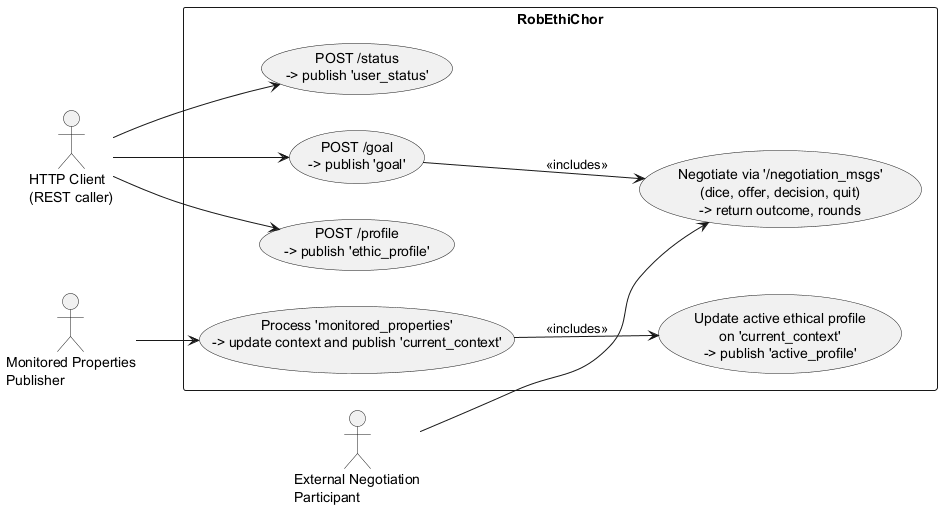
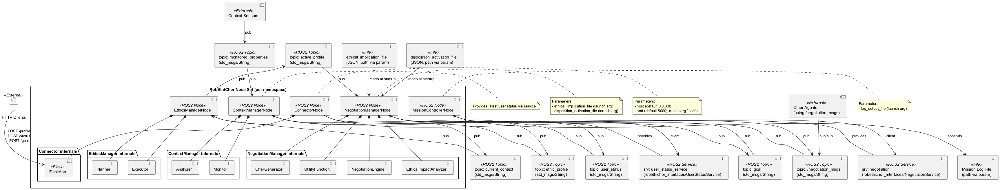
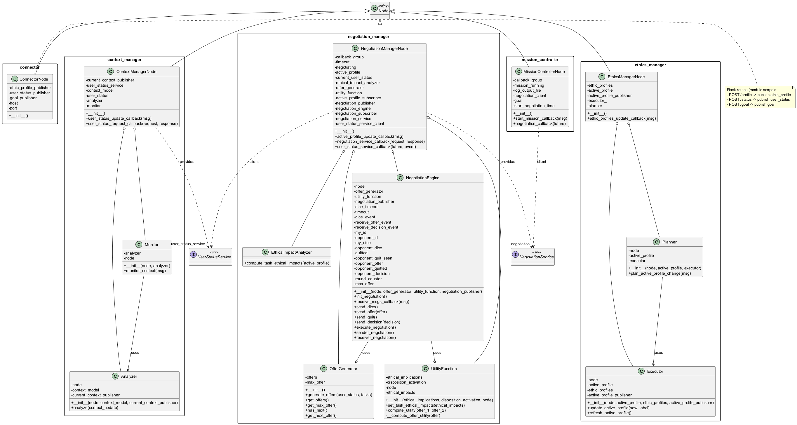
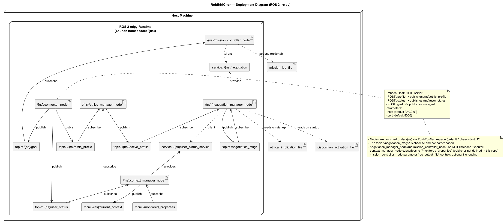

 

% 1 — System Overview
# Section 1 — System Overview

This section introduces the system’s purpose, scope, and key capabilities strictly as evidenced by the provided source code. It explains what the system does end-to-end, the packages it comprises, how it is invoked, and the essential behaviors and integration points that are observable in the implementation.

The repository delivers a ROS 2 implementation named RobEthiChor that orchestrates ethical profile management, context handling, and a negotiation process in support of a mission execution workflow. The system is organized into two ROS 2 packages: robethichor, which contains the runtime nodes and a launch description, and robethichor_interfaces, which contains the service definitions used to integrate nodes at runtime. The launch description runs a full vertical slice under a configurable ROS namespace, enabling a robot-assistant scenario out of the box.

The overall purpose of the system is to receive a mission goal via a REST-to-ROS connector, derive an active ethical profile from user context, and execute a one-to-one negotiation process whose utility evaluation is grounded in the active profile and external ethical configuration. Mission execution is represented by the orchestration and timing of the negotiation, followed by structured logging of the outcome.

The runtime behavior begins with the connector_node, a ROS node embedding a Flask server that exposes three REST endpoints. The /profile endpoint accepts an ethical profile dictionary and publishes it as a std_msgs/String on the ethic_profile topic. The /status endpoint accepts a user status dictionary and publishes it on the user_status topic. The /goal endpoint accepts a mission goal and publishes it on the goal topic. These HTTP inputs are the sole external entry points in the repository and drive the remainder of the pipeline. The node is parameterized with host and port (defaults 0.0.0.0 and 5000) and is launched within a ROS namespace that defaults to robassistant_1.

User status handling is implemented by context_manager_node, which subscribes to user_status and stores the latest JSON content. It exposes a ROS service user_status_service (defined in robethichor_interfaces) that returns the stored status as a JSON string. A monitor/analyzer pair within the same node ingests monitored_properties updates from an external publisher, updates a simple in-memory context model, and publishes current_context whenever the model changes. The analyzer publishes the entire current context as a JSON-encoded std_msgs/String. The code does not include a publisher for monitored_properties, so this input is expected from outside the package.

Ethical profile handling is implemented by ethics_manager_node. It maintains a repository of ethical profiles received on ethic_profile and an active_profile that is selected based on the current_context. The planner component compares the context’s location property to the active profile label and triggers an update when they differ. The executor commits the change: it sets the active_profile label and profile and publishes the profile content on the active_profile topic. Profile refresh is supported when a profile update arrives for the currently active label.

Negotiation is coordinated by negotiation_manager_node and is exposed as a ROS service named negotiation (see NegotiationService.srv). When invoked, the node requests the current user status via user_status_service, generates a sequence of offers based on the active conditions in that status and the requested tasks, and executes a bilateral negotiation via a publish/subscribe channel. Offer generation is cumulative over all true conditions and produces a reversed queue with a designated maximum offer. The negotiation_engine conducts a dice-based handshake to assign sender or receiver roles and exchanges messages over the absolute topic /negotiation_msgs. Negotiation messages are JSON-encoded std_msgs/String entries with keys for dice, offer, decision, and quit. The engine will consider itself the winner if no opponent responds within the configured timeouts; otherwise, it alternates roles until it accepts, rejects, or both parties quit. The utility_function evaluates offers against ethical_implications and disposition_activation read at startup from two JSON configuration files whose paths are provided as ROS parameters. The ethical_impact_analyzer currently projects the active profile directly into the utility function as ethical impacts without transformation.

Mission lifecycle is overseen by mission_controller_node. Upon receiving a goal message, it starts a negotiation by invoking the negotiation service with a fixed task list containing t1. It measures the negotiation duration, logs the result to an optional file path configured through the log_output_file parameter, and marks the mission as complete. The controller is resilient to concurrent callbacks through a reentrant callback group and uses a MultiThreadedExecutor to allow non-blocking service interactions. It treats goals idempotently by rejecting new ones while a mission is running.

The launch description robethichor_launch.py orchestrates all runtime nodes under a namespace pushed by PushRosNamespace. It starts the ethics manager, context manager, negotiation manager (with ethical_implication_file and disposition_activation_file parameters), mission controller (with log_output_file), and connector (with port). The negotiation manager additionally publishes and subscribes on the absolute topic /negotiation_msgs, which allows multi-agent negotiation across namespaces when another compatible agent is present on the same ROS graph.

In scope, the repository contains the complete application stack required to accept external inputs, select an ethical profile from environmental context, evaluate the ethical implications of actions, and conduct a negotiation that culminates in a mission outcome. Notably, the inputs for monitored_properties and any opposing negotiating agent are not part of the repository and must be provided by external systems for multi-party negotiation and context evolution. The system’s configuration depends on two JSON files loaded at negotiation manager startup to define ethical implications and condition-driven disposition activations.

% 2 — Architectural Context
## 2. Architectural Context

This section identifies the external systems, interfaces, and data sources that are visible in the implementation. It summarizes how the system communicates with its environment through HTTP endpoints, ROS 2 topics and services, configuration parameters, and files, and clarifies which external actors interact with it. The information below is derived solely from the provided codebase and launch configuration.

### External Systems

- ROS 2 runtime (rclpy), including publishers, subscribers, services, parameters, and executors.
- Flask HTTP server embedded in the connector node, exposing REST endpoints to external clients.
- File system for reading configuration files and writing mission logs.
- External ROS 2 publishers of the monitored_properties topic (no publisher exists in this repository).
- Peer negotiation agents (other processes/nodes) communicating via the absolute ROS 2 topic /negotiation_msgs (cross-namespace, cross-process).

### APIs / Interfaces

- HTTP REST endpoints (served by connector_node):
  - POST /profile: accepts JSON body; publishes std_msgs/String on topic ethic_profile; returns 201 with empty JSON object.
  - POST /status: accepts JSON body; publishes std_msgs/String on topic user_status; returns 201 with empty JSON object.
  - POST /goal: accepts JSON body; publishes std_msgs/String on topic goal; returns 201 with empty JSON object.
- ROS 2 topics (std_msgs/String unless noted; relative names are resolved under the robot namespace; /negotiation_msgs is absolute):
  - Published:
    - ethic_profile (connector_node)
    - user_status (connector_node)
    - goal (connector_node)
    - current_context (context_manager_node)
    - active_profile (ethics_manager_node)
    - /negotiation_msgs (negotiation_manager_node)
  - Subscribed:
    - ethic_profile (ethics_manager_node)
    - user_status (context_manager_node)
    - goal (mission_controller_node)
    - current_context (ethics_manager_node)
    - active_profile (negotiation_manager_node)
    - monitored_properties (context_manager_node → Monitor)
    - /negotiation_msgs (negotiation_manager_node)
- ROS 2 services:
  - Provided:
    - negotiation (robethichor_interfaces/srv/NegotiationService) by negotiation_manager_node.
    - user_status_service (robethichor_interfaces/srv/UserStatusService) by context_manager_node.
  - Consumed:
    - negotiation by mission_controller_node.
    - user_status_service by negotiation_manager_node.
- ROS 2 parameters:
  - Launch-time (robethichor_launch.py): ns, port, ethical_implication_file, disposition_activation_file, log_output_file.
  - Node parameters:
    - connector_node: host (default 0.0.0.0), port (default 5000).
    - negotiation_manager_node: ethical_implication_file (path), disposition_activation_file (path).
    - mission_controller_node: log_output_file (path).
- Namespacing:
  - All node-relative topics and services are created under the pushed namespace ns (default robassistant_1). The /negotiation_msgs topic is absolute and shared across namespaces, enabling inter-node/agent negotiation.

### Data Sources

- Files read at startup by negotiation_manager_node:
  - ethical_implication_file: JSON file containing ethical_implications.
  - disposition_activation_file: JSON file containing disposition_activation.
- File written by mission_controller_node:
  - log_output_file: appends a line after each negotiation with namespace, configuration (goal), timing, rounds, and outcome.
- HTTP request bodies:
  - JSON payloads for POST /profile, /status, and /goal; forwarded as JSON-encoded std_msgs/String on their respective ROS topics.
- ROS messages originating outside this repository:
  - monitored_properties topic (JSON-encoded std_msgs/String), consumed by context_manager_node to update and publish current_context.
  - /negotiation_msgs (JSON-encoded std_msgs/String) exchanged with peer negotiation agents.
- ROS service response:
  - user_status_service returns a JSON string (response.data) consumed by negotiation_manager_node.

### Users / Actors

- External HTTP client invoking the connector’s REST API (e.g., any system posting JSON to /profile, /status, /goal).
- Peer negotiation agents (external ROS 2 nodes/processes) participating via the shared /negotiation_msgs topic.

% 2.1 — Architectural Context – Use Case Diagram
# Section 2.1 — Architectural Context – Use Case Diagram

This section summarizes the external interactions of the RobEthiChor system as implemented in the repository. It focuses strictly on externally observable behaviors evidenced by the code: HTTP endpoints exposed by the connector, the external publication of monitored properties, and the participation in a distributed negotiation over a shared ROS topic. Internal interactions between nodes (e.g., services and topics within the system) are only shown as included use cases when they are a direct consequence of an external stimulus and can be validated against the codebase.

Figure 2.1 depicts the external actors and the system’s use cases derived from the code. The “HTTP Client” actor invokes the REST endpoints implemented in connector_node.py. The “Monitored Properties Publisher” actor publishes “monitored_properties” consumed by the Context Manager. The “External Negotiation Participant” actor participates in the negotiation protocol over the shared “/negotiation_msgs” topic alongside the NegotiationManager’s NegotiationEngine. The includes relationships reflect concrete control flows implemented in the code: posting a goal triggers negotiation; processing monitored properties leads to updating and publishing the active ethical profile.

Figure 2.1 — Architectural Context – Use Case Diagram (robethichor-section-2-1-use-case.puml)

% 3 — Containers
## 3. Containers

This section identifies the runtime containers implemented in the codebase and describes their responsibilities, core technologies, and communication mechanisms. The containers correspond to ROS 2 nodes (each running as its own process) plus the embedded HTTP server exposed by the connector node. All interactions, topics, and services are derived directly from the provided source code and launch configuration.

| Container | Responsibility | Technology | Communication |
|---|---|---|---|
| connector_node | Exposes HTTP endpoints to ingest user profile, user status, and mission goals; translates incoming HTTP payloads into ROS 2 messages for downstream nodes. | Python 3; ROS 2 rclpy; Flask; std_msgs/String | HTTP POST: /profile → publishes topic 'ethic_profile' (String); HTTP POST: /status → publishes topic 'user_status' (String); HTTP POST: /goal → publishes topic 'goal' (String). Parameters: host (default 0.0.0.0), port (default 5000). |
| context_manager_node | Maintains current user status and context model; monitors context changes; publishes current context; exposes a service to provide the current user status. | Python 3; ROS 2 rclpy; std_msgs/String; robethichor_interfaces/srv/UserStatusService; Analyzer, Monitor | Subscribes: 'user_status' (String), 'monitored_properties' (String). Publishes: 'current_context' (String). Provides service: 'user_status_service' (UserStatusService: response string data JSON). |
| ethics_manager_node | Manages ethical profiles; decides and publishes the active profile based on the current context; refreshes active profile when profiles change. | Python 3; ROS 2 rclpy; std_msgs/String; Planner, Executor | Subscribes: 'ethic_profile' (String), 'current_context' (String). Publishes: 'active_profile' (String). |
| negotiation_manager_node | Orchestrates task negotiation; loads ethical implication and disposition activation configs; generates offers; computes utilities; runs the negotiation protocol; exposes the negotiation service; consumes active profile and user status. | Python 3; ROS 2 rclpy; std_msgs/String; MultiThreadedExecutor; ReentrantCallbackGroup; robethichor_interfaces/srv/NegotiationService, UserStatusService; NegotiationEngine, OfferGenerator, UtilityFunction, EthicalImpactAnalyzer | Subscribes: 'active_profile' (String); Publishes: '/negotiation_msgs' (String, global topic). Subscribes: '/negotiation_msgs' (String, global topic). Provides service: 'negotiation' (NegotiationService: request string[] tasks; response string outcome, int32 rounds). Service client: 'user_status_service' (UserStatusService). Parameters: ethical_implication_file (path), disposition_activation_file (path); reads both JSON files. |
| mission_controller_node | Triggers negotiation upon receiving a goal; calls the negotiation service; logs results and timing; manages mission lifecycle state. | Python 3; ROS 2 rclpy; std_msgs/String; MultiThreadedExecutor; ReentrantCallbackGroup; filesystem I/O | Subscribes: 'goal' (String). Service client: 'negotiation' (NegotiationService). Parameter: log_output_file (path; optional for appending negotiation logs). |

Introduction completeness notes:
- All containers are launched by robethichor/launch/robethichor_launch.py under a configurable ROS namespace (default ns=robassistant_1). The negotiation message topic is absolute (/negotiation_msgs), thus shared across namespaces.
- No databases are used in this codebase; persistent data is limited to optional filesystem logging by mission_controller_node and the JSON configuration files read by negotiation_manager_node.

% 3.1 — Architecture Overview – Component Diagram
# Section 3.1 — Architecture Overview – Component Diagram

This section presents the system-wide component view of the RobEthiChor ROS 2 implementation. It captures the runtime nodes, their internal subcomponents, message-based interactions via topics, synchronous interactions via services, external interfaces, and configuration files. The diagram and the accompanying table are derived directly from the provided source code and launch configuration, ensuring the view matches the real implementation and can be validated by the development team.

Figure 3.1 — Component Diagram — RobEthiChor

Table 3.1 — Runtime components and interfaces

| Component | Type | Publishes | Subscribes | Provides Services | Uses Services | External I/O |
|---|---|---|---|---|---|---|
| ConnectorNode | ROS2 Node | ethic_profile (String), user_status (String), goal (String) | — | — | — | HTTP endpoints via Flask: POST /profile, /status, /goal; parameters host, port |
| ContextManagerNode (Analyzer, Monitor) | ROS2 Node | current_context (String) | user_status (String), monitored_properties (String) | user_status_service (UserStatusService) | — | — |
| EthicsManagerNode (Planner, Executor) | ROS2 Node | active_profile (String) | ethic_profile (String), current_context (String) | — | — | — |
| NegotiationManagerNode (OfferGenerator, UtilityFunction, NegotiationEngine, EthicalImpactAnalyzer) | ROS2 Node | /negotiation_msgs (String) | active_profile (String), /negotiation_msgs (String) | negotiation (NegotiationService) | user_status_service (UserStatusService) | Reads ethical_implication_file and disposition_activation_file (JSON) |
| MissionControllerNode | ROS2 Node | — | goal (String) | — | negotiation (NegotiationService) | Appends mission log to file path (log_output_file) |

Notes for validation:
The launch file starts all five nodes under a configurable ROS namespace and passes the parameters shown in the diagram notes. All topic names, service names, and message/service types in the diagram and table are taken directly from the code. The NegotiationManager uses an absolute topic /negotiation_msgs for inter-agent exchanges; if no other agents publish on that topic, the negotiation engine resolves to a default outcome as implemented. The ContextManager’s Monitor subscribes to monitored_properties, which is expected to be published by external components or sensors.

% 4 — Components
## 4. Components

This section identifies and describes the internal software components implemented in the codebase, grouped implicitly by their runtime containers (ROS 2 nodes). For each component, the table below states its responsibility and the concrete interactions it has with other components, topics, services, files, and external systems. The description reflects the exact implementation and naming found in the provided source files so that the development team can validate it against the code.

| Component | Responsibility | Interactions |
|---|---|---|
| robethichor.launch.robethichor_launch.generate_launch_description | Produces a ROS 2 LaunchDescription that declares launch arguments and starts all runtime nodes under a namespace. | Declares launch arguments ns, port, ethical_implication_file, disposition_activation_file, log_output_file; starts nodes ethics_manager_node, context_manager_node, negotiation_manager_node (with ethical_implication_file, disposition_activation_file), mission_controller_node (with log_output_file), and connector_node (with port); applies PushRosNamespace to all started nodes. |
| robethichor.nodes.connector.connector_node.ConnectorNode | Bridges HTTP requests into ROS topics for user profile, user status, and goal intake; owns publishers and web server configuration. | Declares parameters host and port; publishes on topics ethic_profile, user_status, goal (std_msgs/String containing JSON); initializes Flask app with a reference to the ROS node and runs app.run(host, port); logs received events; interacts with route handlers load_user_profile, set_user_status_controller, and set_goal_controller. |
| robethichor.nodes.connector.connector_node.load_user_profile | HTTP controller for POST /profile that forwards the payload to ROS. | Receives HTTP POST /profile; publishes std_msgs/String JSON to topic ethic_profile; uses app.config['ros_node'] to access ConnectorNode; responds with HTTP 201 Created. |
| robethichor.nodes.connector.connector_node.set_user_status_controller | HTTP controller for POST /status that forwards the payload to ROS. | Receives HTTP POST /status; publishes std_msgs/String JSON to topic user_status; uses app.config['ros_node'] to access ConnectorNode; responds with HTTP 201 Created. |
| robethichor.nodes.connector.connector_node.set_goal_controller | HTTP controller for POST /goal that forwards the payload to ROS. | Receives HTTP POST /goal; publishes std_msgs/String JSON to topic goal; uses app.config['ros_node'] to access ConnectorNode; responds with HTTP 201 Created. |
| robethichor.nodes.context_manager.context_manager_node.ContextManagerNode | Maintains the latest user status and a context model; exposes the user status via a service; triggers context analysis and publication. | Subscribes to topic user_status (std_msgs/String JSON) and updates internal user_status; provides service user_status_service (robethichor_interfaces/srv/UserStatusService) returning the stored user_status as a JSON string; creates publisher current_context (std_msgs/String JSON); composes Analyzer and Monitor; logs calls and state changes. |
| robethichor.nodes.context_manager.analyzer.Analyzer | Updates the context model from monitored properties and publishes the current context when changes occur. | Called by Monitor.monitor_context; maintains context_model dictionary; publishes std_msgs/String JSON on topic current_context when a property changes; logs updates and publications. |
| robethichor.nodes.context_manager.monitor.Monitor | Receives monitored properties and delegates analysis to the Analyzer. | Subscribes to topic monitored_properties (std_msgs/String JSON); calls Analyzer.analyze with parsed JSON; logs the received properties; depends on an external publisher of monitored_properties (not defined in this repository). |
| robethichor.nodes.ethics_manager.ethics_manager_node.EthicsManagerNode | Aggregates and maintains available ethic profiles, computes and publishes the active profile based on current context. | Subscribes to ethic_profile (std_msgs/String JSON) to update self.ethic_profiles; subscribes to current_context (std_msgs/String JSON) and delegates profile switching logic to Planner; composes Planner and Executor; publishes active_profile via Executor; on ethic profiles update, refreshes active profile when applicable; logs updates and decisions. |
| robethichor.nodes.ethics_manager.planner.Planner | Decides whether the active ethic profile needs to change based on the current context. | Receives current_context messages; reads and compares active_profile["label"] to current_context["location"]; calls Executor.update_active_profile with current_context["location"] when a change is needed; logs decisions. |
| robethichor.nodes.ethics_manager.executor.Executor | Applies changes to the active ethic profile and publishes it. | Updates shared active_profile dict and publishes std_msgs/String JSON of the new profile on topic active_profile; reads from ethic_profiles; supports refresh_active_profile; logs results and missing-profile conditions. |
| robethichor.nodes.mission_controller.mission_controller_node.MissionControllerNode | Starts and monitors a mission upon goal receipt; orchestrates a negotiation and logs the outcome and timing. | Subscribes to goal (std_msgs/String JSON); creates a client for service negotiation (robethichor_interfaces/srv/NegotiationService) and waits for availability; for each goal, sends tasks ["t1"] and awaits async completion; logs negotiation outcome, number of rounds, and time; writes a line to log_output_file if configured (ensures directory exists); uses ReentrantCallbackGroup and MultiThreadedExecutor; parameter log_output_file is declared and read. |
| robethichor.nodes.negotiation_manager.negotiation_manager_node.NegotiationManagerNode | Coordinates the negotiation flow: loads ethical configuration, computes task ethical impacts, generates offers, runs the negotiation engine, and serves the negotiation service. | Declares parameters ethical_implication_file and disposition_activation_file and loads their JSON content; composes EthicalImpactAnalyzer, OfferGenerator, UtilityFunction, and NegotiationEngine; subscribes to active_profile (std_msgs/String JSON) and updates UtilityFunction via EthicalImpactAnalyzer; publishes and subscribes to absolute topic /negotiation_msgs (std_msgs/String JSON) to communicate with peer negotiators; provides service negotiation (NegotiationService) that triggers user_status retrieval via client user_status_service (UserStatusService) and executes negotiation_engine.execute_negotiation; uses threading.Event for service synchronization; logs configuration, offers, and outcomes. |
| robethichor.nodes.negotiation_manager.negotiation_engine.NegotiationEngine | Implements a peer-to-peer bilateral negotiation protocol over a shared topic, with dice-based role selection and alternating sender/receiver roles. | Publishes and receives on absolute topic /negotiation_msgs using JSON messages with keys dice, offer, decision, quit; consults OfferGenerator for get_max_offer, has_next, get_next_offer; evaluates offers via UtilityFunction.compute_utility; uses threading.Event objects to await opponent dice, offers, and decisions; returns outcome (winner, loser, no-agreement) and round count to NegotiationManagerNode; logs internal state transitions and choices. |
| robethichor.nodes.negotiation_manager.offer_generator.OfferGenerator | Builds an ordered list of offers from the current user status and requested tasks. | Called by NegotiationManagerNode.generate_offers to produce offers as tuples (tasks, active_conditions); provides get_offers, get_max_offer, has_next, and get_next_offer to NegotiationEngine; stores and reverses the offers list to control proposal order. |
| robethichor.nodes.negotiation_manager.utility_function.UtilityFunction | Computes the ethical utility of an offer from configured ethical implications, disposition activations, and active ethical impacts. | Configured by NegotiationManagerNode with ethical_implications and disposition_activation; receives task ethical impacts via set_task_ethical_impacts from EthicalImpactAnalyzer; used by NegotiationEngine to compute_utility between two offers; logs each offer’s evaluated value. |
| robethichor.nodes.negotiation_manager.ethical_impact_analyzer.EthicalImpactAnalyzer | Derives task ethical impacts from the active profile. | Called by NegotiationManagerNode on active profile updates; returns the active_profile as the ethical impacts mapping for UtilityFunction. |
| robethichor_interfaces.srv.NegotiationService | Defines the Negotiation service contract used to initiate and report a negotiation. | Request contains string[] tasks; response contains string outcome and int32 rounds; provided by NegotiationManagerNode at service name negotiation; consumed by MissionControllerNode. |
| robethichor_interfaces.srv.UserStatusService | Defines the User Status service contract used to retrieve the current user status as JSON. | Empty request; response contains string data with a JSON-encoded user status; provided by ContextManagerNode at service name user_status_service; consumed by NegotiationManagerNode before offer generation. |

% 5 — Code-Level View
# Section 5 — Code-Level View

This section maps the implemented architecture to concrete source code elements. It identifies executable entry points, modules, classes, functions, and their responsibilities, and documents how runtime concerns (topics, services, parameters, concurrency) are realized in the code. The content is derived solely from the provided source tree and is intended to be directly validated by the development team.

## 5.1 Repository Layout and Responsibilities

The repository contains two ROS 2 packages: robethichor (runtime nodes and launch) and robethichor_interfaces (service definitions). The following table enumerates all files with their runtime role.

Table 5.1 — Repository modules and their responsibilities

| Path | Module/Class | Role and Responsibilities |
|---|---|---|
| robethichor/launch/robethichor_launch.py | generate_launch_description | Launch file: declares arguments, pushes namespace, and starts all runtime nodes with parameters. |
| robethichor/robethichor/nodes/connector/connector_node.py | ConnectorNode; Flask routes (/profile, /status, /goal); main | HTTP-to-ROS adapter node. Exposes REST endpoints and publishes JSON payloads to ROS topics ethic_profile, user_status, goal. |
| robethichor/robethichor/nodes/context_manager/context_manager_node.py | ContextManagerNode; main | Maintains latest user_status, exposes it via UserStatusService, and publishes current_context using Analyzer/Monitor. |
| robethichor/robethichor/nodes/context_manager/analyzer.py | Analyzer | Computes diffs on incoming monitored_properties and publishes updated current_context. |
| robethichor/robethichor/nodes/context_manager/monitor.py | Monitor | Subscribes to monitored_properties and forwards updates to Analyzer. |
| robethichor/robethichor/nodes/ethics_manager/ethics_manager_node.py | EthicsManagerNode; main | Manages ethic profiles, updates active profile based on current_context via Planner and publishes active_profile via Executor. |
| robethichor/robethichor/nodes/ethics_manager/planner.py | Planner | Decides when to switch active profile using the current_context["location"] value. |
| robethichor/robethichor/nodes/ethics_manager/executor.py | Executor | Applies and publishes the active profile; refreshes when underlying profiles change. |
| robethichor/robethichor/nodes/mission_controller/mission_controller_node.py | MissionControllerNode; main | Orchestrates a mission on goal reception; calls NegotiationService, times execution, and logs results. |
| robethichor/robethichor/nodes/negotiation_manager/negotiation_manager_node.py | NegotiationManagerNode; main | Coordinates negotiation: loads ethical configs, tracks active_profile, generates offers, computes utilities, runs negotiation via NegotiationEngine, serves NegotiationService. |
| robethichor/robethichor/nodes/negotiation_manager/negotiation_engine.py | NegotiationEngine | Implements a turn-based, message-driven negotiation protocol with dice-based role selection over topic /negotiation_msgs. |
| robethichor/robethichor/nodes/negotiation_manager/offer_generator.py | OfferGenerator | Builds a sequence of offers from current user_status and requested tasks. |
| robethichor/robethichor/nodes/negotiation_manager/utility_function.py | UtilityFunction | Computes utility values for offers, based on ethical implications, disposition activation, and active ethical impacts. |
| robethichor/robethichor/nodes/negotiation_manager/ethical_impact_analyzer.py | EthicalImpactAnalyzer | Produces ethical impacts for tasks from the active profile (pass-through in current implementation). |
| robethichor/setup.py | setup() | Defines Python package metadata and console scripts (ROS 2 executables). |
| robethichor_interfaces/srv/NegotiationService.srv | NegotiationService | Service type: request tasks:string[], response outcome:string, rounds:int32. |
| robethichor_interfaces/srv/UserStatusService.srv | UserStatusService | Service type: response data:string containing JSON-encoded user_status. |

## 5.2 Build and Executable Entry Points

The robethichor package declares ROS 2 console scripts in setup.py. Each console script maps to a Python main function and creates a Node.

Table 5.2 — Executable entry points and nodes

| Console script | Module:function | Node class | Node name (Node(...)) |
|---|---|---|
| ethics_manager_node | robethichor.nodes.ethics_manager.ethics_manager_node:main | EthicsManagerNode | ethics_manager_node |
| context_manager_node | robethichor.nodes.context_manager.context_manager_node:main | ContextManagerNode | context_manager_node |
| negotiation_manager_node | robethichor.nodes.negotiation_manager.negotiation_manager_node:main | NegotiationManagerNode | negotiation_manager_node |
| mission_controller_node | robethichor.nodes.mission_controller.mission_controller_node:main | MissionControllerNode | mission_controller_node |
| connector_node | robethichor.nodes.connector.connector_node:main | ConnectorNode | connector_node |

Launch integration is provided by robethichor/launch/robethichor_launch.py, which starts all above nodes within a namespace via PushRosNamespace. Negotiation and context manager nodes are provided with configuration parameters from launch arguments.

Launch arguments:

- ns (default robassistant_1): namespace pushed for all nodes.
- port (default 5000): exposed HTTP port for connector_node.
- ethical_implication_file (no default): JSON file path for negotiation_manager_node.
- disposition_activation_file (no default): JSON file path for negotiation_manager_node.
- log_output_file (default empty): log path for mission_controller_node.

## 5.3 Topics, Services, Parameters, and Data Contracts

The following tables list every topic, service, and parameter used across modules and the JSON payloads where applicable.

Table 5.3 — Topics (publishers and subscribers)

| Topic | Type | Publishers (module:class) | Subscribers (module:class) | Payload notes |
|---|---|---|---|---|
| ethic_profile | std_msgs/String | connector_node:ConnectorNode | ethics_manager:EthicsManagerNode | JSON object of labeled profiles; merged into EthicsManagerNode.ethic_profiles. |
| user_status | std_msgs/String | connector_node:ConnectorNode | context_manager:ContextManagerNode | JSON object; stored as ContextManagerNode.user_status. |
| goal | std_msgs/String | connector_node:ConnectorNode | mission_controller:MissionControllerNode | Free-form JSON/string; stored as MissionControllerNode.goal for logging. |
| monitored_properties | std_msgs/String | external (not in repo) | context_manager:Monitor | JSON object; forwarded to Analyzer.analyze. |
| current_context | std_msgs/String | context_manager:Analyzer | ethics_manager:EthicsManagerNode (Planner.plan_active_profile_change) | JSON object; must contain key "location" used by Planner. |
| active_profile | std_msgs/String | ethics_manager:Executor | negotiation_manager:NegotiationManagerNode | JSON object; broadcast as the profile content (not including label). |
| /negotiation_msgs | std_msgs/String | negotiation_manager:NegotiationManagerNode (NegotiationEngine via publisher) | negotiation_manager:NegotiationManagerNode (NegotiationEngine via subscriber) | JSON message envelope: {"id":str,"key":("dice"|"offer"|"quit"|"decision"),"content":...}. Offers encode as {"task":[string], "conditions":[string]}. |

Table 5.4 — Services (providers and clients)

| Service name | Type | Server (module:class) | Client (module:class) | Notes |
|---|---|---|---|---|
| user_status_service | robethichor_interfaces/srv/UserStatusService | context_manager:ContextManagerNode | negotiation_manager:NegotiationManagerNode | No request fields; response.data is JSON string of user_status. |
| negotiation | robethichor_interfaces/srv/NegotiationService | negotiation_manager:NegotiationManagerNode | mission_controller:MissionControllerNode | Request contains tasks; response contains outcome ("winner"|"loser"|"no-agreement") and rounds. |

Table 5.5 — Node parameters

| Node | Parameter | Default | Source of value | Effect |
|---|---|---|---|---|
| connector_node | host | 0.0.0.0 | declared in node | Host bound by Flask. |
| connector_node | port | 5000 | launch arg port | Port bound by Flask. |
| negotiation_manager_node | ethical_implication_file | "." | launch arg ethical_implication_file | JSON path; loaded at startup. |
| negotiation_manager_node | disposition_activation_file | "." | launch arg disposition_activation_file | JSON path; loaded at startup. |
| mission_controller_node | log_output_file | "." | launch arg log_output_file | If non-empty, file receives one-line mission logs. |

Data contract details:

- NegotiationEngine messages on /negotiation_msgs:
  - key "dice": content is integer; used to determine sender/receiver.
  - key "offer": content is {"task":[string], "conditions":[string]} where "task" matches the requested tasks and "conditions" are selected from true user_status conditions.
  - key "quit": content is boolean True.
  - key "decision": content is "accept" or "reject".

- Planner expects current_context JSON to include "location". It sets active profile label equal to current_context["location"].

- Executor publishes only the profile content (new_profile) as active_profile message; the corresponding label is maintained in active_profile["label"] internally.

- UserStatusService response is a JSON string representing the last user_status received via topic user_status.

## 5.4 Module and Class Details

### 5.4.1 Connector: HTTP–ROS Adapter

Module: robethichor/nodes/connector/connector_node.py

Class ConnectorNode extends rclpy.node.Node. On initialization it declares host and port parameters, creates publishers for ethic_profile, user_status, and goal (all std_msgs/String), and starts a Flask application by calling app.run(host, port). The Flask app stores a reference to the ROS node in app.config['ros_node'].

REST endpoints:

- POST /profile: reads JSON body, publishes as String on ethic_profile, returns 201.
- POST /status: reads JSON body, publishes as String on user_status, returns 201.
- POST /goal: reads JSON body, publishes as String on goal, returns 201.

main(args=None) initializes rclpy, constructs ConnectorNode (which blocks in Flask’s app.run), then calls rclpy.spin(node), node.destroy_node(), rclpy.shutdown(). Because app.run is invoked in the constructor, the spin will not be reached until the Flask server stops.

External dependencies: flask (Flask, request, jsonify, make_response), std_msgs.msg.String.

### 5.4.2 Context Manager

Modules: context_manager_node.py, analyzer.py, monitor.py

- Class ContextManagerNode extends Node. It subscribes to user_status, publishes current_context, and serves UserStatusService as user_status_service. It composes Analyzer and Monitor.

  - user_status_update_callback(msg): logs and updates internal user_status dict by JSON-decoding msg.data.
  - user_status_request_callback(request, response): returns the current user_status JSON string.

- Class Analyzer computes a diff between incoming context_update and the internal context_model. If any property changed, it publishes the updated context_model as current_context (String containing JSON).

- Class Monitor subscribes to monitored_properties (String containing JSON) and forwards the decoded object to Analyzer.analyze.

Concurrency: default single-threaded executor unless otherwise configured by the caller; no explicit callback groups.

### 5.4.3 Ethics Manager

Modules: ethics_manager_node.py, planner.py, executor.py

- Class EthicsManagerNode extends Node. It holds ethic_profiles (dict) and active_profile (dict with keys "label" and "profile" when set). It composes:
  - Executor(self, active_profile, ethic_profiles, active_profile_publisher) to apply and publish profile changes.
  - Planner(self, active_profile, executor) to plan profile changes from current_context.

  Subscriptions:
  - ethic_profile: merges incoming JSON object into ethic_profiles; if the active profile label exists in the updated set, it calls executor.refresh_active_profile().
  - current_context: forwarded to Planner.plan_active_profile_change.

- Class Planner inspects current_context JSON. If active_profile is unset or current_context["location"] differs from active_profile["label"], it requests Executor.update_active_profile with the new label equal to current_context["location"]; otherwise it logs that no change is needed.

- Class Executor updates active_profile: if label exists in ethic_profiles, copies the profile content, logs, and publishes the profile content as active_profile (String containing JSON). It also supports refresh_active_profile() to republish based on the current label.

### 5.4.4 Mission Controller

Module: mission_controller_node.py

Class MissionControllerNode extends Node. It runs with a ReentrantCallbackGroup and is added to a MultiThreadedExecutor in main().

- Parameters: log_output_file (string); default "."; logged and used as file path if non-empty.
- Subscriptions: goal (String). On first goal when no mission is running, it stores the goal, sets mission_running True, and initiates a negotiation by calling the negotiation service.
- Service client: NegotiationService at service name negotiation. It waits for availability at startup. On goal callback:
  - Builds NegotiationService.Request with tasks = ["t1"].
  - Records start time, calls the service asynchronously, and registers negotiation_callback.
- negotiation_callback(future): fetches response, logs outcome and rounds if successful, measures and logs negotiation time, appends a log line to log_output_file (creating directories as needed), and sets mission_running back to False. It also removes the pending request from the client.

Concurrency: MultiThreadedExecutor and ReentrantCallbackGroup enable concurrent handling of subscription callback and service response.

### 5.4.5 Negotiation Manager

Modules: negotiation_manager_node.py, negotiation_engine.py, offer_generator.py, utility_function.py, ethical_impact_analyzer.py

- Class NegotiationManagerNode extends Node with ReentrantCallbackGroup and is executed under a MultiThreadedExecutor in main().

  Initialization:
  - Parameters ethical_implication_file and disposition_activation_file; reads both JSON files at startup.
  - Components:
    - EthicalImpactAnalyzer() to derive ethical impacts from the active profile.
    - OfferGenerator() to generate offers based on current user_status and requested tasks.
    - UtilityFunction(ethical_implications, disposition_activation, node) to compute offer utilities.
    - NegotiationEngine(self, offer_generator, utility_function, negotiation_publisher) to run the negotiation protocol on topic /negotiation_msgs.
  - ROS interfaces:
    - Subscriptions: active_profile (String) to update UtilityFunction’s ethical impacts; /negotiation_msgs to feed NegotiationEngine.receive_msgs_callback.
    - Publisher: /negotiation_msgs for NegotiationEngine to send protocol messages.
    - Service server: negotiation (NegotiationService) via negotiation_service_callback.
    - Service client: user_status_service (UserStatusService) to obtain current user_status.

  Methods:
  - active_profile_update_callback(msg): parses active_profile JSON, computes task ethical impacts via EthicalImpactAnalyzer (currently pass-through), and updates UtilityFunction.
  - negotiation_service_callback(request, response): ensures only one negotiation at a time; obtains user_status via async client with an Event for synchronization and timeout; generates offers with OfferGenerator.generate_offers; runs NegotiationEngine.execute_negotiation(); fills response.outcome and response.rounds; resets negotiating flag.
  - user_status_service_callback(future, event): decodes UserStatusService response JSON into current_user_status, removes pending request, and sets the synchronization event.

- Class NegotiationEngine encapsulates the protocol:

  State:
  - Random dice my_dice and opponent_dice, unique my_id, discovered opponent_id, events for dice/offer/decision receipt, role control flags, round_counter.
  - Timeouts: dice_timeout=50 seconds; timeout=5 seconds for waiting on offers/decisions.

  Messaging:
  - send_dice(), send_offer(offer), send_quit(), send_decision(decision) publish to /negotiation_msgs in a JSON envelope.
  - receive_msgs_callback(msg) parses messages, ignores own id, initializes opponent_id on first dice, and updates state/events for "offer", "quit", and "decision".

  Protocol:
  - execute_negotiation(): picks random dice, sends it, waits for opponent dice or times out. Chooses the role by comparing dice. Retrieves max_offer from OfferGenerator. Executes sender_negotiation() or receiver_negotiation(), tracks rounds, resets events, re-initializes state, and returns (result, rounds).
  - sender_negotiation(): if no more offers, possibly sends "quit" and switches roles or ends with "no-agreement"; otherwise sends next offer, waits for decision, and either wins on accept/no-decision or switches to receiver on reject.
  - receiver_negotiation(): if opponent already quit and we also quit, returns "no-agreement"; otherwise waits for offer or quit; on offer, computes utility = UtilityFunction.compute_utility(opponent_offer, max_offer) and accepts on positive value (returns "loser") or rejects and switches roles.

- Class OfferGenerator:
  - generate_offers(user_status: dict, tasks: list[string]): collects conditions whose value is True; creates offers (tasks, conditions_prefix) for each progressive subset; sets max_offer to the last one (all active conditions); reverses the offer list so that get_next_offer() pops from the end in ascending “size”.
  - Accessors: get_offers(), get_max_offer(), has_next(), get_next_offer().

- Class UtilityFunction:
  - set_task_ethical_impacts(ethical_impacts: dict).
  - compute_utility(offer_1, offer_2) returns the difference of internal offer utilities.
  - __compute_offer_utility(offer): for each task in offer[0], for each disposition in ethical_implications[task], and for each condition in offer[1], if disposition is activated by the condition (disposition_activation[condition]) and has an ethical impact value (ethical_impacts[disposition]), adds that value to the total. Logs the evaluation.

- Class EthicalImpactAnalyzer:
  - compute_task_ethical_impacts(active_profile) returns the active profile unchanged. In practice, active_profile is expected to map dispositions to numeric impacts.

### 5.4.6 Launch Description

Module: robethichor/launch/robethichor_launch.py

Function generate_launch_description() defines the following launch arguments: ns, port, ethical_implication_file, disposition_activation_file, log_output_file. It creates a GroupAction to push the namespace and launches:

- robethichor:ethics_manager_node
- robethichor:context_manager_node
- robethichor:negotiation_manager_node with parameters ethical_implication_file and disposition_activation_file
- robethichor:mission_controller_node with parameter log_output_file
- robethichor:connector_node with parameter port

All node names match their class Node names.

## 5.5 Recognizable Implementation Patterns

The code exhibits the following concrete patterns grounded in the implementation:

The ROS 2 publish–subscribe and request–reply pattern is used throughout. Nodes communicate via std_msgs/String topics for loosely coupled, JSON-based message passing, and via services (NegotiationService, UserStatusService) for request–response interactions.

An HTTP adapter pattern is implemented by ConnectorNode via Flask. It maps external REST calls to ROS topics, decoupling external clients from ROS-native interfaces.

Asynchronous event-driven coordination is used in negotiation. NegotiationManagerNode uses a MultiThreadedExecutor with a ReentrantCallbackGroup, and NegotiationEngine coordinates protocol turns using threading.Event instances and timeouts to synchronize on messages arriving on /negotiation_msgs.

A simple leader/role selection handshake is implemented by random “dice” exchange in NegotiationEngine to deterministically select sender vs. receiver for each negotiation session.

## 5.6 Concurrency and Execution Notes

- NegotiationManagerNode and MissionControllerNode both use MultiThreadedExecutor and ReentrantCallbackGroup, allowing concurrent service and subscription callbacks.

- NegotiationEngine relies on local Events to coordinate message-driven state within a single process. Its messages are exchanged on a shared topic (/negotiation_msgs), and it ignores self-originated messages using the my_id field.

- ConnectorNode starts Flask within the node constructor using app.run(host, port), which blocks the thread. Subsequent rclpy.spin(node) will not run until Flask stops; this is acceptable for its role because it only publishes from HTTP callbacks and does not depend on ROS timers or subscriptions.

## 5.7 Cross-Module Interactions (End-to-End Mapping)

- External client → ConnectorNode (HTTP) → publishes ethic_profile → EthicsManagerNode updates ethic_profiles. When ContextManager/Monitor later publish current_context including "location", Planner triggers Executor to publish active_profile.

- External client → ConnectorNode (HTTP) → publishes user_status → ContextManagerNode updates internal user_status → NegotiationManagerNode will subsequently fetch it via UserStatusService when a negotiation starts.

- External client → ConnectorNode (HTTP) → publishes goal → MissionControllerNode starts negotiation: calls negotiation service → NegotiationManagerNode obtains user_status, generates offers, executes protocol on /negotiation_msgs using NegotiationEngine → MissionControllerNode receives service response (outcome, rounds), logs and completes mission.

This mapping reflects the exact topics, services, and classes found in the codebase and can be validated by inspecting the referenced modules and their ROS interfaces.

% 5.1 — Class Diagram
# SECTION 5.1 — Class Diagram

This section provides a complete and implementation-accurate class diagram for the RobEthiChor ROS package, reflecting the structure, responsibilities, and relationships observed in the source code. It captures all declared classes, their key attributes, core methods, inheritance from rclpy’s Node where applicable, and the primary associations among components. The diagram also annotates service interfaces used and provided by nodes to allow validation by developers familiar with the codebase.

Figure 5.1 — RobEthiChor: Class Diagram (from source code)

This class diagram is derived directly from the codebase and includes every class, their principal attributes and methods, their inheritance from rclpy’s Node where applicable, and their key associations, compositions, and service interactions. It also annotates the module-level Flask routes that publish to ROS topics through ConnectorNode’s publishers, as implemented in the connector module.

% 6 — Cross-Cutting Concerns
## 6. Cross-Cutting Concerns

This section identifies and explains cross-cutting aspects that affect multiple parts of the system, as evidenced by the implementation. It is intended to help reviewers understand systemic qualities such as configuration, logging, error handling, security, data handling, and concurrency that shape the behavior of the entire solution.

Table 6-1. Cross-Cutting Concerns

| Concern | Evidence from code | Description |
|---|---|---|
| Logging and tracing | Extensive use of rclpy Node loggers: get_logger().info/debug/error across all nodes (e.g., robethichor/nodes/ethics_manager/*.py, robethichor/nodes/negotiation_manager/*.py, robethichor/nodes/context_manager/*.py, robethichor/nodes/mission_controller/mission_controller_node.py). UtilityFunction logs evaluations; NegotiationEngine logs protocol progress; MissionController logs mission lifecycle. | Logging is the primary observability mechanism. It provides visibility into configuration, lifecycle events, negotiation rounds, offer evaluation, and error conditions. Log levels vary between info and debug. There is no structured logging or correlation IDs; tracing across components relies on temporal proximity and messages. |
| Configuration management and namespacing | Launch description defines DeclareLaunchArgument for ns, port, ethical_implication_file, disposition_activation_file, log_output_file and applies PushRosNamespace(robot_ns) (robethichor/launch/robethichor_launch.py). Nodes declare and read parameters: host/port (connector_node.py), ethical_implication_file and disposition_activation_file (negotiation_manager_node.py), log_output_file (mission_controller_node.py). | The system is configured via ROS 2 parameters and launch arguments. Namespacing is applied to all launched nodes, but note that some topics are absolute (e.g., /negotiation_msgs) and will bypass the namespace, which is a cross-cutting naming decision. File-based configuration for ethical implications and disposition activation is mandatory at startup for NegotiationManagerNode. |
| Data serialization and schema | JSON serialization on String topics and service responses: connector_node publishes JSON Strings for ethic_profile, user_status, goal; ContextManager, EthicsManager, and NegotiationManager parse JSON via json.loads; UserStatusService responds with a single string field containing JSON (robethichor_interfaces/srv/UserStatusService.srv). NegotiationEngine encodes negotiation messages as JSON over String on /negotiation_msgs. | JSON-over-String is the uniform data exchange pattern across topics and the user status service. There is no schema validation or versioning, and no dedicated ROS message types for topics, which increases coupling risk and runtime parsing errors if payloads change. |
| Error handling and timeouts | Time-bound waits and fallbacks: NegotiationEngine uses threading.Event.wait with dice_timeout and timeout (negotiation_engine.py) and falls back to outcomes like "winner" or "no-agreement". NegotiationManagerNode and MissionControllerNode wait for services via wait_for_service loops and handle missing responses with defaults (e.g., current_user_status = {}). Minimal explicit exception handling; file opens in NegotiationManagerNode are not wrapped in try/except. MissionController handles None negotiation responses. | The system prefers timeouts and deterministic fallbacks over exceptions for runtime flows. Startup failures may occur if configuration files are missing or invalid JSON. There is no centralized error classification or retry policy beyond service availability loops. |
| Security (transport, authentication, authorization) | ConnectorNode exposes Flask HTTP endpoints on 0.0.0.0 with app.run(...) and no authentication, TLS, or input validation beyond JSON parsing (connector_node.py). Negotiation messages are broadcast on a ROS topic (/negotiation_msgs) without access control. | There is no application-level authentication, authorization, or encryption. The HTTP surface is publicly reachable by default, and ROS topics are assumed to be trusted. This is a systemic exposure and should be mitigated in deployment. |
| Concurrency model and threading | MultiThreadedExecutor and ReentrantCallbackGroup in MissionControllerNode and NegotiationManagerNode; asynchronous client calls with add_done_callback; NegotiationEngine uses threading.Event for protocol synchronization (negotiation_engine.py). | Concurrency is handled by combining ROS 2 multithreaded executors with explicit threading primitives inside the negotiation engine. Callback reentrancy is enabled where necessary. This enables overlapping service calls and message handling but requires careful state management, which is implemented via Events and defensive checks. |
| Messaging QoS and topic naming | All publishers/subscribers use default queue size 10 (create_publisher/create_subscription with 10). Topics include ethic_profile, user_status, goal, current_context, active_profile, monitored_properties, and absolute /negotiation_msgs. | Message reliability uses default QoS depth; no durability or reliability settings are customized. The absolute /negotiation_msgs topic intentionally bypasses namespace scoping, which affects multi-robot deployments and isolation. |
| Service contracts and versioning | Custom services: NegotiationService.srv (string[] tasks request; string outcome, int32 rounds response) and UserStatusService.srv (response string data). | Services define minimal contracts. UserStatusService returns JSON-encoded data in a single string field, relying on consumers to parse it. There is no explicit versioning embedded in service or payloads. |
| File I/O and persistence | MissionControllerNode optionally appends negotiation results and timing to a file path provided via log_output_file, creating directories as needed (mission_controller_node.py). NegotiationManagerNode reads ethical_implication_file and disposition_activation_file JSON at startup (negotiation_manager_node.py). | File I/O is used for configuration and optional operational logs. Missing or invalid configuration files will raise at startup. Mission logs are appended without rotation or size management. |
| Monitoring and operational metrics | MissionControllerNode measures negotiation time with time.perf_counter() and writes it to logs and optional file (mission_controller_node.py). No metrics exporters present. | There is no dedicated monitoring or metrics subsystem. Timing is captured for negotiation rounds, but there are no counters, gauges, or health endpoints beyond logs. |
| Resource and lifecycle management | All nodes call rclpy.init()/shutdown(), destroy_node(). NegotiationManagerNode and MissionControllerNode remove_pending_request for futures. File handles use context managers for input files; output file is closed explicitly after with block (redundant but harmless). | Node lifecycle is handled conventionally with clean shutdown. Asynchronous client requests are cleaned up. Resource usage is minimal and mostly ephemeral. |
| Determinism and randomness | NegotiationEngine seeds dice with random.randint(1, 100000) without a fixed seed (negotiation_engine.py). | Negotiation role selection uses non-deterministic randomness, which affects reproducibility of negotiation outcomes in tests and simulations. |
| Process start-order dependencies | MissionControllerNode and NegotiationManagerNode block until their dependent services are available (wait_for_service loops). | Startup ordering is coordinated via service availability checks rather than orchestration, which works in distributed ROS environments but can prolong startup under failure. |
| Input validation and sanitization | ConnectorNode accepts arbitrary JSON for /profile, /status, /goal and publishes directly; ContextManager and EthicsManager trust JSON structure (e.g., Planner reads current_context["location"]). | There is minimal input validation. Unexpected payloads or missing fields can raise KeyError (e.g., Planner expects "location") or propagate inconsistent state. |

Introduction conclusion

The cross-cutting behavior of the system is driven by ROS 2 configuration and namespacing, JSON-based data exchange, and a combination of multithreaded executors and explicit threading synchronization. Operationally, logging is comprehensive and used for timing and audit, while error handling relies on timeouts and fallbacks rather than structured exceptions. Security and input validation are intentionally minimal in the current implementation and must be addressed at deployment time if exposed beyond trusted networks.

% 7 — Quality Attributes and Rationale
## 7. Quality Attributes and Rationale

This section analyzes the quality attributes targeted or affected by the current implementation. Each attribute is justified strictly by evidence present in the source code (files, classes, methods, parameters, logging, and ROS 2 constructs) and explains the rationale for how the design supports or hinders the attribute. The goal is to guide maintainers and reviewers in validating qualities against the actual codebase behavior.

| Quality Attribute | Evidence | Rationale |
|---|---|---|
| Modularity and Separation of Concerns | Distinct nodes and components per responsibility: Ethics Manager (ethics_manager_node.py with Planner, Executor), Context Manager (context_manager_node.py with Analyzer, Monitor), Negotiation Manager (negotiation_manager_node.py with NegotiationEngine, OfferGenerator, UtilityFunction, EthicalImpactAnalyzer), Mission Controller (mission_controller_node.py), Connector (connector_node.py). | Responsibilities are cleanly partitioned into nodes and helper classes. This reduces coupling and simplifies reasoning and testing for each concern (planning vs. execution, monitoring vs. analysis, negotiation protocol vs. offer generation vs. utility evaluation). |
| Configurability | Launch arguments and ROS parameters: namespace ns, port, ethical_implication_file, disposition_activation_file, log_output_file (robethichor_launch.py). Node parameters in ConnectorNode (host, port), NegotiationManagerNode (ethical_implication_file, disposition_activation_file), MissionControllerNode (log_output_file). | Externalizing runtime values (ports, file locations, namespaces) allows deployments to adapt without code changes. This supports operational flexibility and configuration management in ROS environments. |
| Interoperability and Data Exchange | JSON payloads transported via std_msgs/String across topics and services: ethic_profile, user_status, goal, current_context, active_profile, /negotiation_msgs; services NegotiationService and UserStatusService serialize/deserialize JSON (multiple nodes). | Using JSON on ROS topics/services offers a flexible schema for cross-component data exchange with minimal ROS message definitions. While lightweight, it trades off compile-time validation for runtime flexibility. |
| Concurrency and Responsiveness | MultiThreadedExecutor and ReentrantCallbackGroup in mission_controller_node.py and negotiation_manager_node.py; asynchronous service client calls with futures and done callbacks; threading.Event in NegotiationEngine; timeouts in Events and waits (dice_timeout=50, timeout=5). | Non-blocking patterns and reentrant callback groups allow concurrent callbacks (e.g., subscription + service response handling) improving responsiveness and avoiding deadlocks. Events with timeouts prevent indefinite waits in negotiation flows. |
| Scalability (multi-robot) | Launch uses PushRosNamespace(robot_ns) to isolate per-robot node graphs (robethichor_launch.py). Negotiation messages use an absolute topic /negotiation_msgs (negotiation_manager_node.py). | Namespaces enable parallel replication of the stack for multiple robots. The absolute /negotiation_msgs intentionally creates a shared negotiation bus across robots; this supports multi-agent negotiation but bypasses namespace isolation, increasing cross-talk risk and requiring ID-based filtering (implemented in NegotiationEngine). |
| Observability and Traceability | Extensive logging via get_logger().info/debug across all nodes; MissionController appends negotiation outcomes to a log file, creating directories if necessary (mission_controller_node.py). UtilityFunction logs offer evaluation values; NegotiationEngine logs protocol steps. | Rich runtime logging and optional persistent logs provide operational visibility and post-run traceability of negotiation decisions, durations, and outcomes. |
| Testability | Small, focused classes with limited ROS dependencies: Analyzer, Monitor, Planner, Executor, OfferGenerator, UtilityFunction, EthicalImpactAnalyzer. Deterministic inputs via dependency injection (e.g., UtilityFunction receives ethical_implications and disposition_activation). | These components can be unit-tested in isolation with synthetic inputs. The orchestration nodes wire them together, preserving test boundaries and enabling targeted tests without full ROS integration for most logic. |
| Robustness to Unresponsive Peers | NegotiationEngine uses threading.Event with timeouts for dice exchange, offer reception, and decision handling; explicit early exits (‘winner’/‘no-agreement’ paths). | Timeouts and guarded state transitions avoid hangs when a counterpart is unresponsive, enabling the system to proceed or conclude negotiations gracefully. |
| Resource Management | Futures are cleaned with remove_pending_request in MissionControllerNode and NegotiationManagerNode; file logging safeguards directory creation. | This reduces accumulation of stale futures and prevents file I/O errors when directories are absent, mitigating resource leaks and runtime errors. |
| Performance (protocol-level) | NegotiationEngine minimizes blocking via events and short timeouts; OfferGenerator precomputes and reverses offers for LIFO retrieval; UtilityFunction iterates only over declared tasks and conditions. | The negotiation loop is designed to proceed quickly with bounded waits. Offer generation and evaluation are linear in the size of tasks/conditions and are modest for typical use. |
| Maintainability | Clear package layout; entry_points in setup.py map each node to a main; consistent naming for topics/services; single-responsibility classes. | The structure eases navigation, deployment, and updates. Consistent APIs and topic names reduce cognitive load for maintainers. |
| Predictability and Reproducibility (negative) | NegotiationEngine uses random.randint without seeding to select dice. | Outcomes depend on runtime randomness, which impairs reproducibility across runs. Tests and experiments may see non-deterministic results unless the random seed is controlled externally. |
| Fault Handling (negative: unguarded I/O) | negotiation_manager_node.py opens ethical_implication_file and disposition_activation_file in __init__ without try/except; failures will raise and stop the node. | Missing error handling for configuration file loading reduces robustness at startup; deployment misconfigurations can crash the service instead of producing a clear, recoverable error. |
| API/Network Security (negative) | ConnectorNode exposes Flask app on host 0.0.0.0 with no authentication/authorization; directly publishes submitted JSON to ROS topics; no payload validation/sanitization. | The HTTP interface is world-accessible by default and trusts inbound JSON. This risks unauthorized control, data poisoning, or denial-of-service, especially in untrusted networks. |
| Input Validation and Data Integrity (negative) | JSON payloads are parsed and trusted across components (e.g., Planner expects location in current_context; OfferGenerator trusts user_status values). | Absence of schema validation can cause runtime KeyError/logic errors when expected fields are missing or malformed, and makes the system sensitive to upstream data quality. |
| Availability and Startup Behavior (negative) | ConnectorNode calls Flask app.run() directly inside __init__, before rclpy.spin(); app.run() is blocking. | The ROS node spinner is never reached while Flask is serving. This couples HTTP serving to the main thread and prevents ROS callbacks from running in the connector process, undermining availability of ROS-side interactions within that node. |
| Correctness (negative: return shape inconsistency) | NegotiationEngine.execute_negotiation() returns a single string in the “no dice received” path but returns a (result, rounds) tuple otherwise; NegotiationManagerNode expects a tuple (outcome, rounds). | This will raise a ValueError on tuple unpacking when the early-return path is taken, terminating the negotiation flow. It directly harms reliability under specific timing conditions. |
| Correctness (negative: event handling) | execute_negotiation() clears self.dice_event three times instead of clearing dice/offer/decision events; receiver_negotiation() sets self.quit_seen unused elsewhere. | These inconsistencies indicate event-cleanup bugs that can lead to latent synchronization errors and complicate reasoning about the negotiation state machine. |
| Namespace Hygiene (trade-off) | /negotiation_msgs is absolute; IDs are used to ignore own messages and distinguish opponents. | Shared, global topic simplifies multi-agent discovery but sacrifices namespace isolation and increases unintended interactions between unrelated agents in the same ROS domain. |

Introduction-to-Evidence Notes

The code demonstrates deliberate choices for modularity, configurability, and concurrent processing through ROS 2 idioms (namespacing, callback groups, asynchronous clients, multi-threaded executors). At the same time, several quality risks are present: a blocking HTTP server inside a ROS node constructor, lack of validation and authentication on the external API, unguarded configuration file I/O, and protocol-level correctness bugs in the negotiation engine. These issues are observable and verifiable by inspecting the cited files and methods and can be addressed without architectural upheaval.

% 8 — Deployment View
## 8. Deployment View

This section describes how the software elements are allocated to runtime infrastructure as realized in the repository. It explains what is deployed, how it is started, which parameters and files it requires, what network endpoints are opened, and how the ROS 2 graph connects the nodes at runtime. All details are derived from the provided codebase and reflect the actual launch and node implementations.

### Deployment artifacts

- ROS 2 packages
  - robethichor: contains all runtime nodes (ethics_manager_node, context_manager_node, negotiation_manager_node, mission_controller_node, connector_node) and the launch file.
  - robethichor_interfaces: contains service definitions NegotiationService.srv and UserStatusService.srv used across nodes.
- Launch file
  - robethichor/launch/robethichor_launch.py: starts a namespaced group of nodes via PushRosNamespace with the following launch arguments:
    - ns (default: robassistant_1): ROS namespace for all nodes in the group.
    - port (default: 5000): TCP port for connector_node HTTP server.
    - ethical_implication_file (no default): path to JSON file required by negotiation_manager_node.
    - disposition_activation_file (no default): path to JSON file required by negotiation_manager_node.
    - log_output_file (default: empty string): optional path for mission_controller_node log output.
- Console entry points (installed as executables by setup.py)
  - ethics_manager_node = robethichor.nodes.ethics_manager.ethics_manager_node:main
  - context_manager_node = robethichor.nodes.context_manager.context_manager_node:main
  - negotiation_manager_node = robethichor.nodes.negotiation_manager.negotiation_manager_node:main
  - mission_controller_node = robethichor.nodes.mission_controller.mission_controller_node:main
  - connector_node = robethichor.nodes.connector.connector_node:main
- Configuration files (must exist on disk and be readable at startup)
  - ethical_implication_file: JSON read by negotiation_manager_node.
  - disposition_activation_file: JSON read by negotiation_manager_node.
- Log output (optional)
  - mission_controller_node writes to the file specified by the log_output_file parameter if provided; directories are created on demand.

### Execution environment

- Runtime framework and language
  - ROS 2 with rclpy (Python) and DDS for inter-node communication.
  - Python 3 runtime with Flask embedded inside connector_node.
- Process model and executors
  - ethics_manager_node, context_manager_node, negotiation_manager_node, mission_controller_node, and connector_node are started as separate OS processes by the ROS 2 launch system.
  - negotiation_manager_node and mission_controller_node use rclpy MultiThreadedExecutor with ReentrantCallbackGroup to allow concurrent service calls and topic callbacks.
  - ethics_manager_node and context_manager_node use the default single-threaded executor model.
- Namespacing
  - All nodes launched by robethichor_launch.py run under the namespace provided by the ns launch argument via PushRosNamespace.
  - The negotiation message topic is explicitly absolute: /negotiation_msgs. This bypasses the namespace and becomes a global bus shared across all robots and namespaces in the same ROS 2 domain.
- Network endpoints and ports
  - connector_node embeds a Flask HTTP server started inside the node constructor:
    - Host and port come from ROS parameters host (default: 0.0.0.0) and port (default: 5000, overridden by launch argument port).
    - Exposed HTTP endpoints for external clients:
      - POST /profile: publishes to ethic_profile.
      - POST /status: publishes to user_status.
      - POST /goal: publishes to goal.
  - No other TCP ports are explicitly opened by the code; ROS 2 middleware handles inter-process communication via DDS.
- File system access
  - negotiation_manager_node opens and reads ethical_implication_file and disposition_activation_file at startup; the process must have read permissions to these JSON files.
  - mission_controller_node optionally appends to the log_output_file; the process must have write permissions and the path must be valid.
- ROS graph topics, services, and parameters (as realized)
  - connector_node
    - Publishes: ethic_profile (std_msgs/String), user_status (std_msgs/String), goal (std_msgs/String).
    - Parameters: host (string, default 0.0.0.0), port (int, default 5000).
    - External HTTP interface as above.
  - context_manager_node
    - Subscribes: user_status (std_msgs/String), monitored_properties (std_msgs/String).
    - Publishes: current_context (std_msgs/String).
    - Provides service: user_status_service (robethichor_interfaces/srv/UserStatusService).
  - ethics_manager_node
    - Subscribes: ethic_profile (std_msgs/String), current_context (std_msgs/String).
    - Publishes: active_profile (std_msgs/String).
  - negotiation_manager_node
    - Subscribes: active_profile (std_msgs/String), /negotiation_msgs (std_msgs/String).
    - Publishes: /negotiation_msgs (std_msgs/String).
    - Provides service: negotiation (robethichor_interfaces/srv/NegotiationService).
    - Calls service: user_status_service (robethichor_interfaces/srv/UserStatusService).
    - Parameters: ethical_implication_file (string, required), disposition_activation_file (string, required).
  - mission_controller_node
    - Subscribes: goal (std_msgs/String).
    - Calls service: negotiation (robethichor_interfaces/srv/NegotiationService).
    - Parameters: log_output_file (string, default empty).
- Multi-robot considerations (as implemented)
  - Launch namespaces allow multiple robot instances (e.g., robassistant_1, robassistant_2) on the same ROS 2 domain.
  - Because /negotiation_msgs is absolute, all negotiation_manager_node instances from different namespaces share the same global negotiation topic. This enables inter-robot negotiation by design and requires consistent domain configuration.

### Dependencies between nodes

- External system to connector_node
  - External HTTP client sends POST requests to:
    - /profile → generates ethic_profile messages.
    - /status → generates user_status messages.
    - /goal → generates goal messages.
- Intra-system topic dependencies
  - connector_node → ethics_manager_node via ethic_profile (std_msgs/String).
  - connector_node → context_manager_node via user_status (std_msgs/String).
  - connector_node → mission_controller_node via goal (std_msgs/String).
  - context_manager_node → ethics_manager_node via current_context (std_msgs/String).
  - External (not in repo) → context_manager_node via monitored_properties (std_msgs/String) to drive context updates.
  - ethics_manager_node → negotiation_manager_node via active_profile (std_msgs/String).
  - negotiation_manager_node ↔ other negotiation_manager_node instances via /negotiation_msgs (std_msgs/String) on a shared global topic; the local NegotiationEngine filters messages by generated UUID.
- Service dependencies
  - mission_controller_node → negotiation_manager_node via negotiation (robethichor_interfaces/srv/NegotiationService).
  - negotiation_manager_node → context_manager_node via user_status_service (robethichor_interfaces/srv/UserStatusService).
- Startup/service-availability sequencing
  - mission_controller_node waits for negotiation service to be available before proceeding.
  - negotiation_manager_node waits for user_status_service to be available before proceeding.
- File/config dependencies
  - negotiation_manager_node requires readable ethical_implication_file and disposition_activation_file at startup.
  - mission_controller_node optionally writes to log_output_file if provided.

% 8.1 — Deployment Diagram
# Section 8.1 — Deployment Diagram

This section describes the runtime deployment of the RobEthiChor system as implemented in the repository. It identifies execution nodes, their execution environments, external interfaces, and the ROS 2 communication fabric (topics and services), including configuration parameters and file dependencies as they are used at runtime. The diagram and narrative reflect exactly the nodes, topics, services, parameters, and files defined in the codebase and launched via robethichor_launch.py.

Figure: robethichor-deployment.puml

The deployment comprises a single host running the ROS 2 rclpy runtime where five nodes are launched in a common namespace determined at launch time. The connector_node embeds a Flask HTTP server that exposes three POST endpoints and forwards received JSON payloads to ROS topics. The context_manager_node provides the user_status_service service, maintains and publishes the current_context based on monitored_properties inputs, and responds with the latest user status snapshot. The ethics_manager_node subscribes to ethic_profile and current_context, computes and publishes the active_profile. The negotiation_manager_node consumes active_profile, reads ethical_implication_file and disposition_activation_file at startup, exposes the negotiation service, and both publishes to and subscribes from the absolute topic /negotiation_msgs. The mission_controller_node subscribes to goal, invokes the negotiation service, and optionally appends negotiation outcomes to a mission log file. Absolute versus namespaced topics and services, as well as multi-threaded executors where used, are explicitly reflected to match the implementation.

 