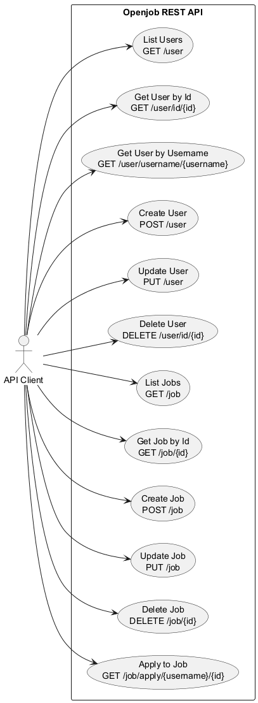
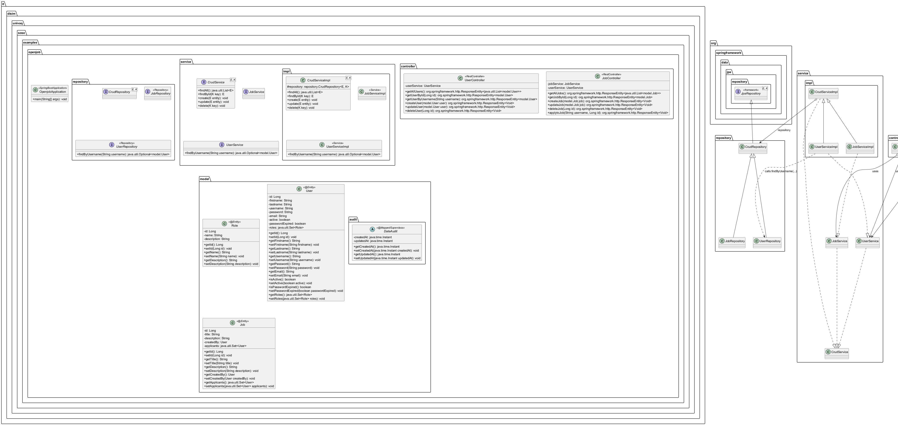
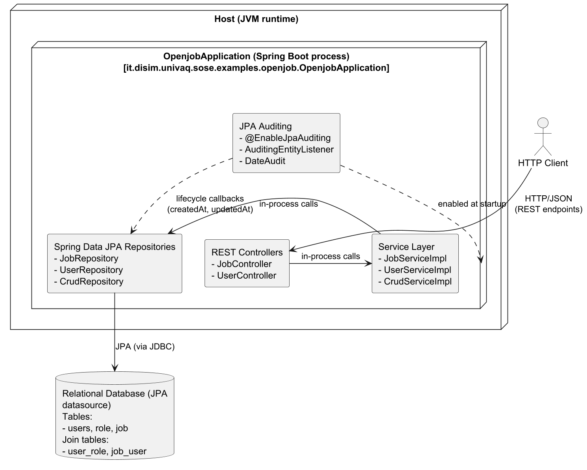

 

% 1 — System Overview
# SECTION 1 — System Overview

This section summarizes the system’s purpose, scope, and key features strictly derived from the provided source code. It introduces what the system does, what part of a larger solution it represents, and which capabilities are implemented and exposed, so that readers familiar with the codebase can validate the description.

## 1.1 Purpose and Context

The codebase implements a Spring Boot RESTful backend for managing job postings and users. It exposes CRUD operations for User and Job entities and supports a user applying to a job. Persistence is handled through Spring Data JPA and Jakarta Persistence annotations. Creation and modification timestamps are automatically managed and exposed via a shared auditing superclass.

The system appears as a self-contained backend service without UI or external integrations in the repository. It serializes entities directly as JSON in HTTP responses.

## 1.2 Scope

The repository constitutes the full backend service for “Openjob.” It contains the web layer (REST controllers), application/service layer (CRUD services, including one specialization for user lookups), persistence layer (repositories), and domain model (entities and an auditing base class). There is no separate module for roles beyond an entity definition, and there is no security, authentication, messaging, or external service integration present in the code.

## 1.3 Primary Functionalities

The service provides:
- CRUD operations for users and jobs over HTTP.
- Lookup of users by username.
- Association of a user to a job as an applicant.
- Persistence of domain entities with automatic auditing of creation and update timestamps.

The following public endpoints are implemented and can be validated in the controllers:

| Endpoint | HTTP | Summary | Controller Method | Response |
|---|---|---|---|---|
| /user | GET | List all users | UserController.getAllUsers | 200 OK (List<User>) |
| /user/id/{id} | GET | Get user by id | UserController.getUserById | 200 OK (User or null) |
| /user/username/{username} | GET | Get user by username | UserController.getUserByUsername | 200 OK (User or null) |
| /user | POST | Create a user | UserController.createUser | 204 No Content |
| /user | PUT | Update a user | UserController.updateUser | 204 No Content |
| /user/id/{id} | DELETE | Delete user by id | UserController.deleteUser | 204 No Content |
| /job | GET | List all jobs | JobController.getAllJobs | 200 OK (List<Job>) |
| /job/{id} | GET | Get job by id | JobController.getJobById | 200 OK (Job or null) |
| /job | POST | Create a job | JobController.createJob | 204 No Content |
| /job | PUT | Update a job | JobController.updateJob | 204 No Content |
| /job/{id} | DELETE | Delete job by id | JobController.deleteJob | 204 No Content |
| /job/apply/{username}/{id} | GET | Add user (by username) as applicant to job (by id) | JobController.applytoJob | 204 No Content |

Note: The job application is performed via a state-changing GET request, which is unusual for REST but accurately reflects the implementation.

## 1.4 Key Features Observable in the Codebase

The domain model comprises three entities and one auditing superclass. Entities are exposed directly in API responses.

| Feature | Evidence in Code | Notes |
|---|---|---|
| RESTful CRUD for User and Job | UserController, JobController | Controllers return ResponseEntity with 200/204 statuses. Entities are used directly as request/response bodies. |
| User lookup by username | UserRepository.findByUsername, UserServiceImpl.findByUsername, UserController.getUserByUsername | Returns 200 with the user or null if not found. |
| Apply to job | JobController.applytoJob | Loads Job by id and User by username; adds user to Job.applicants and updates the Job. |
| JPA persistence and repositories | CrudRepository extends JpaRepository; JobRepository; UserRepository | Generic CrudServiceImpl uses the injected CrudRepository for all CRUD operations. |
| Auditing of created/updated timestamps | DateAudit with @CreatedDate and @LastModifiedDate; @EnableJpaAuditing in OpenjobApplication | createdAt and updatedAt are serialized (allowGetters=true) but not accepted in requests. |
| Entity relationships | Job.createdBy (ManyToOne User); Job.applicants (ManyToMany User via job_user); User.roles (ManyToMany Role via user_role) | Both ManyToMany associations are EAGER; Role is modeled but not exposed via API. |
| ID generation | @GeneratedValue(strategy = GenerationType.IDENTITY) on entities | Relies on database identity columns. |
| JSON serialization details | @JsonIgnoreProperties on DateAudit | Prevents clients from setting audit fields while allowing them to be returned in responses. |

In summary, the system is a Spring Boot service that provides job and user management with basic associations and auditing. It is focused on core CRUD and a simple job application workflow, with persistence implemented via Spring Data JPA and without additional cross-cutting concerns such as authentication, authorization, or messaging in the current codebase.

% 2 — Architectural Context
## 2. Architectural Context

This section explains the environment in which the system operates, focusing on external systems and frameworks it relies on, the REST APIs it exposes, the persistent data sources it uses, and the actors interacting with it. All details below are inferred directly from the provided source code, without assumptions beyond what is explicitly implemented.

### External Systems

- Spring Boot application runtime (org.springframework.boot) used to bootstrap and run the service via OpenjobApplication.
- Spring Web MVC (org.springframework.web.bind.annotation, org.springframework.http) providing REST controller and request mapping infrastructure.
- Spring Data JPA (org.springframework.data.jpa.repository, org.springframework.data.jpa.domain.support.AuditingEntityListener, org.springframework.data.jpa.repository.config.EnableJpaAuditing) providing repository abstraction and auditing.
- Jakarta Persistence API (jakarta.persistence) providing JPA entity mapping and lifecycle annotations.
- Jackson (com.fasterxml.jackson.annotation) for JSON serialization control on audit fields.
- Relational database accessed through Spring Data JPA/JPA entities (specific vendor/configuration not defined in the codebase).

### APIs / Interfaces

- User REST API (base path: /user)
  - GET /user → returns 200 OK with List<User>.
  - GET /user/id/{id} → returns 200 OK with User by id (path variable id: Long).
  - GET /user/username/{username} → returns 200 OK with User by username or null if not present (path variable username: String).
  - POST /user → creates a user from request body (User) and returns 204 No Content.
  - PUT /user → updates a user from request body (User) and returns 204 No Content.
  - DELETE /user/id/{id} → deletes a user by id and returns 204 No Content.

- Job REST API (base path: /job)
  - GET /job → returns 200 OK with List<Job>.
  - GET /job/{id} → returns 200 OK with Job by id (path variable id: Long).
  - POST /job → creates a job from request body (Job) and returns 204 No Content.
  - PUT /job → updates a job from request body (Job) and returns 204 No Content.
  - DELETE /job/{id} → deletes a job by id and returns 204 No Content.
  - GET /job/apply/{username}/{id} → associates an existing User (by username) as an applicant to an existing Job (by id), persists the update, and returns 204 No Content. Path variables: username: String, id: Long.

All endpoints use JSON payloads corresponding to the JPA entity structures (User, Job), and respond with ResponseEntity wrappers and standard HTTP status codes as shown.

### Data Sources

- JPA entities mapped to relational tables:
  - User (table: users)
    - Primary key: user_id (Long, auto-generated).
    - Columns: first_name (not null, length 45), last_name (not null, length 45), username (not null, unique, length 32), password (not null, length 255), email (unique, length 50), active (not null, boolean), password_expired (not null, boolean), createdAt, updatedAt (from DateAudit).
    - Relationships: ManyToMany roles (eager), join table user_role (join column: user_id, inverse join column: role_id).
  - Role (table: role)
    - Primary key: role_id (Long, auto-generated).
    - Columns: name (not null, length 64), description (LOB), createdAt, updatedAt.
  - Job (table: job)
    - Primary key: job_id (Long, auto-generated).
    - Columns: title (not null, length 255), description (LOB), createdAt, updatedAt.
    - Relationships:
      - ManyToOne createdBy → User (join column: user_id, not null).
      - ManyToMany applicants (eager), join table job_user (join column: job_id, inverse join column: user_id).

- Auditing configuration:
  - DateAudit mapped superclass provides createdAt and updatedAt (Instant) with @CreatedDate and @LastModifiedDate managed by Spring Data JPA auditing via AuditingEntityListener and @EnableJpaAuditing.

- Repositories (Spring Data JPA):
  - CrudRepository<Entity, Key> base interface extends JpaRepository.
  - UserRepository extends CrudRepository<User, Long> with a derived query method findByUsername(String).
  - JobRepository extends CrudRepository<Job, Long>.

### Users / Actors

- External HTTP clients invoking the REST endpoints exposed by UserController and JobController. No authentication/authorization or security constraints are present in the code; endpoints are accessible to any HTTP client capable of sending JSON requests and receiving JSON responses.
- Internal service layer actors:
  - UserService and JobService abstractions, with UserServiceImpl and JobServiceImpl implementing CRUD operations and, for users, username lookup. These are internal components rather than external actors but are included here to clarify the interaction flow observed in controllers.

% 2.1 — Architectural Context – Use Case Diagram
## Section 2.1 — Architectural Context – Use Case Diagram

This section presents the external interaction context of the Openjob system as a use case diagram derived strictly from the implemented REST controllers and endpoints. The diagram models how an external HTTP client interacts with the system’s exposed use cases. It covers every available endpoint and operation found in the codebase so the development team can validate completeness and correctness against the controllers, services, and repositories.

### Figure 2.1 — Openjob Use Case Diagram (file: figure-2-1-openjob-use-case.puml)

Figure 2.1 illustrates a single external actor, the API Client, representing any HTTP consumer of the REST API. All use cases correspond one-to-one with implemented endpoints in JobController and UserController, reflecting the actual operations provided by the system.

### Endpoint-to-Use Case Traceability

The following table provides a precise mapping from each use case to its implementing controller method and downstream service/repository interactions. This traceability ensures that the diagram can be validated directly against the code.

| Use Case and Endpoint | Controller Method | Service Layer | Repository/Data Access | Primary Domain Entities |
|---|---|---|---|---|
| List Users — GET /user | UserController.getAllUsers() | UserService.findAll() via CrudServiceImpl.findAll() | UserRepository.findAll() | User |
| Get User by Id — GET /user/id/{id} | UserController.getUserById(Long) | UserService.findById(Long) via CrudServiceImpl.findById() | UserRepository.findById(Long) | User |
| Get User by Username — GET /user/username/{username} | UserController.getUserByUsername(String) | UserService.findByUsername(String) | UserRepository.findByUsername(String) | User |
| Create User — POST /user | UserController.createUser(User) | UserService.create(User) via CrudServiceImpl.create() | UserRepository.save(User) | User, Role (association) |
| Update User — PUT /user | UserController.updateUser(User) | UserService.update(User) via CrudServiceImpl.update() | UserRepository.save(User) | User, Role (association) |
| Delete User — DELETE /user/id/{id} | UserController.deleteUser(Long) | UserService.delete(Long) via CrudServiceImpl.delete() | UserRepository.deleteById(Long) | User |
| List Jobs — GET /job | JobController.getAllJobs() | JobService.findAll() via CrudServiceImpl.findAll() | JobRepository.findAll() | Job |
| Get Job by Id — GET /job/{id} | JobController.getJobById(Long) | JobService.findById(Long) via CrudServiceImpl.findById() | JobRepository.findById(Long) | Job |
| Create Job — POST /job | JobController.createJob(Job) | JobService.create(Job) via CrudServiceImpl.create() | JobRepository.save(Job) | Job, User (createdBy) |
| Update Job — PUT /job | JobController.updateJob(Job) | JobService.update(Job) via CrudServiceImpl.update() | JobRepository.save(Job) | Job, User (createdBy/applicants) |
| Delete Job — DELETE /job/{id} | JobController.deleteJob(Long) | JobService.delete(Long) via CrudServiceImpl.delete() | JobRepository.deleteById(Long) | Job |
| Apply to Job — GET /job/apply/{username}/{id} | JobController.applytoJob(String, Long) | JobService.findById(Long); UserService.findByUsername(String); JobService.update(Job) | JobRepository.findById(Long); UserRepository.findByUsername(String); JobRepository.save(Job) | Job, User |

This context and mapping cover every externally reachable operation in the source code. No additional use cases or actors are introduced beyond what is implemented.

% 3 — Containers
## 3. Containers

This section identifies all runtime containers that compose the Openjob system as implemented in the provided codebase. It clarifies each container’s responsibility, the concrete technologies and frameworks used within the code, and the mechanisms through which containers communicate. The description is derived strictly from the source code without introducing external or assumed components.

| Container | Responsibility | Technology | Communication |
|---|---|---|---|
| Openjob REST API Application | Exposes REST endpoints to manage users and jobs, including CRUD operations and job application linkage between users and jobs; orchestrates business logic and persistence; manages auditing timestamps on entities. | Spring Boot, Spring Web (REST Controllers), Spring Data JPA, Jakarta Persistence (JPA annotations), Jackson (JSON), Spring Data JPA Auditing | Exposes HTTP/JSON endpoints to clients; uses JPA to persist and query data in the relational database over JDBC/SQL (configured externally). |
| Relational Database | Persists domain entities and relationships: User, Role, Job; many-to-many join tables user_role and job_user; maintains audit fields createdAt and updatedAt. | RDBMS compatible with JPA (vendor configured externally) | Receives JDBC/SQL queries from the application via JPA. |

% 3.1 — Architecture Overview – Component Diagram
# Section 3.1 — Architecture Overview – Component Diagram

This section presents the component-level structure of the Openjob application as implemented in the provided codebase. It documents the Spring Boot layered architecture consisting of REST controllers, service interfaces and implementations, repositories, domain entities, and auditing configuration. The diagram shows all concrete classes and interfaces present in the repository, their dependencies, and the exposed REST endpoints. It is intended to be directly verifiable against the source code.

Figure: openjob-section-3-1-component-diagram.puml — Section 3.1 — Architecture Overview – Component Diagram

% 4 — Components
## 4. Components

This section identifies and describes all internal components implemented in the Openjob Spring Boot application. It focuses on each class and interface, its primary responsibility, and its concrete collaborations with other components as evidenced by imports, inheritance, composition, and method calls in the provided codebase. The goal is to provide an accurate, verifiable view of how responsibilities are partitioned and how components depend on each other within the single application container.

| Component | Responsibility | Interactions |
|---|---|---|
| it.disim.univaq.sose.examples.openjob.OpenjobApplication | Application bootstrapper enabling Spring Boot auto-configuration and JPA auditing; entry point of the service. | Enables auditing consumed by model.audit.DateAudit via @EnableJpaAuditing. |
| it.disim.univaq.sose.examples.openjob.controller.JobController | Exposes REST endpoints under /job to manage Job entities and allow users to apply to jobs. Delegates business operations to services. | Uses it.disim.univaq.sose.examples.openjob.service.JobService; uses it.disim.univaq.sose.examples.openjob.service.UserService; exchanges it.disim.univaq.sose.examples.openjob.model.Job and it.disim.univaq.sose.examples.openjob.model.User. |
| it.disim.univaq.sose.examples.openjob.controller.UserController | Exposes REST endpoints under /user to manage User entities (CRUD and lookup by username). Delegates to UserService. | Uses it.disim.univaq.sose.examples.openjob.service.UserService; exchanges it.disim.univaq.sose.examples.openjob.model.User. |
| it.disim.univaq.sose.examples.openjob.model.audit.DateAudit | Base auditable superclass adding createdAt and updatedAt timestamps via Spring Data JPA auditing. | Extended by it.disim.univaq.sose.examples.openjob.model.Job, it.disim.univaq.sose.examples.openjob.model.Role, it.disim.univaq.sose.examples.openjob.model.User; relies on auditing enabled by it.disim.univaq.sose.examples.openjob.OpenjobApplication. |
| it.disim.univaq.sose.examples.openjob.model.Job | JPA entity representing a job posting with title, description, creator, and applicants. | Extends model.audit.DateAudit; associates with it.disim.univaq.sose.examples.openjob.model.User via @ManyToOne createdBy and @ManyToMany applicants; persisted via it.disim.univaq.sose.examples.openjob.repository.JobRepository; manipulated by it.disim.univaq.sose.examples.openjob.service.JobServiceImpl and exposed via controllers. |
| it.disim.univaq.sose.examples.openjob.model.Role | JPA entity representing an authorization role with name and description. | Extends model.audit.DateAudit; associated to it.disim.univaq.sose.examples.openjob.model.User via @ManyToMany; loaded via JPA through user relationships. |
| it.disim.univaq.sose.examples.openjob.model.User | JPA entity representing an application user with identity, credentials, status, and roles. | Extends model.audit.DateAudit; associates with it.disim.univaq.sose.examples.openjob.model.Role via @ManyToMany; associated from it.disim.univaq.sose.examples.openjob.model.Job applicants; persisted via it.disim.univaq.sose.examples.openjob.repository.UserRepository; accessed via it.disim.univaq.sose.examples.openjob.service.UserServiceImpl and controllers. |
| it.disim.univaq.sose.examples.openjob.repository.CrudRepository<Entity, Key> | Generic Spring Data repository abstraction extending JpaRepository to unify CRUD repositories. | Extended by it.disim.univaq.sose.examples.openjob.repository.JobRepository and it.disim.univaq.sose.examples.openjob.repository.UserRepository; injected into it.disim.univaq.sose.examples.openjob.service.impl.CrudServiceImpl. |
| it.disim.univaq.sose.examples.openjob.repository.JobRepository | Spring Data repository for Job entities, inheriting generic CRUD operations. | Extends repository.CrudRepository<Job, Long>; used via autowired generic in it.disim.univaq.sose.examples.openjob.service.impl.JobServiceImpl through base it.disim.univaq.sose.examples.openjob.service.impl.CrudServiceImpl. |
| it.disim.univaq.sose.examples.openjob.repository.UserRepository | Spring Data repository for User entities with a custom findByUsername operation. | Extends repository.CrudRepository<User, Long>; used in it.disim.univaq.sose.examples.openjob.service.impl.UserServiceImpl (direct cast for findByUsername) via base it.disim.univaq.sose.examples.openjob.service.impl.CrudServiceImpl. |
| it.disim.univaq.sose.examples.openjob.service.CrudService<Entity, Key> | Generic service contract for CRUD operations abstracting persistence access. | Implemented by it.disim.univaq.sose.examples.openjob.service.impl.CrudServiceImpl; specialized by it.disim.univaq.sose.examples.openjob.service.JobService and it.disim.univaq.sose.examples.openjob.service.UserService; consumed by controllers via specialized services. |
| it.disim.univaq.sose.examples.openjob.service.JobService | Service contract for Job CRUD operations. | Extends service.CrudService<Job, Long>; implemented by it.disim.univaq.sose.examples.openjob.service.impl.JobServiceImpl; consumed by it.disim.univaq.sose.examples.openjob.controller.JobController. |
| it.disim.univaq.sose.examples.openjob.service.UserService | Service contract for User CRUD operations plus username lookup. | Extends service.CrudService<User, Long>; implemented by it.disim.univaq.sose.examples.openjob.service.impl.UserServiceImpl; consumed by it.disim.univaq.sose.examples.openjob.controller.UserController and it.disim.univaq.sose.examples.openjob.controller.JobController (apply-to-job). |
| it.disim.univaq.sose.examples.openjob.service.impl.CrudServiceImpl<Entity, Key> | Generic service implementation delegating CRUD operations to an injected CrudRepository. | Injects repository.CrudRepository<Entity, Key>; base class of it.disim.univaq.sose.examples.openjob.service.impl.JobServiceImpl and it.disim.univaq.sose.examples.openjob.service.impl.UserServiceImpl; indirectly collaborates with JobRepository and UserRepository through type-parameterized injection. |
| it.disim.univaq.sose.examples.openjob.service.impl.JobServiceImpl | Concrete Job service using the generic CRUD base to perform persistence operations. | Extends service.impl.CrudServiceImpl<Job, Long>; implements service.JobService; relies on repository.JobRepository via injected base repository; used by controller.JobController. |
| it.disim.univaq.sose.examples.openjob.service.impl.UserServiceImpl | Concrete User service using the generic CRUD base and adding findByUsername by delegating to UserRepository. | Extends service.impl.CrudServiceImpl<User, Long>; implements service.UserService; casts injected repository to repository.UserRepository for findByUsername; used by controller.UserController and controller.JobController. |

% 5 — Code-Level View
# Section 5 — Code-Level View

This section maps the architectural elements of the system to concrete source code constructs. It identifies the main execution entry point, enumerates REST entry points, details the module and package structure, and explains how responsibilities are allocated across controllers, services, repositories, and domain entities. The description is derived solely from the provided source code and is intended to support validation by the development team.

## 5.1 Main Entry Points

The system has one JVM process entry point and multiple HTTP REST entry points exposed by Spring MVC controllers. The following tables enumerate them completely.

Table 5.1.a — Process entry point

| Entry point | Class | Method signature | Notes |
|---|---|---|---|
| Spring Boot application bootstrap | it.disim.univaq.sose.examples.openjob.OpenjobApplication | public static void main(String[] args) | Enables JPA auditing via @EnableJpaAuditing and starts the Spring context via SpringApplication.run. |

Table 5.1.b — REST endpoints (JobController)

| HTTP method | Path | Controller method | Return type | HTTP status on success | Description |
|---|---|---|---|---|---|
| GET | /job | getAllJobs() | ResponseEntity<List<Job>> | 200 OK | Retrieves all Job entities. |
| GET | /job/{id} | getJobById(Long id) | ResponseEntity<Job> | 200 OK | Retrieves a Job by id. Returns null body if not found (HTTP 200). |
| POST | /job | createJob(Job job) | ResponseEntity<Void> | 204 No Content | Persists a new Job. |
| PUT | /job | updateJob(Job job) | ResponseEntity<Void> | 204 No Content | Updates an existing Job. |
| DELETE | /job/{id} | deleteJob(Long id) | ResponseEntity<Void> | 204 No Content | Deletes a Job by id. |
| GET | /job/apply/{username}/{id} | applytoJob(String username, Long id) | ResponseEntity<Void> | 204 No Content | Adds the User identified by username to the Job applicants set and saves the Job. Throws NoSuchElementException (becomes 500) if user not found. |

Table 5.1.c — REST endpoints (UserController)

| HTTP method | Path | Controller method | Return type | HTTP status on success | Description |
|---|---|---|---|---|---|
| GET | /user | getAllUsers() | ResponseEntity<List<User>> | 200 OK | Retrieves all User entities. |
| GET | /user/id/{id} | getUserById(Long id) | ResponseEntity<User> | 200 OK | Retrieves a User by id. Returns null body if not found (HTTP 200). |
| GET | /user/username/{username} | getUserByUsername(String username) | ResponseEntity<User> | 200 OK | Retrieves a User by username. Returns null body if not found (HTTP 200). |
| POST | /user | createUser(User user) | ResponseEntity<Void> | 204 No Content | Persists a new User. |
| PUT | /user | updateUser(User user) | ResponseEntity<Void> | 204 No Content | Updates an existing User. |
| DELETE | /user/id/{id} | deleteUser(Long id) | ResponseEntity<Void> | 204 No Content | Deletes a User by id. |

## 5.2 Module and Directory Structure

The codebase follows a conventional Spring layered structure. Packages reflect the logical layering and responsibilities as follows.

Table 5.2 — Packages and responsibilities

| Package | Responsibility |
|---|---|
| it.disim.univaq.sose.examples.openjob | Application bootstrap and configuration enabling JPA auditing. |
| it.disim.univaq.sose.examples.openjob.controller | HTTP REST controllers exposing CRUD and domain actions for Job and User. |
| it.disim.univaq.sose.examples.openjob.model | JPA domain entities (User, Role, Job) and auditing superclass. |
| it.disim.univaq.sose.examples.openjob.model.audit | Auditing base class with createdAt and updatedAt timestamps. |
| it.disim.univaq.sose.examples.openjob.repository | Spring Data JPA repositories (generic base and specific repositories). |
| it.disim.univaq.sose.examples.openjob.service | Service interfaces defining domain operations and generic CRUD. |
| it.disim.univaq.sose.examples.openjob.service.impl | Service implementations, including a generic CRUD base and concrete services. |

## 5.3 Component-to-Code Mapping

The following table provides a complete mapping of architectural components to concrete classes and interfaces, including key dependencies.

Table 5.3 — Classes, types, and dependencies

| Package | Class/Interface | Type | Responsibility | Key dependencies |
|---|---|---|---|---|
| it.disim.univaq.sose.examples.openjob | OpenjobApplication | Class | Spring Boot application main; enables JPA auditing. | SpringApplication, @EnableJpaAuditing |
| it.disim.univaq.sose.examples.openjob.controller | JobController | Class (@RestController) | Exposes Job CRUD and apply-to-job endpoints. | JobService, UserService, Spring Web MVC |
| it.disim.univaq.sose.examples.openjob.controller | UserController | Class (@RestController) | Exposes User CRUD and lookup by username. | UserService, Spring Web MVC |
| it.disim.univaq.sose.examples.openjob.model.audit | DateAudit | Abstract class (@MappedSuperclass) | Provides createdAt/updatedAt fields managed by JPA auditing. | AuditingEntityListener, @CreatedDate, @LastModifiedDate, Jackson @JsonIgnoreProperties |
| it.disim.univaq.sose.examples.openjob.model | User | Entity (@Entity, @Table("users")) | Domain model for users, roles, and credentials; ManyToMany roles. | Role, JPA annotations |
| it.disim.univaq.sose.examples.openjob.model | Role | Entity (@Entity, @Table("role")) | Domain model for roles with name and description. | JPA annotations |
| it.disim.univaq.sose.examples.openjob.model | Job | Entity (@Entity, @Table("job")) | Domain model for jobs; createdBy (ManyToOne User) and applicants (ManyToMany Users). | User, JPA annotations |
| it.disim.univaq.sose.examples.openjob.repository | CrudRepository<Entity,Key> | Interface | Base repository extending JpaRepository to unify type usage. | Spring Data JPA |
| it.disim.univaq.sose.examples.openjob.repository | UserRepository | Interface (@Repository) | Repository for User with finder by username. | CrudRepository<User,Long> |
| it.disim.univaq.sose.examples.openjob.repository | JobRepository | Interface (@Repository) | Repository for Job entities. | CrudRepository<Job,Long> |
| it.disim.univaq.sose.examples.openjob.service | CrudService<Entity,Key> | Interface | Generic CRUD service contract. | — |
| it.disim.univaq.sose.examples.openjob.service | UserService | Interface | Extends CrudService with findByUsername. | CrudService<User,Long> |
| it.disim.univaq.sose.examples.openjob.service | JobService | Interface | Extends CrudService for Job. | CrudService<Job,Long> |
| it.disim.univaq.sose.examples.openjob.service.impl | CrudServiceImpl<Entity,Key> | Class | Generic CRUD service implementation delegating to a typed repository bean. | CrudRepository<Entity,Key> (autowired) |
| it.disim.univaq.sose.examples.openjob.service.impl | UserServiceImpl | Class (@Service) | User service implementation; adds findByUsername via repository cast. | CrudServiceImpl<User,Long>, UserRepository |
| it.disim.univaq.sose.examples.openjob.service.impl | JobServiceImpl | Class (@Service) | Job service implementation; inherits generic CRUD behavior. | CrudServiceImpl<Job,Long> |

## 5.4 Key Classes and Responsibilities

The OpenjobApplication class is the sole process entry point. It activates Spring Data JPA auditing through the @EnableJpaAuditing annotation, which, together with the AuditingEntityListener referenced by DateAudit, automatically populates createdAt and updatedAt fields on entities extending DateAudit.

The controller classes provide the REST API surface. JobController exposes CRUD operations for Job and a domain action to apply a user to a job by username and job id. It composes JobService and UserService and returns ResponseEntity with explicit HTTP status codes. UserController exposes CRUD operations and a lookup by username. Neither controller performs input validation nor exception translation; the default Spring exception handling applies. Notably, JobController.applytoJob uses Optional.orElseThrow() on the User lookup, which triggers a NoSuchElementException if the user is missing, resulting in a 500 response by default.

The service layer centralizes business operations. CrudService defines a generic CRUD contract used by both JobService and UserService. CrudServiceImpl implements this contract by delegating to a Spring Data repository, injected as a generic CrudRepository<Entity, Key>. JobServiceImpl inherits the generic behavior without extension. UserServiceImpl adds a type-specific operation findByUsername by downcasting the injected generic repository to UserRepository to access the Spring Data derived query method.

The repository layer is built on Spring Data JPA. CrudRepository<Entity, Key> standardizes usage by extending JpaRepository and being marked with @NoRepositoryBean to avoid container instantiation. JobRepository and UserRepository are type-specific repositories; UserRepository adds findByUsername(String username), which Spring Data implements based on naming conventions.

The domain model is implemented as JPA entities. User, Role, and Job extend DateAudit to inherit timestamp fields. User holds credential and profile fields, a boolean active flag, a boolean passwordExpired flag, and an eager ManyToMany roles association through the user_role join table. Role defines name and description. Job defines title, description (as a LOB), createdBy as a mandatory ManyToOne association to User, and applicants as an eager ManyToMany association via the job_user join table.

The DateAudit abstract class is a @MappedSuperclass with createdAt and updatedAt fields of type Instant, annotated with @CreatedDate and @LastModifiedDate. It registers the AuditingEntityListener and marks the fields as @JsonIgnoreProperties(allowGetters = true), enabling safe serialization while preventing setters from being required in client payloads.

## 5.5 Architectural and Design Patterns Observed

The codebase implements a classic layered architecture comprising Controller, Service, Repository, and Domain layers. Controllers mediate HTTP requests and delegate to services. Services encapsulate business operations and orchestrate repositories. Repositories encapsulate data access concerns through Spring Data JPA. The domain model uses the Domain Model pattern with JPA entity mapping and auditing via a shared mapped superclass.

There is a generic CRUD pattern implemented via the CrudService interface and CrudServiceImpl base class, reused by concrete services. The repository layer uses the Repository pattern with Spring Data’s derived query method for finding a user by username. REST endpoints expose domain entities directly as payloads, without DTO mapping.

## 5.6 Cross-Cutting Concerns and Configuration in Code

JPA auditing is enabled in code through @EnableJpaAuditing on OpenjobApplication and the AuditingEntityListener on DateAudit. Entities inheriting DateAudit will have createdAt set on insert and updatedAt set on update automatically.

JSON serialization of audit fields is controlled with @JsonIgnoreProperties(value = {"createdAt", "updatedAt"}, allowGetters = true) on DateAudit, which exposes getters during serialization while ignoring setters during deserialization.

Entity associations to roles and applicants are configured with FetchType.EAGER. This causes immediate loading of these collections upon entity retrieval, which can affect performance and serialization size. The Job.createdBy association is mandatory (nullable = false) and ensures referential integrity at the JPA level.

Dependency injection is performed via field injection (@Autowired) in controllers and the generic repository field in CrudServiceImpl. For service implementations, Spring resolves and injects the appropriate typed repository proxy matching the generic parameters when creating the concrete service beans.

## 5.7 Methods and Interfaces — Complete Listing

The following tables summarize the publicly exposed methods in services and controllers as implemented.

Table 5.7.a — Service interfaces and implementations

| Service type | Interface methods | Implementation notes |
|---|---|---|
| CrudService<Entity, Key> | findAll(); findById(Key key); create(Entity entity); update(Entity entity); delete(Key key) | CrudServiceImpl<Entity, Key> delegates to CrudRepository<Entity, Key> methods findAll, findById, save, deleteById. |
| JobService | Inherits all methods from CrudService<Job, Long> | JobServiceImpl extends CrudServiceImpl<Job, Long> with no additional behavior. |
| UserService | Inherits all methods from CrudService<User, Long>; findByUsername(String username) | UserServiceImpl extends CrudServiceImpl<User, Long> and implements findByUsername by casting repository to UserRepository and invoking findByUsername. |

Table 5.7.b — Repository interfaces

| Repository | Base type | Custom methods |
|---|---|---|
| CrudRepository<Entity, Key> | JpaRepository<Entity, Key> | None; inherits all JpaRepository CRUD methods. |
| JobRepository | CrudRepository<Job, Long> | None. |
| UserRepository | CrudRepository<User, Long> | Optional<User> findByUsername(String username) |

Table 5.7.c — Controller methods

| Controller | Method | Signature | Behavior summary |
|---|---|---|---|
| JobController | getAllJobs | ResponseEntity<List<Job>> getAllJobs() | Returns all jobs with status 200. |
| JobController | getJobById | ResponseEntity<Job> getJobById(Long id) | Returns a job or null body with status 200. |
| JobController | createJob | ResponseEntity<Void> createJob(@RequestBody Job job) | Persists job; returns 204. |
| JobController | updateJob | ResponseEntity<Void> updateJob(@RequestBody Job job) | Persists job; returns 204. |
| JobController | deleteJob | ResponseEntity<Void> deleteJob(Long id) | Deletes job; returns 204. |
| JobController | applytoJob | ResponseEntity<Void> applytoJob(String username, Long id) | Adds user to job applicants; returns 204 or fails with 500 if user not found. |
| UserController | getAllUsers | ResponseEntity<List<User>> getAllUsers() | Returns all users with status 200. |
| UserController | getUserById | ResponseEntity<User> getUserById(Long id) | Returns a user or null body with status 200. |
| UserController | getUserByUsername | ResponseEntity<User> getUserByUsername(String username) | Returns a user or null body with status 200. |
| UserController | createUser | ResponseEntity<Void> createUser(@RequestBody User user) | Persists user; returns 204. |
| UserController | updateUser | ResponseEntity<Void> updateUser(@RequestBody User user) | Persists user; returns 204. |
| UserController | deleteUser | ResponseEntity<Void> deleteUser(Long id) | Deletes user; returns 204. |

## 5.8 External Libraries Referenced by Code

The imports evidence usage of the following frameworks and libraries. Spring Boot provides auto-configuration and application bootstrap. Spring Web MVC provides REST controller annotations and ResponseEntity. Spring Data JPA provides repository abstractions, auditing annotations, and entity listeners. Jakarta Persistence (JPA) annotations define entity mappings and relationships. Jackson annotations configure JSON serialization behavior. No additional configuration or external integrations are present in the provided code.

This concludes the code-level view mapping. The content can be validated by inspecting the listed classes, their annotations, and the explicit method signatures and paths in the controllers.

% 5.1 — Class Diagram
# Section 5.1 — Class Diagram

This section presents a complete, code-accurate class diagram of the Openjob application. It captures the static structure of the codebase, including all classes, interfaces, inheritance hierarchies, key attributes and operations, and the principal associations between layers (controllers, services, repositories, and entities). The diagram reflects exactly what is implemented and is suitable for validation by the development team.

Figure 5.1 — Openjob Class Diagram (PlantUML: fig-5-1-openjob-class-diagram.puml)

Class inventory

| Package                                                                | Type                 | Kind        | Stereotype               |
|------------------------------------------------------------------------|----------------------|-------------|--------------------------|
| it.disim.univaq.sose.examples.openjob                                  | OpenjobApplication   | Class       | SpringBootApplication    |
| it.disim.univaq.sose.examples.openjob.controller                       | JobController        | Class       | RestController           |
| it.disim.univaq.sose.examples.openjob.controller                       | UserController       | Class       | RestController           |
| it.disim.univaq.sose.examples.openjob.service                          | CrudService<E,K>     | Interface   | —                        |
| it.disim.univaq.sose.examples.openjob.service                          | JobService           | Interface   | —                        |
| it.disim.univaq.sose.examples.openjob.service                          | UserService          | Interface   | —                        |
| it.disim.univaq.sose.examples.openjob.service.impl                     | CrudServiceImpl<E,K> | Class       | —                        |
| it.disim.univaq.sose.examples.openjob.service.impl                     | JobServiceImpl       | Class       | Service                  |
| it.disim.univaq.sose.examples.openjob.service.impl                     | UserServiceImpl      | Class       | Service                  |
| it.disim.univaq.sose.examples.openjob.repository                       | CrudRepository<E,K>  | Interface   | —                        |
| it.disim.univaq.sose.examples.openjob.repository                       | JobRepository        | Interface   | Repository               |
| it.disim.univaq.sose.examples.openjob.repository                       | UserRepository       | Interface   | Repository               |
| it.disim.univaq.sose.examples.openjob.model.audit                      | DateAudit            | Abstract    | @MappedSuperclass        |
| it.disim.univaq.sose.examples.openjob.model                            | User                 | Class       | @Entity                  |
| it.disim.univaq.sose.examples.openjob.model                            | Role                 | Class       | @Entity                  |
| it.disim.univaq.sose.examples.openjob.model                            | Job                  | Class       | @Entity                  |

This diagram and inventory include every class and interface present in the codebase and depict their exact relationships, inheritance, and key associations, enabling straightforward validation against the sources.

% 6 — Cross-Cutting Concerns
## 6. Cross-Cutting Concerns

This section identifies and explains cross-cutting aspects implemented or implied by the current codebase. It is limited strictly to concerns that are observable from the provided source code and highlights both the implemented mechanisms and notable absences. The intent is to support validation by the development team and provide a clear basis for risk assessment and improvement planning.

| Concern | Evidence from code | Description |
|---|---|---|
| Authentication | Absence of Spring Security configuration, filters, or annotations; controllers (JobController, UserController) expose endpoints without any access control. | No authentication is enforced at the API level. All endpoints appear publicly accessible. |
| Authorization (RBAC) | Role entity exists (model/Role.java), User has roles (User.roles with @ManyToMany), but no @PreAuthorize, method security, or access checks anywhere. | Roles are modeled in the data layer but are not applied in the service or controller layers; there is no authorization logic in the application. |
| Password handling and encryption | User.password is a plain String; no password encoder usage; controllers accept and return User entities directly; no @JsonIgnore on password. | Passwords are stored and likely serialized in clear text. There is no hashing, salting, or masking. Returned User entities may expose passwords in API responses. |
| Data auditing | DateAudit with @CreatedDate and @LastModifiedDate (model/audit/DateAudit.java), @EntityListeners(AuditingEntityListener.class), @EnableJpaAuditing in OpenjobApplication. | Automatic creation and update timestamps are handled transparently for all entities extending DateAudit. createdAt and updatedAt are serialized but ignored on write due to @JsonIgnoreProperties(allowGetters = true). |
| Logging | No logger fields or logging statements in controllers, services, or repositories. | The application performs no structured logging. Failures will not be captured or correlated beyond default framework logs. |
| Error handling and exception mapping | CrudServiceImpl.findById returns null on missing entity; UserController returns ResponseEntity with body null and 200 OK; JobController.applytoJob uses orElseThrow() without @ExceptionHandler; no @ControllerAdvice. | There is no centralized exception handling. Missing resources may lead to 200 OK with null or unhandled exceptions (e.g., NoSuchElementException), resulting in inconsistent client behavior. |
| Input validation | No jakarta.validation annotations on DTOs/entities (e.g., @NotNull, @Email); no @Valid on @RequestBody in controllers; only JPA @Column constraints. | The API accepts and persists request payloads without bean validation. Data quality and error messaging depend solely on database constraints at save time. |
| Transaction management | Services are not annotated with @Transactional; operations rely on Spring Data JPA defaults via repository.save/delete in CrudServiceImpl. | Write operations participate in repository-managed transactions by default, but multi-step workflows (e.g., applytoJob modifies and saves) are not explicitly transactional at the service layer. |
| Configuration management | No usage of @Value, @ConfigurationProperties, or explicit configuration classes; no configuration files shown. | Application configuration is not visible in the codebase provided; there is no code-level externalized configuration mapping. |
| Monitoring and health endpoints | No Spring Boot Actuator usage or Micrometer metrics in code. | The application lacks built-in health checks, metrics, or tracing instrumentation. |
| Testing | No test sources present. | There is no automated test coverage evident in the repository, leaving cross-cutting behavior unverified. |
| Serialization and API exposure | Controllers return entity types directly (ResponseEntity<List<User>>, ResponseEntity<User>, ResponseEntity<List<Job>>, ResponseEntity<Job>); no DTO mapping; DateAudit allows getters; no @JsonIgnore on sensitive fields like User.password. | Direct entity exposure risks leaking internal fields and tight coupling between persistence and API. Sensitive data can be serialized unintentionally. |
| CORS and API security headers | No CORS configuration or filters. | Cross-origin access policy is not defined at application level, which may block legitimate clients by default or leave the API without explicit policy. |
| Pagination and result limiting | CrudService.findAll delegates to repository.findAll; controllers expose GET endpoints returning entire collections; no Pageable usage. | The API does not implement pagination, which may lead to large payloads and performance issues on growing datasets. |
| Data access and fetch strategy | @ManyToMany(fetch = FetchType.EAGER) on Job.applicants and User.roles; Job.createdBy is @ManyToOne without explicit fetch override (defaults to EAGER for ManyToOne). | Eager loading across relationships increases payload size and query cost on reads, impacting performance system-wide; it also affects serialization size. |
| Dependency injection style | Field injection via @Autowired in controllers and CrudServiceImpl.repository. | Field injection reduces testability and immutability compared to constructor injection; this is a cross-cutting maintainability concern. |
| Generic CRUD abstraction | CrudService and CrudServiceImpl wrapping CrudRepository, with JobServiceImpl and UserServiceImpl extending the generic implementation. | A uniform CRUD pattern is applied across entities, promoting consistency and reducing duplication; cross-cutting behavior (e.g., validation, transactions, logging) could be centralized here but is currently absent. |

% 7 — Quality Attributes and Rationale
## 7. Quality Attributes and Rationale

This section identifies the primary quality attributes observable in the codebase and explains how the implementation supports or hinders them. Each attribute is backed by concrete evidence from the source code to facilitate validation by the development team.

| Quality Attribute | Evidence | Rationale |
| --- | --- | --- |
| Maintainability (Layering) | Controllers: JobController, UserController; Services: JobService, UserService, CrudService, CrudServiceImpl, JobServiceImpl, UserServiceImpl; Repositories: CrudRepository, JobRepository, UserRepository; Models: User, Job, Role, DateAudit | A clear controller–service–repository–model layering separates concerns and minimizes coupling, simplifying maintenance and localized changes. |
| Maintainability (Reuse via Generics) | CrudService and CrudServiceImpl provide generic CRUD operations; JobServiceImpl and UserServiceImpl extend CrudServiceImpl | Generic abstractions eliminate duplicated CRUD logic and ease addition of new entities by implementing thin service/repository pairs. |
| Extensibility | Service and repository interfaces (JobService, UserService; JobRepository, UserRepository) with stereotype annotations (@Service, @Repository) | New domain entities and endpoints can be added with minimal boilerplate by following the established patterns. |
| Auditability/Traceability | DateAudit with @CreatedDate and @LastModifiedDate; @EnableJpaAuditing in OpenjobApplication; @JsonIgnoreProperties on DateAudit | Automatic createdAt/updatedAt population provides basic temporal traceability at the entity level and reduces manual coding. |
| Data Integrity | JPA constraints: nullable = false on mandatory fields (e.g., User.firstname, lastname, username, password, active, passwordExpired; Job.title; Job.createdBy with @ManyToOne(optional = false)); unique = true on username and email | Database-level constraints modeled through JPA annotations enforce core invariants and uniqueness, improving consistency. |
| Reliability (Error Handling) | CrudServiceImpl.findById returns null on missing entity; UserController.getUserById and getUserByUsername return 200 with null body; JobController.applytoJob uses userService.findByUsername(...).orElseThrow() | Inconsistent not-found handling (null bodies vs. runtime exceptions) may surface as 200 with null or unhandled exceptions, reducing reliability and client predictability. |
| Security (Data Exposure) | Controllers return entity instances directly (UserController returns User, JobController returns Job); User includes password field; DateAudit only suppresses createdAt/updatedAt in JSON | Returning entities exposes sensitive fields (password) in responses. There is no DTO mapping or field-level suppression for secrets, creating a critical confidentiality risk. |
| Security (Authentication/Authorization) | No security configuration; endpoints accept unauthenticated calls; applytoJob uses username path parameter | Lack of authentication/authorization allows unrestricted read/write operations and job applications, which is inappropriate for user and job data. |
| Performance (Fetching Strategy) | @ManyToMany(fetch = FetchType.EAGER) on User.roles and Job.applicants | EAGER fetching can cause unnecessary joins and large payloads, especially when combined with bulk reads, impacting latency and memory. |
| Scalability (Collection Size and Pagination) | getAllUsers() and getAllJobs() return full lists; no pagination; ManyToMany relations with EAGER fetch | Unbounded list endpoints and eager-loaded relationships do not scale with data growth and may lead to large queries and responses. |
| Consistency/Concurrency | No @Version on entities; no @Transactional on services; updates rely on repository.save; applytoJob modifies in-memory Set and updates the Job | Absence of optimistic locking and explicit transaction demarcation may allow lost updates under concurrent modifications to applicants or other fields. |
| API Usability (HTTP Semantics) | Create and update endpoints return 204 No Content without Location or response body | Using 204 for create/update provides no resource identifiers or echoes; clients may need additional calls to retrieve entities, reducing API usability. |
| Interoperability (Standards/Frameworks) | Spring Boot (@SpringBootApplication), Spring Web MVC (@RestController), Spring Data JPA | Standard frameworks and annotations improve interoperability with tooling and hosting environments and simplify integration. |
| Testability | Service interfaces exist; however, field injection with @Autowired in controllers/services; no validation or exception mappers | Interfaces aid mocking, but field injection complicates unit testing compared to constructor injection; lack of centralized error handling increases test burden. |
| Observability | No logging, metrics, or exception translation layer; controllers return ResponseEntity directly | Absence of logs/metrics hampers diagnostics and monitoring; failures may be silent or non-uniformly represented to clients. |
| Portability/Deployability | Single Spring Boot application (OpenjobApplication main) | Self-contained executable improves deployability across environments supporting Java and a relational database. |
| Data Volume Handling | @Lob on Job.description and Role.description; EAGER fetch coupled with @Lob | Large text fields may be transferred even when unnecessary, increasing payload sizes in list endpoints. |

Overall rationale: The codebase emphasizes maintainability and reuse via a conventional layered Spring architecture and generic CRUD abstractions, and it provides auditing and basic integrity constraints. However, security, reliability, performance, and scalability are currently constrained by direct entity exposure, eager fetching, lack of pagination, inconsistent error handling, and missing concurrency controls. Addressing these areas will significantly improve operational qualities without disrupting the established structure.

% 8 — Deployment View
## 8. Deployment View

This section explains how the Openjob software elements are allocated to runtime infrastructure based strictly on what is present in the repository. The codebase is a single Spring Boot service exposing REST endpoints and persisting data via Spring Data JPA. No deployment descriptors or infrastructure-as-code are included, therefore the view documents the deployable unit, its runtime requirements, and the observable node-level dependencies that follow from the implementation.

### Deployment artifacts

- Executable service entry point:
  - it.disim.univaq.sose.examples.openjob.OpenjobApplication (annotated with @SpringBootApplication and @EnableJpaAuditing), forming a single deployable Spring Boot application.
- REST API surfaces implemented by controllers:
  - it.disim.univaq.sose.examples.openjob.controller.JobController (base path /job)
    - GET /job
    - GET /job/{id}
    - POST /job
    - PUT /job
    - DELETE /job/{id}
    - GET /job/apply/{username}/{id}
  - it.disim.univaq.sose.examples.openjob.controller.UserController (base path /user)
    - GET /user
    - GET /user/id/{id}
    - GET /user/username/{username}
    - POST /user
    - PUT /user
    - DELETE /user/id/{id}
- Persistence layer artifacts (Spring Data JPA):
  - Repositories:
    - it.disim.univaq.sose.examples.openjob.repository.JobRepository
    - it.disim.univaq.sose.examples.openjob.repository.UserRepository
  - Entities and table mappings:
    - it.disim.univaq.sose.examples.openjob.model.Job → table job; join table job_user (job_id, user_id)
    - it.disim.univaq.sose.examples.openjob.model.User → table users; join table user_role (user_id, role_id)
    - it.disim.univaq.sose.examples.openjob.model.Role → table role
    - Auditing superclass it.disim.univaq.sose.examples.openjob.model.audit.DateAudit contributes createdAt and updatedAt columns to the above tables.
- Service layer artifacts (wired by Spring):
  - it.disim.univaq.sose.examples.openjob.service.impl.JobServiceImpl
  - it.disim.univaq.sose.examples.openjob.service.impl.UserServiceImpl
  - Generic base: it.disim.univaq.sose.examples.openjob.service.impl.CrudServiceImpl
- Not present in the repository:
  - No application.properties/application.yml (datasource, HTTP port, and JPA settings are not defined here).
  - No Dockerfile, Kubernetes manifests, or other container/orchestrator descriptors.
  - No build scripts (e.g., Maven/Gradle) and no database migration scripts are included.

### Execution environment

- Process model:
  - A single JVM process runs the Spring Boot application started by OpenjobApplication. The embedded web server is supplied by Spring Boot’s autoconfiguration; the concrete server and HTTP port are not specified in the repository and are expected to be configured externally if needed.
- Java runtime:
  - The code uses jakarta.* namespaces (Jakarta Persistence and Jakarta Annotations), which in typical Spring Boot 3 setups require a Java 17+ runtime. The exact Java version is not declared in this repository and must be provided by the deployment environment.
- Persistence runtime:
  - Requires a relational database accessible via Spring Data JPA. The JDBC URL, credentials, dialect, and DDL strategy are not present in the repo and must be supplied via standard Spring Boot configuration at deploy time.
  - Schema expectations based on JPA mappings:
    - Tables: job, users, role.
    - Join tables: job_user (job_id, user_id), user_role (user_id, role_id).
    - Auditing columns: createdAt and updatedAt on job, users, role (populated via @EnableJpaAuditing and AuditingEntityListener).
- Networking:
  - Exposes HTTP endpoints under the paths /job and /user. The bind address and port are not specified in the codebase; defaults and overrides are governed by external Spring Boot configuration.
- Security and cross-cutting concerns:
  - No security configuration is present; the REST endpoints are not protected in this codebase.
  - No messaging, file storage, or external service integrations are present.

### Dependencies between nodes

- Client nodes → Application node:
  - External HTTP clients invoke the Openjob REST API over HTTP(S) at the exposed endpoints (/job, /user and their subpaths).
- Application node → Database node:
  - The Openjob Spring Boot process connects to a relational database via JDBC as required by Spring Data JPA to persist and query entities (User, Role, Job) and their associations (user_role, job_user). Configuration for this connection is supplied at deployment time and is not part of the repository.

% 8.1 — Deployment Diagram
# Section 8.1 — Deployment Diagram

This section describes how the Openjob system is deployed at runtime, based strictly on the implementation present in the codebase. The application is a Spring Boot service exposing REST endpoints, using Spring Data JPA repositories and JPA entity auditing. It runs as a single JVM process and persists data to a relational database via JPA. No containerization, cloud-specific deployment, ports, or vendor-specific database details are present in the repository; therefore, they are not assumed here.

Figure 8.1 illustrates the deployment topology, including the host running the Spring Boot process, the internal runtime elements relevant to deployment, and the external relational database accessed via Spring Data JPA.

Figure: fig-8-1-deployment-openjob — Section 8.1 — Deployment Diagram

## Deployment Elements and Evidence in Code

The following elements reflect the actual runtime deployment and are evidenced by classes and annotations in the repository.

| Node / Element | Type | Contained runtime elements | Interaction / Protocol | Evidence in code |
|---|---|---|---|---|
| HTTP Client | External actor | N/A | HTTP/JSON | REST controllers using Spring Web annotations in JobController.java and UserController.java |
| Host (JVM runtime) | Compute node | Java Virtual Machine | In-process method calls | Java application packaging with a main class |
| OpenjobApplication (Spring Boot process) | Process within Host | Controllers, Services, Repositories, JPA Auditing | In-process | OpenjobApplication.java annotated with @SpringBootApplication and @EnableJpaAuditing |
| REST Controllers | Components inside process | JobController, UserController | HTTP endpoints (paths under /job and /user) | Controller classes with @RestController and @RequestMapping in controller package |
| Service Layer | Components inside process | JobServiceImpl, UserServiceImpl, CrudServiceImpl | In-process method calls | Classes in service.impl package; interfaces in service package |
| Spring Data JPA Repositories | Components inside process | JobRepository, UserRepository, CrudRepository | JPA repository APIs | Interfaces in repository package extending JpaRepository via CrudRepository |
| JPA Auditing | Cross-cutting runtime feature | AuditingEntityListener, DateAudit | Entity lifecycle callbacks | @EnableJpaAuditing in OpenjobApplication; DateAudit.java with @EntityListeners(AuditingEntityListener.class) |
| Relational Database (JPA datasource) | External database | Tables: users, role, job; join tables: user_role, job_user | JPA (via JDBC) | JPA entity mappings: @Entity and @Table in User.java, Role.java, Job.java; @JoinTable user_role and job_user |

## Notes and Clarifications

This deployment captures only what is explicit in the codebase:
- The service is a single Spring Boot process exposing REST endpoints and using Spring Data JPA and auditing.
- Database engine, credentials, network ports, hosting platform, and packaging format are not defined in the repository and therefore are not specified here.
- The database schema elements shown are derived from JPA annotations: table names users, role, job, and join tables user_role and job_user.

 